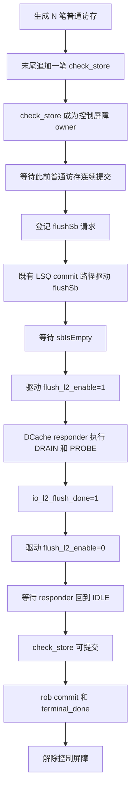

# `check_store` ROB 屏障与 L2Cache Flush Flow 草案

| 项目 | 内容 |
|---|---|
| 状态 | 设计草案，尚未实现 |
| 日期 | 2026-08-13 |
| 适用范围 | `mem_ut_uvm_v2` 分支的 memblock dispatch 测试框架 |
| 目标 | 在全部普通访存之后追加一笔 `op_class=check_store` 控制标记，并以它串行完成 SBuffer 清空和 L2Cache flush |

本文只描述 `check_store` 的抽象处理流程和现有测试框架的复用边界。它独立于 CSR/SFence ROB 屏障草案；`check_store` 不是普通 store，也不承担 SFence 或 L2TLB flush 语义。

## 术语

| 术语 | 含义 |
|---|---|
| `check_store` | 自定义控制标记，表达“此前访存完成后，先清空 SBuffer，再执行 L2Cache flush”。它只占用一个 UID 和连续 `robIdx`，没有地址、LQ/SQ 或普通访存 issue 信息。 |
| 普通访存数 | `MEMBLOCK_MAIN_TRANS_NUM` 配置的普通 load/store 等请求数量，不包含 `check_store`。 |
| 控制屏障 | `check_store` 激活后建立的 admission 闸门。屏障之前的访存可继续推进，屏障之后的 UID 不得新建运行期资源。 |
| `flushSb` | 通过既有公共请求队列提交的 SBuffer 清空请求。请求入队不等于请求已驱动，也不等于 SBuffer 已空。 |
| `sbIsEmpty` | DUT 返回的 SBuffer 已清空状态。既有 ctrl monitor、raw queue 和 commit handler 会将该事实写回公共状态。 |
| `flush_l2_enable` | CSR control agent 驱动给 DUT 的 L2Cache flush 请求。它是保持型 level，必须从启动一直保持到 flush 完成。 |
| `io_l2_flush_done` | DCache responder 在自身 L2 flush 完成后驱动给 DUT 的完成 level。本草案将它作为 L2 flush 阶段的唯一完成事实。 |
| `dynamic_epoch` | 同一 UID 在 redirect/reissue 后的运行期实例编号。所有请求和完成事实都必须与 `uid + dynamic_epoch` 绑定。 |
| L2 flush owner | 当前唯一有权保持或撤销 `flush_l2_enable` 的控制动作身份，固定为 `uid + dynamic_epoch + action_generation`。 |
| action generation | 同一 control owner 的一次 L2 flush 生命周期编号。它在动作启动时分配，在 reset/abort 时失效，用于拒绝旧 done level。 |
| done observation | DCache monitor 对 `io_l2_flush_done` 的原始采样记录，至少包含 level、单调 observation 序号和 reset epoch；它不直接修改控制状态表。 |

## 总体 Flow



整个动作只有一个方向：前序访存先完成，`check_store` 才开始；SBuffer 先清空，L2Cache flush 才开始；L2Cache flush 完成并且请求已经撤销后，`check_store` 才能提交。任一阶段未完成，都不得提前进入下一阶段。

## 主表生成 Flow

自动建表时，`MEMBLOCK_MAIN_TRANS_NUM` 继续表示普通访存数量。若配置为 `100`，主表先生成 UID `0` 到 `99` 的 100 笔普通访存，再在 UID `100` 固定追加一笔 `check_store`，因此主表实际长度为 101。同理，配置为 `10000` 时，UID `0` 到 `9999` 为普通访存，UID `10000` 为第 10001 笔 `check_store`。

`check_store` 的 `robIdx` 由现有连续 ROB 分配器取得，因此它与前一笔普通访存保持 ROB 连续关系。它不进入 LSQ，不分配 `lqIdx` 或 `sqIdx`，不进入 load、STA 或 STD issue queue，也不生成地址、翻译、writeback 或普通 store 数据。

自动主表每次只追加一笔，且只能追加在末尾。它不参与随机 `op_class` 权重，也不进入地址复用的 load/store 候选集合。手工主表保持原有语义，不自动追加；需要覆盖该场景的 directed testcase 应显式构造同一类 `check_store` 条目。

由于当前 `check_store` 固定在末尾，它后面没有同一主表的年轻 UID。此时屏障的实际作用是保证它不会越过此前的普通访存开始 flush。仍保留通用屏障语义，是为了后续支持将控制标记放入主表中间位置时无需重做生命周期。

## 激活与前序提交 Flow

当 `check_store` 被 admission 为 active 条目后，它成为当前唯一的控制屏障 owner。年龄小于它的普通访存继续沿既有 LSQ、issue、writeback 和 ROB commit 路径完成；年龄大于它的条目不得继续 admission，也不能因此抢先占用 LSQ 或 issue 资源。

控制状态机等待既有提交前缀到达该 UID。这个条件说明此前所有 UID 已经以连续 ROB 顺序完成提交或已进入框架允许的终态。状态机不需要每拍扫描主表来确认“前面的访存是否都完成”，而是复用现有提交游标作为前序完成证明。

前序完成后，`check_store` 不会进入普通访存提交流程，而是启动属于自身 `uid + dynamic_epoch` 的控制动作。该身份会贯穿后续的 `flushSb` 请求、L2 flush 请求、完成确认和最终提交，避免旧实例或其他 producer 的完成信号误推进当前控制条目。

## SBuffer 清空 Flow

首先，`check_store` 向既有 `flushsb_req_q` 登记一笔带 owner 的 `flushSb` 请求。这里的“登记”只表示请求进入公共队列；控制状态不能因调用 `push_flushsb_request()` 返回而认为 DUT 已经收到了 `flushSb`。

现有 LSQ commit sequence 是唯一的 `flushSb` driver。它在正常 service 周期内从公共队列取出请求，把 `flushSb` 合并到当前 `lsqcommit` transaction，并通过 `mark_flushsb_driven()` 把该请求设置为 active。此后公共状态进入等待 SBuffer 清空的阶段，在该阶段不会再取出第二笔 `flushSb` 请求。

ctrl monitor 会在等待阶段持续观察 `io_mem_to_ooo_sbIsEmpty`。该观察结果按照既有 raw ctrl、deferred service 和 `lsq_commit_handler` 链路进入 `update_sb_is_empty()`。只有当前 active 请求仍属于该 `check_store`，并且该路径确认 `sbIsEmpty=1` 时，SBuffer 清空阶段才完成。

`check_store` 不应自行创建第二个 `flushSb` driver，也不应新开线程直接读取 `io_mem_to_ooo_sbIsEmpty`。它只消费既有公共状态中与自身 owner 匹配的完成结果。这样既有 periodic 或 directed `flushSb` producer 不会和本专项争用接口或误用同一个空缓冲完成。

## L2Cache Flush Flow

确认 SBuffer 已空后，`check_store` 才启动 L2Cache flush。它通过专用 CSR 控制动作将 `io_ooo_to_mem_csrCtrl_flush_l2_enable` 驱动为 1，并保持该 level。普通随机 CSR xaction 对该字段的默认约束不适合这个专项，因此这里需要一条受控制状态机管理的 assert/release 路径，而不是让随机 CSR item 偶然驱动出 1。

DCache responder 观察到 `flush_l2_enable=1` 后，复用现有 L2 flush 状态机处理请求。它先进入 `DRAIN`，让 flush 开始前已经建立的 D/E/B/C owner 自然收敛；随后进入 `PROBE`，固定当前 cache line 快照，逐条向 L2Cache 发出 Probe，并等待必要的回应和脏数据处理完成。在 `DRAIN` 和 `PROBE` 期间，responder 不再接受新的普通 A 请求。

当所有待处理 cache line、Probe 和回复都已完成后，DCache responder 进入 `DONE`，并将 `io_l2_flush_done` 保持为 1。`check_store` 以该 DCache responder 已驱动的 `io_l2_flush_done=1` sample 作为本专项的唯一 L2 flush 完成事实。`io_mem_to_ooo_topToBackendBypass_l2FlushDone` 可以用于观察或一致性检查，但不应再作为第二个独立 completion 来重复推进同一控制条目。

观察到完成后，控制状态机发送 `flush_l2_enable=0` 以撤销请求。DCache responder 在 `DONE` 中观察到请求撤销后才回到 `IDLE`，同时撤销 `io_l2_flush_done`。因此 `check_store` 不能在看到 done 的同一刻直接进入 ROB commit；它还必须等待 request release 已完成，确认该轮 L2 flush 生命周期已经闭合。

本专项中的 CSR 动作只用于维持 `flush_l2_enable` 的请求 level。它不把发送的 CSR xaction 作为完成 snapshot，也不复用 CSR runtime snapshot 作为 L2 flush 完成条件；真正的完成事实始终是 DCache responder 的 `io_l2_flush_done` 以及随后完成的 request release。

### CSR action profile 与保持型驱动

`check_store` 复用 `memblock_csr_control_base_sequence`、`csr_control_action_q`、
`csr_control_action_available_ev`、`configure_csr_control_xaction()` 和 `drive_csr_control_xaction()`，但 token 的
completion profile 必须显式为 `L2_FLUSH_LEVEL`，不得按普通 CSR 的 `RUNTIME_CSR_SNAPSHOT` 处理。token 至少保存：

```text
owner_uid + owner_dynamic_epoch + action_generation
completion_profile = L2_FLUSH_LEVEL
phase = ASSERT / HOLD / RELEASE
```

单次把 `flush_l2_enable=1` 交给 CSR driver 不构成“保持”。现有 CSR driver 在没有下一笔 item 时会进入 idle，并把该字段驱回 0；
而 DCache responder 在 `DRAIN` 或 `PROBE` 看到 request 被撤销会报错。因此 `L2_FLUSH_LEVEL` worker 必须从 ASSERT 开始持续产生
`flush_l2_enable=1`、`pre_pkt_gap=0`、`post_pkt_gap=0` 的 CSR xaction，直至当前 owner 已消费匹配的 done-high 事实。每次
`start_item/finish_item` 只表示一拍接口交付；worker 在该 item 完成后若尚未 done，必须立即准备下一笔 HOLD item，不能在两笔高电平
item 之间等待 event 或让 driver 走 idle。

完成事实到达后，worker 构造一次 `flush_l2_enable=0` 的 RELEASE item；RELEASE 发出后，driver idle 保持 0 是合法的。普通 CSR
snapshot profile 的 `CSR_SENDOVER` 不能作为 L2 flush 完成状态：L2 profile 的每一次接口交付只记录对应 ASSERT/HOLD/RELEASE 的
sendover 事实，控制状态机仍必须继续等待 done-high 或 done-low。

CSR sequencer 在 `L2_FLUSH_LEVEL` 生命周期内必须只有一个 producer owner。最小第一版采用控制基础 sequence 独占该 sequencer 从
ASSERT 到 RELEASE 的整个区间；启用 `check_store` L2 flush 的 testcase 不得并行启动 legacy generic CSR default sequence，也不得让
其他 CSR action token 插入 HOLD item 之间。不能仅依赖 UVM priority 假定不会插入低电平 item，因为任意 generic CSR item 或 driver
idle 都会违反本 level handshake。

### Done 原始观察、归属与释放闭环

现有 DCache responder 已产生 `io_l2_flush_done`，但当前 DCache monitor 只采样和做 X/Z 检查，尚未向控制状态机发布可归属的完成事实。
本专项实施时只增加一个有界的原始观察槽，例如 `l2_flush_done_observation`，由 DCache monitor 每个有效 sample 覆盖发布：

```text
valid + level + observation_seq + reset_epoch
```

它是“最新观察值”，不是每拍无限增长的 raw queue，也不直接写 `status_transaction`。控制状态机在中频 service 路径读取这个槽，并用
owner 的 `action_generation` 和动作阶段完成归属。DCache monitor 不需要知道 UID、ROB 或 `check_store` 状态。

具体闭环固定如下：

```text
1. ASSERT 前：确认当前 done observation 为低，并记录 assert_baseline_observation_seq；
   若 done 已高或尚无有效低基线，不启动新一轮 L2 flush，报告状态不一致。
2. ASSERT/HOLD：仅接受 observation_seq 大于 assert baseline 的 done=1；
   首次匹配后将该 generation 标记为 done_high_consumed，并停止产生新的 HOLD item。
3. RELEASE：记录 release_baseline_observation_seq，发送 flush_l2_enable=0。
4. WAIT_IDLE：仅接受 observation_seq 大于 release baseline 的 done=0；
   该低电平说明 responder 已在 DONE 中看见 request 撤销并回到 IDLE，随后才进入 commit-ready。
```

同一 generation 的 done-high、done-low 各只能消费一次。旧 high level、重复采样、reset 前 observation 或其他 owner 的完成事实不能推进
当前 `check_store`。`io_mem_to_ooo_topToBackendBypass_l2FlushDone` 只可作为 debug/一致性观察，不能成为第二个状态推进来源。

## 提交与屏障解除 Flow

只有以下事实全部成立时，`check_store` 才进入 `CHECK_STORE_COMMIT_READY`：此前普通访存已经连续提交；属于自己的 `flushSb` 已确认完成；`flush_l2_enable` 已经启动过 L2 flush；`io_l2_flush_done` 已被唯一消费；`flush_l2_enable` 已撤销，并且 DCache responder 已回到空闲状态。

进入 commit-ready 后，`check_store` 使用现有 ROB commit 和 retire 主路径完成自身 `robIdx` 的提交。它不要求普通访存才有的 writeback、LSQ deq、地址翻译或 issue target done。控制条目成功提交后，既有 terminal 路径将它标记为 `terminal_done`，并更新终态前缀。

只有 `terminal_done` 成立后，才清除 `active_check_store_barrier_uid`。若未来主表允许在 `check_store` 后继续放置条目，后续 UID 必须在下一次 admission/service 边界才能重新进入 admission、LSQ 入队和 issue；不能与屏障状态更新同拍越过控制条目。

## 建议的控制状态

| 状态 | 自然语言含义 | 进入下一状态的事实 |
|---|---|---|
| `CHECK_STORE_WAIT_OLDER_COMMIT` | 控制标记已成为屏障 owner，等待此前普通访存完成。 | 提交前缀到达该 UID。 |
| `CHECK_STORE_FLUSHSB_PENDING` | 已登记带 owner 的 `flushSb` 请求，等待既有 LSQ commit consumer 取走并驱动。 | 请求成为 active `flushSb`。 |
| `CHECK_STORE_WAIT_SB_EMPTY` | `flushSb` 已发出，等待既有 ctrl 链路确认对应 SBuffer 已空。 | 匹配 owner 的 `sbIsEmpty` 完成。 |
| `CHECK_STORE_L2_CSR_ASSERT` | SBuffer 已空，分配当前 action generation，确认 done-low 基线后发送首笔 `flush_l2_enable=1`。 | ASSERT item 已交付，进入保持型 request 阶段。 |
| `CHECK_STORE_WAIT_L2_FLUSH_DONE` | CSR control worker 连续发送 `flush_l2_enable=1` 的 HOLD item；DCache responder 正在 DRAIN/PROBE。 | 本 generation 在 assert baseline 之后唯一消费到 `io_l2_flush_done=1`。 |
| `CHECK_STORE_L2_CSR_RELEASE` | L2 flush 已完成，停止 HOLD，记录 release baseline 并发送 `flush_l2_enable=0`。 | RELEASE item 已交付，进入等待 responder 退出 DONE。 |
| `CHECK_STORE_WAIT_L2_FLUSH_IDLE` | request 已撤销，等待新于 release baseline 的 `io_l2_flush_done=0`。 | responder 已离开 `DONE` 并回到 `IDLE`。 |
| `CHECK_STORE_COMMIT_READY` | 所有控制动作均已闭合，允许走专用 commit candidate 分支。 | `rob_commit`。 |
| `terminal_done` | 控制条目已经 retire。 | 清除 barrier，并允许后续 UID 继续 admission。 |

## Redirect、reset 与异常边界

每个控制动作都必须检查 `uid + dynamic_epoch + action_generation`。redirect 或 global flush 取消一个 `check_store` 实例时，旧实例的 `sbIsEmpty` 或 L2 done 都不能完成 redirect 后的新实例。尚未被 LSQ commit consumer 取走的 `flushSb` 请求可以按 owner 取消；已经成为 active 请求的条目必须走明确清理路径，避免公共 `flushsb_waiting_empty` 永久占用。

L2Cache flush 已进入 DCache responder 的 `DRAIN` 或 `PROBE` 后，不应悄悄撤销 `flush_l2_enable` 并把该动作当作已取消。初版应把这类 redirect/cancel 视为专项错误，或在实现前与 DUT 协议确认可行的取消规则。reset 时则必须同时清除屏障 owner、控制 token、CSR sequencer 独占状态、owner 关联、L2 completion generation 和等待状态，不能把 reset 前仍为高的 done level 误认为新一轮完成。

`io_l2_flush_done` 是保持型 level，因此同一轮完成只能消费一次。控制状态需要以当前 action generation 和 `dynamic_epoch` 记账，不能因为 done 在多个 service 周期保持为 1 而多次推进状态；同样，RELEASE 后只有观察到新的 done-low 才能证明 responder 已回到 IDLE。

## 最小改动与复用边界

本方案只在主表、状态表、admission gate 和 control commit candidate 增加 `check_store` 分流。普通 load/store 的随机、LSQ 分配、issue、writeback、deq、TLB 和地址模型保持不变。

`flushSb` 复用既有公共队列、LSQ commit consumer、ctrl monitor 和 `update_sb_is_empty()`，只需要补充能够标识 `check_store` 实例的 owner 信息及其完成回写。L2Cache flush 复用既有 DCache responder 的 `IDLE -> DRAIN -> PROBE -> DONE` 状态机，不复制 Probe、缓存 line 或 memory responder 逻辑。CSR control agent 复用控制基础 sequence 和 action token 架构，只增加 `L2_FLUSH_LEVEL` profile 的保持型 `flush_l2_enable` assert/hold/release 路径及其 sequencer 单一 owner 约束，不建立新的 CSR agent。

明确不做以下事情：不把 `check_store` 伪装成普通 store；不让它进入 LSQ 或 issue queue；不增加新的 `flushSb` agent/driver/monitor；不复制 DCache L2 flush 状态机；不把 L2TLB 或 SFence flush 链路当作 L2Cache flush 的完成机制；不把 `io_l2_flush_done` 和 backend bypass done 同时当作两个完成事件。

## 端到端完成语义

一笔 `check_store` 的成功终态必须能用自然语言表述为：此前的普通访存先完成；框架随后请求并确认 SBuffer 已空；接着保持 `flush_l2_enable` 发起 L2Cache flush；DCache responder 完成 drain、probe 和脏数据处理后给出 `io_l2_flush_done`；框架撤销该请求并等待 responder 回到空闲；最后才让 `check_store` 自身 ROB commit 并进入 `terminal_done`。

其中任一顺序被倒置、其他 UID 的 `sbIsEmpty` 或 done 被误绑定、同一 done 被重复消费，或者 `terminal_done` 前就解除屏障，都应视为 `check_store` flow 的错误，而不是普通访存结果差异。
