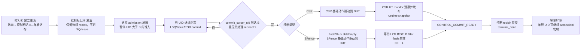

# CSR/SFence ROB 控制屏障流程草稿（V2）

| 项目 | 内容 |
|---|---|
| 状态 | 主体已实现；保留原始草案作为设计决策记录 |
| 日期 | 2026-08-13 |
| 适用范围 | `mem_ut_uvm_v2` 分支的 memblock dispatch 测试框架 |
| 目标 | 在访存主表中插入带连续 `robIdx` 的 CSR/SFence 控制标记，并以该标记建立顺序屏障 |

本文原始内容是对拟议行为的抽象说明。2026-08-14 已按
`AI_DOC/plan/test_framework/plan/do/csr_sfence_check_store_rob_control_coding_plan_20260813.md`
完成实现；归档后以该 plan、implementation review 与当前源码为准。本文保留原始草案用来解释设计决策，若与下列“实现对齐”冲突，必须以后者为准。

## 实现对齐（2026-08-14）

- 控制 worker 使用第二种启动方式：仅 `basicTest` 的 `memblock_dispatch_real_smoke_vseq`（AUTO）与 `memblock_dispatch_manual_control_vseq`（MANUAL_CONTROL）通过 `p_sequencer` 显式启动；任何 legacy testcase 或无关 VSEQ 请求 active mode 均 fail-fast。
- `flushSb` 已从单一 `mark_flushsb_driven()` 拆为 `mark_flushsb_request_attached_to_lsqcommit_xaction()` 和 `mark_flushsb_request_driver_sendover()`。attached 仅代表请求附加到 xaction；sendover 发生在 `finish_item()` 返回后，才打开 `sbIsEmpty` 消费，并冻结新鲜 observation 序号下界。
- `sbIsEmpty` 由 ctrl monitor 每个有效 sample 发布 owner-neutral latest observation，deferred raw 保存 immutable observation 序号；`update_sb_is_empty(raw)` 仅完成 sendover 后、序号更新且 level=1 的 active 请求。owner 请求随后由 service 以 `req_id + owner` 消费。
- SFence 只有在 owner `flushSb` completion 后入 `sfence_control_action_q`；worker 在 `start_item()` 前 arm C0，`finish_item()` 后仅进入 `SFENCE_SENDOVER`，再等待 C0 record 与 C4 effective record。C0/C4 采用现有 L2TLB lifecycle，不用固定两拍或固定等待替代。
- CSR 最终归档的是 CSR monitor 发布的 runtime snapshot；driver sendover 只记录接口交付。`flush_l2_enable` 不属于 CSR snapshot completion，属于 `check_store` 的独立 L2 level 闭环。

## 术语与边界

| 术语 | 本草稿中的含义 |
|---|---|
| 控制标记 | 主表中 `op_class` 为 CSR 或 SFence 的条目。它只有 UID、连续 `robIdx` 和控制类型，不携带普通访存请求字段。 |
| 控制屏障 | 控制标记激活后对年轻 UID 建立的 admission 闸门；老 UID 仍可正常入队、发射和提交。 |
| admission | 主表条目进入运行期 active 状态、进入 LSQ 或 issue queue 之前的准入阶段。 |
| 提交前缀 | `lsq_commit_handler.commit_cursor_uid` 所代表的已连续完成 UID 前缀。游标到达控制标记 UID，说明其前面的条目已经按 ROB 顺序完成提交和终态回收。 |
| 动态实例 | 同一 UID 经 redirect/reissue 后的不同运行期实例，以既有 `dynamic_epoch` 区分。控制标记只有开始实际 CSR/SFence 动作后，才把当时的 `dynamic_epoch` 绑定为本次控制动作实例的 owner。 |
| 静态等待屏障 | 控制标记处于 `WAIT_OLDER_ROB_COMMIT` 时的形态。它只阻止年轻 UID 准入，尚未创建 action token、`flushSb` 请求或 CSR/SFence 接口动作，也不属于普通访存 redirect/reissue 的动态执行实例。 |
| action token | 由控制状态机写入、由 CSR/SFence 基础 sequence 消费的持久工作项，至少携带 `uid + dynamic_epoch`。它必须进入对应持久 queue；事件只用于唤醒 worker，不能单独代表动作事实。 |
| CSR action queue | `csr_control_action_q`，保存等待 CSR 接口发射的 action token。它是基础 CSR sequence 的唯一动作来源。 |
| CSR action event | `csr_control_action_available_ev`，在 token 成功写入 `csr_control_action_q` 后触发，用于唤醒空闲的基础 CSR sequence；它不携带 UID，也不替代 queue。 |
| SFence action queue | `sfence_control_action_q`，保存已完成 `sbIsEmpty` 确认、等待 SFence 接口发射的 action token。它是基础 SFence sequence 的唯一动作来源。 |
| SFence action event | `sfence_control_action_available_ev`，在 token 成功写入 `sfence_control_action_q` 后触发，用于唤醒空闲的基础 SFence sequence；它不携带 UID，也不替代 queue。 |
| CSR runtime snapshot | CSR UT monitor 从 DUT interface 观察并发布的最新运行时 CSR 状态，权威来源为 `memblock_sync_pkg::runtime_csr_snapshot`；`runtime_csr_snapshot_seq` 是其单调发布序号。 |
| 完成 profile | action token 对完成事实的显式分类。普通 CSR 初版只允许 `RUNTIME_CSR_SNAPSHOT`；`flush_l2_enable` 属于 `L2_FLUSH_LEVEL` 专项 profile，使用独立的 request/done 闭环。 |
| 控制间隔 | 主表生成阶段中，当前 UID 到下一次同类控制标记目标 UID 之间的距离。本文所说的“最小次数/最大次数”均按该间隔理解。 |
| 下一目标 UID | CSR 或 SFence 随机计划当前预约的控制标记 UID。CSR 和 SFence 各自维护独立的下一目标。 |

控制标记不是 load/store 的变体：不分配 `lqIdx`/`sqIdx`，不进入 LSQ，不进入 load/STA/STD issue queue，也不要求普通访存的
writeback、feedback 或地址翻译结果。CSR 配置内容和 SFence payload 仍由对应基础测试用例/sequence 管理；主表标记只表达
“在此 ROB 位置执行一次 CSR 或 SFence 控制动作”。

## 设计目标

1. CSR 配置或 SFence 在其前面的访存 ROB 条目提交完成后才可执行。
2. 控制标记占用连续 `robIdx`，因此其前后访存条目在软件侧保持统一的 ROB 顺序。
3. 控制标记等待期间，阻止其后的 UID admission、LSQ 入队和发射；其前面的条目不受阻塞。
4. CSR 动作真实驱动到 DUT 接口、且 CSR UT monitor 已观察并发布匹配的 runtime snapshot 后才可走 ROB commit；SFence 则还必须等待其 L2TLB/DTLB filter flush 生效后才可走 ROB commit。只有 `terminal_done` 后才解除年轻 UID 的阻塞。
5. 最大复用现有 `commit_cursor_uid`、`flushSb` 请求队列、`sbIsEmpty` 回采、CSR/Fence agent 以及现有 L2TLB flush 处理，不新增第二套访存或 L2TLB 流程。
6. 通过建表期 plus 参数控制 CSR/SFence 标记密度；目标 UID 超过主表尾部时放弃本次目标，不为控制标记扩展主表长度。

## 主表生成期随机控制标记

### 参数定义

CSR 和 SFence 各提供三组 plus 参数，共六个参数。具体 key 名称可按现有 `seq_csr_common` 与 plus 参数命名风格确定；本草稿只
规定语义：

| 控制类型 | 使能开关 | 最小间隔 | 最大间隔 |
|---|---|---|---|
| CSR | `CSR_CONTROL_ENABLE` | `CSR_CONTROL_MIN_INTERVAL` | `CSR_CONTROL_MAX_INTERVAL` |
| SFence | `SFENCE_CONTROL_ENABLE` | `SFENCE_CONTROL_MIN_INTERVAL` | `SFENCE_CONTROL_MAX_INTERVAL` |

参数约束：

- `enable=0` 时，该类控制标记不生成；对应的 min/max 不参与预约。
- `enable=1` 时要求 `min_interval >= 1`，并要求 `max_interval >= min_interval`；非法配置在主表生成前直接报错。
- 每次预约使用闭区间 `[min_interval:max_interval]` 随机生成一个间隔值。
- 间隔以“当前控制计划基准 UID”为起点计算，不以最近一次普通访存 UID 重新解释。
- 目标 UID 大于等于 `main_trans_num` 时，放弃该次目标，不扩展主表，也不把它截断到表尾。

### 双计划预约规则

主表生成器在建表开始时分别初始化 CSR 与 SFence 的下一目标计划。每类计划包含 `enabled`、当前基准 UID、随机间隔和下一目标
UID；两类计划互不共享随机距离。

抽象行为如下：

```text
初始化 CSR 计划：
  若 CSR enable=1，则以初始建表基准 UID 生成 CSR 间隔并得到 csr_next_uid；
  若 CSR enable=0，则 CSR 计划无目标。

初始化 SFence 计划：
  若 SFence enable=1，则以初始建表基准 UID 生成 SFence 间隔并得到 sfence_next_uid；
  若 SFence enable=0，则 SFence 计划无目标。

逐 UID 生成主表：
  1. 读取当前 UID。
  2. 判断当前 UID 是否命中 CSR 目标和 SFence 目标。
  3. 若同时命中，设置 CSR 控制标记，CSR 优先；SFence 本次目标视为已处理并从当前 UID 重新预约。
  4. 若仅命中 CSR，设置 CSR 控制标记，并从当前 UID 重新预约 CSR 下一目标。
  5. 若仅命中 SFence，设置 SFence 控制标记，并从当前 UID 重新预约 SFence 下一目标。
  6. 若未命中任何目标，按原有访存主表规则生成普通条目。
  7. 任何新预约目标若超出主表尾部，则放弃该目标；后续不再为该类控制标记生成新的目标。
```

### 目标重合与优先级

CSR 和 SFence 的下一目标 UID 可能相同。一个 UID 只能生成一个主表条目，因此采用固定优先级：**CSR 优先于 SFence**。

当 `current_uid == csr_next_uid == sfence_next_uid` 时：

1. 当前 UID 的 `op_class` 设置为 CSR。
2. CSR 计划以当前 UID 为基准重新随机下一目标。
3. SFence 计划的当前目标也视为已消费，并以当前 UID 为基准重新随机下一目标；不能保留原目标，否则下一轮会重复命中同一 UID。

当只命中一类目标时，只更新被命中的那一类计划；另一类计划保持原预约不变。这样可以保留两类控制标记各自的间隔分布。

例如主表总长度为 `200`，CSR 开启且参数为 `[10:100]`：若初始基准 UID 为 `0`，第一次随机得到 `15`，则预约 UID `15`
为 CSR；生成 UID `15` 后，重新在 `[10:100]` 随机，例如得到 `30`，下一次预约 UID `45`。SFence 按自身参数和自身当前
基准独立执行同样过程。若某次 CSR 与 SFence 同时预约 UID `45`，则 UID `45` 生成 CSR，SFence 的旧预约也在该 UID 被消费，
随后从 UID `45` 重新随机下一次 SFence 目标。

### 目标超过主表尾部

主表长度在随机控制标记计划之外已经确定。若某次随机得到的目标 UID `>= main_trans_num`：

- 该次目标直接放弃；
- 不新增控制标记；
- 不扩展 `main_trans_num`；
- 不把目标折算为最后一个 UID；
- 该类计划进入“无后续目标”状态，不再继续随机预约。

因此，主表尾部附近可能没有 CSR/SFence 标记，即使对应 enable 已开启，这属于参数和随机结果共同决定的正常结果。

### 与主表普通条目的关系

控制标记的插入只发生在主表构建阶段。插入控制标记时：

- UID 仍按主表顺序递增；
- `robIdx` 仍从同一连续分配路径取得；
- LQ/SQ 字段保持无效；
- 不执行普通访存地址、FuType、LSQ 行为或 issue target 构造；
- 控制标记之后的普通 UID 是否最终进入运行期，由后续 admission 屏障决定，而不是由建表阶段删除或延迟 UID。

随机预约不改变运行期控制标记状态机。建表阶段只决定“哪些 UID 是 CSR/SFence 标记”，运行期仍按后文的
`WAIT_OLDER_ROB_COMMIT -> action -> 对应完成事实等待 -> CONTROL_COMMIT_READY -> terminal_done` 流程执行。

## 总体流程



这里的 `commit_cursor_uid == 控制标记 UID` 是前序完成证明，而不是每个 service cycle 扫描全部历史状态表。该判断比
“前序访存已经提交”更保守：它要求前序条目形成连续终态前缀，因而也自然处理前序 replay、fault 或 redirect 的恢复过程。
控制标记只能在本轮 redirect-first 仲裁和 redirect recovery 都已经完成、且不存在 active/pending redirect 时穿过该边界，开始创建
CSR/SFence 动作。前序 UID 的 redirect 在此之前发生时，控制标记保持静态等待，不创建或重建控制动作。

## 主表、状态表与准入行为

### 主表与状态表

- `memblock_op_class_e` 增加 CSR 与 SFence 两类控制标记；最终枚举名可沿用现有命名风格。
- 主表分配 `robIdx` 时，控制标记与相邻访存条目使用同一连续分配器。控制标记的 LQ/SQ key 保持无效。
- `status_transaction` 为控制标记保存控制类型、静态等待/动作执行状态；动作开始后再保存已绑定的 `dynamic_epoch` 对应完成信息、
  CSR monitor 已观察的 runtime snapshot 及其发布序号，或 SFence `flushSb` 请求归属等少量控制元数据。
- CSR 状态表中的 snapshot 必须从 `memblock_sync_pkg::runtime_csr_snapshot` 克隆，不能从基础 CSR sequence 已发送的
  `csr_ctrl_agent_agent_xaction` 克隆。后者只用于本次控制动作的临时配置和匹配，不能证明 DUT interface 已被 monitor 观察到。
- `WAIT_OLDER_ROB_COMMIT` 中的控制标记保留其静态 UID/`robIdx` 和屏障 owner 身份，但不进入普通访存 active window、LSQ
  redirect/reissue 扫描或 issue queue；前序 redirect 不得使该标记递增 `dynamic_epoch`、取消屏障或创建新的控制动作实例。

### 准入屏障

当 admission 前缀到达最老的未完成控制标记时，它成为唯一的 `active_control_barrier_uid`。此时它先是静态等待屏障，而不是普通访存
动态实例：

1. 该标记进入 `WAIT_OLDER_ROB_COMMIT`，但不走 LSQ、issue 或普通 active UID 路径，也不产生 action token。
2. UID 小于该标记的既有访存继续按当前框架正常推进；其 replay、fault 或 redirect 仍按既有恢复逻辑处理。
3. UID 大于该标记的条目不能新建运行期资源，因而不会抢先 LSQ 入队或发射。
4. 前序 redirect 恢复期间，控制标记保持静态等待；它不走普通 redirect cancel/reissue，也不递增自己的 `dynamic_epoch`。
5. 只有 `commit_cursor_uid == 控制标记 UID`，且本轮 redirect-first 仲裁与 recovery 已完成、没有 active/pending redirect 时，才绑定
   当前 `dynamic_epoch` 并开始 CSR 或 SFence 动作。
6. 标记 `terminal_done` 后清除该 owner，准入游标继续向后推进；若下一条是新的控制标记，则由它建立下一道屏障。

该屏障只补充正常 admission 的顺序条件，应与现有 redirect/global flush 闸门并列使用，不能取代后者。

## CSR 控制标记 Flow

CSR 标记不在主表中保存“本次修改哪些 CSR”的细节。测试场景在基础 CSR sequence 中选择配置，控制标记只规定这次配置必须落在
指定 ROB 位置之后。基础 sequence 发送的 `csr_ctrl_agent_agent_xaction` 只是驱动命令，不能作为本控制标记归档的 CSR snapshot。

| 控制状态 | 进入条件 | 抽象行为 | 离开条件 |
|---|---|---|---|
| `WAIT_OLDER_ROB_COMMIT` | 控制标记已成为静态屏障 owner。 | 保持年轻 UID admission 阻塞，允许前序访存按既有 redirect/reissue 恢复；不创建 action token，也不改变控制标记的 `dynamic_epoch`。 | `commit_cursor_uid == uid`，且本轮 redirect-first/recovery 已完成、无 active/pending redirect。 |
| `CSR_CONFIG_PENDING` | 前序 ROB 已形成稳定提交前缀。 | 绑定当前 `dynamic_epoch` 作为本次控制动作 owner；写入对应 CSR action token，并在基础 CSR sequence 驱动前记录 `runtime_csr_snapshot_seq_before_drive`，随后由该 sequence 选择配置并驱动接口。 | CSR driver 已完成本次接口驱动。 |
| `CSR_SENDOVER` | CSR driver 已完成本次接口驱动。 | 保持 admission 屏障；驱动 xaction 仅保留为短生命周期的 expected runtime CSR 字段，不写入 status snapshot。 | 进入 `WAIT_CSR_RUNTIME_SNAPSHOT`。 |
| `WAIT_CSR_RUNTIME_SNAPSHOT` | 已完成接口驱动。 | 等待 CSR UT monitor 发布本控制动作之后、且与 expected runtime CSR 字段匹配的 `runtime_csr_snapshot`；将该 monitor snapshot 及 `runtime_csr_snapshot_seq` 克隆到状态表。 | 匹配 snapshot 已发布并完成状态表归档。 |
| `CONTROL_COMMIT_READY` | CSR runtime snapshot 已由 UT monitor 观察、发布并归档。 | 不再要求访存 writeback 或 issue target done，等待控制 ROB 提交。 | `rob_commit`。 |
| `terminal_done` | 控制 ROB 已提交并被现有 retire 路径处理。 | 释放 admission 屏障。 | 后续 UID 可准入。 |

CSR action 的事件可以作为基础 sequence 的唤醒通知，但动作所有权应由持久 token/queue 表示。这样 CSR worker 即使在 token 产生后才启动，
也不会遗漏一次配置请求。

### CSR action 的事件、队列与基础 sequence 契约

CSR 与 SFence 采用同一类 action 调度模型。为使后续 CSR 专项扩展有唯一入口，第一版固定以下名称和职责：

| 层次 | CSR 对象 | 固定职责 |
|---|---|---|
| 基础 sequence | `memblock_csr_control_base_sequence` | 作为唯一 CSR control worker，从 CSR action queue 取得 token，并协调配置与接口交付。 |
| 唤醒事件 | `csr_control_action_available_ev` | 仅唤醒空闲 worker；不携带 owner，不代表 CSR 已驱动或已完成。 |
| 持久工作项 | `csr_control_action_q` | 保存未消费的 CSR action token，是动作存在和顺序的真源。 |
| 配置扩展入口 | `configure_csr_control_xaction()` | 只按 token 的 completion profile 构造 `csr_ctrl_agent_agent_xaction`、expected runtime CSR 字段及短生命周期匹配信息。 |
| 接口驱动封装 | `drive_csr_control_xaction()` | 只执行 `start_item/finish_item`，完成接口交付后把对应 owner 推进到 `CSR_SENDOVER`。 |

控制状态机在 `WAIT_OLDER_ROB_COMMIT` 的前序提交条件满足后，绑定当前 `uid + dynamic_epoch`，再按固定顺序调用
`enqueue_csr_control_action(owner)`：**先**将 token 写入 `csr_control_action_q`，**再**将状态更新为 `CSR_CONFIG_PENDING`，**最后**触发
`csr_control_action_available_ev`。同一个 owner 一旦已离开 `WAIT_OLDER_ROB_COMMIT`，不得因重复 service tick、迟到 event 或旧实例记录再次入队。

`memblock_csr_control_base_sequence` 的取件规则固定为“先查 queue、空时等待 event、被唤醒后再次查 queue”。因此 worker 尚未启动、多个
token 连续到达或 event 先于等待发生时，动作仍由 `csr_control_action_q` 保留，不会因为 event 是瞬时通知而丢失。

`configure_csr_control_xaction()` 不得等待 DUT、驱动 interface、更新完成状态或直接写 `status_transaction`；
`drive_csr_control_xaction()` 不得把 `CSR_SENDOVER` 解释为 runtime snapshot、L2 flush done 或其他 monitor 完成。CSR monitor 继续只发布
`runtime_csr_snapshot` 等原始观察事实，控制状态机/service 才能按唯一 active `uid + dynamic_epoch` 匹配事实并更新状态表。这样 monitor
不需要理解 ROB 所有权，也不会与 admission/commit 状态机并发写同一条控制状态。

### CSR runtime snapshot 的归档边界

CSR 控制标记在驱动前记录 `runtime_csr_snapshot_seq_before_drive`。CSR UT monitor 每个 DUT sample 都观察 interface，并仅在
runtime payload 发生可见变化时通过 `publish_runtime_csr_snapshot()` 更新 `runtime_csr_snapshot` 和
`runtime_csr_snapshot_seq`。因此控制状态机在 `WAIT_CSR_RUNTIME_SNAPSHOT` 中使用以下最小匹配条件：

```text
1. runtime_csr_snapshot_valid = 1；
2. runtime_csr_snapshot_seq > runtime_csr_snapshot_seq_before_drive；
3. monitor snapshot 中的 runtime CSR 字段与本次基础 CSR sequence 选择的 expected runtime CSR 字段一致；
4. 将 monitor snapshot 和其 seq 原样克隆到该 uid + dynamic_epoch 的状态表；
5. 只有归档成功后，CSR 标记才进入 CONTROL_COMMIT_READY。
```

这里不要求主表条目记录 CSR 配置内容。expected runtime CSR 字段只在 action token/基础 sequence 到 monitor 匹配完成的短生命周期内
保存；控制条目最终保存的是 DUT monitor 的观察结果。初版受现有 latest-snapshot 发布语义约束，CSR 基础动作必须产生 monitor 可见的
runtime payload 变化或 changed pulse。若后续要支持“配置值与当前值相同且无 changed pulse”的 no-op CSR 动作，不能把旧 snapshot
误认作本次结果；届时需要补充独立的每拍观察序号或 action acknowledge，而不是回退为记录发送 xaction。

初版普通 CSR action 的 `completion_profile` 固定为 `RUNTIME_CSR_SNAPSHOT`，只能选择 `dispatch_raw_csr_t` 已覆盖、并且
`raw_csr_payload_changed()` 会使 `runtime_csr_snapshot_seq` 前进的字段。未被 snapshot 覆盖的 CSR control 字段不得混入这个 profile；
例如 `io_ooo_to_mem_csrCtrl_flush_l2_enable` 虽会被 CSR monitor 采样，但不写入 `dispatch_raw_csr_t`，也不参与
`raw_csr_payload_changed()`。因此 snapshot 既不能证明该 request 被持续保持，也不能证明 L2Cache flush 已完成。

这类字段必须使用各自的 completion profile 和 DUT monitor 完成事实。本草稿中的 runtime snapshot 仅证明 monitor 已观察到相关 runtime
CSR 配置，不替代 SFence 的 `C0 + 4` filter flush 生效等待，也不替代 L2Cache flush 的 request/done 生命周期。`flush_l2_enable`
专项 profile 的完整流程由 `check_store` 草案定义：保持 request 到 `io_l2_flush_done=1`，再撤销 request，并等待 done 撤销后才能
进入 commit-ready。

## SFence 控制标记 Flow

SFence 先复用现有 `flushSb` 闭环，再执行 SFence 接口动作。当前框架中 `flushSb` 已是公共请求队列模式：控制标记只需写入一笔请求，
由现有 LSQ commit sequence 成为唯一 driver，并由现有 ctrl monitor 回采 `io_mem_to_ooo_sbisempty`。不应再建立第二个
flushSb sequence 或直接竞争消费 raw ctrl 事件。

### 当前 `flushSb` 实现的准确含义

“往 queue 中放一笔请求”仍是 SFence producer 的最小动作，但只表示登记成功，不表示 DUT 已收到 `flushSb` 或 SBuffer 已空。当前真实链路如下：

```text
SFence control service
  -> enqueue_control_flushsb_request()
  -> common_data_transaction::push_owner_flushsb_request()
  -> flushsb_req_q
  -> memblock_lsqcommit_dispatch_base_sequence::send_lsqcommit_cycle()
  -> try_pop_flushsb_request()
  -> lsqcommit xaction.io_ooo_to_mem_flushSb = 1
  -> mark_flushsb_request_attached_to_lsqcommit_xaction()
  -> start_item()/finish_item()
  -> mark_flushsb_request_driver_sendover()
  -> ctrl monitor raw with immutable sb_is_empty_observation_seq
  -> common_data_transaction::update_sb_is_empty(raw)
  -> owner completion slot
  -> SFence control service consumes req_id + owner and enters SFENCE_REQ
```

当前请求有三个精确阶段：

1. **待消费**：请求位于 `flushsb_req_q`；所有 producer 只入队，LSQ commit sequence 是唯一 consumer。
2. **attached**：`try_pop_flushsb_request()` 成功后，sequence 将 `io_ooo_to_mem_flushSb` 置 1，并在 `start_item()` 前调用 `mark_flushsb_request_attached_to_lsqcommit_xaction()`。此时请求已附加到 xaction，但还不能消费 `sbIsEmpty`。
3. **sendover 后等待/完成**：同一 xaction 的 `finish_item()` 返回后调用 `mark_flushsb_request_driver_sendover()`，它冻结 latest observation 序号并打开 `flushsb_waiting_empty`。`update_sb_is_empty(raw)` 只接受序号严格大于该 baseline 的 level=1 raw；owner 请求写入 completed slot，再由 control service 按 `req_id + owner` 消费。

因此 SFence 不能在入队或 attached 后直接进入 `SFENCE_REQ`；必须等待 driver sendover 以及属于自己的新鲜 `sbIsEmpty` 完成。若 LSQ commit sequence 未启用，或 redirect/global flush 正在阻塞，队列请求保持待消费，屏障保持等待。

### SFence action 的事件与队列契约

`flushSb` 与 SFence 接口发射使用两段不同的调度机制，不能把它们合并成同一个 event：

```text
WAIT_FLUSHSB_REQ：
  控制状态机调用 enqueue_control_flushsb_request(status)：
    为当前 uid + dynamic_epoch 构造带 owner 的 flushSb 请求；
    调用 push_owner_flushsb_request() 将请求放入 flushsb_req_q，并回填 req_id；
    不触发 flushSb 专用 event。

  既有 LSQ commit sequence：
    按原有 service cycle 调用 try_pop_flushsb_request()；
    它仍是 flushsb_req_q 的唯一 consumer，并把请求附加到本拍 lsqcommit xaction；
    因此不新增第二个 flushSb driver 或 event consumer。

WAIT_SB_EMPTY：
  ctrl monitor -> raw ctrl -> update_sb_is_empty() 完成当前 owner 的 sbIsEmpty 闭环；
  控制状态机确认 completed owner 与 active uid + dynamic_epoch 一致后：
    调用 enqueue_sfence_control_action(owner)：
      先将 action token 写入 sfence_control_action_q；
      再将控制条目推进到 SFENCE_REQ；
      最后触发 sfence_control_action_available_ev。

memblock_sfence_control_base_sequence：
  先检查 sfence_control_action_q 是否非空；
  若为空，等待 sfence_control_action_available_ev；
  被唤醒后重新检查并从队首取出 action token；
  调用 configure_sfence_control_xaction() 填写本次 fence xaction；
  调用 drive_sfence_control_xaction() 完成本次 start_item/finish_item 接口交付；
  将同一 owner 的控制状态推进到 SFENCE_SENDOVER。
```

`sfence_control_action_available_ev` 只消除 worker 的空闲等待，不可作为完成或所有权判定。基础 sequence 必须始终以
`sfence_control_action_q` 是否非空为准：先查队列、空时才等待 event、被唤醒后再次查队列。这样 action token 先于 worker
启动、多个 token 连续入队或 event 在等待前触发时，都不会丢失一次 SFence 动作。

### SFence 两类事件边界

这里需要明确区分“请求进入既有 `flushSb` 服务链”与“基础 SFence sequence 可以发射接口”的两个时刻：

1. **`WAIT_FLUSHSB_REQ` 不新增 SFence 专用 `flushSb` event。** 控制状态机只通过
   `enqueue_control_flushsb_request(status)` 和 `push_owner_flushsb_request()` 将带 owner 的请求放入既有 `flushsb_req_q`。该 queue 是 `flushSb` 请求的真源，
   既有 LSQ commit sequence 在其正常 service cycle 中轮询并消费该 queue；因此这里不存在“SFence event 驱动 flushSb”的新路径，
   也不能增加第二个 consumer。`flushSb` 实际被附加到 `lsqcommit` xaction 的确认，仍由既有
   `mark_flushsb_request_attached_to_lsqcommit_xaction()` 记录。
2. **匹配的 `sbIsEmpty` 完成后需要一个 SFence action 唤醒事件。** `update_sb_is_empty()` 或其上层先发布带 owner 的完成记录；
   控制状态机只在当前条目仍为 `WAIT_SB_EMPTY`、且完成 owner 等于 active `uid + dynamic_epoch` 时，执行一次不可重复的交接：
   先将 action token 写入 `sfence_control_action_q`，再把该条目更新为 `SFENCE_REQ`，最后触发
   `sfence_control_action_available_ev`。event 必须最后触发，保证被唤醒的基础 sequence 一定能看到已入队 token 和已更新状态。
3. **基础 SFence sequence 由 queue 和 event 配合驱动。** 它以 `sfence_control_action_q` 为动作依据，event 只负责从空闲等待中唤醒；
   被唤醒后重新检查 queue，再消费 token、配置并驱动 SFence 接口。若 worker 尚未启动或 event 已先发生，首次查 queue 仍会消费
   留存 token，因而不依赖 event 的瞬时脉冲。

同一 owner 的完成记录只能完成一次上述交接。重复的 `sbIsEmpty=1` level、迟到 raw ctrl 或其他请求的完成记录均不得再次入队或再次
触发 `sfence_control_action_available_ev`；状态已离开 `WAIT_SB_EMPTY` 即视为该交接已经完成。

`configure_sfence_control_xaction()` 是后续 SFence payload 扩展的唯一入口：它只依据 action token 构造
`fence_agent_agent_xaction` 和用于 monitor 匹配的短生命周期 expected 字段，不等待 DUT、不会修改完成状态。
`drive_sfence_control_xaction()` 只负责将已配置 xaction 交给 Fence agent driver，并记录接口交付结束；它不能把
`SFENCE_SENDOVER` 误判为 monitor C0 或 L2TLB flush 完成。

实现已将旧 `mark_flushsb_driven()` 拆成一对语义固定的 helper：
`mark_flushsb_request_attached_to_lsqcommit_xaction()` 只记录“已附加到待发送 xaction”；
`mark_flushsb_request_driver_sendover()` 只在 `finish_item()` 返回后记录 driver 交付、打开 waiting-empty 并冻结 observation baseline。
两者共同避免把 queue 消费误写成 DUT 接口交付或 `sbIsEmpty` 完成；不新增 pin monitor、第二个 driver 或第二个 consumer。

当前 `lsqcommit` xaction 可以在同一拍携带普通 pending/commit 字段和 `flushSb` pulse；`flushSb` 不是独立的第二种 commit transaction。
因此 SFence 不需要自己创建或驱动 `lsqcommit_agent_agent_xaction`，只需要通过公共入口入队，由现有 LSQ commit consumer 负责合并和发送。

当前 `memblock_flushsb_req_t` 已包含可选 owner 与 sendover observation baseline；owner 请求由 completed slot 保留
`req_id + owner + observation_seq`。`update_sb_is_empty(raw)` 既检查 active request 已 sendover，也检查 raw 的 immutable
observation 序号大于 baseline；control service 再按 `req_id + owner` 消费。因此 periodic 或其它 directed 请求的完成不能推进 SFence 控制条目。

### 测试框架当前是如何“等到” `io_mem_to_ooo_sbIsEmpty`

当前不是某个 SFence sequence 直接阻塞等待 DUT 信号，而是由 dispatch service 周期性推进：

1. `io_mem_to_ooo_ctrl_agent_agent_monitor::mon_data()` 在 post-reset、sample anchor 对齐后读取
   `io_mem_to_ooo_sbIsEmpty`。当 `dispatch_flushsb_waiting_empty=1` 时，即使本拍没有 LQ/SQ deq 或 memoryViolation，
   也会构造一个 `dispatch_raw_ctrl_t`，把当前 level 写入 `raw_ctrl.sb_is_empty`，再调用 `push_raw_ctrl()`。
2. `push_raw_ctrl()` 只把 valid raw 放入 `memblock_sync_pkg::raw_ctrl_q`，不更新 `common_data_transaction`。
3. 主 dispatch sequence 的 `service_monitor_once()` 调用 `collect_monitor_event_batch()`；其中
   `collect_ctrl_redirect_events_batch()` 从 `raw_ctrl_q` 取出 raw，暂存到本轮 `deferred_ctrl`，并把 memoryViolation 等语义事件
   交给 batch handler。
4. semantic batch 处理完成后，`apply_deferred_ctrl_updates_batch()` 按队首调用
   `dispatch_monitor_event_adapter::apply_raw_ctrl_deq()`，再进入 `lsq_commit_handler::apply_raw_ctrl_deq()`。
5. `lsq_commit_handler::apply_raw_ctrl_deq()` 首先调用 `common_data_transaction::update_sb_is_empty(raw)`。
   当 request 已 sendover、`raw.sb_is_empty=1` 且 `raw.sb_is_empty_observation_seq` 新于 request baseline 时，普通请求直接清 active；
   owner 请求还会写入 completed slot，等待 control service 按 `req_id + owner` 消费。

因此“等待”表现为 SFence 控制状态机在每轮 service 后检查公共状态（例如当前请求是否仍 pending/waiting，或是否收到带 owner 的
完成记录），而不是新增一个直接监听 `sbIsEmpty` 的线程。raw 队首若因 LQ/SQ 预检或 resync 不通过，会留在 deferred queue，后续
service tick 重试；这也是 SFence 不能只等待一个仿真周期的原因。

如果 dispatch service 没有运行，monitor 虽然可能继续采样，但 raw 不会被消费，`flushsb_waiting_empty` 不会清零；因此 SFence
控制 flow 的前置条件是现有 dispatch/monitor service 拓扑已启用，而不是额外启动一个专用 `sbIsEmpty` consumer。

| 控制状态 | 进入条件 | 抽象行为 | 离开条件 |
|---|---|---|---|
| `WAIT_OLDER_ROB_COMMIT` | 控制标记已成为静态屏障 owner。 | 保持年轻 UID admission 阻塞，允许前序访存按既有 redirect/reissue 恢复；不创建 `flushSb` 请求或 SFence action token。 | `commit_cursor_uid == uid`，且本轮 redirect-first/recovery 已完成、无 active/pending redirect。 |
| `WAIT_FLUSHSB_REQ` | 前序 ROB 已形成稳定提交前缀。 | 绑定当前 `dynamic_epoch` 作为本次控制动作 owner；调用 `enqueue_control_flushsb_request()`，经 `push_owner_flushsb_request()` 写入带 owner 和 req_id 的请求；不触发 flushSb event，随后等待唯一 LSQ commit consumer。 | 匹配 owner 请求完成 driver sendover。 |
| `WAIT_SB_EMPTY` | 匹配 `flushSb` 请求已 driver sendover。 | 等待 ctrl monitor 经 `update_sb_is_empty(raw)` 路径确认新鲜 SBuffer empty，并得到匹配 owner 的 completed record。 | 调用 `enqueue_sfence_control_action(owner)` 后，token 已写入 `sfence_control_action_q` 且已触发 `sfence_control_action_available_ev`。 |
| `SFENCE_REQ` | 对应 action token 已入队。 | `memblock_sfence_control_base_sequence` 以队列为真源、以 event 为唤醒，从 `sfence_control_action_q` 取出 token；调用 `configure_sfence_control_xaction()` 和 `drive_sfence_control_xaction()` 发射接口。 | SFence driver 已完成本次接口交付。 |
| `SFENCE_SENDOVER` | SFence driver 已完成接口驱动。 | 保持现有 fence monitor 到 L2TLB flush 的单一路径；不手工再向 L2TLB 建立第二个 flush 请求。等待 monitor 观测到本控制条目对应的 `io_ooo_to_mem_sfence_valid`，并将该 sample 记为 `C0`。 | 已匹配到本 `uid + dynamic_epoch` 的 SFence monitor 事件。 |
| `WAIT_L2TLB_FLUSH_EFFECTIVE` | 已记录 `C0`。 | 保持年轻 UID admission 阻塞，等待 `C0 + MEMBLOCK_DUT_L2TLB_FLUSH_HOLD_CYCLES`；V2 当前取值为 4。到期 sample 由既有 L2TLB lifecycle adapter 完成 filter flush/token 取消等状态更新。 | `C4` 对应工作已被 adapter 消费；在下一次 admission/service 边界进入 commit-ready。 |
| `CONTROL_COMMIT_READY` | SFence 的 L2TLB/DTLB filter flush 已生效。 | 等待控制 ROB 提交，不要求 LSQ deq 或普通访存 writeback。 | `rob_commit`。 |
| `terminal_done` | 控制 ROB 已提交并 retired。 | 释放 admission 屏障。 | 后续 UID 可准入。 |

为保证 `sbIsEmpty` 不会误解除另一条屏障，既有 `flushSb` 请求记录需要补充可选的 owner 信息，例如
`uid + dynamic_epoch`（以及已有的 request id）。完成事件只能回写给当前匹配的 SFence 标记；周期性空闲电平或其他 directed
请求的完成不能直接推进该标记。

### SFence 接口后的固定等待边界

`SFENCE_SENDOVER` 只说明框架已经把 SFence 动作交给 DUT 接口，不能说明翻译侧旧状态已经失效。固定等待必须以现有
fence monitor 观测到的匹配 `io_ooo_to_mem_sfence_valid` sample 为起点，而不是以 action token 写入、sequence 返回或
driver 调用结束为起点：

```text
C0：fence monitor 观测到本 uid + dynamic_epoch 对应的 sfence.valid；
    记录 due_sample = C0 + MEMBLOCK_DUT_L2TLB_FLUSH_HOLD_CYCLES。

C1 ~ C3：控制标记仍在 WAIT_L2TLB_FLUSH_EFFECTIVE；
         年轻 UID 不得 admission、LSQ 入队或发射。

C4：V2 DTLB/PTW filter 的 flush 生效；既有 L2TLB lifecycle adapter 消费该 due sample，
    取消旧 epoch 的未完成 token 并完成自身状态更新。

C4 后的下一次 admission/service 边界：控制标记进入 CONTROL_COMMIT_READY；
    后续仍须等该控制 robIdx 的 rob_commit -> terminal_done 后才解除屏障。
```

`MEMBLOCK_DUT_L2TLB_FLUSH_HOLD_CYCLES=4` 是顶层 monitor 观测点到 filter 清空点的总延迟：MemBlock 内部两级
`RegNext` 加上 `fenceDelay=2`。因此现有框架不应从顶层 `C0` 只等待 2 拍；只有另行引入“已经穿过两级 `RegNext`”的内部
观测锚点时，才可以单独使用 `fenceDelay=2`。第一版直接复用既有 4 拍 compile-time 常量和 L2TLB adapter，无需新增
`sfence_done` 接口、独立 ready 恢复协议或第二套 flush 状态机。

## 提交、回收与异常处理

控制标记的提交应复用现有 ROB commit/retire 主路径，但增加一个极小的 control-ready 分支：

```text
控制动作完成
  -> 控制标记成为 commit candidate
  -> rob_commit
  -> terminal_done
  -> retire active UID
  -> 解除该控制标记的 admission 屏障
```

它不能复用“普通访存已 writeback 且所有 issue target done”的判断，否则控制条目会因没有 LDU/STA/STD target 而被错误拒绝或触发
unsupported `fuType`。该分支只为 `CONTROL_COMMIT_READY` 的 CSR/SFence 标记开放，普通访存原有判定不变。

### 普通 redirect 与控制屏障的边界

控制标记在 `WAIT_OLDER_ROB_COMMIT` 不是可取消后重发的执行实例，而是静态顺序闸门。若 `uid=10` 是控制标记、`uid=8`
发生访存违例并 redirect 到 `uid=5`，正确流如下：

```text
uid=10：保持 WAIT_OLDER_ROB_COMMIT；不发送 CSR/SFence，不进入 flushSb queue。
uid=8：redirect 到 uid=5；uid=5..9 按既有访存恢复逻辑重新执行。
uid=5..9：重新形成 terminal_done 提交前缀。
commit_cursor_uid == 10，且 redirect recovery 收敛：uid=10 首次开始 CSR 或 SFence 动作。
```

因此前序 redirect 不得取消静态控制标记、递增其 `dynamic_epoch`、重建屏障，或让年轻 UID 越过该屏障。只有控制动作实际开始后，
action token、`flushSb` 请求、CSR runtime snapshot、SFence `C0/C4` 完成记录才以已绑定的 `uid + dynamic_epoch` 归属。

一旦控制标记已经进入 `CSR_CONFIG_PENDING`、`WAIT_FLUSHSB_REQ` 或后续动作状态，前序 UID 已形成不可回滚的连续
`terminal_done` 前缀，年轻 UID 又仍被屏障阻止 admission。因此普通 redirect 不应再能覆盖该控制 `robIdx`：

- 若 redirect 实际发生在动作开始前、但因框架调度滞后而在动作开始后才被处理，属于 redirect-first/service 边界违反；控制状态机不得
  把该次动作当作已合法开始。
- 若 redirect 在动作已经合法开始后才真实发生且按 ROB 范围覆盖该控制标记，则属于 DUT/测试框架的顺序不变量违反；应报告非法或 stale
  redirect，不得取消、重建或重发 CSR/SFence 动作。

global reset、testcase abort 等全局终止路径独立处理；它们不赋予普通 redirect 重发控制动作的语义。

## 最小改动与复用边界

| 需求 | 优先复用的现有能力 | 拟议的最小扩展 |
|---|---|---|
| 连续 ROB 顺序 | 主表 UID/`robIdx` 分配和 `rob_order_util` | 为 CSR/SFence 标记调用同一 ROB 分配路径。 |
| 前序访存完成判定 | `lsq_commit_handler.commit_cursor_uid` | 在控制状态机中读取游标，不扫描历史 UID。 |
| 阻止年轻条目 | 现有 ordered admission 与 global flush 闸门 | 增加单个 control barrier owner 条件。 |
| 前序 redirect | 既有 redirect-first 仲裁、redirect recovery 和提交前缀 | `WAIT_OLDER_ROB_COMMIT` 保持静态屏障；只有 recovery 收敛后才能创建控制动作，不把控制标记放入普通 redirect reissue。 |
| 状态记录 | `status_transaction` | 增加控制类型、状态、CSR monitor runtime snapshot 及其序号、SFence 请求归属字段。 |
| `flushSb` 与空缓冲确认 | `push_owner_flushsb_request()`、LSQ commit driver、`update_sb_is_empty(raw)` | owner 请求使用 req_id、owner 和 sendover observation baseline；SFence 只调用 `enqueue_control_flushsb_request()` 入既有队列，不新增 flushSb event 或第二个 consumer。 |
| CSR/SFence 接口驱动 | 现有 CSR/Fence agent 和基础 sequence | 新增受 token 驱动的薄适配层；SFence token 写入 `sfence_control_action_q` 后触发 `sfence_control_action_available_ev`，基础 sequence 以 queue 为真源消费；CSR 完成复用 `runtime_csr_snapshot` monitor 发布，不复制 driver 或建立第二个 CSR monitor。 |
| L2TLB 刷新 | 现有 CSR/Fence monitor 与 L2TLB 生命周期处理 | SFence 以 monitor `C0` 为锚点复用 `MEMBLOCK_DUT_L2TLB_FLUSH_HOLD_CYCLES=4`；不新增 L2TLB queue、monitor consumer 或独立刷新协议。 |
| 终态与释放 | 既有 `rob_commit -> terminal_done -> retire` | 为 control-ready 条目加入 commit candidate 分支。 |

明确不做的事情：不把控制标记伪装为 load/store，不扩大 LSQ/issue queue 内容，不为 CSR/SFence 创建独立 ROB 分配器，也不在高频
service loop 中通过全表扫描判断“前序访存是否完成”。

### 对“最小改动”的判断

当前草稿的主路径符合最小改动原则：SFence 只新增一个 producer 调用，复用现有 `flushsb_req_q`、LSQ commit consumer、ctrl raw
采样、deferred raw 重试和 `update_sb_is_empty()`；不新增 agent、独立 `flushSb` driver 或第二个 `sbIsEmpty` monitor。

需要保留的最小扩展只有四类：

- **控制条目接入**：主表/状态表增加 CSR/SFence 分类和控制状态，并在 admission 与 commit candidate 处增加分流；其中
  `WAIT_OLDER_ROB_COMMIT` 必须作为静态屏障而非普通 redirect/reissue 实例。这些是 ROB 屏障本身不可避免的扩展，与
  `flushSb` 等待机制无关。
- **完成归属与 SFence 唤醒**：现有 `sbIsEmpty` 完成只清全局 active 请求，不能识别请求属于哪个 UID。应给
  `memblock_flushsb_req_t` 增加 `owner_uid + dynamic_epoch`，并让 `update_sb_is_empty()` 或其上层发布已完成请求；控制状态机匹配
  owner 后调用 `enqueue_sfence_control_action()`，向 `sfence_control_action_q` 写 token 并触发
  `sfence_control_action_available_ev`。这不新增 flushSb consumer 或 monitor；event 只唤醒基础 SFence sequence，queue 保证动作不丢失。
- **固定 flush 生效等待**：SFence monitor 命中后在控制条目状态表记录 `due_sample=C0+4`，并在既有 L2TLB lifecycle adapter
  消费该 sample 后转入 `CONTROL_COMMIT_READY`。该扩展只是一个控制条目的到期条件，不新增完成接口或 L2TLB consumer。
- **CSR runtime snapshot 归档**：复用 CSR UT monitor 已发布的 `runtime_csr_snapshot` 及其序号，只在控制条目状态中记录驱动前序号、
  短生命周期 expected runtime 字段和最终 monitor snapshot。该匹配发生在单个 active control barrier 的中频状态推进路径，不扫描主表或
  历史 CSR 表。

CSR/SFence action token 都是持久工作项；其中 SFence 第一版明确采用 `sfence_control_action_q +
sfence_control_action_available_ev`。事件只负责唤醒，queue 保证动作不丢失；`flushSb` 仍只复用既有 `flushsb_req_q` 和唯一
LSQ commit consumer。这样无需为 `sbIsEmpty` 新建 monitor 或 driver，却能让基础 SFence sequence 在正确完成边界被唤醒。

## 方案采用的 `flushSb` 确认边界与命名

1. **当前实现采用两个边界**：`mark_flushsb_request_attached_to_lsqcommit_xaction()` 位于 `start_item()` 前，只表示请求已从公共队列取出并附加到待发送的 `lsqcommit` xaction；`mark_flushsb_request_driver_sendover()` 位于 `finish_item()` 返回后，才表示 driver 已交付本次 pulse、进入 `WAIT_SB_EMPTY` 并冻结新鲜 observation baseline。只有后者之后的 `sbIsEmpty` monitor raw 才是完成候选；不新增 flushSb pin monitor 或 driver-ack。

## 结论

该方案可行，且能够以控制屏障的方式满足 CSR/SFence 与访存 ROB 的顺序要求。核心是让 CSR/SFence 只占用连续 `robIdx` 和少量
状态表控制信息：前序 redirect 仅重执行旧访存，控制标记保持静态等待；提交前缀稳定后才创建一次控制动作。CSR 以 monitor
已观察的 runtime snapshot 作为完成事实，SFence 复用 flushSb/L2TLB 生效链路，再通过既有 retire 路径完成终态回收。这样新增
逻辑集中在主表分类、控制状态机、admission 闸门和 commit candidate 四个边界，避免侵入现有 LSQ 与普通访存 issue 流程。
