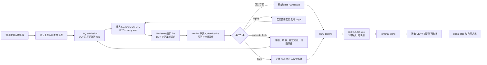

# MemBlock V2 测试框架整体 Flow 导览

本文面向第一次接触 `mem_ut` 的读者，用“准备一批请求、送入 DUT、观察结果、确认收尾”的视角说明当前 V2 测试框架。它描述测试框架如何组织和追踪工作，不展开 SystemVerilog 函数内部判断，也不解释 DUT 内部流水线或内部 `ISSQueue` 的实现。

适用范围：当前 `mem_ut_uvm_v2` 分支中的 real-dispatch 主流程，以及与该主流程相连的写回、提交、重发、redirect、L2TLB 和外部 memory responder 流程。

## 1. 术语与抽象功能说明

| 术语 | 通俗含义 | 在框架中的落点 | 例子 |
| --- | --- | --- | --- |
| `UID` | 一笔测试请求的全程编号，相当于快递单号 | `main_table_by_uid` 和 `status_by_uid` 的下标 | `uid=7` 从建表到结束都用同一个编号关联 |
| 主表（main table） | “这次要测什么”的静态清单 | `main_table_by_uid` | 一笔 load/store 的操作类型、地址、优先级等 |
| 状态表（status table） | “这笔请求现在走到哪里”的运行记录 | `status_by_uid` | 已入队、已发射、已写回、等待重发等 |
| LSQ admission | 把主表请求真正送到 LSQ 输入并确认 DUT 已看到它的过程 | `lsqenq` flow、LQ/SQ map | load 获得 LQ 归属，store 获得 SQ 归属 |
| issue queue | 测试框架自己的待发射候选队列 | `load_issue_q`、`sta_issue_q`、`std_issue_q` | 已可发射的 load 等待调度器选中 |
| `fire` | valid/ready 握手成功，DUT 已接受当前接口请求 | `*_dispatched` 和 issue generation 记录 | 某个 LOAD port 被 DUT 接收 |
| 写回（writeback） | DUT 报告执行结果或异常的输出事实 | raw monitor queue、`memblock_wb_event_t` | load 写回、STA/STD 完成、异常结果 |
| IQ feedback | IssueQueue 的接受/命中反馈，不等同于真实写回 | IQ feedback raw event | STA feedback miss 会触发重发，但不是“执行完成” |
| 重发（replay） | 某个目标本次执行无效，需要按新版本再发一次 | `replay_pending`、`replay_seq`、`ptw_wait_replay_q` | STA miss 后只把 STA 放回待发队列 |
| redirect / flush | 取消一段较新的在途工作，并恢复资源和队列的过程 | `active_redirect`、cancel record、flush epoch | memory violation 覆盖年轻 load/store |
| 提交（commit） | 框架向 DUT 推进 ROB 提交，并等待 LSQ 真正释放资源 | `rob_commit`、`lsq_deq` | store 已提交，但仍要等真实 `sqDeq` |
| `terminal_done` | 该 UID 已不再需要任何框架处理 | `status.terminal_done` | 正常成功或已收敛的 fault 都可进入终态 |
| `global stop` | 所有 UID 和辅助恢复工作都收尾后的统一停机信号 | `global_stop_requested` | 不能只因最后一笔 UID 完成就立刻停掉 responder |

### 1.1 两个容易混淆的“入队”

当前框架中“入队”至少有两层含义，必须分开看：

1. **LSQ admission**：测试框架通过 `lsqenq` 接口把请求交给 DUT 的 LSQ 入口。握手和采样确认后，框架才认为该 UID 是 active，并建立 LQ/SQ 的运行时归属。
2. **软件 issue queue**：框架把已经满足发射条件的 UID 放入 `load_issue_q`、`sta_issue_q` 或 `std_issue_q`，等待发射调度器选择。

随后，`lintsissue` driver 将候选送到 DUT 接口并等待 `fire`。这只能说明 **DUT 已从接口接受请求**；测试框架不会把 DUT 内部每一个 `ISSQueue` 表项复制成另一张软件表。因此本文把这一段称为“DUT 接收发射请求”，不把软件 issue queue 误称为 DUT 内部 `ISSQueue`。

## 2. 谁负责什么

| 角色 | 抽象职责 | 不负责什么 |
| --- | --- | --- |
| testcase / `basicTest` | 选择测试场景、创建环境、启动顶层 virtual sequence、维持 UVM objection | 不直接管理每笔 UID 的运行状态 |
| virtual sequence | 并发启动主表、LSQ 入队、发射、提交、L2TLB、DCache/SBuffer、redirect 等 sequence | 不逐拍解释 DUT 输出 |
| 各 agent 的 driver | 把框架决定好的输入驱动到 DUT，并报告握手是否成功 | 不自行决定一笔请求已经 pass 或 replay |
| 各 agent 的 monitor | 从 DUT 接口采集客观事实 | 不直接修改主表或状态表 |
| `memblock_sync_pkg` | 提供 raw event 暂存、统一 service cycle、flush 版本和跨 agent 同步标志 | 不模拟 DUT 的功能行为 |
| adapter / handler | 将 raw 接口事实关联到 UID，区分正常、fault、replay、redirect，并更新公共状态 | 不重新随机主表内容 |
| `common_data_transaction` | 主表、状态表、索引、队列和恢复记录的统一 owner | 不驱动任何 DUT pin |
| RM / scoreboard | 接收各 agent 的观测 transaction，提供并行的参考/比对通道 | 不抢占主表和状态表的生命周期 owner |
| DCache、SBuffer、L2TLB responder | 在需要时响应 DUT 的外部请求，使主流程能继续前进 | 不决定 ROB 提交顺序 |

可以把框架想成一个物流系统：主表是发货计划，状态表是包裹轨迹，driver 是发车口，monitor 是签收扫描枪，adapter/handler 是分拣中心，提交和 deq 才是最终完成签收。

## 3. 一张图看完整主线



图中的回环不是“重新随机一笔新请求”。无论 replay 还是 redirect，框架首先确认旧动态实例已经失效，再让原主表中的同一个 UID 以新的运行时版本重新进入合适阶段。

## 4. 共享数据中心：表、索引和队列

`common_data_transaction` 是主流程的共享数据中心。对初学者而言，可以按“长期事实、短期状态、快速查找、待办事项、恢复记录”五类理解。

### 4.1 主表：`main_table_by_uid`

主表以一笔 transaction 的静态测试意图为主。建表后，发射、写回、重发和提交不会把生命周期结果写进主表；但 LSQ admission 会把实际分配到的 LQ/SQ key 回填到同一条主表记录，供后续接口关联使用。

| 内容类别 | 主表保存的内容 | 为什么需要 |
| --- | --- | --- |
| 身份与操作类别 | `uid`、load/store/prefetch 等操作类别、`lsq_flow`、`fuType`、`fuOpType` | 决定这笔请求应该走 LOAD、STA、STD 还是其他合法路径 |
| 地址与操作数 | 基址、立即数、计算出的虚拟地址 | 形成可重复的访存激励，也支持地址复用场景 |
| 顺序线索 | ROB 相关 key，以及 LQ/SQ 分配字段 | 让框架可以按年龄和资源归属关联事件；建表时 LQ/SQ 字段是初始值，admission 成功后会回填实际 key 并建立 active map |
| 测试属性 | 地址边界 profile、LSQ 元素数、延迟、发射优先级 | 控制本次要覆盖的行为，而非记录运行结果 |
| 异常/访存属性 | TLB、PMA、corrupt、denied 等激励属性 | 让正常、异常和翻译相关场景都有明确输入来源 |

主表可以来自两条路径：默认的随机构建，或 testcase 提供的手工主表。两者最终都要形成连续 UID，并在 `main_table_ready` 后才允许后续 sequence 消费。

### 4.2 状态表：`status_by_uid`

每个 UID 有一条状态表记录。它不是简单的“已完成/未完成”位图，而是整笔请求的运行时病历。为了方便阅读，可按下面六组字段理解。

| 状态组 | 典型内容 | 它回答的问题 |
| --- | --- | --- |
| 激活与资源归属 | `active`、`enq`、ROB/LQ/SQ key、active LQ/SQ map、LSQ reservation | 这笔请求是否已被 DUT 接受，当前占用了哪些运行时资源 |
| 可发射与排队 | `issue_ready`、`queued_load/sta/std` | 是否已经具备进入某条软件 issue queue 的条件，是否正在等待发射 |
| 发射代际 | `load/sta/std_dispatched`、各 target 的 issue epoch | 哪个 target 已经真正 fire；晚到反馈属于哪一轮发射 |
| 结果 | target 级和 UID 级的 `writeback`、`pass`、`fault`、IQ feedback success | 哪个执行分支已经返回结果；这些结果是否足以让整笔 UID 进入正常收敛 |
| 恢复与版本 | `exception_pending`、`replay_pending`、replay target mask、`redirect_pending`、`flushed`、`issue_killed`、`dynamic_epoch`、`replay_seq` | 当前事件是否需要恢复；旧实例和新实例如何隔离 |
| 提交与终态 | `rob_commit`、`lsq_deq`、`success`、`terminal_done` | ROB 是否提交、LSQ 资源是否实际归还、这笔 UID 是否彻底结束 |

最重要的理解是：**主表描述“要跑什么”，状态表描述“已经跑到哪里”。** 发生 replay 或 redirect 时，通常保留主表意图，但清除或更新状态表中属于旧动态实例的内容。

### 4.3 反查索引和总体进度

| 对象 | 保存什么 | 用途 |
| --- | --- | --- |
| `uid_by_active_rob` | ROB key 到 UID 的映射 | writeback、commit、redirect 看到 ROB 信息时快速找到对应 UID |
| `uid_by_lq` | LQ key 到 UID 的映射 | LQ deq、load 相关事件快速定位 owner |
| `uid_by_sq` | SQ key 到 UID 的映射 | STA feedback、SQ deq、store 相关事件快速定位 owner |
| `dispatch_progress` | 已连续进入终态的前缀、已成功 admission 的高水位 | 判断整体进度，不必每拍扫描完整主表 |
| 全局 redirect 状态 | 当前 active redirect、phase、flush epoch、冻结确认 | 让 admission、issue、driver 和 handler 对“旧工作能否继续”使用同一口径 |

这些索引相当于物流系统的“按运单号、货架号、车位号查包裹”功能。外部事件到来时，框架优先反查 owner，而不是重新遍历所有 UID 猜测它属于谁。

### 4.4 待办队列

| 队列/记录 | 队列元素的抽象内容 | 写入者与消费者 | 何时离开 |
| --- | --- | --- | --- |
| `load_issue_q` | 待发的 LOAD UID、ROB 年龄、优先级、延迟、LQ/SQ 归属、replay 版本 | route 写入，issue scheduler 消费 | 对应端口真实 fire；或被 replay/redirect 清理 |
| `sta_issue_q` | 待发的 STORE address target | route 写入，issue scheduler 消费 | STA fire、replay 或 redirect |
| `std_issue_q` | 待发的 STORE data target | route 写入，issue scheduler 消费 | STD fire 或 redirect |
| raw monitor queues | monitor 刚采到的接口事实和采样上下文 | monitor 写入，adapter drain | 转换为语义事件后消费 |
| `exception_event_q` | 已经关联 UID、但需要按 recovery 规则处理的 fault/replay/redirect 事件 | handler 写入，recovery handler 消费 | 被处理、被 redirect 覆盖丢弃，或重新入队 |
| `pending_redirect_drive_q` | 需要由 redirect agent 真正驱动到 DUT 的 redirect payload | redirect owner 写入，redirect sequence 消费 | redirect 驱动完成并进入后续 flush 阶段 |
| `ptw_wait_replay_q` | 需要等待翻译条件满足后才能重新发射的 replay 项 | replay handler 写入，TLB 条件满足后消费 | TLB 可用后回到 issue route，或被 flush 清除 |
| `flushsb_req_q` | 等待 LSQ commit flow 服务的 flush store buffer 请求 | producer 写入，commit sequence 消费 | 已驱动并完成等待条件 |
| cancel record | 一个 redirect epoch 的软件取消量、DUT 观察量和对账进度 | redirect flow 建立并收敛 | 软件回退和 DUT 观测都完成 |

### 4.5 翻译和 CSR 辅助状态

TLB 相关状态不替代主表或状态表，而是为“这笔请求的地址翻译是否准备好”提供额外上下文。

| 对象 | 包含什么 | 在主流程中的作用 |
| --- | --- | --- |
| `tlb_entry_by_key` | 以 VPN、ASID、VMID、`s2xlate` 等组成的查找身份，以及冻结的翻译结果、PTE 属性、有效 fault 和生命周期信息 | 复用或建立 L2TLB responder 要返回的翻译结果 |
| `uid_tlb_record_by_uid` | UID 当前需要的翻译上下文、等待/请求已发送/已完成或已取消等状态 | 防止翻译响应归属到错误 UID；为等待翻译的 replay 提供依据 |
| `mmu_csr_state` | monitor 发布的最新 CSR 运行时快照 | 让 TLB 请求和响应使用与 DUT 同步的 ASID/VMID/翻译上下文 |

对小白而言，只要记住：翻译表负责“地址怎么翻”，UID 状态表仍负责“这笔指令走到哪里”。

## 5. 正常主流程，逐站说明

### 5.1 建表：先写好测试剧本

1. testcase 选择 virtual sequence，顶层 vseq 启动主 sequence 和配套 responder。
2. 主 sequence 根据配置随机生成，或导入手工 transaction。
3. 每一笔 transaction 分配连续 UID，写入主表；同 UID 的状态表先只保存基础身份和顺序快照，尚未 active。
4. 所有 UID 建完后置 `main_table_ready`。LSQ admission 和 issue sequence 以此作为启动门槛。

这一步的产物不是“已发送的请求”，而是一份可重复使用的测试计划。即使后面发生 replay，通常也不重建主表。

### 5.2 LSQ admission：从计划变成 DUT 已看见的在途请求

LSQ admission 是进入运行期的第一道真实边界。

1. admission sequence 按 UID 顺序挑选可进入 LSQ 的 load/store，形成一个 `lsqenq` 输入批次。
2. driver 在时钟边界把批次送到 DUT；框架先记录“已 launch、等待 DUT sample”的 reservation。
3. 到下一采样边界，若期间没有 redirect/flush 取消该批次，框架才确认该 UID 被 DUT 看见。
4. 框架为该 UID 建立 active ROB/LQ/SQ 映射，置 `active`、`enq`，并使其获得 `issue_ready` 资格。

这里的“下一采样边界”非常重要。它避免框架在 driver 刚把信号摆上接口时，就过早假定 DUT 已经接收了请求。

### 5.3 进入软件 issue queue：把一笔请求拆成可发射目标

当 UID 已经 `active + enq + issue_ready`，route 逻辑根据主表操作类型决定要生成哪些发射目标：

| 主表中的典型操作 | 进入的软件队列 | 含义 |
| --- | --- | --- |
| scalar load | `load_issue_q` | 等待 LOAD 发射 |
| scalar store | `sta_issue_q` 和 `std_issue_q` | 地址部分和数据部分分别等待发射 |
| 非普通标量路径 | 由当前 capability 和场景决定 | 不应硬套进这三条标量队列 |

每个 queue item 保留 UID、ROB 年龄、target、优先级、延迟、LQ/SQ 归属和 replay 版本。这些不是新的 transaction，而是同一主表 UID 的一张“待发射任务卡”。

### 5.4 发射与“进入 ISSQueue”：DUT 接受才算 fire

issue scheduler 从三条软件队列挑选当前可用候选。选择时会尊重以下大方向：

- 全局 flush/redirect 期间不发新工作。
- 未到延迟、已经失效、版本不匹配或已经完成的候选不能再发。
- 满足条件的候选按优先级和 ROB 年龄仲裁。

被选中的候选由 `lintsissue` sequence 和 driver 映射到实际 issue port。只有 valid/ready 握手成功的 port 才记为 `fire`：

1. 从对应软件 issue queue 删除已 fire 的任务卡。
2. 清掉该 target 的 `queued_*`，置 `*_dispatched`。
3. 为需要关联后续反馈的 LOAD/STA 创建本轮发射的 generation 记录。

未 fire 的候选仍留在软件 issue queue，等待后续周期，而不是误标为已发。DUT 内部是否再进入何种 pipeline 或内部 `ISSQueue`，属于 DUT 行为；框架从接口角度只确认“已被 DUT 接受”。

### 5.5 monitor、反馈与真实写回：先记录事实，再决定结果

monitor 不会直接说“UID 成功”。它只采集接口事实，例如 IQ feedback、整数写回、控制异常、LQ/SQ deq、redirect anchor。随后发生以下两层转换：

1. raw event 进入共享 raw queue，并带上采样时刻等上下文。
2. adapter 用 active ROB/LQ/SQ map 和发射代际记录把事实关联到正确 UID；handler 再决定它是正常写回、fault、replay 还是 redirect。

这里要区分两类反馈：

| 观察到的事实 | 框架含义 | 是否可直接置 `writeback/pass` |
| --- | --- | --- |
| IQ feedback hit | 当前 issue 请求被 IssueQueue 接受成功 | 不可以；它不是执行结果 |
| IQ feedback miss | 当前 target 未能正常接受，需要 replay | 不可以；它进入重发处理 |
| real writeback 且无异常 | 对应 target 的真实执行结果到达 | 可以更新 target 级 writeback/pass |
| real writeback 带异常 | 对应 target 出现 fault | 记录 fault，并交给 fault 收敛路径 |

对于常规 scalar store，STA 和 STD 是两个独立 target。某一侧先写回时，只说明这一侧完成；两侧都达到各自完成条件后，UID 级 `writeback/pass` 才可能成立。

### 5.6 提交、deq 与终态：成功不是“刚写回”

写回完成不等于整笔 transaction 已结束。正常路径还要经过两个独立关口：

1. **ROB commit**：commit sequence 按可提交顺序将完成的 UID 推给 DUT，状态表置 `rob_commit`。
2. **LSQ deq**：monitor 观察 DUT 真正释放 LQ/SQ entry，框架删除 `uid_by_lq`/`uid_by_sq` 映射，状态表才具备 `lsq_deq` 条件。

典型差异如下：

| 类型 | 写回后 | 提交后 | 真正终态前还要等什么 |
| --- | --- | --- | --- |
| normal load | LOAD target pass | ROB commit | DUT 的 LQ deq 与 LQ 映射释放 |
| normal store | STA/STD 都完成 | ROB store commit | DUT 后续的 SQ deq 与 SQ 映射释放 |
| fault | fault 已落表 | fault 收敛的 commit | 相关 LQ/SQ 映射实际释放 |

只有该 UID 不再 active、没有待处理 recovery、所需 target 已处理、ROB 已提交且 LQ/SQ 资源已释放后，框架才把它推进到 `terminal_done`。正常完成还会置 `success=1`；fault 也可以进入 `terminal_done`，但不代表成功。

## 6. 异常分支：重发、redirect 和 fault

### 6.1 replay：只重发需要重发的部分

replay 的目标不是“把整张主表从头再跑一遍”，而是撤销当前 UID 的某个失效 target，再让该 target 回到 route/issue 阶段。

1. monitor 发现 IQ feedback miss 或某类 backend replay。
2. handler 先确认事件没有被同批 redirect 覆盖，也确实属于当前 UID 的当前发射代际。
3. 状态表置 `replay_pending` 和对应 target mask，递增 `replay_seq`，清理旧 target 的已发射/已完成痕迹。
4. 若需要等待翻译或 PTW 条件，任务进入 `ptw_wait_replay_q`；否则直接重新 route。
5. route 只将请求 replay 的 target 放回相应软件 issue queue。新一次 `fire` 会形成新的发射代际。

版本号的目的很朴素：上一轮发射的迟到反馈不能误算到新一轮。旧事件会被过滤或按已关闭记录丢弃，而不是污染新状态。

### 6.2 redirect / flush：先停止旧世界，再恢复资源

redirect 是范围更大的恢复事件，常用于 memory violation 等场景。它的抽象步骤为：

1. 检测到 redirect 后，框架建立唯一 active redirect，并递增 flush 版本。
2. admission、issue 和 driver 看见全局冻结后停止继续发送旧工作。
3. redirect agent 从 `pending_redirect_drive_q` 取出 payload，真正驱动 DUT 的 redirect 输入。
4. 框架按 redirect 覆盖范围找出受影响的 active UID，清掉它们的软件 issue 项、发射代际、active map 和需要回退的 reservation。
5. cancel record 记录“软件认为需要取消多少 LQ/SQ 资源”以及“DUT 实际观察到多少取消”，两边完成对账后才能删除。
6. 未被覆盖且仍合法的事件可以继续；被覆盖的旧写回/replay/fault 事件直接丢弃，不能抢先修改状态。
7. 被取消但仍需测试的 UID 以后可重新 admission/reissue，形成新的动态实例。

redirect 的核心原则是：**先以版本和覆盖范围确认旧事件是否还有效，再改变表和队列。** 这能避免迟到 writeback 被错误记到重发后的新 UID 实例上。

### 6.3 fault：把失败变成可收敛的结果

fault 并非立即结束仿真。框架先把 fault 关联到对应 target/UID，记录异常信息和 fault 状态，再走可提交、可释放资源的收敛路径。这样测试结束时能区分：

- 正常成功：`success=1` 且 `terminal_done=1`。
- 已处理的预期或被观察到的 fault：`success=0`，但仍可以 `terminal_done=1`。
- 尚未收敛的异常：仍有 pending event、资源映射或恢复记录，不能作为测试正常结束。

## 7. 旁路和支撑 Flow

主表到提交是主干，但下面几类 flow 为主干提供必要条件。

| Flow | 对主干的帮助 | 初学者应记住的边界 |
| --- | --- | --- |
| L2TLB / CSR | 根据当前翻译上下文响应 DTLB 请求，令需要翻译的 UID 能继续 | 请求来自 DTLB 到 L2TLB 的上游交互，不是 L2Cache/PTW 下游 memory 模型 |
| DCache / SBuffer responder | 对 DUT 的外部 memory/SBuffer 请求给出受控响应 | responder 会等自身无 inflight 后自然退出，不能因主 UID 完成被强制截断 |
| `flushSb` | 将 flush store buffer 请求交给 LSQ commit flow 服务 | 它有独立待办队列和完成等待条件 |
| RM / scoreboard | 把各 agent 的观测 transaction 转成参考/比对流 | 它是并行观测通道，不替代 UID 生命周期状态 |
| global sync | 统一 raw 事件、软件 service cycle、capture 窗口和 flush epoch | 它协调 testbench 组件，不等同于 DUT 时钟或功能模型 |

## 8. 用一笔 load 和一笔 store 串起来

### 8.1 普通 load

```text
主表产生 uid=0 的 load
  -> LSQ admission 成功，uid=0 active/enq，并获得 LQ 归属
  -> 进入 load_issue_q
  -> lintsissue valid/ready fire，标记 LOAD 已发射
  -> monitor 观察到 real writeback
  -> 该 target 变为 writeback/pass
  -> ROB commit
  -> monitor 观察到 LQ deq，释放 LQ 映射
  -> uid=0 success + terminal_done
```

### 8.2 普通 store

```text
主表产生 uid=1 的 store
  -> LSQ admission 成功，uid=1 active/enq，并获得 SQ 归属
  -> 分别进入 sta_issue_q 和 std_issue_q
  -> STA 与 STD 分别 fire
  -> 两个 target 分别得到需要的完成结果
  -> UID 级 writeback/pass 成立
  -> ROB store commit
  -> 稍后观察到 SQ deq，释放 SQ 映射
  -> uid=1 success + terminal_done
```

两条路径的差别说明了为什么状态表需要 target 级字段：store 的地址与数据不是一次状态跳变就能完整描述的。

## 9. 测试何时真正结束

框架不会只看“最后一个 UID 写回了”。正常退出至少要同时满足：

1. 所有 UID 已推进到连续的 `terminal_done` 前缀。
2. 三条软件 issue queue、replay 等待队列、redirect drive queue 等没有遗留工作。
3. redirect 的 cancel record、anchor 和相关 raw sideband 已完成对账。
4. DCache、SBuffer、redirect 等 background responder 在无 inflight 的安全 idle 边界自然返回。
5. 最终检查确认 active ROB/LQ/SQ map、全局 flush 状态和关键队列均已清空。

这套收尾条件的价值在于：即使某笔 transaction 已经显示完成，也不会让迟到的取消、deq 或外部响应静默丢失。

## 10. 给初学者的阅读顺序

遇到一条 log 或一个失败 UID 时，建议始终按下面顺序提问：

1. 这笔 UID 在主表中原本是什么操作，应该走 LOAD、STA 还是 STD？
2. 它是否已经完成 LSQ admission，并建立 active ROB/LQ/SQ map？
3. 它当前是留在软件 issue queue，还是已经 `fire`？
4. monitor 最近观察到的是 IQ feedback、real writeback、fault，还是 redirect？
5. 状态表是否进入 replay/redirect/fault，当前事件的版本是否仍匹配？
6. 它是否已 ROB commit，且真实 LQ/SQ deq 是否已经释放资源？

只要沿着“主表意图 → 状态表阶段 → 队列位置 → 接口事实 → 提交/释放”这条线查，绝大多数问题都能定位到正确的 flow 类别，而不需要一开始钻进 driver 或 monitor 的逐行实现。

## 11. 相关资料与源码落点

需要继续深入某一段时，优先阅读以下专项文档：

- `AI_DOC/mem_ut_flow_doc/virtual_sequence_unified_dispatch_flow.md`
- `AI_DOC/mem_ut_flow_doc/main_table_build_and_stimulus_flow.md`
- `AI_DOC/mem_ut_flow_doc/lsq_admission_flow.md`
- `AI_DOC/mem_ut_flow_doc/load_sta_std_issue_flow.md`
- `AI_DOC/mem_ut_flow_doc/writeback_function_call_flow.md`
- `AI_DOC/mem_ut_flow_doc/rob_commit_lq_sq_deq_flow.md`
- `AI_DOC/mem_ut_flow_doc/replay_flow.md`
- `AI_DOC/mem_ut_flow_doc/redirect_flow.md`

本总览对应的主要代码对象为：

- `mem_ut/ver/ut/memblock/seq/base_seq_help/common_data_transaction.sv`
- `mem_ut/ver/ut/memblock/seq/base_seq_help/main_control_transaction.sv`
- `mem_ut/ver/ut/memblock/seq/base_seq_help/status_transaction.sv`
- `mem_ut/ver/ut/memblock/seq/base_seq_help/issue_queue_scheduler.sv`
- `mem_ut/ver/ut/memblock/seq/base_seq_help/writeback_status_handler.sv`
- `mem_ut/ver/ut/memblock/seq/base_seq_help/exception_redirect_replay_handler.sv`
- `mem_ut/ver/ut/memblock/seq/base_seq_help/lsq_commit_handler.sv`
