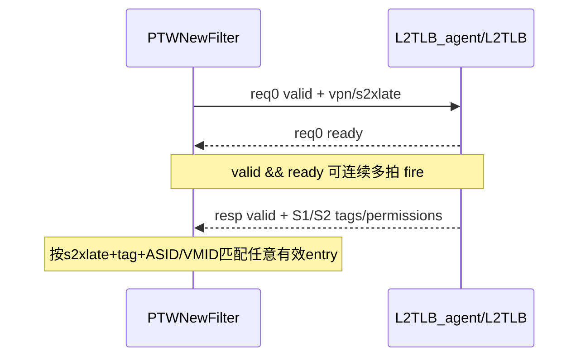

# V2 L2TLB Agent 接口知识

## 版本元数据

| 项目 | 内容 |
|---|---|
| RTL 版本 | V2 |
| 分支 | `mem_ut_uvm_v2` |
| 核验 commit | `7861962dba6f1b6ceb1da7996764b31d3207b5e6` |
| 设计基线 | `2acbf327cf7fb514593acc00d4c41117ec499e08`，见 V2 `branch_policy.md` |
| 权威源码 | `build_memblock/rtl/MemBlock.sv`、`src/main/scala/xiangshan/cache/mmu`、V2 `l2tlb_interface_profile.md` |
| 最后核验日期 | `2026-08-09` |

## Agent 职责和边界

mem_ut `L2TLB_agent` 接管 V2 MemBlock 内部 `dtlbRepeater` 与 `inner_ptw/L2TLB` 的交接：

- request：DTLB 发往 L2TLB agent。
- response：L2TLB agent 返回 DTLB。

该 agent 不是顶层 `io_l2_tlb_req_*` 的 requestor agent，也不是 L2Cache、page-table memory 或 PMP
下游模型。lookup request 只有 `vpn/s2xlate`；ASID/VMID/mode/root 必须取与 DTLB filter 对齐的 CSR history，
即顶层 monitor 当前 sample C 对应的 C-2 snapshot，不能直接读取 C 的 runtime latest。

## RTL 内部接口

| 信号族 | 方向（相对 agent） | 位宽/字段 | 握手 | 功能语义 |
|---|---|---|---|---|
| `_inner_dtlbRepeater_io_ptw_req_0_valid` | 输入 | 1 | 与 ready 同拍 fire | DTLB 有 translation request |
| `_inner_ptw_io_tlb_1_req_0_ready` | 输出 | 1 | agent backpressure | L2TLB 侧允许接受 request |
| `_inner_dtlbRepeater_io_ptw_req_0_bits_vpn` | 输入 | 38 | request fire采样 | VPN/GVPN |
| `_inner_dtlbRepeater_io_ptw_req_0_bits_s2xlate` | 输入 | 2 | request fire采样 | 翻译阶段类型 |
| `_inner_ptw_io_tlb_1_resp_valid` | 输出 | 1 | valid即完成 | L2TLB response 有效 |
| `_inner_ptw_io_tlb_1_resp_bits_s2xlate` | 输出 | 2 | response valid | 与目标 request 的阶段类型匹配 |
| `_inner_ptw_io_tlb_1_resp_bits_s1_*` | 输出 | tag/ASID/VMID/PTE | response valid | S1 translation 与 permission |
| `_inner_ptw_io_tlb_1_resp_bits_s2_*` | 输出 | tag/VMID/PTE/GPF/GAF | response valid | S2 translation 与 permission |

该内部接口没有 request ID，也没有暴露 response ready。Scala `PTWNewFilter` 把
`io.ptw.resp.ready` 固定为 true，因此 agent 每拍最多发一笔 response，通常 valid 所在 sample 边界即完成。
V2 实际路径会把外部 response fire 延迟一拍送入各 `PTWFilterEntry`，同时在 filter flush due sample 清除
entry 的 `v`；MemBlock 外层还会屏蔽翻译回填。因此对已知 flush due 边界，agent 不得把 C4 同拍 external
response fire 作为有效 completion（最后可完成 sample 必须严格早于 C4）。

## 握手和次序

V2 DTLB filter 可保存多笔 request，response 不依赖 FIFO head。真实 L2TLB 的 cache、PTW、LLPTW
路径可产生不同完成延迟，因此 responder 可以按内容乱序返回；验证环境如提供乱序模式，必须为每个
accepted request 保存独立 request-time context 和 response payload。

agent 的记账单位必须是 `valid && ready` 的每次 request fire。相同 key 在同一个 DTLB filter 内会在
到达本接口前合并，但跨 load/store/prefetch filter 仍可能产生多次 fire。真实 L2TLB 对每次 fire/response
分别更新计数，LLPTW 仅共享重复请求的下游 memory wait，不合并其 request entry 或最终 output。因此
agent 不得按 key 合并已接受 token；在没有 reset/flush cancel 时，即使较早 response 已同时 refill
多个相同 key filter entry，后续已接受 token 仍各返回一次。被 reset/flush 取消的 token 必须单独
记为 canceled，而不是静默删除。

token 只表示一次 L2TLB request fire，不表示唯一 UID。`PtwRespS2` 在 DTLB filter 层按内容广播，一笔
response 可以同时命中多个同 key 或同一 range 内的 issued UID。测试框架若维护 UID TLB record，应在
response complete 时对所有 `WAITING` record 执行同一 raw hit matcher：允许 0/1/多个 UID completion；多个
UID 的 raw payload/generation 相同，但各自的 resolved PPN/GVPN 必须用自己的 VPN 派生。C4 flush 取消仍
`WAITING` 的旧 instance，真 reissue 才建立新 waiting epoch。

UID multicast 的 matcher 必须使用 response fire 当前 DUT global sample 的 top C-2 CSR，而不是 UID record
建立时冻结的 CSR。CSR 在顶层 C0 切换后，C2/C3 的旧 token response 已按新 ASID/VMID 做 raw hit：若不命中，
token 仍是一次正常 response completion，但该 UID 继续 `WAITING`，等待 C4 cancel 或后续真实命中。

flush sideband 若来自顶层 CSR/fence agent monitor，不能把 `ldtlbParams.fenceDelay=2` 直接当作完整
hold。顶层 `io.ooo_to_mem.sfence/tlbCsr` 在 MemBlock 内先经过两级 `RegNext`，`PTWNewFilter` 再延迟
2拍清 entry；从 monitor sample 到 filter 清空总计4拍。顶层 event 到来时只能登记 flush epoch、due
sample 和 ready hold；不能提前取消已经按 `valid && ready` fire 的 pending token。到 C4 才取消仍未完成的
旧 token，且 ready 必须保持为0到4拍清空边界之后，避免恢复期间新接受的 request 随后被 filter flush。
ready已经开放后，新event必须在同一sample被lifecycle owner观察；迟到event不能从当前拍重锚，否则
可能把flush后才进入filter的新request误判为canceled。startup/reset且ready从未开放时，可以把旧latest
event作为baseline并保守hold 4拍。responder还必须等待 C-2 CSR history warm-up 后才能开放ready，避免用
未初始化或时间错位的 ASID/VMID 建立lookup key。CSR monitor每个 post-reset sample 均保存完整 history；
latest runtime view 仍独立发布，不受 dispatch semantic raw capture gate控制，但不得作为 request capture 的替代。

CSR change 与 fence 是两个独立的 DUT 事件；测试框架只在它们的统一 DUT `sample_seq` 相同时，将
`note_l2tlb_flush_event()` 的两个 reason OR 到同一个 lifecycle barrier，并共用一个 C4 due sample。
这只是 responder 的生命周期记账，不表示 RTL 将两个输入合成为一条信号；不同 sample 必须建立不同
barrier。

legacy `tc_base` default sequence和`basicTest + VSEQ_MAIN`显式sequence是两个独立合法入口；同一testcase
不得同时启动两者。owner helper只维护公共 lifecycle/UID waiting 状态，UVM错误由sequence层报告。

## UVM 组件映射

| RTL 信号 | interface/xaction | connect | sequence | driver |
|---|---|---|---|---|
| request valid/vpn/s2xlate | `L2tlb_agent_agent_interface` 输入字段 | active branch 从 `_inner_dtlbRepeater_*` force 到 interface | `memblock_l2tlb_base_sequence` 采样 | 不驱动 |
| request ready | `io_ptw_req_0_ready` | active branch force 到 `_inner_ptw_io_tlb_1_req_0_ready` | responder 根据容量产生 | `send_pkt()` 驱动 |
| response valid/payload | `io_ptw_resp_*` | active branch force 到 `_inner_ptw_io_tlb_1_resp_*` | TLB entry 构造 xaction | `send_pkt()` 驱动 |
| s1/s2 `perm_g/u` | xaction/interface 同名字段 | active branch逐字段连接 | 分别来自 `entry.s1_pte_g/u`、`entry.s2_pte_g/u` | 不得常量化或互相镜像 |

`MEMBLOCK_L2TLB_CONNECT_TAKEOVER_EN=0` 时 interface 全部保持 inactive；该模式不是 passive mirror。

## Response Payload 字段边界

当前 V2 测试框架已经把 `memblock_tlb_entry` 拆为独立的 `s1_pte_*` 与 `s2_pte_*` payload：S1 有
`R/W/X/U/G/A/D/V/N`，S2 有 `R/W/X/U/G/A/D/N`，不得定义或驱动不存在的 S2 `V`。active 接管路径必须将
`s1_entry_perm_g/u` 直接取自 `s1_pte_g/u`，`s2_entry_perm_g/u` 直接取自 `s2_pte_g/u`；两者可由独立 plus
权重在 lookup miss 时生成，pending snapshot 和 UID payload 只复制已冻结的结果。

S1 PPN 通过 `s1_entry_ppn_raw + s1_ppn_low[8]` 的 sector split 驱动，`s1_pteidx[8]` 是 one-hot Bool，
不能再使用旧的数值 `pteidx` 或共享 `ppn`。S2 使用独立 38-bit `s2_entry_ppn_raw`；完整 canonical S2 PPN
高于 bit 37 时必须 fail-fast。S1/S2 VMID response wire 均为 14 bit，CSR `hgatp_vmid[15:14]` 非零时不得截断
驱动，因为 DUT 会零扩展 response VMID 后比较。

同样地，response 的 `s1_pf/s1_af` 与 `s2_gpf/s2_gaf` 分别来自 S1 `PtwSectorResp` 和 S2
`HptwResp`。HPTW 保证同一笔 S2 response 的 GPF/GAF 互斥且 GAF 优先；L1 TLB 再按 `s2xlate`
把生效的 S1/S2 AF、S1 PF、S2 GPF 收敛为单一异常。它们不是可以用一套 entry 任意复制的四个同义位。

真实 RTL 的地址合成是 `s1_ppn = s1.genPPN(request_vpn)`，all-stage 再以 `s1_ppn` 为 GVPN 计算
`s2_ppn = s2.genPPNS2(s1_ppn)`；每个 stage 的 `level` 决定其 PPN 要由输入 VPN 补回的低位数。当前 UVM
payload 已独立保存 S1/S2 level、PPN、permission、PBMT、raw/effective fault 和 S2 GAF。无 effective fault
的 LEGAL stage 才做 leaf/NAPOT 合法化；fault payload 保留 raw PTE 伴随字段且不建立 DCache 地址 owner。

## 关联 Flow

- [DTLB-L2TLB 多请求与 Response 次序 Flow](../../../rtl/v2/flows/dtlb_l2tlb_request_response_ordering_flow.md)：
  多 entry、L2TLB 多路径和按内容匹配依据。
- [Memory PMP/PMA 权限检查 flow](../../../rtl/v2/flows/memory_pmp_pma_permission_flow.md)：
  TLB response 后续 PMP/PMA 权限检查边界。
- [MMU GPF/AF 异常优先级与并发边界 flow](../../../rtl/v2/flows/mmu_gpf_af_exception_priority_flow.md)：
  S1/S2 fault 字段到 L1 TLB 异常编码及下游 AF 合并的优先级。

## V2/V3 差异

本文只记录 V2 内部 wire 和 Scala flow。V3 internal hierarchy、filter 容量和字段必须读取 V3 profile
重新确认，不能复制 V2 internal wire 名。

## 源码证据

- `src/main/scala/xiangshan/mem/MemBlock.scala:781`：DTLB repeater 到 L2TLB port 1 的连接。
- `src/main/scala/xiangshan/mem/MemBlock.scala:665-666`：顶层 CSR/sfence 到 internal TLB 的两级寄存。
- `src/main/scala/xiangshan/cache/mmu/MMUBundle.scala:1124-1136,1326-1414`：request/response payload 与内容匹配。
- `src/main/scala/xiangshan/cache/mmu/Repeater.scala:163-289,338-440,465-620`：filter entry 保存、raw-hit 遍历、response 延迟/广播和 flush 清除；V2 DTLB 实际使用 `PTWNewFilter`，旧 `PTWFilter` 的显式 valid 清除仅作对照。
- `src/main/scala/xiangshan/mem/MemBlock.scala:739-741`：PTW response 在 sfence/CSR change 边界的外层寄存与回填屏蔽。
- `src/main/scala/xiangshan/cache/mmu/L2TLB.scala:628-685`：多路径 response 到 per-source output。
- `src/main/scala/xiangshan/cache/mmu/L2TLB.scala:183-223`、
  `src/main/scala/xiangshan/cache/mmu/PageTableWalker.scala:711-1085`：每次 request/response 计数与
  LLPTW 重复请求的独立 entry 生命周期。
- `build_memblock/rtl/MemBlock.sv:2182-2184,5282-5340,24300-24395`：V2 internal wire 与实例连接。
- `mem_ut/ver/ut/memblock/tb/L2tlb_agent_connect.sv:1-230`：当前 UVM active/inactive takeover 映射。

## 知识修订记录

| 日期 | commit | 旧结论 | 新结论 | 修订原因 | 影响范围 |
|---|---|---|---|---|---|
| 2026-07-21 | `bd813bc3ed5b39581be966c6518788852890ff6f` | 首次建立，无旧的 agent 长期文档 | 建立 V2 internal request/response、无ID、多 outstanding、内容匹配和 permission 字段边界 | 用户要求结合 Scala 源码设计 L2TLB responder queue 与回复次序 | V2 mem_ut L2TLB agent |
| 2026-07-29 | `f3bdd04b3763147e714a786d078e0cb90460a31d` | 旧文档只说明 permission 共用 entry，未说明 fault/PPN 的两阶段语义 | 补充 response 四个 fault 的阶段归属、最终异常收敛、S1 到 S2 的串行 PPN 合成以及当前 UVM 单 entry 模型的覆盖缺口 | 用户要求结合 Scala 分析 L2TLB reply 的 fault、level 和 PPN 依赖 | V2 L2TLB agent response 建模与 testcase 预期 |
| 2026-08-06 | `7861962dba6f1b6ceb1da7996764b31d3207b5e6` | 旧文档允许在顶层 flush event 到达时提前取消 pending，且未说明 response UID 回填使用何时的 CSR | 明确 C0 只登记 epoch/due，C4 才取消仍未完成 token；request capture 与 response-to-UID raw hit 分别使用各自 DUT global sample 的 C-2 CSR，UID issue-time CSR 仅保留历史；同 sample CSR change 与 fence 仍只合并一个 lifecycle barrier | 复查 `PTWNewFilter` response matching、flush/回填边界及 L2TLB undo plan | V2 L2TLB responder flush、CSR history 与 UID 记账 |
| 2026-08-09 | 本地 V2 payload 实现 | 文档仍描述一套共享 `entry.pte_*`、共享 PPN/level 且 S2 GAF 固定 0 | 同步独立 S1/S2 PTE、PPN、level、PBMT、four-fault payload、one-hot sector 与 width fail-fast 的实际实现 | V2 random payload plan coding 后长期接口文档需要消除旧模型描述 | V2 L2TLB response payload 与 agent 接口边界 |

## 待确认项

- V3 对应 internal interface 未在本轮核验。
