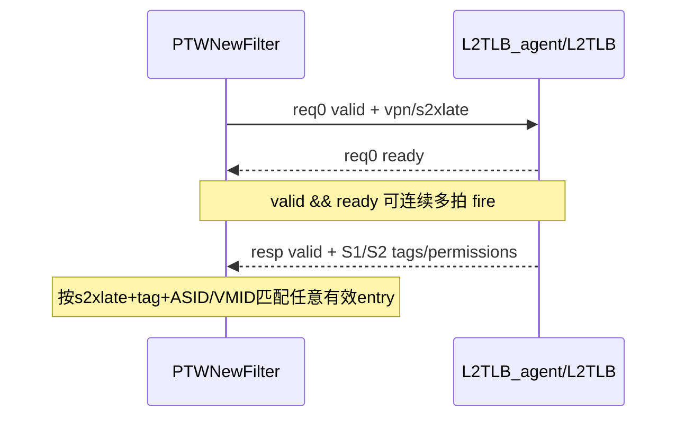

# V2 L2TLB Agent 接口知识

## 版本元数据

| 项目 | 内容 |
|---|---|
| RTL 版本 | V2 |
| 分支 | `mem_ut_uvm_v2` |
| 核验 commit | `bd813bc3ed5b39581be966c6518788852890ff6f` |
| 设计基线 | `2acbf327cf7fb514593acc00d4c41117ec499e08`，见 V2 `branch_policy.md` |
| 权威源码 | `build_memblock/rtl/MemBlock.sv`、`src/main/scala/xiangshan/cache/mmu`、V2 `l2tlb_interface_profile.md` |
| 最后核验日期 | `2026-07-21` |

## Agent 职责和边界

mem_ut `L2TLB_agent` 接管 V2 MemBlock 内部 `dtlbRepeater` 与 `inner_ptw/L2TLB` 的交接：

- request：DTLB 发往 L2TLB agent。
- response：L2TLB agent 返回 DTLB。

该 agent 不是顶层 `io_l2_tlb_req_*` 的 requestor agent，也不是 L2Cache、page-table memory 或 PMP
下游模型。lookup request 只有 `vpn/s2xlate`，ASID/VMID 由 request sample 时刻的 runtime CSR 提供。

## RTL 内部接口

| 信号族 | 方向（相对 agent） | 位宽/字段 | 握手 | 功能语义 |
|---|---|---|---|---|
| `_inner_dtlbRepeater_io_ptw_req_0_valid` | 输入 | 1 | 与 ready 同拍 fire | DTLB 有 translation request |
| `_inner_ptw_io_tlb_1_req_0_ready` | 输出 | 1 | agent backpressure | L2TLB 侧允许接受 request |
| `_inner_dtlbRepeater_io_ptw_req_0_bits_vpn` | 输入 | 38 | request fire采样 | VPN/GVPN |
| `_inner_dtlbRepeater_io_ptw_req_0_bits_s2xlate` | 输入 | 2 | request fire采样 | 翻译阶段类型 |
| `_inner_ptw_io_tlb_1_resp_valid` | 输出 | 1 | valid即完成 | L2TLB response 有效 |
| `_inner_ptw_io_tlb_1_resp_bits_s2xlate` | 输出 | 2 | response valid | 与目标 request 的阶段类型匹配 |
| `_inner_ptw_io_tlb_1_resp_bits_s1_*` | 输出 | tag/ASID/VMID/PTE | response valid | S1 translation 与 permission |
| `_inner_ptw_io_tlb_1_resp_bits_s2_*` | 输出 | tag/VMID/PTE/GPF/GAF | response valid | S2 translation 与 permission |

该内部接口没有 request ID，也没有暴露 response ready。Scala `PTWNewFilter` 把
`io.ptw.resp.ready` 固定为 true，因此 agent 每拍最多发一笔 response，valid 所在 sample 边界即完成。

## 握手和次序

V2 DTLB filter 可保存多笔 request，response 不依赖 FIFO head。真实 L2TLB 的 cache、PTW、LLPTW
路径可产生不同完成延迟，因此 responder 可以按内容乱序返回；验证环境如提供乱序模式，必须为每个
accepted request 保存独立 request-time context 和 response payload。

agent 的记账单位必须是 `valid && ready` 的每次 request fire。相同 key 在同一个 DTLB filter 内会在
到达本接口前合并，但跨 load/store/prefetch filter 仍可能产生多次 fire。真实 L2TLB 对每次 fire/response
分别更新计数，LLPTW 仅共享重复请求的下游 memory wait，不合并其 request entry 或最终 output。因此
agent 不得按 key 合并已接受 token；在没有 reset/flush cancel 时，即使较早 response 已同时 refill
多个相同 key filter entry，后续已接受 token 仍各返回一次。被 reset/flush 取消的 token 必须单独
记为 canceled，而不是静默删除。

flush sideband 若来自顶层 CSR/fence agent monitor，不能把 `ldtlbParams.fenceDelay=2` 直接当作完整
hold。顶层 `io.ooo_to_mem.sfence/tlbCsr` 在 MemBlock 内先经过两级 `RegNext`，`PTWNewFilter` 再延迟
2拍清 entry；从 monitor sample 到 filter 清空总计4拍。responder 可以在顶层 event 到来时保守取消旧
pending，但 ready 必须保持为0到4拍清空边界之后，避免恢复期间新接受的 request 随后被 filter flush。
ready已经开放后，新event必须在同一sample被lifecycle owner观察；迟到event不能从当前拍重锚，否则
可能把flush后才进入filter的新request误判为canceled。startup/reset且ready从未开放时，可以把旧latest
event作为baseline并保守hold 4拍。responder还必须等待首份runtime CSR snapshot有效后才能开放ready，
避免用未初始化ASID/VMID建立lookup key。该snapshot由CSR monitor在post-reset sample独立发布，不受
dispatch semantic raw capture gate控制；两条latest视图共享统一sequence并写同一公共CSR状态。

legacy `tc_base` default sequence和`basicTest + VSEQ_MAIN`显式sequence是两个独立合法入口；同一testcase
不得同时启动两者。owner helper只维护公共claim状态，UVM错误由sequence层报告。

## UVM 组件映射

| RTL 信号 | interface/xaction | connect | sequence | driver |
|---|---|---|---|---|
| request valid/vpn/s2xlate | `L2tlb_agent_agent_interface` 输入字段 | active branch 从 `_inner_dtlbRepeater_*` force 到 interface | `memblock_l2tlb_base_sequence` 采样 | 不驱动 |
| request ready | `io_ptw_req_0_ready` | active branch force 到 `_inner_ptw_io_tlb_1_req_0_ready` | responder 根据容量产生 | `send_pkt()` 驱动 |
| response valid/payload | `io_ptw_resp_*` | active branch force 到 `_inner_ptw_io_tlb_1_resp_*` | TLB entry 构造 xaction | `send_pkt()` 驱动 |
| s2 `perm_g/u` | xaction/interface 同名字段 | active branch逐字段连接 | 来自 `entry.pte_g/pte_u` | 不得常量化 |

`MEMBLOCK_L2TLB_CONNECT_TAKEOVER_EN=0` 时 interface 全部保持 inactive；该模式不是 passive mirror。

## Permission 字段边界

当前测试框架只有一套 `memblock_tlb_entry.pte_*`，同时填入 S1/S2 permission。V2 active 接管路径
中的 `s2_entry_perm_g/u` 必须真实连接 `entry.pte_g/pte_u`，但这不等价于 S1/S2 权限已经独立建模。
独立两阶段权限属于后续专项。

## 关联 Flow

- [DTLB-L2TLB 多请求与 Response 次序 Flow](../../../rtl/v2/flows/dtlb_l2tlb_request_response_ordering_flow.md)：
  多 entry、L2TLB 多路径和按内容匹配依据。
- [Memory PMP/PMA 权限检查 flow](../../../rtl/v2/flows/memory_pmp_pma_permission_flow.md)：
  TLB response 后续 PMP/PMA 权限检查边界。

## V2/V3 差异

本文只记录 V2 内部 wire 和 Scala flow。V3 internal hierarchy、filter 容量和字段必须读取 V3 profile
重新确认，不能复制 V2 internal wire 名。

## 源码证据

- `src/main/scala/xiangshan/mem/MemBlock.scala:781`：DTLB repeater 到 L2TLB port 1 的连接。
- `src/main/scala/xiangshan/mem/MemBlock.scala:665-666`：顶层 CSR/sfence 到 internal TLB 的两级寄存。
- `src/main/scala/xiangshan/cache/mmu/MMUBundle.scala:1124-1136,1326-1414`：request/response payload 与内容匹配。
- `src/main/scala/xiangshan/cache/mmu/Repeater.scala:163-438`：多 entry、request ready 和 response ready语义。
- `src/main/scala/xiangshan/cache/mmu/L2TLB.scala:628-685`：多路径 response 到 per-source output。
- `src/main/scala/xiangshan/cache/mmu/L2TLB.scala:183-223`、
  `src/main/scala/xiangshan/cache/mmu/PageTableWalker.scala:711-1085`：每次 request/response 计数与
  LLPTW 重复请求的独立 entry 生命周期。
- `build_memblock/rtl/MemBlock.sv:2182-2184,5282-5340,24300-24395`：V2 internal wire 与实例连接。
- `mem_ut/ver/ut/memblock/tb/L2tlb_agent_connect.sv:1-230`：当前 UVM active/inactive takeover 映射。

## 知识修订记录

| 日期 | commit | 旧结论 | 新结论 | 修订原因 | 影响范围 |
|---|---|---|---|---|---|
| 2026-07-21 | `bd813bc3ed5b39581be966c6518788852890ff6f` | 首次建立，无旧的 agent 长期文档 | 建立 V2 internal request/response、无ID、多 outstanding、内容匹配和 permission 字段边界 | 用户要求结合 Scala 源码设计 L2TLB responder queue 与回复次序 | V2 mem_ut L2TLB agent |

## 待确认项

- V3 对应 internal interface 未在本轮核验。
