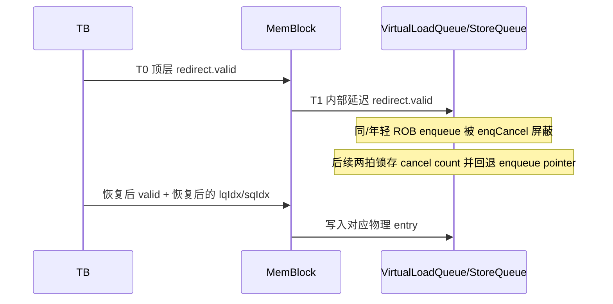

# V2 LSQ Enqueue Agent 接口知识

## 版本元数据

| 项目 | 内容 |
|---|---|
| RTL 版本 | V2 |
| 分支 | `mem_ut_uvm_v2` |
| 核验 commit | `d9f0f5757f6f95d6c8a8810109a16aff9eb7fa86` |
| 权威源码 | `build/rtl/MemBlock.sv`、`build/rtl/LsqWrapper.sv`、`build/rtl/VirtualLoadQueue.sv`、`build/rtl/StoreQueue.sv` |
| 最后核验日期 | `2026-09-17` |

## Agent 职责和边界

`lsqenq_agent` 驱动 standalone `MemBlock` 顶层已经分配好 `lqIdx/sqIdx` 的
`enqLsq` 请求。该接口不是完整 Core 中 Dispatch 到 `LsqEnqCtrl` 的 ready/valid
接口：生成 Verilog 只有六路 `req.valid`、`needAlloc` 和 payload 输入，没有
`ready`、`canAccept` 或 enqueue response。输入从 `MemBlock` 直接接入
`LsqWrapper`，而 `LsqEnqCtrl` 虽存在于整核 filelist，但不由 `MemBlock` 实例化。

因此“没有 ready”表示上游必须保证发送周期、容量和 index 合法，不表示任意拍
`valid=1` 都会成为有效新实例。redirect 恢复窗口内，LQ/SQ 仍按内部 redirect、
延迟 cancel count 和 enqueue pointer 恢复状态取消或覆盖输入。

## RTL 顶层端口

| 端口/字段 | 方向 | 位宽 | valid/ready 关系 | 功能语义 | 源码位置 |
|---|---:|---:|---|---|---|
| `io_ooo_to_mem_enqLsq_needAlloc_{0..5}` | TB -> DUT | 2 | 无 ready | bit0选择LQ，bit1选择SQ；`LsqWrapper`将公共请求拆给LQ/SQ。 | `build/rtl/MemBlock.sv:372-377,20156-20166` |
| `io_ooo_to_mem_enqLsq_req_{0..5}_valid` | TB -> DUT | 1 | 无 ready | 已由上游完成分配的enqueue脉冲；直接进入`LsqWrapper`。 | `build/rtl/MemBlock.sv:378-605,20168`起 |
| `..._lqIdx_{flag,value}` | TB -> DUT | 1+7 | 随valid采样 | 完整环形LQ key，必须符合当前合法enqueue pointer和redirect恢复状态。 | `build/rtl/MemBlock.sv:411-412`起 |
| `..._sqIdx_{flag,value}` | TB -> DUT | 1+6 | 随valid采样 | 完整环形SQ key，必须符合当前合法enqueue pointer和redirect恢复状态。 | `build/rtl/MemBlock.sv:413-414`起 |
| `..._numLsElem` | TB -> DUT | 5 | 随valid采样 | 从起始key连续占用的entry数量。 | `build/rtl/MemBlock.sv:415`起 |

## 握手和时序

顶层 redirect 先写入 `inner_redirect_next_valid_last_REG`，下一拍才到达
`LsqWrapper`。在该内部 redirect 有效拍，`VirtualLoadQueue` 和 `StoreQueue` 的
`enqCancel` 会屏蔽 ROB 位于 redirect 范围内的新请求。再下一拍
`lastCycleRedirect` 锁存取消数量，随后 `lastLastCycleRedirect` 用
`redirectCancelCount` 回退 enqueue pointer。

所以 standalone 环境不能把“顶层无 ready”解释成 redirect 后 T1 可安全复用旧
key。内部 redirect 有效拍发送时请求会被取消；pointer尚未回退时强制发送，则 payload
key和队列当前 pointer/恢复更新可能不一致。测试框架必须按 cancel count恢复软件
pointer后，再以恢复后的连续key重新入队。

## UVM 组件映射

| RTL 信号 | interface | transaction | connect | monitor | driver |
|---|---|---|---|---|---|
| `io_ooo_to_mem_enqLsq_*` | `lsqenq_agent_agent_interface.sv` | `lsqenq_agent_agent_xaction.sv` | `tb/lsqenq_agent_connect.sv` | `lsqenq_agent_agent_monitor.sv` | `lsqenq_agent_agent_driver.sv` |

## 关联 Flow

- [LSQ 入队与 Redirect 恢复 flow](../../../rtl/v2/flows/lsq_enqueue_redirect_flow.md)：完整Core admission与standalone MemBlock顶层边界。

## V2/V3 差异

本文件只确认V2，不据此推断V3顶层接口或redirect延迟。

## 源码证据

- `build/rtl/MemBlock.sv:372-605,20020-20380`：顶层六路enqueue只有输入字段，并直接连接`LsqWrapper inner_lsq`。
- `build/rtl/LsqWrapper.sv:58-260,1882-1951,3522-3526`：没有enqueue ready输出；`needAlloc`将公共valid分别送入LQ/SQ。
- `build/rtl/MemBlock.sv:5833,7091,20020-20030`：顶层redirect经一拍寄存后送入`LsqWrapper`。
- `build/rtl/VirtualLoadQueue.sv:768-810,1249-1310,9016-9032,9253-9254,13102-13103`：redirect同拍enqueue cancel、entry写入门控和两级恢复寄存器。
- `build/rtl/StoreQueue.sv:4128-4241,41959-42055,53270-53279,53755-53756`：SQ同型cancel、取消计数和enqueue pointer回退。

## 知识修订记录

| 日期 | commit | 旧结论 | 新结论 | 修订原因 | 影响范围 |
|---|---|---|---|---|---|
| 2026-09-17 | `d9f0f5757f6f95d6c8a8810109a16aff9eb7fa86` | 顶层enqueue行为容易直接套用完整Core的`LsqEnqCtrl.canAccept`时序。 | 明确standalone MemBlock不实例化`LsqEnqCtrl`、顶层无ready，但LQ/SQ仍执行redirect cancel和两拍pointer恢复；无ready不等于任意拍可接收。 | 用户要求以生成Verilog顶层接口核对redirect后最快入队行为。 | V2 MemBlock、LsqWrapper、VirtualLoadQueue、StoreQueue、lsqenq agent。 |

## 待确认项

- 无。
