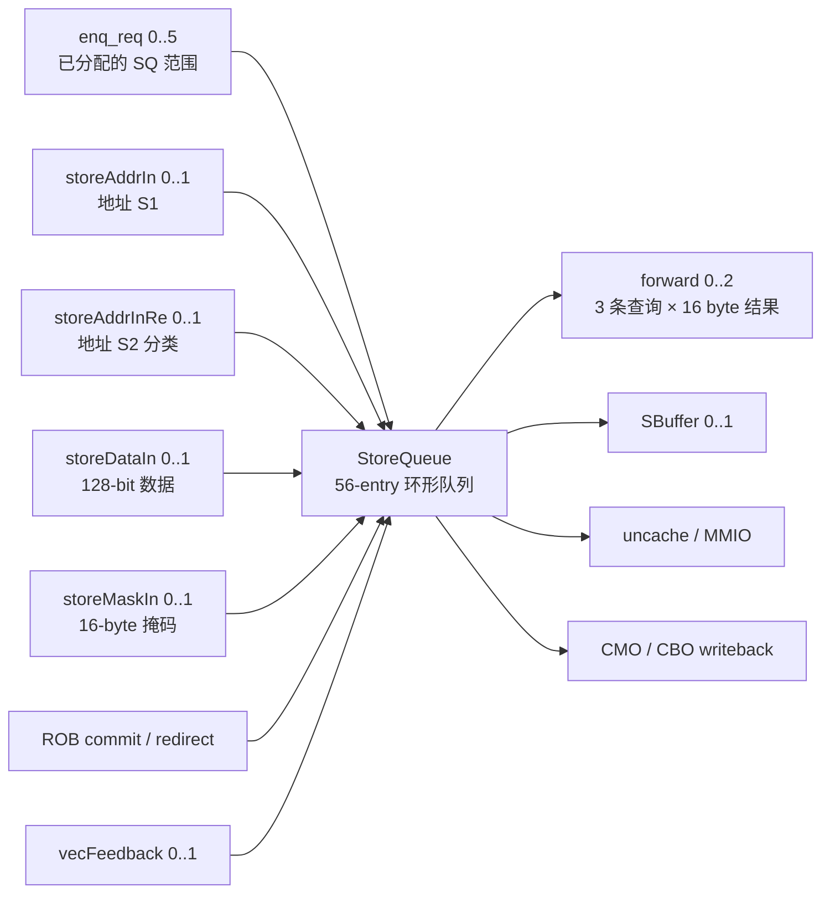

# V2 StoreQueue 内部接口知识

## 版本元数据

| 项目 | 内容 |
|---|---|
| RTL 版本 | V2 |
| 分支 | `mem_ut_uvm_v2` |
| 核验 commit | `1567628320ef77e1de1a3ae7a7c7057423e842b4` |
| 生成 RTL 权威来源 | 工作区现存 `build/rtl/StoreQueue.sv`；其端口头位于第 58–857 行。`build/rtl` 是生成产物，未单独记录生成 commit；本文把它作为接口存在性、方向和位宽的真值，不能仅凭当前 Scala commit 反推该产物一定由同一 commit 生成。 |
| 辅助语义来源 | `src/main/scala/xiangshan/mem/lsqueue/StoreQueue.scala`、`StoreQueueData.scala`、`Bundles.scala`、DCache `CMOUnit/MainPipe` 与 CoupledL2 `SinkC/MSHR/MainPipe`。它们只用于解释已生成的字段和时序，接口存在性一律以 Verilog 为准。 |
| 最后核验日期 | 2026-09-15 |

## 职责、边界和读法

`StoreQueue`（以下简称 SQ）是 LSQ 内部保存尚未真正写入存储系统的 store 的环形队列。它接收 dispatch 已分配好的 SQ 槽位、StoreUnit 的地址/数据/字节掩码回写和 ROB 的提交/redirect 信息；它向 load 流水提供 store-to-load forwarding，向 SBuffer、uncache 和 CMO 路径交付可执行的 store。

本文描述的是**内部生成模块** `build/rtl/StoreQueue.sv`，不是 MemBlock 顶层接口。它适合为 standalone black-box adapter、monitor 或 reference model 建立精确的端口认知；不能据此假定 MemBlock 顶层也有同名端口。

### 展平端口命名规则

Chisel Bundle 在 Verilog 中被展平。例如：

```text
io_storeAddrIn_0_bits_uop_robIdx_flag
```

表示抽象字段 `storeAddrIn(0).bits.uop.robIdx.flag`。本文用 `io_storeAddrIn_<p>`、`io_forward_<q>`、`io_stAddrReadyVec_<s>` 代表同一规律的一组端口，并在表中给出 `<p>/<q>/<s>` 的取值范围；这不是省略真实端口，而是避免把相同解释重复数十次。

### 首次出现的几个术语

- **CAM**（Content-Addressable Memory，内容寻址存储器）：不是按一个地址直接读出，而是把查询地址和所有已保存 store 的地址并行比较，返回命中的 entry 集合。SQ 的 VAddr CAM 和 PAddr CAM 分别用虚拟地址、物理地址做这件事。
- **S1/S2**：StoreUnit 地址流水的两个连续阶段。S1 先把地址写入 SQ；S2 再补充 PMA/PMP、MMIO 和异常分类。`storeAddrInRe` 就是 S2 的补充 sideband。
- **fire**：Decoupled 接口中 `valid && ready` 同时为 1 的那个时钟沿，表示一条记录真正完成传输。
- **NC**（non-cacheable，非缓存）：不经过普通 cacheable store 路径的内存属性。文中 `nc=1` 均指这种属性；它不要和 S2 得到的 `mmio` 分类混为一谈。
- **MAB**（StoreMisalignBuffer，非对齐 store 缓冲）：保存需要拆分或跨页处理的非对齐 store，SQ 通过 `maControl` 与它协作。
- **LSQ / ROB / uop**：LSQ 是 Load-Store Queue，管理 load/store 的乱序生命周期；ROB 是 Reorder Buffer（重排序缓冲），决定按程序顺序提交；uop 是一条宏指令拆分后的微操作。
- **SBuffer**：Store Buffer，SQ 把已可下发的 cacheable store 放入这里，再由它向缓存/存储系统执行写入。
- **MMIO / CMO / CBO**：MMIO 是映射到设备地址的 I/O 访问；CMO 是 Cache Management Operation（缓存管理操作）；CBO 是 RISC-V 的 cache block operation，例如 clean、flush、inval、zero。
- **PMA/PMP / PBMT**：PMA 和 PMP 是地址属性/物理内存保护检查；PBMT 是页表给出的 memory type，能把访问标为 NC 等属性。
- **RM / UVM**：RM 是 reference model（参考模型）；UVM 是常用的 SystemVerilog 验证框架。本文的 RM 既可以是 UVM 中的 scoreboard 模型，也可以是独立 checker。
- **Decoupled**：一种 `valid/ready` 握手协议；本项目文中的 Decoupled 与上面的 fire 定义配套使用。

### 三种端口语义

| 端口类型 | 如何识别 | 正确理解 |
|---|---|---|
| Valid-only 事件 | 有 `valid`，没有相应 `ready` | `valid=1` 时 payload 会在时钟沿被采样，发送方不能等待 SQ 的 `ready`；但实际状态效果仍受该端口组的限定条件控制。例如同拍被 redirect kill 的 enqueue 不形成 live entry，`storeAddrIn.miss=1` 不写普通 CAM/不置 `addrvalid`。因此 Valid-only 不等于“无条件成功”。连续多拍拉高表示连续采样事件，不是同一事务在等待。 |
| Decoupled | 同一组同时有 `valid` 与反方向 `ready` | 仅当 `valid && ready`（下文写作 `fire`）时事务转移；`valid=1 && ready=0` 时发送方必须保持 payload 稳定。 |
| 状态/sideband | 没有 `valid`，通常也没有 `ready` | 它表示当前状态或某个已知事件的附属字段，不能在每拍当成独立事务比较。`storeAddrInRe`、`exceptionAddr` 和 MAB sideband 都属于这一类。 |

### 指针、槽位和字节的共同约定

| 名称 | 组成 | 含义 |
|---|---|---|
| `SqPtr` | `flag[0] + value[5:0]` | SQ 的环形指针。`value` 是物理槽号，`flag` 是环回代；二者必须一起比较年龄。 |
| 合法 SQ 槽 | `0..55` | V2 SQ 有 56 个物理 entry。端口上的 `value` 虽有 6 bit、可电气编码 `56..63`，但这些值没有对应 entry；正常 driver/RM 必须禁止。 |
| `RobPtr` | `flag[0] + value[7:0]` | 环形 ROB 指针。不能只按 `value` 的普通整数大小判断老/新。 |
| 16-byte 数据窗口 | `data[127:0]`、`mask[15:0]` | `mask[n]` 对应 `data[8*n +: 8]`。`n=0` 是最低有效 byte，`n=15` 是最高有效 byte。 |

### 功能总览



特别重要：`forward` 有 **3 个查询 port**（`io_forward_0..2`），而每个查询结果有 **16 个 byte lane**（`forwardMask_0..15`、`forwardData_0..15`）。所以“16 个 forward 通道”准确说是“一个 128-bit 查询结果的 16 个按 byte 独立的结果位”，不是 16 个独立 load 请求接口。

### 三层检查边界

| 检查层次 | 检查对象 | 不应混用的规则 |
|---|---|---|
| Pin-level（引脚级） | 真实 Verilog 输出、forward 的 16 个 raw byte lane、寄存延迟、无 `valid` sideband 的残留 payload | 前一拍 query `valid=1` 时应检查所有 16 个 forward lane；没有事件限定的 sideband 不能每拍当新事务比较。 |
| Protocol-level（协议级） | Valid-only 的输入合法性、Decoupled 的 payload 稳定和 fire、S1→Re 一拍配对、NC response owner | `valid` 不总等于状态无条件改变；`fire` 不等于最终出队。`idResp` 必须与 request fire 保持接纳顺序的一一关联；最终无 ID 的 `resp` 由 Uncache buffer 仲裁，返回顺序本身不必与请求顺序相同。错误 mid、owner、generation 或 phase 才属于 protocol-negative。 |
| Architecture-level（架构级） | 实际写存储、异常/commit、最终 SQ dequeue | 只有结合 `vecValid`、完成状态及对应 lifecycle 才能统计实际 store；不能把同拍 `sqDeqIsVec` 当作 `sqDeq` 类型，也不能把 SBuffer valid 单独当实际写存储。 |

## 端口组总览

| 端口组 | 数量 | 方向 | 协议 | 主要职责 |
|---|---:|---|---|---|
| `clock`、`reset` | 1 组 | 输入 | 时钟/复位 | 驱动全部 SQ 状态。 |
| `io_enq_req_<0..5>` | 6 | 输入 | Valid-only | dispatch 已经分配好 SQ 区间后的镜像写入。 |
| `io_brqRedirect` | 1 | 输入 | Valid-only | 清除 redirect 后不应保留的未提交 store，并恢复 tail。 |
| `io_vecFeedback_<0..1>` | 2 | 输入 | Valid-only | vector store flow 的 commit/flush 反馈。 |
| `io_storeAddrIn_<0..1>` | 2 | 输入 | Valid-only | StoreUnit 地址 S1 的地址、CAM mask 和部分属性。 |
| `io_storeAddrInRe_<0..1>` | 2 | 输入 | 后续 sideband | 上一拍同端口地址 S1 的 S2 分类/异常结果。 |
| `io_storeDataIn_<0..1>` | 2 | 输入 | Valid-only | 写入并规范化 128-bit store 数据。 |
| `io_storeMaskIn_<0..1>` | 2 | 输入 | Valid-only | 写入每一个 byte 的有效位。 |
| `io_forward_<0..2>` | 3 | 输入+输出 | 固定一拍流水 | load 查询更老 store，并返回按 byte forwarding 或 replay 原因。 |
| `io_sbuffer_<0..1>` | 2 | 输出 | Decoupled | 向 SBuffer 交付已可下发的 cacheable store/清理载体。 |
| `io_rob_*` | 1 组 | 双向 | 状态 sideband | ROB 对 MMIO/commit 的授权，SQ 向 ROB 报告 MMIO 请求。 |
| `io_uncache_*` | 1 组 | 双向 | 请求 Decoupled，其余事件式 | MMIO 和 NC store 的请求、ID ack、最终响应。 |
| `io_cmoOp*`、`io_cboZeroStout`、`io_mmioStout` | 4 组 | 双向 | Decoupled | CBO/CMO 请求响应，以及特殊 store 的 writeback。 |
| `io_exceptionAddr_*`、`io_flushSbuffer_*` | 2 组 | 双向 | sideband | 异常地址上下文、CMO 前 SBuffer 清空请求。 |
| `io_st*`、`io_sq*`、`io_force_write` | 1 组 | 输出 | 状态 | SQ 的 ready 前沿、commit/deq/cancel、容量和拥塞信息。 |
| `io_maControl_*` | 1 组 | 双向 | sideband | 与 StoreMisalignBuffer 协同处理跨页/非对齐 store。 |
| `io_wfi_*`、`io_perf_*` | 2 组 | 双向/输出 | 状态 | WFI 安全确认及 8 个单拍性能事件。 |

## 1. 时钟与复位

| 信号 | 方向/宽度 | 含义 |
|---|---|---|
| `clock` | 输入，1 bit | 主时钟。Valid-only 输入会在上升沿被采样；实际是否改变 SQ 功能状态还要满足各端口自己的限定条件。 |
| `reset` | 输入，1 bit | 高有效、**混合复位**。主 SQ 的 allocation、指针和状态机使用 `always @(posedge clock or posedge reset)`，reset 拉高会异步清主状态；但 `sqEmpty`、`sqDeq`、perf 等部分观测/流水寄存器只在 `posedge clock` 更新且没有 reset 分支。因此不能断言“所有输出随 reset 立即清零”。复位期间不要构造功能事务或比较一般输出；释放 reset 后至少经过一个时钟沿再检查 `sqEmpty/sqDeq`，perf 还要等其两级流水稳定。 |

## 2. Dispatch 分配输入 `io_enq_req_<0..5>`

### 接口字段

每个 `<d>` 取 `0..5`，六路字段完全相同，真实端口位于 `StoreQueue.sv:61-276`。

| 展平字段 | 宽度 | 自然语言含义 |
|---|---:|---|
| `io_enq_req_<d>_valid` | 1 | 本拍 dispatch 交给 SQ 一个已分配的 scalar store，或 vector store 的一个连续 flow 范围。它没有 ready；上游不能等待接收许可，但同拍 redirect kill 等条件仍可能使这次采样不形成 live entry。 |
| `..._exceptionVec_0..23` | 24 × 1 | 随 uop 保存的全局异常位图。对合法 store，通常只有与 store 相关的位会有意义；SQ 不会把 24 位重新编码，而是将其作为元数据保留。位号的名称见“通用异常位图”一节。 |
| `..._trigger[3:0]` | 4 | 调试触发器的动作元数据，例如 breakpoint、进入 debug、trace 或 no-action。它不是独立的异常 valid，也不是 StoreQueue 的控制命令。 |
| `..._fuType[34:0]` | 35 | 功能单元类别。SQ 用它识别 vector store 等类别；它必须与 decode/执行路径一致，不能只为驱动 SQ 随机编造。 |
| `..._fuOpType[8:0]` | 9 | store 的具体操作编码，包含普通 store 粒度及 CBO/CMO 类别。SQ 后续用它决定数据复制扩展、CBO 分类和部分特殊路径。 |
| `..._flushPipe` | 1 | 该 uop 带来的流水控制 metadata。它随 uop 保存，不能当作“现在要求 SQ flush”的命令；真正取消由 `io_brqRedirect` 驱动。 |
| `..._uopIdx[6:0]` | 7 | 同一宏指令内的 micro-op 编号。vector feedback、异常和 commit 路径用它与 `robIdx` 一起关联正确 flow。 |
| `..._lastUop` | 1 | 对多 flow vector store，表示这个请求对应宏指令的最后一个 uop。SQ 不会将它简单复制到所有 entry，而是在该请求占用范围的最后一项形成内部 `vecLastFlow` 边界。 |
| `..._robIdx_flag`、`..._robIdx_value[7:0]` | 1 + 8 | 该 uop 的完整 ROB 身份和年龄。redirect、commit、MMIO 和 vector feedback 都依赖这对字段。 |
| `..._sqIdx_flag`、`..._sqIdx_value[5:0]` | 1 + 6 | 上游已经分配给本请求的**起始** SQ 指针。SQ 不在这个生成端口上返回分配 response；外部 adapter 必须自行维护它。 |
| `..._numLsElem[4:0]` | 5 | 本请求从起始 SQ 指针起占用的连续 entry 个数。普通 scalar store 正常为 1；vector store 可以大于 1。电气位宽可编码 0–31，但 V2 `NewDispatch` 的正常上游合同各 lane 最大 flow 是 `{16,2,2,2,2,2}`；standalone 正向随机至少应限制为 `1..16`（若精确复刻 dispatch，则遵循该 lane 上限）。`0` 和 `17..31` 都是 RTL 不自拒的 malformed stimulus。 |

### 分配语义和外部约束

对一个未被同拍 redirect kill 的有效请求，SQ 初始化的物理范围是：

```text
[sqIdx.value, sqIdx.value + numLsElem) mod 56
```

这是半开区间：起点被包含，终点不被包含。`sqIdx.flag` 用来解释跨 56 槽边界后的环回世代。每个落入范围的 entry 会被置为已分配，并把 `addrvalid`、`datavalid`、`committed`、`completed`、`pending`、`mmio`、`nc` 等运行状态初始化为未完成。需要特别保留一个生成 RTL 细节：分配路径**没有**清写 `memBackTypeMM`；该字段可能暂时保留复用槽上一代的值，直到本 entry 收到合法的 S2 `storeAddrInRe` 更新。因此精确 RM 不能把 allocation 当作所有 entry 字段都已归零。

这组端口不是“请求 SQ 分配资源”的 ready/valid 协议，而是“上游已经完成分配后，把结果写进 SQ”的接口。生成 Verilog 中没有 `io_enq_req_<d>_ready`、`io_enq_canAccept`、`io_enq_resp_<d>` 或 `needAlloc`。因此 black-box driver 必须遵守：

1. `sqIdx.value` 只取 `0..55`，`numLsElem` 取正常上游合同内的非零长度；
2. 同拍所有有效 lane 的范围不重叠，按 dispatch 年龄顺序连续；中间无效 lane 不占 entry；
3. 总分配量不超过模型维护的可用容量，且起始 `{flag,value}` 与模型 tail 一致；
4. redirect 恢复窗口内不要继续发新的 `enq`，直到 T2 的 tail 恢复完成。T1 时 RTL 会把 enqueue 总量压为 0，但 entry allocation 仍可能受 raw `enq.valid` 驱动；若继续驱动，可能出现“entry 被写入、tail 却未相应前进”。若必须在恢复窗口发 enqueue，adapter 必须完整复刻 T0/T1/T2 的恢复流水；
5. 对 standalone 正向测试，建议避免在刚分配同一物理 entry 的同拍，又送入 `storeAddrIn`、`storeDataIn` 或 `storeMaskIn` 回写，直至 adapter 建立明确的分配后时序合同。这是保守 stimulus 约束，不是 SQ 顶层提供的 reject/ready 机制；违反后 RTL 不保证报错或拒绝。

违反这些约束时，RTL 不一定给出可观察的拒绝或错误响应，可能造成静默的 entry 覆盖；这类刺激应归为 protocol-negative，而非正常功能等值测试。

## 3. Redirect 输入 `io_brqRedirect`

| 信号 | 方向/宽度 | 含义 |
|---|---|---|
| `io_brqRedirect_valid` | 输入，1 bit | 本拍存在一个 branch/replay/exception redirect 恢复事件。无 ready。 |
| `io_brqRedirect_bits_robIdx_flag/value` | 输入，1 + 8 bit | 恢复边界对应的完整环形 ROB 指针。 |
| `io_brqRedirect_bits_level` | 输入，1 bit | redirect 边界是否连同自身 ROB 项一起 flush。`0` 是 flush-after：边界项保留、更新项取消；`1` 是 flush：边界项自身也取消。 |

正常情况下，SQ 对已经分配的 entry 使用：

```text
allocated && !committed && uop.robIdx.needFlush(redirect)
```

作为取消条件。因此比 redirect 更新的未提交 store 会取消；已 `committed` 的 store 不会因为 redirect 被撤销。对同拍 enqueue，使用相同的 ROB 年龄规则阻止被杀请求形成 live entry。

`sqCancelCnt` 和 tail 的恢复不是 redirect 同拍完成的。为了让黑盒模型有可执行的对齐规则，可以把采样 redirect 的周期记为 T0，并按 RTL 的两级 redirect pipeline 观察：

| 相对周期 | SQ 内部动作 | 黑盒 driver/checker 应如何处理 |
|---|---|---|
| T0 | 采样 `brqRedirect`；计算并捕获已有 entry 的取消信息，同时捕获同拍 enqueue 中被取消 lane 的 `numLsElem`。 | 建立一个 pending-redirect token，记录 redirect ROB 边界、level、被取消 entry 数和同拍取消的 flow 数。 |
| T1 | `lastCycleRedirect` 阶段把 T0 捕获的 per-entry cancel 位送入中间计数/计算逻辑。此阶段的 enqueue 总量不能被当作已经完成 tail 恢复后的正常分配。 | standalone driver 采用保守策略：redirect 后暂停 enqueue，避免把 T1 的分配和尚未完成的恢复混在一起。 |
| T2 | `redirectCancelCount` 对外可见，`io_sqCancelCnt` 输出该计数；enqueue tail 根据 `lastlastCycleRedirect` 完成取消空间回收。 | 在 T2 将 token 与 `sqCancelCnt` 对齐，再更新模型 tail；不要要求 T0 同拍出现最终 cancel count。 |

因此黑盒 checker 应用 pending-redirect token 把 T0 的 redirect 与 T2 的 cancel count/tail 恢复对齐，而不能写成“redirect 当拍 `sqCancelCnt` 必须立即相等”。恢复窗口内若确实要继续 enqueue，必须在模型中复刻上述 pipeline；最安全的 standalone 规则是暂停到 T2 恢复完成后再发请求。

当内部存在 vector exception 未清状态时，已分配 vector entry 的 kill 边界有额外特殊处理；没有完整建模 vector exception 生命周期的第一版 RM，应将这类场景单列，而非强行按普通 redirect 规则比较。

## 4. 向量反馈 `io_vecFeedback_<0..1>`

每个 `<v>` 取 `0..1`，这是 vector merge/执行侧回送给 SQ 的 Valid-only 反馈，真实端口位于 `StoreQueue.sv:281-312`。

| 展平字段 | 宽度 | 自然语言含义 |
|---|---:|---|
| `io_vecFeedback_<v>_valid` | 1 | 本拍有一条 vector flow 反馈。 |
| `..._robidx_flag/value`、`..._uopidx` | 1 + 8、7 | 反馈归属。生成接口中 SQ 通过这两个字段查找 live vector entry；不要期待这里有可用的 SQ tag。 |
| `..._vaddr[63:0]`、`..._vaNeedExt` | 64、1 | vector 异常报告所需的完整虚拟地址和地址扩展上下文。 |
| `..._gpaddr[49:0]` | 50 | vector flow 的 guest physical address（GPA）上下文。当前 V2 配置中，`FeedbackToLsqIO.gpaddr` 本身就是 `GPAddrBits=50`；它并不是本层把一个 64-bit vector feedback 字段截短后的低 50 bit。SQ 送往 64-bit 异常缓冲时会在高位补 0，但这不改变本顶层输入的真实宽度。 |
| `..._isForVSnonLeafPTE` | 1 | 与虚拟化页表异常有关的上下文标记。 |
| `..._feedback_0` | 1 | `FLUSH`。该 vector flow 需要异常/flush 处理；`valid && feedback_0` 会进入 SQ 的异常路径。 |
| `..._feedback_1` | 1 | `COMMIT`。该 vector flow 已由 merge buffer 完成，可帮助 SQ 将对应 entry 置为 vector completion 状态。 |
| `..._exceptionVec_{3,6,7,15,19,23}` | 6 × 1 | 本生成接口保留的 vector 异常位子集，分别覆盖 breakpoint、store-address-misaligned、store-access-fault、store-page-fault、hardware-error、store-guest-page-fault。 |

只要 `valid && (feedback_0 || feedback_1)`，SQ 就按 `{robidx,uopidx}` 匹配存活的 vector entry，并更新其 `vecMbCommit`。`feedback_0` 额外把地址和异常上下文推入 StoreExceptionBuffer。原始 Scala `FeedbackToLsqIO` 里的 `sqIdx`、`lqIdx`、`feedback_2`（LAST）、`vstart` 和 `vl` 已在该 Verilog 顶层裁剪，不能在 SV adapter 中虚构；该 Bundle 本身没有 `isHyper` 字段，也不要把它列为“被裁剪字段”。

这里的 exception address 只对真实 `exceptionVec` 候选有意义。若一个上游路径只携带
`TriggerAction.DebugMode` 而没有 `StaCfg` 异常位，SQ 仍可能把 entry 标为 `hasException`、抑制真实写，
但 StoreExceptionBuffer 本身按 exceptionVec 过滤，不能要求 `io_exceptionAddr_*` 出现新地址；最终 debug
trap 应在 ROB/CSR 的 trigger metadata 链观察。

正向刺激必须只为已分配、尚未取消的 vector uop 发送 feedback，并保证 `FLUSH/COMMIT`、异常位和地址上下文来自同一次 vector 执行结果。

## 5. Store 地址 S1 回写 `io_storeAddrIn_<0..1>`

每个 `<p>` 取 `0..1`，来自两条 StoreUnit 地址流水 S1。它是 Valid-only 输入，真实端口位于 `StoreQueue.sv:313-406`。

| 字段组 | 字段/宽度 | 自然语言含义 |
|---|---|---|
| 事件与归属 | `valid`；`uop.exceptionVec_0..23`；`uop.trigger[3:0]`；`uop.fuOpType[8:0]`；`uop.uopIdx[6:0]`；`uop.robIdx{flag,value}`；`uop.sqIdx.value[5:0]` | 一条已执行到地址 S1 的 store 结果。此处只有 `sqIdx.value`、没有 `sqIdx.flag`，所以环境必须确保该 value 指向当前仍存活的同一代 entry，不能让环回后的迟到结果覆盖新 entry。 |
| 地址与异常上下文 | `vaddr[49:0]`、`paddr[47:0]`、`fullva[63:0]`、`vaNeedExt`、`gpaddr[63:0]` | `vaddr/paddr` 分别写入 VAddr/PAddr CAM，供 forwarding、SBuffer 和 uncache 使用；`fullva` 是异常报告所需的完整 VA，不等于 CAM 比较地址；其余字段服务虚拟地址/虚拟化异常上下文。 |
| 字节范围 | `mask[15:0]` | 此次地址结果覆盖的 16-byte 窗口 byte footprint。它写入地址 CAM，决定 load 查询是否与这个 store 的地址范围重叠；它不是最终写数据 byte-enable。 |
| 地址类别 | `wlineflag`、`miss`、`nc` | `wlineflag=1` 表示 cache-line 语义的 store/CBO 类操作，CAM 可把同一 64-byte line 的不同 16-byte 子窗口视作匹配。`miss=1` 表示本次 S1 结果不能作为普通可用地址写入。`nc=1` 标记 non-cacheable 路径，和后续 S2 的 `mmio` 分类不同。 |
| 虚拟化/类型 | `isHyper`、`isForVSnonLeafPTE`、`isvec` | 虚拟化异常上下文和 vector-store 标志。它们必须与同一 uop 的 dispatch/执行来源一致。 |
| 非对齐路径 | `isFrmMisAlignBuf`、`isMisalign`、`misalignWith16Byte` | `isFrmMisAlignBuf=1` 表示地址来自 StoreMisalignBuffer 回流，不能按普通 S1 CAM 覆盖解释。`isMisalign` 标识非对齐；当 `valid && !isFrmMisAlignBuf` 时，RTL 记录 `cross16Byte = isMisalign && !misalignWith16Byte`。这个非对齐状态写入条件不含 `!miss`，所以不要把它和普通 CAM 写条件混为一谈。 |
| ready 控制 | `updateAddrValid` | 控制 SQ 是否把 entry 标为地址已准备好；它不等同于地址 CAM 写使能。 |

关键条件如下：

```text
写 VAddr/PAddr CAM = valid && !isFrmMisAlignBuf && !miss
普通 S1 设置 entry.addrvalid = valid && updateAddrValid && !miss
S2 异常补充       = old_addrvalid || (上一拍同 lane S1 valid && !miss
                                      && 本拍 S2 updateAddrValid && S2 hasException)
写 entry.nc 使能  = valid && updateAddrValid && !miss；写入值 = storeAddrIn.nc
记录 cross16Byte = valid && !isFrmMisAlignBuf && isMisalign && !misalignWith16Byte
S1 ExceptionBuffer source port enable = valid && !miss && !isvec
S1 ExceptionBuffer candidate = source port enable &&
                                ExceptionNO.selectByFu(uop.exceptionVec, StaCfg).asUInt.orR
```

所以 `updateAddrValid=0` 时，CAM 可能已经写入地址，但 SQ 不会把该 entry 当成地址 ready；S2 的 `hasException` 则可以在 `updateAddrValid` 有效时把 `addrvalid` 额外置上，即使它不是普通可转发地址。反过来，`miss=1` 时不能把该事件当成正常地址完成。两个地址 port 同拍写同一物理 entry 在内部存在实现优先级，但它违反正常上游协议，测试不应依赖。

`S1 ExceptionBuffer source port enable` 的门控还明确排除 `isvec=1`；ExceptionBuffer 内部随后还会检查
`ExceptionNO.selectByFu(..., StaCfg).asUInt.orR`，所以只有存在可由 `StaCfg` 选择的非零异常位时才会真正形成候选。
因此 vector S1 即使携带异常位，也不会直接成为 SQ 的 `exceptionAddr` 候选；vector 异常应从匹配的
`vecFeedback` `FLUSH` 路径进入 ExceptionBuffer。不要把“vector S1 有 exceptionVec”误当成“本拍必有
exceptionAddr”。

## 6. 地址 S2 补充 sideband `io_storeAddrInRe_<0..1>`

这组端口是最容易被错误随机化的接口。每个 `<p>` 取 `0..1`，真实端口位于 `StoreQueue.sv:407-444`。

| 字段组 | 字段/宽度 | 自然语言含义 |
|---|---|---|
| S2 uop/异常 | `uop.exceptionVec_{3,6,15,19,23}`、`uop.uopIdx[6:0]`、`uop.robIdx{flag,value}` | 地址 S2 仍需传递的非 SAF 异常子集及身份。当前生成顶层没有 `exceptionVec_7`；SQ 在送入 StoreExceptionBuffer 的 S2 副本中把 bit 7 **直接写成** `af`，不是与原 bit 7 做 OR。因此 S2 的 store access fault 只能由 `af=1` 建模。 |
| 完整异常地址 | `fullva[63:0]`、`vaNeedExt`、`gpaddr[63:0]`、`isHyper`、`isForVSnonLeafPTE` | S2 最终异常报告所需的 VA、GPA 和虚拟化上下文。 |
| S2 分类 | `af`、`mmio`、`memBackTypeMM`、`hasException`、`isvec` | `mmio` 是 S2/PMA/PMP 分类得到的 memory-mapped I/O 属性；`memBackTypeMM=1` 表示最终由 main memory backing，`0` 表示 I/O backing。它与 `nc` 不同：`nc` 描述 non-cacheable 路径，`memBackTypeMM` 描述最终 backing 类别。`hasException` 是本次地址处理存在异常的汇总位。 |
| 有效限定 | `updateAddrValid` | 这是该无-valid sideband 的实际事件使能。 |

生成顶层中**没有** `io_storeAddrInRe_<p>_valid`、`io_storeAddrInRe_<p>_sqIdx` 或 `io_storeAddrInRe_<p>_miss`。正确时序是：

```text
T   : io_storeAddrIn_<p>_valid && !io_storeAddrIn_<p>_bits_miss
T+1 : 同 lane `storeAddrInRe` sideband 被观察；`updateAddrValid=1` 才写回 S2 payload，
      `updateAddrValid=0` 表示该拍无 S2 状态更新
```

SQ 在 T 锁存同 lane S1 的 `sqIdx.value`，在 T+1 用这个锁存的 index 将 Re payload 写回 owner entry。**Re 的 `uopIdx/robIdx` 只是随 payload 携带的元数据，不是硬件关联键；RTL 不会因为它们与 S1 不匹配而拒绝 Re。**若 T 没有同 lane 的 `valid && !miss` S1，前驱 valid 寄存器为 0，当前 Re 不会形成这次正常写回；若有合法前驱但 `updateAddrValid=0`，则表示本拍没有 S2 状态写回，也是 StoreUnit 非最终 split/replay 等路径可以产生的合法 inert 周期：SQ 不清 `waitStoreS2`，不更新 `pending/mmio/hasException`，也不会形成 S2 ExceptionBuffer source。此时 Re 的 tag 与其余 payload 对 SQ 都是 don't-care，不应仅因它们与前一拍 S1 不匹配而报错。只有在上游 producer 明确要求本拍完成 S2 分类却给出 `updateAddrValid=0`、没有前驱却拉高 update，或在 `updateAddrValid=1` 的真实写回周期中 driver 送来的 Re tag 与前一拍 S1 不一致时，才应列为 protocol-negative/源协议不一致。若前驱存在且 `updateAddrValid=1`，而 driver 送来的 Re tag 与前一拍 S1 不一致，RTL 仍会按前驱锁存的 slot 写分类状态，而异常 sideband 会携带错误身份，形成静默错误。因此 driver 必须自己维护“一拍 pending owner”，仅在 `updateAddrValid=1` 时断言 Re 与前一拍 S1 属于同一 uop，并由 S1 事件自动生成 Re，而不是把 Re 当作独立随机流。redirect 已取消 S1 owner 或该物理 slot 已被新一代 entry 重用后，即使前驱寄存器仍使写使能成立，迟到的 `updateAddrValid=1` Re 也可能污染旧/新 slot；driver 必须禁止并将其标为 protocol-negative。

## 7. Store 数据与字节掩码写入

### `io_storeDataIn_<0..1>`

| 字段 | 宽度 | 含义 |
|---|---:|---|
| `valid` | 1 | 一次数据写入事件，无 ready。 |
| `uop.fuType[34:0]` | 35 | SQ 用它区分 vector store；vector 数据不做标量复制扩展。 |
| `uop.fuOpType[8:0]` | 9 | 决定 scalar 数据宽度扩展，也识别 `cbo_zero`。 |
| `uop.sqIdx.value[5:0]` | 6 | 目标物理 entry。没有 generation tag，须由外部生命周期保证。 |
| `data[127:0]` | 128 | 执行端给出的原始数据窗口。 |

SQ 保存的并不总是输入原样数据。生成 RTL 对标量执行如下规范化；`x` 表示输入 `data`：

| 条件 | SQ 实际写入的 128-bit 数据 |
|---|---|
| `fuOpType == 9'h7`（`cbo_zero`） | 全 0。 |
| `fuType[32]` 或 `fuType[34]`（vector store） | 原样保存 `x[127:0]`。 |
| 非 vector 且 `fuOpType[2:0] == 0` | 将 `x[7:0]` 复制到 16 个 byte。 |
| 非 vector 且 `fuOpType[2:0] == 1` | 将 `x[15:0]` 复制到 8 个 halfword。 |
| 非 vector 且 `fuOpType[2:0] == 2` | 将 `x[31:0]` 复制到 4 个 word。 |
| 非 vector 且 `fuOpType[2:0] == 3` | 将 `x[63:0]` 复制到两个 doubleword。 |
| 非 vector 且 `fuOpType[2:0] == 4` | 原样保存 `x[127:0]`。 |
| 其他低三位编码 | 生成 RTL 的组合结果为 0；正常协议不应依赖这些编码。 |

因此 SBuffer/forward checker 要比较的是上表中的**规范化数据**，而非总是输入 `data` 原值。数据阵列的实际写入和 `datavalid` 更新均经过寄存流水，不应按同拍组合可见建模。`datavalid` 只追踪 data write 已通过这一拍流水，它不表示最终 byte mask 也已经到达。

### `io_storeMaskIn_<0..1>`

| 字段 | 宽度 | 含义 |
|---|---:|---|
| `valid` | 1 | 一次 byte-valid mask 写入事件，无 ready。 |
| `sqIdx.value[5:0]` | 6 | 目标物理 entry。 |
| `mask[15:0]` | 16 | bit `n=1` 表示数据窗口 byte `n` 是本 store 实际要写入/可转发的 byte。 |

`storeDataIn` 与 `storeMaskIn` 是两套独立写端口：前者写 byte 内容，后者写每个 byte 的有效位。地址接口的 `storeAddrIn.mask` 又是第三种 mask——它服务地址 CAM overlap，不等同于最终 data mask。正常 scalar 场景三者应描述同一 store footprint，但测试模型不能把三者简单视为同一拍、同一寄存器的同一信号。

data 与 mask 写入不同阵列，任一方先到在硬件上都可能发生。若 mask 先到而 data 尚未完成，短暂期间该 byte 的 valid 可能已为真、内容却还是旧值；反过来，**mask 晚于 data 更容易漏建模**：普通 forwarding/SBuffer readiness 看的是 `addrvalid && datavalid`，硬件没有独立的 `maskArrived` 位，所以 entry 可能已对下游可见却仍带着旧/默认 mask。正向 driver 必须保证最终 `storeMaskIn` 在 entry 对 forwarding/SBuffer 可见之前到位（通常与 data 同拍或更早），不能把 `datavalid` 误解成“data 和最终 byte mask 都齐了”。RM 应单独维护 `dataArrived`、`maskArrived` 与 `finalByteMask[15:0]`。两个同类 port 同拍写同一个 slot 的冲突不属于可依赖的正常协议。

## 8. Store-to-load forwarding `io_forward_<0..2>`

### 为什么每条查询有 16 个结果

每个 forward 查询一次处理一个 128-bit（16-byte）load 数据窗口。一个 load 可能只需要其中某些 byte，并且不同 byte 的最新更老 producer 可能不同：例如 byte 0–3 来自较老的 word store，byte 4–7 来自另一条更年轻但仍早于 load 的 store。因此 SQ 把结果分解为 16 个可独立有效的 lane，而不是强迫整 128 bit 都来自同一条 store。

```text
io_forward_<q>_forwardMask_<n> = 1
    => SQ 对本次查询返回的第 n 个 byte 有 forwarding 数据；
       io_forward_<q>_forwardData_<n>[7:0] 才有意义。
```

这里 `<q>=0..2`，`<n>=0..15`。`n` 与 `data[8*n +: 8]` 对应。三条查询 port 可以并行工作；16 个 lane 不是 16 条查询请求。

### 输入字段

| 字段 | 宽度 | 含义 |
|---|---:|---|
| `io_forward_<q>_vaddr`、`paddr` | 50、48 | 同一 load 查询的虚拟/物理地址。SQ 同时查两套地址 CAM，用虚拟地址决定真正 data forwarding，并用物理地址交叉检验。 |
| `..._mask[15:0]` | 16 | 查询实际关心的 byte footprint。用于地址 CAM 的 byte-overlap 判断，不是 SQ entry 候选集合。 |
| `..._uop_waitForRobIdx{flag,value}` | 1 + 8 | StoreSet/LFST 风格的地址等待目标 ROB tag。 |
| `..._uop_loadWaitBit` | 1 | 表示该 load 是否启用相应的地址等待依赖。 |
| `..._uop_loadWaitStrict` | 1 | 严格模式：对年龄窗口内尚未地址 ready 的更老 store 更保守地给出 `addrInvalid`。 |
| `..._uop_sqIdx{flag,value}` | 1 + 6 | load uop 自身携带的 SQ 上下文。其 value 既是 invalid blocker pointer 的回退值，也是上游生成 `sqIdxMask` 的边界来源；当前顶层中独立 query 年龄锚点只保留 `..._sqIdx_flag`，所以正向 driver 必须使两者的 flag 一致，并由该 value 生成匹配的 prefix mask。 |
| `..._valid` | 1 | 查询事件。没有 request ready，也没有 response valid。 |
| `..._sqIdx_flag` | 1 | 与 `sqIdxMask` 共同解释环形年龄窗口的 flag。正常 LoadUnit 上游把它直接从同一条 load 的 `uop.sqIdx.flag` 复制过来，因此对 standalone 正向输入二者必须相等；虽在顶层被展平为两个字段，不能把它们随机成两个独立身份。 |
| `..._sqIdxMask[55:0]` | 56 | 本次查询的 SQ physical candidate/年龄集合：bit `s` 对应物理 SQ slot `s`。合法上游通常由 `UIntToMask(load.uop.sqIdx.value, 56)` 生成低位连续 1 的 mask，即 physical slot `[0, uop.sqIdx.value)` 为 1、边界 slot 本身为 0；SQ 再结合 `sqIdx_flag` 与 dequeue flag 拆成环回年龄窗口。standalone 正向 driver 应保持这种 prefix 形状，散乱 bit 集合只能作为 protocol-negative/RTL stress，不能当作普通合法年龄集合。独立的 `sqIdx_flag` 应与该 load 的 `uop.sqIdx.flag` 保持一致；当前顶层没有独立的 query `sqIdx.value`，该 value 由 `uop.sqIdx.value` 提供。它不是 16-bit byte mask。 |

### 地址命中、响应时序和输出字段

对 PAddr CAM，一个 entry 的典型命中条件可概括为：

```text
query.paddr[47:6] == store.paddr[47:6]
&& (
      (query.paddr[5:4] == store.paddr[5:4]
       && |(query.mask & store.addressMask))
      || store.wlineflag
   )
```

VAddr CAM 使用相同结构，只是地址宽度为 50 bit。也就是说，普通 store 必须同一 64-byte cache line、同一 16-byte 子窗口且至少有一个 byte overlap；`wlineflag=1` 的 line 操作则可使同一 cache line 内的其他子窗口也成为候选。

查询在 T 拍以 `valid=1` 发出，`forwardMask`、`forwardData`、`dataInvalid`、`matchInvalid`、`addrInvalid` 和两个 blocker pointer 在 T+1 与它对应。没有 T-1 的查询时，当前输出不是有效 response，checker 不应比较。连续查询时，每个 `<q>` port 各自按一拍队列对齐。

| 输出字段 | 宽度 | 含义和 checker 规则 |
|---|---:|---|
| `forwardMask_0..15` | 16 × 1 | 每 byte 是否有 SQ 提供的数据。仅在上一拍 query valid 时有响应语义。RTL 的 raw mask 可能包含 query mask 之外的 store-valid byte，因为 query mask 只在 CAM candidate 阶段参与判断，并不会在最终输出再次逐 lane AND。架构消费者可以只消费 `query.mask[n]=1` 的 lane；但 pin-level checker 必须对上一拍 valid 查询的 **16 个 raw lane 全部**按真实候选/选择规则检查，不能把 query mask 外 lane 当成 don't-care。 |
| `forwardData_0..15` | 16 × 8 | 对应 forwarding byte。每个 raw `forwardMask_n=1` 时（包括 `query.mask[n]=0` 的 lane）pin-level checker 都要比较该 byte；只有 `forwardMask_n=0` 时这 8 bit 才不应被当作有效转发数据。每个 byte 在候选的、比该 load 更老且地址/数据均有效的 store 中选择**最年轻的一条**（环形顺序上离 load 最近者）；不同 byte 可以来自不同 store。 |
| `dataInvalid` | 1 | 年龄窗口中存在地址匹配、但数据尚未完成的更老 store；RTL 也把部分已分配的非对齐 store 视为这一类阻塞。它表示 load 不可安全取数，应按上游 replay/等待协议处理。 |
| `matchInvalid` | 1 | 同一查询的 VAddr CAM 与 PAddr CAM 在相关候选集合上不一致。即使 `forwardData` 看起来有值，`matchInvalid=1` 时结果也不可信，应作为恢复/replay 条件。 |
| `addrInvalid` | 1 | 存在仍可能相关却尚未 address-ready 的更老 store。`loadWaitStrict=1` 时检查整个候选年龄窗口；当前这份 V2 生成 RTL 的 non-strict 分支已固定为 LFST 语义：仅当 `loadWaitBit=1` 且某个候选 entry 的 `robIdx` 等于 `waitForRobIdx` 时，该未地址完成的 entry 才形成阻塞。当前顶层不需要也不提供 SSID 输入，black-box RM 必须保存这三个等待字段。 |
| `dataInvalidSqIdx{flag,value}` | 1 + 6 | `dataInvalid=1` 时指出导致数据阻塞的 SQ entry。`dataInvalid=0` 时硬件会给出回退 pointer，不能把它误认为真实 blocker。 |
| `addrInvalidSqIdx{flag,value}` | 1 + 6 | `addrInvalid=1` 时指出地址阻塞的 entry；为 0 时同样只是一种回退值。严格地址等待模式下它可能直接回退为 load uop 的前一个 SQ 指针。 |

black-box RM 不应只依赖 `uop.sqIdx` 自己重建候选年龄集合；应将上游给出的 `sqIdxMask + sqIdx_flag` 作为此次查询候选集合的权威输入，再结合当前 live generation、VAddr/PAddr CAM 规则、每 byte data/mask 和一拍流水产生输出。

### 两个 blocker index 的下游去向

这两个 index 不是 SQ 内部自用的调试值，而是随 forwarding 结果交给 load replay 链路的阻塞定位信息：

```text
StoreQueue.forward.dataInvalidSqIdx
  -> LSQWrapper.forward
  -> LoadUnit.s2_out.rep_info.data_inv_sq_idx
  -> LoadQueueReplay 在 C_FF（forward data fail）时写入 blockSqIdx

StoreQueue.forward.addrInvalidSqIdx
  -> LSQWrapper.forward
  -> LoadUnit.s2_out.rep_info.addr_inv_sq_idx
  -> LoadQueueReplay 在 C_MA（store-load memory ambiguity）时写入 blockSqIdx
```

`dataInvalid` 会使 `LoadUnit` 产生 `rep_info.fwd_fail`；`addrInvalid` 在 load 的等待关系成立时参与
`rep_info.mem_amb`。`LoadQueueReplay` 后续用保存的 `blockSqIdx` 查询 `stDataReadySqPtr/stDataReadyVec`
或 `stAddrReadySqPtr/stAddrReadyVec`，并同时检查本拍是否已有同一 SQ entry 的地址/数据回写；条件满足
才解除 replay entry 的 blocking。`matchInvalid` 没有对应的 blocker index，它表示虚实 CAM 不一致，
由 LoadUnit 的恢复/replay 条件单独处理。因而 checker 只有在相应 invalid 位为 1 且上一拍 query 有效时，
才应把 index 当作真实 blocker 发送给 replay 模型；其余周期的回退值不能驱动 `blockSqIdx`。

## 9. SBuffer 输出 `io_sbuffer_<0..1>`

每个 `<s>` 取 `0..1`，这是 SQ 到 SBuffer 的 Decoupled 输出，真实端口位于 `StoreQueue.sv:461-476`。

| 字段 | 方向/宽度 | 含义 |
|---|---|---|
| `io_sbuffer_<s>_valid` | 输出，1 | SQ 的结果缓冲中有一条可交付记录。 |
| `io_sbuffer_<s>_ready` | 输入，1 | SBuffer 接收该 lane 的许可。`valid && ready` 才是该 lane fire。 |
| `..._bits_vaddr`、`..._bits_addr` | 输出，50、48 | store 的虚拟地址和物理地址。虚拟地址用于 SBuffer 内相关检查；物理地址用于实际写路径。 |
| `..._bits_data`、`..._bits_mask` | 输出，128、16 | 规范化后的 16-byte 数据窗口及最终 byte enable。`mask` 是最终写出的字节使能，不能用地址 CAM 的 `storeAddrIn.mask` 替代。 |
| `..._bits_wline` | 输出，1 | RTL 对 DataBuffer 原始 `wline` 与 `vecValid` 做逻辑与后导出：`wline_out = raw_wline && vecValid`。因此 `vecValid=0` 时该输出也为 0，不能把它当成未门控的 entry `wline` 位。这个端口只表示“整条 cache line 操作”标记；是否最终走 `cboZeroStout` 还要看 entry 的 `memBackTypeMM` 和后续路径，不能只凭 `wline=1` 下结论。 |
| `..._bits_vecValid` | 输出，1 | 该记录是否是可作为正常 vector/scalar 数据写入的有效 store payload。异常 drain 或被抑制的 vector flow 可形成 `valid=1` 但 `vecValid=0` 的记录；不能仅用 `sbuffer.valid` 统计架构实际写存储。full-MemBlock 中 SBuffer 的真实 `writeReq.valid` 还要求 `sbuffer.fire && vecValid`，故 scalar exception drain 即使发生 SBuffer handshake 也不是实际 memory write。 |

内部 `DatamoduleResultBuffer` 按 lane 顺序输出，并把 `io_sbuffer(i).ready` 直接接回其 `deq(i).ready`。
生成 RTL 的可见硬件把 `valid(1)` 和 `ready(1)` 都做成前缀门控，因此保证
`valid(1) => valid(0)` 和 `ready(1) => ready(0)`；Scala 源码与当前 emitted Verilog 都保留相应
的前缀约束。
因此 `ready(0)=0, ready(1)=1`（记作 `ready=01`）不可能由 DataBuffer 内部产生；它属于
protocol-negative。正向 responder 只应使用 `00/10/11`，并保持 `valid(1) => valid(0)`、
`fire(1) => fire(0)`，避免 lane1 越过 FIFO head。
旧版的“ready=01 可作为电气观察”表述不适用于当前生成 RTL，后续 checker 不应采用。
生成顶层中原 Bundle 的 `cmd`、`prefetch`、`sqPtr`、`sqNeedDeq` 已裁剪；不能从这些端口直接知道某次
SBuffer fire 对应哪一个 SQ entry。

## 10. ROB sideband `io_rob_*`

| 信号 | 方向/宽度 | 含义 |
|---|---|---|
| `io_rob_scommit[3:0]` | 输入 | ROB 侧给出的 scalar store commit 数。SQ 将其寄存后用于 MMIO writeback 后等待/推进控制；它不能简单等同于所有 SQ entry 的完成数。 |
| `io_rob_pendingst` | 输入 | ROB 当前有一个需要按头部顺序处理的 pending store。它是启动 MMIO/特殊 store 请求的重要条件，但不是当拍即时命令：SQ 将完整启动判断寄存一拍。 |
| `io_rob_pendingPtr{flag,value}` | 输入，1 + 8 | 该 pending store 对应的 ROB 位置。SQ 还会要求它与当前 SQ head uop 对齐、entry 已 `pending/allocated/data-ready/address-ready` 且无异常；完整谓词在输入后的下一拍才可把 MMIO 状态机从 idle 推到 request。 |
| `io_rob_storeMmio` | 输出 | SQ 当前正在产生 `io_uncache_req` 的 **MMIO（`bits_nc=0`）** 请求的状态提示。它覆盖普通 MMIO，也覆盖走 uncache 的 I/O-backed CBO.zero 的逐 64-bit beat；main-memory-backed CBO.zero 走 SBuffer/`cboZeroStout`，不会靠此位报告。没有 valid/ready；只有该位为 1 时 companion uop 字段才有语义。 |
| `io_rob_storeMmioUop_robIdx_value[7:0]` | 输出 | 正在发 MMIO request 的 uop ROB value。生成顶层没有保留 companion `flag` 或完整 uop，因此不能把它单独当成完整 ROB identity。 |

## 11. Uncache / MMIO / NC 接口

### `io_uncache_req`

| 字段 | 方向/宽度 | 含义 |
|---|---|---|
| `ready` | 输入，1 | uncache 接收请求的许可。 |
| `valid` | 输出，1 | SQ 发出一个 MMIO 或 NC store 请求。 |
| `bits_robIdx{flag,value}` | 输出，1 + 8 | 发起请求的 store 的 ROB 身份。 |
| `bits_addr`、`bits_vaddr` | 输出，48、50 | 物理/虚拟地址。 |
| `bits_data`、`bits_mask` | 输出，64、8 | 普通 MMIO/NC 时，从 SQ 128-bit 窗口按地址低位抽出的 64-bit 半段及其 8 个 byte enable。对**走 uncache 的 I/O-backed CBO.zero**，则固定为 `data=0`、`mask=8'hff`。 |
| `bits_id[6:0]` | 输出 | 当前 RTL 对所有 uncache request 都电气地产生 `{1'b0, rdataPtr.value}`，所以普通 MMIO、CBO.zero beat 和 NC 都能看到数值；但它只有在 `bits_nc=1` 的 NC 请求中才具有可靠的请求 ID/`idResp.mid` 关联语义。MMIO/CBO.zero 的最终 `resp` 没有 ID，不能依赖或比较该字段来关联完成。 |
| `bits_nc` | 输出 | `1` 表示 PBMT NC store，`0` 表示常规 MMIO/特殊未缓存 store。 |
| `bits_memBackTypeMM` | 输出 | 从地址 S2 保存的 memory-back 分类 metadata：`1` 表示 main-memory backing，`0` 表示 I/O backing。它与 `nc` 不同，`nc` 描述 non-cacheable 路径；SQ 将此字段透传，且 `debug_isMMIO = !memBackTypeMM`。 |

这是一条标准 Decoupled 请求。生成顶层没有 `cmd`、`instrtype`、`isFirstIssue` 或 `replayCarry`；测试环境不能要求或驱动这些不存在的字段。

### `io_uncache_idResp` 与 `io_uncache_resp`

| 端口/字段 | 方向/宽度 | 含义 |
|---|---|---|
| `io_uncacheOutstanding` | 输入，1 | NC 完成策略/能力模式，而不是“当前有多少笔 outstanding”的实时计数。NC request 收到 `idResp` 后，置 1 表示可把 ID ack 视为完成并回到 idle；置 0 则还要等待后续 NC `resp` 才完成。 |
| `io_uncache_idResp_valid`、`mid[6:0]`、`nc` | 输入 | Valid-only 的 ID 接收确认。每次 uncache request fire 都会产生对应的 `idResp`；`nc=0` 是普通 MMIO/I/O-backed CBO.zero 的合法接收确认，SQ 的 `ncSlaveAck` 会忽略它，不推进 NC 状态。`nc=1` 才属于 NC completion 关联；在 `uncacheOutstanding=1` 时，SQ 直接使用 `mid[5:0]` 选择要完成的 entry，顶层并不额外验证该 ID 是否是当前合法 owner。对 `nc=1`，`mid[6]` 应为 0 且 mid 必须对应本次已接纳的 NC request，否则属于 protocol-negative。 |
| `io_uncache_resp_valid`、`nc`、`denied`、`corrupt` | 输入 | 无 ready 的最终 response 事件。生成模块把 ready 常量化了，因此环境只能在相应 outstanding 事务存在时发送它。当前 SQ 只在 `!nc` response 的分支读取 error：denied 形成 store access fault，只有 `!denied && corrupt` 形成 hardware error；`nc=1` 的完成逻辑不读取这两个 bit。non-zero CBO 的 CMO response 虽也有 error bit，却不是此端口的同一 receiver，不能概称为“CMO error 已转 exception”。 |

`idResp` 明确带有 `mid[6:0]`，但最终 `resp` 没有 ID；因此 testbench 仍必须显式维护下游 token：每次 `io_uncache_req_valid && io_uncache_req_ready`（即 request fire）建立或更新 owner。当前 Uncache 的 `idResp` 由 request fire 的 `RegNext` 产生，连续多笔请求的 ack 顺序与接纳顺序一致；最终 `resp` 则由 Uncache buffer 的可返回项优先级选择，可能晚于或不同于请求顺序返回，不能把这种顺序差异本身判为非法。这里要区分两种模式：`uncacheOutstanding=0` 时，SQ 的 `ncWaitRespPtrReg` 只保存一笔等待最终 response 的 owner；`idResp` 只确认请求已被下游接收，随后由 `resp.nc=1` 完成该 owner，实际完成关联不依赖 `idResp.mid`。`uncacheOutstanding=1` 时，每次 request fire 都可能在下游 Uncache 中留下独立活动项；对应 `idResp.mid` 会直接选择完成的 SQ entry，SQ 的 `ncState` 随后回到 idle，并可继续发下一笔 NC。因此 RM 必须维护按 `mid`/SQ generation 索引的 outstanding owner 集合，不能把所有 outstanding 请求压成一个 active owner。较早请求的最终 NC response 可以在 SQ 已因 idResp 完成并开始服务下一项后到达；该 response 可被下游 token 消化，但不再是 SQ 的 completion 事件，也不能强行归属当前 SQ FSM owner。只有在 responder 协议中，`nc=1` 且 `mid` 对应该次已接纳请求时，`idResp` 才应推进对应 SQ entry；SQ 顶层自身并不校验这个 owner/generation。`uncacheOutstanding` 必须在每笔 NC 的 `req.fire -> idResp/resp` 生命周期内保持稳定；RTL 会按该位选择 `ncSlaveAck` 还是 `ncDoResp` 作为完成触发，并按该模式选择 `mid[5:0]` 或锁存的请求指针作为 owner。**从接口协议看，responder 只应在相应 owner/phase 发送 response；但这不是 SQ 顶层可靠的硬件门控。实际生成逻辑中，non-outstanding 的任意 `resp.fire && resp.nc` 都可能直接使用锁存的 `ncWaitRespPtrReg`，outstanding 的任意 `idResp.valid && idResp.nc` 都可能直接使用 `mid[5:0]`，两者均未检查 `ncState`、owner、generation 或 `allocated`。**因此不能把“只有等待状态才会被 SQ 消费”当成 DUT 事实；迟到/无 owner response 可能静默改写槽位，应作为 protocol-negative/source-risk watcher。合法 outstanding 事务的最终 `io_uncache_resp_valid` 没有 ID：它可在 SQ 已回 idle 后到达并由下游 token 收尾，但不应被误当成当前 SQ FSM owner 的完成；也不能把 MMIO response 当成 NC ack。CBO.zero 有两条路径：**I/O-backed** CBO.zero 走此 uncache 接口，正常情况下对 cache line 连续发送 8 个 64-bit beat（每次加 8，`data=0`、`mask=8'hff`）；若任一 beat 的 response 带 `denied` 或 `corrupt`，状态机直接转 writeback，后续 beat 不再保证发出。**main-memory-backed** CBO.zero 则走 SBuffer/`cboZeroStout`，不应期望它出现在 `io_uncache_req` 上。

黑盒 responder 还必须把 response phase 当作协议的一部分检查：每个 request fire 都允许且应有对应的 `idResp`，其中普通 MMIO/I/O-backed CBO.zero 的 `idResp.nc=0` 是合法旁路确认，SQ 会忽略它；只有把该确认误当 NC completion，或在没有相应 token 时伪造 `nc=1` 的 `idResp`，才是 protocol-negative。MMIO 状态只能消费 `resp.nc=0`，NC 状态只能消费 `resp.nc=1`；错误 `mid`、已完成或已回收代次的 NC `mid` 都是 protocol-negative。outstanding 模式下，“SQ 当前没有等待 owner”并不自动意味着迟到的 `resp.nc=1` 是错误，必须先查下游 active owner 集合；若找不到对应 token 才报无 owner。SQ 顶层没有 response ID、地址或 generation 校验逻辑，错误 response 不会被硬件可靠拒绝。对 NC 的 `busError.ecc_error`，Uncache 在 grant fire 后产生事件，MemBlock 通过 `DelayN(..., 2)` 延迟两拍再导出 `uncacheError`，因此 BEU checker 应同时记录 grant/response phase、block-aligned address、两拍延迟和 `cache_error_enable` gate，不能把 SQ 的 NC completion 当成 BEU 事件。

还要单独记录一个 DUT 风险：`ncDeqTrigger` 的实现只检查 `idResp.valid && idResp.nc`（outstanding）或 `resp.fire && resp.nc`（non-outstanding），随后直接用 `mid[5:0]` 或锁存的 `ncWaitRespPtrReg` 写 `completed`，没有 `ncState`、owner、generation 或 `allocated` 门控。错误的 NC response 因而可能静默修改任意物理槽，甚至影响已重用代次。它属于 protocol-negative/源码风险 watcher；checker 不能只断言“合法 response 必须匹配”，还应在负向场景确认并报告这一无状态门控副作用。

## 12. CMO、CBO.zero 和 MMIO writeback

### CMO 请求/响应

| 信号 | 方向/宽度 | 含义 |
|---|---|---|
| `io_cmoOpReq_valid`、`ready` | 输出/输入 | CBO clean/flush/inval 等 CMO 请求的 Decoupled 握手。SQ 仅在前置 SBuffer 清空、队头和状态机条件满足时拉高 valid。 |
| `io_cmoOpReq_bits_opcode[2:0]` | 输出 | CMO 操作码。源 Bundle 的通用约定是 0=clean、1=flush、2=inval、3=zero；本 SQ 的 `cmoOpReq` 路径只服务非-zero 的 CBO 操作，CBO.zero 不会从这个 request port 发出。 |
| `io_cmoOpReq_bits_address[63:0]` | 输出 | CMO 目标 cache-line 物理地址，零扩展到 64 bit。 |
| `io_cmoOpResp_ready` | 输出 | SQ 当前处于等待 CMO response 状态时为 1。 |
| `io_cmoOpResp_valid`、`denied`、`corrupt` | 输入 | CMO response 事件及错误结果。生成顶层没有 response address/`nderr`，所以只在 `valid && ready` 时按当前正在处理的 CMO token 解释。**当前 V2 SQ 的 CMO 完成状态转换由 `cmoOpResp.fire` 单独处理；error bit 并没有在该 fire 分支写入 `uncacheUop.exceptionVec`。**因此 responder 应覆盖成功和 error 电平，但 CMO error 不能被 checker 当作已实现的 SQ exception writeback 成功路径。 |

`CBOAck` 的错误状态与 BEU 不能二选一解释。L1/L2 本地 tag/data ECC 可能由对应 cache 独立上报
BEU，同时同一故障还沿 `CBOAck -> CMOResp` 成为当前 CBO 的事务结果；而 CoupledL2 从下游 CHI
completion 累积的 `NDERR` 不属于 L2 本地 SRAM ECC，也不进入其 `l2Error_s5 -> BEU` 输出。因而即使
观察到某些本地错误已有 BEU，SQ 仍应在 `cmoOpResp.fire` 把当前 token 的 `denied` 映射为
`storeAccessFault`、把 `corrupt && !denied` 映射为 `hardwareError`。当前生成 RTL 没有这样做，是该
基线的已确认 error-propagation 缺陷；后续 V2 上游提交 `7aa145db8f` 已按此方式修复。

需要单独标记一个当前源码的跨来源风险：`StoreQueue.scala:872-880` 在后续非 NC
`io_uncache.resp.fire` 分支直接读取 `io.cmoOpResp.bits.denied/corrupt`，没有用
`io.cmoOpResp.fire` 做门控；而 DCache `CMOUnit` 的 error 寄存器在下一次 CMO request
前会保持旧值（`MissQueue.scala:311-367`）。因此，先前 CMO 的 denied/corrupt 可能污染后续
普通 MMIO 或 I/O-backed `cbo.zero` 的 uncache response。该组合只能作为 full-MemBlock
defect watcher，不能解释为 CMO error 已有正常 SQ exception 交付功能；正向 checker 需把
“本次 uncache response 自身的 error”与“残留 CMO sideband”分开采样。

### `io_cboZeroStout`

| 字段 | 方向/宽度 | 含义 |
|---|---|---|
| `valid` / `ready` | 输出/输入 | 只针对已经作为 `wline` 记录经 SBuffer 交付、且 `memBackTypeMM=1` 的 CBO.zero，SQ 在相关 SBuffer flush 生命周期结束后向 writeback/ROB 发送的 Decoupled 通知。其 wline 记录先发生 SBuffer fire，SQ 再拉起 `flushSbuffer_valid`；只有输入 `flushSbuffer_empty=1` 清除内部等待位后，`cboZeroStout.valid` 才能出现。这是状态确认，不是带 token/ID 的 flush response。走 MMIO/uncache request 路径的 CBO.zero 则由 `mmioStout` 完成，不应等待或期待本接口。 |
| `uop.exceptionVec_0..23` | 输出，24 × 1 | CBO.zero 最终携带的异常向量。 |
| `uop.trigger[3:0]`、`uop.flushPipe` | 输出 | 相关调试和流水控制 metadata。 |
| `uop.robIdx{flag,value}` | 输出，1 + 8 | CBO.zero 对应 ROB 身份。 |

其原始 `data`、`sqIdx` 和 debug 字段已被顶层裁剪；`valid=0` 时这些 payload 都不能比较。

### `io_mmioStout`

| 字段 | 方向/宽度 | 含义 |
|---|---|---|
| `valid` / `ready` | 输出/输入 | 标量 MMIO 状态机在收到下游 response 后，向 writeback/ROB 路径报告完成的 Decoupled 通知；其中包含走 uncache 的 I/O-backed CBO.zero，而不包含 SBuffer 路径的 main-memory-backed CBO.zero。PBMT NC 有独立 `ncState` 和完成/出队路径，不走这个 writeback 端口。对非 NC `uncache.resp.fire`，denied 会形成 bit 7、仅 corrupt 会形成 bit 19；对 non-zero CBO 的 `cmoOpResp.fire`，当前 SQ 不提供同等的 error 注入，必须分开 check。当前生成 RTL 的 `mmioStout` 端口只保留 `exceptionVec_7/19`、`flushPipe`、ROB value/flag 和 `debug_isMMIO`，**没有 `uop.trigger` 字段**；Scala 在构造内部 `uncacheUop` 时确实把 trigger 写成数值 0（`None=15`），但这个 source-level metadata 在该顶层不可观测，不能把它列成 pin-level trigger 检查，也不能据此伪造 breakpoint exception。 |
| `uop.exceptionVec_7`、`uop.exceptionVec_19` | 输出 | 分别是 store access fault 与 hardware error。这里没有全部异常位，是生成端口的裁剪结果。 |
| `uop.flushPipe` | 输出 | CMO 类完成时可用于维持流水顺序的控制 metadata；不要把输入 enqueue 的同名字段直接等同于它。 |
| `uop.robIdx{flag,value}` | 输出，1 + 8 | writeback 对应 uop 的 ROB 身份。 |
| `debug_isMMIO` | 输出 | 调试分类位，RTL 直接令其等于 `!memBackTypeMM`。它不是 request valid，也不是 `nc` 的同义词。 |

当前 V2 SQ 将 `io.vecmmioStout.valid` 固定为 0；生成顶层没有正常的 vector MMIO writeback 通道。若 StoreUnit 将实际 vector 地址判定为 MMIO/NC，应按 `storeAccessFault` 的异常反馈/完成路径检查，不能期待从该端口发出正常 vector MMIO 请求或响应。

## 13. 异常地址和 SBuffer flush sideband

| 信号组 | 方向/宽度 | 含义和使用限制 |
|---|---|---|
| `io_exceptionAddr_vaddr[63:0]`、`vaNeedExt`、`isHyper`、`gpaddr[63:0]`、`isForVSnonLeafPTE` | 输出 | SQ 内 StoreExceptionBuffer 当前选中、且 `StaCfg.exceptionVec` 非零的异常 store 地址/虚拟化上下文。**没有 valid**，因此只应在异常 writeback/redirect 的已知生命周期中采样；空闲时残留值不应比较。Dmode-only trigger 可以令 SQ `hasException=1`，但不会仅靠该 trigger 生成本组的新地址，最终 debug trap 应到 ROB/CSR 链检查。对 MMIO-error source，源码只明确构造 `fullva=vaddrModule.rdata.head`、`vaNeedExt=1` 和 `uncacheUop` 的 ROB/uop 身份；checker 不得要求它仍保存原 S1/S2 的 `gpaddr`、`isHyper` 或 `isForVSnonLeafPTE`。生成顶层还裁剪了 `isStore`、`vstart`、`vl`。StoreExceptionBuffer 的候选顺序固定为 `S1-0, S1-1, S2-0, S2-1, vec-0, vec-1, held-request`；ROB/uop token 相等时保留左侧候选，因此当拍 source 会优先于 held request，且同 token 的 source tie 不能随机化。 |
| `io_flushSbuffer_valid` | 输出 | SQ 要求 SBuffer 先清空的请求。它既可能由普通 CBO/CMO 请求产生，也可能由 CBO.zero 已经向 SBuffer 交付后产生；它不是普通 store payload-valid。 |
| `io_flushSbuffer_empty` | 输入 | SBuffer 当前确实已空的状态确认。它不是可任意延迟的 ready；应由 SBuffer 实际 outstanding 状态驱动。 |

## 14. SQ 状态、ready 前沿和容量输出

### 每 entry ready 位与前沿指针

| 输出 | 宽度 | 自然语言含义 |
|---|---:|---|
| `io_stAddrReadyVec_<0..55>` | 56 × 1 | 每个物理 SQ entry 的地址是否已足以让依赖它的 load/replay 逻辑继续。当前输出向量的精确条件是 `allocated && (mmio 或 addrvalid 或 (isVec && vecMbCommit))`，且该向量经寄存后输出。 |
| `io_stAddrReadySqPtr{flag,value}` | 1 + 6 | 按 SQ 程序顺序推进的“连续地址 ready 前沿”。它表示在此之前的连续 entry 已具备地址条件，不是一个事务 valid，也不是单个 entry 的完成通知。每拍只向前检查最多 4 个槽位，因此一次出现超过 4 项的连续 ready 区时，前沿会跨多个周期追上，而非同拍跳到尽头。 |
| `io_stDataReadyVec_<0..55>` | 56 × 1 | 每 entry 是否地址与数据均足以继续。当前输出向量的精确条件是 `allocated && ((addrvalid && (mmio 或 datavalid)) 或 (isVec && vecMbCommit)) && !unaligned`；因此非对齐 entry 不会被当成普通 data-ready，vector `vecMbCommit` 有其独立完成条件。 |
| `io_stDataReadySqPtr{flag,value}` | 1 + 6 | 按顺序推进的数据 ready 前沿，供 load replay/RAW 相关逻辑判定等待何时解除。与地址前沿一样，每拍最多检查 4 项；另外，当非对齐 entry 在实际 dequeue 中被处理时，RTL 有额外跳过/追赶逻辑，所以它不能只按简单的逐项 `addrvalid && datavalid` 前进模型预测。 |
| `io_stIssuePtr{flag,value}` | 1 + 6 | SQ 的 enqueue tail/下一个分配边界。名字含 `Issue`，但对 standalone 模型它应理解为当前分配前沿，不是 ready。 |

redirect 当拍会重定向两个 ready 前沿的恢复基点，因此它们不应被建模为“在所有周期都单调递增”的普通计数器。

### `mmio` 为何能放宽这两个前沿

这里的 `mmio` 不是“设备写请求已经发出”或“设备写数据已经准备好”的完成位。它是 StoreUnit 地址 S2 在 PMA/PMP 分类完成后写回 SQ 的**特殊串行路径标记**；当前 V2 还把非 `CBO.zero` 的 CBO 也置到这个标记上，以复用 SQ 的 `mmiostall` 处理路径。两个前沿的主要消费者是 LoadQueue 的 RAW/replay 解除逻辑；其中 `stAddrReadySqPtr` 还会经 `LSQWrapper.issuePtrExt` 导出为 MemBlock 对后端的 `stIssuePtr`。它们都不是 MMIO/CMO 实际发射许可。

下表是两个 **ReadyVec 的每 entry 条件**：

| 输出 | ReadyVec 的每 entry 条件 | `mmio=1` 对该条件的影响 |
|---|---|---|
| `stAddrReadyVec` | `allocated && (mmio 或 addrvalid 或 (isVec && vecMbCommit))` | 在通用地址进度判断中，`mmio` 可令该 entry 不再等待普通 `addrvalid`。`mmio` 的写入本身需要前一拍同 lane 的非 miss S1 owner 和本拍 S2 `updateAddrValid`，所以它是地址 S2 已完成特殊分类的标记，不是设备请求完成标记。 |
| `stDataReadyVec` | `allocated && ((addrvalid && (mmio 或 datavalid)) 或 (isVec && vecMbCommit)) && !unaligned` | `mmio` **只在 `addrvalid` 分支替代 `datavalid`，不替代 `addrvalid`**。它让通用数据进度判断不再把该 entry 当作普通 store-data 流水的 blocker；向量的 `vecMbCommit` 是另一条独立旁路。 |

两个 `SqPtr` 前沿的扫描条件还额外排除当前 `enqPtr`，且 vector 分支直接使用 `vecMbCommit`，因此不能把上表机械当成 pointer 的逐项等式：

```text
addrReadyPtr scan = allocated && (mmio || addrvalid || vecMbCommit) && ptr != enqPtr
dataReadyPtr scan = allocated &&
                    ((addrvalid && (mmio || datavalid)) || vecMbCommit) &&
                    !unaligned && ptr != enqPtr
```

这个划分体现的是“通用依赖进度”和“特殊操作真实执行”由不同逻辑 owner 管理：

1. 普通 cacheable store 的地址/数据准备好后，SQ 才会走 DataBuffer/SBuffer；`mmio` entry 被 `mmioStall` 阻止进入这条普通下发路径。
2. 就这两个 ready 前沿而言，`mmio=1` 会让通用 RAW/replay 进度判断对该 entry 放宽普通地址/数据等待。普通 MMIO store 的真正 uncache 请求仍由 `mmioState` 串行控制，启动谓词还会经一拍 `RegNext`；它必须同时满足 ROB head/pending、`allocated`、`addrvalid`、`datavalid` 和无异常等条件。因此 data-ready 前沿越过该 entry，**不**允许缺数据发设备写。
3. non-zero CBO 的 CMO request 也不是由 ready 前沿直接发出：它必须先经同一个带 `addrvalid && datavalid` 条件的 `mmioState` 入口，再满足 CBO 分类、`memBackTypeMM`、SBuffer 已 flush、`mmioState == s_req` 和非 WFI 等条件。`cmoOpReq` 虽然不消费 store data payload，当前 V2 的 CBO 仍会经过 scalar STD/SQ 数据流水；不能据此推导它不需要 `datavalid`。

因此，black-box RM 应把 `stAddrReadySqPtr`/`stDataReadySqPtr` 理解为“通用依赖检查可越过到哪里”，而不是“该 store 已可 forwarding”“MMIO 已发请求”或“设备侧已经完成”。forwarding 仍独立要求候选 entry 的 `addrvalid && datavalid && allocated`；MMIO/CMO 发射也由独立状态机和 ROB 顺序控制。对于正常、对齐的 scalar MMIO，S1 往往已使 `addrvalid=1`，所以 `mmio || addrvalid` 在波形上常常不改变地址 ready 结果；该 OR 不应被理解为 MMIO 根本不需要地址。

### commit、dequeue、取消和容量

| 输出 | 宽度 | 自然语言含义 |
|---|---:|---|
| `io_sqCommitPtr{flag,value}` | 1 + 6 | SQ 当前按 ROB 顺序已经连续提交区域之后的 commit frontier（提交前沿/下一个待处理边界），不是“刚刚提交的那一项”的回执。`sqCommitUopIdx` 和 `sqCommitRobIdx` 是该前沿位置读出的身份。 |
| `io_sqCommitUopIdx[6:0]`、`io_sqCommitRobIdx{flag,value}` | 7、1 + 8 | commit 前沿对应 uop 的身份，供相邻 vector/ROB 逻辑观察。它们没有独立 `valid`；只有在模型已知 SQ 处于可提交的非空前沿时才有事务语义，空队列或边界状态下的数值不能当成新的 commit 事件。 |
| `io_sqDeq[1:0]` | 2 | 报告上一拍组合逻辑计算出的连续 completed-entry 释放数，范围 0–2；输出经过一拍寄存。因此不能与同拍 SBuffer/uncache/MMIO fire 直接等同，也不是 ROB `scommit` 的同义词。 |
| `io_sqDeqIsVec` | 1 | 直接观察当前 dequeue head 是否为 vector store。它不是 `sqDeq` 的 valid/type sideband：`sqDeq` 是寄存后的 dequeue count，而 `sqDeqIsVec` 取当前 head，二者不保证对应同一次 dequeue。**禁止用 `sqDeqIsVec` 给同拍 `sqDeq` 分类。** |
| `io_sqCancelCnt[5:0]` | 6 | redirect 所取消的 SQ entry 数，带有前述 pipeline 延迟。 |
| `io_sqEmpty` | 1 | SQ 是否为空的寄存输出，故比内部指针即时比较晚一拍。 |
| `io_sqFull` | 1 | 基于 enqueue/dequeue 指针距离的容量告警，距离大于 52 时为 1。它不是分配 ready；原始上游的 `canAccept` 已被生成端口裁剪。 |
| `io_force_write` | 1 | 向 DCache/SBuffer 侧施加的拥塞提示，基数是 `PopCount(allocated)`，不是 `sqFull` 的指针距离；带滞回：allocated 数 ≥52 时置位，47–51 保持，≤46 清零。它经 `RegNext` 输出，阈值判定结果晚一拍可见。redirect 或临界窗口中它与 `sqFull` 不必逐拍相同。 |

## 15. StoreMisalignBuffer 协作 `io_maControl_*`

`maControl` 不是 MMIO 控制口，也不是外部可独立驱动的 request/response 接口。它是
`StoreMisalignBuffer`（MAB）与 SQ 之间的内部协作链：当一个**跨 16-byte 且跨 4 KiB 页**的
非对齐 store 被 MAB 拆成低/高两个子访问后，SQ 需要从 MAB 取得高半段的独立物理地址，并在把
两个以 8-byte 对齐地址组织的 128-bit DataBuffer/SBuffer 记录安全放进 DataBuffer 后通知 MAB
释放其唯一的保存项。

从 Scala Bundle 的定义看，`toStoreQueue` 的 `Output` 是以 MAB 为观察主体；`StoreQueue` 端把
整个 Bundle `Flipped`。因此以下方向以生成的 `StoreQueue.sv` 端口为准。

### MAB 到 SQ：匹配、就绪和高页地址

| 信号 | 宽度 | MAB 中的真实产生条件 | SQ 中的作用与正确理解 |
|---|---:|---|---|
| `io_maControl_toStoreQueue_crossPageWithHit` | 1 | `sameSqPtr && isCrossPage && req_valid`；其中 `sameSqPtr` 比较 MAB 保存的 `req.uop.sqIdx` 与 SQ 持续送出的 `sqPtr`。 | 表示“**当前 SQ 数据读取队头正好就是 MAB 保存的跨页 store**”。名称中的 `WithHit` 指的是 SQ pointer 匹配，**不单独表示高页 TLB/PMA 翻译已经完成或 paddr 已可用**。在 MAB 尚在拆分/等待子访问回应时，它也可为 1。 |
| `..._crossPageCanDeq` | 1 | `bufferState === s_block`。MAB 仅在两个子访问正常完成、parent writeback 已 fire、且该请求确为跨页时进入 `s_block`。异常、MMIO 或 NC 子访问会走异常 writeback 并直接回到 idle，不进入此状态。 | 表示 MAB 已保存好高半段 translation 结果，并正等待 SQ 消费；它本身没有 SQ-entry 身份，必须与 `crossPageWithHit` 一起解释。若 `crossPageWithHit=1 && crossPageCanDeq=0`，SQ 正常跨页路径必须继续等待，不能使用 `paddr`。 |
| `..._paddr[47:0]` | 48 | `Cat(splitStoreResp(1).paddr[47:3], 0)`，即高半段子访问 response 的物理地址按 8-byte 对齐。 | SQ 只在 `crossPageWithHit && crossPageCanDeq` 的跨页双 lane 分流中，把它给 DataBuffer lane 1 的 `addr`。不能把普通 `paddrHigh = paddrLow + 8` 用作高半段地址，因为下一虚拟页可以映射到任意物理页。该总线在上述限定条件外没有独立事务语义。 |
| `..._withSamePtr` | 1 | `sameUop && req.isvec && robMatch && isCrossPage && bufferState===s_block`。`sameUop` 实际比较的是 SQ 当前 `uop.robIdx/uopIdx` 和 MAB request 的同一对身份字段；它**不是**直接比较 `SqPtr`。其中 `robMatch = req_valid && rob.pendingst && (rob.pendingPtr == req.uop.robIdx)`。 | vector 专用的完成桥接**电平**。SQ 在时钟沿把当前 `rdataPtrExt(0)` 对应 entry 的 `vecMbCommit` 置 1，使该跨页 vector store 能进入既有的 vector commit/DataBuffer drain 条件。它不选择高页地址，不代表 MAB 已释放，也不是 `doDeq`；在 `s_block` 停留多个 cycle 时可持续为 1。 |

`crossPageCanDeq` 是状态电平而不是 `valid`；在 MAB 位于 `s_block`、但 SQ 还在处理更老
store 时可以为 1 而 `crossPageWithHit=0`。`paddr` 的安全使用条件是两者同时为 1。

黑盒建模还要注意：`crossPageCanDeq=0` 只有在 `crossPageWithHit=1` 时才阻断当前读头的正常
跨页 pair。若 `crossPageWithHit=0`，当前读头不是 MAB parent，SQ 可按自己的普通跨 16B 规则处理，
此时 high lane 使用本地 `paddrLow+8`，不能误取 MAB `paddr`。若 `crossPageWithHit=1` 且
`crossPageCanDeq=0`，正常 pair 的两个 `valid` 都应为 0，`doDeq` 也为 0；`hasException` 的旁路
只表示异常 drain，不能把它计成真实双写。

建议把 `crossPageWithHit`、`crossPageCanDeq`、`paddr` 和 SQ 的 `rdataPtrExt(0)` 作为同一个 MAB
parent 快照检查。`paddr` 没有独立 valid，high child response 到达前可能仍是旧值；只有两个 sideband
同时为 1 时才采样该地址。

### SQ 到 MAB：持续查询和释放确认

| 信号 | 宽度 | SQ 中的真实来源 | MAB 中的作用与正确理解 |
|---|---:|---|---|
| `io_maControl_toStoreMisalignBuffer_sqPtr{flag,value}` | 1 + 6 | 持续等于 `rdataPtrExt(0)`，即 SQ 当前的**数据读取/向 DataBuffer drain 的队头**，不是 `enqPtr`、`sqCommitPtr` 或最终 `deqPtr`。 | MAB 用它与保存的 `req.uop.sqIdx` 比较，生成 `crossPageWithHit`。它没有 valid；SQ 空或 MAB 无有效请求时，数值不能单独解释为一笔请求。`flag` 与 `value` 必须一起比较，避免环回误匹配。 |
| `..._uop_uopIdx[6:0]`、`..._uop_robIdx{flag,value}` | 7、1 + 8 | 持续读取 `uop(rdataPtrExt(0).value)`。Scala 的完整 `DynInst` 只因 MAB 的 vector 身份比较而被裁剪为这些可见字段。 | MAB 用它建立 `sameUop`，仅服务 `withSamePtr` 的 vector 路径。它也不是只在 `doDeq=1` 才会被消费的 payload；MAB 必须先持续观察它，才能在正确时刻拉起 `withSamePtr`。 |
| `..._doDeq` | 1 | `crossPageWithHit && crossPageCanDeq && dataBuffer.io.enq(0).fire`。正常跨页分支要求两个 DataBuffer lane 都 ready，且两个 lane 的 valid 同时成立，因此这里用 lane 0 的 fire 作为“这一对记录已被 DataBuffer 接收”的见证。 | MAB 的释放确认脉冲：在 `s_block` 收到它后，MAB 清 `req_valid` 并回到 `s_idle`。它的名字不是“SQ entry 已最终 deq”：此刻低/高两段仅进入 DataBuffer，后续仍要由 DataBuffer 向 SBuffer 传输；高半段的 `sqNeedDeq=1` 才会在 SBuffer fire 后使原 SQ entry 进入 completed/dequeue 流程。 |

### 正常跨页 store 的时序

```text
1. MAB 发现原始非对齐 store 的访问范围跨 16-byte 边界，并以
   (vaddr + size - 1) 跨越 bit 12 的方式判定跨 4 KiB 页。
2. 在 ROB 的 store-pending 身份匹配后，MAB 发出低/高两个对齐 child store；
   高 child 的 response 保存到 splitStoreResp(1)，其中含独立翻译得到的高页 paddr。
3. 两个 child 均正常返回后，MAB 发 parent writeback；成功后保留 request 并进入 s_block。
   此时 crossPageCanDeq=1，且在 SQ 队头尚未到来前 crossPageWithHit 可为 0。
4. SQ 的 rdataPtrExt(0) 到达该原始 entry，sqPtr 匹配，MAB 拉起 crossPageWithHit。
   SQ 现已同时观察到 crossPageWithHit=1 和 crossPageCanDeq=1。
5. SQ 将原始 16-byte 窗口拆成两个 DataBuffer 记录：lane 0 使用 paddrLow、sqNeedDeq=0；
   lane 1 使用 maControl.paddr、sqNeedDeq=1。两 lane 都 fire 时，SQ 发出 doDeq。
6. MAB 因 doDeq 释放保存项。SQ 的真正 completed/dequeue 则继续由 DataBuffer -> SBuffer 的
   高半段 fire 推进，不能把 doDeq 当作 io_sqDeq 或“存储系统写已完成”。
```

这套协作解决的不是普通 unaligned 的数据切分，而是**跨页时高半段不能用低半段 PAddr 加 8
推导**的问题。对单页跨 16-byte store，SQ 仍使用本地计算的 `paddrHigh`；对异常、MMIO/NC 的
split response，MAB 不进入正常 `s_block` 高页地址交付协议，应按各自异常/uncache 路径分析。

另有一个不属于 `maControl` 正常握手的异常观察边界：scalar 跨 16-byte MAB 若带有
`DebugMode` trigger，StoreUnit 的 MAB admission 条件与普通非对齐路径不同，parent 可能保存早期
`s1_in` metadata，而 child 回流又重新计算 trigger。此时应在 full-MemBlock 中同时观察 MAB
`globalException/writeBack`、是否发生 revoke/redirect 以及 ROB/CSR debug 终点；不能据此要求 SQ
`exceptionAddr`，也不能把它当作 standalone StoreQueue 的正向 breakpoint 功能。

这不是 Decoupled 接口。正常 black-box 模型应把 `crossPageWithHit`、`crossPageCanDeq`、`paddr`
视为同一 MAB request 与当前 SQ drain head 的一致快照，不得把它们当作彼此独立的随机输入。

## 16. WFI 和性能事件

### WFI

| 信号 | 方向/宽度 | 含义 |
|---|---|---|
| `io_wfi_wfiReq` | 输入，1 | 上游正在请求执行 WFI。 |
| `io_wfi_wfiSafe` | 输出，1 | SQ 对当前 WFI 请求的内部许可确认，准确实现为 `GatedValidRegNext(noPending && wfiReq)`。`noPending` 会在 MMIO/CMO request fire 时清零，并只在特定 response 类型到达时重新置位；因此该位只表示 SQ 的这项内部许可，**不能**据此断言 MMIO/CMO 的完整 writeback/ROB 生命周期已经结束，也不等价于“整个 SQ 一定为空”。NC 有独立状态机，不应把本信号解释为“所有 NC response 都已完成”。源码还显示 I/O-backed `CBO.zero` 的 non-NC response 走 `mmioIsCboZero` 分支时不执行 `noPending := true.B`，所以该路径可能让 `noPending/wfiSafe` 长时间保持阻塞；这是需要在 full-MemBlock 观察的源码风险，不应被写成已确认的架构要求。 |

### `io_perf_<0..7>_value`

这八个输出每个宽 6 bit，但生成 RTL 实际只输出一个延迟 event bit 的零扩展，所以通常只会是 `0` 或 `1`，不是累积计数器。

| index | 延迟观测的事件 |
|---:|---|
| 0 | MMIO 状态机不在 idle。 |
| 1 | `io_uncache.req.fire && !io_uncache.req.bits.nc`，包括普通 MMIO 和走 uncache 的 **I/O-backed** CBO.zero 逐 beat request，不包括 `io_cmoOpReq.fire`，也不包括 main-memory-backed CBO.zero 的 SBuffer 路径。 |
| 2 | MMIO writeback fire 成功。 |
| 3 | MMIO writeback `valid=1 && ready=0`，即被下游阻塞。 |
| 4 | SQ 占用量 `< 14`。 |
| 5 | SQ 占用量 `15..28`。 |
| 6 | SQ 占用量 `29..42`。 |
| 7 | SQ 占用量 `> 42`。 |

这些端口经过两级寄存。占用量恰好为 14 时不落入上述任一分段，这是源码阈值写法的结果，不应在 checker 中擅自补成某一桶。

## 通用异常位图和 trigger 编码

`exceptionVec_0..23` 是全局异常向量。合法 store 通常只关心 store 相关项，但把完整映射写清楚可避免把 `exceptionVec_7`、`15`、`19`、`23` 误解为相邻编号。

| bit | 名称 | 简明含义 |
|---:|---|---|
| 0 | `instrAddrMisaligned` | 指令取址未对齐。 |
| 1 | `instrAccessFault` | 指令取址访问错误。 |
| 2 | `illegalInstr` | 非法指令。 |
| 3 | `breakPoint` | breakpoint/trigger 异常。 |
| 4 | `loadAddrMisaligned` | load 地址未对齐。 |
| 5 | `loadAccessFault` | load 访问错误。 |
| 6 | `storeAddrMisaligned` | store 地址未对齐。 |
| 7 | `storeAccessFault` | store 访问错误；对 S2 Re 送入 StoreExceptionBuffer 的副本，`storeAddrInRe.af` 会直接覆盖/写入此位。 |
| 8–11 | `ecallU/S/VS/M` | 各特权级的环境调用。 |
| 12 | `instrPageFault` | 指令页故障。 |
| 13 | `loadPageFault` | load 页故障。 |
| 14 | — | 当前全局定义未命名/保留。 |
| 15 | `storePageFault` | store 页故障。 |
| 16 | `doubleTrap` | 双重陷阱。 |
| 17 | — | 当前全局定义未命名/保留。 |
| 18 | `softwareCheck` | 软件检查异常。 |
| 19 | `hardwareError` | 硬件错误，例如未被 denied 覆盖的 corrupt。 |
| 20 | `instrGuestPageFault` | 指令 guest 页故障。 |
| 21 | `loadGuestPageFault` | load guest 页故障。 |
| 22 | `virtualInstr` | 虚拟指令异常。 |
| 23 | `storeGuestPageFault` | store guest 页故障。 |

`trigger[3:0]` 的已定义常见值为：`0=BreakpointExp`、`1=DebugMode`、`2=TraceOn`、`3=TraceOff`、`4=TraceNotify`、`15=None`。其他值不应由独立 SQ stimulus 擅自赋予功能含义。

## Black-box adapter 的状态模型建议

若目的是驱动 `build/rtl/StoreQueue.sv` 并 check 输出，建议把模型分成两个层次。**最小驱动模型**只需要维护 live slot、环回世代、ROB 身份、S1->Re 的一拍 owner、data/mask 到达事件和每个 forward port 的一拍 response token；它足以生成合法输入和做基本时序检查。要精确预测 `dataInvalid`、MAB dequeue、vector completion、SBuffer `vecValid`、所有 ready 前沿或 uncache/CMO 完成，还需要下面的**核心 RM 状态**。它覆盖主要 entry 生命周期，但不是把 RTL 每个临时组合 wire 都逐一复制；若目标是对全部公开输出做周期精确等值，还必须补充后文列出的流水/输出辅助状态。

已知 V2 RTL 边界：`nc && unaligned && cross16Byte` 组合存在 `rdataPtr` 双步推进缺陷；正向等值回归应先排除该组合。若目标是复现当前 pin-level RTL，而不是验证预期架构语义，则 RM 必须显式复现这一已记录缺陷，参见 [V2 StoreQueue NC 跨 16B 双计数跳过 fault SQ 表项问题](../../../rtl/v2/storequeue_nc_cross16_rdataptr_skip_rtl_issue_20260830.md)。

```text
Entry {
  allocated, generation, robPtr, uopIdx, isVector,
  lastUop, vecLastFlow, vecMbCommit,
  fuOpType, exceptionVec(S1/enqueue uop metadata), trigger, flushPipe,
  addressS1, addrMask, vaddr, paddr, wlineflag,
  isFrmMisAlignBuf, isMisalign, cross16Byte,
  addrReady, waitStoreS2, pending, nc, mmio, memBackTypeMM, hasException,
  fullva, vaNeedExt, gpaddr, isHyper, isForVSnonLeafPTE,
  normalizedData[127:0], dataArrived, maskArrived,
  byteValid[15:0], committed, completed, cancelled
}

GlobalState {
  enqPtr, deqPtr, rdataPtr, cmtPtr,
  addrReadyPtr, dataReadyPtr,
  vecExceptionFlag,
  mmioState, ncState, noPending,
  mmioActiveToken(ownerSqPtr, uop, waitResp),
  ncWaitRespPtrReg(ownerSqPtr),
  ncOutstandingSet(mid -> ownerSqPtr, generation, waitIdAck, waitResp),
  cmoActiveToken(ownerSqPtr, uop, waitResp),
  cboZeroValid, cboZeroWaitFlushSb, cboFlushedSb, cboZeroOffset,
  uncacheOutstandingMode,
  lastCycleRedirect, lastlastCycleRedirect, redirectCancelCount,
  dataBufferLane(0..1)(payload, valid, enqFlag, deqFlag),
  exceptionBufferPending,
  robPendingSnapshot, scommitSnapshot,
  sqDeqDelay, sqEmptyDelay, forceWriteDelay, wfiSafeDelay, perfDelay[0..7]
}

PendingAddrRe(0..1) {
  valid, sqIdxValue, generation, robPtr, uopIdx
}

ForwardToken(0..2) {
  valid, queryVaddr, queryPaddr, queryMask,
  querySqIdxFlag, querySqIdxMask, queryUopSqPtr,
  waitForRobIdx, loadWaitBit, loadWaitStrict
}
```

其中 `waitStoreS2` 记录 S1 已到、S2 尚未回来时的等待状态，直接影响提交；`pending` 是 MMIO 生命周期入口条件；`fuOpType/exceptionVec/trigger/flushPipe` 与完整地址异常元数据决定 CBO/MMIO/异常和 writeback payload；`maskArrived` 防止模型把已到的数据误当作最终 byte-enable 已到；`isFrmMisAlignBuf`、`isMisalign` 和 `cross16Byte` 决定普通 CAM/非对齐阻塞规则；`vecLastFlow`、`lastUop`、`vecMbCommit` 和全局 `vecExceptionFlag` 决定 vector flow 的完成与异常 drain；全局指针、MMIO/CMO token、`ncOutstandingSet` 和 `mmioState/ncState/noPending` 决定队头推进及 uncache/CMO 生命周期；outstanding NC 在收到一个 `idResp` 后可以继续发下一笔，因此必须按 `mid` 和 live generation 保存多笔 owner，不能只用单一 `ncActiveToken`；`cboZeroValid/cboZeroWaitFlushSb/cboFlushedSb/cboZeroOffset` 决定 CBO.zero 的 SBuffer flush 或逐 beat uncache 生命周期；DataBuffer、异常缓冲、redirect 流水和输出 delay 状态用于精确预测 SBuffer、`exceptionAddr`、`sqCancelCnt` 及无 valid 的观测输出；`PendingAddrRe` 防止没有 `valid/sqIdx` 的 Re 被错误地当成独立事务；`ForwardToken` 则把每个查询 port 的一拍延迟结果和上一拍输入严格配对，并保存 non-strict/strict 地址等待的判断条件。

异常模型还必须将 `hasException` 与“可见 exceptionAddr”分开：前者包含 Dmode trigger 等 SQ 控制条件，后者只由
StoreExceptionBuffer 接纳的异常向量驱动；S1 source 还额外要求 `valid && !miss && !isvec`，所以 vector S1
异常不能直接充当地址候选。若 driver 从 full-MemBlock 注入 vector store 的实际 NC/MMIO 地址，也
不能尝试驱动不存在的正常 vector uncache 流：StoreUnit 会把它转成 `storeAccessFault`，但终点需按真实分类拆开。
实际 MMIO 的 S2 exception 会抑制普通 `mmio`，matching vector feedback 后可走 DataBuffer/SBuffer 的
`vecValid=0` no-write drain；实际 NC 则保留 `nc`，matching feedback/commit 后走 `nc && hasException` 的
direct-complete，**不经** DataBuffer/SBuffer，也不要求 `vecExceptionFlag` 置位。`nc && unaligned && cross16Byte`
是已知 RTL defect，正向 coverage 应显式 exclude，仅作为 bug-regression 观察。

上面的 `GlobalState` 已列出周期精确所需的主要辅助状态；工程实现还须根据目标场景保留相应 payload 全量。缺少任何一类 delay/token/Buffer 状态时，模型仍可检查功能关系，但不应宣称能逐拍预测所有 sideband。下面的事件列表是**建模依赖顺序，不代表 RTL 在同一时钟沿按这六步串行执行**：所有同拍输入都应基于边沿前的旧状态原子计算 next-state，尤其 redirect 与 enq/address/data 同拍时必须同时应用各自门控。

1. 用 `enq_req` 按 `{flag,value}` 和 `numLsElem` 创建 live entry；
2. 用 `storeAddrIn` 更新地址 CAM/地址 ready，登记同 lane 的 `PendingAddrRe`，再用下一拍 Re 更新 MMIO/异常分类；
3. 用独立的 data/mask 事件更新 `normalizedData` 和 `byteValid`。为避免旧 mask/data 的瞬态被观察，**正向 driver/RM** 应在 entry 对 forwarding/SBuffer 可见前让 byte data 与最终 mask 收敛；这是测试协议约束，不是 RTL 保证。若做 pin-level 负向/压力场景，允许 data/mask 失步并按 RTL 的实际旧值输出检查；
4. 用 redirect 取消未提交且在恢复边界之后的 generation，并延迟对齐 `sqCancelCnt`；
5. 用每个 `ForwardToken` 的前一拍 query 建立 response 对齐，按 16 个 byte、候选年龄集合和 V/P CAM 一致性 check 输出；
6. 用 ROB 的 `scommit/pendingst/pendingPtr` 状态推进提交相关生命周期；用 SBuffer、uncache、CMO 和 writeback 的 `fire` 推进 completed/dequeue，而不是将任何一个单独事件等同于最终 SQ deq。

该模型最关键的安全规则是：`storeAddrIn`、`storeDataIn`、`storeMaskIn` 都只有 `sqIdx.value`、没有 generation flag；正向 adapter 必须禁止并标记取消/释放后的迟到回写为 protocol-negative，尤其要防止 SQ 环回后旧回写污染已重用 slot。DUT 顶层没有 ready/reject 机制来自动拒绝它们。

## UVM/验证映射边界

当前 `mem_ut` 公开 DUT 接口中没有独立的 StoreQueue agent；本模块是 LSQ 内部层次。若未来以此模块作为 standalone DUT，推荐按角色而非端口名前缀拆分：

| 逻辑角色 | 驱动/采集的主要端口 |
|---|---|
| dispatch/redirect driver | `enq_req`、`brqRedirect` |
| store execute driver | `storeAddrIn`、自动配对的 `storeAddrInRe`、`storeDataIn`、`storeMaskIn`、`vecFeedback`、MAB 输入 |
| ROB/uncache/CMO responder | `rob_*` 输入、`uncache_*` response/ack、`cmoOpReq_ready`、`cmoOpResp_*`、writeback ready、SBuffer ready、WFI/flush 状态 |
| SQ observer/checker | `forward` 响应、SBuffer、uncache request、CMO/MMIO/CBO writeback、异常 sideband、状态/指针/perf 输出 |

其中 `storeAddrInRe` 必须由 store execute driver 和 `storeAddrIn` 共用同一条一拍流水 owner；不能让 responder 单独随机它。

## 已裁剪、不可假设存在的字段

Scala 抽象 Bundle 中有若干字段在当前生成顶层已被 firtool 优化裁剪。创建 SV interface、transaction 或 checker 时不得虚构：

- enqueue 的 `canAccept`、`lqCanAccept`、`needAlloc`、`resp`；
- `hartId`、`diffStore`、`sqDeqPtr`、完整 `vecmmioStout`；
- forward 的 `forwardMaskFast`、`dataInvalidFast`、PC 和完整 uop；
- vector feedback 的 `sqIdx`、`lqIdx`、`feedback_2/LAST`、`vstart`、`vl`；`FeedbackToLsqIO` 本身没有 `isHyper` 字段；
- SBuffer 的 `cmd`、`prefetch`、`sqPtr`、`sqNeedDeq`；
- uncache request 的 `cmd`、`instrtype`、`isFirstIssue`、`replayCarry`；uncache response 的 `ready/id/data`；
- CMO response 的 `address/nderr`；exception address 的 `isStore/vstart/vl`；
- CBO/MMIO writeback 的 data、SQ pointer 和多数原始 uop/debug 字段。

## 关联 Flow

- [LSQ 入队与 Redirect 恢复 flow](../../../rtl/v2/flows/lsq_enqueue_redirect_flow.md)：`enq_req`、SQ pointer、`sqCancelCnt` 与 redirect 恢复关系。
- [V2 StoreQueue NC 跨 16B 异常、读指针与 Redirect 恢复设计确认](../../../rtl/v2/flows/storequeue_nc_cross16_exception_rdataptr_redirect_design_confirmation.md)：NC、跨 16B、DataBuffer、异常 drain 和 redirect 边界。
- [ROB 压缩与后端指令信息流](../../../rtl/v2/flows/rob_compress_and_backend_instruction_flow.md)：ROB commit、MMIO/NC、`completed` 和物理 `sqDeq` 的区别。

## V2/V3 差异

本文只核验 V2 的当前生成 RTL。没有在本轮对 V3 的 `StoreQueue` 端口数量、裁剪字段、宽度或时序做对照；不得将本文的 56 entry、6 路 enqueue、2 路 store 写回、3 路 forward 或任何裁剪结论外推为 V3 事实。

## 源码证据

- `build/rtl/StoreQueue.sv:58-857`：当前生成模块的完整端口头和真实字段宽度。
- `build/rtl/StoreQueue.sv:57925-57973`：两路数据写入、`cbo_zero` 清零与 scalar 数据规范化。
- `build/rtl/StoreQueue.sv:59266-59279`：S2 ExceptionBuffer payload 的 bit 7 直接接 `storeAddrInRe.af`，并列出当前生成 Re 可见的非 SAF 异常位。
- `build/rtl/SQAddrModule.sv`：VAddr/PAddr CAM 的 cache-line、16-byte 子窗口、byte-overlap 和 `wlineflag` 命中规则。
- `build/rtl/SQDataModule.sv`、`build/rtl/SQData8Module.sv`：16 个 byte lane、独立 data/mask 写入和一拍 forwarding 数据路径。
- `src/main/scala/xiangshan/mem/lsqueue/StoreQueue.scala:425-488,518-575,644-803,823-1059,1200-1224`：ready 前沿、S1/S2 分类回写、forward、uncache/CMO、MMIO/普通 SBuffer 分流语义交叉核验。
- `src/main/scala/xiangshan/mem/Bundles.scala:277-295`、`src/main/scala/xiangshan/mem/lsqueue/LSQWrapper.scala:99,208`、`src/main/scala/xiangshan/mem/MemBlock.scala:1208`：`StoreMaBufToSqControlIO` 的字段定义、SQ 透传和 MAB-SQ 实际连接。
- `src/main/scala/xiangshan/mem/lsqueue/StoreMisalignBuffer.scala:162,223-231,233-324,338-346,527-544`：MAB 的 ROB pending 匹配、四个 `toStoreQueue` 字段、`s_block` 释放、跨页判定和高 child response 保存。
- `src/main/scala/xiangshan/mem/lsqueue/StoreQueue.scala:1186-1296,1329-1348,1459-1479`：双 DataBuffer lane、`doDeq`、高页 `paddr` 选择、`sqNeedDeq` 以及 vector `withSamePtr -> vecMbCommit`。
- `build/rtl/StoreQueue.sv:837-846,11808-11931,52976-53000,59144-59197,59678-59687`、`build/rtl/StoreMisalignBuffer.sv:248-257,464,602-610,1580-1593`：已生成端口方向、关键组合/寄存器结果和 MAB sideband 的实际展开。
- `src/main/scala/xiangshan/mem/lsqueue/StoreQueueData.scala:33-350`：地址 CAM 与 16-byte 数据阵列结构交叉核验。
- `src/main/scala/xiangshan/mem/pipeline/StoreUnit.scala:469-543`：S2 的 PMA/PMP/MMIO 分类，及 non-zero CBO 复用 SQ `mmiostall` 路径。
- `src/main/scala/xiangshan/mem/lsqueue/LoadQueueRAW.scala:118-184`、`LoadQueueReplay.scala:303-365`：两个 ready 前沿被 LoadQueue RAW/replay 用来解除通用地址/数据等待。
- `src/main/scala/xiangshan/mem/MemBlock.scala:81-87,1292-1317`、`src/main/scala/xiangshan/backend/issue/Scheduler.scala:492-509`：scalar CBO 仍复用 STA/STD 到 `storeDataIn` 的数据流水，不能把 CMO 的 payload 不消费误解为没有 `datavalid`。
- `src/main/scala/xiangshan/mem/pipeline/StoreUnit.scala:464-547`、`src/main/scala/xiangshan/mem/sbuffer/Sbuffer.scala:471-483`：Dmode/实际 vector uncache 的异常转换，以及 `sbuffer.fire && vecValid` 才形成真实 SBuffer write。
- `src/main/scala/xiangshan/cache/dcache/mainpipe/MissQueue.scala:311-367`、`src/main/scala/xiangshan/cache/dcache/mainpipe/MainPipe.scala:442-452,586-604,997-1004,1057-1067`：CBOAck error 向 `CMOResp` 的保持，以及 L1 本地 ECC 的 C response/BEU 双路径。
- `coupledL2/src/main/scala/coupledL2/SinkC.scala:67-83,150-160`、`coupledL2/src/main/scala/coupledL2/tl2chi/MSHR.scala:1101-1120,1145-1211,1248-1254`、`coupledL2/src/main/scala/coupledL2/tl2chi/MainPipe.scala:221-223,1032-1036`、`src/main/scala/xiangshan/L2Top.scala:377-378`：CBO MSHR error 来源及 CHI transaction error 不进入 L2 本地 ECC BEU 的边界。
- 后续 V2 上游提交 `7aa145db8fda27275cefe8fa03b2389e28b78fb4`：在 `cmoOpResp.fire` 捕获当前 CBO error，是当前生成接口行为的修复旁证。
- `src/main/scala/xiangshan/backend/rob/ExceptionGen.scala:80-167`、`src/main/scala/xiangshan/package.scala:890-910`、`src/main/scala/xiangshan/backend/fu/CSR.scala:1320-1347`：full-core 的异常向量年龄选择、最终 cause 与 debug priority，不属于 SQ 单独压缩功能。
- `src/main/scala/xiangshan/package.scala:179-185`：redirect level；`src/main/scala/xiangshan/package.scala:584-597`：CBO 编码；`src/main/scala/xiangshan/package.scala:825-848`：异常向量定义；`src/main/scala/xiangshan/Bundle.scala:755-767`：trigger 编码定义。

## 知识修订记录

| 日期 | commit | 旧结论 | 新结论 | 修订原因 | 影响范围 |
|---|---|---|---|---|---|
| 2026-09-09 | `1567628320ef77e1de1a3ae7a7c7057423e842b4` | 首次建立，无旧结论修订。 | 建立 V2 生成 StoreQueue 的完整接口、握手、sideband、裁剪字段和 black-box 建模边界说明。 | 用户要求以 `build/rtl` Verilog 为准，详细解释 StoreQueue 接口信号及含义。 | V2 SQ standalone adapter、monitor、driver、RM/checker。 |
| 2026-09-10 | `1567628320ef77e1de1a3ae7a7c7057423e842b4` | ready 前沿只列出了 `mmio` 与 `addrvalid`/`datavalid` 的逻辑关系，未解释其路径所有权。 | 明确 `mmio` 是 S2 特殊路径分类且复用于 non-zero CBO；它只放宽通用依赖前沿，不能替代真实 MMIO request、forwarding 或 CMO 生命周期的独立门控。并修正为：当前 CBO 仍经过 STD/SQ 数据流水，实际 CMO 发起仍受公共 `mmioState` 的 `datavalid` 条件约束。 | 用户追问 `mmio=1` 为何可使 ready 前沿越过普通 `addrvalid`/`datavalid` 条件；独立 RTL 复核发现不得把 CMO payload 不消费误写成无需数据流水。 | V2 SQ ready-pointer RM、LoadQueue replay/RAW checker、MMIO/CMO responder。 |
| 2026-09-10 | `1567628320ef77e1de1a3ae7a7c7057423e842b4` | `maControl` 仅有概略字段表，易把 `crossPageWithHit` 误读为翻译 hit，把 `doDeq` 误读为 SQ 最终出队，并误以为 `sqPtr/uop` 只在确认拍使用。 | 补充 MAB/SQ 双向字段的生产条件、`s_block` 生命周期、独立高页 PAddr 的用途、vector `withSamePtr` 及 DataBuffer/SBuffer 的完成边界。 | 用户要求详细解释 StoreQueue 的 `io_maControl` 信号及作用。 | V2 StoreMisalignBuffer、StoreQueue、DataBuffer/SBuffer、vector completion、black-box MAB driver/RM。 |
| 2026-09-10 | `1567628320ef77e1de1a3ae7a7c7057423e842b4` | 初稿容易把任何 `hasException` 都解释为 `exceptionAddr` 更新，也没有明确异常 SBuffer handshake 与真实写的区别。 | 明确 StoreExceptionBuffer 只接纳 exceptionVec，Dmode-only 的 debug trap 应到 ROB/CSR 观察；并补充 `vecValid=0` 时 SBuffer fire 只承担 SQ drain、不会形成真实 SBuffer write。 | 异常 coverage 独立审查发现 endpoint 不可混为一谈。 | standalone SQ checker 与 full-MemBlock exception/SBuffer checker。 |
| 2026-09-11 | `1567628320ef77e1de1a3ae7a7c7057423e842b4` | 对实际 vector NC/MMIO 的异常转换只笼统写为 `vecValid=0` drain，MMIO-error `exceptionAddr` 的元数据边界也不够明确。 | 拆分实际 MMIO 的 no-write drain 与实际 NC 的 direct-complete；限定 MMIO-error exceptionAddr 只能比较源码明确构造的 VA/identity，并补特殊 MMIO/CMO writeback trigger=0 的观察边界。 | 重新追踪 StoreUnit S2、StoreQueue NC/MMIO FSM 与 ExceptionBuffer source。 | black-box RM、full-MemBlock vector/exception checker。 |
| 2026-09-11 | `1567628320ef77e1de1a3ae7a7c7057423e842b4` | S2 `af` 仅被概括为“补入” store access fault，容易误以为与 Re 原有 bit 7 做 OR。 | 明确当前 Verilog Re 只公开非 SAF bit，SQ 送入 StoreExceptionBuffer 时将 bit 7 直接写为 `af`；同时收紧 DataBuffer/SBuffer ready 前缀为 responder assertion，而不是 SQ 组合驱动。 | 异常/接口最终复审。 | S2 driver、ExceptionBuffer checker、SBuffer responder。 |
| 2026-09-11 | `1567628320ef77e1de1a3ae7a7c7057423e842b4` | 特殊 writeback 的 trigger 被误当成 `mmioStout` 可见字段，且 NC owner 模型只保留一笔活动请求。 | 明确生成 `mmioStout` 不含 `trigger`；trigger=0 仅作 source-level 观察。启用 outstanding 时按 `mid`/generation 维护 NC owner 集合，并增加无 owner、错 phase、错代次 response 的协议负向边界。 | 第三轮接口/异常复审。 | `mmioStout` 端口裁剪、NC/Uncache response protocol、black-box RM。 |
| 2026-09-11 | `1567628320ef77e1de1a3ae7a7c7057423e842b4` | 独立黑盒复审仍有几处容易过度约束输入的表述：把 ready=01 本身视为 illegal、把所有 `idResp.nc=0` 视为 NC 协议错误、把 allocation 误解为清零所有 entry metadata，并遗漏 vector S1 的 ExceptionBuffer gate。 | 以 emitted RTL 为准将 ready 约束收紧到实际 `fire(1) && !fire(0)`；明确 MMIO/I/O-backed CBO.zero 的 `idResp.nc=0` 是合法但不推进 SQ 的 ack；注明 `memBackTypeMM` 复用槽值要等 S2 Re 更新；补充 `valid && !miss && !isvec` 的 S1 source 门控、vector 异常走 FLUSH，以及 I/O-backed CBO.zero 对 `noPending/wfiSafe` 的源码风险观察。 | 接口、黑盒 RM 和异常数据流的多轮独立复审后修订。 | ready/valid、Uncache response phase、allocation reuse、ExceptionBuffer、WFI。 |
| 2026-09-11 | `1567628320ef77e1de1a3ae7a7c7057423e842b4` | 复审发现 Re inert 周期、MMIO `idResp.nc=0` 与 forwarding 年龄 mask 的正常接口合同未收紧，且 RM `exceptionVec` 容易被误读为 S2 回写位。 | 明确 `updateAddrValid=0` 时 Re payload 为 don't-care；S1 redirect/reuse 后的迟到有效 Re 必须由 driver 禁止；`idResp.nc=0` 是合法但被 SQ NC FSM 忽略的 MMIO/CBO.zero ack；正常 `sqIdxMask` 必须由 `uop.sqIdx.value` 生成低位 prefix，并令两个 SQ flag 一致；RM 的 entry exceptionVec 只代表 enqueue/S1 uop metadata。 | 接口/forwarding 最终独立复审。 | S1/S2 driver、Uncache responder、forward RM、exception checker。 |
| 2026-09-11 | `1567628320ef77e1de1a3ae7a7c7057423e842b4` | 最终接口复读仍需确认 ready frontier 的逐拍上限、MMIO 替代范围和 `force_write` 延迟不会被黑盒模型误读。 | 明确两个 pointer 每拍最多检查四项，数据前沿的 MMIO 特例只在 `addrvalid` 分支替代 `datavalid`，并注明 `force_write` 的滞回判定经 `RegNext` 输出；同时确认 S1/S2、NC owner、SBuffer ready 和异常地址边界与 flow/testpoint 文档一致。 | 收尾接口一致性复核，交叉检查当前 emitted Verilog 和 Scala 赋值。 | ready frontier、MMIO/CMO、压力输出、black-box RM。 |
| 2026-09-15 | `1567628320ef77e1de1a3ae7a7c7057423e842b4` | CMO response 表只说明 SQ 漏传 error，没有说明底层 cache BEU 与当前 CBO 精确 response 的关系。 | 明确本地 L1/L2 ECC 可独立报 BEU，但不能替代 `CBOAck/CMOResp` 对当前 uop 的精确事务结果；CHI `NDERR` 不进入 L2 本地 ECC BEU。补充后续 V2 上游 `7aa145db8f` 对该缺陷的直接修复证据。 | 用户要求判断“底层 cache 自行报 BEU，所以 SQ 不需要处理 CMO error”是否成立。 | CMO responder、SQ exception checker、L1/L2/CHI 错误归属。 |

| 2026-09-11 | `1567628320ef77e1de1a3ae7a7c7057423e842b4` | `crossPageCanDeq=0` 和 `paddr` 的使用边界容易被理解成全局 SQ 停止或独立地址事务；DataBuffer ready 前缀也曾被误读。 | 明确必须同时满足 `crossPageWithHit && crossPageCanDeq` 才能采样 MAB 高页 PAddr；命中但未 ready 仅阻断该 parent 的正常 pair，异常旁路是 no-write drain；按源码和 emitted RTL 修正 `ready(1) => ready(0)`。 | 用户追问 MAB 未完成时的跨页片段和标量流程，独立接口复审发现 sideband/ready 约束需收紧。 | `maControl`、DataBuffer/SBuffer ready/valid、跨页黑盒模型。 |

## 待确认项

- 无。本文中所有接口存在性和位宽均以当前 `build/rtl/StoreQueue.sv` 端口头为准；未暴露的 Scala 字段均明确标为裁剪字段。
