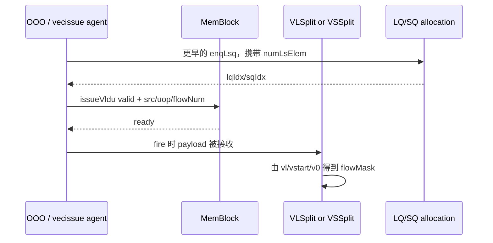

# V2 Vector Issue Agent 接口知识

## 版本元数据

| 项目 | 内容 |
|---|---|
| RTL 版本 | V2 |
| 分支 | `mem_ut_uvm_v2` |
| 核验 commit | `4ce3563a01254700ed5828797f288bafcc2b491c` |
| 权威源码 | `src/main/scala/xiangshan/backend/decode/DecodeUnit.scala`、`src/main/scala/xiangshan/backend/decode/UopInfoGen.scala`、`src/main/scala/xiangshan/backend/decode/DecodeUnitComp.scala`、`src/main/scala/xiangshan/backend/issue/IssueQueue.scala`、`src/main/scala/xiangshan/backend/issue/EntryBundles.scala`、`src/main/scala/xiangshan/backend/Backend.scala`、`src/main/scala/xiangshan/mem/MemBlock.scala`、`src/main/scala/xiangshan/mem/vector/VSplit.scala`、`src/main/scala/xiangshan/mem/vector/VfofBuffer.scala`、`src/main/scala/xiangshan/mem/lsqueue/LSQWrapper.scala`、`src/main/scala/xiangshan/mem/lsqueue/VirtualLoadQueue.scala`、`src/main/scala/xiangshan/mem/lsqueue/StoreQueue.scala`、`build/rtl/MemBlock.sv`、`build/rtl/VLSplitPipelineImp.sv`、`build/rtl/VfofBuffer.sv` |
| 最后核验日期 | `2026-08-25` |

## Agent 职责和边界

`vecissue_agent_agent` 驱动或观察 V2 MemBlock 的两个 `io_ooo_to_mem_issueVldu_<0|1>` 输入 lane。它承载普通 vector load/store 的 source、VPU 控制、LSQ 起始指针和 replay 元数据；MemBlock 在 `valid && ready` 后按 `fuOpType` 将请求送入 `VLSplit`、`VSSplit` 或 segment 专用路径。

本 agent 不独立拥有 `io_ooo_to_mem_enqLsq_*` 的生命周期；普通向量 LS 的 LQ/SQ entry 已在更早的 Dispatch 阶段由该接口分配。但 standalone 向量 source 必须与 enqueue 侧联合构造，因此本文也记录其历史约束：`issueVldu` 的 `lqIdx/sqIdx/flowNum` 必须与同一 `(robIdx, vuopIdx)` 的历史 enqueue 请求一致。segment 和 FOF-fix-VL 路径不走普通 enqueue，不能用本接口字段套普通 LSQ 规则。

## RTL 顶层端口

两个 lane 的字段含义相同；`_0` 额外能接 segment，因此其 `ready` 可因 segment path 置高。

| 端口/字段 | 方向 | 位宽 | valid/ready 关系 | 功能语义 | 源码位置 |
|---|---:|---:|---|---|---|
| `issueVldu_<n>_valid` | OOO -> MemBlock | 1 | 与同 lane `ready` 同时为 1 时接受 payload。 | 发射一条 vector memory uop。 | `MemBlock.scala:1565-1693` |
| `issueVldu_<n>_ready` | MemBlock -> OOO | 1 | load/store split input 可接受时为 1；lane 0 的 segment path 也可接受。 | 不允许在 `ready=0` 时改变等待中的 payload。 | `MemBlock.scala:1565-1574,1688-1693` |
| `src_0` | OOO -> MemBlock | 128 | payload 于 fire 采样。 | base address；VSplit 实际使用低 64 bit。 | `VSplit.scala:162` |
| `src_1` | OOO -> MemBlock | 128 | payload 于 fire 采样。 | strided 的 stride，或 indexed 的 index vector data。 | `VSplit.scala:163,222-228,358-364` |
| `src_2` | OOO -> MemBlock | 128 | payload 于 fire 采样。 | old `vd` 或 vector store data。 | `VSplit.scala:175` |
| `src_3` | OOO -> MemBlock | 128 | 仅当 `vm=0` 参与活动判定。 | 真实 `v0` mask，每 bit 对应逻辑元素。 | `VSplit.scala:132` |
| `src_4` | OOO -> MemBlock | 128 | payload 于 fire 采样。 | 当前 V2 VLSU 只读取 `src_4[7:0]` 作为 `vl`；`[127:8]` 不应被当作 `vtype` 输入。 | `VLSplitPipelineImp.sv:350-357` |
| `flowNum` | OOO -> MemBlock | 5 | 与已分配 LSQ entry 数保持一致。 | dispatch 的候选 flow/资源预留数，不是 `PopCount(flowMask)`。 | `Backend.scala:830-831`、`VSplit.scala:321,427` |
| `uop_vpu_vsew/vlmul/veew` | OOO -> MemBlock | 2/3/2 | 与 `fuOpType` 联合解释。 | 计算 `EMUL`、每 uop 窗口与元素/索引宽度。 | `VSplit.scala:55-109` |
| `uop_vpu_vm/vstart/vuopIdx` | OOO -> MemBlock | 1/8/7 | 与 `src_3/src_4` 联合解释。 | 生成 `flowMask` 的 mask 来源、起点和当前 uop 窗口。 | `VSplit.scala:100-143` |
| `uop_vpu_lastUop` | OOO -> MemBlock | 1 | 仅在 `valid && ready` 的 payload 中有意义。 | 当前 backend `DynInst` uop 序列的末 uop 标记；由 VecMem IQ 将通用 `payload.lastUop` 复制到 VPU 域。不是最后一个 flow。 | `IssueQueue.scala:1231-1245` |
| `uop_vpu_isVleff` | OOO -> MemBlock | 1 | 仅在 `valid && ready` 的 payload 中有意义。 | 普通单 field FOF load 的 Decode 类型标签：`isVload && fuOpType==vleff && NF==0`。不是“本拍发生 fault”。 | `DecodeUnit.scala:1057-1072` |
| `uop_vpu_vmask` | OOO -> MemBlock | 128 | 不参与普通 VSplit 的活动 mask 公式。 | VPU/写回合并字段；普通 VLSU 的输入掩码来源仍是 `src_3`。 | `VSplit.scala:132`、`VMergeBuffer.scala:98-110` |
| `isVecPartReplay/vecReplayMask/vecReplayMbIdx` | OOO -> MemBlock | 1/16/4 | replay issue 时有效。 | `vecReplayMask` 覆盖正常生成的 `flowMask`；不产生新的 LSQ enqueue。 | `VSplit.scala:135-139` |

`VConfig` 是逻辑对象，定义为 `vtype + vl`。当前 VLDu/VSTu 配置的第五源操作数却是 8-bit `VlData()`；统一 128-bit `src` 总线导致顶层端口看起来很宽。Decode 把 `Vl_IDX` 设为 `lsrc(4)`，并把 `vtype` 快照写入 `uop.vpu`，所以接口使用者必须把两部分作为同一配置的两个载体，而不是把完整 `VConfig` 打包进 `src_4`。

### FOF 的末 uop 约束

`uop_vpu_lastUop` 和 `uop_vpu_isVleff` 不应各自孤立随机化。它们的来源和组合关系如下：

```text
Decode/DecodeUnitComp: 生成通用 payload.lastUop
VecMem IQ dequeue:     uop.vpu.lastUop := payload.lastUop
Decode:                uop.vpu.isVleff := isVload && (fuOpType == vleff) && (NF == 0)
Backend:               将整个 uop.vpu 原样放到 issueVldu payload
```

对于普通非 FOF 向量访存，`lastUop=0/1` 仅表示 backend uop 序列位置，MemBlock 不会因为 `lastUop=1` 绕过 VLSplit。对于普通单 field `vleff.v`，Decode 额外生成一个读写 `Vl_IDX` 的 `fix-VL` 尾 uop。这个尾 uop 的 `vecWen=0`、`vlWen=1`、`src_4[7:0]` 携带旧 `vl`，并满足：

| `uop_vpu_isVleff` | `uop_vpu_lastUop` | 输入 uop 类型 | 必须遵守的接口行为 |
|---:|---:|---|---|
| 0 | 0 或 1 | 普通 vector load/store。 | 按 normal VLSU 协议给出 `flowNum` 和匹配的 LSQ entry。 |
| 1 | 0 | FOF data-uop。 | 仍是实际 load uop，走普通 VLSplit/merge/LSQ；其 `flowNum` 仍是数据 uop 的资源预留数。 |
| 1 | 1 | FOF `fix-VL` 尾 uop。 | `Rename/NewDispatch` 不给它普通 LSQ entry；MemBlock 排除它的 VLSplit 输入，并由 `VfofBuffer` 以各 data-uop 汇总出的最终 `vl` 产生 `vlWen` writeback。 |

因此，顶层检测到 `isVleff && lastUop` 时，不能把它作为“最后一个实际 load flow”。它是一次元数据/CSR 风格的 `vl` 更新收尾。生成 RTL 中 `MemBlock.sv` 直接使用这一与式屏蔽 `VLSplit` 输入；`VfofBuffer.sv` 也只在这两个 bit 同时为 1 且未 redirect 时发布最终 writeback。

`isVleff=1` 本身不表示异常。真实 FOF 结果由普通 data-uop 的 merge 回报决定：非 0 元素出错时 VLSU 缩短 `vl`，元素 0 出错时保留精确异常。segment FOF 是例外：因为 `NF != 0`，其 `isVleff` 为 0，`VSegmentUnit` 直接根据 `fuOpType==vleff && lastUop` 进入自己的收尾状态，不能用普通 `VfofBuffer` 的字段约束替代。

#### FOF 的 `issueVldu` 时序约束

完整后端可以先把同一 FOF 的 data-uop 与 tail 都放进 VecMem IQ，但它们不能任意乱序到达顶层。每个 `isVleff=1` IQ entry 受 `lqIdx == lqDeqPtr` 门控；tail 没有普通 LQ entry，却从 `LsqEnqCtrl` 得到紧跟所有 FOF data-uop LQ range 的端点 `lqIdx`。因此 full-core 的实际 issue 必须保持：

```text
FOF data-uop 0 完成 -> data-uop 1 完成 -> ... -> fix-VL tail
```

其中“完成”是对应 LQ range 已由 merge 回报并推进 dequeue 指针，不只是该 uop 已被 VLSplit 接收。`VfofBuffer` 只保存一个活动 FOF，并用 priority mux 接收 `isVleff=1` 输入；同拍两个 FOF、当前 buffer 有效时来自不同 `robIdx` 的 FOF，或 tail 已到达后再有 FOF，均违反其源码断言。

普通 `isVleff=0` 向量 uop 不受该 FOF IQ gate 和 `VfofBuffer` 过滤，独立时可以在物理 issue 时间线上穿插；但程序顺序在 FOF 之后、需要新 `VL` 的向量 uop 会依赖 tail 的 `vlWen` 写回，不能绕过 tail。

本 agent 若直接驱动 MemBlock 顶层，则已经绕过 VecMem IQ 的 `lqDeqPtr` 门控。最简单且正确的 driver 策略是：一个 FOF data-uop 完成并观察到普通 writeback 后，再发下一 data-uop；所有 data-uop 完成后再发 tail；在 tail writeback `fire` 或 redirect 前不发另一条 FOF，也不在同拍驱动两个 `isVleff=1` lane。若要穿插普通向量 uop，必须由测试框架的 VL/向量寄存器 scoreboard 先证明它与当前 FOF 独立。

### 普通 vector store 的 `lastUop` 约束

FOF 之外，`lastUop` 还必须在 `enqLsq` 与 `issueVldu` 两个时间点保持同源：对同一
`(robIdx, vuopIdx)`，driver 生成的 `enqLsq.req.lastUop` 必须等于后续
`issueVldu.uop.vpu.lastUop`。StoreQueue 先消费 enqueue 字段，并仅在这个 uop 连续
`numLsElem` 个 SQ entry 的尾 entry 把它转成 `vecLastFlow`。

当 data buffer 当前批次观察到 vector store 异常且尚未到达该尾 entry 时，
`vecExceptionFlag` 会阻止同一 `robIdx` 的后续 vector store entry 写入 SBuffer；尾 entry
经过 data buffer 时清除该 flag。因此，对普通 `vstu`：

- `lastUop=1` 只能出现在 Decode 模板的宏指令末 uop，不能按元素、`flowMask` 或
  `flowNum` 独立随机。
- 不得提前置位或漏置。前者会把异常抑制边界提前，后者会使 `vecExceptionFlag` 无法在
  正确边界清除。
- 这个行为不改变 VSSplit 的实际 `activeNum`，也不为普通 vector load 增加同类处理。

## 约束随机化生成与字段依赖

### 1. 为什么不能把顶层字段逐个独立随机

`issueVldu` 的 payload 是后端已经完成 Decode、Rename、Dispatch 和 Issue Queue 保存后的
一条 **uop 快照**。因此不少字段不是“任意合法 bit”，而是前面阶段计算出的结果。例如：

- `fuOpType` 决定 load/store、地址模式、whole/mask/FOF；它进一步决定 `fuType`、`nf`、
  `isVleff` 和 `flowNum` 的计算分支。
- `vsew`、`vlmul`、`veew` 共同决定 `EMUL`、`VLMAX`、uop 数和每个 uop 的候选 flow 数。
- `vuopIdx`、`lastUop` 和源数据布局必须来自同一条宏指令的 uop 模板，不能各自随机。
- `lqIdx/sqIdx` 是更早的 `enqLsq` 分配结果；只随机一个指针而不建立历史 LSQ 记录，
  会导致 MemBlock 生成的访问无法在 LQ/SQ 中匹配。
- `vecReplayMask` 和 `vecReplayMbIdx` 是前一轮 merge buffer feedback 的结果，只能在
  replay 周期生成，不能在首次 issue 时凭空产生。

因此，推荐把随机模型写成一个有向无环图，而不是一张扁平的 `rand` 字段表：

```text
宏指令 descriptor
  -> 地址模式、load/store、whole/mask、FOF、segment、NFIELDS
  -> SEW/LMUL/EEW 和 vma/vta/vm
  -> EMUL、VLMAX、有效 VL、uop 数、候选 flowNum
  -> base/stride/index、v0、old vd/store data
  -> vuopIdx、lastUop、isVleff、写使能和 src 布局
  -> ROB/FTQ/pdest 分配
  -> 历史 enqLsq 产生 lqIdx/sqIdx
  -> valid/ready fire
  -> mem_to_ooo feedback 决定完成、重放或异常
```

这里的“先随机”是指先确定**语义描述符**；`flowNum`、指针、uop 序号和 replay 字段都
属于后续派生或历史状态，不应作为同一层的独立随机量。

### 2. 顶层字段的类别

| 类别 | 典型字段 | 生成方式 | 随机化原则 |
|---|---|---|---|
| 描述符层独立输入 | 指令方向、地址模式、`vsew`、`vlmul`、`veew`、`nf`、`vm/vma/vta`、`VL`、`vstart`、地址和数据 | 约束随机 | 先保证组合语义合法，再生成下游字段 |
| uop 派生字段 | `fuType`、`flowNum`、`vuopIdx`、`lastUop`、`isVleff`、写使能、`pdest` 类别 | 由描述符、uop 模板和寄存器分配器计算 | 禁止与描述符脱钩独立随机 |
| 历史分配字段 | `robIdx`、`ftqPtr`、`ftqOffset`、`lqIdx`、`sqIdx` | 环形队列/物理寄存器状态机分配 | 必须保留 flag 翻转和连续 entry 关系 |
| 握手和反馈 | `valid`、`ready`、`writebackVldu`、当前顶层可见的 `vstuIqFeedback` | `valid` 由发送方调度，其他是 DUT 输出 | `ready`/writeback/feedback 不由 driver 随机；Scala 内部的 load feedback 不等于当前生成顶层一定有同名端口 |

`MemExuInput` Scala Bundle 中还存在 `iqIdx`、`isFirstIssue` 等通用字段，但当前 V2
`MemBlock.sv` 的顶层 `issueVldu_0/1` 端口没有展开它们，说明它们在该模块边界被综合优化掉；
随机化时以生成 RTL 的实际端口为准，不要在 UVM 中自行添加一个“影子”依赖。

### 2.1 推荐的随机对象和构造器边界

建议 transaction 不直接把所有顶层字段声明成 `rand`。更稳妥的组织方式是让 descriptor
保存真正需要覆盖的语义，而由构造器填充 `issueVldu` payload：

```text
randomize_descriptor():
  rand 指令方向/地址模式/whole-mask-FOF-segment 分类
  rand vsew/vlmul/veew/nf/vm/vma/vta
  rand VL/vstart/base/stride-or-index/v0/old-vd-or-store-data
  约束 vtype、EMUL 和 VL 范围

build_macro_template(descriptor):
  由真实 Decode 规则得到 data-uop 与 FOF tail 模板

allocate_history(template):
  分配 ROB/FTQ/pdest；对普通 data-uop 先建立 enqLsq，再记录 lqIdx/sqIdx

build_issue_payload(template_uop):
  填 fuType/fuOpType、vuopIdx/lastUop/isVleff、写使能、src、flowNum 和指针

apply_feedback(outstanding, feedback):
  正常完成则回收；部分 replay 则只由 feedback 填 replay 三字段并重发原 uop
```

如果使用 SystemVerilog `post_randomize()`，它适合实现 `EMUL/VLMAX/flowNum` 等纯函数
派生；但 `lqIdx/sqIdx/pdest/vecReplayMbIdx` 依赖共享队列状态或 DUT 历史，应该由 test
environment 的分配器/scoreboard 服务生成，而不应藏在单一 transaction 的局部约束中。

### 3. 描述符层的合法约束

#### 3.1 指令类别、lane 和操作码

`uop_fuOpType` 是 9 bit 的编码字段，不应随机所有 `0..511`。V2 普通向量访存可以使用
下列操作码（前两位是方向/向量标志，中间两位是 `mop`，低五位是 `lumop/sumop`）：

| 类别 | 合法 `fuOpType` | 地址/语义 |
|---|---|---|
| load | `01_00_00000` (`vle`)、`01_00_01000` (`vlr`)、`01_00_01011` (`vlm`)、`01_00_10000` (`vleff`) | unit-stride、whole、mask、FOF |
| indexed load | `01_01_00000` (`vluxei`)、`01_11_00000` (`vloxei`) | indexed-unordered/ordered |
| strided load | `01_10_00000` (`vlse`) | strided |
| store | `10_00_00000` (`vse`)、`10_00_01000` (`vsr`)、`10_00_01011` (`vsm`) | unit-stride、whole、mask |
| indexed store | `10_01_00000` (`vsuxei`)、`10_11_00000` (`vsoxei`) | indexed-unordered/ordered |
| strided store | `10_10_00000` (`vsse`) | strided |

`issueVldu_0` 的 `uop_fuType` 是 35 bit one-hot 字段，普通向量测试只允许：

```text
1 << 31 : vldu
1 << 32 : vstu
1 << 33 : vsegldu
1 << 34 : vsegstu
```

`issueVldu_1` 顶层没有 `uop_fuType` 端口，只生成普通非 segment VLSU uop；segment 只
能从 lane 0 进入。描述符约束还必须满足：

```text
fuOpType[8:7] == 2'b01  <=> load（vldu 或 vsegldu）
fuOpType[8:7] == 2'b10  <=> store（vstu 或 vsegstu）
```

lane 0 的 segment `fuType`、`nf` 和 `fuOpType` 必须同时匹配；不能只把 one-hot bit 改成
`vsegldu` 而保留普通指令的 `nf=0` 语义。

#### 3.2 `SEW/LMUL/EEW/EMUL/VLMAX/VL`

对普通非 whole、非 mask 指令，先随机 `vsew`、`vlmul` 和 `veew`，再计算：

```text
s = vsew               // 无符号编码 00/01/10/11 -> e8/e16/e32/e64 的 log2(bytes)
l = signed(vlmul)      // 000/001/010/011/101/110/111 -> 0/1/2/3/-3/-2/-1
w = veew               // 00/01/10/11 -> 0/1/2/3
emulExp = l + w - s
EMUL = 2^emulExp
VLMAX = 2^(4 + l - s)  // VLEN=128 bit，即 16 byte
```

合法约束为：

```text
vlmul != 3'b100
-3 <= emulExp <= 3          // EMUL ∈ {mf8,mf4,mf2,m1,m2,m4,m8}
4 + l - s >= 0              // 当前 V2 测试模型保证 VLMAX >= 1
0 <= VL <= VLMAX
0 <= vstart <= VLMAX        // vstart == VL 允许生成无 active 元素的边界场景
```

如果测试目标是“必须真的产生访存”，还应增加：

```text
VL > 0
vstart < VL
vm == 1 或当前 uop 的 v0 mask 窗口至少有一位为 1
```

`VL=0`、`vstart>=VL` 或全 mask-off 是合法的 no-op 场景，但它们只会让后续
`flowMask/activeNum` 变成 0；普通入口的保守 `flowNum` 仍不能因此改成 0。

whole-register 和 mask-register 是两个覆盖分支：

- `vlr/vsr` 的 `EMUL` 和有效 `VL` 使用 `GenUSWholeEmul`、`GenUSWholeRegVL`，
  `nf` 只能使用 `0/1/3/7`，分别代表 1/2/4/8 个寄存器。
- `vlm/vsm` 强制 `EMUL=m1`，有效长度是 `ceil(VL/8)`；不要把 mask bit 数当作普通
  `SEW` 元素数。

#### 3.3 `nf`、segment、FOF 和 `isVleff`

```text
普通 non-segment load/store：nf = 0
普通单 field FOF：          nf = 0，fuOpType = vleff，isVleff = 1
segment load/store：         nf = 1..7，lane = 0，fuType 为 vsegldu/vsegstu
whole-register：             nf ∈ {0,1,3,7}
```

`uop_vpu_isVleff` 的生成式是：

```text
isVleff = (fuType 是 load) && (fuOpType == 01_00_10000) && (nf == 0)
```

所以 segment FOF 虽然 `fuOpType` 也可能是 `vleff`，因为 `nf!=0`，顶层普通 VPU 字段的
`isVleff` 仍应为 0；segment 单元使用自己的 `fuOpType && lastUop` 收尾规则。

### 4. uop 级派生约束

#### 4.1 `flowNum`：先算候选容量，再填入口字段

`flowNum` 是 dispatch 时的保守候选数，同时必须等于同一 `(robIdx, vuopIdx)` 的历史
`enqLsq.req.numLsElem`（segment 和 FOF tail 除外）。普通 V2 的计算顺序是：

```text
MulDataSize(mf8/mf4/mf2) = 2/4/8 byte
MulDataSize(m1/m2/m4/m8) = 16 byte

unit-stride:
  flowNum = 2

strided:
  flowNum = MulDataSize(EMUL) / EEW_bytes

indexed:
  if EMUL > LMUL:
    flowNum = MulDataSize(EMUL) / EEW_bytes
  else:
    flowNum = MulDataSize(LMUL) / SEW_bytes
```

普通非 segment、非 FOF-tail 的合法入口值通常为 `1..16`；unit-stride 固定为 `2`。
`17..31` 虽然 5 bit 可以表示，但不是当前 V2 普通 VLSU 的合法随机值。`flowNum=0`
只用于 FOF `fix-VL` 尾 uop 或内部 merge buffer 的“实际待完成数为零”，不能用来表达
普通 uop 的 mask 全 0。

segment 由 `VSegmentUnit` 重新按 `GenRealFlowNum(..., isSegment=true)` 计算自己的
`uopFlowNum`，而且不占普通 LQ/SQ；随机器仍应使输入 `flowNum` 与后端模板一致，但不能
用“入口 flowNum 等于普通 LSQ entry 数”的断言检查 segment。

#### 4.2 `vuopIdx`、`lastUop` 和 `isVleff` 的生成顺序

先由 `UopInfoGen/DecodeUnitComp` 按 `EMUL/LMUL/NFIELDS` 和指令类型生成该宏指令的
完整 backend uop 模板，再从模板中筛出真正送往 `issueVldu` 的 uop。对普通 data-uop，
可以用下面的容量关系理解其大致规模：

```text
普通 non-indexed：dataUops 约为 NFIELDS * 2^max(0, emulExp)
indexed：         dataUops 约为 NFIELDS * 2^max(0, max(l, emulExp))
vuopIdx           = 由完整模板给出的 VLSU uop 序号
lastUop           = 由完整模板的末 uop 标记派生
```

这里的公式只说明寄存器容量带来的 VLSU data-uop 数量级；真实模板还可能包含搬移、配置
或 FOF 收尾 uop，因此不能用公式直接给 `vuopIdx` 或 `lastUop` 赋值。whole/mask、
segment 和 FOF tail 必须使用各自的 Decode/UopInfoGen 模板。对单 field FOF，生成顺序应是：

```text
1. 先生成完整模板：`isVleff=1、lastUop=0` 的实际 data-uop，以及一个
   `isVleff=1、lastUop=1` 的 fix-VL tail；不能在功能结果已发生后才临时伪造 tail。
2. full-core 由 VecMem IQ 的 LQ dequeue 指针使 data-uop 按顺序发射，tail 仅在所有 data-uop
   LQ range 完成后才发射。standalone 顶层 driver 必须自行复现这个发射顺序。
3. fix-VL uop 的 vecWen=0、v0Wen=0、vlWen=1、flowNum=0。tail 不拥有普通 LQ/SQ entry；
   在 full-core 中其历史 `lqIdx` 仍是排序端点，在直接 MemBlock 输入模型中该字段功能无关，
   但不得把它当作可以替代顺序控制的随机值。
```

`vuopIdx` 不是 7 bit 的任意值；当前 V2 最大模板约为 64 个 uop，因此应满足
`0 <= vuopIdx < dataUops <= 64`。`lastUop=1` 也不是“最后一个 flow”，不能据此把
`flowNum` 改成 1 或 0。

#### 4.3 写使能与 `pdest`

三个写使能表示目的寄存器所属的物理寄存器文件，而不是向量模式本身，也不是可以独立随机的
bit。V2 的生成关系是：`VecDecoder.VLD` 对所有向量 load 先给普通向量写使能，`VST` 对向量
store 不给向量写使能；随后 `DecodeStage` 根据实际 `ldest` 将写 `v0` 的 uop 转换为独立的
`v0Wen`：

```scala
inst.bits.v0Wen := finalDecodedInst.vecWen && finalDecodedInst.ldest === 0.U ||
                    finalDecodedInst.v0Wen
inst.bits.vecWen := finalDecodedInst.vecWen && finalDecodedInst.ldest =/= 0.U
```

对送到 `issueVldu` 的有效 data-uop，推荐使用下面的派生规则：

```text
isFofTail = uop.vpu.isVleff && uop.vpu.lastUop

isFofTail：
  vecWen=0, v0Wen=0, vlWen=1

非 FOF tail 的 vector store：
  vecWen=0, v0Wen=0, vlWen=0

非 FOF tail 的 vector load：
  ldest == 0：
    vecWen=0, v0Wen=1, vlWen=0
  ldest != 0：
    vecWen=1, v0Wen=0, vlWen=0
```

因此，`mask_load`（`vlm.v`）并不自动意味着 `v0Wen=1`。`vlm.v` 仍由 `VLD` 解码为向量
目的写入；只有它的实际目的寄存器是架构 `v0`（`ldest==0`）时，才由 `DecodeStage` 转成
`v0Wen=1`。同理，`vm=0` 只表示读取 `v0.t` 作为 mask，不表示本条指令写 `v0`；读 mask
和写 v0 是两个独立方向。

对 LMUL 大于 1 且目的寄存器组从 `v0` 开始的 load，多个 data-uop 甚至可能出现不同组合：
映射到 `ldest==0` 的 uop 使用 `v0Wen=1`，映射到 `ldest!=0` 的后续 uop 使用 `vecWen=1`。
因此不能把同一宏指令的三个写使能简单地复制到所有 uop；应先保存每个 uop 的目的寄存器
映射，再按上述规则派生。

`vma/vta` 只影响 inactive/tail 的目的数据合并，`vm` 只影响输入 mask，`vsew/vlmul/veew`
只影响元素解释和拆分，均不直接决定这三个写使能。普通 data-uop 的 `lastUop=1` 也不等于
`vlWen=1`；只有 `isVleff && lastUop` 的 FOF `fix-VL` tail 才写 VL。

至少应满足：

```text
PopCount(vecWen, v0Wen, vlWen) <= 1
```

`pdest` 的物理宽度是 8 bit，但合法值由对应 free-list 决定：`vecWen=1` 时必须来自
vector physical register free-list，`v0Wen=1` 时来自 v0 free-list，`vlWen=1` 时来自
vl free-list。三个写使能全为 0 时（普通 store）`pdest` 应使用 canonical 值；不能只按
`0..255` 独立随机。独立模型应维护三类 free-list，并在完成/flush 后分别归还旧目的寄存器。

### 5. 顶层所有输入字段的合法域与生成方式

下表覆盖 V2 `build/rtl/MemBlock.sv` 实际展开的 `issueVldu_0/1` 输入。`_0` 和 `_1`
的公共字段约束相同，只有 `fuType` 和 segment 路由不同。

| 字段 | 物理合法域 | 依赖约束和生成行为 |
|---|---|---|
| `issueVldu_<n>_valid` | `0/1` | 由发送调度器决定；`valid=1 && ready=0` 时整个 payload 保持不变。建议 `valid=0` 时把 payload 清成 0，避免 X 传播。 |
| `uop.ftqPtr.value/flag` | value `0..63`；flag `0/1` | 由 FTQ 环形分配器产生；同一宏指令的所有 uop 通常共享相同 FTQ record。跨 64 项回绕时翻转 flag，不能独立随机两者。 |
| `uop.ftqOffset` | `0..15` | 必须是该 FTQ entry 内的指令偏移；同一条指令的 uop 保持一致。 |
| `uop.fuType`（仅 lane 0） | one-hot 的 bit31/32/33/34 | 由 descriptor 的普通/segment 和 load/store 方向派生；lane 1 无该顶层端口，只能是普通 VLSU。 |
| `uop.fuOpType` | 见操作码表 | `[8:7]` 必须与 load/store 方向一致，并与 `fuType`、地址模式、FOF/whole/mask 一致。 |
| `uop.vecWen/v0Wen/vlWen` | 各 `0/1` | 由 `fuType/fuOpType`、FOF tail 判定和每个 uop 的 `ldest` 派生；最多一个为 1，store 全 0，FOF tail 仅 `vlWen=1`；`mask_load` 不自动等于 `v0Wen=1`。 |
| `uop.vpu.vma/vta/vm` | 各 `0/1` | `vm=1` 时不读取 `src_3`；`vm=0` 时 `src_3` 必须是真实 v0 mask。`vma/vta` 不改变入口访存 flow，只影响 inactive/tail 写回。 |
| `uop.vpu.vsew/veew` | `00..11` | 分别表示 e8/e16/e32/e64；与 `vlmul` 联合计算 EMUL，不能在 EMUL 不合法时保留该组合。 |
| `uop.vpu.vlmul` | `000,001,010,011,101,110,111` | `100` 保留；按带符号指数解释，不按无符号 0..7 解释。 |
| `uop.vpu.vstart` | 推荐 `0..VLMAX` | 由恢复状态派生；`vstart>=VL` 可作为合法 no-op，若要求实际访存则约束 `<VL`。 |
| `uop.vpu.vuopIdx` | `0..dataUops-1`，V2 模板最大约 64 | 由宏指令 uop 模板派生，不能独立随机 7 bit。 |
| `uop.vpu.lastUop` | `0/1` | 由 uop 序列位置派生；FOF 还要额外生成 fix-VL tail，不能把它解释成最后 flow。 |
| `uop.vpu.nf` | 普通 `0`；segment `1..7`；whole `0/1/3/7` | 由 opcode/segment/whole 描述符派生；只有非 whole 指令的 `nf!=0` 才是 segment，且必须在 lane0 走 segment 路径。whole 的非零 `nf` 是寄存器数量编码，不是 segment。 |
| `uop.vpu.isVleff` | `0/1` | 精确由 `isVload && fuOpType==vleff && nf==0` 得到；不是动态 fault 标志。 |
| `uop.vpu.vmask` | 128 bit | 普通 VLSU 不用它生成入口活动 mask；独立接口模型可 canonical `0`，完整 backend 中它也可能由通用向量唤醒链携带，不能把它当成 `src_3` 的替代品。 |
| `uop.pdest` | 8 bit，语义值来自相应 physical free-list | 与 `vecWen/v0Wen/vlWen` 的寄存器类别匹配；FOF tail 使用 VL physical destination。 |
| `uop.robIdx.value/flag` | value `0..159`；flag `0/1` | 由 ROB 环形分配器产生；同一宏指令的 uop 按设计可能共享或按末 uop 递进，必须以 backend 模板记录为准，不能独立 random。 |
| `uop.lqIdx.value/flag` | value `0..71`；flag `0/1` | 普通 load data-uop 使用历史 LQ 起始指针；`splitIdx=k` 使用环形偏移 `lqIdx+k`。FOF tail 不拥有普通 LQ entry，但 full-core 中它保留 LsqEnqCtrl 形成的 prefix 端点以供 VecMem IQ 排序；直接 MemBlock 顶层模型中该字段可 canonical 为 0，但必须由 driver 单独维持 tail 时序。store、segment 不需要普通 LQ entry。 |
| `uop.sqIdx.value/flag` | value `0..55`；flag `0/1` | 普通 store data-uop 使用历史 SQ 起始指针；load、segment、FOF tail 不需要普通 SQ entry，建议置 0。 |
| `src_0` | 低 64 bit 为 base VA；高 64 bit 建议 0 | 先随机对齐/未对齐 base，再由地址模式和元素宽度决定是否触发跨 16B 或 misalign 场景。 |
| `src_1` | 128 bit | unit-stride 固定 0；strided 当前只消费低 64 bit 的两补码 stride，独立模型应把高 64 bit canonical 为 0，不能把“必须符号扩展到 128 bit”写成约束；indexed 为按 `veew` 切分的 index-vector chunk，必须与 `vuopIdx` 对应。 |
| `src_2` | 128 bit | load 是 old `vd` chunk，store 是 `vs3` data chunk；`vma/vta=0` 时 old vd 不能用无关随机数替代；FOF fix-VL 置 0。 |
| `src_3` | 128 bit | `vm=1` 时建议置 0；`vm=0` 时为真实 v0 mask，位 `i` 对应逻辑元素 `i`，超出当前 VLMAX 的位建议清 0。 |
| `src_4` | 低 8 bit 为 VL，高位建议 0 | `src_4[7:0]=VL`；不要把 `vtype` 打包到高位，`vsew/vlmul/veew/vm/vstart` 均来自 `uop.vpu`。whole/mask 指令的有效长度由专用换算覆盖。 |
| `flowNum` | 普通 non-unit `1..16`；unit-stride `2`；FOF tail `0` | 由 `EMUL/LMUL/EEW/SEW/address mode` 派生，并等于历史 `enqLsq.req.numLsElem`；不能填 `VL` 或 `PopCount(flowMask)`。segment 使用专用模板。 |
| `isVecPartReplay` | `0/1` | 首次 issue 必须为 0；只有历史 feedback 明确请求部分 replay 时才为 1，通常限于非 unit-stride store。 |
| `vecReplayMask` | 16 bit | `isVecPartReplay=0` 时置 0；为 1 时是历史 merge buffer mask 的非零子集，且不能包含原 uop 不可能覆盖的 flow。 |
| `vecReplayMbIdx` | `0..15` | 只能引用仍在用的 store merge-buffer entry；由历史 feedback 产生，不能独立随机。 |

`issueVldu_<n>_ready`、`mem_to_ooo.writebackVldu_0/1` 和当前生成顶层实际可见的
`vstuIqFeedback_0/1.feedbackSlow` 都是 MemBlock 输出，不属于输入约束；driver 应采样
并据此推进状态机。Scala 的 VecMem IQ 也有 load feedback 通道，但当前
`build/rtl/MemBlock.sv` 没有展开同名 `vlduIqFeedback` 顶层端口，不能在 UVM interface
中凭 Bundle 名称假定它存在。

### 6. `flowMask` 的检查计算，而不是随机输入

顶层没有 `flowMask` 字段。checker 应在每个 `valid && ready` fire 后，用已生成的描述符
重算它：

```text
elementEnable[i] = (i >= vstart) && (i < effectiveVL) &&
                   (vm == 1 || src_3[i] == 1)

F = 当前地址模式下该 uop 的候选元素窗口宽度
P = uopIdxInField * F
Q = (uopIdxInField + 1) * F
D = vdIdxInField * numFlowsSameVd

windowMask = elementEnable & LowMask(Q) & ~LowMask(P)
shift      = indexed && (EMUL > LMUL) ? P : D
expectedFlowMask = (windowMask >> shift)[15:0]
```

部分 replay 时，预期值改为 `vecReplayMask`，但仍要检查它是原始候选 flow 的非零子集。
`flowMask` 与入口 `flowNum` 的关系是“活动内容”和“保守容量”，不是相等关系；unit-stride
还要将元素 mask 展开为 byte mask，再按地址低位判断最终实际是 0/1/2 个 16B flow。

### 7. LSQ 指针的历史依赖

普通 uop 的生成顺序必须是：

```text
1. 分配 robIdx、FTQ record、pdest。
2. 根据 descriptor 和 EMUL 计算 numLsElem/flowNum。
3. 由 LsqEnqCtrl 或 standalone 分配器先构造对应的 enqLsq request 和连续 LQ/SQ 起始指针。
4. 把该起始指针和 flowNum 记录在 `(robIdx, vuopIdx)` 账本中。
5. 只有账本存在时，才允许 issueVldu fire。
6. VSplit 的 splitIdx=k 使用起始指针的环形偏移；uop 完成时由 feedback 释放这段 entry。
```

V2 当前物理容量是 ROB 160、LQ 72、SQ 56、FTQ 64、FTQ offset 16。value 字段的位宽大于
实际容量只是为了容纳非 2 次幂环形队列编码；跨容量时需要减去 capacity 并翻转 flag。
因此不能使用简单的 `value+1` 截断，也不能给每个 uop 随机一个不相干的 flag。

以下 uop 不应建立普通 LSQ entry：

```text
segment vector load/store
普通单 field FOF 的 fix-VL tail
非访存 vector arithmetic 和 vset*（它们不进入 issueVldu）
```

FOF data-uop 仍然是普通 load，仍需 LQ entry；“FOF”不能作为全部 FOF uop 的 LSQ 排除
条件。

#### 7.1 `enqLsq[0..5]`：必须先构造的历史输入

顶层 `io_ooo_to_mem_enqLsq_*` 不是 `issueVldu` 的附属 payload，而是 OOO/Dispatch 在更早
阶段送给 MemBlock 的六个 LSQ 入队 slot。当前 V2 顶层对每个 slot `j=0..5` 都暴露：

```text
needAlloc_j[1:0]
req_j.valid
req_j.bits.{exceptionVec[23:0], trigger[3:0], fuType[34:0], fuOpType[8:0],
             flushPipe, uopIdx[6:0], lastUop, robIdx, lqIdx, sqIdx, numLsElem[4:0]}
```

它没有 `ready`，也不向顶层返回 allocation response。真实全核中 response 已在
`LsqEnqCtrl` 内部生成并回写进 DynInst；因此 standalone driver 必须维护自己的 LQ/SQ
环形分配账本，而不是等待 MemBlock 给出一个新的 `lqIdx/sqIdx`。

对普通向量 data-uop，唯一正确的构造顺序是：

```text
descriptor -> uop template -> flowNum/numLsElem
           -> enqLsq slot 与连续 LQ/SQ 首指针
           -> 记录 (robIdx, uopIdx) 账本
           -> issueVldu 使用同一份身份、指针和 flowNum
```

这里 `enqLsq.req.uopIdx` 是通用 backend `uopIdx`，VecMem IQ 出队时把它复制到
`issueVldu.uop.vpu.vuopIdx`；所以本模型中的匹配关系是：

```text
enqLsq.req.robIdx             == issueVldu.uop.robIdx
enqLsq.req.uopIdx             == issueVldu.uop.vpu.vuopIdx
enqLsq.req.lastUop            == issueVldu.uop.vpu.lastUop
enqLsq.req.fuOpType           == issueVldu.uop.fuOpType
enqLsq.req.numLsElem          == issueVldu.flowNum
```

`issue` 的 lane 编号、`enqLsq` 的 slot 编号和 writeback lane 都不是事务 identity。一个
uop 应始终按 `(robIdx, uopIdx)` 和所属的 LQ/SQ 首指针匹配。

##### 7.1.1 `needAlloc` 与 `req.valid` 的联合约束

`needAlloc` 是二位资源类别，`req.valid` 才是本次 top-level enqueue 是否发生的有效位。只有
两者联合为真，内部 queue 才真正写 entry：

| 向量 uop 类别 | `needAlloc` | `req.valid` | 结果 |
|---|---:|---:|---|
| 普通 non-segment vector load，包括 FOF data-uop | `2'b01` | `1` | 分配从 `lqIdx` 开始、长度为 `numLsElem` 的连续 LQ entry。 |
| 普通 non-segment vector store | `2'b10` | `1` | 分配从 `sqIdx` 开始、长度为 `numLsElem` 的连续 SQ entry。 |
| segment load/store | 全核 wire 上可能保留历史值；standalone canonical 为 `2'b00` | `0` | 不建普通 LQ/SQ entry，由 `VSegmentUnit` 处理。 |
| FOF `fix-VL` tail | 全核 wire 上可能保留历史值；standalone canonical 为 `2'b00` | `0` | 不建普通 LQ/SQ entry，交给 `VfofBuffer`。 |
| idle | standalone canonical `2'b00` | `0` | 不入队。 |

`2'b11` 在当前 V2 `NewDispatch` 的生成逻辑中不会产生，随机向量 driver 不应使用。对
`valid=1` 的普通 vector request，`needAlloc=2'b00`、方向与 `fuType/fuOpType` 不符，或
`numLsElem=0` 都是非法组合。

同拍多个 slot 不是可各自随意指定指针的六条独立请求。对于同一个周期、同一种 queue，
后面 slot 的首指针由前面已分配长度累加得到：

```text
lqIdx[j] = lqBase + Sum(i < j, req[i].valid && needAlloc[i] == 2'b01 ? req[i].numLsElem : 0)
sqIdx[j] = sqBase + Sum(i < j, req[i].valid && needAlloc[i] == 2'b10 ? req[i].numLsElem : 0)
```

加法按实际 LQ=72、SQ=56 的环形容量回绕，同时翻转 pointer flag。为了先建立可靠的随机
环境，建议 standalone vector test 每拍只使用一个 vector enqueue slot；若要覆盖同拍多发射，
必须实现上式和队列 free-count 检查。V2 完整 Dispatch 对非 unit-stride vector 还施加较强
的 slot/顺序限制，不能把六个 slot 都当作可同时发出任意 strided/indexed vector uop 的端口。

##### 7.1.2 每个 `req.bits` 字段如何得到

| 字段 | 合法值或 baseline | 必须依赖的来源/行为 |
|---|---|---|
| `exceptionVec[23:0]` | 正常随机访存为全 `0`。 | 它是 Decode/前端异常快照，不在 `issueVldu` payload 中重新随机。若专门覆盖预异常，必须由异常模型选择架构允许的异常原因和优先级，不能任意拼多个 bit。 |
| `trigger[3:0]` | 正常场景为 `TriggerAction.None=4'hf`；枚举动作仅使用 `0..4` 或 `4'hf`。 | 从同一 DynInst 的 trigger 结果派生；不应与 `exceptionVec` 或指令语义脱钩随机。 |
| `fuType[34:0]` | 普通 load 为 `vldu`，普通 store 为 `vstu`；segment 虽有 `vsegldu/vsegstu` 类型，但不发普通 valid request。 | 与 `fuOpType[8:7]` 的 load=`2'b01` / store=`2'b10` 和 `needAlloc` 一致。 |
| `fuOpType[8:0]` | 仅使用表 3.1 中相应 vector load/store opcode。 | 与后续 `issueVldu.uop.fuOpType` 完全相同；地址模式、whole/mask/FOF 与 descriptor 一致。 |
| `flushPipe` | 普通无恢复场景为 `0`。 | 不是自由随机 bit；来自 Decode uop 模板。特别是带非零 `vstart` 的 complex vector 指令，DecodeUnitComp 会在模板中产生 pipeline flush/block 关系，应从模板取得而非硬编码为 0。 |
| `uopIdx/lastUop` | 分别是合法模板位置和该模板的末 uop 标记。 | 直接与 `issueVldu.uop.vpu.vuopIdx/lastUop` 绑定；不要用 flow 序号替代。 |
| `robIdx` | 160-entry 环形 ROB 的合法 `(flag,value)`。 | 与所有该宏指令 uop、issue、writeback/feedback 使用同一分配账本；不能独立随机 flag/value。 |
| `lqIdx/sqIdx` | owner pointer 是相应连续范围的首项。 | load 的 `lqIdx` 必须与 issue 相同；store 的 `sqIdx` 必须与 issue 相同。另一类 pointer 对 VLSU data path 是功能无关字段，standalone 可 canonical 为 0；bit-exact 全核模型则应保留 LsqEnqCtrl 计算的 response 值。 |
| `numLsElem` | 普通 data-uop 是由地址模式和 `EMUL/LMUL/EEW/SEW` 得出的 `1..16`，unit-stride 恒为 2。 | 等于 Rename `uop.numLsElem`，再等于 issue `flowNum`；不是 `VL`、`PopCount(flowMask)` 或本拍实际 active flow 数。 |

##### 7.1.3 全核一拍延迟与 standalone canonical 驱动

源 RTL 中 `LsqEnqCtrl` 把 Dispatch 侧信号寄存一拍才送到 MemBlock：

```text
top.needAlloc(t) = RegNext(dispatch.needAlloc)(t)
do_enq            = dispatch.req.valid && !redirect.valid && dispatch.canAccept
top.req.valid(t)  = RegNext(do_enq)(t)
top.req.bits(t)   = RegEnable(dispatch.req.bits, do_enq)(t)
```

因此完整后端的 bit-exact 周期模型中，`top.req.valid=0` **不推出** `top.needAlloc=0`：后者
可能是前一拍 Dispatch 残留的类别位，`req.bits` 也可能保持上一次已使能内容。真正写 LQ/SQ
的门控仍是 `needAlloc[x] && req.valid`。

独立驱动 MemBlock 时，没有必要人为复刻这段残留行为；更安全的 canonical 协议是：

```text
idle                 : req.valid=0, needAlloc=2'b00, payload=0
普通 vector load     : 一个时钟周期 req.valid=1, needAlloc=2'b01, 合法 req.bits
普通 vector store    : 一个时钟周期 req.valid=1, needAlloc=2'b10, 合法 req.bits
下一周期             : 回到 idle；随后或更晚再发对应 issueVldu
```

该接口没有 `ready`，把 `req.valid=1` 保持多拍会被内部 queue 视为多次 enqueue，不是
backpressure 等待。standalone driver 应先完成这一次 enqueue 并记录首指针，再发
`issueVldu`；完整 core 中 Dispatch 和 Issue Queue 可使两者在顶层同拍可见，但它们仍然由
同一份历史账本而非同一 lane/slot 直接绑定。

### 8. valid/ready 和 feedback 的跨周期闭环

推荐的发送器状态机如下：

```text
IDLE:
  生成 descriptor、uop 模板、LSQ 历史记录。
ISSUE_WAIT:
  valid=1；若 ready=0，保持所有 payload 不变。
FIRED:
  删除待发送副本，但保留 (robIdx, vuopIdx) outstanding 记录。
WAIT_FEEDBACK:
  等待 writeback 或当前顶层可见的 vstu feedback；不要按 issue lane 直接回收。
REPLAY:
  仅由 feedback 产生 replay 字段；复用原 uop/source/指针/flowNum。
DONE/FLUSH:
  根据 writeback/feedback 的命中、异常和 flush 状态释放账本。
```

首次 issue 的 canonical 值是：

```text
isVecPartReplay = 0
vecReplayMask   = 0
vecReplayMbIdx  = 0
```

部分 replay 时必须满足：

```text
isVecPartReplay = 1
vecReplayMask   = 历史 vstuIqFeedback.feedbackSlow 的 replayFlowMask
vecReplayMask   != 0
vecReplayMbIdx  = 历史 feedback 指向的 live merge-buffer entry
flowNum         = 原 issueVldu.flowNum，不改成 PopCount(vecReplayMask)
```

writeback 是一个 uop 一次，而不是每个 flow 一次。checker 应以
`(robIdx, vuopIdx)` 匹配 writeback，并再检查 `pdest` 和写使能；不能假设 lane 0 发出的
uop 必然由 `writebackVldu_0` 回收。V2 的 writeback 仲裁还会把 segment、load merge、
store merge 或 FOF buffer 结果合并到不同 lane，lane 不是事务身份。

#### 8.1 当前顶层输出如何反向决定下一次输入

下表是随机 driver 必须采样、但绝不能自行随机驱动的闭环信号。当前生成 RTL 的真实顶层
输出以 `build/rtl/MemBlock.sv` 为准：有 `writebackVldu_0/1` 和
`vstuIqFeedback_0/1.feedbackSlow`，没有同名的 `vlduIqFeedback` 顶层端口。

| DUT 输出 | 观察到的关键字段 | 对 outstanding 账本和后续输入的约束行为 |
|---|---|---|
| `issueVldu_<n>_ready` | 单 bit | 仅与同 lane 的 `valid` 组成 fire。`ready=0` 时待发 uop 的所有字段，包括 source、指针、`flowNum` 和 replay 字段都保持不变；不能重新 randomize。 |
| `writebackVldu_0/1` | `valid`、`robIdx`、`uop.vpu.vuopIdx`、`pdest`、写使能、`fuOpType`、`data`、`uop.vpu.vl` | `valid=1` 表示一个 uop 收尾。按 `(robIdx,vuopIdx)` 查找原请求，不按 issue/writeback lane 查找。普通返回应保留该 uop 的 opcode、目的寄存器类别和 VPU 配置；FOF `fix-VL` tail 的 `vlWen=1`，其输出 `uop.vpu.vl` 是汇总后的新 VL，不能用入站 `src_4` 的旧 VL 直接断言相等。匹配后回收该 uop 的 outstanding/pdest 状态。 |
| `vstuIqFeedback_<n>.feedbackSlow` | `valid`、`hit`、`sqIdx`、`lqIdx`、`isVecPartReplay`、`vecReplayMask`、`vecReplayMbIdx` | 当前顶层只向外暴露 store merge feedback。用 owner `sqIdx` 查找原 store；若 `isVecPartReplay=1`，则必有 `hit=0`、非零 `vecReplayMask`，下一次必须复用原 uop、source、SQ range 和 `flowNum`，仅将 replay 三字段替换为该反馈值，且不得重新发送 `enqLsq`。若该 bit 为 0，不能凭 `hit=0` 自动伪造 partial replay，unit-stride 等路径有不同处理。 |

因此，随机模型的“依赖字段”不只来自 descriptor，也来自历史 DUT 输出：首次发射时
`isVecPartReplay=0`；只有表中最后一行指定的反馈，才授权生成一条带
`isVecPartReplay=1` 的重发 uop。

### 9. 一个完整的生成例子

以普通 strided store `vsse32.v` 为例，先随机出：

```text
fuOpType = 10_10_00000
fuType   = vstu
SEW=e32 (vsew=2'b10), LMUL=m1 (vlmul=3'b000), EEW=e32 (veew=2'b10)
nf=0, vm=0, vma=0, vta=0, VL=3, vstart=0
base=0x1000, stride=16, v0[2:0]=3'b111, src_2=本 uop 对应的 vs3 data chunk
```

然后按依赖顺序得到：

```text
EMUL       = m1
VLMAX      = 4
flowNum    = 16B / 4B = 4
dataUops   = 1
vuopIdx    = 0
lastUop    = 1
isVleff    = 0
src_4[7:0] = 3
flowMask   = 4'b0111       // checker 计算，不作为输入发送
```

先为该 `(robIdx,vuopIdx)` 分配连续 4 个 SQ entry，再把起始 `sqIdx` 和 `flowNum=4`
放进 issue payload。`splitIdx=0/1/2` 产生三个 active flow，第四个候选位置因 `VL=3`
被 mask 掉，但入口仍保留 4 个 LSQ slot。

如果随后 `vstuIqFeedback.feedbackSlow` 返回 `isVecPartReplay=1、replayMask=16'h0004、
mbIdx=2`，下一次 payload 只修改 replay 三字段，复用原来的 opcode、source、rob/uop/LSQ
指针和 `flowNum=4`；不能重新随机 base/stride，也不能把 `flowNum` 改成 1。

## 握手和时序



对普通非 segment、非 FOF-fix-VL uop，`flowNum` 与历史 `enqLsq.req.numLsElem` 同源。VSplit 先保留该值用于候选 `splitIdx` 扫描，再把实际 `PopCount(flowMask)` 或 unit-stride 0/1/2 block 数送入 merge buffer。故 monitor 不应把 `flowNum` 误判为当前拍已经激活的元素数。

## UVM 组件映射

| RTL 信号 | interface | transaction | connect | monitor | driver |
|---|---|---|---|---|---|
| `issueVldu_0/1` payload 与 handshake | `vecissue_agent_agent_interface.sv` | `vecissue_agent_agent_xaction.sv` | `tb/vecissue_agent_connect.sv` | `vecissue_agent_agent_monitor::mon_data()` | `vecissue_agent_agent_driver::drive_item()` |
| `src_4[7:0]` 的 `vl` | 同上 | 当前以完整 128-bit 字段保存 | 同上，`MEMBLOCK_UT` 下强制到 DUT input | 同上 | 当前 driver 不发送 vector valid；未来扩展 sequence 时必须明确给低 8 bit 合法 `vl`。 |
| `flowNum` 与 LSQ 关联 | 同上 | 同上 | 同上 | 同拍采样 issue 值 | 当前 driver 不发送 vector valid；未来驱动必须与 `lsqenq_agent` 的历史 request 保持一致。 |

当前 `vecissue_agent_agent_driver::send_pkt()` 明确检查两个 `issueVldu.valid`，任一为 1 就 `uvm_fatal`，随后仅调用 `drive_idle()`。因此本 agent 目前是接口/monitor 落点，不是已经具备向量请求发射能力的可用 stimulus agent。本文的字段配置说明的是 DUT ABI；若后续需要真正产生 vector issue，必须先按项目授权和 agent 规则实现 payload 驱动、valid/ready 保持以及与 `enqLsq` 的关联，不能只把一个随机 xaction 送给现有 driver。

## 关联 Flow

- [V2 RVV 向量接口与执行流综合知识](../../../rtl/v2/flows/vector_rtl_comprehensive_knowledge.md)：汇总 RVV 状态、`src_0~src_4`、EMUL/uop/flow、LSQ、FOF、segment、replay 和写回。
- [V2 正常向量访存 uop 与 flow 拆分](../../../rtl/v2/flows/vector_memory_uop_flow_decomposition.md)：`src_4`、`flowMask`、`flowNum`、merge buffer 和 LSQ 资源关系。
- [LSQ 入队与 Redirect 恢复 flow](../../../rtl/v2/flows/lsq_enqueue_redirect_flow.md)：`numLsElem` 如何在 Dispatch 时分配连续 LQ/SQ entry。

## V2/V3 差异

本文只核验 V2。V3 使用聚合的 `vecIssue` 形态，不应把本文件的 `issueVldu_0/1` 顶层字段和 128-bit `src_4` 端口直接套用到 V3。

## 源码证据

- `src/main/scala/xiangshan/backend/fu/FuConfig.scala:757-796`：VLDu/VSTu 的五个 source 声明、`vconfigWakeUp` 和 `maskWakeUp`。
- `src/main/scala/xiangshan/backend/datapath/DataConfig.scala:16-22`、`src/main/scala/xiangshan/backend/Bundles.scala:963-978`：`VlData()` 的 8-bit 宽度与 `MemExuInput` 统一 128-bit source 端口。
- `src/main/scala/xiangshan/backend/decode/DecodeUnit.scala:857-863,1043-1082`：`Vl_IDX`/`v0` 源寄存器和 `uop.vpu` 控制快照。
- `src/main/scala/xiangshan/backend/Bundles.scala:420-465`、`src/main/scala/xiangshan/backend/decode/DecodeUnit.scala:836-840,1057-1072`：`VPUCtrlSignals` 字段定义、通用 `lastUop` 初值和 `isVleff` 的静态 Decode 公式。
- `src/main/scala/xiangshan/backend/decode/UopInfoGen.scala:192-250`、`src/main/scala/xiangshan/backend/decode/DecodeUnitComp.scala:194-205,1766-1799`：普通 FOF 的 backend uop 数量、末 uop 标记，以及 `fix-VL` 的 `Vl_IDX` 读写配置。
- `src/main/scala/xiangshan/backend/decode/VecDecoder.scala:165-184`、`src/main/scala/xiangshan/backend/decode/DecodeStage.scala:234-255`：`VLD` 默认设置普通 vector write、`VST` 默认不写向量寄存器，以及 `ldest==0` 时将 `vecWen` 转成 `v0Wen`；三类写使能在 Decode 阶段互斥。
- `src/main/scala/xiangshan/backend/rename/Rename.scala:319-321,402-408`、`src/main/scala/xiangshan/backend/dispatch/NewDispatch.scala:239-250`：`vecWen/v0Wen/vlWen` 分别选择 vector、v0、VL free-list，并决定 `pdest` 的物理寄存器类别。
- `src/main/scala/xiangshan/backend/issue/IssueQueue.scala:1177-1245`、`src/main/scala/xiangshan/backend/issue/EntryBundles.scala:491-502`：VecMem IQ 将 `payload.lastUop` 复制为输出的 `vpu.lastUop`，而 `isVleff` 随 payload 的 VPU 控制字段保留；FOF entry 必须等到 `lqIdx == lqDeqPtr` 才解除 blocked。
- `src/main/scala/xiangshan/backend/Backend.scala:793-832`：IQ deq 的 `numLsElem` 直接赋给 `issueVldu.flowNum`。
- `src/main/scala/xiangshan/backend/rename/Rename.scala:211-250`、`src/main/scala/xiangshan/backend/dispatch/NewDispatch.scala:590-707`：`EMUL/numLsElem` 的派生、普通 LSQ enqueue 的例外和连续资源预留。
- `src/main/scala/xiangshan/mem/lsqueue/LSQWrapper.scala:171-180,362-431`：`needAlloc && req.valid` 对 LQ/SQ 的实际门控、同拍连续 pointer 计算，以及 LsqEnqCtrl 给未分配 tail 保留的 prefix `lqIdx` 排序端点。
- `src/main/scala/xiangshan/mem/lsqueue/StoreQueue.scala:365-405,1202-1249,1351-1405`：`enqLsq.req.lastUop` 在 SQ 连续范围尾 entry 形成 `vecLastFlow`，并控制向量 store 异常后 `vecExceptionFlag` 的 SBuffer 写入抑制和清除。
- `src/main/scala/xiangshan/Bundle.scala:755-763`：`TriggerAction` 的合法枚举，`None=15`。
- `src/main/scala/xiangshan/mem/MemBlock.scala:1565-1757`：issue lane 的 ready、VLSplit/VSSplit/segment 路由，以及 `isVleff && lastUop` 的 FOF tail 过滤和 writeback 仲裁。
- `src/main/scala/xiangshan/mem/vector/VfofBuffer.scala:41-145`、`src/main/scala/xiangshan/mem/vector/VMergeBuffer.scala:292-305`：普通 FOF 的 `vl`/异常汇总和最终 `vlWen` writeback；`ParallelPriorityMux`、跨 ROB 与 tail 后 FOF 的断言限制。
- `src/main/scala/xiangshan/mem/vector/VecCommon.scala:310-335,530-718`、`src/main/scala/xiangshan/mem/vector/VSplit.scala:55-180,242-250,321-459`：倍率容量、候选 `flowNum`、`flowMask`、实际 `activeNum` 和 split traversal。
- `build/rtl/MemBlock.sv:372-605,719-793,942-1038`、`build/rtl/VLSplitPipelineImp.sv:350-404,572-626`：V2 已生成 `enqLsq`、issue、writeback/store-feedback 顶层端口宽度，以及最终 Verilog bit-select/计数逻辑。
- `mem_ut/ver/ut/memblock/agent/vecissue_agent_agent/src/vecissue_agent_agent_interface.sv:15-266`、`mem_ut/ver/ut/memblock/tb/vecissue_agent_connect.sv:15-174`：当前 UVM interface 与 DUT force 连接。
- `mem_ut/ver/ut/memblock/agent/vecissue_agent_agent/src/vecissue_agent_agent_driver.sv:84-99,101-192`：当前 driver 对 vector `valid` fail-fast，并仅维持 idle，尚未实现 vector payload 发射。

## 知识修订记录

| 日期 | commit | 旧结论 | 新结论 | 修订原因 | 影响范围 |
|---|---|---|---|---|---|
| 2026-08-18 | `4ce3563a01254700ed5828797f288bafcc2b491c` | 首次建立，无旧结论修订。 | 建立 V2 `issueVldu_0/1` 中 `src_4`、`uop.vpu`、`flowNum`、`flowMask` 和普通 LSQ enqueue 的精确边界。 | 用户要求结合 V2 RTL 追踪 VConfig/source、flow 数和 LSQ entry 数关系。 | V2 vector issue 顶层接口、VLSplit/VSSplit、VecMem IQ、LSQ。 |
| 2026-08-18 | `4ce3563a01254700ed5828797f288bafcc2b491c` | 顶层字段表未覆盖 `uop_vpu_lastUop` 和 `uop_vpu_isVleff`，FOF tail 仅作为普通 LSQ 规则的排除项出现。 | 增加两字段的定义、Decode/IQ 赋值链、合法组合和普通 FOF `fix-VL` 路由；明确它们不等于 flow 终点或动态 fault。 | 用户要求解释两个 VPU 字段的含义和赋值。 | V2 vector issue、Decode、VecMem IQ、MemBlock、VfofBuffer、writeback。 |
| 2026-08-19 | `4ce3563a01254700ed5828797f288bafcc2b491c` | 接口表说明了字段含义，但没有区分可独立随机的语义输入、必须计算的 uop 字段、历史指针和 DUT 反馈。 | 增加完整约束随机化 DAG、逐项合法域、`flowNum/flowMask` 公式、LSQ 历史绑定、valid/ready 保持和 feedback 驱动 replay 的规则。 | 用户要求为向量输入随机约束分析合法取值与跨信号依赖。 | V2 `issueVldu_0/1`、VSplit、VMergeBuffer、VfofBuffer、VSegmentUnit、VecMem IQ、LQ/SQ、writeback/feedback。 |
| 2026-08-19 | `4ce3563a01254700ed5828797f288bafcc2b491c` | 随机化说明未把 top-level `enqLsq` 当作 issue 指针与异常元数据的历史来源；`vsew`、whole `nf`、stride 高位和 replay 示例有容易误导实现的表述。 | 增加六个 `enqLsq` slot 的字段/时序/连续指针约束，区分 full-core 与 standalone 驱动；修正上述字段解释，并把 replay 示例改为真实可 partial replay 的 strided store。 | 继续落实用户对“被依赖字段先随机、依赖字段后计算”的要求。 | V2 top `enqLsq`、`issueVldu_0/1`、LsqEnqCtrl、LQ/SQ、VSplit、VSMergeBuffer。 |
| 2026-08-21 | `4ce3563a01254700ed5828797f288bafcc2b491c` | 接口约束只说明 `lastUop` 的 FOF tail 组合，未说明普通 vector store 仍消费同源 enqueue 字段。 | 增加 `enqLsq.lastUop == issueVldu.uop.vpu.lastUop` 的历史绑定，以及 `vecLastFlow/vecExceptionFlag` 对异常后 SBuffer 写入的作用和禁止独立随机的约束。 | 用户追问 FOF 之外的 `lastUop` 影响。 | V2 VecMem IQ、LsqEnq、StoreQueue、VSSplit、SBuffer。 |
| 2026-08-25 | `4ce3563a01254700ed5828797f288bafcc2b491c` | FOF 接口表未区分完整后端的 IQ 顺序约束与 standalone 直接驱动的责任边界。 | 增加 data-uop/tail 的 LQ-pointer 顺序、单活动 FOF 限制、非 FOF 穿插条件和直接 driver 的保守发送协议。 | 用户询问 FOF data-uop 与 fix-VL tail 是否支持乱序及其间能否夹杂其他向量指令。 | V2 VecMem IQ、LsqEnqCtrl、VfofBuffer、`issueVldu` driver。 |
| 2026-08-25 | `4ce3563a01254700ed5828797f288bafcc2b491c` | 写使能表把 `mask_load` 简化为固定写 `v0`，没有说明 `ldest` 和多 uop 目的寄存器映射。 | 明确 `vecWen/v0Wen/vlWen` 由 load/store、FOF tail 和每个 uop 的 `ldest` 派生；`vlm.v` 不自动写 `v0`，LMUL 跨 `v0` 时不同 data-uop 可以使用不同写使能。 | 用户要求分析三个 `issueVldu` 写使能与向量类型的关联。 | V2 Decode、Rename、VecMem IQ、issueVldu、向量 writeback。 |

## 待确认项

- 无。本文不把 V3 接口和 segment/FOF 专用 flow 误记为普通 VLSU 的通用规则。
