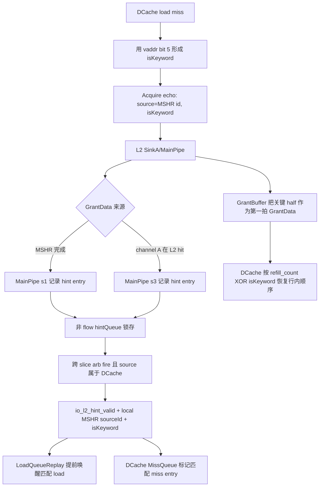

# V2 DCache-L2 Refill Hint 与 L2 Flush Done Flow

## 版本元数据

| 项目 | 内容 |
|---|---|
| RTL 版本 | V2 |
| 分支 | `mem_ut_uvm_v2` |
| 核验 commit | `0ec33be518d75ba9cbcf28bcf51118b68e8a0d96` |
| 设计基线 | `2acbf327cf7fb514593acc00d4c41117ec499e08`，见 V2 `branch_policy.md` |
| 权威源码 | `coupledL2/src/main/scala/coupledL2`、`src/main/scala/xiangshan/cache/dcache`、`src/main/scala/xiangshan/mem`、`src/main/scala/xiangshan/L2Top.scala` |
| 最后核验日期 | `2026-07-17` |

## Flow 范围

本文解释 DCache miss 的 `isKeyword` 如何随 TileLink Acquire 进入 L2，L2 何时产生
`io_l2_hint_valid`，`sourceId/isKeyword` 如何被 MemBlock、DCache MissQueue 和
LoadQueueReplay 消费，以及 `io_l2_flush_done` 在完整 L2 flush 和独立 MemBlock DUT 中的边界。

本文把“L2 内部 slice D 输出”“完整 XSTile 到 MemBlock 的 D 通道”和“MemBlock 内部消费者”
分开计拍。`io_l2_hint_valid` 不是 L2 cache hit 结果，也不是 TileLink D response valid。

## 核心结论

1. `io_l2_hint_valid` 是“匹配 DCache MSHR 的 `GrantData` 即将返回”的提前通知。
   L2 hit 和 L2 miss 完成后的 MSHR grant 都可以产生它；纯 `Grant`、`ReleaseAck` 和
   非 DCache source 不会在顶层形成有效 hint。
2. 无阻塞正常路径按 `hintCycleAhead=3` 设计：从 L2 hint 到完整 XSTile/MemBlock 边界的
   第一拍 `GrantData`，目标是提前 3 拍。L2 slice 内部实际用 hint 的 2 级延迟选择第一拍
   D response，再由 XSTile 路径上的 D-channel buffer 增加 1 拍。
3. 该接口不是固定延迟协议。源码还显式统计提前 2 拍的 `ok2Hints`；队列竞争可让 hint
   晚一拍，而 D-channel backpressure 可让 response 更晚。因此验证环境可以用无竞争时
   “提前 3 拍”作为标准激励，但不能把“永远恰好 3 拍”写成 DUT invariant。
4. `sourceId` 在 L2 内先是全局 TileLink source ID；顶层确认 source 属于 DCache 后减去
   DCache source range 起点，得到 DCache 本地 MSHR entry 编号。当前 MemBlock 端口宽度为
   4 bit，对应 16 个 DCache miss entries。
5. `isKeyword` 表示该 miss 的关键 32-byte refill half。64-byte cache line 分两拍、每拍
   32 byte 返回；load 的 `vaddr(5)=0` 表示低半行关键，`vaddr(5)=1` 表示高半行关键。
   L2 据此把关键 half 放在第一拍返回，DCache 再恢复 cache line 的自然存放顺序。
6. `io_l2_flush_done` 是 L2 全量 flush 的完成电平，不是 cache response，也不直接阻塞、
   取消 LSQ/DCache 请求。完整 CHI L2 在所有 slice 扫完全部 set/way 后拉高，并保持到
   flush request 撤销；独立 MemBlock DUT 只把它作为外部状态输入转送给 CSR。

## 主流程图



## 主流程文字伪代码

```text
1. DCache 为 load miss 记录 keyword = vaddr[5]；store/prefetch 默认 keyword=0。
2. DCache 以 MSHR id 作为 TileLink Acquire source，并把 keyword 放入 IsKeyword echo 字段。
3. L2 产生 GrantData 时：
   - MSHR grant 在 MainPipe s1 进入 hint 路径；
   - 不需要 MSHR 的 channel-A hit 在 MainPipe s3 进入 hint 路径。
4. CustomL1Hint 把 source/opcode/keyword 写入最终 flow=false 的 hintQueue。
5. hintQueue 队头是 GrantData、跨 slice arb 握手且 source 属于 DCache 时：
     io_l2_hint_valid = 1
     io_l2_hint_bits_sourceId = global_source - dcache_source_start
     io_l2_hint_bits_isKeyword = recorded_keyword
6. L2 正常在 hint 后的目标窗口发送两拍 GrantData：关键 half 第一拍，另一 half 第二拍。
7. MemBlock 按 sourceId 唤醒匹配 MSHR/load replay；LoadQueueReplay 优先选择数据位于
   第一拍的 load，DCache 用 keyword 调整 refill 写入位置，保持 cache line 地址顺序。
8. 独立的 L2 flush flow 扫描所有 slice 的 set/way；所有 slice done 后拉高
   l2_flush_done，并等 flush request 撤销后回到 idle。
```

## 1. Hint 的产生条件

`CustomL1Hint` 有两个入口：

```scala
val mshr_GrantData_s1 = task_s1.valid && mshrReq_s1 &&
  (isGrantData(task_s1.bits) || isMergeGrantData(task_s1.bits))

val chn_GrantData_s3 = task_s3.valid && !mshrReq_s3 &&
  !need_mshr_s3 && isGrantData(task_s3.bits)
```

- `mshr_GrantData_s1` 表示已有 MSHR 完成后回到 MainPipe 的 grant，不代表 L2 hit。
- `chn_GrantData_s3` 才是 channel-A 请求查目录后不需要分配 MSHR的 hit response。
- 两者最终都进入 `hintQueue`。该 queue 默认 `flow=false`，因此 entry 至少锁存一拍后才
  出现在 `l1Hint`。
- `hintQueue` 还保存 `Grant` 和 `ReleaseAck` entry 来维持任务顺序，但输出 valid 只检查
  `opcode === GrantData`。

CoupledL2 顶层跨 slice 仲裁后还要确认 source 属于 DCache：

```scala
io.l2_hint.valid := l1HintArb.io.out.fire && sourceIsDcache
io.l2_hint.bits.sourceId := l1HintArb.io.out.bits.sourceId - dcacheSourceIdStart
io.l2_hint.bits.isKeyword := l1HintArb.io.out.bits.isKeyword
```

顶层在 hint 后一拍关闭 arb ready，所以连续 hint 最快每两拍一个，与一条 cache line 的
两拍 `GrantData` 对齐。payload 只在 `valid=1` 时有语义。

### 1.1 是否保证每次回复前都有 hint

需要区分当前 CoupledL2 实现预期和接口功能合同：

1. 当前 V2 源码把 `enableHintGuidedGrant` 固定为 `true`。正常 DCache cache-line
   `GrantData` 要么经过 MSHR s1 路径，要么经过 channel-hit s3 路径，两条路径都会向
   `hintQueue` 写 entry；queue 满被写成 assertion。因此在不触发 assertion、无 reset
   中断的正常实现路径上，设计预期每条 DCache `GrantData` 都会产生一次 hint。
2. 这不等于“所有 L2 D-channel 回复都必须有 hint”。`CustomL1Hint` 输出只接受
   `opcode === GrantData`，纯 `Grant`、`AccessAckData`、`CBOAck` 等回复不产生该 hint；
   非 DCache source 也会被 CoupledL2 顶层过滤。
3. hint 不是 TileLink 协议的一部分，也没有 end-to-end assertion 证明每个第一拍
   `GrantData` 必须在固定前两拍看到 hint。hint arb、queue 优先级和 D-channel backpressure
   会改变实际间隔；当前源码只把提前 3 拍作为目标，并统计提前 2 拍的可接受情况。
4. DCache 明确支持完全没有 hint 的 fallback：MissEntry 使用
   `w_l2hint || w_grantlast` 开放 `main_pipe_req`，并统计 `miss_refill_without_hint`。
   因此无 hint 时不会破坏 refill 正确性，只会失去提前唤醒/提前 replay 的性能收益。

对 mem_ut responder 的建议合同是：

```text
精确模拟当前 V2 CoupledL2 正常 AcquireBlock -> GrantData：生成一次匹配 sourceId 的 hint；
不要把 hint 固定为“第一拍 D response 前恰好 2 拍”；正常建模使用前述 2/3 拍窗口；
保留 no-hint 场景验证 DCache fallback，但不要把 no-hint 当成当前 CoupledL2 的常规输出。
```

### 1.2 各类 D-channel 回复对应场景

`CustomL1Hint` 是否输出，取决于 D response opcode 和 source client，不能只检查
`D.valid` 或“是否带 data”：

本节只保留 hint 视角的分类摘要。client/local-global source、Grant 权限、
`AccessAckData` 生产者和 `CBOAck` 请求关联的完整建模规则见
[L2 内侧 TileLink 请求、权限与回复 flow](l2_inner_tilelink_request_response_flow.md)。

| A-channel 请求/来源 | D-channel 回复 | 当前 V2 典型场景 | 是否携带 refill 数据 | DCache hint |
|---|---|---|---:|---:|
| `AcquireBlock` | `GrantData` | DCache load miss、partial-store miss、AMO/prefetch 等需要取得原 cache line 的 coherent refill | 是，64 byte/2 beats | 是 |
| `AcquirePerm` | `Grant` | 只取得写权限而不读取旧 line；当前 DCache 在 full-line store overwrite 时选择该请求 | 否 | 否 |
| `Get`，以及通用 TileLink `Arithmetic/Logical` | `AccessAckData` | 非 coherent read/atomic 数据回复；CoupledL2 支持该类型，典型 source 是 ICache/PTW 等非 DCache client | 是 | 否 |
| `CBOClean/CBOFlush/CBOInval` | `CBOAck` | DCache CMOUnit 发 cache-block operation，L2 完成 clean/flush/invalidate 后返回完成状态 | 否 | 否 |

当前 DCache MissQueue 的普通 miss A-channel 只在 `AcquireBlock` 和 `AcquirePerm` 之间选择；
uncached load 的 `Get` 由独立 Uncache TileLink client 发出，不是
`auto_inner_dcache_client_out` 上的 cache-line refill。因此 mem_ut DCache responder 不应把
`AcquireBlock` 回复成 `AccessAckData`。

“非 DCache source”不是第五种 opcode，而是顶层 client-range 过滤：CoupledL2 内部 source
空间同时包含 DCache、ICache、PTW 等 client。只有落在支持 probe 的 DCache source range
内的 `GrantData` 才能形成 `io_l2_hint_valid`；其他 client 即使返回数据，也不使用 DCache
MSHR `sourceId`，所以不会发这条 DCache hint。

## 2. Hint 到 GrantData 的计拍

### 2.1 L2 内部

源码定义：

```scala
def hintCycleAhead = 3
val sliceAhead = hintCycleAhead - 1 // 2

sliceCanFire = RegNextN(hintFire, 2) || RegNextN(hintFire, 3)
```

若把 `io_l2_hint_valid` 所在周期记为 `H`：

| 位置 | 无阻塞正常事件 | 与 H 的寄存周期距离 |
|---|---|---:|
| CoupledL2 hint 输出 | `io_l2_hint_valid` | 0 |
| 对应 slice 第一拍 `GrantData` | `slice.io.in.d.fire && first` | 2 |
| 对应 slice 第二拍 `GrantData` | 同一 source 的下一拍 D beat | 3 |
| 经过 XSTile 的默认 D-channel buffer 后到 MemBlock 边界 | 第一拍 D response | 3 |

这里容易产生“2 拍还是 3 拍”的口径差异：L2 slice 内从 H 到第一拍 D fire 是两个
上升沿；完整路径在 D 通道再锁存一拍，所以源码参数和 MemBlock 边界合同称为“提前 3 拍”。

源码另用 2 级 hint pipeline 统计 `accurate3Hints`，用 1 级 pipeline 统计 `ok2Hints`。
后一种情况通常来自 hint queue 仲裁/优先级使 hint 晚一拍。LoadQueueReplay 的注释也明确写成
L2 会在后续 2/3 拍返回数据。因此更准确的合同是：

```text
无竞争目标：第一拍 GrantData 在 hint 后 3 拍到达 MemBlock L2 边界；
允许短路径：第一拍可在 hint 后 2 拍到达；
D ready/backpressure 或队列竞争：response 可以更晚，不存在固定最大延迟。
```

### 2.2 MemBlock 内部寄存边界

MemBlock 先执行一次 `RegNext(io.l2_hint)`，再把结果送给 scalar LoadUnit 和 LSQ；
DCacheWrapper 给 MissQueue 前又执行一次 `RegNext(io.l2_hint)`。HybridUnit 当前直接读取
MemBlock 顶层 `io.l2_hint`。

因此同一个顶层 hint：

| 消费者 | 相对 MemBlock 顶层 hint 的延迟 |
|---|---:|
| HybridUnit load side | 0 |
| scalar LoadUnit、LSQ/LoadQueueReplay | 1 |
| DCache MissQueue/MissEntry | 2 |

MemBlock 内部 DCache TileLink D 通道也经过 `l1d_to_l2_buffer`。不能把上述 hint 寄存拍数
直接当成 L2 response 拍数；验证时应在同一层级比较 hint 与 D-channel waveform。

## 3. `sourceId` 的行为

DCache 发 Acquire 时使用 miss entry id 作为 TileLink source。L2 的 source 空间还包含
其他 L1 client，因此 CoupledL2 先检查 source 是否落入支持 probe 的 DCache client range，
再减去该 range 的起点。

Core 侧 `L2ToL1Hint.sourceId` 宽度是 `log2Up(nMissEntries)`。消费者包括：

- DCache MissQueue：只把 hint 路由给 `sourceId == entry index` 的 MissEntry，并置
  `w_l2hint`；该位允许 entry 不必等到 `w_grantlast`，即可提前向 DCache main pipe
  发 refill request。
- LoadQueueReplay：匹配 `missMSHRId == sourceId`，解除该 MSHR 上 cache-miss load 的
  blocking，并参与优先 replay 选择。

所以它不是 ROB id、LQ index、物理地址或 L2 MSHR id。

在独立 MemBlock DUT 的 DCache TileLink 端口上，应从 A-channel request 保存这个 ID：

```text
当 auto_inner_dcache_client_out_a_valid &&
   auto_inner_dcache_client_out_a_ready &&
   auto_inner_dcache_client_out_a_bits_opcode == AcquireBlock(6) 时：

  accepted_tl_source = auto_inner_dcache_client_out_a_bits_source; // 6 bit
  io_l2_hint_bits_sourceId = accepted_tl_source[3:0];              // MSHR 0..15

回复时：
  auto_inner_dcache_client_out_d_bits_source = accepted_tl_source;
  即 d_bits_source == {2'b00, io_l2_hint_bits_sourceId}。
```

A/D channel 的 source 端口是 6 bit，因为完整 DCache TileLink client 还要编码非普通 miss
事务；hint 端口只有 4 bit，因为它只寻址 16 个 MissEntry。不能对任意 A request 都截低
4 bit 生成 hint：当前只有返回 `GrantData` 的 DCache miss `AcquireBlock` 需要这条 hint；
`AcquirePerm` 返回无数据 `Grant`，不会产生 hint。

若在 CoupledL2 内部、经过 TileLink client source remap 后观测，source 可能已经带 DCache
range offset，必须先减 `dcacheSourceIdStart`；上述直接取低 4 bit 只适用于当前 MemBlock
DCache client 本地端口。

## 4. `isKeyword` 的行为

当前 cache line 是 64 byte，L1-L2 D-channel 每拍 256 bit，即 32 byte，因此一条
`GrantData` 有两拍。DCache 对 load miss 使用 `vaddr(5)`：

| `isKeyword` | 原 load 位于 cache line | L2 第一拍数据 |
|---:|---|---|
| 0 | byte 0-31 | 低 32-byte half |
| 1 | byte 32-63 | 高 32-byte half |

这里必须区分三种量：

```text
D-channel 物理 data 宽度：256 bit = 32 byte/beat；
GrantData 事务 size：2^6 = 64 byte/cache line；
无 backpressure 时的峰值：每拍 32 byte，一条 64-byte line 连续传两拍。
```

`io_l2_hint_bits_isKeyword` 只随单次 hint valid 脉冲发送一个值，不存在两拍 hint。
`isKeyword` 也不是 D-channel beat index，L2 不会把它固定回复成第一拍 0、第二拍 1。
同一条 `GrantData` 的两个 D beat 都携带同一个 `IsKeyword` echo 值：

| 原始 `isKeyword` | 两拍 echo 字段 | 两拍实际数据 half 顺序 |
|---:|---|---|
| 0 | `0, 0` | 低半行 `0`，再高半行 `1` |
| 1 | `1, 1` | 高半行 `1`，再低半行 `0` |

GrantBuffer 在 `isKeyword=1` 时交换两拍数据发送顺序，但把同一个 task 的 keyword 保存到
第二拍的 `grantBuf.task`，所以字段本身保持不变。DCache MissEntry 用
`refill_count ^ isKeyword` 保存 raw beat，并在写 refill rows 时对高低 half 做对应换位，
所以提前返回关键数据不会改变最终 cache line 布局。

LoadQueueReplay 同时保存每个 replay load 所需数据是否位于自然顺序的后半拍：

```scala
isKeyword == 1 -> 本拍优先 dataInLastBeatReg == 1 的 load
isKeyword == 0 -> 本拍优先 dataInLastBeatReg == 0 的 load
```

其目的不是判断 hit/miss，而是让需要第一拍关键数据的 load 提前进入 load pipeline，争取
直接命中即将到达的 D-channel 数据。

## 5. `io_l2_flush_done` 的行为

### 5.1 相对 MemBlock 的方向和请求来源

相对独立 MemBlock DUT，flush 请求和完成是两个专用 sideband：

```text
MemBlock -> 外部 L2：io_outer_l2_flush_en   // Output，请求电平
外部 L2 -> MemBlock：io_l2_flush_done       // Input，完成电平
```

请求不是 TileLink A/B/C/D/E 通道上的 opcode。其完整来源是：

```text
软件写自定义 CSR mflushpwr(0xBC1).FLUSH_L2_ENABLE[0] = 1
  -> NewCSR status.custom.flush_l2_enable
  -> MemBlock io.ooo_to_mem.csrCtrl.flush_l2_enable
  -> MemBlock io.outer_l2_flush_en
  -> XSCore io.l2_flush_en
  -> L2Top io.l2_flush_en
  -> CoupledL2 io.l2Flush
  -> 每个 slice io.l2Flush
  -> SinkA cmoAll.l2Flush
```

因此 mem_ut 的外部 L2 model 应观察 `io_outer_l2_flush_en`，而不是等待某个 DCache
TileLink A request。请求保持为 1 后，L2 完成全量 flush 并拉高 `io_l2_flush_done`；软件/控制
侧撤销 enable 后，L2 从 DONE 回到 IDLE，done 随后清零。这是 level request/level done
握手，不是 request/ack 单拍脉冲。

### 5.2 L2 内部完成条件

功能完整的 CHI L2 flush 由 `l2Flush` 请求启动。每个 slice 的 SinkA 状态机：

```text
IDLE
  -> 等待没有有效 MSHR
  -> CMOREQ：为当前 set/way 发 CBOFlush
  -> WAITLINE：等待该 line 完成
  -> 必要时 WAITMSHR
  -> 遍历下一个 way/set
  -> DONE：本 slice l2FlushDone=1
  -> 等 l2Flush=0 后回 IDLE
```

CoupledL2 对所有 slice 的 done 做 AND。因此 `io_l2_flush_done` 是保持型完成电平：所有
slice 均完成后为 1，并保持到请求端撤销 `l2Flush`，不是单拍 pulse。

对每个有效 L2 line，内部 `CBOFlush` 若发现该 line 仍有上层 client copy，会令
`need_probe_s3_a=1`。L2 随后通过 TileLink B channel 向 DCache 发送：

```text
B.valid=1
B.opcode=Probe
B.param=toN
B.address=当前被 flush 的 cache line
```

DCache 的 ProbeQueue 接收 B channel，在 DCache MainPipe 执行 `ClientMetadata.onProbe(toN)`，
把命中 line 降为 INVALID，并通过 TileLink C channel 返回 `ProbeAck` 或 `ProbeAckData`。
L2 等待 probe、必要的 dirty data writeback 和当前 line CMO 完成后，才继续下一个 set/way。

### 5.3 对 DCache 的影响

必须区分“flush 操作”与“done 电平”：

1. flush 进行期间，L2 的 `cmoAllBlock` 会对普通 SinkA 请求施加 backpressure，DCache 新的
   miss Acquire 可能看到 A-channel `ready=0`；已有 L2 MSHR 需要先完成。
2. DCache cache line 的真实状态变化来自上述 B-channel Probe。被 probe-toN 命中的 line
   会失效，dirty line 必要时通过 C channel 回数据；之后访问这些地址将重新 miss/refill。
3. `io_l2_flush_done` 本身没有连接到 DCacheWrapper、MissQueue、ProbeQueue 或 load pipeline，
   不会在拉高那一拍再次清空 DCache，也不会直接 kill load、取消 MSHR 或产生 redirect。
   done 只表示所有这些 flush/probe/writeback 操作已经完成。

进入 MemBlock 后，它只经过 `RegNext` 放入 `topToBackendBypass.l2FlushDone`，Backend 再
寄存后送给 CSR，最终反映到自定义 CSR `mflushpwr.L2_FLUSH_DONE` 只读位。它没有接入
LSQ admission、DCache request valid、redirect 或 pipeline kill 条件。

当前默认 `KunminghuV2Config` 的 L2 `enableL2Flush=false`，SoC 的 `EnablePowerDown=false`。
因此默认完整 SoC 配置不展开这套可选 L2 flush 端口；独立 MemBlock DUT 仍保留
`io_l2_flush_done` 输入。在 mem_ut 中若不验证 CSR/低功耗握手，应默认驱动 0；单独拉高它
只会报告“外部 L2 已完成”，不会让 MemBlock 自己执行 cache flush，也不会自动生成上述
B-channel Probe。

## 状态、字段和优先级

| 状态/字段 | 生产者 | 置位/产生条件 | 清除/消费条件 | 消费者 |
|---|---|---|---|---|
| `io_l2_hint_valid` | CoupledL2 hint arb | GrantData hint arb fire 且 source 属于 DCache | Valid 脉冲；下一拍 arb ready 被抑制 | MemBlock、LoadUnit、LSQ、DCache |
| `sourceId` | DCache Acquire / CoupledL2 | 全局 source 减 DCache range 起点 | 仅随 valid 有效 | MissQueue、LoadQueueReplay |
| `isKeyword` | DCache miss entry | load 用 `vaddr(5)`；非 load 默认 0 | 随 miss/grant 结束 | GrantBuffer、MissEntry、LoadQueueReplay |
| `w_l2hint` | DCache MissEntry | 匹配 source 的 hint valid | 新 entry allocation 时清零 | 提前开放 `main_pipe_req`、性能统计 |
| `l2FlushDone` | 各 CHI L2 slice | 当前 slice 遍历完最后 set/way | `l2Flush` 撤销后返回 IDLE | L2Top、CSR、低功耗状态机 |

## V2/V3 差异

本文只核验 V2。V3 的 hint 队列、D-channel buffer、MSHR 数量、beat 宽度和 L2 flush
配置必须在 V3 分支独立确认，不能直接沿用本文计拍和位宽。

## 源码证据

- `coupledL2/src/main/scala/coupledL2/CustomL1Hint.scala:45-121`：s1/s3 hint 条件、两级 queue 和 GrantData-only 输出。
- `coupledL2/src/main/scala/coupledL2/CoupledL2.scala:112-114,404-452,523-545,583-609`：3-cycle 目标、slice D 选择窗口、DCache source 转换和 2/3 拍统计。
- `coupledL2/src/main/scala/coupledL2/GrantBuffer.scala:159-232`：32-byte beat、关键 half 先返回和两拍保持同一 keyword echo。
- `coupledL2/src/main/scala/coupledL2/SinkA.scala:41-52,173-221`：L2 全量 flush 状态机和 done 电平。
- `coupledL2/src/main/scala/coupledL2/tl2chi/Slice.scala:217-222`：CHI slice flush 连接和 done 寄存。
- `coupledL2/src/main/scala/coupledL2/tl2chi/MainPipe.scala:232-256,1018-1024`：CBOFlush 对 client copy 产生 probe，并等待当前 line 完成。
- `coupledL2/src/main/scala/coupledL2/tl2chi/MSHR.scala:430-451,525-559`：CBOFlush 生成上行 Probe-toN 和下行 writeback/evict。
- `coupledL2/src/main/scala/coupledL2/tl2chi/MSHR.scala:741-743`：Get 映射为 `AccessAckData`，Acquire 映射为 `Grant/GrantData`。
- `src/main/scala/xiangshan/L2Top.scala:79-95,137-146,318-332`：L2、XSTile D buffer、hint 和 flush done 顶层连接。
- `src/main/scala/xiangshan/cache/dcache/mainpipe/MissQueue.scala:218-272,551-609,657-695,828-882,1190-1225`：A-channel source 使用 MSHR id、keyword 携带、refill 重排、hint 提前开放 main-pipe request 和 source 路由。
- `src/main/scala/xiangshan/cache/dcache/mainpipe/MissQueue.scala:881-926`：无 hint 时等待 `w_grantlast` 的功能 fallback 和性能计数。
- `src/main/scala/xiangshan/cache/dcache/mainpipe/MissQueue.scala:250-265,299-360,828-845,1231-1237`：DCache AcquireBlock/AcquirePerm 选择、CMO 请求和 CBOAck 路由。
- `src/main/scala/xiangshan/mem/lsqueue/LoadQueueReplay.scala:400-421,458-473`：2/3 拍注释、匹配 MSHR 唤醒和关键 beat replay 优先级。
- `src/main/scala/xiangshan/mem/MemBlock.scala:990-1013,1134,2018-2021`：hint 消费寄存差异和 flush done bypass。
- `src/main/scala/xiangshan/cache/dcache/DCacheWrapper.scala:1051-1056`：DCache MissQueue 前的第二级 hint 寄存。
- `src/main/scala/xiangshan/cache/dcache/DCacheWrapper.scala:1554-1585`、`src/main/scala/xiangshan/cache/dcache/mainpipe/Probe.scala:128-225`：DCache 接收 B-channel Probe 并进入 ProbeQueue/MainPipe。
- `src/main/scala/xiangshan/Parameters.scala:874`、`src/main/scala/xiangshan/cache/dcache/DCacheWrapper.scala:979-980`：L1-L2 D-channel 为 256 bit。
- `build_memblock/rtl/MemBlock.sv:203-252`：MemBlock DCache A/D source 为 6 bit，hint sourceId 为 4 bit。
- `src/main/scala/xiangshan/mem/MemBlock.scala:325-349,2018-2044`：相对 MemBlock 的 done 输入、flush enable 输出及 CSR bypass。
- `src/main/scala/xiangshan/backend/fu/NewCSR/CSRCustom.scala:39-49,127-130`：flush enable/done CSR 语义。

## 知识修订记录

| 日期 | commit | 旧结论 | 新结论 | 修订原因 | 影响范围 |
|---|---|---|---|---|---|
| 2026-07-16 | `0ec33be518d75ba9cbcf28bcf51118b68e8a0d96` | 首次建立，无同版本长期 flow 旧结论 | 建立 refill hint、2/3 拍时序、payload 与 L2 flush done 的完整边界 | 用户要求结合 V2 Scala 分析 L2 hint 和 flush done | V2 CoupledL2、DCache、LSQ、MemBlock、CSR |
| 2026-07-17 | `0ec33be518d75ba9cbcf28bcf51118b68e8a0d96` | 已说明 hint 不是固定延迟协议，但未区分正常实现必发预期、各 D opcode 场景和 DCache no-hint fallback | 明确正常 DCache GrantData 的 hint 覆盖，补充 Grant/AccessAckData/CBOAck/client-range 场景及无 hint fallback | 用户追问 hint 是否一定发送及各类非 hint 回复来源 | V2 CoupledL2 hint responder、DCache MissEntry、mem_ut 激励合同 |
| 2026-07-17 | `0ec33be518d75ba9cbcf28bcf51118b68e8a0d96` | 本文只有 hint 视角的 D opcode 粗分类 | 保留摘要并链接独立 L2 TileLink 请求/权限/回复 flow | 避免完整 L2 model 规则与 hint 计拍规则混在同一文档重复维护 | V2 L2 responder 知识边界 |

## 待确认项

- 无固定时序协议断言证明所有拥塞组合都保持恰好提前 2 或 3 拍；遇到 hint arb 或
  D-channel backpressure 时，应以同一 `sourceId` 的实际 waveform 关联为准。
