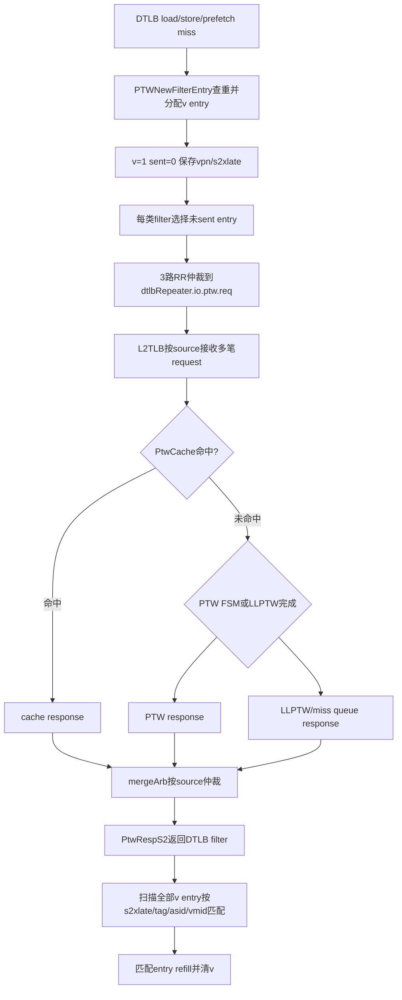

# V2 DTLB-L2TLB 多请求与 Response 次序 Flow

## 版本元数据

| 项目 | 内容 |
|---|---|
| RTL 版本 | V2 |
| 分支 | `mem_ut_uvm_v2` |
| 核验 commit | `7861962dba6f1b6ceb1da7996764b31d3207b5e6` |
| 设计基线 | `2acbf327cf7fb514593acc00d4c41117ec499e08`，见 V2 `branch_policy.md` |
| 权威源码 | `src/main/scala/xiangshan/cache/mmu`、`src/main/scala/xiangshan/mem/MemBlock.scala`、`build_memblock/rtl/MemBlock.sv` |
| 最后核验日期 | `2026-08-06` |

## Flow 范围

本文解释 V2 DTLB miss request 从 `PTWNewFilter` 发往 L2TLB、L2TLB 从 cache/PTW/LLPTW
不同路径产生 response，以及 response 返回后如何按内容命中 DTLB filter entry。

入口是 `dtlbRepeater.io.ptw.req(0).fire`，出口是 `io.ptw.resp.fire` 后匹配的 filter entry
产生 refill 并清除。本文不分析 page-table 数据正确性，也不把 mem_ut `L2TLB_agent` 解释为
L2Cache 或 memory 下游模型。

## 核心结论

1. V2 DTLB 到 L2TLB 的交接不是 single-outstanding 协议。`PTWNewFilter` 使用 load、store、
   prefetch 三组多 entry filter 保存 `v/sent/vpn/s2xlate`，前一笔 response 返回前可以继续 fire request。
2. `PtwReq` 只有 `vpn/s2xlate`，没有 request ID。
3. `PtwRespS2` 返回后，各 filter 对全部有效 entry 计算
   `s2xlate + hit(vpn, asid, vasid, vmid)`，不是只比较最老 entry。
4. L2TLB response 可来自 page-cache hit、PTW FSM 或 LLPTW/miss queue。三条路径延迟不同，
   `mergeArb(source)` 直接选择当前可返回项，没有按该 source 的 request 次序重排。
5. 因此同一 DTLB source 的 response 可以按内容乱序完成。响应归属依赖 tag/context 内容，
   不是依赖 FIFO 次序或隐含 ID。
6. `PTWNewFilter` 将 `io.ptw.resp.ready` 固定为 true；response valid 到达后没有该交接层的 backpressure。
7. responder 的动态记账单位是该接口上的每次 request fire，而不是唯一 key。同一 filter 内的重复 key
   在发往 L2TLB 前已经合并；跨 load/store/prefetch filter 的相同 key 可以分别 fire。真实 L2TLB 对每次
   fire 增加 `tlbCounter`，LLPTW 也为每次输入保留独立 entry，只共享重复项的下游 memory wait。因此
   替代 L2TLB 的 agent 不得把已经接受的相同 key request token 合并。
8. `PtwReq` 没有 ASID/VMID/mode/root 字段。当前请求的上下文来自 `PTWNewFilter` 所见的 `tlbcsr`，而该
   信号是顶层 `io.ooo_to_mem.tlbCsr` 的两级 `RegNext` 结果。因此验证 responder 在 sample C 捕获 request
   时必须使用顶层 C-2 CSR snapshot，不能直接使用 C 的 runtime latest。

### 结论边界：DTLB 的 outstanding 容量与回复次序

这里的 “支持 outstanding” 是指 **L2TLB 已接受一笔 DTLB request 后，DTLB 不需要等待它的 response，
仍可继续发出后续 request**，不是指接口带有可供软件或验证环境使用的 request ID。

- `PTWNewFilter` 的 load、store、prefetch 三个 filter 分别有 16、8、8 个 entry；在 V2
  `KunminghuV2Config` 的默认参数下，DTLB 至多可保留 32 个不同的待处理 key。每个 entry 在 request fire
  后仅置 `sent`，不会等待 response 才允许其它未发送 entry 经三路仲裁继续 issue。
- L2TLB 把 ITLB（port 0）和 DTLB（port 1）共同计入 `tlbCounter`。默认
  `MissQueueSize = ifilterSize(8) + dfilterSize(32) = 40`；只有 `tlbCounter < 40` 才对上游置 ready。
  所以 DTLB 的实际可接受 outstanding 上限是“自身 32 个 filter entry”与“40 个 ITLB/DTLB 共享额度的剩余量”
  两者中较小者，不能把 40 误解成 DTLB 独占容量。
- 回复接口只携带 translation 内容（`s2xlate`、S1/S2 tag、ASID/VMID/permission 等），没有 request ID。
  `PTWFilterEntry` 用这些内容扫描所有有效 entry；同一回复可同时 refill 多个内容匹配 entry。因此 requester
  不能用“第 N 个 response 对应第 N 个 request”的 FIFO 假设关联回复。
- 对同一 source，cache hit、PTW FSM、LLPTW 三条完成路径直接进入 `mergeArb(source)`；源码没有按 request
  接收序号重排的结构。不同路径延迟不同时，后发的短路径请求可以先完成。因此验证 responder 必须允许
  多 outstanding，并按 request-time key/context 构造 response；若刻意模拟乱序，不能依靠 FIFO 队首取回。

一次 response 在 DTLB filter 层可能同时解除多个相同内容的 entry；但这不改变 L2TLB `tlbCounter` 以每次
`req.fire` / `resp.fire` 计数的硬件协议。测试环境替代 L2TLB 时仍应为每次已接受的 request 独立记账，flush
取消的 request 则按 flush 生命周期处理，不能用 key 去静默吞掉已接受 token。

## 主流程图



## 主流程文字伪代码

```text
1. DTLB各requestor产生miss request后，PTWFilterEntry检查本filter中是否已有相同vpn/s2xlate。
   没有重复且分区有空位时，新entry保存vpn/s2xlate并置v=1、sent=0；重复请求复用已有entry。

2. 每个load/store/prefetch filter从v=1且sent=0的entry中选择一笔，产生PtwReq。
   PTWNewFilter再用3路RR arbiter从三类filter中每拍最多向L2TLB发送一笔。
   request fire后只把对应entry的sent置1，其它有效entry仍保留并可继续发送。

3. L2TLB为每次request fire保存source并进入cache、PTW FSM或LLPTW/miss queue路径。
   不同request可处于不同路径和不同等待状态；tlbCounter按每次request fire增加、按每次response fire减少。
   相同key进入LLPTW时仍各占一个entry，重复entry只通过wait_id共享一次下游memory访问。

4. cache hit、PTW FSM和LLPTW完成项分别接到该source的mergeArb三个输入。
   arbiter选择当前有效且下游ready的response，不查询该source最老request，也没有response reorder buffer。

5. PtwRespS2回到PTWNewFilter后，load/store/prefetch filter都收到相同response。
   每个filter遍历全部v entry，以response.s2xlate和response.hit(vpn, CSR context)判断命中。
   所有命中entry产生refill并清v；没有使用request ID或FIFO head完成归属。若较早response已经同时
   清除跨filter的相同key entry，真实L2TLB后续为另一笔已接受request产生的重复response可能不再命中
   filter entry，但仍是该request的真实完成，不能据此在responder中删除后续token。

6. 同一条有效 SFENCE/HFENCE 不需要等待或搭配另一条“flush 流水指令”：Fence FU 同时把它作为
   `sfence.valid` 送给翻译路径，并把同源 `flushPipe` 写回交给 ROB。前者经MemBlock两级
   `RegNext`、再经 `PTWNewFilter.fenceDelay=2` 后清除 filter 的有效/inflight state；后者只在完整
   core 的 ROB 精确提交时形成 `flushAfter` redirect、清除年轻指令。相对顶层 sfence monitor sample，
   filter flush 总计4拍；该清除不读取 `sfence.bits.flushPipe`。
7. 同一 SFENCE 也送入真实 L2TLB。L2TLB 对自身 `tlbCounter`、各 walker/cache path 和已发 memory
   request 采用 flush/flush-latch 处理：清内部可见事务，且对 flush 前已经等待 memory response 的
   source 置 latch，晚到 memory response 只释放等待状态、不得再 refill 或向 DTLB 产生旧 translation
   response。因此 flush 后晚到 response 不应再被解释为旧 DTLB entry 的正常完成。
```

## 关键阶段

### 1. `PTWNewFilter` 多 entry 保存

`PTWNewFilter` 实例化三组 `PTWFilterEntry`：当前 V2 load 16 entry、store 8 entry、prefetch 8
entry。每个 entry 保存 `v/sent/vpn/s2xlate`。`io.tlb.req.ready` 固定为 true，内部可同时保留
多笔尚未收到 response 的 translation request。

同一 filter 内已有相同 `vpn/s2xlate` 时不再分配新 entry；同拍多个 request 相同也共享 index。
三类 filter 相互独立，所以跨 load/store/prefetch 类别仍可能先后向 L2TLB 发出相同 translation key。

### 2. DTLB 到 L2TLB request 仲裁

三类 filter 的 `ptw.req(0)` 进入 `RRArbiterInit(new PtwReq, 3)`。输出 payload 只有：

```text
vpn[37:0]
s2xlate[1:0]
```

request fire 后对应 entry 的 `sent` 置1；并没有等待该 response 返回后才允许仲裁下一 entry。

`PtwReq` 不携带 ASID、VMID、翻译 mode 或根 PPN，但当前 `PTWFilterEntry` 会在 filter 内以当前
`io.csr.satp/vsatp/hgatp` 参与后续 response 命中。这份 `io.csr` 来自 `MemBlock.scala` 的两级
`RegNext(RegNext(io.ooo_to_mem.tlbCsr))`。所以顶层 CSR C0 改变时，filter 到 C2 才看到新上下文；C0/C1
对外发出的 request 仍属于旧上下文。替代 responder 若用顶层 latest 立即建 key，会在这种边界错误地把旧
request 与新 ASID/VMID/mode/root 关联。

### 3. L2TLB 多路径完成

L2TLB 用 `arb1` 接收 ITLB/DTLB source，并维护 `tlbCounter`：所有 source request fire 加计数，
所有 source response fire 减计数。response 可能来自：

| `mergeArb` 输入 | 来源 | 典型延迟 |
|---|---|---|
| `outArbCachePort` | `cache.io.resp` hit | 短 |
| `outArbFsmPort` | `ptw.io.resp` | page walk 状态机决定 |
| `outArbMqPort` | `llptw_out` | miss queue/内存回复决定 |

三个输入都按保存的 `source` 路由到对应 `mergeArb(i)`。代码没有在 `mergeArb` 前按该 source 的
request 接收序号排序，因此后发 cache hit 可以先于早发慢路径 miss 返回。

### 4. Response 内容匹配

`PTWFilterEntry` 的匹配向量对每个有效 entry 执行：

```scala
vi &&
s2xlatei === io.ptw.resp.bits.s2xlate &&
io.ptw.resp.bits.hit(pi, satp.asid, vsatp.asid, hgatp.vmid, allType = true)
```

命中向量不是 one-hot FIFO index；一个 response 可以同时 refill 多个匹配 entry。该行为是 V2
支持内容匹配乱序 response 的直接依据。

### 5. 重复 Key 的请求和回复记账

重复 key 需要分两层理解：

1. 同一 `PTWFilterEntry` 内，已有相同 `vpn/s2xlate` 的 request 复用现有 entry，不再向 L2TLB
   产生第二次 request fire；agent 在接口上只看到一笔，因此只建一个 token。
2. load、store、prefetch 三个 filter 相互独立，相同 key 可以从不同 filter 先后到达 L2TLB。此时
   agent 能看到多次真实 request fire，必须为每次 fire 建独立 token。

真实 L2TLB 的 `tlbCounter` 对所有 `io.tlb(i).req(0).fire` 逐笔加计数，对所有
`io.tlb(i).resp.fire` 逐笔减计数。LLPTW 对每次 `io.in.fire` 都在独立 `enq_ptr` 写入 request entry；
重复项只把 state 转为 `state_mem_waiting` 并共享 `wait_id`，memory response 到达后各 entry 分别进入
`state_mem_out`，最终由多次 `io.out.fire` 逐项清除。因此真实实现没有把已经进入 L2TLB 的重复请求
合并成一次 logical response。

`PTWNewFilter` 会把一笔 response 广播给三个 filter，所以较早 response 可能同时 refill 多个相同 key
entry。这个广播优化不改变 L2TLB 对已接受 request 的计数；后续重复 response 即使不再命中 DTLB
entry，也仍会在真实 L2TLB 侧完成计数。验证 responder 因此必须保持“一次 request fire 对应一个
独立 token 和一次 response”，禁止按 lookup key 合并 outstanding record。

这也定义了测试框架 UID 记录的边界：token 仍按每次 fire 独立保存和完成，但 UID 不是 token 的一对一
owner。若框架保存 issued UID 的 TLB 等待状态，一笔已完成 `PtwRespS2` 应使用相同的 raw hit 规则完成所有
匹配的 waiting UID；允许 0/1/多个。范围 response 的每个 UID 再按自己的 VPN 派生 resolved PPN。把一笔
token 强制绑定到唯一 UID，会漏记 DUT 已同时命中的其它 filter entry。

这里“相同 raw hit”必须使用 **response fire 当拍** `PTWNewFilter` 可见的 CSR，而不是 UID issue 时冻结的
CSR。该 CSR 仍是顶层 C-2 history：顶层 C0 把 ASID/VMID 改为新值后，C2/C3 到达的旧 token response 已按新
context 判断 filter hit。验证侧应保留 UID 的 issue-time CSR 供历史/debug，但只能用 UID 自己的 VPN/s2xlate
加 response C-2 CSR 构造临时 key；若不命中，token 依旧完成而该 UID 继续等待 C4 cancel 或后续真实命中。

## 状态、队列和优先级

| 状态/队列 | 生产者 | 建立条件 | 清除条件 | 作用 |
|---|---|---|---|---|
| `PTWFilterEntry.v` | DTLB request enqueue | 新 key 且分区有空位 | 匹配 response 或 flush | 保存待 refill request |
| `PTWFilterEntry.sent` | PTW request issue | `io.ptw.req.fire` | 新 entry 重写或 flush | 防止同一 entry 重复发 request |
| `inflight_counter` | filter request/response | request/response fire差分 | flush | 统计已发未回数量 |
| L2TLB `tlbCounter` | L2TLB 顶层 | 各 source request/response fire差分 | flush | 限制全局 miss queue outstanding |
| `mergeArb(i)` | cache/PTW/LLPTW | 对应 source response valid | response fire | 从多路径选择一笔返回 source i |

## Flush 边界

`PTWNewFilter` 的 flush 条件是：

```text
sfence.valid || satp.changed || vsatp.changed || hgatp.changed || priv.virt_changed
```

输入该条件的 `sfence/tlbcsr` 不是顶层接口原值：`MemBlock.scala` 先执行两级
`RegNext(RegNext(io.ooo_to_mem.sfence/tlbCsr))`，随后 `PTWNewFilter` 再经过
`ldtlbParams.fenceDelay=2`。因此从顶层 CSR/fence agent monitor 的 sample 到 filter 清空总计4拍。
flush 清空 filter entry；验证 responder 若从顶层 monitor 建立 flush sideband，必须覆盖这4拍后才重新
允许 request fire，不能只按内部 `fenceDelay=2` 提前恢复 ready，也不能在旧 entry 被清除后继续无条件
返回旧 response。

V2 实际实例是 `PTWNewFilter`，不是旧 `PTWFilter`。`PTWNewFilter` 将 external response fire 先经一拍
`RegNext` 送到三个 `PTWFilterEntry`，entry 用当前 `io.csr` 做 raw hit；due sample 的 `flush` 同时清 entry
有效位，且 `MemBlock` 外层 `ptw_resp_v` 会在 sfence/CSR-change 边界屏蔽翻译回填。故 response 若在 due=C4
同拍 fire，不构成可信 DTLB completion；responder 的最后可发送 sample 必须严格早于 C4。旧 `PTWFilter` 的
`GatedValidRegNext` 加 `when(flush)` 显式清 valid 只可作为同一边界的历史对照，不能描述成 V2 当前主路径。

CSR change 还存在一个更早的“匹配上下文切换”边界：C0 的顶层 CSR 经两级 `RegNext` 后在 C2 开始参与
`PTWNewFilter` response raw hit；C4 才完成由该 CSR change 触发的 filter clear。前者决定 C2/C3 response 能命中
哪些 outstanding entry，后者决定哪些未完成 entry 被取消，二者不能混成一个 C4 才更新 CSR 的模型。

这里的 filter flush **不**按照 `SFENCE.VMA/HFENCE` 的 `hv/hg`、`rs1/rs2`、地址、ASID、VMID 或
`PTE.G` 再做二次选择：`PTWFilterEntry` 在 `io.flush` 为 1 时对全部 `v` 写 0，并把
`inflight_counter` 写 0。也就是说，local `TLBStorage` 可以按 entry 做部分失效，而 DTLB 到 L2TLB
之间的 outstanding request state 对任意有效 fence 都是全量取消。local entry 的完整选择矩阵见
[Memory flushPipe flow](memory_flush_pipe_flow.md)。

因为顶层event与filter清空的距离是固定4拍，验证侧只有在event的monitor sample与当前service sample
相同的情况下，才能把“当前旧ready形成的request fire”准确归入该flush窗口。active运行期迟到event
已经失去这个归属依据，不能从观察拍重新锚定；startup/reset且ready从未开放时则不存在已接受request，
允许把旧latest event作为baseline并保守等待完整4拍。

### 同一条 SFENCE 的翻译失效与全核 flush 分工

`SfenceBundle` 同时携带 `valid` 和 `bits.flushPipe`，但二者不是两条指令、也不是先后依赖的两个
TLB 命令：Fence FU 在同一条 SFENCE/HFENCE 的 `s_tlb` 状态置 `sfence.valid=1`，并把该 uop 的
`ctrl.flushPipe` 同时扇出到 `sfence.bits.flushPipe` 和写回 `ctrl.flushPipe`。

```text
同一条 SFENCE/HFENCE：
  Fence FU s_tlb：
    sfence.valid = 1；
    sfence.bits.flushPipe = uop.ctrl.flushPipe；
    writeback.ctrl.flushPipe = uop.ctrl.flushPipe；

  翻译路径：
    只要 sfence.valid=1，PTWNewFilter/L2TLB/walker 按各自延迟清 translation state；
    不等待 ROB redirect，也不要求额外发送普通 FENCE、redirect 或另一条 flush 指令；

  完整 core 的年轻指令：
    同一条 SFENCE 的 writeback 到达 ROB head、可提交且无异常后，ROB 才产生 flushAfter redirect；
    standalone MemBlock 没有该 ROB/CtrlBlock owner，不能由 sfence.bits.flushPipe 自行伪造 redirect。
```

特别地，V2 `MemBlock.scala` 把三个 DTLB `io.flushPipe` 明确连接为 `false.B`，注释为 non-block
DTLB 不需要该 pipe-local flush。因此不要把 `sfence.bits.flushPipe=1` 理解成“DTLB request 接口立即
被 flushPipe kill”。DTLB filter 的既有 request/entry 失效由延迟后的 `sfence.valid` 触发；真正的
年轻 LSU uop kill 来自完整 core 后续广播的 ROB redirect。

这也限定 L2TLB responder 的建表竞态处理：从 interface 观察到的每个真实 `req.fire` 在该时刻已经被
L2TLB 接受，测试框架必须先按 fire 建 token；随后 SFENCE 对应的 filter/L2TLB flush 到达时，token
可记为 canceled，不能把“sfence monitor 已观察到”误当成同拍 request 从未 fire。4拍 hold 的职责是
避免在 DTLB filter 清空窗口额外开放 ready，不是补发第二条 pipeline flush 指令。

这里还有一个 responder 时序要求：**顶层 monitor 观察到 SFENCE 的 C0 不是 DTLB filter 实际清除的
C4**。因此测试框架可从 C0 起保守地撤回后续 `ready`，但不能在 C0 立即批量删除已经按早前
`req.fire` 建立的 token，也不能把 C0 同拍的旧 ready fire 直接伪记为已经取消。正确的最小调度为：

```text
C0：monitor 采到有效 sfence；记录 flush_epoch 和 due_filter_flush_sample=C0+4；
    下一驱动边界可关闭 ready，避免环境额外接受 request；
    若 C0 sample 的 valid && 旧ready=1，仍按真实 fire 建 token；

C1..C3：已接受 token 仍可等待；若 response 已在真实 sample 完成，正常完成并记账；
         不因“顶层 sfence 已观察到”提前删除；

C4：不允许 response 在本 sample fire；随后执行 filter flush：
    取消仍在 pending queue 的旧 epoch token，建立/延续 hold；
    不再对这些 token 发 response；

C4 后：至少给一拍合法 ready opportunity，再恢复正常接收。
```

现有若采用“monitor event 一到就调用 `handle_l2tlb_flush_event()` 并删除 `pending_q`”的实现，属于
早取消：会吞掉 C0..C3 期间在真实硬件仍可能被 DTLB/L2TLB 接收或完成的 transaction，导致软件 token
账本与 DUT sample 不一致。应将该 helper 的**取消 pending token**副作用移到上述
`due_filter_flush_sample`，而 monitor event 到达时只记录 epoch、due sample 和 ready hold 计划。

## 关联 Agent 和 Flow

- [V2 L2TLB agent 接口知识](../../../interface/v2/agents/l2tlb_agent.md)：内部接管点、字段和 UVM 映射。
- [Memory flushPipe flow](memory_flush_pipe_flow.md)：sfence 与完整 core flushPipe 的不同职责，以及
  local DTLB entry 按 `virt`、`rs1/rs2`、VMID、ASID、`PTE.G` 的失效矩阵。
- [MMU GPF/AF 异常优先级与并发边界 flow](mmu_gpf_af_exception_priority_flow.md)：response 中 S1/S2 fault
  字段到 L1 TLB/LSU 异常编码的优先级。
- `AI_DOC/plan/test_framework/plan/do/mem_ut_v2_l2tlb_response_permission_adapt_execution_plan_20260708.md`：
  测试框架多 outstanding responder 的执行方案。

## V2/V3 差异

本文只核验 V2。V3 是否使用相同 `PTWNewFilter`、filter 容量和 response 仲裁必须在 V3 源码下
独立确认，不能直接复用 V2 的 32-entry 与乱序结论。

## 源码证据

- `src/main/scala/xiangshan/mem/MemBlock.scala:781`：V2 MemBlock 的 `PTWNewFilter` 连接。
- `src/main/scala/xiangshan/mem/MemBlock.scala:665-666,706-708,781`：顶层 sfence/tlbCsr 到内部 TLB 的两级 RegNext、V2 non-block DTLB 的 `io.flushPipe=false.B` 连接，以及 `PTWNewFilter` 接入点。
- `src/main/scala/xiangshan/cache/mmu/MMUConst.scala:35,83,133-135`：fence delay、dfilter 和三类 filter 容量。
- `src/main/scala/xiangshan/cache/mmu/Repeater.scala:163-289`：`PTWFilterEntry` 的 response raw hit、refill、
  entry `v`/inflight clear 与 `io.flush`。
- `src/main/scala/xiangshan/cache/mmu/Repeater.scala:338-440`：`PTWNewFilter` 的三类 filter、request RR arbiter、
  response `RegNext` broadcast、ready 与 flush fanout。
- `src/main/scala/xiangshan/cache/mmu/Repeater.scala:465-620`：旧 `PTWFilter` 的同类实现，仅用于解释历史
  `ptwResp_valid`/`when(flush)` 清 valid 对照，非 V2 MemBlock 实例路径。
- `src/main/scala/xiangshan/mem/MemBlock.scala:739-741`：外层 `ptw_resp_v` 在 sfence/CSR change 边界的寄存和回填屏蔽。
- `src/main/scala/xiangshan/Bundle.scala:597-612`、`src/main/scala/xiangshan/backend/fu/Fence.scala:70-77`：同一条 SFENCE/HFENCE 的 `sfence.valid`、`sfence.bits.flushPipe` 和 writeback `flushPipe` fanout。
- `src/main/scala/xiangshan/cache/mmu/MMUBundle.scala:1124-1136,1326-1414`：`PtwReq`、`PtwRespS2` 和 `hit()`。
- `src/main/scala/xiangshan/cache/mmu/L2TLB.scala:81-92,185-203,383-410,539-541,687-700`：L2TLB 同源 flush、counter 清零、已发 memory request 的 flush latch 和晚到 memory response 不 refill 的边界。
- `src/main/scala/xiangshan/cache/mmu/PageTableWalker.scala:711-1085`：LLPTW 每次输入分配独立 entry、
  重复 memory wait 共享以及逐 entry `io.out.fire`。
- `build_memblock/rtl/MemBlock.sv:2182-2184,5282-5340,24300-24395`：当前 V2 内部 request/response wire 与实例连接。

## 知识修订记录

| 日期 | commit | 旧结论 | 新结论 | 修订原因 | 影响范围 |
|---|---|---|---|---|---|
| 2026-08-06 | `7861962dba6f1b6ceb1da7996764b31d3207b5e6` | 只说明 response 内容广播和 C0+4 flush，没有把 UID 回填、request/response CSR 对齐与 due 同拍 response 的约束写成 responder 合同 | 明确 token 按 fire 独立而 UID completion 可多播；request 与 response raw hit 分别使用各自 sample 的 top C-2 CSR，UID issue-time CSR 只留历史；V2 当前实例为 `PTWNewFilter`，due=C4 同拍 response 不形成可信 completion | 复查 L2TLB undo plan 时按 Scala 追踪 `PTWNewFilter` 的匹配、寄存和 flush/回填边界 | V2 L2TLB responder token/UID/CSR/flush 时序 |
| 2026-08-05 | `7861962dba6f1b6ceb1da7996764b31d3207b5e6` | 测试框架可能把顶层 sfence monitor sample 与 DTLB filter 实际 flush sample 混同，从 event 到达时立即删 L2TLB pending token | 明确 C0 monitor event 只建立 epoch/due sample；DTLB filter 的取消点是 C0+4，期间已真实 fire/complete 的 request 仍需正常记账；可提前关闭后续 ready，但不能提前删 token | 用户指出 SFENCE 删除与 L2TLB request 建表存在竞态，要求结合 Scala 核对 DTLB flush | V2 DTLB filter、L2TLB responder token、SFENCE 时序适配 |
| 2026-07-29 | `f3bdd04b3763147e714a786d078e0cb90460a31d` | 已说明 DTLB/L2TLB 支持多笔 request，但容量边界和“支持 outstanding”含义没有在同一处明确展开 | 明确 DTLB filter 的 16+8+8 entry 上限、ITLB/DTLB 共享的 40-entry L2TLB 额度、无 request ID 的内容匹配，以及不保证 FIFO 回复 | 用户要求根据当前 V2 Scala 源码确认 L2TLB 回复 DTLB 是否支持 outstanding | V2 DTLB/L2TLB request-response flow、L2TLB responder 设计 |
| 2026-08-04 | `7861962dba6f1b6ceb1da7996764b31d3207b5e6` | 只说明有效 sfence 会清 filter，未明确它不按 `rs1/rs2`、stage、ID 或 `PTE.G` 选择 outstanding entry | 明确 valid fence 对 `PTWFilterEntry.v` 与 `inflight_counter` 是全量清除；与 local `TLBStorage` 的逐 entry 矩阵分开描述 | 用户要求核对 DTLB 对 SFENCE/HFENCE 的精确与保守失效范围 | V2 DTLB outstanding request lifecycle |
| 2026-07-21 | `bd813bc3ed5b39581be966c6518788852890ff6f` | 首次建立，无旧的长期 flow 文档 | 建立 V2 DTLB filter 多 outstanding、L2TLB 多路径完成和按内容乱序匹配结论 | 用户要求结合 Scala 源码决定测试 responder 是否支持乱序回复 | V2 DTLB/L2TLB request-response flow |

## 待确认项

- V3 对应 filter 类型、容量和 response ordering 未在本轮核验。
