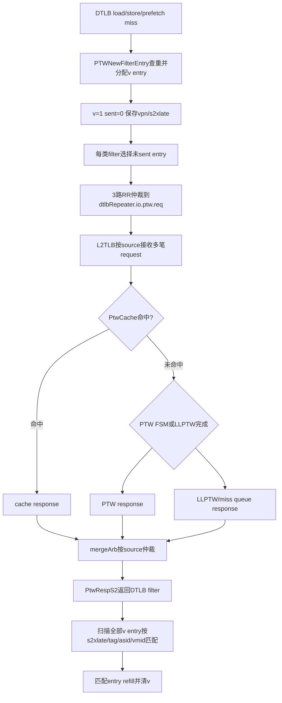

# V2 DTLB-L2TLB 多请求与 Response 次序 Flow

## 版本元数据

| 项目 | 内容 |
|---|---|
| RTL 版本 | V2 |
| 分支 | `mem_ut_uvm_v2` |
| 核验 commit | `bd813bc3ed5b39581be966c6518788852890ff6f` |
| 设计基线 | `2acbf327cf7fb514593acc00d4c41117ec499e08`，见 V2 `branch_policy.md` |
| 权威源码 | `src/main/scala/xiangshan/cache/mmu`、`src/main/scala/xiangshan/mem/MemBlock.scala`、`build_memblock/rtl/MemBlock.sv` |
| 最后核验日期 | `2026-07-21` |

## Flow 范围

本文解释 V2 DTLB miss request 从 `PTWNewFilter` 发往 L2TLB、L2TLB 从 cache/PTW/LLPTW
不同路径产生 response，以及 response 返回后如何按内容命中 DTLB filter entry。

入口是 `dtlbRepeater.io.ptw.req(0).fire`，出口是 `io.ptw.resp.fire` 后匹配的 filter entry
产生 refill 并清除。本文不分析 page-table 数据正确性，也不把 mem_ut `L2TLB_agent` 解释为
L2Cache 或 memory 下游模型。

## 核心结论

1. V2 DTLB 到 L2TLB 的交接不是 single-outstanding 协议。`PTWNewFilter` 使用 load、store、
   prefetch 三组多 entry filter 保存 `v/sent/vpn/s2xlate`，前一笔 response 返回前可以继续 fire request。
2. `PtwReq` 只有 `vpn/s2xlate`，没有 request ID。
3. `PtwRespS2` 返回后，各 filter 对全部有效 entry 计算
   `s2xlate + hit(vpn, asid, vasid, vmid)`，不是只比较最老 entry。
4. L2TLB response 可来自 page-cache hit、PTW FSM 或 LLPTW/miss queue。三条路径延迟不同，
   `mergeArb(source)` 直接选择当前可返回项，没有按该 source 的 request 次序重排。
5. 因此同一 DTLB source 的 response 可以按内容乱序完成。响应归属依赖 tag/context 内容，
   不是依赖 FIFO 次序或隐含 ID。
6. `PTWNewFilter` 将 `io.ptw.resp.ready` 固定为 true；response valid 到达后没有该交接层的 backpressure。
7. responder 的动态记账单位是该接口上的每次 request fire，而不是唯一 key。同一 filter 内的重复 key
   在发往 L2TLB 前已经合并；跨 load/store/prefetch filter 的相同 key 可以分别 fire。真实 L2TLB 对每次
   fire 增加 `tlbCounter`，LLPTW 也为每次输入保留独立 entry，只共享重复项的下游 memory wait。因此
   替代 L2TLB 的 agent 不得把已经接受的相同 key request token 合并。

## 主流程图



## 主流程文字伪代码

```text
1. DTLB各requestor产生miss request后，PTWFilterEntry检查本filter中是否已有相同vpn/s2xlate。
   没有重复且分区有空位时，新entry保存vpn/s2xlate并置v=1、sent=0；重复请求复用已有entry。

2. 每个load/store/prefetch filter从v=1且sent=0的entry中选择一笔，产生PtwReq。
   PTWNewFilter再用3路RR arbiter从三类filter中每拍最多向L2TLB发送一笔。
   request fire后只把对应entry的sent置1，其它有效entry仍保留并可继续发送。

3. L2TLB为每次request fire保存source并进入cache、PTW FSM或LLPTW/miss queue路径。
   不同request可处于不同路径和不同等待状态；tlbCounter按每次request fire增加、按每次response fire减少。
   相同key进入LLPTW时仍各占一个entry，重复entry只通过wait_id共享一次下游memory访问。

4. cache hit、PTW FSM和LLPTW完成项分别接到该source的mergeArb三个输入。
   arbiter选择当前有效且下游ready的response，不查询该source最老request，也没有response reorder buffer。

5. PtwRespS2回到PTWNewFilter后，load/store/prefetch filter都收到相同response。
   每个filter遍历全部v entry，以response.s2xlate和response.hit(vpn, CSR context)判断命中。
   所有命中entry产生refill并清v；没有使用request ID或FIFO head完成归属。若较早response已经同时
   清除跨filter的相同key entry，真实L2TLB后续为另一笔已接受request产生的重复response可能不再命中
   filter entry，但仍是该request的真实完成，不能据此在responder中删除后续token。

6. 顶层sfence或satp/vsatp/hgatp/priv.virt changed先在MemBlock经过两级RegNext，再在
   PTWNewFilter内经过fenceDelay=2产生flush，清除filter有效entry和inflight状态。相对顶层接口
   monitor sample总计4拍；flush后晚到response不应再被解释为旧entry的正常完成。
```

## 关键阶段

### 1. `PTWNewFilter` 多 entry 保存

`PTWNewFilter` 实例化三组 `PTWFilterEntry`：当前 V2 load 16 entry、store 8 entry、prefetch 8
entry。每个 entry 保存 `v/sent/vpn/s2xlate`。`io.tlb.req.ready` 固定为 true，内部可同时保留
多笔尚未收到 response 的 translation request。

同一 filter 内已有相同 `vpn/s2xlate` 时不再分配新 entry；同拍多个 request 相同也共享 index。
三类 filter 相互独立，所以跨 load/store/prefetch 类别仍可能先后向 L2TLB 发出相同 translation key。

### 2. DTLB 到 L2TLB request 仲裁

三类 filter 的 `ptw.req(0)` 进入 `RRArbiterInit(new PtwReq, 3)`。输出 payload 只有：

```text
vpn[37:0]
s2xlate[1:0]
```

request fire 后对应 entry 的 `sent` 置1；并没有等待该 response 返回后才允许仲裁下一 entry。

### 3. L2TLB 多路径完成

L2TLB 用 `arb1` 接收 ITLB/DTLB source，并维护 `tlbCounter`：所有 source request fire 加计数，
所有 source response fire 减计数。response 可能来自：

| `mergeArb` 输入 | 来源 | 典型延迟 |
|---|---|---|
| `outArbCachePort` | `cache.io.resp` hit | 短 |
| `outArbFsmPort` | `ptw.io.resp` | page walk 状态机决定 |
| `outArbMqPort` | `llptw_out` | miss queue/内存回复决定 |

三个输入都按保存的 `source` 路由到对应 `mergeArb(i)`。代码没有在 `mergeArb` 前按该 source 的
request 接收序号排序，因此后发 cache hit 可以先于早发慢路径 miss 返回。

### 4. Response 内容匹配

`PTWFilterEntry` 的匹配向量对每个有效 entry 执行：

```scala
vi &&
s2xlatei === io.ptw.resp.bits.s2xlate &&
io.ptw.resp.bits.hit(pi, satp.asid, vsatp.asid, hgatp.vmid, allType = true)
```

命中向量不是 one-hot FIFO index；一个 response 可以同时 refill 多个匹配 entry。该行为是 V2
支持内容匹配乱序 response 的直接依据。

### 5. 重复 Key 的请求和回复记账

重复 key 需要分两层理解：

1. 同一 `PTWFilterEntry` 内，已有相同 `vpn/s2xlate` 的 request 复用现有 entry，不再向 L2TLB
   产生第二次 request fire；agent 在接口上只看到一笔，因此只建一个 token。
2. load、store、prefetch 三个 filter 相互独立，相同 key 可以从不同 filter 先后到达 L2TLB。此时
   agent 能看到多次真实 request fire，必须为每次 fire 建独立 token。

真实 L2TLB 的 `tlbCounter` 对所有 `io.tlb(i).req(0).fire` 逐笔加计数，对所有
`io.tlb(i).resp.fire` 逐笔减计数。LLPTW 对每次 `io.in.fire` 都在独立 `enq_ptr` 写入 request entry；
重复项只把 state 转为 `state_mem_waiting` 并共享 `wait_id`，memory response 到达后各 entry 分别进入
`state_mem_out`，最终由多次 `io.out.fire` 逐项清除。因此真实实现没有把已经进入 L2TLB 的重复请求
合并成一次 logical response。

`PTWNewFilter` 会把一笔 response 广播给三个 filter，所以较早 response 可能同时 refill 多个相同 key
entry。这个广播优化不改变 L2TLB 对已接受 request 的计数；后续重复 response 即使不再命中 DTLB
entry，也仍会在真实 L2TLB 侧完成计数。验证 responder 因此必须保持“一次 request fire 对应一个
独立 token 和一次 response”，禁止按 lookup key 合并 outstanding record。

## 状态、队列和优先级

| 状态/队列 | 生产者 | 建立条件 | 清除条件 | 作用 |
|---|---|---|---|---|
| `PTWFilterEntry.v` | DTLB request enqueue | 新 key 且分区有空位 | 匹配 response 或 flush | 保存待 refill request |
| `PTWFilterEntry.sent` | PTW request issue | `io.ptw.req.fire` | 新 entry 重写或 flush | 防止同一 entry 重复发 request |
| `inflight_counter` | filter request/response | request/response fire差分 | flush | 统计已发未回数量 |
| L2TLB `tlbCounter` | L2TLB 顶层 | 各 source request/response fire差分 | flush | 限制全局 miss queue outstanding |
| `mergeArb(i)` | cache/PTW/LLPTW | 对应 source response valid | response fire | 从多路径选择一笔返回 source i |

## Flush 边界

`PTWNewFilter` 的 flush 条件是：

```text
sfence.valid || satp.changed || vsatp.changed || hgatp.changed || priv.virt_changed
```

输入该条件的 `sfence/tlbcsr` 不是顶层接口原值：`MemBlock.scala` 先执行两级
`RegNext(RegNext(io.ooo_to_mem.sfence/tlbCsr))`，随后 `PTWNewFilter` 再经过
`ldtlbParams.fenceDelay=2`。因此从顶层 CSR/fence agent monitor 的 sample 到 filter 清空总计4拍。
flush 清空 filter entry；验证 responder 若从顶层 monitor 建立 flush sideband，必须覆盖这4拍后才重新
允许 request fire，不能只按内部 `fenceDelay=2` 提前恢复 ready，也不能在旧 entry 被清除后继续无条件
返回旧 response。

因为顶层event与filter清空的距离是固定4拍，验证侧只有在event的monitor sample与当前service sample
相同的情况下，才能把“当前旧ready形成的request fire”准确归入该flush窗口。active运行期迟到event
已经失去这个归属依据，不能从观察拍重新锚定；startup/reset且ready从未开放时则不存在已接受request，
允许把旧latest event作为baseline并保守等待完整4拍。

## 关联 Agent 和 Flow

- [V2 L2TLB agent 接口知识](../../../interface/v2/agents/l2tlb_agent.md)：内部接管点、字段和 UVM 映射。
- [Memory flushPipe flow](memory_flush_pipe_flow.md)：sfence 与完整 core flushPipe 的不同职责。
- `AI_DOC/plan/test_framework/plan/do/mem_ut_v2_l2tlb_response_permission_adapt_execution_plan_20260708.md`：
  测试框架多 outstanding responder 的执行方案。

## V2/V3 差异

本文只核验 V2。V3 是否使用相同 `PTWNewFilter`、filter 容量和 response 仲裁必须在 V3 源码下
独立确认，不能直接复用 V2 的 32-entry 与乱序结论。

## 源码证据

- `src/main/scala/xiangshan/mem/MemBlock.scala:781`：V2 MemBlock 的 `PTWNewFilter` 连接。
- `src/main/scala/xiangshan/mem/MemBlock.scala:665-666`：顶层 sfence/tlbCsr 到内部 TLB 的两级 RegNext。
- `src/main/scala/xiangshan/cache/mmu/MMUConst.scala:35,83,133-135`：fence delay、dfilter 和三类 filter 容量。
- `src/main/scala/xiangshan/cache/mmu/Repeater.scala:163-336`：entry 保存、issue、内容匹配、response 清除和 flush。
- `src/main/scala/xiangshan/cache/mmu/Repeater.scala:338-438`：三类 filter、request RR arbiter、response broadcast 和 ready。
- `src/main/scala/xiangshan/cache/mmu/MMUBundle.scala:1124-1136,1326-1414`：`PtwReq`、`PtwRespS2` 和 `hit()`。
- `src/main/scala/xiangshan/cache/mmu/L2TLB.scala:125-215,628-685`：request counter、多路径 response 和 per-source merge arbiter。
- `src/main/scala/xiangshan/cache/mmu/PageTableWalker.scala:711-1085`：LLPTW 每次输入分配独立 entry、
  重复 memory wait 共享以及逐 entry `io.out.fire`。
- `build_memblock/rtl/MemBlock.sv:2182-2184,5282-5340,24300-24395`：当前 V2 内部 request/response wire 与实例连接。

## 知识修订记录

| 日期 | commit | 旧结论 | 新结论 | 修订原因 | 影响范围 |
|---|---|---|---|---|---|
| 2026-07-21 | `bd813bc3ed5b39581be966c6518788852890ff6f` | 首次建立，无旧的长期 flow 文档 | 建立 V2 DTLB filter 多 outstanding、L2TLB 多路径完成和按内容乱序匹配结论 | 用户要求结合 Scala 源码决定测试 responder 是否支持乱序回复 | V2 DTLB/L2TLB request-response flow |

## 待确认项

- V3 对应 filter 类型、容量和 response ordering 未在本轮核验。
