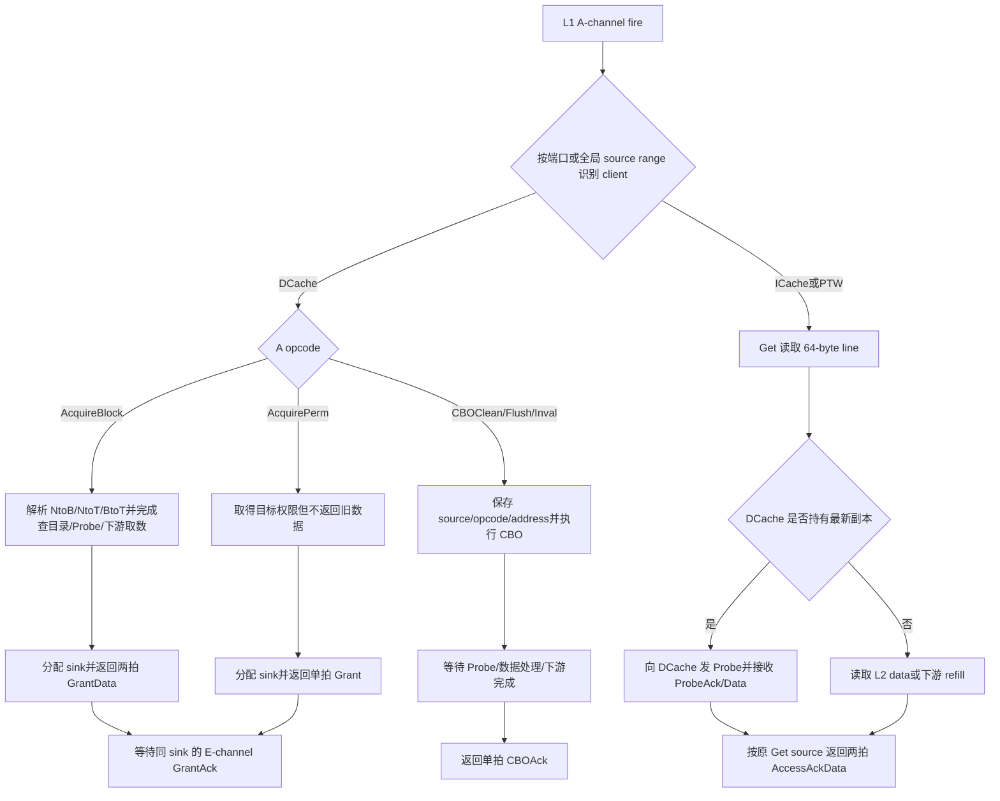

# V2 L2 内侧 TileLink 请求、权限与回复 Flow

## 版本元数据

| 项目 | 内容 |
|---|---|
| RTL 版本 | V2 |
| 分支 | `mem_ut_uvm_v2` |
| 核验 commit | `0ec33be518d75ba9cbcf28bcf51118b68e8a0d96` |
| 设计基线 | `2acbf327cf7fb514593acc00d4c41117ec499e08`，见 V2 `branch_policy.md` |
| 权威源码 | `src/main/scala/xiangshan/cache/dcache`、`src/main/scala/xiangshan/frontend/icache`、`src/main/scala/xiangshan/cache/mmu`、`src/main/scala/xiangshan/L2Top.scala`、`coupledL2/src/main/scala/coupledL2`、`rocket-chip/src/main/scala/tilelink` |
| 最后核验日期 | `2026-07-17` |

## Flow 范围

本文从完整 XSTile 中 L1 clients 进入 CoupledL2 的内侧 TileLink 接口出发，说明：

- 如何区分 DCache、ICache、PTW 和绕过 L2 的 Uncache 请求。
- `AcquireBlock/AcquirePerm` 的权限请求如何决定 `GrantData/Grant` 及其 `param`。
- `Get` 在当前 V2 中何时返回 `AccessAckData`。
- `CBOClean/CBOFlush/CBOInval` 如何关联到唯一的 `CBOAck`。
- source、sink、size、data beat、E-channel `GrantAck` 和 sideband hint 的建模合同。

本文为后续建立完整 L2 cache model 提供功能知识，不把 CHI 下游的每个 credit、retry 和
时序优化都提升为上层 TileLink 合同。DCache-L2 refill hint 的具体计拍以及全量 L2 flush
另见 [DCache-L2 refill hint 与 L2 flush done flow](dcache_l2_refill_hint_and_flush_done_flow.md)。

## 核心结论

1. 回复类型首先由 A-channel opcode 决定，而不是只看 `source` 或权限 `param`：
   `AcquireBlock -> GrantData`、`AcquirePerm -> Grant`、`Get -> AccessAckData`、
   `CBOClean/CBOFlush/CBOInval -> CBOAck`。
2. `Grant/GrantData.param` 才表达最终授予权限。当前实现对 `NtoB` 可以返回 `toB`，也可以在
   L2 可独占时提升为 `toT`；`NtoT/BtoT` 必须返回 `toT`。
3. 当前 coherent DCache A 端口不会发送 `Get/Arithmetic/Logical`，其 D 端口也不接受
   `AccessAckData`。数据侧 uncached load 虽然源于 LSU，但走独立 Uncache TL-UL 端口，不能
   和 coherent DCache responder 混在一起。
4. 完整 L2 的当前非 DCache cacheable clients 是 ICache 和 PTW。二者发送 64-byte `Get`，
   接收两拍 `AccessAckData`；它们不支持 Probe，不拥有 coherent DCache line 权限。
5. `CBOAck` 不携带原始 CBO 类型和地址。DCache 通过固定 CMO source 和单在途 CMO FSM
   关联请求；L2 model 必须保存请求快照，在 clean/flush/inval 对应操作真正完成后回复。
6. “非 DCache source”是 L1 xbar 合并后的 client source-range 分类，不是 TileLink opcode。
   在 MemBlock 独立 DUT 的分离端口上，应先按端口识别 client，不能把不同端口上相同的
   local source 数字视为同一事务。

## 主流程图



## 主流程文字伪代码

```text
1. A.fire 时一次性保存 port/client、opcode、param、size、source、address、user 和 echo。
2. 若模型位于各 MemBlock 分离端口，client 由端口身份决定；若位于 L1 xbar 后，
   先把 global source 映射成 client + local source。
3. 对 DCache AcquireBlock：
   - 根据 param 得到目标权限；
   - 查目录、处理冲突 client、必要的 Probe 和下游 refill；
   - 选择最终 cap：NtoB -> toB 或可选 toT，NtoT/BtoT -> toT；
   - 保存一个唯一 sink，返回 GrantData，两拍 data 使用同一 source/sink/param/size；
   - 正常精确模式还为该 DCache source 生成一次 refill hint。
4. 对 DCache AcquirePerm：
   - 完成与 AcquireBlock 相同的权限冲突处理，但不读取/返回旧 line 数据；
   - NtoT/BtoT 返回 Grant(toT)；
   - 保存 sink，并等待 E-channel GrantAck。
5. 对 ICache/PTW Get：
   - 若最新数据由 DCache 持有，先向 DCache Probe，使用 ProbeAckData 更新数据；
   - 否则从 L2 data array 或下游 memory 得到 line；
   - 用原 Get source 返回两拍 AccessAckData，param=0，不等待 E。
6. 对 DCache CBO：
   - 用 source 建立 pending_cbo，保存原 opcode 和 block address；
   - clean 必要时取得脏数据并清脏但保留 line；
   - flush 必要时写回脏数据并使上层/L2 line 失效；
   - inval 使上层/L2 line 失效，不把它等同于 clean/writeback；
   - 所有必需 Probe、C response 和下游完成条件满足后，返回同 source 的 CBOAck；
   - CBOAck 发出后删除 pending_cbo，不等待 E。
7. D.valid && !D.ready 时保持整个 D payload 不变；64-byte data response 完成两个
   D.fire 后才能释放 pending transaction。
8. 收到 E.fire 时按 sink 释放对应 Grant/GrantData 的 inflight-grant 记录。
```

## 1. A 到 D 的 opcode 映射

`CoupledL2.odOpGen()` 给出当前 V2 上行回复 opcode 的直接映射：

| A opcode | 数值 | D opcode | 数值 | 当前 V2 活跃来源 |
|---|---:|---|---:|---|
| `PutFullData` | 0 | `AccessAck` | 0 | L2 当前 L1 cacheable clients 未发现生产者；Uncache 端口会使用 |
| `PutPartialData` | 1 | `AccessAck` | 0 | 同上 |
| `ArithmeticData` | 2 | `AccessAckData` | 1 | CoupledL2 映射能力存在，当前 L1 clients 未发现生产者 |
| `LogicalData` | 3 | `AccessAckData` | 1 | CoupledL2 映射能力存在，当前 L1 clients 未发现生产者 |
| `Get` | 4 | `AccessAckData` | 1 | ICache、PTW；独立 Uncache load 也使用但绕过 L2 |
| `Hint` | 5 | `HintAck` | 2 | L2 prefetch 相关路径，不是本文重点 |
| `AcquireBlock` | 6 | `GrantData` | 5 | coherent DCache MSHR |
| `AcquirePerm` | 7 | `Grant` | 4 | coherent DCache full-line overwrite |
| `CBOClean` | 12 | `CBOAck` | 8 | coherent DCache CMOUnit |
| `CBOFlush` | 13 | `CBOAck` | 8 | coherent DCache CMOUnit |
| `CBOInval` | 14 | `CBOAck` | 8 | coherent DCache CMOUnit |

`D.opcode` 只说明回复类别。事务关联仍依赖 `source`，Grant 生命周期还依赖 `sink`；
`CBOAck` 不能仅凭 opcode 反推出 clean、flush 或 inval。

## 2. Client 与 source 识别

### 2.1 分离端口和合并端口是两个观察点

完整 XSTile 中 DCache、ICache 和 PTW 经 `L2Top.l1_xbar` 合并后进入 CoupledL2。xbar 前各
client 的 local source 可以重叠，xbar 后才形成互不重叠的 global source range。

| 观察点 | 正确识别方法 | 禁止假设 |
|---|---|---|
| MemBlock 独立 DUT 的 DCache/ICache/PTW 端口 | 端口身份 + 该端口 local source | 不能仅凭 `source=0` 判断 client |
| 完整 L2 的合并内侧端口 | Diplomacy client source range | 不能仅凭 opcode 判断是否 DCache |

当前源码和现有 full-core elaboration 结果给出以下范围。区间采用左闭右开：

| Client | local source range | 当前 global source range | `supportsProbe` | 主要 A 请求 |
|---|---|---|---:|---|
| DCache | `[0, 36)` | `[0, 36)` | 是 | `AcquireBlock/AcquirePerm/CBO*` |
| PTW | `[0, 16)` | `[64, 80)` | 否 | `Get` |
| ICache | `[0, 15)` | `[80, 95)` | 否 | `Get` |
| Uncache | `[0, 16)` | 不进入 CoupledL2 | 否 | `Get/Put*` |

global range 是当前配置的 elaboration 结果，配置或 xbar 拓扑变化后可能重新分配。模型应从
port/profile 生成映射，不应把 `[64,80)` 和 `[80,95)` 写成永久协议常量。

CoupledL2 当前用 `supports.probe` 找 DCache source range：

```text
sourceIsDcache = source 落在 supportsProbe client 的 IdRange；
dcacheLocalSource = globalSource - dcacheSourceIdStart；
```

因此“非 DCache source”当前具体是 PTW 或 ICache 的 global source。Uncache 不应归入这个
分类，因为它走 `mmio_port/uncache_port`，没有进入 CoupledL2。

### 2.2 DCache local source 的实际用途

当前参数为 `nMissEntries=16`、`nReleaseEntries=18`：

| Channel/请求 | local source | 回复 |
|---|---:|---|
| A `AcquireBlock/AcquirePerm` | `0..15`，即 MSHR id | `GrantData/Grant` 使用相同 source |
| A `CBOClean/Flush/Inval` | 固定 `17` (`nMissEntries + 1`) | `CBOAck` 使用相同 source |
| C `Release/ReleaseData` | `17..34` | `ReleaseAck` 使用相同 source |

CMO A source 与第一个 Writeback C source 都可以是 17，因为它们位于不同请求 channel，D
回复再由 opcode 区分为 `CBOAck` 或 `ReleaseAck`。source 16 和 35 在当前已追踪生产路径中
未使用，不能据此制造合法请求。

## 3. Grant/GrantData 权限回复

### 3.1 DCache 如何生成 grow param

DCache 使用当前 `ClientMetadata.state` 和 memory command 调用 `onAccess()`：

| 当前 L1 状态 | 请求类别 | miss grow param |
|---|---|---|
| `Nothing` | read | `NtoB` |
| `Nothing` | write intent | `NtoT` |
| `Nothing` | write | `NtoT` |
| `Branch` | write intent | `BtoT` |
| `Branch` | write | `BtoT` |

已有足够权限的访问直接 hit，不发送 Acquire。DCache MissQueue 再根据 `full_overwrite` 选择：

```text
full_overwrite = store && 64-byte store_mask 全 1；
full_overwrite ? AcquirePerm : AcquireBlock；
```

### 3.2 当前实际请求与回复矩阵

| A opcode | A param | 当前典型场景 | D opcode | 合法 D param |
|---|---|---|---|---|
| `AcquireBlock` | `NtoB` | load/read-prefetch 从 N 取 line | `GrantData` | 通常 `toB`；L2 可提升为 `toT` |
| `AcquireBlock` | `NtoT` | partial store、AMO、write-prefetch 从 N 取 line 并要写权限 | `GrantData` | `toT` |
| `AcquireBlock` | `BtoT` | 已有 B 副本的 partial store/AMO 升级 | `GrantData` | `toT` |
| `AcquirePerm` | `NtoT` | 从 N 开始的整行覆盖写，不需要旧数据 | `Grant` | `toT` |
| `AcquirePerm` | `BtoT` | 已有 B 副本时整行覆盖写并升级 | `Grant` | `toT` |

当前 DCache 不会产生 `AcquirePerm(NtoB)`。`AcquireBlock` 是否带数据由 opcode 决定，不能因
`BtoT` 是权限升级就擅自改成无数据 `Grant`。

### 3.3 L2 的最终 cap 选择

无 MSHR hit 路径和 MSHR 完成路径的共同语义是：

```text
NtoT -> toT；
BtoT -> toT；
NtoB -> 若只能共享则 toB，若 L2 当前可给独占则允许 toT；
```

MSHR 路径的 `req_promoteT` 在以下情况允许把 `NtoB` 提升为 `toT`：

- L2 hit、没有 inner client 且 L2 处于可独占的 `TIP` 状态。
- L2 miss 后从下游取得 T 权限。
- alias 处理后仍可保持独占。

因此完整模型若维护目录，应按 line 状态实现 over-grant；最小功能模型可以保守地始终让
`NtoB -> toB`，但绝不能让 `NtoT/BtoT -> toB`。

DCache 用 D `param` 更新本地状态：

| 请求类别 | D param | DCache 新状态 |
|---|---|---|
| read | `toB` | `Branch` |
| read | `toT` | `Trunk` |
| write intent | `toT` | `Trunk` |
| write | `toT` | `Dirty` |

### 3.4 Grant 字段和生命周期

`GrantBuffer` 对当前 64-byte line、32-byte D beat 的输出合同是：

| 字段/行为 | `Grant` | `GrantData` |
|---|---|---|
| `source` | 原 A source | 原 A source |
| `param` | 最终 cap | 最终 cap |
| `size` | 6 | 6 |
| `sink` | 新分配的 inflight-grant id | 新分配的 inflight-grant id，两拍相同 |
| data beat | 1 拍、data 无语义 | 2 拍，每拍 32 byte |
| E `GrantAck` | 必须 | 必须，使用 D `sink` |
| DCache refill hint | 无 | 正常精确模式有一次 |

`sink` 不是 A source。模型必须维护独立 sink 表，并在收到 E `GrantAck` 之前不复用对应
inflight grant。D backpressure 时 payload 保持不变；`GrantData` 的两个 beat 在当前
GrantBuffer 中连续发送，`isKeyword` 只可能改变哪个 32-byte half 先发。

## 4. AccessAckData 场景

### 4.1 当前进入 CoupledL2 的实际生产者

当前 V2 追踪到的活跃 L2 `Get` 生产者只有：

| Client | A 请求 | size | D 回复 | beat 数 |
|---|---|---:|---|---:|
| ICache | cache-line `Get` | 6 | `AccessAckData` | 2 |
| PTW | 64-byte 对齐 PTE block `Get` | 6 | `AccessAckData` | 2 |

两者的 D `source` 必须等于各自原始 Get source，`param=0`，不发送 E `GrantAck`，也不产生
DCache refill hint。当前 CoupledL2 的 `GrantBuffer` 对上行 data response 固定输出 line
size 6，这与 ICache/PTW 的实际请求一致。

CoupledL2 的通用映射还把 `ArithmeticData/LogicalData` 映射为 `AccessAckData`，但当前
XiangShan L1 client 源码未发现向 CoupledL2 发出这两类 A 请求。它们应记录为 manager
capability，而不是当前 mem_ut 必须随机制造的常规场景；以后新增生产者时再核验完整
read-modify-write 路径。

### 4.2 为什么 coherent DCache 端口没有 AccessAckData

coherent DCache 的普通 load/store/AMO miss 都经 MissQueue 转成 Acquire：

- load miss 使用 `AcquireBlock(NtoB)`，回复 `GrantData`。
- partial store/AMO miss 使用 `AcquireBlock(NtoT/BtoT)`，回复 `GrantData`。
- full-line overwrite 使用 `AcquirePerm(NtoT/BtoT)`，回复 `Grant`。

DCache 顶层 D router 只接受 `Grant`、`GrantData`、`CBOAck` 和 `ReleaseAck`；其他 opcode 在
`fire` 时触发断言。因此在 `auto_inner_dcache_client_out_d_*` 上回复 `AccessAckData` 是模型
错误，不是另一种合法 refill 模式。

### 4.3 数据侧 Uncache 的边界

LSU 的 MMIO/NC load 进入独立 `Uncache`：

```text
load  -> Get          -> AccessAckData；
store -> PutFull/Part -> AccessAck；
```

当前 Uncache 总线是 64 bit，请求 size 为 0..3，即 1/2/4/8 byte，因此回复是一拍。它经
`uncache_port` 走 L2Top 的 MMIO 路径，不进入 cacheable CoupledL2。后续模型可以复用
TileLink transaction 基类，但必须使用独立 pending table、带宽和 responder。

### 4.4 Get 与 DCache 最新数据的关系

ICache/PTW `Get` 本身不是 coherent owner，但读取结果必须是最新数据。若 L2 目录显示
DCache 持有 TRUNK/dirty copy，CoupledL2 会先向 DCache 发送 B-channel `Probe(toB)`，等待
`ProbeAck/ProbeAckData`，再向原 ICache/PTW source 返回 `AccessAckData`。

这形成两组不同的关联：

```text
原 Get：client=ICache/PTW，source=get_source；
内部 Probe：目标=DCache，B.source=dcache source range 起点；
C ProbeAck/Data 回来后，最终 D.source 仍必须是 get_source；
```

完整模型不能直接从可能陈旧的 backing memory 回复非 DCache Get。

## 5. CBOAck 场景与关联

### 5.1 从指令到 A-channel

StoreQueue 只把 cacheable main-memory 的 `cbo.clean/cbo.flush/cbo.inval` 送入 CMOUnit，并在
发请求前排空 SBuffer。内部编码与 TileLink A opcode 的映射为：

| 指令/CMOReq | CMOReq opcode | A opcode | A source | A size |
|---|---:|---|---:|---:|
| `cbo.clean` | 0 | `CBOClean` (12) | 17 | 6 |
| `cbo.flush` | 1 | `CBOFlush` (13) | 17 | 6 |
| `cbo.inval` | 2 | `CBOInval` (14) | 17 | 6 |

`CacheBlockOperation()` 把 A `param/mask/data` 定义为 reserved；当前生成的 DCache 仲裁路径把
A `param` 收敛为 0。A address 是 64-byte block 对齐地址。模型必须按 A opcode 识别 CBO，
不能从 reserved `param` 推断类型。

CMOUnit 一次只保存一个 `{opcode,address}`，状态依次为 idle、send request、wait response、
return LSQ response。因此当前固定 source 17 不会同时对应两个 CBO A 请求。

### 5.2 三种 CBO 的功能差异

| CBO | 对上层 DCache copy | 对 L2 line | 脏数据/下游动作 | 完成回复 |
|---|---|---|---|---|
| clean | 需要时 Probe `toB` | 保留，清 dirty；TRUNK 可转 TIP | CHI `CleanShared`，必要时 `WriteCleanFull` | `CBOAck` |
| flush | Probe `toN` | 失效 | CHI `CleanInvalid`，脏 line 必须完成相应写回/evict | `CBOAck` |
| inval | Probe `toN` | 失效 | CHI `MakeInvalid`/evict；不能把它当成 clean 写回 | `CBOAck` |

外部 CBO 在当前 CHI L2 中进入 MSHR。`CBOAck` 只有在所需 upper Probe、C response、L2
metadata/data 处理以及下游 CMO completion 都满足后才进入 D channel。命中与否只改变内部
步骤和延迟，不改变最终回复 opcode。

### 5.3 CBOAck 如何关联原请求

TileLink D channel 没有 address 字段，`CBOAck` 也没有“原 CBO opcode”字段。关联规则是：

```text
D.opcode = CBOAck；
D.source = 原 CBO A.source = 17；
原 opcode/address = L2 pending_cbo[17] 中保存的请求快照；
```

DCache 收到 `CBOAck` 后，CMOUnit 使用自己寄存的 request address 构造 `CMOResp.address`，并把
`denied/corrupt` 返回 LSQ。DCache 当前主要按 opcode 路由该回复，没有再次比较 source；
这不降低 L2 model 的要求，模型仍必须回送原 source，并应断言 source 17 存在待完成 CBO。

`CBOAck` 是单拍、无 data、不要求 E `GrantAck`。其 `param` 和 `sink` 是 reserved/无功能
语义，不能用来区分 clean/flush/inval。当前 Scala 共用 MSHR permission 映射，使 reserved
`param` 可能表现为 `toB`；这是实现产物而非 CBO 合同，checker 应屏蔽该字段，功能模型应
给 reserved 字段确定值。

| CBOAck 字段/行为 | 建模要求 |
|---|---|
| `opcode` | `CBOAck` (8) |
| `source` | 原 CBO A source，当前固定 17 |
| `size` | 6 |
| `param/sink/data` | reserved，不承载请求身份 |
| `denied/corrupt` | 对应 CBO 处理期间累积的错误状态 |
| beat/E | 单拍，不等待 E |

### 5.4 cbo.zero 不返回 CBOAck

`cbo.zero` 的内部编码为 3，但 StoreQueue 的 `deqCanDoCbo` 只选择 clean/flush/inval。
cacheable `cbo.zero` 作为整行写零进入 SBuffer/普通 store 路径，后续可能形成
`AcquirePerm -> Grant`；MMIO/NC 情况则拆成 Uncache stores 并接收 `AccessAck`。模型不能把
`cbo.zero` 转成 `CBOClean`，也不能为它生成 `CBOAck`。

## 6. 为完整 L2 model 保存的状态

### 6.1 Transaction 记录

每个 accepted request 至少保存：

```text
client / ingress_port；
global_source 和 local_source；
request_channel；
opcode、param、size、address；
user.alias、user.reqSource、echo.isKeyword；
是否需要 data、总 beat 数、已发送 beat 数；
最终 grant cap；
分配的 sink（仅 Grant/GrantData 有语义）；
等待中的 Probe/C response/下游 response；
denied、corrupt 累积状态；
CBO 原 opcode/address 和 completion 状态。
```

pending key 应包含 client/port。只用裸 `source` 作为全模型 key，会把分离端口上相同 local
source 的 DCache、ICache、PTW 或 Uncache 请求错误合并。

### 6.2 Cache line 记录

要正确支持权限、非 DCache Get 和 CBO，line state 至少包含：

```text
valid；
64-byte data；
L2 coherence state：INVALID/BRANCH/TRUNK/TIP；
dirty；
inner DCache client copy/permission；
alias（若模型验证 alias flow）；
是否有同地址 Probe、refill、CBO 或 GrantAck 未完成。
```

### 6.3 建议组件边界

```text
request classifier
  -> pending transaction table
  -> directory/data store
  -> probe engine
  -> lower-memory/CHI abstraction
  -> D response scheduler
  -> Grant sink/E tracker
  -> DCache refill hint scheduler
```

协议正确性、cache 数据/权限状态和精确 timing 应分层实现。即使暂时不模拟真实 L2 延迟，
source/opcode/param/data beat/CBO completion 的功能关联也必须先正确。

## 7. 模型不变量和错误识别

| 检查 | 正确合同 |
|---|---|
| D source | 必须对应已接受且未完成的原请求 source |
| `AcquireBlock` 回复 | 只能是 `GrantData`，当前 line 为两拍 |
| `AcquirePerm` 回复 | 只能是无数据 `Grant` |
| `NtoT/BtoT` cap | 只能 `toT` |
| `AccessAckData` 到 coherent DCache D | 非法 |
| ICache/PTW Get | 两拍 `AccessAckData`，不等待 E |
| CBOAck | 只能在 pending CBO 完成后发，source=17，无 E |
| cbo.zero | 不允许生成 `CBOAck` |
| Grant sink | 每个 inflight Grant 唯一，收到 E 后释放 |
| D backpressure | `valid=1 && ready=0` 时 payload 稳定 |
| data response beat | 两拍使用相同 opcode/source/param/size/sink，完成两个 `fire` 后释放 |
| hint | 只对 DCache `GrantData`；Grant、AccessAckData、CBOAck、非 DCache source 均不发 |

## 状态、队列和优先级

| 状态/字段/队列 | 生产者 | 建立条件 | 清除条件 | 消费者 |
|---|---|---|---|---|
| DCache MissEntry | DCache MissQueue | miss request 分配 | Grant、mainpipe refill 和 GrantAck 流程完成 | DCache A/D/E |
| `pending_cbo` | L2 model/CMO MSHR | 接受 `CBO*` A request | 匹配 `CBOAck` fire | CBO engine、D scheduler |
| `inflightGrant` | L2 GrantBuffer/model | 产生 Grant/GrantData task | 匹配 sink 的 E fire | Probe blocking、sink allocator |
| ICache/PTW Get pending | L2 model | 对应端口 A.fire | 最后一个 AccessAckData beat fire | ICache/PTW D port |
| Probe pending | L2 SourceB/model | line 最新数据或权限在 DCache | 最后一个匹配 C ProbeAck/Data beat | 原 Get/Acquire/CBO transaction |

## 异常、错误与 Backpressure

- D `denied/corrupt` 必须随原 transaction 累积。DCache Grant 和 CBOUnit、ICache/PTW/Uncache
  都会消费这些错误字段，不能因为模型只验证正常数据就永久写死后又随机错配。
- `GrantBuffer` 在 `denied` 时也会把 `corrupt` 置位。错误注入模式应保持同一 multibeat
  transaction 的字段一致，并明确错误出现在整笔还是单 beat。
- CBO 的 `denied/corrupt` 通过 `CBOAck` 传给 CMOUnit；即使失败也必须完成当前 CMO FSM，
  不能静默丢弃回复导致 StoreQueue 永久等待。
- L2 可以对 A/B/C/D/E 任一 channel 施加 backpressure。模型不得假设 request valid 看到后
  就已接受，所有 transaction 建立和 beat 计数都必须以 `fire` 为准。

## 关联 Agent 和 Flow

- [DCache-L2 refill hint 与 L2 flush done flow](dcache_l2_refill_hint_and_flush_done_flow.md)：
  `GrantData` 的 hint、critical half 和 sideband flush 边界。
- `mem_ut/ver/ut/memblock/rule/memblock_latest_dut_adapt_rule.md`：独立 MemBlock 端口适配规则。
- `mem_ut/ver/ut/memblock/rule/version/v2/dut_interface_baseline.md`：V2 DUT interface 基线。

## V2/V3 差异

本文只核验 V2。V3 的 CBO custom opcode、source range、D beat 宽度、client topology 和
CoupledL2 permission promotion 必须从 V3 源码单独确认，不能直接复制本文数值。

## 源码证据

- `src/main/scala/top/Configs.scala:477-485`：`KunminghuV2Config` 启用 CHI L2。
- `src/main/scala/xiangshan/XSTile.scala:64-73,94-100`、`src/main/scala/xiangshan/L2Top.scala:79,135-152`：DCache、ICache、PTW 经 L1 xbar 进入 L2，Uncache 走 MMIO 路径。
- `coupledL2/src/main/scala/coupledL2/CoupledL2.scala:151-175,225-230,354-360,530-540`：client range、A/D opcode 映射、source 列表和 DCache hint source 过滤。
- `src/main/scala/xiangshan/cache/dcache/DCacheWrapper.scala:118-123,943-980,1627-1642`：DCache source range 和 D opcode router。
- `src/main/scala/xiangshan/Parameters.scala:330-339`：当前 DCache MSHR/release 参数。
- `rocket-chip/src/main/scala/tilelink/Bundles.scala:20-47,107-140`：TileLink opcode 和权限编码。
- `rocket-chip/src/main/scala/tilelink/Metadata.scala:52-114`：DCache `onAccess/onGrant` 权限状态转换。
- `src/main/scala/xiangshan/cache/dcache/mainpipe/MainPipe.scala:277-296,832-852`：整行 store mask 和 `full_overwrite`。
- `src/main/scala/xiangshan/cache/dcache/mainpipe/MissQueue.scala:250-285,299-371,657-695,828-879,1188-1237`：Acquire 选择、CMO source/FSM、Grant 消费和 CBOAck 路由。
- `src/main/scala/xiangshan/mem/lsqueue/StoreQueue.scala:831-878,984-1035`：CBO 序列化、SBuffer 排空和 CMOReq opcode。
- `coupledL2/src/main/scala/coupledL2/tl2chi/MainPipe.scala:164-256,424-433,637-682`：Get/Acquire/CBO 分类、Probe/MSHR 条件和 direct D response。
- `coupledL2/src/main/scala/coupledL2/tl2chi/MSHR.scala:163-181,255-299,352-449,525-559,730-752,1052-1058`：permission promotion、CHI/CBO 行为、CBO completion 和最终 D task。
- `coupledL2/src/main/scala/coupledL2/GrantBuffer.scala:85-98,158-232,265-290`：D source/sink/size、两拍数据、inflight Grant 和 E ack。
- `coupledL2/src/main/scala/coupledL2/SourceB.scala:41-64`：Probe 只发给 supportsProbe DCache client，B source 使用 DCache range 起点。
- `src/main/scala/xiangshan/frontend/icache/ICache.scala:571-606`、`src/main/scala/xiangshan/frontend/icache/ICacheMissUnit.scala:160-170,329-349`：ICache source 和 Get/AccessAckData 数据接收。
- `src/main/scala/xiangshan/cache/mmu/MMUConst.scala:48-90,237-279`、`src/main/scala/xiangshan/cache/mmu/L2TLB.scala:35-44,390-465`：PTW source、64-byte Get 和 refill。
- `src/main/scala/xiangshan/cache/dcache/Uncache.scala:191-232,395-468`：独立 Uncache source、Get/Put 和一拍 response。
- `out/xiangshan/runMain.log:2014-2029`：当前已有 full-core elaboration 的辅助 source-range 记录；数值仅作当前配置证据。

## 知识修订记录

| 日期 | commit | 旧结论 | 新结论 | 修订原因 | 影响范围 |
|---|---|---|---|---|---|
| 2026-07-17 | `0ec33be518d75ba9cbcf28bcf51118b68e8a0d96` | 旧 hint flow 只按 D opcode 粗分 Grant、AccessAckData、CBOAck 和非 DCache source | 建立 client/source、权限 cap、CBO 请求关联、beat/E 生命周期及完整 L2 model 状态合同 | 用户要求结合 Scala 为完整 L2 cache model 准备长期知识 | V2 DCache、ICache、PTW、Uncache、CoupledL2 内侧 TileLink |

## 待确认项

- `CBOAck.param/sink` 在协议上均为 reserved。当前 Scala 数据流可使 `param` 呈现共享
  permission mapping 的实现值，但 DCache 不消费其语义。后续若要求波形逐 bit 对齐，应在
  KunminghuV2Config 的完整 CHI L2 elaboration/仿真中记录实际值；功能模型和 checker 不应
  用这些字段关联 CBO。
- 当前未发现 L1 client 向 CoupledL2 发送 `ArithmeticData/LogicalData`。若后续模型要开放
  这两类激励，需先单独核验 tl2chi miss、数据更新和错误返回全链路，不能只依据 `odOpGen()`。
