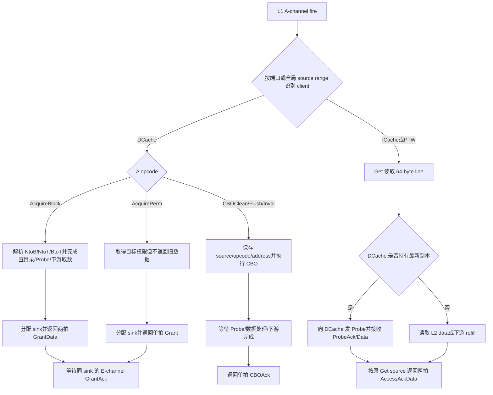

# V2 L2 内侧 TileLink 请求、权限与回复 Flow

## 版本元数据

| 项目 | 内容 |
|---|---|
| RTL 版本 | V2 |
| 分支 | `mem_ut_uvm_v2` |
| 核验 commit | `6a1b2d947e3d9629d5b9b3fb238b31f245251463` |
| 设计基线 | `2acbf327cf7fb514593acc00d4c41117ec499e08`，见 V2 `branch_policy.md` |
| 权威源码 | `src/main/scala/xiangshan/cache/dcache`、`src/main/scala/xiangshan/frontend/icache`、`src/main/scala/xiangshan/cache/mmu`、`src/main/scala/xiangshan/L2Top.scala`、`coupledL2/src/main/scala/coupledL2`、`rocket-chip/src/main/scala/tilelink` |
| 最后核验日期 | `2026-08-10` |

## Flow 范围

本文从完整 XSTile 中 L1 clients 进入 CoupledL2 的内侧 TileLink 接口出发，说明：

- 如何区分 DCache、ICache、PTW 和绕过 L2 的 Uncache 请求。
- `AcquireBlock/AcquirePerm` 的权限请求如何决定 `GrantData/Grant` 及其 `param`。
- `Get` 在当前 V2 中何时返回 `AccessAckData`。
- `CBOClean/CBOFlush/CBOInval` 如何关联到唯一的 `CBOAck`。
- source、sink、size、data beat、E-channel `GrantAck` 和 sideband hint 的建模合同。
- DCache cache alias 如何经 A-channel 交给 L2、由 L2 保存并在 B-channel Probe 中回传，及同物理
  line 不同 alias 的 anti-alias 收敛路径。
- `IsKeywordKey` 在 DCache A/D echo、L2 hint 与 B/C/E channel 的实际有效边界。

本文为后续建立完整 L2 cache model 提供功能知识，不把 CHI 下游的每个 credit、retry 和
时序优化都提升为上层 TileLink 合同。DCache-L2 refill hint 的具体计拍以及全量 L2 flush
另见 [DCache-L2 refill hint 与 L2 flush done flow](dcache_l2_refill_hint_and_flush_done_flow.md)。

## 核心结论

1. 回复类型首先由 A-channel opcode 决定，而不是只看 `source` 或权限 `param`：
   `AcquireBlock -> GrantData`、`AcquirePerm -> Grant`、`Get -> AccessAckData`、
   `CBOClean/CBOFlush/CBOInval -> CBOAck`。
2. `Grant/GrantData.param` 才表达最终授予权限。当前实现对 `NtoB` 可以返回 `toB`，也可以在
   L2 可独占时提升为 `toT`；`NtoT/BtoT` 必须返回 `toT`。
3. 当前 coherent DCache A 端口不会发送 `Get/Arithmetic/Logical`，其 D 端口也不接受
   `AccessAckData`。数据侧 uncached load 虽然源于 LSU，但走独立 Uncache TL-UL 端口，不能
   和 coherent DCache responder 混在一起。
4. 完整 L2 的当前非 DCache cacheable clients 是 ICache 和 PTW。二者发送 64-byte `Get`，
   接收两拍 `AccessAckData`；它们不支持 Probe，不拥有 coherent DCache line 权限。
5. `CBOAck` 不携带原始 CBO 类型和地址。DCache 通过固定 CMO source 和单在途 CMO FSM
   关联请求；L2 model 必须保存请求快照，在 clean/flush/inval 对应操作真正完成后回复。
   V2 DCache 的 `CMOUnit` 只有一个 `req` 寄存器和 `s_idle/s_sreq/s_wresp/s_lsq_resp` 四状态，
   `io.req.ready` 仅在 `s_idle` 有效；上一笔 CMO 直到 D `CBOAck` 收到并回传 LSQ 后才回到 idle，
   因此从 LSQ/DCache CMO A 请求入口看不支持多笔 CBO outstanding。L2 内部仍可有其他普通 MSHR，
   但不能据此推导 DCache CMO 可以并发。
6. “非 DCache source”是 L1 xbar 合并后的 client source-range 分类，不是 TileLink opcode。
   在 MemBlock 独立 DUT 的分离端口上，应先按端口识别 client，不能把不同端口上相同的
   local source 数字视为同一事务。
7. DCache alias 不是第二个物理地址或第二份 L2 data。它是 VIPT DCache 在物理地址不足以唯一恢复
   cache index 时使用的虚拟 index 补充位。DCache 在 Acquire 的 `user.alias` 发送该信息；L2
   directory 为 DCache client 保存该 line 的 alias，并在 B Probe 的 `data[2:1]` 回传。若新 Acquire
   命中同一物理 line 但 alias 不同，L2 不直接覆盖 directory alias，而是进入 alias MSHR/Probe 路径，
   先收敛旧 DCache 副本。
8. `isKeyword` 是 DCache load-miss 的 critical-half 元数据，不是 C-channel Probe/Release 的语义字段。
   当前 V2 DCache 只在 A `Acquire*` echo 产生它；L2 把它带到 `GrantData` D echo 和 `io_l2_hint`。
   C-channel 虽在独立 MemBlock 顶层展开同名端口，但该 buffer 的 C 输入不携带该扩展字段，输出固定为 0；
   CoupledL2 `SinkC` 同样把内部 task 的 `isKeyword` 置 0。

## 主流程图



## 主流程文字伪代码

```text
1. A.fire 时一次性保存 port/client、opcode、param、size、source、address、user 和 echo。
2. 若模型位于各 MemBlock 分离端口，client 由端口身份决定；若位于 L1 xbar 后，
   先把 global source 映射成 client + local source。
3. 对 DCache AcquireBlock：
   - 根据 param 得到目标权限；
   - 查目录、处理冲突 client、必要的 Probe 和下游 refill；
   - 选择最终 cap：NtoB -> toB 或可选 toT，NtoT/BtoT -> toT；
   - 保存一个唯一 sink，返回 GrantData，两拍 data 使用同一 source/sink/param/size；
   - 正常精确模式还为该 DCache source 生成一次 refill hint。
4. 对 DCache AcquirePerm：
   - 完成与 AcquireBlock 相同的权限冲突处理，但不读取/返回旧 line 数据；
   - NtoT/BtoT 返回 Grant(toT)；
   - 保存 sink，并等待 E-channel GrantAck。
5. 对 ICache/PTW Get：
   - 若最新数据由 DCache 持有，先向 DCache Probe，使用 ProbeAckData 更新数据；
   - 否则从 L2 data array 或下游 memory 得到 line；
   - 用原 Get source 返回两拍 AccessAckData，param=0，不等待 E。
6. 对 DCache CBO：
   - 用 source 建立 pending_cbo，保存原 opcode 和 block address；
   - clean 必要时取得脏数据并清脏但保留 line；
   - flush 必要时写回脏数据并使上层/L2 line 失效；
   - inval 使上层/L2 line 失效，不把它等同于 clean/writeback；
   - 所有必需 Probe、C response 和下游完成条件满足后，返回同 source 的 CBOAck；
   - CBOAck 发出后删除 pending_cbo，不等待 E。
   - 下一笔 CBO 在上一笔完成前不能 `A.fire`；DCache 通过 CMO request `ready=0` 保持请求等待。
7. D.valid && !D.ready 时保持整个 D payload 不变；64-byte data response 完成两个
   D.fire 后才能释放 pending transaction。
8. 收到 E.fire 时按 sink 释放对应 Grant/GrantData 的 inflight-grant 记录。
```

## 1. A 到 D 的 opcode 映射

`CoupledL2.odOpGen()` 给出当前 V2 上行回复 opcode 的直接映射：

| A opcode | 数值 | D opcode | 数值 | 当前 V2 活跃来源 |
|---|---:|---|---:|---|
| `PutFullData` | 0 | `AccessAck` | 0 | L2 当前 L1 cacheable clients 未发现生产者；Uncache 端口会使用 |
| `PutPartialData` | 1 | `AccessAck` | 0 | 同上 |
| `ArithmeticData` | 2 | `AccessAckData` | 1 | CoupledL2 映射能力存在，当前 L1 clients 未发现生产者 |
| `LogicalData` | 3 | `AccessAckData` | 1 | CoupledL2 映射能力存在，当前 L1 clients 未发现生产者 |
| `Get` | 4 | `AccessAckData` | 1 | ICache、PTW；独立 Uncache load 也使用但绕过 L2 |
| `Hint` | 5 | `HintAck` | 2 | L2 prefetch 相关路径，不是本文重点 |
| `AcquireBlock` | 6 | `GrantData` | 5 | coherent DCache MSHR |
| `AcquirePerm` | 7 | `Grant` | 4 | coherent DCache full-line overwrite |
| `CBOClean` | 12 | `CBOAck` | 8 | coherent DCache CMOUnit |
| `CBOFlush` | 13 | `CBOAck` | 8 | coherent DCache CMOUnit |
| `CBOInval` | 14 | `CBOAck` | 8 | coherent DCache CMOUnit |

`D.opcode` 只说明回复类别。事务关联仍依赖 `source`，Grant 生命周期还依赖 `sink`；
`CBOAck` 不能仅凭 opcode 反推出 clean、flush 或 inval。

## 2. Client 与 source 识别

### 2.1 分离端口和合并端口是两个观察点

完整 XSTile 中 DCache、ICache 和 PTW 经 `L2Top.l1_xbar` 合并后进入 CoupledL2。xbar 前各
client 的 local source 可以重叠，xbar 后才形成互不重叠的 global source range。

| 观察点 | 正确识别方法 | 禁止假设 |
|---|---|---|
| MemBlock 独立 DUT 的 DCache/ICache/PTW 端口 | 端口身份 + 该端口 local source | 不能仅凭 `source=0` 判断 client |
| 完整 L2 的合并内侧端口 | Diplomacy client source range | 不能仅凭 opcode 判断是否 DCache |

当前源码和现有 full-core elaboration 结果给出以下范围。区间采用左闭右开：

| Client | local source range | 当前 global source range | `supportsProbe` | 主要 A 请求 |
|---|---|---|---:|---|
| DCache | `[0, 36)` | `[0, 36)` | 是 | `AcquireBlock/AcquirePerm/CBO*` |
| PTW | `[0, 16)` | `[64, 80)` | 否 | `Get` |
| ICache | `[0, 15)` | `[80, 95)` | 否 | `Get` |
| Uncache | `[0, 16)` | 不进入 CoupledL2 | 否 | `Get/Put*` |

global range 是当前配置的 elaboration 结果，配置或 xbar 拓扑变化后可能重新分配。模型应从
port/profile 生成映射，不应把 `[64,80)` 和 `[80,95)` 写成永久协议常量。

CoupledL2 当前用 `supports.probe` 找 DCache source range：

```text
sourceIsDcache = source 落在 supportsProbe client 的 IdRange；
dcacheLocalSource = globalSource - dcacheSourceIdStart；
```

因此“非 DCache source”当前具体是 PTW 或 ICache 的 global source。Uncache 不应归入这个
分类，因为它走 `mmio_port/uncache_port`，没有进入 CoupledL2。

### 2.2 DCache local source 的实际用途

当前参数为 `nMissEntries=16`、`nReleaseEntries=18`：

| Channel/请求 | local source | 回复 |
|---|---:|---|
| A `AcquireBlock/AcquirePerm` | `0..15`，即 MSHR id | `GrantData/Grant` 使用相同 source |
| A `CBOClean/Flush/Inval` | 固定 `17` (`nMissEntries + 1`) | `CBOAck` 使用相同 source |
| C `Release/ReleaseData` | `17..34` | `ReleaseAck` 使用相同 source |

CMO A source 与第一个 Writeback C source 都可以是 17，因为它们位于不同请求 channel，D
回复再由 opcode 区分为 `CBOAck` 或 `ReleaseAck`。source 16 和 35 在当前已追踪生产路径中
未使用，不能据此制造合法请求。

### 2.3 独立 MemBlock 的 Uncache 端口与 `sbuffer_agent` 命名

V2 `MemBlockInlined` 先把 `Uncache.clientNode` 接入 `uncache_xbar`，并在 DCache 存在
`uncacheNode` 时把该节点也接入同一 xbar；随后由 `uncache_port` 输出。`MemBlockTop` 将这个
`uncache_port` 接到完整 core 的 `uncacheIONode`。独立 MemBlock 生成 RTL 在该节点前后插入
`TLBuffer`，顶层端口名表现为：

```text
auto_inner_buffers_out_a_*   // MemBlock -> 外部 Uncache manager
auto_inner_buffers_out_d_*   // 外部 Uncache manager -> MemBlock
```

mem_ut 中的 `sbuffer_agent_connect.sv` 正是连接这组 `auto_inner_buffers_out_*` 信号。因此
`sbuffer_agent` 是历史命名，功能身份是 MemBlock 外部 Uncache TL-UL port 的 responder，不能把
它误判为 DCache coherent C-channel 的别名，也不需要另建一个同端口的 Uncache agent。

SBuffer 模块本体的 store drain 确实先通过 `sbuffer.io.dcache` 送往 DCache：cacheable store 在
DCache 内处理，只有以后形成 `ReleaseData/ProbeAckData` 写回时才出现在 DCache coherent C-channel。
另一方面，LSQ Uncache、MMIO/NC 请求以及可选 DCache uncache node 的请求经 `uncache_xbar` 从
`auto_inner_buffers_out_a_*` 离开 MemBlock。两条 top-level memory-facing 路径必须分开建模：

```text
DCache coherent C ReleaseData/ProbeAckData 完整握手
  -> coherent writeback 数据已被外部 L2 接收；

auto_inner_buffers_out A Put*.fire
  -> Uncache store 已被外部 manager 接收；

二者均可更新测试框架的共享写覆盖层，
但不能互相替代，也不能在 SBuffer 向 DCache 发内部 req 时提前记为外部写。
```

## 3. Grant/GrantData 权限回复

### 3.1 DCache 如何生成 grow param

DCache 使用当前 `ClientMetadata.state` 和 memory command 调用 `onAccess()`：

| 当前 L1 状态 | 请求类别 | miss grow param |
|---|---|---|
| `Nothing` | read | `NtoB` |
| `Nothing` | write intent | `NtoT` |
| `Nothing` | write | `NtoT` |
| `Branch` | write intent | `BtoT` |
| `Branch` | write | `BtoT` |

已有足够权限的访问直接 hit，不发送 Acquire。DCache MissQueue 再根据 `full_overwrite` 选择：

```text
full_overwrite = store && 64-byte store_mask 全 1；
full_overwrite ? AcquirePerm : AcquireBlock；
```

### 3.2 当前实际请求与回复矩阵

| A opcode | A param | 当前典型场景 | D opcode | 合法 D param |
|---|---|---|---|---|
| `AcquireBlock` | `NtoB` | load/read-prefetch 从 N 取 line | `GrantData` | 通常 `toB`；L2 可提升为 `toT` |
| `AcquireBlock` | `NtoT` | partial store、AMO、write-prefetch 从 N 取 line 并要写权限 | `GrantData` | `toT` |
| `AcquireBlock` | `BtoT` | 已有 B 副本的 partial store/AMO 升级 | `GrantData` | `toT` |
| `AcquirePerm` | `NtoT` | 从 N 开始的整行覆盖写，不需要旧数据 | `Grant` | `toT` |
| `AcquirePerm` | `BtoT` | 已有 B 副本时整行覆盖写并升级 | `Grant` | `toT` |

当前 DCache 不会产生 `AcquirePerm(NtoB)`。`AcquireBlock` 是否带数据由 opcode 决定，不能因
`BtoT` 是权限升级就擅自改成无数据 `Grant`。

### 3.3 L2 的最终 cap 选择

无 MSHR hit 路径和 MSHR 完成路径的共同语义是：

```text
NtoT -> toT；
BtoT -> toT；
NtoB -> 若只能共享则 toB，若 L2 当前可给独占则允许 toT；
```

MSHR 路径的 `req_promoteT` 在以下情况允许把 `NtoB` 提升为 `toT`：

- L2 hit、没有 inner client 且 L2 处于可独占的 `TIP` 状态。
- L2 miss 后从下游取得 T 权限。
- alias 处理后仍可保持独占。

因此完整模型若维护目录，应按 line 状态实现 over-grant；最小功能模型可以保守地始终让
`NtoB -> toB`，但绝不能让 `NtoT/BtoT -> toB`。

DCache 用 D `param` 更新本地状态：

| 请求类别 | D param | DCache 新状态 |
|---|---|---|
| read | `toB` | `Branch` |
| read | `toT` | `Trunk` |
| write intent | `toT` | `Trunk` |
| write | `toT` | `Dirty` |

### 3.4 Grant 字段和生命周期

`GrantBuffer` 对当前 64-byte line、32-byte D beat 的输出合同是：

| 字段/行为 | `Grant` | `GrantData` |
|---|---|---|
| `source` | 原 A source | 原 A source |
| `param` | 最终 cap | 最终 cap |
| `size` | 6 | 6 |
| `sink` | 新分配的 inflight-grant id | 新分配的 inflight-grant id，两拍相同 |
| data beat | 1 拍、data 无语义 | 2 拍，每拍 32 byte |
| E `GrantAck` | 必须 | 必须，使用 D `sink` |
| DCache refill hint | 无 | 正常精确模式有一次 |

`sink` 不是 A source。模型必须维护独立 sink 表，并在收到 E `GrantAck` 之前不复用对应
inflight grant。D backpressure 时 payload 保持不变；`GrantData` 的两个 beat 在当前
GrantBuffer 中连续发送，`isKeyword` 只可能改变哪个 32-byte half 先发。

## 4. AccessAckData 场景

### 4.1 当前进入 CoupledL2 的实际生产者

当前 V2 追踪到的活跃 L2 `Get` 生产者只有：

| Client | A 请求 | size | D 回复 | beat 数 |
|---|---|---:|---|---:|
| ICache | cache-line `Get` | 6 | `AccessAckData` | 2 |
| PTW | 64-byte 对齐 PTE block `Get` | 6 | `AccessAckData` | 2 |

两者的 D `source` 必须等于各自原始 Get source，`param=0`，不发送 E `GrantAck`，也不产生
DCache refill hint。当前 CoupledL2 的 `GrantBuffer` 对上行 data response 固定输出 line
size 6，这与 ICache/PTW 的实际请求一致。

CoupledL2 的通用映射还把 `ArithmeticData/LogicalData` 映射为 `AccessAckData`，但当前
XiangShan L1 client 源码未发现向 CoupledL2 发出这两类 A 请求。它们应记录为 manager
capability，而不是当前 mem_ut 必须随机制造的常规场景；以后新增生产者时再核验完整
read-modify-write 路径。

### 4.2 为什么 coherent DCache 端口没有 AccessAckData

coherent DCache 的普通 load/store/AMO miss 都经 MissQueue 转成 Acquire：

- load miss 使用 `AcquireBlock(NtoB)`，回复 `GrantData`。
- partial store/AMO miss 使用 `AcquireBlock(NtoT/BtoT)`，回复 `GrantData`。
- full-line overwrite 使用 `AcquirePerm(NtoT/BtoT)`，回复 `Grant`。

DCache 顶层 D router 只接受 `Grant`、`GrantData`、`CBOAck` 和 `ReleaseAck`；其他 opcode 在
`fire` 时触发断言。因此在 `auto_inner_dcache_client_out_d_*` 上回复 `AccessAckData` 是模型
错误，不是另一种合法 refill 模式。

### 4.3 数据侧 Uncache 的边界

LSU 的 MMIO/NC load 进入独立 `Uncache`：

```text
load  -> Get          -> AccessAckData；
store -> PutFull/Part -> AccessAck；
```

当前 Uncache 总线是 64 bit，请求 size 为 0..3，即 1/2/4/8 byte，因此回复是一拍。它经
`uncache_port` 走 L2Top 的 MMIO 路径，不进入 cacheable CoupledL2。后续模型可以复用
TileLink transaction 基类，但必须使用独立 pending table、带宽和 responder。

### 4.3.1 Uncache TL-UL opcode 白名单与非支持类型

这里的“白名单”不是要求测试框架额外实现一套 Uncache 功能，而是约束外部 Uncache manager
只能接收当前 V2 `Uncache` 实际会发出的 A 请求，并以对应的 D opcode 回复。`Uncache.scala`
明确标注该模块当前只处理 TL-UL；它对每个待发送 entry 只构造 `edge.Get` 或 `edge.Put`，再由
`cmd === M_XWR` 在两者之间选择。`Put` 根据 mask 自动成为 `PutFullData` 或
`PutPartialData`。

| A opcode | 数值 | 协议类别 | V2 `auto_inner_buffers_out_a_*` 是否由 Uncache 产生 | 正确 D 回复 |
|---|---:|---|---:|---|
| `PutFullData` | 0 | 完整写 | 是 | `AccessAck` (0) |
| `PutPartialData` | 1 | 掩码写 | 是 | `AccessAck` (0) |
| `Get` | 4 | 非缓存读/MMIO 读 | 是 | `AccessAckData` (1) |
| `ArithmeticData` | 2 | TileLink 原子 read-modify-write | 否 | 不得伪造为 `AccessAckData` |
| `LogicalData` | 3 | TileLink 逻辑 read-modify-write | 否 | 不得伪造为 `AccessAckData` |
| `Hint` | 5 | cache/prefetch hint | 否 | 不得伪造为 `AccessAckData` |
| `AcquireBlock/AcquirePerm` | 6/7 | coherent 权限获取 | 否 | 不得出现在该 TL-UL 端口 |
| `CBOClean/CBOFlush/CBOInval` | 12/13/14 | coherent cache block operation | 否 | 不得出现在该 TL-UL 端口 |

`ArithmeticData/LogicalData` 是 TileLink 总线原子操作编码，不等同于“RISC-V AMO 指令一定由
Uncache 发出”。V2 cacheable AMO miss 走 DCache `AcquireBlock(NtoT/BtoT) -> GrantData`；当前
Uncache 的入口契约只有读 `M_XRD` 和写 `M_XWR`。如果上游错误地把其它 cmd 送入该模块，现有
`q0_isStore` 会把所有非 `M_XWR` cmd 选择成 `Get`，所以这种错误不能由当前模块自动转换为
合法 AMO 事务。

`CBOClean/CBOFlush/CBOInval` 同理属于 coherent DCache CMO A-channel 请求。`cbo.zero` 在
NC/MMIO 情况下的实现边界不同：它会拆成普通 Uncache store，因此外部只会看到一个或多个
`Put* -> AccessAck`，不会看到 CBO opcode 或 `CBOAck`。

Uncache 的 D 接收逻辑按 `source` 找 entry，完成后把 `denied/corrupt` 回传到 LSQ；读 entry
才采样 D data。它不以 D opcode 再次分派状态机。因此 standalone responder 的最小正确做法是：

```text
A.fire：
  PutFullData/PutPartialData -> 写 sparse memory -> 同 source 返回 AccessAck；
  Get                       -> 读 sparse memory -> 同 source 返回 AccessAckData；
  其余 opcode               -> uvm_fatal，不执行 memory access，也不回复 AccessAckData。

D.valid && !D.ready：
  保持 opcode/source/size/data/denied/corrupt；
  仅在 D.fire 后释放该 pending response。
```

因此，上述 `ArithmeticData/LogicalData/Hint/Acquire*/CBO*` 在本 V2 Uncache 端口不是“尚未
覆盖的普通场景”，而是当前 DUT 不会合法产生的 opcode。测试框架可在 responder 中对此 fail-fast，
但不应为了覆盖率随机构造它们。若未来设计新增真实 producer，必须同时核验 A opcode、D opcode、
数据更新、异常和 LSQ completion 全链路后再从白名单打开。

### 4.3.2 Uncache `denied/corrupt` 的错误优先级和完成合同

`UncacheEntry.update(TLBundleD)` 没有再次实现 TileLink 格式断言，而是在 D.fire 时原样锁存两位，
并生成聚合 sideband：

```text
resp_nderr   = denied || corrupt
resp_denied  = denied
resp_corrupt = corrupt
```

但这不表示所有 bit 组合都是合法的 Uncache D response。Rocket-Chip `TLBundleD` 的协议注释和
`TLMonitor.legalizeFormatD()` 给出的通用规则是：`denied` 在数据类 D message 上必须蕴含
`corrupt`，而 `corrupt` 只适用于数据类 message。对应当前 Uncache 的 request/response 映射为：

| A 请求 / D 回复 | `denied/corrupt` 合法组合 | 不合法组合 | 条件 |
|---|---|---|---|
| `PutFullData/PutPartialData -> AccessAck` | `0/0`；若外部 manager 声明 `mayDenyPut`，可为 `1/0` | 任意 `corrupt=1` | `AccessAck` 无 data，`corrupt` 必须为 0 |
| `Get -> AccessAckData` | `0/0`、`0/1`；若 manager 声明 `mayDenyGet`，可为 `1/1` | `1/0` | `AccessAckData` 带 data，`denied -> corrupt` |

独立 MemBlock 顶层没有把外部 Uncache manager 的 Diplomacy `mayDenyGet/mayDenyPut` 参数导出成
运行期信号；因此测试框架默认正常模式固定 `0/0`。后续若建立 error injection，必须先把对应
manager deny capability 作为该 responder model 的明确契约，不能无条件把 denied 当成普通随机位。

在满足上述协议格式的前提下，当前 V2 的内部异常优先级不是由 `resp_nderr` 决定，而是由两个原始 bit
分开决定：

| 合法 error response | load/store 异常结果 | 说明 |
|---|---|---|
| `AccessAckData: 0/1` | `hardwareError` | 仅数据/硬件错误 |
| `AccessAckData: 1/1` | `loadAccessFault` | `denied` 覆盖 `hardwareError`；不是双异常 |
| `AccessAck: 1/0` | `storeAccessFault` | 仅在 manager 允许 deny-put 时合法 |

具体地，`LoadQueueUncache` 对 NC load 和 MMIO load 都写入：

```text
hardwareError  = corrupt && !denied
loadAccessFault = denied
```

StoreQueue 的 MMIO/NC store response 使用相同的内部优先级代码：`denied` 写 `storeAccessFault`，
仅 `corrupt && !denied` 写 `hardwareError`。但对当前 Uncache store 的合法 `AccessAck`，协议已经要求
`corrupt=0`，所以 store `hardwareError` 分支不是由一个合法的 Uncache `AccessAck.corrupt=1` 激励覆盖；
它同时服务其它内部 response 来源或防御非法输入。测试框架不能为了命中该分支而驱动违规 `AccessAck`。

错误 D response 仍是一个必须完成的 response：Uncache 以 D `source` 找到 inflight entry，锁存
data/error，调用 `updateUncacheResp()` 使 entry 转为返回 LSQ 的 `waitReturn`。LoadQueueUncache 或
StoreQueue 随后发带 exceptionVec 的 writeback/completion；responder 不能因为准备注入 error 就静默
drop D response，否则 Uncache entry、MMIO FSM 或 StoreQueue completion 会永久等待。

对 load，D.data 在 error response 时仍会被锁存，但最终异常由上表决定；测试框架最小 memory model
可继续把 error response 的 data 置 0，不能把该 data 当作有效 architectural load result。对 store，
Uncache 在外部 D.fire 时若 `denied || corrupt`，还产生 `io_uncacheError_ecc_error` 候选；MemBlock
延迟两拍并受 `csrCtrl.cache_error_enable` gate 后才输出该 top-level error。该 sideband 不替代
store writeback 的 `storeAccessFault/hardwareError`，两条路径都来自同一 D response。

因此 Uncache responder 的默认正常模式必须驱动 `denied=0, corrupt=0`。后续 error 注入专项应按
D opcode 只开放上表合法组合，在 response record 创建时一次固定两个 bit，并在 D.ready backpressure
期间保持不变；不应在同一 response 的 hold 周期翻转错误属性。

### 4.3.3 DCache 对违规 `GrantData(denied=1, corrupt=0)` 的内部容错边界

该组合与 Uncache 的 `AccessAckData(denied=1, corrupt=0)` 一样是 TileLink 格式违规：`GrantData`
为带数据 D response，`TLMonitor` 要求 `denied -> corrupt`。因此 L2/DCache responder 不得将 `1/0`
作为合法的 GrantData 错误注入值；合法组合仍为正常 `0/0`、数据错误 `0/1`，以及 manager 明确允许
deny-get 时的 `1/1`。

但 DCache 内部的接收 datapath 确实具有容错传播，而不是在端口路由处把该违规组合立即拒绝：

```text
DCacheWrapper:
  Grant/GrantData/CBOAck -> MissQueue，denied/corrupt 原样传入；

MissEntry 在每个 D fire：
  accumulated_denied  |= d.denied
  accumulated_corrupt |= d.corrupt
  refill_to_ldq.error  = d.denied || d.corrupt
  refill_info 保留 tl_denied 与 tl_corrupt 两个原始累计值。
```

所以若错误的外部 responder 送入 `GrantData(1/0)`，当前 DCache 至少会把它纳入 refill/load-forward
错误路径，而非在 DCacheWrapper 入口做协议格式归一化。这是接收协议违规输入后的防御性错误传播，
不是 DCache 放宽 TileLink 合法激励范围。测试框架应在 responder 创建 response 时归一化：
`GrantData.corrupt = raw_corrupt || raw_denied`；不能依赖 DCache 的该路径来验证 denied-only GrantData。

### 4.3.4 DCache `corrupt` 从 beat 到 cache line 的收敛

`TLBundleD.corrupt` 是 data beat 字段，当前 L1-L2 bus 为 256 bit，所以一条 64B `GrantData`
有两个 32B beat。DCache MissEntry 在每个 `D.fire` 执行累计 OR；任意一个 beat 的 `corrupt=1`
都会使该 refill 的 `TLError.tl_corrupt=1`。MainPipe 随 refilled line 的 `idx + way_en` 将这份
两 bit 的 `TLError {tl_denied, tl_corrupt}` 写入 `L1ErrorMetaArray`。后续 load hit 读到同一
set/way 的 error meta 后，按整条 64B line 报告该错误。

相反，DCache 向 L2 发送 `ProbeAckData/ReleaseData` 时，WritebackQueue 一次保存 64B data 和一个
`WritebackReq.corrupt`；它把同一 bit 复制到两个 32B C beat。data array 的 line read 会对 8 个
64-bit bank 的 ECC error 做 OR，因此外部 C 接口没有 bank/byte 级错误位置。对测试框架/RM，C data
transaction 的 corrupt key 应是 `address & ~64'h3f`，并只在完整 data transaction 收敛后按 64B
line 标记为不可比较。无数据 `ProbeAck/Release` 不可被解释为 overlay 的 corrupt data writeback。

该结论的顶层字段和测试框架边界见 [DCache agent](../../../interface/v2/agents/dcache_agent.md)。

### 4.4 Get 与 DCache 最新数据的关系

ICache/PTW `Get` 本身不是 coherent owner，但读取结果必须是最新数据。若 L2 目录显示
DCache 持有 TRUNK/dirty copy，CoupledL2 会先向 DCache 发送 B-channel `Probe(toB)`，等待
`ProbeAck/ProbeAckData`，再向原 ICache/PTW source 返回 `AccessAckData`。

这形成两组不同的关联：

```text
原 Get：client=ICache/PTW，source=get_source；
内部 Probe：目标=DCache，B.source=dcache source range 起点；
C ProbeAck/Data 回来后，最终 D.source 仍必须是 get_source；
```

完整模型不能直接从可能陈旧的 backing memory 回复非 DCache Get。

## 5. CBOAck 场景与关联

### 5.1 从指令到 A-channel

StoreQueue 只把 cacheable main-memory 的 `cbo.clean/cbo.flush/cbo.inval` 送入 CMOUnit，并在
发请求前排空 SBuffer。内部编码与 TileLink A opcode 的映射为：

| 指令/CMOReq | CMOReq opcode | A opcode | A source | A size |
|---|---:|---|---:|---:|
| `cbo.clean` | 0 | `CBOClean` (12) | 17 | 6 |
| `cbo.flush` | 1 | `CBOFlush` (13) | 17 | 6 |
| `cbo.inval` | 2 | `CBOInval` (14) | 17 | 6 |

`CacheBlockOperation()` 把 A `param/mask/data` 定义为 reserved；当前生成的 DCache 仲裁路径把
A `param` 收敛为 0。A address 是 64-byte block 对齐地址。模型必须按 A opcode 识别 CBO，
不能从 reserved `param` 推断类型。

CMOUnit 一次只保存一个 `{opcode,address}`，状态依次为 idle、send request、wait response、
return LSQ response。因此当前固定 source 17 不会同时对应两个 CBO A 请求。

### 5.2 三种 CBO 的功能差异

| CBO | 对上层 DCache copy | 对 L2 line | 脏数据/下游动作 | 完成回复 |
|---|---|---|---|---|
| clean | 需要时 Probe `toB` | 保留，清 dirty；TRUNK 可转 TIP | CHI `CleanShared`，必要时 `WriteCleanFull` | `CBOAck` |
| flush | Probe `toN` | 失效 | CHI `CleanInvalid`，脏 line 必须完成相应写回/evict | `CBOAck` |
| inval | Probe `toN` | 失效 | CHI `MakeInvalid`/evict；不能把它当成 clean 写回 | `CBOAck` |

外部 CBO 在当前 CHI L2 中进入 MSHR。`CBOAck` 只有在所需 upper Probe、C response、L2
metadata/data 处理以及下游 CMO completion 都满足后才进入 D channel。命中与否只改变内部
步骤和延迟，不改变最终回复 opcode。

### 5.3 CBOAck 如何关联原请求

TileLink D channel 没有 address 字段，`CBOAck` 也没有“原 CBO opcode”字段。关联规则是：

```text
D.opcode = CBOAck；
D.source = 原 CBO A.source = 17；
原 opcode/address = L2 pending_cbo[17] 中保存的请求快照；
```

DCache 收到 `CBOAck` 后，CMOUnit 使用自己寄存的 request address 构造 `CMOResp.address`，并把
`denied/corrupt` 返回 LSQ。DCache 当前主要按 opcode 路由该回复，没有再次比较 source；
这不降低 L2 model 的要求，模型仍必须回送原 source，并应断言 source 17 存在待完成 CBO。

`CBOAck` 是单拍、无 data、不要求 E `GrantAck`。其 `param` 和 `sink` 是 reserved/无功能
语义，不能用来区分 clean/flush/inval。当前 Scala 共用 MSHR permission 映射，使 reserved
`param` 可能表现为 `toB`；这是实现产物而非 CBO 合同，checker 应屏蔽该字段，功能模型应
给 reserved 字段确定值。

| CBOAck 字段/行为 | 建模要求 |
|---|---|
| `opcode` | `CBOAck` (8) |
| `source` | 原 CBO A source，当前固定 17 |
| `size` | 6 |
| `param/sink/data` | reserved，不承载请求身份 |
| `denied/corrupt` | 对应 CBO 处理期间累积的错误状态 |
| beat/E | 单拍，不等待 E |

### 5.4 cbo.zero 不返回 CBOAck

`cbo.zero` 的内部编码为 3，但 StoreQueue 的 `deqCanDoCbo` 只选择 clean/flush/inval。
cacheable `cbo.zero` 作为整行写零进入 SBuffer/普通 store 路径，后续可能形成
`AcquirePerm -> Grant`；MMIO/NC 情况则拆成 Uncache stores 并接收 `AccessAck`。模型不能把
`cbo.zero` 转成 `CBOClean`，也不能为它生成 `CBOAck`。

## 6. DCache 实际事务闭环与 mem_ut 处理边界

### 6.1 A/D/E refill 闭环

`D.fire` 不是 DCache miss 生命周期的终点。`MissQueue` 在每次 `mem_grant.fire` 时锁存
`edge.GrantAck(io.mem_grant.bits)`；只有后续 `mem_finish.fire`，即 E-channel 对应 `sink` 的
`GrantAck` 真正握手后，MissEntry 才置 `s_grantack`。CoupledL2 的 `SourceB` 也明确规定：同一
地址尚有未收到 GrantAck 的 Grant 时，不能继续向该地址发 Probe。

因此 DCache-L2 responder 的最低正确处理是：

```text
A.fire(AcquireBlock/AcquirePerm)
  -> 记录 source、line、请求权限和唯一 sink
  -> D.fire(GrantData 两 beat 或 Grant 一 beat)
  -> 保留 inflightGrant[sink]，不能复用 sink 或把 line 作为可 Probe 完成态
  -> E.fire(GrantAck，sink 必须匹配)
  -> 删除 inflightGrant[sink]；此时才允许同地址后续 Probe/新权限动作
```

`GrantData` 的每个 beat 都可使 MissQueue 开始 refill 或唤醒相关 load；但最后一个 beat 只表示
数据已传完，不表示 L2 的一致性授权已经结束。对 `AcquirePerm -> Grant` 同样必须等待 E。

### 6.2 B/C coherence 闭环

L2 需要回收 DCache 副本、降权或获取最新脏数据时，通过 B-channel 发送 `Probe`。DCache
`ProbeQueue` 将其送入 MainPipe；随后 C-channel 回 `ProbeAck` 或 `ProbeAckData`。后者带完整
cache line 的两个 data beat。CoupledL2 根据 C reply 的 opcode、最后 beat、`param` 和 dirty 状态
更新 MSHR/目录，原始 Get、Acquire 或 CBO 事务随后才可继续。

```text
L2 发现 line 的 DCache copy 与当前请求冲突
  -> B.fire(Probe: address + toN/toB + needData)
  -> 按 B source/address 建立 probe pending，禁止把同地址 C 当成普通 Release
  -> C.fire(ProbeAck 或 ProbeAckData 全部 beat)
  -> 更新 directory/data/permission，解除原事务的 probe wait
```

`Probe(toN)` 使 DCache 副本失效；`Probe(toB)` 是降到共享的合法完整 L2 行为。是否必须返回
`ProbeAckData` 取决于 line 是否 dirty 或 L2 的 `needProbeAckData`，不能只由 Probe opcode 推断。

### 6.2.1 Probe C `param` 的实际权限回报

B `Probe.param` 是 L2 对 DCache 提出的最终权限上限（`toB` 或 `toN`）；C
`ProbeAck/ProbeAckData.param` 不是对 B 参数的回显，而是 DCache 在实际处理该 Probe 时报告的权限变化。
V2 DCache MainPipe 用 `s3_coh.onProbe(s3_req.probe_param)` 取得该 report param 和新 coherence state，并由
WritebackQueue 原样写入 C `param`。

| B Probe 目标 | DCache 原权限 | V2 C `param` | DCache 处理后权限 |
|---|---|---|---|
| `toB` | Dirty/Trunk | `TtoB` | Branch |
| `toB` | Branch | `BtoB` | Branch |
| `toB` | Nothing | `NtoN` | Nothing |
| `toN` | Dirty/Trunk | `TtoN` | Nothing |
| `toN` | Branch | `BtoN` | Nothing |
| `toN` | Nothing | `NtoN` | Nothing |

因此 `NtoN` 是 TileLink 定义的合法 C report，并不表示 wire protocol 错误。它表示 DCache 在
Probe 真正到达时已没有该副本，例如 Probe 与之前已发出的 Release、replacement 或其他收敛路径交错。

对 mem_ut 轻量 L2 responder，必须区分协议合法性和软件模型一致性：

```text
若 Probe 由 active cached_line_record 创建：
  C.param 仍按上表接受并完成该 Probe record 的协议收敛；
  若收到 NtoN：删除/失效该 line 的模型副本，并解除等待该 Probe 的 owner；
  同时报告 uvm_error，说明软件记录的有效副本已经落后于 DUT；

不得：
  将 NtoN 作为随机选择的正常回复；
  因 NtoN 永久等待 CBO、alias deferred Acquire 或 flush；
  要求 testcase 或用户选择 NtoN 是否为 TileLink 合法值。
```

同理，轻量模型若保存权限层级，`Probe(toB)` 的 `TtoB/BtoB` 和 `Probe(toN)` 的 `TtoN/BtoN`
应由保存的权限状态推导并核对；不能仅以 Probe 目标参数固定一个 C `param`。当前只保存 alias 而未保存
精确 client permission 的轻量框架，应把 `NtoN` 视为可收敛的状态失配，而不是伪造 `TtoB/BtoB`。

### 6.2.2 DCache alias 与 L2 anti-alias 路径

`alias` 的根因是 DCache 的 VIPT index 可能越出页内偏移。`DCacheParameters` 仅在
`nSets * blockBytes > pageSize` 时启用 `aliasBitsOpt`；此时同一物理 cache line 的物理地址无法
单独确定 DCache 访问使用的全部 index 位。`is_alias_match()` 比较的正是
`vaddr(blockOffBits + idxBits - 1, pgIdxBits)` 这段超出页内 offset 的虚拟 index 片段。

```text
同一 physical line，alias 相同：
  DCache MissQueue 可以按同一 cache index 合并或协调请求。

同一 physical line，alias 不同：
  两次访问可能落在不同 VIPT set；不能把它们当作同一 DCache 副本静默合并。
```

V2 DCache 与 L2 的实际协作如下：

```text
1. DCache MissQueue 产生 AcquireBlock/AcquirePerm：
   A.user[AliasKey] = req.vaddr[13:12]。

2. CoupledL2 SinkA 在 A.fire 时：
   TaskBundle.alias = A.user[AliasKey]；
   directory MetaEntry 为该 DCache client 保存 alias。

3. 新 Acquire 命中已有 line，且该 line 已有 DCache client copy、meta.alias != req.alias：
   MainPipe 置 cache_alias；
   为该请求分配 aliasTask MSHR，而不是立即发 Grant；
   MSHR 使用 directory 中保存的旧 meta.alias 发 B Probe，等待旧副本的 C ProbeAck/Data 收敛。

4. SourceB 构造 B Probe：
   B.data = Cat(task.alias, 0.U(1.W))；
   因而 data[2:1] 是 alias，data[0] 是 needData。

5. DCache ProbeQueue/MissQueue 接收 B：
   从 B.data[2:1] 取 alias fragment；
   用 physical address 的其余部分和该 fragment 重构 probe.vaddr；
   再以这个 vaddr/index 查询或阻塞 DCache 内的 MissQueue/MainPipe，最后返回 C ProbeAck/Data。

6. 旧 alias 的 Probe 完成后：
   L2 按新请求的 alias 完成授权，并把新 alias 写回 directory；
   后续对该 line 的 Probe 使用新的 directory alias。
```

这里的 `B.data[2:1]` 不是 Probe data payload，只有用于恢复 DCache virtual index 的 alias 元数据；
真正的脏 cache line 数据仍经 `ProbeAckData` 的 C-channel 两个 data beat 返回。

对 mem_ut 轻量 L2 responder，最小正确合同是：在 GrantAck 后把 A request 的 alias 和 physical line
一起记录；发 Probe 或轻量 L2 flush Probe 时必须将记录的 alias 写入 B `data[2:1]`。主存/overlay 的
key 仍只能是物理地址，alias 不得参与数据存储索引。

当前轻量表为 `{physical line -> alias}`，与完整 L2 directory 每 line 保存一个 `MetaEntry.alias`
的事实一致，适合“同一时刻只有一个已建模 DCache alias”的场景。但轻量 responder 若接受到同物理
line、不同 alias 的新 Grant，不能静默覆盖旧 alias：旧 DCache 副本可能仍有效，后续 Probe 会打到错误
index。需要先用旧 alias 发 `Probe(toN)` 并等待 C 收敛后再替换记录，或者在未实现该 alias Probe
闭环前将这种激励显式禁止。

### 6.2.3 `isKeyword` 的有效通道与 C 路径边界

`isKeyword` 不是 cache coherence permission，也不是 Probe/Release 的关联 key。它表示 DCache load
miss 所在的关键 32B half，用于让 L2 先返回该 half，并使 DCache 和 load-forward 路径按正确顺序解释
两个 `GrantData` beat。

```text
DCache MissQueue：
  load miss       -> isKeyword = vaddr[5]
  store miss       -> isKeyword = 0
  merge 的 load    -> 按当前较新/优先的 load 重新选择该 bit
  A Acquire*.echo[IsKeywordKey] = isKeyword

CoupledL2 SinkA/MainPipe/MSHR/GrantBuffer：
  A echo.isKeyword -> TaskBundle.isKeyword
  TaskBundle.isKeyword -> GrantData D echo.isKeyword
  TaskBundle.isKeyword -> CustomL1Hint.isKeyword -> io_l2_hint.bits.isKeyword

DCache：
  D echo.isKeyword=1 -> L2 先发关键 half
  MissQueue 用 refill_count ^ isKeyword 重排两个 beat
  DcacheToLduForwardIO 用 last = isKeyword ^ edge.count(d).done 产生正确的 load-forward last
```

通道有效性如下：

| 通道 | 顶层字段情况 | 当前 V2 功能语义 |
|---|---|---|
| A | `a_bits_echo_isKeyword` 存在 | 有效。DCache `AcquireBlock/AcquirePerm` 的 miss 关键 half 从这里进入 L2；CBO/非 miss 不能借它表达 CBO 身份或权限 |
| D | `d_bits_echo_isKeyword` 存在 | 有效。L2 `GrantBuffer` 对 GrantData 保留 A-side keyword；DCache refill 与 LDU forward 消费它。非 refill response 不应依赖该字段 |
| `io_l2_hint` | `io_l2_hint_bits_isKeyword` 存在 | 有效。只随 DCache `GrantData` hint 传递关键 half 标志；不是 TileLink A/B/C/D/E 主协议字段 |
| B | 无 `isKeyword` 字段 | 无效。Probe 使用 `param`、地址、source 与 `data[2:1]` alias、`data[0] needData` 表达语义 |
| C | 顶层展开 `c_bits_echo_isKeyword`，但 DCache 到 `TLBuffer_21` 的 C 输入没有该字段 | 无效且当前固定 0。`Queue2_TLBundleC_1` 只把 C opcode/param/size/source/address/data/corrupt 入队，并以 `53'h0` 填充 user/echo 扩展位；`SinkC` 再将 `TaskBundle.isKeyword := false` |
| E | 无 `isKeyword` 字段 | 无效。GrantAck 只以 sink 关联 Grant 生命周期 |

因此，对 standalone mem_ut DCache responder 的约束是：

```text
AcquireBlock/GrantData：
  保存 A echo.isKeyword；D GrantData 两 beat 与 hint 必须使用同一 keyword。

ProbeAck/ProbeAckData/Release/ReleaseData：
  不读取、不匹配、不用 c_bits_echo_isKeyword 关联事务；C 事务只按 opcode、source、address、size、
  param、beat 和 corrupt 处理。

CBOAck/ReleaseAck：
  不赋予 isKeyword 语义；不能以 D echo.isKeyword 反查 CBO 或 Release 身份。
```

### 6.3 Release 与 CBO

DCache 自发驱逐使用 C-channel `Release/ReleaseData`；L2 在收到完整 C transaction 后以 D-channel
`ReleaseAck` 回原 C source。CBO 则是 DCache CMOUnit 的 A-channel `CBOClean/CBOFlush/CBOInval`，
完成其必要 Probe、C reply、写回和目录更新后，由 D-channel `CBOAck` 回固定 CMO source。二者都
不使用 E GrantAck；不能把 `ReleaseAck` 与 `CBOAck` 混为同一种完成事件。

### 6.4 当前 mem_ut 轻量 responder 的范围

当前 `dcache_mem__access_base_sequence` 的目标是为独立 MemBlock 构造合法且可收敛的 DCache
coherent stimulus，而不是复现 CoupledL2：

| 行为 | 当前轻量 responder | 完整 CoupledL2 |
|---|---|---|
| `AcquireBlock` | 两拍 `GrantData`，等待 E `GrantAck` | 可多 MSHR、动态 sink、目录仲裁和下游取数 |
| `AcquirePerm` | 单拍 `Grant(toT)`，等待 E | 按目录状态决定冲突处理与最终 cap |
| Probe | 单 outstanding、仅 `toN`、候选来自已完成 GrantAck 的 line 表 | 多 pending Probe，支持 `toN/toB` 与 `needData` |
| C response | 接收 ProbeAck/Data、Release/Data；data 写回稀疏主存 | 更新 directory、dirty、权限、替换和下游 writeback |
| line 表 | 仅 `{line address, alias}`，只判断 Probe 候选 | 保存 data、dirty、L2 state、client permission、alias 和 pending state |
| CBO | 返回 `CBOAck`；clean 保留、flush/inval 删除候选项 | CMO MSHR、Probe、CHI/downstream completion 的完整闭环 |
| 错误与 flush | 默认不注入 `denied/corrupt`，`io_l2_flush_done=0` | 错误累积、L2 全量 flush scan/done level |

轻量 responder 必须继续严格按 A/B/C/D/E 的 `valid && ready` 建立或推进事务，并在 D backpressure
时保持 payload 稳定。若验证目标需要多个 outstanding、真实共享/独占权限、非 DCache client 从
DCache 回收最新数据、`toB`、动态 sink 或 L2 全量 flush，必须新增完整 L2 directory/model 专项，
不能把这些语义悄然塞进现有单事务 responder。

## 7. 为完整 L2 model 保存的状态

### 7.1 Transaction 记录

每个 accepted request 至少保存：

```text
client / ingress_port；
global_source 和 local_source；
request_channel；
opcode、param、size、address；
user.alias、user.reqSource、echo.isKeyword；
是否需要 data、总 beat 数、已发送 beat 数；
最终 grant cap；
分配的 sink（仅 Grant/GrantData 有语义）；
等待中的 Probe/C response/下游 response；
denied、corrupt 累积状态；
CBO 原 opcode/address 和 completion 状态。
```

pending key 应包含 client/port。只用裸 `source` 作为全模型 key，会把分离端口上相同 local
source 的 DCache、ICache、PTW 或 Uncache 请求错误合并。

### 7.2 Cache line 记录

要正确支持权限、非 DCache Get 和 CBO，line state 至少包含：

```text
valid；
64-byte data；
L2 coherence state：INVALID/BRANCH/TRUNK/TIP；
dirty；
inner DCache client copy/permission；
alias（若模型验证 alias flow）；
是否有同地址 Probe、refill、CBO 或 GrantAck 未完成。
```

### 7.3 建议组件边界

```text
request classifier
  -> pending transaction table
  -> directory/data store
  -> probe engine
  -> lower-memory/CHI abstraction
  -> D response scheduler
  -> Grant sink/E tracker
  -> DCache refill hint scheduler
```

协议正确性、cache 数据/权限状态和精确 timing 应分层实现。即使暂时不模拟真实 L2 延迟，
source/opcode/param/data beat/CBO completion 的功能关联也必须先正确。

## 8. 模型不变量和错误识别

| 检查 | 正确合同 |
|---|---|
| D source | 必须对应已接受且未完成的原请求 source |
| `AcquireBlock` 回复 | 只能是 `GrantData`，当前 line 为两拍 |
| `AcquirePerm` 回复 | 只能是无数据 `Grant` |
| `NtoT/BtoT` cap | 只能 `toT` |
| `AccessAckData` 到 coherent DCache D | 非法 |
| ICache/PTW Get | 两拍 `AccessAckData`，不等待 E |
| CBOAck | 只能在 pending CBO 完成后发，source=17，无 E |
| cbo.zero | 不允许生成 `CBOAck` |
| Grant sink | 每个 inflight Grant 唯一，收到 E 后释放 |
| D backpressure | `valid=1 && ready=0` 时 payload 稳定 |
| data response beat | 两拍使用相同 opcode/source/param/size/sink，完成两个 `fire` 后释放 |
| hint | 只对 DCache `GrantData`；Grant、AccessAckData、CBOAck、非 DCache source 均不发 |

## 状态、队列和优先级

| 状态/字段/队列 | 生产者 | 建立条件 | 清除条件 | 消费者 |
|---|---|---|---|---|
| DCache MissEntry | DCache MissQueue | miss request 分配 | Grant、mainpipe refill 和 GrantAck 流程完成 | DCache A/D/E |
| `pending_cbo` | L2 model/CMO MSHR | 接受 `CBO*` A request | 匹配 `CBOAck` fire | CBO engine、D scheduler |
| `inflightGrant` | L2 GrantBuffer/model | 产生 Grant/GrantData task | 匹配 sink 的 E fire | Probe blocking、sink allocator |
| ICache/PTW Get pending | L2 model | 对应端口 A.fire | 最后一个 AccessAckData beat fire | ICache/PTW D port |
| Probe pending | L2 SourceB/model | line 最新数据或权限在 DCache | 最后一个匹配 C ProbeAck/Data beat | 原 Get/Acquire/CBO transaction |

## 异常、错误与 Backpressure

- D `denied/corrupt` 必须随原 transaction 累积。DCache Grant 和 CBOUnit、ICache/PTW/Uncache
  都会消费这些错误字段，不能因为模型只验证正常数据就永久写死后又随机错配。
- `GrantBuffer` 在 `denied` 时也会把 `corrupt` 置位。错误注入模式应保持同一 multibeat
  transaction 的字段一致，并明确错误出现在整笔还是单 beat。
- CBO 的 `denied/corrupt` 通过 `CBOAck` 传给 CMOUnit；即使失败也必须完成当前 CMO FSM，
  不能静默丢弃回复导致 StoreQueue 永久等待。
- L2 可以对 A/B/C/D/E 任一 channel 施加 backpressure。模型不得假设 request valid 看到后
  就已接受，所有 transaction 建立和 beat 计数都必须以 `fire` 为准。

## 关联 Agent 和 Flow

- [DCache-L2 refill hint 与 L2 flush done flow](dcache_l2_refill_hint_and_flush_done_flow.md)：
  `GrantData` 的 hint、critical half 和 sideband flush 边界。
- `mem_ut/ver/ut/memblock/rule/memblock_latest_dut_adapt_rule.md`：独立 MemBlock 端口适配规则。
- `mem_ut/ver/ut/memblock/rule/version/v2/dut_interface_baseline.md`：V2 DUT interface 基线。

## V2/V3 差异

本文只核验 V2。V3 的 CBO custom opcode、source range、D beat 宽度、client topology 和
CoupledL2 permission promotion 必须从 V3 源码单独确认，不能直接复制本文数值。

## 源码证据

- `src/main/scala/top/Configs.scala:477-485`：`KunminghuV2Config` 启用 CHI L2。
- `src/main/scala/xiangshan/XSTile.scala:64-73,94-100`、`src/main/scala/xiangshan/L2Top.scala:79,135-152`：DCache、ICache、PTW 经 L1 xbar 进入 L2，Uncache 走 MMIO 路径。
- `src/main/scala/xiangshan/mem/MemBlock.scala:261-290,1760-1775`、`src/main/scala/top/MemBlockTop.scala:210-212`：Uncache client 与可选 DCache uncache node 汇入 `uncache_port`；SBuffer 向 DCache drain，顶层把 `uncache_port` 交给外部 Uncache IO。
- `src/main/scala/xiangshan/cache/dcache/Uncache.scala:191-202,413-453`：Uncache 是 TL-UL client，load 用 `Get`、store 用 `Put`，store 的外部生效点为 `mem_acquire.fire`。
- `src/main/scala/xiangshan/mem/sbuffer/Sbuffer.scala:656-701`：SBuffer drain request 先送 DCache，不是独立的顶层 TileLink port。
- `build_memblock/rtl/MemBlock.sv:61-80,10334-10376`、`mem_ut/ver/ut/memblock/tb/sbuffer_agent_connect.sv:13-48`：生成顶层 `auto_inner_buffers_out_*` 及 mem_ut `sbuffer_agent` 的实际连接关系。
- `coupledL2/src/main/scala/coupledL2/CoupledL2.scala:151-175,225-230,354-360,530-540`：client range、A/D opcode 映射、source 列表和 DCache hint source 过滤。
- `src/main/scala/xiangshan/cache/dcache/DCacheWrapper.scala:60-64,252-259,1553-1568`：DCache alias 启用条件、
  `is_alias_match()` 和 B Probe alias 到内部 vaddr/index 的重构。
- `src/main/scala/xiangshan/cache/dcache/mainpipe/MissQueue.scala:191-213,266-269,746-781,901-907`：MissQueue
  只合并相同 physical block 且 alias 相同的请求，并在 A `user.alias` 写入 `vaddr[13:12]`。
- `coupledL2/src/main/scala/coupledL2/SinkA.scala:58-76`、`Directory.scala:31-60`、`tl2chi/MainPipe.scala:203-306,972-978`：
  L2 接收/保存 alias，并在命中 DCache client 且 alias 不同时建立 aliasTask MSHR。
- `src/main/scala/xiangshan/cache/dcache/mainpipe/MissQueue.scala:218-241,271-272,561-562,606-609,693-694,819-820,850-851,930-931`：
  DCache 从 load vaddr[5] 产生/合并 keyword，将其写入 Acquire echo，并用它重排 GrantData/refill/forward。
- `coupledL2/src/main/scala/coupledL2/L2Param.scala:61-63`、`SinkA.scala:87-88`、`GrantBuffer.scala:158-232`、
  `CustomL1Hint.scala:72-121`、`CoupledL2.scala:530-540`：L2 保存 A echo keyword，回填 GrantData D echo 并产生 L2 hint keyword。
- `src/main/scala/xiangshan/cache/dcache/DCacheWrapper.scala:695-702`、`src/main/scala/xiangshan/mem/MemBlock.scala:1010-1014`：
  DCache/LDU forward 与 LSQ 消费 D echo/L2 hint 的 keyword。
- `coupledL2/src/main/scala/coupledL2/SinkC.scala:72-82`、`build_memblock/rtl/TLBuffer_21.sv:58-139,228-260`、
  `build_memblock/rtl/Queue2_TLBundleC_1.sv:58-150`：C task keyword 固定 0，独立 MemBlock 的 C echo
  顶层展开位由 TLBuffer C queue 以 0 填充。
- `coupledL2/src/main/scala/coupledL2/tl2chi/MSHR.scala:446-450,759-804`、`SourceB.scala:58-64`：Probe 使用
  directory alias，`B.data={alias, needData}`，完成后保留或更新 directory alias。
- `src/main/scala/xiangshan/cache/dcache/DCacheWrapper.scala:118-123,943-980,1627-1642`：DCache source range 和 D opcode router。
- `src/main/scala/xiangshan/cache/L1Cache.scala:42-97`、`src/main/scala/xiangshan/Parameters.scala:874`：DCache block 为 64B、外部 data beat 为 256 bit，故一条 data transaction 为两个 32B beat，`get_block_addr()` 清除低 6 位。
- `src/main/scala/xiangshan/cache/dcache/DCacheWrapper.scala:355-362,1198-1210`、`src/main/scala/xiangshan/cache/dcache/meta/AsynchronousMetaArray.scala:38-58,197-263`：`TLError` 为 `{tl_denied, tl_corrupt}`，`L1ErrorMetaArray` 按 set/way 保存该 line 的持久 error meta。
- `src/main/scala/xiangshan/cache/dcache/DCacheWrapper.scala:695-703,1634-1642`、`src/main/scala/xiangshan/cache/dcache/mainpipe/MissQueue.scala:690-691,821,922-923`：DCache 将 GrantData 的 `denied/corrupt` 原样接入并独立累计，refill-to-LDQ error 使用二者 OR；该内部容错传播不改变 TileLink `denied -> corrupt` 格式要求。
- `src/main/scala/xiangshan/cache/dcache/data/BankedDataArray.scala:584-595`、`src/main/scala/xiangshan/cache/dcache/mainpipe/MainPipe.scala:586-593,997-1004`、`src/main/scala/xiangshan/cache/dcache/mainpipe/WritebackQueue.scala:163-270`：DCache line read 对全部 bank 的 error 做 OR，完整 64B writeback 的一个 `corrupt` bit 被复制到所有 C data beat。
- `src/main/scala/xiangshan/Parameters.scala:330-339`：当前 DCache MSHR/release 参数。
- `rocket-chip/src/main/scala/tilelink/Bundles.scala:235-250`、`rocket-chip/src/main/scala/tilelink/Monitor.scala:302-359`：D channel 的 `denied` 对数据类 message 必须蕴含 `corrupt`；`AccessAck/Grant/HintAck/ReleaseAck` 等无数据回复的 `corrupt` 必须为 0，并按 manager `mayDenyGet/mayDenyPut` 约束 denied。
- `rocket-chip/src/main/scala/tilelink/Metadata.scala:52-114`：DCache `onAccess/onGrant` 权限状态转换。
- `src/main/scala/xiangshan/cache/dcache/mainpipe/MainPipe.scala:277-296,832-852`：整行 store mask 和 `full_overwrite`。
- `src/main/scala/xiangshan/cache/dcache/mainpipe/MissQueue.scala:250-285,299-371,657-695,828-879,1188-1237`：Acquire 选择、CMO source/FSM、Grant 消费和 CBOAck 路由。
- `src/main/scala/xiangshan/cache/dcache/mainpipe/MissQueue.scala:299-371`：`CMOUnit` 单请求四状态 FSM，`io.req.ready` 仅在 idle，D `CBOAck` 收到后才返回 LSQ。
- `rocket-chip/src/main/scala/tilelink/Bundles.scala:107-135`、`rocket-chip/src/main/scala/tilelink/Metadata.scala:119-154`：
  B 的 `toB/toN` cap、C 的 `TtoB/TtoN/BtoN/BtoB/NtoN` report 编码，以及每个 client permission
  state 在 Probe 后的合法转换。
- `src/main/scala/xiangshan/cache/dcache/mainpipe/Probe.scala:98-105,151-164`、
  `src/main/scala/xiangshan/cache/dcache/mainpipe/MainPipe.scala:560,730-738,997-1001`、
  `src/main/scala/xiangshan/cache/dcache/mainpipe/WritebackQueue.scala:226-270`：V2 DCache 将 B param
  送入 `onProbe()`，并把得到的 report param 原样构造为 C `ProbeAck/ProbeAckData`。
- `src/main/scala/xiangshan/mem/lsqueue/StoreQueue.scala:831-878,984-1035`：CBO 序列化、SBuffer 排空和 CMOReq opcode。
- `src/main/scala/xiangshan/mem/lsqueue/StoreQueue.scala:984-1028`：CBO request 仅在 `s_req` 发出，response 在 `s_resp` 消费，未形成多笔 CBO 队列。
- `coupledL2/src/main/scala/coupledL2/tl2chi/MainPipe.scala:164-256,424-433,637-682`：Get/Acquire/CBO 分类、Probe/MSHR 条件和 direct D response。
- `coupledL2/src/main/scala/coupledL2/tl2chi/MSHR.scala:163-181,255-299,352-449,525-559,730-752,1052-1058`：permission promotion、CHI/CBO 行为、CBO completion 和最终 D task。
- `coupledL2/src/main/scala/coupledL2/GrantBuffer.scala:85-98,158-232,265-290`：D source/sink/size、两拍数据、inflight Grant 和 E ack。
- `coupledL2/src/main/scala/coupledL2/SourceB.scala:41-64`：Probe 只发给 supportsProbe DCache client，B source 使用 DCache range 起点。
- `src/main/scala/xiangshan/frontend/icache/ICache.scala:571-606`、`src/main/scala/xiangshan/frontend/icache/ICacheMissUnit.scala:160-170,329-349`：ICache source 和 Get/AccessAckData 数据接收。
- `src/main/scala/xiangshan/cache/mmu/MMUConst.scala:48-90,237-279`、`src/main/scala/xiangshan/cache/mmu/L2TLB.scala:35-44,390-465`：PTW source、64-byte Get 和 refill。
- `src/main/scala/xiangshan/cache/dcache/Uncache.scala:57-133,188-232,395-492`：独立 Uncache 是 TL-UL client；A 端只由 `edge.Get/edge.Put` 构造，D 端按 source 回填 data/`denied`/`corrupt` 并要求单 beat response；store error 同时形成 `uncacheError` 候选。
- `src/main/scala/xiangshan/mem/lsqueue/LoadQueueUncache.scala:188-241`、`src/main/scala/xiangshan/mem/lsqueue/StoreQueue.scala:858-877`：load/store 分别以 `denied` 优先产生 access fault、以 `corrupt && !denied` 产生 hardware error。
- `src/main/scala/xiangshan/mem/MemBlock.scala:408-416`：Uncache store error sideband 延迟两拍并由 `cache_error_enable` gate 后输出 `io_uncacheError.ecc_error`。
- `out/xiangshan/runMain.log:2014-2029`：当前已有 full-core elaboration 的辅助 source-range 记录；数值仅作当前配置证据。

## 知识修订记录

| 日期 | commit | 旧结论 | 新结论 | 修订原因 | 影响范围 |
|---|---|---|---|---|---|
| 2026-08-03 | `f3bdd04b3763147e714a786d078e0cb90460a31d` | 轻量 Probe plan 曾把 `Probe(toB)` 仅允许 `TtoB/BtoB`、把 `NtoN` 直接称为不合法回复 | 明确 C `param` 是 DCache 实际权限转换回报；`NtoN` 对 V2 TileLink 合法，但对由 active record 主动发起的 Probe 表示软件副本已失配，应报错并收敛，不应随机生成、阻塞 owner 或留给用户选择 | 用户要求以 V2 Scala/TileLink 语义确定 Probe C `param` 和 `NtoN` 的接受边界 | V2 DCache ProbeQueue/MainPipe/WritebackQueue、CoupledL2 B/C、mem_ut 轻量 L2 Probe responder |
| 2026-08-10 | `6a1b2d947e3d9629d5b9b3fb238b31f245251463` | 仅说明 `GrantData.corrupt` 会累计，未明确 DCache 内部 error meta 与 DCache C writeback 的地址粒度 | 明确 D beat 的 error 会 OR 成整条 64B refill 的 `TLError.tl_corrupt` 并按 set/way 持久保存；DCache C data transaction 同样以完整 64B line 为 corrupt 粒度，两个 32B beat 共享同一 bit | 用户要求从 V2 Scala 源码确认 DCache `corrupt` 的表示范围 | V2 DCache MissQueue、MainPipe、data/error meta array、WritebackQueue，以及 RM 的 writeback-corrupt 地址键 |
| 2026-08-03 | `f3bdd04b3763147e714a786d078e0cb90460a31d` | 容易将 DCache 接收端对 `GrantData.denied/corrupt` 的独立传播误解为可合法驱动 `denied=1, corrupt=0` | 明确 DCache MissQueue 会原样累计两位，且以 `denied || corrupt` 向 refill/load-forward 报错；但 `GrantData(1/0)` 仍违反 TileLink，responder 必须归一化为 `1/1` | 用户追问 Uncache 的非法输入容错是否同样存在于 DCache，复核 DCacheWrapper、MissQueue 与 TileLink Monitor | V2 DCache GrantData 接收、L2/DCache responder、mem_ut DCache error injection |
| 2026-08-03 | `f3bdd04b3763147e714a786d078e0cb90460a31d` | 先前仅依据 Uncache 本地锁存逻辑，错误写成 Uncache 可把 `denied/corrupt` 四种组合都作为协议激励 | 修订为按 D opcode 受 TileLink 格式约束：`AccessAckData` 必须 `denied -> corrupt`，`AccessAck` 必须 `corrupt=0`；Uncache 内部仍以 denied 优先映射 access fault，错误 D response 仍须完成 source 对应 entry | 用户追问 DCache 与 Uncache 的 `denied/corrupt` 限制差异，要求复核协议源码 | V2 Uncache、TileLink D channel、LoadQueueUncache、StoreQueue、mem_ut Uncache responder |
| 2026-08-03 | `f3bdd04b3763147e714a786d078e0cb90460a31d` | 仅描述 CBO 通过 pending_cbo 关联 CBOAck，未明确 DCache CMO 请求入口的并发能力 | V2 `CMOUnit` 通过单请求四状态 FSM 串行处理 CBO；下一笔 CBO 在上一笔 CBOAck 回传 LSQ 前不能 fire，L2 普通 MSHR 并发不改变该结论 | 用户询问 DUT 是否支持多笔 CBO，追踪 CMOUnit、StoreQueue 和 DCache/L2 连接 | DCache CMO A/CBOAck、StoreQueue CBO 状态、mem_ut CBO responder 并发边界 |
| 2026-08-03 | `f3bdd04b3763147e714a786d078e0cb90460a31d` | 已说明 Uncache 的 Get/Put 与一拍回复，但未明确其他 TileLink opcode 是否是该端口的真实 DUT 请求，容易把协议保留编码误当作待覆盖场景 | 明确当前 Uncache 仅合法产生 `PutFullData/PutPartialData/Get`，并给出对应 `AccessAck/AccessAckData`；Arithmetic/Logical、Hint、Acquire 与 CBO 均不是该 TL-UL port 的 V2 producer，NC/MMIO `cbo.zero` 仅拆成 Put | 用户要求结合 V2 Scala 核对 Uncache 真实 opcode 支持范围 | V2 `Uncache`、MemBlock `uncache_port`、mem_ut `sbuffer_agent` responder |
| 2026-08-03 | `f3bdd04b3763147e714a786d078e0cb90460a31d` | 已说明 A/D/E、B/C 与 alias，但未区分 `isKeyword` 在各 TileLink channel 的实际有效性；顶层 C echo 字段容易被误认为可用于 Probe/Release 关联 | 明确 `isKeyword` 仅为 A Acquire 到 D GrantData/L2 hint 的关键 half 元数据；B/E 无字段，C 顶层字段在当前 `TLBuffer_21` 后固定 0，CoupledL2 SinkC 也不消费 | 用户要求结合 V2 源码核对 DCache C 路径及各通道 `isKeyword` 语义 | V2 DCache MissQueue/Wrapper、MemBlock、CoupledL2 SinkA/SinkC/GrantBuffer/CustomL1Hint、独立 MemBlock TileLink C 端口 |
| 2026-07-31 | `f3bdd04b3763147e714a786d078e0cb90460a31d` | 仅在轻量 responder line 表中记录 `{line address, alias}`，未解释 alias 的 DCache/L2 真实含义、B-channel 编码和不同 alias 的收敛行为 | 明确 alias 是 VIPT index 补充位；DCache 在 A `user.alias` 发送、L2 directory 保存、B `data[2:1]` 回传；同 physical line 不同 alias 必须由 alias MSHR/Probe 先收敛旧副本，不能静默覆盖 | 用户要求结合 V2 Scala 说明 DCache alias 与 L2 协作逻辑 | V2 DCache MissQueue/ProbeQueue、CoupledL2 SinkA/MainPipe/MSHR/SourceB、mem_ut 轻量 L2 responder |
| 2026-07-30 | `f3bdd04b3763147e714a786d078e0cb90460a31d` | 已说明 Uncache 绕过 CoupledL2，但未说明独立 MemBlock 顶层 `auto_inner_buffers_out_*` 与 mem_ut `sbuffer_agent` 的对应关系 | 明确 `sbuffer_agent` 实际是外部 Uncache TL-UL port responder；区分 SBuffer -> DCache 内部 drain、DCache C writeback 与 Uncache A store 两个外部写生效点 | 用户指出 sbuffer 接口即 Uncache 通道，要求结合 V2 源码确认 | V2 MemBlock、SBuffer、DCache、Uncache、mem_ut memory responder |
| 2026-07-30 | `f3bdd04b3763147e714a786d078e0cb90460a31d` | 已分别描述 A/D opcode、GrantAck、Probe/C 和完整 L2 model 所需状态，但没有从 DCache 侧集中说明 D 后仍等待 E 的闭环，也未明确对照当前 mem_ut 轻量 responder | 增加 DCache A/D/E、B/C、Release、CBO 生命周期；明确轻量 responder 的已实现行为与完整 directory/model 的功能边界 | 用户要求基于 V2 Scala 汇总 DCache 与 L2 的全部交互及测试模型处理原则 | V2 DCache、CoupledL2、mem_ut DCache responder |
| 2026-07-17 | `0ec33be518d75ba9cbcf28bcf51118b68e8a0d96` | 旧 hint flow 只按 D opcode 粗分 Grant、AccessAckData、CBOAck 和非 DCache source | 建立 client/source、权限 cap、CBO 请求关联、beat/E 生命周期及完整 L2 model 状态合同 | 用户要求结合 Scala 为完整 L2 cache model 准备长期知识 | V2 DCache、ICache、PTW、Uncache、CoupledL2 内侧 TileLink |

## 待确认项

- `CBOAck.param/sink` 在协议上均为 reserved。当前 Scala 数据流可使 `param` 呈现共享
  permission mapping 的实现值，但 DCache 不消费其语义。后续若要求波形逐 bit 对齐，应在
  KunminghuV2Config 的完整 CHI L2 elaboration/仿真中记录实际值；功能模型和 checker 不应
  用这些字段关联 CBO。
- 当前未发现 L1 client 向 CoupledL2 发送 `ArithmeticData/LogicalData`。若后续模型要开放
  这两类激励，需先单独核验 tl2chi miss、数据更新和错误返回全链路，不能只依据 `odOpGen()`。
