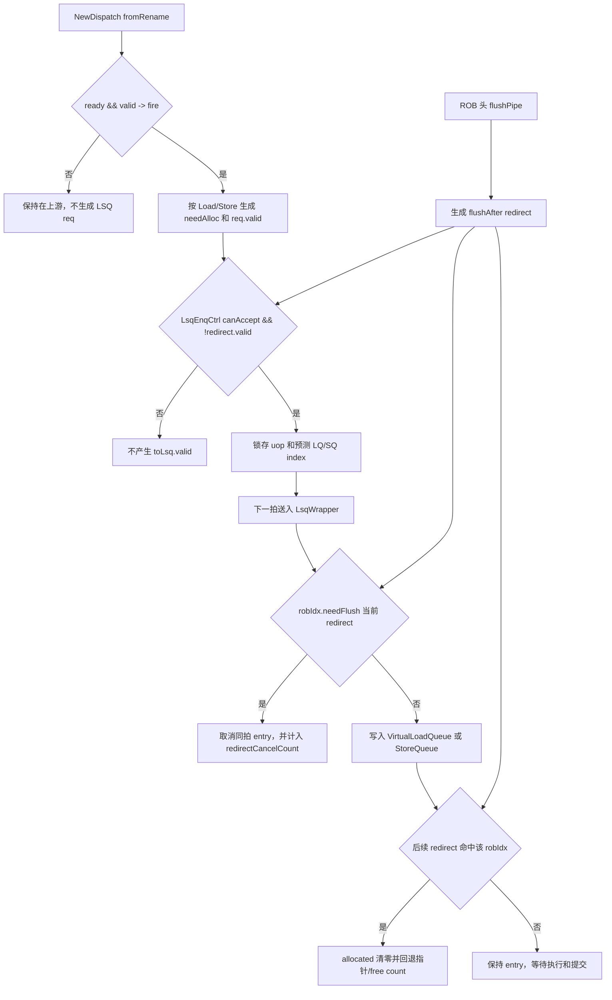

# V2 LSQ 入队与 Redirect 恢复 Flow

## 版本元数据

| 项目 | 内容 |
|---|---|
| RTL 版本 | V2 |
| 分支 | `mem_ut_uvm_v2` |
| 核验 commit | `f3bdd04b3763147e714a786d078e0cb90460a31d` |
| 设计基线 | `2acbf327cf7fb514593acc00d4c41117ec499e08`，见 V2 `branch_policy.md` |
| 权威源码 | `src/main/scala/xiangshan`；DUT 生成基线见 `mem_ut/ver/ut/memblock/rule/version/v2/memblock_rtl_profile.md` |
| 最后核验日期 | `2026-07-27` |

## Flow 范围

本文解释 Load/Store uop 从 `NewDispatch` 进入 `LsqEnqCtrl`，再到 MemBlock 内
`LsqWrapper`、`VirtualLoadQueue` 和 `StoreQueue` 的入队条件，以及 redirect 对尚未入队、
同拍入队和已分配 entry 的取消与指针恢复。

本文同时说明 `DynInst.flushPipe` 与 LSQ admission 的边界：该 payload 位不直接参与
LSQ 入队判断；它在 ROB 头产生 `flushAfter` redirect 后，才通过公共 redirect flow
间接阻止或取消更年轻的 LSQ 入队。`flushPipe` 的生产和 ROB 处理详见
[Memory flushPipe flow](memory_flush_pipe_flow.md)。

## 核心结论

一笔 Load/Store 真正写入 LQ/SQ，需要依次满足：

1. `NewDispatch` 对应 `fromRename(i).fire`，并根据指令类型生成非零 `needAlloc`。
2. `LsqEnqCtrl` 的 `do_enq = enq.valid && !redirect.valid && enq.canAccept`。
3. 下一拍到达实际 LQ/SQ 时，请求 `valid` 且该 uop 的 `robIdx.needFlush(redirect)` 为假。

`redirect.valid` 有三重作用：在 `LsqEnqCtrl` 阻止新请求越过寄存边界，在 LQ/SQ
取消同拍属于 flush 范围的请求，并将已经分配但未提交的更年轻 entry 失效后回退
队列指针和 free count。

需要区分两类“阻塞/取消”：

1. RTL 直接阻塞或取消的是当前可见的 redirect 窗口。`LsqEnqCtrl.do_enq` 使用
   `!io.redirect.valid`，因此 redirect 与 enqueue request 在 controller 同拍可见时，
   request 不会被寄存到下一拍 `toLsq.valid`。已经到达 LQ/SQ 的 request 则由
   `robIdx.needFlush(redirect)` 判断是否取消；已分配但未提交的 entry 也按同一 ROB
   年龄关系取消并回退指针。
2. RTL 没有一个“redirect 解除后再等待 N 拍才允许下一次 LSQ enqueue”的独立 guard。
   恢复窗口由 `t2_update/t3_update`、LQ/SQ `redirectCancelCount` 和 `canAccept` 前瞻信用共同
   处理。若验证框架要避免在 flush 刚解除后的若干拍重新构造 V2 LSQ request，这是测试框架
   对 DUT 时序窗口的保守建模，不是 Scala 中已有的单独硬件信号。

`LsqEnqCtrl` 的容量条件：

```scala
ldCanAccept = lqCounter >= lqAllocNumber + LSQLdEnqWidth
sqCanAccept = sqCounter >= sqAllocNumber + LSQStEnqWidth
```

其中 V2 的 `LSQLdEnqWidth=6`、`LSQStEnqWidth=4`。后面的 `+6/+4` 不是永久不可用的
静态保留空间，而是 registered `canAccept` 的一拍前瞻信用：本拍先扣除
`lqAllocNumber/sqAllocNumber` 后，下一拍仍至少保留一个最大 load/store allocation batch，
使已经提前寄存为 1 的 `canAccept` 不会允许下一拍把队列写穿。

`flushPipe` 不出现在上述任一直接 admission 表达式中。SFENCE/FENCE 等指令还具有
独立的 `blockBackward` 属性，它会阻止更年轻指令继续 Dispatch；这是与
`flushPipe` 同时配置的另一个控制属性，不能解释为 LSQ 检查了 `flushPipe`。

## 主流程图



## 主流程文字伪代码

```text
1. NewDispatch 只有在当前 rename uop fire 时才构造 LSQ enqueue：
   Load/VLoad -> needAlloc=1；Store/VStore -> needAlloc=2；其他类型为0。
   AMO、segment 和 fof fix-vl uop不走这里的普通 req.valid 路径。

2. fromRename.ready 同时要求：
   当前及更老指令允许dispatch、IQ不阻塞、ROB可接受、LSQ可接受。
   Load/Store还要通过按保守flow计算的LQ/SQ free-count检查。

3. LsqEnqCtrl 计算LQ/SQ index，但只在：
     enq.valid && !redirect.valid && enq.canAccept
   时锁存请求，并在下一拍把toLsq.valid送到MemBlock。

4. LsqWrapper按needAlloc拆分请求：
   needAlloc(0)送VirtualLoadQueue；needAlloc(1)送StoreQueue。

5. 实际队列写entry前再次计算：
     enqCancel = req.valid && req.robIdx.needFlush(current redirect)
   命中redirect范围的同拍请求不写allocated/uop状态。

6. 对已经分配的entry，redirect到来时按robIdx再次扫描：
   flushAfter只取消redirect点之后的年轻entry；
   flush还取消redirect指令自身；
   LQ/SQ清allocated并统计cancel count，随后回退入队指针；
   LsqEnqCtrl用返回的cancel count恢复其影子指针和free counter。

7. flushPipe payload本身不参与步骤1至5。
   当携带flushPipe的指令到ROB头并满足精确处理条件时，ROB生成flushAfter redirect；
   该redirect再按步骤3、5、6影响更年轻LSQ请求和entry。
```

## 关键阶段

### 1. NewDispatch admission

`fromRename(i).ready` 要求 `allowDispatch`、IQ资源、顺序约束、ROB资源和
`lsqCanAccept` 同时满足。对于 Load/Store，`allowDispatch` 还根据 `lqFreeCount` 或
`sqFreeCount` 与保守 flow 数量比较；前序 slot 不允许 dispatch 时，后续 slot 也被阻塞。

`fromRename(i).fire` 后才生成 LSQ 请求：

```scala
enqLsqIO.needAlloc(i) := 1.U // Load/VLoad
enqLsqIO.needAlloc(i) := 2.U // Store/VStore
enqLsqIO.req(i).valid := io.fromRename(i).fire &&
  !isAMOVec(i) && !isSegment(i) && !isfofFixVlUop(i)
```

因此普通 LSQ 入队首先受队列容量、ROB、IQ、同组顺序和特殊指令分类影响。

### 2. LsqEnqCtrl 接受与寄存边界

`LsqEnqCtrl` 维护独立的 `lqPtr/sqPtr` 和 free counter，并由保守容量判断产生
`io.enq.canAccept`。真正跨到 MemBlock 的条件是：

```scala
val do_enq = enq.valid && !io.redirect.valid && io.enq.canAccept
toLsq.valid := RegNext(do_enq)
```

所以 controller 所见 redirect 与正常 enqueue 同拍时，redirect 优先，请求不会产生
下一拍的 `toLsq.valid`。NewDispatch 特意把 `RegNext(io.redirect)` 接到该 controller，
用于对齐 Dispatch 和 LSQ enqueue pipeline。

#### 2.1 `6/4` 的参数来源

`LSQEnqWidth` 等于 `RenameWidth`，当前 V2 配置为 6。load/store 最大 allocation 宽度再由
对应 memory issue queue 的 enqueue datapath 数量限制：

```text
LSQLdEnqWidth = min(LSQEnqWidth, numLoadDp)
LSQStEnqWidth = min(LSQEnqWidth, numStoreDp)

numLoadDp  = 所有 LDU/HYU 地址 IQ 的 numEnq 之和
numStoreDp = 所有 STA/HYU 地址 IQ 的 numEnq 之和
```

当前 V2 默认 memory scheduler 有 3 个 LDU IQ，每个 `numEnq=2`，所以
`numLoadDp=6`；有 2 个 STA IQ，每个 `numEnq=2`，所以 `numStoreDp=4`。因此：

```text
LSQLdEnqWidth = min(6, 6) = 6
LSQStEnqWidth = min(6, 4) = 4
```

当前配置的具体汇总如下：

| IQ 类别 | IQ 数量 | 每个 IQ 的 `numEnq` | 对 `numLoadDp` 的贡献 | 对 `numStoreDp` 的贡献 |
|---|---:|---:|---:|---:|
| `LDU0/1/2` | 3 | 2 | 6 | 0 |
| `STA0/1` | 2 | 2 | 0 | 4 |
| `VLSU0/1` | 2 | 2 | 0 | 0 |
| `STD0/1` | 2 | 2 | 0 | 0 |

`numEnq` 是 Dispatch 到单个 Issue Queue 的单拍入队端口数，`IssueQueueIO.enq` 的
向量长度直接使用该参数。它不是该 IQ 向执行单元发射的 `numDeq`：当前每个 LDU、STA、
STD IQ 都只有一个真实执行单元，所以通常各自只有一个执行出口。由此，V2 可以在一拍内
从 6-wide Rename/Dispatch 窗口接收最多 6 个 scalar load 或 4 个 scalar store 进入对应
地址 IQ 和 LSQ 分配链路，但后续实际执行吞吐是 3 个 LDA、2 个 STA 和 2 个 STD issue
pipe，不能把 `6/4` 解释成实际执行端口数。

`STD0/1` 不单独增加 `numStoreDp`。一个 store 的 STA uop 在 Scheduler 中同时复制到配对的
STD IQ，并以 `staReady && stdReady` 作为共同接受条件；STA 和 STD 共享同一个 `sqIdx`，
只分配一个 SQ entry。`VLSU0/1` 由 `isVecMemIQ` 单独分类，也不进入这里的 scalar
`isLdAddrIQ/isStAddrIQ` 汇总。若配置中存在 HYU，其 `numEnq` 会同时计入 load 和 store
datapath 宽度。

因此 `6/4` 直接取决于 `RenameWidth`、LDU/STA/HYU IQ 的数量和每个 IQ 的 `numEnq`；
改变其中任一配置都可能改变结果。它们不由 LQ/SQ 总 entry 数、ROB commit width 或
DCache response 端口数直接决定。`lqAllocNumber/sqAllocNumber` 则由 `iqAccept` 所确定的
当前连续 dispatch 前缀和每项 `numLsElem` 求和得到。

#### 2.2 公共 slot、分类 allocation 宽度和物理队列容量

这里存在三类不同含义的“容量”，不能合并成一个数：

| 层次 | V2 当前值 | 含义 |
|---|---:|---|
| 公共 enqueue slot 数 | `LSQEnqWidth=6` | `LsqEnqIO.req/needAlloc/resp/iqAccept` 的向量长度，与 6-wide Rename/Dispatch slot 一一对应；同拍 load 与 store 的指令总数不能超过 6 |
| 分类单拍 scalar allocation 上限 | load 6、store 4 | 一个 scalar batch 最多消耗多少个 LQ/SQ entry，分别匹配 scalar load/store 地址 IQ 的 Dispatch 入队能力；vector uop 还会由 `numLsElem` 展开为多 entry flow |
| 物理队列容量 | LQ 72、SQ 56 | 两个独立队列的总 entry 数，分别由 `lqCounter/sqCounter` 和各自 enqueue/dequeue pointer 管理 |

因此没有一个把 72 个 LQ entry 与 56 个 SQ entry 相加或共享的“总 LSQ free count”。
一个混合 batch 首先受公共 6-slot 限制，再分别计算 `lqAllocNumber` 和 `sqAllocNumber`；
例如 scalar 模式下 2 load 加 4 store 可以占满 6 个 slot，而 4 load 加 4 store 因总数为 8，
即使两侧分类上限分别未超，也不能在同一拍进入。

公共 slot 保留原始 Rename 顺序，并让每个 slot 同时获得预测的 `lqIdx` 和 `sqIdx`。实际拆分时，
load 只分配 LQ entry，但会记录同位置的当前 `sqIdx`；store 只分配 SQ entry，但会记录当前
`lqIdx`。这些交叉 pointer snapshot 用于后续访存顺序关系。当前接口只有一个公共
`canAccept`，没有表达“LQ 接受部分 slot、SQ 接受另一部分 slot”的独立握手能力；若要支持
部分接受，还需增加独立 valid/ready、保留未接受 slot，并重新定义 pointer snapshot 与恢复。

`LsqEnqCtrl` 虽然分别计算 `ldCanAccept` 和 `sqCanAccept`，对 Dispatch 只输出一个：

```scala
io.enq.canAccept := RegNext(ldCanAccept && sqCanAccept && !t2_update)
```

实际 `LsqWrapper` 同样要求 `loadQueue.canAccept && storeQueue.canAccept`。这是保守的整包门控：
避免混合 batch 在寄存边界后出现 LQ 接受、SQ 拒绝或反向的部分执行，也简化同一连续
Dispatch 前缀的 pointer、counter、redirect recovery 和 `lqIdx/sqIdx` 对齐。代价是即使本拍
只有 load，只要 SQ 剩余空间低于其安全窗口，也会通过公共 `canAccept` 反压整个 batch；
纯 store 遇到 LQ 同理。

#### 2.3 为什么容量条件必须加一个最大 allocation batch

关键寄存边界是：

```scala
io.enq.canAccept := RegNext(ldCanAccept && sqCanAccept && !t2_update)
```

令 `F(t)` 为本拍开始时的 free count，`A(t)` 为本拍实际连续前缀的 allocation 数，`W` 为
对应的最大 allocation 宽度。忽略只会增加 free count 的 commit，正常路径按以下时序推进：

```text
本拍组合判断：
  canAccept(t+1) = F(t) >= A(t) + W

本拍时钟沿更新：
  若 canAccept(t)=1，则 F(t+1) = F(t) - A(t)
  若 canAccept(t)=0，则本拍不分配，F(t+1) = F(t)

因此 canAccept(t+1)=1 时：
  F(t+1) >= W
```

`canAccept(t+1)` 在本拍就已决定，无法再根据下一拍才出现的 `A(t+1)` 做组合撤销。只要
下一拍的普通 allocation 不超过结构上限 `W`，`F(t+1) >= W` 就保证该 registered grant
仍然安全。commit 会增加 free count，不破坏这个保证；redirect recovery 通过独立的
`t2_update` 条件关闭 grant。

如果删除 `+W`，例如 LQ 本拍已有 `canAccept(t)=1`，且 `F(t)=6`、`A(t)=6`，只检查
`F(t)>=A(t)` 会把
`canAccept(t+1)` 寄存为 1；时钟沿后 `F(t+1)=0`，下一拍却仍可能接收 load，造成 mirror
counter 下溢或实际 LQ 收到不可接受请求。加入 `+6` 后，本拍条件为 `6>=6+6`，下一拍 grant
会关闭。SQ 的 `+4` 同理。

实际 `VirtualLoadQueue` 和 `StoreQueue` 也分别以 `free>=LSQLdEnqWidth` 和
`free>=LSQStEnqWidth` 产生自身 `canAccept`。因此 `LsqEnqCtrl` 的前瞻条件保证寄存后的 packet
到达实际队列时，队列仍满足其整组 enqueue 接受条件。

### 3. LsqWrapper 拆分请求

`LsqWrapper` 只有在 LQ 和 SQ 都可接受时才对上游报告 `canAccept`，并按
`needAlloc` 位拆分：

```scala
load.req.valid  := needAlloc(0) && req.valid
store.req.valid := needAlloc(1) && req.valid
```

`needAlloc` 决定写 LQ、SQ 或都不写；`DynInst.flushPipe` 不参与拆分和 ready/valid 判断。

### 4. 同拍 redirect 取消

实际 LQ/SQ 都使用 `robIdx.needFlush(redirect)` 过滤入队：

```text
flushAfter(level=0)：取消所有比redirect.robIdx年轻的uop，不取消该uop自身。
flush(level=1)：除年轻uop外，还取消robIdx等于redirect点的uop自身。
```

LQ/SQ 只在 `req.valid && !enqCancel` 时设置 entry 的 `allocated`。由于请求、redirect
存在寄存对齐，某些已进入指针计算的同拍请求会先计数，随后通过 `lastEnqCancel`
并入 cancel count 再回退；不能只观察某一拍 pointer 增量判断最终成功入队。

### 4.1 redirect/flush 对 launch 前后 request 的覆盖边界

按 Scala 源码，LSQ enqueue 的 request 进入硬件有三个重要边界：

```text
Dispatch fire：
  NewDispatch 已经产生 enqLsqIO.req.valid 和 needAlloc。

LsqEnqCtrl 寄存边界：
  do_enq = enq.valid && !redirect.valid && enq.canAccept。
  do_enq 为 1 时，下一拍 toLsq.valid 置位。

LQ/SQ 实际写 entry：
  LsqWrapper 拆分到 LoadQueue/StoreQueue；
  LQ/SQ 用 req.robIdx.needFlush(redirect) 取消同拍命中 redirect 范围的 request。
```

因此：

- redirect 在 `LsqEnqCtrl.do_enq` 计算同拍有效时，会阻止该 request launch 到下一拍
  `toLsq.valid`。
- redirect 在 request 已经到达 LQ/SQ 写 entry 阶段时，会按 ROB 年龄关系取消命中的
  request，命中项不置 `allocated`。
- redirect 在 entry 已经分配后到来时，会清除未提交且需要 flush 的 entry，并通过
  cancel count 回退 LQ/SQ 以及 `LsqEnqCtrl` 的影子指针/free count。
- Scala 源码没有基于“flush 已经解除”的额外延迟窗口；`canAccept` 重新为 1 后，硬件按
  正常 admission 恢复。测试框架若增加 release 后固定拍数 retry guard，是为了覆盖验证环境中
  request 构造、driver sample 和软件 LSQ 镜像更新之间的保守同步窗口。

### 5. 已分配 entry 恢复

Redirect 到来后：

- `VirtualLoadQueue` 对所有 `allocated` entry 检查 `robIdx.needFlush`，命中则清
  `allocated`；把已有 entry 和同拍 enqueue 的取消数量合并为 `redirectCancelCount`，
  随后回退 `enqPtrExt`。
- `StoreQueue` 只取消 `allocated && !committed` 的命中 entry，清 `allocated/completed`，
  两拍后用 cancel count 回退 `enqPtrExt`。
- `LsqEnqCtrl` 等 Dispatch queue 清空并收到 LQ/SQ cancel count 后，回退影子
  `lqPtr/sqPtr`，增加 free counter；恢复窗口内通过 `t2_update/t3_update` 阻止新入队。

### 5.1 ROB exception 的 `flush` anchor 与 fault store

ROB head 的普通 exception 不等价于 `flushAfter`。`Rob.scala` 对 `deqHasException`
生成 `flushOut.bits.level = RedirectLevel.flush`，该 level 的 `flushItself=1`；因此
redirect 的 `robIdx` 本身和所有更年轻 uop 都满足 `robIdx.needFlush(redirect)`。
完整 Core 中该 redirect 经 CtrlBlock/Backend/`XSCore` 回灌到 `MemBlock.io.redirect`，再
作为 `LSQWrapper.brqRedirect` 进入 StoreQueue。

对已分配的 fault store，StoreQueue 的结果依赖 redirect 到达时 entry 是否已 `committed`：

```text
未 committed：
  needCancel = allocated && !committed && robIdx.needFlush(redirect)
  -> entry 被取消
  -> redirect T0 后在 T2 输出 sqCancelCnt

已 committed 且 STA 已置 hasException：
  -> 不走 redirect cancel
  -> 进入 exception dataBuffer drain
  -> SBuffer handshake 不写真实数据，但使 completed=1
  -> 由 sqDeq 输出物理释放数量
```

所以 `sqCancelCnt` 与 `sqDeq` 是两种不同的释放报告，不能要求 fault store 必有其中某一个，
更不能用 `scommit` 代替任一输出。`scommit` 只统计 normal ROB scalar-store commit；fault
head 的 normal commit 被阻止，仍可能通过上述任一路径释放 SQ entry。

在不接入该 ROB redirect 的 standalone 环境中，`sqCancelCnt` 不是可用的本地恢复手段。此时
测试框架只能保持 fault head 的 `pendingPtr`，等待 DUT 自己输出 `sqDeq`；该等待只适用于
已进入 StoreQueue exception completion 的 cacheable/NC/scalar-MMIO fault，或 request 已发出
后的 MMIO response fault。scalar MMIO fault 虽不会发 MMIO request，但 StoreUnit 会清除写入
SQ 的 `mmio` 标志，使非 CBO entry 按通用 exception drain 释放。early CBO fault 不同：其
`wline` entry 不会由通用 SBuffer handshake 置 `completed`，CMO request 又受 `!hasException`
门控；仅有 `pendingPtr` 时没有 `sqDeq`。不得软件伪造 release，必须在 bounded watchdog 后
报 `uvm_fatal`。这是一条测试框架可驱动性边界，不要求也不实现 RM/checker。

### 5.2 vector LS 与 AMO/MOU 的 cancel 边界

普通 vector load/store 会分别分配 LQ/SQ，但它们的 fault 并非只能等待 ROB redirect：

- vector load merge buffer 收齐 flow 后，同时发异常 writeback 和 FLUSH feedback；
  `VirtualLoadQueue` 对匹配 feedback 置 `committed`，可自然产生 `lqDeq`。
- vector store 的 FLUSH feedback 会置 `vecMbCommit`。若 ROB-head `pendingPtr` 已使该 entry
  `committed`，它按 `hasException` drain 产生 `sqDeq`；若 redirect 先命中未 committed entry，
  则产生 `sqCancelCnt`。
- segment vector LS 和 `FuType.mou` 在 `NewDispatch` 中不进入普通 LSQ request，分别由
  `VSegmentUnit` 与 `AtomicsUnit` 的 finish/writeback 路径释放本地状态，不应等待
  `lqDeq/sqDeq`。

所有真正送到 ROB 的架构 fault 仍会在 ROB head 产生 `RedirectLevel.flush`，用于移除 faulting
ROB entry 和回滚年轻指令。这里说明的是本地资源释放不总以该 redirect 为唯一条件。完整
源码顺序和 FOF 例外见
[ROB 压缩与后端指令信息流](rob_compress_and_backend_instruction_flow.md#82-vector-ls-与-amomou-fault-是否依赖-rob-redirect-释放)。

## `flushPipe` 对入队的直接与间接影响

| 场景 | 是否直接检查 `flushPipe` | 对入队的实际影响 |
|---|---:|---|
| 普通 Load/Store enqueue | 否 | 只检查 fire、容量、`needAlloc`、`canAccept` 和 redirect |
| 假设 enqueue payload 中 `flushPipe=1` | 否 | 不会因此单独阻止 LQ/SQ 写入；普通 Load/Store 后续写回还会把该字段清零 |
| SFENCE/FENCE dispatch | 不进入普通 LSQ allocation | `FuType.fence` 使 `needAlloc=0`；同时 `blockBackward=1` 阻止更年轻 dispatch |
| CBO/CMO | 入 SQ 时不靠该位门控 | StoreQueue 完成 CMO 时动态置写回 `flushPipe` |
| flushPipe 指令到 ROB 头 | 间接 | ROB 产生 `flushAfter` redirect，保留当前指令并取消更年轻 LSQ 请求/entry |

## 状态、队列和优先级

| 状态/字段/队列 | 生产者 | 置位/入队条件 | 清除/出队条件 | 消费者 | 优先级 |
|---|---|---|---|---|---|
| `fromRename.fire` | NewDispatch handshake | valid且Dispatch/ROB/IQ/LSQ资源满足 | 单拍握手 | ROB、IQ、LsqEnqCtrl | 受所有ready条件共同限制 |
| `LsqEnqCtrl.do_enq` | LsqEnqCtrl | req valid、canAccept且无redirect | 单拍后寄存成`toLsq.valid` | MemBlock LSQ | redirect优先于enqueue |
| LQ `allocated` | VirtualLoadQueue | req valid且`!enqCancel`，命中index范围 | commit/dequeue或redirect cancel | LoadQueue执行路径 | redirect cancel覆盖同拍enqueue |
| SQ `allocated` | StoreQueue | req valid且`!enqCancel`，命中index范围 | dequeue或未提交entry被redirect cancel | StoreQueue执行路径 | redirect cancel覆盖同拍enqueue |
| `redirectCancelCount` | LQ/SQ | 已分配命中项加同拍取消项 | 被指针恢复逻辑消费 | LsqEnqCtrl和queue pointer | 恢复阶段阻止新入队 |
| `DynInst.flushPipe` | Decode/Fence或SQ CMO写回 | 特定指令属性/CMO完成 | 随uop生命周期 | ExceptionGen/ROB | 不参与LSQ admission |

## 异常、回滚与 Flush

Redirect 的年龄判断由 `RobPtr.needFlush` 统一定义：

```scala
redirect.valid && (
  redirect.flushItself && robIdx == redirect.robIdx ||
  robIdx.isAfter(redirect.robIdx)
)
```

因此不能把 `redirect.valid` 简化为“所有 LSQ entry 都清除”。`flushAfter` 保留 redirect
点本身，仅清年轻项；exception/replay 常用的 `flush` 还会清 redirect 点自身。已提交
Store entry 不在普通 redirect cancel 范围内，以保持架构可见提交语义。

## 关联 Agent 和 Flow

- [Memory flushPipe flow](memory_flush_pipe_flow.md)：说明哪些指令产生 `flushPipe`，以及 ROB 如何生成 `flushAfter`。
- [Memory trigger flow](memory_trigger_flow.md)：trigger 异常最终也通过 ROB 精确 redirect 影响年轻访存。
- [V2 RTL flow 索引](../index.md)。

## V2/V3 差异

本文只核验 V2。V3 顶层是否暴露完整 `canAccept/resp`、enqueue slot 数量和内部
redirect 对齐必须在 V3 分支/profile 下独立核验；本文不把 V2 内部时序直接外推到 V3。

## 源码证据

- `src/main/scala/xiangshan/backend/dispatch/NewDispatch.scala:444-451`：Dispatch ready/valid 的 LSQ、ROB、IQ联合条件。
- `src/main/scala/xiangshan/Parameters.scala:149-150,778-780`：V2 默认 `RenameWidth=6`，以及 `LSQEnqWidth/LSQLdEnqWidth/LSQStEnqWidth` 派生公式。
- `src/main/scala/xiangshan/Parameters.scala:167,174`、`src/main/scala/xiangshan/mem/lsqueue/LSQWrapper.scala:58-63,335-429`：公共 6-slot enqueue 向量、独立的 72-entry LQ/56-entry SQ counter 和合并 `canAccept`。
- `src/main/scala/xiangshan/Parameters.scala:466-493`、`src/main/scala/xiangshan/backend/BackendParams.scala:132-134`：3组 LDU IQ 和2组 STA IQ 的 `numEnq` 汇总为 `numLoadDp=6/numStoreDp=4`。
- `src/main/scala/xiangshan/backend/issue/IssueBlockParams.scala:49-65,143,177-199`、`src/main/scala/xiangshan/backend/issue/IssueQueue.scala:47-55`：scalar/vector 地址 IQ 分类，以及 `numEnq` 入队宽度和 `numDeq` 执行出口宽度的区别。
- `src/main/scala/xiangshan/backend/issue/Scheduler.scala:365-397,455-509`：STA/STD 入队端口一一配对、共同 ready，并复用同一 uop 和 `sqIdx`。
- `src/main/scala/xiangshan/mem/lsqueue/LSQWrapper.scala:154-182`：LQ/SQ ready 合并成整包 `canAccept`，并在拆分时交叉回填 load 的 `sqIdx` 和 store 的 `lqIdx`。
- `src/main/scala/xiangshan/backend/dispatch/NewDispatch.scala:590-685`：保守 flow 和 LQ/SQ free-count admission。
- `src/main/scala/xiangshan/backend/dispatch/NewDispatch.scala:688-707`：`needAlloc` 和普通 LSQ req valid 生成。
- `src/main/scala/xiangshan/mem/lsqueue/LSQWrapper.scala:353-429`：`LsqEnqCtrl` 的 free counter、当前 allocation、`+6/+4` 前瞻条件、registered `canAccept` 和寄存输出。
- `src/main/scala/xiangshan/mem/lsqueue/LSQWrapper.scala:154-182`：LQ/SQ联合canAccept及`needAlloc`拆分。
- `src/main/scala/xiangshan/mem/lsqueue/VirtualLoadQueue.scala:92-134,163-203,232-238`：Load以 `free>=LSQLdEnqWidth` 产生 `canAccept`，并处理同拍取消、entry写入和指针恢复。
- `src/main/scala/xiangshan/mem/lsqueue/StoreQueue.scala:290-418,1476-1524`：Store以 `free>=LSQStEnqWidth` 产生 `canAccept`，并处理同拍取消、entry写入和两拍恢复。
- `src/main/scala/xiangshan/backend/rob/RobBundles.scala:193-198`：redirect年龄范围和`flushItself`语义。
- `src/main/scala/xiangshan/package.scala:179-185`、`src/main/scala/xiangshan/backend/rob/Rob.scala:573-650`：ROB exception 产生 `RedirectLevel.flush`，其 redirect 包含 anchor 自身。
- `src/main/scala/xiangshan/backend/CtrlBlock.scala:749-757`、`src/main/scala/xiangshan/XSCore.scala:235`、`src/main/scala/xiangshan/mem/MemBlock.scala:1419`：ROB redirect 回灌 StoreQueue 的连接链。
- `src/main/scala/xiangshan/mem/pipeline/StoreUnit.scala:122,256,461-545`：CBO `wline`、scalar MMIO exception 时 SQ `mmio` 清除、异常回填。
- `src/main/scala/xiangshan/mem/lsqueue/StoreQueue.scala:830-985,1038-1071,1126-1160,1204-1343,1476-1524`：fault store 的 `committed`/exception drain、NC/MMIO response 条件、`sqDeq` 和 `sqCancelCnt` 两条释放路径。
- `src/main/scala/xiangshan/mem/vector/VMergeBuffer.scala:112-129,351-417`、`src/main/scala/xiangshan/mem/lsqueue/VirtualLoadQueue.scala:217-230`、`src/main/scala/xiangshan/mem/lsqueue/StoreQueue.scala:1454-1488`：vector LS 的异常 feedback、自然 deq 和 redirect cancel 边界。
- `src/main/scala/xiangshan/backend/dispatch/NewDispatch.scala:688-707`、`src/main/scala/xiangshan/mem/vector/VSegmentUnit.scala:870-961`、`src/main/scala/xiangshan/mem/pipeline/AtomicsUnit.scala:401-431`：segment 与 MOU 不分配普通 LSQ，并由各自 finish/writeback 路径释放本地状态。
- `src/main/scala/xiangshan/backend/rob/Rob.scala:578-630`：`flushPipe`在ROB头生成`flushAfter`。
- `src/main/scala/xiangshan/backend/decode/DecodeUnit.scala:228-231,454-460,490-491`：Fence类指令的`blockBackward/flushPipe`属性。

## 知识修订记录

| 日期 | commit | 旧结论 | 新结论 | 修订原因 | 影响范围 |
|---|---|---|---|---|---|
| 2026-07-14 | `6e721ccb42bec882b3254062bff003294a507854` | 首次建立，无同版本长期 LSQ enqueue/redirect flow | 建立三层入队条件、redirect取消/恢复和flushPipe间接影响关系 | 用户要求结合Scala分析redirect/flushPipe何时影响入队 | V2 Dispatch/LsqEnqCtrl/LQ/SQ/ROB |
| 2026-07-15 | `6e721ccb42bec882b3254062bff003294a507854` | 只记录 `LsqEnqCtrl` 使用保守容量判断，未解释 `+6/+4` 与寄存边界 | 明确 6/4 的结构来源，并证明它是一拍 registered `canAccept` 的最大 batch 前瞻信用，不是永久保留空间 | 用户要求结合 Scala 解释 `ldCanAccept/sqCanAccept` 为什么增加 6/4 | V2 LsqEnqCtrl、NewDispatch、VirtualLoadQueue、StoreQueue |
| 2026-07-15 | `6e721ccb42bec882b3254062bff003294a507854` | 已给出 `3 x 2=6`、`2 x 2=4`，但未展开各 IQ 分类及 enqueue/issue 宽度边界 | 补充 LDU/STA/VLSU/STD 汇总表，明确 `numEnq` 是 Dispatch 入队宽度，STD 复用 STA 分配，实际 issue pipe 为 3/2/2 | 用户要求分析 store 为 4、load 为 6 的源码原因和关联结构 | V2 memory scheduler、IssueQueue、LSQ allocation 宽度 |
| 2026-07-15 | `6e721ccb42bec882b3254062bff003294a507854` | “总容量”和 load/store 分容量容易被理解为共享 entry 池 | 区分公共 6-slot 请求宽度、分类 6/4 allocation 上限和独立 72/56 物理队列，并说明合并 `canAccept` 的整包门控原因 | 用户要求解释进入 LSQ 的总量与 load/store 分量为何并存 | V2 LsqEnqIO、LsqEnqCtrl、LsqWrapper、LQ/SQ |
| 2026-07-15 | `6e721ccb42bec882b3254062bff003294a507854` | 已说明 redirect 阻止/取消入队，但未明确 flush release 后是否存在额外硬件 guard | 补充 `do_enq`、LQ/SQ `enqCancel`、已分配 entry cancel 三个覆盖点，并明确 Scala 中没有 flush 解除后固定拍数 retry guard | 用户询问 redirect/flush 是否能阻塞取消入队，以及测试框架是否可复用 flush 标志阻塞 LSQ 入队 | V2 LsqEnqCtrl、VirtualLoadQueue、StoreQueue、mem_ut LSQ retry guard 建模边界 |
| 2026-07-27 | `f3bdd04b3763147e714a786d078e0cb90460a31d` | 只说明 redirect 取消未 committed entry，未说明 ROB exception 的 flush anchor 与 fault store 的另一条 SQ 清理路径 | 补充 exception 使用 `flush` 并覆盖 anchor 自身；未 committed fault store 走 `sqCancelCnt`，已 committed 且 `hasException` 的 fault store 可走无真实 SBuffer 写入的 `sqDeq` | 用户要求结合 V2 Scala 核对 fault、redirect、`scommit` 与 SQ 出队关系 | V2 ROB/CtrlBlock/Backend/MemBlock/StoreQueue/SBuffer |
| 2026-07-27 | `f3bdd04b3763147e714a786d078e0cb90460a31d` | 只描述完整 Core redirect 下的 fault 释放，未说明 standalone 不驱动 redirect 时哪些 fault 可以等待 raw deq | 明确 NC/cacheable/scalar-MMIO exception completion 与 MMIO response fault 可等待真实 `sqDeq`；只有 early CBO fault 无 natural deq，需 watchdog fail-fast 而非软件 release | 用户要求限定本轮只改测试框架、不新增 RM，并确认 raw deq 等待边界 | V2 StoreUnit/StoreQueue/uncache/MMIO/CBO/standalone mem_ut |
| 2026-07-27 | `f3bdd04b3763147e714a786d078e0cb90460a31d` | 已分配 entry 的 fault cancel 仅按 scalar store 描述，容易误读为 vector LS 与 MOU 都必须靠 ROB cancel 释放 | 补充 vector load 自然 `lqDeq`、vector store deq/cancel 双路径，以及 segment/MOU 不进入普通 LSQ 的边界 | 用户追问 vector LS、AMO/MOU fault 是否均依赖 ROB exception redirect/cancel | V2 vector merge buffer/VLQ/SQ/VSegmentUnit/AtomicsUnit/ROB redirect |

## 待确认项

- 无。
