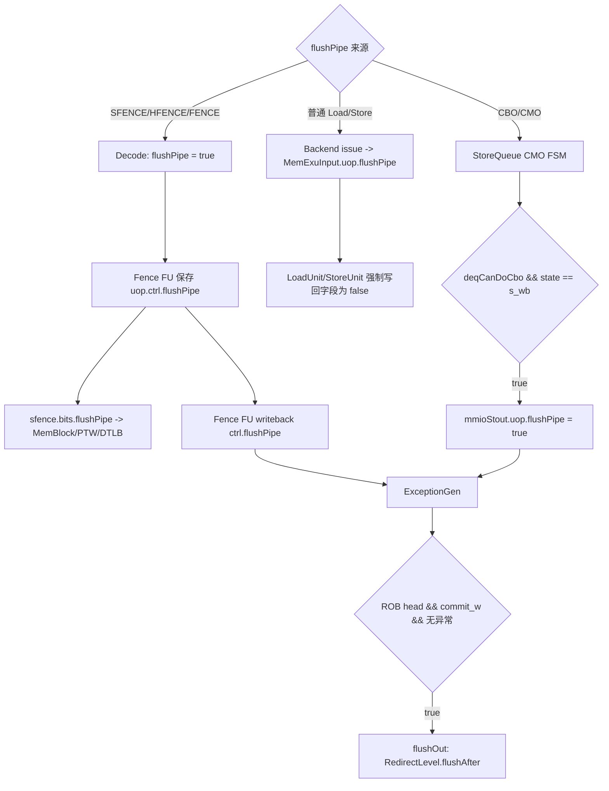

# V2 Memory `flushPipe` Flow

## 版本元数据

| 项目 | 内容 |
|---|---|
| RTL 版本 | V2 |
| 分支 | `mem_ut_uvm_v2` |
| 核验 commit | `5b35ddd8d774b5f11d61333dfbe7638a3f362fad` |
| 设计基线 | `2acbf327cf7fb514593acc00d4c41117ec499e08`，见 V2 `branch_policy.md` |
| 权威源码 | `src/main/scala/xiangshan`；DUT 生成基线见 `mem_ut/ver/ut/memblock/rule/version/v2/memblock_rtl_profile.md` |
| 最后核验日期 | `2026-07-11` |

## Flow 范围

本文解释运行时 `DynInst.flushPipe` 在后端、Fence FU、MemBlock/LSQ 写回和 ROB 之间的传播与功能，重点区分：

- SFENCE/HFENCE 等指令在 Decode 阶段携带的静态指令属性。
- 普通 Load/Store 在 MemBlock 流水中的清零行为。
- CBO/CMO 在 StoreQueue 完成时动态产生的 `flushPipe`。
- LoadUnit 局部 `s3_flushPipe` rollback 条件与写回字段的区别。

本文不展开 TLB entry 的具体失效匹配，也不展开 mem_ut 软件模型中的 sfence FIFO。后者见 [mem_ut sfence/hfence flow](../../../../mem_ut_flow_doc/sfence_flow.md)。

## 核心结论

`FuConfig.flushPipe = true` 只是 Scala elaboration 期的 capability：决定执行单元的 `ExuInput/ExuOutput` 是否含可选 `flushPipe` 字段。运行时值是 `DynInst.flushPipe: Bool`。

运行时有两类主要生产方式：

1. SFENCE/HFENCE/FENCE 等由 Decode 表直接把指令属性置为 `true`，Fence FU 同时将同一个值送入 `sfence.bits.flushPipe` 和执行写回 `ctrl.flushPipe`。
2. CBO/CMO 进入 MemBlock 时并不依赖普通 Store 流水保留该属性，而是 StoreQueue 在 CMO 完成写回时根据 `deqCanDoCbo` 动态设置 `mmioStout.bits.uop.flushPipe`。

两条路径最终都进入 ExceptionGen/ROB；无异常时在当前指令到 ROB 头且可提交后产生 `RedirectLevel.flushAfter`。当前指令可以提交，年轻指令被清除。

## 主流程图



## 主流程文字伪代码

```text
1. 对 SFENCE/HFENCE/FENCE：
   Decode 表把 decoded instruction 的 flushPipe 属性置为 true；
   该属性经过 Rename/Issue 到 Fence FU；
   Fence FU 把同一 uop.ctrl.flushPipe 分成两路：
     一路进入 sfence payload，告诉 TLB 这是需要 flush pipe 的 SFENCE，而不是不清流水的 Svinval；
     另一路进入 Fence FU 写回，最终交给 ROB 做精确 flushAfter。

2. 对普通 Load/Store：
   Backend 把 issue bundle 的 flushPipe 复制进 MemExuInput.uop；
   LoadUnit/StoreUnit 在正常写回路径明确把 uop.flushPipe 置 false；
   因此普通访存不会用该字段请求 ROB 清流水。

3. 对 CBO/CMO：
   StoreQueue 等待 CBO 位于可处理的 SQ 队头，地址有效且无异常；
   CMO 状态机完成请求/响应并进入 s_wb；
   当 deqCanDoCbo 为 true 时，把 mmioStout.uop.flushPipe 动态置 true；
   写回经 Backend 进入 ExceptionGen/ROB。

4. ROB 在该指令到达队头、commit_w 有效、ExceptionGen 命中且没有异常时识别 deqHasFlushPipe；
   产生 flushAfter redirect：当前指令可提交，清除年轻指令并从下一条指令重新取指。
```

## 1. 字段和 capability 的区别

`DynInst.flushPipe` 定义为运行时 Bool，源码注释说明它“像异常一样清流水，但可以提交”。LDU/STA 配置中的 `flushPipe = true` 只让对应执行单元生成该可选接口，不能据此判断每条 Load/Store 的运行时值为 1。

## 2. SFENCE 的双路关联

Decode 对 `SFENCE_VMA`、`HFENCE_GVMA`、`HFENCE_VVMA` 设置 `flushPipe = T`。Fence FU 锁存输入 uop 后执行：

```scala
sfence.bits.flushPipe := uop.ctrl.flushPipe.get
io.out.bits.ctrl.flushPipe.get := uop.ctrl.flushPipe.get
```

所以 `sfence.bits.flushPipe` 和最终写给 ROB 的 `flushPipe` 不是互相生成，而是同一个 Decode 属性的两个 fanout：

- MemBlock 将 `sfence` 延迟两拍后送给 PTW 和各 DTLB。
- TLB 用 `sfence.valid && sfence.bits.flushPipe` 区分需要丢弃流水中请求的 SFENCE 与不清流水的 Svinval。
- Fence FU 写回值最终由 ROB 在精确提交点清后端/前端年轻流水。

这两个动作协同完成 SFENCE：TLB 路径负责地址翻译状态失效，ROB 路径负责让年轻指令在新翻译状态下重新执行。`flushPipe` 本身不替代 TLB entry invalidation。

## 3. 普通 Load/Store

Backend 发射到 MemBlock 时复制 issue 字段：

```scala
sink.bits.uop.flushPipe := source.bits.flushPipe.getOrElse(false.B)
```

但普通访存 Decode 属性为 false，且 LoadUnit S2/S3、StoreUnit S1 都明确覆盖写回 `uop.flushPipe := false.B`。因此普通 Load/Store 不会通过该字段触发 ROB flush。

LoadUnit 中：

```scala
val s3_flushPipe = s3_ldld_rep_inst
io.rollback.valid := ... || s3_flushPipe || ...
s3_out.bits.uop.flushPipe := false.B
```

这里的 `s3_flushPipe` 是 load-load violation 的局部 rollback 条件，不是 `DynInst.uop.flushPipe`，不会通过写回等待 ROB 头处理。

## 4. CBO/CMO 动态置位

StoreQueue 定义：

```scala
val deqCanDoCbo = GatedRegNext(
  LSUOpType.isCbo(uop(deqPtr).fuOpType) &&
  allocated(deqPtr) && addrvalid(deqPtr) && !hasException(deqPtr)
) && memBackTypeMM(deqPtr)
```

在 scalar CMO 状态机进入 `s_wb` 时产生 `mmioStout.valid`，并执行：

```scala
io.mmioStout.bits.uop.flushPipe := deqCanDoCbo
```

因此实际有效的 CBO flush writeback 需要：

- 当前 SQ entry 是 CBO。
- entry 已分配且地址有效。
- entry 无异常。
- `memBackTypeMM` 为真。
- CMO FSM 完成并进入 scalar `s_wb` 写回阶段。

其目的由源码明确标注为保持 CMO 顺序；CBO 完成后清除可能基于旧 Cache/一致性状态执行的年轻指令。

## 5. ROB 精确处理

ExceptionGen 收集写回的 `flushPipe`，并保证异常存在时不再同时按普通 flushPipe 处理。ROB 只有在以下条件同时成立时产生 `deqHasFlushPipe`：

- ROB 队头 entry 的 `needFlush`、`commit_v`、`commit_w` 有效。
- ExceptionGen 当前记录与 ROB 队头 index 相同。
- `exceptionDataRead.bits.flushPipe` 为真。
- 当前不是 exception。
- `commit_w_delay` 有效。

最终 `flushOut.level` 对纯 `flushPipe` 选择 `RedirectLevel.flushAfter`；exception、interrupt 或 replay 选择 `flush`。

## 状态、字段和优先级

| 状态/字段 | 生产者 | 置位条件 | 清除/覆盖条件 | 消费者 | 优先级 |
|---|---|---|---|---|---|
| Decode `flushPipe` | Decode 表 | SFENCE/HFENCE/FENCE 等指令项为 `T` | 其他指令默认 `F` | Issue/Fence FU | 指令静态属性 |
| `sfence.bits.flushPipe` | Fence FU | 复制锁存的 `uop.ctrl.flushPipe` | 随下一次 Fence uop 更新 | PTW/DTLB | 与 `sfence.valid` 同时有效 |
| Load/Store writeback `uop.flushPipe` | LoadUnit/StoreUnit | 普通路径不置位 | 显式写 `false.B` | Backend writeback | 覆盖输入携带值 |
| CBO writeback `uop.flushPipe` | StoreQueue | `deqCanDoCbo` 且 `s_wb` 有效写回 | 非 CBO 为 false | ExceptionGen/ROB | CMO 专用路径 |
| LoadUnit `s3_flushPipe` | LoadUnit | load-load violation replay | 当拍组合/寄存条件消失 | `io.rollback` | 与写回字段无关 |

## 关联文档

- [memory trigger flow](memory_trigger_flow.md)：同一 MemExuOutput 写回中的 trigger 异常路径。
- [mem_ut sfence/hfence flow](../../../../mem_ut_flow_doc/sfence_flow.md)：验证环境采集 sfence 顶层事件后的软件模型 flow，不是本文的 RTL 内部 flow。
- [V2 RTL flow 索引](../index.md)。

## V2/V3 差异

本文只核验 V2。虽然已有历史接口分析指出 V3 也存在 `SfenceBundle.bits.flushPipe`，但本轮未按 V3 branch/profile 追踪完整赋值和消费者，因此不把 V2 的内部行为直接认定为 V3 事实。

## 源码证据

- `src/main/scala/xiangshan/backend/Bundles.scala:178-207`：`DynInst.flushPipe` 类型和语义。
- `src/main/scala/xiangshan/backend/decode/DecodeUnit.scala:228-231`：SFENCE/FENCE Decode 置位。
- `src/main/scala/xiangshan/backend/decode/DecodeUnit.scala:454-460`：Svinval 边界指令的 flushPipe 区别。
- `src/main/scala/xiangshan/backend/fu/Fence.scala:61-91`：同一 uop 属性 fanout 到 sfence payload 和写回。
- `src/main/scala/xiangshan/mem/MemBlock.scala:665-708`：sfence 延迟并送入 PTW/DTLB。
- `src/main/scala/xiangshan/cache/mmu/TLB.scala:60-82`：SFENCE 与 Svinval 的 TLB pipe 行为区别。
- `src/main/scala/xiangshan/backend/Backend.scala:671-703`：MemBlock 写回字段送回后端。
- `src/main/scala/xiangshan/mem/pipeline/LoadUnit.scala:1408-1415,1606-1676`：普通 Load 清零及局部 rollback 信号。
- `src/main/scala/xiangshan/mem/pipeline/StoreUnit.scala:378-401`：普通 Store 清零。
- `src/main/scala/xiangshan/mem/lsqueue/StoreQueue.scala:831-850,984-986,1054-1059`：CBO FSM 与动态置位。
- `src/main/scala/xiangshan/backend/rob/Rob.scala:578-630`：ROB 精确 flushAfter 条件。

## 知识修订记录

| 日期 | commit | 旧结论 | 新结论 | 修订原因 | 影响范围 |
|---|---|---|---|---|---|
| 2026-07-11 | `5b35ddd8d774b5f11d61333dfbe7638a3f362fad` | 首次建立，无同版本长期 flow 旧结论 | 建立 SFENCE 静态属性、CBO 动态置位、普通访存清零和 ROB 汇合关系 | 用户要求将本轮源码分析沉淀为 V2 知识 | V2 Memory/Fence/LSQ/ROB |

## 待确认项

- 本轮未核验 V3 对应实现，不在本文推断 V3 行为。
