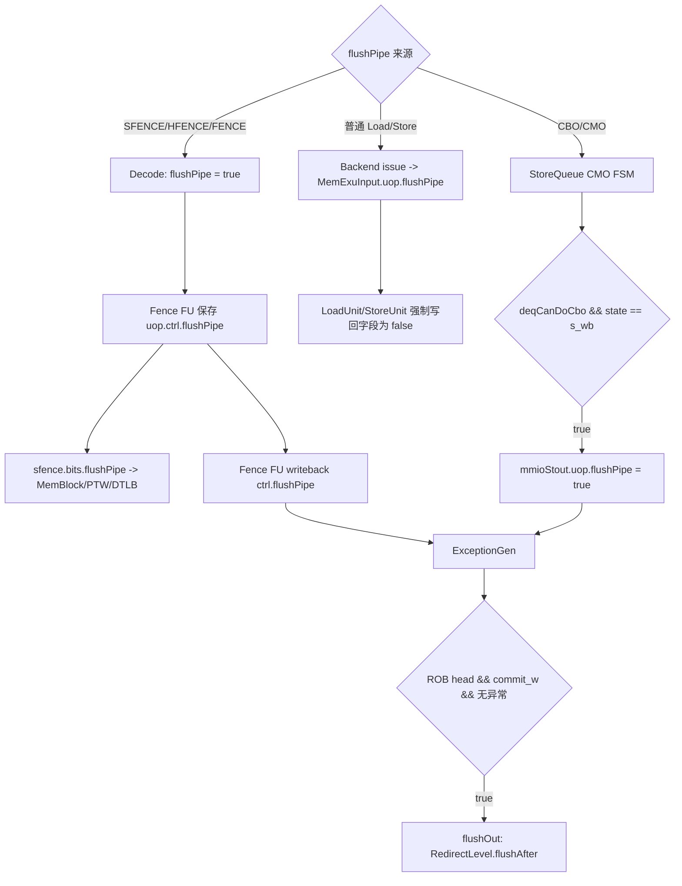

# V2 Memory `flushPipe` Flow

## 版本元数据

| 项目 | 内容 |
|---|---|
| RTL 版本 | V2 |
| 分支 | `mem_ut_uvm_v2` |
| 核验 commit | `bd813bc3ed5b39581be966c6518788852890ff6f` |
| 设计基线 | `2acbf327cf7fb514593acc00d4c41117ec499e08`，见 V2 `branch_policy.md` |
| 权威源码 | `src/main/scala/xiangshan`；DUT 生成基线见 `mem_ut/ver/ut/memblock/rule/version/v2/memblock_rtl_profile.md` |
| 最后核验日期 | `2026-07-17` |

## Flow 范围

本文解释运行时 `DynInst.flushPipe` 在后端、Fence FU、MemBlock/LSQ 写回和 ROB 之间的传播与功能，重点区分：

- SFENCE/HFENCE 等指令在 Decode 阶段携带的静态指令属性。
- 普通 Load/Store 在 MemBlock 流水中的清零行为。
- CBO/CMO 在 StoreQueue 完成时动态产生的 `flushPipe`。
- LoadUnit/HybridUnit 局部 `s3_flushPipe` rollback 条件与写回字段的区别。

本文不展开 TLB entry 的具体失效匹配，也不展开 mem_ut 软件模型中的 sfence FIFO。后者见 [mem_ut sfence/hfence flow](../../../../mem_ut_flow_doc/sfence_flow.md)。

## 核心结论

`FuConfig.flushPipe = true` 只是 Scala elaboration 期的 capability：决定执行单元的 `ExuInput/ExuOutput` 是否含可选 `flushPipe` 字段。运行时值是 `DynInst.flushPipe: Bool`。

在 MemBlock/LSQ 写回范围内，运行时有两类主要生产方式：

1. SFENCE/HFENCE/FENCE 等由 Decode 表直接把指令属性置为 `true`，Fence FU 同时将同一个值送入 `sfence.bits.flushPipe` 和执行写回 `ctrl.flushPipe`。
2. CBO/CMO 进入 MemBlock 时并不依赖普通 Store 流水保留该属性，而是 StoreQueue 在 CMO 完成写回时根据 `deqCanDoCbo` 动态设置 `mmioStout.bits.uop.flushPipe`。

两条路径最终都进入 ExceptionGen/ROB；无异常时在当前指令到 ROB 头且可提交后产生 `RedirectLevel.flushAfter`。当前指令可以提交，年轻指令被清除。

`SfenceBundle.bits.flushPipe` 不控制 TLB entry 失效，也不控制 PTW/filter flush；这些动作
只看 `sfence.valid` 和 CSR translation context change。该 bit 只在通用 TLB 的 blocking
port 中决定 flush 发生时是否继续保留当前 miss 请求。V2 MemBlock 的 load/store/prefetch
DTLB 全部是 `TLBNonBlock`，不消费该 bit，因此 DTLB 当前查询的 hit/miss 不由
`sfence.bits.flushPipe` 决定。

`DynInst.flushPipe` 不直接参与 LSQ admission。LsqEnqCtrl、VirtualLoadQueue 和
StoreQueue 的入队表达式均不检查该字段；它只有在 ROB 头转换成 `flushAfter`
redirect 后，才通过 redirect gate、同拍取消和已分配 entry 回收间接影响更年轻
Load/Store 入队。SFENCE/FENCE 同时携带的 `blockBackward` 会更早阻止年轻指令
Dispatch，但这是独立控制属性，不是 LSQ 对 `flushPipe` 的检查。

全核范围还存在两类不经过 MemBlock 的合法来源：

1. Decode 对 `VSETVL`、`SFENCE_VMA`、`HFENCE_GVMA`、`HFENCE_VVMA`、`FENCE_I`、
   `FENCE`、`PAUSE` 以及 Svinval 序列末端 `SFENCE_INVAL_IR` 直接输出
   `flushPipe=true`。这些是静态指令属性，不是执行结果根据地址动态算出的值。
2. 当前 `CsrCfg` 实例化的是 `wrapper.CSR`，其内部使用 `NewCSR`。`NewCSR` 在合法
   CSR 写入导致地址翻译上下文、浮点/向量可用状态、`vstart`、保留 `frm` 状态或
   前端 trigger 配置改变时置 `flushPipe`：

   ```scala
   val flushPipe = resetSatp || triggerFrontendChange ||
     floatStatusOnOff || vectorStatusOnOff || vstartChange || frmChange
   ```

   `XRET` 在当前 wrapper 中另有 `RedirectLevel.flushAfter` 的控制流 redirect，
   不能把旧版 `backend/fu/CSR.scala` 中同名的局部 `flushPipe` 公式直接套到当前
   `CsrCfg` 实例上。

## 主流程图



## 主流程文字伪代码

```text
1. 对 SFENCE/HFENCE/FENCE：
   Decode 表把 decoded instruction 的 flushPipe 属性置为 true；
   该属性经过 Rename/Issue 到 Fence FU；
   Fence FU 把同一 uop.ctrl.flushPipe 分成两路：
     一路进入 sfence payload，告诉 TLB 这是需要 flush pipe 的 SFENCE，而不是不清流水的 Svinval；
     另一路进入 Fence FU 写回，最终交给 ROB 做精确 flushAfter。
   TLB 侧看到 sfence.valid 时阻止本次 PTW refill；
   PTW filter/repeater 看到 sfence.valid 或 CSR translation context changed 时清空内部记录和 inflight 计数；
   对 blocking TLB port，sfence.bits.flushPipe=1 时不再为 flush_mmu 中的 miss 请求保留 miss_req_v；
   V2 MemBlock DTLB 是 non-blocking port，不生成上述 miss_req_v 逻辑；
   io.flushPipe=1 时，TLB 才直接清 pipe-local valid；
   对 outsideRecvFlush=false 且 io.flushPipe=1 的端口，TLB 给仍等待响应的请求返回 valid，并置 ld/st/instr page fault，
   用假 fault 防止旧地址继续被使用。

2. 对普通 Load/Store：
   Backend 把 issue bundle 的 flushPipe 复制进 MemExuInput.uop；
   LoadUnit/StoreUnit 在正常写回路径明确把 uop.flushPipe 置 false；
   因此普通访存不会用该字段请求 ROB 清流水。

3. 对 CBO/CMO：
   StoreQueue 等待 CBO 位于可处理的 SQ 队头，地址有效且无异常；
   CMO 状态机完成请求/响应并进入 s_wb；
   当 deqCanDoCbo 为 true 时，把 mmioStout.uop.flushPipe 动态置 true；
   写回经 Backend 进入 ExceptionGen/ROB。

4. ROB 在该指令到达队头、commit_w 有效、ExceptionGen 命中且没有异常时识别 deqHasFlushPipe；
   产生 flushAfter redirect：当前指令可提交，清除年轻指令并从下一条指令重新取指。
   CtrlBlock 将该 redirect 广播给 rename、dispatch、issue、exu、datapath、mem 和 frontend；
   ROB、LSQ、issue/exu pipeline 使用 robIdx.needFlush() 或等价 redirect gate 清除年轻请求。
```

## 1. 字段和 capability 的区别

`DynInst.flushPipe` 定义为运行时 Bool，源码注释说明它“像异常一样清流水，但可以提交”。LDU/STA 配置中的 `flushPipe = true` 只让对应执行单元生成该可选接口，不能据此判断每条 Load/Store 的运行时值为 1。

## 2. SFENCE 的双路关联

Decode 对 `SFENCE_VMA`、`HFENCE_GVMA`、`HFENCE_VVMA` 设置 `flushPipe = T`。Fence FU 锁存输入 uop 后执行：

```scala
sfence.bits.flushPipe := uop.ctrl.flushPipe.get
io.out.bits.ctrl.flushPipe.get := uop.ctrl.flushPipe.get
```

所以 `sfence.bits.flushPipe` 和最终写给 ROB 的 `flushPipe` 不是互相生成，而是同一个 Decode 属性的两个 fanout：

- MemBlock 将 `sfence` 延迟两拍后送给 PTW 和各 DTLB。
- 通用 TLB 的 blocking port 用 `sfence.valid && sfence.bits.flushPipe` 区分不再保留 miss 等待 response 的 SFENCE 与需要继续返回正确 response 的 Svinval。
- V2 MemBlock 的 DTLB 全部实例化为 `TLBNonBlock`，其查询、miss 上送和 PTW request 逻辑不读取 `sfence.bits.flushPipe`。
- Fence FU 写回值最终由 ROB 在精确提交点清后端/前端年轻流水。

这两个动作协同完成 SFENCE：TLB 路径负责地址翻译状态失效，ROB 路径负责让年轻指令在新翻译状态下重新执行。`flushPipe` 本身不替代 TLB entry invalidation。

## 2.1 `sfence.bits.flushPipe` 对 blocking TLB 与 MemBlock DTLB 的不同影响

TLB 源码注释把两类 fence 区分为：

- SFENCE：flush old entries、flush inflight、flush pipe。
- Svinval：flush old entries、flush inflight，不 flush pipe。

因此 `sfence.valid` 本身已经会触发 TLB entry invalidation、阻止同拍 PTW refill，并让
PTW filter/repeater 清除内部有效位、指针和 inflight 计数。只有 `handle_block()` 中的
`miss_req_v` 逻辑读取 `sfence.bits.flushPipe`，用于决定 `flush_mmu` 发生时是否继续保留
尚未完成的 miss。直接清 pipe-local valid 和 fake fault response 的条件来自 TLB 端口的
`io.flushPipe`。

V2 MemBlock 的三个 DTLB 实例分别服务 load、store 和 prefetch，均由
`TLBNonBlock(..., Seq.fill(Width)(false), ...)` 生成，只调用 `handle_nonblock()`；
`handle_nonblock()` 不读取 `mmu_flush_pipe`。生成 RTL 也把 DelayN 输出的
`io_out_bits_flushPipe` 标成 `/* unused */`。因此对这些 DTLB：

| DTLB 所见条件 | 当前查询的直接行为 |
|---|---|
| `sfence.valid=0` | `sfence.bits.flushPipe` 是无效 payload，查询按现有 entry 正常 hit/miss。 |
| `sfence.valid=1, flushPipe=0` | 按 rs1/rs2、地址、ASID/VMID 范围失效 entry，阻止旧 PTW response refill；不因 bit=0 强制 hit 或 miss。 |
| `sfence.valid=1, flushPipe=1` | 对 DTLB 的直接 hit/miss 行为与 bit=0 相同；年轻访存的清除来自同源写回在 ROB 产生的 `flushAfter` redirect。 |

文字伪代码：

```text
TLB 每拍：
  flush_mmu = sfence.valid || satp/vsatp/hgatp/virt_changed；
  mmu_flush_pipe = sfence.valid && sfence.bits.flushPipe；
  flush_pipe = io.flushPipe；

  如果 ptw.resp.fire 且 flush_mmu=1：
    不把 PTW response refill 到 L1 TLB；

  如果当前 port 是 blocking，miss 请求已存在，且 flush_mmu=1 且 mmu_flush_pipe=0：
    保留 miss_req_v，允许 Svinval 场景继续给 pipe 中请求返回正确 response；

  如果当前 port 是 blocking，sfence.valid=1 且 sfence.bits.flushPipe=1：
    mmu_flush_pipe=1；
    flush_mmu 中不再用 miss_v 重新置起 miss_req_v；
    这表示 SFENCE 场景不需要像 Svinval 一样保留 pipe 中 miss 去等待正确 response；

  如果当前 port 是 V2 MemBlock DTLB：
    走 handle_nonblock()，不建立 miss_v/miss_req_v；
    当前查询查不到有效 entry 时返回 resp.miss=1，同时向 PTW 发请求；
    如果该 PTW 请求与 filter flush 同拍被清除，由访存 replay 在 flush 后重新发起；
    Load/Store pipeline 取消本次 DCache 访问并通过 tlbMiss feedback/replay 后续重试；

  如果 io.flushPipe=1：
    清除 req_out_v/miss_v/miss_req_v 等 pipe-local valid；
    新进入请求 new_coming_valid 被屏蔽；

  对 outsideRecvFlush=false 的端口：
    如果 req_out_v=1 且 io.flushPipe=1 且 translation enable：
      resp.valid=1；
      resp.excp.pf.ld/st/instr=1；
      用 fake page fault 让外部仍等待 response 的 pipe 走完握手；
```

在 MemBlock DTLB 连接中，`dtlb.map(_.flushPipe.map(a => a := false.B))`，DTLB
不通过 `io.flushPipe` 直接接收 pipe flush，因此不会走 TLB 端口 fake fault 分支；
它主要依赖后端 redirect 和 LSQ/流水线的 `robIdx.needFlush()` 取消年轻访存。
Frontend ITLB 则连接 `icache.io.itlbFlushPipe`，ICache prefetch pipe 在自身 flush 时会
通知 ITLB 清掉对应 pipe 请求。

### 2.1.1 查询与 sfence 同拍时序

“同拍”必须先说明观察边界。MemBlock 顶层的 `io.ooo_to_mem.sfence` 先经过两级寄存，
进入 DTLB 后又经过 `fenceDelay=2`；DTLB request 不等待这四级 sfence 对齐延迟。因此，
顶层 sfence 和 DTLB request 同拍输入时，本次查询不会因为该 sfence 立即变成 miss，
它可能先按 flush 前的 entry 完成查询。

即使把“同拍”定义为 DTLB storage 已经看到延迟后的 `sfence.valid`：`TLBFA` 也在同一
时钟沿用当前 `v` 计算并锁存 `hitVecReg`，同时把命中的 `v` 清零。按照寄存器时序，
这笔查询仍可能采到 flush 前的 hit；清零后的后续查询才看到 entry 无效。若后续查询
没有其他匹配 entry 且地址翻译已启用，则 DTLB 返回 `miss=1`、发出 PTW request，
访存流水随后 replay；若 PTW filter 同拍也在 flush，这个 page-walk 请求可能被清除，
replay 会在 flush 后重新发起。若该 entry 不在本次 sfence 选择范围内，则仍可正常 hit。

所以不能把 `sfence.bits.flushPipe=0` 解释成“当前请求必然 miss”，也不能把它置 1
当成 DTLB 查询 kill。真实 SFENCE 用同源的 ROB `flushAfter` redirect 保证年轻请求不会
使用 flush 前结果；仅在测试平台独立驱动 DTLB request 而没有对应 redirect 时，才可能
直接观察到这类 flush 边界上的旧 hit。

PTW filter/repeater 的 flush 条件不区分 `sfence.bits.flushPipe`，只看
`sfence.valid` 或 CSR translation context change。它们会清空 filter entry、
指针、response valid 和 inflight counter，从而取消已经记录但不再可信的 page walk
请求。PageTableWalker、LLPTW、HPTW 内部同样用 `sfence.valid` 或 CSR context changed
构造 flush。

## 3. 普通 Load/Store

Backend 发射到 MemBlock 时复制 issue 字段：

```scala
sink.bits.uop.flushPipe := source.bits.flushPipe.getOrElse(false.B)
```

但普通访存 Decode 属性为 false，且 LoadUnit S2/S3、StoreUnit S1 都明确覆盖写回 `uop.flushPipe := false.B`。因此普通 Load/Store 不会通过该字段触发 ROB flush。

### 3.1 Split writeback lane 的字段边界

`FuConfig.flushPipe=true` 是执行单元的可选能力，不等于每个写回 lane 的运行时值都可能为 1。
V2 当前生成的 split 端口表现为：

| 端口 | `uop.flushPipe` 的来源和结论 |
|---|---|
| LDA0/1/2 | 字段保留在顶层，但普通 Load、Atomics 覆盖和 LoadMisalignBuffer 路径均不把它作为普通 Load 的运行时 flush；普通 LDA 应为 0。 |
| STA0 | 除普通 StoreUnit 外，还复用 StoreQueue `mmioStout`；CBO/CMO 完成写回时 `deqCanDoCbo` 可把它置 1。 |
| STA1 | 只有普通 StoreUnit 写回，S1 明确置 0；生成顶层中该字段被常量传播裁掉。 |
| STD0/1 | `StdCfg.flushPipe=false`，store-data 写回不承载该语义。 |

因此 STA0 的 `flushPipe=1` 是合法的 CBO/CMO 写回语义，而不是普通 STA 的普遍属性。
当前验证框架若未实现 CBO 的 ROB `flushAfter` 收口，可以把该组合定义为
`unsupported CBO flush` 并 fail-fast；不能据此断言 V2 RTL 永远不会产生 STA0 的 1。

LoadUnit 中：

```scala
val s3_flushPipe = s3_ldld_rep_inst
io.rollback.valid := ... || s3_flushPipe || ...
s3_out.bits.uop.flushPipe := false.B
```

这里的 `s3_flushPipe` 是 load-load violation 的局部 rollback 条件，不是 `DynInst.uop.flushPipe`，不会通过写回等待 ROB 头处理。

`HybridUnit` 也有同名局部信号：

```scala
val s3_flushPipe = s3_ldld_rep_inst
io.ldu_io.rollback.valid := s3_valid && (s3_rep_frm_fetch || s3_flushPipe) && !s3_exception && s3_ld_flow
```

它同样只参与 MemBlock 内部的 rollback；只有 `s3_rep_frm_fetch` 另外被写入
`uop.replayInst`，`s3_flushPipe` 本身不会变成 writeback metadata。

## 4. CBO/CMO 动态置位

StoreQueue 定义：

```scala
val deqCanDoCbo = GatedRegNext(
  LSUOpType.isCbo(uop(deqPtr).fuOpType) &&
  allocated(deqPtr) && addrvalid(deqPtr) && !hasException(deqPtr)
) && memBackTypeMM(deqPtr)
```

在 scalar CMO 状态机进入 `s_wb` 时产生 `mmioStout.valid`，并执行：

```scala
io.mmioStout.bits.uop.flushPipe := deqCanDoCbo
```

因此实际有效的 CBO flush writeback 需要：

- 当前 SQ entry 是 CBO。
- entry 已分配且地址有效。
- entry 无异常。
- `memBackTypeMM` 为真。
- CMO FSM 完成并进入 scalar `s_wb` 写回阶段。

其目的由源码明确标注为保持 CMO 顺序；CBO 完成后清除可能基于旧 Cache/一致性状态执行的年轻指令。

## 5. ROB 精确处理

ExceptionGen 收集写回的 `flushPipe`，并保证异常存在时不再同时按普通 flushPipe 处理。ROB 只有在以下条件同时成立时产生 `deqHasFlushPipe`：

- ROB 队头 entry 的 `needFlush`、`commit_v`、`commit_w` 有效。
- ExceptionGen 当前记录与 ROB 队头 index 相同。
- `exceptionDataRead.bits.flushPipe` 为真。
- 当前不是 exception。
- `commit_w_delay` 有效。

最终 `flushOut.level` 对纯 `flushPipe` 选择 `RedirectLevel.flushAfter`；exception、interrupt 或 replay 选择 `flush`。

## 6. 与 LSQ 入队和 redirect 的关系

`flushPipe` 指令产生的 `flushAfter` 进入公共 redirect 网络后才影响 LSQ：

1. `LsqEnqCtrl` 使用 `enq.valid && !redirect.valid && enq.canAccept` 产生实际入队请求，redirect 同拍优先。
2. 已越过 controller 寄存边界的请求，在 LQ/SQ 入口再次用 `robIdx.needFlush(redirect)` 取消。
3. 已分配的年轻 LQ/SQ entry 被清除，cancel count 用于回退队列指针和 controller 的影子计数。
4. `flushAfter` 不清 flushPipe 指令自身，只清更年轻指令；`flush` 还可清 redirect 点自身。

Fence 类指令本身是 `FuType.fence`，在普通 LSQ enqueue 生成逻辑中 `needAlloc=0`。
它们通常还在 Decode 同时设置 `blockBackward=true`，因此年轻 Load/Store 可能在
flushPipe 指令到 ROB 头之前就停止 Dispatch。这个提前阻塞的直接原因是
`blockBackward`，不是 `flushPipe`。

完整入队条件和 redirect 恢复时序见
[V2 LSQ 入队与 Redirect 恢复 flow](lsq_enqueue_redirect_flow.md)。

## 7. 完整 pipeline flush owner 需要收敛的请求

如果验证框架要完整实现与 RTL 等价的 pipeline flush owner，不能只在 fence agent
看到 `sfence.bits.flushPipe=1` 时清一个标志。它需要以 ROB 产生的 `flushAfter`
redirect 为 owner，并按年龄清除或阻塞以下请求：

1. 已进入 decode/rename/dispatch 的年轻指令：CtrlBlock 在 redirect 时阻塞 decode
   输入，清 rename-to-dispatch pipe，并阻止 redirect 当拍后的 ROB enqueue。
2. 已进入 issue queue、exu 和 datapath 的年轻 uop：由广播 redirect/flush 按
   `robIdx.needFlush()` 或模块本地等价条件取消。
3. 已发往 LSQ controller 但尚未真正入 LQ/SQ 的请求：`LsqEnqCtrl` 用
   `enq.valid && !redirect.valid && canAccept` 阻止同拍入队。
4. 已越过 controller 并进入 LQ/SQ 的年轻 entry：VirtualLoadQueue 和 StoreQueue
   用 `robIdx.needFlush(redirect)` 清 allocated/completed 等状态，并在随后若干拍
   回退 enqueue pointer 和 cancel count。
5. 已进入 TLB/PTW 的翻译 miss：TLB/PTW filter/repeater 在 `sfence.valid` 或 CSR
   context changed 时清 inflight/filter 状态；ITLB pipe 可额外用 `io.flushPipe`
   伪完成或丢弃 pipe 请求。
6. 前端已经基于旧翻译状态取到的年轻指令：ROB 的 `flushAfter` 经 CtrlBlock 延迟送到
   frontend/FTQ，使取指从 flushPipe 指令之后重新开始。

`flushAfter` 不清触发该 flush 的 ROB 项自身；触发项可以提交。只有 `flush` 级别才表示
redirect 点自身也需要被清掉。

## 状态、字段和优先级

| 状态/字段 | 生产者 | 置位条件 | 清除/覆盖条件 | 消费者 | 优先级 |
|---|---|---|---|---|---|
| Decode `flushPipe` | Decode 表 | SFENCE/HFENCE/FENCE 等指令项为 `T` | 其他指令默认 `F` | Issue/Fence FU | 指令静态属性 |
| Decode/CSR 其他 `flushPipe` | Decode、`NewCSR` | `VSETVL`/`SFENCE_INVAL_IR` 等静态项，或 `resetSatp`、状态开关、`vstart`/`frm`/前端 trigger 配置变化 | 普通指令和不改变上下文的 CSR | Fence/CSR 写回 -> ExceptionGen/ROB | 全核后端来源，不等同于 MemBlock CMO |
| `sfence.bits.flushPipe` | Fence FU | 复制锁存的 `uop.ctrl.flushPipe` | 随下一次 Fence uop 更新 | blocking TLB 的 miss 保留逻辑；V2 MemBlock DTLB 不消费 | 区分 SFENCE 与 Svinval 的 pipe 语义，不控制 entry invalidation |
| Load/Store writeback `uop.flushPipe` | LoadUnit/StoreUnit | 普通路径不置位 | 显式写 `false.B` | Backend writeback | 覆盖输入携带值 |
| CBO writeback `uop.flushPipe` | StoreQueue | `deqCanDoCbo` 且 `s_wb` 有效写回 | 非 CBO 为 false | ExceptionGen/ROB | CMO 专用路径 |
| LoadUnit/HybridUnit `s3_flushPipe` | LoadUnit/HybridUnit | load-load violation replay | 当拍组合/寄存条件消失 | `io.rollback` | 与写回字段无关 |
| PTW filter/repeater flush | PTW filter/repeater | `sfence.valid` 或 translation CSR changed | 清空 entry、指针、inflight counter | TLB/PTW request 合并与返回 | 不区分 `bits.flushPipe` |
| ROB `flushAfter` redirect | ROB/CtrlBlock | 队头无异常 `flushPipe` 指令可提交 | redirect 广播后各模块本地清除 | frontend/rename/dispatch/issue/mem/LSQ | 清 younger，不清自身 |

## 关联文档

- [memory trigger flow](memory_trigger_flow.md)：同一 MemExuOutput 写回中的 trigger 异常路径。
- [Int writeback agent 接口知识](../../../interface/v2/agents/int_writeback_agent.md)：LDA/STA/STD split 顶层字段和 STA0/STA1 lane 差异。
- [LSQ enqueue redirect flow](lsq_enqueue_redirect_flow.md)：LSQ 三层入队条件、redirect 取消和指针恢复。
- [mem_ut sfence/hfence flow](../../../../mem_ut_flow_doc/sfence_flow.md)：验证环境采集 sfence 顶层事件后的软件模型 flow，不是本文的 RTL 内部 flow。
- [V2 RTL flow 索引](../index.md)。

## V2/V3 差异

本文只核验 V2。虽然已有历史接口分析指出 V3 也存在 `SfenceBundle.bits.flushPipe`，但本轮未按 V3 branch/profile 追踪完整赋值和消费者，因此不把 V2 的内部行为直接认定为 V3 事实。

## 源码证据

- `src/main/scala/xiangshan/backend/Bundles.scala:178-207`：`DynInst.flushPipe` 类型和语义。
- `src/main/scala/xiangshan/backend/decode/DecodeUnit.scala:228-231`：SFENCE/FENCE Decode 置位。
- `src/main/scala/xiangshan/backend/decode/DecodeUnit.scala:454-460`、`src/main/scala/xiangshan/backend/decode/VecDecoder.scala:743-746`：Svinval 边界和 `VSETVL` 的 flushPipe 属性。
- `src/main/scala/xiangshan/backend/fu/NewCSR/NewCSR.scala:953-999,1247-1250`、`src/main/scala/xiangshan/backend/fu/wrapper/CSR.scala:65,268,311-314`：当前生效 CSR flushPipe 公式及写回连接。
- `src/main/scala/xiangshan/backend/fu/Fence.scala:61-91`：同一 uop 属性 fanout 到 sfence payload 和写回。
- `src/main/scala/xiangshan/mem/MemBlock.scala:665-708`：sfence 延迟并送入 PTW/DTLB。
- `src/main/scala/xiangshan/cache/mmu/TLB.scala:60-82`：SFENCE 与 Svinval 的 TLB pipe 行为区别。
- `src/main/scala/xiangshan/cache/mmu/TLB.scala:232-241,293-300,576-582,634-647`：`flush_mmu`、`mmu_flush_pipe` 和 `flush_pipe` 对 refill、GPA 状态、miss request 和 fake fault response 的影响。
- `src/main/scala/xiangshan/cache/mmu/TLB.scala:510-555,557-648,759-760`：non-block/block handler 的差异，以及 `TLBNonBlock` 的端口选择。
- `src/main/scala/xiangshan/cache/mmu/TLBStorage.scala:100-130,187-214`：查询锁存 hit 与 sfence 清 entry valid 的同沿时序。
- `build_memblock/rtl/TLBNonBlock*.sv`：三个 V2 DTLB 生成实例中 `io_out_bits_flushPipe` 均为 `/* unused */`。
- `src/main/scala/xiangshan/cache/mmu/Repeater.scala:90-120,287-322,372-380,615-625`：PTW repeater/filter 在 sfence 或 CSR context changed 时清 sent/recv、entry、指针和 inflight 计数。
- `src/main/scala/xiangshan/cache/mmu/PageTableWalker.scala:120,718,1192`：PTW/LLPTW/HPTW flush 条件使用 `sfence.valid` 或 CSR context changed。
- `src/main/scala/xiangshan/frontend/Frontend.scala:172-186`、`frontend/icache/IPrefetch.scala:459-467`：ITLB 连接 ICache pipe flush。
- `src/main/scala/xiangshan/backend/Backend.scala:671-703`：MemBlock 写回字段送回后端。
- `src/main/scala/xiangshan/mem/pipeline/LoadUnit.scala:1408-1415,1606-1676`：普通 Load 清零及局部 rollback 信号。
- `src/main/scala/xiangshan/mem/pipeline/HybridUnit.scala:1168-1217`：HybridUnit 的 `s3_flushPipe` 局部 rollback 与 `s3_rep_frm_fetch` replay metadata 边界。
- `src/main/scala/xiangshan/mem/pipeline/StoreUnit.scala:378-401`：普通 Store 清零。
- `src/main/scala/xiangshan/mem/lsqueue/StoreQueue.scala:831-850,984-986,1054-1059`：CBO FSM 与动态置位。
- `src/main/scala/xiangshan/backend/fu/FuConfig.scala:415-449`、`src/main/scala/xiangshan/backend/exu/ExeUnitParams.scala:65-76`：LDA/STA/STD 的 flushPipe capability 聚合。
- `src/main/scala/xiangshan/mem/MemBlock.scala:73-75,515-543,1358-1380`：LDA/STA split lane 和 STA0 复用源。
- `build_memblock/rtl/MemBlock.sv:831-950,30250-30510`：生成顶层中 STA0/STA1/STD 字段的实际保留差异。
- `src/main/scala/xiangshan/backend/rob/Rob.scala:578-630`：ROB 精确 flushAfter 条件。
- `src/main/scala/xiangshan/backend/CtrlBlock.scala:620-758`：ROB flushOut redirect 广播到 rename、dispatch、issue、exu、datapath、mem 和 frontend。
- `src/main/scala/xiangshan/backend/rob/Rob.scala:953-969`、`RobEnqPtrWrapper.scala:54-57`：ROB 按 redirect 年龄清除 younger entry 并恢复 enqueue pointer。
- `src/main/scala/xiangshan/mem/lsqueue/LSQWrapper.scala:335-429`：LSQ admission 不检查 flushPipe，redirect 同拍阻止 controller 输出。
- `src/main/scala/xiangshan/mem/lsqueue/VirtualLoadQueue.scala:92-134,163-203`、`StoreQueue.scala:357-418,1476-1524`：redirect 取消同拍/已分配 entry 并恢复指针。
- `src/main/scala/xiangshan/backend/rob/RobBundles.scala:193-198`：`flushAfter` 与 `flush` 的年龄范围。

## 知识修订记录

| 日期 | commit | 旧结论 | 新结论 | 修订原因 | 影响范围 |
|---|---|---|---|---|---|
| 2026-07-11 | `5b35ddd8d774b5f11d61333dfbe7638a3f362fad` | 首次建立，无同版本长期 flow 旧结论 | 建立 SFENCE 静态属性、CBO 动态置位、普通访存清零和 ROB 汇合关系 | 用户要求将本轮源码分析沉淀为 V2 知识 | V2 Memory/Fence/LSQ/ROB |
| 2026-07-14 | `6e721ccb42bec882b3254062bff003294a507854` | 已说明 flushPipe 在 ROB 产生 flushAfter，但未说明与 LSQ admission 的边界 | 明确 flushPipe 不直接门控入队；由生成的 redirect 间接阻止/取消年轻 LSQ 项，并区分 blockBackward | 用户追问 redirect/flushPipe 何时影响入队 | V2 Dispatch/LSQ/ROB |
| 2026-07-16 | `0ec33be518d75ba9cbcf28bcf51118b68e8a0d96` | 已说明 SFENCE 与 ROB flushAfter 协同，但把通用 blocking TLB 的 miss 保留逻辑泛化到了 DTLB | 明确 `sfence.bits.flushPipe` 只影响 blocking TLB 的 `miss_req_v`；V2 MemBlock DTLB 为 non-blocking，不消费该 bit，并补充 sfence 与查询同拍时可能采到 flush 前 hit 的边界 | 用户要求结合 Scala 源码分析 `flushPipe` 对 DTLB 查询的影响 | V2 DTLB/TLB/PTW/MemBlock/ROB/LSQ |
| 2026-07-17 | `bd813bc3ed5b39581be966c6518788852890ff6f` | 只说明普通访存清零和 CBO 动态置位，未解释为什么 STA0/STA1 顶层字段不同 | 补充 split writeback lane 的 capability、实际来源和 STA0 合法 CBO flush 边界 | 结合 V2 Scala/生成 RTL 分析 metadata guard 的端口依据 | V2 MemBlock/LoadUnit/StoreUnit/StoreQueue/ROB |
| 2026-07-17 | `bd813bc3ed5b39581be966c6518788852890ff6f` | 文档主要覆盖 Fence/CBO，未列出当前 `NewCSR` 和 `VSETVL` 的其他合法 flushPipe producer | 补充全核静态 Decode、当前 `NewCSR` 动态 CSR 条件，并区分 wrapper.CSR 与旧版同名实现 | 用户追问 `flushPipe` 在什么场景下置高 | V2 Decode/CSR/Fence/MemBlock/ROB |

## 待确认项

- 本轮未核验 V3 对应实现，不在本文推断 V3 行为。
