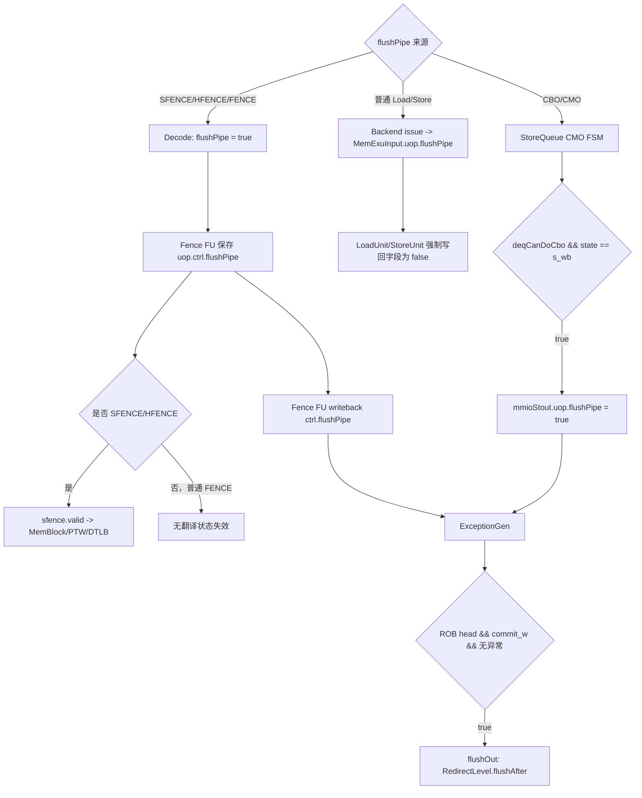

# V2 Memory `flushPipe` Flow

## 版本元数据

| 项目 | 内容 |
|---|---|
| RTL 版本 | V2 |
| 分支 | `mem_ut_uvm_v2` |
| 核验 commit | `d1db8e1cb72570ee7e75bde1c83253d4ceb2582f` |
| 设计基线 | `2acbf327cf7fb514593acc00d4c41117ec499e08`，见 V2 `branch_policy.md` |
| 权威源码 | `src/main/scala/xiangshan`；DUT 生成基线见 `mem_ut/ver/ut/memblock/rule/version/v2/memblock_rtl_profile.md` |
| 最后核验日期 | `2026-08-11` |

## Flow 范围

本文解释运行时 `DynInst.flushPipe` 在后端、Fence FU、MemBlock/LSQ 写回和 ROB 之间的传播与功能，重点区分：

- SFENCE/HFENCE 等指令在 Decode 阶段携带的静态指令属性。
- `FENCE`、`HFENCE.GVMA`、`HFENCE.VVMA` 对 SBuffer、翻译状态和 DCache 的不同边界。
- 普通 Load/Store 在 MemBlock 流水中的清零行为。
- CBO/CMO 在 StoreQueue 完成时动态产生的 `flushPipe`。
- LoadUnit/HybridUnit 局部 `s3_flushPipe` rollback 条件与写回字段的区别。
- 三个 MemBlock DTLB 中 `SFENCE.VMA`、`HFENCE.VVMA`、`HFENCE.GVMA` 对 local
  `TLBStorage` entry 和 outstanding miss filter 的实际失效范围。

本文不展开 mem_ut 软件模型中的 sfence FIFO。后者见 [mem_ut sfence/hfence flow](../../../../mem_ut_flow_doc/sfence_flow.md)。

## 术语

| 术语 | 本文含义 |
|---|---|
| `rs1=x0` / `rs2=x0` | 指令编码中的源寄存器编号为 `x0`，分别表示所有地址 / 所有 ASID 或 VMID；不是寄存器数据数值等于 0。若非 `x0` 寄存器恰好存放数值 0，仍是指定 ASID/VMID 0 或指定地址 0。 |
| `PTE.G` | 页表 response 的 global 位。local DTLB 用的是 `entries.perm.g`，它由 S1/VS response `item.s1` 写入；`entries.g_perm` 是分开的 S2 permission bundle。其 `pf/af/a/d/r/w/x` 会参与 G-stage 异常/权限检查，但 `.g` 不参与 local hit、任何 SFENCE/HFENCE 或 `perm_check()`；PtwCache 对 `onlyStage2` cache entry 还会主动清该位。 |
| `N` / `X` | 分别表示 `entry.s2xlate == noS2xlate` 和 `entry.s2xlate != noS2xlate`。`X` 包含 `onlyStage1`、`onlyStage2` 与 `allStage`。 |
| `M` / `A` / `H` | 分别表示 entry VMID 等于当前或目标 VMID、entry ASID 等于指定 ASID、entry 的 tag/level/sector/NAPOT 覆盖 fence 地址。`H` 由 `TlbSectorEntry.hit()` 计算。 |
| 精确 / over-fence | 本文的“精确”表示 local entry 失效范围与该指令要求的 stage、地址、ID 和 `PTE.G` 筛选一致；`over-fence` 表示多清 entry 或 miss state。后者性能更保守，但不等于功能漏失效。 |

## 核心结论

`FuConfig.flushPipe = true` 只是 Scala elaboration 期的 capability：决定执行单元的 `ExuInput/ExuOutput` 是否含可选 `flushPipe` 字段。运行时值是 `DynInst.flushPipe: Bool`。

在 MemBlock/LSQ 写回范围内，运行时有两类主要生产方式：

1. SFENCE/HFENCE/FENCE 等由 Decode 表直接把指令属性置为 `true`。SFENCE/HFENCE 的 Fence FU 同时将同一个值送入有效的 `sfence.bits.flushPipe` 和执行写回 `ctrl.flushPipe`；普通 `FENCE` 只走写回路径，`sfence.valid=0`。
2. CBO/CMO 进入 MemBlock 时并不依赖普通 Store 流水保留该属性，而是 StoreQueue 在 CMO 完成写回时根据 `deqCanDoCbo` 动态设置 `mmioStout.bits.uop.flushPipe`。

两条路径最终都进入 ExceptionGen/ROB；无异常时在当前指令到 ROB 头且可提交后产生 `RedirectLevel.flushAfter`。当前指令可以提交，年轻指令被清除。

### ROB `flushAfter` 的精确触发与范围

`flushAfter` 是 `Redirect.level` 的一种年龄范围，不是 SFENCE 专用信号，也不是 MemBlock 收到
`sfence.valid` 时立即产生的 redirect。它携带触发 uop 的 `robIdx`：该 uop 本身保留并可提交，所有
ROB 年龄更年轻的 uop 被全局 redirect 网络取消。

ROB 对队头 `deqPtr` 的带 `flushPipe` 指令，只有同时满足下列条件才发出该 redirect：

```text
队头 entry 有效且处于可提交写回状态
  && ExceptionGen 中存在同一 robIdx 的完成结果
  && 该结果没有 exceptionVec、single-step 或 debug trigger 异常
  && (writeback.flushPipe == 1 || writeback.replayInst == 1)
  -> ROB.flushOut.valid = 1

若原因是 flushPipe：flushOut.level = RedirectLevel.flushAfter
若原因是 replayInst、exception 或 interrupt：flushOut.level = RedirectLevel.flush
```

因此对 SFENCE/HFENCE：Fence FU 先独立送出 `sfence.valid` 清翻译状态；随后同一条 Fence 的
writeback 到 ROB head、满足上述条件时，ROB 才发 `flushAfter`，把该 Fence 之后已经进入 rename、dispatch、
issue 或 MemBlock 的年轻指令杀掉。它不是要求软件另发一条 flush 指令。

同一等级还可由分支/跳转误预测、`xRET` 等执行单元 redirect 直接产生；它们不需要等待 ROB head。
ROB 的 `flushAfter` 与执行单元的 `flushAfter` 共享“保留 redirect 点、清除年轻 uop”的年龄语义，区别仅在
producer 和发生时机。异常、interrupt、load/store replay 等需要连 redirect 点自身也重新处理的路径则使用
`RedirectLevel.flush`，不能把两者混为普通 Fence 提交。

`SfenceBundle.bits.flushPipe` 不控制 TLB entry 失效，也不控制 PTW/filter flush；这些动作
只看 `sfence.valid` 和 CSR translation context change。该 bit 只在通用 TLB 的 blocking
port 中决定 flush 发生时是否继续保留当前 miss 请求。V2 MemBlock 的 load/store/prefetch
DTLB 全部是 `TLBNonBlock`，不消费该 bit，因此 DTLB 当前查询的 hit/miss 不由
`sfence.bits.flushPipe` 决定。

`DynInst.flushPipe` 不直接参与 LSQ admission。LsqEnqCtrl、VirtualLoadQueue 和
StoreQueue 的入队表达式均不检查该字段；它只有在 ROB 头转换成 `flushAfter`
redirect 后，才通过 redirect gate、同拍取消和已分配 entry 回收间接影响更年轻
Load/Store 入队。SFENCE/FENCE 同时携带的 `blockBackward` 会更早阻止年轻指令
Dispatch，但这是独立控制属性，不是 LSQ 对 `flushPipe` 的检查。

### MemBlock standalone 验证边界

完整 core 中的 pipeline flush owner 是 ROB/CtrlBlock：对 SFENCE/HFENCE，Fence FU 把同一个
`uop.ctrl.flushPipe` 一路送入有效的 `sfence.bits.flushPipe`、一路随写回送到 ROB；对普通
`FENCE`，只有写回这一路。ROB 只在该指令到队头、可提交且没有异常时产生
`RedirectLevel.flushAfter`，再由全局 redirect 网络清除年轻指令。MemBlock 不根据
`sfence.bits.flushPipe` 本地暂停 LSQ enqueue/issue，也不从该位直接推导年轻 load/store 的
kill、replay、queue 回滚或 terminal 状态。

因此，当前只实例化 MemBlock、没有 ROB/CtrlBlock 的 standalone 测试框架不需要补一套“完整 core
flushPipe 模型”。当前适配闭环是：字段默认 0、允许 directed 原值驱动、valid payload 做 X/Z 观测，
并继续由 `sfence.valid` 和 rs1/rs2/addr/id/hv/hg 完成软件 TLB entry invalidation。测试框架不得仅因
该位为 1 人工暂停 LSQ driver、生成 redirect 或清 active uid；只有未来 DUT 边界扩展到真实
ROB/CtrlBlock/global redirect 时，才需要在新的全核集成环境中验证该架构行为，这不是当前
MemBlock V2 适配 TODO。

全核范围还存在两类不经过 MemBlock 的合法来源：

1. Decode 对 `VSETVL`、`SFENCE_VMA`、`HFENCE_GVMA`、`HFENCE_VVMA`、`FENCE_I`、
   `FENCE`、`PAUSE` 以及 Svinval 序列末端 `SFENCE_INVAL_IR` 直接输出
   `flushPipe=true`。这些是静态指令属性，不是执行结果根据地址动态算出的值。
2. 当前 `CsrCfg` 实例化的是 `wrapper.CSR`，其内部使用 `NewCSR`。`NewCSR` 在合法
   CSR 写入导致地址翻译上下文、浮点/向量可用状态、`vstart`、保留 `frm` 状态或
   前端 trigger 配置改变时置 `flushPipe`：

   ```scala
   val flushPipe = resetSatp || triggerFrontendChange ||
     floatStatusOnOff || vectorStatusOnOff || vstartChange || frmChange
   ```

   `XRET` 在当前 wrapper 中另有 `RedirectLevel.flushAfter` 的控制流 redirect，
   不能把旧版 `backend/fu/CSR.scala` 中同名的局部 `flushPipe` 公式直接套到当前
   `CsrCfg` 实例上。

## 主流程图



## 主流程文字伪代码

```text
1. 对 SFENCE/HFENCE：
   Decode 表把 decoded instruction 的 flushPipe 属性置为 true；
   该属性经过 Rename/Issue 到 Fence FU；
   Fence FU 把同一 uop.ctrl.flushPipe 分成两路：
     一路以 sfence.valid 进入 sfence payload，告诉 TLB 这是需要 flush pipe 的 SFENCE，而不是不清流水的 Svinval；
     另一路进入 Fence FU 写回，最终交给 ROB 做精确 flushAfter。
   TLB 侧看到 sfence.valid 时阻止本次 PTW refill；
   PTW filter/repeater 看到 sfence.valid 或 CSR translation context changed 时清空内部记录和 inflight 计数；
   对 blocking TLB port，sfence.bits.flushPipe=1 时不再为 flush_mmu 中的 miss 请求保留 miss_req_v；
   V2 MemBlock DTLB 是 non-blocking port，不生成上述 miss_req_v 逻辑；
   io.flushPipe=1 时，TLB 才直接清 pipe-local valid；
   对 outsideRecvFlush=false 且 io.flushPipe=1 的端口，TLB 给仍等待响应的请求返回 valid，并置 ld/st/instr page fault，
   用假 fault 防止旧地址继续被使用。

2. 对普通 FENCE：
   Fence FU 在 s_wait 拉高 flushSb，等待 SBuffer 和 Uncache 共同排空；
   之后进入 s_fence，仅输出普通 Fence 写回，sfence.valid 保持 0；
   因而它建立访存顺序并在 ROB 头产生 flushAfter，但不失效 TLB/PTW，也不直接失效 DCache cache line。

3. 对普通 Load/Store：
   Backend 把 issue bundle 的 flushPipe 复制进 MemExuInput.uop；
   LoadUnit/StoreUnit 在正常写回路径明确把 uop.flushPipe 置 false；
   因此普通访存不会用该字段请求 ROB 清流水。

4. 对 CBO/CMO：
   StoreQueue 等待 CBO 位于可处理的 SQ 队头，地址有效且无异常；
   CMO 状态机完成请求/响应并进入 s_wb；
   当 deqCanDoCbo 为 true 时，把 mmioStout.uop.flushPipe 动态置 true；
   写回经 Backend 进入 ExceptionGen/ROB。

5. ROB 在该指令到达队头、commit_w 有效、ExceptionGen 命中且没有异常时识别 deqHasFlushPipe；
   产生 flushAfter redirect：当前指令可提交，清除年轻指令并从下一条指令重新取指。
   CtrlBlock 将该 redirect 广播给 rename、dispatch、issue、exu、datapath、mem 和 frontend；
   ROB、LSQ、issue/exu pipeline 使用 robIdx.needFlush() 或等价 redirect gate 清除年轻请求。
```

## 1. 字段和 capability 的区别

`DynInst.flushPipe` 定义为运行时 Bool，源码注释说明它“像异常一样清流水，但可以提交”。LDU/STA 配置中的 `flushPipe = true` 只让对应执行单元生成该可选接口，不能据此判断每条 Load/Store 的运行时值为 1。

## 2. SFENCE/HFENCE 的双路关联

Decode 对 `SFENCE_VMA`、`HFENCE_GVMA`、`HFENCE_VVMA` 设置 `flushPipe = T`。Fence FU 锁存输入 uop 后执行：

```scala
sfence.bits.flushPipe := uop.ctrl.flushPipe.get
io.out.bits.ctrl.flushPipe.get := uop.ctrl.flushPipe.get
```

所以 `sfence.bits.flushPipe` 和最终写给 ROB 的 `flushPipe` 不是互相生成，而是同一个 Decode 属性的两个 fanout：

- MemBlock 将 `sfence` 延迟两拍后送给 PTW 和各 DTLB。
- 通用 TLB 的 blocking port 用 `sfence.valid && sfence.bits.flushPipe` 区分不再保留 miss 等待 response 的 SFENCE 与需要继续返回正确 response 的 Svinval。
- V2 MemBlock 的 DTLB 全部实例化为 `TLBNonBlock`，其查询、miss 上送和 PTW request 逻辑不读取 `sfence.bits.flushPipe`。
- Fence FU 写回值最终由 ROB 在精确提交点清后端/前端年轻流水。

这两个动作协同完成 SFENCE：TLB 路径负责地址翻译状态失效，ROB 路径负责让年轻指令在新翻译状态下重新执行。`flushPipe` 本身不替代 TLB entry invalidation。

普通 `FENCE` 同样把 `uop.ctrl.flushPipe` 写回 ROB，但不满足 Fence FU 的
`sfence.valid` 条件；因此不能把普通 `FENCE` 的 `SfenceBundle` 非 valid payload 当成
TLB/PTW/DCache 控制事件。

## 2.1 `sfence.bits.flushPipe` 对 blocking TLB 与 MemBlock DTLB 的不同影响

TLB 源码注释把两类 fence 区分为：

- SFENCE：flush old entries、flush inflight、flush pipe。
- Svinval：flush old entries、flush inflight，不 flush pipe。

因此 `sfence.valid` 本身已经会触发 TLB entry invalidation、阻止同拍 PTW refill，并让
PTW filter/repeater 清除内部有效位、指针和 inflight 计数。只有 `handle_block()` 中的
`miss_req_v` 逻辑读取 `sfence.bits.flushPipe`，用于决定 `flush_mmu` 发生时是否继续保留
尚未完成的 miss。直接清 pipe-local valid 和 fake fault response 的条件来自 TLB 端口的
`io.flushPipe`。

V2 MemBlock 的三个 DTLB 实例分别服务 load、store 和 prefetch，均由
`TLBNonBlock(..., Seq.fill(Width)(false), ...)` 生成，只调用 `handle_nonblock()`；
`handle_nonblock()` 不读取 `mmu_flush_pipe`。生成 RTL 也把 DelayN 输出的
`io_out_bits_flushPipe` 标成 `/* unused */`。因此对这些 DTLB：

| DTLB 所见条件 | 当前查询的直接行为 |
|---|---|
| `sfence.valid=0` | `sfence.bits.flushPipe` 是无效 payload，查询按现有 entry 正常 hit/miss。 |
| `sfence.valid=1, flushPipe=0` | 按 rs1/rs2、地址、ASID/VMID 范围失效 entry，阻止旧 PTW response refill；不因 bit=0 强制 hit 或 miss。 |
| `sfence.valid=1, flushPipe=1` | 对 DTLB 的直接 hit/miss 行为与 bit=0 相同；年轻访存的清除来自同源写回在 ROB 产生的 `flushAfter` redirect。 |

文字伪代码：

```text
TLB 每拍：
  flush_mmu = sfence.valid || satp/vsatp/hgatp/virt_changed；
  mmu_flush_pipe = sfence.valid && sfence.bits.flushPipe；
  flush_pipe = io.flushPipe；

  如果 ptw.resp.fire 且 flush_mmu=1：
    不把 PTW response refill 到 L1 TLB；

  如果当前 port 是 blocking，miss 请求已存在，且 flush_mmu=1 且 mmu_flush_pipe=0：
    保留 miss_req_v，允许 Svinval 场景继续给 pipe 中请求返回正确 response；

  如果当前 port 是 blocking，sfence.valid=1 且 sfence.bits.flushPipe=1：
    mmu_flush_pipe=1；
    flush_mmu 中不再用 miss_v 重新置起 miss_req_v；
    这表示 SFENCE 场景不需要像 Svinval 一样保留 pipe 中 miss 去等待正确 response；

  如果当前 port 是 V2 MemBlock DTLB：
    走 handle_nonblock()，不建立 miss_v/miss_req_v；
    当前查询查不到有效 entry 时返回 resp.miss=1，同时向 PTW 发请求；
    如果该 PTW 请求与 filter flush 同拍被清除，由访存 replay 在 flush 后重新发起；
    Load/Store pipeline 取消本次 DCache 访问并通过 tlbMiss feedback/replay 后续重试；

  如果 io.flushPipe=1：
    清除 req_out_v/miss_v/miss_req_v 等 pipe-local valid；
    新进入请求 new_coming_valid 被屏蔽；

  对 outsideRecvFlush=false 的端口：
    如果 req_out_v=1 且 io.flushPipe=1 且 translation enable：
      resp.valid=1；
      resp.excp.pf.ld/st/instr=1；
      用 fake page fault 让外部仍等待 response 的 pipe 走完握手；
```

在 MemBlock DTLB 连接中，`dtlb.map(_.flushPipe.map(a => a := false.B))`，DTLB
不通过 `io.flushPipe` 直接接收 pipe flush，因此不会走 TLB 端口 fake fault 分支；
它主要依赖后端 redirect 和 LSQ/流水线的 `robIdx.needFlush()` 取消年轻访存。
Frontend ITLB 则连接 `icache.io.itlbFlushPipe`，ICache prefetch pipe 在自身 flush 时会
通知 ITLB 清掉对应 pipe 请求。

### 2.1.1 查询与 sfence 同拍时序

“同拍”必须先说明观察边界。MemBlock 顶层的 `io.ooo_to_mem.sfence` 先经过两级寄存，
进入 DTLB 后又经过 `fenceDelay=2`；DTLB request 不等待这四级 sfence 对齐延迟。因此，
顶层 sfence 和 DTLB request 同拍输入时，本次查询不会因为该 sfence 立即变成 miss，
它可能先按 flush 前的 entry 完成查询。

即使把“同拍”定义为 DTLB storage 已经看到延迟后的 `sfence.valid`：`TLBFA` 也在同一
时钟沿用当前 `v` 计算并锁存 `hitVecReg`，同时把命中的 `v` 清零。按照寄存器时序，
这笔查询仍可能采到 flush 前的 hit；清零后的后续查询才看到 entry 无效。若后续查询
没有其他匹配 entry 且地址翻译已启用，则 DTLB 返回 `miss=1`、发出 PTW request，
访存流水随后 replay；若 PTW filter 同拍也在 flush，这个 page-walk 请求可能被清除，
replay 会在 flush 后重新发起。若该 entry 不在本次 sfence 选择范围内，则仍可正常 hit。

所以不能把 `sfence.bits.flushPipe=0` 解释成“当前请求必然 miss”，也不能把它置 1
当成 DTLB 查询 kill。真实 SFENCE 用同源的 ROB `flushAfter` redirect 保证年轻请求不会
使用 flush 前结果；仅在测试平台独立驱动 DTLB request 而没有对应 redirect 时，才可能
直接观察到这类 flush 边界上的旧 hit。

PTW filter/repeater 的 flush 条件不区分 `sfence.bits.flushPipe`，只看
`sfence.valid` 或 CSR translation context change。它们会清空 filter entry、
指针、response valid 和 inflight counter，从而取消已经记录但不再可信的 page walk
请求。PageTableWalker、LLPTW、HPTW 内部同样用 `sfence.valid` 或 CSR context changed
构造 flush。

### 2.1.2 local DTLB entry 的 SFENCE/HFENCE 精确度矩阵

#### 抽象功能

本节的功能是把 V2 MemBlock 三个 `TLBNonBlock` 内部 `TLBStorage` 的 **entry valid 位清除**
写成可审计的选择矩阵，并将它与 `PTWNewFilter` 的全量 outstanding flush 分开。这里的
“精确”只描述 local DTLB 已 refill entry 的选择范围；它不表示 outstanding miss 也按相同范围保留。

Fence FU 把操作数寄存器编号编码成 `SfenceBundle.bits.rs1/rs2`：字段为 1 表示该源寄存器是
`x0`，`addr`/`id` 则锁存源寄存器的数据。`HFENCE.GVMA` 的 `id` 是 VMID，其他两类 fence 的
`id` 是 ASID。`hv` 和 `hg` 分别选择 VVMA/GVMA；正常 decode 下二者不会同时为 1。

local DTLB 对每个 valid entry 运行下面等价选择，而不是逐条 PTE 回查：

```text
普通 SFENCE:
  V=0 且 rs1=x0  -> 按 noS2xlate、ASID 和 PTE.G 筛选；
  V=0 且 rs1!=x0 -> 调 TlbSectorEntry.hit(addr)，该调用不再筛 s2xlate/VMID；
  V=1            -> 强制视为所有地址，仅按当前 VMID、ASID 和 PTE.G 筛选 X 类 entry。

HFENCE.VVMA:
  不读取 rs1/addr；按当前 hgatp.VMID、ASID 和 PTE.G 筛选 X 类 entry。

HFENCE.GVMA:
  不读取 rs1/addr；按 rs2 选择所有 VMID 或指定 VMID，筛选 X 类 entry；不读取 PTE.G。
```

`H` 的地址范围不是 tag 简单相等：`TlbSectorEntry.hit()` 同时检查 sector 的 `valididx`、
page level、superpage 覆盖和 NAPOT 相关字段。因此以下“地址精确”均指这些范围语义，而非
4KB 页号等值。

#### `SFENCE.VMA`，`virt=0`

此处 `PTE.G` 为 DTLB 中的 `entries.perm.g`。在 `rs1=x0` 两行，local storage 的 stage
选择与架构目标一致；在 `rs1!=x0` 两行，源码走 `sfenceHit`/`sfenceHit_noasid`，没有额外的
`entry.s2xlate == noS2xlate` 或 VMID 筛选。

| `rs1` | `rs2` | local entry 实际失效谓词 | `PTE.G=0` | `PTE.G=1` | 精确度判断 |
|---|---|---|---|---|---|
| `x0` | `x0` | `N` | 失效 | 失效 | 对已 refill local entry，HS/S-stage、全部地址、全部 ASID 的选择精确。 |
| `x0` | 非 `x0` | `N && A && !G` | ASID 命中则失效 | 保留 | 对 stage、指定 ASID 和 global 规则精确。 |
| 非 `x0` | `x0` | `H`，不是 `N && H` | 地址覆盖命中则失效 | 地址覆盖命中则失效 | 地址范围精确，但 `s2xlate` 和 VMID 未筛选；可能额外清 `onlyStage1`/`onlyStage2`/`allStage` entry，属于 over-fence。 |
| 非 `x0` | 非 `x0` | `H && A && !G`，不是 `N && H && A && !G` | 地址与 ASID 均命中则失效 | 保留 | ASID/global 规则正确，但 stage 和 VMID 未筛选，可能 over-fence 两阶段 entry。 |

额外例外是 BitmapCheck：编译能力 `HasBitmapCheck` 存在且运行时
`mbmc.BME=1 && mbmc.CMODE=0` 时，源码把 `virt=0` 的非 `x0 rs1` 也送入“全部地址”分支。
此时仍按 `N` 与 `rs2`/`PTE.G` 筛选，但地址从指定范围扩大为全部地址。

#### `SFENCE.VMA`，`virt=1`

当前 guest 执行普通 SFENCE 时，源码条件直接含 `io.csr.priv.virt`，所以 `rs1=x0` 与
`rs1!=x0` 的 local DTLB 行为完全相同：非零地址不会参与筛选。令
`Mcur = (entry.vmid == csr.hgatp.vmid)`。

| `rs1` | `rs2` | local entry 实际失效谓词 | `PTE.G=0` | `PTE.G=1` | 精确度判断 |
|---|---|---|---|---|---|
| `x0` | `x0` | `X && Mcur` | 失效 | 失效 | 全地址与当前 VMID 正确；`X` 还包含没有 VS-stage 的 `onlyStage2`，因此对 stage 范围保守。`allStage` 是组合 entry，必须整项删除。 |
| `x0` | 非 `x0` | `X && Mcur && A && !G` | ASID 命中则失效 | 保留 | 当前 VMID、ASID 与 global 规则正确；`onlyStage2` 仍是额外失效。 |
| 非 `x0` | `x0` | `X && Mcur` | 失效 | 失效 | 忽略指定 GVA，扩大为当前 VMID 全地址；另有 `onlyStage2` over-fence。 |
| 非 `x0` | 非 `x0` | `X && Mcur && A && !G` | ASID 命中则失效 | 保留 | 忽略指定 GVA，扩大为当前 VMID、指定 ASID 的全地址；另有 `onlyStage2` over-fence。 |

#### `HFENCE.VVMA`

`HFENCE.VVMA` 与 `virt=1` 的普通 SFENCE 在 local storage 的选择式几乎相同，但它由
`hv=1` 显式选择。其 VMID 不是 `rs2`，而是 fence 执行时 CSR 中的 `hgatp.vmid`；`rs2` 始终是
VS-ASID。源码注释明确说明：两阶段组合 entry 用较小 page level 保存，若按 `rs1` 的 GVA 匹配，
VS 大页 + G-stage 小页会漏失效，因此有意关闭本地地址匹配。

| `rs1` | `rs2` | local entry 实际失效谓词 | `PTE.G=0` | `PTE.G=1` | 精确度判断 |
|---|---|---|---|---|---|
| `x0` | `x0` | `X && Mcur` | 失效 | 失效 | “所有 GVA、当前 VMID”本身正确；`onlyStage2` 被一并清除，属于 stage over-fence。 |
| `x0` | 非 `x0` | `X && Mcur && A && !G` | ASID 命中则失效 | 保留 | VMID、ASID 与 global 规则精确；`onlyStage2` 额外失效。 |
| 非 `x0` | `x0` | `X && Mcur` | 失效 | 失效 | 完全忽略 GVA，清当前 VMID 的全部地址；这是源码明确选择的 over-fence。 |
| 非 `x0` | 非 `x0` | `X && Mcur && A && !G` | ASID 命中则失效 | 保留 | 完全忽略 GVA，清当前 VMID、指定 ASID 的全部地址；`onlyStage2` 也额外失效。 |

#### `HFENCE.GVMA`

`HFENCE.GVMA` 的 `rs1` 是 GPA 右移 2 位的编码，Fence FU 会把源数据写入 `addr`。但
`TLBStorage` 虽计算了 `hfenceg_gvpn = addr << 2`，后续 local entry 清除表达式完全不引用它。
令 `Mid = (entry.vmid == sfence.bits.id)`。

| `rs1` | `rs2` | local entry 实际失效谓词 | `PTE.G=0` | `PTE.G=1` | 精确度判断 |
|---|---|---|---|---|---|
| `x0` | `x0` | `X` | 失效 | 失效 | 全 GPA、全 VMID 的地址/VMID 维度正确；`onlyStage1` 没有 G-stage 也被清除，属于 stage over-fence。 |
| `x0` | 非 `x0` | `X && Mid` | VMID 命中则失效 | VMID 命中则失效 | 指定 VMID 选择精确；`onlyStage1` 额外失效。 |
| 非 `x0` | `x0` | `X` | 失效 | 失效 | 忽略指定 GPA，扩大到所有 GPA、所有 VMID；同时 over-fence `onlyStage1`。 |
| 非 `x0` | 非 `x0` | `X && Mid` | VMID 命中则失效 | VMID 命中则失效 | VMID 选择精确，但忽略指定 GPA，且额外清 `onlyStage1`。 |

这里 `PTE.G` 的两列完全相同是刻意事实：GVMA 分支不读取 `entries.perm.g`，也不读取
`entries.g_perm.g`。`rs2` 是 VMID 而非 ASID，所以它不应复用 S/VS-stage 的
“指定 ASID 时保留 global mapping”规则。

#### outstanding miss 与 PageTableCache 的边界

以上矩阵只描述 local `TLBStorage.v`。DTLB 的 `PTWNewFilter` 只以
`sfence.valid || satp.changed || vsatp.changed || hgatp.changed || priv.virt_changed` 形成 flush；
它不解码 `hv/hg`、`rs1/rs2`、`addr/id` 或 `PTE.G`。触发后每个 `PTWFilterEntry` 都将全部
`v` 清零并把 `inflight_counter` 置零。因此任何有效 SFENCE/HFENCE 都会保守取消本 DTLB
所有 outstanding miss，而不是只取消上述表中命中的 request。

L2 `PageTableCache` 另有自己的 stage-aware 地址、ASID/VMID 选择逻辑，并且在 VVMA/GVMA
分支中会使用 `addr` 派生的 VPN/GVPN。不能把该较细粒度的下游缓存行为反推成 local DTLB
也做了相同的地址匹配；两者是独立存储结构。

#### PTW response 与 filter flush 的边界

V2 MemBlock 实际使用 `PTWNewFilter`。外部 `io.ptw.resp.fire` 先经一拍 `RegNext` 送入各
`PTWFilterEntry`，entry 的 `flush` 在 due sample 清除其 `v`；MemBlock 外层再用
`ptw_resp_v = RegNext(ptwio.resp.valid && !sfence/CSR_changed)` 屏蔽翻译回填。因而对替代 L2TLB responder，
若顶层 CSR/fence sample 记为 C、内部 `DelayN` 的 filter flush 到达 C4，则 C4 同拍的 external response fire
不构成有效 DTLB completion；最后一个可完成 response sample 必须严格早于 C4。C4 只清除 filter 的
live/inflight state，测试框架仍需按自身 lifecycle 规则取消尚未完成的旧 token；这段 token/UID 记账不是
DUT 新增的 flush 信号。旧 `PTWFilter` 类在 `when(flush)` 中显式清除寄存 valid，是同一边界的对照实现，
不能直接当作 V2 `PTWNewFilter` 的赋值。

CSR change 的 response raw-hit 上下文会早于 C4 切换：顶层 C0 CSR 经过两级 `RegNext` 后，C2/C3 的
`PTWFilterEntry` 已用新 ASID/VMID 做 response match；C4 才清空未完成 entry。因此 verification responder 回填
UID 时应使用 response fire 当拍的 top C-2 CSR，不能用 UID issue-time CSR，也不能等到 C4 才改变 matcher context。

CSR change 与 SFENCE/HFENCE 在 RTL 中仍是独立输入事件。验证侧若两者具有相同的统一 DUT sample，
可以把它们的原因合并到一个 lifecycle barrier 并共用同一 C4 due；不同 sample 必须分别计算延迟。

## 2.2 FENCE/HFENCE 对 DCache 的实际边界

### 抽象功能

本节的功能是把 Fence 对“已提交 store 的可见性”“地址翻译缓存失效”“年轻 LSU 请求取消”和
“DCache 物理 cache line 状态变化”严格拆开。它们经过相邻模块发生，不能因为都叫
`flush` 就混成一次 DCache invalidate。

### Fence 类型和直接作用对象

| 指令 | Fence FU 在 SBuffer 空后进入的状态 | 有效的 `SfenceBundle` | 直接失效对象 | DCache 直接动作 |
|---|---|---|---|---|
| `FENCE` | `s_fence` | 无，`sfence.valid=0` | 无 TLB/PTW 失效 | 无 tag/data invalidation；仅等待先前 SBuffer/Uncache 写入排空 |
| `SFENCE.VMA` | `s_tlb` | `hv=0,hg=0,id=ASID` | S1 翻译 entry、PTW/filter | 无 |
| `HFENCE.VVMA` | `s_tlb` | `hv=1,hg=0,id=ASID` | 当前 VMID 的 VS-stage 相关翻译状态 | 无 |
| `HFENCE.GVMA` | `s_tlb` | `hv=0,hg=1,id=VMID` | G-stage/两阶段相关翻译状态 | 无 |

所有这四类 Fence 先进入 `s_wait`，其间 `flushSb=1`。完整 core 把它接到
`MemBlock.ooo_to_mem.flushSb`；MemBlock 在下一拍同时对 SBuffer 和 Uncache buffer 发
`flush.valid`，并把二者均空作为 `sbIsEmpty` 返回 Fence FU。SBuffer 的 `x_drain_all`
状态把已有 store 以 `M_XWR` 请求发送到 DCache。因此这一步可能使旧 store 正常命中、写入、
产生 miss 或对外发起 Acquire；它是“把先前写入做完”，不是把 DCache line 清掉。

`FENCE` 在排空后只产生 Fence 写回。`HFENCE.VVMA/GVMA` 则在 `s_tlb` 产生一个周期的
`sfence.valid`，MemBlock 再经过两级寄存送入 PTW 和 DTLB。`HFENCE.VVMA` 用当前
`hgatp.vmid` 加 ASID 选择 VS-stage entry；当前 L1 `TLBStorage` 为避免 VS 大页与 G 小页
合并后地址匹配漏失效，刻意不按 `rs1/addr` 缩小其本地失效范围，属于合法 over-fence。
`HFENCE.GVMA` 将地址按 `addr << 2` 解释为 GVPN；L1 `TLBStorage` 对
`s2xlate != noS2xlate` 的 entry 按 VMID 或全 VMID 失效。L2TLB 内的 PageTableCache
地址选择分支仍会使用这个 GVPN 做更细粒度匹配。以上地址、ASID 和 VMID 都不进入 DCache
cache tag 比较。

### DCache 的间接取消和不可撤销事务

Fence 写回在 ROB 队头形成 `RedirectLevel.flushAfter`。`RobPtr.needFlush()` 对
`flushAfter` 只返回“比该 Fence 更年轻”的 uop，Fence 本身能够提交。MemBlock 将 redirect
交给 LoadUnit、StoreUnit 和 LSQ，而不是直接交给 `DCacheWrapper`：

```text
年轻 load/store 尚在 LSU 或 DCache 前两级：
  robIdx.needFlush(redirect)
    -> LoadUnit/StoreUnit.s1_kill 或 s2_kill
    -> DCache LoadPipe/StorePipe 不再推进该请求；候选 miss 的 cancel=1
    -> MissQueue 不为该 canceled request 分配或 merge MSHR。

年轻 miss 已完成 MSHR 分配或 A.fire：
  DCacheWrapper/MissQueue 没有 redirect 输入；已锁存的 req_valid 也没有后续 cancel 条件
    -> Acquire、GrantData/Grant、GrantAck 和必要 refill 仍按 TileLink 生命周期收敛
    -> LSU/ROB 已取消原 uop，不再把该回复当作架构可见结果。
```

这个边界很重要：Fence redirect 能阻止尚未进入 MSHR 的年轻 cache 请求，却不能撤销已经
对 L2 发出的 coherent 事务。后者可以继续形成纯微架构的 DCache refill；这不违反 Fence
语义，也不表示 HFENCE 在以 GPA/GVPN 清除 DCache line。

### 真正改变 DCache 物理 line 的路径

| 路径 | DCache 实际动作 | 与 FENCE/HFENCE 的关系 |
|---|---|---|
| SBuffer/Uncache drain | 完成旧 store，可能更新 line 或发起普通 miss | 所有 Fence 的排空前置条件，非 invalidate |
| L2 B-channel Probe | MainPipe 依据 Probe param 降级或失效 line，并以 C-channel ProbeAck/ProbeAckData 收敛 | 独立 coherence 路径，不由 `sfence.valid/hv/hg` 驱动 |
| CBO clean/flush/inval | LSQ `cmoOpReq` 经 DCache CMOUnit 发送 CBO A 请求，等待 `CBOAck` | 专用 cache-management 指令，不等同于普通 FENCE 或 HFENCE |
| 全局 L2 flush | 由 `mflushpwr.FLUSH_L2_ENABLE`/L2 flush sideband 触发，L2 侧完成后报告 done | 与地址翻译 Fence 独立 |

因此 standalone MemBlock 验证中，单独驱动 `io_ooo_to_mem_sfence_*` 只能观察 TLB/PTW
路径；若没有完整 core 的 ROB/CtrlBlock 同时产生 `io.redirect`，不能期待 DCache 因
`sfence.bits.flushPipe` 自行暂停、取消请求或失效 cache line。

## 3. 普通 Load/Store

Backend 发射到 MemBlock 时复制 issue 字段：

```scala
sink.bits.uop.flushPipe := source.bits.flushPipe.getOrElse(false.B)
```

但普通访存 Decode 属性为 false，且 LoadUnit S2/S3、StoreUnit S1 都明确覆盖写回 `uop.flushPipe := false.B`。因此普通 Load/Store 不会通过该字段触发 ROB flush。

### 3.1 Split writeback lane 的字段边界

`FuConfig.flushPipe=true` 是执行单元的可选能力，不等于每个写回 lane 的运行时值都可能为 1。
V2 当前生成的 split 端口表现为：

| 端口 | `uop.flushPipe` 的来源和结论 |
|---|---|
| LDA0/1/2 | 字段保留在顶层，但普通 Load、Atomics 覆盖和 LoadMisalignBuffer 路径均不把它作为普通 Load 的运行时 flush；普通 LDA 应为 0。 |
| STA0 | 除普通 StoreUnit 外，还复用 StoreQueue `mmioStout`；CBO/CMO 完成写回时 `deqCanDoCbo` 可把它置 1。 |
| STA1 | 只有普通 StoreUnit 写回，S1 明确置 0；生成顶层中该字段被常量传播裁掉。 |
| STD0/1 | `StdCfg.flushPipe=false`，store-data 写回不承载该语义。 |

因此 STA0 的 `flushPipe=1` 是合法的 CBO/CMO 写回语义，而不是普通 STA 的普遍属性。
当前验证框架若未实现 CBO 的 ROB `flushAfter` 收口，可以把该组合定义为
`unsupported CBO flush` 并 fail-fast；不能据此断言 V2 RTL 永远不会产生 STA0 的 1。

LoadUnit 中：

```scala
val s3_flushPipe = s3_ldld_rep_inst
io.rollback.valid := ... || s3_flushPipe || ...
s3_out.bits.uop.flushPipe := false.B
```

这里的 `s3_flushPipe` 是 load-load violation 的局部 rollback 条件，不是 `DynInst.uop.flushPipe`，不会通过写回等待 ROB 头处理。

`HybridUnit` 也有同名局部信号：

```scala
val s3_flushPipe = s3_ldld_rep_inst
io.ldu_io.rollback.valid := s3_valid && (s3_rep_frm_fetch || s3_flushPipe) && !s3_exception && s3_ld_flow
```

它同样只参与 MemBlock 内部的 rollback；只有 `s3_rep_frm_fetch` 另外被写入
`uop.replayInst`，`s3_flushPipe` 本身不会变成 writeback metadata。

## 4. CBO/CMO 动态置位

StoreQueue 定义：

```scala
val deqCanDoCbo = GatedRegNext(
  LSUOpType.isCbo(uop(deqPtr).fuOpType) &&
  allocated(deqPtr) && addrvalid(deqPtr) && !hasException(deqPtr)
) && memBackTypeMM(deqPtr)
```

在 scalar CMO 状态机进入 `s_wb` 时产生 `mmioStout.valid`，并执行：

```scala
io.mmioStout.bits.uop.flushPipe := deqCanDoCbo
```

因此实际有效的 CBO flush writeback 需要：

- 当前 SQ entry 是 CBO。
- entry 已分配且地址有效。
- entry 无异常。
- `memBackTypeMM` 为真。
- CMO FSM 完成并进入 scalar `s_wb` 写回阶段。

其目的由源码明确标注为保持 CMO 顺序；CBO 完成后清除可能基于旧 Cache/一致性状态执行的年轻指令。

## 5. ROB 精确处理

ExceptionGen 收集写回的 `flushPipe`，并保证异常存在时不再同时按普通 flushPipe 处理。ROB 只有在以下条件同时成立时产生 `deqHasFlushPipe`：

- ROB 队头 entry 的 `needFlush`、`commit_v`、`commit_w` 有效。
- ExceptionGen 当前记录与 ROB 队头 index 相同。
- `exceptionDataRead.bits.flushPipe` 为真。
- 当前不是 exception。
- `commit_w_delay` 有效。

最终 `flushOut.level` 对纯 `flushPipe` 选择 `RedirectLevel.flushAfter`；exception、interrupt 或 replay 选择 `flush`。

## 6. 与 LSQ 入队和 redirect 的关系

`flushPipe` 指令产生的 `flushAfter` 进入公共 redirect 网络后才影响 LSQ：

1. `LsqEnqCtrl` 使用 `enq.valid && !redirect.valid && enq.canAccept` 产生实际入队请求，redirect 同拍优先。
2. 已越过 controller 寄存边界的请求，在 LQ/SQ 入口再次用 `robIdx.needFlush(redirect)` 取消。
3. 已分配的年轻 LQ/SQ entry 被清除，cancel count 用于回退队列指针和 controller 的影子计数。
4. `flushAfter` 不清 flushPipe 指令自身，只清更年轻指令；`flush` 还可清 redirect 点自身。

Fence 类指令本身是 `FuType.fence`，在普通 LSQ enqueue 生成逻辑中 `needAlloc=0`。
它们通常还在 Decode 同时设置 `blockBackward=true`，因此年轻 Load/Store 可能在
flushPipe 指令到 ROB 头之前就停止 Dispatch。这个提前阻塞的直接原因是
`blockBackward`，不是 `flushPipe`。

完整入队条件和 redirect 恢复时序见
[V2 LSQ 入队与 Redirect 恢复 flow](lsq_enqueue_redirect_flow.md)。

## 7. 完整 pipeline flush owner 需要收敛的请求

如果验证框架要完整实现与 RTL 等价的 pipeline flush owner，不能只在 fence agent
看到 `sfence.bits.flushPipe=1` 时清一个标志。它需要以 ROB 产生的 `flushAfter`
redirect 为 owner，并按年龄清除或阻塞以下请求：

1. 已进入 decode/rename/dispatch 的年轻指令：CtrlBlock 在 redirect 时阻塞 decode
   输入，清 rename-to-dispatch pipe，并阻止 redirect 当拍后的 ROB enqueue。
2. 已进入 issue queue、exu 和 datapath 的年轻 uop：由广播 redirect/flush 按
   `robIdx.needFlush()` 或模块本地等价条件取消。
3. 已发往 LSQ controller 但尚未真正入 LQ/SQ 的请求：`LsqEnqCtrl` 用
   `enq.valid && !redirect.valid && canAccept` 阻止同拍入队。
4. 已越过 controller 并进入 LQ/SQ 的年轻 entry：VirtualLoadQueue 和 StoreQueue
   用 `robIdx.needFlush(redirect)` 清 allocated/completed 等状态，并在随后若干拍
   回退 enqueue pointer 和 cancel count。
5. 已进入 TLB/PTW 的翻译 miss：TLB/PTW filter/repeater 在 `sfence.valid` 或 CSR
   context changed 时清 inflight/filter 状态；ITLB pipe 可额外用 `io.flushPipe`
   伪完成或丢弃 pipe 请求。
6. 前端已经基于旧翻译状态取到的年轻指令：ROB 的 `flushAfter` 经 CtrlBlock 延迟送到
   frontend/FTQ，使取指从 flushPipe 指令之后重新开始。

`flushAfter` 不清触发该 flush 的 ROB 项自身；触发项可以提交。只有 `flush` 级别才表示
redirect 点自身也需要被清掉。

## 状态、字段和优先级

| 状态/字段 | 生产者 | 置位条件 | 清除/覆盖条件 | 消费者 | 优先级 |
|---|---|---|---|---|---|
| Decode `flushPipe` | Decode 表 | SFENCE/HFENCE/FENCE 等指令项为 `T` | 其他指令默认 `F` | Issue/Fence FU | 指令静态属性 |
| Decode/CSR 其他 `flushPipe` | Decode、`NewCSR` | `VSETVL`/`SFENCE_INVAL_IR` 等静态项，或 `resetSatp`、状态开关、`vstart`/`frm`/前端 trigger 配置变化 | 普通指令和不改变上下文的 CSR | Fence/CSR 写回 -> ExceptionGen/ROB | 全核后端来源，不等同于 MemBlock CMO |
| `sfence.bits.flushPipe` | Fence FU | 复制锁存的 `uop.ctrl.flushPipe` | 随下一次 Fence uop 更新 | blocking TLB 的 miss 保留逻辑；V2 MemBlock DTLB 不消费 | 区分 SFENCE 与 Svinval 的 pipe 语义，不控制 entry invalidation |
| Load/Store writeback `uop.flushPipe` | LoadUnit/StoreUnit | 普通路径不置位 | 显式写 `false.B` | Backend writeback | 覆盖输入携带值 |
| CBO writeback `uop.flushPipe` | StoreQueue | `deqCanDoCbo` 且 `s_wb` 有效写回 | 非 CBO 为 false | ExceptionGen/ROB | CMO 专用路径 |
| LoadUnit/HybridUnit `s3_flushPipe` | LoadUnit/HybridUnit | load-load violation replay | 当拍组合/寄存条件消失 | `io.rollback` | 与写回字段无关 |
| PTW filter/repeater flush | PTW filter/repeater | `sfence.valid` 或 translation CSR changed | 清空 entry、指针、inflight counter | TLB/PTW request 合并与返回 | 不区分 `bits.flushPipe` |
| ROB `flushAfter` redirect | ROB/CtrlBlock | 队头无异常 `flushPipe` 指令可提交 | redirect 广播后各模块本地清除 | frontend/rename/dispatch/issue/mem/LSQ | 清 younger，不清自身 |

### `priv_virt_changed` 的 translation-context flush

V2 `priv_virt_changed` 的生产者不是 SFENCE/HFENCE，也不是 `flushPipe`。CSR wrapper 将
`tlb.priv.virt` 接到 NewCSR 的 `dvirt`，并用 `DataChanged(tlb.priv.virt)` 产生该位。
`DataChanged` 比较当前值与保存的前值，并在发现不同的同一拍更新保存值，故一次有效数据访问虚拟化态
翻转只形成一拍脉冲。`dvirt` 在普通情况下等于当前 `V`，但 MPRV 生效、`MPP != M` 且 NMIE/debug 条件满足时
选择 `mstatus.MPV`；所以这个 flush 也可由 MPRV/MPV 导致的有效数据访问上下文切换触发。

MemBlock 对顶层 `tlbCsr` 先做两级 `RegNext`，DTLB `PTWNewFilter` 再对 change 条件使用
`FenceDelay=2`。故顶层 C0 的 pulse 在 C4 清掉 DTLB filter 的 valid、三类指针、计数和 inflight counter；
同一机制也屏蔽 CSR-change 同拍的外层 PTW response 回填。L2TLB 将其作为本地 `flush`：清 `tlbCounter` 和
miss queue，终止 PTW/LLPTW/HPTW 活动状态，并用 `flush_latch` 让 flush 前已发 memory request 的晚到 response
只完成资源回收、不得 refill page-table cache 或回送旧翻译结果。PageTableCache 对 change 阻止 refill，
但源码没有把该 change 写成 SFENCE/HFENCE 那样的按条目 cache valid 清除。

该路径不生成 ROB `flushAfter`，也不直接清 LSQ、DCache 或物理 cache line；它只刷新 translation context
相关的 in-flight/filter 状态。后续 translation 使用变化后的 `priv_virt` 决定 S1/S2 stage 与 ASID/VMID
匹配语义。

## 关联文档

- [memory trigger flow](memory_trigger_flow.md)：同一 MemExuOutput 写回中的 trigger 异常路径。
- [DCache agent 接口知识](../../../interface/v2/agents/dcache_agent.md)：TileLink A/B/C/D/E、CBO 和本节所述 Fence/HFENCE 的 DCache 边界。
- [Int writeback agent 接口知识](../../../interface/v2/agents/int_writeback_agent.md)：LDA/STA/STD split 顶层字段和 STA0/STA1 lane 差异。
- [LSQ enqueue redirect flow](lsq_enqueue_redirect_flow.md)：LSQ 三层入队条件、redirect 取消和指针恢复。
- [MMU GPF/AF 异常优先级与并发边界 flow](mmu_gpf_af_exception_priority_flow.md)：S2 `g_perm` 的
  `pf/af/A/D/R/W/X` 消费，以及 `g_perm.g` 的无功能消费者边界。
- [mem_ut sfence/hfence flow](../../../../mem_ut_flow_doc/sfence_flow.md)：验证环境采集 sfence 顶层事件后的软件模型 flow，不是本文的 RTL 内部 flow。
- [V2 RTL flow 索引](../index.md)。

## V2/V3 差异

本文只核验 V2。虽然已有历史接口分析指出 V3 也存在 `SfenceBundle.bits.flushPipe`，但本轮未按 V3 branch/profile 追踪完整赋值和消费者，因此不把 V2 的内部行为直接认定为 V3 事实。

## 源码证据

- `src/main/scala/xiangshan/backend/Bundles.scala:178-207`：`DynInst.flushPipe` 类型和语义。
- `src/main/scala/xiangshan/backend/decode/DecodeUnit.scala:228-231`：SFENCE/FENCE Decode 置位。
- `src/main/scala/xiangshan/backend/decode/DecodeUnit.scala:454-460`、`src/main/scala/xiangshan/backend/decode/VecDecoder.scala:743-746`：Svinval 边界和 `VSETVL` 的 flushPipe 属性。
- `src/main/scala/xiangshan/backend/fu/NewCSR/NewCSR.scala:953-999,1247-1250`、`src/main/scala/xiangshan/backend/fu/wrapper/CSR.scala:65,268,311-314`：当前生效 CSR flushPipe 公式及写回连接。
- `src/main/scala/xiangshan/backend/fu/NewCSR/NewCSR.scala:1461-1465`、`backend/fu/wrapper/CSR.scala:296-297`、`utility/Hold.scala:78-85`：`dvirt` 的有效态选择和 `priv_virt_changed` 的单拍变化检测。
- `src/main/scala/xiangshan/Bundle.scala:597-612`、`src/main/scala/xiangshan/backend/fu/Fence.scala:59-91`：`SfenceBundle` 字段、`rs1/rs2` 的 x0 编码、ASID/VMID payload、`s_wait/s_tlb/s_fence` 状态、`flushSb`、普通 `FENCE` 不置 `sfence.valid`，以及 SFENCE/HFENCE 的 payload/写回 fanout。
- `src/main/scala/xiangshan/XSCore.scala:190,228`、`src/main/scala/xiangshan/mem/MemBlock.scala:1765-1775`：Fence `flushSb` 到 SBuffer/Uncache flush 和 `sbIsEmpty` 返回路径。
- `src/main/scala/xiangshan/mem/sbuffer/Sbuffer.scala:227-232,534-575,625-692`：`x_drain_all` 状态和排空时向 DCache 发送 `M_XWR`。
- `src/main/scala/xiangshan/mem/MemBlock.scala:665-708`：sfence 延迟并送入 PTW/DTLB。
- `src/main/scala/xiangshan/cache/mmu/TLB.scala:60-82`：SFENCE 与 Svinval 的 TLB pipe 行为区别。
- `src/main/scala/xiangshan/cache/mmu/TLB.scala:232-241,293-300,576-582,634-647`：`flush_mmu`、`mmu_flush_pipe` 和 `flush_pipe` 对 refill、GPA 状态、miss request 和 fake fault response 的影响。
- `src/main/scala/xiangshan/cache/mmu/TLB.scala:510-555,557-648,759-760`：non-block/block handler 的差异，以及 `TLBNonBlock` 的端口选择。
- `src/main/scala/xiangshan/cache/mmu/TLBStorage.scala:100-130,187-277`：查询锁存 hit、SFENCE/HFENCE entry valid 清除、`virt=0/1` 分支、VVMA 本地 over-fence、GVMA 忽略地址及其 VMID 范围。
- `src/main/scala/xiangshan/cache/mmu/MMUBundle.scala:69-112,181-238,289-379,1166-1185`：S1/S2 permission 的分开保存、`entries.perm.g` 来自 `item.s1`、`entries.g_perm` 来自 S2 response、direct HPTW response 对 raw S2 `g` 的保留，以及 level/sector/NAPOT 参与 address hit。
- `src/main/scala/xiangshan/cache/mmu/TLB.scala:416-505`：S2 `g_perm` 的 `pf/af/A/D/R/W/X` 用于 GPF/AF/permission，`.g` 没有局部功能消费者。
- `src/main/scala/xiangshan/cache/mmu/L2TLB.scala:81-92,309-311`、`src/main/scala/xiangshan/cache/mmu/PageTableCache.scala:1106-1255`：L2TLB 对 sfence 的全局 flush/缓存连接，以及 PageTableCache 对 VVMA/GVMA 的地址、ASID/VMID 选择分支。
- `build_memblock/rtl/TLBNonBlock*.sv`：三个 V2 DTLB 生成实例中 `io_out_bits_flushPipe` 均为 `/* unused */`。
- `src/main/scala/xiangshan/cache/mmu/Repeater.scala:90-120,163-289,338-440,465-620`：PTW repeater/filter 在 sfence 或 CSR context changed 时清 sent/recv、entry、指针和 inflight 计数；V2 `PTWNewFilter` 的 response 延迟、raw hit 和 entry flush 语义，以及旧 `PTWFilter` 的显式 valid 清除对照。
- `src/main/scala/xiangshan/mem/MemBlock.scala:739-741,781`：V2 DTLB response 外层寄存/flush 屏蔽及 `PTWNewFilter` 实例连接。
- `src/main/scala/xiangshan/cache/mmu/PageTableWalker.scala:120,718,1192`：PTW/LLPTW/HPTW flush 条件使用 `sfence.valid` 或 CSR context changed。
- `src/main/scala/xiangshan/frontend/Frontend.scala:172-186`、`frontend/icache/IPrefetch.scala:459-467`：ITLB 连接 ICache pipe flush。
- `src/main/scala/xiangshan/backend/Backend.scala:671-703`：MemBlock 写回字段送回后端。
- `src/main/scala/xiangshan/backend/rob/Rob.scala:578-637`：队头 entry、ExceptionGen 同 ROB key、异常/flushPipe/replay 判定，及 `flushAfter`/`flush` 的 level 选择。
- `src/main/scala/xiangshan/backend/ctrlblock/RedirectGenerator.scala:42-68`、`src/main/scala/xiangshan/backend/CtrlBlock.scala:334-346`：ROB flush 与执行单元 redirect 汇合、前端 redirect/commit 的时序处理。
- `src/main/scala/xiangshan/backend/fu/wrapper/BranchUnit.scala:51-70`、`src/main/scala/xiangshan/backend/fu/wrapper/CSR.scala:319-336`：分支误预测与 `xRET` 作为不等待 ROB head 的 `flushAfter` producer。
- `src/main/scala/xiangshan/mem/pipeline/LoadUnit.scala:1408-1415,1606-1676`：普通 Load 清零及局部 rollback 信号。
- `src/main/scala/xiangshan/mem/pipeline/HybridUnit.scala:1168-1217`：HybridUnit 的 `s3_flushPipe` 局部 rollback 与 `s3_rep_frm_fetch` replay metadata 边界。
- `src/main/scala/xiangshan/mem/pipeline/StoreUnit.scala:378-401`：普通 Store 清零。
- `src/main/scala/xiangshan/mem/pipeline/LoadUnit.scala:959,1063-1066,1188,1523`、`src/main/scala/xiangshan/mem/pipeline/StoreUnit.scala:318,418,485,502`：global redirect 经 `robIdx.needFlush()` 生成 LSU 到 DCache 的 `s1_kill/s2_kill`。
- `src/main/scala/xiangshan/cache/dcache/DCacheWrapper.scala:837-855`：DCache 顶层 IO 不含 `sfence`、`hfence` 或 `redirect`。
- `src/main/scala/xiangshan/cache/dcache/loadpipe/LoadPipe.scala:350,402,442,471-478`、`src/main/scala/xiangshan/cache/dcache/storepipe/StorePipe.scala:149,183`：kill 阻断 DCache pipeline，并把未提交 miss 标为 `cancel`。
- `src/main/scala/xiangshan/cache/dcache/mainpipe/MissQueue.scala:78-86,529-600,829-879`：`cancel` 只门控新 MSHR allocate/merge；已锁存 MSHR 的 Acquire/Grant/GrantAck 路径不接收 redirect。
- `src/main/scala/xiangshan/mem/lsqueue/StoreQueue.scala:831-850,984-986,1054-1059`：CBO FSM 与动态置位。
- `src/main/scala/xiangshan/backend/fu/FuConfig.scala:415-449`、`src/main/scala/xiangshan/backend/exu/ExeUnitParams.scala:65-76`：LDA/STA/STD 的 flushPipe capability 聚合。
- `src/main/scala/xiangshan/mem/MemBlock.scala:73-75,515-543,1358-1380`：LDA/STA split lane 和 STA0 复用源。
- `build_memblock/rtl/MemBlock.sv:831-950,30250-30510`：生成顶层中 STA0/STA1/STD 字段的实际保留差异。
- `src/main/scala/xiangshan/backend/rob/Rob.scala:578-630`：ROB 精确 flushAfter 条件。
- `src/main/scala/xiangshan/backend/CtrlBlock.scala:620-758`：ROB flushOut redirect 广播到 rename、dispatch、issue、exu、datapath、mem 和 frontend。
- `src/main/scala/xiangshan/backend/rob/Rob.scala:953-969`、`RobEnqPtrWrapper.scala:54-57`：ROB 按 redirect 年龄清除 younger entry 并恢复 enqueue pointer。
- `src/main/scala/xiangshan/mem/lsqueue/LSQWrapper.scala:335-429`：LSQ admission 不检查 flushPipe，redirect 同拍阻止 controller 输出。
- `src/main/scala/xiangshan/mem/lsqueue/VirtualLoadQueue.scala:92-134,163-203`、`StoreQueue.scala:357-418,1476-1524`：redirect 取消同拍/已分配 entry 并恢复指针。
- `src/main/scala/xiangshan/backend/rob/RobBundles.scala:193-198`：`flushAfter` 与 `flush` 的年龄范围。

## 知识修订记录

| 日期 | commit | 旧结论 | 新结论 | 修订原因 | 影响范围 |
|---|---|---|---|---|---|
| 2026-07-11 | `5b35ddd8d774b5f11d61333dfbe7638a3f362fad` | 首次建立，无同版本长期 flow 旧结论 | 建立 SFENCE 静态属性、CBO 动态置位、普通访存清零和 ROB 汇合关系 | 用户要求将本轮源码分析沉淀为 V2 知识 | V2 Memory/Fence/LSQ/ROB |
| 2026-07-14 | `6e721ccb42bec882b3254062bff003294a507854` | 已说明 flushPipe 在 ROB 产生 flushAfter，但未说明与 LSQ admission 的边界 | 明确 flushPipe 不直接门控入队；由生成的 redirect 间接阻止/取消年轻 LSQ 项，并区分 blockBackward | 用户追问 redirect/flushPipe 何时影响入队 | V2 Dispatch/LSQ/ROB |
| 2026-07-16 | `0ec33be518d75ba9cbcf28bcf51118b68e8a0d96` | 已说明 SFENCE 与 ROB flushAfter 协同，但把通用 blocking TLB 的 miss 保留逻辑泛化到了 DTLB | 明确 `sfence.bits.flushPipe` 只影响 blocking TLB 的 `miss_req_v`；V2 MemBlock DTLB 为 non-blocking，不消费该 bit，并补充 sfence 与查询同拍时可能采到 flush 前 hit 的边界 | 用户要求结合 Scala 源码分析 `flushPipe` 对 DTLB 查询的影响 | V2 DTLB/TLB/PTW/MemBlock/ROB/LSQ |
| 2026-07-17 | `bd813bc3ed5b39581be966c6518788852890ff6f` | 只说明普通访存清零和 CBO 动态置位，未解释为什么 STA0/STA1 顶层字段不同 | 补充 split writeback lane 的 capability、实际来源和 STA0 合法 CBO flush 边界 | 结合 V2 Scala/生成 RTL 分析 metadata guard 的端口依据 | V2 MemBlock/LoadUnit/StoreUnit/StoreQueue/ROB |
| 2026-07-17 | `bd813bc3ed5b39581be966c6518788852890ff6f` | 文档主要覆盖 Fence/CBO，未列出当前 `NewCSR` 和 `VSETVL` 的其他合法 flushPipe producer | 补充全核静态 Decode、当前 `NewCSR` 动态 CSR 条件，并区分 wrapper.CSR 与旧版同名实现 | 用户追问 `flushPipe` 在什么场景下置高 | V2 Decode/CSR/Fence/MemBlock/ROB |
| 2026-07-23 | `fe12e3b4b52bf78c950f4ab7ede60ce7e11ee031` | 总控/测试框架 TODO 仍可能把完整 core `flushAfter` 写成 standalone MemBlock 后续适配项 | 明确 ROB/CtrlBlock 是完整 pipeline flush owner；当前 MemBlock standalone 不从 `sfence.bits.flushPipe` 生成暂停、redirect、kill 或 terminal 状态，不需要额外功能适配 | 用户复核此前“该位不影响 MemBlock 本地控制”的结论 | V2 Fence/ROB/CtrlBlock 与 MemBlock standalone 验证边界 |
| 2026-08-04 | `7861962dba6f1b6ceb1da7996764b31d3207b5e6` | 文中把 `FENCE` 与 SFENCE/HFENCE 一并表述成有效 `sfence` payload 的来源，且没有说明 DCache 侧候选 miss 与已发 Acquire 的不同处理 | 更正普通 `FENCE` 仅排空 SBuffer/Uncache 后写回，不使 `sfence.valid`；补充 VVMA/GVMA 只失效翻译状态、DCache 无直接 fence 输入、redirect 仅取消尚未 MSHR 化的年轻请求、已发 coherent 事务必须收敛 | 用户要求追踪 DCache 对 FENCE/HFENCE.GVMA/VVMA 的实际处理 | V2 Fence、MMU、Load/Store、DCache、MissQueue、TileLink |
| 2026-08-04 | `7861962dba6f1b6ceb1da7996764b31d3207b5e6` | 只笼统说 SFENCE 按操作数失效，未区分 local entry、两阶段组合 entry 与 outstanding filter 的选择精度 | 增加 `virt=0/1`、SFENCE/VVMA/GVMA、四种 `rs1/rs2` 组合和 `PTE.G=0/1` 的 local DTLB 矩阵；明确 V=0 指定地址分支、VVMA/GVMA 地址忽略、stage over-fence 和 filter 全量 flush | 用户要求逐项汇总 DTLB 对 SFENCE/HFENCE 的精确与不精确行为 | V2 TLBStorage、PTWNewFilter、L2 PageTableCache |
| 2026-08-04 | `7861962dba6f1b6ceb1da7996764b31d3207b5e6` | 将 S2 `g_perm` 整体称为“permission 字段”，但未区分其中 `.g` 与真正参与 G-stage permission 的字段 | 明确 `entries.g_perm.g` 结构上保存/传递却不影响 local hit、fence 或 `perm_check()`；只有 `pf/af/A/D/R/W/X` 具有 G-stage 功能语义 | 用户追问 S2 `g_perm.g` 是否实际影响 fence 或翻译行为 | V2 HPTW/PtwCache/L1 DTLB |
| 2026-08-05 | `7861962dba6f1b6ceb1da7996764b31d3207b5e6` | 只概括“ROB 提交后产生 flushAfter”，未给出队头、ExceptionGen、异常优先级和其它 producer 的精确条件 | 明确 ROB 仅在队头同 key 完成、无异常且 `flushPipe/replayInst` 时发 `flushOut`；`flushPipe` 对应 `flushAfter`，replay/异常/interrupt 对应 `flush`；分支误预测和 `xRET` 也可直接产生 `flushAfter` | 用户追问 ROB 提交后的 flushAfter redirect 的行为和场景 | V2 ROB/CtrlBlock/Fence/Branch/CSR |
| 2026-08-06 | `7861962dba6f1b6ceb1da7996764b31d3207b5e6` | 只说明 filter 会在延迟后清空 state，未把 `PTWNewFilter` 对同拍 response valid、response-time CSR matcher 与 responder 完成边界写清楚 | 明确 response fire 在 filter flush due sample 不产生可信 DTLB completion；CSR change 的 response matcher 在 C2 已切换到 top C-2 context、C4 才清 entry；同 sample CSR/fence 在验证 lifecycle 中共用一个 barrier，但 RTL 输入事件仍独立 | 复查 L2TLB undo plan 的 C4 严格截止和 CSR/fence barrier 语义 | V2 PTWNewFilter、L2TLB responder、CSR/fence flush timing |
| 2026-08-11 | `d1db8e1cb72570ee7e75bde1c83253d4ceb2582f` | translation CSR changed 未区分 `priv_virt_changed` 的产生条件与 cache/queue 实际清除范围 | 明确 `priv_virt_changed=DataChanged(dvirt)`，并记录 MPRV/MPV 覆盖、C4 filter 清理、L2TLB outstanding/miss queue/walker 清理、late memory response 抑制 refill，以及不产生 ROB/LSQ/DCache 全局 flush 的边界 | 用户要求结合 Scala 分析该信号的 flush 影响 | V2 CSR、MemBlock DTLB、PTW、L2TLB |

## 待确认项

- 本轮未核验 V3 对应实现，不在本文推断 V3 行为。
