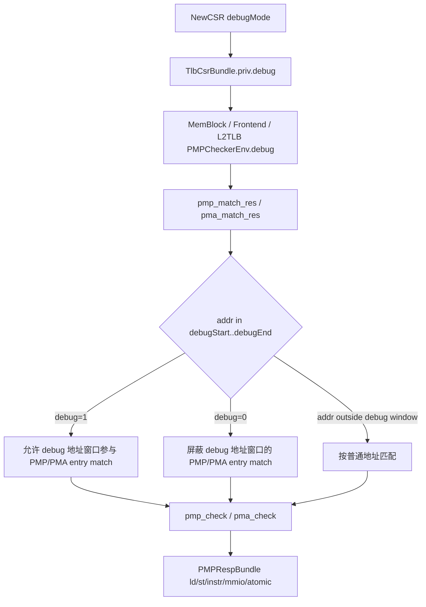

# Memory PMP/PMA 权限检查 flow

## 版本元数据

| 项目 | 内容 |
|---|---|
| RTL 版本 | V2 |
| 分支 | `mem_ut_uvm_v2` |
| 核验 commit | `0ec33be518d75ba9cbcf28bcf51118b68e8a0d96` |
| 权威源码 | `src/main/scala/xiangshan/backend/fu/PMP.scala`、`src/main/scala/xiangshan/backend/fu/PMA.scala`、`src/main/scala/xiangshan/mem/MemBlock.scala`、`src/main/scala/xiangshan/cache/mmu/L2TLB.scala`、`src/main/scala/xiangshan/frontend/Frontend.scala`、`src/main/scala/xiangshan/backend/fu/NewCSR/NewCSR.scala` |
| 最后核验日期 | `2026-07-16` |

## Flow 范围

本文记录 V2 中 TLB CSR `priv.debug` 进入 PMP/PMA 权限检查环境后的作用范围。

覆盖入口：

- 后端 CSR 输出 `io.tlb.debug := debugMode`。
- MemBlock DTLB/L2TLB、Frontend ITLB/PMP、L2TLB 的 PMP/PMA checker 环境输入。
- `PMPChecker` 中 `pmp_match_res()`、`pma_match_res()` 和最终 `PMPRespBundle`。

不覆盖：

- 页表 PTE 的 `U/R/W/X/A/D` 权限判定。
- `mxr/sum/vmxr/vsum/spvp/imode/dmode/virt` 的页权限语义。
- Debug trigger、DRET、Debug CSR 写权限等非 PMP/PMA flow。

## 主流程图



## 主流程文字伪代码

```text
NewCSR：
  debugMode 是当前 core 是否处于 debug mode 的运行时状态；
  io.tlb.debug = debugMode；

TlbCsrBundle：
  priv.debug 是 TLB CSR 下发给取指、访存和 L2TLB PMP/PMA 检查的 debug-mode bit；

MemBlock DTLB：
  对每个 DTLB PMP request 构造 PMPCheckerEnv；
  mode 使用 tlbcsr.priv.dmode；
  debug 使用 tlbcsr.priv.debug；

Frontend ITLB/PMP：
  对 ICache/IFU PMP request 构造 PMPCheckerEnv；
  mode 使用 tlbCsr.priv.imode；
  debug 使用 tlbCsr.priv.debug；

L2TLB：
  对 PTW/L2TLB PMP request 构造 PMPCheckerEnv；
  mode 固定 ModeS；
  debug 使用 csr_dup(0).priv.debug；

PMP/PMA match：
  对每个 PMP/PMA entry 计算 is_match；
  如果 addr 位于 debugStart..debugEnd：
    只有 debug=1 时该 entry 可 match；
    debug=0 时该 entry 被屏蔽；
  如果 addr 不在 debug 地址窗口：
    不受 debug bit 影响；

最终权限结果：
  PMP 根据 cfg.r/w/x 产生 ld/st/instr access-fault 类响应；
  PMA 根据 cfg.r/w/x/c/atomic 产生 ld/st/instr、mmio、atomic 属性/异常响应；
  priv.debug 不直接修改 PTE 页权限。
```

## 关键阶段

### 1. `TlbCsrBundle.priv.debug`

源码位置：`src/main/scala/xiangshan/Bundle.scala:564`

`TlbCsrBundle` 的 `priv` 子 bundle 在 V2 定义 `debug: Bool()`。该字段随 TLB CSR 下发到 MemBlock、Frontend 和 L2TLB 相关逻辑。

### 2. `NewCSR` 生成 TLB debug bit

源码位置：`src/main/scala/xiangshan/backend/fu/NewCSR/NewCSR.scala:1457`

关键逻辑：

```text
io.tlb.dmode 由 MPRV/MPRVEN/NMIE/MPP/PRVM 选择；
io.tlb.debug := debugMode；
```

`priv.debug` 是当前是否处于 debug mode 的运行时状态；它与 `priv.dmode` 不同。`dmode` 参与数据访问使用的特权级选择，`debug` 只作为 PMP/PMA match 环境中的 debug-mode bit。

### 3. MemBlock DTLB PMP/PMA 检查

源码位置：`src/main/scala/xiangshan/mem/MemBlock.scala:795`

MemBlock 对 DTLB PMP checker 调用 `apply(..., tlbcsr.priv.dmode, tlbcsr.priv.debug, pmp.io.pmp, pmp.io.pma, req)`。因此访存侧 PMP/PMA 检查同时看到数据访问 mode 和 debug-mode bit。

### 4. Frontend ITLB/PMP 检查

源码位置：`src/main/scala/xiangshan/frontend/Frontend.scala:149`

Frontend 对 ICache/IFU PMP checker 调用 `apply(..., tlbCsr.priv.imode, tlbCsr.priv.debug, pmp.io.pmp, pmp.io.pma, req)`。因此取指侧 PMP/PMA 检查使用 instruction mode 和同一个 debug-mode bit。

### 5. L2TLB PMP/PMA 检查

源码位置：`src/main/scala/xiangshan/cache/mmu/L2TLB.scala:98`

L2TLB 对 PTW/L2TLB PMP checker 调用 `apply(..., ModeS, csr_dup(0).priv.debug, pmp.io.pmp, pmp.io.pma)`。因此 L2TLB 侧 check mode 固定为 `ModeS`，但 debug 地址窗口是否可 match 仍受 `priv.debug` 控制。

### 6. PMP/PMA match 使用 debug bit

源码位置：

- `src/main/scala/xiangshan/backend/fu/PMP.scala:415`
- `src/main/scala/xiangshan/backend/fu/PMA.scala:221`

关键逻辑：

```text
is_match = entry.is_match(addr, size, lgMaxSize, last_entry) &&
           Mux(addr >= debugStart && addr <= debugEnd, debug, true)
```

含义：

- 地址不在 debug 地址窗口时，`debug` 不影响 PMP/PMA entry match。
- 地址在 debug 地址窗口时，只有 `debug=1` 才允许对应 PMP/PMA entry match。
- `debug=0` 会屏蔽 debug 地址窗口内的 PMP/PMA entry match，随后走后续 entry 或默认 entry。

### 7. 最终权限响应

源码位置：

- `src/main/scala/xiangshan/backend/fu/PMP.scala:405`
- `src/main/scala/xiangshan/backend/fu/PMA.scala:210`

`pmp_check()` 根据匹配 entry 的 `cfg.r/w/x` 生成：

```text
ld    = read/read-exec 且 !cfg.r
st    = write/amo 且 !cfg.w
instr = exec/read-exec 且 !cfg.x
```

`pma_check()` 根据匹配 entry 的 `cfg.r/w/x/c/atomic` 生成 load/store/instr 响应、`mmio` 和 `atomic` 属性。

因此 `priv.debug` 的权限影响是：改变 debug 地址窗口中的 PMP/PMA entry 是否参与匹配，间接影响最终 ld/st/instr access fault、MMIO 属性和 atomic 属性。它不直接参与页表权限的 `U/R/W/X/A/D`、`SUM/MXR` 或 guest page fault 判定。

## 状态、队列和优先级

| 状态/字段 | 生产者 | 更新条件 | 消费者 | 优先级/影响 |
|---|---|---|---|---|
| `debugMode` | NewCSR debug/trap/dret flow | 进入/退出 debug mode | `io.tlb.debug` | 作为 runtime bit 下发 |
| `TlbCsrBundle.priv.debug` | CSR TLB 输出 | 跟随 `debugMode` | MemBlock、Frontend、L2TLB PMP/PMA checker | 只影响 debug 地址窗口 PMP/PMA match |
| `PMPCheckerEnv.debug` | 各调用点 `apply()` | 每次构造 checker 环境 | `pmp_match_res()`、`pma_match_res()` | 地址在 `debugStart..debugEnd` 时参与 entry match gate |
| `PMPRespBundle.ld/st/instr/mmio/atomic` | PMP/PMA checker | request valid 后根据 match entry 生成 | IFU/DTLB/L2TLB 下游异常和属性逻辑 | 最终表现为 access fault、MMIO/atomic 属性 |

## 异常、回滚与 Flush

本文 flow 本身不产生 redirect 或 flush。`priv.debug` 只影响 PMP/PMA checker 的匹配结果；由下游 IFU/DTLB/L2TLB 将 `PMPRespBundle` 转换为 instruction/load/store access fault 或属性信息。page fault、guest page fault、redirect/replay 不是本文的直接行为。

## 关联 Agent 和 Flow

- [Memory trigger flow](memory_trigger_flow.md)：同样涉及 debug mode，但 trigger flow 使用 `debugMode` 抑制 trigger 命中；本文只记录 PMP/PMA 权限检查。
- [Memory flushPipe flow](memory_flush_pipe_flow.md)：flushPipe 与 PMP/PMA 权限无直接组合关系。

## V2/V3 差异

本次只核验 V2。已有接口分析记录 V3 `TlbCsrBundle.priv` 不再定义同名 `debug` 字段；不得把 V2 的 `priv.debug` 语义直接套用到 V3。

## 源码证据

- `src/main/scala/xiangshan/Bundle.scala:564`：V2 `TlbCsrBundle.priv.debug` 字段定义。
- `src/main/scala/xiangshan/backend/fu/NewCSR/NewCSR.scala:1457`：`io.tlb.debug := debugMode`。
- `src/main/scala/xiangshan/mem/MemBlock.scala:795`：DTLB PMP/PMA checker 使用 `tlbcsr.priv.dmode` 和 `tlbcsr.priv.debug`。
- `src/main/scala/xiangshan/frontend/Frontend.scala:149`：Frontend PMP/PMA checker 使用 `tlbCsr.priv.imode` 和 `tlbCsr.priv.debug`。
- `src/main/scala/xiangshan/cache/mmu/L2TLB.scala:98`：L2TLB PMP/PMA checker 使用 `ModeS` 和 `csr_dup(0).priv.debug`。
- `src/main/scala/xiangshan/backend/fu/PMP.scala:437`：PMP entry match 对 debug 地址窗口使用 `debug` gate。
- `src/main/scala/xiangshan/backend/fu/PMA.scala:241`：PMA entry match 对 debug 地址窗口使用 `debug` gate。
- `src/main/scala/xiangshan/backend/fu/PMP.scala:405`：PMP `cfg.r/w/x` 转换为 ld/st/instr 响应。
- `src/main/scala/xiangshan/backend/fu/PMA.scala:210`：PMA `cfg.r/w/x/c/atomic` 转换为响应和属性。

## 知识修订记录

| 日期 | commit | 旧结论 | 新结论 | 修订原因 | 影响范围 |
|---|---|---|---|---|---|
| 2026-07-16 | `0ec33be518d75ba9cbcf28bcf51118b68e8a0d96` | 首次建立，无旧结论修订 | `priv.debug` 影响 debug 地址窗口的 PMP/PMA entry match，间接影响 access fault/MMIO/atomic 属性；不直接影响 PTE 页权限 | 用户询问 `tlbCsr_priv_debug/priv_debug` 会影响哪些权限判断 | V2 CSR/control runtime plan、后续 debug-mode PMP/PMA 建模 |

## 待确认项

- 未核验 V3 对应替代字段；本文不声明 V3 行为。
