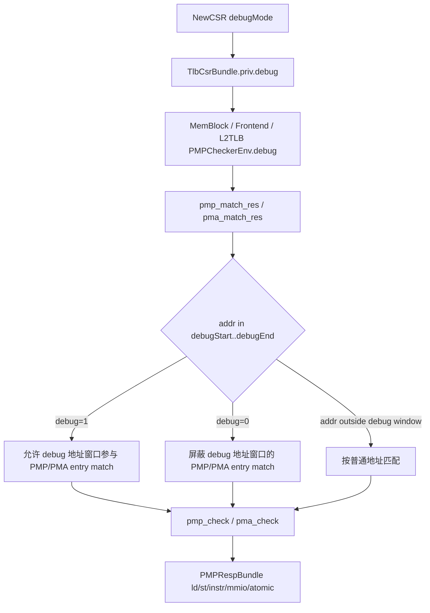
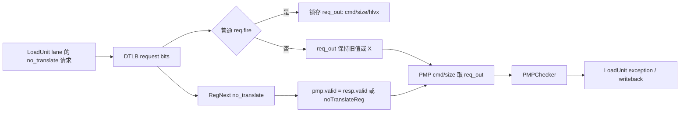

# Memory PMP/PMA 权限检查 flow

## 版本元数据

| 项目 | 内容 |
|---|---|
| RTL 版本 | V2 |
| 分支 | `codex/pbmt-rm-l2tlb-20260902`（V2 基线：`mem_ut_uvm_v2`） |
| 核验 commit | `afb16d65558c528cfb7b54c0015129753fa0de34` |
| 权威源码 | `src/main/scala/xiangshan/backend/fu/PMP.scala`、`src/main/scala/xiangshan/backend/fu/PMA.scala`、`src/main/scala/xiangshan/mem/MemBlock.scala`、`src/main/scala/xiangshan/cache/mmu/TLB.scala`、`src/main/scala/xiangshan/cache/mmu/L2TLB.scala`、`src/main/scala/xiangshan/frontend/Frontend.scala`、`src/main/scala/xiangshan/backend/fu/NewCSR/NewCSR.scala` |
| 最后核验日期 | `2026-09-02` |

## Flow 范围

本文记录 V2 中进入 PMP/PMA 权限检查环境的两类行为：TLB CSR `priv.debug` 的权限作用范围，以及 DTLB `no_translate` 请求进入 PMP 路径时的 payload 生命周期。

覆盖入口：

- 后端 CSR 输出 `io.tlb.debug := debugMode`。
- MemBlock DTLB/L2TLB、Frontend ITLB/PMP、L2TLB 的 PMP/PMA checker 环境输入。
- `PMPChecker` 中 `pmp_match_res()`、`pma_match_res()` 和最终 `PMPRespBundle`。
- DTLB `no_translate` 请求从 request payload、`req_out`、PMP request 到 LoadUnit writeback 的有效位与命令字段时序。

不覆盖：

- 页表 PTE 的 `U/R/W/X/A/D` 权限判定。
- `mxr/sum/vmxr/vsum/spvp/imode/dmode/virt` 的页权限语义。
- Debug trigger、DRET、Debug CSR 写权限等非 PMP/PMA flow。

## 主流程图



## 主流程文字伪代码

```text
NewCSR：
  debugMode 是当前 core 是否处于 debug mode 的运行时状态；
  io.tlb.debug = debugMode；

TlbCsrBundle：
  priv.debug 是 TLB CSR 下发给取指、访存和 L2TLB PMP/PMA 检查的 debug-mode bit；

MemBlock DTLB：
  对每个 DTLB PMP request 构造 PMPCheckerEnv；
  mode 使用 tlbcsr.priv.dmode；
  debug 使用 tlbcsr.priv.debug；

Frontend ITLB/PMP：
  对 ICache/IFU PMP request 构造 PMPCheckerEnv；
  mode 使用 tlbCsr.priv.imode；
  debug 使用 tlbCsr.priv.debug；

L2TLB：
  对 PTW/L2TLB PMP request 构造 PMPCheckerEnv；
  mode 固定 ModeS；
  debug 使用 csr_dup(0).priv.debug；

PMP/PMA match：
  对每个 PMP/PMA entry 计算 is_match；
  如果 addr 位于 debugStart..debugEnd：
    只有 debug=1 时该 entry 可 match；
    debug=0 时该 entry 被屏蔽；
  如果 addr 不在 debug 地址窗口：
    不受 debug bit 影响；

最终权限结果：
  PMP 根据 cfg.r/w/x 产生 ld/st/instr access-fault 类响应；
  PMA 根据 cfg.r/w/x/c/atomic 产生 ld/st/instr、mmio、atomic 属性/异常响应；
  priv.debug 不直接修改 PTE 页权限。
```

## 关键阶段

### 1. `TlbCsrBundle.priv.debug`

源码位置：`src/main/scala/xiangshan/Bundle.scala:564`

`TlbCsrBundle` 的 `priv` 子 bundle 在 V2 定义 `debug: Bool()`。该字段随 TLB CSR 下发到 MemBlock、Frontend 和 L2TLB 相关逻辑。

### 2. `NewCSR` 生成 TLB debug bit

源码位置：`src/main/scala/xiangshan/backend/fu/NewCSR/NewCSR.scala:1457`

关键逻辑：

```text
io.tlb.dmode 由 MPRV/MPRVEN/NMIE/MPP/PRVM 选择；
io.tlb.debug := debugMode；
```

`priv.debug` 是当前是否处于 debug mode 的运行时状态；它与 `priv.dmode` 不同。`dmode` 参与数据访问使用的特权级选择，`debug` 只作为 PMP/PMA match 环境中的 debug-mode bit。

### 3. MemBlock DTLB PMP/PMA 检查

源码位置：`src/main/scala/xiangshan/mem/MemBlock.scala:795`

MemBlock 对 DTLB PMP checker 调用 `apply(..., tlbcsr.priv.dmode, tlbcsr.priv.debug, pmp.io.pmp, pmp.io.pma, req)`。因此访存侧 PMP/PMA 检查同时看到数据访问 mode 和 debug-mode bit。

### 4. Frontend ITLB/PMP 检查

源码位置：`src/main/scala/xiangshan/frontend/Frontend.scala:149`

Frontend 对 ICache/IFU PMP checker 调用 `apply(..., tlbCsr.priv.imode, tlbCsr.priv.debug, pmp.io.pmp, pmp.io.pma, req)`。因此取指侧 PMP/PMA 检查使用 instruction mode 和同一个 debug-mode bit。

### 5. L2TLB PMP/PMA 检查

源码位置：`src/main/scala/xiangshan/cache/mmu/L2TLB.scala:98`

L2TLB 对 PTW/L2TLB PMP checker 调用 `apply(..., ModeS, csr_dup(0).priv.debug, pmp.io.pmp, pmp.io.pma)`。因此 L2TLB 侧 check mode 固定为 `ModeS`，但 debug 地址窗口是否可 match 仍受 `priv.debug` 控制。

### 6. PMP/PMA match 使用 debug bit

源码位置：

- `src/main/scala/xiangshan/backend/fu/PMP.scala:415`
- `src/main/scala/xiangshan/backend/fu/PMA.scala:221`

关键逻辑：

```text
is_match = entry.is_match(addr, size, lgMaxSize, last_entry) &&
           Mux(addr >= debugStart && addr <= debugEnd, debug, true)
```

含义：

- 地址不在 debug 地址窗口时，`debug` 不影响 PMP/PMA entry match。
- 地址在 debug 地址窗口时，只有 `debug=1` 才允许对应 PMP/PMA entry match。
- `debug=0` 会屏蔽 debug 地址窗口内的 PMP/PMA entry match，随后走后续 entry 或默认 entry。

### 7. 最终权限响应

源码位置：

- `src/main/scala/xiangshan/backend/fu/PMP.scala:405`
- `src/main/scala/xiangshan/backend/fu/PMA.scala:210`

`pmp_check()` 根据匹配 entry 的 `cfg.r/w/x` 生成：

```text
ld    = read/read-exec 且 !cfg.r
st    = write/amo 且 !cfg.w
instr = exec/read-exec 且 !cfg.x
```

`pma_check()` 根据匹配 entry 的 `cfg.r/w/x/c/atomic` 生成 load/store/instr 响应、`mmio` 和 `atomic` 属性。

因此 `priv.debug` 的权限影响是：改变 debug 地址窗口中的 PMP/PMA entry 是否参与匹配，间接影响最终 ld/st/instr access fault、MMIO 属性和 atomic 属性。它不直接参与页表权限的 `U/R/W/X/A/D`、`SUM/MXR` 或 guest page fault 判定。

## 状态、队列和优先级

| 状态/字段 | 生产者 | 更新条件 | 消费者 | 优先级/影响 |
|---|---|---|---|---|
| `debugMode` | NewCSR debug/trap/dret flow | 进入/退出 debug mode | `io.tlb.debug` | 作为 runtime bit 下发 |
| `TlbCsrBundle.priv.debug` | CSR TLB 输出 | 跟随 `debugMode` | MemBlock、Frontend、L2TLB PMP/PMA checker | 只影响 debug 地址窗口 PMP/PMA match |
| `PMPCheckerEnv.debug` | 各调用点 `apply()` | 每次构造 checker 环境 | `pmp_match_res()`、`pma_match_res()` | 地址在 `debugStart..debugEnd` 时参与 entry match gate |
| `PMPRespBundle.ld/st/instr/mmio/atomic` | PMP/PMA checker | request valid 后根据 match entry 生成 | IFU/DTLB/L2TLB 下游异常和属性逻辑 | 最终表现为 access fault、MMIO/atomic 属性 |

## 异常、回滚与 Flush

本文 flow 本身不产生 redirect 或 flush。`priv.debug` 只影响 PMP/PMA checker 的匹配结果；由下游 IFU/DTLB/L2TLB 将 `PMPRespBundle` 转换为 instruction/load/store access fault 或属性信息。page fault、guest page fault、redirect/replay 不是本文的直接行为。

## 8. DTLB `no_translate` 的 PMP payload 生命周期缺陷

### 8.1 问题结论

V2 DTLB 的 `no_translate` 路径可以在普通 `req.fire` 未发生时单独使 PMP request 有效，但 PMP 消费的 `cmd`、`size` 和 `hlvx` 来自仅由普通 `req.fire` 锁存的 `req_out`。因此这三类字段不一定属于使当前 PMP request 有效的同一笔请求：此前从未 fire 时为未初始化 `X`，此前 fire 过时也可能是旧请求的陈旧值。

这不是 L2TLB responder、PBMT response overlay、RM 或 UVM driver 造成的 X。PBMT dynamic smoke 合法返回 NC 属性后，LoadUnit1 走到现有的 `no_translate`/PMP 分支，暴露了该 DTLB 内部 payload 生命周期不一致。

### 8.2 源码流程



按源码顺序的文字伪代码：

```text
req_out：
  仅当 req.fire 时锁存 request payload；

noTranslateReg：
  每拍从 req.bits.no_translate 延迟一拍，不依赖 req.fire；

pmp_check：
  pmp.valid = resp.valid || noTranslateReg；
  pmp.addr 在 noTranslateReg=1 时取当前 req.bits.pmp_addr；
  pmp.size、pmp.cmd 分别取 req_out.size、req_out.hlvx/cmd；

结果：
  noTranslateReg 可使 PMP 接收一笔有效请求，
  但该请求的 command/size/hlvx 没有与 no-translate 事件同拍冻结。
```

### 8.3 本次波形证据

触发用例：`basicTest` + `memblock_l2tlb_pbmt_response_fault_vseq` + `tc_l2tlb_pbmt_response_fault.cfg`。

波形文件：

```text
mem_ut/ver/ut/memblock/sim/pbmt_dynamic/wave/tc=basicTest_ts=memblock_l2tlb_pbmt_response_fault_vseq_cfg=tc_l2tlb_pbmt_response_fault_seed=666666_rtl_pbmt_range_hit_fixed_cfg.fsdb
```

| 时间 | 波形观察 | 结论 |
|---|---|---|
| `805.3ns` | `LoadUnit1.io_tlb_req_valid=0`，但 `io_tlb_req_bits_no_translate=1`，输入 `cmd=000`。 | no-translate 语义已存在，但没有普通 TLB request fire 来初始化 `req_out_1`。 |
| `810.3ns` | `noTranslateReg_1=1`、`io_pmp_1_valid=1`、PMP 地址为 `0x00003c201000`；同时 `req_out_1_cmd=XXX`、`io_pmp_1_bits_cmd=XXX`、`PMPChecker_12.cmd=XXX`。 | 有效 PMP request 使用了未初始化的命令字段。 |
| `820.3ns` | `LoadUnit1` 的异常/安全 writeback 组合路径开始被 PMP response 的 X 污染。 | X 已离开 DTLB/PMP 边界。 |
| `825.3ns` | `io_mem_to_ooo_writebackLda_1_valid=X`，`INT_WB_MON` 报 `LDA1 valid is X/Z`。 | 监视器首先观测到的 fatal 是下游症状，不是根因。 |

X 传播路径：

```text
noTranslateReg_1=1 + req_out_1_cmd=X
  -> DTLB io_pmp_1_valid=1 / io_pmp_1_bits_cmd=X
  -> PMPChecker_12.cmd / resp_ld / resp_st
  -> LoadUnit1 io_pmp_ld / io_pmp_st
  -> LoadUnit1 exception 与 safe-writeback 路径
  -> io_mem_to_ooo_writebackLda_1_valid=X
  -> INT_WB_MON fatal
```

### 8.4 源码与生成 RTL 证据

- `src/main/scala/xiangshan/cache/mmu/TLB.scala:75-82`：`req_out(i)` 只在 `req(i).fire` 时锁存。
- `src/main/scala/xiangshan/cache/mmu/TLB.scala:277-281`：`noTranslateReg` 由 `RegNext(req(i).bits.no_translate)` 产生，PMP 的 `cmd`/`size` 仍读取 `req_out`。
- `src/main/scala/xiangshan/cache/mmu/TLB.scala:429-434`：`pmp.valid := resp.valid || noTranslate`，说明 no-translate 可单独发起 PMP 检查。
- `build/rtl/TLBNonBlock.sv:3244-3255`：lane1 `req_out_1_cmd` 的锁存条件是 `io_requestor_1_req_valid`。
- `build/rtl/TLBNonBlock.sv:3609`、`4661-4666`：`noTranslateReg_1` 独立锁存并使 `io_pmp_1_valid` 有效，但 `io_pmp_1_bits_cmd` 取 `req_out_1_cmd`。
- `build/rtl/PMPChecker_12.sv:1922`：有效 PMP request 将 `io_req_bits_cmd` 写入内部 `cmd` 寄存器，故 X 会继续传播。

### 8.5 RTL 修复方向（未在本任务修改）

1. 定义 no-translate 请求的唯一有效事件；若该事件不是普通 `req.fire`，则必须在该事件同拍冻结 PMP 所需的完整 payload，至少包含 `cmd`、`size`、`hlvx` 和 `pmp_addr`。
2. `noTranslateReg`、PMP `valid` 与被消费的 payload 必须来自同一笔冻结请求；不能让 `valid` 由 idle request bits 推进、payload 却读取上一次普通 TLB request 的寄存器。
3. 不应简单关闭 no-translate 的 PMP 检查。该检查是 NC 请求的合法权限检查路径；修复目标是消除 payload 脱节，而非绕过 PMP。

本任务不改 RTL。由于该缺陷已由独立复核确认，PBMT/RM 两项测试框架方案保持实现完成但不进入 `do`，并停止后续 10,000 笔真实 DUT 验收。

## 关联 Agent 和 Flow

- [Memory trigger flow](memory_trigger_flow.md)：同样涉及 debug mode，但 trigger flow 使用 `debugMode` 抑制 trigger 命中；本文只记录 PMP/PMA 权限检查。
- [Memory flushPipe flow](memory_flush_pipe_flow.md)：flushPipe 与 PMP/PMA 权限无直接组合关系。

## V2/V3 差异

本次只核验 V2。已有接口分析记录 V3 `TlbCsrBundle.priv` 不再定义同名 `debug` 字段；不得把 V2 的 `priv.debug` 语义直接套用到 V3。

## 源码证据

- `src/main/scala/xiangshan/Bundle.scala:564`：V2 `TlbCsrBundle.priv.debug` 字段定义。
- `src/main/scala/xiangshan/backend/fu/NewCSR/NewCSR.scala:1457`：`io.tlb.debug := debugMode`。
- `src/main/scala/xiangshan/mem/MemBlock.scala:795`：DTLB PMP/PMA checker 使用 `tlbcsr.priv.dmode` 和 `tlbcsr.priv.debug`。
- `src/main/scala/xiangshan/frontend/Frontend.scala:149`：Frontend PMP/PMA checker 使用 `tlbCsr.priv.imode` 和 `tlbCsr.priv.debug`。
- `src/main/scala/xiangshan/cache/mmu/L2TLB.scala:98`：L2TLB PMP/PMA checker 使用 `ModeS` 和 `csr_dup(0).priv.debug`。
- `src/main/scala/xiangshan/backend/fu/PMP.scala:437`：PMP entry match 对 debug 地址窗口使用 `debug` gate。
- `src/main/scala/xiangshan/backend/fu/PMA.scala:241`：PMA entry match 对 debug 地址窗口使用 `debug` gate。
- `src/main/scala/xiangshan/backend/fu/PMP.scala:405`：PMP `cfg.r/w/x` 转换为 ld/st/instr 响应。
- `src/main/scala/xiangshan/backend/fu/PMA.scala:210`：PMA `cfg.r/w/x/c/atomic` 转换为响应和属性。
- `src/main/scala/xiangshan/cache/mmu/TLB.scala:75-82`、`277-281`、`429-434`：DTLB `req_out`、`noTranslateReg` 与 PMP request 的生命周期关系。
- `build/rtl/TLBNonBlock.sv:3244-3255`、`3609`、`4661-4666`：lane1 的生成 RTL 复现 `req_out_1` 只按普通 request 锁存、PMP valid 却可由 no-translate 独立置高。
- `build/rtl/PMPChecker_12.sv:1922`：PMP command 的寄存与 X 传播证据。

## 知识修订记录

| 日期 | commit | 旧结论 | 新结论 | 修订原因 | 影响范围 |
|---|---|---|---|---|---|
| 2026-07-16 | `0ec33be518d75ba9cbcf28bcf51118b68e8a0d96` | 首次建立，无旧结论修订 | `priv.debug` 影响 debug 地址窗口的 PMP/PMA entry match，间接影响 access fault/MMIO/atomic 属性；不直接影响 PTE 页权限 | 用户询问 `tlbCsr_priv_debug/priv_debug` 会影响哪些权限判断 | V2 CSR/control runtime plan、后续 debug-mode PMP/PMA 建模 |
| 2026-09-02 | `afb16d65558c528cfb7b54c0015129753fa0de34` | 本文只覆盖 `priv.debug` 对 PMP/PMA entry match 的影响 | DTLB no-translate 可独立发起 PMP request，但 `cmd/size/hlvx` 未与该事件同源冻结，造成 X 或陈旧 payload | PBMT dynamic real-DUT smoke 在 LoadUnit1 的 NC/no-translate 路径观测到 X；独立 RTL 复核确认 | V2 DTLB/PMP/LoadUnit NC 路径；PBMT/RM real-DUT 联调暂时阻塞 |

## 待确认项

- 未核验 V3 对应替代字段；本文不声明 V3 行为。
- 未对 V3 `no_translate` 请求生命周期作出结论；本次证据仅适用于 V2。
