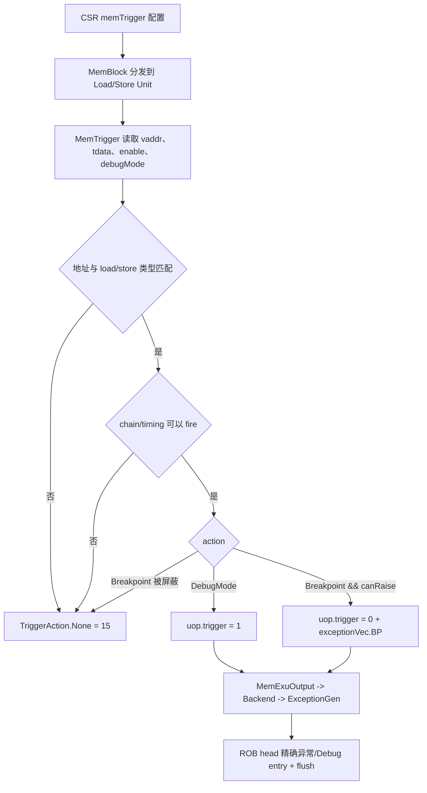

# V2 Memory Trigger Flow

## 版本元数据

| 项目 | 内容 |
|---|---|
| RTL 版本 | V2 |
| 分支 | `mem_ut_uvm_v2` |
| 核验 commit | `5b35ddd8d774b5f11d61333dfbe7638a3f362fad` |
| 设计基线 | `2acbf327cf7fb514593acc00d4c41117ec499e08`，见 V2 `branch_policy.md` |
| 权威源码 | `src/main/scala/xiangshan`；DUT 生成基线见 V2 `memblock_rtl_profile.md` |
| 最后核验日期 | `2026-07-11` |

## Flow 范围

本文解释 memory trigger 配置从 CSR 进入 MemBlock，在 Load/Store 地址阶段匹配，形成 `DynInst.trigger`，再经写回和 ROB 产生 breakpoint exception 或 Debug Mode 的 flow。

## 核心结论

`trigger` 不是 Bool，不能用“整体置高”描述。它是 4-bit `TriggerAction`：

| 编码 | 动作 |
|---:|---|
| `0` | `BreakpointExp` |
| `1` | `DebugMode` |
| `15` | `None` |

`FuConfig.trigger = true` 仅决定执行单元是否具有可选 trigger 输出字段。真正动作由 MemBlock 根据 CSR 下发配置和 Load/Store S1 虚拟地址动态生成。

## 主流程图



## 主流程文字伪代码

```text
1. CSR 模块把 memory trigger 的 tdata、enable、debugMode 和 triggerCanRaiseBpExp 分发到 MemBlock。
2. LoadUnit/StoreUnit 在 S1 使用当前访问虚拟地址调用 MemTrigger：
   Load 只检查 load-enabled trigger，并排除 prefetch；
   Store 只检查 store-enabled trigger；CBO 按 cache line 地址比较。
3. 每个 trigger entry 还必须满足 select==0、当前不在 debug mode、地址 match、chain/timing 合法。
4. 有 DebugMode action 可 fire 时输出 TriggerAction.DebugMode；
   否则有 Breakpoint action 且 triggerCanRaiseBpExp 时输出 BreakpointExp；
   否则输出 None。
5. Load/Store 把 action 写入 uop.trigger；BreakpointExp 同时置 exceptionVec(breakPoint)。
6. MemBlock writeback 把 uop.trigger 送入后端 ExceptionGen；
   ROB 把 breakpoint exception 或 DebugMode action 当作精确异常，在该指令成为最老指令时处理并清年轻流水。
```

## 1. CSR 配置与地址匹配

`MemTrigger.getTriggerHitVec()` 对每个 entry 检查：

- `tdata.select` 为 false。
- 当前不在 Debug Mode。
- Load prefetch 为 false。
- `tEnableVec(i)` 有效。
- Load 使用 `tdata.load`，Store 使用 `tdata.store`。
- `TriggerCmp(vaddr, tdata2, matchType, enable)` 命中。

Vector unit-stride 使用 high/low mask 匹配；CBO Store 使用 cache-line 地址粒度比较。命中后还要通过 `TriggerCheckCanFire` 的 chain/timing 约束。

动作优先级为 DebugMode 高于 BreakpointExp。BreakpointExp 还受 `triggerCanRaiseBpExp` 限制；该信号由当前 privilege/delegation/interrupt-enable 状态计算，防止特定中断关闭条件下抛 breakpoint exception。

## 2. Load/Store S1 生成动作

LoadUnit：

```scala
loadTrigger.io.fromLoadStore.vaddr := s1_vaddr
s1_out.uop.trigger := s1_trigger_action
s1_out.uop.exceptionVec(breakPoint) := TriggerAction.isExp(s1_trigger_action)
```

StoreUnit：

```scala
storeTrigger.io.fromLoadStore.vaddr := s1_in.vaddr
s1_out.uop.trigger := s1_trigger_action
s1_out.uop.exceptionVec(breakPoint) := TriggerAction.isExp(s1_trigger_action)
```

因此 memory trigger 是 MemBlock 根据执行期地址重新计算的，不是 Backend issue-to-MemBlock 直接复制 frontend trigger 的结果。Backend 构造 `MemExuInput.uop` 时先清零整个 uop，并未给 `uop.trigger` 单独赋值；Load/Store S1 随后覆盖为 memory trigger action。

## 3. 写回和 ROB 消费

MemBlock 写回连接执行：

```scala
sink.bits.trigger.foreach(_ := source.bits.uop.trigger)
```

ExceptionGen 捕获 action。ROB 判断异常时包含：

```scala
exceptionVec.asUInt.orR || singleStep || TriggerAction.isDmode(trigger)
```

所以：

- `BreakpointExp=0` 通过同步置位的 `exceptionVec(breakPoint)` 进入断点异常。
- `DebugMode=1` 即使不依赖普通 exceptionVec，也被 ROB 视为异常条件并进入 Debug Mode。
- `None=15` 不触发异常。

处理发生在 ROB 头，从而保持精确异常语义；MemBlock 地址一命中时不会直接异步清除全核流水。

## 状态、字段和优先级

| 字段/条件 | 生产者 | 有效条件 | 抑制条件 | 消费者 | 优先级 |
|---|---|---|---|---|---|
| `tEnableVec/tdataVec` | CSR Debug 模块 | CSR trigger 配置有效 | entry disabled | MemTrigger | 每 entry 独立 |
| trigger address hit | MemTrigger | 类型、地址、select、enable 匹配 | debugMode；Load prefetch | `TriggerCheckCanFire` | chain/timing 后生效 |
| `DebugMode` action | BaseTrigger | 可 fire entry action=DebugMode | 无匹配 | Load/Store uop | 高于 BreakpointExp |
| `BreakpointExp` action | BaseTrigger | 可 fire且 `triggerCanRaiseBpExp` | privilege/interrupt 条件屏蔽 | exceptionVec/ROB | 低于 DebugMode |
| `None` | BaseTrigger | 无可执行动作 | 被有效动作覆盖 | 后端 | 默认值 15 |

## 关联文档

- [memory flush pipe flow](memory_flush_pipe_flow.md)：trigger 异常与 `flushPipe` 在 ROB 的不同处理方式。
- [V2 RTL flow 索引](../index.md)。
- `AI_DOC/analysis/interface/v2/mem_ut_v2_agent_interface_signal_matrix_20260709.md`：V2 顶层 CSR trigger 和 writeback trigger 信号矩阵；该文件当前有用户未提交修改，本轮未编辑。

## V2/V3 差异

本文只核验 V2。V3 是否保持相同 action 编码、privilege gating 和 pipeline stage，需要在 V3 分支/profile 下独立追踪。

## 源码证据

- `src/main/scala/xiangshan/Bundle.scala:761-772`：`TriggerAction` 编码。
- `src/main/scala/xiangshan/backend/fu/FuConfig.scala:415-445`：LDU/STA capability 配置。
- `src/main/scala/xiangshan/backend/fu/NewCSR/Debug.scala:222-273`：hit、chain/timing、action 生成和优先级。
- `src/main/scala/xiangshan/backend/fu/NewCSR/Debug.scala:286-315`：Load/Store/CBO 地址匹配条件。
- `src/main/scala/xiangshan/backend/fu/NewCSR/NewCSR.scala:1181-1183`：`triggerCanRaiseBpExp` 条件。
- `src/main/scala/xiangshan/mem/MemBlock.scala:827,1039,1176,1266`：CSR trigger 分发到 memory units。
- `src/main/scala/xiangshan/mem/pipeline/LoadUnit.scala:1132-1152`：Load S1 action 和 breakpoint exception。
- `src/main/scala/xiangshan/mem/pipeline/StoreUnit.scala:341-408`：Store S1 action 和 breakpoint exception。
- `src/main/scala/xiangshan/backend/Backend.scala:671-703`：MemBlock trigger 写回后端。
- `src/main/scala/xiangshan/backend/rob/Rob.scala:578-609`：ROB 精确异常判断。

## 知识修订记录

| 日期 | commit | 旧结论 | 新结论 | 修订原因 | 影响范围 |
|---|---|---|---|---|---|
| 2026-07-11 | `5b35ddd8d774b5f11d61333dfbe7638a3f362fad` | 首次建立，无同版本长期 flow 旧结论 | 建立 action 编码、地址匹配、写回和 ROB 消费关系 | 用户要求将本轮源码分析沉淀为 V2 知识 | V2 CSR/MemBlock/Load/Store/ROB |

## 待确认项

- `StoreQueue` 在锁存 uncache uop 时使用 `uncacheUop.trigger := 0.U.asTypeOf(TriggerAction())`，而当前编码中 0 表示 `BreakpointExp`、15 才表示 `None`。本轮问题聚焦正常 memory trigger 生成，未证明该覆盖在所有 MMIO/CBO 写回路径上的最终语义；后续应专项追踪该字段是否被 exception gating、写回选择或其他逻辑消解。
- 本轮未核验 V3 对应实现。
