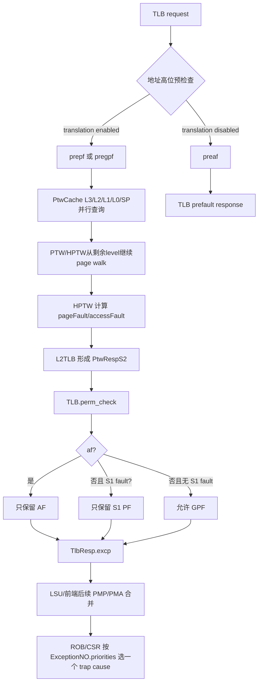

# V2 MMU GPF/AF 异常优先级与并发边界 Flow

## 版本元数据

| 项目 | 内容 |
|---|---|
| RTL 版本 | V2 |
| 分支 | `mem_ut_uvm_v2` |
| 核验 commit | `f3bdd04b3763147e714a786d078e0cb90460a31d` |
| 权威源码 | `src/main/scala/xiangshan/cache/mmu/{MMUBundle.scala,MMUConst.scala,PageTableCache.scala,PageTableWalker.scala,L2TLB.scala,TLB.scala}`；`src/main/scala/xiangshan/mem/pipeline/{LoadUnit.scala,StoreUnit.scala,HybridUnit.scala}`；`src/main/scala/xiangshan/frontend/FrontendBundle.scala`；`src/main/scala/xiangshan/backend/fu/CSR.scala` |
| 最后核验日期 | `2026-07-29` |

## Flow 范围

本文追踪一个地址翻译请求从 HPTW（G-stage）/PTW（S1-stage）到 L2TLB、L1 TLB
和 LSU/前端异常编码的路径，重点区分：

1. MMU 内部的 `gpf/gaf`、`excp.gpf/excp.af` 是否可以同拍为 1；
2. 下游物理 PMP/PMA 检查再次写入 `uop.exceptionVec` 后，原始异常向量是否可能同时保留 GPF 与 AF；
3. 最终 ROB/CSR 选择的架构 trap cause；
4. PTW/HPTW `level` 的递减方向、Sv39/Sv48 初始层级和 page-table cache 命中后的起始层级；
5. `PtwCache` L3/L2/L1/L0/SP 的存储结构、cacheline/PTE 回填粒度、tag/sector 切分、翻译上下文、
   回填/替换、失效以及命中后的 walker 起点。
6. L2TLB response 的 `s1.pf/s1.af/s2.gpf/s2.gaf` 独立来源、最终异常收敛，以及每个 stage 的
   `level` 对 `PPN` 补齐和两阶段地址合成的直接作用。

入口是 TLB request，出口是 `TlbResp.excp` 或写回 ROB 的异常向量。本文只核验 V2，
不把 V3 的 MMU 行为套用到 V2。

## 核心结论

1. 对同一个 HPTW 请求，`s2.gpf`（guest page fault）和 `s2.gaf`（G-stage access fault）不会同时为 1。
   `HPTW` 明确采用 AF 优先：`gpf = pageFault && !accessFault`，`gaf = accessFault ||
   (ppn_af && !pageFault)`。
2. 对同一个 L1 TLB request/response（每个 `excp(d)` duplicate），`excp.gpf` 和 `excp.af` 也不会同时为 1。
   `perm_check()` 对最终 GPF 加 `!af`，并且 stage-1 page fault/A-D update 通过 `hasPf` 再屏蔽 GPF。
3. `PtwRespS2` 的 S1/S2 字段在结构上是分开的，因此内部 bundle 可能看起来同时携带 S1 fault 与 S2
   fault；这不是最终异常编码。L1 TLB 的 `perm_check()` 会按 AF > S1 PF > GPF 的顺序收敛。
4. 不同 TLB port 的请求可以在同一拍分别出现一个 GPF 和一个 AF；不同指令也可以在不同周期分别出现。
   这不违反“单个请求互斥”的约束。
5. 访存流水线在 TLB 之后还会把独立的物理 `pmp.ld/st`、MMIO、ECC/TileLink error 等 OR 到
   `uop.exceptionVec(load/storeAccessFault)`。因此在这些下游 raw vector 上，若已有 TLB GPF 且同拍
   物理 PMP 结果为 1，代码结构允许 GPF 与 AF 两个 bit 同时保留；这不是 MMU translation response 的
   合法双 fault。ROB/CSR 最终只选择一个 cause，GPF 的优先级高于同类 AF。
6. `level` 表示当前页表层级而不是已经执行的翻译次数，数值越大越靠近根页表。无 page-table cache
   命中时，Sv48/Sv48x4 从 `level=3` 开始，Sv39/Sv39x4 从 `level=2` 开始，随后向 `level=0`
   递减；`level=0` 是最低层 L0，而不是通常意义上的第一次翻译。上层 cache 命中时，首个实际 memory
   walk 可以直接从更低 level 开始。
7. `PtwCache` L3 只在 `EnableSv48` 时存在，缓存的是 level-3 **非叶** PTE 指向下一级页表的 PPN，
   不是普通数据 L3 cache，也不是 512 GiB 叶 PTE 的最终 translation cache。当前 V2
   `KunminghuV2Config` 使用默认 16-entry、全相联寄存器阵列和 PLRU；level-3 叶 PTE 进入独立的
   `sp` super-page cache。L3 命中只让 PTW/HPTW 跳过根层并从 `level=2` 继续。
8. 每次实际发出的页表 memory request 都是 64-byte 对齐的 TileLink Get，并接收完整 cacheline；但 PtwCache
   的内部写入粒度随 level 改变：L1/L0 保存 8 个 64-bit PTE 的 sector，L3/L2/SP 只保存当前地址
   选中的一个 PTE。因而“memory refill 是 cacheline”和“某一级只 refill 一个 PTE”可以同时成立。
9. L1/L0 的 `(tag, set, sectorIdx)` 共同表示 cacheline sector，`sectorIdx` 是当前 VPN index 的低 3 bit；
   L3/L2/SP 不做 sector 合并，tag 仍包含当前 PTE index，不应解释为 cacheline-aligned physical tag。
   所有 PtwCache tag 都来自 VPN/GVPN，而不是页表物理地址。
10. 非虚拟化 S-stage、VS-stage 和 G-stage 复用同一组 PtwCache 阵列与 level/refill 写口，但不是同一
    cache namespace：分别用 `noS2xlate`、折叠后的 `onlyStage1`、`onlyStage2` 标记，并采用不同的
    ASID/VMID、PBMTE、PF/GPF/AF 过滤和 PTE.G 处理。
11. `s1.pf/s1.af` 与 `s2.gpf/s2.gaf` 是两个翻译阶段各自的原始结果，而非四选一编码。S1 普通 PTW
    路径中 `resp_pf = pte_valid && pageFault`，`resp_af = (accessFault || ppn_af)` 且会被 S1 PF 和
    guest fault 屏蔽；HPTW 则保证同一笔 S2 result 的 `gpf/gaf` 互斥，且 GAF 优先。跨 S1/S2 没有由
    bundle 类型强加的全局互斥；实际 all-stage walk 会在多个位置短路/过滤，最终仍由 L1 TLB 收敛。
12. `level` 不修改 response 中原样携带的 PTE PPN；它定义该 PPN 是何种粒度的 mapping，并控制要从
    输入 VPN 补回多少低位。`allStage` 先由 S1 的 `level` 合成 GPA PPN，再以此为 GVPN、按 S2 的
    `level` 合成最终 HPA PPN。普通无异常 leaf 的缓存/匹配粒度取 `min(s1.level,s2.level)`；异常回填
    还按 S1 fake/non-leaf/leaf 情况保留专门 level，不能机械地总取最小值。
13. 上述“原样携带”有两个必须区分的例外：`HptwResp.apply()` 在 `s2.gaf=1` 时以全零 PTE 生成 S2
    payload，因此 S2 PPN/permission/PBMT 不可使用；启用 bitmap check 时 L2TLB 会预先补齐相应 PPN
    并把被规范化的 stage `level` 置为 0。二者都不表示正常 translation PPN。

## 主流程图



## 主流程文字伪代码

```text
1. 请求先在 TLB.scala 做高位合法性检查：翻译开启时只能得到 prepf 或 pregpf，翻译关闭时才得到
   preaf；这些信号在同一个 request 上互斥。
2. 若进入页表遍历，PtwCache 先并行查询 L3/L2/L1/L0/SP。L3 命中返回缓存的 level-3 非叶 PTE
   PPN，PTW/HPTW 据此从 level=2 继续；未命中才从当前 mode 的根层开始。非叶 PTE 使 level 向 0
   递减。随后 HPTW 区分 G-stage PTE pageFault、PMP/PMA accessFault 和 PPN/bitmap access fault，
   并把结果编码为 s2.gpf/s2.gaf。
3. L2TLB 将 S1 的 pf/af 与 S2 的 gpf/gaf 放入 PtwRespS2。S1/S2 字段是结构上独立的，不能直接把
   bundle 中两个字段都为 1 当成最终双异常。
4. L1 TLB.perm_check 计算统一的 af；普通分支先用 !af 生成 pf，再用 !af && !hasPf 生成 gpf，最后
   直接生成 af。因此同一个 excp(d) 至多保留一个 fault class。
5. TlbResp 交给 LSU/前端后，标量 load/store/hybrid/atomic 路径仍可能把物理 PMP/PMA 结果 OR 到 AF
   bit。此时应区分“raw exceptionVec 同时有位”和“MMU 返回同时有位”。
6. 异常到达 CSR 时，ExceptionNO.priorities 以 GPF 排在同类 AF 之前，regularExceptionNO 只输出一个
   cause number；不会产生两个架构 trap。
```

## 关键阶段

### 1. Page walk 层级、PtwCache 与 HPTW

#### 1.1 `level` 表示当前页表层级，按高到低递减

源码位置：

- `src/main/scala/xiangshan/cache/mmu/MMUConst.scala:99-106,331-350`；
- `src/main/scala/xiangshan/cache/mmu/PageTableWalker.scala:1199-1235,1322-1347,1368-1414`；
- `src/main/scala/xiangshan/cache/mmu/PageTableWalker.scala:173-177,263-267,711-792`。

`getVpnn(vpn, level)` 直接用 `level` 选择当前 9-bit VPN index：

```scala
0.U -> vpn(vpnnLen - 1, 0)
1.U -> vpn(vpnnLen * 2 - 1, vpnnLen)
2.U -> vpn(vpnnLen * 3 - 1, vpnnLen * 2)
3.U -> vpn(vpnnLen * 4 - 1, vpnnLen * 3)
```

所以 `level` 不是“第几次翻译”的顺序号，而是 RISC-V page-table level：

| `level` | 当前索引 | 层级含义 | 该级叶 PTE 对应页面 |
|---:|---|---|---|
| 3 | VPN[3] / GVPN[3] | Sv48/Sv48x4 根层 L3 | 512 GiB |
| 2 | VPN[2] / GVPN[2] | Sv48 的 L2；Sv39/Sv39x4 根层 L2 | 1 GiB |
| 1 | VPN[1] / GVPN[1] | L1 | 2 MiB |
| 0 | VPN[0] / GVPN[0] | 最低层 L0 | 4 KiB |

无 page-table cache 命中时，遍历顺序是：

```text
Sv48/Sv48x4: level 3 -> 2 -> 1 -> 0
Sv39/Sv39x4: level 2 -> 1 -> 0
```

HPTW 的 `level` 虽然使用 `RegInit(3.U)`，但该值只是 reset/idle 初值。有效 request fire 后，RTL
按运行时 mode 和 cache hit 重新赋值：

| 模式 | 上层 cache 命中 | 首个仍需处理的 `level` |
|---|---|---:|
| Sv48/Sv48x4 | 无命中 / `l3Hit` / `l2Hit` / `l1Hit` | 3 / 2 / 1 / 0 |
| Sv39/Sv39x4 | 无命中 / `l2Hit` / `l1Hit` | 2 / 1 / 0 |

因此 `level=0` 只有在上层都已经被 cache 命中或遍历已经逐级下降时，才可能成为 HPTW 本次执行的
第一个 memory walk；它在架构层级上始终是最后一级。每次取得非叶 PTE 且没有 fault 时，HPTW 用
`levelNext = level - 1` 继续向下。遇到任意层的叶 PTE 或 fault 都会提前结束，不一定走到 L0。

启用 bitmap/page-cache shortcut 时，`jmp_bitmap_check` 还可能直接把 HPTW 的 level 设为 `SPlevel`
或 `0`；这表示上游已经提供了对应层级的 PTE 候选，是优化旁路，不改变 level 从根到 L0 的定义。

普通 `PTW` 的主 FSM 还有一个实现拆分：它在 `level=1` 取得非叶 PTE 后，通过 `to_find_pte` 把最低
层查询交给 `LLPTW`；`LLPTW` 使用 `getVpnn(vpn, 0)` 访问 L0。因此主 PTW 波形中没有继续出现
`level=0`，不代表 L0 是第一层或被跳过。

源码注释也明确说明普通 `PTW` 只负责 1 GiB/2 MiB 等非最低层 walk，最后一级叶 PTE 由 `LLPTW`
并行处理（`PageTableWalker.scala:38-42`）。

#### 1.2 `PtwCache` L3 是 Sv48 根层非叶 PTE 的全相联寄存器表

源码位置：

- `src/main/scala/xiangshan/cache/mmu/MMUConst.scala:48-58,237-249`；
- `src/main/scala/xiangshan/cache/mmu/MMUBundle.scala:865-958`；
- `src/main/scala/xiangshan/cache/mmu/PageTableCache.scala:204-255,378-421,688-753,889-919,1259-1303`；
- `src/main/scala/xiangshan/cache/mmu/PageTableWalker.scala:338-365,1322-1347`。

L3 的定义是：

```scala
val l3 = if (EnableSv48) {
  Some(Reg(Vec(l2tlbParams.l3Size, new PtwEntry(tagLen = PtwL3TagLen))))
} else None
```

这给出三个结构事实：

1. L3 是 `Reg(Vec(...))`，不是 `SplittedSRAM`；每个 request 对所有 entry 并行比较，因此是全相联结构。
2. L3 只在 compile-time `EnableSv48=true` 时生成；Sv39/Sv39x4 的根层是 L2，不使用这个 L3 表。
3. `L2TLBParameters` 默认 `l3Size=16`、`l3Replacer=Some("plru")`。当前 V2
   `KunminghuV2Config` 继承该默认值，因此是 16 entry；`MinimalConfig` 会单独把它缩成 4 entry。
   `l3Associative="fa"` 与实际结构一致，但当前源码没有用该字符串选择另一种实现。

当前 V2 默认参数下，每项的主要 payload 和旁带状态为：

| 字段 | 当前宽度 | 作用 |
|---|---:|---|
| `PtwEntry.tag` | 11 | `PtwL3TagLen = vpnnLen(9) + H-extension(2)`，保存最高 VPN/GVPN index |
| `asid` | 16 | no-S2/VS-stage 上下文匹配；global entry 可忽略 ASID |
| `vmid` | 14 | VS-stage/G-stage 上下文匹配 |
| `ppn` | 38 | level-3 非叶 PTE 给出的下一级页表 PPN |
| `pbmt` | 2 | PTE PBMT 属性 |
| `prefetch` | 1 | 标记该项是否由预取产生 |
| `l3v(i)` | 1 | 独立有效位；L3 hit 实际由它门控 |
| `l3g(i)` | 1 | global 属性；仅非 `onlyStage2` 时采纳 PTE.G |
| `l3h(i)` | 2 | translation 类型；`allStage` 存储/查询时折叠为 `onlyStage1` |

L3 使用默认 `PtwEntry`，因此不实例化 `perm/level/n` 可选字段：level 固定为 3，且只保存非叶 PTE，
不需要叶 PTE permission 或 NAPOT 信息。`PtwEntry` 类型自身仍有 `v` 字段，但 L3 的查找由独立
`l3v` 向量控制。

命中条件对全部 entry 并行计算：

```scala
entry.hit(vpn, satp.asid, vsatp.asid, hgatp.vmid,
          ignoreID = l3g(i), s2xlate = h_search) &&
l3v(i) && h_search === l3h(i)
```

`entry.hit()` 检查最高 VPN/GVPN tag，并按 translation 类型检查 ASID/VMID；`l3g` 允许 global
entry 忽略 ASID。命中后用 `ParallelPriorityMux` 选出 `ppn/pbmt/prefetch`，并把命中 way 反馈给
L3 PLRU。结果经过寄存器与 PtwCache 其它层对齐。

L3 hit 不是最终 translation hit：`io.resp.bits.hit` 只由 L0/SP 叶项产生。L3 只输出
`toFsm.l3Hit` 或 `toHptw.l3Hit` 以及下一级 PPN；普通 PTW/HPTW 随后把起点从根层 3 改为 level 2。
若 L1/L2 也同时命中，更深层结果优先，输出 PPN 的选择顺序是 L1 > L2 > L3。

回填要求同时满足：没有 flush、`refill.levelOH.l3`、PTE 为非叶，并且 `canRefill()` 未发现当前
translation 类型对应的 PF/GPF/AF。victim 先选无效 entry，表满后使用 L3 PLRU way。level-3 叶 PTE
不会进入 L3，而由 `sp` 表保存。SFENCE/HFENCE 根据 `l3h`、ASID、VMID 和 `l3g` 清除对应 `l3v`
位；L3 本身没有 L1/L0 `SplittedSRAM` 路径上的 ECC 字段。

当前源码有一处替换状态不一致：victim 读取 `ptwl3replace.way`，L3 hit 也调用
`ptwl3replace.access(...)`，但 L3 refill 后调用的是 `ptwl2replace.access(l3RefillIdx)`。从结构关系看
它更像笔误，会导致 L3 refill 未更新自己的 PLRU、同时扰动 L2 PLRU；在没有专项验证前记录为待确认项，
不把该调用解释为设计要求。

#### 1.3 PtwCache 完整结构、回填粒度和 tag 对齐语义

源码位置：

- `src/main/scala/xiangshan/cache/mmu/MMUConst.scala:48-96,237-272,293-319`；
- `src/main/scala/xiangshan/cache/mmu/MMUBundle.scala:865-958,988-1121`；
- `src/main/scala/xiangshan/cache/mmu/PageTableCache.scala:129-208,249-343,837-1076`；
- `src/main/scala/xiangshan/cache/mmu/L2TLB.scala:361-368,429-480,524-546`；
- `src/main/scala/xiangshan/cache/mmu/PageTableWalker.scala:89-92,298-301,1171-1174,1307-1310`。

当前 V2 `KunminghuV2Config` 继承默认 `L2TLBParameters`，`blockBytes=64`、`XLEN=64`，所以一条
page-table cacheline 含 8 个 PTE。PtwCache 的五类结构如下：

| 结构 | 默认组织 | 缓存对象 | 一次内部写入携带的数据 |
|---|---|---|---|
| L3 | `16 x PtwEntry` 的全相联 `Reg(Vec)`，PLRU；仅 `EnableSv48` 生成 | level-3 非叶 PTE | 当前选中的 1 个 PTE |
| L2 | `16 x PtwEntry` 的全相联 `Reg(Vec)`，PLRU | level-2 非叶 PTE | 当前选中的 1 个 PTE |
| L1 | 4 set x 2 way `SplittedSRAM`，set-PLRU；每 way 是 8-PTE sector | level-1 非叶 PTE | 完整 64-byte line，逐 PTE 生成有效位 |
| L0 | 64 set x 4 way `SplittedSRAM`，set-PLRU；每 way 是 8-PTE sector | level-0 叶 PTE | 完整 64-byte line，逐 PTE 生成有效位；选中 PTE 为 NAPOT 时例外 |
| SP | `16 x PtwEntry` 的全相联 `Reg(Vec)`，PLRU | level 3/2/1 叶 PTE、L0 NAPOT 以及可缓存 PF | 当前选中的 1 个 PTE |

这里必须区分 memory 事务粒度与各子表的保存粒度。`L2TLB` 对 PTW/LLPTW/HPTW 的地址统一执行：

```scala
toAddress = blockBytes_align(mem_arb.io.out.bits.addr) // 地址低 6 bit 清零
lgSize    = log2Up(l2tlbParams.blockBytes).U          // 64-byte Get
```

D-channel 收齐后，`refill_data` 保存完整 512-bit line，同时通过请求地址的 `addr[5:3]` 生成
`sel_pte`。PtwCache 同时接收两种视图：

```text
refill.ptes       = 完整 64-byte line，共 8 个 PTE
refill.sel_pte    = addr[5:3] 选中的 1 个 PTE
```

L3/L2/SP 调用 `PtwEntry.refill(..., memSelData, ...)`，因此其余 7 个 PTE 被丢弃。L1/L0 调用
`PTWEntriesWithEcc.gen(..., memRdata, ...)`，因此一次写入整个 8-PTE sector；`genEntries()` 再对每个
PTE 独立运行 `canRefill()` 和 leaf/non-leaf 检查，只有对应 `vs(i)` 为 1 的 slot 后续可以命中。

各 level 的 leaf 分流并不相同：

1. level 3/2：非叶且 `canRefill()` 才分别进入 L3/L2；叶 PTE 只把当前选中项写入 SP。
2. level 1：完整 line 总会尝试写入 L1，但 L1 只把 line 中合法的非叶 slot 标为有效；若当前选中
   PTE 是合法叶项，还会同时把该单个 PTE 写入 SP。line 内其他叶 PTE 不会批量进入 SP。
3. level 0：非 NAPOT 路径把完整 line 写入 L0，line 内合法叶项逐项有效；若当前选中 PTE 是 NAPOT，
   则禁止这次 L0 sector refill，改为只把当前 PTE 写入 SP。

memory address 确实按 cacheline 对齐，但 PtwCache **不保存页表物理地址 tag**。`PtwEntry.refill()` 和
`PtwEntries.tagClip()` 都从 VPN/GVPN 产生 tag，并依赖 ASID/VMID 与 translation type 区分上下文。
当前 Sv48 + H-extension 默认参数下，key 切分为：

| 结构 | VPN/GVPN key 切分 | 是否按 8-PTE line 合并 |
|---|---|---|
| L3 | 11-bit tag，包含扩展位和完整 VPN[3]/GVPN[3] index | 否，当前 index 的低 3 bit 仍在 tag 中 |
| L2 | 20-bit tag，包含扩展位、VPN[3] 和完整 VPN[2] | 否，当前 index 的低 3 bit 仍在 tag 中 |
| L1 | 24-bit tag + 2-bit set + 3-bit sectorIdx | 是，sectorIdx 选择 line 内 8 个 VPN[1] PTE |
| L0 | 29-bit tag + 6-bit set + 3-bit sectorIdx | 是，sectorIdx 选择 line 内 8 个 VPN[0] PTE |
| SP | 38-bit 完整 VPN/GVPN tag，再由 entry.level 做前缀匹配 | 否，只保存当前选中 PTE |

所以若“cacheline 对齐的 tag”指普通 data cache 的 physical line tag，答案是否定的；若指 L1/L0 的
有效 sector key，则 `(tag + set)` 在逻辑 VPN 空间等价于去掉当前 PTE index 的低 3 bit，确实对应
64-byte 页表行；它仍不是物理地址 tag。L3/L2/SP 没有这种 sector 对齐语义。若 `EnableSv48=false`，
L3 在编译期不存在，L2 变成 Sv39/Sv39x4 根层，`PtwL2TagLen` 相应退化为一个 VPN index（加 H 扩展位）。

#### 1.4 非虚拟化、VS-stage 和 G-stage 的 refill 共性与差异

三者共用 `mem_arb -> 64-byte TileLink Get -> refill_data/sel_pte -> PtwCache` 数据通路，也共用上表的
level/leaf 分流规则。区别由 `s2xlate` 和上下文字段显式隔离：

| 翻译阶段 | 原始 `s2xlate` / cache `h` | tag 输入与 ID | PBMTE | `canRefill()` | PTE.G |
|---|---|---|---|---|---|
| 非虚拟化 S-stage | `noS2xlate` / `noS2xlate` | VPN + `satp.asid`；不检查 VMID | `mPBMTE` | `!isAf && !isPf` | 保留，可形成 global entry |
| VS-stage，完整两阶段请求 | `allStage` / `onlyStage1` | guest VPN + `vsatp.asid` + `hgatp.vmid` | `hPBMTE` | `!isStage1Gpf && !isPf` | 保留，可忽略 VSASID，但仍检查 VMID |
| 仅 stage 1 | `onlyStage1` / `onlyStage1` | VPN + `vsatp.asid` + `hgatp.vmid` | `hPBMTE` | `!isAf && !isPf` | 保留 |
| G-stage | `onlyStage2` / `onlyStage2` | GVPN + `hgatp.vmid`；ASID 命中时被忽略 | `mPBMTE` | `!isAf && !isGpf` | 硬件忽略并清零 global 语义 |

`refill_h` 和 `h_search` 都把 `allStage` 折叠为 `onlyStage1`，因为 PtwCache 中缓存的是 VS-stage PTE
本身，后面是否还执行 G-stage 不改变该 stage-1 entry 的身份。G-stage HPTW 则固定输出
`s2xlate := onlyStage2`，使用独立 namespace；同一个 VPN 数值不会仅凭 tag 与 S/VS entry 混淆。

因此“refill 过程是否一样”的准确回答是：**传输与物理阵列写入机制相同，上下文判定和可缓存条件
不同**。一次 `allStage` 翻译还可能分别产生两类 refill：PTW/LLPTW 返回的 VS-stage PTE 进入
`onlyStage1` namespace，而 HPTW 遍历 G-stage 页表得到的 PTE 进入 `onlyStage2` namespace。

#### 1.5 G-stage 内部先做 AF 优先收敛

源码位置：`src/main/scala/xiangshan/cache/mmu/PageTableWalker.scala:1249-1275`。

关键逻辑：

```scala
val pageFault  = pte.isGpf(level, mpbmte) || (!pte.isLeaf() && level === 0.U)
val accessFault = RegEnable(io.pmp.resp.ld || io.pmp.resp.mmio, sent_to_pmp)
val ppn_af = pte.isAf() // 开启 bitmap 时还包含 bitmap_checkfailed

resp.apply(
  gpf = pageFault && !accessFault,
  gaf = accessFault || (ppn_af && !pageFault),
  ...
)
```

`HptwResp.apply()` 在 `MMUBundle.scala:1166-1185` 中把这两个输入写入 `s2.gpf/s2.gaf`。
因此：

| 条件 | `s2.gpf` | `s2.gaf` | 含义 |
|---|---:|---:|---|
| `pageFault=1, accessFault=0, ppn_af=0/1` | 1 | 0 | GPF；`ppn_af` 不会再并行产生 GAF |
| `pageFault=0, accessFault=1` | 0 | 1 | PMP/PMA GAF |
| `pageFault=0, accessFault=0, ppn_af=1` | 0 | 1 | PPN/bitmap GAF |
| `pageFault=1, accessFault=1` | 0 | 1 | AF 优先，GPF 被压掉 |

`PteBundle.isGpf()` 和 `isAf()` 分别见 `MMUBundle.scala:782-816`；它们的原始判定条件可能同时
成立，但 `HPTW` 的输出编码不会让两个 fault bit 同时成立。

### 2. PTW/L2TLB：S1/S2 字段分离，最终在 L1 TLB 收敛

源码位置：

- `PageTableWalker.scala:245-263`：`resp_af` 在 S1 page fault 或 `guestFault` 时被屏蔽；
- `L2TLB.scala:640-650`：LLPTW 输出组装 S1/S2 response；
- `L2TLB.scala:733-768`：S1 PTE 的 PF/AF 生成；
- `MMUConst.scala:204-234`：`s2.gpf/gaf` 转成 `TlbPermBundle.pf/af`。

`contiguous_pte_to_merge_ptwResp()` 的 S1 规则是：

```text
ptw_resp.pf = !af && isPf
ptw_resp.af = af || isAf
```

其中 `isAf` 只在 `!isPf` 时成立；注释给出的意图是“PMP AF > PTE PF > PTE AF”。在 all-stage
情况下，S2 fault 通过 `h_resp` 单独传递，不能据此绕过 L1 TLB 的最终优先级。

边界：`L2TLBWrapper` 在 `coreParams.softPTW=true` 时改用 `FakePTW`（`L2TLB.scala:1044-1063`）。
该 debug/快速仿真模型目前把 `io.tlb(i).resp.bits.s1.af` 赋为 `DontCare`
（`L2TLB.scala:1031-1038`），所以 softPTW 下出现 X/未定义 AF 时不能用来推导真实 HPTW 的
GPF/AF 合法组合；本文的互斥结论针对真实 PTW/HPTW 路径。

### 3. L1 TLB `perm_check()`：同一个 `excp(d)` 的互斥条件

源码位置：`src/main/scala/xiangshan/cache/mmu/TLB.scala:416-505`。

先按翻译模式合并 AF：

```scala
val af = (!onlyS2 && perm.af) ||
         ((onlyS2 || allS2xlate) && g_perm.af)
```

然后生成最终异常：

```scala
val hasPf = (ldPf || ldUpdate || stPf || stUpdate || instrPf || instrUpdate) &&
  s1_valid && !af && !isFakePte && !isNonLeaf

excp.pf  := ... && s1_valid && !af && !isFakePte && !isNonLeaf
excp.gpf := ... && s2_valid && !af && !hasPf
excp.af  := af && TlbCmd.isRead/Write/Exec(cmd) && fault_valid
```

这里要区分架构优先级和实现中的“翻译无效”保护：源码注释说明正常 PF 在架构上高于 AF，但如果
PTW 已报告 `af`，得到的物理翻译不可信，RTL 通过 `!af` 抑制 PF/GPF，实际输出 AF。

按 `s2xlate` 选择生效字段：

| `s2xlate` | 生效的 AF | GPF 来源 |
|---|---|---|
| `noS2xlate` / `onlyStage1` | `perm.af` | 无（`s2_valid=0`） |
| `onlyStage2` | `g_perm.af` | `g_perm.pf`、G-stage permission fail 或 G-stage A/D update |
| `allStage` | `perm.af || g_perm.af` | G-stage fault；同时受 S1 `hasPf` 屏蔽 |

因此，以下任一条件都会阻止 GPF 与 AF 同时出现：

1. `perm.af=1`（S1 PTE PPN 高位/bitmap 或 page-table PMP/PMA AF）；
2. all-stage/only-stage2 下 `g_perm.af=1`（G-stage `gaf`）；
3. S1 已产生 PF 或 A/D update（`hasPf=1`）；
4. 请求只做 S1/no-S2 翻译，此时 `s2_valid=0`，本来就不产生 GPF。

高位预检查分支 `TLB.scala:144-229` 也采用互斥结构：翻译开启时写 `prepf/pregpf`，否则写
`preaf`；不会把高位 GPF 与高位 AF 合成同一响应。

### 4. 前端 instruction path：异常被编码成单一 `ExceptionType`

源码位置：`src/main/scala/xiangshan/frontend/FrontendBundle.scala:112-155,177-205`。

`ExceptionType.fromTlbResp()` 明确对 ITLB 的 `pf/gpf/af` 做 at-most-one-hot assertion；ICache 再用
`ExceptionType.merge(s2_itlb_exception, s2_pmp_exception)`，ITLB fault 优先于独立 PMP fault
（`ICacheMainPipe.scala:371-379`）。因此 instruction path 的输出是一个 2-bit exception enum，
不会同时编码 GPF 和 AF。

### 5. LSU 后处理：raw `exceptionVec` 可能出现两个 bit

源码位置：

- `LoadUnit.scala:1206-1228`；
- `StoreUnit.scala:469-497`；
- `HybridUnit.scala:838-857`；
- `AtomicsUnit.scala:283-307`；
- `VSegmentUnit.scala:483-506,535-543`。

标量 load 的代表性表达式为：

```scala
s2_exception_vec(loadAccessFault) := s2_vecActive &&
  (s2_in.uop.exceptionVec(loadAccessFault) || s2_pmp.ld || ...)
```

如果上一个阶段已经由 TLB 写入 `loadGuestPageFault=1`，且同一后处理周期 `s2_pmp.ld=1`，则
`s2_exception_vec(loadGuestPageFault)` 与 `s2_exception_vec(loadAccessFault)` 都可能为 1。store/
hybrid/atomic 有对应的 `st/ld` OR 路径。源码同时注明：翻译已经产生 PF/GPF/AF 后，后续 PMP/PMA
响应“不可靠”（Load/Store 的 `s2_un_access_exception` 注释）；因此这类双 bit 是下游 raw-vector
边界现象，不应反推为 MMU 同时返回了 GPF 和 AF。

向量 segment 在 `VSegmentUnit.scala:503-506` 先用 `exceptionWithPf` 屏蔽后续 PMP 响应；但其 TLB
返回阶段仍把 `Pbmt.isUncache(pbmt)` 合并到 AF，分析 vector 时应以该模块实际状态机为准。

### 6. ROB/CSR：架构上只选择一个 cause

源码位置：

- `src/main/scala/xiangshan/package.scala:890-910`：`ExceptionNO.priorities`；
- `src/main/scala/xiangshan/backend/fu/CSR.scala:1338-1341`：`regularExceptionNO`。

同类访存异常的优先级是：

```text
store/load page fault > store/load guest page fault > store/load access fault
```

所以即使下游 raw vector 同时有 GPF 与 AF，最终 load/store trap cause 仍选择 GPF（对应指令类型的
`loadGuestPageFault`/`storeGuestPageFault`），不会同时进入两个 trap handler。

## L2TLB Response 的四个 fault 与双阶段 PPN 合成

### 1. response payload 是两套 stage-local 状态

`PtwRespS2` 明确定义为 `s1: PtwSectorResp` 与 `s2: HptwResp`，因此 response 上的四个字段不是同一
异常位的不同名字：

| response 字段 | 直接 producer | 直接置位/抑制关系 | L1 TLB 的映射 |
|---|---|---|---|
| `s1.pf` | PTW/LLPTW 的 S1 PTE 判定 | 普通 PTW 为 `pte_valid && pageFault` | `TlbPermBundle.pf`，参与 S1 PF/A-D update |
| `s1.af` | S1 page-table PMP/PMA access fault 或 PPN/bitmap AF | 普通 PTW 中被 S1 PF 或 `guestFault` 抑制 | `TlbPermBundle.af` |
| `s2.gpf` | HPTW 的 G-stage PTE/page-walk 判定 | `pageFault && !accessFault` | S2 `g_perm.pf` |
| `s2.gaf` | HPTW 的 G-stage page-table PMP/PMA access fault 或 PPN/bitmap AF | `accessFault || (ppn_af && !pageFault)` | S2 `g_perm.af` |

这里的 `s1_pf`、`s1_af`、`s2_gpf`、`s2_gaf` 是 UVM interface 对上表四个 bundle 字段的扁平化命名。
它们的依赖应理解为：**同 stage 内有明确优先级，跨 stage 是独立 payload，但最终消费受
`s2xlate` 和 L1 TLB 统一优先级控制。**

- 对一个 HPTW response，`s2.gpf` 与 `s2.gaf` 必然互斥；若 page fault 和访问 fault 同时发现，输出
  `gaf=1,gpf=0`。
- 普通 PTW 的 S1 生成也不会把 `pf` 与 `af` 同时作为正常结果输出：`resp_af` 明确避开 S1 PF 与
  `guestFault`。不过 `PtwRespS2` 类型并没有对 S1 与 S2 的四字段施加 one-hot 约束；不同路径的
  stage-local 候选不能直接被解释为架构上的双异常。
- 对正常 PTW/HPTW producer，`s2.gaf` 会先成为 `hptw_accessFault`，继而使 `guestFault=1`；同一
  条 `resp_af = ... && !guestFault` 会把该 PTW 输出的 `s1.af` 压为 0。因此 `s1.af=1 && s2.gaf=1`
  不是此条 Scala response 生产链的正常结果。LLPTW 在 first S2 fault 时也直接复用已保存的 S1
  response，而不是重新把 S1 AF 与 GAF 合并。bundle 结构未写全局 assertion，并不等于随机模型应把
  双高当作 Scala-faithful 场景；若需要驱动双高，只能明确标记为接口压力注入。
- 不应把 L2TLB producer 的四字段关系简化为全局固定数值优先级。普通 PTW 用 `resp_af` 的
  `!(pte_valid && pageFault)` 使 S1 PF 高于 S1 AF；但 LLPTW 的 `contiguous_pte_to_merge_ptwResp()`
  在 `af_first=true` 时让 S1 PMP AF 高于 PTE PF。LLPTW 还以 `gStagePf && !vsStagePf` 使 S1 PF
  屏蔽 S2 GPF。若验证模型要 Scala-faithful 地随机四字段，必须保留 fault producer/origin，再按该
  origin 应用对应局部优先级；不能仅依据四个扁平 bit 做一张通用优先级表。
- `TlbPermBundle` 逐字段映射 `s1.pf/s1.af` 和 `s2.gpf/s2.gaf`。`perm_check()` 再按当前
  `s2xlate` 选择生效 stage，并形成 `af`：only-S1 取 S1 AF，only-S2 取 S2 AF，all-stage 为二者 OR。
  最终 AF 压住 PF/GPF；若无 AF，生效的 S1 PF/A-D update 再压住 GPF。因此一个 `TlbResp.excp(d)`
  不会把 GPF 与 AF 同时作为 L1 TLB 的结果。

### 2. `level` 如何直接决定 `s1_ppn/s2_ppn`

两个 stage 各保留自己的 `entry.ppn`、`entry.level`，没有“`s1_level` 自动等于 `s2_level`”或“两个
PPN 必须相同”的约束。`level` 的作用是把 leaf/superpage PTE 的 PPN 还原成针对当前输入地址的完整
PPN：较大的 level 表示更大的页，因而需要用更多 VPN 低位覆盖 PTE PPN 的低位。

| `level` | leaf page 大小 | `genPPN`/`genPPNS2` 对 PPN 的处理 |
|---:|---:|---|
| 3 | 512 GiB | 用输入 VPN 的低 27 bit 替换 PPN 低位 |
| 2 | 1 GiB | 用输入 VPN 的低 18 bit 替换 PPN 低位 |
| 1 | 2 MiB | 用输入 VPN 的低 9 bit 替换 PPN 低位 |
| 0 | 4 KiB | 正常页保留 PTE PPN；NAPOT 情形替换其 NAPOT 低位 |

这意味着 response 中 `s1_ppn/s2_ppn` 的原始字段只是 PTE 给出的基值；`level` 决定消费者怎样与
VPN 拼接，才得到该次访问真正使用的 PPN。立即响应路径的 Scala 代码等价于：

```text
s1_ppn  = s1.genPPN(request_vpn)
s2_gvpn = (s2xlate == onlyStage2) ? request_vpn : s1_ppn
s2_ppn  = s2.genPPNS2(s2_gvpn)
final_pa = (onlyStage2 || allStage) ? s2_ppn : s1_ppn
```

所以 all-stage 中 S1 先把 VA 翻成 GPA（`s1_ppn`），S2 再把该 GPA 的 page number 翻成 HPA
（`s2_ppn`）；S2 的 VPN 补位来源是 `s1_ppn`，不是原始 VA VPN。`onlyStage2` 才直接用 request VPN
作为 S2 输入。

对 normal leaf result，复合 TLB entry 的可覆盖粒度为 `min(s1.level,s2.level)`：两阶段中页面较小的
一个限制最终可命中的范围。例如 S1 为 1 GiB（level 2）、S2 为 2 MiB（level 1），最终 entry 只能按
2 MiB 覆盖；这不改变两段 PPN 的串行合成顺序。异常 response 则不能一律套用 `min`：写回 entry 时，
S1 exception 或 S2 exception + S1 non-leaf 保留 S1 level，S2 exception + S1 fake PTE 用最大 level，
只有其余正常 leaf 组合才使用该最小值，以保证后续 SFENCE 的失效范围正确。

有两个 response-side 例外不能遗漏：

- `HptwResp.apply()` 先执行 `resp_pte = Mux(gaf, 0, pte)`，所以 `s2_gaf=1` 时返回的 S2 PPN、权限、
  PBMT 和 NAPOT 都来自零 PTE；即使下游组合逻辑仍计算出一个数值，也绝不是可消费的 HPA。`s2_gpf`
  只令 S2 entry `v := false`，不会像 GAF 一样直接清零该 PTE payload，但同样不能把 fault response
  当作成功翻译。
- 当 `HasBitmapCheck` 且运行时 bitmap enable 时，L2TLB 在 response 输出处把 only-S1 的 S1 entry，
  或含 S2 翻译的 S2 entry，先用 `get_4kppn*()` 补齐后规范化为 `level=0`（并清 NAPOT）。这是一条
  bitmap 专用的 response 变换路径；bitmap 未启用时才保持普通的原 PPN + 原 level 语义。

### 3. 对 mem_ut response 模型的边界

当前 `fill_dtlb_resp_from_entry()` 是单一 `memblock_tlb_entry` 的简化模型：它把同一 `entry.level` 和
`entry.ppn` 扇出为 S1/S2，并把 `s2_gaf` 固定为 0。因此它能覆盖基本 S1 PF/AF、S2 GPF 和接口时序，
但不能证明真实 RTL 的独立 S1/S2 PPN、不同 level 的 all-stage 组合，也不能覆盖 HPTW `s2_gaf` 的
AF 优先路径。若 testcase 要验证这些真实边界，模型需要提供独立的 S1/S2 entry 与 GAF 注入能力。

## 状态、队列和优先级

| 层次/字段 | 生产者 | 置位条件 | 同时 GPF+AF？ | 最终消费者/优先级 |
|---|---|---|---|---|
| `PtwCache.l3/l3v/l3g/l3h` | PtwCache refill | level-3 非叶且 `canRefill`，或 SFENCE/HFENCE 清 valid | 不适用 | 命中后向 PTW/HPTW 提供下一级 PPN，从 level 2 继续 |
| `HptwResp.s2.gpf/gaf` | HPTW | `pageFault`、PMP/PMA AF、`ppn_af` | 否 | `TlbPermBundle.applyS2()`；AF 优先 |
| `PtwRespS2.s1.pf/af` 与 `s2.gpf/gaf` | PTW/L2TLB | S1/S2 各自 walk 结果 | 结构上可分开携带，不能直接当最终结果 | L1 `perm_check()` 收敛 |
| `TlbResp.excp(d).gpf/af` | L1 TLB | `g_perm`/`perm` + command | 否（同一 `d`） | LSU/IFU |
| 不同 TLB `idx` 的 response | 多个 requestor | 每 port 独立计算 | 可以同拍一笔 GPF、一笔 AF | 各自对应 uop |
| LSU `uop.exceptionVec` | TLB + 物理 PMP/PMA | TLB fault 与后续 `pmp.ld/st` OR | 代码结构允许 | ROB 按 priorities 选一个 |
| CSR `exceptionNO` | ROB/CSR | `exceptionVec` 非零 | 否 | 单一架构 trap cause |

## 对验证模型的直接约束

- 对 `io_*resp_bits_excp_*_gpf_{ld,st,instr}` 与对应 `af_*`，同一个 `excp(d)` 不应主动构造双 1；
  合法 MMU response 应保持二者互斥。
- 若仿真模型在 `PtwRespS2` 层同时提供 S2 GPF 候选和**当前翻译模式生效的** S1/S2 AF 候选，L1 TLB
  的预期结果是 AF，而不是 GPF+AF；若同时提供生效的 S1 PF 候选，预期优先保留 PF。`onlyStage2`
  模式不会消费 S1 的 AF/PF 字段。
- 只有在专门观察 LSU 后处理 raw vector 时，才需要覆盖“TLB GPF + 独立物理 PMP AF”的双 bit 边界；
  该组合不应被反馈为 L2TLB response 的正常双 fault。

## 异常、回滚与 Flush

翻译 fault 会使 LSU 禁止继续把不可信的物理地址当作正常 cache/MMIO 请求；`s2_un_access_exception`
用于阻止这类状态参与 `actually_mmio/uncache` 判断。它不改变 L1 TLB 已经完成的 GPF/AF 互斥规则，也
不把下游可能产生的 raw AF bit自动清掉。发生 redirect/flush 时，旧请求由各自 TLB/LSU kill 逻辑取消；
本 flow 不改变 DTLB-L2TLB 多 outstanding 的 response 归属规则。

## 关联 Agent 和 Flow

- [DTLB-L2TLB 多请求与 Response 次序 Flow](dtlb_l2tlb_request_response_ordering_flow.md)：请求、
  response 多 outstanding 与 S1/S2 payload 来源。
- [Memory PMP/PMA 权限检查 flow](memory_pmp_pma_permission_flow.md)：物理 PMP/PMA 响应的产生和
  下游 AF 属性边界。
- [V2 L2TLB agent 接口知识](../../../interface/v2/agents/l2tlb_agent.md)：`s2.gpf/gaf` 及 response
  字段的接口归属。

## V2/V3 差异

本轮只核验 V2。V3 的 HPTW、L1 TLB `perm_check()` 和 LSU 后处理必须在 V3 profile 与权威源码下
独立确认，不能复制本文的互斥/优先级结论。

## 源码证据

- `src/main/scala/xiangshan/cache/mmu/PageTableWalker.scala:1249-1275`：HPTW 的 pageFault/accessFault
  判定和 `gpf/gaf` AF 优先编码。
- `src/main/scala/xiangshan/cache/mmu/MMUConst.scala:99-106,331-350`：最大 page-table level 和
  `level` 到 VPN/GVPN index 的映射。
- `src/main/scala/xiangshan/cache/mmu/PageTableWalker.scala:1199-1235,1322-1347,1368-1414`：HPTW
  根据 Sv39/Sv48、cache hit 初始化 level，并在非叶路径向 0 递减。
- `src/main/scala/xiangshan/cache/mmu/PageTableWalker.scala:38-42,173-177,263-267,711-792`：普通 PTW 在
  `level=1` 非叶时把 L0 查询交给使用 `getVpnn(vpn, 0)` 的 LLPTW。
- `src/main/scala/xiangshan/cache/mmu/MMUConst.scala:48-58,237-249`：PtwCache L3 默认容量、替换策略和
  L3 tag 宽度；`src/main/scala/top/Configs.scala:460-484`：当前 `KunminghuV2Config` 继承默认配置。
- `src/main/scala/xiangshan/cache/mmu/MMUConst.scala:48-96,237-272,293-319`：各 level 的容量参数、
  sector 数量、tag 宽度和 set/sector index 切分。
- `src/main/scala/xiangshan/cache/mmu/MMUBundle.scala:865-958`：`PtwEntry` payload、上下文命中和回填字段。
- `src/main/scala/xiangshan/cache/mmu/MMUBundle.scala:988-1121`：L1/L0 的 8-PTE sector 生成、逐 PTE
  `canRefill`/leaf 过滤与 ECC 包装。
- `src/main/scala/xiangshan/cache/mmu/PageTableCache.scala:204-255,378-421,688-753,889-919,1259-1303`：
  L3 RegVec、全相联查询、输出、回填/替换和 SFENCE/HFENCE 失效。
- `src/main/scala/xiangshan/cache/mmu/PageTableCache.scala:849-1076`：完整 line (`memRdata`) 与选中 PTE
  (`memSelData`) 的分流，以及 L3/L2/L1/L0/SP 各自的 refill 条件。
- `src/main/scala/xiangshan/cache/mmu/L2TLB.scala:361-368,429-480,524-546`：64-byte 对齐 Get、完整
  `refill_data`、`addr[5:3]` 选中 PTE 和 refill metadata 传递。
- `src/main/scala/xiangshan/cache/mmu/PageTableCache.scala:220,363-383,861-862`：`allStage` 折叠为
  `onlyStage1`、stage namespace、ASID/VMID 和 PBMTE 选择。
- `src/main/scala/xiangshan/cache/mmu/MMUBundle.scala:837-858`、`PageTableWalker.scala:298-301,1307-1310`：
  非虚拟化、VS-stage、G-stage 的 `canRefill` 与 refill stage 标记差异。
- `src/main/scala/xiangshan/cache/mmu/MMUBundle.scala:762-816,1166-1185`：PTE 的 `isPf/isGpf/isAf`
  与 `HptwResp` 字段赋值。
- `src/main/scala/xiangshan/cache/mmu/PageTableWalker.scala:245-263,407-419`：PTW 对 S1 AF/PF 和 G-stage
  fault 的收敛。
- `src/main/scala/xiangshan/cache/mmu/L2TLB.scala:640-650,733-768`：S1/S2 response 组装和 S1 AF/PF
  优先规则。
- `src/main/scala/xiangshan/cache/mmu/MMUConst.scala:204-234`：S1/S2 response 到 `TlbPermBundle` 的映射。
- `src/main/scala/xiangshan/cache/mmu/MMUBundle.scala:65-111,1166-1414`：S1/S2 response bundle、
  `TlbPermBundle` 映射、`genPPN`/`genPPNS2`、GAF 的零 PTE payload 和 all-stage level/命中语义。
- `src/main/scala/xiangshan/cache/mmu/PageTableWalker.scala:245-253,1249-1275`：普通 PTW 的 S1
  PF/AF 生成和 HPTW 的 S2 GPF/GAF AF 优先编码。
- `src/main/scala/xiangshan/cache/mmu/PageTableWalker.scala:231,407-419`：S2 GAF 进入
  `hptw_accessFault/guestFault`，并由 `resp_af` 的 `!guestFault` 条件抑制同一路 PTW S1 AF。
- `src/main/scala/xiangshan/cache/mmu/PageTableWalker.scala:997-1005`、`L2TLB.scala:640-650`：LLPTW
  first S2 fault 的保存标志和 L2TLB 直接复用已保存 S1 response 的输出路径。
- `src/main/scala/xiangshan/cache/mmu/L2TLB.scala:733-757`、`PageTableWalker.scala:942-951`：LLPTW
  S1 PMP-AF/PTE-PF 的 `af_first` 局部优先级，以及 `gStagePf && !vsStagePf` 的 S1 PF/S2 GPF 互斥。
- `src/main/scala/xiangshan/cache/mmu/TLB.scala:586-618,651-674`：立即 response 与 bypass 中
  `s1_ppn -> s2_gvpn -> s2_ppn` 的串行合成和最终 PAddr 选择。
- `src/main/scala/xiangshan/cache/mmu/L2TLB.scala:654-680`：bitmap enable 时的 S1/S2 PPN 4 KiB
  规范化、level 清零和 NAPOT 清除。
- `src/main/scala/xiangshan/cache/mmu/MMUBundle.scala:270-379`：all-stage 正常与异常 refill 的
  level/PPN 组合规则。
- `src/main/scala/xiangshan/cache/mmu/TLB.scala:144-229,416-505`：高位预检查与最终 `perm_check()` 互斥条件。
- `src/main/scala/xiangshan/frontend/FrontendBundle.scala:123-155,177-205`：ITLB fault at-most-one-hot
  与异常 merge。
- `src/main/scala/xiangshan/mem/pipeline/LoadUnit.scala:1206-1228`、`StoreUnit.scala:469-497`：下游
  PMP/PMA AF OR 路径和“不可靠”边界说明。
- `src/main/scala/xiangshan/package.scala:890-910`、`src/main/scala/xiangshan/backend/fu/CSR.scala:1338-1341`：
  架构 trap priority。

## 知识修订记录

| 日期 | commit | 旧结论 | 新结论 | 修订原因 | 影响范围 |
|---|---|---|---|---|---|
| 2026-07-23 | `7c25383b9a9a661d8aed7912a757736cef99d597` | 首次建立，无旧结论修订 | 明确 HPTW/L1 TLB 同一请求的 GPF/AF 互斥、AF 优先，以及 LSU raw exception vector 可能因独立 PMP OR 路径出现双 bit 的边界 | 用户要求结合 V2 Scala MMU 源码分析 GPF/AF 同时触发条件 | V2 HPTW/PTW/L2TLB/L1 TLB/LSU/ROB |
| 2026-07-23 | `bace94b6ef730d098fd44406ca3957fa24eb7cda` | 旧文档未解释 `level=3/0` 的方向，也未区分 reset 初值、运行时 mode 和 page-table cache hit | 明确 level 数值越大越靠近根页表；Sv48 无命中从 3、Sv39 无命中从 2 开始，L0 固定为最低层，并补充 HPTW cache bypass 与 PTW/LLPTW 分工 | 用户追问 Scala MMU 中 `level=3` 与 `level=0` 哪个代表第一次翻译 | V2 PTW/HPTW/LLPTW page walk level 语义 |
| 2026-07-23 | `f3bdd04b3763147e714a786d078e0cb90460a31d` | 旧文档只说明 L3 hit 会降低 walker 起点，没有说明 L3 的物理结构、entry 字段和生命周期 | 明确 PtwCache L3 是仅 Sv48 生成的 16-entry 全相联非叶 PTE RegVec，补充上下文匹配、PLRU、回填、SFENCE/HFENCE 和 SP 边界 | 用户追问 Scala MMU 中 PtwCache L3 的结构 | V2 PtwCache L3/PTW/HPTW |
| 2026-07-24 | `f3bdd04b3763147e714a786d078e0cb90460a31d` | 旧文档未区分 64-byte memory Get 与各 cache 子表的保存粒度，也未说明 tag 是否为物理 cacheline tag、各 stage 的 refill 隔离 | 明确 L2TLB 读取完整 64-byte line；L1/L0 保存 8-PTE sector，L3/L2/SP 只保存选中 PTE；tag 来自 VPN/GVPN，且 `allStage`/`onlyStage1`/`onlyStage2` 使用不同 namespace 与过滤条件 | 用户追问 PtwCache 结构、cacheline/PTE refill、tag 对齐和非虚拟化/VS/G-stage 差异 | V2 PtwCache、PTW、LLPTW、HPTW、L2TLB |
| 2026-07-29 | `f3bdd04b3763147e714a786d078e0cb90460a31d` | 旧文档只描述最终 GPF/AF 收敛，未展开 L2TLB response 的四个 fault 字段与 S1/S2 PPN 合成 | 明确 S1 PF/AF、S2 GPF/GAF 的 stage-local producer/优先级，说明 all-stage 先 S1 再 S2 的 PPN 合成、`min(level)` 的正常 leaf 边界和异常回填特例 | 用户要求结合 Scala 解释 L2TLB 回复 fault、level 与 PPN 的依赖 | V2 PTW/HPTW/L2TLB/L1 TLB 与 mem_ut L2TLB response 模型 |
| 2026-07-29 | `f3bdd04b3763147e714a786d078e0cb90460a31d` | 前述“stage-local 字段可独立携带”未明确正常 producer 是否允许 S1 AF 与 S2 GAF 双高 | 明确同一路 PTW/HPTW 中 `s2.gaf -> hptw_accessFault -> guestFault -> !s1.af`；双高只能作为主动接口压力注入，不能标记为 Scala-faithful response | 用户追问 GAF 与 AF 是否可同时拉高 | V2 PTW/HPTW/LLPTW、L2TLB response 随机约束 |
| 2026-07-29 | `f3bdd04b3763147e714a786d078e0cb90460a31d` | 将 L1 TLB 最终异常收敛优先级误用于 L2TLB raw response producer | 明确普通 PTW、LLPTW PMP-AF、HPTW 与 LLPTW S1-PF/S2-GPF 各有局部优先级；Scala-faithful 随机需保留 fault origin | 用户要求更新 L2TLB 视角四个 PF/AF 字段的优先级表 | V2 L2TLB/PTW/LLPTW/HPTW response 生成 |

## 待确认项

- `PageTableCache.scala:908` 的 L3 refill 调用 `ptwl2replace.access(l3RefillIdx)`，而 victim 与 hit 使用
  `ptwl3replace`。当前源码和历史均保留此不一致；需要专项修复/回归确认其替换影响。
- V2 本轮源码证据足以确定其余上述边界；V3 尚未核验，不声明 V3 行为。
