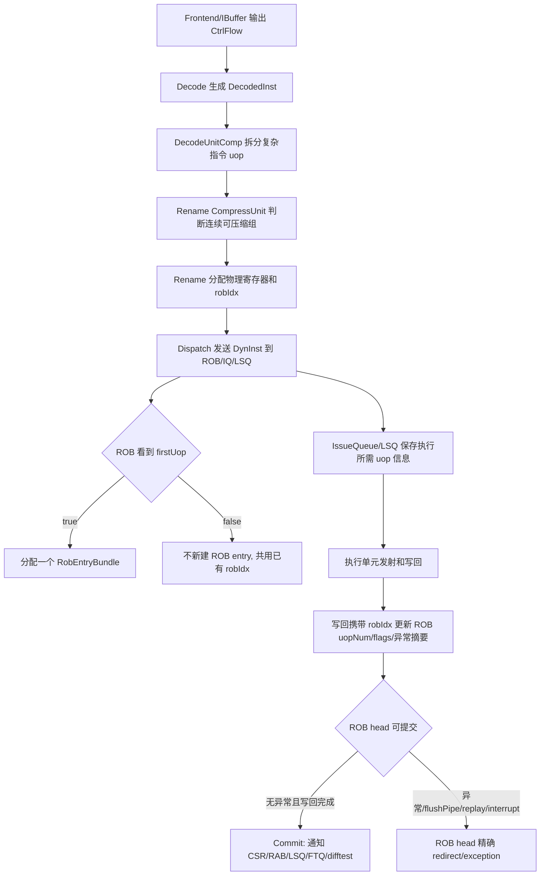

# ROB 压缩与后端指令信息流

## 版本元数据

| 项目 | 内容 |
|---|---|
| RTL 版本 | V2 |
| 分支 | `mem_ut_uvm_v2` |
| 核验 commit | `f3bdd04b3763147e714a786d078e0cb90460a31d` |
| 权威源码 | `src/main/scala/xiangshan/backend/rob/Rob.scala`、`src/main/scala/xiangshan/backend/rob/RobBundles.scala`、`src/main/scala/xiangshan/backend/rob/RobDeqPtrWrapper.scala`、`src/main/scala/xiangshan/backend/rob/Rab.scala`、`src/main/scala/xiangshan/backend/rename/Rename.scala`、`src/main/scala/xiangshan/backend/rename/CompressUnit.scala`、`src/main/scala/xiangshan/backend/dispatch/NewDispatch.scala`、`src/main/scala/xiangshan/backend/Bundles.scala`、`src/main/scala/xiangshan/backend/decode/DecodeUnit.scala`、`src/main/scala/xiangshan/backend/CtrlBlock.scala`、`src/main/scala/xiangshan/backend/Backend.scala`、`src/main/scala/xiangshan/XSCore.scala`、`src/main/scala/xiangshan/mem/MemBlock.scala`、`src/main/scala/xiangshan/mem/lsqueue/LSQWrapper.scala`、`src/main/scala/xiangshan/mem/lsqueue/VirtualLoadQueue.scala`、`src/main/scala/xiangshan/mem/lsqueue/StoreQueue.scala`、`src/main/scala/xiangshan/mem/lsqueue/LoadQueueUncache.scala`、`src/main/scala/xiangshan/mem/vector/VecBundle.scala`、`src/main/scala/xiangshan/mem/vector/VMergeBuffer.scala`、`src/main/scala/xiangshan/mem/vector/VSegmentUnit.scala`、`src/main/scala/xiangshan/mem/pipeline/AtomicsUnit.scala`、`src/main/scala/xiangshan/mem/sbuffer/Sbuffer.scala` |
| 最后核验日期 | 2026-07-28 |

## Flow 范围

本文解释 V2 后端中一条指令从 Decode、Rename、Dispatch、ROB 分配、Issue/Execute、Writeback 到 Commit 的信息流，重点说明：

- ROB entry 中保存哪些信息，以及这些信息服务的功能。
- ROB 压缩后为什么不需要保存每条指令的完整信息。
- ROB 为维持有序提交、精确异常和 redirect 年龄判断，内部最主要维护哪些信息。
- ROB 压缩时，压缩组后续指令中哪些信息会进入同一个 ROB entry，以及这些信息的作用。
- 一条指令的其他信息分别保存在后端哪些结构中，以及各自作用。
- ROB 压缩的条件、上限和不能压缩的边界。
- RAB、ExceptionGen、LSQ、FTQ、IssueQueue 与 ROB 的职责分工。
- ROB scalar store commit、StoreQueue request、`completed` 和 `sqDeq` 的顺序及 MMIO/CBO 例外。
- vector LS 与 AMO/MOU fault 的本地资源释放条件，以及它们和 ROB exception redirect 的职责边界。

本文不覆盖前端取指预测细节、具体功能单元内部执行算法、完整 LSQ replay 策略和 V3 差异。

## 主流程图



## 主流程文字伪代码

```text
1. Decode 把 CtrlFlow 转换为 DecodedInst，写入 fuType、fuOpType、rfWen、fpWen、
   vecWen、flushPipe、canRobCompress、firstUop/lastUop 等静态控制信息。
2. 对需要拆分的复杂指令，DecodeUnitComp 生成多条 uop，并设置 numUops、numWB、
   firstUop、lastUop 和 uopIdx。
3. Rename 调用 CompressUnit，对同一拍 RenameWidth 输入中连续满足 canCompress 的
   指令生成 needRobFlags、instrSizes 和 compressMasks。
4. Rename 根据 needRobFlags 推进 robIdxHead；同一个压缩组内多条指令获得相同
   robIdx，只有组边界消耗一个 ROB index。
5. Dispatch 将 DynInst 分别送入 ROB、IssueQueue、LSQ 等结构。ROB 只对 firstUop
   建立 RobEntryBundle；IssueQueue/LSQ 继续保存执行或访存所需的每条 uop 信息。
6. 执行单元写回时携带 robIdx。ROB 按 robIdx 匹配 entry，递减 uopNum，设置
   stdWritebacked、fflags、vxsat、needFlush 等组级状态。
7. ROB head entry 满足 commit_v && commit_w 后提交；如果 instrSize > 1，一个
   ROB entry 代表多条真实指令退休，真实退休数按 instrSize 统计。
8. 若 ExceptionGen 当前记录命中 ROB head，ROB 在队头精确处理异常、flushPipe、
   replay 或 interrupt，并产生对应 redirect/exception。
```

## ROB 的作用和核心维护信息

ROB 的核心作用是给乱序执行的后端建立一个按程序顺序提交的边界。执行单元、LSQ 和写回可以乱序完成，但只有 ROB head 起连续满足提交条件的 entry 才能 commit。围绕这个目标，ROB 还承担精确异常、redirect/flush 年龄判断、CSR 更新、LSQ commit 通知、RAB 提交/回滚协调和调试统计等职责。

为了维持这些作用，ROB 内部最主要维护三类信息。

### 1. 顺序和年龄信息

| 信息 | 作用 | 如何维护 ROB 作用 |
|---|---|---|
| `robIdx` | 指令在 ROB 环形队列中的年龄标签 | Rename 分配后随 `DynInst` 流经 Dispatch、IssueQueue、LSQ、EXU 和 Writeback。redirect、flush、LSQ replay、写回匹配都用它判断“是否比某个点年轻”或“是否命中同一个 entry”。 |
| `enqPtrVec/enqPtr` | ROB 入队位置 | ROB enqueue 时按实际消耗的 entry 数推进；redirect 时由 `RobEnqPtrWrapper` 恢复到 redirect 点附近，避免年轻错误路径继续占用 entry。 |
| `deqPtrVec/deqPtr` | ROB 提交窗口队头 | commit 只从 `deqPtr` 开始，保证执行可以乱序但架构状态更新有序。`NewRobDeqPtrWrapper` 根据 head 连续 entry 的 `deq_v/deq_w`、异常和 block 条件推进。 |
| `walkPtrVec/walkPtrTrue/lastWalkPtr` | redirect 后 walk/回滚扫描位置 | redirect 后 ROB 进入 walk 状态，和 RAB/vtypeBuffer 等结构一起回滚年轻状态。 |
| `valid` | entry 是否真实占用 | commit 清除已提交 entry，redirect 清除年轻 entry，容量判断使用 `distanceBetween(enqPtr, deqPtr)`。 |

这类信息保证“程序顺序”可恢复：即使后端中多个 uop 乱序发射和写回，ROB 仍能从最老 entry 开始提交，并用 `robIdx.needFlush` 统一判断年轻指令。

### 2. 完成状态信息

| 信息 | 作用 | 如何维护 ROB 作用 |
|---|---|---|
| `uopNum` | 该 entry 还剩多少写回未完成 | 入队时由 `numWB` 初始化；每个写回端口携带 `robIdx`，命中后递减。只有 `uopNum==0` 才表示该 entry 的普通写回完成。 |
| `stdWritebacked` | store data 是否已完成 | store entry 初始为 false，STD 写回后置 true；非 store 初始为 true。避免 store address 完成但 data 未就绪时提前提交。 |
| `commit_w` | entry 是否可提交的完成谓词 | `connectCommitEntry` 中由 `uopNum==0 && stdWritebacked` 生成，是 ROB commit 选择的关键条件。 |
| `hasCommitted`、`commitValidThisLine` | 当前 commit line 中已提交/可提交的 lane | 支持一拍多条 commit，同时处理 allow-only-one、异常、interrupt、blockCommit 等优先级。 |

这类信息保证“乱序完成、有序提交”：只有当 head entry 的所有必要写回都完成，ROB 才允许其提交；否则即使年轻指令已完成，也必须等待。

### 3. 精确提交和回滚摘要信息

| 信息 | 作用 | 如何维护 ROB 作用 |
|---|---|---|
| `commitType` | normal/load/store/branch/fused 分类 | 决定 LSQ commit 计数、pending load/store、分支统计、difftest 和异常上下文。 |
| `needFlush` | 该 entry 到 head 时是否要精确触发异常/flushPipe/replay | 入队异常、flushPipe 或写回异常类事件会设置该摘要；详细原因在 ExceptionGen 中保存。 |
| `ftqIdx/ftqOffset` | 前端提交和 redirect 定位 | commit、异常和 redirect 需要知道对应 FTQ 位置；压缩时保存组起点，再用 trace 信息修正组末尾。 |
| `instrSize` | 一个 ROB entry 代表多少条真实指令 | ROB 压缩和 difftest 需要它统计真实退休数；非压缩时为 1。 |
| `traceBlockInPipe` | 压缩组真实指令长度和最后一条尺寸 | 修正 commit 的 `ftqOffset`，保证前端知道压缩组提交到哪个 offset。 |
| `realDestSize` | 该 entry 对应多少个真实目的寄存器提交项 | ROB 不保存每个目的寄存器列表，而是用该数量驱动 RAB commit/walk。 |
| `fflags/vxsat/dirtyFs/dirtyVs/wflags` | CSR 提交侧需要的组级副作用 | 多个写回或压缩组内多个指令的 flags/dirty 信息在 entry 中聚合，commit 时更新 CSR。 |
| `mmio/vls/interrupt_safe` | 特殊访存、向量访存和 interrupt 安全属性 | 用于 LSQ pending、vector exception、interrupt 是否能在 head 响应。 |

这类信息保证“精确提交”：当 entry 到达队头时，ROB 能以最老指令/指令组为边界，向 CSR、LSQ、RAB、FTQ 和 ExceptionGen 发出一致的提交或回滚动作。

## ROB 保存的信息含义

ROB 主存储结构是 `robEntries: Vec[RobSize, RobEntryBundle]`。每个 entry 不是完整的 `DynInst` 副本，而是保存 ROB 完成精确提交和回滚所需的组级信息。

| 字段 | 含义 | 主要生产者 | 主要消费者 |
|---|---|---|---|
| `valid` | 该 ROB entry 是否占用 | ROB enqueue/commit/redirect 清除逻辑 | commit、walk、debug、容量判断 |
| `commitType` | 指令提交类别，如 normal/load/store/branch/fused | Rename/Decode 后的 `DynInst.commitType` | commit 统计、LSQ commit 分类、异常信息 |
| `ftqIdx`、`ftqOffset` | 该 entry 对应前端 FTQ 位置，压缩时记录组起点 | `connectEnq` 从 `DynInst` 写入 | commit 通知前端、异常/redirect 定位 |
| `instrSize` | 该 entry 代表的真实指令条数 | Rename `CompressUnit` 的 `instrSizes` | 真实退休数、difftest `nFused`、commit offset 修正 |
| `traceBlockInPipe` | trace 退休长度和最后一条指令尺寸等信息 | Rename trace 逻辑 | commit 修正 `ftqOffset`，trace/difftest |
| `rfWen`、`fpWen`、`dirtyVs`、`wflags` | 组级写寄存器/CSR dirty/fflags 属性 | Rename 聚合或 Decode 控制 | CSR 更新、commit info、difftest |
| `realDestSize` | 该 entry 需要 RAB 提交的真实目的寄存器映射数量 | ROB 入队和同 robIdx uop 聚合 | `rab.io.fromRob.commitSize/walkSize` |
| `uopNum` | 该 entry 尚未完成写回的 uop/写回数量 | 入队用 `numWB` 初始化，写回递减 | `commit_w` 判断 |
| `stdWritebacked` | store data 是否完成写回；store 需要 STA 和 STD 都完成 | 入队按 store 初始化，STD 写回置位 | `isWritebacked`/`commit_w` |
| `needFlush` | 该 entry 是否需要在 head 触发异常/flushPipe/replay 类处理 | 入队异常/flushPipe 或写回异常更新 | ROB head 精确 redirect/exception |
| `fflags`、`vxsat` | 浮点和向量饱和标志的组级 OR 结果 | 写回端口按 robIdx 聚合 | CSR `fflags/vxsat` 更新 |
| `mmio` | 该 entry 是否被 LSQ 标记为 MMIO load/store | LSQ `loadMmio/storeMmio` 反馈 | ROB/LSQ pending MMIO 状态 |
| `vls` | 是否向量访存相关 entry | ROB 入队从 `DynInst.vlsInstr` 写入 | vector load exception、LSQ pending VST |
| `interrupt_safe` | 该 entry 是否允许触发 interrupt | ROB 入队按 commitType/fuType 判断 | ROB head interrupt 处理 |
| `isRVC`、`isVset`、`isHls` | 压缩组代表指令的特殊属性 | `connectEnq` | redirect/CSR/vector/hypervisor 相关处理 |
| `debug_*` | 调试和 difftest 辅助字段 | `connectEnq`、写回 debug 更新 | debug、difftest、性能统计 |

ROB entry 的判断函数：

```text
isUopWritebacked = !uopNum.orR
isWritebacked    = !uopNum.orR && stdWritebacked
commit_w         = uopNum == 0 && stdWritebacked
```

因此 ROB 对压缩组关注的是“这个组是否按顺序可提交”，而不是保存每条指令全部语义。

### `commitType` 分类含义

`commitType` 是 ROB 和提交侧使用的 3 bit 指令类别。普通非融合指令只使用低两位；第 2 位为 1 时表示 fused 指令。

| 类型 | 编码 | 含义 | 典型来源 | ROB/下游用途 |
|---|---:|---|---|---|
| `NORMAL` | `000` | 普通非 load/store、非 branch、非 fused 指令。源码注释标为 int/fp，但实际可理解为“不需要按 load/store/branch/fused 特殊提交分类”的默认提交类型。 | Decode 中 `isLs/isVls/isBranch` 均为 false 的指令 | ROB 性能统计 `waitNormalCycle`，按普通指令提交；不产生 LSQ commit 计数。 |
| `BRANCH` | `001` | 控制流类指令，包括 predecode 判断为 CFI 的分支/跳转，以及 `FuType.isJump` 的指令。 | Decode 中 `isBranch=true` 且非 load/store | ROB 分支提交统计、FTQ/前端提交推进；不属于 load/store。 |
| `LOAD` | `010` | load 或向量 load 类提交类型。AMO 在 Decode 的低位不按普通 store 设置，因此会落入 load/store 大类但低位为 0。 | Decode 中 `isLs/isVls=true` 且 store 位为 false | ROB 产生 `io.lsq.lcommit`、`pendingld`、`pendingMMIOld`，并用于 load 类等待统计。 |
| `STORE` | `011` | store 或向量 store 类提交类型；普通 AMO 不按该低位 store 条件归类。 | Decode 中 `isStore && !isAMO` 或 `isVStore` | ROB 产生 `io.lsq.scommit`、`pendingst`、`pendingVst`，store 还受 `stdWritebacked` 约束。 |
| fused | `1xx`，当前融合逻辑写 `100` 到 `111` | 前端/后端把相邻两条指令融合成一个提交单元，编码高位 `commitType(2)=1` 表示 fused，低两位保留与 FTQ offset 关系相关的编码。 | CtrlBlock 的 fusion decoder 根据相邻指令 FTQ 关系写入 `4.U`、`5.U`、`6.U` 或 `7.U` | `CommitType.isFused` 为真；ROB 提交时 `fuseCommitCnt` 额外计入真实退休数，commit offset 修正不按普通 `traceBlockInPipe` 路径处理；ROB 压缩明确排除 fused。 |

Decode 侧非 fused 类型的生成式是：

```text
commitType = Cat(isLs | isVls, (isStore && !isAMO) | isVStore | isBranch)
```

因此低两位含义是：bit1 表示 load/store 大类，bit0 在非 load/store 下表示 branch，在 load/store 下表示 store。`CommitType.isFused(commitType)` 单独检查 bit2，所以 fused 类型不再按上述低两位解释为普通 load/store/branch。

### `isStoreException` 的更新与保持

ROB 不把 `isStoreException` 实现成一拍脉冲。`Rob.scala` 只在
`exceptionHappen` 为 1 时用当前 ROB head 的 `commitType` 更新寄存器：

```scala
io.exception.valid := RegNext(exceptionHappen)
io.exception.bits.commitType := RegEnable(deqPtrEntry.commitType, exceptionHappen)
```

`Backend.scala` 未用 `io.exception.valid` 对它做脉冲化，而是持续输出该寄存器的 bit0：

```scala
io.mem.isStoreException := CommitType.lsInstIsStore(ctrlBlock.io.robio.exception.bits.commitType)
```

`XSCore` 将它直接连到 MemBlock，`LSQWrapper` 再通过
`RegNext(io.exceptionAddr.isStore)` 选择 StoreQueue/LoadQueue exception address。因此时序语义为：

```text
首次 exceptionHappen 之前：RegEnable 无 reset 初值，该位不保证确定。
store exceptionHappen：捕获 commitType bit0=1，之后普通周期继续保持 1。
普通 commit/deq/redirect/纯 flushPipe：不更新该 RegEnable，不会在下一拍清 0。
后续 exceptionHappen：用新 head 的 commitType bit0 覆盖；bit0=0 时才变为 0。
```

所以“store fault 驱动 1 后下一拍自动清 0”不符合 V2 RTL。更精确的说法也不是
“下一个非 store fault 必然清 0”，而是“下一个 `exceptionHappen` 使寄存器采样新
`commitType(0)`”。`lsInstIsStore()` 只返回 bit0；例如 `BRANCH=001` 的 bit0 也是 1，
但非访存异常时 MemBlock 的 load/store exception address 选择不是有效功能结果。在 scalar LS
范围内，可以简化为“store fault 后保持 1，直到后续 load fault 捕获 0”。

## 一条指令的其他信息存在哪里

ROB 压缩后不会保存每条指令的完整 `DynInst`，但信息没有无条件丢失。不同信息按功能保存在不同后端结构中。

| 信息类别 | 典型字段 | 保存位置 | 含义和作用 |
|---|---|---|---|
| 前端位置和取指块 | `ftqPtr`、`ftqOffset`、`isLastInFtqEntry` | `CtrlFlow`、`DecodedInst`、ROB entry、FTQ | 用于提交通知、异常 redirect、预测状态回收。ROB 压缩禁止跨 FTQ entry，保证一个压缩组可用组起点加退休长度定位组末尾。 |
| 指令静态解码 | `fuType`、`fuOpType`、`srcType`、`ldest`、`rfWen`、`fpWen`、`vecWen`、`flushPipe`、`canRobCompress` | `DecodedInst`、`DynInst`，部分摘要进入 ROB | 决定指令执行单元、读写寄存器、特殊提交行为和是否允许 ROB 压缩。 |
| 拆分 uop 信息 | `firstUop`、`lastUop`、`numUops`、`numWB`、`uopIdx` | `DecodedInst`、`DynInst`，`numWB` 用于 ROB `uopNum` | 表示一条 ISA 指令被拆成多少 uop，以及 ROB 等待多少写回。ROB 只对 `firstUop` 建 entry。 |
| 重命名信息 | `psrc`、`pdest`、`srcState`、`srcLoadDependency` | Rename 输出的 `DynInst`、IssueQueue、RAB | 执行阶段使用物理源寄存器；提交/回滚时 RAB 用目的寄存器映射更新或恢复架构状态。 |
| ROB 顺序标签 | `robIdx` | Rename 分配后随 `DynInst` 流经 Dispatch、IssueQueue、LSQ、EXU、Writeback | 后端统一年龄和取消标签。写回、redirect、LSQ replay/flush 都依赖 `robIdx`。 |
| Issue/Scheduler 信息 | `fuType`、`psrc`、`pdest`、依赖状态、ready 状态 | IssueQueue/Scheduler entry | 决定何时发射到执行单元。ROB 不负责保存调度等待状态。 |
| LSQ 信息 | `lqIdx`、`sqIdx`、load/store 属性、地址/数据状态 | LSQ、LoadQueue、StoreQueue、MemBlock pipeline | 负责访存顺序、地址计算、forward、replay、MMIO 标记和 load/store commit。 |
| 写回结果 | 写回 `data`、`fflags`、`vxsat`、异常向量、`robIdx` | 执行单元写回端口、ROB debug 寄存器、ExceptionGen、CSR | ROB 只聚合提交所需 flags 和写回完成状态；数据本身主要写回物理寄存器或用于 debug/difftest。 |
| 异常详细信息 | `exceptionVec`、`flushPipe`、`replayInst`、`singleStep`、`trigger`、`vstart` 等 | `ExceptionGen.current` / `RobExceptionInfo` | ROB entry 只保存 `needFlush` 摘要；详细异常由 ExceptionGen 按最老异常和 `robIdx` 维护，ROB head 命中时精确处理。 |
| 寄存器提交/回滚信息 | 目的逻辑寄存器、目的物理寄存器、旧映射、类型信息 | RAB/RenameBuffer | ROB 通过 `realDestSize` 告诉 RAB 一次 commit/walk 多少项；RAB 输出 `RabCommitIO` 更新 arch RAT/free list/difftest。 |
| trace/difftest 辅助 | `traceBlockInPipe`、`debug_*`、`nFused`、PC/instr | ROB debug mem、trace buffer、difftest 专用 Mem/Reg | 只服务仿真、trace 和 difftest。综合后很多 debug 结构可优化或不属于架构状态。 |

## RAB 的角色

RAB 在源码中是 `RenameBuffer`，不是 ROB entry 的一部分。它保存 rename 阶段实际分配的目的寄存器提交信息：

- `RenameBufferEntry.info` 保存 `RabCommitInfo`，来源是需要写寄存器的 `DynInst`。
- `RenameBufferEntry.robIdx` 在非 FPGA 平台下作为 debug/difftest 关联标签。
- 入队数量由 `realNeedAlloc = req.valid && req.bits.needWriteRf` 决定。
- ROB 不把每个目的寄存器列表放进 `RobEntryBundle`，而是维护 `realDestSize`。
- ROB commit 时计算 `commitSize`，告诉 RAB 本轮有多少个真实目的寄存器映射可以提交。
- redirect/walk 时计算 `walkSize`，告诉 RAB 回滚多少个 rename 分配项。

这种拆分使 ROB 压缩后仍能提交多条真实指令的多个目的寄存器：ROB 负责“何时按程序顺序提交”，RAB 负责“提交哪些寄存器映射”。

## ROB 压缩的具体行为

### 1. 压缩判断

`CompressUnit` 先为同一拍 Rename 输入中的每个 lane 生成 `canCompress`：

```text
canCompress =
  in.valid &&
  !CommitType.isFused(commitType) &&
  lastUop &&
  noExc &&
  canRobCompress
```

其中 `noExc` 要求没有 frontend/decode exception，也不能是进入 Debug Mode 的 trigger。Decode 侧还会额外执行：

```text
decodedInst.canRobCompress := decodedInst.canRobCompress && !isLastInFtqEntry
```

因此 ROB 压缩不会跨 FTQ entry。

### 2. 生成 needRobFlags、instrSizes 和 masks

`CompressUnit` 对 `RenameWidth` 位 `canCompress` 生成三类输出：

- `needRobFlags`：连续压缩组中只有最后一项需要消耗一个 ROB entry；非压缩项自己消耗一个 entry。
- `instrSizes`：当前 lane 所属压缩组包含多少条真实指令；非压缩项为 1。
- `masks`：当前 lane 所属压缩组覆盖哪些 lane，用于聚合 `wfflags/dirtyFs/dirtyVs` 和统计 move 消除后的 `numWB`。

例子：同一拍 6 lane 中 lane0 到 lane3 连续可压缩，lane4/5 不压缩，则 lane0 到 lane3 获得同一个 `robIdx`，只有 lane3 消耗一个 ROB entry，`instrSize=4`，mask 覆盖 lane0 到 lane3。

### 3. Rename 分配 robIdx

Rename 用 `needRobFlags` 计算本拍消耗的 ROB entry 数：

```text
validCount = PopCount(in.valid && lastUop && needRobFlag)
robIdxHeadNext = robIdxHead + validCount
uop.robIdx = robIdxHead + PopCount(older valid && older lastUop && older needRobFlag)
```

所以同一压缩组内的多条指令具有相同 `robIdx`。压缩组之后的指令只看到一个 ROB entry 被消耗。

### 4. ROB enqueue

ROB 的 `allocatePtrVec` 和 `canEnqueue` 只看 `firstUop`：

```text
allocatePtrVec(i) = enqPtrVec(PopCount(older valid && older firstUop))
canEnqueue(i) = req.valid && req.bits.firstUop && io.enq.canAccept
```

压缩组只有组首 `firstUop=true`，因此 ROB 只创建一个 entry。组内后续 lane 不再创建 entry，但它们写回仍携带同一个 `robIdx`，会更新同一个 entry 的 `uopNum/fflags/vxsat/needFlush` 等。

### 5. 写回和提交

ROB 按写回端口的 `robIdx` 匹配 entry：

- 普通写回递减 `uopNum`。
- store data 写回设置 `stdWritebacked`。
- fflags/vxsat 写回 OR 到 entry。
- 异常/flush/replay 写回通过 ExceptionGen 保存详细信息，并将 entry 的 `needFlush` 置为需要精确处理。

提交时，一个压缩 ROB entry 只占用一个 commit slot，但真实退休数按 `instrSize` 统计：

```text
trueCommitCnt = sum(commitValid ? info.instrSize : 0) + fusedCommitCnt
```

difftest 中 `nFused` 也按 `commitInfo.instrSize - 1` 表示该 entry 额外包含的真实指令数。

### 6. 压缩组后续指令进入 entry 的信息

ROB 压缩时，组内后续指令不会各自创建完整 `RobEntryBundle`。但是后续指令中 ROB 必须知道的组级信息会被聚合到同一个 entry，或通过写回阶段按同一个 `robIdx` 更新该 entry。

| 后续指令相关信息 | 进入 entry 的方式 | 在 entry 中的形态 | 作用 |
|---|---|---|---|
| 真实指令条数 | Rename `CompressUnit` 计算 `instrSizes` | `instrSize` | commit 时统计真实退休条数；difftest 用它生成 `nFused`。 |
| FTQ 提交推进长度 | Rename 用 `compressMasksVec` 统计 RVC/非 RVC 半字数 | `traceBlockInPipe.iretire`、`traceBlockInPipe.ilastsize` | commit 时把 entry 起点 `ftqOffset` 修正到压缩组最后一条指令，保证前端提交位置正确。 |
| 是否写 fflags | Rename 对压缩 mask 覆盖 lane 的 `wfflags` 做 OR | `wflags` | commit 时决定是否把 entry 累积的 `fflags` 写入 CSR。 |
| FS/VS dirty 属性 | Rename 对压缩 mask 覆盖 lane 的 `fpWen/dirtyVs` 做 OR | `fpWen`、`dirtyVs`，commit info 中表现为 `dirtyFs/dirtyVs` | commit 时更新 CSR dirty 状态。 |
| 需要等待的写回数 | Rename 用压缩组大小减去 move 消除数量生成 `numWB` | ROB 入队时初始化 `uopNum` | 确保压缩组内所有需要写回的 uop 都完成后，整个 entry 才能提交。 |
| 需要提交的目的寄存器数 | ROB 对同一 `robIdx` 且 `needWriteRf` 的 uop 计数 | `realDestSize` | 告诉 RAB commit/walk 多少个真实目的寄存器映射。 |
| 每个 uop 的写回完成 | 执行单元写回携带同一 `robIdx` | 写回时递减 `uopNum` | 后续指令虽然没有独立 entry，但仍会用同一 `robIdx` 让压缩 entry 等待它完成。 |
| 后续 uop 的 `fflags/vxsat` | 写回端口按同一 `robIdx` 匹配 | `fflags`、`vxsat` OR 进 entry | commit 时一次性更新 CSR flags。 |
| 后续 uop 的异常/flush/replay 摘要 | 写回进入 ExceptionGen，同时 ROB 更新 `needFlush` | entry 中保存 `needFlush` 摘要，详细信息在 ExceptionGen | 如果出现需要精确处理的事件，entry 到 head 时由 ROB/ExceptionGen 产生 redirect/exception。正常 ROB 压缩条件已排除 decode 阶段异常和 Debug Mode trigger。 |

不会进入 ROB entry 的后续指令信息包括每条指令的完整 `fuOpType`、源寄存器、目的物理寄存器、LSQ index、调度 ready 状态和执行数据。这些信息由 `DynInst`、IssueQueue、LSQ、执行单元写回、RAB、ExceptionGen 或 FTQ 保存和消费。ROB 压缩合并的是提交控制信息，不合并执行数据通路本身。

### 7. ROB 提交与 StoreQueue 出队的真实顺序

这里必须把三个容易混淆的事件分开：

1. **ROB 架构提交**：`Rob.scala` 的 `io.commits.commitValid` 为 1，且
   `NewRobDeqPtrWrapper` 在时钟边界推进 `deqPtr`；对应的
   `io.lsq.scommit` 是该提交批中 scalar store 数量的延迟通知。
2. **store request 发出**：普通 cacheable/NC store 进入 `dataBuffer` 或 uncache
   request；MMIO/CBO store 进入 uncache/CMO request。这个事件不等于 SQ entry 已经
   物理出队。
3. **SQ 物理出队**：`StoreQueue` 生成 `sqDeqCnt`，推进 `deqPtrExt`，并通过
   `io.sqDeq := RegNext(sqDeqCnt)` 向后端输出释放数量。

注意 V2 中有两个容易被同名变量混淆的数量：`ooo_to_mem.lsqio.scommit` 是
ROB 到 MemBlock 的 scalar store 提交数量；`mem_to_ooo.sqDeq` 是 MemBlock 到后端的
SQ 物理释放数量。后端 Dispatch/Scheduler 接收 `sqDeq` 后有时也把它命名为
`scommit`，但它不是 ROB commit 的重复信号。

ROB 侧的提交谓词是 `commit_w = (uopNum == 0) && stdWritebacked`。但是
`pendingPtr := RegNext(deqPtr)` 和 `pendingst := RegNext(io.commits.isCommit && ...)`
是 head sideband；`io.commits.isCommit` 可以为 1 而当前 `commitValid(0)` 仍为 0，
因为 head 还可能没有满足 `commit_w`。因此 `pendingPtr/pendingst` 不能被解释为
“本拍已经完成架构提交”。

StoreQueue 的普通路径和特殊路径也不同：

| 路径 | request/完成条件 | SQ deq 与 ROB commit 的关系 |
|---|---|---|
| 普通 cacheable scalar store | `dataBuffer.io.enq.valid` 要求 `allocated && committed && allvalid`；SBuffer fire 后才置 `completed` | 通常先经过延迟的 ROB head/`committed` 授权，再写 SBuffer，最后产生 `sqDeq`；这是常见顺序，但不是 `sqDeq` 逻辑上的显式 `rob_commit` 门控。 |
| NC scalar store | `ncState` 要求 `committed && allvalid` 后发 uncache request；response/ack 后置 `completed` | 通常在 ROB commit 授权之后完成并出队。 |
| MMIO/CBO store | `pendingst && pendingPtr` 可在 ROB head 尚未 `commit_w` 时放行 request；uncache/CMO response 后进入 writeback，`mmioStout.fire` 直接置 `completed` | **可能先 SQ deq、后 ROB `commitValid/scommit`**。`mmioState=s_wait` 等待 `scommit` 以允许后续 MMIO 状态收敛，但 `sqDeqCnt` 本身不检查 `committed`；源码还明确处理“MMIO 的 deq pointer 领先 cmt pointer”。 |

关键源码顺序如下：

```text
ROB:
  commit_w = (uopNum == 0) && stdWritebacked
  commitValidThisLine = commit_v && commit_w && !blocked
  scommit = RegNext(PopCount(commitValid store lanes))
  pendingPtr = RegNext(deqPtr)
  pendingst = RegNext(isCommit && head_is_store)

StoreQueue:
  normal store:
    committed <- pendingPtr 的延迟 head 匹配
    dataBuffer.valid <- allocated && committed && allvalid
    SBuffer.fire -> completed = 1
  MMIO/CBO store:
    pendingst/pendingPtr -> request
    response -> mmioStout.fire -> completed = 1
  所有路径的物理释放判断：
    sqDeqCnt = 连续的 allocated && completed
    deqPtrExt <- deqPtrExt + sqDeqCnt
    sqDeq = RegNext(sqDeqCnt)
```

因此，`status.rob_commit` 不应作为 `apply_dut_sq_deq_count_only()` 或其他 raw
SQ deq 消费入口的全局硬门槛。它仍然是 `try_retire_committed_uid()` 做 normal
success/terminal 收敛的必要条件，但 SQ deq 可以先释放 mapping，保留 uid 为 active，
等待后续 ROB commit；MMIO/CBO 或异常清理路径则允许明确记录“deq-before-commit”。
若 raw event 已经满足 SQ head、连续 count、active mapping 和 redirect/flush 世代校验，
不能仅因软件 `status.rob_commit=0` 就判定 SQ pointer mismatch 或静默丢弃。

### 8. scalar store fault：`scommit=0` 时的两条 SQ 释放路径

这里的“fault store”特指已经进入 StoreQueue 的 scalar store，其 STA 地址/权限等执行结果
已使 `StoreQueue.hasException` 为 1，随后该异常在 ROB 队头被精确处理。它不能被当成一条
正常 scalar store commit：ROB 只有 `commitValid` 的 STORE lane 才计入 `scommit`；异常
head 会阻止正常 commit，因此它不会产生这笔 normal `scommit`。

V2 对这类 entry 不只有一条路径，以下两条路径由不同的先后时序决定，不能把其中任一条
写成另一条的必然替代。

```text
STA S2 发现 store exception
  -> StoreQueue.hasException(entry) = 1
  -> ExceptionGen 保存异常；ROB head 命中异常后生成 flush redirect

若 redirect 到 StoreQueue 时 entry 尚未 committed：
  redirect.level = flush，flushItself = 1
  -> entry.robIdx.needFlush(redirect) = 1
  -> StoreQueue.needCancel = 1
  -> allocated 清零
  -> redirect 两拍后输出 sqCancelCnt

若 entry 已先被 StoreQueue 的 pendingPtr 规则标记 committed：
  -> exception entry 可以进入 dataBuffer
  -> dataBuffer entry 的 vecValid = 0，因此 SBuffer 不产生真正写请求
  -> 但 SBuffer handshake 仍使 StoreQueue.completed = 1
  -> sqDeqCnt / sqDeq 释放该 SQ entry
  -> 后到的 redirect 不会再取消 committed entry
```

这说明三点。

1. `sqDeq` 的直接条件仍是 `allocated && completed`，不是 `scommit`。对异常 store，源码
   明确将 `hasException` 注释为“应出队但不写 SBuffer”，并通过 `vecValid=0` 屏蔽 SBuffer
   的真实 write request，同时保留完成/出队握手。
2. `scommit=0` 不会自动阻止上述异常清理路径。StoreQueue 的 `committed` 判定直接比较
   延迟 `pendingPtr`，只有 MMIO `s_wait` 等特殊状态额外消费 `scommit`。因此不能用
   “fault 没有 scommit”推导“DUT 必定没有 sqDeq”。
3. ROB exception redirect 仍然是完整 Core 的必要行为。ROB 对 `deqHasException` 产生
   `RedirectLevel.flush`；CtrlBlock 将它作为后端 redirect，`XSCore` 再驱动
   `MemBlock.io.redirect`，最终进入 `StoreQueue.brqRedirect`。`flush` 包含 redirect
   anchor 自身，故未 committed 的 fault store 可由 `sqCancelCnt` 释放。实际波形可能看到
   `sqDeq` 或 `sqCancelCnt`，取决于 redirect 到达时 entry 是否已 committed；两者没有固定
   的同拍或固定计数关系。

`io_ooo_to_mem_isStoreException` 不承担上述释放控制。它只是 Backend 根据 ROB exception
的 `commitType` 指出异常属于 store，再由 MemBlock/LSQWrapper 选择 exception address
来源；单独驱动该字段不会生成 redirect、`completed`、`sqDeq` 或 `sqCancelCnt`。

对 standalone 验证环境的边界是：只有真实 DUT STA/StoreQueue 状态已经使
`hasException=1` 时，才可能自然观察到异常 `sqDeq`。若测试框架只把 writeback 的
`exceptionVec` 记为软件 fault，却既未驱动 ROB-style exception redirect、也未让 DUT
进入上述 `hasException` 清理路径，则 active SQ mapping 没有硬件释放来源，不能用伪造
`scommit` 解决。

### 8.1 standalone 无 redirect 时的 NC/MMIO 出队边界

`pendingPtr` 是 ROB 已到达位置的顺序水位，不是“软件要求 DUT 立即释放该 entry”的命令。
StoreQueue 的 commit pointer 只有在 entry 已分配、ROB key 不晚于延迟的 `pendingPtr`、且
当前状态机允许时，才会把该 entry 标为 `committed`。物理 `sqDeq` 仍必须等待
`completed=1`；ctrl monitor 只能采集该结果，不能把等待本身变成一次硬件释放。

在 standalone 测试框架不模拟完整 ROB exception redirect 的前提下，是否可以仅保持
`pendingPtr=fault head`、`scommit=0` 并等待真实 `sqDeq`，必须按下表区分。

| 场景 | `pendingPtr`/sideband 前提 | `scommit=0` 时能否自然 `sqDeq` | 原因 |
|---|---|---|---|
| cacheable scalar store fault | DUT 已将该 SQ entry 的 `hasException` 置 1，`pendingPtr` 覆盖该 ROB key | 可以，需等待 DataBuffer/SBuffer handshake | exception entry 可进入 DataBuffer；`vecValid=0` 屏蔽真实写请求，但 handshake 仍置 `completed` |
| NC/uncache store fault | DUT 已将 `hasException` 置 1，`pendingPtr` 覆盖该 ROB key | 可以 | `isCommit && nc && hasException` 直接置 `completed`，不发 NC request，也不读取 `scommit` |
| normal NC/uncache store | `pendingPtr` 覆盖 entry，地址/数据有效，且没有前序 MMIO 卡在 `s_wait` | 可以，但必须等 uncache request、ack/response | NC request 条件读取 `committed`，response/ack 后才置 `completed`；`scommit` 不是该 entry 的直接完成条件 |
| normal MMIO store | 除 `pendingPtr` 外还必须 `pendingst=1`，且 `pending=1`、地址/数据有效、`hasException=0` | 当前 entry 可以；完成后不能长期保持 0 | request 入口显式要求 `pendingst && pendingPtr match && !hasException`。response 后 `mmioStout.fire` 置 `completed` 并产生 `sqDeq`；无异常时状态机进入 `s_wait`，后续需要 normal `scommit>0` 回到 `s_idle` |
| MMIO request 已发出后的 denied/corrupt fault | 请求已由之前的 normal `pendingPtr+pendingst` 发出 | 可以 | response 将异常写入 `uncacheUop`，`mmioStout.fire` 仍置 `completed`；因为有 exception，FSM 直接回 `s_idle`，不等待 `scommit` |
| 请求前已经 fault 的 scalar MMIO store | DUT 已将 `hasException` 置 1，且不是 CBO，因此 `wlineflag=0` | 可以，走异常 drain 而不是 MMIO request | StoreUnit 在 exception 时把写入 SQ 的 `mmio` 标志清为 0；`pendingPtr` 使 entry committed 后，StoreQueue 按通用 `hasException` DataBuffer/SBuffer 路径置 `completed`，不发真实 MMIO write |
| 请求前已经 fault 的 CBO store | CBO 的 `wlineflag=1`，DUT 已置 `hasException` | 不可以，仅靠无 redirect standalone sideband 无法释放 | CMO request gate 要求 `!hasException`；通用 SBuffer handshake 虽可发生，但 `completed` 只在 `!wline` 时置位。完整 Core 需用 exception redirect 的未提交 entry cancel 路径释放 |

MMIO/NC load 走 `LoadQueueUncache`，不能套用 store 的 `scommit/pendingst` 结论：

| 场景 | 发送 uncache request 的条件 | `scommit=0` 的影响 | LQ 释放来源 |
|---|---|---|---|
| normal MMIO load | `pendingMMIOld=1` 且 `req.robIdx == pendingPtr` | 无直接影响；单独 `pendingPtr` 不足以发 request | response 后 `mmioOut.fire` 形成实际 LDU writeback，VirtualLoadQueue 再产生 `lqDeq` |
| normal NC load | `req.nc=1`，不等待 `pendingMMIOld/pendingPtr` | 无直接影响 | response 后 `ncOut.fire` 形成 LDU writeback，随后由 VirtualLoadQueue 释放 |
| MMIO/NC response denied/corrupt load | request 已经发出 | 无直接影响 | response 仍生成带 exceptionVec 的 `mmioOut/ncOut`；是否 `lqDeq` 由实际 LDU writeback 是否满足 LQ commit 条件决定 |
| request 前已有 exception 的 scalar MMIO/NC load | LDU 的 `exceptionVec` 已非零 | 不适用 | LoadQueueUncache 入队条件明确排除 exception，因此它不生成 uncache request/writeback；但普通 scalar LoadUnit exception 会强制其 LDU-to-LQ event 的 `updateAddrValid=1`。只要未被 redirect kill、没有 replay、且不是 vector，VirtualLoadQueue 仍会 committed 并输出 `lqDeq`；`pendingPtr` 不替代该路径 |

因此，不做 redirect 的本轮测试框架可对 cacheable/NC/scalar-MMIO exception drain、普通
scalar load exception，以及“MMIO response 后才发现 denied/corrupt”的 fault 路径等待 raw
`lqDeq/sqDeq`。early CBO fault 没有可等待的自然 `sqDeq` 来源；框架必须在该 fault head 的
drain watchdog 到期时 `uvm_fatal`，不得伪造 `apply_dut_sq_deq()`、伪造 `scommit` 或在软件表
中直接释放 SQ mapping。完整 Core 的替代释放是 ROB exception redirect 产生的 `sqCancelCnt`，
但它不属于当前 standalone 无 redirect 模式。

ctrl monitor 每个 `mon_cb` 周期都会采样 `io_mem_to_ooo_lqDeq` 和
`io_mem_to_ooo_sqDeq`，adapter 只在 raw count 已真实出现时释放软件 LQ/SQ mapping。故
“等待 monitor”在已支持的路径上是正确的收敛方式，但必须区分两类未看到 deq 的原因：

1. **结构性无释放路径**：请求前 CBO fault 的 CMO request 被 `!hasException` gate 阻止，且
   CBO 的 `wline` entry 不会由通用 SBuffer handshake 置 `completed`；这是 standalone 无
   redirect 模式的明确不支持场景。普通 scalar MMIO store fault 不属于这一类，它会降级走
   通用 exception drain。
2. **已有合法路径但尚未完成**：normal NC/MMIO request 尚未收到 responder response，或
   cacheable fault store 尚未完成 SBuffer handshake。这不是“fault 没有 deq 路径”；例如
   MMIO response fault 必须先收到该 response 才会成为 fault。若 responder 永不回复或 ready
   永不开放，属于测试环境/下游活性故障，watchdog 同样应 fail-fast。

watchdog 必须保留 fault UID、`exceptionVec`、ROB/LQ/SQ key、`pendingPtr/pendingst/scommit`
和最近 raw count 用于日志。本段只规定测试框架的驱动和状态收敛边界，不新增 RM、scoreboard
或参考结果比较。

### 8.2 vector LS 与 AMO/MOU fault 是否依赖 ROB redirect 释放

必须把“处理架构异常”和“释放 MemBlock 本地资源”分开判断。V2 中，只要一个 fault 最终
作为架构异常送到 ROB，ROB 都会在该指令成为 head 且写回完成后产生
`RedirectLevel.flush`；这一步负责移除 faulting ROB entry、回滚年轻指令并进入异常处理。
但 VLQ、SQ、vector merge buffer、`VSegmentUnit` 和 `AtomicsUnit` 并不都把该 redirect
作为唯一的本地释放条件。

| 类型 | 是否分配普通 LQ/SQ | fault 时的本地完成/释放路径 | ROB redirect 的作用 |
|---|---|---|---|
| 普通 vector load | 分配 LQ entry | merge buffer 收齐 flow 后，同时产生带异常的 vector writeback 和 `toLsq` FLUSH feedback；`VirtualLoadQueue` 对匹配 `robidx/uopidx` 的有效 feedback 置 `committed`，随后按队头连续性产生 `lqDeq` | 负责精确异常和 ROB/年轻指令回滚，不是该 LQ entry 唯一的释放来源 |
| 普通 vector store | 分配 SQ entry | Store pipeline 把 `hasException` 写入 SQ；merge buffer 的 FLUSH feedback 也会置 `vecMbCommit`。若 `pendingPtr` 已覆盖该 ROB head，entry 可进入异常 drain，以 `vecValid=0` 完成握手后产生 `sqDeq`；若 redirect 先命中尚未 `committed` 的 entry，则改走 `sqCancelCnt` | 两条 SQ 释放路径之一，同时负责精确异常；不能断言 fault 必定只出现 cancel 或只出现 deq |
| segment vector LS | `NewDispatch` 排除普通 LSQ request | `VSegmentUnit` 在异常后转入 `s_finish`，推进自己的 `deqPtr` 并产生 vector writeback | 负责 ROB/架构恢复；不负责释放不存在的普通 LQ/SQ entry |
| LR/SC/AMO，即 `FuType.mou` | `NewDispatch` 排除普通 LSQ request | `AtomicsUnit` 在 misalign、TLB/PMP/PBMT 或 DCache error 后进入 `s_finish`；普通 AMO 在 `io.out.fire` 后 `resetFSM()`，`AMOCAS.Q` 在第二次 writeback fire 后复位 | 负责 ROB/架构恢复；不会产生普通 `lqDeq/sqDeq`，也不是 `AtomicsUnit` FSM 复位条件 |

普通 vector load 的关键顺序是：

```text
所有有效 flow 返回 merge buffer
  -> merge buffer 记录最老 exception
  -> flowNum 归零并选择该 uop 输出
  -> 同时发送：
       vector writeback(exceptionVec != 0)
       toLsq.valid + feedback.FLUSH = 1
  -> VirtualLoadQueue 按 robidx/uopidx 命中并置 committed
  -> 队头连续 committed entry 产生 lqDeq
  -> ExceptionGen/ROB 稍后在 ROB head 产生精确 flush redirect
```

`VirtualLoadQueue` 在 vector feedback 路径中没有要求 `isCommit=1`，它对任意匹配的
`vecCommit.valid` 都置 `committed`。因此这里的 `feedback.FLUSH` 表示“该 vector uop 带异常
完成并向 LSQ 回报”，不能机械解释成“必须等 ROB redirect 才取消 LQ”。如果更老的其他
redirect 在该 uop 完成前命中，则会走普通 cancel；那属于该 vector uop 被杀死，不是它自身
fault 的正常完成路径。

普通 vector store 的关键顺序是：

```text
StoreUnit S2 发现 vector store exception
  -> StoreQueue.hasException = 1，addrvalid 可更新
merge buffer 收齐 flow
  -> toLsq feedback.FLUSH = 1
  -> StoreQueue 将 COMMIT 或 FLUSH 都识别为 vecMbCommit

若 pendingPtr 先覆盖该 head：
  -> StoreQueue.committed = 1
  -> exception entry 进入 DataBuffer，vecValid = 0
  -> SBuffer 接受控制握手但不建立真实写请求
  -> completed = 1 -> sqDeq

若 ROB flush redirect 先命中且 committed = 0：
  -> needCancel = 1 -> sqCancelCnt
```

因此，无 redirect 的 standalone 环境若未来支持普通 vector store fault，不能只等待
`vecMbCommit`；还必须正确维护 ROB-head `pendingPtr` 并等待真实 `sqDeq`。反过来，也不能因
没有 normal `scommit` 就伪造 cancel。当前 mem_ut 主动主流程仍拒绝 vector LS，本段只记录
V2 DUT 行为，不能据此宣称测试框架已支持 vector fault。

AMO 与 MOU 不是两套独立硬件路径：AMO/LR/SC 是 ISA 操作，`mou` 是它们在 V2 中使用的
`FuType`。它们不占普通 LQ/SQ，fault 本身也会产生带 `exceptionVec` 的真实 writeback。
`AtomicsUnit` 的 `resetFSM()` 由 writeback handshake 触发；`io.redirect.valid` 在该模块中只
清 `atom_override_xtval`，不会调用 `resetFSM()`。所以未来 standalone 支持该类 fault 时，
必须保证 atomic writeback ready/monitor 闭环；等待 `lqDeq/sqDeq` 或只发送 redirect 都不是
正确的本地完成条件。

还有一个 vector fault-only-first 边界：FOF load 在 element 0 fault 时保留 exception，仍走
上述 ROB 精确异常；在后续 element fault 时，merge buffer 改为缩短 `vl` 而不保留
`exceptionVec`。后一种情况按 ISA 语义不是一次对 ROB 可见的 fault，因此不会要求 exception
redirect。

## 为什么不会丢失必要信息

ROB 压缩不是把任意多条指令的完整状态强行塞入一个 entry，而是依赖两个前提：

1. 只有对 ROB 来说可组级处理的指令才允许压缩。
2. 每类信息由真正需要它的结构保存，ROB 只保存提交顺序、写回完成、异常摘要和提交计数。

不会丢失的关键理由如下：

- 每条 uop 在执行前仍携带完整 `DynInst`，IssueQueue/LSQ/执行单元保存和消费执行所需信息。
- 每条写回仍携带 `robIdx`，ROB 能把多个写回归并到同一个 entry。
- 每个真实目的寄存器的提交信息在 RAB 中保存，ROB 只用 `realDestSize` 指挥 RAB 提交或回滚。
- 异常详细信息在 ExceptionGen 中保存；ROB entry 的 `needFlush` 只是让队头触发精确处理。
- FTQ 位置不跨 entry 压缩，组起点加 `traceBlockInPipe.iretire/ilastsize` 可在 commit 时定位组末尾。
- `canRobCompress` 来自 decode 表和后续过滤，复杂或需要单独精确处理的指令不会进入压缩组。

因此 ROB 压缩丢弃的是“ROB 不需要单独保存的重复 entry 外壳”，不是丢弃执行、提交或异常语义。

## 压缩要求和上限

### 必须满足的条件

| 条件 | 来源 | 意义 |
|---|---|---|
| `in.valid` | Rename 输入 | 当前 lane 有有效指令 |
| `canRobCompress` | Decode 表和特殊修正 | 指令类型允许 ROB 压缩 |
| `lastUop` | Decode/DecodeUnitComp | 多 uop 指令中只有最后 uop 可能参与压缩；中间 uop 不压缩 |
| 非 fused | `!CommitType.isFused(commitType)` | fused 指令已有独立 difftest/commit 语义，不参与 ROB 压缩 |
| 无异常 | `!exceptionVec.asUInt.orR` | 有 frontend/decode 异常的指令必须单独精确处理 |
| 非 Debug Mode trigger | `!TriggerAction.isDmode(trigger)` | 进入 Debug Mode 的特殊精确事件不压缩 |
| 不跨 FTQ entry | `!isLastInFtqEntry` | 保证一个压缩组的前端位置可由单个 FTQ entry 表达 |
| 非 single-step 模式 | Rename 输入给 CompressUnit 时 `!io.singleStep` | single-step 调试下不启用压缩 |

### 当前 V2 最大压缩项数

当前 V2 参数为：

```text
DecodeWidth = 6
RenameWidth = 6
CommitWidth = 8
RobCommitWidth = 8
```

`CompressUnit` 的输入、mask 和压缩表宽度都是 `RenameWidth`。因此单个 ROB entry 最大可压缩 `RenameWidth=6` 条同拍连续可压缩指令。这个上限来自 Rename 宽度和同拍连续 lane，不是来自 `CommitWidth`。

## 状态、队列和优先级

| 状态/字段/队列 | 生产者 | 置位/入队条件 | 清除/出队条件 | 消费者 | 优先级 |
|---|---|---|---|---|---|
| `robEntries.valid` | ROB enqueue | `canEnqueue && !redirect` | commit 或 redirect flush 范围命中 | ROB commit/walk/capacity | commit 清除优先于 enqueue，redirect 清除年轻 entry |
| `robEntries.uopNum` | ROB enqueue/writeback | 入队用 `numWB` 初始化，同 robIdx 写回递减 | 到 0 表示 uop 写回完成 | `commit_w` | 异常 flush 路径会设置 store done 并继续递减写回计数 |
| `robEntries.stdWritebacked` | ROB enqueue/store writeback | 非 store 初始化为 true，store 初始化为 false；STD 写回置 true | 新 entry 覆盖 | `commit_w` | store 需要 STA/STD 都完成 |
| `robEntries.needFlush` | ROB enqueue/writeback | 入队异常/flushPipe 或执行写回异常/flush/replay | entry commit/flush 后失效 | ROB head redirect/exception | 只有到 ROB head 后精确处理 |
| `ExceptionGen.current` | ExceptionGen | enqueue 或 writeback 带异常/flush/replay/singleStep/trigger | redirect/flush 命中或被更老异常替换 | ROB head 异常判断 | 保留最老异常；同 robIdx 合并部分字段 |
| `DynInst.replayInst` | 具备 replay capability 的执行/访存单元 | 执行结果要求从当前指令自身重新取指执行 | Rename 初始为 0；写回被 ExceptionGen 消费后随 redirect 清理 | ExceptionGen/ROB | 与 LSQ/RS 局部 replay 不同，必须到 ROB head 精确处理 |
| `StoreQueue.committed` | StoreQueue ROB sideband consumer | cmt pointer entry 的 `robIdx` 不晚于延迟 `pendingPtr`，且未 cancel、Store S2 已完成 | 新 SQ entry 覆盖；entry 物理释放后不再有效 | cacheable/NC request 路径、redirect cancel | MMIO `s_wait` 还要求 `scommit>0` 才推进 cmt pointer |
| `StoreQueue.completed` | SBuffer、uncache/MMIO/CBO response/writeback | 普通 store 的 SBuffer fire，NC response/ack，或 MMIO/CBO writeback | `sqDeqCnt` 消费后清零 | SQ 物理 deq | `sqDeqCnt` 只检查 `allocated && completed`，不检查 `committed` |
| `StoreQueue.deqPtrExt/sqDeq` | StoreQueue deq logic | 队头连续 entry 均 `allocated && completed` | `deqPtrExt` 前进并清 entry；`sqDeq` 延迟输出 count | Backend Dispatch/Scheduler LSQ free count | MMIO deq pointer 可以领先 cmt pointer |
| `RenameBuffer` | RAB | `req.valid && needWriteRf` | ROB commit/walk 推进 deq/walk pointer | arch RAT/free list/difftest | ROB 提供 commitSize/walkSize 控制提交/回滚数量 |
| `robIdxHead` | Rename | Dispatch/Rename 成功输出后按 `validCount` 增加 | redirect 时恢复到 redirect robIdx | 后续 DynInst.robIdx 分配 | redirect 优先 |

## 异常、回滚与 Flush

ROB 压缩不改变精确异常原则。异常或 flush 处理仍发生在 ROB head：

- Decode 或写回阶段发现异常时，ExceptionGen 保存详细 `RobExceptionInfo`。
- ROB entry 通过 `needFlush` 记录该 entry 需要在 head 做精确处理。
- 当 head entry `commit_v && commit_w` 且 ExceptionGen 的 `robIdx` 命中 head 时，ROB 产生 `flushOut` 或 `exception`。
- `flushPipe` 和 `replayInst` 与普通异常共用 ExceptionGen/ROB 精确处理框架，但 redirect level 和是否提交当前指令不同。
- redirect 发生后，ROB、RAB、LSQ、IssueQueue 等结构都通过 `robIdx.needFlush` 或各自 walk/恢复逻辑清除年轻状态。

这意味着：参与 ROB 压缩的指令不会携带需要独立精确异常处理的状态；一旦某条指令有异常或 Debug Mode trigger，压缩条件会阻止它和相邻指令合并。

### `replayInst` 的精确 replay 语义

`replayInst` 不是 IQ feedback miss、LoadQueueReplay 或 Store TLB replay 的统称。它是写回给
ExceptionGen/ROB 的精确 replay 标志：指令到达 ROB head 后产生
`RedirectLevel.flush`，redirect 点包含当前指令，因此当前指令不提交并从自身重新取指执行。

它与 `flushPipe` 的区别是：

| 字段 | 当前指令是否提交 | ROB redirect level | 重启位置 |
|---|---|---|---|
| `flushPipe=1` 且无异常 | 提交 | `flushAfter` | 当前指令之后 |
| `replayInst=1` | 不提交 | `flush` | 当前指令自身 |

`FuConfig.replayInst=true` 只表示该类执行单元需要 replay 输出 capability。在本文关注的
scalar memory path 中，`LduCfg` 和 `HyldaCfg` 开启该 capability，`StaCfg` 和
`StdCfg` 未开启；`VlduCfg/VstuCfg/VseglduSeg/VsegstuCfg` 也声明该 capability，
但属于独立 vector writeback flow。当前 scalar
`LoadUnit` 的正常写回显式执行 `s3_out.bits.uop.replayInst := false.B`，
LoadMisalignBuffer 和 StoreMisalignBuffer 也显式清零，Rename 初始同样清零。当前源码中
真正把该字段动态赋为条件表达式的是 `HybridUnit.s3_rep_frm_fetch`，它不属于
`writebackLda_0/1/2` 的 scalar LDA 来源。

### `replayInst` 的真实置位条件

`HybridUnit` 的条件不是“所有 Load replay 都置位”。它先把三个 forwarding CAM 的
`matchInvalid` 汇总，再要求当前拍仍是可进行正常 Load 流程的 `s3_troublem`：

```scala
val s3_vp_match_fail = RegNext(
  io.ldu_io.lsq.forward.matchInvalid ||
  io.ldu_io.sbuffer.matchInvalid ||
  io.ldu_io.ubuffer.matchInvalid
) && s3_troublem
val s3_rep_frm_fetch = s3_vp_match_fail
s3_out.bits.uop.replayInst := s3_rep_frm_fetch
```

`matchInvalid` 表示 store-to-load forwarding 的物理地址 CAM 与虚拟地址 CAM
结果不一致；这不是普通数据未准备好，而是需要清理 SQ/已提交 sbuffer 后从前端重新
执行的微架构异常。`s3_troublem` 同时排除了已有异常、MMIO、prefetch、late-kill
等情况，并要求当前是 Load flow。相同原因在 `LoadUnit` 中只产生本地
`io.rollback`，其正常 scalar LDA 写回又明确把 `uop.replayInst` 清零，所以不能把
`LoadUnit.s3_flushPipe`、LoadQueue replay 或 IQ miss feedback 当成写回
`replayInst=1`。

写回后的精确处理链为：

```text
HybridUnit replayInst=1
  -> Backend ExuOutput.replay
  -> RobExceptionInfo.has_exception 方法命中
     (hasException || flushPipe || singleStep || replayInst || DebugMode)
  -> ExceptionGen.current.replayInst
  -> ROB head deqHasReplayInst
  -> RedirectLevel.flush
  -> 当前 ROB 项和年轻项均清除，FTQ 从当前指令 PC 重取
```

这里的“不提交”特指架构 retirement：`RobDeqPtrWrapper` 用
`RobExceptionInfo.not_commit` 阻止正常 `deqPtr` 前进，RAB 不会把该代目的物理寄存器映射
提交为架构映射。`WbDataPath` 仍可能在 redirect 生效前把结果写入物理寄存器，这是投机
写回；随后 `flush` 清除该 ROB 项、年轻项和对应 rename 状态，不能把这次写入当作可观察的
架构结果。执行单元同时发出的 `io.rollback` 是流水线级的即时清理，ROB 中保存的
`replayInst` 则保证即使结果已经进入后端写回，也不会被精确提交。

因此 `replayInst` 不是“已经完成、再额外重发一次”的标记，而是声明本次执行结果
不能成为架构提交结果；它必须先阻止提交，再用同一 PC 建立新一代动态指令。

因此当前 V2 生成顶层虽然保留 LDA0/1/2 的 `uop.replayInst` 字段，但字段存在只证明
compile-time capability；对 scalar LDA 有效写回，运行时值应为 0。监测到 1 可作为
当前 V2 source invariant 违例 fail-fast，不能直接推导为普通 Load 写回成功。

## 关联 Agent 和 Flow

- [Memory flushPipe flow](memory_flush_pipe_flow.md)：说明 `flushPipe` 如何进入 ExceptionGen/ROB 并在 ROB head 产生精确 redirect。
- [Memory trigger flow](memory_trigger_flow.md)：说明 memory trigger 如何通过写回和 ROB 形成精确异常或 Debug Mode。
- [LSQ 入队与 Redirect 恢复 flow](lsq_enqueue_redirect_flow.md)：说明 `robIdx.needFlush` 如何影响 LSQ 入队、取消和 redirect 恢复。
- [Int writeback agent 接口知识](../../../interface/v2/agents/int_writeback_agent.md)：LDA/STA/STD split 顶层字段和 lane capability。

## V2/V3 差异

本文只记录 V2 源码事实。V3 的 ROB/RAB/CompressUnit 是否保持相同字段、宽度和压缩上限，需要按 V3 分支和 `AI_DOC/analysis/rtl/v3` 单独核验，不在本文跨版本推断。

## 源码证据

- `src/main/scala/xiangshan/backend/rob/RobBundles.scala:46`：`RobEntryBundle` 定义 ROB entry 保存字段。
- `src/main/scala/xiangshan/backend/rob/RobBundles.scala:129`：`connectEnq` 从 `DynInst` 写入 ROB entry 的代表性和组级字段。
- `src/main/scala/xiangshan/backend/rob/RobBundles.scala:152`：`connectCommitEntry` 生成 commit 阶段可见信息。
- `src/main/scala/xiangshan/backend/rob/Rob.scala:192`：ROB enqueue 指针按 `firstUop` 计数分配。
- `src/main/scala/xiangshan/backend/rob/Rob.scala:196`：ROB 只对 `req.valid && firstUop && canAccept` 建 entry。
- `src/main/scala/xiangshan/backend/rob/Rob.scala:827`：ROB 按 `commitType` 生成 load/store commit 计数和 LSQ pending 状态。
- `src/main/scala/xiangshan/backend/rob/Rob.scala:864`：`NewRobDeqPtrWrapper` 根据 commit/异常/block 状态推进 ROB deq pointer。
- `src/main/scala/xiangshan/backend/rob/RobDeqPtrWrapper.scala:64-100`：`commit_w` 连续性、异常和 block 条件决定 ROB deq pointer 是否推进。
- `src/main/scala/xiangshan/backend/rob/Rob.scala:776-841`：`commitValidThisLine`、`scommit`、`pendingst` 和 `pendingPtr` 的不同生成条件及寄存器边界。
- `src/main/scala/xiangshan/backend/rob/Rob.scala:1004`：ROB 用 `robIdx` 匹配同一 entry 的入队和写回。
- `src/main/scala/xiangshan/backend/rob/Rob.scala:1011`：`realDestSize` 按同一 `robIdx` 需要写寄存器的 uop 数量聚合。
- `src/main/scala/xiangshan/backend/rob/Rob.scala:1037`：ROB 入队用 `numWB` 初始化 `uopNum`。
- `src/main/scala/xiangshan/backend/rob/Rob.scala:1041`：ROB 写回递减 `uopNum`，store data 写回设置 `stdWritebacked`。
- `src/main/scala/xiangshan/backend/rob/Rob.scala:1248`：真实提交指令数按 `instrSize` 累加。
- `src/main/scala/xiangshan/backend/rob/Rob.scala:1560`：difftest `nFused` 使用 `commitInfo.instrSize` 表达压缩条数。
- `src/main/scala/xiangshan/backend/rename/CompressUnit.scala:40`：`CompressUnit` 输入宽度为 `RenameWidth`。
- `src/main/scala/xiangshan/backend/rename/CompressUnit.scala:51`：`canCompress` 条件。
- `src/main/scala/xiangshan/backend/rename/CompressUnit.scala:63`：`needRobs` 只标记连续压缩组最后一项。
- `src/main/scala/xiangshan/backend/rename/CompressUnit.scala:65`：`instrSizes` 记录压缩组包含多少条指令。
- `src/main/scala/xiangshan/backend/rename/CompressUnit.scala:67`：`masks` 记录当前 lane 所属压缩组覆盖哪些 lane。
- `src/main/scala/xiangshan/backend/rename/Rename.scala:177`：Rename 用 `needRobFlags` 统计本拍消耗的 ROB entry 数。
- `src/main/scala/xiangshan/backend/rename/Rename.scala:346`：Rename 给 `DynInst.robIdx` 赋值。
- `src/main/scala/xiangshan/backend/rename/Rename.scala:347`：Rename 写入 `instrSize`。
- `src/main/scala/xiangshan/backend/rename/Rename.scala:353`：压缩组内非首项清 `firstUop` 并继承 FTQ 起点。
- `src/main/scala/xiangshan/backend/rename/Rename.scala:362`：压缩组内非末项清 `lastUop`。
- `src/main/scala/xiangshan/backend/rename/Rename.scala:367`：Rename 用压缩 mask 聚合 `wfflags/dirtyFs/dirtyVs` 等组级属性。
- `src/main/scala/xiangshan/backend/rename/Rename.scala:481`：trace `iretire` 按压缩 mask 统计真实指令长度。
- `src/main/scala/xiangshan/backend/decode/DecodeUnit.scala:1178`：Decode 禁止跨 FTQ entry 压缩。
- `src/main/scala/xiangshan/backend/Bundles.scala:92`：`DecodedInst` 保存 decode 后静态控制信息。
- `src/main/scala/xiangshan/backend/Bundles.scala:200`：`DynInst` 保存 rename 后流经后端的完整 uop 信息。
- `src/main/scala/xiangshan/backend/rob/Rab.scala:28`：`RenameBufferEntry` 保存 RAB commit 信息和可选 `robIdx`。
- `src/main/scala/xiangshan/backend/rob/Rab.scala:122`：RAB 只为需要写寄存器的 uop 分配 entry。
- `src/main/scala/xiangshan/backend/rob/Rab.scala:141`：RAB 接收 ROB 提供的 `commitSize/walkSize`。
- `src/main/scala/xiangshan/backend/rob/Rab.scala:204`：RAB 入队保存 `DynInst` 中的提交信息。
- `src/main/scala/xiangshan/package.scala:165`：`CommitType` 编码定义，`NORMAL/BRANCH/LOAD/STORE` 和 `isFused/isLoadStore/isStore/isBranch` helper。
- `src/main/scala/xiangshan/backend/decode/DecodeUnit.scala:953`：Decode 生成非 fused `commitType` 的低两位分类。
- `src/main/scala/xiangshan/backend/rob/Rob.scala:639-645`：`exceptionHappen` 使能无 reset 初值的 `commitType` RegEnable，`exception.valid` 另外延迟一拍。
- `src/main/scala/xiangshan/backend/Backend.scala:837`：`isStoreException` 持续取已锁存 `commitType(0)`，未用 exception valid 门控成脉冲。
- `src/main/scala/xiangshan/XSCore.scala:247`：Backend 的 `isStoreException` 直接连入 MemBlock。
- `src/main/scala/xiangshan/mem/MemBlock.scala:1857`、`src/main/scala/xiangshan/mem/lsqueue/LSQWrapper.scala:249-255`：MemBlock 直接传递该 level，LSQWrapper 再延迟一拍选择 SQ/LQ exception address。
- `src/main/scala/xiangshan/backend/CtrlBlock.scala:605`：fusion decoder 将 fused 指令的 `commitType` 写为 `4.U` 到 `7.U`。
- `src/main/scala/xiangshan/backend/dispatch/NewDispatch.scala:877`：Dispatch 根据前一条 fired 且 `CommitType.isFused` 识别 fused lane。
- `src/main/scala/xiangshan/Bundle.scala:193-205`、`src/main/scala/xiangshan/backend/rob/RobBundles.scala:285-315`：`flushPipe`、`replayInst` 定义和 commit 边界。
- `src/main/scala/xiangshan/backend/fu/FuConfig.scala:415-463`、`src/main/scala/xiangshan/backend/exu/ExeUnitParams.scala:65-76`：LDA/STA/STD replay capability。
- `src/main/scala/xiangshan/backend/Backend.scala:671-703`：MemBlock `uop.replayInst` 进入 writeback replay 字段。
- `src/main/scala/xiangshan/mem/pipeline/LoadUnit.scala:1353-1359,1537-1601,1631-1692`、`src/main/scala/xiangshan/mem/lsqueue/LoadMisalignBuffer.scala:562-568`：scalar LDA exception 强制可写回、进入 LQ 和 `updateAddrValid` 的条件，以及 replay/redirect 边界。
- `src/main/scala/xiangshan/mem/pipeline/HybridUnit.scala:1168-1215`：HybridUnit 的 `s3_rep_frm_fetch` 是当前源码中的动态 producer。
- `src/main/scala/xiangshan/mem/Bundles.scala:200-208`、`src/main/scala/xiangshan/mem/lsqueue/StoreQueue.scala:744-747`、`src/main/scala/xiangshan/mem/sbuffer/Sbuffer.scala:830-832`：`matchInvalid` 的地址 CAM 不一致定义。
- `src/main/scala/xiangshan/backend/rob/RobBundles.scala:313-316`、`src/main/scala/xiangshan/backend/rob/ExceptionGen.scala:82-99,118-140`：`has_exception` 方法包含 replay，以及写回合并。
- `src/main/scala/xiangshan/backend/rob/Rob.scala:578-630,1211-1227`：写回合并及 ROB head 的 `flush` redirect。
- `src/main/scala/xiangshan/backend/rob/RobDeqPtrWrapper.scala:64-100`、`src/main/scala/xiangshan/backend/datapath/WbArbiter.scala:176-243,355-378`：`not_commit` 阻止 retirement 与物理寄存器投机写回的边界。
- `src/main/scala/xiangshan/mem/lsqueue/LSQWrapper.scala:243-248`：ROB commit 到 LQ/SQ pointer 更新存在明确延迟。
- `src/main/scala/xiangshan/mem/lsqueue/StoreQueue.scala:332-347`：`sqDeqCnt` 只由连续 `allocated && completed` entry 产生，`sqDeq` 再延迟一拍输出。
- `src/main/scala/xiangshan/mem/lsqueue/StoreQueue.scala:479-483`：redirect 恢复逻辑明确注明 MMIO 的 `deqPtr` 可能领先 `cmtPtr`。
- `src/main/scala/xiangshan/mem/lsqueue/StoreQueue.scala:820-927`：MMIO head sideband、uncache request、response/writeback 和 NC request 的不同门控。
- `src/main/scala/xiangshan/mem/lsqueue/StoreQueue.scala:1038-1071`：MMIO request 后清 pending，`mmioStout.fire` 直接置 `completed`。
- `src/main/scala/xiangshan/mem/lsqueue/StoreQueue.scala:1117-1219`：cmt pointer/`committed` 更新和普通 cacheable store 的 dataBuffer 入口条件。
- `src/main/scala/xiangshan/mem/lsqueue/StoreQueue.scala:1324-1343`：SBuffer fire 后设置普通 store 的 `completed`。
- `src/main/scala/xiangshan/mem/lsqueue/StoreQueue.scala:1476-1519`：redirect 只取消未 committed entry，SQ deq pointer 独立推进。
- `src/main/scala/xiangshan/package.scala:179-185`、`src/main/scala/xiangshan/backend/rob/RobBundles.scala:193-198`：`RedirectLevel.flush=1` 表示 flush anchor 自身，`RobPtr.needFlush()` 对同 ROB key 返回 true。
- `src/main/scala/xiangshan/backend/rob/Rob.scala:573-650`：ROB head 的异常判断和 `flushOut.level=RedirectLevel.flush`。
- `src/main/scala/xiangshan/backend/CtrlBlock.scala:330-390,749-757`、`src/main/scala/xiangshan/backend/Backend.scala:1022,837`、`src/main/scala/xiangshan/XSCore.scala:235`、`src/main/scala/xiangshan/mem/MemBlock.scala:1419`：ROB exception redirect 依次进入 Backend、MemBlock 和 `LSQWrapper.brqRedirect`。
- `src/main/scala/xiangshan/mem/pipeline/StoreUnit.scala:122,256,461-545`：CBO 的 `wlineflag`、exception 时清除 SQ `mmio` 标志、STA exception 与 `hasException` 回填条件。
- `src/main/scala/xiangshan/mem/lsqueue/StoreQueue.scala:260-270,560-581,830-985,1038-1071,1126-1160,1204-1316,1324-1343`：STA exception 写入 `hasException`，MMIO/NC request、response、异常 DataBuffer/SBuffer 完成和 `sqDeq` 条件。
- `src/main/scala/xiangshan/mem/lsqueue/LoadQueueUncache.scala:122-160,188-241,360-365,503-525`：MMIO load 需要 `pendingMMIOld+pendingPtr`，NC load 不需要；request 前 exception 不入 uncache buffer，response error 仍形成 writeback。
- `src/main/scala/xiangshan/mem/lsqueue/VirtualLoadQueue.scala:136-160,249-265`：`lqDeq` 只在 DUT 已把 entry 标为 `committed` 后产生；scalar fault 的 exceptionVec 本身不阻止 scalar `committed` 路径，vector entry 则改走独立的 `vecCommit` feedback 路径。
- `src/main/scala/xiangshan/backend/dispatch/NewDispatch.scala:536-541,688-707`：普通 vector LS 分配 LQ/SQ；AMO/MOU、segment 和 FOF fix-vl uop 不进入普通 LSQ request。
- `src/main/scala/xiangshan/mem/vector/VecBundle.scala:170-179,213-231`、`src/main/scala/xiangshan/mem/vector/VMergeBuffer.scala:112-129,291-305,309-417`：vector merge buffer 用 COMMIT/FLUSH 区分正常与异常反馈；收齐 flow 后同时向 LSQ 和 vector writeback 输出，FOF 的非首元素 fault 改为缩短 `vl`。
- `src/main/scala/xiangshan/mem/lsqueue/VirtualLoadQueue.scala:136-160,217-230`：普通 vector load 的匹配 feedback 无论 COMMIT/FLUSH 都会置 `committed`，随后由 VLQ 队头产生 `lqDeq`。
- `src/main/scala/xiangshan/mem/pipeline/StoreUnit.scala:461-545,664-687`、`src/main/scala/xiangshan/mem/lsqueue/StoreQueue.scala:1126-1164,1193-1400,1454-1488`：vector store exception 回填 `hasException`；COMMIT/FLUSH 均置 `vecMbCommit`，随后按 pendingPtr 异常 drain 或 redirect cancel 释放 SQ。
- `src/main/scala/xiangshan/mem/vector/VSegmentUnit.scala:243-361,870-873,900-961`：segment vector LS 不占普通 LSQ；异常进入 `s_finish`，本地队列推进并产生 writeback。
- `src/main/scala/xiangshan/mem/pipeline/AtomicsUnit.scala:236-307,337-431,479-495`：MOU misalign/TLB/PMP/PBMT/DCache fault 均进入 finish/writeback；FSM 在 writeback fire 后复位，redirect 不是复位条件。
- `src/main/scala/xiangshan/backend/rob/ExceptionGen.scala:88-100`、`src/main/scala/xiangshan/backend/rob/Rob.scala:573-640`：MOU 与 vector LS exception writeback 进入 ExceptionGen；ROB 对实际 exception 产生包含 anchor 自身的 `flush` redirect，vector LS 还等待 RAB exception commit 条件。
- `src/main/scala/xiangshan/mem/sbuffer/Sbuffer.scala:471-480`：`vecValid=0` 时 SBuffer handshake 不发真实 write request。
- `src/main/scala/xiangshan/mem/MemBlock.scala:1857-1866`、`src/main/scala/xiangshan/mem/lsqueue/LSQWrapper.scala:243-255`：`isStoreException` 仅选择 exception address 的 store/load 来源。
- `src/main/scala/xiangshan/backend/Backend.scala:269-273,420-425`：后端把 MemBlock `sqDeq` 作为 LSQ free/deq 数量接收，不能与 ROB->MemBlock 的 `lsqio.scommit` 混同。
- `build_memblock/rtl/MemBlock.sv:831-950`：LDA/STA/STD split 顶层字段实际保留结果。

## 知识修订记录

| 日期 | commit | 旧结论 | 新结论 | 修订原因 | 影响范围 |
|---|---|---|---|---|---|
| 2026-07-15 | `6e721ccb42bec882b3254062bff003294a507854` | 首次建立，无旧结论修订 | 建立 V2 ROB entry 字段语义、RAB/ExceptionGen 信息归属、后端指令流转和 ROB 压缩条件/上限 | 用户要求将 ROB/RAB/压缩讨论总结并扩展成 RTL 后端分析文档 | V2 Decode/Rename/Dispatch/ROB/RAB/ExceptionGen/LSQ/Commit |
| 2026-07-15 | `6e721ccb42bec882b3254062bff003294a507854` | 文档只列出 `commitType` 包含 normal/load/store/branch/fused，未解释类型含义 | 补充 `CommitType` 编码、NORMAL/BRANCH/LOAD/STORE/fused 的语义、来源和 ROB/下游用途 | 用户追问 normal 和 fused 的具体含义 | V2 Decode/CtrlBlock/Dispatch/ROB commit 分类 |
| 2026-07-15 | `6e721ccb42bec882b3254062bff003294a507854` | 文档已说明 entry 字段和压缩流程，但没有集中说明 ROB 的核心作用、维持该作用的主信息，以及压缩组后续指令进入 entry 的信息 | 补充 ROB 作用、顺序/完成/精确提交三类核心维护信息，并新增压缩组后续指令进入 entry 的信息表 | 用户要求将 ROB 作用和压缩后 entry 保存信息继续整合进文档 | V2 ROB commit/redirect/RAB/ExceptionGen/压缩 entry |
| 2026-07-17 | `bd813bc3ed5b39581be966c6518788852890ff6f` | 只概括 replay 与 flush 共用 ExceptionGen，未区分精确重启位置，也未核验 scalar LDA producer | 明确 `replayInst` 使用 `flush` 从自身重放且当前指令不提交；当前 V2 scalar LDA 虽有端口 capability 但运行时应为 0 | 用户要求结合 Scala 源码解释 split writeback metadata 和测试框架 guard | V2 MemBlock writeback/ExceptionGen/ROB |
| 2026-07-17 | `bd813bc3ed5b39581be966c6518788852890ff6f` | 未给出 `replayInst` 的具体运行时 producer，也未区分 forwarding 地址 CAM 失配和普通 Load replay | 补充 `HybridUnit.s3_rep_frm_fetch` 的 `matchInvalid && s3_troublem` 条件、scalar `LoadUnit` 清零边界，并明确 `RobExceptionInfo.has_exception` 方法会收集 replay-only 写回 | 用户追问 `replayInst` 何时置高以及为什么不能提交 | V2 HybridUnit/LoadUnit/ExceptionGen/ROB |
| 2026-07-17 | `bd813bc3ed5b39581be966c6518788852890ff6f` | 只说明 replay redirect 会阻止提交，未区分架构 retirement 与物理寄存器投机写回，也未说明执行级 rollback 与 ROB 级 replay marker 的并行关系 | 补充 `RobDeqPtrWrapper.not_commit`、`WbDataPath` 和 `io.rollback` 的边界：旧代可能短暂写入物理寄存器，但不会进入架构映射，随后由 flush 清理 | 用户追问 `replayInst` 为什么重发且不会提交 | V2 HybridUnit/Backend/WbDataPath/ROB |
| 2026-07-18 | `bd813bc3ed5b39581be966c6518788852890ff6f` | 测试框架 flow 将 `status.rob_commit` 作为 V2 count-only SQ deq 的硬门槛，未区分 ROB commit、store request、`completed` 和物理 SQ deq | 明确普通 cacheable/NC store 通常先 commit 授权再出队，但 MMIO/CBO 可先完成并产生 SQ deq、后收到 ROB `commitValid/scommit`；`rob_commit` 只能门控最终 retire，不能全局门控 raw SQ deq 消费 | 用户要求结合 V2 Scala 核对 store 提交与 SQ 出队顺序 | V2 ROB/StoreQueue/MMIO/CBO/SQ deq 与 mem_ut 状态建模边界 |
| 2026-07-27 | `f3bdd04b3763147e714a786d078e0cb90460a31d` | 仅按 normal store 与 MMIO/CBO 解释 `scommit`、`completed` 和 `sqDeq`，未说明 fault store 是否必须等待 `scommit` | 明确 STA exception store 有“SQ 出队但不写 SBuffer 数据”的硬件清理路径；同时 ROB exception 必定生成 `flush` redirect，未 committed entry 走 `sqCancelCnt`，已 committed entry 可走异常 `sqDeq`；两者由时序决定 | 用户追问 fault token 不增加 `scommit` 是否会导致 SQ entry 永远无法释放 | V2 ROB/ExceptionGen/CtrlBlock/Backend/MemBlock/StoreQueue/SBuffer |
| 2026-07-27 | `f3bdd04b3763147e714a786d078e0cb90460a31d` | 仅说明 generic fault store 的两条释放路径，未区分 standalone 无 redirect 下 NC、MMIO request 前 fault 与 MMIO response fault 的完成条件 | 明确 `pendingPtr` 只授予提交顺序；NC store fault 可直接完成，scalar MMIO store fault 会清除 SQ `mmio` 标志并走 exception drain，normal MMIO store 还需要 `pendingst`，MMIO load 还需要 `pendingMMIOld`，只有 early CBO fault 无自然 deq，response fault 可在 `scommit=0` 时完成 | 用户要求确认等待 ctrl monitor 的真实 deq 是否可靠，以及 MMIO/uncache 无 `scommit` 时的行为 | V2 StoreUnit/StoreQueue/LoadQueueUncache/uncache/MMIO/CBO/SBuffer 与 standalone mem_ut fault 收敛边界 |
| 2026-07-27 | `f3bdd04b3763147e714a786d078e0cb90460a31d` | “没有看到 deq”可能被笼统理解为 fault 没有完成路径，且错误将 early scalar MMIO 与 CBO 合并 | 区分 scalar MMIO exception drain 与 CBO `wline` 无完成路径；普通 scalar load exception 强制 LDU-to-LQ `updateAddrValid`，仅 replay/redirect/vector/纯软件伪造 fault 不形成该 LQ 释放 | 用户追问 fault load 的 LQ 条件，以及 early MMIO/CBO store 如何避免残留 | V2 LoadUnit/VirtualLoadQueue/StoreUnit/StoreQueue 与 standalone fault-drain 分类 |
| 2026-07-27 | `f3bdd04b3763147e714a786d078e0cb90460a31d` | fault 释放讨论只覆盖 scalar，并容易把 vector/AMO 的架构 redirect 与本地资源释放混为同一条件 | 明确普通 vector load 由 merge feedback 使 VLQ 自然 `lqDeq`；vector store 可按 pendingPtr 异常 drain 或 redirect cancel；segment 与 MOU 不分配普通 LSQ，分别由本地 finish/writeback 释放；所有 ROB 可见 fault 仍需精确 redirect 完成架构恢复 | 用户追问 vector LS、AMO/MOU fault 是否都必须依靠 ROB exception redirect/cancel 才能释放 | V2 VMergeBuffer/VLQ/StoreQueue/VSegmentUnit/AtomicsUnit/ExceptionGen/ROB |
| 2026-07-28 | `f3bdd04b3763147e714a786d078e0cb90460a31d` | 只记录 `isStoreException` 选择 SQ/LQ exception address，未说明它是脉冲还是保持值 | 明确 ROB 只在 `exceptionHappen` 时 RegEnable 新 `commitType`，Backend 持续输出 bit0，普通下一拍、commit、deq、redirect 或纯 flushPipe 都不清零；只有后续 exception 捕获 bit0=0 才变为 0 | 用户要求结合 Scala 确认 store fault 后是否应下一拍清 0 | V2 ROB/Backend/XSCore/MemBlock/LSQWrapper exception address 时序 |

## 待确认项

- V3 是否保持相同 ROB 压缩边界和最大压缩项数未在本文核验；需要时应在 V3 分支独立分析。
