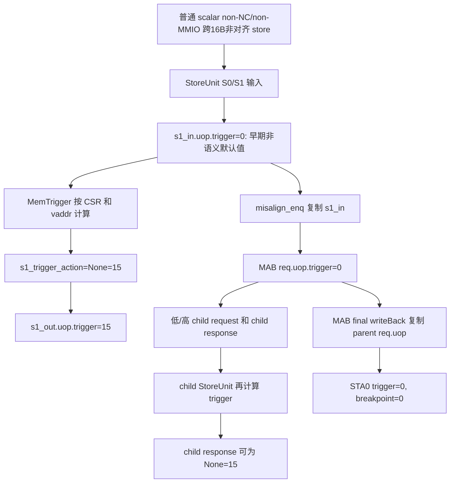

# V2 StoreMisalignBuffer 跨 16B Store Trigger 元数据传播缺陷

## 版本元数据

| 项目 | 内容 |
| --- | --- |
| RTL 版本 | V2 |
| 核验分支 | `codex/pbmt-rm-l2tlb-20260902` |
| 核验 commit | `c52d5f98029eb549b2c2a93367d56171ded619bb` |
| V2 设计基线 | `2acbf327cf7fb514593acc00d4c41117ec499e08`，见 V2 `branch_policy.md` |
| 权威源码 | `src/main/scala/xiangshan/Bundle.scala`、`src/main/scala/xiangshan/backend/fu/NewCSR/Debug.scala`、`src/main/scala/xiangshan/mem/pipeline/StoreUnit.scala`、`src/main/scala/xiangshan/mem/lsqueue/StoreMisalignBuffer.scala`、`src/main/scala/xiangshan/mem/MemBlock.scala`、`build/rtl/StoreUnit.sv`、`build/rtl/StoreMisalignBuffer.sv`、`build/rtl/MemBlock.sv` |
| 最后核验日期 | 2026-09-04 |

独立复核状态：已由第二个分析 agent 对 Scala 和生成 RTL 的 producer mux 路径独立确认；结论是
V2 DUT metadata blocker，不删除或放宽测试框架 `INT_WB_STA0_TRIGGER_PROVENANCE` 检查。现有波形样本
用于关联实际 STA0 producer；本次独立结论不依赖额外的 FSDB 解析。

## 结论

已确认 V2 的普通标量跨 16B 非对齐 store 存在一条错误的 `trigger` 元数据传播路径：

```text
无 memory trigger 命中的普通 cacheable store
  -> StoreUnit 已计算出 TriggerAction.None = 4'hf
  -> 送入 StoreMisalignBuffer 时却复制较早的 s1_in.uop.trigger = 4'h0
  -> StoreMisalignBuffer 最终标量 writeback 取保存的 parent req.uop.trigger
  -> valid writebackSta_0 变为 trigger=4'h0、exceptionVec[3]=0
```

`4'h0` 的架构编码是 `BreakpointExp`，而不是无 trigger；无 trigger 的编码是
`TriggerAction.None = 4'hf`。因此在普通、非 NC/MMIO、非 CBO 的有效 STA0 writeback 上出现
`trigger=0 && exceptionVec[3]=0`，是 DUT 的 trigger metadata 传播缺陷，不是 UVM 对
`issueSta` 的激励遗漏。

该问题目前已确认是**元数据/可观测接口语义缺陷**。它尚不能单独证明 store 数据、异常提交或
retire 已错误：ROB 对 breakpoint 的实际异常入口依赖 `exceptionVec[breakPoint]`，所以这笔
`exceptionVec[3]=0` 的 store 不会仅因 `trigger=0` 被当作 breakpoint。但任何把 valid
`trigger` 当作完整 `TriggerAction` 消费的观察者都会得到错误信息，测试框架的检查应继续把它报告出来。

## 术语和编码

| 名称 | 含义 |
| --- | --- |
| `TriggerAction.None` | 无 memory trigger 动作，编码 `4'hf`。 |
| `BreakpointExp` | memory trigger 请求 breakpoint exception，编码 `4'h0`，并必须伴随 `exceptionVec[3]=1`。 |
| `s1_in` | StoreUnit S1 的输入寄存器，普通 scalar 路径的 `uop.trigger` 不作为最终 trigger 语义使用。 |
| `s1_out` | StoreUnit 用当前访问地址和 CSR trigger 配置计算后形成的 S1 输出；其 `uop.trigger` 是有效动作。 |
| MAB | `StoreMisalignBuffer`，将跨 16B 非对齐 store 拆成两个内部 aligned child request，再向后端发送一次 parent writeback。 |
| STA0 | `io_mem_to_ooo_writebackSta_0`。它复用普通 StoreUnit、StoreQueue MMIO/CBO 和 MAB 三类 producer。 |

编码定义位于 `TriggerAction`：

```scala
BreakpointExp = 0.U
DebugMode     = 1.U
None          = 15.U
```

源码位置：`src/main/scala/xiangshan/Bundle.scala:755-767`。

## 复现场景

本问题的最小语义场景为：

| 条件 | 取值 |
| --- | --- |
| 指令 | 标量 store，大小大于 1 byte，地址不对齐且跨 16B boundary |
| PBMT/PMA | 普通 cacheable，非 NC、非 MMIO |
| CBO/CMO | 否 |
| memory trigger CSR | 无可 fire 的 store trigger；或所有 entry disabled |
| 预期 StoreUnit trigger action | `4'hf` (`None`) |
| 实际 MAB 最终 STA0 | `trigger=4'h0`、`exceptionVec[3]=0` |

已观察到的波形样本在 `720.3ns`：

| 信号 | 值 | 含义 |
| --- | --- | --- |
| `io_mem_to_ooo_writebackSta_0_valid` | `1` | STA0 payload 有效。 |
| `inner__7` | `1` | 顶层 mux 选择 StoreMisalignBuffer。 |
| `_inner_storeMisalignBuffer_io_writeBack_valid` | `1` | MAB 是实际 producer。 |
| `_inner_otherStoutConnect_io_out_valid` / `_inner_StoreUnit_0_io_stout_valid` | `0` / `0` | 不是 StoreQueue MMIO/CBO 或普通 StoreUnit producer。 |
| `writebackSta_0.bits.uop.trigger` | `4'h0` | 非法地表现为 `BreakpointExp`。 |
| `writebackSta_0.bits.uop.exceptionVec[3]` | `0` | 没有 breakpoint exception。 |
| `writebackSta_0.bits.debug.isMMIO/isNCIO` | `0/0` | 不是历史允许的 MMIO/NCIO 非规范路径。 |

## 源码数据流

### 1. CSR 不是直接给 STA0 写入 trigger

`MemBlock` 从 `csrCtrl.mem_trigger` 保存 `tdata`、`tEnable`、`triggerCanRaiseBpExp` 和
`debugMode`，再分发给每个 StoreUnit。`MemTrigger` 用当前 store 的虚拟地址、mask、类型和
CSR 配置计算 action：无 match 时固定输出 `TriggerAction.None`。

```text
csrCtrl.mem_trigger
  -> MemBlock tdata/tEnable 寄存器
  -> StoreUnit.storeTrigger
  -> s1_trigger_action
```

关键源码：

```scala
triggerAction := MuxCase(TriggerAction.None, Seq(
  fireDebugMode -> TriggerAction.DebugMode,
  breakPointExp -> TriggerAction.BreakpointExp
))
```

因此，CSR 全关闭或地址不匹配时的正确计算结果是 `4'hf`，不是 `4'h0`。

### 2. 普通 scalar input 的早期字段为 0

V2 顶层 `issueSta_0/1` 没有 `uop.trigger` 输入端口；memory trigger 本来就是 StoreUnit 在
S1 重新计算的字段。生成 RTL 对普通 scalar route 保存 `s1_in_uop_trigger` 时选择 `4'h0`：

```verilog
s1_in_uop_trigger <=
  io_misalign_stin_valid
    ? io_misalign_stin_bits_uop_trigger
    : _GEN ? 4'h0 : io_vecstin_bits_uop_trigger;
```

普通 scalar store 时 `_GEN` 为真，故该 `s1_in` 值为 `0`。它在普通 StoreUnit 流水中会被下一步
`s1_trigger_action` 覆盖，故本身不应作为普通路径的最终 trigger。

### 3. 正常 StoreUnit 流水会正确覆盖 trigger

StoreUnit 在 S1 根据 CSR/地址写入 `s1_out`：

```scala
s1_out := s1_in
s1_out.uop.trigger := s1_trigger_action
s1_out.uop.exceptionVec(breakPoint) := s1_trigger_breakpoint
```

普通路径向 LSQ 的 output 也使用 `s1_out`，所以其可见 trigger 是正确的 `s1_trigger_action`。

### 4. MAB 入队错误地使用 s1_in

非对齐 store 满足 MAB admission 后，当前源码发送的是：

```scala
io.misalign_enq.req.bits.fromLsPipelineBundle(s1_in)
```

而不是已经得到 memory trigger 结果的 `s1_out`，也没有单独用 `s1_trigger_action` 覆盖该字段。
故 MAB parent `req.uop.trigger` 锁存为 `4'h0`。

```text
StoreUnit.s1_in.uop.trigger = 0
  -> io.misalign_enq.req.bits.uop.trigger = 0
  -> StoreMisalignBuffer.req.uop.trigger = 0
```

### 5. child response 已重新计算，但最终 MAB writeback 未采用它

MAB 对 low/high child 都先复制 parent `req.uop`；child 回到 StoreUnit 时，StoreUnit 又按 child
地址重算 `s1_trigger_action`。无 match 时 child response 的 trigger 可为 `4'hf`。

但是 MAB 最终 scalar writeback 使用的是保存的 parent：

```scala
io.writeBack.bits.uop := req.uop
```

生成 RTL 也直接连为：

```verilog
assign io_writeBack_bits_uop_trigger = req_uop_trigger;
```

它不从 `splitStoreResp(curPtr).uop.trigger` 合并或回填。于是 child 的正确 `None` 不会修复 parent
已保存的 `0`。

### 6. STA0 顶层仅转发 MAB payload

`MemBlock` 在 StoreUnit0、StoreQueue otherStout 和 MAB 之间选择 STA0。MAB 获得写回资格时：

```scala
stOut(0).bits := storeMisalignBuffer.io.writeBack.bits
```

所以最终 top-level `writebackSta_0.trigger` 保留 parent 的错误值。

## 端到端时序



这条图中的 `F` 与 `G` 是同一个 StoreUnit S1 周期的两条不同输出。问题不是 `MemTrigger` 没有计算
`None`，而是 MAB admission 选择了计算前的 bundle。

## DUT 问题边界

### 已确认的事实

1. 顶层 `issueSta` 没有 `uop.trigger` 驱动字段，测试框架不能把该值从 `0` 激励为 `4'hf`。
2. 无 memory trigger 命中时，`MemTrigger` 的正确输出是 `4'hf`。
3. 普通 non-NC/non-MMIO MAB final writeback 使用了 parent 的早期 `0`，不是 child response 的
   重新计算结果。
4. 有效 STA0 端口保留 `trigger` capability，且本例同时没有 breakpoint exception，故输出 metadata
   自相矛盾。

### 尚未由本结论宣称的范围

1. 未据此宣称 store data、SQ completion、retire 或异常 redirect 已经错误。
2. 未据此把 StoreQueue MMIO/CBO 写回中的历史 `trigger=0` 一并归类为本问题；那是不同 producer 和
   不同语义边界。
3. 对跨 16B store 命中 `DebugMode=1` 的分支，静态路径显示原 StoreUnit 会产生带正确 action 的
   写回并 revoke MAB；是否完全避免 MAB 的迟到/重复 writeback 仍需定向波形确认，不能由本问题直接
   推导为 DebugMode 已丢失。
4. 未修改 RTL。本记录只给出确认路径和后续 RTL owner 可评估的最小修复方向。

### RTL owner 的最小修复方向

应使进入 MAB 的 parent metadata 使用已计算的 memory trigger 结果，而不是普通 scalar `s1_in` 的
早期默认字段。候选方式包括：

```text
保留当前 MAB admission 和地址/数据字段来源，
但以 s1_trigger_action 和 s1_trigger_breakpoint 覆盖 MAB enqueue payload 的
uop.trigger 与 exceptionVec[breakPoint]。
```

是否直接把整个 `s1_out` 复制到 MAB，需由 RTL owner 评估其 TLB/PMA 派生字段、时序和 MAB 重查地址
语义，不能在没有 review 的情况下机械替换。

## 测试框架检查恢复要求

### 当前代码状态

当前分支的
`mem_ut/ver/ut/memblock/seq/base_seq_help/dispatch_monitor_event_adapter.sv` 仍保留：

```systemverilog
if (raw.trigger == 4'h0 && !raw.exception_vec[3] &&
    main_tr.op_class != MEMBLOCK_OP_CLASS_CBO &&
    !raw.debug_is_mmio && !raw.debug_is_ncio) begin
    `uvm_fatal("INT_WB_STA0_TRIGGER_PROVENANCE",
               "STA0 trigger=0 without breakpoint needs uncache/CBO provenance")
end
```

这段检查已经是本结论所要求的行为，当前无需再次修改 adapter 才能“恢复”。它在 raw 层允许 STA0 的
历史 CBO/uncache 非规范 `0`，但在 UID/main transaction 已绑定后拒绝普通 cacheable MAB 的
`0 + !breakpoint` 组合。

### 禁止的放宽

不得执行
`AI_DOC/plan/test_framework/plan/undo/mem_ut_v2_sta0_split_store_trigger_provenance_fix_plan_20260904.md`
中“删除 `INT_WB_STA0_TRIGGER_PROVENANCE`”的方案。该 plan 的前提把 final MAB writeback 误解释为
child `trigger` 被清零；实际 final writeback 使用 parent `req.uop.trigger`，且该 parent 值来自
StoreUnit 的早期 `s1_in`。

不得仅因为 raw STA0 没有 producer-id，就允许所有：

```text
STA0 && trigger=0 && exceptionVec[3]=0
```

这样会掩盖本次普通 cacheable MAB metadata 缺陷。历史例外仅限能够证明为 CBO、MMIO 或 NCIO 的
路径。

### 若目标分支曾删除该检查

后续负责测试框架修改的 agent 应先比较目标分支和当前基线；若上述 conditional/fatal 已被删除或
弱化，应按原样恢复。恢复范围仅限 attached STA0 metadata check，不应放宽：

1. `check_raw_int_wb_metadata()` 对其它 source/lane 的 trigger 编码检查；
2. `check_attached_int_wb_metadata()` 中 STA0 的 `flushPipe`/CBO 检查；
3. UID、ROB/SQ key normalization 和 writeback lifecycle。

恢复后应使用一个 PBMT0、非 NC/MMIO、无 CBO、无 memory trigger 的跨 16B 非对齐 scalar store
定向场景。当前 RTL 下该检查的触发是**预期的 DUT 问题检出**；RTL 修复后，同一场景应满足：

```text
StoreUnit s1_trigger_action = 4'hf
MAB enqueue parent trigger  = 4'hf
MAB final STA0 trigger      = 4'hf
exceptionVec[3]             = 0
INT_WB_STA0_TRIGGER_PROVENANCE 不触发
```

## 建议波形路径

同一 ROB/uop 需要按 valid/fire 采样以下信号：

```text
/top_tb/U_MEMBLOCK/inner_StoreUnit_0/_storeTrigger_tdataVec_io_toLoadStore_triggerAction
/top_tb/U_MEMBLOCK/inner_StoreUnit_0/s1_in_uop_trigger
/top_tb/U_MEMBLOCK/inner_StoreUnit_0/io_misalign_enq_req_valid
/top_tb/U_MEMBLOCK/inner_StoreUnit_0/io_misalign_enq_req_bits_uop_trigger
/top_tb/U_MEMBLOCK/inner_storeMisalignBuffer/req_uop_trigger
/top_tb/U_MEMBLOCK/inner_storeMisalignBuffer/io_splitStoreReq_valid
/top_tb/U_MEMBLOCK/inner_storeMisalignBuffer/io_splitStoreReq_bits_uop_trigger
/top_tb/U_MEMBLOCK/inner_StoreUnit_0/io_misalign_stout_valid
/top_tb/U_MEMBLOCK/inner_StoreUnit_0/io_misalign_stout_bits_uop_trigger
/top_tb/U_MEMBLOCK/inner_storeMisalignBuffer/io_writeBack_valid
/top_tb/U_MEMBLOCK/inner_storeMisalignBuffer/io_writeBack_bits_uop_trigger
/top_tb/U_MEMBLOCK/io_mem_to_ooo_writebackSta_0_valid
/top_tb/U_MEMBLOCK/io_mem_to_ooo_writebackSta_0_bits_uop_trigger
/top_tb/U_MEMBLOCK/io_mem_to_ooo_writebackSta_0_bits_uop_exceptionVec_3
/top_tb/U_MEMBLOCK/io_mem_to_ooo_writebackSta_0_bits_debug_isMMIO
/top_tb/U_MEMBLOCK/io_mem_to_ooo_writebackSta_0_bits_debug_isNCIO
```

同时观察 STA0 mux 的 MAB select 和其它 producer valid，排除 StoreQueue MMIO/CBO 的历史例外。

## 关联文档

- [V2 Memory trigger flow](memory_trigger_flow.md)：CSR trigger 的正常计算和编码语义。
- [V2 Store TLB 命中后的 Replay 与 Retry flow](store_tlb_hit_replay_and_retry_flow.md)：非对齐 MAB admission、内部 child retry 与 STA IQ replay。
- [V2 Int Writeback Agent 接口知识](../../../interface/v2/agents/int_writeback_agent.md)：STA0 端口 capability 与历史 StoreQueue `trigger=0` 例外。
- [V2 StoreQueue NC 跨 16B 异常、读指针与 Redirect 恢复设计确认](storequeue_nc_cross16_exception_rdataptr_redirect_design_confirmation.md)：不同的 NC/MAB/StoreQueue 问题，不能与本记录混为同一根因。

## 源码证据

- `src/main/scala/xiangshan/Bundle.scala:755-767`：`TriggerAction` 编码。
- `src/main/scala/xiangshan/backend/fu/NewCSR/Debug.scala:253-273`：无匹配时输出 `TriggerAction.None`。
- `src/main/scala/xiangshan/mem/MemBlock.scala:823-836,1264-1270`：CSR trigger 状态保存与分发。
- `src/main/scala/xiangshan/mem/pipeline/StoreUnit.scala:343-356,380-403`：Store S1 计算并写入有效 trigger。
- `src/main/scala/xiangshan/mem/pipeline/StoreUnit.scala:430-437`：MAB admission 和 `s1_in` 复制。
- `src/main/scala/xiangshan/mem/lsqueue/StoreMisalignBuffer.scala:360-371,527-540,598-607`：parent/child 建立和 final parent writeback。
- `src/main/scala/xiangshan/mem/MemBlock.scala:1281-1286,1388-1396`：MAB 与 StoreUnit0、STA0 mux 的连接。
- `build/rtl/StoreUnit.sv:846-849,891-897,1295,1471`：早期 scalar `0`、已计算 action、child response 和 MAB enqueue 的实际连线。
- `build/rtl/StoreMisalignBuffer.sv:1495-1545`：child trigger mux 和 final parent trigger 输出。
- `build/rtl/MemBlock.sv:30569-30574`：顶层 STA0 选择 MAB/otherStout/StoreUnit0。
- `mem_ut/ver/ut/memblock/seq/base_seq_help/dispatch_monitor_event_adapter.sv:722-760`：当前 raw/attached trigger metadata 检查。

## 知识修订记录

| 日期 | commit | 旧结论 | 新结论 | 修订原因 | 影响范围 |
| --- | --- | --- | --- | --- | --- |
| 2026-09-04 | `c52d5f98029eb549b2c2a93367d56171ded619bb` | 待执行 plan 将普通 MAB `trigger=0` 视为合法 child 清零，建议删除 STA0 provenance check | final MAB writeback 使用 parent `req.uop.trigger`；普通 scalar parent 在 MAB admission 时取到早期 `s1_in=0`，故应保留 provenance check 并按 DUT metadata 缺陷处理 | 追踪 StoreUnit、MAB、MemBlock 的 Scala 和生成 RTL 字段赋值 | V2 StoreUnit、MAB、STA0 adapter、memory trigger flow |

## 待确认项

- RTL owner 尚未确认最终修复方式，以及该非规范值是否被设计有意定义为 valid STA0 的 don't-care metadata。
- 本记录未核验 V3，不能把本结论推广到 V3。
