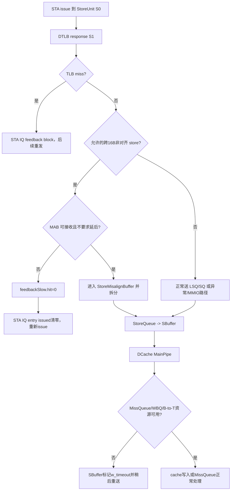

# V2 Store TLB 命中后的 Replay 与 Retry Flow

## 版本元数据

| 项目 | 内容 |
|---|---|
| RTL 版本 | V2 |
| 分支 | `mem_ut_uvm_v2` |
| 核验 commit | `7735268244088acb4e66f30bf367570764e7177a` |
| 设计基线 | `2acbf327cf7fb514593acc00d4c41117ec499e08`，见 V2 `branch_policy.md` |
| 权威源码 | `StoreUnit.scala`、`StoreMisalignBuffer.scala`、`StorePipe.scala`、`MainPipe.scala`、`Sbuffer.scala`、`IssueQueue.scala` |
| 最后核验日期 | `2026-08-09` |

## Flow 范围

本文回答一个限定问题：标量 `StoreUnit` 已收到 DTLB `hit`，且没有有效的
store page fault、access fault、guest page fault 时，什么条件仍会造成重发。

必须区分两种不同层级的行为：

1. **STA IQ replay**：Store Address issue queue 收到 `feedbackSlow.hit=0`，把该
   store entry 从 `issued` 重新置为未发射，再次送入 `StoreUnit`。
2. **SBuffer retry**：store 已经过 StoreQueue 并进入 SBuffer；DCache 要求同一
   SBuffer line 稍后重送。它不会把原始 store uop 放回 STA IQ。

本文覆盖普通标量 `StoreUnit` 与它后续的 SBuffer-DCache retry；不把 vector store、
AMO/SC 的独立反馈语义泛化为普通 STA replay。Hybrid Unit 的 store feedback 另在本文
边界说明。

## 术语

| 术语 | 当前含义 |
|---|---|
| TLB hit | `StoreUnit` 的 `s1_tlb_miss=0`；它只表示翻译路径命中，不表示 DCache 命中、PMP/PMA 允许或 store 已经写入 cache。 |
| STA IQ replay | `feedbackSlow.hit=0` 被 IssueQueue 转为 `RespType.block`，使 STA IQ entry 的 `issued` 清零并可再次 issue。 |
| misalign buffer | `StoreMisalignBuffer`，负责将允许的跨 16-byte 非对齐 store 拆成两个对齐子 store。 |
| DCache retry | SBuffer 已经发给 DCache MainPipe 的写请求收到 `store_replay_resp` 后，在 SBuffer 内等待并重送。 |
| DCache hit | DCache line tag/权限命中；它与 TLB hit 是不同层次。DCache line 不存在或没有写权限时，仍可发生在 TLB hit 后。 |

## 核心结论

对于 **普通标量 STA IQ 的直接重发**，在 TLB hit 且无 TLB 页表异常的前提下，`StoreUnit` 中唯一会把
`feedbackSlow.hit` 从 1 压成 0 的额外条件是：**允许非对齐扩展时，misalign buffer 不能接收该 store，或该跨
16-byte store 被要求暂缓到 SQ/ROB commit 相关边界后再试。**

下列事件不属于这个直接 STA IQ replay：

- PMP/PMA store access fault、PBMT/PMA 导出的 MMIO/NC、trigger 和普通非对齐异常走异常或 MMIO/Uncache 路径；
- redirect 通过 `needFlush` kill 当前 uop；它是 flush/cancel，不是 feedback replay；
- StoreUnit 早期 `StorePipe` 的 DCache meta/tag miss 只产生 store-prefetch 信息，`resp.replay` 固定为 0；
- store-to-load nuke 触发的是较年轻 load 的 replay/rollback，不重发该 older store。

但在 **更晚的 SBuffer-DCache 层**，即使 TLB hit 且无 TLB fault，DCache 仍可能要求 SBuffer retry：

1. 写请求需要进入 MissQueue，但 `miss_req.ready=0` 或 Writeback Queue 阻塞 miss request；
2. cache line 在 B 状态，store 需要 B-to-T 权限提升，而该 set 中 B-to-T 占用过多，`s2_grow_perm_fail=1`。

这两项只重送 SBuffer entry，不重新执行原始指令的地址计算和 DTLB 请求。

## 主流程图



## 主流程文字伪代码

```text
1. StoreUnit S1 收到 TLB response。若 response.miss=1，STA IQ 收到 tlbMiss 类型的 block feedback；
   本文讨论 response.miss=0 的分支。

2. 对标量、非 prefetch、非 CBO、非 MAB 回流的非对齐 store，若硬件非对齐扩展开启，StoreUnit 尝试把请求放入
   StoreMisalignBuffer。

3. 若 MAB 的 req.ready=0，或 store 跨越 16-byte 边界但尚未到允许的 SQ/ROB commit 对齐点，
   `s2_misalignNeedReplay=1`。StoreUnit 仍发出 slow feedback，但把 hit 改为 0；STA IQ 因而撤销 issued 状态并重发。

4. 若 MAB 接收成功，原始 STA IQ 获得 success。MAB 后续逐个发射拆分的子 store；某个子 store TLB miss 时，
   MAB 内部重新发送该子请求，不把原 uop 退回 STA IQ。

5. 已提交到 SBuffer 的 cacheable store 由 DCache MainPipe 处理。DCache line 未命中或没有写权限本身可正常送
   MissQueue；只有 MissQueue/WBQ 无法接收，或 B-to-T 权限提升失败时，MainPipe 才发 `store_replay_resp`。

6. SBuffer 收到该 response 后保留 entry、清 replay counter 并置 `w_timeout`。超时选择逻辑重新选择该 entry，
   再次向 DCache 发送写请求；原 STA IQ 不参与这次 retry。
```

## 关键阶段

### 1. TLB 的有效 G-stage access fault 已折叠为 `af`

源码位置：`src/main/scala/xiangshan/cache/mmu/TLB.scala:416-505`。

`perm_check()` 按 `s2xlate` 组合 S1 `perm.af` 和 S2 `g_perm.af`：onlyStage2 使用 S2，
allStage 使用两者 OR，并最终写入 `resp.excp.af.st`。因此 StoreUnit 没有独立消费一个
`gaf.st` 字段；对 StoreUnit 而言，已经有效的 G-stage access fault 表现为 `af.st`。

这也意味着“无 `af`”在这里应理解为无最终有效 access fault，而不是只检查 raw S1 AF。

### 2. STA IQ replay 的唯一非 TLB-miss 条件

源码位置：`src/main/scala/xiangshan/mem/pipeline/StoreUnit.scala:175-186, 427-434, 509-519`。

关键逻辑等价于：

```scala
s2_misalignNeedReplay := RegEnable(
  s1_toMisalignBufferValid &&
    (!io.misalign_enq.req.ready || s1_misalignNeedReplay),
  s1_fire
)

feedbackSlow.hit := s1_feedback.hit && !s2_misalignNeedReplay
// s1_feedback.hit := !s1_tlb_miss
```

`s1_toMisalignBufferValid` 同时要求：当前 S1 有效、不是硬件 prefetch、不是 MAB 回流、不是
CBO、是非对齐访问、不是 `misalignWith16Byte` 特例，并且 `hd_misalign_st_enable` 已开启。

`s1_misalignNeedReplay` 的来源是：store 跨 16-byte 边界，且它既不是当前 SQ commit pointer，
也不是当前 ROB/SQ commit uop。该条件会同时禁止本拍把请求送入 MAB，必须由 STA IQ 再次 issue。

IssueQueue 将 `feedbackSlow.hit=0` 映射为 `RespType.block`，并将 entry 的 `issued` 清零，
所以这确实是 RS/STA IQ 层的 replay，而不只是一个统计标志。

### 3. TLB hit 后的异常、MMIO 和 redirect 不是 STA IQ replay

源码位置：`StoreUnit.scala:395-418, 459-502`。

| 条件 | StoreUnit 行为 | 是否使 STA IQ replay |
|---|---|---|
| PMP/PMA `s2_pmp.st` | 写入 `storeAccessFault`，走异常处理 | 否 |
| PBMT/PMA 得到 MMIO 或 NC | kill DCache write intent，转入 LSQ MMIO/Uncache 相关路径 | 否 |
| misaligned MMIO、CBO 与 MMIO 组合 | 转为 store access/misaligned exception | 否 |
| trigger breakpoint/debug | 写入 breakpoint 或 debug 异常条件 | 否 |
| `robIdx.needFlush(redirect)` | kill S1/S2 当前流水项 | 否，属于 redirect cancel |
| StorePipe meta/tag miss | 只回传 `miss` 供 prefetch train；`replay` 固定为 0 | 否 |

其中 PMP/PMA 的结果只在物理地址有效后才可信。它们可能在 TLB hit 后产生新的 access fault，
但该分支是精确异常，而不是把 store 再放回 issue queue。

### 4. StoreMisalignBuffer 的内部 retry

源码位置：`StoreUnit.scala:524-528`、`StoreMisalignBuffer.scala:253-285, 560-591`。

MAB 重新发送拆分子 store 的条件是：收到的 `splitStoreResp.bits.need_rep=1`，或仍有未发送的
split part。`StoreUnit` 对 MAB 回流请求把 `need_rep` 直接设置为该子请求的 TLB miss。

因此，一个原始跨页/跨 16-byte store 即使第一个 TLB 查询命中，后续另一半的独立翻译仍可能 miss，
并导致 **MAB 内部** retry。这不是原始 STA IQ replay，也不能把原始 TLB hit 当作两个拆分子访问都已翻译成功。

### 5. SBuffer-DCache retry 的资源和权限原因

源码位置：`src/main/scala/xiangshan/cache/dcache/mainpipe/MainPipe.scala:403-497, 832-874`、
`src/main/scala/xiangshan/mem/sbuffer/Sbuffer.scala:637-758`。

MainPipe 中的 `s1_hit/s2_hit` 是 **DCache tag 加 cache permission** 的命中，和 TLB hit 无关。
对 SBuffer 普通 store：

```scala
replay = !io.miss_req.ready || io.wbq_block_miss_req

store_replay_resp.valid := s2_valid && (
  s2_can_go_to_mq && replay && s2_req.isStore ||
  s2_grow_perm_fail && s2_isStore
)
```

其中：

- `s2_can_go_to_mq` 表示 store 没有可直接写的 DCache line/权限，需要进入 MissQueue；单独的
  DCache miss 不是 retry，MissQueue 正常接受时会继续处理。
- `!miss_req.ready` 表示 MissQueue 入口不能接收；`wbq_block_miss_req` 表示 Writeback Queue 的
  冲突检查阻塞这笔 miss 请求。
- `s2_grow_perm_fail` 表示 line 命中但只有 B 权限，store 需要 B-to-T 提升，同时当前 set 的
  B-to-T way 占用超过可接受阈值。

SBuffer 收到 replay response 后只置该 line 的 `w_timeout`，随后 timeout arbitration 重新选择并重送。
它不会生成 `staIqFeedback`，也不会重发 DTLB request。

### 6. Hybrid store 与 vector store 边界

源码位置：`src/main/scala/xiangshan/mem/pipeline/HybridUnit.scala:1044-1066`。

Hybrid Unit 的标量 store fast feedback 直接使用 `!s2_tlb_miss`。因此在该路径中，TLB hit 本身
不会因为 DCache/PMP/MMIO 等条件被改写成 STA IQ block；这些条件仍走其异常、MMIO 或后续 LSQ/DCache
处理。vector store 使用独立的 vector feedback 和 merge/misalignment flow，不能把普通 STA 的
`s2_misalignNeedReplay` 公式直接套用。

## 状态、队列和优先级

| 状态/字段 | 生产者 | 置位条件 | 消费者 | 结果 |
|---|---|---|---|---|
| `s2_misalignNeedReplay` | StoreUnit S2 | MAB 不能接收，或跨 16-byte 的 commit 边界限制 | `feedbackSlow.hit` | 原 STA IQ replay |
| `feedbackSlow.hit=0` | StoreUnit | TLB miss 或上述 MAB replay | IssueQueue | `RespType.block`，entry `issued=0` |
| `SqWriteBundle.need_rep` | MAB 回流的 StoreUnit | 拆分子 store TLB miss | StoreMisalignBuffer | MAB 内部重送子请求 |
| `store_replay_resp` | DCache MainPipe | MissQueue/WBQ 不可接收，或 B-to-T grow fail | SBuffer | SBuffer retry |
| `w_timeout` | SBuffer | 收到 DCache replay response | timeout arbitration | 稍后重新选中该 SBuffer entry |

## 异常、回滚与 Flush

- TLB/PMP/PMA/trigger 产生的异常优先于正常 store 写入；它们不通过 IQ block 表达 replay。
- redirect 以 `robIdx.needFlush()` kill 尚在 StoreUnit/DCache 前段的 uop；这是取消，而不是要求相同
  dynamic instance 重试。
- store-to-load nuke query 由 older store 发出，消费者是 younger load pipeline/LoadQueue replay，
  不会反向重发 older store。
- SBuffer retry 在 store 已从前端 issue 生命周期脱离后发生；flush/fence 对该类已进入 drain 的
  store 采用 drain/收敛语义，不能把它解释为原 STA 重新执行。

## 关联 Agent 和 Flow

- [DTLB-L2TLB 多请求与 Response 次序 Flow](dtlb_l2tlb_request_response_ordering_flow.md)：TLB miss、response 与 C-2 CSR 边界。
- [Memory PMP/PMA 权限检查 Flow](memory_pmp_pma_permission_flow.md)：`s2_pmp.st/mmio` 的来源与权限边界。
- [Memory trigger Flow](memory_trigger_flow.md)：Store trigger 如何转为 exception/debug，而非 replay。
- [Memory flushPipe Flow](memory_flush_pipe_flow.md)：redirect 对 StoreUnit/DCache 前段请求的 kill 边界。
- [L2 内侧 TileLink 请求、权限与回复 Flow](l2_inner_tilelink_request_response_flow.md)：SBuffer 到 DCache、MissQueue 与外部一致性事务的后续路径。

## V2/V3 差异

本轮只核验 V2。V3 的 StoreUnit、DCache MainPipe 和 SBuffer replay 条件必须在 V3 分支单独追踪，
不得将本文公式直接用于 V3。

## 源码证据

- `src/main/scala/xiangshan/cache/mmu/TLB.scala:416-505`：S1/S2 AF 的组合及 `af.st` 输出。
- `src/main/scala/xiangshan/mem/pipeline/StoreUnit.scala:175-186, 307-324`：TLB hit/miss、跨 16-byte 非对齐重试条件与 S1 kill。
- `src/main/scala/xiangshan/mem/pipeline/StoreUnit.scala:341-418, 427-434, 459-519`：trigger、异常/MMIO、MAB enqueue、slow feedback 和 `s2_misalignNeedReplay`。
- `src/main/scala/xiangshan/backend/issue/IssueQueue.scala:1109-1119`、`EntryBundles.scala:285-391`：feedback hit 到 `RespType.block`，再使 `issued` 清零的 IQ 重发机制。
- `src/main/scala/xiangshan/cache/dcache/storepipe/StorePipe.scala:149-161`：StoreUnit 的 DCache meta/tag 查询 response 固定 `replay=false`。
- `src/main/scala/xiangshan/mem/lsqueue/StoreMisalignBuffer.scala:253-285, 560-591`：拆分子 store 的 `need_rep` 内部重送。
- `src/main/scala/xiangshan/cache/dcache/mainpipe/MainPipe.scala:403-497, 832-874`：DCache miss/MissQueue/WBQ/B-to-T 条件与 `store_replay_resp`。
- `src/main/scala/xiangshan/cache/dcache/DCacheWrapper.scala:1582-1590`、`src/main/scala/xiangshan/mem/MemBlock.scala:1761`：MainPipe replay response 经 DCache store interface 接到 SBuffer。
- `src/main/scala/xiangshan/mem/sbuffer/Sbuffer.scala:637-758`：SBuffer 收到 replay 后设置 `w_timeout` 并等待重送。
- `src/main/scala/xiangshan/mem/pipeline/HybridUnit.scala:1044-1066`：Hybrid store 的 feedback 边界。

## 知识修订记录

| 日期 | commit | 旧结论 | 新结论 | 修订原因 | 影响范围 |
|---|---|---|---|---|---|
| 2026-08-09 | `7735268244088acb4e66f30bf367570764e7177a` | 首次建立，无同版本长期 flow 旧结论 | 区分 STA IQ replay、MAB 内部 retry 和 SBuffer-DCache retry；明确 TLB hit 后普通 STA IQ 的额外直接 replay 只来自 MAB nack/commit 边界 | 用户要求结合 V2 Scala 分析 store TLB hit 后的 replay 条件 | V2 StoreUnit、StoreMisalignBuffer、IssueQueue、SBuffer、DCache MainPipe |

## 待确认项

- 本文未核验 V3 对应实现。
