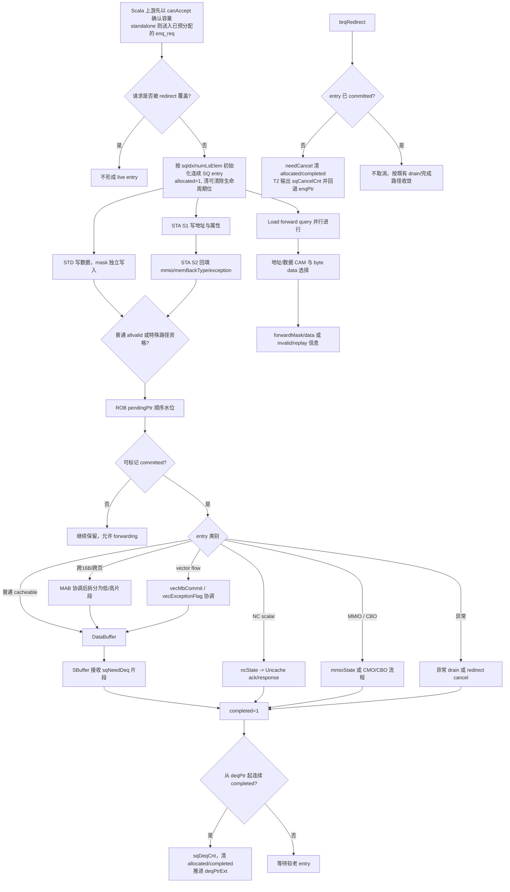

# V2 StoreQueue 特性与端到端 Flow

## 版本元数据

| 项目 | 内容 |
|---|---|
| RTL 版本 | V2 |
| 分支 | `mem_ut_uvm_v2` |
| 核验 commit | `1567628320ef77e1de1a3ae7a7c7057423e842b4` |
| 行为权威 | `src/main/scala/xiangshan/mem/lsqueue/StoreQueue.scala`；相关行为还核对 `StoreQueueData.scala`、`StoreMisalignBuffer.scala`、`LSQWrapper.scala`、`MemBlock.scala`、DCache `CMOUnit`、CoupledL2 `MainPipe/MSHR/GrantBuffer`、`DatamoduleResultBuffer.scala` 与 `Bundles.scala`。 |
| RTL 接口核验 | `build/rtl/StoreQueue.sv`。本文件用它核对当前工作区可见端口、方向和位宽；功能时序结论以 Scala/Chisel 源码为准。 |
| 最后核验日期 | `2026-09-15` |

## 术语与抽象功能说明

`StoreQueue`（SQ）不是“收到 store 就立刻向内存写”的缓冲器。它先为已 dispatch 的 store
保留程序顺序和数据，再允许更年轻 load 查询、转发或保守 replay；只有满足 ROB 顺序授权和下游
接收条件后，store 才能从 SQ 经 SBuffer、Uncache 或 CMO 路径离开。

| 英文术语 | 当前 flow 中的中文含义 | 代码对象或状态落点 | 典型场景 |
|---|---|---|---|
| SQ entry | 一条 store 或一个 vector store flow 占用的物理 SQ 槽。它保存 `uop`、地址、数据、mask 和生命周期位。 | `uop(i)`、地址/数据模块及各状态向量。 | 标量 store 通常占一个 entry；向量 store 可按 `numLsElem` 占多个连续 entry。 |
| `allocated` | entry 已分配，仍属于当前动态指令。它只表示槽位所有权，不表示地址、数据或 ROB 授权已到达。 | `allocated(i)`。 | dispatch 后为 1；正常物理出队或 redirect cancel 后清零。 |
| `addrvalid` / `datavalid` | 地址侧或数据侧已经写入 SQ 的就绪位。二者均为 1 才构成普通 scalar store 的 `allvalid`。 | `addrvalid(i)`、`datavalid(i)`、`allvalid(i)`。 | STA 和 STD 可乱序抵达；load forwarding 因此必须单独检查两者。 |
| `committed` | SQ 从 ROB 的 `pendingPtr` 顺序水位得到“这项可以进入下游完成”的许可。它不是直接等同于某一拍 `scommit`。 | `committed(i)`、`cmtPtrExt`。 | 普通 cacheable store 需先有此许可才可进入 DataBuffer。 |
| `completed` | entry 已完成 SQ 所需的下游交接或特殊事务响应，因此可以由 `deqPtrExt` 物理释放。它不是架构层的 ROB commit。 | `completed(i)`、`sqDeqCnt`。 | SBuffer 接收普通 store、NC 得到 ack/response、MMIO writeback 后都会置位。 |
| `rdataPtrExt` | SQ 当前从地址/数据 RAM 取数、准备构造 DataBuffer 或 Uncache 请求的读调度指针。 | `rdataPtrExt`。 | 它可以因 DataBuffer 接收、NC 完成或 MMIO writeback 前移；不等同于实际释放指针。 |
| `deqPtrExt` | SQ 物理释放指针。只跨过从队头开始连续满足 `allocated && completed` 的 entry。 | `deqPtrExt`、`sqDeqCnt`、`io.sqDeq`。 | 前一项未完成时，后一项即使已完成也不能越过它出队。 |
| `DataBuffer` | SQ 到 SBuffer 之间的两 lane、带寄存器边界的短 FIFO，承受 SBuffer backpressure。 | `DatamoduleResultBuffer[DataBufferEntry]`。 | 普通 cacheable store 在此暂存；跨 16B store 可同时写低/高两个片段。 |
| `SBuffer` | 已提交 cacheable store 的更后级写缓冲。SQ 只在它接受带 `sqNeedDeq` 的 DataBuffer 项后把对应 SQ entry 标为完成。 | `io.sbuffer`。 | SBuffer 后续向 DCache 发写和 retry 不再属于 SQ 的前端生命周期。 |
| forwarding | 更年轻 load 从较老、但尚未离开 SQ 的 store 取得重叠字节数据的机制。 | `io.forward`、`SQAddrModule`、`SQDataModule`。 | load S1 获得 fast mask，load S2 获得寄存后的 mask/data 和 invalid 原因。 |
| ready frontier | 告诉 LoadQueue/Scheduler“从哪个 SQ 年龄位置开始，store 的地址或地址加数据已经满足某种依赖观察条件”的水位。 | `stAddrReadySqPtr`、`stDataReadySqPtr` 及相应 Vec。 | 它是依赖/replay 辅助信息，不能当作某项已经写到内存。 |
| NC | Non-Cacheable 主存访问属性。NC store 走 Uncache，而不是普通 SBuffer。 | `nc(i)`、`ncState`、`ncReq`。 | 正常 NC 必须等 ack/response，原因是 SQ 仍可能要为 load forwarding 保留数据。 |
| MMIO | 内存映射 I/O store。它必须在 ROB head 的顺序点发起，且响应后先向后端 writeback。 | `mmio(i)`、`pending(i)`、`mmioState`。 | `pendingst/pendingPtr` 匹配、地址数据齐全后，才从 `s_idle` 转到 `s_req`。 |
| CBO/CMO | cache block operation / cache management operation。CBO clean/flush/inval 经 CMO 接口完成；`cbo.zero` 有单独的 SBuffer/flush/writeback 路径。 | `deqCanDoCbo`、`cmoOpReq`、`cboZero*`。 | 普通 Uncache 通道会被 CBO 分支暂时关闭。 |
| MAB | `StoreMisalignBuffer`。它把跨 16-byte 的硬件非对齐 store 拆成两个对齐子请求；跨 4KB 页时还向 SQ 提供高页物理地址。 | `StoreMisalignBuffer`、`maControl`。 | 跨页后 MAB 在 `s_block` 等 SQ 真正接收两个片段。 |
| MAB parent | MAB 当前保存的那条原始跨 16B store。它与 SQ 中的一个原始 entry 用完整 `SqPtr{flag,value}` 对应，而不是为两个 child 各分配一个 SQ entry。 | MAB `req.uop.sqIdx`；SQ `rdataPtrExt(0)`。 | SQ entry 继续拥有原始 data/mask、生命周期位和最终释放权；MAB 只提供拆分地址处理所需的上下文。 |
| high child PAddr | 跨页访问后半段的**完整物理地址**，不是 low PAddr 的高位 bit。相邻虚拟页可映射到不连续物理页，故不能以 `paddrLow + 8` 代替。 | MAB `splitStoreResp(1).paddr`，经 `maControl.toStoreQueue.paddr` 输出。 | SQ 只在 parent 命中且 MAB 可释放时，将它写入 DataBuffer 的 high lane。 |
| `doDeq` | SQ 对 MAB 的“low/high DataBuffer pair 已接收”回执。 | `maControl.toStoreMisalignBuffer.doDeq`。 | 它释放 MAB 保存槽；不是 `completed`，更不是最终 `sqDeq`。 |
| `vecMbCommit` | vector merge/feedback 交给 SQ 的“该 vector flow 可以按 vector 规则继续”的完成许可。 | `vecMbCommit(i)`。 | vector store 不以 scalar `allvalid` 作为唯一完成条件。 |
| redirect cancel | branch misprediction 或精确异常 redirect 取消尚未得到 SQ `committed` 许可的年轻 entry，并回收对应 allocation。 | `needCancel`、`sqCancelCnt`、`enqPtrExt`。 | `sqCancelCnt` 在 redirect 后两拍输出，供 LSQ 上层恢复资源账本。 |

## Flow 范围

### 入口、出口与完成条件

本文件覆盖 `StoreQueue` 的完整主生命周期：

1. 在 Scala/`LSQWrapper` 内部，dispatch 的 store 分配请求进入 SQ 并获得 `SqPtr`；当前 standalone
   `build/rtl/StoreQueue.sv` 已裁掉 `canAccept/resp`，只接收上游已分配好的 `io_enq_req_*`，因此黑盒 driver
   只能送入预先确定的 SQ 区间。
2. StoreUnit 的 STA 地址、STD 数据和 store mask 分别回填 SQ；S1 写地址、NC 与非对齐属性，S2 再补齐
   MMIO、memory-back、异常等晚到属性。Scala 内部还可能携带 `prefetch` 状态，但该字段已从当前
   `build/rtl/StoreQueue.sv` 顶层裁剪，只能在 source/full-MemBlock 层次观察，不能作为 standalone pin 输入。
3. 同时服务 load 的 store-to-load forwarding、地址/数据未就绪反馈和 ready frontier。
4. 使用 ROB 的顺序 sideband 把 entry 标为 `committed`，选择 cacheable、NC、MMIO/CBO 或异常 drain 路径。
5. 普通 cacheable store 经 `DataBuffer -> SBuffer`，NC/MMIO/CBO 经各自状态机；SQ 最终以连续 `completed` entry 形成 `sqDeq`。
6. 覆盖跨 16B、跨 4KB 页、vector、异常、redirect、WFI 和性能观察边界。

本文件的完成条件是：entry 被 `deqPtrExt` 的连续完成判定释放，或在尚未 `committed` 时被 redirect
cancel。若 store 已进入 SBuffer，SBuffer 对 DCache 的 retry、MissQueue/WBQ 资源仲裁和最终 cache
可见性属于后续模块的职责，不在本 flow 内重新执行原始 SQ entry。

### 明确的相邻边界

- StoreUnit 负责地址计算、DTLB/PMP/PMA/trigger 的前段判断和是否把硬件非对齐请求送给 MAB；SQ 消费
  已形成的 STA/STD/MAB 回填结果。
- ROB 负责架构精确提交、异常 redirect 和 `pendingPtr/pendingst/scommit` sideband；SQ 只把这些顺序
  信息变成内部 `committed`、MMIO 状态推进和物理释放。
- `StoreMisalignBuffer` 与 SQ 并列实例化在 `MemBlock` 中，不是 SQ 的子模块；`maControl` 是二者之间
  的跨页非对齐协调接口，不是通用 MMIO 控制接口。
- `build/rtl/StoreQueue.sv` 的接口核验显示本 build 有 56 个 SQ entry（`SqPtr.value[5:0]`、
  `sqIdxMask[55:0]`）、两条 SBuffer lane、三条 `forward` query，并保留 `maControl`、WFI、CMO、
  Uncache 等端口。参数化 Scala 是功能行为的权威，不能把这组 build 端口数外推为所有 V2 配置。

## RTL 可见接口核验

下表只列出用于理解 flow 的端口族，不把扁平化 RTL 中所有 `uop` 字段逐项重复。端口方向以
`StoreQueue` 模块为参考。

| 端口族 | 主要方向 | 作用 | Scala/RTL 核验 |
|---|---|---|---|
| Scala `io.enq` / 当前 build `io_enq_req_*` | 前者为内部请求/响应，后者仅为输入 | Scala `SqEnqIO` 有 `canAccept/resp`，由 LSQWrapper 使用；当前 standalone 生成 RTL 只保留已分配区间的 `enq_req.valid + payload`，没有 `canAccept/resp` 输出。 | `StoreQueue.scala:53-59,358-419`；`StoreQueue.sv:61-276`。 |
| `io.storeAddrIn` / `io.storeAddrInRe` | 输入 | STA S1 写地址，随后 S2 回填 MMIO、异常和其他晚到分类。Scala 内部的 `prefetch` 等字段不在当前生成顶层可见。 | `StoreQueue.scala:161-164,506-591`；`StoreQueue.sv:313-444`。 |
| `io.storeDataIn` / `io.storeMaskIn` | 输入 | STD 数据与 byte mask 的独立写入。 | `StoreQueue.scala:593-642`。 |
| `io.forward[0..]` | 输入 query，输出 mask/data/invalid | 向 load pipeline 提供逐字节转发和 replay 原因。 | `StoreQueue.scala:644-821`；本 build 的 `forward_0..2` 在 `StoreQueue.sv` 可见。 |
| `io.stAddrReady*` / `io.stDataReady*` / `io.stIssuePtr` | 输出 | 对 LoadQueue/Scheduler 输出地址就绪、水位和 SQ 分配尾指针。 | `StoreQueue.scala:421-490`；`LSQWrapper.scala:230-258`。 |
| `io.rob` | 双向 | 输入 `pendingPtr/pendingst/scommit`，输出当前 MMIO store 信息。 | `StoreQueue.scala:297-298,846-915,1121-1171`。 |
| `io.sbuffer[0..]` 与 `io.sqDeq` | 输出 | 将 cacheable 数据送入 SBuffer；以 `sqDeq` 汇报物理 SQ 释放数。 | `StoreQueue.scala:315-356,1329-1349`；`StoreQueue.sv:834`。 |
| `io.uncache` / `io.mmioStout` / `io.cmoOp*` / `io.cboZeroStout` | 双向或输出 | 服务 NC、MMIO 与 CBO/CMO 的请求、响应和 writeback。 | `StoreQueue.scala:823-1119`。 |
| `io.maControl` | MAB 到 SQ 的输入，SQ 到 MAB 的输出 | 跨页非对齐 store 的身份匹配、高页 PAddr 和释放确认。 | `Bundles.scala:277-295`；`StoreQueue.scala:1192-1197`；`StoreQueue.sv:837-846`。 |
| `io.brqRedirect` / `io.sqCancelCnt` | 输入 / 输出 | 取消未提交 entry，并通知上层回退相应 allocation。 | `StoreQueue.scala:1481-1529`。 |
| `io.wfi` / `io.force_write` / `io.sqEmpty` / `io.sqFull` | 双向或输出 | WFI 安全观察、压力提示、空满状态。 | `StoreQueue.scala:901,963,1028-1036,1530-1570`。 |

`LSQWrapper` 内部 `storeQueue.io.stIssuePtr` 的真实来源是 `enqPtrExt(0)`，但对外的
`io.issuePtrExt` 特意接的是 `storeQueue.io.stAddrReadySqPtr`。因此上层端口名中的
`issuePtrExt` 实际表达的是“地址 ready 依赖水位”，不是 SQ 的 allocation tail；两者必须分开看。

## 主流程图



## 主流程文字伪代码

```text
StoreQueue 主流程（按 StoreQueue.scala 的组织顺序，不代表所有信号在同一时钟周期串行执行）：

1. 初始化并维护每个 SQ entry 的状态位和四类循环指针：
   enqPtrExt 表示下一个可分配位置；rdataPtrExt 表示当前读 RAM、准备下送的位置；
   deqPtrExt 表示真正可释放的位置；cmtPtrExt 表示按 ROB 顺序扫描 committed 的位置。
   先根据已完成 entry 计算 deqPtrExtNext，并根据 DataBuffer/NC/MMIO 的读调度事件计算 rdataPtrExtNext。

2. 接收 dispatch enqueue：
   在 Scala 集成路径中，上游先用 `io.enq.canAccept=allowEnqueue` 保证容量并形成分配账本；当前 standalone
   顶层只看已经预分配好的 `enq_req`。SQ 写 entry 的实际条件是请求 valid、区间命中且不被当前 redirect
   flush，**不把 `allowEnqueue` 再作为 entry 写使能**。因此 standalone driver 必须自行保证容量、连续性与
   `{flag,value}` tail 一致；若违规，RTL 可能覆盖 live entry，而不是拒绝请求。合法请求按其 `sqIdx` 与
   `numLsElem` 给每个覆盖的物理 entry 写入 uop、allocated 和可清除的初始状态；`memBackTypeMM` 不在
   allocation 分支清零，复用槽可能暂时保留旧代值，直到合法 S2 Re 更新；vector store 的多个 flow 占连续
   entry。

3. 更新依赖可见的 ready frontier：
   每拍从 addrReadyPtrExt/dataReadyPtrExt 起最多检查四项连续 entry；第一项未满足 predicate 时停止。
   地址 frontier 接受 mmio、addrvalid 或 vector merge 许可；数据 frontier 的普通分支要求
   `addrvalid && (mmio || datavalid)` 且排除 unaligned entry，vector 另有 `vecMbCommit` 旁路。redirect 到来时，
   这两个观察水位回到 cmt/deq 的安全位置。

4. 接收执行单元回填：
   STA S1 写 PAddr/VAddr、记录 updateAddrValid、NC、unaligned/cross16Byte；S1 的 ExceptionBuffer source
   只在 `valid && !miss && !isvec` 时成立。STA S2 延后一拍写入
   MMIO、pending、memBackType 和 exception，并解除 waitStoreS2。Scala-only 的 `prefetch` 若需验证，
   只能从层次信号或 full-MemBlock proxy 观察。
   STD 数据和 mask 是独立写口；数据模块经过其内部写寄存器边界后才置 datavalid。

5. 并行处理 load forwarding：
   合法 load 上游用 `UIntToMask(uop.sqIdx.value, 56)` 生成低位连续 1 的 `sqIdxMask`，并让独立
   `sqIdx.flag` 与 `uop.sqIdx.flag` 对齐；SQ 再以该 prefix mask、deqPtr 的环绕 flag 和当前 allvalid
   生成两段年龄窗口。散乱 56-bit mask 只能作为协议负向/RTL stress，不能当作普通 load 年龄集合；
   VAddr/PAddr CAM 找地址重叠，数据模块按 byte 返回转发数据。
   地址相同但数据未到、或较老 unaligned store 存在时报告 dataInvalid；store-set/严格等待下
   地址未到时报告 addrInvalid；PAddr 与 VAddr CAM 结果不一致时报告 matchInvalid。

6. 处理 MMIO、NC 和 CBO 的独立状态机：
   MMIO 只在 pendingst/pendingPtr 指向 ROB head 且地址数据齐全时请求，响应后经 mmioStout writeback；
   NC 在 committed 且 allvalid 后发 Uncache，并一直等能保证 forwarding 数据已被下游接受的 ack/response；
   CBO 先等待/请求 SBuffer flush，再经 CMO request/response 完成。WFI 禁止新发这些外部请求。

7. 将 ROB 顺序侧带转为 SQ committed：
   cmtPtrExt 从最老未处理 entry 开始，要求 entry 已分配、ROB key 不晚于延迟 pendingPtr、
   未被 redirect cancel，并且 S2 信息已经到齐（vector 用 vecMbCommit 规则）。
   NC exception 在得到 committed 时可直接置 completed；普通项继续等待各自下游路径。

8. 从 rdataPtrExt 构造 DataBuffer/SBuffer 请求：
   普通 cacheable scalar store 要有 committed 和 allvalid；异常项可构造仅用于完成/释放的项；
   vector store 使用 vecMbCommit 和 vector exception gate。
   普通 unaligned 内 16B 时做对齐和数据左移；跨 16B 时同时生成低/高两个片段；跨页高片段使用 MAB
   保留的高页 PAddr，并由 sqNeedDeq 确保只有高片段可以释放原 SQ entry。
   SBuffer 对带 sqNeedDeq 且非 wline 的项 fire 后，才置该 entry completed。

9. 物理释放和 redirect：
   deqPtrExt 只跨过连续 completed entry，并输出寄存后的 sqDeq 数量。
   redirect 只取消 allocated && !committed 的 entry；取消数在两拍后用于回退 enqPtrExt 并输出 sqCancelCnt。
   已 committed entry 不被这段 cancel 逻辑删除，必须由自己的完成路径收敛。
```

## 关键阶段

### 1. Entry 生命周期、RAM 读与四类指针

源码位置：`StoreQueue.scala:254-356`。

抽象功能描述：这一段建立 SQ 的最小生命周期模型。它把“entry 还存在”“允许向下游推进”“已经可以
释放”分开表示，并提前计算下一拍 RAM 应读取的指针，避免 SBuffer 写入延迟导致 load forwarding
过早看不到尚在 SQ 的 store。

关键逻辑：

```scala
val allocated = RegInit(VecInit(List.fill(StoreQueueSize)(false.B)))
val completed = RegInit(VecInit(List.fill(StoreQueueSize)(false.B)))
val addrvalid = RegInit(VecInit(List.fill(StoreQueueSize)(false.B)))
val datavalid = RegInit(VecInit(List.fill(StoreQueueSize)(false.B)))
val committed = RegInit(VecInit(List.fill(StoreQueueSize)(false.B)))

val enqPtrExt = RegInit(...)
val rdataPtrExt = RegInit(...)
val deqPtrExt = RegInit(...)
val cmtPtrExt = RegInit(...)

val readyDeqVec = VecInit((0 until EnsbufferWidth).map(i =>
  allocated(deqPtrExt(i).value) && completed(deqPtrExt(i).value)
))
```

文字伪代码：

```text
1. `allocated` 是 entry 所有权；`addrvalid/datavalid` 是前端执行结果是否齐全；
   `committed` 是 ROB 顺序许可；`completed` 是 SQ 已经可物理释放的终态。
2. `rdataPtrExt` 与 `deqPtrExt` 不是同一个指针：
   - rdataPtrExt 以 DataBuffer 的 sqNeedDeq enqueue fire、NC 已完成、或 MMIO writeback 为读调度前移条件；
   - deqPtrExt 仅以从队头连续的 allocated && completed 为释放条件。
3. 用 `rdataPtrExtNext` 驱动三个同步读模块的 raddr，因此真正送往 DataBuffer/Uncache 的地址、数据、mask
   是经过 RAM 读寄存器边界后的结果。
4. `sqDeqCnt` 只能是连续前缀长度。若第二项 completed 而第一项未完成，SQ 不能释放第二项，保持程序顺序。
```

`readyReadGoVec` 的 lane 0 与 lane 1 是读调度控制，不能误解为“两个独立 SQ entry 已物理退出”。
尤其跨 16B 时，两个 DataBuffer lane 可以承载同一原始 SQ entry 的低/高片段；真正资源释放仍由
`sqNeedDeq -> completed -> deqPtrExt` 链路决定。

#### 1.1 原始 SQ entry 的状态所有权与生命周期

一个标量 store 通常只拥有一个物理 SQ entry；即使它非对齐、跨 16B 或跨 4KB 页，也不会因为 MAB 的
low/high child 而额外分配第二个 SQ entry。该 entry 的状态可按职责分成五组：

| 状态组 | 位或派生条件 | 表示什么 | 正常置位来源 | 主要清除/失效方式 | 对跨页 parent 的意义 |
|---|---|---|---|---|---|
| 槽位所有权 | `allocated` | 此物理 slot 当前属于某条动态 store。 | enqueue 覆盖该 slot。 | 连续 `completed` 前缀的 `sqDeq`，或未 committed 时 redirect cancel。 | MAB child 不拥有该 slot；它们都指回同一个 parent `sqIdx`。 |
| 地址/数据到达 | `addrvalid`、`datavalid`、`allvalid=addrvalid&&datavalid` | 原始 parent 的地址分类和数据是否已具备。 | STA S1/S2、STD 延迟写入。 | 下次 allocation 清零。 | normal DataBuffer pair 仍要求标量 parent `allvalid`；MAB 不能替代原始 data/mask 的到达。 |
| 非对齐分类 | `unaligned`、`cross16Byte` | 是否不按访问宽度对齐，以及是否跨越 16B 边界。 | 原始、非 MAB STA S1 回填。 | 下次 allocation 清零。 | `cross16Byte=1` 选择双 lane 分支；跨页是该分支中还需要 MAB high child PAddr 的子集。 |
| 顺序/终止 | `waitStoreS2`、`committed`、`completed` | 是否仍等待 S2 分类、是否获 ROB 下游许可、是否已完成 SQ 后续交接。 | allocation 后先等 S2；ROB 顺序扫描置 committed；high fragment 的 SBuffer fire 等置 completed。 | allocation、物理 dequeue 或 redirect 的相应路径。 | `doDeq` 不置 `completed`；MAB 释放与 SQ entry 物理释放分离。 |
| 特殊分类 | `pending`、`mmio`、`nc`、`memBackTypeMM`、`hasException` | MMIO/NC/异常路径的分类与控制。 | STA S1/S2、异常回填。 | allocation；`pending` 还会在 MMIO 请求后清除。 | normal MAB cross-page pair 只对应两个 child 都正常 cacheable 的情况；特殊 child 不走 `s_block/doDeq` 正常协议。 |

因此，“SQ 保存状态位”不是说 SQ 在一个 slot 中保存了 low/high 两套地址；它保存的是**原始 parent 的一套
生命周期状态**。MAB 的 `bufferState`、`curPtr`、`unSentStores`、`splitStoreResp(0/1)` 是另一个模块的
拆分执行状态，不能与这些 SQ 位混为同一状态机。

跨页 parent 的关键地址所有权如下：

```text
原始 SQ entry（一个 slot）
  保存：原始 low-page PAddr/VAddr、原始 data/mask、sqIdx、上述状态位
  不保存：high child 的独立 PAddr

MAB（一个保存槽）
  保存：parent 身份、child 进度、low/high child response
  跨页时额外保存：splitStoreResp(1).paddr，即 high child 的完整 PAddr

DataBuffer（两个短 FIFO lane）
  lane0：low fragment，low PAddr，sqNeedDeq=0
  lane1：high fragment，MAB high PAddr，sqNeedDeq=1
```

这里的 high child PAddr 是“后半段所落物理页的完整地址”，不是原始 low PAddr 的高位。例如低页
`0x8000_3FF8` 的后 3 byte 与高页 `0x9000_A000` 的前 5 byte 可以属于完全不连续的物理页；因此跨页
high lane 不能按单页跨 16B 的规则使用 `paddrLow + 8`。

源码上，SQ 只在 `!isFrmMisAlignBuf` 的原始 STA 回填时写自己的 PAddr/VAddr RAM；MAB child 回流不会覆盖
这份原始地址 RAM。final child 仍可通过 `updateAddrValid` 使 parent 的地址状态收敛，但 high PAddr 本身只能
从 MAB 的 sideband 取用，直至被复制进 DataBuffer。

### 2. Dispatch allocation 与 vector 多 flow 占用

源码位置：`StoreQueue.scala:358-419`。

抽象功能描述：本段把 LSQWrapper 已获容量许可的逻辑 store 请求映射到环形 SQ 槽。正常上游合同保证 vector
store 的多个 flow 获得连续 entry；SQ 本身在同拍 redirect 时实际抑制会被 flush 的新请求。当前 standalone
生成端口未暴露容量握手，因此不能把该合同误画成 `enq_req` 的硬件 backpressure。

关键逻辑：

```scala
val validCount = distanceBetween(enqPtrExt(0), deqPtrExt(0))
val allowEnqueue = validCount <= (StoreQueueSize - LSQStEnqWidth).U
val vStoreFlow = io.enq.req.map(_.bits.numLsElem.asTypeOf(UInt(elemIdxBits.W)))

when (entryCanEnq) {
  uop(i) := selectBits
  allocated(i) := true.B
  completed(i) := false.B
  datavalid(i) := false.B
  addrvalid(i) := false.B
  committed(i) := false.B
  waitStoreS2(i) := true.B
}
```

文字伪代码：

```text
1. `allowEnqueue` 不是“刚好有一个空槽即可”；它是 Scala `io.enq.canAccept` 的容量合同，预留最大 dispatch
   batch 的空间，避免**合法上游**同拍多 request 越界覆盖未释放 entry。它不参与下面 `entryCanEnq` 的实际
   entry 写使能；违反 `canAccept` 后仍硬送 `enq.req` 是 protocol-negative，RTL 不会以此信号自动阻断写入。
2. 对每个 `enq.req(j)`，根据它的 `[sqIdx, sqIdx + numLsElem)` 环形区间判断每一个物理 entry 是否归属该请求。
   区间跨越环尾时，使用“高端或低端命中”的判断。
3. 命中 entry 从请求复制 uop，置 allocated，清除地址、数据、异常、MMIO/NC、vector 许可等旧状态。
4. `vecLastFlow` 只在该请求覆盖区间的最后一个物理 entry 上继承 `lastUop`，用于后续 vector 异常收敛。
5. Scala 集成路径的返回指针不是机械地使用 request 自带 sqIdx，而是从当前 enqPtrExt 加此前有效 vector
   flow 数计算；断言检查二者 value 一致，防止 dispatch/SQ 分配账本脱节。该 `resp` 已从当前 standalone
   Verilog 顶层裁剪，不能在 pin-level adapter 中把它当作可观察或可用于拒绝输入的握手。
```

### 3. 地址、数据、mask 与 S2 属性回填

源码位置：`StoreQueue.scala:492-642`。

抽象功能描述：这一段把 STA、STD 和 mask 三条可独立到达的流水线写入统一到同一 `sqIdx`。STA S1 保存
可用于早期依赖判断的地址信息；S2 保存必须等 TLB/PMA/PMP 等晚到结果才能确定的 MMIO、异常等属性；
Scala 内部的 `prefetch` 状态不属于当前 standalone 顶层可见字段；STD 再在数据 RAM 实际写入的寄存器边界后置
`datavalid`。

关键逻辑：

```scala
when (io.storeAddrIn(i).fire && io.storeAddrIn(i).bits.updateAddrValid &&
      !io.storeAddrIn(i).bits.miss) {
  addrvalid(stWbIndex) := true.B
  nc(stWbIndex) := io.storeAddrIn(i).bits.nc
}

val storeAddrInFireReg = RegNext(io.storeAddrIn(i).fire && !io.storeAddrIn(i).bits.miss) &&
  io.storeAddrInRe(i).updateAddrValid
when (storeAddrInFireReg) {
  pending(stWbIndexReg) := io.storeAddrInRe(i).mmio
  mmio(stWbIndexReg) := io.storeAddrInRe(i).mmio
  hasException(stWbIndexReg) := io.storeAddrInRe(i).hasException
  addrvalid(stWbIndexReg) := addrvalid(stWbIndexReg) || io.storeAddrInRe(i).hasException
  waitStoreS2(stWbIndexReg) := false.B
}

when (RegNext(io.storeDataIn(i).fire) && allocated(lastStWbIndex)) {
  datavalid(lastStWbIndex) := true.B
}
```

文字伪代码：

```text
1. STA S1 fire 且 `updateAddrValid && !miss` 时，先把 `addrvalid=1` 和 `nc` 写到相应 SQ entry。
2. 对非 MAB 回流的地址请求，写 PAddr/VAddr RAM、地址 mask 与 `wlineflag`；同时记录 `unaligned` 和
   `cross16Byte`。来自 MAB 的 child response 不重写原 SQ entry 的普通地址 RAM。
3. STA S2 的 `storeAddrInRe` 只有在前一拍同 lane 存在 `valid && !miss` 的 S1 owner 且
   `updateAddrValid=1` 时，才补齐 `pending/mmio/memBackTypeMM/hasException`；Scala-only 的 `prefetch`
   若存在，仅能在 source/full-MemBlock 层次检查。
   若发生异常，即使正常地址有效位没有建立，也把 addrvalid 置为 1，使异常能被精确地送往 SQ 的后续处理。
   有合法 S1 owner 但 `updateAddrValid=0` 时是非最终 split/replay 等路径的合法 inert 周期：不清
   `waitStoreS2`、不写上述 S2 字段，也不形成 S2 ExceptionBuffer source；此时 Re 的 tag/异常 payload 对
   SQ 都是 don't-care。相反，若 redirect 已取消这个 S1 owner、或物理 slot 已重用，而迟到 Re 仍以
   `updateAddrValid=1` 到达，RTL 不检查 generation/allocated/identity，可能污染 slot；这属于 driver 必须禁止的
   protocol-negative，而不是正常 S2 路径。
4. STD fire 写入数据模块；数据模块本身有两级写路径，因此 SQ 在其后一拍、且 entry 仍 allocated 时置 datavalid。
5. `storeMaskIn` 独立写 byte mask RAM。`allvalid` 只定义为 addrvalid && datavalid；实际每个 byte 是否可
   转发由数据模块内的 mask-valid 位决定，不能把 `allvalid` 当作“所有 16 字节都被写”的同义词。
```

异常地址并不直接从任一最近写口输出。`StoreExceptionBuffer` 收集 scalar STA S1/S2、vector feedback 和
MMIO writeback 的异常候选，过滤已被 redirect flush 的项，再按 ROB age 与 `uopIdx` 选择最老项输出
`exceptionAddr`。对 S1 而言，SQ 暴露给 buffer 的 source port enable 是
`valid && !miss && !isvec`；buffer 还会用 `ExceptionNO.selectByFu(..., StaCfg).asUInt.orR` 过滤零异常向量，
只有过滤后仍有可接纳异常位的候选才会进入仲裁。这个“端口使能”和“最终候选”是两层条件，不能把任意
non-miss scalar S1 都当成异常地址事件。这保证异常地址遵循精确异常的年龄顺序。

### 4. 地址/数据 ready frontier 与 `stIssuePtr`

源码位置：`StoreQueue.scala:421-490`、`LSQWrapper.scala:230-258`。

抽象功能描述：这两条 frontier 不是存储对外可见性的证明，而是给 LoadQueue、load replay 或调度逻辑看的
依赖水位。它们每拍只检查一个固定的四项窗口，从当前水位推进到第一个不满足项之前。

关键逻辑：

```scala
val addrReadyLookup = addrReadyLookupVec.map(ptr => allocated(ptr.value) &&
  (mmio(ptr.value) || addrvalid(ptr.value) || vecMbCommit(ptr.value)) &&
  ptr =/= enqPtrExt(0))

val dataReadyLookup = dataReadyLookupVec.map(ptr =>
  allocated(ptr.value) &&
  (addrvalid(ptr.value) && (mmio(ptr.value) || datavalid(ptr.value)) || vecMbCommit(ptr.value)) &&
  !unaligned(ptr.value) && ptr =/= enqPtrExt(0))

// StoreQueue
io.stIssuePtr := enqPtrExt(0)

// LSQWrapper，而不是 StoreQueue 自身 I/O
io.issuePtrExt := storeQueue.io.stAddrReadySqPtr
```

文字伪代码：

```text
1. 地址 frontier 的每一项需要 allocated，并且满足：MMIO 已被分类，或普通地址已有效，或 vector merge
   已给予许可；它不跨过当前 enq tail。
2. 数据 frontier 额外需要普通地址已有效且（MMIO 或数据已有效），或 vector merge 许可；所有 unaligned
   entry 都被排除。这一排除反映了普通依赖追踪不能把未拆分/难以普通转发的 unaligned store 当作数据 ready。
3. `stAddrReadyVec/stDataReadyVec` 是按 entry 展开的寄存后快照；对外向量的 `vecMbCommit` 分支带
   `isVec` 限定。pointer 是从当前 frontier 继续扫描的水位，内部扫描的 vector 分支直接使用
   `vecMbCommit`，没有这个 `isVec` gate；因此两类输出不能机械地逐项等同。
4. redirect 时，两个 frontier 复位到 cmtPtr 或 deqPtrExtNext 的较安全位置；源码注释明确考虑 MMIO 情况下
   deq pointer 可能领先 cmt pointer。
5. SQ 自身的 `stIssuePtr` 等于 enqPtrExt；但 LsqWrapper 对外 `issuePtrExt` 选择 stAddrReadySqPtr。
   因而上层使用该端口时应理解为“可按地址依赖观察的起点”，而不是“下一空 SQ slot”。
```

MMIO 在地址 ready frontier 中可以替代普通 `addrvalid`；在数据 ready frontier 中则只在 `addrvalid` 已成立时
替代普通 `datavalid`。这只表示 load 的普通依赖/replay 跟踪无需再等待该 store 形成可转发的 cacheable 数据；
它不授权年轻 load 越过 MMIO 进行架构可见的重排，更不表示 MMIO 请求已经发出。真正的 MMIO 顺序仍由
`pendingst/pendingPtr`、`mmioState` 与 writeback 保证。

### 5. Store-to-load forwarding、invalid 原因与 SQ 索引

源码位置：`StoreQueue.scala:644-821`、`StoreQueueData.scala:33-83,220-269,278-350`、
`Bundles.scala:185-230`。

抽象功能描述：这条路径查询“在该 load 之前、仍属于 SQ 年龄窗口的 store”。它先用预解码的
`sqIdxMask` 限定候选年龄，再用 VAddr/PAddr CAM 确认字节重叠，最后由 byte 数据 RAM 给出快速或寄存后的
转发结果。地址/数据尚未到达或两类 CAM 不一致时，它不伪造数据，而是给 load replay/flush 路径提供原因。

关键逻辑：

```scala
val differentFlag = deqPtrExt(0).flag =/= io.forward(i).sqIdx.flag
val forwardMask1 = Mux(differentFlag, ~deqMask, deqMask ^ forwardMask)
val forwardMask2 = Mux(differentFlag, forwardMask, 0.U(StoreQueueSize.W))
val canForward1 = forwardMask1 & allValidVec.asUInt
val canForward2 = forwardMask2 & allValidVec.asUInt

dataModule.io.needForward(i)(0) := canForward1 & vaddrModule.io.forwardMmask(i).asUInt
dataModule.io.needForward(i)(1) := canForward2 & vaddrModule.io.forwardMmask(i).asUInt

io.forward(i).dataInvalidFast := dataInvalidMask.orR
io.forward(i).dataInvalid := RegNext(io.forward(i).dataInvalidFast)
io.forward(i).matchInvalid := vaddrMatchFailed
```

文字伪代码：

```text
1. load 在较早阶段已经形成 `uop.sqIdx` 和 56-bit `sqIdxMask`。正常 LoadUnit 以
   `UIntToMask(uop.sqIdx.value, 56)` 生成 mask，因此 `[0, uop.sqIdx.value)` 为连续 1、边界 slot 为 0；
   独立 `io.forward.sqIdx` 在当前顶层只保留 flag，正向输入必须令它等于 `uop.sqIdx.flag`。SQ 用 deqPtr
   的 circular flag 判断候选年龄窗口是否跨环尾，并把窗口拆为 forwardMask1/forwardMask2 两段。散乱 mask
   虽可在 pin 上驱动，却没有正常上游年龄语义。
2. `allValidVec` 把候选限制为 allocated && addrvalid && datavalid 的 store；地址 CAM 再根据 line、16B
   子块和可选 byte mask 判断 VAddr/PAddr 是否重叠。
3. 两段 CAM 命中送给 SQDataModule。它在 load S1 同拍返回逐 byte `forwardMaskFast`，在下一拍返回
   `forwardMask/forwardData`。这是“快 mask、慢 data”的寄存器边界，不能把同拍 mask 当作同拍数据。
4. 若地址命中但数据尚未有效，或 forward 年龄候选窗口内存在 allocated 的 unaligned store，则 dataInvalidFast=1；
   下一拍 dataInvalid=1，load 应按其消费者规则 replay，而不是使用不完整数据。
5. 非严格模式下，只有与 load wait-store/set 关系命中的、地址尚未有效的 store 会产生 addrInvalid；
   严格模式改为检查整个较老窗口中是否有任何地址未到，并把 addrInvalidSqIdx 固定指向 `load.sqIdx - 1`。
   `dataInvalidSqIdx/addrInvalidSqIdx` 是给 replay 跟踪使用的阻塞 SQ 标识。`dataInvalidSqIdx` 的 RTL
   选择器在 mask2 非空时优先 mask2，否则在对应 mask 段选择物理 index 最大的置位项
   （`Reverse(PriorityEncoderOH(Reverse(...)))`）；这是 invalid mask 的确定性选择规则，不是
   ExceptionBuffer 的“最老异常”仲裁，不能把该 pointer 笼统解释为按程序年龄排序的最老项。无阻塞时回填本 load 的
   sqIdx，也不应把它们误读为一个单独的实际转发数据源。
6. VAddr CAM 与 PAddr CAM 的结果在寄存后比较。如果不一致且该 load query 有效，报告 matchInvalid；
   这是地址预测/翻译阶段与最终物理匹配不一致的保护事件，不是普通 forwarding hit。
```

本 build 的扁平 RTL 显示每个 query 有 16 个 byte `forwardMask` 和 16 个 byte `forwardData` 字段，
且 `sqIdxMask` 是 56 位；这里的“16”是一个 query 内的字节 lane 数，不是当前生成物的 forwarding query
端口数。当前 `StoreQueue.sv` 可见的是 `forward_0..2` 三个并行 query。

### 6. ROB 顺序授权与 `committed`

源码位置：`StoreQueue.scala:1121-1171`。

抽象功能描述：这段把 ROB 的 head/pending sideband 转成 SQ entry 的下游许可。它按 `cmtPtrExt` 的程序顺序
扫描最多 `CommitWidth` 项，避免较年轻 store 在较老 store 尚未获准时先进入下游。

关键逻辑：

```scala
when (allocated(ptr) &&
      isNotAfter(uop(ptr).robIdx, GatedRegNext(io.rob.pendingPtr)) &&
      !needCancel(ptr) &&
      (!waitStoreS2(ptr) || isVec(ptr))) {
  if (i == 0) {
    when ((mmioState === s_idle) || (mmioState === s_wait && scommit > 0.U)) {
      when ((isVec(ptr) && vecMbCommit(ptr)) || !isVec(ptr)) {
        committed(ptr) := true.B
        commitVec(0) := true.B
      }
    }
  }
}
when(isCommit && nc(ptr) && hasException(ptr)) {
  completed(ptr) := true.B
}
```

文字伪代码：

```text
1. cmtPtrExt 从最老尚未被该 commit frontier 覆盖的 SQ entry 开始检查；entry 必须已 allocated，且其 robIdx
   不晚于延迟的 pendingPtr。
2. entry 不能正被 redirect cancel；非 vector entry 还必须等 STA S2 已经回填，使 `mmio/hasException` 等
   晚到属性稳定。vector entry 用 vecMbCommit 作为额外资格。
3. 第一个 entry 还受 MMIO FSM 约束：只有 `s_idle`，或已在 `s_wait` 且观察到 scalar `scommit`，才继续。
   后续 entry 只能建立在前一项已可推进的连续前缀上。
4. 成功项置 committed、计入 commitVec，cmtPtrExt 按本拍连续数量前移。
5. `pendingPtr` 是完成/顺序水位，`scommit` 主要用于 MMIO 的 wait 收敛；二者不能互相替代。
   因而“entry 已 committed”与“同一拍 ROB 发出 scommit”不是等价命题。
6. 已 committed 的 NC exception 直接置 completed，不发普通 NC request；普通 NC 必须等它自己的
   Uncache ack/response 才能 completed。
```

### 7. 普通 cacheable drain：DataBuffer、SBuffer、完成与物理出队

源码位置：`StoreQueue.scala:1186-1400`、`DatamoduleResultBuffer.scala:30-93`。

抽象功能描述：这一段将按 ROB 顺序获准的 cacheable store 从同步 RAM 读出，暂存到 DataBuffer，再交给
SBuffer。SQ 不在“写进 DataBuffer”时就释放 entry，而是在 SBuffer 真正接受需要释放的片段后才置
`completed`，以保留 forwarding 的正确可见窗口。

关键逻辑：

```scala
dataBuffer.io.enq(i).valid := (
  allocated(ptr) && committed(ptr) &&
  ((!isVec(ptr) && (allvalid(ptr) || hasException(ptr))) || vecMbCommit(ptr)) &&
  !mmioStall && !ncStall &&
  (!unaligned(ptr) || !cross16Byte(ptr) && (allvalid(ptr) || hasException(ptr)))
)

when (io.sbuffer(i).fire && io.sbuffer(i).bits.sqNeedDeq && !io.sbuffer(i).bits.wline) {
  completed(ptr) := true.B
}
```

文字伪代码：

```text
1. 对每条 DataBuffer lane，普通路径要求 allocated && committed；标量再要求 allvalid 或 hasException，
   vector 使用 vecMbCommit。若当前项或更老相邻项是 MMIO/NC，则 mmioStall/ncStall 阻止普通 DataBuffer
   绕过它，维持顺序。
2. `hasException` 的标量 entry 可以进入 DataBuffer，但 `vecValid` 会被置为假。它仍可能在 SQ 的
   `io.sbuffer.fire` 上完成和释放，**但 SBuffer 内部真正的 `writeReq.valid` 还会与 `vecValid` 相与，必须为
   0**；因此这是异常 drain，不是一次实际 cacheable store 写。CBO `wline` 另有特殊完成路径。
3. `DatamoduleResultBuffer` 是两项 prefix FIFO：lane1 的 valid 和 ready 都由 lane0 前缀化，
   即 `valid(1) => valid(0)` 且 `ready(1) => ready(0)`；源码和当前 emitted RTL 均保留相应 assertion。
   因而 pair 的 lane1 不能先于 lane0 接收。顶层 SBuffer responder 的 `ready=01`（lane0=0、lane1=1）
   违反 DataBuffer dequeue 前缀合同，属于 protocol-negative；正向 responder 只使用 `00/10/11`，
   并以 `fire(1) => fire(0)` 检查实际接收顺序。
4. DataBuffer dequeue 和 SBuffer ready 相连。只有 SBuffer fire、payload `sqNeedDeq=1` 且非 wline 时，
   SQ 才写 completed。随后 deqPtrExt 的连续前缀逻辑在后续时钟边界释放资源。
5. 这条延迟是有意的：SBuffer 数据写入需要时间，而 load 在这段时间仍可能需要从 SQ forwarding；
   因而“DataBuffer valid”“SBuffer fire”“completed”“sqDeq”是四个不同的观察点。
```

#### 7.1 `io.sbuffer(i).bits.wline`：整条 cache line 操作的专用完成路径

`io.sbuffer(i).bits.wline` 不是“本拍要写”的使能，也不是普通 store 的 byte mask；它是交给 SBuffer
的**有效整条 cache line 操作标记**。其来源与含义如下：

```text
StoreUnit S0：对 RS 发来的 CBO 类操作置 wlineflag
    -> SQ PAddr/VAddr SQAddrModule：保存为 lineflag/rlineflag
    -> DataBufferEntry.raw wline
    -> fromDataBufferEntry：wline_out = raw_wline && vecValid
    -> io.sbuffer(i).bits.wline
```

1. `StoreUnit` 仅在正常 RS store 流且 `LSUOpType.isCboAll(fuOpType)` 时置 `wlineflag`；普通 scalar/
   vector store、MAB child 和普通跨 16B 的 low/high fragment 均为 0。`SQAddrModule` 保存该标记，读取时
   以 `rlineflag` 回送给 DataBuffer。因而它表达的是 CBO 的“按完整 cache line 处理”语义，不表示
   DataBuffer 的 128-bit payload 本身已经覆盖 64-byte cache line。
2. SQ 对外使用的是**有效** `wline_out`，而不是 DataBuffer 内原始位：
   `wline_out = raw_wline && vecValid`。异常 drain 或被抑制的 vector flow 虽可有 DataBuffer/SBuffer
   handshake，但 `vecValid=0` 时对外 `wline=0`；它不能启动正常 CBO.zero 专用收敛。
3. 因此题述条件的三项职责应分开理解：

   ```text
   io.sbuffer(i).fire       ：SBuffer 已接收该 DataBuffer 记录
   bits.sqNeedDeq           ：该记录是原 SQ entry 的最终片段，可使读调度跨过该 entry
   !bits.wline              ：该记录不是需要额外 CBO 完成确认的整行操作
   ```

   三者同时成立才允许通用路径 `completed(ptr) := true.B`。普通 store 与跨 16B 的高片段满足此条件；
   跨 16B 的低片段 `sqNeedDeq=0`，故不能单独完成原 entry。
4. 对有效的 `wline=1`，SQ 故意不在这次 SBuffer fire 置 `completed`。当前 memory-back 的
   `cbo.zero` 会先以 `fire && vecValid && wline && memBackTypeMM` 锁存 `cboZeroUop/cboZeroSqIdx`，请求
   SBuffer flush；待 `flushSbuffer.empty=1` 后，再由 `cboZeroStout.fire` 写 `completed(cboZeroSqIdx)`。
   这样 SQ/ROB 看到的是“整行 zero 操作及其前序 SBuffer 数据已经收敛”的完成点，而不是“CBO payload
   刚被 SBuffer 接收”的过早完成点。其他 CBO 类操作若走 CMO/Uncache，则由其各自 response/writeback
   路径完成，不能套用普通 SBuffer fire 即完成的规则。

SBuffer 仍把 `wline` 写入自己的 `DataWriteReq`；在其数据阵列更新中，`wline=1` 使该次写入覆盖该
SBuffer line 的所有 VLEN-sized word/byte 位置。这是下游实现对“整行操作”标记的消费，不能反推为
SQ 已在该拍完成。

源码证据：`StoreUnit.scala:122,258`、`StoreQueueData.scala:38-70`、
`StoreQueue.scala:533,990-1009,1078-1094,1305-1338`、`DCacheWrapper.scala:406-422`、
`Sbuffer.scala:81-89,131-159,471-483`。

#### 7.2 非对齐、跨 16B 与跨页

源码位置：`StoreQueue.scala:1186-1327`、`StoreMisalignBuffer.scala:202-346,532-573`、
`Bundles.scala:277-295`。

普通 `unaligned && !cross16Byte` 项在 SQ 中按 16-byte 基址对齐，并按地址低 4 位左移 data；它仍只生成
一个 DataBuffer 项。`cross16Byte` 则优先走双 lane 分支：SQ 需要两个 DataBuffer entry 都 ready，低半段
`sqNeedDeq=false`，高半段 `sqNeedDeq=true`，因此低半段绝不能单独释放原始 SQ entry。

跨 4KB 页是跨 16B 的一个更严格子情况。MAB 已对低/高 child store 独立完成地址翻译，随后保留高页 PAddr：

```scala
// StoreMisalignBuffer
io.sqControl.toStoreQueue.crossPageWithHit := sameSqPtr && isCrossPage && req_valid
io.sqControl.toStoreQueue.crossPageCanDeq := bufferState === s_block
io.sqControl.toStoreQueue.paddr := Cat(splitStoreResp(1).paddr(..., 3), 0.U(3.W))

// StoreQueue
io.maControl.toStoreMisalignBuffer.sqPtr := rdataPtrExt(0)
io.maControl.toStoreMisalignBuffer.doDeq := isCross4KPage && isCross4KPageCanDeq &&
  dataBuffer.io.enq(0).fire
```

#### 7.1.1 MAB 与 SQ 的双向交互契约

`maControl` 不是一个“把两个 SQ entry 互相搬运”的接口，而是一个围绕同一 parent entry 的短时控制协议：
MAB 负责确认跨页 child 的地址是否已准备好，SQ 负责确认两个最终写片段是否已进入 DataBuffer。

| 方向 | 字段 | 生产条件 | 接收方如何使用 | 失效/结束条件 |
|---|---|---|---|---|
| MAB -> SQ | `crossPageWithHit` | `req_valid && isCrossPage && (SQ 发来的 sqPtr == MAB parent sqIdx)` | 将 MAB sideband 限定到当前 `rdataPtrExt(0)` 对应的 parent；为 0 时 SQ 不应取 MAB `paddr`。 | MAB 清除 `req_valid` 后自然拉低。 |
| MAB -> SQ | `crossPageCanDeq` | `bufferState == s_block` | 表示两个 child 已正常处理且 parent writeback 已 fire；只有此时 high PAddr 可用于正常 pair。 | SQ 发出 `doDeq` 后 MAB 回 `s_idle`。 |
| MAB -> SQ | `paddr` | 组合输出 `align8(splitStoreResp(1).paddr)`；无独立 valid | 仅在 `crossPageWithHit && crossPageCanDeq` 时采样，填写 DataBuffer lane1 的 high fragment 地址。 | MAB 清空或下一个请求覆盖后，旧值不再具有协议语义。 |
| MAB -> SQ | `withSamePtr` | vector parent、ROB pending 匹配、跨页且处于 `s_block`，并且 uop identity 匹配 | SQ 对相同 vector parent 置 `vecMbCommit`，允许按 vector 规则继续，而不是新建 SQ entry。 | MAB 离开 `s_block` 或 parent 被 flush/revoke。 |
| SQ -> MAB | `sqPtr` | SQ 每拍驱动当前 `rdataPtrExt(0)` | MAB 用完整 `SqPtr{flag,value}` 比较 parent 身份；它不是一次性的 fire 信号。 | SQ 读头换到其他 entry 或 MAB 被清空。 |
| SQ -> MAB | `uop` | SQ 每拍驱动当前读头 uop | 仅在 vector `withSamePtr` 判断中再比较 `robIdx/uopIdx`；不负责替代 `sqPtr` 的物理身份。 | 当前读头变化。 |
| SQ -> MAB | `doDeq` | `crossPageWithHit && crossPageCanDeq && dataBuffer.enq(0).fire` | 作为 pair 已被 DataBuffer 接收的回执，允许 MAB 释放 parent/high-PAddr 保存槽。 | MAB 接收该脉冲并回 `s_idle`；它不直接置 SQ `completed`。 |

协议时序可以概括为：

```text
MAB idle
  -> 接收 parent，保存 req_valid/parent sqIdx
  -> s_split -> s_req <-> s_resp，逐个完成 low/high child
  -> s_wb，parent writeback fire
  -> （跨页）s_block，crossPageCanDeq=1
  -> SQ 读头命中，crossPageWithHit=1
  -> SQ 用 MAB.paddr 生成并接收 low/high DataBuffer pair
  -> SQ 发 doDeq
  -> MAB 清 req_valid，回 s_idle
```

其中 `MAB writeBack.fire`、`doDeq`、`completed`、`sqDeq` 的所有权分别属于 MAB parent 结果返回、
DataBuffer 接收确认、SBuffer/SQ entry 完成和 SQ 物理槽释放四个阶段；任何一个阶段都不能用来替代另外三个。

它的完整协调过程如下：

```text
1. StoreUnit/MAB 判定 parent store 跨 16B；MAB 产生低、high 两个 aligned child STA 请求。
2. 若 parent 还跨 4KB 页，MAB 的 high child 有独立翻译结果。正常 child 完成后，MAB writeback parent，
   但不立即释放自身，而是从 s_wb 进入 s_block。
3. SQ 持续给 MAB 当前 rdataPtrExt(0) 与该 entry 的 uop。只有该指针等于 MAB 保存的 parent sqIdx 时，
   `crossPageWithHit=1`；只有 MAB 已到 s_block 时，`crossPageCanDeq=1`。
4. 普通跨页下送同时要求两条信号为 1。SQ 的低片段使用原 entry 的低页 PAddr，高片段使用
   `maControl.paddr`，而不是错误地把低页 PAddr 简单加 8。
   这里的“下送”按 Decoupled 协议解释：当门控不满足时，RTL 仍可能在 `bits` 上保留组合候选值，
   但 `valid=0`，因此这些地址、数据和 mask 不能被 checker 采样为事务。
5. 两条 DataBuffer lane 同时接受低/高片段时，SQ 用 lane0 的 fire 作为该配对已被接收的见证并向 MAB 发
   doDeq。由于该分支要求两 lane ready、两 lane valid 同时成立且 FIFO 保持前缀，lane0 fire 在这里等价于
   整个配对已进入 DataBuffer；高片段是唯一 `sqNeedDeq=1` 的片段。
6. MAB 收到 doDeq 才从 s_block 回到 s_idle，清除它保留的 parent 请求；因此 MAB 的单 entry 不能在
   SQ 尚未获取高页 PAddr 时被提前复用。
```

`crossPageWithHit` 是“当前 SQ 读头正好是这条跨页 parent”的身份限定，
`crossPageCanDeq` 是“MAB 已准备好交出高页地址”的状态限定；两者必须配对解释。异常路径可按异常
drain 收敛，不应把异常时的普通高页数据下送解释为 cacheable 双写。

#### `crossPageCanDeq=0` 的精确含义

“不能生成正常低/高片段”的必要前提是 `crossPageWithHit=1`：当前
`rdataPtrExt(0)` 必须恰好是 MAB 保存的跨页 parent。`crossPageCanDeq` 单独为 0 并不表示全局
停止 SQ，它只是 `bufferState === s_block` 的状态电平。

| `crossPageWithHit` | `crossPageCanDeq` | 当前含义与 SQ 行为 |
|---:|---:|---|
| 0 | 0 | MAB 未完成但当前读头不是该 parent。当前 entry 按自己的规则处理；若它是独立的单页跨 16B store，仍可使用本地 `paddrLow+8` 形成 pair，不能取 MAB `paddr`。 |
| 1 | 0 | 当前读头就是 MAB parent，但 MAB 仍在 `s_split/s_req/s_resp/s_wb`。对 `hasException=0` 的正常路径，跨页条件使 `misalignToDataBufferValid=0`，两 lane 不产生正常 `valid/fire`，`doDeq=0`。 |
| 1 | 1 | MAB 已在 `s_block` 保留 high child PAddr。其余 `allocated/committed/allvalid`（或 vector 许可）及双 lane ready 满足时，低/高 pair 才能进入 DataBuffer，高 lane 使用 MAB `paddr`。 |
| 0 | 1 | MAB 已准备好，但仍在等待 SQ 读头走到 parent；当前更老 entry 继续按自身规则流动。 |

源码中的实际门控是：

```scala
allocated(head) && committed(head) &&
  ((!isVec(head) && allvalid(head)) || vecMbCommit(head)) &&
  canDeqMisaligned &&
  (!crossPageWithHit || crossPageCanDeq || hasException(head))
```

`hasException` 只绕过最后的跨页状态门控，仍不能替代 `allocated`、`committed`、标量
`allvalid` 或双 lane `ready`。而且异常项会被 `toSbufferVecValid` 标成不可执行真实写入的 payload；
即便它发生 DataBuffer/SBuffer 握手，也属于 no-write drain，不能算作正常 low/high memory write。
MAB 的 `paddr` 始终由 `splitStoreResp(1).paddr` 组合驱动，high child response 到达前可能只是旧值；
黑盒模型只能在 `crossPageWithHit && crossPageCanDeq` 同时为 1 时采样它。

#### 7.2 正常标量跨页的具体过程

以页内偏移 `0xFFD` 的 8-byte `SD` 为例，它实际覆盖前页 3 个字节和后页 5 个字节：

1. 原始标量只占一个 SQ parent entry。StoreUnit 发现它未对齐且跨 16B，经 `misalign_enq` 交给 MAB；
   跨 4KiB 页的 parent 还等待 `pendingst && pendingPtr==robIdx`，才从 `s_idle` 进入 `s_split`。
   原始 entry 仍保存低页 PAddr/VAddr、原始 data/mask、`unaligned/cross16Byte` 与生命周期位；MAB 不为
   low/high child 新分配 SQ entry，也不保存最终待写 data。
2. MAB 生成低、高两个对齐 child。上述例子中分别检查 `...FF8` 与下一页 `...1000`；两 child 依次经
   `splitStoreReq -> StoreUnit.misalign_stin -> misalign_stout -> splitStoreResp` 完成翻译、权限与重试检查。
   StoreUnit 在这条子请求路径上的 DCache 请求是 `M_PFW` 的 meta/tag 探测，不是实际数据写；真实写入仍
   要等后面的 DataBuffer/SBuffer 路径。
   任一 child exception、NC 或 MMIO 都离开正常路径，不进入 `s_block`。
3. 两个 child 正常返回后，MAB 在 `s_wb` 发送 parent writeback。writeback fire 对跨页项只把 MAB 推到
   `s_block`，仍保存 parent 和 high child PAddr；它不是 SQ 最终出队，更不是两次内存写已经完成。SQ 的
   PAddr/VAddr RAM 不会被 MAB child 覆盖，所以 high child 的独立 PAddr 仍只保留在
   `splitStoreResp(1).paddr`，等待 SQ 通过 sideband 取用。
4. SQ 读头命中 parent 且 `crossPageCanDeq=1` 后，按原始 data/mask 的 16-byte 左移结果切片。例子中，
   base mask `0xFF` 左移 13 位得到低 lane mask `0xE000`（3 byte）和高 lane mask `0x001F`（5 byte）。
   低 lane 用低页 PAddr，high lane 必须用 MAB 返回的独立 PAddr，不能用低页 PAddr 加 8。
5. 两条 DataBuffer lane 必须同拍可接收；低 lane `sqNeedDeq=0`，high lane `sqNeedDeq=1`。两 lane fire 时
   lane0 fire 形成 `doDeq`，MAB 才回到 `s_idle`。随后 high lane 的 SBuffer fire 置 parent `completed`，
   `deqPtrExt` 经过连续 completed 检查后才产生最终 `sqDeq`。

四个事件的顺序与含义为：

```text
MAB writeBack.fire
  = child 地址/异常处理完成，parent 结果返回后端；跨页正常项转入 s_block

SQ doDeq
  = low/high pair 已写进 DataBuffer，MAB 可以遗忘 high PAddr 与 parent

SQ completed(parent)
  = high fragment 的 SBuffer fire 已发生，原 SQ entry 可等待物理释放

SQ sqDeq
  = deqPtrExt 看到连续 completed 前缀后，原物理 SQ slot 才真正释放
```

当前 V2 已有一个已确认的 `NC && unaligned && cross16Byte` 读指针双计数/skip 缺陷；它不是上述
正常跨 16B 机制的行为规范。详细触发条件、波形与未解决边界见
[V2 StoreQueue NC 跨 16B 异常、读指针与 Redirect 恢复设计确认](storequeue_nc_cross16_exception_rdataptr_redirect_design_confirmation.md)。

### 8. NC、MMIO、CBO/CMO 与 WFI

源码位置：`StoreQueue.scala:823-1119`。

抽象功能描述：非 cacheable 和 MMIO store 不能走普通 SBuffer 规则。SQ 分别维护 NC 与 MMIO 状态机，
对 CBO 再覆盖普通 Uncache 选择，确保请求只在正确的 ROB 顺序点发出。这里必须区分当前源码中已实现的
Uncache error 注入，与 CMO/NC error 尚未收敛为同一异常 writeback 的边界，不能笼统地称为“所有总线错误
都会转换回精确 exception”。

#### 8.1 MMIO 状态机

`mmioState` 为 `s_idle -> s_req -> s_resp -> s_wb -> s_wait`：

```scala
when(RegNext(io.rob.pendingst && uop(deqPtr).robIdx === io.rob.pendingPtr &&
  pending(deqPtr) && allocated(deqPtr) && datavalid(deqPtr) && addrvalid(deqPtr) &&
  !hasException(deqPtr))) {
  mmioState := s_req
}

io.mmioStout.valid := mmioState === s_wb && !isVec(deqPtr)
when (io.mmioStout.fire) { completed(deqPtr) := true.B }
```

```text
1. STA S2 把分类为 MMIO 的 entry 标为 pending/mmio；这时还不能向外发请求。
2. 只有延迟后的 `pendingst=1`、pendingPtr 精确匹配当前 deq head、entry 已 allocated 且地址数据都有效、
   并且没有已经存在的异常时，s_idle 才进入 s_req。
3. 非 CBO MMIO 从 s_req 发 `mmioReq`。当且仅当非 NC `io.uncache.resp.fire` 到达时，denied 映射为
   store access fault；仅在同一条 response 内 `!denied && corrupt` 时映射为 hardware error；两者同时为
   1 时 denied 优先。这是普通 MMIO 与 I/O-backed `cbo.zero` 的真实 error 注入路径。注意这里还直接读取
   `io.cmoOpResp.bits`：若此前 CMO 的 error 寄存仍残留，残留的 denied/corrupt 也可能污染当前无关的
   non-NC response；例如当前 response 的 denied 与残留 CMO corrupt 可同时令 SAF/HWE 置位，不能把
   “denied 优先”错误推广为跨来源的全局优先级。
   对普通 MMIO **store**，这条 response error 处理与 Uncache 的 bus-error 处理是并行关系：StoreQueue
   通过 `mmioStout` 向后端给出 `storeAccessFault/hardwareError`，同时 Uncache 在对应 TileLink store
   grant fire 时可产生 `busError.ecc_error`；因此“走 BEU”不代表“不写回后端”。对 MMIO **load**，
   Uncache 的 `busError` 条件不成立（它要求 `isStore(entries(source))`），denied/corrupt 由
   `LoadQueueUncache` 直接写入 `loadAccessFault/hardwareError` 并随 `mmioOut`/LDU writeback 送后端。
4. `mmioStout.fire` 将带结果的 uop 写回后端并置 completed；若无异常，FSM 进入 s_wait 等 scommit，
   以保证下一条 MMIO 不在前一条的架构提交边界之前开始。
5. s_idle 接纳特殊 store 时会把 `uncacheUop.exceptionVec` 清零，且把内部 `uncacheUop.trigger` 明确写成数值
   0。当前 `TriggerAction` 中 0 是 `BreakpointExp`、而无动作是 15 (`None`)；但生成顶层的 `mmioStout`
   已裁掉 `trigger` 字段，因而这个差异只能在 Scala/层次化 source 观察，不能列成 standalone pin-level
   writeback 检查，也不能借它伪造 breakpoint exception 覆盖。
6. 代码明确把 vector MMIO 输出固定为 invalid，因此 V2 不提供“正常 vector MMIO request/response/writeback”
   完整流；不过这不能误读为 vector 访问实际落到 MMIO 地址后没有行为。StoreUnit 会在 S2 把实际 uncache
   vector store 转成 `storeAccessFault`，由 vector exception/merge/feedback 路径收敛，而不是交给
   `vecmmioStout`。

普通 vector merge buffer 还存在一个需要单独留意的 source boundary：`VMergeBuffer` 在选择异常时把
`TriggerAction.isDmode` 纳入 `entryHasException`，但 `ToLsqConnect` 只依据 `exceptionVec` 设置
`feedback(FLUSH)`/`feedback(COMMIT)`。因此 Dmode 且 `exceptionVec=0` 的路径可能被送成 COMMIT，trigger
元数据不会出现在 SQ 的 `vecFeedback` 顶层字段中。该组合应作为 full-MemBlock debug/metadata watcher，
不能计入“vector FLUSH 已正确传递”的正向覆盖；是否由并行的 vector writeback/ROB 路径最终拦截，需要在
整核路径继续确认。
```

#### 8.2 NC 状态机

`ncState` 为 `nc_idle -> nc_req -> nc_req_ack -> nc_resp`：

```scala
when(nc(rptr0) && allocated(rptr0) && !completed(rptr0) && committed(rptr0) &&
  allvalid(rptr0) && !isVec(rptr0) && !hasException(rptr0) && !mmio(rptr0) &&
  !LSUOpType.isCboAll(uop(rptr0).fuOpType)) {
  ncState := nc_req
}

when (ncDeqTrigger) { completed(ncPtr) := true.B }
```

```text
1. 正常 NC 只接受 scalar、committed、allvalid、无异常、非 MMIO、非 CBO 的当前读头 entry。
2. `ncReq` 经共享 Uncache 请求口发出，且被 WFI gate 阻止；MMIO request 有更高的共享口选择优先级。
3. 请求发出后先等 id acknowledgement，保证下游 UBuffer/Uncache 已接收足以参与 forwarding 的数据。
   若支持 outstanding，则 idResp 已可作为完成触发；否则再等真正 response。
4. 只有 ncDeqTrigger 才置 completed，因而 NC 不会在“请求刚发出”时从 SQ 消失。
5. `nc && hasException` 是不同路径：在 committed 判定中直接 completed，而不会进入这里的普通 ncReq。
6. NC 最终 response 的 denied/corrupt 在当前 `ncState` 和 `ncDeqTrigger` 中没有 receiver；它仍按
   ack/response completion 收敛而不生成 SQ exception writeback。这个“SQ 不产生 ROB store exception”不等于
   总线错误消失：Uncache 在 store grant fire 且 denied/corrupt 时产生 `busError.ecc_error`，MemBlock 再把它
   延迟导出为 `uncacheError`/BEU 观察点。其架构异常归属策略仍需要设计 owner 确认，当前 flow 不把它包装成
   正向 NC error 功能。

   因此 NC **store** 是一个特殊边界：Uncache 仍可在 store grant fire 时产生 `busError.ecc_error`，但
   StoreQueue 当前只用 `idResp` 或 NC final response 推进 `completed`，不把 NC response 的 error bits
   写入 ROB store exception。相反，NC **load** 由 `LoadQueueUncache` 将 denied 映射为 `loadAccessFault`、
   仅 corrupt 映射为 `hardwareError`，直接随 load writeback 送后端；它也不满足 Uncache store-only 的
   `busError` 条件。

   每次 uncache request fire 都会由 Uncache 返回 `idResp`；当前 `idResp` 是 request fire 的一拍寄存结果，
   连续请求的 ack 顺序与接纳顺序一致。普通 MMIO/I/O-backed CBO.zero 的 `idResp.nc=0` 是合法接收确认，
   StoreQueue 只在 `nc=1` 时把它作为 NC completion 触发。最终 `uncache.resp` 没有 ID，由 Uncache
   buffer 的可返回项优先级选择，可能晚于或不同于请求顺序返回；顺序差异本身不等于协议错误。response 的
   owner/phase 不是 SQ 内部可自动校验的协议：`uncache.resp` 没有 ID，`idResp` 也不会被 SQ 额外检查
   是否指向当前 live generation。把合法的 `nc=0` 确认误当 NC completion，或在没有相应下游 token 时
   伪造 `nc=1`、错误 `mid` 或已回收 entry 的 response，都应由 responder/RM 报为 protocol-negative，
   不应归入正常完成覆盖。启用 outstanding 模式时，SQ 在收到一个 NC `idResp` 后可重新发下一笔 NC，
   因而 RM 不能只保存单个 owner；应维护按 `mid`/SQ generation 索引的 outstanding 集合，并把每次
   `idResp.mid` 与该集合核对。较早请求的最终 response 可以在 SQ 已回 idle 后到达；它属于下游 token
   的收尾事件，但不再是 SQ 的 completion 事件，也不能强行归属当前 SQ FSM owner。非 outstanding
   模式则只保存一个等待最终 response 的 SQ owner。还需注意 `ncDeqTrigger` 本身没有
   `ncState`、owner、generation 或 `allocated` 门控；错误的 `idResp`/NC response 可能直接把
   `completed` 写到任意物理槽，甚至污染已重用代次。该无状态副作用是 protocol-negative/源码风险
   watcher，不能把 DUT 恰好发生的静默状态变化当作正常完成。
```

#### 8.3 CBO/CMO 与 `cbo.zero`

```text
1. `deqCanDoCbo` 要求当前 entry 是 CBO、已 allocated、addrvalid、无异常且 memBackTypeMM=1。
2. 条件满足时，SQ 覆盖共享 Uncache request 的 valid，先处理 CBO 专属顺序：在 s_req 期间要求 SBuffer
   已 empty 或主动发 flushSbuffer；确认 flush 后才允许 cmoOpReq fire。
3. `cmoOpResp` 在 `s_resp` 被接收，之后复用 `mmioState` 的 writeback/完成框架。CBO 的 `flushPipe`
   标记用于保持 cache operation 的流水顺序。这里必须把三类信息分开：
   - **本地 cache 诊断事件**：L1 DCache 在 Probe/回写读取中发现自己的 tag/data ECC 时，会经
     `DCacheWrapper.io.error -> MemBlock.dcacheError -> BEU` 上报；该错误还会成为 C-channel
     `ProbeAck/ProbeAckData.corrupt`，由 L2 MSHR 累积到最终 `CBOAck.denied/corrupt`。L2 自身 directory
     或 data SRAM ECC 也由 CoupledL2 `MainPipe.io.error -> L2Top -> BEU` 上报，并可同时影响返回状态。
   - **下游事务状态**：CMO 还会在 L2 MSHR 中等待 `CleanShared/CleanInvalid/MakeInvalid` 等 CHI
     completion。至少 `RXRSP.Comp.respErr=NDERR` 会被 MSHR 累积为 `denied`；这不是 L2 本地 SRAM ECC，
     不会进入只由 `l2Error_s5` 驱动的 L2 BEU 输出。不能假定 LLC/interconnect 会通过本核同一 BEU
     路径另行、精确地报告这笔指令。
   - **发起指令的精确结果**：最终 `CBOAck.denied/corrupt` 经 DCache `CMOUnit` 原样返回 SQ。即使某个
     本地 ECC 已经另行报 BEU，这个 response 仍回答“本条 CBO 是否成功完成”，其消费者应把 denied
     映射为 `storeAccessFault`，把独立 corrupt 映射为 `hardwareError`，随当前 CBO 的 `mmioStout`
     写回给 ROB。BEU 是硬件故障诊断/中断 sideband，不能替代这条带当前 uop owner 的精确完成状态。

   当前核验 commit 的 **CMO error bug** 是：`cmoOpResp.fire` 只令状态机进入 `s_wb`，没有在该分支写
   `uncacheUop.exceptionVec`；`StoreQueue.scala:872-880` 对 CMO bits 的读取反而位于不相关的非 NC
   `uncache.resp.fire` 分支中。因此 CMO `denied/corrupt` 不会绑定到本条 CBO 的异常 writeback，CBO 会以
   空异常向量完成。这里不能再笼统写成“所有 CMO error 都没有任何 BEU”：由 L1/L2 本地 ECC 产生的错误
   可能已经由对应 cache 独立上报；准确缺失的是 **CMO/SQ 对本条指令的 error 传播**，而来自下游 CHI
   的 transaction error 也没有被证明存在另一条本核 BEU 补偿路径。

   后续 V2 上游提交 `7aa145db8fda27275cefe8fa03b2389e28b78fb4`（`fix(StoreQueue): propagate CMO
   response errors (#6554)`）正是把两项映射移到 `cmoOpResp.fire` 下；同一修复的前序开发提交
   `42152f6baec7f3e7dee66f9c0c9932d2d54f348d` 还记录了修复前失败、修复后通过的动态 CBO error
   reproducer。它们是当前缺陷定性的旁证，但不属于本文件核验的 `156762...` DUT。当前版本还存在
   stale sideband 风险：CMOUnit error 寄存器在下一条 CMO request 前
   保持，后续普通 MMIO 或 I/O-backed `cbo.zero` 的非 NC response 可能把旧 CMO error 注入无关
   `uncacheUop.exceptionVec`。
4. `cbo.zero` 可先作为带 wline 的 DataBuffer/SBuffer 项进入后级；普通 SBuffer fire 不会为 wline 置
   completed。SQ 记录 cboZeroUop/SqIdx，等 SBuffer 空，再通过 cboZeroStout writeback，最后置 completed。
```

`io.wfi.wfiReq` 直接禁止新的 `mmioReq`、`ncReq` 和 `cmoOpReq`。`wfiSafe` 是
`GatedValidRegNext(noPending && wfiReq)`，表达“当前没有未完成的 MMIO/CMO pending 状态后可安全进入
WFI”的观测结果；它不清空 SQ，也不改变 entry 的地址、数据或 redirect 语义。需要额外监测一个源码边界：
I/O-backed `CBO.zero` 的 non-NC response 走 `mmioIsCboZero` 分支时不会执行 `noPending := true.B`，因此
该路径可能使 `noPending` 和后续 `wfiSafe` 持续为假；在规格确认前只能作为风险 watcher，不能把它当作稳定的
架构保证。

### 9. Vector store、MAB vector 协调与异常收敛

源码位置：`StoreQueue.scala:231-245,1205-1327,1351-1405,1459-1479`、
`StoreMisalignBuffer.scala:223-231,598-638`。

抽象功能描述：vector store 可能有多个 SQ flow，且其完成许可来自 vector merge/feedback，而不是简单复用
scalar STA/STD 的 `allvalid`。SQ 还必须保证同一 vector 指令某个 flow 已发生异常后，后续 flow 不再形成
真实 SBuffer 写入，但仍能按照 flow 边界结束和释放；scalar 异常与 vector 异常的 drain 入口也必须分开检查。

关键逻辑：

```scala
vecCommittmp(i)(j) := fbk(j).valid && (fbk(j).bits.isCommit || fbk(j).bits.isFlush) &&
  uop(i).robIdx === fbk(j).bits.robidx && uop(i).uopIdx === fbk(j).bits.uopidx && allocated(i)
when (vecCommit(i)) { vecMbCommit(i) := true.B }

when(io.maControl.toStoreQueue.withSamePtr) {
  vecMbCommit(rdataPtrExt(0).value) := true.B
}
```

文字伪代码：

```text
1. vector entry 在 allocation 时记录 isVec 和 vecLastFlow；同一 parent instruction 的不同 flow 有相同 ROB
   identity，但可有不同 uopIdx/物理 SQ entry。
2. vecFeedback 的 isCommit 或 isFlush 与 entry 的 robIdx/uopIdx 匹配时，置 vecMbCommit。该 token 允许
   ready frontier、committed 判定和 DataBuffer 走 vector 条件，而不是等 scalar allvalid。
3. 若 MAB 在 s_block 保存的是跨页 vector parent，且 SQ 当前 rdata uop 与 MAB parent 的 robIdx/uopIdx
   相同，`withSamePtr` 也置当前 entry 的 vecMbCommit，避免该特殊回流失去 vector 完成资格。
4. DataBuffer 写入时，`toSbufferVecValid` 同时检查当前 vector exception 和 `vecExceptionFlag`。若某个
   非最后 flow 已以异常路径完成，SQ 记录该 ROB identity；同 ROB 的后续 flow 不再向 SBuffer 形成真实写。
   scalar exception 则可以不经过 vector feedback，直接以 `vecValid=0` 的 DataBuffer/SBuffer drain 收敛；
   这两条路径不能互相替代。
5. 当该指令的 vecLastFlow 经 DataBuffer 且需要释放的片段 fire 后，vecExceptionFlag 被清除。超时断言防止
   标记永久滞留，提示 flow 边界或完成协议存在错误。
6. 需要把“支持范围”和“异常行为”分开：cacheable vector store 的正常路径仍是
   `VSSplit -> StoreUnit -> StoreQueue -> DataBuffer/SBuffer -> DCache`；但 V2 没有“vector store 成功访问
   MMIO/NC 地址并完成真实写入”的正常下发路径。StoreQueue 的 `vecmmioStout` 虽然给 `bits` 赋了候选值，
   但 `valid` 被固定为 `false.B`（`StoreQueue.scala:1103-1107`），MemBlock 顶层也将其 `ready` 固定为
   `false.B`（`MemBlock.scala:1385-1386`）。NC 状态机同样明确要求 `!isVec`（`StoreQueue.scala:929-932`），
   因此不能把 vector MMIO/NC 理解成会进入 scalar Uncache request/response/writeback 流。
7. “没有正常写入路径”不等于“访问没有行为”或“静默丢弃”。StoreUnit S2 在 TLB 命中且属性确认后，
   以 `s2_actually_uncache` 覆盖 PBMT NC、已有 `s2_in.mmio` 和 PMA/MMIO 分类；当 `s2_in.isvec` 为真时，
   该条件会置 `storeAccessFault`（`StoreUnit.scala:478-500`），同时通过 `lsq_replenish.hasException` 和
   `updateAddrValid` 把 vector 异常结果送回 vector feedback/merge 链。最终语义是“vector store 因属性不支持
   而异常结束”，不是向 MMIO/NC 执行一次成功写。
   - 实际 **MMIO**：异常结果抑制正常 `mmio` request 分类；vector flow 仍需经 merge/feedback 与 SQ 的异常
     收敛，可能以 `vecValid=0` 的 DataBuffer/SBuffer no-real-write drain 清理队列 bookkeeping，但这次
     SBuffer handshake 不是 MMIO 写入。
   - 实际 **NC**：S1 写入的 `nc` 属性保留；vector feedback/commit 后可满足 SQ 的
     `nc && hasException` direct-complete 条件，直接置 `completed`，不经普通 NC Uncache request，也不因
     该 direct-complete 路径置 `vecExceptionFlag`。两种情形都不产生正常 vector MMIO/NC memory write。
```

### 10. 异常、redirect 与资源恢复

源码位置：`StoreQueue.scala:73-144,506-586,1097-1102,1450-1529`。

抽象功能描述：SQ 对异常做两件不同的事：首先把最老异常地址输出给上层精确异常处理；其次在 redirect 到来时
回收尚未被 SQ 授权下送的年轻 entry。已 `committed` entry 不被取消，因为它已进入不可回滚的下游完成语义。

关键逻辑：

```scala
needCancel(i) := allocated(i) && !committed(i) && Mux(
  vecExceptionFlag.valid,
  isAfter(uop(i).robIdx, io.brqRedirect.bits.robIdx) && io.brqRedirect.valid,
  uop(i).robIdx.needFlush(io.brqRedirect)
)
when (needCancel(i)) {
  allocated(i) := false.B
  completed(i) := false.B
}

val redirectCancelCount = RegEnable(lastCycleCancelCount + lastEnqCancel, 0.U, lastCycleRedirect)
when (lastlastCycleRedirect) {
  enqPtrExt := VecInit(enqPtrExt.map(_ - redirectCancelCount))
}
```

文字伪代码：

```text
1. scalar STA S1/S2、vector feedback、以及 MMIO writeback 都可把异常候选送入 StoreExceptionBuffer；
   S1 的两个 source 只有在 `storeAddrIn.fire && !miss && !isvec` 时有效，因此 vector S1 的异常位不会直接
   进入该缓冲，vector 异常必须通过匹配的 `vecFeedback` `FLUSH` source。在本 build 中 eligible source 是
   `2` 个 STA-S1、`2` 个 STA-S2、`2` 个 vector FLUSH 和 `1` 个 MMIO writeback，合计 7 个 source。S2 source 的 bit 7 在入缓冲前被 `af` **直接覆盖**；当前生成 Re 没有 bit 7 引脚，所以 S2
   store access fault 的唯一 black-box 编码是 `af=1`，不能把假想的 Re bit 7 当作独立 source。缓冲器会先按
   `StaCfg.exceptionVec` 过滤，随后按 ROB 年龄和 uopIdx 选择最老且未被 redirect flush 的地址上下文；若身份
   完全相同，则按静态 source 输入顺序取先者，当拍 source 排在 held request 前。MMIO source 只明确构造
   `fullva=vaddrModule.rdata.head`、`vaNeedExt=1` 和 `uncacheUop` 身份；不能要求它保留原 S1/S2 的 GPA、
   hyper 或 VS-non-leaf metadata。故 `TriggerAction.isDmode` 单独使 S2 `hasException=1` 时，SQ 会走 scalar
   的 no-real-write drain，但**不会**因而自动得到一条 `exceptionAddr` 更新；vector Dmode-only 还需按
   `VMergeBuffer/ToLsqConnect` 的 COMMIT/FLUSH 边界单独观察。debug trap 的最终解释属于 ROB/CSR 的 trigger
   metadata 路径。
2. redirect 到来时，只对 `allocated && !committed` 的 entry 求 needCancel。通常使用 robIdx.needFlush；
   vecExceptionFlag 有效时改用“严格晚于 redirect ROB”的条件，以配合已经记录异常的 vector flow 收敛。
3. 被 cancel 的 entry 立即清 allocated/completed。已经 committed 的 entry 不走这里，仍由 DataBuffer、
   NC、MMIO/CBO 或异常 drain 产生 completed。
4. 同拍新 enqueue 且其 robIdx 已应 flush 的请求不会进入 entry；已分配 cancel 数与同拍 enqueue cancel 数
   在 redirect 后一拍汇总、两拍后输出 sqCancelCnt，并使 enqPtrExt 回退。
5. addr/data ready frontier 在 redirect 当拍重定向到 cmt/deq 的安全位置。源码没有在这个 redirect block
   中对 rdataPtrExt 做统一回滚赋值；正常情况下设计依赖读调度不越过可取消 entry。已确认的 NC 跨16B
   反例及 slot-reuse 风险见关联专项文档，不能忽略该边界。
```

### 11. 压力、空满、WFI 与性能观察边界

源码位置：`StoreQueue.scala:1530-1570`。

抽象功能描述：这些逻辑向外给出容量与性能观测，而不是改变 store 的功能语义。

```text
1. `sqFull = !allowEnqueue`；`sqEmpty` 是 enqPtr/deqPtr 相等的寄存后结果，因此它是带一拍延迟的观察值。
2. `force_write` 对 allocated 数目使用高/低阈值滞回：超过上阈值置 1，降到下阈值以下才清 0。它是向外的
   压力提示，不替代 committed、completed 或 SBuffer ready；阈值判定还经过 `RegNext`，所以输出再晚一拍可见。
3. 性能计数记录 MMIO active 周期、MMIO request 次数、writeback 成功/阻塞及 SQ occupancy 分段；
   `diffStore` 仅在启用 difftest 时导出观测事件，不能作为 SQ 实际完成条件的替代信号。
4. WFI 的真正安全判定已在特殊事务段定义；普通 cacheable entry 仍保留在 SQ，直到自己的 drain 条件满足。
```

## 状态、队列和优先级

| 状态、队列或指针 | 生产者 | 置位/入队或前移条件 | 清除/出队条件 | 主要消费者 | 关键优先级或边界 |
|---|---|---|---|---|---|
| `allocated` | enqueue | dispatch 请求覆盖该物理 entry | 正常 `sqDeq` 前缀或 `needCancel` | 所有 SQ 路径 | 已 committed entry 不被 redirect cancel。 |
| `addrvalid` | STA S1/S2 | `updateAddrValid && !miss`；或 S2 exception | 下次该槽重新 allocation 时清零 | forwarding、ready、commit、drain | MMIO 分类晚到，故另有 `waitStoreS2`。 |
| `datavalid` | STD | 数据写入后寄存一拍，entry 仍 allocated | 下次 allocation 清零 | forwarding、普通 cacheable/NC/MMIO 请求 | mask byte valid 与此位不同。 |
| `pending/mmio/nc` | STA S2 与 STA S1 | S2 写入 MMIO/pending；S1 记录 NC | 下次 allocation 清零，MMIO request 后 `pending` 清零 | MMIO/NC/FIFO stall | NC/MMIO 不走普通 DataBuffer；`memBackTypeMM` 不在 allocation 时清零，需等合法 S2 Re 更新。 |
| `committed` / `cmtPtrExt` | ROB 顺序判定 | pendingPtr 覆盖、S2 已到、连续 prefix 等 | entry allocation 清零；pointer 继续向前 | 下游 drain | `scommit` 只特别影响 MMIO `s_wait`。 |
| `DataBuffer` | SQ rdata path | 普通 committed cacheable、异常 drain、vector 或拆分路径 | SBuffer `fire` | SBuffer | valid 是组合 prefix；ready 的 prefix 是 responder assertion，fire 也有单独 prefix assertion；跨16B 低/高可以共享同一 sqPtr。 |
| `completed` / `deqPtrExt` | SBuffer、NC、MMIO、CBO | SBuffer fire 的 sqNeedDeq 非 wline；NC ack/resp；MMIO/CBO writeback；NC exception | 连续 prefix 物理出队时清零 | SQ 资源释放、上层 `sqDeq` | 不能由 `committed` 直接推导。 |
| `rdataPtrExt` | DataBuffer/NC/MMIO 调度 | `readyReadGoVec` 的各 lane 原因 | 无单独“完成清零”；随指针前移 | 同步读 RAM、MAB 身份匹配 | 不等于 deqPtr；跨16B/NC 特殊边界已有缺陷文档。 |
| `addrReadyPtrExt` / `dataReadyPtrExt` | four-entry lookahead | 连续满足地址或地址+数据 predicate | redirect 时重定向 | LoadQueue/replay 跟踪 | 不代表存储对外可见。 |
| `mmioState` | MMIO FSM | ROB head pending match、request/response | `s_idle` 或 `s_wait` 收敛 | Uncache、ROB writeback | CBO 会覆盖普通 Uncache request。 |
| `ncState` | NC FSM | committed scalar NC allvalid | ack/response 后回 `nc_idle` | Uncache | 正常 NC 必须保留 forwarding 数据至确认接收。 |
| MAB `req_valid` / parent `sqIdx` | StoreMisalignBuffer | StoreUnit `misalign_enq` 接收 parent | `doDeq`、redirect 或 revoke | MAB child 请求、SQ 身份匹配 | parent 与 SQ 原始 entry 是一对一关系；完整 `SqPtr` 防止环回误命中。 |
| MAB `s_block` / high child PAddr | StoreMisalignBuffer | 跨页 parent 的 child 正常完成且 MAB parent writeback fire | SQ `doDeq` | `maControl`、DataBuffer lane1 | `paddr` 是 high child 的完整物理地址，不写入 SQ 的原始 PAddr RAM；必须同时满足 `crossPageWithHit` 与 `crossPageCanDeq` 才可采样。 |
| `doDeq` | SQ -> MAB 回执 | 命中跨页 parent、MAB `s_block` 且 DataBuffer pair 的 lane0 fire | 脉冲被 MAB 消费 | MAB 状态机 | 仅释放 MAB，不置 `completed`，不产生 `sqDeq`。 |
| `vecMbCommit` / `vecExceptionFlag` | vector feedback / MAB | 匹配 vector commit/flush；异常 flow 的 DataBuffer 事件 | 下次 allocation；last flow 完成 | vector drain 与异常屏蔽 | cacheable vector store 可走正常 DataBuffer/SBuffer；vector MMIO/NC 不走正常 Uncache 写，而由 StoreUnit 的 `storeAccessFault` 和 vector exception/feedback 路径收敛。 |

共享 Uncache request 的选择优先级是 MMIO 高于 NC：`io.uncache.req.valid := mmioReq.valid || ncReq.valid`，
且 `ncReq.ready := io.uncache.req.ready && !mmioReq.valid`。CBO 命中后又覆盖该请求 valid，强制先走 CMO
与 SBuffer flush 规则。DataBuffer 的跨 16B 双片段分支优先于普通单 entry 分支。

## 异常、回滚与 Flush

- 地址/PMP/PMA/trigger 等异常在 STA/MAB 路径被编码到 `hasException` 或 MAB writeback。只有可由
  `StaCfg.exceptionVec` 表达的 scalar 地址异常才会经 SQ 的 `StoreExceptionBuffer` 提供最老
  `exceptionAddr`；Dmode-only trigger 仍会阻止真实写，但最终由 ROB/CSR 的 debug trap 路径处理。
- 对已经获得 `committed` 的 scalar exception，普通 DataBuffer/SBuffer handshake 可作为“无真实写的完成
  drain”，不需要 vector feedback；vector exception 则由 `vecFeedback`/`vecExceptionFlag` 决定是否进入
  同样的 no-write drain。NC exception 直接 `completed`。这些都不是普通 store 数据写入。
- 请求前已存在的 MMIO exception 不应进入实际 MMIO request 条件，因为该条件要求 `!hasException`；它按异常
  drain 收敛。MMIO request 后才返回的 denied/corrupt 则经 `mmioStout` 形成带异常的 writeback。
- non-zero CBO 的 `cmoOpResp` error 与普通 MMIO uncache error 不能混写：当前前者没有在其 own fire 时
  注入当前指令的 exception。L1/L2 本地 ECC 可能同时走对应 cache 的 BEU，但这不替代 CBO 的精确
  response；下游 CHI transaction error 也不进入 CoupledL2 的本地 ECC BEU 输出。更细的 source 风险是
  DCache `CMOUnit` 的 denied/corrupt 寄存器在下一次 CMO request 前保持，SQ 又在后续非 NC uncache
  response 分支无 `cmoOpResp.fire` gate 地读取它，可能让上一条 CMO error 污染无关 MMIO。该组合在
  测试点文档中作为 defect signature，而非本 flow 的正常异常处理。
- 正常 MAB 跨页双 lane/高页 PAddr 协议只属于两个 child 都正常完成的 `s_block` 路径。child StoreUnit 的
  请求/响应链是 `MAB.splitStoreReq -> StoreUnit.misalign_stin -> StoreUnit.misalign_stout -> MAB`；它可能独立
  产生 SQ 的 S1/S2 地址侧影响。**MAB parent 的标量 writeback 不是这条 child 链的下一跳**：它直接走
  `MAB.writeBack -> MemBlock.stOut(0) -> Backend/ROB`，不回灌 StoreUnit 或 SQ。其含义需再按 MAB 状态分开：
  - 两个 child 正常完成的跨页 parent，writeback fire 只令 MAB 从 `s_wb` 进入 `s_block`；原 SQ entry 仍须
    由 `crossPageCanDeq/doDeq -> DataBuffer -> SBuffer` 完成，不能把该 writeback 当最终 SQ dequeue；
  - child 的普通 exceptionVec 使 MAB 走 `globalException`，parent 直接以该异常 writeback 收敛；
  - child 实际落到 MMIO 时，StoreUnit 先产生 SAF 且 S2 exception 抑制 mmio，MAB 为
    `globalException=1, globalUncache=0`，最终 direct writeback 是 SAF；
  - child 实际落到 NC 时，StoreUnit 产生 SAM，MAB 可同时记录 `globalException=1, globalUncache=1`，但
    uncache 分支的 exceptionVec 选择优先，最终 direct writeback 是 SAM。两类都不进 normal
    `maControl.paddr/doDeq` 协议，且当前作为源码观察边界，不替代架构规格确认。
  当前 MAB `overwriteExpBuf.valid` 固定为 0，因此不得把“高 child 异常地址覆盖 pulse”写成有效可观察功能。
  vector child 的最终链才是 `MAB.vecWriteBack -> VMergeBuffer -> LSQ feedback -> vecMbCommit/`
  `StoreExceptionBuffer`；MAB vector writeback 把 trigger 固定为 `None`，所以 Dmode-only MAB vector 链目前
  只能作为源码观察边界。
  scalar 跨 16B MAB 若携带 `DebugMode` 也要单独观察：StoreUnit 的 `s1_toMisalignBufferValid`
  admission 条件没有像 `s1_misalign` 那样排除 Dmode，MAB parent 又保存早期 `s1_in`，而 child 回流会
  重新计算 trigger。因而 `globalException`、parent `writeBack` metadata 以及 revoke/迟到 ROB 终点
  可能分叉；这只作为 full-MemBlock/source-level watcher，不要求 SQ `exceptionAddr`，也不能计入正向
  breakpoint/DebugMode 完成功能，需按实际 MAB producer 和 ROB/CSR 终点核对。
- redirect 的 cancel 范围只覆盖未 committed entry。`flush` 是否覆盖 anchor 本身由 `robIdx.needFlush` 的
  redirect level 语义决定；SQ 不自行重新定义这一年龄规则。
- MAB 自身也在 `req.uop.robIdx.needFlush(redirect)` 或 revoke 时回到 idle；因此 SQ/MAB 双方都必须看到同一
  redirect，不能只从 SQ slot 回收推断 MAB 已无请求。
- redirect 与 MAB `s_resp/s_wb/s_block` 或 MMIO error writeback 同拍时，不能简单断言上游 MAB/writeback
  valid 必为 0；正确的精确性检查应落在 StoreExceptionBuffer、VMergeBuffer、ROB/ExceptionGen 对
  `needFlush(redirect)` 的过滤结果。
- SBuffer 后段 retry 不会让原 SQ entry 回到 `allocated`。SQ entry 已经完成/出队后，retry 的 owner 是 SBuffer。

## 关联 Agent 和 Flow

- [V2 LSQ 入队与 Redirect 恢复 Flow](lsq_enqueue_redirect_flow.md)：LSQWrapper 分配、同拍 redirect、上层
  cancel count 和 LQ/SQ 资源恢复。
- [V2 StoreQueue NC 跨 16B 异常、读指针与 Redirect 恢复设计确认](storequeue_nc_cross16_exception_rdataptr_redirect_design_confirmation.md)：当前 V2 的已确认 NC 跨16B异常与
  `rdataPtrExt` 特殊缺陷，不作为本文件普通语义。
- [V2 Store TLB 命中后的 Replay 与 Retry Flow](store_tlb_hit_replay_and_retry_flow.md)：STA IQ replay、MAB
  child retry 与 SBuffer-DCache retry 的分层边界。
- [V2 StoreMisalignBuffer 跨 16B Store Trigger 元数据传播缺陷](store_misalign_trigger_metadata_propagation.md)：MAB
  标量 writeback 的 trigger 元数据问题；它与本文件的跨页 `maControl` 协调不同。
- [ROB 压缩与后端指令信息流](rob_compress_and_backend_instruction_flow.md)：ROB `pendingPtr/pendingst/scommit`
  与 SQ commit/deq 不是同一事件的详细时序。
- [Memory flushPipe Flow](memory_flush_pipe_flow.md)：flushPipe 最终触发 redirect 后对 SQ 的间接影响。
- [Memory trigger Flow](memory_trigger_flow.md)：StoreUnit/MAB 之前的 memory trigger 生成及异常边界。

## V2/V3 差异

本文件只核验 V2 `mem_ut_uvm_v2` 分支和本页记录的 commit。没有阅读或比对 V3 `StoreQueue`、
`StoreMisalignBuffer`、生成 RTL 或参数配置；尤其 vector MMIO/NC、ready frontier、MAB 跨页协定和
NC 跨16B 边界不得直接外推到 V3。

## 源码证据

- `src/main/scala/xiangshan/mem/lsqueue/StoreQueue.scala:151-197`：StoreQueue I/O、端口边界与内部模块实例。
- `src/main/scala/xiangshan/mem/lsqueue/StoreQueue.scala:254-356`：entry 状态、rdata/deq pointer、同步 RAM 读地址。
- `src/main/scala/xiangshan/mem/lsqueue/StoreQueue.scala:358-419`：enqueue、vector flow 占用、同拍 redirect 排除。
- `src/main/scala/xiangshan/mem/lsqueue/StoreQueue.scala:389-409`：allocation 时清除的 entry 状态；`memBackTypeMM` 不在该分支清零。
- `src/main/scala/xiangshan/mem/lsqueue/StoreQueue.scala:421-490`：地址/数据 ready frontier、`stIssuePtr`。
- `src/main/scala/xiangshan/mem/lsqueue/StoreQueue.scala:506-642`：STA S1/S2、STD、mask、异常回填。
- `build/rtl/StoreQueue.sv:59266-59279`：当前生成 RTL 中 S2 ExceptionBuffer source 的 `af -> exceptionVec[7]` 连接。
- `src/main/scala/xiangshan/mem/lsqueue/StoreQueue.scala:644-821`：forwarding 窗口、CAM、data/addr/match invalid。
- `src/main/scala/xiangshan/mem/lsqueue/StoreQueue.scala:823-1119`：MMIO、NC、CBO/CMO、WFI、writeback 状态机及 CMO/NC error 边界。
- `src/main/scala/xiangshan/mem/lsqueue/StoreQueue.scala:840-881`：`noPending`、I/O-backed `CBO.zero` response 分支及 stale CMO error 读取边界。
- `src/main/scala/xiangshan/mem/lsqueue/StoreQueue.scala:1121-1405`：ROB commit 转换、DataBuffer/SBuffer、非对齐与 vector exception flag。
- `src/main/scala/xiangshan/mem/lsqueue/StoreQueue.scala:1450-1570`：vector feedback、redirect cancel、指针恢复、空满与 perf。
- `src/main/scala/xiangshan/mem/lsqueue/StoreQueueData.scala:33-83,220-269,278-350`：地址 CAM 和逐 byte forwarding 数据路径。
- `src/main/scala/xiangshan/mem/sbuffer/DatamoduleResultBuffer.scala:30-93`：两 lane prefix FIFO 的 valid/ready 和入出队更新。
- `src/main/scala/xiangshan/mem/Bundles.scala:185-230,277-295`：forward query 与 `StoreMaBufToSqControlIO` 的字段方向。
- `src/main/scala/xiangshan/mem/lsqueue/StoreMisalignBuffer.scala:202-346,532-573,598-673`：跨页识别、MAB `s_block`、高页 PAddr、child response、uncache-as-misaligned writeback、固定为 0 的 overwrite 输出和 redirect 清理。
- `src/main/scala/xiangshan/mem/pipeline/StoreUnit.scala:464-547`：S2 对 Dmode、实际 vector uncache、`storeAccessFault`、`hasException` 与 LSQ replenish 的生成条件。
- `src/main/scala/xiangshan/mem/sbuffer/Sbuffer.scala:471-483`：SBuffer 的真实写请求以 `in.fire && in.bits.vecValid` 为门控。
- `src/main/scala/xiangshan/cache/dcache/Uncache.scala:477-479`、`src/main/scala/xiangshan/mem/MemBlock.scala:414`：NC store response 的 denied/corrupt 仍以 Uncache bus-error/BEU 路径导出，而不是写回 SQ exception。
- `src/main/scala/xiangshan/mem/MemBlock.scala:1388-1396`、`src/main/scala/xiangshan/mem/vector/VMergeBuffer.scala:112-129`：MAB scalar terminal writeback 直达 `stOut(0)`，MAB vector writeback 进入 merge 后回送 LSQ。
- `src/main/scala/xiangshan/backend/rob/ExceptionGen.scala:80-167`、`src/main/scala/xiangshan/package.scala:890-910`、`src/main/scala/xiangshan/backend/fu/CSR.scala:1320-1347`：异常向量合并、年龄过滤与最终 cause/debug priority 的 owner。
- `src/main/scala/xiangshan/cache/dcache/mainpipe/MissQueue.scala:311-367`：CMOUnit 的 response error 锁存与 CMO response producer 行为。
- `src/main/scala/xiangshan/cache/dcache/mainpipe/MainPipe.scala:442-452,586-604,997-1004,1057-1067`：DCache Probe/回写本地 tag/data error 同时形成 C response corrupt 与 DCache BEU，L2-origin error 不重复上报。
- `coupledL2/src/main/scala/coupledL2/SinkC.scala:67-83,150-160`、`coupledL2/src/main/scala/coupledL2/tl2chi/MSHR.scala:1101-1120,1145-1211,1248-1254`：L1 C response、CHI `NDERR/DERR` 和 L2 DS error 向 MSHR `denied/corrupt` 的累积。
- `coupledL2/src/main/scala/coupledL2/tl2chi/MainPipe.scala:221-223,751-852,1032-1036`、`coupledL2/src/main/scala/coupledL2/CoupledL2.scala:502-516`、`src/main/scala/xiangshan/L2Top.scala:377-378`：L2 BEU 只由本地 directory/data ECC `l2Error` 输出，不覆盖 CHI transaction error。
- 后续 V2 上游提交 `7aa145db8fda27275cefe8fa03b2389e28b78fb4`：将 CMO error 捕获移动到 `cmoOpResp.fire`；同一修复的前序开发提交 `42152f6baec7f3e7dee66f9c0c9932d2d54f348d` 保存了修复前失败、修复后通过的动态 reproducer，二者共同作为当前 commit 缺陷的修复与验证旁证。
- `src/main/scala/xiangshan/mem/MemBlock.scala:414-418`：uncache store error 经两拍延迟和 `cache_error_enable` gate 后导出 BEU/`uncacheError`。
- `src/main/scala/xiangshan/mem/lsqueue/LSQWrapper.scala:186-258`：SQ 连线、forward 顺序与对外 `issuePtrExt` 的实际来源。
- `src/main/scala/xiangshan/mem/MemBlock.scala:1197-1208`：MAB 与 LSQ 的 `maControl` 顶层连接。
- `build/rtl/StoreQueue.sv:677-856,59543-59688`：当前工作区生成 RTL 的 Uncache、frontier、pointer、
  `maControl`、WFI 和 perf 可见端口/连接核验。

## 知识修订记录

| 日期 | commit | 旧结论 | 新结论 | 修订原因 | 影响范围 |
|---|---|---|---|---|---|
| 2026-09-10 | `1567628320ef77e1de1a3ae7a7c7057423e842b4` | 首次建立，无同版本综合 StoreQueue feature flow。 | 以 Scala 为权威整合 SQ allocation、STA/STD、forwarding、ready frontier、ROB/normal drain、NC/MMIO/CBO、MAB、vector、异常与 redirect 的端到端语义，并链接既有专项缺陷分析。 | 用户要求按 Scala/RTL flow 形式梳理 StoreQueue 全部特性，且避免把专项异常结论遗漏或误当作正常路径。 | V2 StoreQueue、StoreQueueData、DataBuffer、StoreMisalignBuffer、LSQWrapper、MemBlock、ROB/SBuffer/Uncache 相邻接口。 |
| 2026-09-10 | `1567628320ef77e1de1a3ae7a7c7057423e842b4` | 初稿将 CMO 与 Uncache 的 denied/corrupt 统称为同一 SQ error writeback 路径。 | 区分 non-NC `uncache.resp.fire` 的真实 error 注入、CMO response error 未写 exception 的边界、NC error 未收敛边界，以及 MAB child uncache-as-misaligned 的独立终止路径。 | 异常测试点专项源码追踪要求每个异常结论具备真实 producer、receiver 和可观察终点。 | CMO/Uncache responder、异常 coverage、MAB 跨页非对齐 flow。 |
| 2026-09-10 | `1567628320ef77e1de1a3ae7a7c7057423e842b4` | 初稿把“vector MMIO/NC 未实现”笼统当作全部 vector uncache 情形，并把 `hasException` 一概等同于 exception-address 路径。 | 区分正常 vector NC/MMIO 下发未实现与 StoreUnit 把实际 vector uncache 转为 `storeAccessFault` 的正向异常路径；明确 Dmode-only 不产生 StoreExceptionBuffer 地址、异常 drain 的 SBuffer fire 不等于真实写，以及 scalar/vector MAB child 的不同终点。 | 独立异常 coverage 审查发现异常 producer、receiver、endpoint 与 coverage 分类需要分层。 | vector StoreUnit/Merge/SQ、SBuffer、MAB、ROB/CSR、异常测试点。 |
| 2026-09-11 | `1567628320ef77e1de1a3ae7a7c7057423e842b4` | 初稿曾把 MAB final scalar writeback 写成经 StoreUnit 回流，并把实际 vector NC/MMIO 都归入 `vecValid=0` drain。 | 改为 MAB child StoreUnit 影响与 parent terminal writeback 并行；parent scalar final writeback 直达 `MemBlock.stOut(0)`。同时拆分实际 vector MMIO 的 no-write drain 与实际 vector NC 的 `nc && hasException` direct-complete，并补 NC BEU、CMO stale-error 和 special-writeback trigger 边界。 | 对 StoreMisalignBuffer、StoreUnit、MemBlock、Uncache 与 StoreQueue 的跨模块连接重新逐段核对。 | MAB、vector uncache、异常 terminal、NC/CMO error coverage。 |
| 2026-09-11 | `1567628320ef77e1de1a3ae7a7c7057423e842b4` | flow 曾把 Scala 内部 `io.enq.canAccept/resp` 当作当前 standalone Verilog 端口，并把 NC 写成 S2 回填字段；双 lane ready 也被错误说成 SQ 组合依赖。 | 明确当前 build 只有预分配 `io_enq_req_*` 输入；NC 在 S1 写入、S2 只写 MMIO/memory-back/异常；Scala-only `prefetch` 不作为顶层接口字段。并区分 valid 的组合 prefix、ready 的 responder assertion 和 fire assertion。补充 S2 `af` 覆盖 ExceptionBuffer bit 7 与同身份仲裁的静态顺序。 | 最终接口/异常可读性复审。 | black-box driver/RM、DataBuffer/SBuffer checker、异常 coverage。 |
| 2026-09-11 | `1567628320ef77e1de1a3ae7a7c7057423e842b4` | 第二轮复审仍把特殊 writeback trigger 作为可直接观察字段，且把 NC 响应模型简化为单一 owner；普通 vector Dmode-only 路径未标出 metadata 边界。 | 明确 `mmioStout` 生成顶层不含 `trigger`，trigger=0 只作 Scala/source observation；outstanding NC 需按 `mid` 维护多笔 owner 集合，并补无 owner/错 phase/错代次 protocol-negative；补充 `VMergeBuffer` Dmode-only 且 `exceptionVec=0` 可能被 ToLsqConnect 编为 COMMIT 的 watcher。 | 异常专项第三轮独立复审，逐项核对生成端口头、VMergeBuffer、LSQWrapper、Uncache/BEU 和 CMOUnit。 | standalone 接口 checker、full-MemBlock vector/debug、NC/BEU/CMO response protocol。 |
| 2026-09-11 | `1567628320ef77e1de1a3ae7a7c7057423e842b4` | 主流程图曾把 `allowEnqueue/canAccept` 画成当前 standalone `enq_req` 的硬件 allocation gate，容易让黑盒 RM 误以为 DUT 会拒绝容量不足的输入。 | 明确 `allowEnqueue` 是 Scala 集成路径的上游容量合同；真正 entry 写入仅依请求区间与 redirect 条件。standalone adapter 必须自行保证容量、连续区间与 tail 一致，违规属于 protocol-negative。 | 最终 allocation 路径源码复核。 | standalone dispatch driver、SQ allocation RM、容量/redirect coverage。 |
| 2026-09-11 | `1567628320ef77e1de1a3ae7a7c7057423e842b4` | 多轮接口/异常复审指出 allocation 文字容易暗示所有 metadata 都会清零，且 S1 异常 source、scalar/vector drain 和 I/O-backed CBO.zero 的 WFI 边界未完整写出。 | 明确 `memBackTypeMM` 复用槽值需等 S2 Re 更新；补充 S1 source 的 `valid && !miss && !isvec` 门控、vector S1 不直接进入 ExceptionBuffer、scalar 与 vector no-write drain 的分流，以及 I/O-backed CBO.zero 可能不恢复 `noPending` 的源码风险 watcher。 | 接口、异常数据流和可读性多轮独立复审后的统一修订。 | allocation reuse、ExceptionBuffer、vector/scalar exception、WFI/CMO。 |
| 2026-09-11 | `1567628320ef77e1de1a3ae7a7c7057423e842b4` | 最终静态复读仍发现 forwarding blocker 的中文名称容易暗示“最老”，且 MMIO 对两个 ready frontier 的替代范围可能被读成同一条件。 | 改为“invalid mask 的确定性选择项”，明确地址 frontier 替代 `addrvalid`、数据 frontier 仅在 `addrvalid` 已成立时替代 `datavalid`，并补充 `force_write` 的 `RegNext` 输出延迟。接口、flow、测试点和异常边界已再次交叉复读。 | 收尾一致性复核，逐项回读 `StoreQueue.scala` 与 emitted `StoreQueue.sv`。 | forwarding blocker、ready frontier、压力状态、黑盒 checker。 |
| 2026-09-11 | `1567628320ef77e1de1a3ae7a7c7057423e842b4` | 异常专项复审仍需确认 S1 ExceptionBuffer source 的端口使能与最终异常候选是否被混为一谈，以及 `idResp` 顺序和最终 `resp` 顺序的协议边界。 | 明确 S1 source port enable 与 `ExceptionNO.selectByFu(..., StaCfg).asUInt.orR` 最终过滤是两层条件；明确 `idResp` 按 request fire 接纳顺序关联，而最终无 ID `resp` 可由 Uncache 仲裁以不同顺序返回，错误的是 owner/mid/generation/phase，不是顺序差异本身。异常测试点文档增加最终多轮复审关闭记录。 | 最末轮接口/异常独立复读，针对可执行 checker 约束和 response 合同做定点修订。 | ExceptionBuffer source、Uncache response、异常 coverage closure、black-box RM。 |
| 2026-09-11 | `1567628320ef77e1de1a3ae7a7c7057423e842b4` | “`crossPageCanDeq=0` 时不生成片段”未明确限定命中 parent，且 DataBuffer ready 曾被描述为可出现 `ready=01`。 | 明确只有 `crossPageWithHit=1 && crossPageCanDeq=0 && !hasException` 才阻断当前 parent 的正常 pair；补充四种 sideband 组合、标量跨页逐阶段流程，并按源码/生成 RTL 修正 DataBuffer `valid/ready` 前缀约束。 | 用户追问 MAB 未完成时 SQ 低/高片段行为；独立源码和 emitted RTL 复核发现需同时修正 ready 语义。 | MAB/SQ `maControl`、DataBuffer/SBuffer pair、黑盒 checker、跨页 coverage。 |
| 2026-09-11 | `1567628320ef77e1de1a3ae7a7c7057423e842b4` | MAB/SQ 章节虽已说明跨页 handshake，但未将 SQ 原始 entry 状态所有权、MAB child 状态和两个 PAddr 的存放位置集中区分，容易把 high child PAddr 误读成原 PAddr 的高位或第二份 SQ RAM。 | 增加原始 SQ entry 状态分组、地址所有权图、MAB/SQ 双向 sideband 表和四个完成事件边界；明确 high child PAddr 是独立完整地址，仅暂存在 MAB 并在 pair 入 DataBuffer 时复制。 | 用户追问一个 SQ entry 如何处理跨页低/高片段，要求把交互行为和状态管理沉淀到 feature flow。 | MAB/SQ 协议、SQ state model、DataBuffer/SBuffer 生命周期、跨页 checker。 |
| 2026-09-14 | `1567628320ef77e1de1a3ae7a7c7057423e842b4` | `io.sbuffer(i).fire && sqNeedDeq && !wline` 只写成“非 wline 才完成”，未拆解 `wline` 的来源、有效门控和 CBO 专用完成链。 | 明确 `wline` 来自 CBO 的 `wlineflag -> rlineflag -> DataBuffer`，对外实际值为 `raw_wline && vecValid`；普通/跨 16B 高片段经通用 fire 完成，而有效 CBO.zero 必须等待 SBuffer flush 后的 `cboZeroStout.fire`。 | 用户追问该条件中的 `io.sbuffer(i).bits.wline` 的硬件语义。 | SQ completion、CBO.zero、DataBuffer/SBuffer checker 与异常 no-write drain。 |
| 2026-09-15 | `1567628320ef77e1de1a3ae7a7c7057423e842b4` | “vector MMIO/NC 未实现”容易被理解为 vector 访问这些属性时没有行为。 | 明确 cacheable vector store 走 `VSSplit -> StoreUnit -> StoreQueue -> DataBuffer/SBuffer -> DCache`；vector 访问实际 MMIO/NC 地址时由 StoreUnit S2 置 `storeAccessFault`，不进入正常 vector Uncache request/response/writeback。`vecmmioStout.valid` 固定 0，`ncState` 要求 `!isVec`；SQ 侧通过 vector exception/feedback、no-write drain 或 NC direct-complete 清理 bookkeeping。 | 用户要求将 vector MMIO/NC 支持范围和异常收敛语义整合到 feature flow。 | vector store、StoreUnit S2 属性判定、StoreQueue、VSMergeBuffer、Uncache 排除边界。 |
| 2026-09-15 | `1567628320ef77e1de1a3ae7a7c7057423e842b4` | CMO error 段把 SQ 没有专用 `Uncache.busError` 误写成所有 CMO denied/corrupt 都不会形成任何 BEU，未区分本地 cache ECC 与事务 response。 | 明确 L1/L2 本地 ECC 可由故障 cache 独立上报 BEU，但 `CBOAck` 还承载本条 CBO 的精确事务结果；CHI `NDERR` 不进入 L2 本地 ECC BEU。当前 SQ 漏在 `cmoOpResp.fire` 捕获错误仍是功能 bug，并由后续 V2 上游 `#6554` 的源码修复和动态 reproducer 进一步确认。 | 用户提出“各 cache 已报 BEU，所以 SQ 无需处理 CMO response error”的反向判断，要求复核完整 Probe/L2/CHI/BEU 路径。 | DCache CMOUnit、CoupledL2 CBO MSHR、L1/L2 BEU、StoreQueue 精确异常和 stale sideband watcher。 |

## 待确认项

- 本轮仅用 `build/rtl/StoreQueue.sv` 进行端口核验，未重新生成 RTL 或做 Scala 与 Verilog 的逐寄存器等价检查；
  若要把每条时序断言用于 testbench，需要以该次重新生成产物再次核对。
- 当前 build 的三条 forwarding query、两条 SBuffer lane、56 entry 是该 build 的可见参数结果；其他 V2
  config 的端口数和容量需重新读取对应生成 RTL，不能只复制本文数字。
- vector MMIO 与 vector NC 的普通成功下发路径在当前源码仍有 `TODO` 或固定 invalid 输出；本文将它们列为
  不支持边界。这个结论不排除 StoreUnit 对实际 vector uncache 地址生成 `storeAccessFault` 的异常转换路径；
  后者必须单列验证，不能被 exclude 掩盖。
- `NC && unaligned && cross16Byte` 的 `rdataPtrExt` 读调度反例已经有专项结论；在该问题修复前，任何把
  “跨16B双 lane fire 必然安全推进读指针”写入验证模型的做法都是错误的。
- NC final-response error 的架构处理意图尚未由本轮规格或 full-core 波形确认；CMO error 则已有后续 V2
  上游修复和动态 reproducer 明确要求按当前 CBO owner 写入 `storeAccessFault/hardwareError`，不再列为
  “是否需要精确传播”的待确认项。
