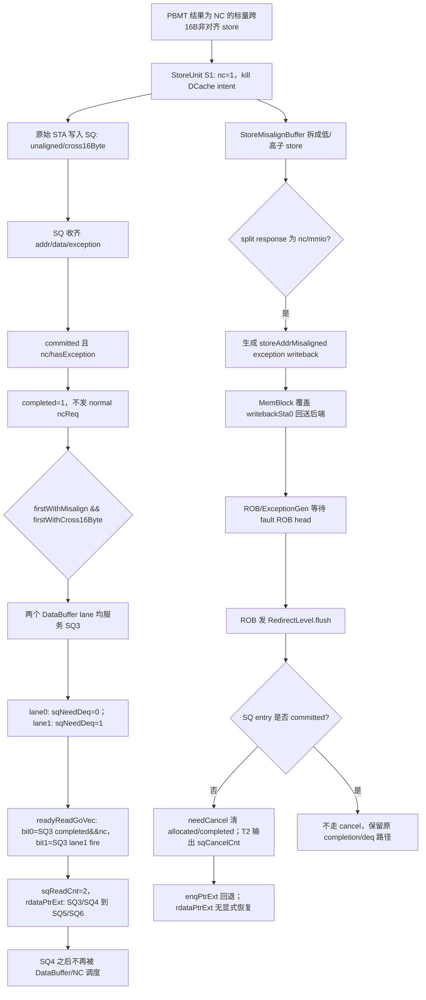

# V2 StoreQueue NC 跨 16B 异常、读指针与 Redirect 恢复设计确认

## 版本元数据

| 项目 | 内容 |
|---|---|
| RTL 版本 | V2 |
| 分支 | `mem_ut_uvm_v2` |
| 核验 commit | `75aaff39c66e29b1fc12bdda96571c32085646b0` |
| 权威源码 | `src/main/scala/xiangshan/cache/mmu/MMUBundle.scala`、`src/main/scala/xiangshan/mem/pipeline/StoreUnit.scala`、`src/main/scala/xiangshan/mem/lsqueue/StoreMisalignBuffer.scala`、`src/main/scala/xiangshan/mem/MemBlock.scala`、`src/main/scala/xiangshan/mem/lsqueue/StoreQueue.scala`、`src/main/scala/xiangshan/mem/lsqueue/LSQWrapper.scala`、`src/main/scala/xiangshan/mem/sbuffer/DatamoduleResultBuffer.scala`、`src/main/scala/xiangshan/mem/sbuffer/Sbuffer.scala`、`src/main/scala/xiangshan/backend/rob/ExceptionGen.scala`、`src/main/scala/xiangshan/backend/rob/Rob.scala` |
| 复现源码基线 | `StoreQueue.scala` 相对复现 commit `88dec8f6eb51d94b7cd9521dd84bc9278fe5ae9c` 无差异。 |
| 最后核验日期 | 2026-09-01 |

## 目的与范围

本文供设计人员确认以下 V2 行为是否符合预期：一个标量 store 同时满足
`nc=1 && unaligned=1 && cross16Byte=1` 时，StoreMisalignBuffer、StoreQueue、DataBuffer、ROB
exception redirect 和 redirect 后 SQ slot 重用是否形成一致的控制流。

本文确认的直接问题是：StoreQueue 将同一物理 SQ3 的 NC completion 与跨 16B 高半段
DataBuffer enqueue 计为两个 `rdataPtrExt` 推进原因，从而跨过 SQ4。本文也记录 redirect 后
`rdataPtrExt` 没有显式恢复的后续风险，但尚未将该风险宣称为已由 full-core 波形复现的第二个 bug。

本文不修改 RTL，不讨论 V3，也不把 standalone UVM 的 `pendingPtr` 驱动当作完整 ROB redirect 的替代品。

## 测试场景与复现产物

| 项目 | 内容 |
|---|---|
| testcase | `basicTest` |
| VSEQ | `memblock_dispatch_real_smoke_vseq` |
| cfg / seed | `tc_dispatch_real_mmu_sv39_smoke` / `666666` |
| 运行规模 | `MEMBLOCK_MAIN_TRANS_NUM=10000` |
| 特权与地址转换 | Sv39 开启、U 态执行；CSR 流程开启 store hardware-misaligned handling。 |
| 实际终态 | `terminal_done_uid=11/10000`，`UVM_ERROR=10`，没有新的 RM compare mismatch。 |

波形绝对路径：

```text
/nfs/home/lixiangrui/work/memblock_ut/XiangShan_V2/XiangShan/mem_ut/ver/ut/memblock/sim/rm_sv39_10k_sta_terminal_iq_drop_20260828/wave/tc=basicTest_ts=memblock_dispatch_real_smoke_vseq_cfg=tc_dispatch_real_mmu_sv39_smoke_seed=666666_rtl.fsdb
```

对应日志绝对路径：

```text
/nfs/home/lixiangrui/work/memblock_ut/XiangShan_V2/XiangShan/mem_ut/ver/ut/memblock/sim/rm_sv39_10k_sta_terminal_iq_drop_20260828/log/tc=basicTest_ts=memblock_dispatch_real_smoke_vseq_cfg=tc_dispatch_real_mmu_sv39_smoke_seed=666666_rtl.log
```

已确认的波形时序如下。SQ 编号是波形中的物理 SQ index；`SQ3` 是触发读指针双计数的前一项，
`SQ4` 是被跳过的后继 scalar fault store。

| 时间 | 观测 | 含义 |
|---|---|---|
| `510.3ns` | UID 11 的 `issueStd_1` 对 `ROB=0/124,SQ=0/4` fire。 | SQ4 的 store data 已写入 SQ。 |
| `520.3ns` | 同一 UID 的 `issueSta_0` fire。 | STA/STD 使用同一 ROB/SQ identity。 |
| `920.3ns` | `rdataPtrExt` 从物理 `SQ3/SQ4` 跳为 `SQ5/SQ6`。 | SQ4 在自身 fault 回填前被跨过。 |
| `975.3ns` | SQ4 的 STA `io_lsq_valid=1`。 | SQ4 的地址请求确实进入 DUT。 |
| `980.3ns` | StoreUnit replenish 输出 `hasException=1, af=1`。 | SQ4 fault 已在 StoreUnit 形成。 |
| `985.3ns` | `StoreQueue.hasException_4=1`。 | SQ4 fault 已回填 SQ。 |
| `990.3ns` | `StoreQueue.committed_4=1`。 | standalone `pendingPtr` 链已使 SQ4 可进入正常 fault drain。 |
| 结束前 | `completed_4=0`、`sqDeq=0`。 | SQ4 已失去 DataBuffer 调度机会而无法释放。 |

建议在同一 FSDB 中同时观察：

```text
/top_tb/U_MEMBLOCK/inner_lsq/storeQueue/rdataPtrExt_0_value
/top_tb/U_MEMBLOCK/inner_lsq/storeQueue/rdataPtrExt_1_value
/top_tb/U_MEMBLOCK/inner_lsq/storeQueue/dataBuffer/io_enq_0_valid
/top_tb/U_MEMBLOCK/inner_lsq/storeQueue/dataBuffer/io_enq_1_valid
/top_tb/U_MEMBLOCK/inner_lsq/storeQueue/allocated_4
/top_tb/U_MEMBLOCK/inner_lsq/storeQueue/hasException_4
/top_tb/U_MEMBLOCK/inner_lsq/storeQueue/committed_4
/top_tb/U_MEMBLOCK/inner_lsq/storeQueue/completed_4
/top_tb/U_MEMBLOCK/io_mem_to_ooo_sqDeq
```

## 已确认结论

1. `nc` 来自 PBMT 的 non-cacheable main-memory 属性；它不表示该 store 不再占用 SQ，也不表示
   地址、数据和 mask 可以不保留。
2. normal NC scalar store 应绕过 DataBuffer，经 `ncState -> ncReq -> Uncache ack/response` 置
   `completed`。普通 DataBuffer 分支有 `!ncStall`，明确阻断 NC。
3. 当前 V2 对 NC 跨 16B 非对齐 store 的实际语义是异常：MAB 接收到 NC split response 后生成
   `storeAddrMisaligned` exception，StoreUnit S2 也对 PBMT NC 的 non-aligned/MAB-return scalar
   store 设置同一 exception。它不是两笔 normal NC write。
4. SQ3 的 `completed=1` 可以由 `isCommit && nc && hasException` 直接产生；此时 `ncState` 因
   `!hasException` 不满足而不发 normal `ncReq`。
5. 跨 16B DataBuffer priority branch 缺少 `!ncStall`、`!hasException`、`!completed` guard。
   因此已完成的 SQ3 NC exception 仍可进入两个 DataBuffer lane。
6. `readyReadGoVec` 不验证 DataBuffer lane payload 的 `sqPtr` 是否等于该 lane 对应的
   `rdataPtrExt(i)`。SQ3 高半段的 lane1 fire 被误计为 SQ4 的读指针推进，和 SQ3 的
   `completed && nc` 共同使 `sqReadCnt=2`。

## 主流程图



## 按源码顺序的文字伪代码

```text
1. StoreUnit 从 TLB PBMT 得到 nc=1；DCache write intent 被 kill。
2. 原始 STA 进入 SQ，记录 unaligned=1 和 cross16Byte=1；STD 独立写入 data RAM。
3. 在 hardware-misaligned handling 开启时，MAB 仍接收 NC 跨16B请求并拆为两个对齐子请求。
4. 任一子请求返回 nc/mmio 时，MAB 转为 storeAddrMisaligned exception writeback；该 writeback
   经 MemBlock 的 writebackSta(0) 进入后端。
5. StoreQueue 收到地址/数据/exception 后，若 pendingPtr 使 entry committed，NC exception 直接
   置 completed，不进入 normal ncState request。
6. 若 SQ3 是 rdataPtrExt(0) 且满足跨16B分支，DataBuffer lane0、lane1 都采用 SQ3 的数据和 sqPtr；
   lane1 是高半段，sqNeedDeq=1。
7. readyReadGoVec 的 bit0 把 SQ3 completed&&nc 作为独立推进原因；bit1 把 lane1 fire 当作
   rdataPtrExt(1) 的推进原因，但没有检查其 payload sqPtr。因此 PopCount 得到2。
8. rdataPtrExt 越过 SQ4。SQ4 后续即使 fault 和 committed，已不在读指针窗口，不能完成常规
   DataBuffer/SBuffer fault drain。
9. 完整后端中，exception writeback 到达 ROB head 后会发 flush redirect。StoreQueue 只 cancel
   allocated && !committed 的匹配 entry；两个周期后以 sqCancelCnt 回退 enqPtrExt。
10. 当前源码不在 redirect 时恢复 rdataPtrExt。正常设计假定读指针不会越过可被 cancel 的 entry；
    本 bug 正是打破了该假定。
```

## 关键阶段

### 1. PBMT NC 与 MAB 入口

源码位置：`StoreUnit.scala:380-437`、`MMUBundle.scala:435-446`。

```scala
s1_out.nc := Pbmt.isNC(s1_pbmt)
io.dcache.s1_kill := (... || s1_out.nc || ...)

val s1_toMisalignBufferValid = s1_valid && !s1_in.isHWPrefetch &&
  !s1_frm_mabuf && !s1_isCbo && s1_in.isMisalign &&
  !s1_in.misalignWith16Byte &&
  GatedValidRegNext(io.csrCtrl.hd_misalign_st_enable)
```

`s1_toMisalignBufferValid` 未检查 `!s1_out.nc`。因此 NC 并不阻止 MAB 接收跨 16B store。

### 2. MAB 将 NC split response 转为异常写回

源码位置：`StoreMisalignBuffer.scala:219-291,532-607`。

```scala
val isUncache = (io.splitStoreResp.bits.mmio || io.splitStoreResp.bits.nc) &&
  !io.splitStoreResp.bits.need_rep

when (isUncache) {
  exceptionVec(storeAddrMisaligned) := true.B
}

io.writeBack.valid := req_valid && (bufferState === s_wb) &&
  !io.storeOutValid && !req.isvec
StaCfg.exceptionOut.map(no =>
  io.writeBack.bits.uop.exceptionVec(no) :=
    (globalUncache || globalException) && exceptionVec(no)
)
```

MAB 不继续提交两个 normal NC write，而是向软件交付 misaligned exception。`MemBlock.scala:1388-1396`
将这条 writeback 覆盖到 `stOut(0)`，而 `stOut` 就是 `io.mem_to_ooo.writebackSta` 的端口集合。

### 3. SQ 中的 NC exception completion 与 normal NC 区分

源码位置：`StoreQueue.scala:927-986,1136-1164`。

```scala
when (
  nc(rptr0) && allocated(rptr0) && !completed(rptr0) && committed(rptr0) &&
  allvalid(rptr0) && !isVec(rptr0) && !hasException(rptr0) && !mmio(rptr0)
) {
  ncState := nc_req
}

when(isCommit && nc(ptr) && hasException(ptr)) {
  completed(ptr) := true.B
}
```

normal NC 与 NC exception 是互斥的：前者要求 `!hasException` 并等待 Uncache completion；后者在
local commit 时直接置 `completed`。

### 4. 跨 16B DataBuffer priority branch

源码位置：`StoreQueue.scala:1185-1316`。

```scala
when(firstWithMisalign && firstWithCross16Byte) {
  dataBuffer.io.enq(i).valid := misalignToDataBufferValid
}.otherwise {
  dataBuffer.io.enq(i).valid := ... && !mmioStall && !ncStall
}
```

priority branch 覆盖普通分支，故没有继承 `!ncStall`。在该 branch 中两个 lane 都使用
`rdataPtrExt(0)`：

```scala
// lane0
dataBuffer.io.enq(0).bits.sqPtr     := rdataPtrExt(0)
dataBuffer.io.enq(0).bits.sqNeedDeq := false.B

// lane1
dataBuffer.io.enq(1).bits.sqPtr     := rdataPtrExt(0)
dataBuffer.io.enq(1).bits.sqNeedDeq := true.B
```

exception payload 的 `vecValid` 为 0。DataBuffer 仍可和 SBuffer 完成握手，但
`Sbuffer.scala:471-481` 只在 `in.fire && in.bits.vecValid` 时产生真实写入，因此不会产生有效 DCache
store write。

### 5. `readyReadGoVec` 的同一 SQ 双计数

源码位置：`StoreQueue.scala:320-331`。

```scala
if(i == 0) {
  dataBuffer.io.enq(i).fire && dataBuffer.io.enq(i).bits.sqNeedDeq ||
  allocated(rdataPtrExt(i).value) && completed(rdataPtrExt(i).value) && nc(rdataPtrExt(i).value) ||
  io.mmioStout.fire || io.vecmmioStout.fire
} else {
  dataBuffer.io.enq(i).fire && dataBuffer.io.enq(i).bits.sqNeedDeq ||
  allocated(rdataPtrExt(i).value) && completed(rdataPtrExt(i).value) && nc(rdataPtrExt(i).value)
}
sqReadCnt := PopCount(readyReadGoVec)
rdataPtrExtNext := rdataPtrExt.map(_ + sqReadCnt)
```

在波形场景中：

| 项 | 当前 physical pointer | 实际 payload SQ | 结果 |
|---|---|---|---|
| `readyReadGoVec(0)` 的 NC 项 | `rdataPtrExt(0)=SQ3` | SQ3 | `completed(SQ3) && nc(SQ3)=1`，故 bit0=1。 |
| `readyReadGoVec(1)` 的 DataBuffer 项 | `rdataPtrExt(1)=SQ4` | 仍是 SQ3 | lane1 `fire && sqNeedDeq=1`，故 bit1=1。 |

bit1 没有使用或比较 `dataBuffer.io.enq(1).bits.sqPtr`。`PopCount(2'b11)=2`，所以两个 read pointer
同时加2，`SQ3/SQ4` 变为 `SQ5/SQ6`。

### 6. 异常 writeback、redirect 与 SQ cancel

源码位置：`MemBlock.scala:545-557,1388-1396`、`ExceptionGen.scala:82-99`、`Rob.scala:573-640`、
`StoreQueue.scala:1481-1529`。

MAB exception writeback 进入后端的 STA writeback 端口。ROB/ExceptionGen 在 faulting ROB entry
成为 head 后发 `RedirectLevel.flush`；该 level 包含 fault anchor，自身和年轻指令都会满足
`needFlush`。

```scala
needCancel(i) := allocated(i) && !committed(i) &&
  uop(i).robIdx.needFlush(io.brqRedirect)

when (needCancel(i)) {
  allocated(i) := false.B
  completed(i) := false.B
}

redirectCancelCount := ...
enqPtrExt := VecInit(enqPtrExt.map(_ - redirectCancelCount))
```

因此 full-core 中，若 SQ4 比 NC exception 的 SQ3 年轻且仍为 `!committed`，redirect 会取消 SQ4；
SQ4 不需要再经 DataBuffer 得到 `completed`。这能掩盖本次 standalone 的卡死现象，但不是对
double-count 的 RTL 修复。

## Redirect 后新请求复用 SQ slot 的边界

正常情况下，被 redirect cancel 的 entry 尚未 committed，`rdataPtrExt` 不应已越过它，因此仅回退
`enqPtrExt` 足以让未来 dispatch 重用 slot。当前源码对 `addrReadyPtrExt` 和 `dataReadyPtrExt` 有
redirect 赋值，但没有对应的 `rdataPtrExt` 赋值：

```scala
when (io.brqRedirect.valid) {
  addrReadyPtrExt := ...
  dataReadyPtrExt := ...
}

deqPtrExt := deqPtrExtNext
rdataPtrExt := rdataPtrExtNext
```

本 bug 使 `rdataPtrExt` 已经从 SQ3/SQ4 错跳到 SQ5/SQ6，再由 redirect 取消 SQ4。若后续 dispatch
复用 SQ4，而 SQ5 尚未 allocated，则 `readyReadGoVec` 对 SQ5/SQ6 为 0，读指针不会前进也不会回看
新 SQ4；新 SQ4 可能无法获得 DataBuffer/NC 调度。若 SQ5 随后被分配，读指针还可能先处理更年轻
SQ5，而 `deqPtr` 最终仍会在 SQ4 的未完成状态停住。

这一段是**源码证明存在缺少 `rdataPtrExt` redirect 恢复的结构边界**，但当前 FSDB 没有完整
ROB redirect 和 trap-return 后新 dispatch 的波形，故“post-redirect slot reuse 必然再卡死”仍需设计或
full-core 定向回归确认。

## 设计确认项

1. PBMT NC 且跨 16B non-aligned scalar store 的预期 ISA/微架构语义是否确实应为
   `storeAddrMisaligned` exception，而非两个 Uncache write？当前 StoreUnit/MAB 源码的行为是前者。
2. 跨 16B DataBuffer branch 是否应对 NC exception 保持关闭？若是，最直接语义是已完成的
   `nc && hasException` entry 不得再次进入该 branch。
3. `readyReadGoVec` 是否应以“实际被消费的 `SqPtr`”而非 DataBuffer lane index 统计前移？至少应避免
   `enq(1).bits.sqPtr == rdataPtrExt(0)` 时把它计为 `rdataPtrExt(1)`。
4. redirect 后是否需要把 `rdataPtrExt` 恢复到与 `deqPtrExt/cmtPtrExt` 一致的安全位置，或证明
   `rdataPtrExt` 永远不会越过可 cancel entry？当前双计数反例否定了后一项假设。
5. full-core 定向回归应覆盖：SQ3 为 NC+cross16 exception，SQ4 为年轻 store，随后产生 ROB flush、
   trap-return 和新的 SQ slot reuse；断言新 SQ4 slot 最终能进入 completion，并且 `rdataPtrExt` 不跳过
   未完成 entry。

## 建议的修复方向

本文不实施 RTL 修改。供设计讨论的最小方向如下：

1. 在跨 16B DataBuffer valid 条件中排除 NC 或至少排除已经 `completed` 的 NC entry，防止已完成
   NC exception 再进入 DataBuffer。
2. 将 `readyReadGoVec` 的原因按物理 `SqPtr` 去重；跨 16B lane1 服务 `rdataPtrExt(0)` 时，不能同时
   作为 `rdataPtrExt(1)` 的完成原因。
3. 为 redirect 后 `rdataPtrExt` 的位置建立明确不变量和断言；若决定恢复，应先确认不能影响已经发给
   DataBuffer/Uncache 的 committed store。

## 关联 Flow 与历史问题

- [ROB 压缩与后端指令信息流](rob_compress_and_backend_instruction_flow.md)：ROB exception、fault SQ
  completion、`sqDeq/sqCancelCnt` 边界。
- [Store TLB 命中后的 Replay 与 Retry flow](store_tlb_hit_replay_and_retry_flow.md)：MAB 拆分和
  StoreUnit replay 边界。
- [LSQ 入队与 Redirect 恢复 flow](lsq_enqueue_redirect_flow.md)：LSQ allocation、redirect cancel 与
  pointer recovery。
- [V2 StoreQueue NC 跨 16B 双计数跳过 fault SQ 表项问题](../storequeue_nc_cross16_rdataptr_skip_rtl_issue_20260830.md)：原始 standalone 复现记录。

## V2/V3 差异

本文只核验 V2。未检查 V3 是否存在同名字段、相同 MAB 语义或相同 `rdataPtrExt` 恢复策略。

## 源码证据

- `src/main/scala/xiangshan/cache/mmu/MMUBundle.scala:435-446`：PBMT `nc` 定义。
- `src/main/scala/xiangshan/mem/pipeline/StoreUnit.scala:175-186,380-437,462-547`：跨 16B 判断、PBMT NC、MAB 接收、NC non-aligned exception 和 SQ replenish。
- `src/main/scala/xiangshan/mem/lsqueue/StoreMisalignBuffer.scala:219-291,360-371,532-607`：split request、NC/MMIO response 转 `storeAddrMisaligned` exception 和 writeback。
- `src/main/scala/xiangshan/mem/MemBlock.scala:545-557,1388-1396`：MAB writeback 复用 STA writeback port 回送后端。
- `src/main/scala/xiangshan/mem/lsqueue/StoreQueue.scala:255-265,320-355,518-585,927-986,1126-1348,1481-1529`：SQ 状态、NC request/completion、DataBuffer、read/deq pointer 和 redirect cancel。
- `src/main/scala/xiangshan/mem/sbuffer/DatamoduleResultBuffer.scala:30-93`、`src/main/scala/xiangshan/mem/sbuffer/Sbuffer.scala:471-481`：DataBuffer 两 lane FIFO 与 `vecValid=0` 的真实写入抑制。
- `src/main/scala/xiangshan/backend/rob/ExceptionGen.scala:82-99`、`src/main/scala/xiangshan/backend/rob/Rob.scala:573-640`：exception writeback 汇聚和 ROB head `flush` redirect。

## 知识修订记录

| 日期 | commit | 旧结论 | 新结论 | 修订原因 | 影响范围 |
|---|---|---|---|---|---|
| 2026-09-01 | `75aaff39c66e29b1fc12bdda96571c32085646b0` | 首次建立，无旧结论修订。 | 建立 NC 跨 16B exception、DataBuffer 双计数、ROB redirect cancel 以及 redirect 后 slot reuse 边界的设计确认记录。 | 用户要求面向设计人员给出详细复现场景、根因和波形路径。 | V2 StoreUnit、StoreMisalignBuffer、MemBlock、StoreQueue、DataBuffer、SBuffer、ROB。 |

## 待确认项

- 需要设计 owner 确认“NC 跨 16B non-aligned 只能 exception”的预期语义，以及 `readyReadGoVec` 的 lane-to-SqPtr 对应关系。
- 需要 full-core 定向回归确认 redirect 后重用被取消 SQ slot 时，未恢复的 `rdataPtrExt` 是否会造成可观察的饥饿或顺序阻塞。
