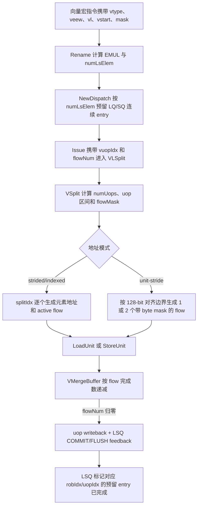

# V2 正常向量访存 uop 与 flow 拆分 Flow

## 版本元数据

| 项目 | 内容 |
|---|---|
| RTL 版本 | V2 |
| 分支 | `mem_ut_uvm_v2` |
| 核验 commit | `4ce3563a01254700ed5828797f288bafcc2b491c` |
| 权威源码 | `src/main/scala/xiangshan/backend/decode/UopInfoGen.scala`、`src/main/scala/xiangshan/backend/decode/DecodeUnitComp.scala`、`src/main/scala/xiangshan/backend/fu/FuType.scala`、`src/main/scala/xiangshan/backend/rename/Rename.scala`、`src/main/scala/xiangshan/backend/dispatch/NewDispatch.scala`、`src/main/scala/xiangshan/backend/issue/IssueQueue.scala`、`src/main/scala/xiangshan/backend/issue/EntryBundles.scala`、`src/main/scala/xiangshan/mem/vector/VecCommon.scala`、`src/main/scala/xiangshan/mem/vector/VSplit.scala`、`src/main/scala/xiangshan/mem/vector/VMergeBuffer.scala`、`src/main/scala/xiangshan/mem/lsqueue/LSQWrapper.scala`、`src/main/scala/xiangshan/mem/lsqueue/VirtualLoadQueue.scala`、`src/main/scala/xiangshan/mem/lsqueue/StoreQueue.scala`、`src/main/scala/xiangshan/mem/MemBlock.scala`、`src/main/scala/xiangshan/mem/vector/VSegmentUnit.scala`、`src/main/scala/xiangshan/mem/vector/VfofBuffer.scala` |
| 设计基线 | `mem_ut/ver/ut/memblock/rule/version/v2/branch_policy.md` 中的 `2acbf327cf7fb514593acc00d4c41117ec499e08` |
| 最后核验日期 | `2026-08-25` |

## Flow 范围

本文解释 V2 普通非 segment 向量 load/store 如何从一个向量宏指令拆成多个 VLSU `uop`，每个 `uop` 又如何形成并发或顺序的 `flow`，以及 `EMUL`、`vl`、掩码、LSQ entry 和 merge buffer 之间的关系。另包含普通单 field fault-only-first（FOF）load 的末尾 `fix-VL` uop、其 LQ pointer 顺序约束和顶层 standalone driver 边界，用于解释 `uop_vpu_lastUop`、`uop_vpu_isVleff` 与 FOF 发射次序。

本文覆盖 unit-stride、strided、indexed 三类地址模式，以及 Rename/Dispatch 的 flow 预留、LSQ 的连续 entry 分配和 merge buffer 的完成计数。

本文不把 segment vector LS 混入普通 flow 的计数规则。V2 的 segment 指令由独立 `VSegmentUnit` 的 `segmentIdx`、`fieldIdx` 和 FSM 执行，且 `NewDispatch` 不为其分配普通 LQ/SQ entry。本文只说明它与普通 FOF 的控制字段边界，不把其专用 FSM 当作普通 VLSU 的实现。

## 核心结论

1. `EMUL` 是 RVV 操作数的有效寄存器组倍率，不是 ISA 定义的 uop 数，也不是 ISA 定义的 flow 数。
2. 在 V2 普通非 indexed、单 field、`EMUL >= m1` 的简单场景中，一个 `VLEN` 容量对应一个 VLSU uop，因此 `m2/m4/m8` 常表现为 2/4/8 个 uop。这只是该实现的分片结果，不是 `EMUL` 的定义。
3. V2 的 `numUops` 还受 field 数和 indexed 指令另一侧寄存器组影响：indexed 指令按 `max(LMUL, EMUL)` 分片；fractional `EMUL` 仍至少占一个 uop。
4. `flow` 是 VLSU 的访存调度、LSQ 分配和 merge buffer 完成计数单位，不是 RVV 架构字段。strided/indexed 通常近似一 flow 一元素；unit-stride 的一个 flow 是带 byte mask 的 128-bit 对齐访问块，可包含多个元素。
5. `vl` 不是地址或元素指针，而是活动元素上界。V2 用 `vstart`、`vl` 和 `v0` 掩码形成 `flowMask`；超出 `vl` 或被掩码关闭的位置不会成为活跃访存 flow。
6. 顶层 `issueVldu.bits.src_4` 虽然因统一数据总线而展开为 128 bit，却不是一个可由测试端任意打包的完整 `VConfig` 端口。普通 VLSU 仅消费其低 8 bit 的 `vl`；`vsew`、`vlmul`、`veew`、`vm`、`vstart` 等控制来自 `uop.vpu`。
7. `issueVldu.flowNum` 与普通 LSQ 请求的 `enqLsq.req.numLsElem` 是同一份 dispatch 时的保守资源预留元数据，而非实际活跃 flow 数。真正等待完成的数量由 VSplit 在已知 `vl`、mask 和 unit-stride 地址对齐后重新计算为 `activeNum`。
8. `uop_vpu_lastUop` 是通用 `uop.lastUop` 在 VecMem IQ 出队时复制到 VPU 控制域的末尾标记；它不表示最后一个 flow。`uop_vpu_isVleff` 是 Decode 对普通单 field FOF load 设置的静态类型标记；两者同时为 1 时才表示 FOF 的专用 `fix-VL` 尾 uop。
9. 除 FOF 外，当前 V2 MemBlock 的直接 `lastUop` 消费点是普通 vector store 的 StoreQueue：同源 `enqLsq.req.lastUop` 只会把该 uop 连续 SQ 预留范围的尾 entry 标成 `vecLastFlow`。它是向量 store 异常后的 SBuffer 写入抑制边界，不参与普通 vector load、`flowMask`、`activeNum` 或 merge-buffer 完成计数。

## 名词与层次

| 名称 | 所属层次 | 本文中的精确含义 |
|---|---|---|
| 向量宏指令 | ISA | 例如一条 `vle32.v`、`vlse32.v` 或 indexed load/store。 |
| `EMUL` | ISA 操作数语义 | `EMUL = (EEW / SEW) * LMUL`，表示该操作数的逻辑寄存器组容量。它不是可直接读取的 CSR 字段。 |
| VLSU `uop` | V2 微架构 | 宏指令按 register-group/field 容量拆出的执行片段，以 `vuopIdx` 标识。 |
| flow slot / `numLsElem` | V2 Dispatch/LSQ | 一个普通向量访存 uop 预留的最大访存工作单元数，同时驱动连续 LQ/SQ entry 分配。 |
| 活跃 flow | V2 VSplit/merge buffer | 经 `vstart`、`vl` 和掩码过滤后真正需要完成的 flow；merge buffer 仅对它们计数。 |
| `flowIdx` / `splitIdx` | V2 VSplit | 当前 uop 内正在发射的 flow 序号，用于生成地址、`elemIdx` 和 `lqIdx/sqIdx` 偏移。 |
| `src_4` / `src_vl` | `issueVldu` 数据端口 | 端口物理宽度为 128 bit；普通 VLSU 只读取 `src_4[7:0]` 作为当前动态 `vl`。 |
| `uop.vpu.vtype` | `issueVldu` 控制端口 | `vill/vma/vta/vsew/vlmul` 等随 uop 进入 VSplit；它不是由 `src_4` 的高位重新解码。 |

## `EMUL` 的合理取值与 V2 表示

RVV 的正常有效 `EMUL` 语义取值与 `LMUL` 相同：`mf8`、`mf4`、`mf2`、`m1`、`m2`、`m4`、`m8`，即 `1/8` 到 `8`。它必须由当前 `EEW`、`SEW` 与 `LMUL` 的比例计算得到；超过 `m8` 的寄存器组需求不合法，三位编码 `100` 也不是可用的标准倍率。

V2 使用三位带符号指数保存 `emul/lmul`。`VSplit` 中普通情形的计算为：

```text
emul = log2(EEW / 8) - vsew + vlmul
```

其中 `vsew` 和 `vlmul` 来自当前 `vtype`，`veew` 来自该向量访存操作数。whole-register 和 mask-register 访存有专门覆盖规则，不能机械套用普通公式。

V2 `MulDataSize` 的 per-uop 数据表揭示了分片方式：

| `EMUL` | 单个 VLSU uop 在 V2 中表示的数据容量 | 单 field、普通非 indexed 情形的 uop 数 |
|---|---:|---:|
| `mf8` | 2 byte | 1 |
| `mf4` | 4 byte | 1 |
| `mf2` | 8 byte | 1 |
| `m1` | 16 byte | 1 |
| `m2` | 每个 uop 仍为 16 byte | 2 |
| `m4` | 每个 uop 仍为 16 byte | 4 |
| `m8` | 每个 uop 仍为 16 byte | 8 |

因此 `m2/m4/m8` 的总容量由多个 16-byte uop 累加，而不是让一个 uop 变成更宽的数据包。这正是“`EMUL` 看起来像 uop 数”但两者不能等同的原因。

## 主流程图



## 主流程文字伪代码

```text
1. Rename 读取 vtype.vsew、vtype.vlmul 和 uop.vpu.veew，计算 EMUL。
2. Rename 为非 unit-stride 指令计算每个 uop 的 numLsElem；unit-stride 因地址尚未知，保守预留 2。
3. NewDispatch 将 numLsElem 送入 LSQ，连续分配 LQ 或 SQ entry。
4. VSplit 根据 NFIELD、LMUL、EMUL 和 vuopIdx 计算当前 uop 的寄存器片段与 numUops。
5. VSplit 用 vstart、vl 和 v0 mask 生成 flowMask，仅保留当前 uop 覆盖范围内的 active flow。
6. 非 unit-stride 用 splitIdx 枚举 flow；每个 active flow 生成 elemIdx、地址和 lqIdx/sqIdx 偏移。
7. unit-stride 根据 128-bit 边界与 byte mask 生成 0、1 或 2 个访问块，而非逐元素访问。
8. 每个返回 flow 使 merge buffer 的待完成 flowNum 递减；归零后该 uop 才发出一次 writeback 与一次 LSQ feedback。
```

## 关键阶段

### 1. Rename：计算 `EMUL` 与 flow 预留数

源码位置：`src/main/scala/xiangshan/backend/rename/Rename.scala:211-250`

Rename 对普通向量访存计算：

```scala
emul = EewLog2(eew) - sew + lmul
numLsElem = Mux(isVecUnitType, VecMemUnitStrideMaxFlowNum,
                GenRealFlowNum(instType, emul, lmul, eew, sew))
```

`numLsElem` 不使用运行时 `vl`。它是 dispatch 时为最坏覆盖范围准备的 LSQ 数量，而不是本轮真实活动元素数。V2 参数将 `VecMemUnitStrideMaxFlowNum` 固定为 2；非 unit-stride 的最大 flow 数为 16。

### 2. VSplit：`EMUL` 影响 uop 分片，但不单独决定 uop 数

源码位置：`src/main/scala/xiangshan/mem/vector/VSplit.scala:55-98`

对单 field 的普通非 indexed 指令，V2 以 `EMUL` 的整数倍率拆分：`m1/m2/m4/m8` 分别对应 1/2/4/8 个 uop，fractional 值统一只需一个 uop。对于 indexed 指令，index 向量的 `EMUL` 与数据向量的 `LMUL` 都可能决定覆盖范围，因此源码选择较大者：

```text
普通非 indexed：numUops = NFIELD * max(1, EMUL)
indexed：numUops = NFIELD * max(1, LMUL, EMUL)
```

这里的乘法是对 decoded 倍率的乘法，不是把三位原始编码当普通无符号数。`vlmul=3'b111` 或 `emul=3'b111` 表示 `mf2`，不是 7。

V2 源码中 `vluxei16.v` 的注释给出一个典型边界：在 `e8,m1` 下，16-bit index 使 `EMUL=m2`。此时多个 uop 可以对应同一个目的向量寄存器，代码用 `uopIdxInField`、`vdIdxInField` 和不同的 mask shift 保持索引流与目的寄存器合并关系正确。

### 3. `vl`、`vstart` 和掩码决定实际活跃 flow

源码位置：`src/main/scala/xiangshan/mem/vector/VSplit.scala:100-180`、`src/main/scala/xiangshan/mem/vector/VecCommon.scala:707-718`

VSplit 从 `src_vl` 取得实际 `vl`，从 uop 取得 `vstart`。`GenFlowMask` 的本质是：

```text
候选活动范围 = [vstart, vl)
active flow = 候选活动范围 AND (无掩码 OR v0.mask[i] = 1)
```

之后它再按当前 `vuopIdx` 选择本 uop 覆盖的 flow 子区间。故 `vl` 控制的是哪一些元素/flow 应生效，而不是直接决定 `numUops` 或 dispatch 时预留的 `numLsElem`。

#### 3.1 `src_4` 为什么标为 `VConfig`，但配置时只需写 `vl`

源码位置：`src/main/scala/xiangshan/backend/fu/FuConfig.scala:757-776`、`src/main/scala/xiangshan/backend/Bundles.scala:963-978`、`src/main/scala/xiangshan/mem/vector/VSplit.scala:100-105`

`VConfig` 这个 Scala Bundle 的逻辑定义确实是 `vtype + vl`。但是 VLDu/VSTu 的第 4 个源操作数在 FU 配置中实际声明为 `VlData()`，而 `VlData()` 的宽度只有 8 bit。`MemExuInput(isVector=true)` 为了让五个 vector source 端口统一，才把 `src` 定义成 5 个 128-bit `UInt`；因此生成的顶层 `src_4` 看起来是 128 bit。

VSplit 的代码写成：

```scala
val vvl = io.in.bits.src_vl.asTypeOf(VConfig()).vl
```

这里的类型转换只用于取出 `vl`。当前 V2 生成 RTL 已明确将普通 VLSU 的 `evl` 接到
`io_in_bits_src_4[7:0]`；没有逻辑读取 `src_4[127:8]` 来取得 `vtype`。所以对顶层/UT 驱动而言，应采用下面的分工：

| 逻辑配置 | 驱动字段 | 对本 flow 的作用 |
|---|---|---|
| 活动长度 `vl` | `src_4[7:0]` | 形成 `[vstart, vl)` 的上界；普通 `vl` 合法范围为 `0 <= vl <= VLMAX`。 |
| `SEW` | `uop_vpu_vsew` | 决定元素大小；indexed 指令中还是数据元素大小。 |
| `LMUL` | `uop_vpu_vlmul` | 与 `SEW/EEW` 一起计算 `EMUL` 和 uop 组织。 |
| memory/index `EEW` | `uop_vpu_veew` | 对 unit/strided 是访存元素宽度；对 indexed 是 index 操作数宽度。 |
| 是否使用掩码 | `uop_vpu_vm` | `1` 直接采用全 1 mask；`0` 才读取 `src_3` 的 `v0` 位。 |
| 起始元素 | `uop_vpu_vstart` | 关闭下标小于 `vstart` 的候选元素。 |
| 当前 macro-instruction 的 uop 片段 | `uop_vpu_vuopIdx` | 选择全局元素集合中属于当前 uop 的窗口。 |

完整 Core 中，前序 `vset*` 指令通过 `VsetModule` 计算并写回 `vl/vtype`；Decode 又把当前 `vtype` 捕获到 `uop.vpu`，并把逻辑 `vl` 寄存器 `Vl_IDX` 放在 `lsrc(4)`。因此 `src_4` 是 `vl` 的数据依赖通道，`uop.vpu` 是该指令所见 `vtype` 的控制快照。两者必须来自同一条向量配置语义，不能只修改 `src_4` 来伪造另一种 `SEW/LMUL`。

在 standalone MemBlock 测试中，推荐固定把 `src_4[127:8]` 写 0，并只在 `src_4[7:0]` 写入 `vl`。这既符合当前生成 RTL 的实际消费者，也避免把未使用高位误当成 ABI。`VLEN=128`，故 `vl` 使用 8 bit，最大可表示 128。

#### 3.2 `flowMask` 的精确生成顺序

源码位置：`src/main/scala/xiangshan/mem/vector/VSplit.scala:100-180`、`src/main/scala/xiangshan/mem/vector/VecCommon.scala:530-718`

先定义第 `i` 个逻辑元素是否在整条宏指令的活动集合中：

```text
effectiveVL = 普通指令时的 src_4[7:0]
              （whole-register / mask-register 指令有专用换算）

elementEnable[i] = (i >= vstart) && (i < effectiveVL) &&
                   (vm == 1 || src_3[i] == 1)
```

这对应 `GenFlowMask` 的 `elementMask & UIntToMask(vl) & ~UIntToMask(vstart)`。`vm=1` 时，源码把 `elementMask` 替换为 128 个 1；`vm=0` 时才取 `src_3`。输入 `uop_vpu_vmask` 不在这条公式中，不能用它代替 `src_3`。

随后 VSplit 用 `vuopIdx`、`EEW/SEW/EMUL/LMUL` 选择当前 uop 的窗口：

```text
F = 该类指令的每 uop 候选 flow 数
P = flowsPrevThisUop = uopIdxInField * F
Q = flowsIncludeThisUop = (uopIdxInField + 1) * F
D = flowsPrevThisVd = vdIdxInField * numFlowsSameVd

windowMask = elementEnable & LowMask(Q) & ~LowMask(P)
shift = indexed && (EMUL > LMUL) ? P : D

flowMask = isVecPartReplay ? vecReplayMask : (windowMask >> shift)[15:0]
```

其中 `F` 对普通 strided 指令等于 `MulDataSize(EMUL) / EEW_bytes`；indexed 指令在 index
侧 `EMUL` 与 data 侧 `LMUL` 中选择覆盖范围较大的一侧。`EMUL > LMUL` 的 indexed 特殊分支需要以当前 uop 为相对坐标，而常规路径以当前目的寄存器片段为相对坐标，这是 `P/D` 不同的原因。不要把这个特殊分支简化成所有情况都右移 `uopIdx * F`。

这里的 `F` 是生成 `flowMask` 时的**逻辑元素窗口跨度**，由 `GenRealFlowLog2` 得出；它不能直接替代入口 `issueVldu.flowNum`。尤其是 unit-stride 的 e32,m1 uop，`flowMask` 窗口有 4 个元素位置，而 Dispatch/LSQ 仍保守传入 `flowNum=2`，因为后者计的是最多两个 16-byte 访问块。该差异正是 VSplit 必须同时保存 `flowMask` 和入口 `flowNum` 的原因。

`flowMask` 的每一位先表达局部候选元素/flow 位置。其后 `GenUopByteMask` 才按元素宽度把 1 bit 扩展为 1、2、4 或 8 个 byte enable。对 unit-stride，byte mask 再与实际低地址相加，判断落入低 16-byte 块、高 16-byte 块还是两者；所以 unit-stride 的 `flowMask` 有多个元素 bit 为 1 时，最终仍可能只产生一个访存 flow。

### 3.3 `flowNum`、`flowMask` 与 merge-buffer `flowNum` 不是同一个计数

源码位置：`src/main/scala/xiangshan/mem/vector/VSplit.scala:114,242-250,321-459`、`src/main/scala/xiangshan/mem/vector/VMergeBuffer.scala:78-97,309-354`

同名字段在不同阶段的语义如下：

| 位置 | 字段含义 | 是否受 `vl/vstart/v0` 影响 |
|---|---|---|
| `issueVldu.flowNum` | 本 uop 预留的候选 flow/LSQ slot 数，供 split buffer 扫描完整候选编号范围。 | 否。 |
| `VSplit.flowMask` | 当前 uop 中真正打开的候选位置集合；可为任意稀疏 16-bit 图样。 | 是。 |
| `toMergeBuffer.req.flowNum` | 实际需要等待的完成数，即普通非 unit-stride 的 `PopCount(flowMask)`，或 unit-stride 的 0/1/2 个对齐访问块。 | 是。 |
| merge-buffer entry `flowNum` | 尚未收到 writeback 的实际 flow 数；每个 pipeline 返回使它递减，归零才 uop writeback。 | 已在入 merge buffer 时确定。 |

Split buffer 仍用入口的保守 `flowNum` 计算 `splitFinish`，并逐个遍历候选 `splitIdx`。当当前 bit 不活跃时，`inActiveIssue` 只推进 `splitIdx`，不会向 Load/Store pipeline 发射；当 bit 活跃时，`activeIssue` 才发射。这样 `lqIdx/sqIdx + splitIdx` 与 Dispatch 已分配的连续 slot 保持同一编号体系，同时 merge buffer 只等待真实发出的 flow。

### 4. flow 的拆分与地址生成

源码位置：`src/main/scala/xiangshan/mem/vector/VSplit.scala:225-254,315-435`、`src/main/scala/xiangshan/mem/vector/VecCommon.scala:530-625`

#### 非 unit-stride：通常一 flow 对应一个元素访问

`GenRealFlowNum` 的注释明确将 flow 数定义为“要写入寄存器的 byte 数除以一次写入的元素 byte 数”。对于 strided 指令，V2 使用：

```text
每 uop flow 数 = MulDataSize(EMUL) / EEW_bytes
```

对 indexed 指令，源码根据 `EMUL` 和 `LMUL` 谁更大，选择 index 侧或 data 侧的容量计算。`GenElemIdx(instType, emul, lmul, eew, sew, uopIdx, splitIdx)` 将当前 `uopIdx` 和 `splitIdx` 映射为整条指令内的元素索引；`IndexAddr` 或 stride 再将该元素索引映射为地址。

因此在普通 strided/indexed 路径中，一个 active flow 通常是一个元素、一个 field 的访存工作单元。它仍不是“最终一定只有一次 DCache 事务”：未对齐等后续实现路径可继续处理它。

#### unit-stride：一个 flow 是访问块，不等于一个元素

unit-stride 不使用 `GenRealFlowNum`，因为 Rename 时尚未得到有效地址。VSplit 在得到地址后，检查一个 uop 的 byte mask 是否落在同一个 128-bit 对齐窗口：

```text
全部有效字节位于一个窗口：1 个 active flow
有效字节跨两个相邻窗口：2 个 active flow
没有有效字节：0 个 active flow
```

每个 unit-stride flow 携带 byte mask 并使用 128-bit 数据访问/合并路径。因此它可以同时覆盖多个元素：在 V2 的 16-byte uop 容量内，分别最多覆盖 16 个 8-bit、8 个 16-bit、4 个 32-bit 或 2 个 64-bit 元素。`vl` 和掩码只改变该访问块中的有效 byte，不会把它强制拆成“一元素一 flow”。

### 5. merge buffer：等待所有活跃 flow 后完成一个 uop

源码位置：`src/main/scala/xiangshan/mem/vector/VMergeBuffer.scala:78-129,309-419`

VSplit 将 `activeNum` 写入 merge buffer 的 `flowNum`。非 unit-stride 的 `activeNum` 是 `PopCount(flowMask)`；unit-stride 的 `activeNum` 是地址对齐检查得到的 0、1 或 2。每个 pipeline writeback 按同一 merge-buffer entry 聚合并使 `flowNum` 递减；仅当其归零时，entry 才产生 uop writeback 和到 LSQ 的 COMMIT/FLUSH feedback。

这说明一个 uop 可以有多个 flow、多个 flow 可以并行返回、但对后端和 LSQ 而言它们最终收敛成一次 uop 完成事件。

### 6. LSQ：flow 预留与真实活动数不是同一件事

源码位置：`src/main/scala/xiangshan/backend/dispatch/NewDispatch.scala:599-706`、`src/main/scala/xiangshan/mem/lsqueue/VirtualLoadQueue.scala:90-120,215-228`

NewDispatch 将 `numLsElem` 交给 LQ/SQ，队列按这个数量连续分配 entry；VSplit 输出时把当前 flow 映射到 `lqIdx + splitIdx` 或 `sqIdx + splitIdx`。因此 flow 是 LSQ 资源计账单位。

但普通 vector load 的完成 feedback 按 `robIdx` 和 `uopIdx` 匹配，VirtualLoadQueue 会将同一 uop 的匹配 vector entry 标记为 completed。也就是说，dispatch 的保守预留不会要求每个预留 slot 都实际发出一个内存访问；`vl`、tail、mask 和 unit-stride 对齐决定真正活跃的 flow 数。

#### 6.1 `issueVldu.flowNum` 是否恒等于 `enqLsq.req.numLsElem`

源码位置：`src/main/scala/xiangshan/backend/rename/Rename.scala:223-251`、`src/main/scala/xiangshan/backend/dispatch/NewDispatch.scala:602-706`、`src/main/scala/xiangshan/backend/issue/IssueQueue.scala:1189-1245`、`src/main/scala/xiangshan/backend/Backend.scala:793-832`

对于同一条**普通、非 segment、非 FOF-fix-VL**向量 load/store uop，答案是“是，同源恒等”，但不能把它理解为两个端口在同一拍必须同时相等：LSQ enqueue 发生在 Dispatch，`issueVldu` 在该 uop 经 IQ 等待 operand-ready 后才发生。应以 `(robIdx, vuopIdx)` 关联历史 enqueue 与后续 issue。

数据流没有重新计算：

```text
Rename:
  uop.numLsElem = unit-stride ? 2 : GenRealFlowNum(...)

NewDispatch:
  enqLsq.req.bits.numLsElem = isVls ? uop.numLsElem : 1

Vector Mem IQ:
  entry.status.vecMem.numLsElem = s0_enqBits.numLsElem

Backend -> MemBlock:
  issueVldu.flowNum = IQ_deq.numLsElem
```

所以普通 VLSU 的 `issueVldu.flowNum == enqLsq.req.numLsElem == uop.numLsElem` 是硬连线复制关系，不是由 `flowMask` 反算的关系。其值的计算规则为：

| 指令类别 | Dispatch 时 `numLsElem` / issue 时 `flowNum` | 原因 |
|---|---:|---|
| unit-stride | 固定 2 | 未取得 base address 前无法知道 byte mask 是否跨两个 16-byte 块，先保守预留最多两个。 |
| strided | `MulDataSize(EMUL) / EEW_bytes` | 一个候选 flow 对应一次元素宽度访问。 |
| indexed | `EMUL > LMUL` 时用 index 侧 `MulDataSize(EMUL) / EEW_bytes`，否则用 data 侧 `MulDataSize(LMUL) / SEW_bytes` | 一个 uop 必须覆盖 index/data 两侧较宽的局部元素范围。 |

V2 单 uop 的 `MulDataSize` 对 `mf8/mf4/mf2` 分别是 2/4/8 byte，对 `m1/m2/m4/m8` 都是 16 byte；后面三种更大的组靠更多 uop 表示。因此普通合法候选数通常为 `1/2/4/8/16`，unit-stride 是固定保守值 `2`。虽然顶层字段是 5 bit，`17..31` 不是该普通 VLSU flow 路径的合法配置值。

特别地，`vl=0`、`vstart >= vl` 或 `vm=0` 且对应 `src_3` 位全为 0，都不会把入口 `flowNum/numLsElem` 改写成 0：Rename/Dispatch 当时尚未以运行时 `vl` 和 mask 计算活动数。它们只会使后续 `flowMask` 为 0，并使 merge buffer 的实际等待数变为 0。

以下情况不能把两个字段当成可比较的一对：

| 情况 | `enqLsq.req` | `issueVldu.flowNum` 的解释 |
|---|---|---|
| `isVecPartReplay=1` | 没有新的 enqueue，复用旧 LSQ entry。 | 仍保留原始候选数；真正要重放的集合由 `vecReplayMask` 覆盖 `flowMask`。 |
| segment vector LS | `NewDispatch` 明确令普通 `enqLsq.req.valid=0`。 | 由 `VSegmentUnit` 的专用 `uopFlowNum/FSM` 管理，不能套普通 LSQ 等式。 |
| FOF 的 fix-`vl` 最后 uop | 普通 `enqLsq.req.valid=0`。 | 走 `VfofBuffer`/专用路径，不能与普通 LQ 预留比较。 |
| scalar LS | enqueue 字段被强制为 1，但它不走 `issueVldu`。 | 不存在对应的 vector `flowNum`。 |

在测试环境中，若手工驱动普通 VLSU，`flowNum` 小于上表的候选数会让 split buffer 提前结束；大于该数则可能令 `lqIdx/sqIdx + splitIdx` 超出 Dispatch 所分配的范围。正确做法是：先以同一 `(robIdx, vuopIdx)` 的 `enqLsq.req.numLsElem` 分配 entry，并把同一个值送入后续 `issueVldu.flowNum`；不要把它填成 `PopCount(flowMask)`。

### 6.2 FOF 的 `uop_vpu_lastUop` 与 `uop_vpu_isVleff`

这两个端口同为 1 bit，但回答的是两个不同问题：

| 顶层字段 | 它回答的问题 | 真正的生产者 | 不是谁 |
|---|---|---|---|
| `uop_vpu_lastUop` | 当前 backend `DynInst` uop 序列是否到达末尾？ | VecMem IQ 出队时把 `payload.lastUop` 复制到 `common.vpu.lastUop`。 | 不是“最后一个元素”、不是“最后一个 flow”、也不是 `flowMask` 的最高位。 |
| `uop_vpu_isVleff` | 当前 uop 是否属于普通单 field `vleff.v` FOF load？ | Decode 由 opcode/fuOpType 和 `NF` 静态计算。 | 不是“本次真的发生了 fault”，不是动态 `vl`，也不是 mask。 |

源码中有三个容易混淆的 `lastUop` 层级：

```text
Decode / DecodeUnitComp 的 uop.lastUop
  -> 表示一条 ISA 宏指令拆分后的 backend uop 终点
  -> VecMem IQ 出队时复制到 uop.vpu.lastUop
  -> 顶层端口名变成 uop_vpu_lastUop

VSplit 内部重新写入的 x.uop.lastUop
  -> 表示该 VLSU 内部 data-uop 序列的终点
  -> 与入口 uop.vpu.lastUop 是不同字段、不同用途

splitIdx / flowMask / merge-buffer flowNum
  -> 描述一个 data-uop 内的访存工作单元
  -> 不产生或决定 uop_vpu_lastUop
```

Decode 先把通用 `decodedInst.lastUop` 默认置为 1。若指令需要复杂拆分，`DecodeUnitComp` 先把所有拆分项清为 0，只给 `csBundle(numOfUop - 1)` 置 1。`decodedInst.vpu` 则先整体清零；`vpu.lastUop` 不是在这里独立解码出来的。直到 VecMem IQ 出队，源码才执行：

```scala
deq.bits.common.vpu := deqEntryVec(i).bits.payload.vpu
deq.bits.common.vpu.vuopIdx := deqEntryVec(i).bits.payload.uopIdx
deq.bits.common.vpu.lastUop := deqEntryVec(i).bits.payload.lastUop
```

所以，顶层接口看到的 `uop_vpu_lastUop` 应理解为对通用末尾标记的 VPU 侧携带形式。`VSplit` 另行用 `vuopIdx + 1 == numUops` 写其内部输出的通用 `uop.lastUop`，不能把这两个赋值点混为一个定义。

#### 6.2.1 `isVleff` 的赋值公式

`DecodeUnit` 的直接赋值为：

```scala
isVload = FuType.isVLoad(decodedInst.fuType)
isFof   = isVload && (decodedInst.fuOpType === VlduType.vleff)
decodedInst.vpu.isVleff := isFof && inst.NF === 0.U
```

`VecDecoder` 将 `vle8ff.v`、`vle16ff.v`、`vle32ff.v`、`vle64ff.v` 解为 `VlduType.vleff`；该内部操作码的 `lumop` 取值为 `10000`。`NF=0` 表示单 field，因此 `isVleff=1` 的严格含义是“普通单 field FOF load”。它不依赖运行时 `vl`、`vstart`、`vm`、`src_3` 或任何 TLB/DCache fault 结果。

FOF 的动态语义在后面才发生：`VMergeBuffer` 对 FOF flow 的非 0 元素异常把记录的 `vl` 收缩到故障元素索引；元素 0 的异常仍保留为精确异常。`VfofBuffer` 观察该 uop 的 merge/LSQ 回报并保留最早的缩短 `vl` 或异常。因此 `isVleff=1` 是“应采用这套 FOF 规则”的类型标签，而不是“已经发生故障”的状态位。

#### 6.2.2 两个 bit 的合法组合与 FOF 尾 uop

下表限定在 `issueVldu.valid=1` 的有效 vector-memory issue 上：

| `isVleff` | `lastUop` | 典型来源 | MemBlock 的解释 |
|---:|---:|---|---|
| 0 | 0 | 普通多 uop 向量访存的非末 uop。 | 按普通 VLSplit/VSSplit 路径执行。 |
| 0 | 1 | 普通向量访存的末 uop。 | 仍是普通访存 uop；这两个字段的组合不会触发 FOF 特殊路径。 |
| 1 | 0 | 普通 `vleff.v` 的 data uop。 | 仍送入 `VLSplit`；VecMem IQ 对非首 LQ 位置施加 FOF blocking，以维持需要的顺序边界。 |
| 1 | 1 | 普通 `vleff.v` 的专用 `fix-VL` 尾 uop。 | 不进入普通 VLSplit，也不申请普通 LSQ entry；由 `VfofBuffer` 生成最终 `vl` 的写回。 |

最后一行不是“最后一个 data flow”。`UopInfoGen` 为 `VEC_US_FF_LD` 生成 `numOfUopVLoadStoreStrided + 2` 个 backend uop：前面有一个准备 base-address 的 move，中间是一个或多个真正的 FOF load data-uop，最后额外插入一个只读/写 `Vl_IDX` 的 `fix-VL` uop。`DecodeUnitComp` 对该末 uop 置：

```text
srcType(0..3) = no
srcType(4)    = vp, lsrc(4) = Vl_IDX
vecWen        = 0
vlWen         = 1
ldest         = Vl_IDX
```

它继承 FOF 的 `isVleff=1`，同时是复杂指令的 `lastUop=1`。因此 Rename/Dispatch 用 `isVleff && lastUop` 识别它，令 `numLsElem=0` 且 `enqLsq.req.valid=0`。MemBlock 使用同一判定把它从 `vlSplit.io.in.valid` 排除；`VfofBuffer` 在相同 `(robIdx)` 的普通 FOF load merge 回报中收集最终 `vl`，仅在缓存的 uop 同时满足这两个 bit 时发出写回。这个写回的 `data` 和 `uop.vpu.vl` 都是收集后的最终 `vl`。

##### `VfofBuffer` 的状态顺序

`lastUop` 不计算 fault 或新 `vl`；它把已经收集的 FOF 结果切换为一次 `vlWen` 收尾写回。
当前 V2 的寄存器边界如下：

1. 第一个 `isVleff=1` data-uop 到达时，buffer 记录该宏指令的 `robIdx/uop`，并以
   `src_vl` 初始化 `entries.vl`。
2. 每个同 `robIdx` 的 `VLMergeBuffer.toLsq` 回报都会被观察：非 0 元素的 FOF fault 已由
   merge buffer 变成更小的 `vl`，因此 buffer 用较小值更新 `entries.vl`；元素 0 fault 则
   保持 data-uop 的精确异常，不把 `vl` 改成 0。
3. `isVleff=1 && lastUop=1` 的 `fix-VL` uop 到达时，buffer 只把缓存的 `entries.uop`
   换成这个带 `vlWen=1` 的尾 uop，保留已经收集的 `entries.vl`。
4. 只有 `valid && entries.uop.vpu.isVleff && entries.uop.vpu.lastUop && !redirect` 时，
   `VfofBuffer` 才向 writeback lane 1 发布该尾 uop；其 `data` 和 `uop.vpu.vl` 都取
   `entries.vl`。tail writeback 的 `exceptionVec` 被清零，元素 0 的精确异常仍由对应
   data-uop 的普通 merge writeback 报告。

因此可以把 FOF tail 看成“提交 FOF 结果元数据”的 token，而不是“最后一个内存访问”的
token。`redirect` 会直接清掉 buffer valid，阻止该 token 写回。

```text
普通 FOF data-uop:  isVleff=1, lastUop=0
     -> LSQ allocation -> VLSplit -> flow/merge -> FOF 的 vl/异常信息

FOF fix-VL tail uop: isVleff=1, lastUop=1
     -> 无普通 LSQ allocation、跳过 VLSplit
     -> VfofBuffer 以收集到的最终 vl 做一次 vlWen writeback
```

对 segment FOF，Decode 公式因 `NF != 0` 使 `isVleff=0`；它不能套用上述普通 `VfofBuffer` 规则。`VSegmentUnit` 改为直接检查 `fuOpType === VlduType.vleff && vpu.lastUop`，并用自己的 `s_fof_fix_vl` 状态完成收尾。这是 `isVleff` 看似与 FOF 名称不完全一致的原因：它刻意只标记普通 single-field FOF 路径。

##### FOF 的发射顺序、乱序边界与可穿插范围

必须区分“uop 已经进入后端队列”和“uop 已从 VecMem IQ 发射到 `issueVldu`”。一条 FOF 宏指令的 data-uop 与 tail 可以先后进入 IQ，但完整 V2 后端不会把它们按任意顺序发射：`isVleff=1` 的 IQ entry 只有在自己的 `lqIdx` 等于当前 `lqDeqPtr` 时才解除 `blocked`。

`LsqEnqCtrl` 为每个 Dispatch slot 都计算 `resp.lqIdx`，即使该 slot 的普通 `enqLsq.req.valid=0`。因此，若某条 FOF 的 data-uop 依次预留长度为 `N0`、`N1`、... 的 LQ 范围，tail 本身不预留 entry，却会得到紧随这些范围后的端点指针：

```text
data-uop 0: lqIdx = P
data-uop 1: lqIdx = P + N0
...
fix-VL tail: lqIdx = P + N0 + N1 + ...
```

FOF data-uop 完成后，`VLMergeBuffer` 通过 `(robIdx, uopIdx)` 向 VirtualLoadQueue 标记其对应 LQ range 已完成；只有 LQ dequeue 指针逐段推进到下一个起点，下一条 `isVleff=1` uop 才能发射。因此完整后端的有效顺序是：

```text
data-uop 0 的 LQ range 完成
  -> data-uop 1 的 LQ range 完成
  -> ...
  -> 所有 data-uop range 完成
  -> fix-VL tail 发射并进行 vlWen 收尾
```

这里允许存在停顿、cache/TLB replay 或其他 uop 的仲裁延迟，但不允许同一 FOF 的 data-uop 互换次序，也不允许 tail 越过尚未完成的 data-uop。tail 的 `lqIdx` 是 IQ 排序用的端点，不代表它拥有普通 LQ entry；tail 的 `numLsElem=0` 且 `enqLsq.req.valid=0` 仍然成立。

`VfofBuffer` 进一步假定同一时刻只有一条普通 FOF 处于活动状态：它只从 `isVleff=1` 的输入中用 `ParallelPriorityMux` 选取一个，并在 buffer 有效时对不同 `robIdx` 的新 FOF 发出 `XSError`。tail 已装入 buffer 后再收到任何 FOF uop 也会触发 `XSError`。因此：

- 不得在同一拍让两个 `isVleff=1` uop 进入两个 `issueVldu` lane；
- 不得在当前 FOF 的 tail writeback `fire` 或 redirect 清空 buffer 前发射另一条 FOF；
- 不得把 tail 提前送到 `VfofBuffer`，否则它会在尚未汇总完 data-uop 结果时发布过早的 `vlWen` writeback。

这不是对所有 vector uop 的全局停机。普通 `isVleff=0` 向量 uop 不受上述 IQ `blocked` 条件限制，`VfofBuffer` 也会忽略它们；若没有寄存器、LSQ 或执行资源依赖，它们可以在 FOF data-uop 与 tail 的实际 issue 时间线之间穿插。典型地，程序顺序在 FOF 之后的向量指令需要读取由 tail 写回的新 `VL`，Rename 会形成对 tail `vlWen` 的真实依赖，因此不能用新指令的旧 `src_4` 越过 tail。较早的或确实独立的向量 uop 则可能穿插。

对直接驱动 MemBlock 顶层 `issueVldu` 的 standalone 测试，VecMem IQ 已被旁路，MemBlock 不会再用 `lqIdx` 为 tail 建立上述排序。driver 必须显式实现这个约束：按 `vuopIdx` 递增发送 FOF data-uop，每个 data-uop 等待其普通 merge/writeback 或等价的 LQ 完成账本更新后再发送下一条，所有 data-uop 完成后才发送 tail。最简单方案是不在这个区间穿插任何其他向量指令；若要覆盖穿插，只允许非 FOF、且已由 scoreboard 证明独立的 uop。

#### 6.2.3 多 uop 的数量、拆分层次与接口一致性

向量访存必须区分两层拆分：Decode 先把一条宏指令拆成 backend uop，随后 VSplit 再把每个访存 data-uop 拆成 flow。`issueVldu` 看到的是 data-uop 和 FOF 的 `fix-VL` tail，不会看到只负责准备基地址或 stride 的 `i2v` 准备 uop。

当前 V2 普通向量访存的上限和主要 data-uop 数规则如下：

| 项目 | 规则 |
|---|---|
| 普通 data-uop 最大数 | 8 个；普通 VLSU 的 `vuopIdx` 合法 data 范围通常为 `0..7`。 |
| 普通 unit-stride/strided | `D = max(1, EMUL)`。 |
| 普通 indexed | `D = max(1, LMUL, EMUL)`，需要同时覆盖 index 侧和 data 侧容量。 |
| whole-register | 按 whole form 的寄存器数拆分，典型为 `1/2/4/8` 个 data-uop。 |
| mask load/store | 1 个 data-uop；VL 会在 VSplit 内换算为 mask 字节数。 |
| FOF | 与普通 unit-stride 相同的 `D` 个 data-uop，另加 1 个 `fix-VL` tail。 |
| backend 总 uop | 还要加 Decode 的准备 uop；strided/FOF 形式可出现准备/收尾相关 uop，FOF 的 `issueVldu` 事件最多为 `D+1`。 |

例如 `vle32.v` 在 `SEW=e32、EEW=e32、LMUL=m4` 时，`EMUL=m4、D=4`：

```text
vuopIdx=0, lastUop=0
vuopIdx=1, lastUop=0
vuopIdx=2, lastUop=0
vuopIdx=3, lastUop=1
```

每个 data-uop 还会继续形成多个 flow。例如 strided `e32,m4` 中，一个 data-uop 通常最多覆盖 4 个候选元素 flow；`4 data-uop * 4 flow/uop` 是 flow 总量估算，不是 16 个 uop。

同一宏指令的多 uop 接口字段必须按层次约束：

| 类别 | 字段 | 多 uop 规则 |
|---|---|---|
| 宏指令级一致 | `robIdx`、`fuType`、`fuOpType` | 所有 data-uop 属于同一宏指令，类型和 ROB 上下文一致。 |
| 宏指令级一致 | `uop.vpu.vsew/vlmul/veew/nf/vm/vma/vta/vstart` | 同一配置快照不能随 data-uop 改变。 |
| 通常一致 | `src_4[7:0]`/`src_vl`、`src_3`/mask、`src_rs1`、strided 的 `src_stride` | 多个 data-uop 通常使用同一个 VL、v0 mask、基地址和 stride。 |
| uop 派生 | `uop.vpu.vuopIdx`、`uop.uopIdx` | 按 `0..D-1` 递增；不能只在字段位宽内随机。 |
| uop 派生 | `uop.vpu.lastUop` | 普通指令仅最后一个 data-uop 为 1；必须与 Decode 模板和 LSQ enqueue 的 `lastUop` 同源。 |
| uop 派生 | `lqIdx/sqIdx` | 每个 data-uop 对应不同的连续 LSQ 预留范围，起点按 `numLsElem` 递增。 |
| 可能变化 | `src_2/src_vs3`、indexed 的 `src_1/index` | 不同 uop 可能读取不同向量寄存器片段或 index 片段。 |
| 运行时派生 | `flowMask`、实际 active flow 数 | 由 `vuopIdx`、`vl`、`vstart`、mask 和地址对齐在 VSplit 内生成，不应作为宏指令级固定值复制。 |

对普通非 segment、非 FOF-tail data-uop，有如下历史关联：

```text
issueVldu.flowNum
  == 该 uop 的 numLsElem
  == 对应 enqLsq.req.numLsElem
```

同一宏指令的多个 data-uop 通常拥有相同的 `flowNum` 计算规则，但 `lqIdx/sqIdx` 不同，且实际 active flow 数仍可能因各自 `flowMask` 不同而不同。`flowNum` 是保守候选数量，不能用 `PopCount(flowMask)` 反向替代。

FOF 是例外：

```text
FOF data-uop: isVleff=1, lastUop=0, 有普通 LQ entry，进入 VLSplit
FOF fix-VL tail: isVleff=1, lastUop=1, flowNum=0，不进入普通 LSQ/VLSplit
```

FOF tail 应使用 `isVleff && lastUop` 分类，不能只用 `{robIdx, vuopIdx}` 识别。当前 Decode 对 tail 的 `uopIdx` 不是稳定的独立身份，不能假定它总是等于 `D`。

因此，测试框架应先随机宏指令描述，再派生 `EMUL、D、flowNum、numLsElem`，随后为每个 data-uop 生成 `vuopIdx、lastUop、LSQ 范围和对应 source 片段`；FOF 再额外生成 tail。不能为同一宏指令独立随机配置字段、`vuopIdx` 和 `lastUop`。

向量写使能也必须在这一步按目的寄存器类别派生，不能把 `vecWen/v0Wen/vlWen` 当成三个独立
随机 bit。`VecDecoder` 对普通 `VLD` 给出向量目的写入，对 `VST` 不给向量目的写入；随后
`DecodeStage` 将 `ldest==0` 的向量写转换成 `v0Wen`。因此对真正送到 `issueVldu` 的 data-uop：

```text
FOF fix-VL tail（isVleff && lastUop）:
  vecWen=0, v0Wen=0, vlWen=1

vector store（非 FOF tail）:
  vecWen=0, v0Wen=0, vlWen=0

vector load（非 FOF tail）:
  ldest==0：  vecWen=0, v0Wen=1, vlWen=0
  ldest!=0：  vecWen=1, v0Wen=0, vlWen=0
```

`vlm.v` 的 `mask` 形式不自动等价于写 `v0`；它仍是 `VLD`，只有实际目的寄存器为 `v0` 才
置 `v0Wen`。反过来，`vm=0` 只是读取 `src_3` 的 `v0` mask，也不意味着 `v0Wen=1`。
当 LMUL 大于 1 且目的寄存器组从 `v0` 开始时，首个映射到 `ldest==0` 的 data-uop 可能是
`v0Wen=1`，后续 data-uop 则是 `vecWen=1`；测试框架必须按每个 uop 的目的寄存器映射派生。
三个写使能最多一个为 1，且 `pdest` 必须分别来自 vector、v0 或 VL physical free-list；
普通 store 三者全 0 时使用 canonical `pdest`。

#### 6.2.4 非 FOF vector store 的异常收尾边界

普通 vector store 也保留宏指令的 `lastUop`，但它的消费者不是 `VSSplit` 的 flow
生成，而是更早到达的 `enqLsq.req.bits.lastUop`。同一 `(robIdx, vuopIdx)` 的 enqueue
字段与后续 `issueVldu.uop.vpu.lastUop` 必须来自同一个 Decode uop 模板；StoreQueue 在
enqueue 时已经据此写入每个物理 SQ entry。

对一个长度为 `numLsElem` 的连续 SQ 预留范围，StoreQueue 仅在范围尾 entry 写入：

```text
vecLastFlow = enqLsq.req.lastUop
              && entry 是 [sqIdx, sqIdx + numLsElem) 的最后一项
```

因此，非末 backend uop 的所有 SQ entry 的 `vecLastFlow` 都为 0；只有宏指令末 uop
预留范围的尾 entry 才可能为 1。这里的 “last flow” 是 StoreQueue 的保留范围尾标记，
不是 `flowMask` 的最高有效位，也不能据此反推实际 active flow 数。

`vecLastFlow` 与 `vecExceptionFlag` 的时序如下：

1. data buffer 当前批次观察到向量 store 异常，且该批次尚未到达匹配 `robIdx` 的
   `vecLastFlow` 时，StoreQueue 为该 `robIdx` 置 `vecExceptionFlag`。
2. flag 有效期间，同一 `robIdx` 的后续 vector store entry 仍可进入 data buffer 并与
   SBuffer 完成 transport handshake，但 `toSbufferVecValid=0` 被写入 payload 的
   `vecValid`。SBuffer 只有在 `fire && vecValid` 时才产生实际写请求，因此这些 entry 可
   正常完成/出队，却不会写入 SBuffer；已经在 flag 置位前送出的写入不会被该 flag 回滚。
3. 匹配 `robIdx` 的 `vecLastFlow` entry 完成该次 data-buffer enqueue 时，flag 清除，
   表示该宏指令的异常收尾边界已经经过 StoreQueue。

所以，普通 store 的 `lastUop` 过早置 1 会让异常抑制过早清除，漏置则会让 flag 无法在
正确尾部清除，并可能触发 `vecExceptionFlag` 的 timeout assertion。普通 non-FOF vector
load 没有对应的 `vecLastFlow`/`vecExceptionFlag` 消费；`VSplit` 内部重写的
`x.uop.lastUop` 也不是这个入口字段的下游消费者。

### 6.3 哪些向量 uop 不分配普通 LQ/SQ entry

“不进入 LSQ”在本实现中有两个不同层次，必须先区分：

1. `NewDispatch.enqLsqIO.req.valid=0`：这个 uop 连普通 LSQ enqueue 请求都不发。
2. 普通 LQ/SQ 没有 `allocated` entry：即使共享 `enqLsq` bundle 上有 `valid`，也可能因 `needAlloc=0` 而不写入 `VirtualLoadQueue` 或 `StoreQueue`。

第二层才是通常所说的“没有进入 LSQ”。`LsqWrapper` 的实际写入口不是只看
`req.valid`，而是：

```text
LQ request valid = needAlloc[0] && enq.req.valid
SQ request valid = needAlloc[1] && enq.req.valid

最终 allocated = 上述 queue request valid && !robIdx.needFlush(redirect)
```

所以，不能仅用顶层共享端口的 `enqLsq.req.valid` 判断某条向量 uop 是否占用了
LQ/SQ 表项。

| 类别 | `FuType` / 精确条件 | 普通 `enqLsq.req.valid` | 普通 LQ/SQ entry | 实际去向与原因 |
|---|---|---:|---:|---|
| 非 segment 向量 load/store | `vldu` / `vstu`，包括 unit-stride、strided、indexed、mask、whole-register 等形式 | `fromRename.fire` 时为 1 | 有 | `needAlloc=1/2`，分别送入 LQ/SQ；`numLsElem` 个连续 entry 是其 flow 的保守预留。 |
| 普通单 field FOF 的 data-uop | `vldu && isVleff=1 && lastUop=0` | 1 | 有 LQ entry | 它仍是真实 load，只是 merge 回报会按 FOF 规则缩短 `vl` 或保留首元素异常。 |
| 普通单 field FOF 的 `fix-VL` 尾 uop | `isVleff=1 && lastUop=1` | 0 | 无 | Rename 令 `numLsElem=0`；Dispatch 和 MemBlock 都把它排除在普通 LSQ/VLSplit 外，由 `VfofBuffer` 做最终 `vlWen` writeback。 |
| segment vector load/store | `vsegldu` / `vsegstu`，即 `FuType.isVsegls` | 0 | 无普通 LQ/SQ entry | `MemBlock` 将其送给 port 0 的 `VSegmentUnit`；该单元以自己的 buffer、`segmentIdx/fieldIdx` 和 FSM 访问 DTLB/DCache/SBuffer。segment FOF 也在该专用路径收尾。 |
| 向量算术/浮点/置换/归约等非访存 uop | `vecArith`：`vipu`、`vialuF`、`vppu`、`vimac`、`vidiv`、`vfpu`、`vfalu`、`vfma`、`vfdiv`、`vfcvt` | 通常仍随 `fromRename.fire` 置 1 | 无 | NewDispatch 对它们给 `needAlloc=0`；到 LsqWrapper 时 LQ/SQ request 都被 gate 为 0。它们实际进入各自的 vector execution unit，而不是访存队列。 |
| `vset*` 配置 uop | `vsetiwi`、`vsetiwf`、`vsetfwf` | 可能经过共享 bundle | 无 | 只更新整数目的寄存器或 vector configuration/VL，不做数据访存，故 `needAlloc=0`。 |

有一个实现细节容易造成波形误读：segment load/store 在 Dispatch 的类别判断中可使
`needAlloc` 呈现 load/store 值，但同一处已经把 `req.valid` 用 `!isSegment` 压为 0。
LsqEnqCtrl 的实际 LQ/SQ 计数又只统计 `isLoad/isStore` 或
`isVNonsegLoad/isVNonsegStore`，因此 segment 不推进普通 LQ/SQ 的分配计数，也不写入
`allocated` entry。观察波形时应以 queue 侧的有效请求和 `allocated` 为准，不应单看
`needAlloc`。

`isAMOVec` 也不应列作“向量 AMO”：它是一个按 dispatch lane 展开的布尔 predicate 序列，
检测的是标量 `FuType.mou`。这类 AMO 被 `!isAMOVec` 排除在普通 LSQ request 外，
改走 `AtomicsUnit`；它不是此处 RVV 向量指令的一个类别。

因此，若问题严格指“哪些向量 uop 令普通 `enqLsq.req.valid=0`”，答案只有
segment vector LS 与普通 FOF 的 `fix-VL` 尾 uop。若问题指“哪些向量 uop 不占普通
LQ/SQ entry”，还要加上所有非访存向量算术和 `vset*` uop。反过来，普通 `vldu/vstu`
以及 FOF 的 data-uop 都仍然占用普通 LQ/SQ，不能因为它们是向量或 FOF 就排除。

## 约束随机化：从 descriptor 到一次合法 issue

对 standalone MemBlock 随机测试，最重要的规则是：**随机宏指令语义，不随机一个已经
rename/dispatch 完成的扁平 payload。** 一次普通 VLSU issue 的依赖顺序应为：

```text
指令类别、地址模式、load/store、SEW/LMUL/EEW、NFIELDS、vm/vma/vta
  -> EMUL、VLMAX、VL/vstart、uop 模板和候选 flowNum
  -> base/stride 或 index、old-vd/store-data、v0 mask
  -> fuType/fuOpType、vuopIdx/lastUop/isVleff、写使能
  -> robIdx/FTQ/pdest 和历史 enqLsq 分配的 lqIdx/sqIdx
  -> valid/ready fire
  -> feedback/writeback 驱动 replay 或完成
```

这套顺序把字段分成三类：

| 类别 | 字段 | 约束方式 |
|---|---|---|
| 独立语义输入 | 地址模式、`vsew/vlmul/veew`、`nf`、`vm/vma/vta`、`VL/vstart`、source data | 约束随机；先排除保留 `vlmul=3'b100` 和不合法 EMUL 组合。 |
| 计算派生字段 | `fuType`、`fuOpType`、`EMUL`、`flowNum`、`vuopIdx`、`lastUop`、`isVleff`、写使能 | 根据 descriptor 和真实 Decode uop 模板计算；不独立随机。 |
| 历史/反馈字段 | `robIdx/ftqPtr/pdest/lqIdx/sqIdx`、replay 三字段 | 由分配器或上一次 feedback 产生；不能用无关随机值替代。 |

普通非 whole/non-mask 指令的基本约束为：

```text
emulExp = signed(vlmul) + veew - vsew
VLMAX   = 2^(4 + signed(vlmul) - vsew)   // VLEN=128 bit
-3 <= emulExp <= 3
0 <= VL <= VLMAX
0 <= vstart <= VLMAX
```

如果要求实际访问，额外要求 `VL>0 && vstart<VL`，并在 `vm=0` 时保证当前 uop 窗口的
`src_3` 至少有一个 mask bit 为 1。`VL=0`、`vstart>=VL` 和全 mask-off 依然是合法边界，
但只会使 `flowMask/activeNum=0`，不能把普通入口 `flowNum` 改成 0。

`flowNum` 必须由地址模式派生：unit-stride 恒为 2；strided 为
`MulDataSize(EMUL)/EEW_bytes`；indexed 在 `EMUL>LMUL` 时用 index 侧容量，否则用
data 侧 `MulDataSize(LMUL)/SEW_bytes`。对于普通 non-segment、非 FOF-tail uop，它还
必须与历史 `enqLsq.req.numLsElem` 一致。`flowMask` 反而不是输入，它由
`VL/vstart/vm/src_3/vuopIdx` 在 VSplit 内生成，不能用其 `PopCount` 反推 `flowNum`。

首次 issue 必须给 `isVecPartReplay=0`、`vecReplayMask=0`、`vecReplayMbIdx=0`。只有
非 unit-stride store 的历史 `vstuIqFeedback.feedbackSlow` 请求部分 replay 时，才能使用
反馈给出的非零 `vecReplayMask` 和仍然存活的 merge-buffer index；重放必须复用原
`robIdx`、`vuopIdx`、source、LSQ 指针及 `flowNum`，且不再建立新的 `enqLsq`。详细的
字段逐项合法域、伪代码和 checker 规则见
[Vector issue agent 接口知识](../../../interface/v2/agents/vecissue_agent.md#约束随机化生成与字段依赖)。

## 示例：同样的 `VL=3`，flow 数可不同

以下示例使用 V2 源码中一个 `m1` uop 为 16 byte 的数据片段模型。

| 指令形态 | 配置 | uop 数 | flow 结果 | 原因 |
|---|---|---:|---|---|
| `vlse32.v`，strided | `SEW=e32`、`LMUL=m1`、`VL=3` | 1 | 3 个 active flow | 单 uop 容量为 16 byte，最多有 4 个 32-bit 元素；`VL=3` 使元素 0、1、2 对应的 3 个 flow 生效。 |
| `vle32.v`，unit-stride，16-byte 对齐 | `SEW=e32`、`LMUL=m1`、`VL=3` | 1 | 1 个 active flow | 3 个元素共 12 byte，可由一个 128-bit 访问块及 byte mask 覆盖。 |
| `vle32.v`，unit-stride，跨 16-byte 边界 | 同上 | 1 | 2 个 active flow | 同一 12-byte 有效范围分布在两个对齐访问块，VSplit 必须拆为两个 flow。 |

因此，“一个 flow 等于一个元素”只在非 unit-stride 的常见元素访问路径中近似成立；它不是 V2 的通用定义，也不是 RVV ISA 规则。

## 具体算例：同一 `VL=3` 为何有不同计数

假设 `vstart=0`、`vm=1`、`SEW=e32`、`LMUL=m1`、`vuopIdx=0`，且该 uop 的候选元素窗口从元素 0 开始。

| 场景 | `src_4[7:0]` | `EMUL` | 入口 `flowNum/numLsElem` | `flowMask` | merge buffer 实际等待数 |
|---|---:|---:|---:|---:|---:|
| `vlse32.v` | 3 | `m1` | 4 | `16'h0007` | 3 |
| `vle32.v`，base=`0x1000` | 3 | `m1` | 2 | `16'h0007` | 1 |
| `vle32.v`，base=`0x1008` | 3 | `m1` | 2 | `16'h0007` | 2 |

第一行中，`MulDataSize(m1)=16 byte`、`EEW=e32=4 byte`，故候选数为 `16/4=4`。`flowMask=0x7` 表示元素 0、1、2 活跃，bit 3 是 tail；split 仍扫描 4 个位置，但只发射 3 个。后两行中同一个 `flowMask=0x7` 先被扩展为 12 个有效 byte：地址 16-byte 对齐时全部落在一个块，地址偏移 8 时横跨两个块。故二者保守预留都为 2，但实际 flow 分别为 1 和 2。

## 状态、队列和优先级

| 状态/字段/队列 | 生产者 | 置位/入队条件 | 清除/出队条件 | 消费者 | 优先级/边界 |
|---|---|---|---|---|---|
| `emul` | Rename、VSplit | 由 `veew - vsew + vlmul` 计算，whole/mask 有覆盖 | 当前 uop 生命周期结束 | uop 分片、flow 数计算 | 是寄存器容量语义，不直接等于 uop/flow 数。 |
| `numLsElem` | Rename | unit-stride 固定保守值 2；其他模式由 `GenRealFlowNum` 计算 | dispatch 后作为 uop 元数据传播 | NewDispatch、LQ/SQ、VSplit | 不依赖运行时 `vl`。 |
| `flowMask` | VSplit | `[vstart,vl)` 与掩码交集，并切取当前 uop 区间 | 当前 uop 被 kill、完成或 replay | split buffer、byte mask、merge buffer | tail 和 masked-off flow 不发起活跃访问。 |
| merge buffer `flowNum` | VSplit | 写入实际 `activeNum` | 每个 flow writeback 递减，归零后 uop 完成 | uop writeback、LSQ feedback | 与入口 `numLsElem` 同名但含义不同：这里是实际待完成数。 |
| `splitIdx` | VSplitBuffer | 从 0 开始依次选择 uop 内 flow | 到达 `issueFlowNum` 或 redirect | 地址生成、`elemIdx`、LQ/SQ index | ordered indexed load 在每个 active flow 后等待 writeback，以保持顺序。 |

## 异常、回滚与 Flush

`robIdx.needFlush(redirect)` 会阻止或取消 VSplit、split buffer 和 merge buffer 中属于 flush 范围的 uop。正常或异常的活跃 flow 都须先由 merge buffer 收敛：异常 flow 的最老异常被保存，最后以一次带异常的 uop writeback 与 LSQ `FLUSH` feedback 输出；普通 flow 则以 `COMMIT` feedback 输出。

这与“每一 flow 都独立向 ROB 写回”不同。V2 在 merge-buffer entry 中等到所有活跃 flow 的结果已经被处理，再以 uop 为粒度向后端报告完成。普通 vector load 的 LSQ entry 因而由 `(robIdx,uopIdx)` 匹配完成 feedback；segment 指令改由 `VSegmentUnit` 的本地 finish/writeback 路径收敛。

## 关联 Agent 和 Flow

- [Vector issue agent 接口知识](../../../interface/v2/agents/vecissue_agent.md)：说明顶层 `src_4`、`uop.vpu`、`flowNum` 和 valid/ready 的实际接口语义。
- [LSQ 入队与 Redirect 恢复 flow](lsq_enqueue_redirect_flow.md)：普通 vector LS 的 `numLsElem` 连续 LQ/SQ 分配、fault feedback 与 redirect 释放边界。
- [ROB 压缩与后端指令信息流](rob_compress_and_backend_instruction_flow.md)：merge-buffer 完成后，vector LS writeback、精确异常和 ROB redirect 的边界。
- [Memory flushPipe flow](memory_flush_pipe_flow.md)：全局 flushPipe 如何最终形成 V2 redirect。

## V2/V3 差异

本文仅核验当前 V2 Scala 源码。`VLSplit`、`VMergeBuffer`、VLSU 宽度、`numLsElem` 上限或 V3 对 `EMUL`/flow 的分片实现都必须在 V3 分支单独核验；不得把本文的 16-byte per-uop 和 unit-stride 最多 2 flow 直接外推到 V3。

## 源码证据

- `src/main/scala/xiangshan/backend/rename/Rename.scala:211-250`：Rename 读取 `vsew/vlmul/veew`，计算 `emul` 和 `numLsElem`；unit-stride 使用保守最大 flow 数。
- `src/main/scala/xiangshan/backend/fu/FuConfig.scala:757-776`、`src/main/scala/xiangshan/backend/datapath/DataConfig.scala:16-22`：VLDu 的第五源是 `VlData()`，其真实数据宽度是 8 bit；`vconfigWakeUp` 只建立该依赖/wakeup 能力。
- `src/main/scala/xiangshan/backend/decode/DecodeUnit.scala:857-863,1043-1082`、`src/main/scala/xiangshan/backend/rename/Rename.scala:384-389`：Decode 把 `Vl_IDX` 放入 `lsrc(4)`，同时把 vtype、`vm/vstart/veew` 放入 `uop.vpu`；Rename 为该源分配 VL physical register。
- `src/main/scala/xiangshan/backend/decode/VecDecoder.scala:165-184`、`src/main/scala/xiangshan/backend/decode/DecodeStage.scala:234-255`：`VLD` 默认给普通 vector write、`VST` 默认不写向量寄存器，`ldest==0` 时由 DecodeStage 转成 `v0Wen`，并断言各目的写使能互斥。
- `src/main/scala/xiangshan/backend/rename/Rename.scala:319-321,402-408`、`src/main/scala/xiangshan/backend/dispatch/NewDispatch.scala:239-250`：三个写使能分别驱动 vector、v0、VL free-list，并决定 `pdest` 的物理寄存器类别。
- `src/main/scala/xiangshan/backend/Bundles.scala:420-465`、`src/main/scala/xiangshan/backend/decode/DecodeUnit.scala:836-840,1043-1072`：通用 `lastUop` 与 VPU 字段的定义、Decode 默认值，以及 `isVleff = isVload && (fuOpType == vleff) && (NF == 0)`。
- `src/main/scala/xiangshan/backend/decode/UopInfoGen.scala:192-250`、`src/main/scala/xiangshan/backend/decode/DecodeUnitComp.scala:194-205,1766-1799`：复杂向量指令只在末 uop 置通用 `lastUop`；普通 FOF 额外生成 `fix-VL` uop，并令其读写 `Vl_IDX`。
- `src/main/scala/xiangshan/backend/issue/IssueQueue.scala:1177-1245`、`src/main/scala/xiangshan/backend/issue/EntryBundles.scala:491-502`、`src/main/scala/xiangshan/backend/Backend.scala:793-832`：VecMem IQ 出队时从 `payload.lastUop` 赋给 `vpu.lastUop`；`isVleff` entry 只有在 `lqIdx == lqDeqPtr` 时可发射，随后 Backend 原样送到 `issueVldu`。
- `src/main/scala/xiangshan/mem/lsqueue/LSQWrapper.scala:361-430`、`src/main/scala/xiangshan/mem/lsqueue/VirtualLoadQueue.scala:215-228`：LsqEnqCtrl 对所有 Dispatch slot 形成 prefix `lqIdx`，但只对 `req.valid` 真正分配 entry；FOF data-uop 的 merge 回报推进其 LQ 完成状态。
- `src/main/scala/xiangshan/mem/MemBlock.scala:1571-1623,1651-1757`、`src/main/scala/xiangshan/mem/vector/VfofBuffer.scala:41-145`：`isVleff && lastUop` 排除普通 VLSplit、进入 `VfofBuffer`，并触发 `vl` 专用写回；buffer 对并发/跨 ROB FOF 的输入有显式 `XSError` 假设。
- `src/main/scala/xiangshan/mem/lsqueue/StoreQueue.scala:365-405,1202-1249,1329-1405`、`src/main/scala/xiangshan/mem/sbuffer/Sbuffer.scala:472-481`：普通 vector store enqueue 时把连续 SQ 范围尾 entry 的 `lastUop` 转成 `vecLastFlow`；异常后置位/清除 `vecExceptionFlag`，并把同一 `robIdx` 的后续 payload `vecValid` 清零，使 transport/出队继续而不产生 SBuffer 写请求。
- `src/main/scala/xiangshan/mem/vector/VMergeBuffer.scala:292-305`、`src/main/scala/xiangshan/mem/vector/VSegmentUnit.scala:248,382-412,881-932`：FOF 非首元素异常的 `vl` 收缩、首元素精确异常，以及 segment FOF 的独立收尾路径。
- `build/rtl/VLSplitPipelineImp.sv:350-404`：生成 RTL 明确只读取 `src_4[7:0]`，并给出 `srcMask`、当前 uop 窗口和 replay 覆盖后的 `flowMask` 组合式。
- `build/rtl/VLSplitPipelineImp.sv:572-626`、`build/rtl/VLSplitBufferImp.sv:302-340`：merge buffer 接收 `PopCount(flowMask)` 或 unit-stride 0/1/2，split buffer 仍用入口 `flowNum` 决定候选编号遍历终点。
- `src/main/scala/xiangshan/Parameters.scala:218-223`：V2 配置 `VecMemDispatchMaxNumber=16`、`VecMemUnitStrideMaxFlowNum=2`。
- `src/main/scala/xiangshan/backend/dispatch/NewDispatch.scala:599-706`：Dispatch 用保守 flow admission，且将 `numLsElem` 交给普通 LQ/SQ request。
- `src/main/scala/xiangshan/backend/fu/FuType.scala:52-72,127-133,178-198`：V2 的向量算术、配置、普通/segment vector LS 类型集合，以及 `isVNonsegLoad/isVNonsegStore` 的精确边界。
- `src/main/scala/xiangshan/mem/lsqueue/LSQWrapper.scala:154-182,361-429`、`src/main/scala/xiangshan/mem/lsqueue/VirtualLoadQueue.scala:92-183`、`src/main/scala/xiangshan/mem/lsqueue/StoreQueue.scala:355-423`：`needAlloc` 与 `req.valid` 共同形成 queue 侧有效请求，只有有效且未被 redirect 取消的范围才写入 `allocated` entry。
- `src/main/scala/xiangshan/mem/vector/VecCommon.scala:45-60`：V2 的最大 uop/flow 参数和三位 `emul/lmul` 宽度。
- `src/main/scala/xiangshan/mem/vector/VecCommon.scala:322-335`：fractional 倍率使用部分 byte，`m1/m2/m4/m8` 的单 uop 数据容量均为 16 byte。
- `src/main/scala/xiangshan/mem/vector/VecCommon.scala:530-625`：非 unit-stride 的 `GenRealFlowNum`、flow-log2 和 `GenElemIdx` 的计算。
- `src/main/scala/xiangshan/mem/vector/VecCommon.scala:707-718`：`GenFlowMask` 用 mask、`vstart` 与 `vl` 生成活跃元素集合。
- `src/main/scala/xiangshan/mem/vector/VSplit.scala:55-180`：`EMUL`、`numUops`、当前 uop 范围、`flowMask` 与 `active` 掩码生成。
- `src/main/scala/xiangshan/mem/vector/VSplit.scala:225-254,315-435`：unit-stride 的 128-bit 1/2 flow 判定、实际 `activeNum`、`splitIdx`、`elemIdx`、地址和 pipeline 发射。
- `src/main/scala/xiangshan/mem/vector/VMergeBuffer.scala:78-129,309-419`：active flow 计数、pipeline completion 递减、uop writeback 和 LSQ feedback。
- `src/main/scala/xiangshan/mem/lsqueue/VirtualLoadQueue.scala:90-120,215-228`：`numLsElem` 驱动 LQ 分配，vector feedback 以 `(robIdx,uopIdx)` 匹配完成状态。
- `src/main/scala/xiangshan/mem/MemBlock.scala:1565-1727`：普通 VLSplit/VMergeBuffer 与独立 `VSegmentUnit` 的连接和 writeback 仲裁。
- `src/main/scala/xiangshan/mem/vector/VSegmentUnit.scala:180-235,360-410,875-965`：segment 指令的独立 `segmentIdx/fieldIdx`、`uopFlowNum` 和 FSM/writeback 路径。

## 知识修订记录

| 日期 | commit | 旧结论 | 新结论 | 修订原因 | 影响范围 |
|---|---|---|---|---|---|
| 2026-08-15 | `4ce3563a01254700ed5828797f288bafcc2b491c` | V2 长期知识库没有独立说明 `EMUL`、VLSU uop 与 flow 的关系；LSQ/ROB 文档仅保留异常和释放摘要。 | 建立普通 V2 向量访存的 `EMUL -> uop -> flow -> merge -> LSQ` 拆分规则，明确 unit-stride flow 不等于元素。 | 用户要求结合 V2 向量访存解释 `EMUL`、uop、flow 和 `vl` 的关系。 | V2 Rename、Dispatch、VSplit、VMergeBuffer、LSQ、普通 vector load/store。 |
| 2026-08-18 | `4ce3563a01254700ed5828797f288bafcc2b491c` | 仅说明 `vl` 参与 `flowMask`，没有区分原始 `src_4` 的实际有效位、保守 `flowNum` 与 merge buffer 实际计数。 | 明确 `src_4[7:0]` 是 VLSU 所用的 `vl`，`vtype` 来自 `uop.vpu`；补充 `flowMask` 的窗口/replay 公式，证明普通路径的 `issueVldu.flowNum` 与历史 `enqLsq.req.numLsElem` 同源而非 `PopCount(flowMask)`。 | 用户要求追踪 VConfig/source、issue flow 数与 LSQ entry 数的对应关系。 | V2 vector issue、Rename、Dispatch、VecMem IQ、VSplit、VMergeBuffer、LQ/SQ。 |
| 2026-08-18 | `4ce3563a01254700ed5828797f288bafcc2b491c` | 文档只将 FOF `fix-VL` 列为普通 LSQ 等式的例外，未定义 `uop_vpu_lastUop` 与 `uop_vpu_isVleff` 的生产点和组合语义。 | 明确 `lastUop` 在 VecMem IQ 由通用末 uop 标记复制而来，`isVleff` 是单 field FOF 的 Decode 标签；二者同时为 1 精确标识专用 `fix-VL` 尾 uop。 | 用户要求追踪两个顶层 VPU 控制字段的含义和赋值。 | V2 Decode、UopInfoGen、DecodeUnitComp、Rename、Dispatch、VecMem IQ、MemBlock、VfofBuffer、VSegmentUnit。 |
| 2026-08-18 | `4ce3563a01254700ed5828797f288bafcc2b491c` | 只列举普通 FOF 尾 uop 与 segment 是 `flowNum`/LSQ 等式的例外，未区分共享 `enqLsq.req.valid` 与真正写入 LQ/SQ entry。 | 增加按 `FuType` 和 FOF 条件划分的完整表；明确 segment 与 FOF 尾 uop 不发普通 request，非访存向量 uop 因 `needAlloc=0` 不分配物理 entry，普通 FOF data-uop 仍进入 LQ。 | 用户追问哪些向量类型不进入 LSQ。 | V2 NewDispatch、LsqEnqCtrl、LsqWrapper、VirtualLoadQueue、StoreQueue、VSegmentUnit、VfofBuffer。 |
| 2026-08-19 | `4ce3563a01254700ed5828797f288bafcc2b491c` | 文档说明了每个字段的 RTL 语义，但没有给出约束随机测试中“先随机什么、后派生什么”的生成顺序。 | 增加 descriptor 驱动的随机化 DAG，明确 `EMUL/VLMAX/flowNum/uop` 是派生字段，`lqIdx/sqIdx` 是历史 LSQ 分配结果，replay 三字段只能由反馈闭环产生。 | 用户要求分析向量输入的合法随机约束和字段依赖。 | V2 Decode、Rename、NewDispatch、VecMem IQ、VSplit、VMergeBuffer、LQ/SQ、issueVldu 接口。 |
| 2026-08-21 | `4ce3563a01254700ed5828797f288bafcc2b491c` | `lastUop` 的说明只覆盖 FOF `fix-VL`，容易误读为普通向量访存中无作用。 | 补充普通 vector store 的 `lastUop -> vecLastFlow -> vecExceptionFlag` 链，明确其限定后续 SBuffer 写入的异常收尾边界；普通 load 和 VSplit 的 active-flow 计算不消费该入口标记。 | 用户追问 FOF 之外的 `lastUop` 影响。 | V2 StoreQueue、VSSplit、SBuffer、普通 vector store 异常路径。 |
| 2026-08-21 | `4ce3563a01254700ed5828797f288bafcc2b491c` | 多 uop 规则和接口字段一致性分散在 Decode、VSplit、LSQ 与 FOF 小节中，容易将 uop 数、flow 数和字段复制关系混淆。 | 汇总 V2 普通向量访存最多 8 个 data-uop、FOF 额外 tail、Decode 准备 uop，以及多 uop 之间一致字段、派生字段、LSQ/flow 约束。 | 用户要求将当前多 uop 拆分和接口一致性分析沉淀到 V2 向量知识库。 | V2 Decode、Rename、VecMem IQ、VSplit、VMergeBuffer、LSQ、VfofBuffer、向量 issue 接口。 |
| 2026-08-21 | `4ce3563a01254700ed5828797f288bafcc2b491c` | FOF 章节说明了 `fix-VL` 路由，但未展开 `lastUop` 如何把 merge 结果转换为一次 VL 写回。 | 增加 `VfofBuffer` 的首 data-uop 初始化、merge 回报更新、tail uop 替换元数据、写回和 redirect 清除顺序；明确元素 0 精确异常不由 tail 重发。 | 用户要求理解 StoreQueue flag 与 FOF tail 的内部影响。 | V2 VLMergeBuffer、VfofBuffer、FOF data/tail uop、writeback lane 1。 |
| 2026-08-21 | `4ce3563a01254700ed5828797f288bafcc2b491c` | “抑制 SBuffer 写入”容易被理解为阻塞 data buffer 或冻结 SQ。 | 明确 flag 清的是 payload `vecValid`，不是 data-buffer/SBuffer 的 Decoupled transport valid；SBuffer 因 `fire && vecValid` 不产生写请求，而 SQ 仍可完成/出队并抵达尾 entry。 | 用户追问 vector-store 异常 flag 对 data buffer、SBuffer 和 SQ 的实际影响。 | V2 StoreQueue、data buffer、SBuffer、SQ completion/deq。 |
| 2026-08-25 | `4ce3563a01254700ed5828797f288bafcc2b491c` | FOF 章节只说明 data-uop/tail 的功能分工，没有说明它们是否允许乱序发射或被其他向量 uop 穿插。 | 增加 LQ prefix pointer、VecMem IQ `blocked`、`VfofBuffer` 单活动 FOF 限制，以及 full-core 与 standalone driver 的顺序边界；明确同一 FOF 串行、独立非 FOF 可物理穿插。 | 用户追问 FOF data-uop、tail 与其他向量指令的发射次序。 | V2 LsqEnqCtrl、VirtualLoadQueue、VecMem IQ、MemBlock、VfofBuffer、顶层 vector issue。 |
| 2026-08-25 | `4ce3563a01254700ed5828797f288bafcc2b491c` | 写使能与向量形式的关系未在 uop 拆分 flow 中明确，`mask_load` 容易被误判为固定写 `v0`。 | 补充 `vecWen/v0Wen/vlWen` 由 load/store、FOF tail 和每个 uop 的 `ldest` 派生；说明 LMUL 跨 `v0` 时可出现不同 data-uop 写使能。 | 用户要求分析 `issueVldu` 三个写使能的向量类型关联。 | V2 Decode、Rename、VecMem IQ、issueVldu、向量 writeback。 |

## 待确认项

- 无。本文仅说明 segment FOF 与普通 FOF 控制字段的分界，不将 `VSegmentUnit` 的完整 FSM 视为普通 VLSU flow 的一部分。
