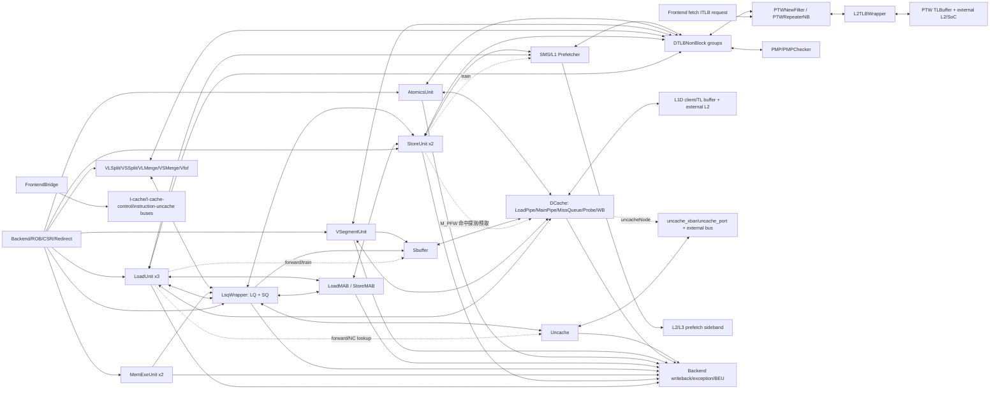

# V2 MemBlock 子模块交互黑盒测试点与功能覆盖模型

## 1. 版本元数据

| 项目 | 内容 |
|---|---|
| RTL 版本 | V2 |
| 分支 | `mem_ut_uvm_v2` |
| 核验 commit | `1567628320ef77e1de1a3ae7a7c7057423e842b4` |
| 权威 RTL | `build/rtl/MemBlock.sv`、`build/rtl/filelist.f` |
| 连接语义来源 | `src/main/scala/xiangshan/mem/MemBlock.scala`、`LSQWrapper.scala`、`LoadQueue.scala`、`StoreQueue.scala`、`DCacheWrapper.scala`、`Sbuffer.scala`、`Uncache.scala` |
| 最后核验日期 | `2026-09-11` |

## 2. 分析边界和黑盒原则

本文的对象是 MemBlock 内部**模块之间的交互契约**。每个模块只看成一个黑盒，测试只根据模块边界的请求、响应、握手、身份和状态结果判定，不展开模块内部 RAM、CAM、流水级、状态机编码或替换算法。

本文采用以下边界：

1. 以当前 `build/rtl/MemBlock.sv` 的真实实例为固定 DUT 清单。Scala 中由参数裁剪掉或被 firtool 优化掉的模块不写成当前固定功能。
2. 模块间 `Decoupled` 接口以 `fire = valid && ready` 作为接受事件；`Valid` 接口只在 `valid` 采样，不套用 `ready` 保持规则。只有接口本身声明了不可撤销/寄存保持义务时，才对等待期 payload 施加稳定性断言。
3. 黑盒账本区分三类交互：请求/响应型（按接口协议等待一个或多个响应）、posted/转移所有权型（例如 SQ 或 `VSegmentUnit` 到 Sbuffer，接受后没有逐笔 response）和 `Valid` 侧带型（例如 L2/L3 prefetch、hint、error）。同一个架构 uop 还要和每次 issue attempt 分开记录，因为 replay 可以合法地产生多次 issue attempt。
4. 一次 issue attempt 或 parent/child 事务用边界可见的 `robIdx`、`lqIdx`、`sqIdx`、`uopIdx`、TileLink `source/sink` 或 Uncache response/`idResp` 标识。多 beat 或拆分事务使用 parent-child 关系关联；不能把每个 child 或每次 replay 当成新的架构完成。
5. 测试点必须具备三件事：可激励的模块组合、可观测的边界事件、可判定的预期结果。只统计内部计数器而没有外部行为的项目不作为功能覆盖。
6. 功能覆盖描述“应该覆盖什么”；不等同于 UVM `covergroup` 实现，也不把已知 RTL 缺陷当成通过条件。

### 2.1 黑盒术语

| 术语 | 本文含义 |
|---|---|
| 请求接受 | 请求端和接收端在同一拍 `valid && ready`；对 `Valid` 端口则指 `valid=1` 被采样。 |
| 完成 | 对请求/响应型事务，得到协议规定的最终响应并形成架构结果、异常或取消；对 posted 事务，观察到下游接收和后续队列完成；对 `Valid` 侧带，只记录一次有效采样，不把它当作架构完成。 |
| 终止 | issue attempt 的终止可以是响应、重试、replay、取消或协议规定的拒绝；架构 parent 的终止则是最终完成、精确异常或 redirect 取消。两者不能混为“每个请求恰好一个 response”。 |
| 年龄顺序 | 由 `robIdx` 或带 flag 的循环指针比较得到的先后关系，不以物理数组下标代替。 |
| 前缀通道 | 多 lane 中后一个 lane 只有在前一个 lane 同时接受时才算有效接受，例如 SQ 到 Sbuffer 的两 lane。 |
| 资源占用 | 模块对下游端口、队列、MSHR、TL source 或独占执行通道的占用；只从 ready、拒绝、延迟和释放事件推断。 |
| 事务类别 | 请求/响应型需要按 source/id 关联响应；posted 型以转移和下游完成为终点；`Valid` 侧带按采样脉冲计数，不能人为添加 ready 或 response。 |

## 3. 当前生成 RTL 的子模块清单

### 3.1 MemBlock 直接功能实例

下表是当前 `build/rtl/MemBlock.sv` 中可以定位到的直接实例；功能模块与 bring-up/DFT 基础设施在职责栏中区分。数量是当前 V2 生成结果，不代表所有参数配置。

| 功能组 | 实例和数量 | 黑盒职责及主要交互 | 生成 RTL 位置 |
|---|---|---|---|
| 数据缓存和非缓存访问 | `DCacheWrapper` x1、`Uncache` x1 | 接收 load/store/atomic/CMO 或非缓存请求，向外部 TileLink 发起事务并返回响应、错误和释放信息。 | `MemBlock.sv:8380`、`:9281` |
| 非缓存共享总线 | `TLXbar` x1（`uncache_xbar`）、相关 `TLBuffer` | 汇聚 Uncache client 与 DCache `uncacheNode`，向 `uncache_port` 和外部目标转发；只检查仲裁、source 和背压，不展开 buffer 内部实现。 | `MemBlock.sv:9437`、`:9952-10050` |
| 顺序队列和写缓冲 | `LsqWrapper` x1、`Sbuffer` x1 | 维护 LQ/SQ 的年龄、提交、重放和释放；已提交 cacheable store 经 Sbuffer 进入 DCache。 | `MemBlock.sv:20020`、`:22755` |
| 标量执行 | `LoadUnit` x3、`StoreUnit` x2、`MemExeUnit` x2 | 接收后端 issue；`LoadUnit` 形成 load 的 TLB/DCache 请求，`StoreUnit` 形成地址路径并可发出仅用于命中探测/预取的 `M_PFW` 请求，`MemExeUnit` 提供 store 数据；三者共同产生 forward/replay、writeback 和反馈。普通已提交 store 不由 `StoreUnit` 直接写入 DCache。 | `MemBlock.sv:10616/12125/13711`、`:15220/15784`、`:16294/16312` |
| 向量拆分与合并 | `VLSplitImp` x2、`VSSplitImp` x2、`VLMergeBufferImp` x1、`VSMergeBufferImp` x2 | 把向量指令分发给标量 load/store 端口，收集 flow 结果，再向 LSQ、向量 IQ 和后端 writeback 返回。 | `MemBlock.sv:16330-18159` |
| 向量特殊路径 | `VSegmentUnit` x1、`VfofBuffer` x1 | segment 访问复用 port0；FOF 结果控制后续 flow 和向量 writeback。 | `MemBlock.sv:18160`、`:18433` |
| 非对齐访问 | `LoadMisalignBuffer` x1、`StoreMisalignBuffer` x1 | 接收非对齐 parent，向对应执行单元发拆分 child，合并结果或报告异常；Store 侧通过 `maControl` 与 SQ 协调跨页高地址。 | `MemBlock.sv:18594`、`:19089` |
| 原子操作 | `AtomicsUnit` x1 | 接管 LR/SC/AMO，复用 load0 的 TLB/PMP、DCache atomic 端口和 load writeback 端口，并协调 Sbuffer drain。 | `MemBlock.sv:19813` |
| 地址翻译 | `TLBNonBlock` load/store/prefetch 三组（requester 4/2/2）、`PTWNewFilter`、`PTWRepeaterNB`、`L2TLBWrapper` | 汇聚多个翻译请求，处理 PTW/L2TLB 请求响应；fence/CSR flush 由 PTW filter/相关上游处理，redirect 由 DTLB 和请求侧抑制并隔离旧响应，再把结果回送原始请求源。 | `MemBlock.sv:22960/23364/23603/23809/24493/9528` |
| 权限和属性 | `PMP` x1、`PMPChecker` x8 | 为每个 DTLB request 返回访问权限、PMA 属性、MMIO/NC 和 fault 结果。 | `MemBlock.sv:24630`、`:25119-28577` |
| 硬件预取 | `SMSPrefetcher` x1、`L1Prefetcher` x1 | `SMSPrefetcher` 接收 load/store 训练；当前 `L1Prefetcher` 只接收 load 训练并产生 L1 `Decoupled` 请求，SMS 的 L1 请求在本 build 固定为无效；L2 侧带可由 L1/SMS 产生，L3 侧带仅由 L1 产生；不产生架构 writeback。 | `MemBlock.sv:19496`、`:19644` |
| 系统桥接 | `FrontendBridge` x1、若干 `TLXbar`/`TLBuffer` | `FrontendBridge` 分别桥接 instruction uncache、I-cache 和 I-cache control 三条前端路径；I-cache/I-cache control 观察正常字段传递，而 instruction uncache 的 A 通道会按固定取指契约规范化若干字段。其他 buffer/xbar 负责 PTW、L1D 或共享 Uncache 路径。各路径边界独立，不能抽象成一条公共总线。 | `MemBlock.sv:9437-10500` |
| DFT/MBIST 基础设施 | `MbistPipeSms` x1、`MbistPipeMemBlk` x1、`MbistIntfMemBlk` x1、`ResetGen` x3 | 在 bring-up/DFT 模式下分发 SRAM 广播和复位模式，并连接 MBIST pipeline；当前顶层 `MbistIntfMemBlk` 的 MBIST 输入在生成 RTL 中绑为常量，不能把它当作普通功能模式下可直接驱动的动态端口。 | `MemBlock.sv:19619`、`:29868`、`:29876`、`:30086`、`:30171`、`:30195` |

### 3.2 可继续作为黑盒边界的嵌套功能单元

这些模块位于上表实例内部，仍只按照其对父模块暴露的接口进行测试。

| 父模块 | 嵌套黑盒 | 交互职责 | 证据 |
|---|---|---|---|
| `LsqWrapper` | `LoadQueue`、`StoreQueue` | LQ/SQ 入队、地址/数据回填、forward、replay、commit、uncache、deq 和异常地址。 | `LSQWrapper.scala:142-143`；`LsqWrapper.sv:3522` |
| `LoadQueue` | `LoadQueueRAR`、`LoadQueueRAW`、`LoadQueueReplay`、`VirtualLoadQueue`、`LqExceptionBuffer`、`LoadQueueUncache` | 分别提供 load-load/load-store 依赖检测、重放存储、虚拟队列生命周期、异常保存和非缓存 load 事务。 | `LoadQueue.scala:214-219`；`LoadQueue.sv:1162-2066` |
| `StoreQueue` | `SQDataModule`、PAddr/VAddr `SQAddrModule`、`DatamoduleResultBuffer`、`StoreExceptionBuffer` | 分别承载地址、数据、DataBuffer 输出和 store 异常信息；测试只看输入回填与输出结果。 | `StoreQueue.scala:204-228`；`StoreQueue.sv:57918-59219` |
| `Sbuffer` | `SbufferData` | 接收 SQ/segment store，向 DCache 发 cacheline/word 请求并提供 store-to-load forward、empty/flush。 | `Sbuffer.scala:210-212`；`Sbuffer.sv:16593` |
| `DCacheWrapper` | `DCache`、`LoadPipe` x3、`MainPipe`、`MissQueue`、`ProbeQueue`、`WritebackQueue`、`CMOUnit`、`CtrlUnit` | 处理 demand load、cacheline store、miss/refill、probe、writeback、CMO 和外部 TileLink。当前生成 RTL 中普通 store 主入口由 `MainPipe` 接收 Sbuffer 请求。 | `DCacheWrapper.scala:1019-1049`；`DCache.sv:21818-23115`；`MissQueue.sv:6524` |
| `L2TLBWrapper` | `L2TLB`、`PtwCache`、`PTW`、`HPTW`、`LLPTW` 等 | 作为 DTLB/PTW 的下游翻译服务黑盒，返回公开的页表结果或 fault；不直接接收 MemBlock redirect，fence/CSR flush 由 PTW 侧处理，redirect 由 DTLB/上游请求侧抑制和隔离结果。 | `L2TLB.scala:1044-1056`、`L2TLB.sv:9194-12883` |
| `FrontendBridge` | `ICacheBuffer`、`ICacheCtrlBuffer`、`InstrUncacheBuffer` | 三个子缓冲分别对应 I-cache A/D、I-cache control A/D、instruction uncache A/D。I-cache 和 I-cache control 观察正常 A/D 字段透传；instruction uncache 的 A 通道会规范化 `data/mask/opcode/size/source`，只对地址、valid/ready 和 D 响应按其实际契约检查，不能套用完整 payload/source 透传要求。 | `MemBlock.scala:197-257`；`MemBlock.sv:10051-10220` |

### 3.3 参数化或生成优化注意事项

- 当前 build 的 `HyuCnt=0`，没有 `HybridUnit` 实例，也没有 `issueHya` 接口。`HybridUnit` 只作为参数化变体保留，不能计入当前 DUT 的固定覆盖率。
- Scala 创建了 `StorePipe`，但当前 store-prefetch 能力关闭后，`build/rtl/DCache.sv` 没有独立 `StorePipe` 实例。普通已提交 store 的当前主路径是 `StoreUnit` 地址回填/`MemExeUnit` 数据回填 -> `StoreQueue` -> `Sbuffer` -> DCache `MainPipe`；`StoreUnit` 与 DCache 的直接 `sta` 连接只用于 `M_PFW` 命中探测/预取请求，不是普通 store 写入路径。
- `TlbReplace`、DCache WPU、`FakeDCache`、`StorePfWrapper` 和部分调试/预取监视器由配置决定；存在时可复用本文相应交互点，不存在时标记为 N/A。它们的启用/关闭属于静态 manifest，不是同一 DUT 内可动态切换的功能 bin。
- `DelayN`、`PipelineReg`、`Arbiter`、`ResetGen`、MBIST pipeline 等 firtool 展开单元不作为独立架构功能模块，但其边界造成的延迟、背压和 reset 行为必须在父模块交互测试中检查。
- `MbistPipeSms`、`MbistPipeMemBlk`、`MbistIntfMemBlk` 虽然在当前生成 RTL 中有实例，但只纳入 DFT/bring-up 检查清单；`MbistIntfMemBlk` 的外部 MBIST 输入当前为常量绑定，若无专用 harness/bind，不把 MBIST 请求/应答作为可达动态 coverage；不把 MBIST 模式和正常功能模式混入同一架构 coverage 分母。
- `PFEvent`、`HPerfMonitor` 和性能事件 pipeline 只作为观测/计数基础设施；不把计数器值或其内部实现当作模块交互功能点。

## 4. 模块交互拓扑

### 4.1 交互边界摘要

| 边界 | 请求方向 | 返回/副作用 | 黑盒判定重点 |
|---|---|---|---|
| 后端 -> 执行单元 | `issueLda`、`issueSta`、`issueStd`、`issueVldu`、AMO issue | `ready`、writeback、wakeup、slow feedback、cancel/rollback | 接收与拒绝不丢 uop；被拒绝 uop 保持身份；反馈只指向原 uop。 |
| 后端 -> LSQ | `enqLsq.req`、`needAlloc`、`iqAccept` | LQ/SQ index、`canAccept`、full 状态 | LQ/SQ 双边容量和 mixed allocation 一致，循环指针和 flag 不串。 |
| STA/STD -> SQ | 地址、数据、byte mask、S2 晚到属性 | 地址/数据 ready 水位、DataBuffer/Uncache 输出 | 地址与数据可乱序到达，但最终 entry 身份、mask、属性一致。 |
| LoadUnit <-> SQ/LQ | forward query、RAR/RAW query、replay | byte mask/data、`addrInvalid`/`dataInvalid`/`matchInvalid`、rollback | 只能看到允许年龄范围内的 store；部分覆盖和未就绪原因正确。 |
| LoadUnit <-> DCache | load request、kill、MSHR/D 通道 forward | hit/miss、data、bank conflict、TL error、replay | 请求接受、响应身份、kill 后无架构写回；MSHR/D 数据不重复。 |
| StoreQueue -> Sbuffer | 已提交 cacheable store 的两 lane请求 | ready、`sqNeedDeq`、fire、empty/full | lane 前缀、顺序、数据/mask、SQ 完成与物理释放一致；普通 store 的唯一 posted 写入入口是该路径。 |
| VSegmentUnit -> Sbuffer | segment store 的 lane0 posted 请求，与 SQ lane0 共享输入仲裁 | `valid/ready/fire`、地址、数据、mask、`vecValid`、flush/empty | segment 只在实际 `fire` 后转移所有权；不等待逐笔 response；不得与被选中的 SQ lane0 payload 串线，且不能绕过 Sbuffer 的 flush/empty。 |
| Sbuffer <-> DCache | word/line store、forward、force write | ready、retry、evict、release、empty | 背压和 merge 不丢 byte；DCache 重试不重复架构事务。 |
| LQ/SQ <-> Uncache | Uncache req、`idResp`、data response | `resp.id`、`idResp.mid/sid/is2lq` 和外部 TileLink `source` 各自承担不同关联；另检查 MMIO writeback、load response error、store error | 年龄仲裁、outstanding 开关、响应回原发起者；LQ/SQ 共享 Uncache client，不把同 `robIdx` 当作正常“较老”选择，也不把 `sid`/`source` 当作 LSQ response 的同一字段。 |
| DTLB -> PTW filter -> L2TLB | VPN request/response、fence/CSR；redirect 作用于 DTLB 和上游请求抑制 | 命中、miss、fault、PTW 回填和 source 路由 | multi-outstanding ID、过滤/合并后的响应归属、flush 后旧响应抑制；不要求 `PTWNewFilter` 取消已发 PTW request，不把三层合并成一条无边界总线，也不假设 `L2TLBWrapper` 直接接收 MemBlock redirect。 |
| TLB <-> PMP | 地址、访问类型、尺寸、属性 | allow、MMIO/NC、access fault | 同一请求的权限结果不能串到其他端口。 |
| MAB <-> 执行单元 | parent admission、split child req/resp | 合并数据、异常、重放、parent writeback | child 次序、parent 一次性完成、redirect 清理。 |
| StoreMAB <-> SQ | `crossPageWithHit`、`crossPageCanDeq`、高页 PAddr、`doDeq` | 两个 DataBuffer 片段、SQ 释放 | 高页地址只在允许时使用；不能误用旧 parent 的地址。 |
| Vector split/merge <-> `LoadUnit`/`StoreUnit`/LSQ | flow、feedback、active/last 信息 | 向量 WB、LSQ feedback、异常恢复 | flow 数量、顺序、active mask 和 last flow 保持一致；不把 split/merge 抽象成未实例化的统一 `EU`。 |
| Atomics <-> 共享资源 | DTLB0/PMP、DCache atomic、STD 数据、Sbuffer flush | AMO 结果、SC 成功/失败、异常 | 接管期间普通端口不越权，资源释放后恢复正常流。 |
| Redirect/flush/WFI | redirect、flushSbuffer、WFI request | cancel、empty、`wfiSafe` | fire 前被取消的请求不得新发外部事务；fire 后允许既有事务排空，但不得对年轻 uop 产生架构 WB/提交；顶层 LSQ 的 safe 实际由 `StoreQueue` 提供，再与 DCache、Uncache、PTW safe 合取。 |
| DCache -> BEU | DCache `denied/corrupt` 或内部 error、错误地址 | 延迟后的 `dcacheError` | DCache 错误来源、地址和 `cache_error_enable` 一致；与架构异常地址 mux 分开。 |
| Uncache load/store -> LSQ/BEU | TileLink `denied/corrupt` | load 通过含 `resp.id` 的 `UncacheWordResp` 返回；store 通过 `busError.ecc_error`（当前只对 store 置位）返回；`idResp.mid/sid` 是独立的 ID sideband | 操作类型、各边界 ID、地址和使能/延迟一致；不要把 load response error 与 store BEU error 合并。 |
| 异常元数据 -> 后端 | Atomics/VSegment/LSQ exception info | `vaddr/gpaddr/isForVSnonLeafPTE`、`vstart/vl`、`vaNeedExt/isHyper` | 当前生成 RTL 的动态地址元数据顺序为 `Atomics > VSegment > LSQ`；Scala 中的 MAB overwrite 分支在本 build 未生成/`valid` 不可达，只作为参数变体说明。`vstart/vl` 只在 `VSegment > LSQ` 间选择；派生标志按条件检查，不能套用同一 mux。 |
| Prefetch -> TLB/DCache | L1Prefetcher 训练、L1 预取 `Decoupled` 请求 | L1 请求接受/背压、TLB/PMP 结果 | 当前只有 `L1Prefetcher` 能产生 L1 `Decoupled` 请求；SMS 的 `l1_req.valid` 固定为 0；不产生架构 WB。 |
| Prefetch -> L2/L3 | SMS/L1 预取 `Valid` 侧带、CSR enable | L2：SMS 或 L1（L1 优先）`addr_valid`；L3：仅 L1 `addr_valid`；地址、来源和延迟后的侧带采样 | L2/L3 没有下游 `ready`，不套用背压/保持规则；预取不产生架构 WB/异常。 |
| 写回端口仲裁 | `writebackLda(0/1/2)`、`stOut(0/1)`、vector WB | 选中源的 valid/payload/ready | 按物理端口分别检查：LDA0 为 Atomics/LDU0，LDA1 为 LDU1/LoadMAB，LDA2 为 LDU2/Uncache 路径；`stOut0` 再与 SQ 特殊输出、StoreMAB 和 StoreUnit0 竞争。 |

## 5. 黑盒交互测试点

每个动态正向测试点都应至少产生一个正向完成样本和一个关键边界样本；协议负向点、静态 manifest 点和无公开注入入口的场景按各自判定条件统计。表中的“观察”只要求模块边界可见；若顶层没有导出，可在 `build/rtl` 层次上 bind 对应端口，不读取模块内部存储阵列。

### 5.1 通用协议、背压和复位

| ID | 场景和输入组合 | 预期可观测结果 |
|---|---|---|
| P-01 | 对选定的 `Decoupled` 请求施加 `valid=1, ready=0` 多拍，再释放 ready；分别覆盖有明确保持义务和普通可重试接口。 | 有保持义务的接口在等待期间 payload 稳定；所有接口只在释放拍计一次 fire。普通接口不额外假设不可撤销；后续按其类别观察 response、posted completion 或 replay。 |
| P-02 | 对 `Decoupled` 请求让 valid 间歇变化、ready 连续为 1；插入空拍和连续拍。 | 接收事件数量等于 fire 数量，不把同一请求的 valid 高电平持续时间误计为多个事务；`Valid` 侧带另按采样拍统计。 |
| P-03 | 仅对 `Decoupled` 响应端施加背压，覆盖 writeback、Sbuffer、Uncache、CMO 和向量 WB；另对 `Valid` 侧带施加采样窗口。 | `Decoupled` 响应在未 fire 时按该接口契约保持，不能重复接受；`Valid` 侧带只按每次 `valid` 采样检查，不人为要求 ready 或保持。 |
| P-04 | 两个或更多 producer 同时 valid，分别改变下游 ready；对有明确仲裁声明的接口采样。 | 选择结果符合声明的优先级/轮询规则；未选 producer 不被错误接受、不发生 payload 串线，是否保持由该接口契约判定。 |
| P-05 | SQ/Sbuffer 两 lane 同时、单 lane、前 lane 背压、后 lane试图越过前 lane。 | 后 lane 不能独立形成有效接受；lane 顺序和 `sqNeedDeq` 语义保持。 |
| P-06 | reset 期间、reset 解除首拍、reset 后立即输入请求；区分外部事务 fire 前和 fire 后。 | 未 fire 的旧请求被清理；已 fire 的外部事务可按协议排空，但不得以旧身份形成 reset 后的架构 WB/提交；reset 后新请求正常接受。 |
| P-07 | 事务等待时同时到达 redirect/flush。 | 被取消事务不再产生架构结果；未被取消的较老事务仍能正常收敛。 |
| P-08 | 对协议定义的字段取边界值、全零、全一和保留编码；只在接口已有断言或文档定义拒绝语义时注入非法组合。 | 合法边界值完整传递；有明确拒绝/断言契约的保留编码产生对应结果；没有公开拒绝契约的组合不臆测为功能 bin，只记录协议 checker 结果。 |

### 5.2 后端 issue、LSQ 生命周期和顺序

| ID | 场景和输入组合 | 预期可观测结果 |
|---|---|---|
| L-01 | 3 路 load、2 路 store、2 路 store-data、2 路 vector issue 的单路和同拍组合。 | 各路 ready 独立且不串号；writeback/feedback 返回原 port 和原 `robIdx/uopIdx`。 |
| L-02 | `enqLsq.needAlloc` 覆盖当前 dispatch 可生成的 `2'b00`（无分配）、`2'b01`（仅 LQ）和 `2'b10`（仅 SQ），并混合 scalar/vector；`2'b11` 在当前 `NewDispatch` 编码中不可达，仅作协议负向/`ignore_bins`。 | `canAccept` 与实际被请求的 LQ/SQ 可接受条件一致；返回的 lq/sq index 与请求类型一致；不可达的 `2'b11` 不作为正向功能覆盖。 |
| L-03 | LQ 或 SQ 接近满、恰好满、释放与入队同拍。 | 满状态和 ready 的边界无越界；释放后容量恢复，未接受请求可重试。 |
| L-04 | 循环指针 value 回绕并翻转 flag；同时有老、年轻 entry。 | 年龄比较使用完整指针身份；不把回绕后的年轻项当成老项。 |
| L-05 | STA 地址先于 STD 数据、STD 先于 STA、S2 属性晚到。 | SQ 不提前把半成品当作普通完成；地址/数据 ready frontier 在正确事件后前进。 |
| L-06 | ROB `pendingPtr`、`scommit/lcommit` 连续推进和停顿。 | 只有获得顺序许可的 entry 进入下游；commit、completed、deq 的事件顺序可解释。 |
| L-07 | 队头未完成、队列后部已完成；随后队头完成。 | 物理 deq 只释放连续完成前缀；后部不能越过队头。 |
| L-08 | redirect 位于 enqueue 前、enqueue 后未 commit、commit 后、deq 前。 | 只取消应取消的年轻 entry；`sqCancelCnt/lqCancelCnt` 与指针恢复一致。 |
| L-09 | 同一 ROB 指令多个 vector flow，含 last flow 和异常 flow。 | LSQ/SQ index、flow 顺序和异常归属一致；不能重复释放同一 parent。 |
| L-10 | LQ/SQ 产生 nuke/nack rollback，多个 rollback 同拍。 | 选择最老且有效的 redirect；后端收到一次可解释的 memory violation。 |
| L-11 | LQ deq、SQ deq、release、redirect 同拍或相邻拍。 | 各类指针按各自事件推进，不把 cache release 当作 SQ 物理释放。 |
| L-12 | `issuePtrExt`、`stAddrReadySqPtr`、`stDataReadySqPtr` 同时观测。 | `LsqWrapper.io.issuePtrExt` 表示地址 ready frontier；不等同于 SQ 内部 `stIssuePtr=enqPtrExt`。 |

### 5.3 Load、StoreQueue、Sbuffer 和依赖交互

| ID | 场景和输入组合 | 预期可观测结果 |
|---|---|---|
| D-01 | load 与较老 store 地址/数据均 ready，地址重叠且 mask 完全覆盖。 | load 得到正确 forward data，不发不必要的 replay；store 身份和年龄正确。 |
| D-02 | 仅部分 byte 覆盖、多个较老 store 分别覆盖不同 byte。 | forward mask 按 byte 合并；未覆盖 byte 走允许的 DCache/其他源，不使用无效数据。 |
| D-03 | 地址相同但 store data 未 ready。 | 输出 `dataInvalid` 或等价 replay 原因；不能把旧数据当作有效 forward。 |
| D-04 | store 地址未 ready，分别测试普通等待、严格等待和年龄窗口边界。 | `addrInvalid` 只针对允许观察范围内的较老 store；不阻塞无关年轻/更老范围。 |
| D-05 | VAddr 命中但 PAddr 不命中、或反向不一致。 | 输出 `matchInvalid`/replay，不能使用错误地址的转发结果。 |
| D-06 | 分别构造 byte-forward 阶段的 SQ/Sbuffer/Uncache 候选，以及 cache-return 阶段的 D 通道/MSHR 候选；仅在接口时序允许时覆盖跨阶段重叠。 | 每个阶段的来源、byte mask、错误和身份成对对应；只验证源码/协议声明的选择关系，不强行要求五个来源同拍，也不假设未核实的固定全局优先级；同一 parent 不重复计架构完成。 |
| D-07 | 已提交 cacheable store 经过 SQ 两 lane 进入 Sbuffer，交替施加 Sbuffer 背压。 | 未 fire 时地址、数据、mask、`wline`、`sqNeedDeq` 按该接口契约保持；SQ 只在规定 fire 后完成/释放。 |
| D-08 | 多个 cacheable store 同 cacheline，覆盖 merge、非连续 mask、满/空转换。 | Sbuffer 合并不覆盖无关 byte；最终 DCache 请求满足接口允许的年龄/合并顺序和 byte mask 约束，不把所有内部 merge 都泛化为严格程序序。 |
| D-09 | Sbuffer 向 DCache 的 store 请求被 hit、retry、miss、evict 或 force-write 阻塞。 | SQ 不因中间 retry 重复产生事务；Sbuffer empty/full 与实际 outstanding 一致。 |
| D-10 | load 在 Sbuffer 已接受但尚未完成 DCache 写入的窗口查询同一地址。 | forward 结果符合当前可见字节；不能过早把已离开 SQ 的 entry 当作不可见。 |
| D-11 | 普通 StoreUnit0/1、StoreMAB 和 SQ 的 CBO-zero/MMIO 特殊输出交错有效；`mmioStout.valid && cboZeroStout.valid` 同拍仅作负向断言场景。 | 按实际 `stOut` 门控检查：StoreUnit0 有效时不被特殊源覆盖；其无效时 SQ 特殊输出可占用 port0；StoreMAB 仅在特殊输出及 StoreUnit/vector store 输出均无效时占用 port0；port1 独立。合法场景不会向后端宣称两个互斥结果；CBO/MMIO 同拍应命中已有 assertion，而非正向竞争 bin。 |
| D-12 | `force_write`、`flushSbuffer`、普通 store drain 交错。 | 强制写和 flush 不丢数据；flush 完成前不报告错误的 empty/safe。 |

### 5.4 DTLB、PTW、L2TLB 和权限属性

| ID | 场景和输入组合 | 预期可观测结果 |
|---|---|---|
| M-01 | load、store、prefetch 三组 DTLB 同拍命中请求。 | 每个请求返回对应 port 的翻译结果；无跨组响应。 |
| M-02 | DTLB miss 产生 PTW request，多个 outstanding，响应顺序与请求顺序不同。 | 以请求身份回填；允许的乱序响应不改变原请求归属。 |
| M-03 | PTW response 与 `sfence`、`satp/vsatp/hgatp` 改变、`priv_virt_changed` 同拍。 | 旧地址空间响应被抑制或重新验证；新请求不被旧响应完成。 |
| M-04 | redirect 位于 TLB request 前、PTW 等待中、响应返回前。 | DTLB/上游请求侧抑制被冲刷请求，旧 PTW 响应不得形成有效执行结果；较老请求仍可完成。不要把该结果解释为 `PTWNewFilter` 直接取消已发请求；`L2TLBWrapper` 也不直接接收该 redirect。 |
| M-05 | 架构 scalar load/store 的 DTLB request 出现权限允许、page fault、guest-page fault、access fault；不把 prefetch fault 放入本点。 | fault 类型、地址和来源端口一致，后端得到一次精确异常；prefetch 的拒绝/ fault 仅按非架构预取路径检查。 |
| M-06 | PMP/PMA 返回 cacheable、NC、MMIO 和拒绝，覆盖 scalar load/store/atomic。 | cacheable 访问转到 DCache，scalar NC/MMIO 按协议转到 Uncache，拒绝转异常；AMO 的 NC/MMIO 结果走 Atomics 异常路径，不当作普通 Uncache 事务；属性不能被后续模块覆盖。 |
| M-07 | 在当前 `L2TLBWrapper` 外部 TileLink 边界对 A 通道施加 `ready` 背压，改变 D 通道 `valid` 到达时机；观察 wrapper 实际公开的 D 字段。 | A 请求只在 `valid && ready` 接受；D 通道按公开的 `valid/opcode/size/source/data` 回送并保持归属。当前 wrapper 没有外部 D `ready`、`Denied` 或 `Corrupt` 字段，不对这些字段建立测试 bin，也不预设未定义的 timeout 周期。 |
| M-08 | ITLB 与 DTLB 共享 L2TLB，但同时产生请求和 fence。 | ITLB/DTLB 的 source、响应和 flush 隔离；不因一侧背压丢另一侧请求。 |
| M-09 | PMP 配置更新、debug mode、权限尺寸边界和跨区域访问。 | 检查结果只受当前有效配置影响；边界跨区访问不被错误合并。 |
| M-10 | TLB hint、replay hint 与普通翻译请求并发。 | hint 只改变允许的重放/查找行为，不伪造翻译响应或架构完成。 |

### 5.5 DCache、Miss/Probe/Writeback 和外部 TileLink

| ID | 场景和输入组合 | 预期可观测结果 |
|---|---|---|
| C-01 | 多路 load 分别命中、未命中、bank conflict。 | 命中结果直接可用；未命中进入 miss 事务；bank conflict 只造成规定的重试/延迟。 |
| C-02 | main/load miss producer 同拍请求，改变 MissQueue ready。 | 仲裁选择符合接口声明的优先级/轮询策略；未选请求不被错误接受，不能重复占用 MSHR。 |
| C-03 | MSHR 空、近满、满，以及 miss request 被 WBQ 冲突阻塞。 | `mshrFull`、request ready 和 load replay/nack 一致；不丢失或越界分配。 |
| C-04 | refill 返回多 beat `GrantData`，夹杂 `Grant`/`ReleaseAck`，并改变 critical beat 到达顺序。 | source/sink、beat 归属和最终 load forward 一致；在协议规定的 critical beat/所需数据可用后才允许相关请求完成，不把“最后一个 refill beat”作为所有路径的统一完成条件。 |
| C-05 | 外部返回 `denied`、`corrupt`；若验证环境有公开 ECC 注入入口，再覆盖 ECC error。 | DCache error 经过规定延迟输出；对应 load/store/BEU 只接收一次错误。没有公开 ECC 注入入口时，该 bin 标记 N/A，不以内部不可见故障强行激励。 |
| C-06 | Probe/B 通道与 MainPipe 请求同拍，覆盖 probe block 和解除。 | 被 probe 阻塞的请求不越过一致性约束；ProbeAck/Release 事务完整。 |
| C-07 | WritebackQueue 有待发 Release，DCache demand request 同拍。 | A/C/D/E 通道和 source/sink 不串；`release` 反馈给 LQ 的地址正确。 |
| C-08 | Sbuffer store、load miss、atomic request 同拍竞争 DCache。 | 资源优先级稳定；每个 producer 要么 fire 要么保持，不重复/丢失。 |
| C-09 | L2 hint 告知 keyword/来源，覆盖命中、miss 和响应。 | hint 只影响允许的 cache 行为和 forward 标记；数据和错误不被篡改。 |
| C-10 | CMO request/response 背压、CBO inval/zero 与普通访问重叠。 | CMO response 回到原请求；相关 store buffer drain 和后端 writeback 顺序正确。 |
| C-11 | DCache `lqEmpty`、WFI 和 miss/refill outstanding 组合。 | 只有满足 cache 安全条件才报告 WFI safe；未完成 miss 不被静默丢弃。顶层 LSQ safe 由 `StoreQueue` 的无 pending 状态提供，不把它解释为独立的 LQ safe。 |
| C-12 | DCache `uncacheNode` 与 LSQ Uncache 同时有事务，并改变共享 `uncache_xbar` 的下游 ready。 | 两个 client 在共享 xbar/`uncache_port` 上正确仲裁；source/身份和响应隔离，不能把 DCache 控制事务误当成 LSQ MMIO 响应，也不能假设两条独立物理总线。 |

### 5.6 Uncache、MMIO 和非缓存仲裁

| ID | 场景和输入组合 | 预期可观测结果 |
|---|---|---|
| U-01 | 仅 LQ 发 NC/MMIO load；仅 SQ 发 NC/MMIO store。 | 请求经 Uncache，响应或 MMIO writeback 回到正确队列/后端。 |
| U-02 | LQ 和 SQ 同拍 valid，ROB 年龄不同并覆盖回绕；`robIdx` 相等只作为协议负向/compound-uop 检查。 | 年龄不同或回绕时选择较老请求，未选请求按接口契约保持；相等值没有定义为正常“较老”选择，不计入正向年龄 coverage。 |
| U-03 | `uncache_write_outstanding_enable=0`。 | 一次只允许一个非缓存事务；收到 response 前不接受下一笔需串行的事务。 |
| U-04 | `uncache_write_outstanding_enable=1`，多笔 NC outstanding，响应乱序。 | 外部 TileLink `source`、`idResp.mid/sid/is2lq` 和 LSQ response `resp.id` 各按所属边界正确关联；每笔响应只完成对应 entry。 |
| U-05 | Uncache `idResp` 先于 data response、data response 背压。 | `idResp.mid/sid` 的 ID 建立阶段与 data response 的 `resp.id` 完成阶段不混淆；`is2lq` 路由正确，原发起者保持可追踪。 |
| U-06 | NC/MMIO mask 覆盖协议支持的单字节、半字、字、双字边界；保留/非法 mask 仅在接口定义拒绝语义时覆盖。 | 合法尺寸正确发出；有明确拒绝契约的非法 mask 产生规定结果，否则只记录协议 checker，不臆测为功能行为。 |
| U-07 | Uncache load 和 store 分别返回 TileLink `denied/corrupt`；若有公开 fault-injection，再单独覆盖其他 ECC 入口。 | load 的错误留在 `UncacheWordResp` 并回到 LQ；store 的 denied/corrupt 进入 `busError.ecc_error`/BEU；错误归属正确，store 不被误标为 cacheable completed。无公开注入入口时不强行构造 ECC bin。 |
| U-08 | Uncache flush、Sbuffer flush、WFI 同时或相邻拍。 | flush 请求不被吞；empty 只在所有 outstanding 收敛后成立。 |
| U-09 | 分别在 Uncache 外部请求 fire 前和 fire 后对年轻 uop 发 redirect。 | fire 前不得新发该请求；fire 后允许既有外部事务完成/排空，但其响应不得形成被冲刷 uop 的架构 WB、提交或异常归属。 |
| U-10 | Uncache 与 DCache 外部端口同时背压/恢复。 | TLXbar 路由和各自 source ID 独立，恢复后事务顺序仍可解释。 |

### 5.7 非对齐和 MAB 协作

| ID | 场景和输入组合 | 预期可观测结果 |
|---|---|---|
| A-01 | 对齐访问、同一 16B 内非对齐、跨 16B 同页、跨 4KB 页分别测试 load/store。 | 访问被送到正确路径；不把所有非对齐都误判为同一种 split。 |
| A-02 | LoadMAB 接受 parent 后，低/high child 分别命中、miss、retry。 | child 顺序和身份稳定；parent 只产生一次最终 WB 或一次精确异常。 |
| A-03 | LoadMAB child 其中一项遇到 NC/MMIO/fault。 | 正常数据合并被停止或转异常；不把半个结果写回架构寄存器。 |
| A-04 | StoreMAB 拆分普通同页 store，两 child 经过 StoreUnit/DCache。 | 两 child 的地址、mask、数据合成原 store；SQ 只释放一次。 |
| A-05 | StoreMAB 跨页，`crossPageWithHit=1` 且 `crossPageCanDeq=0`，分别覆盖无异常和已有异常旁路。 | 无异常且其他资格满足时，SQ 不生成需要高页地址的正常 pair；不使用旧/未完成高页 PAddr。若已有异常，允许按异常 drain/旁路契约处理，但该路径不应被计为正常内存写 pair。 |
| A-06 | StoreMAB 跨页，`crossPageCanDeq` 变为 1，随后 SQ 两 lane 同拍接受。 | low 使用本地地址，high 使用 MAB 提供的完整高页 PAddr；`doDeq` 与 pair 接收对应。 |
| A-07 | 跨页 child 响应和 redirect/exception 交错。 | parent/child 全部被正确清理；高页地址不泄漏给下一条复用请求。 |
| A-08 | 分别在 `writebackLda(0)`、`writebackLda(1)`、`stOut(0)` 和 vector WB 端口制造合法的同拍竞争。 | 物理端口级选择稳定：LDA0 检查 `Atomics > LDU0`，LDA1 检查 `LDU1 > LoadMAB`，LDA2 检查 LDU2 内部 Uncache 路径；`stOut0` 检查 StoreUnit0、SQ 特殊输出和 StoreMAB 的门控；vector WB 独立检查 `WB0: VSegment > VLMerge0 > VSMerge0`、`WB1: Vfof > VLMerge1 > VSMerge1`。未选源按各自接口契约保持或被门控，不把不同端口合并成一个仲裁场景。 |
| A-09 | MAB buffer full、not-ready、child response 长时间延迟。 | 原执行单元得到 replay/nack 或保持；不接受超出容量的 parent。 |
| A-10 | 非对齐访问触发 trigger、PMP fault、TL error。 | 异常来源、vaddr/gpaddr 和 parent 身份一致；不重复报告。 |

### 5.8 向量、segment 和 FOF

| ID | 场景和输入组合 | 预期可观测结果 |
|---|---|---|
| V-01 | 在 `isSegment=0` 时，两个 `issueVldu` port 分别输入普通 VL/VS 并覆盖单路、同拍和交错 ready；另以 port0 的 segment 输入覆盖 segment 路由。 | 普通 VL/VS 只进入对应 port 的 split/merge 链；segment 只从 port0 进入 `VSegmentUnit`。`isSegment=1` 时当拍 VL/VS split（包括 port1）被门控，不把 segment 与普通 split 同拍接受当作正向并发；flow 身份和 merge/WB 归属仍须正确。 |
| V-02 | 不同 `numLsElem`、flow mask、active mask 和 `lastUop`，分别覆盖普通 VL/VS 与 segment/FOF 的合法输入。 | split 输出的数量、顺序、active/last 标记和反馈与输入一致；LSQ index/entry 只在该 flow 的分配契约要求时检查，不要求 split child/flow 数量与 LSQ entry 数量一一对应。 |
| V-03 | VL pipeline 多路结果进入 VL merge，施加下游 WB 背压。 | merge 保持 flow 身份和顺序；feedback 与最终 WB 不重复。 |
| V-04 | VS pipeline 多路结果进入 VS merge，施加 Sbuffer/SQ 背压。 | store flow 只在规定 commit 条件下下送；SQ/Sbuffer 数据和异常对应。 |
| V-05 | Segment 指令从 vector port0 进入时，观察 port0 已在途 VL/VS flow 的资源竞争；同时将 port1 的普通输入作为被抑制场景观测，并在 segment 结束后重新发送 port1/port0 普通 flow。 | segment 只占用 port0 的 `VSegmentUnit` 路径，并与既有 port0 flow 在 LDU0/DTLB0、DCache load-side、Sbuffer lane0 和 vector WB0 等共享边界正确排空/仲裁；`isSegment=1` 会抑制当拍普通 VL/VS split，port1 与 segment 同拍接受不是正向覆盖；segment 结束后普通 flow 可恢复。 |
| V-06 | vector WB0 同时有 VSegment、VLMerge0、VSMerge0；vector WB1 同时有 Vfof、VLMerge1、VSMerge1。 | 精确检查 `WB0: VSegment > VLMerge0 > VSMerge0`、`WB1: Vfof > VLMerge1 > VSMerge1`；未选源按各自接口契约保持，不丢 flow。 |
| V-07 | FOF 最后一 flow、异常 flow、`vstart/vl` 更新。 | 后续 flow 被正确阻止或取消；后端收到正确恢复元数据。 |
| V-08 | 向量非对齐/跨页 child 经过 MAB，含部分 active mask。 | inactive byte 不产生外部写；active 数据和异常位置准确。 |
| V-09 | 向量 feedback 与 redirect 同拍。 | feedback 不复活被冲刷 flow；LSQ/merge buffer 释放一致。 |
| V-10 | 在 `isSegment=0` 且两端均为普通 VL/VS 的合法域，让两个 `issueVldu` port 同时 valid，分别施加 split 背压、merge 背压和 redirect；另测 port0 segment 有效时 port1 普通输入的抑制与后续恢复。 | 普通域内两个 vector port 的 ready、flow 身份和反馈相互独立；一个 port 的阻塞或取消不产生另一 port 的 dangling response。segment 与 port1 普通输入同拍接受属于 `isSegment` 门控的不可达/负向组合，不计正向 bin；当前不存在的 HybridUnit 仅在静态 manifest 中记录。 |

### 5.9 Atomics、redirect、flush、错误和预取

| ID | 场景和输入组合 | 预期可观测结果 |
|---|---|---|
| X-01 | LR、SC 成功、SC 失败、普通算术/逻辑 AMO，以及 `AMOCAS.W`、`AMOCAS.D`、`AMOCAS.Q` 单独执行；对 `AMOCAS.Q` 同时提供其所需的多条 STD/STA 输入。 | 结果、保留状态和 writeback 类型正确。普通 AMO、LR/SC、`AMOCAS.W/D` 各形成一次架构完成；`AMOCAS.Q` 在一个架构 parent 内接收两个 STA uop（`uopIdx=0/2`）并产生两个按顺序的 writeback，再只计一次 parent 完成；各次 issue attempt/内部 writeback 不得串到其他 uop。 |
| X-02 | AMO issue 与普通 store/load 同拍，AtomicsUnit ready 改变。 | AMO 接管相应 issue；普通单元不同时消费同一 uop。 |
| X-03 | AMO 使用 load0 TLB/PMP 和 DCache atomic 端口时施加背压。 | 请求身份保持；普通 load/prefetch 在占用期不越过共享资源。 |
| X-04 | probe、普通 store 或 force write 使 reservation 失效。 | 后续 SC 成功/失败结果符合边界事件；reservation 失效不丢。 |
| X-05 | 分别在 LDA0 上让 Atomics 与 LDU0 同时 valid，在 LDA1 上让 LDU1 与 LoadMAB 同时 valid；另覆盖 LDA2 的 LDU2/Uncache 路径。 | LDA0 按 Atomics 覆盖规则选择，LDA1 按 LDU1 优先/LoadMAB 仅在其无 valid 时接收，LDA2 只检查 LDU2 内部 Uncache 路径；各端口独立计数，不把 AMO/MAB/普通 load 当作一个共享 WB port。 |
| X-06 | 分别由 fence、CBO/CMO、AMO 或 segment 触发 Sbuffer/Uncache flush；三类 flush 同时有效仅作负向断言场景。 | 各合法来源能完成；`fenceFlush && atomicsFlush && cmoFlush` 的断言约束成立，flush 期间不丢 store 或错误报告 empty。 |
| X-07 | 两种 flush 来源相邻拍，flush 中输入新 store/load。 | 新事务按 ready/阻塞规则处理；flush 完成前不报告 empty。 |
| X-08 | `wfiReq` 在 DCache、Uncache、LSQ（其 safe 由 StoreQueue 提供）、PTW 各有 outstanding 时拉高。 | 任一相关模块未安全时 `wfiSafe` 保持 0；DCache、Uncache、StoreQueue/LSQ、PTW 全部安全后才变为 1。 |
| X-09a | Atomics、VSegment、LSQ 异常信息交错有效；MAB overwrite 仅作为参数变体/静态检查项。 | 当前生成 RTL 的 `vaddr/gpaddr/isForVSnonLeafPTE` 按 `Atomics > VSegment > LSQ` 选择；`vstart/vl` 只在 `VSegment > LSQ` 间选择；`vaNeedExt/isHyper` 按派生条件判定。Atomics 与 VSegment 同时异常属于非法/XSError 负向场景，不作为普通优先级 bin。 |
| X-09b | DCache 返回 `denied/corrupt`；Uncache 分别对 load 和 store 返回 `denied/corrupt`，并改变 `cache_error_enable`。 | DCache 错误进入独立 `dcacheError`；Uncache load 错误留在 `UncacheWordResp`，Uncache store 的 denied/corrupt 才进入 `uncacheError.ecc_error`；均满足规定延迟和使能。三类错误不混入 exception-address mux。 |
| X-10 | load/store memory trigger 命中、debug mode、trigger disable。 | trigger 只影响规定的异常/WB路径；被冲刷 trigger 不泄漏。 |
| X-11 | `L1Prefetcher` enable/disable、`l2PfqBusy`、L1 请求下游背压；SMS/L1 同时产生 L2 侧带。 | L1 预取只由 `L1Prefetcher` 产生并在 `Decoupled` fire 时计接受；SMS 的 L1 请求保持无效；`l2PfqBusy` 只作为生成器 busy 输入；L2 侧带按 `L1 > SMS` 源优先级和 `addr_valid` 采样，不产生架构 WB/异常。 |
| X-12 | 预取 TLB/PMP 结果、DCache demand miss/evict，同时观察 L2/L3 `Valid` 侧带。 | 预取 fault/拒绝被限制在非架构路径；demand 访问独立完成；L2 侧带合法源为 L1 或 SMS，L3 侧带合法源仅为 L1；两者均不施加 ready/backpressure 断言，只检查 valid、地址、来源和时序延迟。 |
| X-13 | 分别对 FrontendBridge 的 instruction uncache A/D、I-cache A/D、I-cache control A/D 通道施加背压并观察响应。 | 三条路径边界彼此隔离。I-cache 和 I-cache control 按 TL buffer 契约检查 A/D payload、source、ready 和响应字段；instruction uncache 的 A 通道不是完整 payload/source 透传，而会将 `data=0`、`mask=全1`、`opcode=Get`、`size=总线字节数`、`source=0` 规范化，只对地址、valid/ready 和 D 响应字段检查。任一路径的阻塞或响应不得改变另外两条路径，也不影响 LSU 事务身份。 |
| X-14 | 全局 redirect 在多个执行单元、TLB、LSQ、MAB、DCache miss 同时 pending。 | 只取消应取消的年龄范围；无旧响应写回新 uop。 |
| X-15a | 从顶层可激励的 DFT reset/SRAM 广播端口切换模式，观察前端、后端和子模块 fanout。 | DFT reset、模式和 SRAM 广播在各输出域一致；切回功能模式后无残留 DFT 驱动。 |
| X-15b | 核对 `MbistPipeSms`、`MbistPipeMemBlk`、`MbistIntfMemBlk` 的静态连通性；只有提供专用 MBIST harness/bind 时才驱动请求/应答。 | 无 harness 时仅检查实例、端口和常量绑定，不把 MBIST handshake 计入动态 coverage；有 harness 时再单独统计其请求/应答。 |

## 6. 功能覆盖模型

### 6.1 Coverpoint 定义

覆盖采样点优先使用边界 `fire`、响应 `valid`、redirect/flush 事件和最终完成事件。单纯 `valid` 电平不作为事务计数。

| 编号 | Coverpoint | 建议 bins |
|---|---|---|
| CP-OP | 操作类型 | scalar load、scalar store、vector load、vector store、segment、FOF、AMO、CBO/CMO、prefetch；NC/MMIO 作为 `CP-MEMATTR` 属性，不重复当作操作类型 |
| CP-SRC | 事务来源和物理端口 | LDU0/1/2、STU0/1、STD0/1、VL/VS port0/1、`VSegment`、`Vfof`、Load/Store MAB、Atomics、LQ、SQ（含 MMIO/CBO-zero 特殊输出）、Sbuffer、SMS、L1PF、PTW、DCache `uncacheNode` |
| CP-IFACE | 交互类别 | request/response、posted transfer（SQ->Sbuffer、`VSegmentUnit`->Sbuffer）、`Valid` sideband（L2/L3 prefetch、hint、error）；posted transfer 记录发送 fire、Sbuffer 接收和后续队列完成，不虚构逐笔 response |
| CP-MEMATTR | 内存属性 | cacheable、NC、MMIO、CBO/CMO、PMA reject；不把不允许的操作/属性组合计入分母 |
| CP-ALIGN | 地址边界 | aligned、16B 内非对齐、跨 16B 同页、跨 4KB、vector element/segment 边界 |
| CP-TRAN | 翻译结果 | TLB hit、TLB miss/PTW hit、PTW miss、page fault、guest fault、access fault、fence/CSR race |
| CP-TLB-SRC | 翻译请求来源 | DTLB load、DTLB store、DTLB prefetch、L2TLB/PTW、ITLB 共享请求 |
| CP-PMP | 权限/属性结果 | allow、NC、MMIO、PMP deny、PMA deny、debug override |
| CP-CACHE | DCache 结果 | hit、miss、bank conflict、MSHR full、MQ nack、critical/refill、probe、evict/release、denied、corrupt |
| CP-FWD | load 数据来源和阶段 | SQ full/partial forward、Sbuffer forward、Uncache forward、D 通道 forward、MSHR forward、无 forward；同时记录 byte mask |
| CP-DEP | 依赖结果 | no dependency、forward hit、`addrInvalid`、`dataInvalid`、`matchInvalid`、RAR/RAW replay、nuke rollback |
| CP-FLOW | 流控 | 无背压、请求背压、响应背压、两端同时背压、前缀 lane 阻塞、资源满 |
| CP-ORDER | 年龄和响应顺序 | 单事务、同拍多源、按年龄选择、允许乱序响应、禁止越序、pointer wrap |
| CP-REDIR | 控制时机 | 无 redirect、外部 fire 前、外部 fire 后、请求等待、child 间、响应前、commit 后、flush 中 |
| CP-EXC | 架构异常结果 | 无异常、page/access/guest fault、load/store misalign、trigger、vector exception、AMO exception；TL denied/corrupt 只有在该请求协议明确转为架构异常时才归入此项 |
| CP-EXC-ADDRSRC | 异常地址/地址元数据来源 | 当前生成 RTL 的 `vaddr/gpaddr/isForVSnonLeafPTE` 动态来源为 Atomics、VSegment、LSQ；Scala 中的 MAB overwrite 分支未生成/不可达，MAB bin 标记 N/A 或仅做静态/变体检查；另记 Atomics 与 VSegment 同时有效的非法/XSError 场景 |
| CP-EXC-VSRC | 向量异常状态来源 | `vstart/vl` 的 VSegment、LSQ；不把 Atomics/MAB 当作这两个字段的来源 |
| CP-EXC-FLAGS | 地址派生标志 | `vaNeedExt`、`isHyper` 的实际派生组合；不把它们误记为四源直接 mux |
| CP-RESP-ERR | Uncache load 响应错误 | 当前 `Uncache.sv` 对 LSQ 边界公开的 `resp.id`、`denied`、`corrupt` 和 `is2lq`；另以独立 `idResp.mid/sid` 及外部 TileLink `source` 关联事务和回 LQ 归属。内部 `nderr` 未作为当前生成边界端口导出，不计入本 build 动态覆盖 |
| CP-BEU | 独立 BEU 总线错误 | DCache error；Uncache store denied/corrupt 的 `busError.ecc_error`；`cache_error_enable` 开/关、错误延迟和 paddr 归属 |
| CP-VEC | 向量属性 | active mask 全 0/全 1/稀疏、last flow、segment field 数、FOF early stop、vstart/vl 更新 |
| CP-AMO | 原子属性 | LR、SC success、SC fail、AMO arithmetic/logical、`AMOCAS.W/D/Q`、`AMOCAS.Q` 双 STA/双 writeback、reservation invalidation、共享端口背压 |
| CP-MAB-GATE | StoreMAB/SQ 协作状态 | `crossPageWithHit`、`crossPageCanDeq`、`hasException`、`doDeq` 的组合及正常 pair/异常旁路；按 pair fire 约束过滤无 parent 组合 |
| CP-WFI | 安全状态输入 | DCache、Uncache、LSQ（顶层由 StoreQueue 提供）、PTW 各自 `wfiSafe` 的已达阻塞组合和 all-safe 合取；不可达的理论 0/1 组合设 ignore |
| CP-OCC | 资源占用 | LQ/SQ/Sbuffer/Uncache 空、近满、满；DCache MSHR/WBQ 空、近满、满 |
| CP-WBPORT | 物理写回端口 | LDA0、LDA1、LDA2、`stOut0/1`、vector WB0/1；记录选中源和端口独立背压 |
| CP-WBSRC | 写回来源和固定优先级 | LDA0: Atomics/LDU0；LDA1: LDU1/LoadMAB；LDA2: LDU2/Uncache path；`stOut0`: StoreUnit0/SQ 特殊输出/StoreMAB；vector WB0: VSegment/VLMerge0/VSMerge0；vector WB1: Vfof/VLMerge1/VSMerge1 |
| CP-PF | 预取接口类别和合法来源 | L1 `Decoupled` 仅 L1Prefetcher；L2 `Valid` 为 L1 或 SMS（L1 优先）；L3 `Valid` 仅 L1；`l2PfqBusy` 作为生成器输入 |

### 6.2 推荐交叉覆盖

只对能够由测试激励且有明确判定的组合建立 cross。每个 cross 使用“合法组合白名单”；不适用的组合显式放入 `ignore_bins`，不把所有维度笛卡尔积成不可收敛的覆盖目标。

| Cross | 组合 | 目的和关键 bins |
|---|---|---|
| X-SCALAR-ATTR-TRAN | `CP-OP(scalar load/store) x CP-MEMATTR x CP-TRAN` | cacheable/NC/MMIO 在允许的 TLB hit/miss/fault 下走对路径；AMO、CBO 和 prefetch 不放入该 cross。 |
| X-ALIGN-CACHE | `CP-ALIGN x CP-CACHE` | 对齐、同页跨 16B、跨页访问在 hit/miss/retry/denied 下均被处理；对不产生 DCache 请求的异常组合设 ignore。 |
| X-FWD-DEP | `CP-FWD x CP-DEP` | 各 forward 阶段与地址/数据未就绪、partial overlap、match invalid 的合法组合；不要求所有来源同拍出现。 |
| X-FLOW-SRC | `CP-FLOW x CP-SRC` | 每个实际物理端口经历请求/响应背压，尤其 SQ/Sbuffer 前缀 lane、`VSegmentUnit`/Sbuffer lane0 和 shared xbar；`Valid` 侧带不放入 ready bins。 |
| X-ORDER-REDIR | `CP-ORDER x CP-REDIR` | pointer wrap、年龄仲裁和 fire 前/后 redirect 不产生 stale WB；posted 和 replay 分别按各自账本采样。 |
| X-LSQ-OCC-PATH | `CP-OCC x {SQ,LQ,Uncache,Sbuffer}` | 队列满/空对 ready、deq、uncache 和 WFI 的影响。 |
| X-MAB-GATE | `CP-MAB-GATE x CP-ALIGN x CP-FLOW` | `crossPageWithHit/crossPageCanDeq/hasException/doDeq` 的正常 pair、等待和异常旁路；`doDeq=1` 只在跨页命中、允许 dequeue 且实际低 lane pair fire 时计入，其余组合设 ignore。 |
| X-MAB-REDIR-EXC | `CP-ALIGN x CP-REDIR x CP-EXC` | child 间 redirect、跨页高地址未就绪、异常 child 的 parent 收敛；异常旁路不计正常写 pair。 |
| X-VEC-MASK-EXC | `CP-VEC x CP-EXC x CP-WBPORT` | active mask、last flow、FOF/segment 异常和对应 vector WB port；scalar/AMO 组合设 ignore。vector WB0/1 按各自固定优先级采样。 |
| X-AMO-INTERFERE | `CP-AMO x {probe,store,flush} x CP-WBPORT(LDA0)` | reservation 变化、LDA0 接管和 AMO WB；不把 AMO 的普通 NC/MMIO 组合默认视为可达。 |
| X-TLB-RACE | `CP-TLB-SRC x CP-TRAN x CP-REDIR` | DTLB/PTW/L2TLB 多请求在 fence/CSR flush 以及 DTLB/上游 redirect 抑制时的响应隔离；不把 redirect 取消职责归给 `PTWNewFilter` 或 `L2TLBWrapper`。 |
| X-EXC-ADDR | `CP-EXC-ADDRSRC x CP-REDIR x CP-EXC` | 当前生成 RTL 动态优先级为 `Atomics > VSegment > LSQ`；MAB overwrite 仅留作 Scala/参数变体静态检查；Atomics+VSegment 同时有效只进负向 assertion bin。 |
| X-EXC-VSTATE | `CP-EXC-VSRC x CP-REDIR x CP-VEC` | `vstart/vl` 仅在 VSegment 与 LSQ 间选择，且与向量异常 flow 对齐。 |
| X-EXC-FLAGS | `CP-EXC-FLAGS x CP-REDIR x CP-EXC` | `vaNeedExt/isHyper` 的派生条件与所选异常来源一致。 |
| X-BEU-ERROR | `CP-BEU x {DCache request, Uncache store} x CP-REDIR x CP-FLOW`，另设 `CP-RESP-ERR x Uncache load` | DCache/Uncache-store BEU error 与 Uncache-load response error 分别检查独立延迟、使能和归属；只按合法错误域采样，不与 exception-address mux 合并。 |
| X-WBPORT-CONTEND | `CP-WBPORT x CP-WBSRC x CP-FLOW` | LDA0、LDA1、LDA2、`stOut0/1`、vector WB0/1 各自的合法竞争和未选源处理；`VSegmentUnit` 的 posted Sbuffer 输入不与 vector WB 误合并。 |
| X-PREFETCH-SIDEBAND | `CP-PF x {CP-TRAN,CP-PMP,CP-CACHE}` | L1 fire/背压与 L2/L3 valid、源选择和 demand 隔离；白名单为 L1->L1/L2/L3、SMS->L2，L3 的 SMS 和 L1/SMS->L1 组合设 ignore；L2/L3 没有 ready。 |
| X-WFI-SAFE | `CP-WFI x CP-OCC x CP-REDIR` | 只覆盖已证明的阻塞源（任一相关模块不 safe）和 all-safe 合取；LSQ 输入按 StoreQueue safe 解释；其余不可能的 safe 位组合设 ignore，不要求四输入 16 种组合全达。 |

合法域示例：prefetch 与架构 fault/WB、CBO 与普通 load WB、没有接口支持的 AMO-NC/MMIO、L2/L3 `Valid` 与 ready/backpressure、Uncache 同 `robIdx` 的“较老选择”，均应设为 `ignore_bins` 或单独的协议负向检查；不可把这些不可达组合计入 coverage 分母。

### 6.3 覆盖采样和排除规则

1. `Decoupled` 覆盖在 `fire` 采样；响应若是 `Valid`，在 `valid` 采样并用事务 ID 关联；posted transfer（包括 SQ->Sbuffer 和 `VSegmentUnit`->Sbuffer）以发送 fire、下游接受和队列完成事件关联，不等待不存在的逐笔 response。
2. 同时记录 issue attempt 和架构 parent：replay 可产生多次 attempt；拆分 load/store 记录 parent admission、每个 child fire、parent 完成/异常，不能只用 child 数量代替 parent 覆盖。
3. 多 beat 响应按 `source/sink` 和协议规定的 critical/所需 beat 关联；不得统一假设最后一个 beat 才是完成，也不得把中间 beat 当独立 parent 完成。
4. 对 redirect/flush，至少记录“有 pending 事务”和“无 pending 事务”，并区分外部 fire 前取消与 fire 后排空；后者允许外部副作用已经发生，但禁止年轻 uop 架构 WB/提交。
5. 只有接口有明确不可撤销/寄存保持契约时才检查 stalled payload 稳定；普通可重试 `Decoupled` 不自动套用 Irrevocable 断言。`Valid` 侧带只检查采样、来源和延迟。
6. 当前配置不存在的 `HybridUnit`、独立 `StorePipe`、vector uncache producer 等标记为 N/A，不计入分母；参数变体另建 profile。
7. `DelayN`、arbiter、RAM、CAM 等实现细节不单独建功能 bin；只覆盖它们造成的边界延迟、背压、顺序和结果。
8. 协议负向检查（例如 payload 不稳定、重复 response、越过前缀 lane、Atomics 与 VSegment 同时异常）单独统计 assertion/negative coverage，不与正向功能覆盖混合。

### 6.4 静态实例与模式检查（不计入动态功能覆盖）

以下项目用于 build/profile 复核，不作为同一 DUT 内可以动态切换的 coverage bin：

- 当前 `HyuCnt=0`、无 `HybridUnit`/`issueHya`，且无独立 `StorePipe`；普通 committed store 应能沿 `StoreQueue -> Sbuffer -> DCache MainPipe` 闭合。
- `TLBNonBlock` 三组（load requester 4、store requester 2、prefetch requester 2）、`LoadUnit x3`、`StoreUnit x2`、两类 MAB、向量 split/merge、`DCacheWrapper`、`Uncache` 等实例数量与 `build/rtl/MemBlock.sv` 一致。
- 顶层可激励的 DFT reset/SRAM 广播 fanout 单独检查；`MbistPipeSms`、`MbistPipeMemBlk`、`MbistIntfMemBlk` 的 MBIST pipeline/接口只做静态连通性检查，除非提供专用 harness/bind。当前 `MbistIntfMemBlk` 的 MBIST 输入为常量绑定；MBIST/DFT 模式与正常功能模式分开验证。
- 当前 `LoadMisalignBuffer`/`StoreMisalignBuffer` 的 `overwriteExpBuf.valid` 在生成 RTL 中未形成可达端口/路径；Scala 中的 MAB overwrite 仅保留为结构/参数变体，动态覆盖需标记 N/A，或在专用变体/harness 中单独验证。
- `TlbReplace`、WPU、`FakeDCache` 等可选能力按实际生成结果标记存在或 N/A；不能用“启用/关闭”两种状态填充当前 build 的动态分母。

## 7. 统一黑盒检查器模型

建议在 monitor 侧维护以下与实现无关的事件账本：

| 检查器 | 输入事件 | 应检查的关系 |
|---|---|---|
| 事务生命周期检查器 | issue-attempt fire、response/beat、posted transfer、WB、replay、cancel、redirect | request/response 型按 source/id 关联一个或多个协议响应；posted 型以转移和下游完成收敛；replay 允许同一 parent 有多次 attempt，child/flow 可有中间响应，但 parent 的最终架构完成/异常/取消只计一次。 |
| 身份检查器 | `robIdx/lqIdx/sqIdx/uopIdx`、LSQ `resp.id`、`idResp.mid/sid`、TileLink `source/sink` | 请求、响应、forward、异常和 WB 的身份不串；不同边界的 ID 不混用，回绕 flag 一并比较。 |
| 数据/掩码检查器 | 地址、data、byte mask、forward source | 只有 mask 覆盖的 byte 可被 forward/写入；split child 合并后等于 parent 的有效 byte。 |
| 顺序检查器 | commit、pending、deq、uncache 仲裁、TL source | 需要年龄顺序的路径不越序；允许乱序的响应按 ID 回填。 |
| 流控检查器 | valid、ready、fire、payload | 只在接口有保持义务时检查 stalled payload 稳定；不接受时无未经许可的状态副作用；前缀 lane 不越过前 lane；`Valid` 侧带不检查 ready。 |
| 取消/flush 检查器 | redirect、flush、外部 fire、旧响应、WB | fire 前被冲刷请求不得新发外部事务；fire 后允许既有事务排空，但被冲刷 uop 不得架构 WB/提交；较老事务仍可收敛。 |
| 资源守恒检查器 | alloc、deq、cancel、full/empty、outstanding | occupancy 不为负、不越界；empty/safe 只在所有相关事务结束后成立。 |
| 异常归属检查器 | PMP/PTW/TL/AMO/Vector exception、exception address | 当前生成 RTL 的 `vaddr/gpaddr/isForVSnonLeafPTE` 按 `Atomics > VSegment > LSQ`，MAB overwrite 不在本 build 动态路径；`vstart/vl` 按 `VSegment > LSQ`，`vaNeedExt/isHyper` 按派生条件检查；每类异常只报告一次，bus error 单独检查。 |
| BEU 错误检查器 | DCache error、Uncache load response、Uncache store error、使能、延迟、paddr | DCache error 进入对应 BEU 输出；Uncache load 的 denied/corrupt 留在 response，只有 store 的 denied/corrupt 进入 `busError.ecc_error`；不伪装成 exception-address mux，也不要求无公开注入接口的错误源。 |
| 配置边界检查器 | 编译期能力和当前实例存在性 | 静态确认不向不存在的端口发请求、可选模块关闭时 demand 路径闭合；结果进入 manifest，不计动态 coverage。 |

## 8. 不纳入本文的内容

- 不分析 `SQDataModule` 的具体 RAM 写法、CAM 比较树、指针更新表达式或 DCache 的 tag/data array 实现；这些只通过边界数据和时序验证。
- 不把 `StoreQueue`、`LoadQueue`、`MissQueue` 的内部状态编码当成测试点名称；测试点描述的是跨模块可观察的请求、响应和终止。
- 不把性能计数器数值本身当成功能正确性；性能事件只能作为辅助覆盖或延迟观测。
- 不把当前 build 未实例化的 `HybridUnit`、`StorePipe`、vector uncache producer 或可选 WPU/FakeDCache 作为 V2 固定覆盖率要求。
- DFT/MBIST bring-up 只按模式级接口闭合和 reset fanout 检查；不把 SRAM 阵列内容、MBIST 算法步骤或内部测试状态机纳入本文黑盒功能点。

## 9. 源码证据和核验记录

### 9.1 关键源码锚点

- `src/main/scala/xiangshan/mem/MemBlock.scala:420-510`：执行、向量、非对齐、预取和 Atomics 直接实例化。
- `src/main/scala/xiangshan/mem/MemBlock.scala:616-805`：LSQ/Sbuffer、PTW、DTLB、PMP 连接。
- `src/main/scala/xiangshan/mem/MemBlock.scala:850-1030`：LoadUnit 与 DCache、LSQ、forward、MAB 连接。
- `src/main/scala/xiangshan/mem/MemBlock.scala:1240-1530`：StoreUnit、SQ/Sbuffer、Uncache、LSQ 和 redirect 连接。
- `src/main/scala/xiangshan/mem/MemBlock.scala:1564-1830`：向量 split/merge、segment、Atomics 和共享资源仲裁。
- `src/main/scala/xiangshan/mem/MemBlock.scala:512-545,1360-1400,1718-1750`：LDA0/1/2、`stOut0/1` 和 vector WB 的物理端口覆盖规则。
- `src/main/scala/xiangshan/mem/MemBlock.scala:1861-2056`：异常地址选择、WFI/旁路/系统控制输出。
- `src/main/scala/xiangshan/mem/MemBlock.scala:261-290`：Uncache client、DCache `uncacheNode` 与共享 `uncache_xbar`。
- `src/main/scala/xiangshan/mem/MemBlock.scala:408-418`：DCache/Uncache error 的延迟与 `cache_error_enable` 门控。
- `src/main/scala/xiangshan/mem/MemBlock.scala:620-660`：L1 预取 `Decoupled` 与 L2/L3 `Valid` 侧带连接。
- `src/main/scala/xiangshan/cache/dcache/Uncache.scala:370-420,500-610`：`idResp`、load/store response 错误分流、非 outstanding 状态和 store bus error。
- `src/main/scala/xiangshan/mem/lsqueue/StoreQueue.scala:1180-1310`：跨页 MAB gate、DataBuffer pair 和 `doDeq` 边界。
- `build/rtl/MemBlock.sv:29868-29880,30086-30182,30195-30202`：三处 `ResetGen` 与 MBIST pipeline/interface 的实际生成连接。
- `src/main/scala/xiangshan/mem/lsqueue/LSQWrapper.scala:155-329`：LQ/SQ 入队、uncache 年龄仲裁和 response 路由。
- `src/main/scala/xiangshan/cache/dcache/DCacheWrapper.scala:1019-1050,1474-1619`：DCache 功能单元、miss 仲裁、TL 和 release 连接。
- `build/rtl/MemBlock.sv:8380-30182`：当前生成 RTL 的直接实例、共享连接和 DFT/MBIST 实例。

### 9.2 核验结论

本文件按当前 V2 `build/rtl` 实例树建立，测试对象是模块交互黑盒。当前固定配置中没有 `HybridUnit`，普通已提交 store 的实际数据路径是 `StoreQueue -> Sbuffer -> DCache MainPipe`；这两点是后续测试建模和覆盖率分母划分的硬约束。

## 10. 知识修订记录

| 日期 | commit | 旧结论 | 新结论 | 修订原因 | 影响范围 |
|---|---|---|---|---|---|
| 2026-09-11 | `1567628320ef77e1de1a3ae7a7c7057423e842b4` | 首次建立 | 建立 MemBlock 子模块黑盒交互测试点和覆盖模型 | 以当前 V2 生成 RTL 核对实例数量、实际连线和可选模块边界 | MemBlock 内部交互测试规划 |
| 2026-09-11 | `1567628320ef77e1de1a3ae7a7c7057423e842b4` | 所有请求统一按“一请求一响应”，并将 MAB/AMO/load 视为同一 WB 竞争 | 区分 request/response、posted、`Valid` 侧带和 issue attempt；按 LDA0/1/2、`stOut`、vector WB 物理端口建模；异常地址 mux 与 BEU error 分离 | 独立 subagent review 指出协议类别、共享端口和不可达 cross 误判 | 全部测试点、coverpoint、checker |
| 2026-09-11 | `1567628320ef77e1de1a3ae7a7c7057423e842b4` | 将 ResetGen 记为 1 个、把 MBIST 当作可直接动态驱动；所有异常字段共用四源优先级；Uncache load/store error 共用 BEU；预取源域未限定 | 修正为 `ResetGen x3`，MBIST 仅静态连通性/专用 harness 场景；按字段组拆分异常 oracle；区分 Uncache load response error 与 store BEU error；明确 L1/L2/L3 预取合法源和 ignore bins | 第二轮 subagent review 对生成 RTL 和 Scala 逐项核对 | 实例清单、X-09/X-11/X-12、coverage 与 checker |
| 2026-09-11 | `1567628320ef77e1de1a3ae7a7c7057423e842b4` | 将 segment 与 port0 普通 VL/VS 同拍、PTW filter 直接承担 redirect 取消、Uncache `sid/source` 视为同一 response ID | 改为 segment 与 port0 在途/port1 flow 的可达竞争；redirect 仅归入 DTLB/上游请求抑制，PTW filter/L2TLBWrapper 不承担该端口；明确 `resp.id`、`idResp.mid/sid`、TileLink `source` 的边界 | 最终 subagent review 复核当前生成 RTL 的可达性和端口字段 | V-05、M-04、X-TLB-RACE、U-04/U-05、CP-RESP-ERR、身份检查器 |

## 11. 待确认项

- 无。若切换到不同 V2 参数配置，应重新核对 `build/rtl/MemBlock.sv`，更新静态实例 manifest、物理端口数量和合法 cross 白名单。
