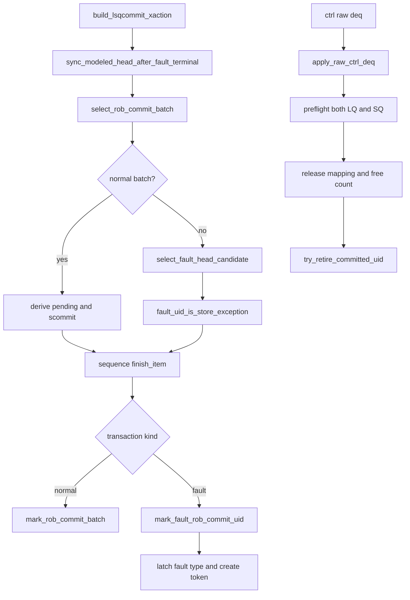

# `lsq_commit_handler.sv` 源码分析

本文档对应源码：

- `mem_ut/ver/ut/memblock/seq/base_seq_help/lsq_commit_handler.sv`

## 1. 定位、术语与抽象职责

`lsq_commit_handler`是ROB commit stimulus和DUT LQ/SQ deq状态回收的唯一公共helper。它读取主表和
status，构造`lsqcommit_agent_agent_xaction`，并在transaction发送后推进软件ROB状态；真实LSQ资源
仍由ctrl monitor的deq事件释放。

| 术语 | 含义 | 状态落点 |
|---|---|---|
| `modeled head` | 当前软件ROB head的完整flag/value key | `modeled_rob_deq_ptr`、`modeled_head_valid` |
| `watermark` | 最近一个normal commit batch的tail key | `committed_rob_watermark` |
| `fault token` | fault已commit但尚未完成LSQ deq/terminal的动态实例 | `fault_head_waiting`及其uid/epoch |
| `fault type latch` | 最近一次已发送fault的load/store类型 | `latched_is_store_exception` |
| `level sideband` | 空闲周期仍需保持的输入 | `pendingPtr/pendingst/pendingMMIOld/isStoreException` |

该handler不生成writeback/fault，不处理redirect事件，也不根据`isStoreException`修改
pass/fail/terminal；该字段只选择DUT的LQ/SQ异常地址来源。

## 2. 主调用链



整体文字伪代码：

```text
每拍先同步已收敛fault token，并从commit cursor恢复权威ROB head；
优先选择连续normal commit batch；没有normal batch时才选择当前fault head；
构造transaction：level字段使用当前head/latch，pulse字段本拍重新计算；
如果是fault head，从主表统一operation behavior派生isStoreException；
sequence完成finish_item后再调用mark函数提交软件状态；
ctrl monitor后续报告真实deq时，handler联合预检LQ/SQ owner并释放mapping；
ROB commit和LSQ deq均完成后，公共数据层才形成normal或fault terminal。
```

## 3. `fault_uid_is_store_exception()`

抽象功能描述：该函数把fault UID的权威主表操作分类转换为ROB exception commit type的store bit。
它是纯分类helper，不修改handler、status、queue或LSQ pointer。

```systemverilog
behavior = lsq_ctrl_model::derive_op_behavior(data.get_main_transaction(uid));
return memblock_op_behavior_util::is_scalar_rob_store_commit(behavior);
```

文字伪代码：

```text
要求main table已ready且uid有效；
读取uid对应main transaction；
调用统一derive_op_behavior检查fuType/fuOpType并生成operation behavior；
普通scalar store或STU CBO返回1；load和atomic返回0；
vector LS或非法编码沿用统一helper的uvm_fatal，不能静默按load处理。
```

## 4. `clear_lsqcommit_xaction()` 与 `build_lsqcommit_xaction()`

抽象功能描述：`clear_lsqcommit_xaction()`建立当前level状态和零pulse基线；
`build_lsqcommit_xaction()`再叠加normal head属性、commit batch或fault head属性。

```systemverilog
tr.io_ooo_to_mem_isStoreException = latched_is_store_exception;
if (has_fault_head) begin
    tr.io_ooo_to_mem_isStoreException =
        fault_uid_is_store_exception(fault_uid);
end
```

文字伪代码：

```text
pendingPtr来自modeled head；无active head但有最终normal watermark时发布watermark；
pendingst、pendingMMIOld、scommit和flushSb先清0；
isStoreException先恢复最近一次fault类型；
normal active head只派生pendingst/pendingMMIOld，不更新isStoreException；
fault head保持pendingst/pendingMMIOld/scommit为0，只覆盖isStoreException；
构造阶段只预览fault类型，不提前修改handler latch。
```

## 5. `mark_fault_rob_commit_uid()`

抽象功能描述：该函数在fault transaction已经发送后，原子提交fault ROB状态、动态实例token和
fault类型latch。global flush阻塞时返回失败，不产生部分状态。

```systemverilog
fault_is_store_exception = fault_uid_is_store_exception(uid);
status.rob_commit = 1'b1;
fault_head_waiting = 1'b1;
fault_head_uid = uid;
fault_head_dynamic_epoch = status.dynamic_epoch;
...
latched_is_store_exception = fault_is_store_exception;
```

normal commit、LQ/SQ deq、redirect、fault token收敛和terminal都不会单独清除该latch。只有
`reset_lsqcommit_runtime_state()`把standalone环境初值设为0，或后续新的fault transaction用新分类覆盖。

## 6. Deq 与终态边界

`apply_raw_ctrl_deq()`先联合预检同一raw中的LQ/SQ owner，全部成功后才释放free count和active map；
resync mismatch由上层保留raw队首重试。`sqDeq`是DUT entry释放数量，不等于`scommit`，也不由
`isStoreException`控制。详细端到端流程见
`AI_DOC/mem_ut_flow_doc/rob_commit_lq_sq_deq_flow.md`。
