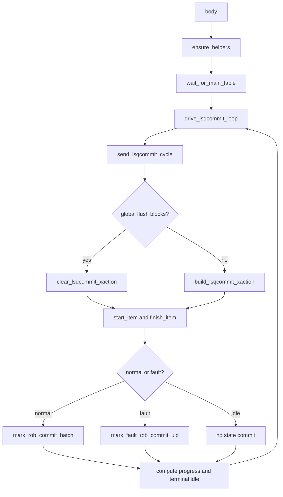

# `memblock_lsqcommit_dispatch_base_sequence.sv` 源码分析

本文档对应源码：

- `mem_ut/ver/ut/memblock/seq/base_seq/memblock_lsqcommit_dispatch_base_sequence.sv`

## 1. 定位、术语与抽象职责

该sequence周期构造并发送`lsqcommit_agent_agent_xaction`。它负责驱动
`pendingPtr/pendingst/pendingMMIOld/scommit/flushSb/isStoreException`，并在driver接受transaction后
调用`lsq_commit_handler`提交normal commit batch或fault token。

| 术语 | 含义 | 示例 |
|---|---|---|
| `cycle transaction` | commit loop每轮发送的一笔完整lsqcommit输入 | normal、fault或idle transaction |
| `level sideband` | 无新动作时继续保持的字段 | `pendingPtr`、`isStoreException` |
| `pulse sideband` | 只描述当前transaction动作的字段 | `scommit`、`flushSb` |
| `terminal idle` | global stop后用于发布稳定最终level状态的最后一笔transaction | pulse均为0 |

该sequence不是writeback producer，也不直接释放LQ/SQ mapping。真实deq仍由ctrl monitor raw consumer处理。

## 2. 调用流程



整体文字伪代码：

```text
初始化公共data、LSQ model和singleton commit handler，并重置handler私有状态；
等待main table ready；
每轮调用build_lsqcommit_xaction生成normal、fault或idle transaction；
如有flushSb request，把flushSb pulse叠加到本拍transaction；
调用start_item/finish_item，把完整字段交给lsqcommit driver；
发送完成后，normal batch调用mark_rob_commit_batch；fault head调用mark_fault_rob_commit_uid；
isStoreException只有fault transaction会覆盖，mark成功后保持到后续fault覆盖；
所有uid终态且raw/cancel/flushSb状态收敛后，再发布terminal idle并退出。
```

## 3. `send_lsqcommit_cycle()`

抽象功能描述：该task把“一拍需要驱动什么”和“发送后提交哪类软件状态”串成严格顺序；
构造阶段不提前修改commit/fault状态。

关键顺序：

```systemverilog
commit_handler.build_lsqcommit_xaction(tr, commit_uids,
                                       has_commit, has_fault_head, fault_uid);
start_item(tr);
finish_item(tr);
if (has_commit) begin
    commit_handler.mark_rob_commit_batch(commit_uids);
end else if (has_fault_head) begin
    commit_handler.mark_fault_rob_commit_uid(fault_uid);
end
```

因此fault类型只有在transaction完成发送后才进入handler latch。若构造后被global flush路径阻塞，
不会把未发送的fault类型提交为后续level值。

## 4. Driver 协作

`lsqcommit_agent_agent_driver::send_pkt()`原样驱动transaction并缓存所有level sideband；
`drive_active_idle()`在no-item、pre-gap和post-gap周期继续驱动缓存的
`pendingPtr/pendingst/pendingMMIOld/isStoreException`，只清`scommit/flushSb`。

`isStoreException`不参与`has_progress`、global stop或terminal判断。terminal idle可以继续保持最后一次
fault类型，因为该level值本身不表示新的异常事件。

## 5. 参数和边界

- `MEMBLOCK_LSQCOMMIT_SEQ_EN`：sequence运行开关。
- `MEMBLOCK_ACTIVE_SEQ_NO_PROGRESS_WARN_CYCLES`：仅控制debug warning，不决定终态。
- 本sequence不新增`isStoreException` plusarg或cfg；类型来自主表权威操作分类。
- `pendingst`表示normal active ROB head是scalar store，不能替代fault专用的`isStoreException`。
- vector LS仍为当前unsupported边界。
