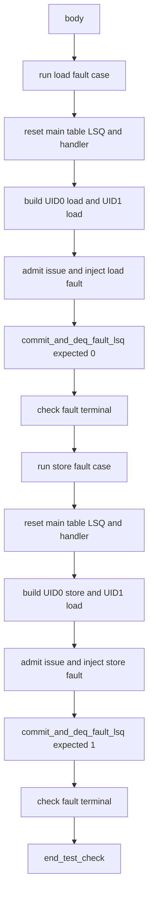

# Software Dispatch Smoke Sequence 源码分析

本文档对应源码：

- `mem_ut/ver/ut/memblock/seq/base_seq/soft_test/soft_test_memblock_dispatch_smoke_sequence.sv`
- `mem_ut/ver/ut/memblock/seq/base_seq/soft_test/soft_test_memblock_dispatch_fault_smoke_sequence.sv`

## 1. 定位、术语与边界

software smoke直接调用公共helper模拟admission、issue、writeback、commit和deq，不驱动真实DUT握手。
它用于快速检查测试框架状态闭环；真实interface时序仍由real smoke验证。

| 术语 | 含义 | 代码落点 |
|---|---|---|
| `directed case` | 固定操作类型和ROB顺序的一轮software场景 | `run_fault_case()` |
| `fault head` | UID0上被注入fault的modeled ROB head | load或store case |
| `hold transaction` | fault token等待deq时再次构造的idle transaction | 检查level保持 |
| `terminal transaction` | 本轮所有uid完成后构造的idle transaction | 检查最终level保持 |
| `output monitor` | 采样DUT `io_mem_to_ooo_*`输出并生成raw事件的被动agent monitor | software smoke中关闭，不消费其raw |

本测试只检查框架生成的字段和状态，不实现DUT异常地址checker、RM或coverage。
`tc_smoke::configure_smoke_env_cfg()` 在环境创建前提供配置钩子；software-only子类关闭ctrl、int/vec writeback、
wakeup和IQ feedback output monitor，避免未驱动DUT输出的X值抢先终止软件闭环。该设置不改变real smoke的monitor行为。
`memblock_env::connect_phase()`只在对应`mon_sw=ON`时连接上述agent的`mon_item_port`，使关闭monitor的配置不会
访问未创建的端口。

fault smoke中的store fault仍遵守既有V2严格STA合同：在向STA item提交synthetic real/fault writeback前，先以
相同SQ key推入raw IQ-hit并调用`collect_monitor_event_batch()`，由既有adapter/handler记录当前issue的
`sta_issue_feedback_success`。load-fault case的年轻normal UID固定为load，避免本专项无关地覆盖STA normal
writeback；这些构造不改变`writeback_status_handler`或STA writeback流程。

## 2. Normal smoke

`soft_test_memblock_dispatch_smoke_sequence`构造两个manual条目：UID0为scalar load，UID1为scalar store。
它完成软件LSQ分配、issue queue fire、synthetic pass writeback、ROB commit和LQ/SQ释放，并检查两个uid均
`success=1 && terminal_done=1`。

关键helper继续由真实flow复用：`derive_op_behavior()`、`issue_queue_scheduler`、
`writeback_status_handler`和`lsq_commit_handler`。software smoke不复制这些状态转换规则。

## 3. Fault smoke 调用流程



整体文字伪代码：

```text
第一轮重置全部case状态，构造load fault head和younger load；
检查handler初始isStoreException为0；
注入fault和normal writeback，验证fault transaction为0；
mark fault后再次构造hold transaction，确认仍为0；
完成LQ deq、younger normal commit/LQ deq，再检查terminal transaction仍为0；
检查本轮fault uid进入success=0、terminal_done=1；

第二轮重新重置主表、LSQ model和handler私有状态，构造store fault head和younger load；
再次确认reset后的初始值为0；
对STA fault target先推入同一SQ key的synthetic IQ hit，由既有handler记录当前issue的成功反馈；
每轮fault writeback后调用`exception_redirect_replay_task()`消费已进入`exception_event_q`的recovery event，
不直接删除队列或重复写fault状态；
验证store fault transaction把isStoreException置1；
验证fault等待、younger normal commit和terminal idle均保持1；
完成SQ/LQ释放并检查非成功fault终态；
两轮完成后统一调用end_test_check，避免第一轮提前关闭公共monitor capture。
```

## 4. `commit_and_deq_fault_lsq()`

抽象功能描述：该task是fault smoke子类的专项helper，检查fault sideband、提交fault token、按操作behavior释放对应LQ/SQ mapping，
再提交younger normal uid并验证terminal level值。它不替代父类无参数的`commit_and_deq_lsq()`，避免不同参数列表的派生类task覆盖冲突。

检查点：

- fault transaction不得产生`pendingst/pendingMMIOld/scommit`。
- load fault的`isStoreException=0`，scalar store fault为1。
- `mark_fault_rob_commit_uid()`之后的hold transaction必须保持同一值。
- younger normal transaction不能覆盖fault类型。
- terminal transaction保持最近fault类型，但不产生新的fault、commit或deq。

每轮分别调用`check_fault_terminal_status()`检查fault uid为
`fault=1 && success=0 && terminal_done=1`，younger uid为normal success。最终`data.end_test_check()`
只在第二轮结束后调用。
