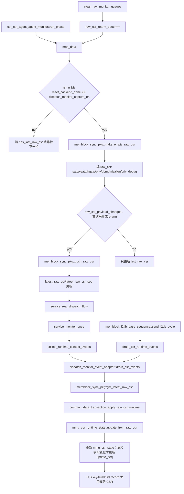
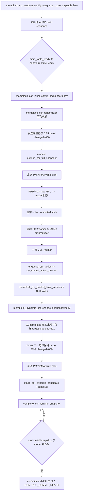

# CSR Runtime Sync Flow

本文档说明 mem_ut 测试框架中 MMU CSR runtime mirror 与专项 CSR 配置的真实同步链路。普通 CSR runtime 是 latest snapshot，不是 FIFO 事件：monitor 每拍采样 CSR interface，只有 payload 变化或软件 reset 要求 re-arm 时更新 `memblock_sync_pkg::latest_raw_csr`；service loop 或 L2TLB responder 通过 `drain_csr_events()` 把最新 snapshot 同步到 `common_data_transaction.mmu_csr_state`。V2 的 `hd_misalign_ld_enable`、`hd_misalign_st_enable` 和 `priv_debug` 也沿该链保存，但它们当前是 snapshot-only 字段，不进入 TLB key、主表、异常生成或 pass/fault/terminal。

专项 `memblock_csr_random_config_vseq` 另外启用一条完整 observation 链：monitor 每个有效 sample 发布 92 个 DUT CSR 输入组成的 587-bit full snapshot，并把 distributed CSR write 写入 PMP/PMA raw FIFO。启动期 sequence 只有在 full snapshot 与 PMP/PMA model 都匹配后才提交初始配置；运行期动态 child 先登记 candidate，control service 再按 owner、drive sample、full snapshot 和 PMP/PMA model 四项条件提升为 committed state。该链不替换普通 runtime mirror，也不会在非专项 VSEQ 中启用 driver CSR level hold。

## 1. 函数调用 Flow 图

### 1.1 术语与抽象功能说明

| 英文术语 | 当前 flow 中的中文含义 | 代码对象/状态落点 | 示例 |
|---|---|---|---|
| `latest snapshot` | 只保留最近一份 CSR 状态，不按拍排成 FIFO | `memblock_sync_pkg::latest_raw_csr` | CSR payload 变化时覆盖旧快照并递增 `latest_raw_csr_seq` |
| `raw struct` | monitor 采到的原始字段容器，只负责跨 monitor 和 adapter 传递 | `dispatch_raw_csr_t` | monitor 填 raw，adapter 再交给 runtime mirror |
| `snapshot-only` | 当前只保存和复制、不参与行为判断的字段 | `hd_misalign_ld/st_enable`、`priv_debug` | 字段改变会更新 snapshot，但不改变 TLB key 或 terminal |
| `semantic field` | 会改变翻译/权限上下文的字段 | satp/vsatp/hgatp、既有 privilege/PBMT 字段 | 这些字段改变才递增 `update_seq` |
| `re-arm epoch` | 清空 latest 后使 monitor 本地去重基线失效的代号 | `raw_csr_rearm_epoch` | reset 前后 CSR 相同时仍重新发布首份 snapshot |
| `capture` | 是否允许 monitor 把采样值发布到共享 raw 状态的开关，不控制 interface 采样本身 | `dispatch_monitor_capture_en` | capture=0 时仍每拍采样和按条件诊断，但 `push_raw_csr()` 不更新 latest |
| `payload baseline` | monitor 本地保存的上一份 CSR payload，用于去重比较 | `last_raw_csr`、`has_last_raw_csr` | re-arm 时清除 baseline，下一份相同 payload 也会发布 |
| `X/Z diagnosis` | 对四态 interface 值的 error-only 诊断，不是 raw drop/fatal gate | `TCNT_CHECK_SIG_XZ` | 发现 X/Z 时报告 `uvm_error`，后续 raw 发布条件仍独立判断 |
| `service loop` | 周期性消费 raw 事件并更新公共状态的软件循环 | `service_monitor_once()`、`drain_csr_events()` | 每轮先同步 CSR，再处理其它 runtime 事件 |
| `full snapshot` | monitor 同拍采到的全部 92 个 DUT CSR 输入，不是窄 MMU runtime mirror | `memblock_csr_full_snapshot_t`，587-bit payload | 专项动态 target 只有完整 payload 匹配才允许提交 |
| `committed state` | 已经通过 monitor 与 PMP/PMA model 确认、可作为下一次动态随机基线的净化 CSR level | `common_data_transaction::csr_committed_state` | dynamic action 从 committed 复制，关闭组保持原值 |
| `candidate` | 已发送但尚未获得完整 observation 的动态目标，不能提前成为下一次随机基线 | `csr_dynamic_candidate_state` 及其 owner/sample/profile | full snapshot 尚未跨过 drive sample 时继续等待 |
| `action owner` | 唯一绑定一次控制动作的 UID、动态代际、动作代际和类型组合 | `memblock_control_owner_t` | UID 8 的 generation 1 只能提交自己登记的 candidate |
| `CSR level hold` | 专项 driver 在 item 间保持已净化完整 CSR 电平的私有副本 | `csr_level_hold_tr` | 动态 `changed=111` 后下一拍保持同值并清为 `000` |
| `write plan` | 把 normal/exception region 编码成有序 PMP/PMA CSR RMW 写拍 | `memblock_csr_pmp_pma_write_plan::beats` | OFF lower、TOR top，逐拍写完后由 model 回放确认 |

### 1.2 重点函数的抽象功能

| 函数/task | 抽象功能描述 |
|---|---|
| `csr_ctrl_agent_agent_monitor::mon_data()` | 每拍采样 CSR；只有 capture 开启且 reset/backend ready 时才发布 latest raw snapshot，不直接改 status。 |
| `memblock_sync_pkg::raw_csr_payload_changed()` | 判断当前 raw 是否需要覆盖 latest snapshot，不解释字段的行为语义。 |
| `memblock_sync_pkg::push_raw_csr()` | 保存有效 latest snapshot 并递增 snapshot 序号，不建立 CSR FIFO。 |
| `dispatch_monitor_event_adapter::drain_csr_events()` | 读取 latest snapshot 并交给公共数据层按序号幂等应用。 |
| `common_data_transaction::apply_raw_csr_runtime()` | 将 raw CSR 同步到 runtime mirror，不生成异常或终态事件。 |
| `mmu_csr_runtime_state::update_from_raw_csr()` | 复制完整 CSR 状态，仅用 semantic field 变化决定 `update_seq`。 |
| `memblock_csr_initial_config_sequence::body()` | 在流量 producer 启动前求解并驱动一次完整静态 CSR 与 PMP/PMA write plan，确认后发布初始 committed state。 |
| `memblock_csr_control_base_sequence::body()` | 保留 action queue、L2 flush 和 shutdown 所有权；普通 CSR token 只 factory 创建并同步启动动态 child。 |
| `memblock_dynamic_csr_change_sequence::body()` | 从 committed state 单次求解动态 target，发送 level/write plan 并登记 candidate，不直接提交。 |
| `common_data_transaction::commit_csr_dynamic_candidate_if_observed()` | 由 control service 调用，同时核对 owner、full snapshot sample/payload 与 PMP/PMA model，成功后提升 committed state。 |
| `csr_ctrl_agent_agent_driver::send_pkt()` | 专项状态下捕获净化 level，并在动态三路 changed 同拍为 1 后等待下一驱动边界清零；非专项路径保持原行为。 |



### 1.4 专项初始与动态 CSR 配置 Flow



#### 函数调用 Flow 图整体文字伪代码

```text
专项 CSR 配置主流程：

1. 启动阶段：
   memblock_csr_random_config_vseq 先启动 AUTO main sequence，使主表构建、control bootstrap 和 monitor service 可运行。
   initial CSR sequence 等待 main_table_ready 与当前 control reset epoch ready；此时 LSQ、issue、commit 和 L2TLB producer 尚未启动。
   randomizer 校验冻结的 plus 快照并只求解一次，把 ATP、权限、priv context、13 个静态 enable 和 region 属性写入完整 level。
   initial sequence 发送 changed=000 的完整 CSR，再按 OFF lower/TOR top 顺序发送 PMP/PMA write plan。
   full snapshot 与 PMP/PMA model 都匹配后，公共数据对象发布初始 committed state 并置 csr_initial_config_done。
   其余 producer 看到 done 后才启动；CSR base worker 随后成为 csr_ctrl_sqr 的唯一长期 producer。

2. 动态阶段：
   主表 CSR marker 经 control service 绑定 action owner，写入 csr_control_action_q 并触发 csr_control_action_available_ev。
   memblock_csr_control_base_sequence 醒来后重新检查队列，弹出 token，并同步启动 memblock_dynamic_csr_change_sequence；base 自身不求解 CSR。
   dynamic child 从 committed state 复制完整基线；关闭动态组保持旧值，开启组参与一次约束求解，并要求至少一项实际变化。
   child 先发送三路 ATP changed=111 的完整 level；专项 driver 在下一驱动边界保持净化 level 并清成 000。
   PMP_PMA 组开启时，child 继续发送 distributed write plan；随后登记 candidate、owner 和 drive sample，再报告 sendover。
   control service 先匹配窄 runtime snapshot，再调用 commit_csr_dynamic_candidate_if_observed 检查完整 92 字段 snapshot 是否跨过 drive sample、payload 是否一致、PMP/PMA model 是否一致。
   任一 observation 未到时保持 WAIT_CSR_RUNTIME_SNAPSHOT；全部匹配后才清 candidate、更新 committed state，并进入 CONTROL_COMMIT_READY。

3. 兼容和异常分支：
   非专项 VSEQ 不设置 csr_special_sequence_active，dynamic child 走既有 SATP ASID 加一策略，driver 不建立 CSR level hold。
   无 owner、无 committed state、非法权重/范围、无非当前合法解、candidate owner 不匹配或重复 candidate 均在提交或首包激励前 fatal。
   L2 flush ASSERT/RELEASE 与 worker shutdown 继续由 base worker 原分支处理，不进入 dynamic child。
```

### 1.3 函数调用 Flow 图整体文字伪代码

```text
CSR runtime sync 主流程：

1. CSR monitor 采样阶段：
   csr_ctrl_agent_agent_monitor::run_phase 调用 mon_data。
   mon_data 每拍从 csr_ctrl interface 采样 satp/vsatp/hgatp/priv/pbmt，以及 misalign enable/priv_debug；
   X/Z 诊断只由 xz_sw、rst_n 和 reset_backend_done 控制，不依赖 capture 开关。
   如果 raw_csr_rearm_epoch 变化：
     清空本地 has_last_raw_csr 和 last_raw_csr，强制下一份完整 snapshot 发布。
   如果 reset 未完成或 dispatch_monitor_capture_en 关闭：
     清空本地 last_raw_csr 有效标记，避免下一次 capture 误认为旧 snapshot 仍连续。
   如果 reset 完成且 capture 打开：
     创建 raw_csr。
     把当前 DUT CSR 信号写入 raw_csr。
     如果是首次/re-arm 采样，或 raw_csr_payload_changed 判断 payload 发生变化：
       调用 push_raw_csr 更新 latest_raw_csr 和 latest_raw_csr_seq。
     最后更新 monitor 本地 last_raw_csr。

2. service loop 同步阶段：
   service_real_dispatch_flow 每拍调用 service_monitor_once。
   service_monitor_once 先调用 collect_runtime_context_events。
   collect_runtime_context_events 只 drain_csr_events。
   返回 `service_monitor_once()` 后，唯一的 `service_l2tlb_sfence_events()` 另行处理 raw fence；它不属于 CSR runtime mirror 更新。
   drain_csr_events 从 memblock_sync_pkg 读取 latest raw CSR snapshot。
   如果 snapshot 有效且 seq 未重复：
     common_data_transaction::apply_raw_csr_runtime 更新 mmu_csr_state。
     mmu_csr_runtime_state::update_from_raw_csr 更新全部 snapshot 字段；只有既有翻译/权限语义字段变化时递增 update_seq。
     misalign enable/priv_debug 单独变化只更新 snapshot，不改变 TLB key 或行为版本。

3. L2TLB responder 同步阶段：
   L2TLB responder 收到 DTLB request 后，在建 TLB key 前调用 drain_csr_runtime_events。
   该路径只同步 CSR latest snapshot，不消费 sfence FIFO。
   后续 make_tlb_key_by_req / build_tlb_entry_for_key 使用最新 mmu_csr_state 选择 asid/vmid/s2xlate 相关 key。
```

## 2. `csr_ctrl_agent_agent_monitor::mon_data()`

源码位置：`mem_ut/ver/ut/memblock/agent/csr_ctrl_agent_agent/src/csr_ctrl_agent_agent_monitor.sv`

抽象功能描述：`mon_data()` 是 CSR interface 的连续采样入口；它每拍读取 interface，X/Z 诊断独立于 capture，只有 raw 发布受 capture、reset/backend ready 和 payload 去重条件限制。

真实逻辑摘要：

```systemverilog
if (memblock_sync_pkg::raw_csr_rearm_epoch != last_raw_csr_rearm_epoch) begin
    has_last_raw_csr = 1'b0;
    last_raw_csr = memblock_sync_pkg::make_empty_raw_csr();
    last_raw_csr_rearm_epoch = memblock_sync_pkg::raw_csr_rearm_epoch;
end
if (memblock_sync_pkg::dispatch_monitor_capture_en != last_capture_en) begin
    has_last_raw_csr = 1'b0;
    last_capture_en = memblock_sync_pkg::dispatch_monitor_capture_en;
end
if (this.vif.rst_n!=1'b1 || memblock_sync_pkg::reset_backend_done!=1'b1) begin
    has_last_raw_csr = 1'b0;
end
if(this.vif.rst_n==1'b1 && memblock_sync_pkg::reset_backend_done==1'b1 &&
   memblock_sync_pkg::dispatch_monitor_capture_en==1'b1) begin
    raw_csr = memblock_sync_pkg::make_empty_raw_csr();
    raw_csr.valid             = 1'b1;
    raw_csr.satp_mode         = io_ooo_to_mem_tlbCsr_satp_mode;
    raw_csr.satp_asid         = io_ooo_to_mem_tlbCsr_satp_asid;
    raw_csr.vsatp_mode        = io_ooo_to_mem_tlbCsr_vsatp_mode;
    raw_csr.hgatp_mode        = io_ooo_to_mem_tlbCsr_hgatp_mode;
    raw_csr.hgatp_vmid        = io_ooo_to_mem_tlbCsr_hgatp_vmid;
    raw_csr.priv_virt         = io_ooo_to_mem_tlbCsr_priv_virt;
    raw_csr.priv_dmode        = io_ooo_to_mem_tlbCsr_priv_dmode;
    raw_csr.hd_misalign_ld_enable = io_ooo_to_mem_csrCtrl_hd_misalign_ld_enable;
    raw_csr.hd_misalign_st_enable = io_ooo_to_mem_csrCtrl_hd_misalign_st_enable;
    raw_csr.priv_debug        = io_ooo_to_mem_tlbCsr_priv_debug;
    raw_csr.m_pbmt_en         = io_ooo_to_mem_tlbCsr_mPBMTE;
    raw_csr.h_pbmt_en         = io_ooo_to_mem_tlbCsr_hPBMTE;
    raw_csr.cycle             = $time;
    if (!has_last_raw_csr ||
        memblock_sync_pkg::raw_csr_payload_changed(last_raw_csr, raw_csr)) begin
        memblock_sync_pkg::push_raw_csr(raw_csr);
        has_last_raw_csr = 1'b1;
    end
    last_raw_csr = raw_csr;
end
```

中文伪代码：

```text
每个 monitor clock：
  采样 DUT 输出的 satp/vsatp/hgatp/priv/pbmt CSR 和 misalign enable/priv_debug 信号。
  X/Z 检查条件满足时诊断三个 snapshot-only 字段；宏只报告 uvm_error，不作为 raw 发布 gate。
  如果 raw_csr_rearm_epoch 变化：
    清空 has_last_raw_csr 和 last_raw_csr，记录新 epoch，使软件清表前的去重基线失效。
  如果 capture enable 状态变化：
    清空本地 has_last_raw_csr，保证下一次 capture 会推送完整 snapshot。
  如果 reset 未完成：
    清空本地 has_last_raw_csr，不发布 reset 阶段的 snapshot。
  如果 reset 完成且 capture 打开：
    调用 make_empty_raw_csr 创建有确定默认值的 raw_csr。
    把当前 CSR 信号写入 raw_csr，并记录采样时间。
    如果本地没有上一份 raw_csr，或 raw_csr_payload_changed 判断 payload 已变化：
      调用 push_raw_csr，把这份 snapshot 写成全局 latest CSR，并递增全局 snapshot 序号。
      置 has_last_raw_csr=1。
    保存 last_raw_csr，用于下一拍变化比较。
```

功能解释：

该 monitor 是 CSR runtime 的连续采样入口。它每拍读取 interface；在 `xz_sw`、reset/backend ready 满足时执行 X/Z 诊断，而只有 capture 打开时才在首次、re-arm 或 payload 变化时发布 latest snapshot。

输入/输出：

- 输入：`csr_ctrl_agent_agent_interface` 上的 `io_ooo_to_mem_tlbCsr_*`、`io_ooo_to_mem_csrCtrl_hd_misalign_*_enable` 信号、`rst_n`、`reset_backend_done`、`dispatch_monitor_capture_en`、`raw_csr_rearm_epoch`。
- 输出：调用 `memblock_sync_pkg::push_raw_csr()` 更新 `latest_raw_csr`。

内部子调用：

- `make_empty_raw_csr()`：生成默认无效 CSR raw struct，避免未赋字段残留。
- `raw_csr_payload_changed()`：比较关心的 CSR payload 和 changed pulse。
- `push_raw_csr()`：写全局 latest snapshot 并递增 sequence。
- `raw_csr_rearm_epoch`：由 `clear_raw_monitor_queues()` 递增，要求 monitor 丢弃本地去重 baseline。

## 3. `memblock_sync_pkg::raw_csr_payload_changed()`

源码位置：`mem_ut/ver/ut/memblock/common/memblock_common/src/memblock_sync_pkg.sv`

抽象功能描述：该函数比较上一份和当前份 CSR raw，决定是否需要发布新的 latest snapshot；它不决定字段是否进入 TLB key 或异常模型。

真实逻辑摘要：

```systemverilog
function bit raw_csr_payload_changed(input dispatch_raw_csr_t prev,
                                     input dispatch_raw_csr_t cur);
    return
        prev.satp_mode         != cur.satp_mode         ||
        prev.satp_asid         != cur.satp_asid         ||
        prev.vsatp_mode        != cur.vsatp_mode        ||
        prev.vsatp_asid        != cur.vsatp_asid        ||
        prev.hgatp_mode        != cur.hgatp_mode        ||
        prev.hgatp_vmid        != cur.hgatp_vmid        ||
        prev.priv_virt         != cur.priv_virt         ||
        prev.priv_dmode        != cur.priv_dmode        ||
        prev.hd_misalign_ld_enable != cur.hd_misalign_ld_enable ||
        prev.hd_misalign_st_enable != cur.hd_misalign_st_enable ||
        prev.priv_debug        != cur.priv_debug        ||
        prev.m_pbmt_en         != cur.m_pbmt_en         ||
        prev.h_pbmt_en         != cur.h_pbmt_en         ||
        (cur.satp_changed      && !prev.satp_changed)   ||
        (cur.vsatp_changed     && !prev.vsatp_changed)  ||
        (cur.hgatp_changed     && !prev.hgatp_changed)  ||
        (cur.priv_virt_changed && !prev.priv_virt_changed);
endfunction:raw_csr_payload_changed
```

中文伪代码：

```text
比较上一份和当前 CSR snapshot：
  依次比较 satp/vsatp/hgatp 的 mode、asid/vmid、ppn 等稳定字段。
  再比较 priv、PBMT 和 snapshot-only 的 misalign enable/priv_debug 字段。
  再检查 satp/vsatp/hgatp/priv_virt changed pulse 是否从 0 上升为 1。
  任一条件成立就返回 true，要求 monitor 发布新的 latest snapshot。
  所有条件均不成立则返回 false，保留现有 latest snapshot 和序号。
```

功能解释：

该函数决定 monitor 是否需要推送新的 CSR snapshot。它既比较稳定 CSR 字段，也比较 changed pulse 的上升语义。

输入/输出：

- 输入：上一份 raw CSR、当前 raw CSR。
- 输出：返回是否需要更新 latest snapshot。

## 4. `memblock_sync_pkg::push_raw_csr()` / `get_latest_raw_csr()`

源码位置：`mem_ut/ver/ut/memblock/common/memblock_common/src/memblock_sync_pkg.sv`

抽象功能描述：这两个函数分别写入和读取 latest CSR snapshot；写入侧受 capture/valid 约束，读取侧只返回当前最新值和序号。

真实逻辑摘要：

```systemverilog
function void push_raw_csr(input dispatch_raw_csr_t item);
    if (dispatch_monitor_capture_en && item.valid) begin
        latest_raw_csr = item;
        latest_raw_csr_valid = 1'b1;
        latest_raw_csr_seq++;
    end
endfunction:push_raw_csr

function bit get_latest_raw_csr(output dispatch_raw_csr_t item,
                                output int unsigned seq);
    seq = latest_raw_csr_seq;
    if (!latest_raw_csr_valid) begin
        item = make_empty_raw_csr();
        return 1'b0;
    end
    item = latest_raw_csr;
    return 1'b1;
endfunction:get_latest_raw_csr
```

中文伪代码：

```text
push_raw_csr：
  如果 capture 打开且 item 有效：
    用 item 覆盖 latest_raw_csr，只保留最新 CSR 状态。
    标记 latest_raw_csr_valid=1。
    latest_raw_csr_seq 加一，使 consumer 能识别这是一份尚未应用的新 snapshot。
  否则不修改 latest snapshot 或序号。

get_latest_raw_csr：
  先把当前 latest_raw_csr_seq 写给调用者。
  如果 latest snapshot 无效：
    调用 make_empty_raw_csr 输出确定的空结构并返回 false。
  如果有效：
    输出 latest_raw_csr 并返回 true；读取不会删除或改变 snapshot。
```

功能解释：

CSR runtime 使用 latest snapshot 模型。`push_raw_csr()` 覆盖旧 snapshot 并递增 seq，`get_latest_raw_csr()` 返回当前最新值。

输入/输出：

- 输入：raw CSR snapshot。
- 输出：`latest_raw_csr`、`latest_raw_csr_valid`、`latest_raw_csr_seq`；清空路径另递增 `raw_csr_rearm_epoch`。

## 5. `dispatch_monitor_event_adapter::drain_csr_events()`

源码位置：`mem_ut/ver/ut/memblock/seq/base_seq_help/dispatch_monitor_event_adapter.sv`

抽象功能描述：该 adapter task 从共享 sync package 取得 latest CSR，并将它交给公共数据对象按序号去重应用；它不直接修改 TLB entry。

真实逻辑摘要：

```systemverilog
function void drain_csr_events();
    memblock_sync_pkg::dispatch_raw_csr_t raw_csr;
    int unsigned raw_csr_seq;

    ensure_handles();
    if (memblock_sync_pkg::get_latest_raw_csr(raw_csr, raw_csr_seq)) begin
        data.apply_raw_csr_runtime(raw_csr, raw_csr_seq);
    end
endfunction:drain_csr_events
```

中文伪代码：

```text
调用 ensure_handles，保证 adapter 已取得唯一公共 common_data_transaction；该调用不消费事件。
调用 get_latest_raw_csr 读取 latest raw CSR 和序号：
  如果函数返回 false，说明当前没有可应用 snapshot，直接结束且不修改 runtime mirror。
  如果函数返回 true，取得 raw_csr 和 raw_csr_seq。
调用 data.apply_raw_csr_runtime：
  由公共数据对象按 valid 和序号去重，再把 snapshot 应用到 CSR runtime mirror。
```

功能解释：

adapter 从 sync_pkg 读取 latest CSR snapshot，并把它同步到 `common_data_transaction` 的 runtime CSR mirror。

输入/输出：

- 输入：`latest_raw_csr` 和 `latest_raw_csr_seq`。
- 输出：可能更新 `data.mmu_csr_state`。

内部子调用：

- `ensure_handles()`：保证 `common_data_transaction` 可用。
- `get_latest_raw_csr()`：读取 latest snapshot，不出队 FIFO。
- `apply_raw_csr_runtime()`：按 seq 去重后更新 runtime mirror。

## 6. `common_data_transaction::apply_raw_csr_runtime()`

源码位置：`mem_ut/ver/ut/memblock/seq/base_seq_help/common_data_transaction.sv`

抽象功能描述：该函数是 runtime mirror 的公共写入口，过滤无效或重复 snapshot 后调用 runtime state 更新；它不把 snapshot-only 字段转成主表或终态行为。

真实逻辑摘要：

```systemverilog
function void apply_raw_csr_runtime(input memblock_sync_pkg::dispatch_raw_csr_t raw,
                                    input int unsigned raw_csr_seq);
    if (!raw.valid) begin
        return;
    end
    if (raw_csr_seq == last_applied_raw_csr_seq) begin
        return;
    end
    if (mmu_csr_state == null) begin
        mmu_csr_state = mmu_csr_runtime_state::type_id::create("mmu_csr_state");
        mmu_csr_state.reset();
    end
    mmu_csr_state.update_from_raw_csr(raw);
    last_applied_raw_csr_seq = raw_csr_seq;
endfunction:apply_raw_csr_runtime
```

中文伪代码：

```text
如果 raw.valid=0：
  直接返回，不创建 runtime state，也不记录序号。
如果 raw_csr_seq 已等于 last_applied_raw_csr_seq：
  直接返回，避免多个 service 调用重复应用同一 latest snapshot。
如果 mmu_csr_state 尚未创建：
  创建对象并调用 reset，建立确定的 CSR 默认值。
调用 update_from_raw_csr：
  复制完整 raw CSR，并由 runtime state 自己区分语义字段与 snapshot-only 字段。
最后记录 last_applied_raw_csr_seq，使后续相同序号被过滤。
```

功能解释：

该函数是公共 data owner 应用 CSR snapshot 的唯一落点。它用 `last_applied_raw_csr_seq` 防止同一个 latest snapshot 在多个 service 调用中重复应用。

输入/输出：

- 输入：raw CSR snapshot、raw CSR seq。
- 输出：`mmu_csr_state` 创建/更新，`last_applied_raw_csr_seq` 更新。

## 7. `mmu_csr_runtime_state::update_from_raw_csr()`

源码位置：`mem_ut/ver/ut/memblock/seq/base_seq_help/mmu_csr_runtime_state.sv`

抽象功能描述：该函数复制 raw CSR 的全部字段，并把翻译/权限语义字段变化与 snapshot-only 字段变化分开；只有前者推进 `update_seq`。

真实逻辑摘要：

```systemverilog
changed =
    satp_mode  != raw.satp_mode         ||
    satp_asid  != raw.satp_asid         ||
    vsatp_mode != raw.vsatp_mode        ||
    vsatp_asid != raw.vsatp_asid        ||
    hgatp_mode != raw.hgatp_mode        ||
    hgatp_vmid != raw.hgatp_vmid        ||
    priv_virt  != raw.priv_virt         ||
    raw.satp_changed                    ||
    raw.vsatp_changed                   ||
    raw.hgatp_changed                   ||
    raw.priv_virt_changed;

satp_mode  = raw.satp_mode;
satp_asid  = raw.satp_asid;
vsatp_mode = raw.vsatp_mode;
vsatp_asid = raw.vsatp_asid;
hgatp_mode = raw.hgatp_mode;
hgatp_vmid = raw.hgatp_vmid;
priv_virt  = raw.priv_virt;
hd_misalign_ld_enable = raw.hd_misalign_ld_enable;
hd_misalign_st_enable = raw.hd_misalign_st_enable;
priv_debug = raw.priv_debug;
if (changed) begin
    update_seq++;
end
```

中文伪代码：

```text
如果 raw 无效，函数在片段之前直接返回，不改变 mirror。
按源码列出的 satp/vsatp/hgatp/priv/PBMT 字段和 changed pulse 计算 changed：
  这些字段代表翻译或权限上下文，任一变化都使 changed=1。
按源码顺序把 raw 中全部 CSR 字段复制到 runtime mirror：
  包括 hd_misalign_ld_enable、hd_misalign_st_enable 和 priv_debug。
如果 changed=1：
  update_seq 加一，记录一次翻译/权限语义版本变化。
如果只有三个 snapshot-only 字段变化：
  mirror 仍保存新值，但 changed=0，因此 update_seq 保持不变。
```

功能解释：

runtime mirror 保存当前 MMU CSR 状态，并用 `update_seq` 记录会影响当前翻译/权限上下文的语义变化次数。三个 snapshot-only 字段也保存在同一对象中，但不参与 `changed`，因此单独变化不会改变 `update_seq`。后续 TLB key、uid TLB record 和 responder 建表虽然持有该对象或其副本，当前只读取既有翻译字段。

输入/输出：

- 输入：raw CSR snapshot。
- 输出：`satp/vsatp/hgatp/priv/pbmt/misalign/priv_debug` 字段更新；仅语义字段变化时 `update_seq++`。

### 7.1 `mmu_csr_runtime_state::reset()`、`update_from_csr_ctrl()` 与 `copy_from()` 辅助链路

这三个 helper 不构成 monitor raw 主路径的额外事件源，但属于同一 runtime state 的字段完整性边界：`reset()` 提供默认值，`update_from_csr_ctrl()` 保留直接 transaction 兼容入口，`copy_from()` 把已同步的快照复制给 uid/TLB entry。它们都不直接修改主表、status、pass/fail 或 terminal。

源码位置：`mem_ut/ver/ut/memblock/seq/base_seq_help/mmu_csr_runtime_state.sv:46-129,246-273`。

`reset()` 关键片段：

```systemverilog
function void reset();
    satp_mode = '0;
    priv_imode = 2'd3;
    priv_dmode = 2'd3;
    hd_misalign_ld_enable = 1'b1;
    hd_misalign_st_enable = 1'b1;
    priv_debug = 1'b0;
    update_seq = 0;
endfunction:reset
```

中文伪代码：

```text
清空翻译地址空间和权限/PBMT runtime 字段；
按源码默认 privilege mode 初始化；
设置 misalign load/store=1/1、priv_debug=0；
清零 update_seq；
不发布任何 raw 或 TLB 事件。
```

`update_from_csr_ctrl()` 关键片段：

```systemverilog
function void update_from_csr_ctrl(input csr_ctrl_agent_agent_xaction csr_tr);
    bit changed;
    if (csr_tr == null) begin
        `uvm_fatal("MMU_CSR", "update_from_csr_ctrl got null transaction")
    end
    changed = satp_mode != csr_tr.io_ooo_to_mem_tlbCsr_satp_mode ||
              priv_virt != csr_tr.io_ooo_to_mem_tlbCsr_priv_virt ||
              csr_tr.io_ooo_to_mem_tlbCsr_satp_changed ||
              csr_tr.io_ooo_to_mem_tlbCsr_priv_virt_changed;
    hd_misalign_ld_enable = csr_tr.io_ooo_to_mem_csrCtrl_hd_misalign_ld_enable;
    hd_misalign_st_enable = csr_tr.io_ooo_to_mem_csrCtrl_hd_misalign_st_enable;
    priv_debug = csr_tr.io_ooo_to_mem_tlbCsr_priv_debug;
    if (changed) update_seq++;
endfunction:update_from_csr_ctrl
```

中文伪代码：

```text
空 transaction 直接 fatal；
比较直接 transaction 中的语义字段和 changed pulse；
复制完整 CSR（包括三个 snapshot-only 字段）；
只有语义字段变化才递增 update_seq；
当前 monitor 主链路不调用该入口，它不产生额外行为事件。
```

`copy_from()` 关键片段：

```systemverilog
function void copy_from(input mmu_csr_runtime_state rhs);
    if (rhs == null) begin
        `uvm_fatal("MMU_CSR", "copy_from got null rhs")
    end
    hd_misalign_ld_enable = rhs.hd_misalign_ld_enable;
    hd_misalign_st_enable = rhs.hd_misalign_st_enable;
    priv_debug = rhs.priv_debug;
    update_seq = rhs.update_seq;
endfunction:copy_from
```

中文伪代码：

```text
源 snapshot 为空则 fatal；
否则复制完整 runtime CSR 和已有 update_seq；
复制不重新计算或递增版本号，也不反向修改公共 runtime；
目标快照供 uid/TLB entry 保存上下文，sfence 不因复制动作删除它。
```

### 7.2 `memblock_csr_initial_config_sequence::body()`

源码位置：`mem_ut/ver/ut/memblock/seq/base_seq/memblock_csr_initial_config_sequence.sv`

抽象功能描述：该 task 在主表和 control runtime 已就绪、流量 producer 尚未启动的窗口内，独占 CSR sequencer 完成静态 level 与 PMP/PMA 初始化。它只在完整 monitor/model observation 后发布 committed state，不处理运行期 marker。

真实逻辑摘要：

```systemverilog
while (!data.main_table_ready ||
       !memblock_sync_pkg::control_runtime_ready_for_current_epoch()) begin
    #1;
    wait_count++;
    if (wait_count > seq_csr_common::get_active_seq_no_progress_warn_cycles())
        `uvm_fatal(get_type_name(), "timed out waiting for CSR startup barriers")
end
cfg = seq_csr_common::get_csr_sequence_cfg();
memblock_csr_config_state::configure_static_defaults(tr);
randomizer.configure(cfg, 1'b0, null, empty_region);
if (!randomizer.randomize())
    `uvm_fatal(get_type_name(), "initial CSR configuration has no legal weighted solution")
randomizer.apply_to_transaction(tr);
profile = randomizer.make_region_profile(seq_csr_common::get_paddr_base(),
                                         seq_csr_common::get_paddr_range());
start_item(tr);
finish_item(tr);
wait_for_full_snapshot(tr, baseline_sample);
drive_write_plan(data, tr, profile);
data.publish_csr_committed_state(tr);
data.publish_csr_pmp_pma_profile(profile);
data.mark_csr_initial_config_done();
```

中文伪代码：

```text
该逻辑负责在普通流量前建立唯一初始 CSR 真值。
先等待主表与当前 control reset epoch 就绪；超出统一保护周期则 fatal，不允许在未知 baseline 上发包。
读取 seq_csr_common 已冻结和校验的 CSR 参数，显式写完静态字段，再调用 randomizer 完成一次联合求解；无合法组合时在 start_item 前 fatal。
根据公共 PADDR window 建立 normal/exception region 并记录审计日志。
记录 drive 前 sample，发送完整静态 level，并调用 wait_for_full_snapshot 等待 92 字段 payload 匹配。
调用 drive_write_plan 按顺序发送 PMP/PMA CSR write，并让 model 消费 monitor raw FIFO 直到 region 匹配。
最后发布净化 committed level/profile，置 csr_initial_config_done 并触发等待 producer；本 task 不消费动态 action queue。
```

输入/输出：输入是冻结的 `memblock_csr_sequence_cfg_t`、PADDR window 和 monitor/model observation；输出是初始 committed state、profile 与 `csr_initial_config_done`。

### 7.3 CSR base worker 与动态 child

源码位置：`mem_ut/ver/ut/memblock/seq/base_seq/memblock_csr_control_base_sequence.sv`，task：`body()`

抽象功能描述：base worker 保持 action queue、L2 flush owner 和 shutdown 生命周期。它在普通 CSR completion 分支只创建、传参和同步启动动态 child，不拥有 CSR 随机策略。

真实逻辑摘要：

```systemverilog
if (data.try_pop_csr_control_action(action)) begin
    case (action.completion_profile)
        MEMBLOCK_CONTROL_COMPLETION_RUNTIME_CSR_SNAPSHOT: begin
            memblock_dynamic_csr_change_sequence dynamic_csr_seq;
            if (action.l2_flush_phase != MEMBLOCK_L2_FLUSH_PHASE_NONE)
                `uvm_fatal(get_type_name(),
                           "ordinary CSR action carries an unexpected L2 flush phase")
            dynamic_csr_seq = memblock_dynamic_csr_change_sequence::type_id::create(
                $sformatf("dynamic_csr_uid_%0d_gen_%0d", action.owner.uid,
                          action.owner.action_generation));
            if (dynamic_csr_seq == null)
                `uvm_fatal(get_type_name(), "failed to create dynamic CSR child sequence")
            dynamic_csr_seq.set_action(action);
            dynamic_csr_seq.start(m_sequencer, this);
        end
        MEMBLOCK_CONTROL_COMPLETION_L2_FLUSH_LEVEL: begin
            configure_l2_flush_assert_xaction(action, tr);
            drive_l2_flush_assert_xaction(action, tr);
            l2_flush_hold_active = 1'b1;
            l2_flush_hold_owner = action.owner;
        end
        default:
            `uvm_fatal(get_type_name(), "CSR worker got unsupported completion profile")
    endcase
end
```

中文伪代码：

```text
该分支负责在 event 唤醒后的 worker 主循环中消费一个持久 token。
如果队列有 action，先按 completion_profile 分类。
普通 CSR action 必须没有 L2 flush phase；否则 fatal，避免 token 类型串线。
通过 factory 创建动态 child，创建失败 fatal；把带 owner 的 action 交给 child，并同步 start，使 child 返回前不消费下一 token。
L2 flush action 继续调用原 ASSERT 构造和发送 helper，保存 hold owner；它不进入动态 CSR child。
未知 completion profile 直接 fatal；worker shutdown 和 RELEASE 分支仍由同一 base 主循环处理。
```

源码位置：`mem_ut/ver/ut/memblock/seq/base_seq/memblock_dynamic_csr_change_sequence.sv`，task：`body()`

抽象功能描述：动态 child 从已确认 committed state 构造单个新 target，完成接口发送和 candidate 登记。它不推进 control status，也不直接把 target 提交为下一次基线。

真实逻辑摘要：

```systemverilog
if (!memblock_sync_pkg::csr_special_sequence_active) begin
    run_legacy(data);
    return;
end
if (!data.get_csr_committed_state(committed) ||
    !data.get_csr_pmp_pma_profile(current_region))
    `uvm_fatal(get_type_name(), "dynamic CSR action has no committed startup state")
target.copy(committed);
randomizer.configure(cfg, 1'b1, committed, current_region);
if (!randomizer.randomize())
    `uvm_fatal(get_type_name(), "dynamic CSR configuration has no non-current legal solution")
randomizer.apply_to_transaction(target);
target.io_ooo_to_mem_tlbCsr_satp_changed = 1'b1;
target.io_ooo_to_mem_tlbCsr_vsatp_changed = 1'b1;
target.io_ooo_to_mem_tlbCsr_hgatp_changed = 1'b1;
start_item(target);
finish_item(target);
if (cfg.change_pmp_pma_enable)
    drive_write_plan(data, target, target_region);
clean.copy(target);
memblock_csr_config_state::clear_protocol_metadata(clean);
data.stage_csr_dynamic_candidate(action.owner, clean, target_region,
                                 baseline_sample, cfg.change_pmp_pma_enable);
data.mark_csr_control_sendover(action);
```

中文伪代码：

```text
该逻辑负责一次 owner 化动态 CSR 更新。
若专项生命周期未开启，调用 run_legacy 保留旧 SATP ASID 加一策略并立即返回；不会建立 full candidate 或 driver level hold。
专项路径读取 committed level/profile，缺失任一项就 fatal；然后复制完整 level，使关闭的动态组和 30 个 enable 自动保持。
调用 randomizer 做一次联合求解；约束要求至少一个已开启组不同于 committed，无非当前合法组合时在发送前 fatal。
把三路 ATP changed 全置 1，记录审计与 drive sample，发送完整 target；PMP_PMA 组开启时再发送有序 write plan。
复制 target 并清除 changed/write/trigger/action pulse，调用 stage_csr_dynamic_candidate 保存净化 candidate、owner、profile 和 observation 下界。
最后调用 mark_csr_control_sendover；control service 后续决定是否提交，child 自己不修改 control commit 状态。
```

### 7.4 完整 snapshot 与 candidate 提交

源码位置：`mem_ut/ver/ut/memblock/agent/csr_ctrl_agent_agent/src/csr_ctrl_agent_agent_monitor.sv`，task：`mon_data()`

抽象功能描述：monitor 在每个有效 CSR sample 同时发布完整 92 字段 snapshot，并把 distributed write 作为值型 raw fact 入队。它不解释 candidate、owner 或 region 语义。

真实逻辑摘要：

```systemverilog
memblock_sync_pkg::publish_csr_full_snapshot(full_csr_payload,
                                              current_sample_seq,
                                              $time);
if (io_ooo_to_mem_csrCtrl_distribute_csr_w_valid === 1'b1) begin
    raw_pma_pmp_csr_write.valid = 1'b1;
    raw_pma_pmp_csr_write.addr =
        io_ooo_to_mem_csrCtrl_distribute_csr_w_bits_addr;
    raw_pma_pmp_csr_write.data =
        io_ooo_to_mem_csrCtrl_distribute_csr_w_bits_data;
    raw_pma_pmp_csr_write.sample_seq = current_sample_seq;
    memblock_sync_pkg::push_raw_pma_pmp_csr_write(raw_pma_pmp_csr_write);
end
```

中文伪代码：

```text
该逻辑为 sequence/service 提供只读 DUT observation。
monitor 先把本拍 92 个字段按固定顺序拼成 587-bit payload，并发布 sample 序号和时间；发布动作只覆盖 latest full snapshot。
如果本拍 distributed CSR write valid 为 1，则保存地址、数据和同一 sample 序号，并写入 PMP/PMA raw FIFO。
后续公共 model 按 sample 顺序消费该 FIFO；monitor 不直接修改 committed state、candidate 或 PMA/PMP model。
```

源码位置：`mem_ut/ver/ut/memblock/seq/base_seq_help/common_data_transaction.sv`，函数：`commit_csr_dynamic_candidate_if_observed()`

抽象功能描述：该函数是动态 candidate 的唯一提交入口，由 control service 在 runtime snapshot 已匹配后调用。它把完整 CSR 和 PMP/PMA 两类 observation 汇合为一次原子 committed-state 提升。

真实逻辑摘要：

```systemverilog
if (!csr_dynamic_candidate_valid)
    `uvm_fatal("COMMON_DATA", "special CSR completion has no staged dynamic candidate")
if (!memblock_control_owner_equal(csr_dynamic_candidate_owner, owner))
    `uvm_fatal("COMMON_DATA", "special CSR completion owner does not match staged candidate")
service_csr_pmp_pma_write_observations();
if (!memblock_sync_pkg::get_latest_csr_full_snapshot(observed) ||
    observed.sample_seq <= csr_dynamic_candidate_after_sample)
    return 1'b0;
expected_payload = memblock_csr_config_state::pack_full_payload(
    csr_dynamic_candidate_state);
if (observed.payload != expected_payload)
    return 1'b0;
if (csr_dynamic_candidate_pmp_pma_required &&
    !plan.model_matches(pma_pmp_model, csr_dynamic_candidate_profile))
    return 1'b0;
publish_csr_committed_state(csr_dynamic_candidate_state);
publish_csr_pmp_pma_profile(csr_dynamic_candidate_profile);
csr_dynamic_candidate_valid = 1'b0;
return 1'b1;
```

中文伪代码：

```text
该函数负责确认 candidate 是否可以成为下一代 committed state。
先要求 pending candidate 存在且 owner 与当前 control status 完全相同；缺失或串 owner 都 fatal，而不是静默提交。
调用 service_csr_pmp_pma_write_observations，把 monitor FIFO 中已经到 sample 边界的 CSR write 回放到公共 model。
读取 latest full snapshot；没有 snapshot 或 sample 未跨过 target drive 下界时返回 false，status 保持等待。
按与 monitor 相同的 92 字段顺序打包 candidate；payload 不同返回 false。
若本次要求 PMP/PMA 更新，再用 write plan 的 model_matches 检查四个 entry；尚未匹配仍返回 false。
全部条件满足后发布净化 CSR level 和 region profile，清除 pending candidate 并返回 true；control service 据此进入 CONTROL_COMMIT_READY。
```

### 7.5 专项 driver CSR level hold

源码位置：`mem_ut/ver/ut/memblock/agent/csr_ctrl_agent_agent/src/csr_ctrl_agent_agent_driver.sv`，task：`send_pkt()`、`drive_idle()`

抽象功能描述：driver 仅在专项生命周期中维持最近一次完整净化 CSR level，并把动态 changed pulse 限制为一拍。L2 flush hold 优先级仍最高，非专项 idle 行为不变。

真实逻辑摘要：

```systemverilog
if (!tr.control_l2_flush_metadata_valid) begin
    if (memblock_sync_pkg::csr_special_sequence_active)
        capture_csr_level_hold(tr);
    drive_pkt_fields(tr);
    if (memblock_sync_pkg::csr_special_sequence_active &&
        tr.io_ooo_to_mem_tlbCsr_satp_changed &&
        tr.io_ooo_to_mem_tlbCsr_vsatp_changed &&
        tr.io_ooo_to_mem_tlbCsr_hgatp_changed) begin
        @this.vif.drv_mp.drv_cb;
        drive_csr_level_hold();
    end
    return;
end
```

中文伪代码：

```text
该普通 CSR item 分支负责专项 level 捕获和 changed 单拍化。
如果没有 L2 flush metadata，先确认不存在 active L2 flush hold；专项状态下调用 capture_csr_level_hold 复制 item，并清除 changed、write valid/data、trigger valid、BCLEAR、power-down 和 flush 等一次性字段。
随后驱动原 item，使动态 target 的 changed=111 对 DUT 有效一拍。
若专项状态且三路 changed 都为 1，等待下一个 driver clocking-block 边界，再驱动净化 hold，使 changed 变成 000 后才允许 finish_item 返回。
非专项状态跳过捕获与额外边界，沿用原 drive_pkt_fields 行为。
```

真实逻辑摘要：

```systemverilog
if (l2_flush_level_hold_valid) begin
    drive_l2_flush_level_hold();
    return;
end
if (memblock_sync_pkg::csr_special_sequence_active && csr_level_hold_valid) begin
    drive_csr_level_hold();
    return;
end
if (drv_mode == tcnt_dec_base::DRV_0) begin
    vif.drv_mp.drv_cb.io_ooo_to_mem_csrCtrl_bp_ctrl_btb_enable <= '0;
    vif.drv_mp.drv_cb.io_ooo_to_mem_csrCtrl_bp_ctrl_ras_enable <= '0;
    vif.drv_mp.drv_cb.io_ooo_to_mem_csrCtrl_hd_misalign_ld_enable <= 1'b1;
    vif.drv_mp.drv_cb.io_ooo_to_mem_csrCtrl_hd_misalign_st_enable <= 1'b1;
end
```

中文伪代码：

```text
该 idle 分支负责没有新 item 时选择唯一 level 来源。
先检查 L2 flush high hold；存在时继续驱动该 owner 的 flush level 并返回，它的优先级最高。
否则只有专项生命周期有效且已有 CSR hold 时才驱动完整净化 CSR level并返回。
两类 hold 都不存在时进入既有 drv_mode idle 赋值；因此普通 testcase 的接口默认值和时序不受专项功能影响。
```

## 8. `make_lookup_key()` / `expected_s2xlate()`

源码位置：`mem_ut/ver/ut/memblock/seq/base_seq_help/mmu_csr_runtime_state.sv`

抽象功能描述：这些函数把当前 runtime 翻译上下文转换为 L2TLB lookup 所需的 key/阶段值；它们不读取 snapshot-only 字段。

真实逻辑摘要：

```systemverilog
function bit [1:0] expected_s2xlate(input bit is_hypervisor_inst);
    if (!(priv_virt || is_hypervisor_inst)) begin
        return 2'd0;
    end
    if (vsatp_mode != 4'd0 && hgatp_mode != 4'd0) begin
        return 2'd3;
    end
    if (vsatp_mode == 4'd0) begin
        return 2'd2;
    end
    if (hgatp_mode == 4'd0) begin
        return 2'd1;
    end
    return 2'd0;
endfunction:expected_s2xlate

function memblock_tlb_lookup_key_t make_lookup_key(input bit [63:0] vpn,
                                                   input bit [1:0] s2xlate);
    memblock_tlb_lookup_key_t key;

    key.vpn     = vpn[51:0];
    key.asid    = current_asid(s2xlate);
    key.vmid    = current_vmid(s2xlate);
    key.s2xlate = s2xlate;
    return key;
endfunction:make_lookup_key
```

中文伪代码：

```text
expected_s2xlate：
  如果当前既不是虚拟化状态，也不是 hypervisor 指令，返回 0。
  否则如果 vsatp 和 hgatp 都开启，返回 3，表示两阶段翻译。
  否则如果 vsatp 关闭，返回 2，表示只走 G-stage。
  否则如果 hgatp 关闭，返回 1，表示只走 VS-stage。
  其它情况返回 0。

make_lookup_key：
  key.vpn 取输入 vpn 低 52 位。
  调用 current_asid，根据传入 s2xlate 从 runtime CSR 选择当前 ASID。
  调用 current_vmid，根据传入 s2xlate 从 runtime CSR 选择当前 VMID。
  保存接口 request 提供的 s2xlate，不使用 update_seq 或 snapshot-only 字段。
  返回完整 lookup key，供 live TLB cache 查询或建表。
```

功能解释：

这组函数把 runtime CSR 转成 TLB 使用的上下文：`expected_s2xlate()` 用于 uid TLB record 预期路径，`make_lookup_key()` 用接口 request 的 `s2xlate` 生成 `{vpn, asid, vmid, s2xlate}` key。

输入/输出：

- 输入：runtime CSR 字段、vpn、s2xlate、是否 hypervisor 指令。
- 输出：预期 s2xlate 或 TLB lookup key。

## 9. 队列和状态说明

- `latest_raw_csr`：全局 latest snapshot，只保留最新 CSR runtime，不是 FIFO。
- `latest_raw_csr_seq`：每次 latest snapshot 更新时递增，`apply_raw_csr_runtime()` 用它去重。
- `raw_csr_rearm_epoch`：每次 `clear_raw_monitor_queues()` 递增；monitor 见变化后强制下一拍重新发布完整 snapshot。
- `mmu_csr_state`：`common_data_transaction` 内的运行时 CSR 镜像，TLB 建表和 uid TLB record 都从这里读实时 CSR。
- `update_seq`：CSR runtime 语义变化计数，目前用于 debug/追踪，不再作为 TLB key 命中强制条件。
- `hd_misalign_ld/st_enable`、`priv_debug`：在 MMU runtime mirror 中只保存和复制，不进入主表、权限或终态判断；专项 CSR 配置仍把它们纳入完整 level/full snapshot 审计。
- `raw_sfence_q`：独立 FIFO，和 CSR latest snapshot 分开；只由
  `dispatch_monitor_event_adapter::service_l2tlb_sfence_events()` 内部的 `drain_l2tlb_sfence_events()` 消费，并在 C4
  通过 `apply_due_sfence_invalidate()` 删除 logical live entry。
- `latest_csr_full_snapshot`：92 个 DUT CSR 输入的 587-bit latest observation；每个有效 sample 都更新，专项 initial/dynamic completion 按 `sample_seq` 与 payload 检查。
- `raw_pma_pmp_csr_write_q`：CSR monitor 写入的 distributed CSR write FIFO；公共 PMP/PMA model 按 sample 边界消费，sequence 不直接改 model。
- `csr_committed_state` / `csr_committed_pmp_pma_profile`：最近一次已经完成 full snapshot 与 model 确认的净化基线；动态随机只从这里复制。
- `csr_dynamic_candidate_*`：当前唯一尚未提交的 owner 化动态目标、profile 和 drive sample；重复登记或 owner 不匹配直接 fatal。
- `csr_special_sequence_active`：只由 `memblock_csr_random_config_vseq` 生命周期设置；它控制完整 CSR level hold 和严格 candidate 提交，不改变普通 testcase 的 runtime mirror。

## 10. 分支优先级

1. monitor 先看 reset/capture，未打开 capture 时不推送 CSR。
2. monitor 只在首次、re-arm 或 payload changed 时 push，避免每拍重复刷新 latest snapshot，同时不丢软件 reset 后首份状态。
3. adapter 只读取 latest snapshot，不消费 sfence FIFO。
4. `apply_raw_csr_runtime()` 先按 valid/seq 去重，再更新 runtime mirror。
5. L2TLB responder 在建 key 前只 drain CSR，保证 request 使用最新 CSR，同时不抢先消费 sfence 事件。
6. 专项 driver idle 优先级固定为 L2 flush hold、CSR level hold、原 idle；物理 reset和 control runtime reset 都清除两类 hold。
7. 动态 CSR 完成先匹配窄 runtime snapshot，再匹配完整 snapshot 和可选 PMP/PMA model；candidate 未确认时不能进入 committed state。

## 11. 端到端行为总结

```text
场景 A：CSR payload 变化
  csr_ctrl monitor
  -> raw_csr_payload_changed=true
  -> push_raw_csr 更新 latest_raw_csr/latest_raw_csr_seq
  -> collect_runtime_context_events
  -> drain_csr_events
  -> apply_raw_csr_runtime
  -> update_from_raw_csr
  -> mmu_csr_state 更新

场景 B：CSR payload 未变化
  csr_ctrl monitor
  -> raw_csr_payload_changed=false
  -> 不 push_raw_csr
  -> latest_raw_csr_seq 不变
  -> apply_raw_csr_runtime 即使被调用也不会产生新变化

场景 C：L2TLB responder 建表前同步 CSR
  DTLB request valid
  -> send_l2tlb_cycle
  -> drain_csr_runtime_events
  -> drain_csr_events
  -> apply_raw_csr_runtime
  -> make_tlb_key_by_req 使用最新 asid/vmid/s2xlate 上下文

场景 D：只有 snapshot-only 字段变化
  -> raw_csr_payload_changed=true，latest_raw_csr_seq递增
  -> apply_raw_csr_runtime保存新值
  -> update_seq、TLB key、pass/fault/terminal保持不变

场景 E：软件 reset，CSR payload 未变化
  -> clear_raw_monitor_queues清空latest并递增raw_csr_rearm_epoch
  -> monitor丢弃本地last_raw_csr去重基线
  -> 下一拍重新push完整snapshot
  -> runtime不再停留在reset默认值

场景 F：专项启动期配置
  -> AUTO main sequence 建表/bootstrap
  -> initial sequence 单次随机完整静态 CSR
  -> full snapshot 匹配
  -> PMP/PMA write FIFO/model 匹配
  -> 发布 committed state
  -> 放开其它 producer

场景 G：主表 CSR marker 触发动态配置
  -> control service 入 action queue 并触发 event
  -> base worker 弹 token并同步启动 dynamic child
  -> target changed=111，driver 下一拍保持 clean level changed=000
  -> stage candidate/sendover
  -> runtime + full snapshot + PMP/PMA model 确认
  -> committed state 更新并允许 control ROB commit
```

### 11.1 端到端文字伪代码

```text
场景 A：
  当 DUT CSR 输出变化时，monitor 把当前 CSR 信号封装成 raw_csr。
  raw_csr_payload_changed 返回 true 后，push_raw_csr 覆盖 latest snapshot 并递增 seq。
  service loop 下一拍先调用 drain_csr_events。
  drain_csr_events 读取 latest snapshot 并调用 apply_raw_csr_runtime。
  apply_raw_csr_runtime 按 seq 去重后更新 mmu_csr_state。
  后续 TLB key、uid record 和 responder 查表都读这个最新 runtime mirror。

场景 B：
  如果 CSR payload 没有变化，monitor 不 push。
  latest_raw_csr_seq 不递增。
  因此重复调用 drain_csr_events 不会造成重复 update_seq 或旧值覆盖。

场景 C：
  L2TLB responder 收到 DTLB request 后先同步 CSR latest snapshot。
  然后使用 request 的 s2xlate 和 runtime CSR 的 asid/vmid 生成 key。
  该路径不消费 sfence FIFO，sfence 仍由统一 service loop 顺序处理。

场景 E：
  reset_all_tables调用clear_raw_monitor_queues时，raw_csr_rearm_epoch递增。
  monitor即使一直看到capture enable=1，也会因为epoch变化清除本地去重baseline。
  下一拍当前CSR值即使与reset前相同，仍作为首份snapshot重新发布。

场景 D：
  misalign enable或priv_debug变化时，monitor仍发布新latest snapshot，避免后续读取到旧值。
  runtime mirror复制新值，但不会把纯观测变化计为翻译语义版本变化。
  普通 MMU runtime 的主表、TLB key 和状态处理函数不读取这些字段；专项 CSR sequence 只负责配置并核对完整 level。

场景 F：
  专项 VSEQ 先只运行 main sequence 和 initial CSR sequence，使 monitor service 存在但普通请求尚未开始。
  initial sequence 单次求解并发送完整 level，再发送 PMP/PMA write plan。
  只有 full snapshot 与 model 都匹配时才发布 committed state，并唤醒等待的 LSQ/issue/commit/L2TLB producer。
  因此首条普通 transaction 不会观察到半配置状态，csr_ctrl_sqr 也没有双 producer 窗口。

场景 G：
  control service 为 CSR marker 创建 owner token并触发 action event。
  base worker 从持久 queue 弹出 token后同步调用 dynamic child；动态 child 从 committed state 复制并只改变启用组。
  driver 把 changed=111 限制为一拍，再保持同一净化 level 的 changed=000；monitor 分别产生 runtime/full observation和 write facts。
  child 只登记 candidate 和 sendover；control service 若发现 sample、payload 或 model 尚未匹配就继续等待。
  三类 observation 全部匹配后才更新 committed state并进入 CONTROL_COMMIT_READY，保证下一 marker 不会基于未确认 target 随机。
```
