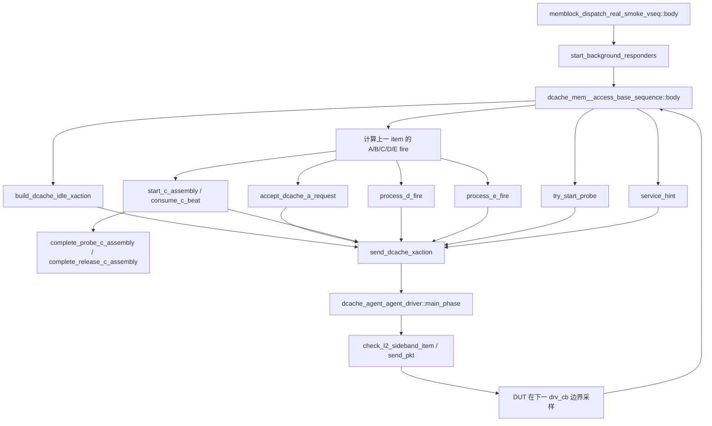

# DCache 轻量 L2 Response、Hint 与 Probe Flow

## 1. Flow 定位与职责边界

### 1.1 术语与抽象功能说明

| 英文术语 | 当前含义 | 代码落点 | 典型时序 |
|---|---|---|---|
| `service_cycle` | DCache responder 自己维护的 service 拍计数，不是 DUT 时钟绝对时间 | `dcache_mem__access_base_sequence::service_cycle` | 每发送一个无 gap item 后递增 |
| `armed snapshot` | 已在 DUT 输入上看到稳定 valid，并准备在下一拍打开 ready 的请求快照 | `armed_a_req_xact`、`armed_c_req_xact` | `valid=1` 先保存，下一采样边界确认 fire |
| `pending D` | 已接受但尚未完成的唯一 D response | `pending_d_*` | A.fire/C.fire 后建立，D 最后一拍 fire 后清除 |
| `GrantAck owner` | Grant/GrantData 最后一拍完成后等待 E.fire 的状态所有权 | `waiting_grant_ack`、`pending_grant_*` | 只有 owner 存在时才开放 `e_ready` |
| `cached line table` | 已完成 GrantAck、可作为 Probe 候选的 64B line 表 | `cached_alias_by_line` | GrantAck 插入，Probe/Release/CBO 失效删除 |
| `Probe owner` | 单个 B Probe 已发出或等待其 C 回复的状态 | `pending_probe_b_valid`、`waiting_probe_c` | B.fire 后进入等待 C |
| `C assembly` | ProbeAckData/ReleaseData 两个 32B beat 的收集状态 | `c_assembly_*` | 首 beat 建立，第二 beat 加入 DCache overlay batch/ack |
| `fire` | 同一 channel 的 valid 与 ready 在同一 DUT 采样边界同时为 1 | `a_fire`、`b_fire`、`c_fire`、`d_fire`、`e_fire` | 只在确认 fire 后改变生命周期状态 |
| `lockstep driver` | driver 阻塞取一个 item，立即写 clocking output，并由 sequence 下一边界确认握手 | `dcache_agent_agent_driver::main_phase()` | 不 hold 或重复上一 item |
| `shared memory store` | DCache/Uncache 共用的 backing、overlay 和 write batch | `mem_access_base_sequence` static 状态 | DCache C data 与 Uncache store 在下一 sample 按固定顺序提交 |

本 flow 只实现 DCache coherent 端口的轻量 responder，不是完整 L2 directory、MSHR 或 coherence
参考模型。它保持以下简化边界：单个 A/C-driven response、单个 Probe、固定 sink 0；不模拟
`io_l2_flush_done`、`denied/corrupt` 注入、多 outstanding 或完整权限目录。`io_l2_hint_*` 由本
responder 作为唯一非零 producer，generic transaction 和 generic idle 必须保持 known-zero。

## 2. 参与模块和调用关系

| 顺序 | 模块/函数 | 当前职责 |
|---|---|---|
| 1 | `memblock_dispatch_real_smoke_vseq` | 在 `dcache_sqr` 上启动 DCache responder sequence |
| 2 | `dcache_mem__access_base_sequence::body()` | 单一逐拍仲裁 reset、fire、pending D、E、B、C、A、hint 和 stop |
| 3 | `build_dcache_idle_xaction()` | 每拍构造已知零基线；`e_ready` 默认 0 |
| 4 | `send_dcache_xaction()` | 通过 `start_item/finish_item` 把本拍 item 交给 DCache sequencer |
| 5 | `dcache_agent_agent_driver::main_phase()` | 阻塞 `get_next_item()`，立即调用 `send_pkt()`，完成 `item_done()` |
| 6 | DUT `drv_cb` 输入采样 | sequence 下一轮在 `@(dcache_vif.drv_cb)` 采样 DUT ready/valid/payload |
| 7 | `accept_dcache_a_request()` / `start_c_assembly()` | 仅在真实 A/C fire 后建立 pending 生命周期 |
| 8 | `process_d_fire()` / `process_e_fire()` | 推进 D beat、GrantAck owner 和 cache line 表 |
| 9 | `consume_c_beat()` / `complete_*_c_assembly()` | 完成 Probe/Release C 生命周期和主存写回 |

### 2.1 函数调用 Flow 图



### 2.2 函数调用 Flow 图整体文字伪代码

```text
顶层 vseq 在 DCache sequencer 启动 responder；
responder 每拍先推进 shared memory sample、构造 safe idle，再用上一 item 和当前 DUT 对端信号计算真实 fire；
A.fire 由 accept_dcache_a_request 分类并建立 pending D；
C.fire 由 start/consume C helper 建立或推进唯一 C assembly；
D.fire/E.fire 分别推进 reply beat、GrantAck owner 和 cached line table；
完全空闲且未 stop 时，try_start_probe 才能选择 cached line 并建立 B owner；
service_hint 只在已接受 AcquireBlock 的 due 拍叠加单拍 Hint；
send_dcache_xaction 把本拍 item 交给 driver；
driver 先检查四态 sideband 和 gap，再立即写入 clocking output；
DUT 在下一 drv_cb 边界采样，循环回到 responder 计算下一组 fire；
global stop 后只 drain 已有 owner，terminal idle 发送完成后 responder 返回。
```

## 3. 逐拍时序合同

### 3.1 driver 与 sequence 的边界

每轮 sequence 先等待 `dcache_vif.drv_cb`。此时读取的是上一轮通过 driver 写入 clocking output
后的 DUT input 采样值。sequence 用上一轮保存的 `last_cycle_xact` 与该采样值计算 fire，然后
构造下一轮 item。

非 reset 边界先保留 A.valid、B.ready、C.valid、D.ready、E.valid 的四态 raw 值；任一值不是已知
0/1 时直接 `uvm_fatal`，再用 `raw === 1'b1` 生成 fire 计算使用的二态 sampled 值。这样未知
E.valid 不会被当成 0 静默等待。

driver 在 responder 模式下执行以下固定动作：

1. 将 inherited `req` 句柄清零。
2. 阻塞等待 `seq_item_port.get_next_item(req)`。
3. 检查 item 非空，并检查 `pre_pkt_gap/post_pkt_gap` 必须为 0。
4. 立即执行 `send_pkt(req)`，把值写入 `drv_cb` output。
5. 调用 `item_done()`。

driver 不在 item 之间额外等待 `drv_cb`，不保存 `last_sent_item`，也不在没有新 item 时重复驱动
上一 item。这样 `last_cycle_xact` 对应唯一的一次已提交 item，D valid 在 `d_ready=1` 时只会
被计为一次 fire。

### 3.2 每拍 sequence 顺序

```text
等待 drv_cb 边界；
采样 DUT 的 A/B/C/D/E 对端 valid/ready 和 reset；
清零本轮 a_fire/b_fire/c_fire/d_fire/e_fire；
构造全零 cycle_xact（A/B/C/D/E ready/valid 全 0，sideband 全 0，e_ready=0）；

若 reset 或 backend reset 未完成：清空 responder 状态，发送 safe idle，进入下一拍；

若存在 last_cycle_xact：
  用上一 item 的 output 与当前采样值计算五个 fire；
  先处理 D.fire，再处理 E.fire；
  处理 C.fire 时只消费已 armed 的 C snapshot；
  C.fire 完成后的本拍禁止再 arm A 或创建 Probe；
  处理 B.fire 时把 Probe 从 B pending 切为等待 C；
  处理 A.fire 时才建立 pending D、delay 和 hint 排期；

若 global stop 已请求且所有 in-flight 状态为空：发送一个 safe idle 并退出；
否则按 owner 优先级构造下一 item：
  pending D 到期 -> 保持 D.valid 和完整 payload；
  waiting GrantAck -> 只打开 e_ready=1；
  pending Probe B -> 保持 B.valid 和完整 payload；
  C assembly -> 只打开 C.ready；
  waiting Probe C -> 只接受合法 ProbeAck/Release C；
  idle C -> 优先接受 Release/ReleaseData；
  idle A -> 接受合法 Acquire/CBO；
  完全空闲 -> 按权重尝试启动 Probe；

在本轮发送前叠加 due hint（最多一拍），flush_done 保持 0；
发送 item，保存为 last_cycle_xact，递增 service_cycle。
```

同一采样拍已经确认 `c_fire` 时，C assembly、waiting Probe C 和 idle C 的新 snapshot 分支都被
禁止，并且显式跳过后续 A/Probe 仲裁；已经确认 `a_fire` 时，A 的新 snapshot 分支也被禁止。
这样首个 ReleaseData beat 建立 C assembly 后，不会被 A pending D 或新 Probe 抢占。

## 4. A-channel 到 D-channel

### 4.1 `AcquireBlock`

`accept_dcache_a_request()` 只在 A.fire 后调用。它检查 size=6、地址 64B 对齐、source 属于
0..15、param 属于 `NtoB/NtoT/BtoT`。随后用现有主存 helper 读取 line 的两个 32B beat，建立
两拍 `GrantData` pending response；`echo_isKeyword` 决定两个 beat 的高低顺序，两个 beat 的
source/sink/size/param/echo/denied/corrupt 保持稳定。

response delay 在 A.fire 时只采样一次，due cycle 固定为
`accept_cycle + sampled_delay`。D.ready 为 0 时不推进 beat index，也不修改 payload。

### 4.2 `AcquirePerm`

只接受 `NtoT/BtoT`，生成单拍 `Grant(toT)`，固定 sink 0，完成后进入 GrantAck owner；不产生
hint。

### 4.3 CBO

`CBOClean/CBOFlush/CBOInval` 只接受 source 17，生成单拍同 source 的 `CBOAck`。CBO clean
保留 cached line；flush/inval 在对应 CBOAck.fire 后删除同 line。CBO 不等待 E，也不产生 hint。

### 4.4 不支持 opcode

DCache coherent 端口出现 Get/Put/Arithmetic/Logical/Hint 或未知 A opcode 时，sequence 在建立
pending response 前 `uvm_fatal`，不伪造 `AccessAckData`。ICache/PTW/Uncache 请求由其分离 responder
负责。

## 5. D/E 生命周期和 cache line 表

### 5.1 `e_ready` 的唯一 owner

`build_dcache_idle_xaction()` 的默认 `e_ready=0`。Grant/GrantData 最后一拍 D.fire 时，
`process_d_fire()` 保存 line、alias、expected sink=0，并置 `waiting_grant_ack=1`；此时尚未
插入 cached line table。下一轮 owner 分支才将 `e_ready` 置 1。

当 `last_cycle_xact.e_ready=1` 且 DUT `e_valid=1` 时，sequence 检查 E sink 必须为 0，调用
`process_e_fire()` 插入 `cached_alias_by_line`，清除 GrantAck owner。service loop 先保留 E.valid
四态 raw 值，非 reset 的 X/Z 直接 fatal；无 owner 时出现已知 E.valid
是协议/模型错误：主循环先允许同拍最后一个 D.fire 建立 owner，再检查仍无 owner 且未形成 E.fire
的 E.valid 并直接 fatal。sink 使用四态完全匹配，X/Z 不能绕过检查。该顺序避免 DUT 在 sequence
建立 owner 前抢先消费 E。

### 5.2 cache line table

表键为 64B 对齐 line 地址，值为请求带来的两位 alias。只有 GrantAck.fire 后插入。ProbeAck、
ProbeAckData 完成、Release/ReleaseData 完成、CBOFlush/CBOInval 完成时删除；CBOClean 不删除。
该表只用于生成合法 Probe 候选，不承担 MESI、dirty、replacement 或数据真源职责。

## 6. Hint 排期

仅对已经分类为 GrantData 的 AcquireBlock 调用 `sample_hint_enable()` 一次。权重 0 关闭，100
每次命中，中间值使用 `std::randomize` 的 `dist` 选择。命中后保存 source[3:0]、isKeyword 和
due cycle；`service_hint()` 在 due cycle 只把 `io_l2_hint_valid` 拉高一拍，后续自动清零。

`io_l2_flush_done` 在所有 item 中保持 0。driver 在送入 VIF 前检查 valid/payload 自洽：valid=0
时 sourceId 和 isKeyword 必须为 0，valid=1 时 payload 必须已知，flush_done 必须为已知 0；null item
或任一四态非法值都在第一条 VIF 赋值前 fatal。

## 7. Probe 与 C-channel

### 7.1 Probe

只有未进入 global stop、完全空闲、cached line table 非空且没有 pending D、GrantAck、C assembly、已有 Probe 时，
才按 `MEMBLOCK_L2_PROBE_ENABLE_WT` 尝试 Probe。候选 line 使用 UVM/SystemVerilog randomize 从
表中等概率选择；B payload 固定 `Probe(toN)`。B.valid 在 B.ready=0 时保持稳定，B.fire 后
`pending_probe_b_valid` 清零并置 `waiting_probe_c`。

### 7.2 Probe C 回复

`ProbeAck` 为单拍，必须匹配 pending line，完成后删除 line。`ProbeAckData` 建立 C assembly，
收齐两个 32B beat 后合并 64B data；无 corrupt 时加入 DCache overlay write batch，有 corrupt 时跳过写入但仍完成
协议生命周期，最后删除 line 并清 waiting Probe。C payload 写入二态 transaction 前，所有 header 字段
必须已知；`ProbeAckData` 的 data/corrupt 也必须已知，X/Z 直接 fatal，不能折叠为 `corrupt=0`。

### 7.3 Release C 回复

Release/ReleaseData 可在等待 Probe C 时先到达，但不能破坏原 Probe owner。Release 单拍完成后
直接排期一拍 `ReleaseAck`；ReleaseData 收齐两拍后检查 header/data 稳定、无 corrupt 时加入 DCache overlay write batch，
无论 corrupt 与否都删除 line，再排期 `ReleaseAck`。ReleaseData 的 data/corrupt 在二态 snapshot 前必须
已知；无数据 Release 的 don't-care data/corrupt 不检查。C.fire 后 assembly 只使用当前确认的 fired snapshot，
armed snapshot 只用于稳定性检查。ReleaseAck 使用原 C source/size，不等待 E。

## 8. 主存范围和 reset

real-smoke lifecycle owner 在 fork responder 前调用 `initialize_shared_memory_store()` 清空 shared backing、
overlay、write batch 和旧 range。`MEMBLOCK_MAIN_MEM_RANGES_EN=1` 时才把
`get_paddr_base()/get_paddr_range()` 注册为 DCache/Uncache 共用 `main_mem_ranges`；为 `0` 时两个端口
都按 48-bit 物理地址懒分配。A coherent line、Release 和 ReleaseData 在严格模式仍用完整 64B mask 做
边界检查；越界在建立 response 前 fatal。该范围不限制主表虚拟地址窗口，也不改变 TLB PPN 构造。

reset 或 `reset_backend_done` 未完成时，清 pending D、GrantAck、hint、Probe、C assembly 和
cached line table，发送所有 channel/sideband 为 0 的 safe idle。reset 恢复后从新一拍重新建立
armed snapshot，不复用 reset 前的 item 或 owner。

## 9. global stop 与退出

`global_stop_requested` 不是立即退出条件。responder 只有同时满足以下条件才发送 terminal safe
idle 并结束：

- 无 pending D；
- 无 waiting GrantAck；
- 无 pending Probe B、无 waiting Probe C；
- 无 C assembly；
- 无 armed A/C snapshot；
- 当前采样没有尚未处理的 A/C valid。

cached line table 非空本身不阻止退出，因为它是已完成状态，不是 in-flight transaction。若 stop
到来时仍有上述任一状态，sequence 每拍继续 drain，并周期性输出 warning；不会静默丢掉 D、E、B
或 C 事件。stop 后不再创建 Probe；只有上一 item 已打开 A.ready 而在当前边界形成的 A.fire 可以
进入 drain，新出现且未形成 fire 的 A.valid 直接 fatal。

DCache body 启动时清 `memblock_sync_pkg::dcache_responder_done`，完成全部 in-flight 并发送 terminal
idle 后置一。canonical vseq 通过 `wait fork` 等待所有 responder；legacy
`tc_dispatch_real_smoke` 额外等待该 DCache done 标志后才 drop phase objection。

## 10. 参数和 cfg

公共参数链为：

```text
env/plus.sv
  -> seq_csr_common::load_from_plus()
  -> validate_and_clamp()
  -> getter
  -> dcache_mem__access_base_sequence
```

三档 delay 权重必须非负且不能全 0；hint/probe 权重必须在 0..100。
`MEMBLOCK_MAIN_MEM_RANGES_EN` 默认值为 1，只控制 shared memory store 的严格物理范围，不参与 D response
delay 或 Hint/Probe 随机。默认 cfg 只打开 small delay，
hint/probe 关闭。`tc_dispatch_real_l2cache_model.cfg` 是独立可执行的 real-smoke preset，显式
包含主表、LSQ、issue、commit、L2TLB 和 TLB 合法性开关，再覆盖 delay 权重；它不依赖 cfg 继承。

## 11. 验证记录

已执行的专项检查：

```text
make eda_compile tc=tc_sanity mode=v2_l2cache_lockstep_20260723
```

结果：VCS 编译 0 error；日志存在工具自身的 `LCA_FEATURES_ENABLED` warning，不宣称 warning 为 0。

已通过的 directed smoke：

- `cfg=tc_dispatch_real_l2cache_model` 普通 real dispatch：`TEST_PASS`，`UVM_ERROR=0`，`UVM_FATAL=0`。
- seed 666669、`+MEMBLOCK_L2_HINT_VALID_WT=100`：A 在 245.2ns 完成握手，Hint 在
  280.2ns 到 285.2ns 保持一个周期，GrantData 从 295.2ns 开始连续完成两个 beat，随后才开放 E；
  `TEST_PASS`，错误/致命错误为 0。
- seed 666668、`+MEMBLOCK_L2_PROBE_ENABLE_WT=100`：GrantAck 后在 290.4ns 完成 B Probe，
  1470.4ns 观察到同地址 C ProbeAck，1475.4ns 开放 C.ready 并完成握手，最终日志为
  `cached_lines=0`；`TEST_PASS`，错误/致命错误为 0。

当前专项 cfg 默认 hint/probe 为 0；要动态覆盖时建议一次只传一个 plusarg，避免旧 Make/plus
解析路径对多个空格分隔参数的处理不确定。

## 12. 修改类型和边界总结

### 12.1 与旧测试框架相比的字段/参数适配

- DCache xaction/interface/driver 增加并贯通 V2 `io_l2_hint_*` 和 `io_l2_flush_done` sideband。
- generic xaction、interface time-zero 和 driver idle 对 sideband 改为 known-zero 合同；sideband
  xaction 字段保留四态供 driver 检查。
- 新增五个公共 L2 responder runtime plus 参数及 getter 链。

### 12.2 新增或改变的功能逻辑

- A-to-D 阻塞 for-loop 改为单一逐拍 service loop，以真实 fire 建立状态。
- 新增 AcquireBlock/AcquirePerm/CBO/Release 的分层 response 类型和固定 delay。
- 新增 GrantAck owner、E handshake、cached line table 和 Probe 生命周期。
- 新增 Hint 单拍排期、Probe 概率和 C 多拍 assembly/主存写回。
- driver 改为阻塞取 item 后立即发送，修复旧 hold 造成的重复 beat 风险。
- `e_ready` 从早期开启改为 GrantAck owner 专属开启，generic driver 模式统一为 0；同拍 C.fire 后
  禁止 A/Probe 抢占。
- 新增 sideband 四态 fail-fast 和无 GrantAck owner 的 E.valid 检查，未知 sink 不得静默通过。
- global stop 从“看到 A 无 valid 即退出”改为完整 in-flight drain。

这些功能修改都只发生在 DCache responder 的细节建模层，未改变主表生成、issue、writeback、commit
或 terminal owner 的主体控制逻辑。
