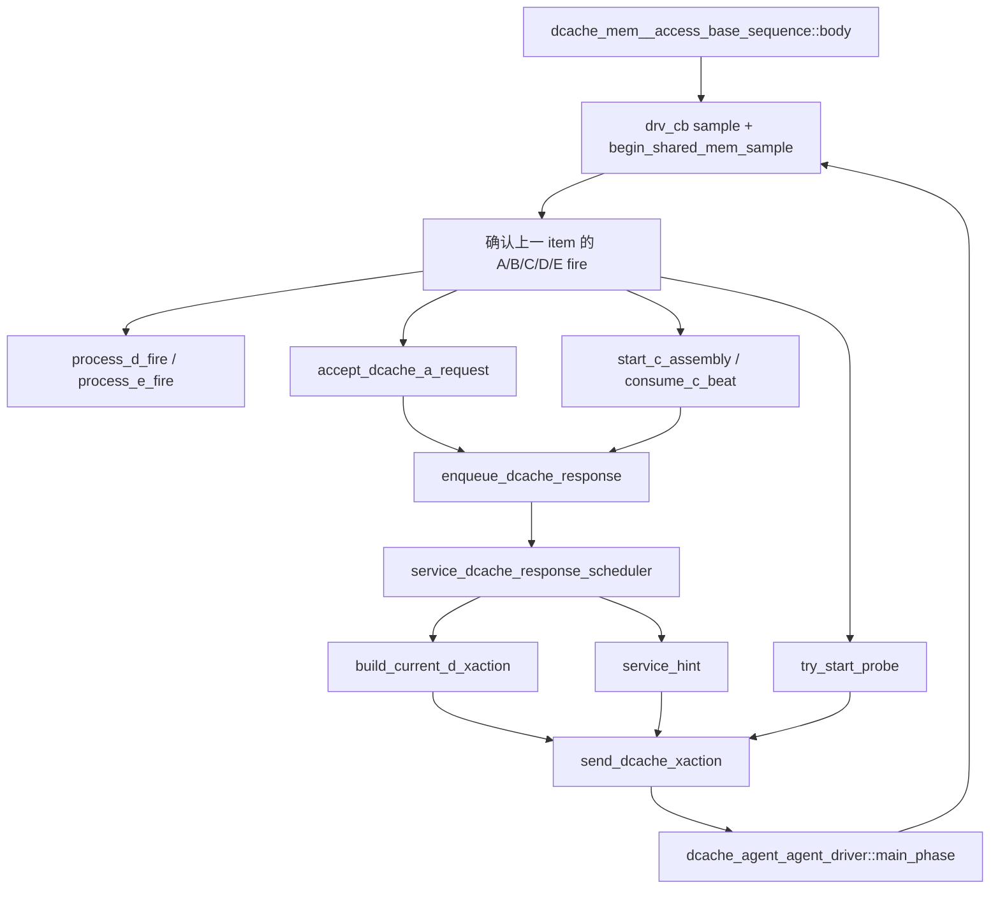

# DCache 轻量 L2 Response、Hint 与 Probe Flow

## 1. 术语与抽象功能说明

本 flow 描述 `dcache_mem__access_base_sequence` 对 V2 coherent TileLink A/B/C/D/E 的轻量
responder 行为。它只模拟 MemBlock 对外的 L2 交接，不实现完整 L2 directory、MSHR、替换、权限
目录或完整 `l2Flush`。当前仍只支持单笔 Probe(toN)；多 Probe、Probe(toB) 与 alias conflict 由后续
专项扩展。

| 术语 | 当前含义 | 代码落点 | 生命周期 |
|---|---|---|---|
| `response record` | 已真实 A/C `fire`、等待最后一个 D beat 的 DCache 回复记录 | `dcache_rsp_q`、`current_d_record` | 建立于 A/C fire，最后一个 D.fire 后释放 record 容量 |
| `D-error snapshot` | 本次 coherent D reply 的 `denied/corrupt` 固定值 | `dcache_response_record_t::denied/corrupt` | 建立 GrantData/CBOAck record 时采样一次，D hold 或多 beat 不重采样 |
| `eligible_cycle` | record 最早允许参加 D 返回仲裁的逻辑拍 | `dcache_response_record_t::eligible_cycle` | DCache 真实请求在 `t` fire 后最早 `t+3` 可选 |
| `scheduler timer` | 每次选择 D response 前按 delay weight 抽一次等待的定时器 | `dcache_rsp_timer_active/due_cycle` | 无 D hold 且存在 eligible record 时启动；选出 record 后清除 |
| `current D hold` | 已被 scheduler 选中、正在 D channel 保持 payload 的唯一 record | `current_d_record/current_d_valid` | D.ready=0 时保持；最后一个 D.fire 时结束 |
| `dynamic sink` | 每个 Grant/GrantData 独占的 TileLink sink 标识 | `dcache_response_record_t::sink` | Acquire 接收时分配；E.fire 匹配后复用 |
| `GrantAck wait` | 已完成最后一个 D beat、但尚未收到匹配 E.fire 的 Grant owner | `grant_ack_wait_q` | 最后 D.fire 入队；E.fire 后删除 |
| `C reservation` | ReleaseData 第一个 C beat 为未来 ReleaseAck 预留的 response slot | `c_assembly_response_reserved` | 首 beat 建立；第二 beat 完整收集后原子转换为 ReleaseAck record |
| `Hint record` | 已和某条最终选出的 GrantData 绑定、等待本拍输出的 Hint sideband | `dcache_hint_q` | scheduler 选中 GrantData 时入队；`service_hint()` 单拍消费 |
| `fire` | 上一拍 responder 驱动的 valid/ready 与当前 DUT 采样值同为 1 | `a_fire/b_fire/c_fire/d_fire/e_fire` | 只有 fire 可以创建、推进或释放协议状态 |
| `cached line table` | 已收到 GrantAck、可作为随机 Probe 候选的物理 line 到 alias 映射 | `cached_alias_by_line` | E.fire 插入；Probe/Release/CBO 失效时删除 |

## 2. 调用 Flow



### 2.1 函数调用 Flow 图整体文字伪代码

```text
每个 drv_cb 边界：
  先提交上一 sample 已确认的 shared-memory 写 batch，并采样 A/B/C/D/E 对端信号；
  用上一拍已驱动 item 和当前采样确认 fire；
  D.fire 推进或结束当前 D hold，Grant 最后一拍转入 GrantAck wait；
  E.fire 必须按 sink 匹配 GrantAck wait，命中后更新 cached line table；
  C.fire 建立/推进 ProbeAckData 或 ReleaseData 的两拍 assembly，Release 类最终建立 ReleaseAck record；
  A.fire 解码 Acquire/CBO，并在容量允许时建立 Grant、GrantData 或 CBOAck record；
  scheduler 只看进入本拍前已经存在且到期的 record，独立计时后按顺序或乱序选一条成为 current D hold；
  被选中的 GrantData 如有 Hint，才在同一返回轮次送入 Hint queue；
  按当前 D hold、GrantAck wait、Probe/C assembly 和 A/C 准入构造下一 item；
  driver 立即写 clocking output；下一 drv_cb 再确认该 item 是否真正 fire。
```

## 3. 逐拍握手与准入

### 3.1 `body()`

源码位置：`mem_ut/ver/ut/memblock/seq/base_seq_help/mem_base_sequence.sv`。

抽象功能描述：`body()` 是 DCache responder 的唯一时序 owner。它在 clocking-block 采样边界确认
上一拍 item 的协议结果，维护所有 response、sink、Hint、Probe 与 C assembly 状态，并驱动下一拍
item；它不读取 monitor analysis port，也不修改 dispatch 主表、LSQ 或 terminal。

文字伪代码：

```text
等待 drv_cb；调用 begin_shared_mem_sample；采样 A/B/C/D/E valid/ready 和 reset；
任一握手位在非 reset 时为 X/Z：fatal；
从全零 idle item 开始；

若 reset：清 response queue、D hold、timer、GrantAck wait、Hint、Probe、C assembly 和 cache map；发送 idle；
否则：
  根据上一 item 确认 D/E/C/B/A fire，并按 D -> E -> C -> B -> A 顺序消费；
  记录本拍开始时 dcache_rsp_q.size()，作为 scheduler 可见上界；
  调用 scheduler；若存在 current D hold，填充 D.valid 和稳定 payload；
  GrantAck wait 非空时才打开 e_ready；
  C assembly、waiting Probe C、普通 Release C 和普通 A 依协议优先级准入；
  完全空闲时才允许 try_start_probe；最后叠加本拍 Hint。

global stop：停止新 Probe 和新 A 准入，只排空现有协议状态；所有 queue、timer、D hold、GrantAck、Hint、
Probe、C assembly 和 armed snapshot 收敛后发送最后一个 idle 并退出。
```

`response_visible_count` 在处理 A/C fire 前取得。因此本拍新建的 record 即使其 `eligible_cycle`
已经满足，也不会被同拍 scheduler 再次选择，保证 A/C 接收和 D 返回之间至少有一个明确的 driver
边界。

### 3.2 `can_accept_dcache_a_request()` 与 `can_accept_dcache_release_c_request()`

抽象功能描述：两个 helper 只判断本拍是否可以接受会产生 D response 的输入，不创建 record 或访问
memory。A 的 Acquire 还必须有空闲 sink；CBO/Release 只占用统一 response record 容量。

```text
AcquireBlock/AcquirePerm：response record 未满且存在空闲 sink -> 可接受；
CBOClean/CBOFlush/CBOInval：response record 未满 -> 可接受；
Release/ReleaseData：response record 未满 -> 可接受；
其它 A opcode：fatal；ProbeAck/Data 不需要 ReleaseAck capacity。
```

DCache 的 `Grant/GrantData`、`CBOAck`、`ReleaseAck` 共用
`MEMBLOCK_DUT_DCACHE_A_MAX_OUTSTANDING=16` 条 response record。record 满时只对会新增 D response
的 A/C 输入拉低 ready；已经进入两拍 ReleaseData assembly 的第二 beat 使用首 beat reservation，不能
因表接近满而半完成。

## 4. Response Record 与 D Scheduler

### 4.1 `accept_dcache_a_request()` 与 `enqueue_dcache_response()`

抽象功能描述：`accept_dcache_a_request()` 只消费真实 A.fire，完成 coherent A opcode、line 对齐、
source、param 和 memory 读取检查，并生成一个语义已固定的 response record；
`enqueue_dcache_response()` 是统一容量检查和入队入口。

```text
AcquireBlock：读取两个 32B memory beat，建立两拍 GrantData；分配动态 sink；保留 alias、isKeyword、一次 Hint 采样和一次 D-error snapshot；若 denied 命中则强制 corrupt=1；
AcquirePerm：建立单拍 Grant；分配动态 sink；
CBO：建立单拍 CBOAck；不分配 sink；denied/corrupt 由各自权重独立采样并保存在 record；
所有 record：eligible_cycle = accept_cycle + 3；入 dcache_rsp_q；
```

这里的 `+3` 表示 V2 DCache responder 的固定两拍 admission 后，最早下一拍可参加返回仲裁。
它不使用 `pre_pkt_gap/post_pkt_gap`，也不阻塞 sequence 的主循环。

### 4.2 `sample_dcache_response_delay()`

抽象功能描述：该函数只为一轮 DCache response scheduling 选择额外等待拍数；不建立 transaction、
不访问 memory，也不改变 A/C/D/E 握手。

| 参数 | 区间 | 默认权重 |
|---|---|---:|
| `MEMBLOCK_L2_RSP_DELAY_ZERO_WT` | `0` | 0 |
| `MEMBLOCK_L2_RSP_DELAY_SMALL_WT` | `1..10` | 1 |
| `MEMBLOCK_L2_RSP_DELAY_MEDIUM_WT` | `10..100` | 0 |
| `MEMBLOCK_L2_RSP_DELAY_LARGE_WT` | `101..1000` | 0 |

`seq_csr_common` 在启动 responder 前拒绝四档权重全零。随机 delay 是 response record 已到期后的
额外等待，不能改变 A.fire，也不能绕过 D.ready backpressure。

### 4.3 `service_dcache_response_scheduler()`

抽象功能描述：该函数是 DCache response queue 到唯一 current D hold 的仲裁 owner。它只移动 record
和 timer；不重新解码 opcode、不重读 memory、不释放 sink。

```text
若已有 current D hold：直接返回；
若无运行中 timer 且 visible record 中存在 eligible record：
  调用 sample_dcache_response_delay；记录 timer due cycle；
timer 未到：保持 timer；
timer 到：
  ORDERED：选择最早 eligible record；
  REORDER：从已到期 eligible record 中随机选择；
  从 dcache_rsp_q 删除，写入 current_d_record/current_d_valid；
  若该 record 带 hint_pending：写入 dcache_hint_q，并清 record 内标记；
  清本轮 timer。
```

`MEMBLOCK_L2_RSP_REORDER_EN=0` 为顺序返回；为 `1` 时只在当前已到期、且本拍前可见的
record 集合内随机。D.ready=0 时 scheduler 不重新抽 delay，也不选择第二条 record，
`build_current_d_xaction()` 持续使用同一份 `current_d_record` 输出稳定 payload。

### 4.4 `build_current_d_xaction()` 与 `process_d_fire()`

抽象功能描述：前者把 current D hold 映射为本拍 TileLink D payload；后者只在真实 D.fire 后推进
beat 或释放 record。二者不决定 scheduler 的选择和 A/C 准入。

```text
GrantData：按 beat_idx 输出两个 32B beat；第一个 D.fire 只递增 beat_idx；
最后一个 GrantData D.fire 或 Grant D.fire：把 line/alias/sink 转入 grant_ack_wait_q；释放 current record；
CBOAck：最后 D.fire 后按 CBO opcode 删除对应 cached line（clean 保留）；释放 record；
ReleaseAck：最后 D.fire 后释放 record；
```

`MEMBLOCK_L2_GRANTDATA_DENIED_WT/CORRUPT_WT` 和
`MEMBLOCK_L2_CBO_ACK_DENIED_WT/CORRUPT_WT` 都经过 `seq_csr_common` 读取。它们不改变
response record 的准入、延迟、sink 或 Hint 逻辑。GrantData 的两个 D beat 与任何 D.ready hold
只复用 record 中已保存的错误位；CBOAck 仍按原 source 和 opcode 完成 cached line 动作。

最后一个 D.fire 立即归还 response record capacity，但 Grant sink 仍属于 `grant_ack_wait_q`，直到 E.fire
匹配后才可分配给新的 Acquire。

## 5. Dynamic Sink、Hint 与 E Channel

### 5.1 `allocate_grant_sink()` 与 `process_e_fire()`

抽象功能描述：`allocate_grant_sink()` 在 16 个 compile-time sink 槽中选择未被 queued/current Grant 或
GrantAck wait 占用的编号；`process_e_fire()` 按 DUT E sink 唯一完成 GrantAck owner，而不是按地址猜测。

```text
Acquire record 创建时：分配未用 sink 并写入 D payload；
Grant 最后 D.fire：D record 删除，{line_addr, line_alias, sink} 写入 grant_ack_wait_q；
E.fire：E.bits.sink 必须已知；按 sink 查 grant_ack_wait_q；
  命中：record_cached_line(line_addr, line_alias)，删除 wait record，sink 释放；
  无命中：fatal。
```

`E.valid` 在没有 GrantAck owner 时也是协议错误。`E.bits.sink` 在 E.fire 为 X/Z 会立即 fatal，
不能因二态转换被误匹配到 sink 0。

### 5.2 `service_hint()`

抽象功能描述：该函数只把已绑定最终 GrantData 的 Hint record 映射到单拍
`io_l2_hint_*` sideband；不参与 GrantAck、cache map 或 response capacity。

`sample_hint_enable()` 只在 `AcquireBlock` 真实接受时采样一次。scheduler 在最终选中该条
GrantData 时才把 Hint 放入 `dcache_hint_q`，随后同一轮 `service_hint()` 输出。
因此 REORDER 不会发生 Hint 属于 A、D response 却属于 B 的错配；`D.ready=0` 也不会重复发送 Hint。
`io_l2_flush_done` 仍为 known-zero level，本专项不模拟 L2 flush 完成行为。

## 6. C Channel、Probe 与 ReleaseAck

### 6.1 `start_c_assembly()`、`consume_c_beat()` 与 `complete_release_c_assembly()`

抽象功能描述：这些 task 负责 coherent C response 的 header 校验、两拍 data assembly、overlay 写回和
ReleaseAck record 建立。它们不选择 D 返回时间，也不占用 Grant sink。

```text
Release：真实 C.fire 后直接建立 ReleaseAck record；
ReleaseData 首 beat：检查容量，置 c_assembly_response_reserved，保存 header/data；
ReleaseData 第二 beat：检查 opcode/address/source/size/param 连续性；收齐后：
  若未见 corrupt：两个 32B beat 进入 DCache overlay write batch；
  删除 cached line；将 reservation 原子转换为 ReleaseAck record；
```

`ProbeAckData` 同样必须收齐两个 beat 后才写回 overlay；`corrupt=1` 时跳过写回但继续完成协议收敛。
当前 single Probe 模型只支持 `Probe(toN)`，`try_start_probe()` 仅在没有 response queue、D hold、
GrantAck、C assembly、A/C armed 或旧 Probe owner 的空闲窗口从 `cached_alias_by_line` 选择一条 line。

## 7. Reset、Stop 与边界

`clear_runtime_state()` 在 reset 时清除 `dcache_rsp_q`、timer、current D hold、GrantAck wait、Hint queue、
C reservation、Probe 和 cache map。shared backing/overlay 的清空只由 testcase 的 memory lifecycle owner
在 responder 启动前完成；reset 不应重新清空公共 memory。

global stop 的退出条件包括：无 queued/current D record、无运行 timer、无 GrantAck wait、无 Hint、
无 B/C Probe owner、无 C assembly/reservation、无 armed A/C snapshot 和当前未处理 A/C valid。
已完成 GrantAck 的 `cached_alias_by_line` 是历史状态，不阻止退出。

本 flow 不拥有主表、LSQ admission、issue、writeback、commit/deq、redirect/replay、pass/fail 或 terminal。
Uncache TL-UL A/D responder 的独立 queue 和 delay 见
`AI_DOC/mem_ut_flow_doc/dcache_sbuffer_memory_responder_flow.md`。

## 8. 修改类型总结

本轮不是字段更名，而是 responder 内部响应调度增强：

- 从单一 `pending_d_*` 和固定 sink 0 改为 DCache 统一 response record、动态 sink 与 GrantAck wait queue；
- 由三档 DCache delay 扩展为四档，并新增 runtime 顺序/乱序返回选择；
- `ReleaseData` 新增首 beat reservation，避免两拍 C transaction 在 response capacity 满时半完成；
- Hint 从独立 pending 状态改为附着在 GrantData record，最终选中 D response 后才输出；
- 保留原有 A/C/E/Probe/overlay 和 global-stop 所有权，不把 responder 状态写入主表或 status table。

当前默认 delay 为 `1..10` cycle、顺序返回。D-error 随机注入已由
`AI_DOC/plan/test_framework/plan/do/mem_ut_v2_dcache_d_error_weight_adapt_plan_20260803.md` 实现：它只扩展 response record 的
合法 D payload，不改变本 flow 的调度或主框架控制行为。多 Probe/toB、alias conflict、CBO closure
和 L2 flush 仍由各自 undo plan 实现，不能在本 flow 中宣称已覆盖。
