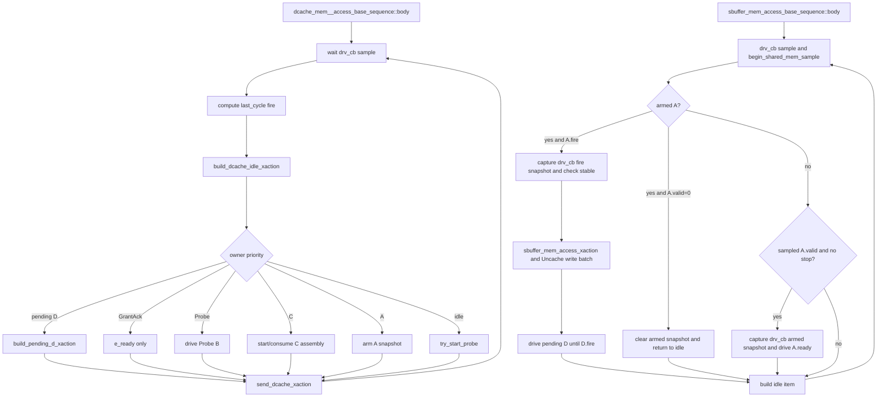

# DCache/SBuffer Memory Responder Flow

本文是共享 memory responder 的总览。DCache V2 coherent 细节以
AI_DOC/mem_ut_flow_doc/dcache_l2_response_hint_probe_model_flow.md 为准；本文同时保留
SBuffer 的单拍 responder 说明，避免共享源码修改后总览仍描述旧 DCache for-loop。

## 1. Flow 定位与职责边界

### 1.1 术语与抽象功能说明

| 英文术语 | 当前含义 | 代码对象/状态落点 | 示例 |
|---|---|---|---|
| responder | 响应 DUT memory channel 的长期 sequence | DCache/SBuffer base sequence | 不写 dispatch status |
| service cycle | DCache response 模型的逻辑拍计数 | service_cycle | 用于 delay 和 Hint due |
| armed snapshot | valid 已采样、等待下一边界确认 fire 的请求快照 | armed_a_req_xact、armed_c_req_xact | A.valid 先保存，下一拍才接受 |
| pending response | 已接受但尚未完成的 response | pending_d_*、C assembly | D.ready=0 时保持 payload |
| owner | 当前负责某条协议生命周期的唯一状态 | GrantAck owner、Probe owner | 无 owner 不消费 E |
| safe idle | 所有 channel valid/ready 和 sideband 为 0 的 item | build_*_idle_xaction | reset/terminal 边界发送 |
| in-flight | 尚未完成的 handshake、pending response 或 assembly | DCache pending/armed/Probe/GrantAck | stop 后必须先排空 |
| backing memory | 只保存确定性懒初始化字节的共享稀疏内存 | `main_mem` | 未被 DUT 写污染的初始数据来源 |
| write overlay | 保存已完成 DUT 写、并按 byte valid 覆盖 backing 的共享层 | `write_overlay_mem`、`write_overlay_byte_valid` | 同一 line 的部分写只覆盖有效 byte |
| write batch | 当前采样边界已经确认、但还未提交到 overlay 的写事件 | `dcache_write_batch`、`uncache_write_batch` | 下一边界固定先 DCache、后 Uncache 提交 |
| memory lifecycle owner | 每个 testcase 唯一负责清空和配置共享 memory store 的入口 | `memblock_dispatch_real_smoke_vseq` | fork 两个 responder 前初始化一次 |

抽象功能说明：两个 responder 都复用 `mem_access_base_sequence` 的测试级共享 memory store，但协议模型
不同。DCache 是 V2 轻量 coherent responder；历史命名为 `sbuffer_agent` 的端口实际承担 Uncache
TL-UL A-to-D responder。二者都不拥有主表、LQ/SQ、pass/fail、ROB commit 或 terminal 状态。

## 2. 函数调用 Flow 图



### 2.1 函数调用 Flow 图整体文字伪代码

```text
DCache：
  body 在 drv_cb 边界采样上一 item 的对端 ready/valid；
  用 last_cycle_xact 确认 A/B/C/D/E fire；
  先推进已确认的旧 owner，再从 idle item 开始按 pending D、GrantAck、Probe、C、A 优先级构造下一 item；
  A.fire 才调用 accept_dcache_a_request 建立 Grant/GrantData/CBOAck pending；
  D.fire 才推进 beat或建立 GrantAck owner；
  E.fire 才插入 cached line table；
  C.fire 才进入 Probe/Release assembly；
  C.fire 完成后的同拍禁止 A arm 和新 Probe，C assembly 下一拍继续优先；
  非 reset 边界先检查 A.valid/B.ready/C.valid/D.ready/E.valid 四态 raw 值；
  global stop 只在所有 DCache in-flight 清空后发送 safe idle并退出。

SBuffer：
  body 在 drv_cb 边界先推进 shared memory sample，并检查 A.valid/D.ready 四态；
  每次复制 armed 或 fire snapshot 前检查 opcode/param/size/source/address/mask/data/corrupt 均为已知值；
  看到 A.valid 时只保存 drv_cb armed snapshot 并驱动 A.ready；
  下一 drv_cb 边界确认真实 A.fire 后，重新从同一采样域取得 fire snapshot并检查 payload稳定性；
  若 armed 后 A.valid 已撤销而没有 fire，则清 armed snapshot，不建立 D response 或 Uncache write batch；
  仅 fire snapshot 才调用 sbuffer_mem_access_xaction，store 加入 Uncache write batch、load 固化 merged read data；
  pending D 持续驱动到真实 D.fire；
  driver 阻塞取得每个 item 后立即写 clocking output，确保本轮 last_cycle_xact 已在 DUT 侧保持完整一拍；
  global stop 后已 fire 的 armed A 允许继续建立 D response 并 drain；若出现未 fire 的新 A.valid 则 fatal，
  只有没有 pending D、armed A或当前 A.valid 时才发送 safe idle并退出。

共享 memory store：
  两个 responder 在每个 drv_cb 边界调用 begin_shared_mem_sample($time)；该调用先提交上一拍 batch，
  即使后续没有新的 memory access，最后一次已确认写也不会滞留；
  DCache 64B coherent beat 和 Uncache 8B beat都经过 shared_mem_access_task；
  read 先看上一拍已提交 overlay，未命中的 byte 才回退 backing main_mem；
  当前拍 DCache C writeback 和 Uncache store 只进入 batch，下一采样边界固定先提交 DCache、后提交 Uncache；
  range、corrupt、denied由公共 memory 后端返回。
```

## 3. DCache responder 总览

源码位置：mem_ut/ver/ut/memblock/seq/base_seq_help/mem_base_sequence.sv:1478-1800。

抽象功能描述：DCache body 是单一逐拍 service loop，负责 fire 采样、response delay、Hint、
GrantAck、Probe、C assembly 和 global stop。它不依赖 DCache monitor analysis port。

当前 DCache 合同：

| 输入/事件 | 当前处理 |
|---|---|
| AcquireBlock | 两拍 GrantData，固定 sink 0，可按权重发一次 Hint |
| AcquirePerm | 单拍 Grant(toT)，固定 sink 0，等待 E |
| CBOClean/Flush/Inval | 单拍 CBOAck；flush/inval 完成后删 map |
| Release | 单拍 ReleaseAck |
| ReleaseData | 两拍接收；全部 data beat `corrupt=0` 时完整 C.fire 后写入 DCache overlay batch，再发 ReleaseAck；任一 beat corrupt 时不写 overlay 但仍完成协议收敛 |
| ProbeAck/ProbeAckData | 匹配 Probe owner；ProbeAckData 仅完整且所有 data beat `corrupt=0` 时写入 DCache overlay batch，任一 beat corrupt 时不写 overlay 但仍完成协议收敛，随后删 map |
| 不支持的 A/C opcode | 在建立 response 前 fatal，不 fallback AccessAckData |
| io_l2_flush_done | 始终为已知 0；driver 首次赋值前做四态检查 |
| global stop | 禁止新 Probe；等待 pending/owner/armed/valid 全部收敛后发布 done 并自然退出 |

### 3.1 body() 的 fire 边界

抽象功能描述：每轮先采样上一 item 的对端值，再决定本轮 item；它不把看到 valid 等同于
已经握手。

```systemverilog
@(dcache_vif.drv_cb);
begin_shared_mem_sample($time);
a_fire = (last_cycle_xact.auto_inner_dcache_client_out_a_ready == 1'b1) && sampled_a_valid;
d_fire = (last_cycle_xact.auto_inner_dcache_client_out_d_valid == 1'b1) && sampled_d_ready;
e_fire = (last_cycle_xact.auto_inner_dcache_client_out_e_ready == 1'b1) && sampled_e_valid;
```

中文伪代码：等待采样边界；先提交上一拍已确认的跨通道写 batch；再将上一 item 的 ready/valid 与当前
DUT 对端值相与；只在 fire 后调用对应状态更新函数。两个 responder 在同一时刻重复调用该 helper
是幂等的，不会改变当前拍 read view。

C.fire 完成后的本拍显式跳过 A/Probe 仲裁；A.fire 已完成时阻止同拍 A arm，避免旧 C owner 被
新 pending D 抢占或同一个输入被重复分类。

### 3.2 DCache driver 合同

源码位置：mem_ut/ver/ut/memblock/agent/dcache_agent_agent/src/dcache_agent_agent_driver.sv:51-255。

抽象功能描述：driver 一对一搬运 sequence item，不决定协议状态。

```systemverilog
req = null;
seq_item_port.get_next_item(req);
send_pkt(req);
seq_item_port.item_done();
```

中文伪代码：清空旧句柄；阻塞获取新 item；立即写 clocking output；完成 item_done；不 hold 或重复上一 item。

send_pkt 要求 pre/post gap 为 0，使用四态比较检查 Hint valid/payload 和 flush_done；null item、
未知 valid/payload 或非已知 0 的 flush 都在首次 VIF 赋值前 fatal。四个 sideband xaction 字段为
四态 `logic`，检查不会在 driver 前被二态折叠；generic idle 的四个 sideband 和 E.ready 始终写 0。
DCache 详细状态流见专用 flow 文档。

### 3.3 GrantAck、Probe 和 C assembly

抽象功能描述：DCache 的 D/E/B/C 生命周期由 sequence-local owner 管理，不把完成的 map 当作
in-flight。

中文伪代码：

1. Grant/GrantData 最后一拍 D.fire：保存 line/alias/sink，置 GrantAck owner，暂不插入 map。
2. 只有 owner 分支才把 e_ready 置 1；无 owner 的 E.valid fatal；匹配 E.fire 后以四态完全匹配校验
   sink 并插入 map。
3. 未 stop、完全空闲且 map 非空时按权重启动 Probe；helper 自身重复检查全部 owner hazard；B.fire
   后等待 ProbeAck/Data。
4. ProbeAckData/ReleaseData 收两拍，header 必须稳定；仅全部 data beat无 `corrupt` 时把完整数据加入
   DCache overlay batch，而不是覆盖 backing `main_mem`。任一 beat corrupt 时只完成对应协议收敛，
   本专项不改写 overlay 或 alias `data_valid`。
5. Release 完成后排期 ReleaseAck；Probe/失效操作完成后删除 map。

对 C payload，`check_dcache_c_payload_known()` 必须在复制到二态 xaction 前执行：所有 opcode 都检查
header（opcode/param/size/source/address），`ProbeAckData` 与 `ReleaseData` 额外检查 data/corrupt。
无数据 `ProbeAck`/`Release` 的 data/corrupt 是 don't-care，不作为 X/Z fatal 条件。C.fire 后 assembly
只消费当前已经检查并确认的 fired snapshot；armed snapshot 只用于等待 ready 时的稳定性比较，不能作为
data writeback 的第二来源。

## 4. SBuffer responder 总览

源码位置：mem_ut/ver/ut/memblock/seq/base_seq_help/mem_base_sequence.sv:2000-2119。

抽象功能描述：历史名为 SBuffer 的 sequence 复用公共 memory store，按 8B beat 处理 Uncache 单拍
A-to-D request；它没有 DCache
的 GrantAck、Probe、Hint 或 multi-beat C owner。

### 4.1 sbuffer_mem_access_base_sequence::body()

```systemverilog
@(sbuffer_vif.drv_cb);
begin_shared_mem_sample($time);
if (!reset_active &&
    ((sampled_a_valid_raw !== 1'b0 && sampled_a_valid_raw !== 1'b1) ||
     (sampled_d_ready_raw !== 1'b0 && sampled_d_ready_raw !== 1'b1))) begin
    `uvm_fatal(get_type_name(), "Uncache A.valid/D.ready sampled as X/Z outside reset")
end
if ($isunknown({sbuffer_vif.drv_cb.auto_inner_buffers_out_a_bits_opcode,
                sbuffer_vif.drv_cb.auto_inner_buffers_out_a_bits_param,
                sbuffer_vif.drv_cb.auto_inner_buffers_out_a_bits_size,
                sbuffer_vif.drv_cb.auto_inner_buffers_out_a_bits_source,
                sbuffer_vif.drv_cb.auto_inner_buffers_out_a_bits_address,
                sbuffer_vif.drv_cb.auto_inner_buffers_out_a_bits_mask,
                sbuffer_vif.drv_cb.auto_inner_buffers_out_a_bits_data,
                sbuffer_vif.drv_cb.auto_inner_buffers_out_a_bits_corrupt}))
    `uvm_fatal(get_type_name(), "Uncache A payload sampled as X/Z outside reset")
if (a_accept_armed && sampled_a_valid) begin
    capture_sbuffer_a_xaction(fired_a_req_xact);
    check_sbuffer_a_payload_stable(armed_a_req_xact, fired_a_req_xact);
    sbuffer_mem_access_xaction(fired_a_req_xact, pending_d_xact);
    pending_d_valid = 1'b1;
end
else if (!data.is_global_stop_requested() && sampled_a_valid) begin
    capture_sbuffer_a_xaction(armed_a_req_xact);
    a_accept_armed = 1'b1;
    idle_xact.auto_inner_buffers_out_a_ready = 1'b1;
end
```

中文伪代码：每个 drv_cb 边界先推进共享 memory 采样代次；已 armed 且真实 A.fire 的请求可以在 stop 后
继续建立 D response 并 drain；若 stop 后出现未 fire 的新 A.valid，立即 fatal，不能无限保持 A.ready=0
等待 DUT 自行撤销。只有 stop 已请求且 pending D、armed A和当前 A.valid均为空时发送 safe idle并退出；
否则发送 idle，看到 A.valid 后采样、发送 A.ready。非 reset 时 A.valid 或
D.ready 为 X/Z 直接 fatal；每次复制 A snapshot 前，opcode/param/size/source/address/mask/data/corrupt
任一 X/Z 也直接 fatal，不能让二态 xaction 把未知值转成 0。只有下一边界确认真实 A.fire 后才调用
`sbuffer_mem_access_xaction`，并且 fire payload 必须从同一个 `drv_cb` snapshot 复制；若 armed A 的
下一边界 A.valid 已撤销，则清 armed snapshot 后回到 idle，不建立 D response 或 Uncache write batch；
store 在真实 fire 时加入 Uncache write batch，load 在此时读取已提交 merged view；随后等待 D.ready。
退出不依赖 `dispatch_real_smoke_active` 保持为 1。

### 4.2 sbuffer_mem_access_xaction()

抽象功能描述：将已经真实握手的 Uncache A request 映射到公共 memory，并生成单拍 D response。

中文伪代码：判断 opcode 是否 store；将地址按 8B 对齐、mask/data 送入 `shared_mem_access_task`；store
只建立 Uncache overlay batch 并返回 ack，load 从已提交 overlay 与 backing 的 merged view 固化 64bit
data；复制 source/size 并保留 denied/corrupt。

### 4.3 sbuffer_agent_agent_driver::main_phase()

源码位置：`mem_ut/ver/ut/memblock/agent/sbuffer_agent_agent/src/sbuffer_agent_agent_driver.sv`。

抽象功能描述：driver 是 Uncache responder item 到 DUT clocking output 的唯一搬运者。它不计算 fire、
不更新 overlay、不创建 D response；它保证 sequence 保存为 `last_cycle_xact` 的 item 已在下一 sample
前真正驱动到接口。

```systemverilog
req = null;
seq_item_port.get_next_item(req);
if (req == null) begin
    `uvm_fatal(get_type_name(), "get_next_item returned a null Uncache item")
end
if (req.pre_pkt_gap != 0 || req.post_pkt_gap != 0) begin
    `uvm_fatal(get_type_name(), "Uncache responder item must use pre_pkt_gap=0 and post_pkt_gap=0")
end
this.send_pkt(req);
seq_item_port.item_done();
```

中文伪代码：清空上一轮 request 句柄后阻塞等待一个新的 responder item；空 item 或非零 gap 表示当前
lockstep 合同被破坏，立即 fatal。合法 item 不再额外等待 `drv_cb`，直接写入 clocking output 并通知
sequencer 已完成。这样 sequence 到下一个 `drv_cb` 才计算的 A/D fire，一定使用已对 DUT 生效完整一拍的
A.ready/D.valid；driver 不在无 item 时额外插入 idle，从而不覆盖 responder 已明确发送的 item。

## 5. 公共 memory 后端

源码位置：mem_base_sequence.sv:11-386。

抽象功能描述：`mem_access_base_sequence` 保存测试级共享 sparse memory store，并提供范围检查、lazy
line、byte mask 和确定性的跨通道写提交。`main_mem` 只保存 backing 初值；`write_overlay_mem` 保存
memory-facing 写，读按 byte 合并两层。内部 backing line 是 8192-bit/1024B；DCache/Uncache 只使用其中的 64B/8B
子范围。

```systemverilog
begin_shared_mem_sample($time);
main_mem_access_task(addr, 1'b0, byte_mask, '0, corrupt, denied, backing_data);
if (!corrupt && !denied) begin
    if (is_store)
        push_write_event_to_dcache_or_uncache_batch();
    else foreach (byte_mask[i]) begin
        if (write_overlay_byte_valid[line_addr][byte_offset])
            load_data[(i * 8) +: 8] = write_overlay_mem[line_addr][(byte_offset * 8) +: 8];
        else
            load_data[(i * 8) +: 8] = backing_data[(i * 8) +: 8];
    end
end
```

中文伪代码：先在当前 sample 固定上一拍 committed view；后端只做范围检查和 backing 懒初始化读取。读
优先 overlay valid byte；写不修改 backing，只根据 write owner 加入 DCache 或 Uncache batch。下一
sample 统一提交 batch，顺序为 DCache 后 Uncache，因此同 byte 冲突由 Uncache 覆盖。

real-smoke vseq 在 fork 两个 responder 前调用 `initialize_shared_memory_state()`，清空 backing、overlay、
batch 并按 `MEMBLOCK_MAIN_MEM_RANGES_EN` 决定是否注册 `PADDR_BASE/RANGE`。legacy default topology
仅在 shared lifecycle 尚未初始化时兜底调用同一 helper；后启动 responder、reset、Probe、CBO、stop
均不得重置 shared store。该范围不影响主表虚拟地址生成。

## 6. 与其它 flow 的边界和同步要求

这些 responder 不生成主表、issue、writeback、ROB commit/deq、redirect/replay 或 pass/fail。
virtual_sequence_unified_dispatch_flow 只描述它们的启动、join和自然退出；本文件描述共享 memory
后端和 SBuffer，DCache 专项 flow 描述完整 coherent 生命周期。

任何修改以下共享对象的子 plan 都必须同步本文件及命中文档：

- mem_base_sequence.sv 的 body、driver 时序、memory range 或 global stop；
- dcache_agent_agent_driver 的 get_next_item/send_pkt/idle 行为；
- io_l2_hint/io_l2_flush_done 的 producer、约束或 fail-fast；
- DCache/SBuffer responder 的退出条件。

## 7. 与旧实现的差异总结

- DCache 由旧 A-to-D 阻塞 for-loop 改为 fire 驱动逐拍状态机。
- DCache 新增 coherent response 分类、delay、Hint、GrantAck/E、cached line、Probe 和 C assembly。
- DCache driver 改为阻塞 get_next_item 后立即发送，消除旧 hold 造成的重复 beat。
- DCache sideband 使用四态 fail-fast；无 GrantAck owner 的 E.valid 和未知 E sink 不再静默通过。
- C assembly fire 后独占本拍仲裁，stop 后禁止新 Probe和未握手 A；global stop 需要 DCache 自身
  in-flight drain，cached line map 不阻塞退出。
- DCache terminal idle 后发布 `dcache_responder_done`，legacy testcase 等待该标志后才 drop objection。
- SBuffer 仍保持单拍响应主体，不共享 DCache coherent owner；global stop 后只 drain 已 fire 的 A，
  未 fire 新 A.valid fail-fast，避免 terminal 双方永久等待。
- 本轮新增 `MEMBLOCK_MAIN_MEM_RANGES_EN`，默认同时限制 DCache 与 Uncache；关闭时两者均可在完整
  48-bit 物理地址空间懒分配，不改变 TLB 映射窗口本身。
- backing `main_mem` 不再接收 DUT memory-facing 写；完整 DCache C data 与真实 Uncache store A.fire
  分别进入共享 overlay batch，下一拍按 DCache 后 Uncache 的固定顺序提交。
