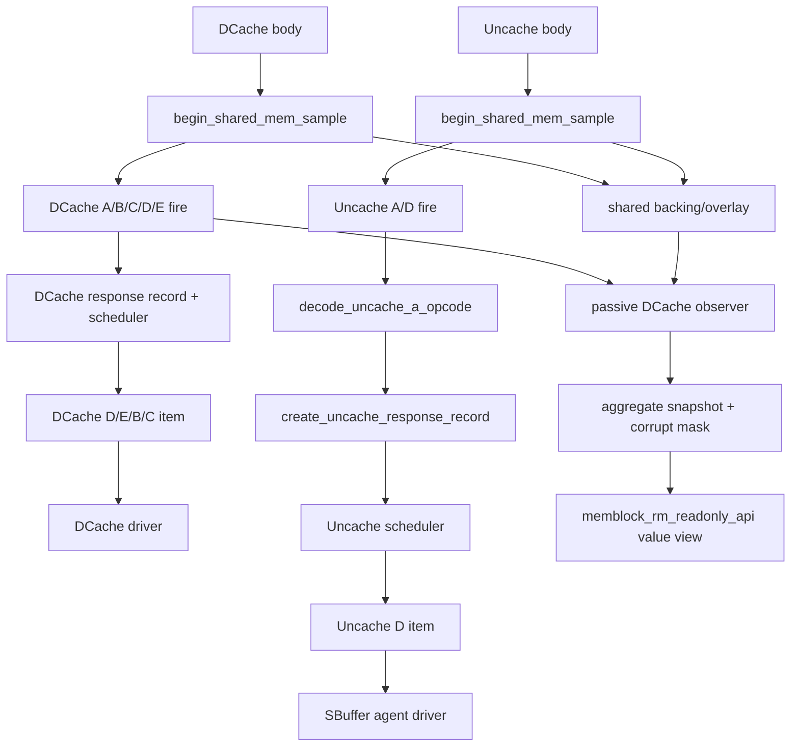

# DCache/Uncache Memory Responder Flow

## 1. 术语与抽象功能说明

本文描述 `mem_base_sequence.sv` 中两条 memory-facing responder 的公共边界：
`dcache_mem__access_base_sequence` 是 coherent DCache TileLink A/B/C/D/E responder；历史类名
`sbuffer_mem_access_base_sequence` 实际承接 V2 Uncache/MMIO 的 TL-UL A/D 端口。二者复用 shared
memory backend，但不共享协议 queue、timer、D hold、source、sink 或返回仲裁。

| 术语 | 当前含义 | 代码对象 | 说明 |
|---|---|---|---|
| `shared memory` | 测试级 sparse backing 与 write overlay | `mem_access_base_sequence` static store | 只保存 memory-facing 访问，不是 RTL L2 cache |
| `response record` | 已 A/C fire、等待 D 返回的协议回复 | `dcache_rsp_q` / `uncache_rsp_q` | 两通道各自独立维护 |
| `eligible_cycle` | record 最早可被本通道 scheduler 选择的 service cycle | 两种 response record | 防止新入队 record 当拍返回 |
| `D hold` | 已选择但尚未 D.fire 的唯一 D payload | `current_d_record/current_d_valid` | D.ready=0 时 payload 不变 |
| `D-error snapshot` | 当前 Uncache D reply 的 `denied/corrupt` 固定值 | `uncache_response_record_t::denied/corrupt` | response record 创建时合并 backend/error weight；后续 scheduler 与 D hold 只读 |
| `admission` | 从真实 request fire 到允许进入返回仲裁的固定边界 | DCache `+3`，Uncache `+1` | 不是 `pre_pkt_gap/post_pkt_gap` |
| `scheduler timer` | 每个通道每轮返回前独立抽样的额外延迟计时器 | `*_rsp_timer_*` | 到期后才选 record |
| `ordered/reorder` | record 的返回选择模式 | `*_RSP_REORDER_EN` | 两通道分别配置 |
| `memory lifecycle owner` | 每 testcase 唯一清空与配置 shared memory 的入口 | real-smoke virtual sequence | responder 只在 legacy topology 未初始化时兜底调用 |
| `write batch` | 已确认 fire、下一 shared-memory sample 才提交的写集合 | `dcache_write_batch/uncache_write_batch` | 同拍固定先 DCache、后 Uncache |
| `readonly observer` | 在既有 DCache/Uncache 动作完成后记录 resident、C-data、writeback 与 corrupt 事实的旁路状态 | `mem_access_base_sequence` static observer | 不决定协议、batch 或 memory 写入 |
| `aggregate snapshot` | DCache owner 一次发布的 resident/pending/drain 值型摘要 | `dcache_aggregate_snapshot` | API 只复制已发布快照 |
| `corrupt mask` | 已观察到但不能正常比较的 overlay byte 范围 | `write_overlay_corrupt_byte_mask` | corrupt C response 置位；既有正常提交按 byte 清除 |
| `overlay readiness` | RM 查询 committed overlay 前必须满足的单一 DCache 门槛 | `dcache_overlay_read_ready` | `valid=1 && ready=1` 才允许读取 |

## 2. 调用 Flow



### 2.1 函数调用 Flow 图整体文字伪代码

```text
两个 responder 都在自己的 drv_cb 边界先调用 begin_shared_mem_sample：
  提交上一拍已确认的 write batch；当前拍 read 只读取上一轮 committed overlay/backing view。

DCache：
  确认 A/C fire 后建立 coherent response record；
  以 DCache 自己的 admission、delay timer、选择模式和 D hold 返回 Grant/CBOAck/ReleaseAck；
  Grant 的 sink 在 E.fire 后才释放；Probe/C assembly 仍由 DCache 私有 owner 处理。

Uncache：
  确认 A.fire 后先用白名单解码 PutFullData/PutPartialData/Get；
  真实 store 写入 Uncache write batch，Get 固化 merged read data；
  建立 AccessAck 或 AccessAckData record；
  用 Uncache 自己的 timer 和选择模式返回 D，D.ready=0 时保持 current D hold。

只读 observer：
  DCache map/C-data/batch 与 Uncache batch 都先完成既有动作；observer 随后记录事实并重算 aggregate；
  API 只读取已发布 snapshot、已建立 backing 或已经提交的 overlay，不等待、不提交 batch、不进行 lazy allocation。

任何一侧的 D.ready backpressure、timer、record 满或 GrantAck wait 都不直接阻塞另一侧。
```

## 3. 公共 Shared Memory 后端

### 3.1 `begin_shared_mem_sample()` 与 `shared_mem_access_task()`

抽象功能描述：公共后端维护 backing、overlay 与跨通道 write batch 的唯一生命周期。它不创建
TileLink response、不分配 sink，也不管理 DCache/Uncache scheduler。

```text
每个 sample：先提交上一拍 batch，固定顺序为 DCache C writeback -> Uncache store；
读：每个 byte 优先读 overlay valid byte，未命中 byte 才读取或懒初始化 backing；
写：不污染 backing main_mem，只把 mask/data 作为 DCache 或 Uncache write event 进入本拍 batch；
下一 sample：统一提交 batch 到 overlay。
```

`MEMBLOCK_MAIN_MEM_RANGES_EN=1` 时，DCache 与 Uncache 都受 `PADDR_BASE/RANGE` 严格范围检查；为
`0` 时两侧允许 48-bit physical address sparse lazy allocation。该开关不限制主表虚拟地址、TLB PPN
构造或任意 TileLink 字段宽度。

### 3.2 被动 observer 与 RM 只读 API

抽象功能描述：observer 在既有 DCache/Uncache shared-memory 写已经入队或已经提交后记录必要事实；
memblock_rm_readonly_api 只复制 observer 已发布的摘要或已有 memory map。二者不负责 response 调度、
不修改 batch，也不替 RM 等待下一 sample。

#### 3.2.1 `commit_shared_mem_write_batch()` 的提交后观察

源码位置：`mem_ut/ver/ut/memblock/seq/base_seq_help/mem_base_sequence.sv`。

抽象功能描述：该函数仍是既有 shared-memory batch 的唯一提交入口；新增调用只在 overlay 已被原路径
写入后记录 DCache/Uncache 的旁路事实，不改变 DCache 先于 Uncache 的提交顺序。

```systemverilog
foreach (dcache_write_batch[i]) begin
    apply_shared_mem_write(dcache_write_batch[i]);
    observe_dcache_write_committed(dcache_write_batch[i]);
end
foreach (uncache_write_batch[i]) begin
    apply_shared_mem_write(uncache_write_batch[i]);
    observe_uncache_write_committed(uncache_write_batch[i]);
end
```

中文伪代码：先让每个已入队 DCache event 按原有 helper 写入 overlay，然后 observer 把该 event 标记为
已经提交；随后按原有优先级处理 Uncache event，并只清除其实际覆盖 byte 的 corrupt 标记。两个 observer
均在 apply_shared_mem_write 之后执行，所以它们不能让数据提前可见，也不会重排 batch。

#### 3.2.2 `read_memory_map()`

源码位置：`mem_ut/ver/ut/memblock/seq/base_seq_help/memblock_rm_readonly_api.sv`，函数
`read_memory_map()`。

抽象功能描述：该 private helper 只检查既有 shared-memory lifecycle 和 byte map，返回 backing 或 committed
overlay 的独立 value view；它不调用 DUT memory-facing task，也不会创建 backing/overlay line。

```systemverilog
if (!mem_access_base_sequence::is_shared_memory_lifecycle_initialized()) begin
    return report_query_miss(overlay ? "committed_overlay" : "initialized_backing",
                             "shared-memory lifecycle is not initialized");
end
if (mem_access_base_sequence::write_overlay_corrupt_byte_mask.exists(line_addr) &&
    mem_access_base_sequence::write_overlay_corrupt_byte_mask[line_addr][byte_offset]) begin
    corrupt_hit = 1'b1;
    view.corrupt_byte_mask[i] = 1'b1;
end
```

中文伪代码：先确认 shared-memory lifecycle 已由现有测试框架建立；若不存在，统一报 UVM_ERROR 并返回
无效 value view。overlay 查询先检查 corrupt mask，再检查 byte-valid overlay；普通 miss 不回退 backing。
该 helper 从不调用 commit_shared_mem_write_batch 或 ensure_main_line。

#### 3.2.3 `get_dcache_overlay_readiness_for_rm()`

源码位置：`mem_ut/ver/ut/memblock/seq/base_seq_help/memblock_rm_readonly_api.sv`，函数
`get_dcache_overlay_readiness_for_rm()`。

抽象功能描述：该 public API 只复制已经发布的 aggregate readiness；它不访问 DCache 私有 map，也不会把
normal 未 ready 变成错误。

```systemverilog
if (!mem_access_base_sequence::peek_dcache_aggregate_snapshot(snapshot)) begin
    return report_query_miss("dcache_overlay_readiness",
                             "DCache owner or observer snapshot is not published");
end
view.valid = 1'b1;
view.ready = snapshot.dcache_overlay_read_ready;
return 1'b1;
```

中文伪代码：先读取已有 aggregate snapshot；owner 未发布或 observer 不可用时统一报 UVM_ERROR 并返回
valid=0。snapshot 有效但尚未 drain 时返回 valid=1、ready=0；只有 ready=1 才表示调用方可按自己的时机
读取 committed overlay。该查询不提交 batch、不初始化 memory。

#### 3.2.4 DCache observer 的值域

observer 的 resident count 只统计 `cached_line_by_addr` 中 `alias_valid=1` 的协议驻留 line，不表示
payload clean/dirty 或数据一定完整。C-data 首拍使 assembly pending，正常 64 B writeback 的低/高两个
32 B fragment 都由既有 commit 观察到后，才结束该 line 的 fragment pending；corrupt C response 置整条
64 B 的 byte mask。Uncache 后续 store 仅能清除自己已经提交的 byte，不能把未覆盖 byte 伪装成可比较。

aggregate 只有 owner 已发布且 observer 完整时才有效。其 `dcache_overlay_read_ready` 同时要求：无 resident、
无 pending writeback、无 fragment pending、无 assembly、无 corrupt byte；它不是 L2 flush DONE，也不承诺
将来不会再接受新的 Acquire/Uncache 写。

## 4. DCache Response Pipeline

详细 coherent A/B/C/D/E 行为见
`AI_DOC/mem_ut_flow_doc/dcache_l2_response_hint_probe_model_flow.md`。本节只说明与 Uncache 的公共
调度关系。

抽象功能描述：DCache responder 将 A Acquire/CBO 和 C Release 流程统一为最多 16 条 response record，
使用独立 scheduler 返回 D。GrantData、CBOAck、ReleaseAck 共用容量；Grant 的动态 sink 等待 E.fire
不再占用 D response record。

```text
Acquire/CBO/Release fire：建立 response record；
DCache fixed admission：record 最早在 accept_cycle + 3 参与 scheduler；
timer：按 DCache 四档 delay weight 抽一次；
timer 到期：按 DCache ORDERED/REORDER 选 record 为 current D hold；
最后 D.fire：释放 record；Grant 再转入 GrantAck wait；
E.fire：按 sink 释放 Grant owner 和 sink。
```

`MEMBLOCK_DUT_DCACHE_A_MAX_OUTSTANDING=16` 是 compile-time 结构上限，不能由 plus 改变。
`MEMBLOCK_L2_RSP_DELAY_*_WT` 和 `MEMBLOCK_L2_RSP_REORDER_EN` 只改变 DCache 返回调度。

## 5. Uncache Response Pipeline

### 5.1 `decode_uncache_a_opcode()`

抽象功能描述：该函数只将已稳定的 Uncache A payload 分类为 store ack 或 load data，非法 opcode 在
建立 record 前 fail-fast。它不访问 memory，不推进 queue。

```text
PutFullData / PutPartialData -> STORE_ACK；
Get -> LOAD_DATA；
其它 opcode -> uvm_fatal，不创建 response record。
```

这避免旧逻辑将任何“非 Put”请求静默伪装为 `AccessAckData`。当前 V2 TL-UL edge 不支持在此
responder 中模拟 Arithmetic、Logical、Hint、Acquire 或 CBO transaction。

### 5.2 `create_uncache_response_record()`

抽象功能描述：该 task 仅消费真实 Uncache A.fire，执行一次 shared-memory 读或写并建立语义固定、
当拍不可返回的 AccessAck/AccessAckData record。它不管理 timer，也不在 D hold 时重读 memory。

```text
先检查未超过 MEMBLOCK_DUT_UNCACHE_MAX_OUTSTANDING；
解码 opcode；
STORE_ACK：以 address/mask/data 创建 Uncache write batch，record 记录 AccessAck；
LOAD_DATA：从当前 committed merged view 读取 64-bit data，record 记录 AccessAckData；
record.eligible_cycle = accept_cycle + 1；入 uncache_rsp_q。
```

在 record 创建点，`apply_uncache_d_error_injection()` 把 backend 结果与
`MEMBLOCK_UNCACHE_DENIED_WT/CORRUPT_WT` 的一次采样合并。`Get -> AccessAckData` 的 denied
命中强制 corrupt=1；`Put* -> AccessAck` 只允许 denied，corrupt 固定为 0；backend 给无数据
AccessAck 的 corrupt=1 会 fail-fast。scheduler 或 D hold 不得再次随机、访问 memory 或改写该快照。

### 5.3 `service_uncache_response_scheduler()` 与 D hold

抽象功能描述：该函数是 Uncache queue 到 current D hold 的唯一仲裁 owner。它只在没有 current D hold
时启动或消费 timer；D.ready=0 时它不改变 record 内容。

```text
无 current D hold 且有本拍前已存在的 eligible record：按 Uncache 四档权重抽 delay，启动 timer；
timer 到：ORDERED 选最早 eligible record，REORDER 在 eligible 集合随机选择；
移入 current_d_record，驱动 AccessAck 或 AccessAckData；
D.ready=0：保持 D.valid、opcode、source、size、data、denied、corrupt；
D.fire：清 current record，立即归还一条 Uncache response capacity。
```

`service_uncache_d_hold_watchdog()` 只在 D hold 持续 1000 个 driver 边界且无 D.fire 时输出一次
warning。它不超时删除 record、不改变 overlay、global stop、pass/fail 或 terminal。

## 6. 参数、容量与退出

| 项目 | DCache | Uncache |
|---|---|---|
| 编译期 response 上限 | `MEMBLOCK_DUT_DCACHE_A_MAX_OUTSTANDING=16` | `MEMBLOCK_DUT_UNCACHE_MAX_OUTSTANDING=16` |
| admission 最早可选拍 | A/C fire 后 `+3` | A fire 后 `+1` |
| runtime delay | `MEMBLOCK_L2_RSP_DELAY_ZERO/SMALL/MEDIUM/LARGE_WT` | `MEMBLOCK_UNCACHE_RSP_DELAY_ZERO/SMALL/MEDIUM/LARGE_WT` |
| 返回选择 | `MEMBLOCK_L2_RSP_REORDER_EN` | `MEMBLOCK_UNCACHE_RSP_REORDER_EN` |
| 默认分布 | SMALL `1`，其它 `0`，即 `1..10` | SMALL `1`，其它 `0`，即 `1..10` |
| E/sink | Grant 动态 sink，等待 GrantAck | 不使用 GrantAck sink |

两通道在 `global_stop_requested` 后不再接受未握手的新 request，却必须 drain 已建立的 record、timer 与
D hold。DCache 还必须等待 GrantAck、Hint、Probe/C assembly 收敛；Uncache 还必须等待 armed A 和
`uncache_rsp_q` 清空。任何一侧自然退出都不应清另一个 responder 的 shared memory 或协议状态。

## 7. 边界与修改类型总结

本轮把旧的 DCache 单 pending 与 Uncache 即时/单笔回复替换为两个独立的 response pipeline：

- 新增 DCache/Uncache response record、独立 timer、eligible boundary、ORDERED/REORDER 和 D hold；
- DCache 新增动态 sink 与多笔 GrantAck wait，ReleaseData 首 beat reservation；
- Uncache 新增 V2 opcode 白名单、16 笔容量和长 D.ready hold warning；
- shared memory 的 backing/overlay、byte mask、write batch 以及 DCache/Uncache 同拍写入顺序保持原
  有公共后端语义；
- 新增只读 observer 与唯一 `memblock_rm_readonly_api` class：只在既有动作完成后记录 resident、
  assembly、fragment、corrupt 和 aggregate；API 仅返回 value view，不接入 RM/checker、不驱动 DUT；
- 本 flow 已实现 D-error response snapshot，但它只驱动合法 Uncache D 字段，不接入主表、LSQ、
  pass/fail 或 terminal。多 Probe/toB、alias、CBO closure 和完整 L2 flush 仍必须由相应专项 plan
  在现有 response pipeline 上扩展，不能恢复旧的单 pending 状态机。
