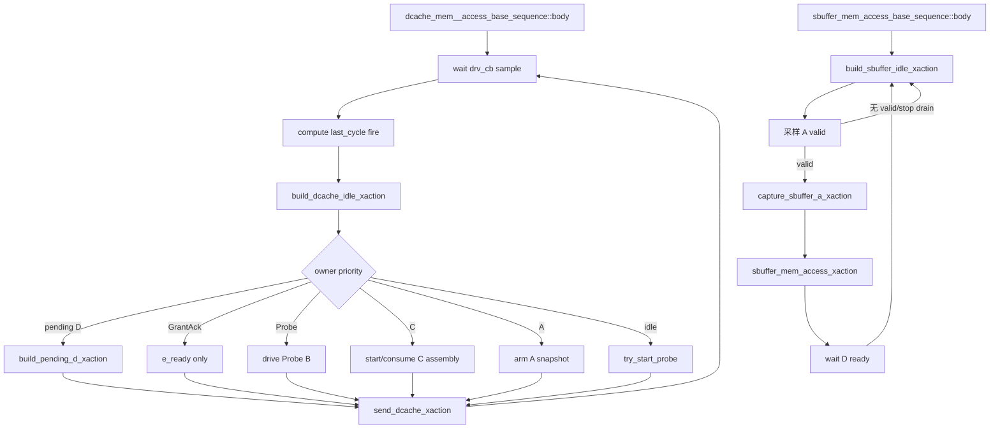

# DCache/SBuffer Memory Responder Flow

本文是共享 memory responder 的总览。DCache V2 coherent 细节以
AI_DOC/mem_ut_flow_doc/dcache_l2_response_hint_probe_model_flow.md 为准；本文同时保留
SBuffer 的单拍 responder 说明，避免共享源码修改后总览仍描述旧 DCache for-loop。

## 1. Flow 定位与职责边界

### 1.1 术语与抽象功能说明

| 英文术语 | 当前含义 | 代码对象/状态落点 | 示例 |
|---|---|---|---|
| responder | 响应 DUT memory channel 的长期 sequence | DCache/SBuffer base sequence | 不写 dispatch status |
| service cycle | DCache response 模型的逻辑拍计数 | service_cycle | 用于 delay 和 Hint due |
| armed snapshot | valid 已采样、等待下一边界确认 fire 的请求快照 | armed_a_req_xact、armed_c_req_xact | A.valid 先保存，下一拍才接受 |
| pending response | 已接受但尚未完成的 response | pending_d_*、C assembly | D.ready=0 时保持 payload |
| owner | 当前负责某条协议生命周期的唯一状态 | GrantAck owner、Probe owner | 无 owner 不消费 E |
| safe idle | 所有 channel valid/ready 和 sideband 为 0 的 item | build_*_idle_xaction | reset/terminal 边界发送 |
| in-flight | 尚未完成的 handshake、pending response 或 assembly | DCache pending/armed/Probe/GrantAck | stop 后必须先排空 |

抽象功能说明：两个 responder 都复用 mem_access_base_sequence 的稀疏主存，但协议模型不同。DCache
是 V2 轻量 coherent responder；SBuffer 仍是单拍 A-to-D responder。二者都不拥有主表、LQ/SQ、
pass/fail、ROB commit 或 terminal 状态。

## 2. 函数调用 Flow 图



### 2.1 函数调用 Flow 图整体文字伪代码

```text
DCache：
  body 在 drv_cb 边界采样上一 item 的对端 ready/valid；
  用 last_cycle_xact 确认 A/B/C/D/E fire；
  先推进已确认的旧 owner，再从 idle item 开始按 pending D、GrantAck、Probe、C、A 优先级构造下一 item；
  A.fire 才调用 accept_dcache_a_request 建立 Grant/GrantData/CBOAck pending；
  D.fire 才推进 beat或建立 GrantAck owner；
  E.fire 才插入 cached line table；
  C.fire 才进入 Probe/Release assembly；
  C.fire 完成后的同拍禁止 A arm 和新 Probe，C assembly 下一拍继续优先；
  非 reset 边界先检查 A.valid/B.ready/C.valid/D.ready/E.valid 四态 raw 值；
  global stop 只在所有 DCache in-flight 清空后发送 safe idle并退出。

SBuffer：
  body 发送 idle；
  reset完成且看到 A.valid时采样 request并发送 A.ready；
  调用 sbuffer_mem_access_xaction访问公共主存并生成单拍 D；
  持续发送到 DUT D.ready；
  global stop且没有尚未接受的 A时发送 safe idle并退出。

共享主存：
  DCache 64B coherent beat和SBuffer 8B beat都经过 main_mem_access_task；
  range、corrupt、denied由公共memory后端返回。
```

## 3. DCache responder 总览

源码位置：mem_ut/ver/ut/memblock/seq/base_seq_help/mem_base_sequence.sv:1311-1590。

抽象功能描述：DCache body 是单一逐拍 service loop，负责 fire 采样、response delay、Hint、
GrantAck、Probe、C assembly 和 global stop。它不依赖 DCache monitor analysis port。

当前 DCache 合同：

| 输入/事件 | 当前处理 |
|---|---|
| AcquireBlock | 两拍 GrantData，固定 sink 0，可按权重发一次 Hint |
| AcquirePerm | 单拍 Grant(toT)，固定 sink 0，等待 E |
| CBOClean/Flush/Inval | 单拍 CBOAck；flush/inval 完成后删 map |
| Release | 单拍 ReleaseAck |
| ReleaseData | 两拍接收、可写主存、再发 ReleaseAck |
| ProbeAck/ProbeAckData | 匹配 Probe owner，完成后删 map |
| 不支持的 A/C opcode | 在建立 response 前 fatal，不 fallback AccessAckData |
| io_l2_flush_done | 始终为已知 0；driver 首次赋值前做四态检查 |
| global stop | 禁止新 Probe；等待 pending/owner/armed/valid 全部收敛后发布 done 并自然退出 |

### 3.1 body() 的 fire 边界

抽象功能描述：每轮先采样上一 item 的对端值，再决定本轮 item；它不把看到 valid 等同于
已经握手。

```systemverilog
@(dcache_vif.drv_cb);
a_fire = (last_cycle_xact.auto_inner_dcache_client_out_a_ready == 1'b1) && sampled_a_valid;
d_fire = (last_cycle_xact.auto_inner_dcache_client_out_d_valid == 1'b1) && sampled_d_ready;
e_fire = (last_cycle_xact.auto_inner_dcache_client_out_e_ready == 1'b1) && sampled_e_valid;
```

中文伪代码：等待采样边界；将上一 item 的 ready/valid与当前 DUT 对端值相与；只在 fire 后调用对应状态更新函数。

C.fire 完成后的本拍显式跳过 A/Probe 仲裁；A.fire 已完成时阻止同拍 A arm，避免旧 C owner 被
新 pending D 抢占或同一个输入被重复分类。

### 3.2 DCache driver 合同

源码位置：mem_ut/ver/ut/memblock/agent/dcache_agent_agent/src/dcache_agent_agent_driver.sv:51-255。

抽象功能描述：driver 一对一搬运 sequence item，不决定协议状态。

```systemverilog
req = null;
seq_item_port.get_next_item(req);
send_pkt(req);
seq_item_port.item_done();
```

中文伪代码：清空旧句柄；阻塞获取新 item；立即写 clocking output；完成 item_done；不 hold 或重复上一 item。

send_pkt 要求 pre/post gap 为 0，使用四态比较检查 Hint valid/payload 和 flush_done；null item、
未知 valid/payload 或非已知 0 的 flush 都在首次 VIF 赋值前 fatal。四个 sideband xaction 字段为
四态 `logic`，检查不会在 driver 前被二态折叠；generic idle 的四个 sideband 和 E.ready 始终写 0。
DCache 详细状态流见专用 flow 文档。

### 3.3 GrantAck、Probe 和 C assembly

抽象功能描述：DCache 的 D/E/B/C 生命周期由 sequence-local owner 管理，不把完成的 map 当作
in-flight。

中文伪代码：

1. Grant/GrantData 最后一拍 D.fire：保存 line/alias/sink，置 GrantAck owner，暂不插入 map。
2. 只有 owner 分支才把 e_ready 置 1；无 owner 的 E.valid fatal；匹配 E.fire 后以四态完全匹配校验
   sink 并插入 map。
3. 未 stop、完全空闲且 map 非空时按权重启动 Probe；helper 自身重复检查全部 owner hazard；B.fire
   后等待 ProbeAck/Data。
4. ProbeAckData/ReleaseData 收两拍，header 必须稳定；无 corrupt 才写主存。
5. Release 完成后排期 ReleaseAck；Probe/失效操作完成后删除 map。

## 4. SBuffer responder 总览

源码位置：mem_ut/ver/ut/memblock/seq/base_seq_help/mem_base_sequence.sv:1592-1768。

抽象功能描述：SBuffer sequence 复用公共主存，按 8B beat 处理单拍 A-to-D request；它没有 DCache
的 GrantAck、Probe、Hint 或 multi-beat C owner。

### 4.1 sbuffer_mem_access_base_sequence::body()

```systemverilog
if (data.is_global_stop_requested() &&
    sbuffer_vif.auto_inner_buffers_out_a_valid === 1'b0) begin
    build_sbuffer_idle_xaction(idle_xact);
    send_sbuffer_xaction(idle_xact);
    break;
end
```

中文伪代码：stop 已请求且没有尚未接受的 SBuffer A 时发送 safe idle并退出；否则发送 idle，看到
A.valid后采样、发送 A.ready并等待 D.ready。退出不依赖 `dispatch_real_smoke_active` 保持为 1。

### 4.2 sbuffer_mem_access_xaction()

抽象功能描述：将 SBuffer A request 映射到公共 memory，并生成单拍 D response。

中文伪代码：判断 opcode 是否 store；将地址按 8B 对齐、mask/data送入 sbuffer_mem_access_task；
store 返回 ack，load 返回 64bit data；复制 source/size并保留 denied/corrupt。

## 5. 公共 memory 后端

源码位置：mem_base_sequence.sv:11-255。

抽象功能描述：mem_access_base_sequence 保存 sparse main_mem，并提供范围检查、lazy line 和 byte
mask 访问。main_mem 的内部片段是 1024-bit；DCache/SBuffer 只使用其中的 64B/8B 子范围。

```systemverilog
if (!is_main_mem_access_in_range(addr, byte_mask)) begin
    denied = 1'b1;
end
if (!(corrupt || denied)) begin
    foreach (byte_mask[i]) begin
        if (byte_mask[i]) begin
            ensure_main_line(line_addr);
            if (is_store)
                main_mem[line_addr][(byte_offset * 8) +: 8] = store_data[(i * 8) +: 8];
            else
                load_data[(i * 8) +: 8] = main_mem[line_addr][(byte_offset * 8) +: 8];
        end
    end
end
```

中文伪代码：先逐字节检查地址范围；越界置 denied；无错误时懒创建 line；store 按 mask更新、load复制 data；错误时 load data清零。

DCache body 启动时用公共 PADDR base/range 初始化自身 range，因此 DCache 完整 64B line 检查
实际生效；这不改变主表虚拟地址生成。SBuffer 继续使用公共后端的既有 range 状态。

## 6. 与其它 flow 的边界和同步要求

这些 responder 不生成主表、issue、writeback、ROB commit/deq、redirect/replay 或 pass/fail。
virtual_sequence_unified_dispatch_flow 只描述它们的启动、join和自然退出；本文件描述共享 memory
后端和 SBuffer，DCache 专项 flow 描述完整 coherent 生命周期。

任何修改以下共享对象的子 plan 都必须同步本文件及命中文档：

- mem_base_sequence.sv 的 body、driver 时序、memory range 或 global stop；
- dcache_agent_agent_driver 的 get_next_item/send_pkt/idle 行为；
- io_l2_hint/io_l2_flush_done 的 producer、约束或 fail-fast；
- DCache/SBuffer responder 的退出条件。

## 7. 与旧实现的差异总结

- DCache 由旧 A-to-D 阻塞 for-loop 改为 fire 驱动逐拍状态机。
- DCache 新增 coherent response 分类、delay、Hint、GrantAck/E、cached line、Probe 和 C assembly。
- DCache driver 改为阻塞 get_next_item 后立即发送，消除旧 hold 造成的重复 beat。
- DCache sideband 使用四态 fail-fast；无 GrantAck owner 的 E.valid 和未知 E sink 不再静默通过。
- C assembly fire 后独占本拍仲裁，stop 后禁止新 Probe和未握手 A；global stop 需要 DCache 自身
  in-flight drain，cached line map 不阻塞退出。
- DCache terminal idle 后发布 `dcache_responder_done`，legacy testcase 等待该标志后才 drop objection。
- SBuffer 仍保持单拍响应主体，不共享 DCache coherent owner。
