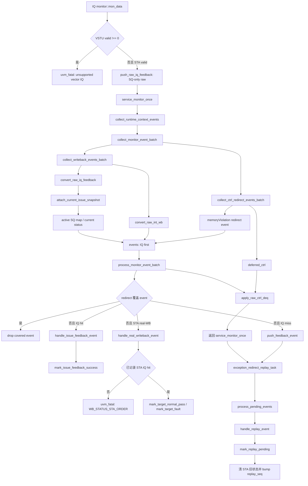

# V2 IQ Feedback Replay Flow

本文是 V2 scalar IQ feedback/replay 适配的当前权威 flow。源码、执行 plan 和本文不一致时，
以当前源码和
`AI_DOC/plan/test_framework/plan/do/mem_ut_v2_iq_feedback_replay_framework_adapt_execution_plan_20260711.md`
为准。

## 1. 范围与边界

本 flow 只覆盖 V2 scalar STA IQ feedback。V2 顶层该反馈端口真实提供
`valid/hit/sqIdx`，不提供测试框架的 UID、ROB key、LQ key 或 issue generation。

本轮支持：

- STA IQ `hit=1`：记录 `sta_issue_feedback_success`，等待真实 STA writeback。
- STA IQ `hit=0`：进入现有 replay recovery，清除旧 STA issue 状态并允许重新发射。
- IQ 与 real-WB 同一采样拍的确定性处理：IQ event 先于 int-WB event。
- IQ/real-WB 与 ctrl deq 同一采样拍：先完成 semantic batch，再应用 ctrl deq。
- 同一 monitor 上 VSTU feedback valid 非零时显式 `uvm_fatal`，不静默转成 scalar event。

本轮不支持：

- vector IQ 正向闭环、VSTU replay、`writebackVldu` 或 vector partial replay。
- STD IQ feedback；STD completion 仍由 V2 `writebackStd` real-WB owner 负责。
- issue-generation token、tombstone、claim map 和历史 event 生命周期状态机。

## 2. 函数调用 Flow 图



### 2.1 函数调用 Flow 图整体文字伪代码

```text
V2 scalar STA IQ feedback 主流程：

1. IQ monitor 在 clocking block 采样 DUT 输出。
   如果任一 VSTU valid 不是确定的 0，立即 fatal，禁止 vector event 混入 scalar flow。
   如果 STA valid 为 1，只把真实 hit 和 SQ key 写入 raw_iq_feedback_q；ROB/LQ valid 保持 0。

2. service_monitor_once 在下一 service 边界先同步 CSR/sfence，再调用 collect_monitor_event_batch。
   collect_writeback_events_batch 先排空 IQ raw，再排空 int-WB raw；每个 raw 都必须属于同一采样拍。
   convert_raw_iq_feedback 校验 SQ-only 能力，并调用 attach_current_issue_snapshot。
   attach_current_issue_snapshot 用 active SQ map 找到当前 uid，再从 status 补齐 ROB、issue epoch 和 replay_seq。

3. collect_ctrl_redirect_events_batch 把 raw ctrl 保存到 deferred_ctrl。
   memoryViolation 同时转换成 redirect event，但此时不释放 LQ/SQ active mapping。
   所有 IQ、int-WB 和 redirect event 一起进入 process_monitor_event_batch。

4. process_monitor_event_batch 先 normalize，再执行 redirect-first 仲裁。
   被 active 或同批 oldest redirect 覆盖的 event 直接丢弃，不更新 status。
   未覆盖 IQ hit 调用 handle_issue_feedback_event，只设置 sta_issue_feedback_success。
   未覆盖 IQ miss 写入 exception_event_q，等待 replay recovery。
   未覆盖 STA real-WB 调用 handle_real_writeback_event；严格模式下没有先见到 IQ hit 就 fatal。

5. semantic batch 完成后，调用 apply_raw_ctrl_deq 按 FIFO 应用 deferred ctrl，更新 sbIsEmpty 并释放 DUT 已出队的 LQ/SQ mapping。
   service 尾部调用 exception_redirect_replay_task；其 process_pending_events 消费 IQ miss，
   handle_replay_event 最终调用 mark_replay_pending，清除旧 STA 发射状态并递增 replay_seq。
```

## 3. `io_mem_to_ooo_iq_feedback_agent_agent_monitor::mon_data()`

源码位置：
`mem_ut/ver/ut/memblock/agent/io_mem_to_ooo_iq_feedback_agent_agent/src/io_mem_to_ooo_iq_feedback_agent_agent_monitor.sv`

函数功能：在 VIF clocking block 采样 IQ feedback，隔离不支持的 VSTU，并把 V2 scalar STA
真实字段写入共享 raw queue。输入来自 DUT pin，输出是 `dispatch_raw_iq_feedback_t`；本函数不读
status，也不修改 pass/fail/terminal。

真实逻辑摘要：

```systemverilog
if (io_mem_to_ooo_vstuIqFeedback_0_feedbackSlow_valid !== 1'b0 ||
    io_mem_to_ooo_vstuIqFeedback_1_feedbackSlow_valid !== 1'b0) begin
    `uvm_fatal("IQ_FEEDBACK_MON",
               "VSTU IQ feedback is outside the scalar-only V2 flow")
end
if (io_mem_to_ooo_staIqFeedback_0_feedbackSlow_valid) begin
    raw_iq_feedback = memblock_sync_pkg::make_empty_raw_iq_feedback();
    raw_iq_feedback.valid     = 1'b1;
    raw_iq_feedback.port_id   = 0;
    raw_iq_feedback.is_sta    = 1'b1;
    raw_iq_feedback.hit       = io_mem_to_ooo_staIqFeedback_0_feedbackSlow_bits_hit;
    raw_iq_feedback.sq_valid  = 1'b1;
    raw_iq_feedback.sq_flag   = io_mem_to_ooo_staIqFeedback_0_feedbackSlow_bits_sqIdx_flag;
    raw_iq_feedback.sq_value  = io_mem_to_ooo_staIqFeedback_0_feedbackSlow_bits_sqIdx_value;
    raw_iq_feedback.rob_valid = 1'b0;
    raw_iq_feedback.lq_valid  = 1'b0;
    raw_iq_feedback.cycle     = $time;
    memblock_sync_pkg::push_raw_iq_feedback(raw_iq_feedback);
end
```

文字伪代码：

```text
该逻辑负责把 V2 IQ pin 转成不带推测字段的 raw fact。
reset backend 完成后先检查两路 VSTU valid；任一路不是确定的 0 就 fatal，并停止本拍处理。
STA0 valid 为 1 时创建全中性的 raw，写入端口号、STA 类型、真实 hit 和完整 SQ key；
显式把 ROB/LQ valid 清零，防止 empty raw 中的 0 被误解释为 ROB0/LQ0；
记录采样时间并调用 push_raw_iq_feedback，把 raw 追加到共享 FIFO。
STA1 执行同样流程，只改变端口号和输入信号来源。
```

## 4. `convert_raw_iq_feedback()` 与 `attach_current_issue_snapshot()`

源码位置：
`mem_ut/ver/ut/memblock/seq/base_seq_help/dispatch_monitor_event_adapter.sv`

### 4.1 `convert_raw_iq_feedback()`

函数功能：把 SQ-only raw 转成统一 `memblock_wb_event_t`。输入是 raw queue 出队项；输出是带
current uid/ROB/SQ/epoch/replay snapshot 的 IQ hit/miss event。本函数不直接写 status。

真实逻辑摘要：

```systemverilog
if (raw.vector_feedback) begin
    `uvm_fatal("DISP_MON_ADAPT", "vector IQ feedback is unsupported")
end
if (!raw.is_sta && !raw.is_std) begin
    `uvm_fatal("DISP_MON_ADAPT", "IQ feedback has no supported scalar target")
end
if (raw.is_std) begin
    `uvm_fatal("DISP_MON_ADAPT", "STD IQ feedback cannot complete strict V2 STD real-WB target")
end
if (!raw.sq_valid || raw.rob_valid || raw.lq_valid) begin
    `uvm_fatal("DISP_MON_ADAPT", "STA IQ feedback must be SQ-only")
end

wb_event.valid   = 1'b1;
wb_event.target  = MEMBLOCK_ISSUE_TARGET_STA;
wb_event.source  = MEMBLOCK_WB_EVENT_SOURCE_STA_FEEDBACK;
wb_event.has_sq  = raw_sq_to_key(raw.sq_valid, raw.sq_flag,
                                  raw.sq_value, wb_event.sq_key);
attach_current_issue_snapshot(wb_event);
wb_event.iq_feedback_valid  = 1'b1;
wb_event.iq_feedback_hit    = raw.hit;
wb_event.iq_feedback_failed = !raw.hit;
wb_event.replay_valid       = !raw.hit;
wb_event.cycle              = raw.cycle;
```

文字伪代码：

```text
该函数负责能力检查、身份补齐和 hit/miss 语义转换。
raw 无效时返回 false；vector、未知 scalar target 或 STD event 立即 fatal。
合法 STA 必须只有 SQ key，携带 ROB/LQ 或缺少 SQ 都 fatal。
随后创建 STA_FEEDBACK event，只复制真实 SQ key，并调用 attach_current_issue_snapshot 关联当前动态实例。
snapshot 成功后把 hit 写成 iq_feedback_hit，把 miss 写成 iq_feedback_failed 和 replay_valid；
保留 raw cycle 后返回 true，让调用者把 event 加入 semantic batch。
```

### 4.2 `attach_current_issue_snapshot()`

函数功能：用 active SQ map 唯一反查当前 uid，并复用 `fill_current_issue_snapshot()`校验 active、
target dispatch、ROB/SQ owner 和 issue epoch。输出只修改 event 字段，不修改 map/status/queue。

真实逻辑摘要：

```systemverilog
if (!data.lookup_active_uid_by_sq(wb_event.sq_key, iq_uid)) begin
    `uvm_fatal("IQ_FEEDBACK_ATTACH", "no active uid for STA IQ SQ key")
end
iq_status = data.get_status(iq_uid);
canonical_sq.flag  = iq_status.sqIdx_flag;
canonical_sq.value = iq_status.sqIdx_value;
if (!iq_status.active_sq_mapped || !iq_status.sta_dispatched ||
    canonical_sq.flag != wb_event.sq_key.flag ||
    canonical_sq.value != wb_event.sq_key.value) begin
    `uvm_fatal("IQ_FEEDBACK_ATTACH", "STA IQ SQ owner mismatch")
end
iq_candidate.uid     = iq_uid;
iq_candidate.has_uid = 1'b1;
iq_candidate.rob_key = iq_status.get_rob_key();
iq_candidate.has_rob = 1'b1;
if (!fill_current_issue_snapshot(iq_candidate, iq_uid,
                                 iq_candidate.rob_key, 1'b0, 0, 1'b1)) begin
    `uvm_fatal("IQ_FEEDBACK_ATTACH", "STA IQ current snapshot validation failed")
end
wb_event = iq_candidate;
```

文字伪代码：

```text
该分支负责把 DUT 只给出的 SQ key 关联到测试框架当前 active store。
先检查 SQ value 在物理范围内，再调用 lookup_active_uid_by_sq 获取唯一 uid；没有命中就 fatal，不能静默 drop。
读取 uid 的 current status，要求 active SQ mapping 存在、STA 已真实发射，并要求 status canonical SQ 与 raw SQ 完全一致。
条件满足后把 uid 和 canonical ROB 写入局部 candidate，再调用 fill_current_issue_snapshot；
该 helper 继续检查 uid 未 terminal/flush/kill/redirect、STA target 仍 dispatched、ROB/SQ owner 唯一且 issue epoch 非零，
并补齐 issue_epoch 和 replay_seq。所有检查成功后才用 candidate 替换输出 event。
```

## 5. `collect_monitor_event_batch()` 与 raw queue 顺序

源码位置：
`mem_ut/ver/ut/memblock/seq/base_seq_help/dispatch_monitor_event_adapter.sv`、
`mem_ut/ver/ut/memblock/seq/base_seq_help/memblock_dispatch_base_sequence.sv`

### 5.1 `collect_writeback_events_batch()`

函数功能：排空本次 service 可见的 IQ 和 int-WB raw，保持每个 queue 内部 FIFO，同时规定
同一采样拍的跨 queue 顺序为 IQ 在前、int-WB 在后。

真实逻辑摘要：

```systemverilog
while (memblock_sync_pkg::pop_raw_iq_feedback(raw_iq)) begin
    check_raw_sample_cycle(raw_iq.cycle, sample_cycle,
                           sample_cycle_valid, "iq_feedback");
    if (convert_raw_iq_feedback(raw_iq, wb_event)) begin
        events.push_back(wb_event);
    end
end
while (memblock_sync_pkg::pop_raw_int_wb(raw_int_wb)) begin
    check_raw_sample_cycle(raw_int_wb.cycle, sample_cycle,
                           sample_cycle_valid, "int_wb");
    if (convert_raw_int_wb(raw_int_wb, wb_event)) begin
        events.push_back(wb_event);
    end
end
```

文字伪代码：

```text
该 task 负责形成 writeback/IQ semantic event 的确定顺序。
先逐项弹出 IQ FIFO；每项通过 check_raw_sample_cycle 确认属于当前 batch，再转换并追加 events。
IQ FIFO 排空后才逐项弹出 int-WB FIFO，执行相同 cycle 检查和转换。
转换失败的无效 raw 不入 events；能力、key 或 snapshot 错误由 converter fail-fast。
IQ-first 只影响同拍跨 queue 顺序，后续仍统一进入 redirect-first batch handler。
```

### 5.2 `collect_ctrl_redirect_events_batch()` 与 `collect_monitor_event_batch()`

函数功能：ctrl collector 暂存 deq/status sideband并转换 memoryViolation；顶层 batch task 在 semantic
event 处理完后才按 FIFO 应用 ctrl，避免本拍 owner mapping 被提前释放。

真实逻辑摘要：

```systemverilog
while (memblock_sync_pkg::pop_raw_ctrl(raw_ctrl)) begin
    check_raw_sample_cycle(raw_ctrl.cycle, sample_cycle,
                           sample_cycle_valid, "ctrl");
    deferred_ctrl.push_back(raw_ctrl);
    if (convert_raw_memory_violation(raw_ctrl, wb_event)) begin
        events.push_back(wb_event);
    end
end
```

文字伪代码：

```text
ctrl collector 按 FIFO 弹出 raw ctrl并校验采样时间。
每项先完整保存到 deferred_ctrl；若带 memoryViolation，再转换成 redirect event 追加到 events。
本函数不调用 apply_raw_ctrl_deq，所以 active LQ/SQ mapping 在 semantic batch 期间仍可用于 event owner 反查。
```

真实逻辑摘要：

```systemverilog
monitor_adapter.collect_writeback_events_batch(events,
                                               sample_cycle,
                                               sample_cycle_valid);
monitor_adapter.collect_ctrl_redirect_events_batch(events,
                                                   deferred_ctrl,
                                                   sample_cycle,
                                                   sample_cycle_valid);
monitor_batch_handler.process_monitor_event_batch(events);
monitor_adapter.apply_deferred_ctrl_updates_batch(deferred_ctrl);
```

文字伪代码：

```text
顶层 batch task 先收集 IQ/int-WB，再收集 ctrl 中的 redirect semantic event。
调用 process_monitor_event_batch 完成 normalize、oldest redirect 选择和 covered event 过滤；
只有未被 redirect 覆盖的 IQ/WB 才能更新 status 或写 recovery queue。
batch handler 返回后把 deferred_ctrl 原顺序追加到持久 deferred FIFO；adapter按队首调用
apply_raw_ctrl_deq。该helper更新sbIsEmpty，并把lqDeq/sqDeq count与pointer交给singleton
lsq_commit_handler释放active mapping；owner成功才pop，resync mismatch保留队首到下一service tick。
本 task 不调用 recovery；外层 service_monitor_once 仍只在尾部调用一次 exception_redirect_replay_task。
```

## 6. STA IQ hit、real-WB 与 replay

### 6.1 `writeback_status_handler::handle_issue_feedback_event()`

源码位置：`mem_ut/ver/ut/memblock/seq/base_seq_help/writeback_status_handler.sv`

函数功能：消费 redirect-first 已放行的 IQ event。hit 只记录 feedback success；miss 写入现有
recovery queue。本函数不负责 commit/deq/terminal。

真实逻辑摘要：

```systemverilog
if (wb_event.iq_feedback_failed) begin
    data.push_feedback_event(wb_event);
    return 1'b1;
end
if (wb_event.iq_feedback_hit) begin
    if (target_real_wb_pass_enabled(wb_event.target)) begin
        if (!data.mark_issue_feedback_success(uid, wb_event.target,
                                              issue_epoch, replay_seq,
                                              wb_event.cycle)) begin
            return 1'b0;
        end
        return 1'b1;
    end
    if (!data.mark_target_normal_pass(uid, wb_event.target,
                                      issue_epoch, replay_seq,
                                      wb_event.cycle)) begin
        return 1'b0;
    end
    return 1'b1;
end
```

文字伪代码：

```text
该函数负责把 IQ miss 和 hit 分流。
miss 时调用 push_feedback_event 把带 uid/epoch/replay snapshot 的 event 写入 exception_event_q，等待 recovery。
hit 且严格 real-WB 模式开启时，调用 mark_issue_feedback_success；该 helper 校验 active、target dispatched、
issue epoch 和 replay_seq，只设置 sta_issue_feedback_success，不设置 writeback/pass。
兼容开关关闭时保留旧行为，由 mark_target_normal_pass 直接完成 STA target；这不是默认严格 V2 路径。
```

### 6.2 `writeback_status_handler::handle_real_writeback_event()`

源码位置：同上。

函数功能：消费真实 STA writeback或fault writeback。严格模式要求同一 current issue 已先记录 IQ hit，
随后继续复用原有 normal pass/fault owner。

真实逻辑摘要：

```systemverilog
status = data.get_status(uid);
if (wb_event.target == MEMBLOCK_ISSUE_TARGET_STA &&
    target_real_wb_pass_enabled(MEMBLOCK_ISSUE_TARGET_STA) &&
    !status.sta_issue_feedback_success) begin
    `uvm_fatal("WB_STATUS_STA_ORDER",
               "STA real writeback arrived before IQ hit")
end
if (event_has_fault(wb_event)) begin
    if (!data.mark_target_fault(uid, wb_event.target, issue_epoch,
                                replay_seq, wb_event.exception_vec,
                                wb_event.cycle)) begin
        return 1'b0;
    end
    data.push_feedback_event(wb_event);
    return 1'b1;
end
if (event_is_normal_pass(wb_event)) begin
    if (!data.mark_target_normal_pass(uid, wb_event.target,
                                      issue_epoch, replay_seq,
                                      wb_event.cycle)) begin
        return 1'b0;
    end
    return 1'b1;
end
```

文字伪代码：

```text
该函数先确认 event 具有 real-WB 或 fault 语义，并读取 current uid status。
target 是 STA 且严格开关开启时检查 sta_issue_feedback_success；未置位立即 fatal，不更新任何完成状态。
检查通过后，fault 走 mark_target_fault 并进入 recovery queue，normal writeback 走 mark_target_normal_pass；
这两个既有 helper 仍是 pass/fault 的唯一状态写者，IQ hit 本身不取得完成 owner。
```

### 6.3 `handle_replay_event()` 与 `mark_replay_pending()`

源码位置：
`mem_ut/ver/ut/memblock/seq/base_seq_help/exception_redirect_replay_handler.sv`、
`mem_ut/ver/ut/memblock/seq/base_seq_help/common_data_transaction.sv`

函数功能：service 尾部从 `exception_event_q` 消费未被 redirect 覆盖的 IQ miss；非 PTW 等待项
最终进入 `mark_replay_pending()`，关闭旧 STA 动态实例并允许后续重新 route/issue。

真实逻辑摘要：

```systemverilog
if (event_should_wait_ptw(wb_event)) begin
    data.push_ptw_wait_replay(uid, wb_event.target, issue_epoch,
                              replay_seq,
                              memblock_sync_pkg::get_dispatch_service_cycle());
    return;
end
void'(data.mark_replay_pending(uid, wb_event.target,
                               issue_epoch, replay_seq,
                               wb_event.cycle));
```

文字伪代码：

```text
handle_replay_event 先解析当前 uid、issue epoch 和 replay_seq。
如果 event 标记 PTW-back，调用 push_ptw_wait_replay 把它放入等待队列，当前不重发。
否则调用 mark_replay_pending；该 helper 再做 current snapshot 条件更新，返回 false 表示 stale event 不落状态。
```

真实逻辑摘要：

```systemverilog
status.replay_pending = 1'b1;
status.writeback      = 1'b0;
status.pass           = 1'b0;
status.success        = 1'b0;
status.terminal_done  = 1'b0;
status.sta_dispatched = 1'b0;
status.sta_writeback  = 1'b0;
status.sta_issue_feedback_success = 1'b0;
status.sta_pass       = 1'b0;
status.queued_sta     = 1'b0;
status.replay_target_sta = 1'b1;
bump_replay_seq(uid);
```

文字伪代码：

```text
mark_replay_pending 在确认 uid active、STA 已发射、issue epoch 和 replay_seq 都匹配后关闭旧 STA 动态实例。
它置 replay_pending，清公共完成状态、STA dispatched/writeback/feedback/pass 和 queued 标志，
设置 replay_target_sta，并调用 bump_replay_seq 递增动态重放轮次。
后续 route_all_issue_queues 看到 STA 不再 dispatched 且 replay target 有效，才会建立新 issue item。
```

## 7. 队列、状态和时序边界

| 对象 | 写者 | 消费者 | 生命周期和副作用 |
|---|---|---|---|
| `raw_iq_feedback_q` | IQ monitor、software replay smoke | `collect_writeback_events_batch()` | 保存接口事实；出队后转换，不直接写状态。 |
| `events` | adapter collectors | `process_monitor_event_batch()` | 单次 service 的局部 semantic batch；redirect-first 完成后销毁。 |
| `deferred_ctrl` | `collect_ctrl_redirect_events_batch()` | `collect_monitor_event_batch()` | 只在当前 task 内存活；semantic batch 后按 FIFO 应用。 |
| `exception_event_q` | batch handler/writeback handler | `process_pending_events()` | 保存 replay/fault/redirect recovery event；IQ miss 从这里进入 replay。 |
| `sta_issue_feedback_success` | `mark_issue_feedback_success()` | STA real-WB严格顺序检查 | current STA issue 的过程态；replay/redirect 重置，不能直接推进 terminal。 |
| `replay_seq` | `bump_replay_seq()` | adapter snapshot、stale event 条件更新 | 同一 uid 的 replay 版本号；每次合法 replay 递增一次。 |

同一 service drain 若发现不同 `raw.cycle`，`check_raw_sample_cycle()`立即 fatal。当前 V2 合同是
monitor 在 posedge 采样，active dispatch service 在下一 negedge逐拍消费；本轮不实现跨拍积压排序器。

## 8. 端到端行为总结

```text
场景一，STA IQ hit 后正常写回：
  DUT STA IQ valid/hit/SQ
  -> SQ-only raw
  -> active SQ/current snapshot
  -> redirect-first batch放行
  -> mark_issue_feedback_success
  -> STA real-WB
  -> WB_STATUS_STA_ORDER检查通过
  -> mark_target_normal_pass

场景二，STA IQ miss 后 replay：
  DUT STA IQ valid/miss/SQ
  -> SQ-only raw
  -> current snapshot
  -> push_feedback_event
  -> process_pending_events
  -> handle_replay_event
  -> mark_replay_pending
  -> 清旧STA状态并bump replay_seq
  -> 新STA issue

场景三，同拍 memoryViolation 覆盖 IQ/WB：
  IQ/WB/ctrl raw
  -> 同一events batch
  -> select_oldest_redirect
  -> covered IQ/WB drop
  -> redirect进入recovery
  -> semantic batch后apply deferred ctrl

场景四，同拍 IQ hit、real-WB 和 deq：
  IQ raw先进入events
  -> real-WB随后进入events
  -> IQ hit先置feedback success
  -> real-WB完成STA target
  -> 最后apply_raw_ctrl_deq释放SQ mapping
```

端到端文字伪代码：

```text
场景一：monitor只采真实SQ；adapter绑定current STA实例；batch没有redirect覆盖时先记录IQ hit，
随后真实STA writeback通过严格顺序检查并由原pass owner完成target。

场景二：IQ miss不会写pass，而是进入exception_event_q；service尾部recovery校验相同epoch/replay_seq后
清旧STA动态状态并递增replay_seq，scheduler随后才能重新生成STA issue。

场景三：memoryViolation和IQ/WB先组成同一个semantic batch；batch handler先选最老redirect，
被覆盖的IQ/WB不落status。ctrl deq在仲裁结束后才应用，既不会提前破坏owner反查，也不会再次执行redirect。

场景四：同拍IQ、real-WB和deq按IQ、WB、deq顺序处理。IQ hit先建立过程态证据，
real-WB再更新完成态，最后DUT deq释放active SQ mapping；三者不共享完成owner。
```

## 9. 当前验证边界

- VCS/Verdi 全量编译已通过；`v2_lsq_mmio_cbo_final_20260723/log/vcs_compile_rtl.log` 的最终 KDB
  摘要为 `0 error(s), 0 warning(s)`，完整 transcript 另有一条工具自身的
  `LCA_FEATURES_ENABLED` usage warning，不是源码编译 warning。
- 真实 store smoke 已进入 `STD real-WB -> STA IQ feedback -> STA real-WB -> ROB commit`，
  随后在既有 SQ deq pointer 对账处失败；该失败归属 LSQ MMIO/status/SQ deq 子计划。
- 软件 replay smoke 当前在 sequence 启动前被既有 int-WB monitor raw producer 的
  `STD0 valid is X/Z`无条件检查终止，尚未执行到 IQ sequence。临时关闭该 monitor 又会触发
  env connect phase 对 disabled monitor 空句柄的既有问题；两者均不属于 IQ adapter，但意味着
  本轮 software replay 正向运行仍未形成通过证据。
