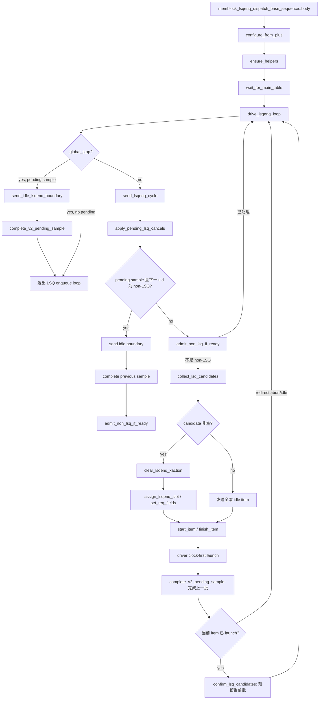

# MemBlock V2 LSQ Admission Flow

本文描述当前 `mem_ut` 测试框架把公共主表中的 scalar load/store 驱动到 V2 LSQ enqueue 接口，建立
软件 LQ/SQ allocation，并在 DUT sample 边界后开放 issue route 的真实调用链。

权威源码：

- `mem_ut/ver/ut/memblock/seq/base_seq/memblock_lsqenq_dispatch_base_sequence.sv`
- `mem_ut/ver/ut/memblock/agent/lsqenq_agent_agent/src/lsqenq_agent_agent_driver.sv`
- `mem_ut/ver/ut/memblock/seq/base_seq_help/lsq_ctrl_model.sv`
- `mem_ut/ver/ut/memblock/seq/base_seq_help/issue_queue_scheduler.sv`
- `mem_ut/ver/ut/memblock/seq/base_seq_help/common_data_transaction.sv`

## 1. Flow 边界

LSQ admission 只负责以下行为：

1. 从 `main_table_by_uid` 的 next-admit uid开始顺序选择 candidate。
2. 为 scalar load/store预测 LQ/SQ key并构造 V2 enqueue request。
3. driver launch 成功后立即预留软件 LSQ 资源。
4. 经过下一 driver clocking 边界后设置 `issue_ready`，进入 LOAD/STA/STD issue queue。
5. redirect 时复用全局 recovery 和原 LSQ cancel owner回退 reservation。

本 flow 不修改主表生成、issue fire、writeback、ROB commit、LSQ deq、pass/fail 或 terminal owner。
本轮不支持 vector LS/`issueVldu`、multi-element chunk、enqueue 前 directed exception、issue hold、压力模式
和 boundary vseq。

V2 顶层只有 enqueue request input，没有 LSQ enqueue `canAccept/response`。因此当前 flow 不调用
`wait_lsq_can_accept()`、`sample_lsqenq_resp()` 或 `commit_allocate_with_resp()`。

## 2. 函数调用 Flow 图



### 函数调用 Flow 图整体文字伪代码

```text
1. 初始化阶段：
   body 初始化 seq_csr_common，读取 enable/no-progress 配置，取得公共 data、LSQ 软件镜像和 issue scheduler；
   sequence 关闭时直接返回，开启时等待主表 ready。

2. 每拍入口：
   drive_lsqenq_loop 先检查 global stop；若最后一批仍 pending，先发送 idle item提供真实 sample 边界；
   正常拍调用 send_lsqenq_cycle，并根据 launch/sample/non-LSQ 是否推进维护 no-progress warning计数。

3. redirect cancel：
   send_lsqenq_cycle 首先消费 pending LQ/SQ cancel count；
   cancel helper只回退软件 pointer/free count，不创建新的 recovery owner。

4. non-LSQ 边界：
   若上一 LSQ batch pending而下一 uid 为 non-LSQ，先发送全零 idle并完成上一批 sample；
   随后沿用原 non-LSQ admission，不让零时间路径伪装成 driver sample边界。

5. LSQ candidate：
   collect_lsq_candidates 每拍采样一次总slot上限；随机返回0时不读取uid、pointer、free count、主表、
   状态表或map，并生成idle item；此前仍允许读取global-flush gate；
   非零时只预览连续 uid，分别限制 load element不超过6、store element不超过4，并受实际free count限制。

6. launch 与 reservation：
   driver 在 clocking 边界先让 DUT采样上一拍，再取得当前item并检查flush epoch；
   合法active item只发送一次并立即item_done；sequence先完成上一批sample，再为当前launch批建立reservation。

7. sample 与 issue route：
   pending batch只有在下一driver边界到来且epoch仍有效时才调用complete_admission；
   该调用设置issue_ready并写入LOAD/STA/STD issue queue；redirect覆盖的pending批不开放issue。
```

## 3. 关键状态和 owner

| 状态/对象 | 含义 | 写者 | 清理/后续读者 |
|---|---|---|---|
| `dispatch_progress.max_enqueued_uid` | 连续完成 admission 的高水位 | `set_status_field(ENQ)` 间接推进 | redirect rollback、next-admit 查询 |
| `status.active/enq` | uid 已建立当前动态实例和 admission reservation | `lsq_ctrl_model::commit_allocate()` | redirect/reissue、commit/terminal flow |
| LQ/SQ active map | DUT key 到 uid 的运行期映射 | `common_data_transaction::activate_uid()` | monitor event反查、deq、redirect cancel |
| `lq/sq_enq_ptr`、free count | 软件 LSQ allocation 镜像 | `commit_allocate()` | candidate preview、deq release、redirect cancel |
| `pending_sample_*` | 当前已 launch/已预留、尚未经过下一 sample 边界的一批 uid | `confirm_lsq_candidates()` | `complete_v2_pending_sample()` |
| `status.issue_ready` 和 issue queue | uid 可以进入后续 issue flow | `prepare_issue_route_for_uid()` | issue sequence/scheduler |
| `pending_lq/sq_cancel_count` | redirect 后待回退的 element 数 | 全局 redirect handler | `apply_pending_lsq_cancels()` |

`pending_sample_*` 是 sequence 局部过程态，不是第二套 active map。它只决定何时开放 issue，不拥有
pointer/free count回退。

## 4. Sequence 初始化与主循环

### 4.1 `body()`

源码位置：`memblock_lsqenq_dispatch_base_sequence.sv`，task：`body()`。

该 task 是 LSQ admission入口，负责配置、依赖获取和主表同步。

```systemverilog
seq_csr_common::init();
configure_from_plus();
if (!enable) begin
    return;
end
ensure_helpers();
wait_for_main_table();
drive_lsqenq_loop();
```

中文伪代码：

```text
初始化公共参数快照；
读取LSQ sequence enable和公共no-progress warning阈值；
若关闭则保持driver安全idle并返回，不回退到随机父类sequence；
取得公共状态、LSQ软件镜像、issue scheduler和monitor adapter；
等待主表ready后进入常驻admission循环。
```

### 4.2 `drive_lsqenq_loop()`

源码位置：同上，task：`drive_lsqenq_loop()`。

该 task 按拍调用 admission，并确保 global stop前的最后一个 pending batch经过 sample边界。

```systemverilog
if (data.is_global_stop_requested()) begin
    if (pending_sample_valid) begin
        send_idle_lsqenq_boundary(cycle_idx, "global_stop trailing sample", has_progress);
    end
    break;
end
send_lsqenq_cycle(cycle_idx, has_progress);
```

中文伪代码：

```text
每轮先检查公共global stop；
若停止且仍有pending batch，发送全零idle item，让driver经过一个真实clocking边界并结算上一批；
pending清空后退出；
正常轮调用send_lsqenq_cycle；
有launch/sample/non-LSQ推进时清no-progress计数，否则累计并按阈值warning，但warning不是正常退出条件。
```

## 5. 每拍 admission 调度

### 5.1 `send_lsqenq_cycle()`

源码位置：`memblock_lsqenq_dispatch_base_sequence.sv`，task：`send_lsqenq_cycle()`。

该 task 串联 cancel、non-LSQ、candidate、driver item、上一批 sample和当前批 reservation。

```systemverilog
apply_pending_lsq_cancels();
if (!collect_lsq_candidates(uids, trs, behaviors, lq_keys, sq_keys)) begin
    send_idle_lsqenq_boundary(cycle_idx, "no LSQ candidate", has_progress);
    return;
end
start_item(tr);
finish_item(tr);
complete_v2_pending_sample(has_progress);
confirm_lsq_candidates(tr, uids, trs, behaviors, lq_keys, sq_keys, has_progress);
```

中文伪代码：

```text
先消费redirect留下的cancel count，使新candidate看到已回退的pointer/free count；
若pending batch后面紧接non-LSQ，先发送idle完成pending sample，再执行原non-LSQ admission并返回；
否则先尝试直接处理non-LSQ；成功时不创建LSQ item；
调用collect_lsq_candidates只读预览本拍连续scalar LS；
没有candidate时发送全零idle，该边界仍可能完成上一批sample；
有candidate时清空xaction并逐slot构造request；
finish_item返回后先结算上一批pending，再按driver返回的launch结果预留当前批；
has_progress只做OR汇总，sample进展不会被当前launch结果覆盖。
```

### 5.2 `apply_pending_lsq_cancels()`

该函数消费公共 recovery owner累计的 cancel count。

```systemverilog
if (data.pending_lq_cancel_count != 0) begin
    lsq_ctrl.cancel_lq(data.pending_lq_cancel_count);
    data.pending_lq_cancel_count = 0;
end
if (data.pending_sq_cancel_count != 0) begin
    lsq_ctrl.cancel_sq(data.pending_sq_cancel_count);
    data.pending_sq_cancel_count = 0;
end
```

中文伪代码：

```text
读取全局redirect handler登记的LQ/SQ取消element数；
分别调用LSQ软件镜像的cancel函数回退enqueue pointer并恢复free count；
成功后清零公共pending count，避免下一拍重复回退；
该函数不重新扫描主表，也不决定哪些uid被flush。
```

## 6. Candidate 生成

### 6.1 `collect_lsq_candidates()`

源码位置：`memblock_lsqenq_dispatch_base_sequence.sv`，function：`collect_lsq_candidates()`。

该函数处于每拍高频路径，只扫描本拍连续候选，范围上限为编译期6个slot，不做全表扫描。

```systemverilog
max_enq = seq_csr_common::get_enq_per_cycle();
if (max_enq == 0) begin
    return 1'b0;
end
while (uids.size() < max_enq) begin
    tentative_load = load_elem_count + (behavior.uses_lq ? behavior.num_ls_elem : 0);
    tentative_store = store_elem_count + (behavior.uses_sq ? behavior.num_ls_elem : 0);
    if (tentative_load > MEMBLOCK_DUT_LSQ_LD_ENQ_WIDTH ||
        tentative_store > MEMBLOCK_DUT_LSQ_ST_ENQ_WIDTH ||
        tentative_load > lq_free_tmp || tentative_store > sq_free_tmp) begin
        break;
    end
    // 保存candidate并只推进局部pointer。
end
```

中文伪代码：

```text
清空所有输出queue，保证无上一拍残留；
flush阻塞时在读取next uid和LSQ资源前返回；
本拍只采样一次get_enq_per_cycle；返回0时不读取或修改uid/pointer/free count；
复制真实软件pointer/free count到局部变量；
从next-admit uid开始按顺序预览，遇主表末尾、已有状态或non-LSQ立即停止，不跳过老uid；
derive_op_behavior推导LQ/SQ占用；当前scalar路径要求num_ls_elem=1，否则fatal；
分别累计load和store element，超过编译期6/4或实际free count时截断本批；
合法candidate保存预测key并只推进局部pointer；真实状态等driver launch后由commit_allocate更新。
```

该实现不要求 `base_lq_free>=6` 或 `base_sq_free>=4`，也不执行 `tentative+6/4 reserve`。6/4只表示
本拍端口上限，不能让软件模型永久保留队尾空项。

## 7. Request 字段构造

### 7.1 `set_req_fields()`

源码位置：`memblock_lsqenq_dispatch_base_sequence.sv`，function：`set_req_fields()`。

该函数是单个 slot request qualifier/payload 的唯一写者。入口检查发生在 `case (slot)` 的任何字段写入
之前。

```systemverilog
if (tr == null) begin
    `uvm_fatal(get_type_name(), "set_req_fields got null xaction")
end
if (slot >= MEMBLOCK_DUT_LSQ_ENQ_SLOT_NUM) begin
    `uvm_fatal(get_type_name(), "set_req_fields slot exceeds compile-time slot count")
end
default_behavior = lsq_ctrl_model::make_default_behavior();
if (valid) begin
    if (main_tr == null) begin
        `uvm_fatal(get_type_name(), "active LSQ slot got null main transaction")
    end
    if (behavior.num_ls_elem != memblock_num_ls_elem_t'(1) ||
        main_tr.numLsElem != memblock_num_ls_elem_t'(1) ||
        !(behavior.need_alloc inside {2'b01, 2'b10}) ||
        (behavior.need_alloc == 2'b01 && (!behavior.uses_lq || behavior.uses_sq)) ||
        (behavior.need_alloc == 2'b10 && (behavior.uses_lq || !behavior.uses_sq))) begin
        `uvm_fatal(get_type_name(), "slot violates scalar LSQ behavior")
    end
    dut_futype = encode_and_fit_dut_futype(main_tr.fuType, context);
    rob_key = main_tr.get_rob_key();
    uop_idx = '0;
    num_ls_elem = behavior.num_ls_elem;
    fu_op_type = main_tr.fuOpType;
    last_uop = 1'b1;
end else begin
    if (main_tr != null || behavior != default_behavior ||
        lq_key.flag || lq_key.value != '0 ||
        sq_key.flag || sq_key.value != '0) begin
        `uvm_fatal(get_type_name(), "idle slot requires null main transaction, default behavior, and zero keys")
    end
    // 只为当前slot生成全零局部payload。
end
case (slot)
    // 只写tr中当前slot对应的req qualifier/payload。
endcase
```

中文伪代码：

```text
先检查tr非null且slot小于编译期slot数；不满足时在任何slot字段写入前fatal；
active slot检查main_tr非null；
检查main_tr.numLsElem和behavior.num_ls_elem都为1；
检查load严格为need_alloc=01、uses_lq=1、uses_sq=0，store严格为need_alloc=10、uses_lq=0、uses_sq=1；
active slot接收collect_lsq_candidates保存的两组candidate preview key；driver在首次写VIF前检查key value范围，
confirm_lsq_candidates在公共reservation前检查behavior实际使用的key仍与preview一致，失败均先fatal；
调用FuType helper生成当前V2可无损表示的one-hot编码；
从main transaction取得ROB key，复制candidate预测的LQ/SQ key和fuOpType；
固定uopIdx=0、lastUop=1，并把exceptionVec/trigger/flushPipe清零；
idle slot要求main_tr为null、behavior完整等于make_default_behavior、LQ/SQ key的flag和value全部为0；
idle合同不满足时也在当前slot字段写入前fatal；
合同通过后只写tr的当前xaction slot，不修改其它slot，也不修改主表、状态表、map、pending-sample、pointer或free count。
```

`clear_lsqenq_xaction()` 和 `assign_lsqenq_slot()` 都调用该 setter，避免 active构造和idle清理维护两套字段
列表。xaction constraint和driver pre-drive validation采用相同scalar合同。

## 8. Driver clock-first streaming

### 8.1 `lsqenq_agent_agent_driver::main_phase()`

源码位置：`agent/lsqenq_agent_agent/src/lsqenq_agent_agent_driver.sv`。

driver 每个边界最多取得一个item；当前item launch后不在本item内等待下一拍。

```systemverilog
@this.vif.drv_mp.drv_cb;
req = null;
seq_item_port.try_next_item(req);
if (req != null) begin
    if (req.pre_pkt_gap != 0 || req.post_pkt_gap != 0) begin
        `uvm_fatal(get_type_name(), "V2 LSQ streaming requires pre/post gap 0")
    end
    req.memblock_dispatch_request_launched = 1'b0;
    req.memblock_dispatch_aborted_by_redirect = 1'b0;
    active_request = has_active_request(req);
    if (active_request &&
        (memblock_sync_pkg::dispatch_flush_in_progress ||
         memblock_sync_pkg::dispatch_flush_epoch != req.memblock_dispatch_flush_epoch)) begin
        req.memblock_dispatch_aborted_by_redirect = 1'b1;
        this.drive_idle(this.cfg.drv_mode);
    end else begin
        this.send_pkt(req);
        req.memblock_dispatch_request_launched = active_request;
    end
    seq_item_port.item_done();
end else begin
    drive_idle(cfg.drv_mode);
end
```

中文伪代码：

```text
先等待driver clocking边界；该边界让DUT采样上一轮保留在VIF上的值；
把req清空后非阻塞取得当前item，防止复用旧句柄；
无item时驱动全零idle；
有item时要求pre/post gap为0，并清launch/abort metadata；
active item若flush正在进行或epoch过期，则只驱动idle并标记launch前abort；
其余item先由validate_v2_scalar_item检查全部slot，再调用send_pkt一次写VIF；
active item标记request_launched，idle item保持0；
立即item_done，让sequence可以在同一边界完成上一批sample并构造下一批。
```

`build_phase()` 要求 active driver 的 `drv_mode==DRV_0`。`validate_v2_scalar_item()` 在任何VIF赋值前检查：

- inactive slot的 `needAlloc`、qualifier和全部payload都为0。
- active load/store的 `needAlloc` 与V2 LDU/STU FuType匹配。
- active LQ的`fuOpType`只允许普通load `0..6`和software prefetch `8/9/10`；active SQ只允许普通store `0..3`。
- 六个slot中active load总数不超过compile load width 6，active store总数不超过compile store width 4。
- active key value不越过ROB/LQ/SQ真实size。
- `uopIdx=0`、`numLsElem=1`、`lastUop=1`、exception/trigger/flushPipe为0。

xaction用两组宏值表唯一维护load/prefetch/store合法opcode；逐slot constraint直接`inside`值表，driver
helper读取同一值表，避免自定义函数调用阻断VCS对随机`fuOpType`的反向求解。同一6/4合同存在于
`c_v2_batch_enqueue_width`；`v2_streaming_gap_cons`还把继承的pre/post gap都收紧为0。因此通用default
sequence既不会生成CBO/其它非法opcode、5/6个store或非零gap；
driver复核覆盖关闭约束、手工赋值和其它directed producer。dispatch主路径仍在candidate阶段结合实际
free count提前截断，不依赖driver fatal做正常仲裁。

## 9. Reservation 和 sample completion

### 9.1 `confirm_lsq_candidates()`

源码位置：`memblock_lsqenq_dispatch_base_sequence.sv`。

该函数只为当前已launch batch建立reservation，不开放issue。

```systemverilog
if (!tr.memblock_dispatch_request_launched) begin
    // 只允许redirect abort或epoch失效。
    return;
end
foreach (uids[idx]) begin
    lsq_ctrl.preview_allocate(behaviors[idx], expected_lq_key, expected_sq_key);
    // 只比较behavior实际使用的key。
    lsq_ctrl.commit_allocate(uids[idx], behaviors[idx], trs[idx]);
    pending_sample_uids.push_back(uids[idx]);
end
pending_sample_flush_epoch = tr.memblock_dispatch_flush_epoch;
pending_sample_valid = 1'b1;
```

中文伪代码：

```text
driver未launch时，只允许该item已标记redirect abort、当前flush有效或epoch失效；否则fatal暴露driver合同错误；
launch和abort同时为1时fatal；
当前flush或epoch失效时不建立reservation；
检查五组candidate queue非空且等长，并要求上一批pending已经完成；
逐uid重新preview当前真实pointer，只比较load使用的LQ key或store使用的SQ key；
预测漂移时在任何状态修改前fatal；
调用唯一allocation owner commit_allocate建立active/enq/map并推进pointer/free count；
把uid和epoch保存到单深度pending batch，等待下一driver边界开放issue。
```

### 9.2 `complete_v2_pending_sample()`

该函数在每次 `finish_item()` 返回后先处理上一批。

```systemverilog
if (!pending_sample_valid) return;
if (!admission_blocked_by_flush() &&
    pending_sample_flush_epoch == memblock_sync_pkg::dispatch_flush_epoch) begin
    foreach (pending_sample_uids[idx]) begin
        complete_admission(pending_sample_uids[idx]);
    end
end
clear_v2_pending_sample();
```

中文伪代码：

```text
没有pending batch时直接返回；
比较pending_sample_flush_epoch与当前memblock_sync_pkg::dispatch_flush_epoch；
两者相等且global flush未阻塞时，逐uid调用complete_admission；
complete_admission先drain CSR runtime event，再由issue scheduler检查active/enq并设置issue_ready、写对应issue queue；
保存epoch与当前epoch不等或global flush阻塞时，不调用complete_admission、不开放issue，也不在本函数手工释放LSQ资源；
既有redirect/cancel owner负责回退reservation；
无论正常或redirect路径都清本地pending queue和metadata，避免重复完成。
```

## 10. Redirect 场景

### 10.1 launch 前 redirect

```text
driver在当前边界发现flush或epoch失效
-> request_launched=0、aborted_by_redirect=1
-> drive_idle
-> confirm不建立reservation
-> next-admit uid保持不变，恢复后重试。
```

### 10.2 launch 后、sample 前 redirect

```text
当前batch已建立active/enq/map reservation
-> 下一边界complete_v2_pending_sample发现epoch失效，不开放issue
-> global redirect handler根据active mapping累计pending LQ/SQ cancel
-> LSQ sequence下一轮apply_pending_lsq_cancels回退pointer/free count
-> rollback后的uid重新进入candidate。
```

### 10.3 sample/issue-ready 后 redirect

继续使用原全局 redirect/reissue flow。本专项不增加本地5-cycle guard、第二套flush状态或第二个cancel owner。

## 11. 参数行为

| 参数/宏 | 类型 | 当前语义 |
|---|---|---|
| `MEMBLOCK_DUT_LSQ_ENQ_SLOT_NUM` | compile | V2物理slot数6 |
| `MEMBLOCK_DUT_LSQ_LD_ENQ_WIDTH` | compile | 本拍load element上限6 |
| `MEMBLOCK_DUT_LSQ_ST_ENQ_WIDTH` | compile | 本拍store element上限4 |
| `MEMBLOCK_ENQ_PER_CYCLE` | runtime | 固定模式本拍总slot目标，范围1..6 |
| `MEMBLOCK_ENQ_PER_CYCLE_RAND_EN` | runtime | 开启ZERO/MIDDLE/MAX随机模式 |
| `*_ZERO_WEIGHT` | runtime | 选择主动idle拍的类别总权重 |
| `*_MIDDLE_WEIGHT` | runtime | 选择1..MAX-1的类别总权重，-1为AUTO |
| `*_MAX_WEIGHT` | runtime | 选择MAX的类别总权重 |
| `MEMBLOCK_LSQENQ_READY_TIMEOUT` | runtime兼容入口 | 公共参数层仍解析并检查非负；V2 sequence不读getter、不等待ready，且不做零值warning/clamp |

随机模式禁止 `MIDDLE+MAX=0`，避免永远只发送idle。随机返回0不算新的admission progress；如果上一批
pending，idle边界完成上一批sample仍算progress。

## 12. 状态变化

### 12.1 scalar load

```text
main_table uid(load)
-> collect_lsq_candidates预测LQ key
-> driver launch V2 enqueue request
-> commit_allocate建立active/enq和LQ map，扣减LQ free count
-> 下一driver边界complete_v2_pending_sample
-> prepare_issue_route_for_uid设置issue_ready并进入LOAD issue queue
-> 后续load issue/writeback/ROB commit/LQ deq/terminal由各自flow推进。
```

### 12.2 scalar store

```text
main_table uid(store)
-> collect_lsq_candidates预测SQ key，单拍最多收集4个store element
-> driver launch V2 enqueue request
-> commit_allocate建立active/enq和SQ map，扣减SQ free count
-> 下一driver边界complete_v2_pending_sample
-> prepare_issue_route_for_uid设置issue_ready并分别进入STA和STD issue queue
-> 后续store writeback/ROB commit/SQ deq/terminal由各自flow推进。
```

### 12.3 随机零入队

```text
get_enq_per_cycle返回0
-> collect在读取uid/pointer/free前返回空candidate
-> sequence发送全零idle item
-> 若有上一批pending则完成其sample；否则本拍无admission progress
-> 下一拍重新随机，不消费或跳过next uid。
```

## 13. 端到端行为总结

```text
正常LSQ admission：
  main table
  -> collect_lsq_candidates
  -> set_req_fields
  -> driver clock-first launch
  -> confirm_lsq_candidates / commit_allocate
  -> pending_sample
  -> complete_v2_pending_sample
  -> prepare_issue_route_for_uid
  -> LOAD/STA/STD issue queue

launch前redirect：
  candidate
  -> driver epoch check
  -> drive_idle + aborted_by_redirect
  -> no reservation
  -> same uid retry

launch后redirect：
  reservation
  -> complete_v2_pending_sample比较pending_sample_flush_epoch与当前dispatch_flush_epoch
  -> 保存epoch与当前epoch不等，不调用complete_admission
  -> no issue route
  -> 既有global redirect/cancel owner累计回退量
  -> apply_pending_lsq_cancels
  -> pointer/free rollback
  -> uid reissue

末批drain：
  global_stop + pending_sample
  -> trailing idle item
  -> complete or discard pending by epoch
  -> clear pending state
  -> sequence exit
```

端到端文字伪代码：

```text
正常路径先从连续uid前缀生成不超过V2 6-load/4-store能力的request；xaction约束保证通用随机路径遵守
同一上限，driver在写VIF前再对所有producer复核。driver只launch一次，sequence立即预留资源，使下一批
看到正确pointer。下一driver边界证明上一批已有DUT sample机会，才把uid放入issue queue。

redirect路径按发生时点分层：launch前不建状态；launch后保留足够mapping让全局recovery可识别并取消，
但epoch失效批不开放issue；资源回退仍只有原redirect/cancel owner。

随机idle和末批trailing idle都只提供一个全零driver边界。前者不消费next uid，后者保证最后一批不会
停在已预留未route状态；二者都不修改pass/fail/terminal语义。
```
