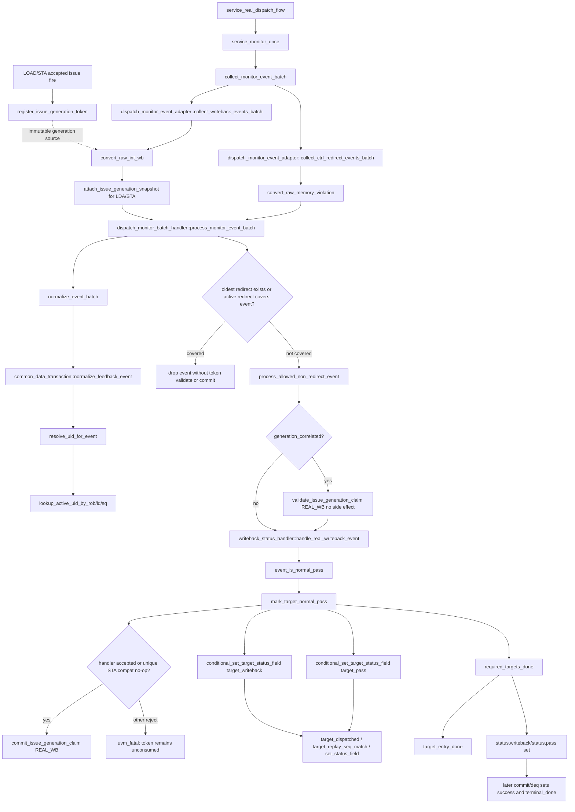

# Normal Pass Flow

本文按 `AI_DOC/project_management/mem_ut_flow_document_rule.md` 整理 mem_ut 中 writeback 之后的 normal pass 后续处理。normal pass 的核心结论是：**它只在 writeback status 路径中更新 status，不进入 `push_feedback_event()`，也不进入 `exception_event_q` / `process_pending_events()` recovery 路径。**

V2 LOAD/STA normal pass 在进入该原状态机前使用已有 active map/current status 完成
key 与 current issue snapshot 反查；本轮 IQ 专项不新增 issue-generation token、claim 或
tombstone。STA IQ hit 只设置 `sta_issue_feedback_success`，真实 STA writeback 才能推进
target pass。IQ 专项的 raw、同拍排序和 deferred ctrl 细节见
[`iq_feedback_replay_v2_flow.md`](iq_feedback_replay_v2_flow.md)。STD 继续 ROB value-only
双 probe。

本文较早章节中的 token/claim 调用图属于前置设计记录，不能作为当前 V2 源码调用链。

## 1. 函数调用 Flow 图

> 下方早期图包含尚未落地的 token/claim 节点，仅保留用于历史方案追溯。当前源码的 IQ/WB
> 顺序与状态反查以 [`iq_feedback_replay_v2_flow.md`](iq_feedback_replay_v2_flow.md) 为准。



## 1.1 函数调用 Flow 图整体文字伪代码

```text
Normal Pass 主流程：

1. service 主循环：
   service_real_dispatch_flow 每个 service clock 调用 service_monitor_once；
   service_monitor_once 先同步 runtime context，再收集 monitor batch，最后消费 recovery queue。

2. raw writeback 转换：
   LOAD/STA accepted fire用同一个issue_epoch写status snapshot并注册不可变token；
   collect_writeback_events_batch 从 raw int writeback queue 出队；
   LDA/STA monitor在DUT valid采样块内，把真实payload与`sample_flush_epoch`、`cycle`
   同拍冻结；adapter只消费raw快照，不得在出队时回填current epoch；
   convert_raw_int_wb按V2 source kind/port建立LOAD/STA/STD target；
   LDA/STA使用真实完整ROB key，经active ROB map/open token附uid和generation；
   STD只对ROB value固定probe两个flag key并从唯一uid补SQ，不调用token；
   exception_vec==0 的真实 writeback 保留为 normal pass 候选。

3. batch 仲裁和规范化：
   process_monitor_event_batch 调用 normalize_event_batch；
   correlated LOAD/STA已经带token snapshot，normalize只校验并禁止status fallback；
   如果active redirect或同批oldest redirect覆盖该pass，drop且不validate/commit；
   如果未覆盖，process_allowed_non_redirect_event先只读validate REAL_WB资格，再调用
   原handler；handler成功或命中唯一允许的STA compat no-op后才commit。

4. pass 状态落表：
   handle_real_writeback_event 判断 event_is_normal_pass；
   mark_target_normal_pass 先设置 target writeback，再设置 target pass；
   required_targets_done 为真且 uid 没有 fault/replay/redirect pending 时，设置 status.writeback/status.pass；
   LOAD在handler成功后commit并关闭唯一token；STA real-WB在handler成功后commit，若IQ
   pending仍在则token保持open，
   terminal/deq前必须等待required IQ或按明确optional策略关闭；
   normal pass 不调用 push_feedback_event，也不会进入 exception_event_q。
```


## 2. `service_real_dispatch_flow()`

源码位置：`mem_ut/ver/ut/memblock/seq/base_seq/memblock_main_dispatch_auto_build_main_table_base_sequence.sv`

V2 coding后目标逻辑摘要：

```systemverilog
forever begin
    @(negedge service_vif.clk);
    if (all_transactions_terminal_done()) break;
    service_monitor_once();
    route_all_issue_queues();
    if (all_transactions_terminal_done()) break;
end
```

功能解释：

这是真实 dispatch smoke sequence 的主服务循环。writeback 后的 normal pass 不是独立线程处理，而是在每拍 `service_monitor_once()` 中被 monitor batch 消费并落表。随后 `route_all_issue_queues()` 继续处理 replay/redirect 后可能需要重新发射的项；normal pass 自身通常不会触发重新 route。

输入/输出：

- 输入：DUT monitor raw queue、当前 status 表、issue queue。
- 输出：调用 monitor/recovery/route 三类服务，让 status 逐步走向 terminal_done；normal pass 最终会在 commit/deq 收敛后置 `success=1 && terminal_done=1`。

文字伪代码：

```text
每个 service cycle 等待时钟负边沿；
如果所有 transaction 已 terminal_done，退出；
调用 service_monitor_once：采集 writeback/IQ feedback/redirect 等 monitor 事件并处理；
调用 route_all_issue_queues：对需要发射或重发的 transaction 入 issue queue/发射；
再次检查 all_transactions_terminal_done，完成后退出。
```

内部子调用：

- `all_transactions_terminal_done()`：请求公共 data 基于 `terminal_done_uid` 判断全表是否进入终态，不要求每个 uid 都是 `success=1`。
- `service_monitor_once()`：当前文档的主要入口，采集 writeback 事件并处理 normal pass。
- `route_all_issue_queues()`：normal pass 不直接使用它，但 replay/redirect 后续会用它重新 route。

## 3. `service_monitor_once()`

源码位置：`mem_ut/ver/ut/memblock/seq/base_seq/memblock_main_dispatch_auto_build_main_table_base_sequence.sv`

V2 coding后目标逻辑摘要：

```systemverilog
memblock_sync_pkg::tick_dispatch_service_cycle();
collect_runtime_context_events();
collect_monitor_event_batch();
exception_redirect_replay_task();
```

功能解释：

这是每拍 monitor/recovery 的统一入口。normal pass 的处理发生在 `collect_monitor_event_batch()` 内部；它不会进入最后的 `exception_redirect_replay_task()`，因为 normal pass 不调用 `push_feedback_event()`。

输入/输出：

- 输入：raw monitor queue、CSR latest snapshot、sfence/hfence FIFO、exception event queue。
- 输出：status 表更新；redirect/replay/fault 可能进入 recovery queue。

文字伪代码：

```text
递增 dispatch service cycle，给事件处理和 timeout 使用统一周期；
调用 collect_runtime_context_events：同步 CSR runtime/sfence 等上下文，不直接决定 normal pass；
调用 collect_monitor_event_batch：同一 service cycle 内先收集 raw IQ feedback、再收集 int writeback，
随后暂存 ctrl并把 memoryViolation redirect加入同一个 semantic batch；
batch handler 对这个统一 batch 做 normalize 和 redirect-first 仲裁，未被 redirect 覆盖的 pass 才能落表；
semantic batch完成后按FIFO应用deferred ctrl，释放DUT已deq的LQ/SQ mapping；
调用 exception_redirect_replay_task：只消费 redirect/replay/fault 的 exception_event_q，normal pass 不在这个队列里。
```

内部子调用：

- `collect_runtime_context_events()`：先 drain CSR latest snapshot，再 drain sfence/hfence FIFO；normal pass 路径只需要它保证 runtime 上下文已同步。
- `collect_monitor_event_batch()`：先调用带`sample_cycle`参数的
  `collect_writeback_events_batch()`，再调用带`deferred_ctrl`参数的
  `collect_ctrl_redirect_events_batch()`，最后执行`process_monitor_event_batch()`并应用deferred
  ctrl；normal pass和同拍redirect在这里进入同一个semantic batch。
- `exception_redirect_replay_task()`：消费 `push_feedback_event()` 入队的 recovery event；normal pass 不进入。

## 4. `collect_writeback_events_batch()` / `convert_raw_int_wb()`

源码位置：`mem_ut/ver/ut/memblock/seq/base_seq_help/dispatch_monitor_event_adapter.sv`

真实逻辑摘要：

```systemverilog
while (memblock_sync_pkg::pop_raw_int_wb(raw_int_wb)) begin
    if (convert_raw_int_wb(raw_int_wb, wb_event)) begin
        events.push_back(wb_event);
    end
end

case (raw.source_kind)
    LDA, STA: begin
        has_rob = raw_rob_to_key(...);
        if (!attach_issue_generation_snapshot(...REAL_WB...)) return 0;
        if (raw.replay_inst) return make_backend_replay_event(...);
        real_wb_valid = 1'b1;
    end
    STD: begin
        normalize_std_rob_value_only(...);
        real_wb_valid = 1'b1;
    end
endcase
wb_event.has_exception = raw.exception_vec != '0;
```

功能解释：

adapter按V2 split port事实构造event，不判断最终pass/fault动作。LDA/STA在
`real_wb_valid`置位前必须通过active ROB map和open token附generation；LDA
`replayInst=1`改成backend replay，不是normal pass。STD只有ROB value，固定双probe
恢复唯一uid/完整ROB/SQ且不建token。`exception_vec==0`且其它non-normal metadata为0
的真实writeback才是normal pass候选。

输入/输出：

- 输入：`memblock_sync_pkg::dispatch_raw_int_wb_t`。
- 输出：LDA/STA correlated event或STD value-only归一化event，push到本拍batch。
- 副作用：adapter attach不消费token、不写status；当前必需event无法唯一恢复时fatal，
  stale tombstone/旧event有原因drop。

文字伪代码：

```text
循环 pop raw int writeback；
调用 convert_raw_int_wb：创建空 wb_event，检查 raw.valid；
根据source_kind和kind内port_id判断LOAD/STA/STD；
LDA/STA只复制真实ROB key并调用attach_issue_generation_snapshot；
  active ROB map解析uid，open token校验target/pipe/key/epoch/cycle/pending；
  CURRENT时附issue_epoch/replay_seq但不消费；stale有原因drop，当前错误fatal；
STD对ROB value做两个完整flag key probe，唯一命中后从status补SQ，不调用token；
全部身份/non-normal metadata检查通过后才设置real_wb_valid=1；
设置 has_exception = exception_vec != 0；
如果port/metadata不支持则fatal；否则把wb_event放入本轮batch。
```

内部子调用：

- `make_wb_event_base()`：从 common data 创建全 0/invalid 的标准 event。
- `raw_rob_to_key()`：转换LDA/STA真实完整ROB key。
- `attach_issue_generation_snapshot()`：附accepted fire snapshot，不消费token。
- `normalize_std_rob_value_only()`：STD固定双flag probe，不扫描active window。

## 5. `process_monitor_event_batch()`

源码位置：`mem_ut/ver/ut/memblock/seq/base_seq_help/dispatch_monitor_batch_handler.sv`

真实逻辑摘要：

```systemverilog
if (!normalize_event_batch(events, normalized_events)) return;

if (data.active_redirect.valid) begin
    foreach (normalized_events[idx]) begin
        if (event_covered_by_redirect(normalized_events[idx], data.active_redirect)) continue;
        if (event_is_redirect(normalized_events[idx])) data.push_feedback_event(normalized_events[idx]);
        else void'(process_allowed_non_redirect_event(normalized_events[idx]));
    end
    return;
end

if (select_oldest_redirect(normalized_events, selected_redirect_event)) begin
    selected_redirect = redirect_from_event(selected_redirect_event);
    data.push_feedback_event(selected_redirect_event);
    foreach (normalized_events[idx]) begin
        if (same_redirect_event(...)) continue;
        if (event_covered_by_redirect(...)) continue;
        if (event_is_redirect(...)) data.push_feedback_event(...);
        else void'(process_allowed_non_redirect_event(...));
    end
    return;
end

foreach (normalized_events[idx]) begin
    void'(process_allowed_non_redirect_event(normalized_events[idx]));
end
```

功能解释：

batch handler是normal pass落表前的仲裁门。它先normalize所有event，再处理active
redirect和同批redirect-first。correlated event的attach不消费token；只有未被redirect
覆盖的real writeback进入`process_allowed_non_redirect_event()`后才只读validate
REAL_WB资格并由handler写pass；handler接受后才commit。covered event drop且不
validate/commit，redirect apply后按REDIRECT reason关闭
被覆盖uid token。

输入/输出：

- 输入：adapter 收集的 `events[$]`。
- 输出：normal pass/fault/replay/redirect 分别进入对应 handler；被 redirect 覆盖的 event drop。

文字伪代码：

```text
调用normalize_event_batch：correlated LOAD/STA校验token snapshot并禁止status
fallback；非correlated event按原规则解析；
如果已有 active_redirect：
  调用 event_covered_by_redirect：用 rob_order_util::rob_need_flush 判断 event 是否属于当前 redirect flush 范围；
  被覆盖则drop且不validate/commit；未覆盖redirect继续push_feedback_event；未覆盖
  non-redirect调用process_allowed_non_redirect_event并按需要validate、handler、commit；
如果没有 active_redirect 但本 batch 有 redirect：
  调用 select_oldest_redirect：遍历 batch，用 event_is_redirect 过滤 redirect，再用 redirect_event_is_older 比较 ROB 顺序；
  调用 data.push_feedback_event：把 oldest redirect 放入 recovery queue；
  同 batch 里 same_redirect_event 的当前 redirect 自身跳过；
  调用event_covered_by_redirect：covered pass/fault/replay直接drop且不validate/commit；
  未覆盖事件继续按类型处理；
如果本 batch 没有 redirect：
  所有 normalized non-redirect event 调用 process_allowed_non_redirect_event。
```

内部子调用：

- `normalize_event_batch()`：调用 `data.normalize_feedback_event()`，是 raw event 到可落表 event 的最后标准化。
- `select_oldest_redirect()`：选择同批最老 redirect，保证 redirect 优先级高于同批 pass/fault/replay。
- `event_covered_by_redirect()`：用 ROB 顺序判断 event 是否应被 redirect flush 覆盖。
- `process_allowed_non_redirect_event()`：把 LOAD/STORE writeback 交给 `handle_real_writeback_event()`。

## 6. `process_allowed_non_redirect_event()`

源码位置：`mem_ut/ver/ut/memblock/seq/base_seq_help/dispatch_monitor_batch_handler.sv`

真实逻辑摘要：

```systemverilog
memblock_issue_generation_claim_ctx_t claim_ctx;
bit handler_accepted = 1'b0;
bit allowed_compat_noop = 1'b0;

if (wb_event.generation_correlated) begin
    claim_ctx = data.validate_issue_generation_claim(wb_event);
    pre_facts = '{target_epoch, replay_seq, sta_pass, sta_writeback,
                  fault, replay, redirect};
end
case (wb_event.source)
    MEMBLOCK_WB_EVENT_SOURCE_LOAD_WB,
    MEMBLOCK_WB_EVENT_SOURCE_STORE_WB:
        handler_accepted = writeback_handler.handle_real_writeback_event(wb_event);
    MEMBLOCK_WB_EVENT_SOURCE_STA_FEEDBACK,
    MEMBLOCK_WB_EVENT_SOURCE_STD_FEEDBACK:
        handler_accepted = writeback_handler.handle_issue_feedback_event(wb_event);
    default:
        if (event_is_replay(wb_event) || event_has_fault(wb_event)) begin
            data.push_feedback_event(wb_event);
            handler_accepted = 1'b1;
        end
endcase
if (wb_event.generation_correlated) begin
    post_facts = '{target_epoch, replay_seq, sta_pass, sta_writeback,
                   fault, replay, redirect};
    allowed_compat_noop = !handler_accepted &&
        wb_event.target == MEMBLOCK_ISSUE_TARGET_STA &&
        ((wb_event.generation_event_kind == MEMBLOCK_ISSUE_EVENT_KIND_IQ_FEEDBACK &&
          claim_ctx.real_wb_seen_before) ||
         (wb_event.generation_event_kind == MEMBLOCK_ISSUE_EVENT_KIND_REAL_WB &&
          claim_ctx.iq_seen_before)) &&
        !event_has_fault(wb_event) && !event_is_replay(wb_event) &&
        ((wb_event.generation_event_kind == MEMBLOCK_ISSUE_EVENT_KIND_IQ_FEEDBACK &&
          wb_event.iq_feedback_hit) ||
         (wb_event.generation_event_kind == MEMBLOCK_ISSUE_EVENT_KIND_REAL_WB &&
          event_is_normal_pass(wb_event))) &&
        !target_real_wb_pass_enabled(MEMBLOCK_ISSUE_TARGET_STA) &&
        pre_facts.sta_pass && pre_facts.sta_writeback &&
        post_facts == pre_facts;
    if (!handler_accepted && !allowed_compat_noop) begin
        `uvm_fatal(...)
        return 1'b0;
    end
    data.commit_issue_generation_claim(
        wb_event, claim_ctx, handler_accepted || allowed_compat_noop);
end
return handler_accepted || allowed_compat_noop;
```

功能解释：

这是batch放行后的非redirect分派口。V2 correlated LOAD/STA先只读validate REAL_WB
资格，再从`LOAD_WB/STORE_WB`进入原handler。LOAD/STA的pending只在handler成功，或
命中唯一允许的STA same-generation distinct-channel compat no-op后commit。本函数不会
为normal pass调用
`push_feedback_event()`。

输入/输出：

- 输入：已 normalize 且未被 redirect 覆盖的 non-redirect event。
- 输出：调用 writeback handler 更新 status，或对特殊 replay/fault 入 recovery queue。

文字伪代码：

```text
如果 event 仍是 redirect，fatal，因为本函数只处理 non-redirect；
如果generation_correlated=1：
  调用validate_issue_generation_claim并校验event snapshot/kind/key/pipe与open token一致；
  生成局部claim_ctx并采样target epoch/replay_seq/pass/writeback/fault/replay/redirect等
  pre-handler标量事实；validate不修改token/status/tombstone；
如果 source 是 LOAD_WB/STORE_WB：
  调用 handle_real_writeback_event：处理真实 writeback 的 pass/fault；
如果 source 是 STA/STD_FEEDBACK：
  调用 handle_issue_feedback_event：处理 IQ feedback hit/replay；
如果 source 不属于上述类别但带 replay/fault：
  调用 push_feedback_event：进入 recovery queue；
记录原handler是否成功；
若handler拒绝，只允许以下compat no-op：STA同uid/target/issue_epoch/replay_seq的另一
distinct kind已seen，当前是无fault/replay的normal STA WB，
target_real_wb_pass_enabled(STA)=0，pre状态已sta_pass=1且sta_writeback=1，post状态无
异常变化；LOAD、fault、replay、generation错配及其它拒绝均fatal并保持token未消费；
handler成功或命中该唯一no-op后调用commit_issue_generation_claim：
  重读token并核对claim_ctx before-image；
  LOAD清唯一real-WB pending并close ALL_CONSUMED；
  STA清real-WB pending，IQ未到则保持open，IQ已到则close ALL_CONSUMED；
否则非correlated unclassified event沿用原drop策略。
```

内部子调用：

- `writeback_handler.handle_real_writeback_event()`：normal pass 的直接入口。
- `writeback_handler.handle_issue_feedback_event()`：IQ feedback hit/replay 入口；normal real writeback 不走这里。

## 7. `handle_real_writeback_event()`

源码位置：`mem_ut/ver/ut/memblock/seq/base_seq_help/writeback_status_handler.sv:79`

真实逻辑摘要：

```systemverilog
if (!event_is_real_writeback(wb_event) && !event_has_fault(wb_event)) return 1'b0;
uid = wb_event.uid;
issue_epoch = wb_event.issue_epoch;
replay_seq = wb_event.replay_seq;
if (event_has_fault(wb_event)) begin
    if (!data.mark_target_fault(...)) return 1'b0;
    data.push_feedback_event(wb_event);
    return 1'b1;
end
if (event_is_normal_pass(wb_event)) begin
    if (!data.mark_target_normal_pass(...)) return 1'b0;
    return 1'b1;
end
return 1'b0;
```

功能解释：

该函数是真实writeback pass/fault分界点。V2 correlated LOAD/STA进入前只完成REAL_WB
claim资格validate，token尚未消费；本函数只复用原状态机。`exception_vec!=0`走fault；
`exception_vec==0`且非redirect/replay的真实writeback走normal pass，只调用
`mark_target_normal_pass()`。外层只在本函数成功后commit；STA WB先到时token仍等待IQ。
token required pending检查在terminal/deq释放active map前执行，不改变本函数pass定义。

输入/输出：

- 输入：batch 放行后的 normalized real writeback event。
- 输出：normal pass 更新 target writeback/pass；fault 更新 fault 并进入 recovery queue。

文字伪代码：

```text
如果不是真实 writeback 且也没有 fault，返回 0；
取 uid、issue_epoch、replay_seq 快照；
V2 correlated LOAD/STA要求REAL_WB kind已通过只读validate，尚未commit；
调用 event_has_fault：检查 has_exception 或 exception_vec；
如果是 fault：
  调用 mark_target_fault：写 target writeback/fault，并设置 uid fault/exception_pending；
  成功后调用 push_feedback_event：fault 事件进入 recovery queue；
  返回 1；
调用 event_is_normal_pass：确认 real_wb_valid=1，且不是 redirect/replay/fault；
如果是 normal pass：
  调用 mark_target_normal_pass：更新 target writeback/pass，并在 required target 完成后置 uid 总体 writeback/pass；
  不调用 push_feedback_event，不进入 exception_event_q；
  返回 1；
其它组合返回 0。
```

内部子调用：

- `event_has_fault()`：判断 `has_exception || exception_vec != 0`。
- `event_is_normal_pass()`：要求 real writeback 且不是 redirect/replay/fault。
- `data.mark_target_fault()`：fault 唯一落表点。
- `data.mark_target_normal_pass()`：normal pass 唯一落表点。

## 8. `event_is_normal_pass()`

源码位置：`mem_ut/ver/ut/memblock/seq/base_seq_help/writeback_status_handler.sv`

真实逻辑摘要：

```systemverilog
return event_is_real_writeback(wb_event) &&
       !event_is_redirect(wb_event) &&
       !event_is_replay(wb_event) &&
       !event_has_fault(wb_event);
```

功能解释：

normal pass 是一个严格语义：必须来自真实 writeback，不能是 redirect、replay 或 fault。IQ feedback hit 不设置 `real_wb_valid`，因此不会被误当成真实 writeback normal pass。

输入/输出：

- 输入：`memblock_wb_event_t`。
- 输出：1 表示可进入 `mark_target_normal_pass()`。

文字伪代码：

```text
调用 event_is_real_writeback：确认来自真实 int writeback 端口；
调用 event_is_redirect：如果是 redirect，不能当 pass；
调用 event_is_replay：如果是 replay，不能当 pass；
调用 event_has_fault：如果 exception_vec 非 0，不能当 pass；
四个条件满足后返回 true。
```

内部子调用：

- `event_is_redirect()`：同时检查 `redirect_valid` 和 `redirect.valid` 一致性。
- `event_is_replay()`：读取 `replay_valid`。
- `event_has_fault()`：读取 `has_exception/exception_vec`。

## 9. `mark_target_normal_pass()`

源码位置：`mem_ut/ver/ut/memblock/seq/base_seq_help/common_data_transaction.sv:551`

真实逻辑摘要：

```systemverilog
status = get_status(uid);
if (status.fault || status.exception_pending || status.redirect_pending ||
    target_entry_done(status, target)) return 1'b0;
if (status.replay_pending && replay_target_requested(status, target)) return 1'b0;

if (!conditional_set_target_status_field(uid, target_writeback_field(target), 1'b1, target, issue_epoch, replay_seq)) return 1'b0;
if (!conditional_set_target_status_field(uid, target_pass_field(target), 1'b1, target, issue_epoch, replay_seq)) return 1'b0;

status.last_event_cycle = cycle;
if (required_targets_done(uid) && !status.fault && !status.exception_pending &&
    !status.replay_pending && !status.redirect_pending) begin
    status.writeback = 1'b1;
    status.pass      = 1'b1;
end
```

功能解释：

这是 normal pass 的最终落表函数。它先过滤已经 fault/exception/redirect 的 uid，避免 pass 覆盖 recovery 状态；再通过 issue_epoch/replay_seq 检查避免旧 writeback 写入新动态实例。只有该 uid 所需 target 全完成时，才置总体 `writeback/pass`。

注意：`mark_target_normal_pass()` 是状态写入 helper，不只被真实 writeback normal pass 调用。`handle_issue_feedback_event()` 在 IQ feedback hit 且 `target_real_wb_pass_enabled()` 关闭时，也会把 feedback hit 当作兼容 pass 调用该函数。本文主场景只讨论 `handle_real_writeback_event()` 中真实 writeback normal pass；IQ feedback 兼容 pass 不进入 `push_feedback_event()`，但属于 replay/feedback 兼容闭环，不是本场景的真实 writeback pass。

输入/输出：

- 输入：uid、target、issue_epoch、replay_seq、cycle。
- 输出：target 级 `*_writeback/*_pass`，必要时 uid 级 `writeback/pass`。

文字伪代码：

```text
调用 get_status：读取 uid 当前状态；
如果 status.fault/exception_pending/redirect_pending 为 1，拒绝 normal pass；
调用 target_entry_done：如果该 target 已 pass 或 fault，拒绝重复写入；
如果 replay_pending 且 replay_target_requested(status,target) 为真，说明当前 target 正在等待 replay，拒绝旧 pass；
调用 conditional_set_target_status_field 写 target_writeback_field：该 helper 会检查 active、issue_killed、target_dispatched、issue_epoch 和 replay_seq，再调用 set_status_field 写状态；
调用 conditional_set_target_status_field 写 target_pass_field：用同样防护写 target pass；
更新 last_event_cycle；
调用 required_targets_done：根据主表 fuType 判断 load 只需 LOAD target，store/MOU 需要 STA 和 STD target 都完成；
如果 required target 都完成，且没有 fault/exception/replay/redirect pending，则置 status.writeback=1、status.pass=1。
如果调用方来自 IQ feedback hit 兼容路径，上述状态写入逻辑相同，但事件来源不是 real writeback；该分支由 `handle_issue_feedback_event()` 的 `target_real_wb_pass_enabled()==0` 触发。
```

内部子调用：

- `target_entry_done()`：判断 target 已经 pass 或 fault，防止重复完成。
- `replay_target_requested()`：判断 replay_pending 是否针对当前 target。
- `target_writeback_field()` / `target_pass_field()`：把 LOAD/STA/STD target 映射到状态字段。
- `conditional_set_target_status_field()`：带 epoch/replay 防护的状态写入口。
- `required_targets_done()`：判断该 uop 所需 target 是否全部完成。

## 10. `conditional_set_target_status_field()`

源码位置：`mem_ut/ver/ut/memblock/seq/base_seq_help/common_data_transaction.sv:530`

真实逻辑摘要：

```systemverilog
status = get_status(uid);
if (!status.active || status.issue_killed || !target_dispatched(status, target)) return 1'b0;
if (status.get_target_issue_epoch(target) != issue_epoch ||
    !target_replay_seq_match(status, target, replay_seq)) return 1'b0;
set_status_field(uid, field, value);
return 1'b1;
```

功能解释：

这是 target 状态写入的统一防护层。normal pass 的 writeback/pass 两次写入都必须通过它，保证迟到旧 event 不会污染 redirect/replay 后的新状态。

输入/输出：

- 输入：uid、field、value、target、issue_epoch、replay_seq。
- 输出：成功时调用 `set_status_field()` 更新状态。

文字伪代码：

```text
调用 get_status：读取 uid status；
如果 uid 非 active、issue_killed 或 target 没有 dispatched，拒绝写入；
调用 status.get_target_issue_epoch：确认 event 对应当前 target 的发射 epoch；
调用 target_replay_seq_match：确认 replay 轮次匹配；其中 LOAD/STA 需要匹配，STD 当前不因 replay_seq 阻塞；
调用 set_status_field：写入目标状态字段；
返回写入成功。
```

内部子调用：

- `target_dispatched()`：检查 LOAD/STA/STD 是否已发射。
- `target_replay_seq_match()`：过滤 replay 前后的旧 event。
- `set_status_field()`：实际写 status 字段；写 `success` 只记录正常通过结果；写 `terminal_done` 才会推进 `terminal_done_uid` 前缀。

## 11. `required_targets_done()`

源码位置：`mem_ut/ver/ut/memblock/seq/base_seq_help/common_data_transaction.sv`

真实逻辑摘要：

```systemverilog
if (main_tr.fuType == MEMBLOCK_FUTYPE_LDU) begin
    return target_entry_done(status, MEMBLOCK_ISSUE_TARGET_LOAD);
end
if (main_tr.fuType == MEMBLOCK_FUTYPE_STU || main_tr.fuType == MEMBLOCK_FUTYPE_MOU) begin
    return target_entry_done(status, MEMBLOCK_ISSUE_TARGET_STA) &&
           target_entry_done(status, MEMBLOCK_ISSUE_TARGET_STD);
end
```

功能解释：

它决定 uid 级 `writeback/pass` 什么时候能置高。load 只需要 LOAD target 完成；store/MOU 需要 STA 和 STD 都完成，所以单侧 normal pass 只会置 target pass，不一定置 uid 总体 pass。

输入/输出：

- 输入：uid。
- 输出：1 表示该 uid 所需 target 全部完成。

文字伪代码：

```text
读取 main transaction 和 status；
如果 fuType 是 LDU：调用 target_entry_done(LOAD) 判断 load target 已 pass 或 fault；
如果 fuType 是 STU/MOU：分别调用 target_entry_done(STA) 和 target_entry_done(STD)，两者都完成才返回 true；
其它 fuType fatal，说明主表生成或 flow 分类不合法。
```

内部子调用：

- `get_main_transaction()`：获取主表，读取 fuType。
- `target_entry_done()`：target 级完成判定。

## 11.1 normal-pass generation 生命周期

```text
fire：LOAD token初始化real-WB pending；STA token初始化IQ+real-WB pending；STD无token；

attach/claim：adapter按active ROB map匹配open token并附snapshot但不消费；
redirect-first放行后只读validate REAL_WB，原handler成功/唯一STA compat no-op后commit；
covered pass不validate/commit；

LOAD normal：原handler先标pass，成功返回后commit唯一pending并close ALL_CONSUMED；

STA双顺序：WB先到时handler成功后commit WB、token等待IQ；IQ hit先到时handler成功或
唯一compat no-op后commit IQ、token等待WB；
两个channel都完成后close。STA miss取消WB，因此同generation迟到WB按tombstone drop；

redirect/flush：只关闭被覆盖uid token，且在active key map删除前close REDIRECT；
未覆盖老token保持open；

reissue：新accepted fire注册新issue_epoch/replay_seq token；旧token/tombstone不能给
新result提供generation；

terminal/deq：active map释放前required token pending仍存在时fatal；只有明确optional
pending可按TERMINAL/LSQ_DEQ关闭。required_targets_done、commit/deq和terminal定义不改；

reset/stale：reset清raw后清token/tombstone；future/current无token/duplicate/key-pipe
错配fatal；旧epoch、早于fire或tombstone命中按reason info/drop。
```

## 12. 端到端行为总结

```text
真实 int writeback normal pass：
  LOAD/STA accepted fire -> register token
  -> raw int writeback exception_vec=0
  -> collect_writeback_events_batch
  -> convert_raw_int_wb / attach LOAD/STA token snapshot
  -> process_monitor_event_batch
  -> normalize_event_batch保留immutable generation
  -> redirect-first 仲裁确认未被 active/oldest redirect 覆盖
  -> process_allowed_non_redirect_event
  -> validate REAL_WB claim资格，无副作用
  -> handle_real_writeback_event
  -> event_is_normal_pass
  -> mark_target_normal_pass
  -> conditional_set_target_status_field(target_writeback)
  -> conditional_set_target_status_field(target_pass)
  -> required_targets_done
  -> target 未全完成：只置 target pass/writeback
  -> target 全完成且无 fault/replay/redirect pending：置 uid writeback/pass
  -> handler成功返回
  -> commit REAL_WB claim；LOAD close，STA按IQ pending保持open或close
  -> 不调用 push_feedback_event，不进入 exception_event_q，不进入 process_pending_events

STD normal pass：
  raw STD ROB value
  -> 固定probe两个ROB flag key并要求唯一active STD uid
  -> 从status补完整ROB/SQ，不调用generation token
  -> 后续复用同一batch/handler normal pass状态机

store 单侧 pass：
  STA 或 STD raw int writeback pass
  -> mark_target_normal_pass
  -> required_targets_done 检查 STA 和 STD
  -> 如果另一侧未完成，只更新当前 target；等待另一侧 pass 后再置 uid writeback/pass

redirect 同批覆盖 pass：
  raw int writeback pass 与 older redirect 同 batch
  -> process_monitor_event_batch 选择 oldest redirect
  -> event_covered_by_redirect 为 true
  -> pass event drop且不validate/commit token
  -> 不调用 mark_target_normal_pass，不进入 push_feedback_event
```

端到端文字伪代码描述：

```text
真实 int writeback normal pass：
  accepted LOAD/STA fire先注册不可变token；
  monitor采到exception_vec=0时，adapter按真实ROB匹配token并附generation，不直接改状态；
  batch handler normalize只校验correlated snapshot，不从当前status补；
  batch handler 再做 active redirect 和同批 oldest redirect 覆盖检查，只有未被覆盖的 writeback 才允许落表；
  未覆盖时先validate REAL_WB claim资格且不修改token，再调用handle_real_writeback_event；
  handle_real_writeback_event 判断这是 real_wb_valid 且无 redirect/replay/fault 的 normal pass；
  mark_target_normal_pass 先用 issue_epoch/replay_seq 过滤旧事件，再写 target_writeback 和 target_pass；
  required_targets_done 用 fuType 判断该 uid 所需 target 是否全部完成；
  如果 target 还没全完成，只保留 target 级 pass/writeback；
  如果所有 target 完成且没有 fault/replay/redirect pending，置 uid 级 writeback/pass；
  handler成功返回后外层commit REAL_WB；LOAD关闭token，STA按IQ pending保持open或关闭；
  因为 normal pass 不需要 recovery，所以不进入 push_feedback_event，也不会进入 exception_event_q。

store 单侧 pass：
  当STA real-WB先完成时先validate，原handler成功后commit STA WB pending；若IQ未到，
  token保持open；STD不建token；
  mark_target_normal_pass只更新该target；
  required_targets_done 发现 store 另一侧 target 还没 pass/fault，uid 级 writeback/pass 不置位；
  等另一侧 target 后续也完成，再由第二次 mark_target_normal_pass 置 uid 级完成状态。

redirect 同批覆盖 pass：
  当同 batch 中存在 older redirect，batch handler 先选 oldest redirect；
  event_covered_by_redirect 判断该 pass 的 ROB 在 flush 范围内；
  如果被覆盖，说明该pass属于旧动态实例，直接drop且不validate/commit token；redirect apply在
  active map删除前close被覆盖token；
  drop 后不会调用 mark_target_normal_pass，也不会把 pass event 放进 recovery queue。
```
