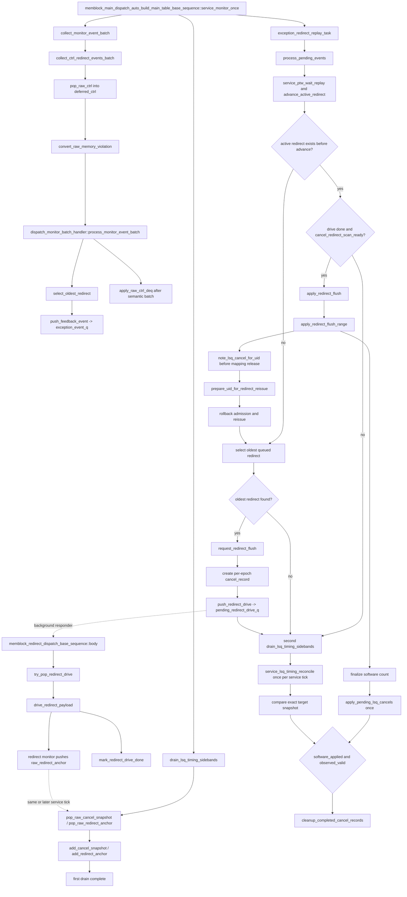

# Redirect 与 LSQ Cancel Reconcile Flow

本文描述当前 V2 memblock 测试框架从 DUT `memoryViolation` 产生 redirect，到真实驱动
`io_redirect_*`、清理旧动态实例、回退软件 LSQ reservation，并把软件 cancel 数量与 DUT
`lqCancelCnt/sqCancelCnt` 逐 redirect epoch 对账的完整调用链。

权威源码：

- `mem_ut/ver/ut/memblock/seq/base_seq_help/dispatch_monitor_event_adapter.sv`
- `mem_ut/ver/ut/memblock/seq/base_seq_help/dispatch_monitor_batch_handler.sv`
- `mem_ut/ver/ut/memblock/seq/base_seq_help/exception_redirect_replay_handler.sv`
- `mem_ut/ver/ut/memblock/seq/base_seq_help/common_data_transaction.sv`
- `mem_ut/ver/ut/memblock/seq/base_seq/memblock_redirect_dispatch_base_sequence.sv`
- `mem_ut/ver/ut/memblock/seq/base_seq/memblock_lsqenq_dispatch_base_sequence.sv`
- `mem_ut/ver/ut/memblock/agent/redirect_agent_agent/src/redirect_agent_agent_monitor.sv`
- `mem_ut/ver/ut/memblock/agent/io_mem_to_ooo_ctrl_agent_agent/src/io_mem_to_ooo_ctrl_agent_agent_monitor.sv`
- `mem_ut/ver/ut/memblock/common/memblock_common/src/memblock_sync_pkg.sv`

IQ feedback/replay 的专项边界见
[`iq_feedback_replay_v2_flow.md`](iq_feedback_replay_v2_flow.md)。

## 1. Flow 边界与术语

### 1.1 术语与抽象功能说明

| 英文术语 | 当前 flow 中的中文含义 | 代码对象/状态落点 | 示例 |
|---|---|---|---|
| `semantic batch` | 同一采样拍的 writeback、IQ feedback 和 memoryViolation 统一仲裁集合 | `collect_monitor_event_batch()`、`dispatch_monitor_batch_handler` | redirect-first 决定同批 normal event 是否允许落状态 |
| `redirect epoch` | 每次 `request_redirect_flush()` 递增的恢复代次 | `memblock_sync_pkg::dispatch_flush_epoch` | 被 flush uid 的 software cancel 归入该 epoch |
| `reservation token` | 某 uid 一次真实 LSQ launch 的动态实例凭证 | `lsq_reservation_launch_epoch`、`lsq_reservation_sample_seq` | redirect scan 只统计已成为 `DUT_VISIBLE` 的 mapping |
| `DUT sample sequence` | 多个 monitor/sequence 对同一仿真采样时刻共享的单调序号 | `get_dut_sample_seq($time)` | reservation、redirect anchor 和 cancel snapshot 使用同一时序坐标 |
| `redirect anchor` | `io_redirect_*` 真正被 monitor 采样到的 payload 和 sample 序号 | `dispatch_raw_redirect_anchor_t`、`raw_redirect_anchor_q` | 只锚定时序，不形成第二个 recovery event |
| `cancel snapshot` | ctrl monitor 每个 sample 保存的 `lqCancelCnt/sqCancelCnt` 电平 | `dispatch_raw_cancel_snapshot_t`、`raw_cancel_snapshot_q` | 两个 count 都为 0 时也必须保存 |
| `cancel record` | 一个 redirect epoch 的 software cancel、资源回退和 DUT observed 对账生命周期 | `memblock_lsq_cancel_record_t`、`cancel_record_q` | `software_applied` 与 `observed_valid` 都成立后才删除 |
| `active mapping` | 当前动态实例拥有的 ROB/LQ/SQ key 到 uid 映射 | `uid_by_active_rob`、`uid_by_lq`、`uid_by_sq` | redirect scan 在清 map 前登记 software cancel |
| `observed cancel` | DUT 在目标 sample 输出的 cancel 数量 | `observed_cancel_lq_count/sq_count` | 只核对，不再次调用 `cancel_lq/cancel_sq` |

本 flow 的 recovery 来源仍是 DUT output `memoryViolation`。redirect agent monitor 采样的是测试框架
已经驱动到 DUT input 的 `io_redirect_*`，它只产生独立 timing anchor，不能再次进入
`exception_event_q`。

### 1.2 职责边界

- `dispatch_monitor_batch_handler`：拥有同一 semantic batch 的 redirect-first 仲裁。
- `exception_redirect_replay_handler`：拥有 active redirect 的建立与推进。
- `common_data_transaction::cancel_record_q`：逐 epoch 保存 cancel 生命周期事实。
- `memblock_lsqenq_dispatch_base_sequence::apply_pending_lsq_cancels()`：唯一执行软件
  LSQ pointer/free-count 回退。
- `service_lsq_timing_reconcile()`：每个 dispatch service tick 唯一调用一次，只比较 software count 与 DUT observed count，不释放资源，不修改
  pass/fail/terminal。

## 2. 函数调用 Flow 图



### 2.1 函数调用 Flow 图整体文字伪代码

```text
1. 每个DUT sample的时序事实采集：
   ctrl monitor始终保存lqCancelCnt/sqCancelCnt和sample_seq，零值也进入raw_cancel_snapshot_q；
   redirect monitor仅在io_redirect_valid被采样时保存payload和sample_seq到raw_redirect_anchor_q；
   两条sideband不进入semantic raw ctrl batch，也不直接修改状态表。

2. memoryViolation语义仲裁：
   collect_ctrl_redirect_events_batch从raw_ctrl_q取出完整ctrl raw并暂存在deferred_ctrl；
   convert_raw_memory_violation把有效memoryViolation转换为redirect wb_event；
   process_monitor_event_batch先选同批最老redirect，被覆盖的normal pass/fault/replay直接drop；
   selected redirect经push_feedback_event进入exception_event_q；
   semantic batch结束后才按FIFO应用deferred_ctrl中的LQ/SQ deq。

3. 建立active redirect与record：
   process_pending_events从exception_event_q再次选择最老redirect；
   request_redirect_flush冻结issue/route、递增dispatch_flush_epoch，并创建该epoch唯一cancel record；
   push_redirect_drive把payload交给redirect responder；未被当前redirect覆盖的recovery event回队等待。

4. 真实drive与sample锚定：
   redirect responder从pending_redirect_drive_q取payload并驱动io_redirect_*；
   mark_redirect_drive_done记录drive完成，但不代表LSQ侧时序已经到达；
   redirect monitor发布真实sample anchor；adapter把anchor绑定到最老未锚定record，计算LSQ cutoff和DUT cancel比较拍。

5. flush scan与software cancel：
   advance_active_redirect同时要求redirect_drive_done_for和cancel_redirect_scan_ready；
   apply_redirect_flush_range只扫描active uid窗口；
   每个命中uid在清mapping前调用note_lsq_cancel_for_uid，校验reservation sample并累加本record的software count；
   scan结束后finalize software count、回滚admission高水位并清全局freeze；
   LSQ enqueue sequence按record顺序只执行一次cancel_lq/cancel_sq并置software_applied。

6. DUT对账与收敛：
   service_monitor_once完成semantic/recovery处理后，只调用一次service_lsq_timing_reconcile；
   该入口调用service_cancel_reconcile并选择record定义的精确target snapshot；
   snapshot count必须等于同一record的software count，否则fatal；
   observed count只置observed_valid，不二次回退资源；
   software_applied和observed_valid都成立后，record才从FIFO头删除；
   global stop必须继续等待record、anchor、snapshot和raw timing sideband全部收敛。
```

## 3. Monitor 采集与 semantic batch

### 3.1 ctrl monitor 的 semantic raw 与 cancel snapshot

源码位置：`io_mem_to_ooo_ctrl_agent_agent_monitor.sv`

抽象功能描述：ctrl monitor 同时产生两类不同用途的数据：有事件时产生 semantic `raw_ctrl`，每拍产生
独立 cancel snapshot。前者进入 redirect/deq 仲裁，后者只服务 cancel 时序对账。

真实逻辑摘要：

```systemverilog
cancel_snapshot.lq_cancel_count = io_mem_to_ooo_lqCancelCnt;
cancel_snapshot.sq_cancel_count = io_mem_to_ooo_sqCancelCnt;
cancel_snapshot.sample_seq = memblock_sync_pkg::get_dut_sample_seq($time);
cancel_snapshot.cycle = $time;
memblock_sync_pkg::push_raw_cancel_snapshot(cancel_snapshot);

if (io_mem_to_ooo_lqDeq != '0 || io_mem_to_ooo_sqDeq != '0 ||
    io_mem_to_ooo_memoryViolation_valid || dispatch_flushsb_waiting_empty ||
    any_mmio_valid) begin
    raw_ctrl = memblock_sync_pkg::make_empty_raw_ctrl();
    // 同一full raw填deq、pointer capability、MMIO、memoryViolation和sbIsEmpty。
end
```

文字伪代码：

```text
每个post-reset monitor sample先检查cancel count没有超过物理LQ/SQ容量；
无论count是否为0，都附带统一sample_seq写入raw_cancel_snapshot_q；
只有deq、MMIO、memoryViolation或flushSb等待条件有效时才生成raw_ctrl；
MMIO load lane数使用MEMBLOCK_DUT_MMIO_LOAD_PORT_NUM，raw同时保存value-only ROB、采样flush epoch和sq_deq_ptr_valid；
cancel snapshot不塞入raw_ctrl，避免semantic batch是否为空影响cancel held level采集。
```

### 3.2 `collect_ctrl_redirect_events_batch()` / `process_monitor_event_batch()`

源码位置：

- `dispatch_monitor_event_adapter.sv`
- `dispatch_monitor_batch_handler.sv`

抽象功能描述：adapter把memoryViolation转换为统一 redirect event，但延迟同一 raw 中的deq状态应用；
batch handler以redirect-first顺序决定同拍事件是否有效。

真实逻辑摘要：

```systemverilog
while (memblock_sync_pkg::pop_raw_ctrl(raw_ctrl)) begin
    deferred_ctrl.push_back(raw_ctrl);
    if (convert_raw_memory_violation(raw_ctrl, wb_event)) begin
        events.push_back(wb_event);
    end
end

if (select_oldest_redirect(normalized_events, selected_redirect_event)) begin
    data.push_feedback_event(selected_redirect_event);
    foreach (normalized_events[idx]) begin
        if (event_covered_by_redirect(normalized_events[idx], selected_redirect)) continue;
        // 未覆盖redirect入recovery queue，未覆盖normal event继续其原处理路径。
    end
end
```

文字伪代码：

```text
adapter先把完整raw_ctrl保存在deferred_ctrl，不在owner反查前释放LQ/SQ mapping；
memoryViolation valid时构造source=MEMORY_VIOLATION、target=NONE的redirect event；
batch handler规范化所有event，并按ROB顺序选择最老redirect；
同批被覆盖的pass/fault/replay不落状态；未覆盖event继续处理；
selected redirect进入exception_event_q；
batch handler返回后，调用者才按deferred_ctrl FIFO执行apply_raw_ctrl_deq；
apply_raw_ctrl_deq先原子归一化MMIO tag，再把同一个完整raw交给唯一lsq_commit_handler singleton；
handler执行SQ pointer capability检查和LQ/SQ联合preflight，V2 count-only分支不另建deq owner。
```

## 4. `process_pending_events()` 与 record 创建

源码位置：

- `exception_redirect_replay_handler.sv`
- `common_data_transaction.sv`

抽象功能描述：`process_pending_events()`在没有active redirect时从recovery queue选最老redirect；
`request_redirect_flush()`创建本次恢复唯一的active状态和cancel record，并把payload排队给driver。

真实逻辑摘要：

```systemverilog
advance_active_redirect();
if (data.active_redirect.valid) return;
while (data.pop_feedback_event(wb_event)) events.push_back(wb_event);
if (select_oldest_redirect(events, redirect_event)) begin
    redirect = redirect_from_event(redirect_event);
    data.request_redirect_flush(redirect);
    data.push_redirect_drive(redirect);
end

// request_redirect_flush
memblock_sync_pkg::dispatch_flush_epoch++;
record.valid = 1'b1;
record.redirect_epoch = memblock_sync_pkg::dispatch_flush_epoch;
record.cancel_record_id = ++next_cancel_record_id;
record.redirect = redirect;
cancel_record_q.push_back(record);
active_cancel_record_id = record.cancel_record_id;
active_cancel_record_id_valid = 1'b1;
```

文字伪代码：

```text
先推进已有active redirect；未完成时直接返回，保持redirect单飞；
没有active redirect时取空exception_event_q并选最老redirect；
redirect sequence未使能时fatal；
request_redirect_flush拒绝和另一个active redirect/record重叠；
递增dispatch_flush_epoch，创建带唯一record id和payload的有界FIFO项；
设置flush_in_progress、dispatch_flush_in_progress和issue_freeze_ack；
push_redirect_drive只把payload放入pending_redirect_drive_q；
本轮其它未覆盖event重新放回exception_event_q，等当前redirect结束。
```

## 5. redirect drive、anchor 与时序边界

### 5.1 `memblock_redirect_dispatch_base_sequence::body()`

抽象功能描述：该 responder消费pending redirect payload并真实驱动DUT；没有payload时保持安全idle，
real-smoke结束且没有queue/inflight/active redirect时自然退出。

真实逻辑摘要：

```systemverilog
if (dispatch_real_smoke_active && data.is_global_stop_requested() &&
    !data.has_pending_redirect_drive() && !data.active_redirect.valid) begin
    drive_idle_once("redirect_real_smoke_stop_idle_tr");
    break;
end
if (data.try_pop_redirect_drive(payload)) begin
    drive_redirect_payload(payload);
end else begin
    drive_idle_once(...);
end
```

文字伪代码：

```text
try_pop_redirect_drive从FIFO取payload并置redirect_drive_inflight；
drive_redirect_payload构造xaction并通过start_item/finish_item驱动io_redirect_*；
mark_redirect_drive_done校验payload属于active record，清inflight并记录drive-done与anchor deadline；
没有payload时发idle，active redirect超出drive_timeout仍未drive则fatal；
global stop且无redirect生命周期时，再发一拍idle并break，不依赖phase强杀线程。
```

### 5.2 redirect monitor 与 `bind_redirect_anchors_to_cancel_records()`

抽象功能描述：monitor只发布DUT真实采样事实；绑定函数把该事实按FIFO和payload关联到框架record，
并从anchor sample推导LSQ scan和cancel compare的目标拍。

真实逻辑摘要：

```systemverilog
if (io_redirect_valid === 1'b1) begin
    anchor.valid = 1'b1;
    anchor.level = io_redirect_bits_level;
    anchor.rob_flag = io_redirect_bits_robIdx_flag;
    anchor.rob_value = io_redirect_bits_robIdx_value;
    anchor.sample_seq = memblock_sync_pkg::get_dut_sample_seq($time);
    memblock_sync_pkg::push_raw_redirect_anchor(anchor);
end

record.redirect_sample_seq = anchor.sample_seq;
record.redirect_lsq_sample_seq = anchor.sample_seq + MEMBLOCK_DUT_REDIRECT_TO_LSQ_LATENCY;
record.compare_snapshot_sample_seq = anchor.sample_seq + MEMBLOCK_CANCEL_SNAPSHOT_OBSERVE_LATENCY;
```

文字伪代码：

```text
monitor只在valid真实采样时发布anchor，不调用recovery handler；
drain_lsq_timing_sidebands把raw anchor搬到redirect_anchor_history_q；
bind函数取最老未anchor record，要求level和ROB flag/value与anchor完全一致；
绑定后计算redirect_lsq_sample_seq、DUT cancel update拍、compare snapshot拍和deadline；
迟到、乱序、无record或payload不一致均fatal，不能让旧anchor重新锚定新request。
```

## 6. `advance_active_redirect()` 与 software cancel

### 6.1 `cancel_redirect_scan_ready()` / `apply_redirect_flush_range()`

抽象功能描述：该阶段在真实redirect LSQ边界到达后扫描受限active window，确定本epoch需要取消的
LQ/SQ element并清理旧动态实例；它产生software count，不消费DUT observed count。

真实逻辑摘要：

```systemverilog
if (data.redirect_drive_done_for(redirect) &&
    data.cancel_redirect_scan_ready(redirect)) begin
    data.apply_redirect_flush(redirect);
end

for (memblock_uid_t uid = begin_uid; uid < end_uid; uid++) begin
    if (rob_order_util::rob_need_flush(status.get_rob_key(), redirect)) begin
        prepare_uid_for_redirect_reissue(uid, redirect);
    end
end
cancel_record_q[record_idx].active_scan_done = 1'b1;
cancel_record_q[record_idx].software_count_finalized = 1'b1;
active_cancel_record_id_valid = 1'b0;
```

文字伪代码：

```text
advance_active_redirect要求drive done和cancel_redirect_scan_ready同时成立；
scan-ready要求record已有anchor，最新DUT sample和已drain cancel snapshot watermark都不早于redirect LSQ cutoff；
freeze timeout只warning并继续等待，由统一no-progress/UVM timeout最终兜底；
apply_redirect_flush_range扫描terminal_done_uid到max_enqueued_uid形成的active window，不做历史全表扫描；
每个ROB命中uid调用prepare_uid_for_redirect_reissue；
scan结束后把record的software count标为finalized，清active record id并回滚最老flushed admission边界；
apply_redirect_flush最后清PTW wait replay、drive queue和global freeze状态。
```

### 6.2 `note_lsq_cancel_for_uid()` / `prepare_uid_for_redirect_reissue()`

抽象功能描述：`note_lsq_cancel_for_uid()`必须在mapping释放前保存该动态实例的cancel事实；
`prepare_uid_for_redirect_reissue()`随后清旧map、issue项和执行状态，为同uid新动态实例重新admission做准备。

真实逻辑摘要：

```systemverilog
if (status.active_lq_mapped || status.active_sq_mapped) begin
    if (status.lsq_reservation_state != MEMBLOCK_LSQ_RESERVATION_DUT_VISIBLE ||
        !status.lsq_reservation_sample_valid) fatal;
    if (status.lsq_reservation_sample_seq >
        cancel_record_q[record_idx].redirect_lsq_sample_seq) fatal;
end
if (status.active_lq_mapped)
    cancel_record_q[record_idx].software_cancel_lq_count += main_tr.numLsElem;
if (status.active_sq_mapped)
    cancel_record_q[record_idx].software_cancel_sq_count += main_tr.numLsElem;
status.lsq_reservation_state = MEMBLOCK_LSQ_RESERVATION_CANCEL_ACCOUNTED;

note_lsq_cancel_for_uid(uid, dispatch_flush_epoch);
retire_active_uid(uid);
clear_uid_dispatch_result(uid);
status.redirect_pending = 1'b1;
status.flushed = 1'b1;
status.dynamic_epoch++;
```

文字伪代码：

```text
用当前redirect epoch定位唯一record，并防止同一uid在同一epoch重复计数；
无LQ/SQ mapping的uid只记录已accounted，不增加count；
有mapping时要求scalar numLsElem=1、reservation为DUT_VISIBLE且sample_seq不晚于本次cutoff；
按active_lq_mapped/active_sq_mapped分别累加本record的software count；
先完成上述登记，再调用retire_active_uid释放active ROB/LQ/SQ map；
清queued/dispatched/writeback/pass/fault/commit/deq等旧实例状态；
设置redirect_pending/flushed并递增dynamic_epoch，等待同uid重新admission。
```

### 6.3 `apply_pending_lsq_cancels()`

抽象功能描述：该函数按record FIFO把已经finalize的软件count应用到软件LSQ模型，每个record只执行
一次；它不读取record中的observed count。

```systemverilog
foreach (data.cancel_record_q[idx]) begin
    if (!data.cancel_record_q[idx].valid ||
        data.cancel_record_q[idx].software_applied) continue;
    if (!data.cancel_record_q[idx].software_count_finalized) break;
    if (data.cancel_record_q[idx].software_cancel_lq_count != 0)
        lsq_ctrl.cancel_lq(data.cancel_record_q[idx].software_cancel_lq_count);
    if (data.cancel_record_q[idx].software_cancel_sq_count != 0)
        lsq_ctrl.cancel_sq(data.cancel_record_q[idx].software_cancel_sq_count);
    data.mark_cancel_record_applied(data.cancel_record_q[idx].redirect_epoch);
end
```

文字伪代码：

```text
保持redirect epoch顺序，不能越过尚未finalize的老record；
调用cancel_lq/cancel_sq回退enqueue pointer并恢复free count；
把record置software_applied，下一拍不会重复执行；
observed_cancel_lq/sq_count不参与资源回退，避免DUT snapshot导致二次恢复free count。
```

## 7. `drain_lsq_timing_sidebands()` / `service_lsq_timing_reconcile()` 与逐 epoch 对账

源码位置：

- `dispatch_monitor_event_adapter.sv`
- `common_data_transaction.sv`

抽象功能描述：`drain_lsq_timing_sidebands()`只搬运两条raw timing sideband；
`service_lsq_timing_reconcile()`是每个dispatch service tick的唯一对账入口，调用
`service_cancel_reconcile()`在record指定的精确target sample比较software count与DUT count。

顺序约束是：先创建record，再取得redirect anchor；sample cutoff到达后才能scan并finalize software
count；只有software count finalized后才允许比较target snapshot。`software_applied`和`observed_valid`
在finalize之后可以先后独立完成，源码不要求二者同拍；cleanup只要求二者最终都成立。无论observed
先到还是software apply先到，observed路径都不能调用资源回退API。

真实逻辑摘要：

```systemverilog
// drain_lsq_timing_sidebands: collector only; may run before and after semantic batch
while (memblock_sync_pkg::pop_raw_cancel_snapshot(cancel_snapshot)) begin
    data.add_cancel_snapshot(cancel_snapshot);
end
while (memblock_sync_pkg::pop_raw_redirect_anchor(redirect_anchor)) begin
    data.add_redirect_anchor(redirect_anchor);
end

// service_lsq_timing_reconcile: exactly once per dispatch service tick
data.service_cancel_reconcile();

if (snapshot.sample_seq ==
    cancel_record_q[record_idx].compare_snapshot_sample_seq) begin
    if (snapshot.lq_cancel_count !=
            cancel_record_q[record_idx].software_cancel_lq_count ||
        snapshot.sq_cancel_count !=
            cancel_record_q[record_idx].software_cancel_sq_count) fatal;
    cancel_record_q[record_idx].observed_cancel_lq_count = snapshot.lq_cancel_count;
    cancel_record_q[record_idx].observed_cancel_sq_count = snapshot.sq_cancel_count;
    cancel_record_q[record_idx].observed_valid = 1'b1;
end
```

文字伪代码：

```text
service_monitor_once在semantic batch前drain一次，并在exception/redirect scan后再drain一次；
两次drain都只把raw sideband搬到公共history，第一次覆盖tick入口前事实，第二次补收处理期间到达的事实；
第二次drain后仅调用一次service_lsq_timing_reconcile，再统一绑定anchor并消费已到target snapshot；
target之前的snapshot只检查held baseline并从history删除；
target snapshot已到但software count未finalize时暂停，不能提前比较或丢弃；
target sample丢失、越过deadline或count不一致均fatal；
匹配时保存observed count、置observed_valid并更新仅用于directed coverage的match计数；
该函数不调用release/cancel、不写pass/fail/terminal；
cleanup_completed_cancel_records只从FIFO头删除同时software_applied且observed_valid的record。
```

## 8. Reissue、global stop 与真实 cancel vseq

### 8.1 Reissue

redirect flush不会直接把uid塞回issue queue。`rollback_max_enqueued_uid()`使LSQ admission从最老
flushed uid重新开始；新launch创建新的`lsq_reservation_launch_epoch`，后续route/issue/writeback按
原主流程推进。旧event因dynamic epoch、replay sequence和active map失效而被过滤。

### 8.2 Global stop 收敛

`common_data_transaction::request_global_stop_if_done()`只有同时满足以下条件才置
`global_stop_requested`：

- `terminal_done_uid >= main_trans_num`。
- `cancel_record_q`为空，没有待应用software cancel。
- cancel一致性镜像计数为0。
- redirect anchor history和cancel snapshot history为空。
- `raw_cancel_snapshot_q/raw_redirect_anchor_q`两条timing sideband raw queue为空。

因此transaction terminal并不允许绕过迟到的cancel record/raw sideband。`end_test_check()`再次检查
这些状态，防止测试在未对账时静默结束。

### 8.3 `memblock_dispatch_real_cancel_reconcile_vseq`

该directed vseq建立三笔真实transaction：uid0为redirect anchor，uid1 load和uid2 store为年轻victim。
它等待uid1/uid2 reservation都达到`DUT_VISIBLE`且尚未issue/writeback/deq，然后调用
`request_redirect_flush()`和`push_redirect_drive()`注入真实redirect。场景要求至少完成一次非零LQ和
一次非零SQ reconcile匹配。

父、子vseq均通过`uvm_do_on`在virtual sequencer对应agent sequencer上启动；DCache、SBuffer和redirect
responder在global stop且各自无inflight后发送安全idle并自然返回。cancel vseq等待
`background_responders_done`，不使用`disable fork`截断response。

## 9. 端到端行为总结

```text
memoryViolation redirect：
  ctrl raw memoryViolation
  -> convert_raw_memory_violation
  -> semantic batch redirect-first
  -> exception_event_q
  -> request_redirect_flush + per-epoch cancel record
  -> pending_redirect_drive_q
  -> real io_redirect drive
  -> monitor redirect anchor
  -> cancel_redirect_scan_ready
  -> active-window flush scan
  -> software cancel finalized/applied
  -> exact DUT cancel snapshot compare
  -> record cleanup
  -> uid re-admission/reissue

同批被redirect覆盖的normal event：
  normalized event
  -> event_covered_by_redirect
  -> drop
  -> 不写pass/fault/replay状态

逐epochcancel：
  DUT-visible reservation mapping
  -> note_lsq_cancel_for_uid
  -> record.software_cancel_*
  -> apply_pending_lsq_cancels一次
  -> record.software_applied
  -> service_lsq_timing_reconcile唯一调用service_cancel_reconcile比较observed snapshot
  -> record.observed_valid
  -> 两条进度都完成后pop record

真实cancel场景退出：
  all uid terminal
  -> cancel record/history/raw timing sideband全部drain
  -> request_global_stop_if_done
  -> responder无inflight后安全idle并自然退出
  -> cancel vseq等待background_responders_done后返回
```

端到端文字伪代码：

```text
memoryViolation先参与同拍redirect-first仲裁，防止旧动态实例的pass/fault/replay抢先落表。选中的redirect
建立唯一active record并真实驱动DUT；monitor anchor把框架record与DUT采样拍绑定。只有LSQ cutoff到达后
才扫描active mapping，且每个mapping在释放前必须具备有效reservation sample事实。

软件scan结果既是资源回退量，也是DUT cancel期望值。LSQ sequence只按software count回退一次；
DUT observed count只在精确target sample对账，不会再次改变pointer/free count。record必须等软件应用和
DUT观察两条独立进度都结束才能删除。

最后，即使所有uid已经terminal，公共stop仍等待cancel record、anchor、snapshot及raw timing queue清空。
这样真实cancel vseq可以让所有responder在无inflight边界自然退出，而不是依赖phase结束强制杀线程。
```
