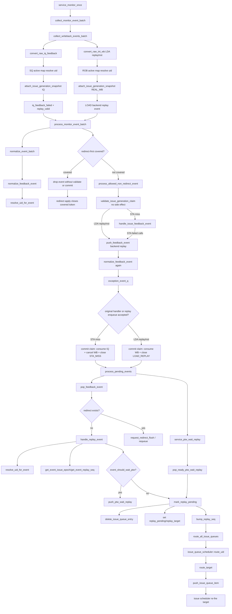

# Replay Flow

本文按通用 flow 文档规则整理 mem_ut 中 writeback/IQ feedback 后 replay进入
`push_feedback_event()`后的完整处理。V2 scalar replay来源包括STA IQ feedback miss和
LDA `replayInst=1`；STD不建立backend replay。V2 STA feedback只有真实SQ key，必须先
匹配issue fire时建立的不可变generation token；第一次及后续replay都不得从可变
status补旧event的`issue_epoch/replay_seq`。

## 1. 函数调用 Flow 图



## 1.1 函数调用 Flow 图整体文字伪代码

```text
Replay 主流程：

1. accepted issue generation建账：
   LOAD/STA issue fire分配issue_epoch后调用register_issue_generation_token；
   token保存uid/target/真实key/issue_epoch/replay_seq/pipe/issue flush epoch/fire cycle；
   LOAD只有real-WB pending，STA有IQ feedback和real-WB两个pending，STD不建token。

2. raw feedback/writeback转replay event：
   service_monitor_once调用collect_monitor_event_batch；
   collect_writeback_events_batch从raw IQ feedback和int-WB queue出队；
   STA IQ和LDA/STA WB monitor在各自valid采样块内，把真实key/payload与
   `sample_flush_epoch=dispatch_flush_epoch`、`cycle=$time`同拍写入raw；adapter出队时
   不得用current epoch覆盖；
   V2 STA raw只含真实SQ key，adapter先用SQ active map解析uid，再调用
   attach_issue_generation_snapshot附加token中的generation；
   convert_raw_iq_feedback将STA miss转成普通replay_valid event；V2没有flushState，
   因此ptw_back_replay固定0；
   LDA replayInst=1经ROB active map和REAL_WB token attach后转成LOAD replay event；
   STD不建立backend replay，任一VSTU feedback valid固定fatal。

3. batch仲裁、handler入队和两阶段claim：
   process_monitor_event_batch先normalize整批event；
   adapter attach只补snapshot，不消费token；
   active redirect或同批oldest redirect覆盖event时drop且不validate/commit，后续redirect apply
   按REDIRECT reason关闭真正被覆盖uid的token；
   未覆盖时process_allowed_non_redirect_event先调用validate_issue_generation_claim，只生成
   局部只读claim context，不消费token；
   随后进入原handler分派：STA failed由handle_issue_feedback_event调用
   push_feedback_event，LDA backend replay直接调用push_feedback_event；
   push_feedback_event再次normalize后写入exception_event_q，correlated event必须保留
   token提供的issue_epoch/replay_seq；
   只有原handler或backend replay入队成功后才调用commit_issue_generation_claim：STA
   miss消费IQ、取消同generation real-WB资格并close STA_MISS，LDA replayInst消费
   real-WB并close LOAD_REPLAY；这两类replay不得走compat no-op，拒绝时fatal且token保持
   未消费。

4. replay 消费：
   process_pending_events 先处理 PTW wait replay 和 active redirect；
   如果没有 redirect 抢占，则 pop_feedback_event 取 replay；
   handle_replay_event 解析 uid、issue_epoch、replay_seq；
   如果 ptw_back_replay 需要等待 PTW，push_ptw_wait_replay 暂存；
   否则 mark_replay_pending 清对应 target 旧 issue 项，设置 replay_pending/replay_target，并 bump replay_seq。

5. replay 重新发射：
   后续 service_real_dispatch_flow 调用 route_all_issue_queues；
   issue_queue_scheduler::route_uid 只允许 replay_target 对应 target 重新入队；
   route_target 生成新的 issue item 并 push_issue_queue_item；
   lintsissue sequence 后续重新发射该 target；
   新fire分配新issue_epoch并注册新token，旧token/tombstone不能给新generation提供
   snapshot。
```


## 2. `convert_raw_iq_feedback()`

源码位置：`mem_ut/ver/ut/memblock/seq/base_seq_help/dispatch_monitor_event_adapter.sv`

V2 coding后目标逻辑摘要：

```systemverilog
if (raw.vector_feedback || raw.is_std || !raw.is_sta) begin
    `uvm_fatal(...)
    return 1'b0;
end
wb_event.target = MEMBLOCK_ISSUE_TARGET_STA;
wb_event.source = MEMBLOCK_WB_EVENT_SOURCE_STA_FEEDBACK;
wb_event.has_rob = 1'b0;
wb_event.has_lq = 1'b0;
wb_event.has_sq = raw_sq_to_key(raw.sq_valid, raw.sq_flag,
                                raw.sq_value, wb_event.sq_key);
wb_event.iq_feedback_valid = 1'b1;
wb_event.iq_feedback_hit = raw.hit;
wb_event.iq_feedback_failed = !raw.hit;
wb_event.iq_feedback_flush_state = 1'b0;
wb_event.replay_valid = !raw.hit;
wb_event.ptw_back_replay = 1'b0;
wb_event.cycle = raw.cycle;
if (!attach_issue_generation_snapshot(wb_event,
        MEMBLOCK_ISSUE_EVENT_KIND_IQ_FEEDBACK,
        raw.sample_flush_epoch)) return 1'b0;
```

功能解释：

IQ feedback是IssueQueue response，不是真实RF/ROB writeback。V2 STA raw只提供SQ key；
adapter先通过active SQ map解析uid，再匹配该uid/STA的open token并附加fire时快照。
`raw.sample_flush_epoch/cycle`必须来自monitor采样拍，match直接消费这两个字段；adapter
不得在queue出队时回填current epoch。
V2没有scalar STA `flushState`，所以STA miss只生成普通replay，
`ptw_back_replay=0`。现有PTW wait基础设施保留，但本来源不触发。

输入/输出：

- 输入：`dispatch_raw_iq_feedback_t raw`。
- 输出：附带`generation_correlated=1`、uid、ROB和
  `issue_epoch/replay_seq`的STA hit/miss event；miss进入replay候选。
- 副作用：adapter attach不消费token、不写status；任一VSTU/STD IQ raw或缺真实SQ
  key的当前必需event固定fatal。可解释的closed tombstone/旧epochevent有原因drop。

文字伪代码：

```text
创建空 wb_event；
如果 raw.valid=0，返回 false；
如果 vector_feedback=1、is_std=1或不是STA，uvm_fatal；
设置target=STA/source=STA_FEEDBACK；
保持has_rob/has_lq=0，只调用raw_sq_to_key复制真实SQ key；
设置 iq_feedback_valid=1；
  设置 iq_feedback_hit=raw.hit，iq_feedback_failed=!raw.hit；
  STA miss设置replay_valid=1，flush_state和ptw_back_replay固定0；
  复制monitor冻结的raw.cycle；raw.sample_flush_epoch/cycle不得在adapter重写；
调用attach_issue_generation_snapshot：
  先用SQ active map解析uid；
  再调用match_issue_generation_token匹配uid/STA open token；
  CURRENT时附uid、ROB、issue_epoch、replay_seq和event kind，但不消费pending；
  tombstone或旧event按close reason info/drop；未来epoch、当前必需event无token、key/
  pipe不一致时fatal；
attach成功才返回true并进入batch handler。
```

内部子调用：

- `raw_sq_to_key()`：只复制V2接口真实SQ key；ROB/LQ不从默认0伪造。
- `attach_issue_generation_snapshot()`：调用active map和
  `match_issue_generation_token()`附加不可变generation，不消费token。
- `make_wb_event_base()`：创建空 event。

## 2.1 generation token match、attach、validate 与 commit

源码位置：

- `mem_ut/ver/ut/memblock/seq/base_seq_help/common_data_transaction.sv`
- `mem_ut/ver/ut/memblock/seq/base_seq_help/dispatch_monitor_event_adapter.sv`
- `mem_ut/ver/ut/memblock/seq/base_seq_help/dispatch_monitor_batch_handler.sv`

V2 coding后目标逻辑摘要：

```systemverilog
match_issue_generation_token(..., token, match_result);
if (match_result == MEMBLOCK_TOKEN_MATCH_STALE_DROP) return 1'b0;
wb_event.uid = token.uid;
wb_event.issue_epoch = token.issue_epoch;
wb_event.replay_seq = token.replay_seq;
wb_event.generation_correlated = 1'b1;
wb_event.generation_event_kind = event_kind;

// 只在redirect-first放行后执行；validate无副作用。
claim_ctx = validate_issue_generation_claim(wb_event);
case (wb_event.source)
    STA_FEEDBACK:  handler_accepted = handle_issue_feedback_event(wb_event);
    BACKEND_REPLAY: begin
        push_feedback_event(wb_event);
        handler_accepted = 1'b1;
    end
endcase
if (!handler_accepted) begin
    `uvm_fatal(...)
end
commit_issue_generation_claim(wb_event, claim_ctx, handler_accepted);
```

功能解释：

match/attach负责确认“raw属于哪次accepted fire”；redirect-first之后的validate只确认
“该generation的这个event kind是否有资格处理”；原handler成功接受或完成replay入队后，
commit才落实pending/seen和close动作。四步必须分开，否则redirect覆盖或handler拒绝的
event会提前清token pending，后续真正合法event再也无法匹配。

输入/输出：

- 输入：STA IQ的真实SQ key或LDA/STA result的真实ROB key、target、event kind、
  `sample_flush_epoch/cycle`。
- 输出：CURRENT时附加token snapshot；STALE_DROP时清半成品event并记录close reason；
  当前必需event不自洽时fatal。
- 副作用：match/attach和validate只读active map/open token/tombstone；原handler仍是
  status/recovery queue唯一写者；commit才更新pending/seen并可能调用
  `close_issue_generation_token()`。

文字伪代码：

```text
match_issue_generation_token：
  拒绝来自未来flush epoch的raw；
  IQ只允许STA+真实SQ，REAL_WB只允许LOAD/STA+真实ROB；
  先用active SQ/ROB map解析uid并校验多个真实key同uid；
  按uid+target O(1)查open token；
  校验target、port/pipe、全部真实key、fire cycle、issue flush epoch和kind pending；
  全部通过返回CURRENT；
  open不匹配时查最近closed tombstone，或识别raw早于token fire/来自旧epoch；
  可解释旧event返回STALE_DROP；其它当前必需event无token/不一致时fatal。

attach_issue_generation_snapshot：
  CURRENT时复制uid、ROB、issue_epoch、replay_seq；
  设置generation_correlated和generation_event_kind；
  不清任何pending，不写pass/fail/replay状态；
  STALE_DROP时清半成品event并返回false。

validate_issue_generation_claim：
  只由process_allowed_non_redirect_event在redirect-first放行后调用；
  要求event snapshot、kind、key和pipe与当前open token完全相同；
  生成含token identity、pending/seen before-image和预期action的局部claim_ctx；
  STA miss还要求同generation real-WB尚未seen；
  不清pending、不写status、不close token，duplicate、错误kind或不一致时fatal。

原handler或backend replay入队：
  STA miss调用handle_issue_feedback_event并成功把replay写入exception_event_q；
  LDA replayInst调用原backend replay push_feedback_event并成功入队；
  这两类event不允许compat no-op，handler拒绝时fatal并保持token未消费。

commit_issue_generation_claim：
  只在原handler或replay入队成功后调用；
  重读open token并核对claim_ctx中的generation、kind pending及before-image；
  STA miss清IQ pending、取消未到real-WB并close STA_MISS；
  LDA replayInst清real-WB pending并close LOAD_REPLAY；
  STA hit/normal WB在各自flow中只消费对应部分，两个required部分完成后close；
  commit复核失败时fatal，不得消费疑似另一代token。
```

`close_issue_generation_token()`从open map删除token，并按SQ/ROB物理key写最近close
tombstone。tombstone有界，只用于让redirect/miss/replay/terminal后迟到event有原因
drop，不为新generation提供snapshot。

## 3. `handle_issue_feedback_event()`

源码位置：`mem_ut/ver/ut/memblock/seq/base_seq_help/writeback_status_handler.sv:136`

真实逻辑摘要：

```systemverilog
if (!event_is_issue_feedback(wb_event)) return 1'b0;
if (wb_event.target == MEMBLOCK_ISSUE_TARGET_STD ||
    wb_event.source == MEMBLOCK_WB_EVENT_SOURCE_STD_FEEDBACK) begin
    `uvm_fatal("WB_STATUS", "STD issue feedback cannot complete V2 STD target");
end
uid = wb_event.uid;
issue_epoch = wb_event.issue_epoch;
replay_seq = wb_event.replay_seq;
if (wb_event.iq_feedback_failed) begin
    if (wb_event.target == MEMBLOCK_ISSUE_TARGET_STD) return 1'b0;
    data.push_feedback_event(wb_event);
    return 1'b1;
end
if (wb_event.iq_feedback_hit) begin
    if (target_real_wb_pass_enabled(wb_event.target))
        data.mark_issue_feedback_success(...);
    else
        data.mark_target_normal_pass(...);
end
```

功能解释：

该函数负责IQ feedback，不负责真实writeback。V2 correlated STA event在进入本函数前
已经通过redirect-first和只读claim资格validate，但token尚未消费。该函数仍只负责原有
状态动作，不承担generation恢复或token消费。replay路径只在`iq_feedback_failed`且
target不是STD时调用`push_feedback_event()`；返回成功后由外层
`process_allowed_non_redirect_event()` commit：miss才关闭STA_MISS并取消同代real-WB，
hit才消费IQ并保留real-WB。hit不进入replay queue。

输入/输出：

- 输入：batch放行、已附不可变generation且已通过只读validate的IQ feedback event。
- 输出：STA failed 入 `exception_event_q`；hit 更新 issue feedback success 或兼容 pass。
- 副作用：沿用原status/recovery动作；不再修改token。STD分支只保留非V2 monitor的
  兼容保护，V2 scalar monitor不会生成STD IQ raw。

文字伪代码：

```text
调用 event_is_issue_feedback：确认这是 IQ feedback；
  要求correlated V2 STA event已经由batch handler完成只读validate，token仍未消费；
取 uid/issue_epoch/replay_seq；
如果 iq_feedback_failed：
  如果 target 是 STD，前面的严格入口已经 fatal，不允许 warning/drop 后继续；
  否则调用 data.push_feedback_event：STA replay 进入 recovery queue；
  返回 1；
如果 iq_feedback_hit：
  调用 target_real_wb_pass_enabled：只判断 STA 是否等待真实 writeback pass；STD 不进入该分支；
  如果开启，调用 mark_issue_feedback_success：只记录 issue feedback success，不置 pass；
  如果关闭，调用 mark_target_normal_pass：兼容模式下把 feedback hit 当 pass；
  返回处理结果；
外层只在返回成功或命中唯一允许的STA hit compat no-op后commit claim。
```

内部子调用：

- `target_real_wb_pass_enabled()`：只读取 `seq_csr_common` 中 STA real writeback pass 开关；STD 不再有对应 runtime 参数。
- `data.push_feedback_event()`：STA replay 入队。
- `data.mark_issue_feedback_success()`：hit 成功但等待真实 writeback 的记录。
- `data.mark_target_normal_pass()`：兼容 pass 路径。

## 4. `push_feedback_event()` / `normalize_feedback_event()`

源码位置：`mem_ut/ver/ut/memblock/seq/base_seq_help/common_data_transaction.sv`

真实逻辑摘要：

```systemverilog
if (!normalize_feedback_event(wb_event, normalized_event)) return;
exception_event_q.push_back(normalized_event);

if (status.replay_seq != 0 && missing issue_epoch/replay_seq snapshot for non-STD) begin
    normalized_event = make_empty_wb_event();
    return 1'b0;
end
```

功能解释：

STA/LOAD replay入队前必须携带正确uid和`issue_epoch/replay_seq`。对于
`generation_correlated=1`的V2 LOAD/STA event，这些字段只能来自fire token；
`normalize_feedback_event()`只校验，不得从当前status补齐。现有status fallback只保留
给明确不使用token的兼容/synthetic路径，不能替代V2 correlation。

输入/输出：

- 输入：STA IQ feedback miss或LDA replayInst backend replay event。
- 输出：normalized replay event 入 `exception_event_q`。
- 副作用：只入recovery queue，不消费token；外层在确认本次入队成功后才commit对应kind。

文字伪代码：

```text
push_feedback_event 调用 normalize_feedback_event；
normalize_feedback_event检查event已有uid/key/action；
非 redirect target 必须是 LOAD/STA/STD；
如果generation_correlated=1：
  要求has_uid/has_issue_epoch/has_replay_seq全部为1；
  保留adapter/validate已经确认的event snapshot，禁止status fallback；
  handler执行期间token仍open，但normalize只校验event snapshot，不消费pending；
  push成功返回外层后才commit并按STA_MISS/LOAD_REPLAY reason关闭；
如果是明确非correlated兼容event：
  继续按原resolve_uid_for_event和status fallback规则处理；
第一次replay后的V2 LOAD/STA raw若没有token snapshot，必须在adapter阶段fatal或有原因
stale drop，不能到这里补当前generation；
normalize 成功后 push_back 到 exception_event_q。
```

内部子调用：

- `resolve_uid_for_event()`：active uid 反查。
- `target_dispatched()`：只用于明确非correlated兼容event缺issue_epoch时的原补齐前提；
  V2 correlated LOAD/STA不得走该fallback。
- `exception_event_q.push_back()`：replay 等待 recovery handler 消费。

## 5. `process_pending_events()` replay 分支

源码位置：`mem_ut/ver/ut/memblock/seq/base_seq_help/exception_redirect_replay_handler.sv`

真实逻辑摘要：

```systemverilog
service_ptw_wait_replay();
advance_active_redirect();
if (data.active_redirect.valid) return;
while (data.pop_feedback_event(wb_event)) events.push_back(wb_event);
if (select_oldest_redirect(events, redirect_event)) begin
    request_redirect_flush(...);
    push_redirect_drive(...);
end
if (data.active_redirect.valid) begin
    requeue_events_not_flushed_by_redirect(events, data.active_redirect);
    return;
end
foreach (events[idx]) begin
    if (event_is_replay(events[idx])) handle_replay_event(events[idx]);
end
```

功能解释：

replay 不是队列最高优先级。batch handler 先处理同批 redirect 覆盖：同批被 redirect 覆盖的 replay 会 drop，未覆盖 replay 才允许进入 `push_feedback_event()`。进入 `exception_event_q` 之后，如果队列中又有 redirect，redirect 会先建立 active redirect；被该 redirect 覆盖的 replay 会 drop，未覆盖 replay 会 requeue。只有当前 recovery batch 没有 redirect 时 replay 才进入 `handle_replay_event()`。

输入/输出：

- 输入：`exception_event_q` 中的 replay event。
- 输出：PTW wait replay 或 replay pending。

文字伪代码：

```text
调用 service_ptw_wait_replay：处理之前因 PTW back 等待的 replay；
调用 advance_active_redirect：先推进 active redirect；
如果 active_redirect 有效，暂停处理 replay；
pop exception_event_q 到本地 events；
调用 select_oldest_redirect：如果 recovery events 中有 redirect，redirect 优先；
如果 redirect 建立，调用 requeue_events_not_flushed_by_redirect：覆盖 replay drop，未覆盖 replay push_front 回 exception_event_q；
如果没有 redirect，遍历 events：
  event_is_replay 为真则调用 handle_replay_event。
```

内部子调用：

- `service_ptw_wait_replay()`：释放 PTW wait replay。
- `select_oldest_redirect()`：保证 redirect 优先级。
- `requeue_events_not_flushed_by_redirect()`：redirect 期间 replay 的保留/drop。
- `handle_replay_event()`：真正设置 replay pending 或 PTW wait。

## 6. `handle_replay_event()`

源码位置：`mem_ut/ver/ut/memblock/seq/base_seq_help/exception_redirect_replay_handler.sv:104`

真实逻辑摘要：

```systemverilog
if (!data.resolve_uid_for_event(wb_event, uid)) return;
issue_epoch = data.get_event_issue_epoch(wb_event, uid);
replay_seq  = data.get_event_replay_seq(wb_event, uid);
if (event_should_wait_ptw(wb_event)) begin
    data.push_ptw_wait_replay(uid, wb_event.target, issue_epoch, replay_seq, get_dispatch_service_cycle());
    return;
end
void'(data.mark_replay_pending(uid, wb_event.target, issue_epoch, replay_seq, wb_event.cycle));
```

功能解释：

这是replay event的recovery消费函数。它仍按原API确认active uid并读取event快照，
决定是否先进入PTW wait队列或直接置`replay_pending`。对V2 correlated event，
`get_event_issue_epoch/get_event_replay_seq`必须直接使用token已附字段，不允许从当前
status fallback。它不直接发射，只把状态改成可被issue route重新入队的形态。

输入/输出：

- 输入：normalized replay event。
- 输出：`ptw_wait_replay_q` 或 status replay pending。

文字伪代码：

```text
调用 resolve_uid_for_event：确认 replay event 仍映射到 active uid；
如果generation_correlated=1：
  要求event.has_issue_epoch/has_replay_seq为1；
  get_event_issue_epoch/get_event_replay_seq直接读取token snapshot，缺失则fatal；
否则兼容路径才允许使用原status fallback；
调用 event_should_wait_ptw：检查 seq_csr_common::get_replay_wait_ptw_en 和 wb_event.ptw_back_replay；
如果需要等 PTW：
  调用 push_ptw_wait_replay：把 uid/target/issue_epoch/replay_seq/入队 cycle 放入 PTW wait replay 队列，并去重；
  返回，不置 replay_pending；
否则：
  调用 mark_replay_pending：清旧发射状态，设置 replay_pending/replay_target，并 bump replay_seq。
```

内部子调用：

- `resolve_uid_for_event()`：过滤无法定位或已失效 uid。
- `get_event_issue_epoch()` / `get_event_replay_seq()`：读取 event 快照或 status 当前值。
- `event_should_wait_ptw()`：决定是否走 PTW wait。
- `push_ptw_wait_replay()`：延迟 replay。
- `mark_replay_pending()`：设置 replay 状态。

## 7. `service_ptw_wait_replay()`

源码位置：`mem_ut/ver/ut/memblock/seq/base_seq_help/exception_redirect_replay_handler.sv`

真实逻辑摘要：

```systemverilog
if (data.active_redirect.valid) return;
while (data.pop_ready_ptw_wait_replay(seq_csr_common::get_replay_wait_ptw_timeout(), wait_item, timed_out)) begin
    if (timed_out) `uvm_warning(...);
    void'(data.mark_replay_pending(wait_item.uid, wait_item.target,
                                   wait_item.issue_epoch, wait_item.replay_seq,
                                   get_dispatch_service_cycle()));
end
```

功能解释：

PTW-back replay 可以先等待 TLB entry ready，避免过早重发。active redirect 存在时暂停释放，避免 replay pending 立刻又被 redirect flush 清掉。

输入/输出：

- 输入：`ptw_wait_replay_q`。
- 输出：ready/timeout 的 wait item 转成 `mark_replay_pending()`。

文字伪代码：

```text
如果 active_redirect 有效，直接返回，暂停 PTW wait replay；
调用 seq_csr_common::get_replay_wait_ptw_timeout 获取最大等待周期；
循环调用 pop_ready_ptw_wait_replay(timeout)：检查 TLB 是否 ready 或是否超时；
如果 timeout，打印 warning，但仍释放 replay；
对弹出的 wait item 调用 mark_replay_pending，进入正常 replay pending 流程。
```

内部子调用：

- `pop_ready_ptw_wait_replay()`：判断 TLB ready 或超时。
- `mark_replay_pending()`：释放后置 replay pending。

## 8. `mark_replay_pending()`

源码位置：`mem_ut/ver/ut/memblock/seq/base_seq_help/common_data_transaction.sv:648`

真实逻辑摘要：

```systemverilog
case (target)
    LOAD, STA: ;
    STD: warning; return 1'b0;
endcase
if (!status.active || status.issue_killed || !target_dispatched(status, target) ||
    status.get_target_issue_epoch(target) != issue_epoch ||
    !target_replay_seq_match(status, target, replay_seq)) return 1'b0;

delete_issue_queue_entry(target, uid, 0, 1'b0);
status.replay_pending = 1'b1;
status.writeback = 1'b0;
status.pass = 1'b0;
status.success = 1'b0;
case (target)
    LOAD: clear load dispatched/writeback/pass/fault; replay_target_load=1;
    STA:  clear sta dispatched/writeback/pass/fault; replay_target_sta=1;
endcase
bump_replay_seq(uid);
```

功能解释：

该函数把一个已发射target改成需要重发。它只支持LOAD/STA，STD replay当前不支持。
进入本函数前，STA miss或LDA replayInst对应旧token已经按明确reason关闭；本函数继续
按原逻辑清target旧结果、设置replay target mask并bump `replay_seq`。它不修改已关闭
token，也不提前创建新token；新token只在下一次accepted fire建立。

输入/输出：

- 输入：uid、target、issue_epoch、replay_seq、cycle。
- 输出：status replay pending，目标 target 等待重新 route。

文字伪代码：

```text
检查 target：LOAD/STA 允许，STD warning/drop；
读取 status；
检查 status.active、未 issue_killed、target_dispatched；
检查 status.get_target_issue_epoch 和 target_replay_seq_match，过滤旧 replay event；
调用 delete_issue_queue_entry：清掉该 target 旧队列项，避免残留项先发；
设置 replay_pending=1，清 uid 总体 writeback/pass/success；
如果 target 是 LOAD：清 load_dispatched/load_writeback/load_pass/load_fault，设置 replay_target_load=1；
如果 target 是 STA：清 sta_dispatched/sta_writeback/sta_pass/sta_fault，设置 replay_target_sta=1；
调用 bump_replay_seq：进入新的 replay 轮次；
保持旧generation tombstone，不用新status replay_seq改写旧event；
返回成功。
```

内部子调用：

- `target_dispatched()`：确认 replay 发生在已发射 target 上。
- `target_replay_seq_match()`：确认 event 属于当前 replay 轮次。
- `delete_issue_queue_entry()`：删除旧队列项。
- `bump_replay_seq()`：递增 replay_seq，过滤旧反馈。

## 9. replay 后 route/issue

源码位置：`mem_ut/ver/ut/memblock/seq/base_seq_help/issue_queue_scheduler.sv`

真实逻辑摘要：

```systemverilog
if (status.replay_pending && !data.replay_target_requested(status, target)) return;
data.delete_issue_queue_entry(target, uid, status.replay_seq, 1'b0);
item = make_issue_item(uid, target, behavior);
data.push_issue_queue_item(item);
set_target_queued(uid, target, 1'b1);
```

功能解释：

`mark_replay_pending()`不直接drive DUT。下一轮`route_all_issue_queues()`扫描active
window；replay pending uid只允许对应target重新入queue。新issue item携带bump后的
`replay_seq`，accepted fire时分配新`issue_epoch`并注册新token；非replay target不会
被重复发射。

输入/输出：

- 输入：status 中的 `replay_pending/replay_target_*`。
- 输出：新的 issue queue item，等待 issue scheduler 发射。

文字伪代码：

```text
service_real_dispatch_flow 每拍调用 route_all_issue_queues；
issue_queue_scheduler::route_all_ready_uids 扫描 active uid；
route_uid 调用 is_uid_route_ready：replay_pending uid 只要 active/enq/issue_ready 且无 redirect/exception，就可 route；
route_target 先调用 target_already_queued_or_done：已排队或已完成则跳过；
如果 replay_pending 且 replay_target_requested(status,target)=false，跳过非 replay target；
调用 delete_issue_queue_entry：清同 target 同 replay_seq 旧项；
调用 make_issue_item：用当前 status.replay_seq 生成新 issue item；
调用 push_issue_queue_item：放入 load/sta/std issue queue；
set_target_queued 置 queued_*；
issue scheduler 后续发射成功后调用 clear_replay_target_after_fire 清 target mask，mask 全空则 replay_pending=0。
同一次成功fire调用register_issue_generation_token保存新的issue_epoch/replay_seq；
若旧open token没有按miss/replay/redirect等reason关闭，新fire必须fatal。
```

内部子调用：

- `is_uid_route_ready()`：允许 replay pending uid 重新 route。
- `replay_target_requested()`：只 route replay 目标。
- `make_issue_item()`：生成带当前 replay_seq 的 issue item。
- `clear_replay_target_after_fire()`：发射后清 replay target。

## 9.1 generation token 完整生命周期

唯一owner：`common_data_transaction`。

文字伪代码：

```text
reset：
  先停止并清raw monitor queue；
  清全部open token和closed tombstone；
  再清active ROB/LQ/SQ map并重置flush/global issue epoch；
  token不得跨testcase/reset。

redirect/flush：
  request_redirect_flush继续递增全局flush epoch；
  batch中被redirect覆盖的event不validate/commit；
  apply_redirect_flush_range只关闭真正被覆盖uid的LOAD/STA token；
  active key map释放前以REDIRECT reason关闭并写tombstone；
  未被redirect覆盖的老token保持open，可以接受更高sample epoch的合法event。

STA miss/reissue：
  gen0 miss通过batch后validate IQ资格；
  原handler成功入replay queue后commit IQ、取消WB并close STA_MISS；
  后续mark_replay_pending bump replay_seq；
  route/reissue的accepted fire创建gen1 token；
  gen0迟到WB只按MISS tombstone有原因drop，不能附gen1 snapshot。

STA hit/real-WB双顺序：
  hit先到只清IQ pending，token等待WB；
  WB先到只清WB pending，token等待IQ；
  两个required channel都消费后close ALL_CONSUMED；
  miss后不得再接受同generation WB。

LOAD：
  normal/fault/replayInst都消费唯一real-WB pending；
  normal close ALL_CONSUMED，fault close FAULT，replayInst close LOAD_REPLAY；
  replay后的新LDA结果必须匹配新token。

terminal/deq：
  active map释放前检查uid的LOAD/STA token；
  required pending仍存在且不属于已关闭fault/replay/redirect路径时fatal；
  仅兼容optional pending可按TERMINAL或LSQ_DEQ reason关闭；
  原required_targets_done、terminal_done和deq条件不变。

stale/重复：
  raw来自未来flush epoch、current必需event无token/tombstone、duplicate kind或key/pipe
  不一致时fatal；
  raw早于token fire、来自旧epoch或命中closed tombstone时按原因info/drop；
  tombstone每个物理key只保留最近关闭记录，不建立无界历史queue。
```

## 10. 端到端行为总结

```text
STA IQ feedback replay：
  accepted STA fire -> register token(IQ pending + real-WB pending)
  -> raw IQ feedback只含SQ key且hit=0
  -> convert_raw_iq_feedback
  -> SQ active map解析uid / match open token / attach immutable generation
  -> iq_feedback_failed=1 replay_valid=1
  -> process_monitor_event_batch
  -> normalize_event_batch / normalize_feedback_event / resolve_uid_for_event
  -> redirect-first 仲裁确认未被 redirect 覆盖
  -> process_allowed_non_redirect_event
  -> validate IQ claim资格，无副作用
  -> handle_issue_feedback_event
  -> push_feedback_event
  -> normalize_feedback_event 二次规范化
  -> exception_event_q
  -> handler成功返回
  -> commit IQ / cancel same-generation WB / close STA_MISS
  -> process_pending_events
  -> 如果 recovery queue 中有 redirect：replay 被覆盖则 drop，未覆盖则 requeue
  -> 如果无 redirect：handle_replay_event
  -> event_should_wait_ptw=false：mark_replay_pending
  -> route_all_issue_queues / route_target
  -> push_issue_queue_item
  -> issue scheduler重新发射STA target并注册新generation token

LDA replayInst：
  accepted LOAD fire -> register token(real-WB pending)
  -> LDA raw含真实ROB和replayInst=1
  -> ROB active map解析uid / attach REAL_WB generation
  -> redirect-first放行后validate real-WB claim资格
  -> backend replay event进入push_feedback_event并成功入队
  -> commit real-WB / close LOAD_REPLAY
  -> mark_replay_pending / bump replay_seq / route / re-fire
  -> 新fire注册新LOAD token

PTW-back replay兼容基础设施：
  V2 scalar STA feedback没有flushState，convert固定ptw_back_replay=0；
  因此本来源不进入push_ptw_wait_replay；
  其它明确携带ptw_back_replay的兼容/后续来源仍可复用现有service_ptw_wait_replay。

STD IQ feedback miss：
  V2 monitor不生成STD IQ raw；
  若convert_raw_iq_feedback收到is_std=1则uvm_fatal；
  STD只走value-only real-WB闭环且无STD replay
```

端到端文字伪代码描述：

```text
STA IQ feedback replay：
  accepted STA fire先保存不可变token；
  IQ monitor采到hit=0时只发送真实SQ key，adapter通过active SQ map和open token附加
  uid/ROB/issue_epoch/replay_seq；
  batch handler normalize并检查redirect覆盖，covered event不validate/commit；
  未覆盖event先validate IQ claim资格，不修改token，再进入原handler；
  handle_issue_feedback_event 识别 iq_feedback_failed 且 target 不是 STD，调用 push_feedback_event 入 recovery queue；
  handler成功返回后外层commit IQ、取消同代WB并close STA_MISS；
  process_pending_events 如果没有更高优先级 redirect，调用 handle_replay_event；
  handle_replay_event 重新解析 uid、issue_epoch、replay_seq，确认 replay event 仍属于当前 active 实例；
  如果不需要等待 PTW，mark_replay_pending 清该 target 的 dispatched/writeback/pass/fault/queued 状态；
  mark_replay_pending 设置 replay_pending 和 replay_target_sta，并 bump replay_seq 过滤旧反馈；
  下一轮 route_all_issue_queues 只允许 replay_target 对应 target 重新入 issue queue；
  issue scheduler重新发射成功后清replay target mask并注册新token，后续event只允许
  匹配新generation。

LDA replayInst：
  adapter按真实ROB匹配LOAD token，把LDA result转换成real_wb_valid=0、replay_valid=1的
  backend replay event；
  redirect-first放行后先validate唯一real-WB资格；
  push_feedback_event成功入队后commit real-WB pending并close LOAD_REPLAY；
  后续复用mark_replay_pending和route/re-fire，re-fire建立新token。

PTW-back replay兼容基础设施：
  V2 scalar STA来源固定ptw_back_replay=0，不进入PTW wait；
  `service_ptw_wait_replay()`保留给其它明确来源，不改变其ready/timeout逻辑。

STD IQ feedback miss：
  V2 scalar monitor不构造STD IQ feedback；adapter收到is_std raw时fatal；
  STD real-WB继续按ROB value-only固定双probe归一化，但明确没有STD replay。
```
