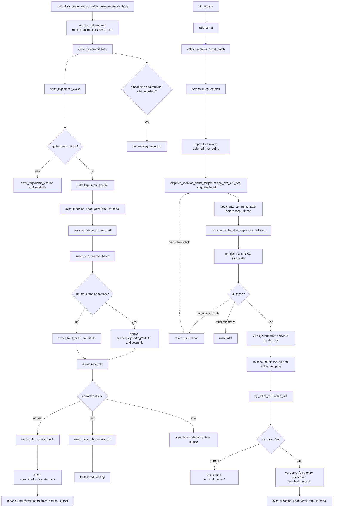

# ROB Commit、V2 LSQ Status 与 LQ/SQ Deq Flow

本文描述当前 mem_ut V2 flow 中两条并行链路：

1. `memblock_lsqcommit_dispatch_base_sequence`周期驱动`pendingPtr/pendingst/pendingMMIOld/scommit`，
   并推进软件ROB commit状态。
2. `io_mem_to_ooo_ctrl_agent_agent_monitor`采样DUT `lqDeq/sqDeq`，adapter在semantic batch
   仲裁后释放LQ/SQ mapping，并尝试形成normal或fault terminal。

权威源码：

- `mem_ut/ver/ut/memblock/seq/base_seq/memblock_lsqcommit_dispatch_base_sequence.sv`
- `mem_ut/ver/ut/memblock/seq/base_seq_help/lsq_commit_handler.sv`
- `mem_ut/ver/ut/memblock/agent/lsqcommit_agent_agent/src/lsqcommit_agent_agent_driver.sv`
- `mem_ut/ver/ut/memblock/agent/io_mem_to_ooo_ctrl_agent_agent/src/io_mem_to_ooo_ctrl_agent_agent_monitor.sv`
- `mem_ut/ver/ut/memblock/seq/base_seq_help/dispatch_monitor_event_adapter.sv`
- `mem_ut/ver/ut/memblock/seq/base_seq_help/common_data_transaction.sv`

## 1. Flow 边界与术语

### 1.1 术语与抽象功能说明

| 英文术语 | 当前 flow 中的中文含义 | 代码对象/状态落点 | 示例 |
|---|---|---|---|
| `commit cursor` | 软件ROB顺序提交窗口中第一个尚未越过的uid | `lsq_commit_handler::commit_cursor_uid` | normal batch只能从该uid开始连续选择 |
| `modeled head` | 当前active ROB head的完整flag/value key | `modeled_rob_deq_ptr`、`modeled_head_valid`、`modeled_head_matches_active_uid()` | normal head可派生`pendingst/pendingMMIOld`；fault token只保留`pendingPtr` |
| `committed watermark` | 最近一个成功normal commit batch的tail ROB key | `committed_rob_watermark` | 最后batch后继续发布`pendingPtr`，帮助StoreQueue看到已提交边界 |
| `level sideband` | 在多个周期持续表达当前ROB状态的输入 | `pendingPtr`、`pendingst`、`pendingMMIOld` | driver active idle也必须保持 |
| `pulse sideband` | 只描述本拍动作的输入 | `scommit`、`flushSb` | idle周期清0，不继承上一拍 |
| `normal commit batch` | 从modeled head开始、连续满足writeback/pass/required-target条件的uid集合 | `select_rob_commit_batch()` | 最多`MEMBLOCK_COMMIT_WIDTH`个 |
| `fault token` | fault head已发送commit语义但尚未完成LSQ release/非成功terminal的独占状态 | `fault_head_waiting`、`fault_head_uid`、`fault_head_dynamic_epoch` | fault未收敛前不允许更年轻normal commit越过 |
| `count-only sqDeq` | V2只提供SQ出队数量，不提供SQ出队pointer | `MEMBLOCK_DUT_HAS_SQ_DEQ_PTR=0`、`raw.sq_deq` | 从软件`sq_deq_ptr`连续释放count个owner |
| `terminal idle` | global stop后仍发布一次稳定level sideband、脉冲全0的最后transaction | `terminal_idle_published` | 发布后commit sequence才退出 |
| `observation epoch` | monitor观察MMIO output时的环境flush epoch，不代表脉冲由哪个request产生 | `raw.mmio_flush_epoch` | 迟到旧load脉冲可能在redirect后的epoch被观察 |
| `producer provenance` | MMIO valid所在DUT sample的单调序号 | `raw.mmio_sample_seq` | 与redirect sample `R/R+1`对齐 |
| `redirect sample anchor` | redirect输入被DUT采到的sample序号与完整payload | cancel record、`redirect_anchor_history_q` | `R`是anchor拍，`R+1`是下一sample |
| `overlap` | LOAD MMIO sample等于某个未完成redirect的`R`或`R+1` | `resolve_mmio_uid_by_rob_value()` | 只有唯一旧load owner被覆盖时stale drop |
| `deferred FIFO` | 已完成semantic转换、等待full-raw LSQ owner成功应用的持久队列 | `memblock_sync_pkg::deferred_raw_ctrl_q` | resync mismatch保留队首到下一service tick |

### 1.2 核心语义

- `pendingPtr`不是“本拍commit数量”，也不是必须指向一个仍active的head。只要
  `modeled_head_valid`就发布`modeled_rob_deq_ptr`；active-map通过
  `modeled_head_matches_active_uid()`只用于确认当前head的类型sideband。最后normal batch结束后没有
  modeled head时，它继续发布`committed_rob_watermark`。
- watermark只是一条保守ROB提交边界，不会重新建立active head，不会产生`pendingst`、
  `pendingMMIOld`、commit candidate、pass/fail或terminal。
- `scommit`表示本拍normal commit batch中`is_scalar_rob_store_commit()`分类的数量；该分类对应
  V2 ROB 的`CommitType.STORE && !vls`，因此普通STU store和STU CBO均计入；`sqDeq`表示DUT本拍真正离开SQ的
  entry数量。两者没有同拍相等关系，`scommit`不能推进软件SQ deq pointer。
- normal commit和fault convergence是两条互斥路径。fault head不混入normal `commit_uids`，也不计入
  normal-only `scommit`。

## 2. 函数调用 Flow 图



### 2.1 函数调用 Flow 图整体文字伪代码

```text
1. 初始化：
   LSQ commit sequence取得公共data和lsq_ctrl，创建handler并清本轮私有cursor/head/watermark/fault token；
   等待main table ready后进入周期驱动循环。

2. 每拍status构造：
   build_lsqcommit_xaction先同步可能刚完成的fault token，再从commit cursor读取权威status ROB key；
   modeled head存在时无条件用该head驱动pendingPtr；只有active-map反查成功时才按操作类型派生pendingst/pendingMMIOld；fault head只保留pendingPtr；
   select_rob_commit_batch只选连续normal uid；无normal batch时才尝试选择fault head；
   pendingst和scommit统一使用`is_scalar_rob_store_commit()`；普通scalar store与STU CBO计入，load/atomic不计入。

3. drive后状态推进：
   transaction通过driver写到DUT后，normal batch调用mark_rob_commit_batch；
   handler先全批预检，再逐uid置rob_commit，保存batch tail到committed_rob_watermark，并把cursor推进到batch后；
   若后续还有uid，以该uid status ROB key建立新modeled head；若已经是最后batch，只清active head，watermark继续发布；
   fault head调用独立mark_fault_rob_commit_uid并建立fault token，等deq/terminal收敛后才推进cursor；token期间pendingst/pendingMMIOld保持0。

4. idle和退出：
   driver没有新item时保持pendingPtr/pendingst/pendingMMIOld，只清scommit/flushSb；
   global stop后commit sequence仍发送一次terminal idle；该transaction可带watermark pendingPtr，
   但必须没有active head、pendingst、pendingMMIOld、scommit、flushSb或未收敛cancel/raw状态；
   terminal idle发布后sequence才退出。

5. MMIO tag与DUT deq：
   ctrl monitor把lqDeq、sqDeq、LQ pointer和其它ctrl event写入raw_ctrl_q；任一MMIO valid时同时冻结
   observation epoch和同拍producer sample seq；
   semantic batch完成redirect-first后，把完整raw追加到持久deferred FIFO，再从队首尝试应用；
   adapter先解析MMIO：普通事实按两个完整ROB key匹配active uid；LOAD sample落在redirect的R/R+1时，
   只有唯一旧scalar load owner、已dispatch且完整key被覆盖才stale drop，其余歧义fatal；STORE不套用该特例；
   handler先联合预检LQ/SQ owner，再原子推进软件deq pointer/free count并释放mapping；成功后才pop队首，
   resync mismatch保留队首到下一service tick，strict mismatch按原策略fatal；
   V2 sqDeq没有pointer，使用软件sq_deq_ptr作为连续owner起点；
   每个释放uid调用try_retire_committed_uid，normal和fault分别形成成功或非成功terminal。
```

## 3. ROB head、sideband 与 watermark

### 3.1 `rebase_framework_head_from_commit_cursor()`

源码位置：`lsq_commit_handler.sv`

抽象功能描述：该函数把commit cursor重新绑定到当前主表status中的权威ROB key；它只建立active head，
不从前一个key算术推导`key+1`，也不修改committed watermark。

真实逻辑摘要：

```systemverilog
advance_commit_cursor_past_done();
if (commit_cursor_uid == data.main_trans_num) begin
    modeled_head_valid = 1'b0;
    modeled_rob_deq_ptr = '{default:'0};
    return;
end
modeled_rob_deq_ptr = data.get_status(commit_cursor_uid).get_rob_key();
modeled_head_valid = 1'b1;
```

文字伪代码：

```text
先越过已经terminal_done的uid前缀，但flushed中间态不能被跳过；
cursor到main_trans_num时表示没有active head，只清modeled head；
否则从status[commit_cursor_uid]读取完整ROB flag/value作为modeled_rob_deq_ptr；
不使用batch tail+1推导，因为manual main table的ROB key不要求数值连续。
```

### 3.2 `clear_lsqcommit_xaction()` / `build_lsqcommit_xaction()`

抽象功能描述：`clear_lsqcommit_xaction()`建立本拍安全默认值；`build_lsqcommit_xaction()`在此基础上
叠加当前active head的level语义和normal batch的pulse语义。

真实逻辑摘要：

```systemverilog
if (modeled_head_valid) begin
    tr.io_ooo_to_mem_lsqio_pendingPtr_flag  = modeled_rob_deq_ptr.flag;
    tr.io_ooo_to_mem_lsqio_pendingPtr_value = modeled_rob_deq_ptr.value;
end else if (committed_watermark_publishable()) begin
    tr.io_ooo_to_mem_lsqio_pendingPtr_flag  = committed_rob_watermark.flag;
    tr.io_ooo_to_mem_lsqio_pendingPtr_value = committed_rob_watermark.value;
end else begin
    tr.io_ooo_to_mem_lsqio_pendingPtr_flag  = 1'b0;
    tr.io_ooo_to_mem_lsqio_pendingPtr_value = '0;
end
tr.io_ooo_to_mem_lsqio_pendingst     = 1'b0;
tr.io_ooo_to_mem_lsqio_pendingMMIOld = 1'b0;
tr.io_ooo_to_mem_lsqio_scommit       = '0;

if (has_head && !has_fault_head && !fault_head_waiting) begin
    tr.io_ooo_to_mem_lsqio_pendingst =
        memblock_op_behavior_util::is_scalar_rob_store_commit(head_behavior);
    tr.io_ooo_to_mem_lsqio_pendingMMIOld =
        head_behavior.commit_is_load && data.uid_is_mmio_load(head_uid);
end
foreach (commit_uids[idx]) begin
    if (memblock_op_behavior_util::is_scalar_rob_store_commit(behavior))
        tr.io_ooo_to_mem_lsqio_scommit++;
end
```

文字伪代码：

```text
只要modeled_head_valid，pendingPtr就发布modeled_rob_deq_ptr的完整flag/value，不依赖active-map命中；
modeled head无效但已有normal commit历史时发布committed_rob_watermark；
两者都没有时才发送零key；
active-map反查只服务pendingst/pendingMMIOld：两者默认0，只有resolve_sideband_head_uid成功且当前不是fault head/token时才派生；
pendingst表示当前normal active head的scalar ROB store分类，不依赖本拍是否能commit；
`is_scalar_rob_store_commit()`只接受behavior中的普通STORE或CBO，且要求`commit_is_store=1`；
pendingMMIOld表示当前active head是load且status已有当前dynamic instance的canonical MMIO load tag；
scommit只遍历本拍normal commit_uids调用同一helper，因此当前CBO也计入；fault token和watermark都不贡献scommit。
```

这里不能只检查`behavior.kind == MEMBLOCK_OP_BEHAVIOR_STORE`：V2 `Rob.scala`按
`commitType == STORE && !vls`生成`scommit`，而CBO解码为非vector STU，也属于该ROB分类。公共helper把
STORE/CBO白名单和`commit_is_store`同时检查，避免未来新增store-like kind后静默改变sideband。

### 3.3 MMIO status 当前边界

抽象功能描述：ctrl monitor冻结MMIO raw事实，resolver在active map仍存在时把value-only ROB信息分类为
当前owner、可证明旧LOAD或fatal，adapter再执行全raw tag preflight/commit。本链只产生canonical tag，
不推进ROB commit、LSQ deq或terminal。

`status_transaction`只保存一套 canonical MMIO tag：`mmio_tag_valid`、互斥的
`is_mmio_load/is_mmio_store`、`mmio_tag_source`和`mmio_tag_dynamic_epoch`。公共写入口只有
`set_uid_mmio_tag()`和`clear_uid_mmio_tag()`；`pendingMMIOld`只读当前 active dynamic instance 的 load tag，
不从地址或`fuType`猜测 MMIO，也不改变 pass/fail/terminal。

ctrl monitor 通过 V2 profile accessor 把`loadMmio/loadMmioUop`和
`storeMmio/storeMmioUop`写入`dispatch_raw_ctrl_t`。`mmio_flush_epoch`只保存monitor observation epoch；
`mmio_sample_seq`只在任一MMIO valid时由monitor冻结，adapter不得在消费拍重新推导。

`resolve_mmio_uid_by_rob_value()`对每个valid port使用ROB value的两个完整flag key probe active map。普通
路径要求op kind与dispatch状态一致，并用observation epoch区分current/newer实例。LOAD还扫描有深度上限的
全部未完成anchored cancel record和未绑定anchor FIFO：只有sample等于唯一redirect的`R/R+1`、唯一active
owner为已dispatch scalar load、activation epoch早于redirect epoch且完整ROB key被覆盖时，才返回
`STALE_DROP`。新owner、无owner、多个record/anchor、不兼容owner、anchor不匹配或无法证明覆盖均以
`MMIO_RESOLVE` fatal。STORE不执行LOAD的s1/s2 overlap规则。

`apply_raw_ctrl_mmio_tags()`按UID去重并全量preflight，再原子提交monitor tag；stale只丢对应port。
deferred ctrl中的MMIO normalize在完整raw deq前完成，避免deq删除active map后再反查。

文字伪代码：

```text
monitor看到任一MMIO valid时，保存observation epoch和同拍sample seq；全invalid时sample seq保持0。
adapter消费完整raw时先调用resolver；LOAD若和未完成redirect的R/R+1重叠，则必须证明唯一旧load owner。
证据完整时只drop该load port；证据不完整时fatal，不能把迟到脉冲写到新实例。
STORE不使用该overlap特例，只按普通active provenance解析。
全部current tag先dry-run；都通过后才commit，然后LSQ owner才允许应用同raw的LQ/SQ deq。
```

### 3.4 最后 normal batch 的 watermark

`mark_rob_commit_batch()`在全批成功后保存最后一个uid的权威ROB key：

```systemverilog
committed_rob_watermark =
    data.get_status(uids[uids.size() - 1]).get_rob_key();
committed_rob_watermark_valid = 1'b1;
commit_cursor_uid = uids[uids.size() - 1] + 1;
rebase_framework_head_from_commit_cursor();
```

如果该batch是最后一批，rebase会得到`modeled_head_valid=0`。下一拍
`clear_lsqcommit_xaction()`仍从`committed_rob_watermark`发布`pendingPtr`，避免最后store因pendingPtr清零
而无法被StoreQueue标成committed。此时：

- 不创建虚假的active head。
- `pendingst=0`、`pendingMMIOld=0`。
- 不生成新的commit candidate或`scommit`。
- 不修改`success/terminal_done`；它们仍由真实deq后的retire逻辑决定。

## 4. Normal commit 与 fault convergence 分流

### 4.1 `select_rob_commit_batch()` / `mark_rob_commit_batch()`

抽象功能描述：normal路径从modeled head选择连续、已完成且无恢复状态的uid，并在driver transaction
发送后原子置`rob_commit`、推进cursor和watermark。

真实逻辑摘要：

```systemverilog
while (uid < data.main_trans_num && uids.size() < MEMBLOCK_COMMIT_WIDTH) begin
    if (uid_is_normal_commit_candidate(uid)) begin
        uids.push_back(uid);
        uid++;
        continue;
    end
    break;
end
```

normal candidate要求：`active && writeback && pass && required_targets_done && !rob_commit`，同时无
fault/exception/replay/redirect/flushed/issue_killed。遇到第一个不满足的uid立即停止，不能跳过ROB head。

`mark_rob_commit_batch()`先检查batch从当前head开始、uid连续且每项仍是normal candidate；全部通过后
才逐项调用`mark_rob_commit_uid()`。这样不会出现前半batch已落表、后半batch失败的部分提交。

### 4.2 fault token

抽象功能描述：fault路径只处理当前ROB head，并把“已发送fault commit语义但还未完成LSQ release”的
生命周期保存在独占token中；token收敛前不允许更年轻uid进入normal batch。

```systemverilog
if (!has_commit) has_fault_head = select_fault_head_candidate(fault_uid);
if (has_fault_head) mark_fault_rob_commit_uid(fault_uid);
```

文字伪代码：

```text
只有normal batch为空时才检查fault head；
fault candidate必须active、位于commit cursor、无replay/redirect/flushed/killed，且已有writeback或target fault；
mark_fault_rob_commit_uid置rob_commit并保存uid、dynamic_epoch到fault token；
try_retire_committed_uid只有在LQ/SQ mapping释放后才调用consume_fault_retire，形成success=0的terminal；
sync_modeled_head_after_fault_terminal确认token仍属于同一动态实例且已完整retire后，才推进commit cursor；
若redirect杀掉旧fault实例，清token但cursor留在同一uid等待reissue。
```

normal和fault分流只约束ROB顺序，不要求`lqDeq/sqDeq`必须早于commit。commit与deq可以先后到达，
`try_retire_committed_uid()`只在两者都满足后形成最终terminal。

fault sideband采用受限语义：`build_lsqcommit_xaction()`先用`resolve_sideband_head_uid()`确认真实ROB head，
但只有`!has_fault_head && !fault_head_waiting`才把该head的store/MMIO属性写入
`pendingst/pendingMMIOld`。因此fault head仍获得真实`pendingPtr`，却不会被解释成pending store或
pending MMIO load；`mark_fault_rob_commit_uid()`建立token后，后续idle拍继续保持pendingPtr并将这两个
sideband清0，直到fault实例deq/terminal收敛或被redirect杀掉。fault head不进入normal`commit_uids`，
因此`scommit=0`；最后watermark也不会继承fault head的`pendingst/pendingMMIOld`。

## 5. Driver active idle 与 terminal idle

### 5.1 `lsqcommit_agent_agent_driver::send_pkt()` / `drive_idle()`

抽象功能描述：driver发送transaction时缓存level sideband；active driver没有item或处于gap时继续发布
缓存值，只清本拍pulse，防止ROB head语义在sequence调度气泡中被清零。

```systemverilog
// send_pkt
cached_pending_ptr_flag = tr.io_ooo_to_mem_lsqio_pendingPtr_flag;
cached_pending_ptr_value = tr.io_ooo_to_mem_lsqio_pendingPtr_value;
cached_pending_st = tr.io_ooo_to_mem_lsqio_pendingst;
cached_pending_mmio_ld = tr.io_ooo_to_mem_lsqio_pendingMMIOld;

// DRV_0 idle
vif.drv_mp.drv_cb.io_ooo_to_mem_lsqio_pendingPtr_flag <=
    cached_sideband_valid ? cached_pending_ptr_flag : 1'b0;
vif.drv_mp.drv_cb.io_ooo_to_mem_lsqio_pendingPtr_value <=
    cached_sideband_valid ? cached_pending_ptr_value : '0;
vif.drv_mp.drv_cb.io_ooo_to_mem_lsqio_pendingst <=
    cached_sideband_valid ? cached_pending_st : 1'b0;
vif.drv_mp.drv_cb.io_ooo_to_mem_lsqio_pendingMMIOld <=
    cached_sideband_valid ? cached_pending_mmio_ld : 1'b0;
vif.drv_mp.drv_cb.io_ooo_to_mem_lsqio_scommit <= '0;
vif.drv_mp.drv_cb.io_ooo_to_mem_flushSb <= '0;
```

`has_progress`仍是轻量debug/no-progress指标：normal commit、fault token、flushSb动作或
`flushsb_busy()`可以重置计数。它不决定pass/fail/terminal，短暂level busy不会伪造transaction完成。

### 5.2 `terminal_idle_published`

commit loop不会在检测到global stop后立即break，而是先完成一次`send_lsqcommit_cycle()`。只有该拍满足：

- `commit_cursor_uid == main_trans_num`。
- modeled head无效且没有fault token。
- flushSb、cancel record、redirect anchor、cancel snapshot均已收敛。
- transaction的`pendingst/pendingMMIOld/scommit/flushSb`均为0。

才置`terminal_idle_published=1`并退出。该terminal idle仍可发布有效
`committed_rob_watermark`作为`pendingPtr`，但这不是active head，也不触发任何新的状态推进。

## 6. DUT LQ/SQ deq 采集与应用

### 6.1 ctrl monitor 与 deferred raw

抽象功能描述：ctrl monitor只采样并入队；main service把同拍ctrl raw延迟到semantic redirect-first
完成之后再应用，避免deq提前删除redirect owner mapping。

```systemverilog
raw_ctrl.lq_deq = io_mem_to_ooo_lqDeq;
raw_ctrl.sq_deq = io_mem_to_ooo_sqDeq;
raw_ctrl.lq_deq_ptr_flag = io_mem_to_ooo_lqDeqPtr_flag;
raw_ctrl.lq_deq_ptr_value = io_mem_to_ooo_lqDeqPtr_value;
raw_ctrl.sq_deq_ptr_valid = sq_deq_ptr_valid;
raw_ctrl.sq_deq_ptr_flag = sq_deq_ptr_flag;
raw_ctrl.sq_deq_ptr_value = sq_deq_ptr_value;
raw_ctrl.load_mmio_valid = load_mmio_valid;
raw_ctrl.load_mmio_rob_value = load_mmio_rob_value;
raw_ctrl.store_mmio_valid = store_mmio_valid;
raw_ctrl.store_mmio_rob_value = store_mmio_rob_value;
if (any_mmio_valid) begin
    raw_ctrl.mmio_flush_epoch = memblock_sync_pkg::dispatch_flush_epoch;
    raw_ctrl.mmio_sample_seq = memblock_sync_pkg::get_dut_sample_seq($time);
end
memblock_sync_pkg::push_raw_ctrl(raw_ctrl);
```

文字伪代码：

```text
monitor先把同拍deq、pointer和MMIO valid/value写入empty raw；
只有任一MMIO valid时才保存当前observation epoch并调用sample accessor冻结同拍producer provenance；
随后把完整raw按FIFO入队，本阶段不查询active owner、不写tag也不释放mapping。
```

`sq_deq`类型使用`MEMBLOCK_SQ_DEQ_COUNT_W`；V2 interface/monitor/raw/XZ检查不再固定写`[1:0]`。
`MEMBLOCK_DUT_HAS_SQ_DEQ_PTR`只表示pointer是否存在，不能替代count宽度。

### 6.2 `apply_raw_ctrl_deq()` 的联合预检

抽象功能描述：adapter先把本拍raw追加到持久FIFO；handler为队首raw中的LQ和SQ deq分别生成owner列表。
任一侧预检失败时两侧都不推进，resync模式保留队首，避免半边release或raw静默丢失。

```systemverilog
// adapter: semantic batch后把本拍raw追加到持久FIFO
foreach (deferred_ctrl[idx]) begin
    memblock_sync_pkg::push_deferred_raw_ctrl(deferred_ctrl[idx]);
end
deferred_ctrl.delete();
while (memblock_sync_pkg::peek_deferred_raw_ctrl(raw)) begin
    if (!apply_raw_ctrl_deq(raw)) break;
    void'(memblock_sync_pkg::pop_deferred_raw_ctrl(applied_raw));
end

// 唯一lsq_commit_handler owner消费完整raw
if (raw.sq_deq == 0 && raw.sq_deq_ptr_valid) `uvm_fatal(...);
if (!MEMBLOCK_DUT_HAS_SQ_DEQ_PTR && raw.sq_deq_ptr_valid) `uvm_fatal(...);
if (MEMBLOCK_DUT_HAS_SQ_DEQ_PTR && raw.sq_deq != 0 &&
    !raw.sq_deq_ptr_valid) `uvm_fatal(...);
if (!preflight_dut_lq_deq(raw.lq_deq, lq_ptr, 1'b1, lq_uids)) return 1'b0;
if (!preflight_dut_sq_deq(raw.sq_deq, sq_ptr, 1'b1, sq_uids)) return 1'b0;
commit_dut_lq_deq(raw.lq_deq, lq_uids);
commit_dut_sq_deq(raw.sq_deq, sq_uids);
return 1'b1;
```

LQ仍使用DUT `lqDeqPtr`与软件`lq_deq_ptr`核对。V2 SQ路径因
`MEMBLOCK_DUT_HAS_SQ_DEQ_PTR=0`，`preflight_dut_sq_deq()`忽略raw pointer，从软件
`lsq_ctrl.sq_deq_ptr`开始按count连续查`uid_by_sq`。count不能超过`MEMBLOCK_DUT_ENSBUFFER_WIDTH`。

当前monitor生产路径始终是完整`raw_ctrl -> semantic batch -> deferred_raw_ctrl_q ->
adapter.apply_raw_ctrl_deq() -> lsq_commit_handler::apply_raw_ctrl_deq(raw)`，不会为了V2 SQ单独绕开同拍
LQ、MMIO tag、FIFO success语义或semantic batch。只有handler返回成功才pop队首；resync mismatch保留
当前和后续raw，`raw_monitor_queue_size()`也计入该FIFO，因此不能提前global stop。
`memblock_dispatch_base_sequence`和adapter都取得`lsq_commit_handler::get()`返回的同一singleton；adapter
可以绑定该handle，但不能创建第二个deq owner。源码中虽然保留
`apply_dut_sq_deq_count_only()` helper，生产full-raw路径不直接调用它；count-only能力实际由
`preflight_dut_sq_deq()`读取`MEMBLOCK_DUT_HAS_SQ_DEQ_PTR`后选择软件SQ head实现。这样既保留同一raw的
LQ/SQ联合原子预检，又不消费V2不存在的SQ pointer。

预检成功后：

1. `lsq_ctrl.release_lq/release_sq(count)`推进对应软件deq pointer并恢复free count。
2. `release_uid_lq_mapping/release_uid_sq_mapping()`删除active map。
3. uid两类mapping都释放时置`lsq_deq=1`并清reservation可见性。
4. 对每个owner调用`try_retire_committed_uid()`。

### 6.3 `scommit` 与 `sqDeq` 解耦

```text
scommit：测试框架给DUT的ROB提交输入，本拍normal batch中`is_scalar_rob_store_commit()`为1的commit数量；普通STU store和STU CBO计入。
sqDeq：DUT给测试框架的SQ完成输出，本拍离开SQ的entry数量。
```

一个store可以先产生`scommit`，经过SBuffer/uncache路径若干拍后才产生`sqDeq`。反之，某拍
`sqDeq=2`也只代表两个SQ entry完成，不能解释为两个ROB commit或两个SBuffer beat。软件SQ
deq pointer只由真实`sqDeq`推进，绝不由`scommit`直接推进。

## 7. `try_retire_committed_uid()` 与终态

抽象功能描述：该函数是ROB commit和LSQ deq两条独立路径的汇合点。它只在uid仍active、已经
`rob_commit`且LQ/SQ mapping都释放时，根据normal或fault状态形成最终结果。

```systemverilog
if (!status.active || !status.rob_commit) return;
if (status.active_lq_mapped || status.active_sq_mapped) return;
if (active_redirect covers uid) return;
if (replay/redirect/flushed/killed) return;
if (fault/exception/target_fault) begin
    consume_fault_retire(uid);
    return;
end
if (!status.pass || !required_targets_done(uid)) return;
success = 1'b1;
terminal_done = 1'b1;
retire_active_uid(uid);
```

redirect覆盖优先于normal/fault retire：被active redirect命中的uid必须留给
`apply_redirect_flush_range()`统一登记cancel并清mapping，不能在这里提前retire。normal路径设置
`success=1`；fault路径调用`consume_fault_retire()`设置`success=0`。两者都设置`terminal_done=1`并
释放active ROB map，随后`terminal_done_uid`前缀可以推进。

## 8. Global stop 与端到端行为总结

`request_global_stop_if_done()`要求所有uid terminal，并且cancel record、software cancel apply、
redirect anchor、cancel snapshot和raw timing sideband都已经收敛。commit sequence还要额外发布一次
terminal idle。因此“所有status terminal”不是立即停止driver的充分条件。

```text
MMIO load raw：
  ctrl monitor valid-gated采样ROB value
  -> 冻结observation epoch + mmio_sample_seq
  -> deferred ctrl在semantic redirect-first后消费
  -> 普通raw唯一命中current load则提交canonical tag
  -> R/R+1 overlap只有唯一旧load owner被覆盖才STALE_DROP
  -> 新/无/多/不兼容owner或无法证明覆盖均MMIO_RESOLVE fatal
  -> tag归一化完成后才应用同raw的LQ/SQ deq

normal load：
  writeback/pass/targets done
  -> normal commit batch
  -> pendingPtr=head, scommit不增加
  -> rob_commit=1
  -> DUT lqDeq + LQ pointer
  -> release LQ mapping
  -> try_retire_committed_uid
  -> success=1 terminal_done=1

normal store：
  STA/STD完成并pass
  -> normal commit batch
  -> scommit按store数量增加
  -> rob_commit=1
  -> 后续独立DUT sqDeq count-only
  -> 从软件SQ head释放mapping
  -> success=1 terminal_done=1

fault head：
  fault target落表
  -> select_fault_head_candidate
  -> fault token + rob_commit
  -> 等真实LQ/SQ mapping release
  -> consume_fault_retire
  -> success=0 terminal_done=1
  -> token收敛后cursor推进

最后normal commit batch：
  mark_rob_commit_batch
  -> 保存batch tail到committed_rob_watermark
  -> commit cursor到main_trans_num
  -> modeled_head_valid=0
  -> 后续pendingPtr继续发布watermark
  -> pendingst/pendingMMIOld/scommit保持0
  -> 不创建active head或新terminal

sequence退出：
  all uid terminal + cancel/raw状态收敛
  -> global stop
  -> 发布terminal idle和稳定watermark
  -> lsqcommit sequence退出
```

端到端文字伪代码：

```text
normal commit只描述ROB顺序推进，LQ/SQ deq只描述DUT资源真正释放，两者可以跨拍且没有同拍相等合同。
公共retire helper等两条路径都完成后才设置最终success/terminal。

fault不混入normal batch。独立fault token把cursor钉在当前head，直到该动态实例完成非成功terminal；
redirect杀掉旧实例时token失效，但cursor仍等待同uid重新执行。

最后一批normal commit后不存在active head，但StoreQueue仍需要看到已提交边界，所以driver持续发布已知batch
tail watermark。watermark不带pendingst/MMIO语义，也不会推进status。global stop收敛后再发布一次terminal
idle，保证level与pulse输入在sequence自然退出前处于稳定状态。
```
