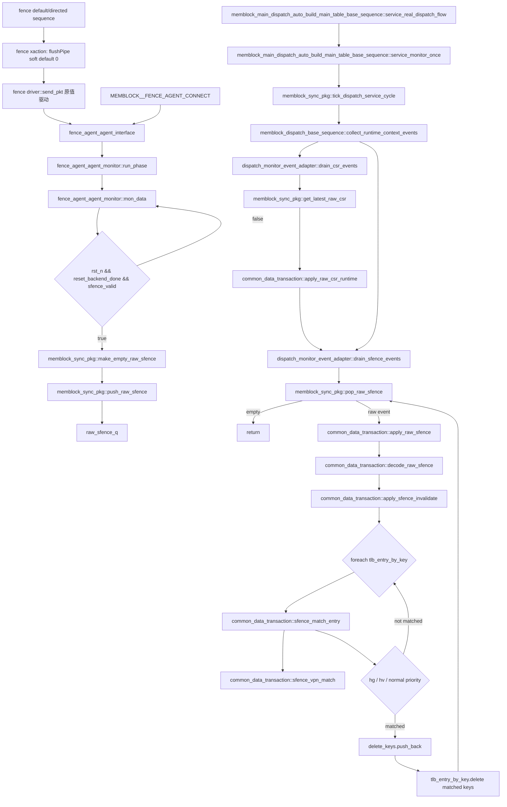

# mem_ut sfence/hfence entry invalidation flow（V2 lifecycle 见 responder flow）

本文档只说明 sfence/hfence raw event 到 live TLB entry 的 entry-level invalidation 语义。V2 L2TLB responder 的完整 transport sample、
C0/C4 token 时序、reset、stop/final、单 owner 和 mailbox 生命周期见
[`AI_DOC/mem_ut_flow_doc/tlb_l2tlb_responder_flow.md`](tlb_l2tlb_responder_flow.md) 的“V2 当前生效时序合同”，以及
`AI_DOC/plan/test_framework/plan/do/mem_ut_v2_l2tlb_sfence_flush_token_timing_correction_plan_20260805.md`。

本文件原有的直接 `drain_sfence_events()` 调用链保留为 entry-level 历史基线；在 V2 coding 中不得把它理解为
responder sequence 的 transport 消费路径。V2 当前由 dispatch adapter 的 `service_l2tlb_sfence_events()` 按 raw 自身
C0 sample 调度 C4 live-entry 删除，responder sequence 只消费 driver 的 frozen sample。`sfence_bits_flushPipe` 仍是
独立写回 sideband，不进入 raw entry invalidation；完整 core 的 `flushAfter` 仍由 ROB/CtrlBlock 产生，standalone
框架不因此暂停 LSQ 或伪造年轻 uid kill。

## 1. 函数调用 Flow 图

### 1.1 术语与抽象功能说明

| 英文术语 | 当前 flow 中的中文含义 | 代码对象/状态落点 | 示例 |
|---|---|---|---|
| `payload` | valid 伴随的 sfence 控制字段集合 | `rs1/rs2/addr/id/hv/hg/flushPipe` | `sfence_valid=0` 时 payload 不生成 raw event |
| `valid gate` | 只有 valid 明确为 1 才消费 payload | `fence_agent_agent_monitor::mon_data()` | valid 为 X/Z 时不产生 raw sfence |
| `raw event` | monitor 采样后交给 adapter 的原始离散事件 | `dispatch_raw_sfence_t`、`raw_sfence_q` | 每一条有效 sfence 都进入 FIFO |
| `FIFO` | 先进先出保存每一条离散 sfence 事件的队列 | `raw_sfence_q` | 两条连续 fence 必须按采样顺序逐条失效，不能只保留 latest |
| `latest snapshot` | 只保留最新 CSR runtime 状态的快照 | `latest_raw_csr` | sfence 处理前先同步最新 CSR |
| `capture` | 是否允许有效 raw event 进入共享 FIFO 的发布开关，不控制 interface 采样 | `dispatch_monitor_capture_en` | capture=0 时 monitor 仍采样/诊断，但 `push_raw_sfence()` 不入队 |
| `X/Z diagnosis` | 对四态 valid/payload 的 error-only 检查 | `TCNT_CHECK_SIG_XZ` | payload 未知时报 `uvm_error`，不自动 drop/fatal |
| `case equality` | 使用 `===` 要求 valid 四态值明确等于 1 | `io_ooo_to_mem_sfence_valid===1'b1` | valid 为 X/Z 时不会生成 raw event |
| `stage2/G-stage` | 虚拟机二阶段地址翻译及其页表阶段 | `s2xlate`、`payload.hg`、TLB entry stage | HFENCE.GVMA 按 VMID 匹配 G-stage entry |
| `ASID/VMID` | 一阶段地址空间标识和二阶段虚拟机标识 | `payload.id`、runtime CSR、TLB key | 普通 sfence/hv 使用 ASID，hg 使用 VMID |
| `entry invalidation` | 删除命中的 live TLB cache entry，使后续 request 重新建表 | `apply_sfence_invalidate()`、`tlb_entry_by_key.delete()` | 不删除主表、status 或 uid 历史 record |
| `service loop` | 周期性消费 CSR 和 sfence raw 的软件循环 | `service_monitor_once()`、`drain_sfence_events()` | 每轮先 drain CSR，再 drain sfence |
| `transparent drive` | driver 原样传递 transaction 字段，不启动额外状态机 | `fence_agent_agent_driver::send_pkt()` | `flushPipe=1` 只驱动接口为 1 |

### 1.2 重点函数的抽象功能

| 函数/task | 抽象功能描述 |
|---|---|
| `fence_agent_agent_monitor::mon_data()` | 每拍采样 sfence interface；valid 明确为 1 时做 payload 诊断并构造既有 raw event，不把 `flushPipe` 写入 raw。 |
| `memblock_sync_pkg::push_raw_sfence()` / `pop_raw_sfence()` | 在 capture 开启时保存并按 FIFO 顺序交付离散 sfence event。 |
| `dispatch_monitor_event_adapter::drain_csr_events()` | 在 sfence 失效前同步最新 CSR snapshot，保证匹配使用当前上下文。 |
| `dispatch_monitor_event_adapter::drain_sfence_events()` | 循环消费 sfence FIFO，并把每条事件交给公共数据层处理。 |
| `common_data_transaction::apply_raw_sfence()` | 解码 raw sfence 并启动 entry 级失效，不修改主表或 uid status。 |
| `common_data_transaction::apply_sfence_invalidate()` | 遍历 live TLB entry，收集命中 key 后统一删除。 |
| `common_data_transaction::sfence_match_entry()` | 按 stage、地址、ASID/VMID 和 global 规则判断单个 entry 是否命中。 |



### 1.3 函数调用 Flow 图整体文字伪代码

```text
sfence/hfence 主流程：

1. 连接阶段：
   MEMBLOCK__FENCE_AGENT_CONNECT 建立 fence_agent_agent_interface；
   非 MEMBLOCK_UT 模式下，把 DUT io_ooo_to_mem_sfence_* force 到 interface；
   monitor 后续只从 interface 采样，不直接修改 common_data_transaction。

2. 采集阶段：
   fence_agent_agent_monitor::run_phase 调用 mon_data；
   mon_data 每拍读取 io_ooo_to_mem_sfence_valid/rs1/rs2/addr/id/hv/hg/flushPipe；
   X/Z 诊断在 xz_sw、rst_n 和 reset_backend_done 满足时检查 valid，仅在 valid 明确为 1 时诊断全部 payload，包括 flushPipe；该宏报告 `uvm_error`，不作为 raw 发布 gate；
   如果 rst_n、reset_backend_done 和 valid 明确为 1：
     调用 make_empty_raw_sfence：生成全零 raw event；
     填入 rs1/rs2/addr/id/hv/hg 和当前 dispatch_service_cycle；flushPipe 不写 raw；
     调用 push_raw_sfence：只有 dispatch_monitor_capture_en=1 且 raw.valid=1 才入 raw_sfence_q；
   否则本拍不入队，monitor 继续下一拍。

3. service 消费阶段：
   service_real_dispatch_flow 在 reset_backend_done 后每个 negedge clk 调用 service_monitor_once；
   service_monitor_once 先 tick_dispatch_service_cycle；
   随后调用 collect_runtime_context_events；
   collect_runtime_context_events 先 drain_csr_events，再 drain_sfence_events；
   这个顺序保证 sfence_match_entry 中读取到的 mmu_csr_state 是最新 CSR runtime。

4. CSR 优先阶段：
   drain_csr_events 调用 get_latest_raw_csr；
   如果 latest_raw_csr_valid=0，则不更新 CSR；
   如果存在 latest snapshot，则 common_data_transaction::apply_raw_csr_runtime 按 raw_csr_seq 去重；
   raw_csr_seq 与 last_applied_raw_csr_seq 相同则直接返回；
   否则更新 mmu_csr_state，并记录 last_applied_raw_csr_seq。

5. sfence FIFO 阶段：
   drain_sfence_events 循环调用 pop_raw_sfence；
   raw_sfence_q 为空时返回；
   每个 raw event 调用 apply_raw_sfence；
   apply_raw_sfence 先 decode_raw_sfence，把 rs1 转成 ignore_addr，rs2 转成 ignore_id；
   再调用 apply_sfence_invalidate 遍历 tlb_entry_by_key。

6. 匹配与删除阶段：
   apply_sfence_invalidate 对每个 live TLB entry 调用 sfence_match_entry；
   sfence_match_entry 先过滤 invalid payload 和地址不匹配项；
   如果 hg=1，优先按 hfence.g 语义匹配 stage2/G-stage entry，id 表示 VMID；
   否则如果 hv=1，按 hfence.v 语义匹配 VS/G-stage 相关 entry，id 表示 ASID；
   否则按普通 sfence.vma 语义匹配非纯 stage2 entry，id 表示 ASID；
   匹配项先 push 到 delete_keys，遍历结束后统一从 tlb_entry_by_key 删除；
   uid_tlb_record_by_uid、main_table_by_uid 和 status_by_uid 不因 sfence 删除。
```

## 2. `MEMBLOCK__FENCE_AGENT_CONNECT`

源码位置：`mem_ut/ver/ut/memblock/tb/fence_agent_connect.sv`

抽象功能描述：该宏创建 fence agent interface、注册 virtual interface，并按仿真模式连接 DUT 与 agent；它不消费 sfence 语义。

真实逻辑摘要：

```systemverilog
`define MEMBLOCK__FENCE_AGENT_CONNECT(U_IF_NAME,AGENT_PATH,RTL_PATH) \
    fence_agent_agent_interface  U_IF_NAME (clk,tc_if.rst_n); \
    initial begin \
        uvm_config_db#(virtual fence_agent_agent_interface)::set(null,`"*AGENT_PATH*`", "vif", U_IF_NAME); \
    end \
    `ifdef MEMBLOCK_UT \
    initial begin \
        force RTL_PATH.io_ooo_to_mem_sfence_valid = U_IF_NAME.io_ooo_to_mem_sfence_valid; \
        ...
    end \
    `else \
    initial begin \
        force U_IF_NAME.io_ooo_to_mem_sfence_valid = RTL_PATH.io_ooo_to_mem_sfence_valid; \
        force U_IF_NAME.io_ooo_to_mem_sfence_bits_rs1 = RTL_PATH.io_ooo_to_mem_sfence_bits_rs1; \
        force U_IF_NAME.io_ooo_to_mem_sfence_bits_hg = RTL_PATH.io_ooo_to_mem_sfence_bits_hg; \
    end \
`endif
```

中文伪代码：

```text
创建 fence_agent_agent_interface，并把它注册到 uvm_config_db，供 fence agent monitor/driver 取得同一个 VIF。
如果定义 MEMBLOCK_UT：
  把 interface 侧 sfence 信号 force 到 RTL，供调试模式由 agent 驱动 DUT。
否则：
  把 RTL 的 io_ooo_to_mem_sfence_* 输出 force 到 interface，供正常 DUT flow 的 monitor 采样。
该宏只完成连接，不创建 raw event，也不修改 TLB entry。
```

功能解释：

该宏建立 fence agent 的 virtual interface，并把 DUT 的 `io_ooo_to_mem_sfence_*` 信号接到 interface。真实 DUT flow 下，interface 采样 DUT 输出；`MEMBLOCK_UT` 调试模式下方向相反，由 agent interface 驱动 DUT。

输入/输出：

- 输入：`U_IF_NAME`、`AGENT_PATH`、`RTL_PATH`。
- 输出：UVM config DB 中的 `vif`，以及 interface 与 RTL sfence 信号的 force 连接。

内部子调用：

- 无函数子调用；该宏只做 interface 创建、config 设置和信号 force。

## 3. `fence_agent_agent_monitor::run_phase()`

源码位置：`mem_ut/ver/ut/memblock/agent/fence_agent_agent/src/fence_agent_agent_monitor.sv`

抽象功能描述：`run_phase()` 是 monitor 的运行入口，完成父类初始化后把控制权交给持续采样的 `mon_data()`；它不自行生成 raw event。

真实逻辑摘要：

```systemverilog
task fence_agent_agent_monitor::run_phase(uvm_phase phase);
    super.run_phase(phase);
    this.mon_data();
endtask:run_phase
```

中文伪代码：

```text
先调用父类 run_phase，完成 monitor 基类的运行期初始化。
再调用 mon_data，进入持续等待 clocking block 的采样循环。
run_phase 自己不检查 valid、不构造 raw，也不拥有 raw_sfence_q。
```

功能解释：

monitor 的运行入口，进入无限采样循环 `mon_data()`。它本身不做过滤和入队。

输入/输出：

- 输入：UVM phase、monitor base class 已配置的 `vif/cfg`。
- 输出：调用 `mon_data()` 后，sfence raw event 可能进入 `memblock_sync_pkg::raw_sfence_q`。

内部子调用：

- `mon_data()`：真实采样 sfence 信号并写入 raw queue。

## 4. `fence_agent_agent_monitor::mon_data()`

源码位置：`mem_ut/ver/ut/memblock/agent/fence_agent_agent/src/fence_agent_agent_monitor.sv`

抽象功能描述：`mon_data()` 连续采样 sfence interface；X/Z 诊断由 xz/reset/backend 条件控制，raw event 则另外受 valid、reset/backend 和 capture 条件控制。

真实逻辑摘要：

```systemverilog
while(1) begin
    @this.vif.mon_mp.mon_cb;
    io_ooo_to_mem_sfence_valid = this.vif.mon_mp.mon_cb.io_ooo_to_mem_sfence_valid;
    io_ooo_to_mem_sfence_bits_rs1 = this.vif.mon_mp.mon_cb.io_ooo_to_mem_sfence_bits_rs1;
    io_ooo_to_mem_sfence_bits_flushPipe = this.vif.mon_mp.mon_cb.io_ooo_to_mem_sfence_bits_flushPipe;
    if(this.cfg.xz_sw==tcnt_dec_base::ON && this.vif.rst_n==1'b1 && memblock_sync_pkg::reset_backend_done==1'b1) begin
        `TCNT_CHECK_SIG_XZ(io_ooo_to_mem_sfence_valid,io_ooo_to_mem_sfence_valid,1);
        if (io_ooo_to_mem_sfence_valid===1'b1) begin
            `TCNT_CHECK_SIG_XZ(io_ooo_to_mem_sfence_bits_rs1,io_ooo_to_mem_sfence_bits_rs1,1);
            `TCNT_CHECK_SIG_XZ(io_ooo_to_mem_sfence_bits_rs2,io_ooo_to_mem_sfence_bits_rs2,1);
            `TCNT_CHECK_SIG_XZ(io_ooo_to_mem_sfence_bits_addr,io_ooo_to_mem_sfence_bits_addr,50);
            `TCNT_CHECK_SIG_XZ(io_ooo_to_mem_sfence_bits_id,io_ooo_to_mem_sfence_bits_id,16);
            `TCNT_CHECK_SIG_XZ(io_ooo_to_mem_sfence_bits_hv,io_ooo_to_mem_sfence_bits_hv,1);
            `TCNT_CHECK_SIG_XZ(io_ooo_to_mem_sfence_bits_hg,io_ooo_to_mem_sfence_bits_hg,1);
            `TCNT_CHECK_SIG_XZ(io_ooo_to_mem_sfence_bits_flushPipe,io_ooo_to_mem_sfence_bits_flushPipe,1);
        end
    end
    if(this.vif.rst_n==1'b1 &&
       memblock_sync_pkg::reset_backend_done==1'b1 &&
       io_ooo_to_mem_sfence_valid===1'b1) begin
        raw_sfence = memblock_sync_pkg::make_empty_raw_sfence();
        raw_sfence.valid = 1'b1;
        raw_sfence.rs1   = io_ooo_to_mem_sfence_bits_rs1;
        raw_sfence.rs2   = io_ooo_to_mem_sfence_bits_rs2;
        raw_sfence.addr  = io_ooo_to_mem_sfence_bits_addr;
        raw_sfence.id    = io_ooo_to_mem_sfence_bits_id;
        raw_sfence.hv    = io_ooo_to_mem_sfence_bits_hv;
        raw_sfence.hg    = io_ooo_to_mem_sfence_bits_hg;
        raw_sfence.cycle = memblock_sync_pkg::get_dispatch_service_cycle();
        memblock_sync_pkg::push_raw_sfence(raw_sfence);
    end
end
```

中文伪代码：

```text
无限循环等待 monitor clocking block，并读取本拍 sfence valid 与全部 payload 字段。
如果 X/Z 检查打开、reset 已释放且 backend ready：
  始终诊断 valid 是否有 X/Z。
  只有 valid 使用 case equality 明确等于 1 时，才诊断 rs1、rs2、addr、id、hv、hg、flushPipe。
  诊断宏只报告 uvm_error，不执行 drop/fatal，也不作为 raw 发布门槛。
如果 reset/backend ready 且 valid 使用 case equality 明确等于 1：
  调用 make_empty_raw_sfence，创建字段确定且默认无效的 raw event。
  置 raw.valid=1，复制 rs1/rs2/addr/id/hv/hg；flushPipe 不进入 raw 失效语义。
  调用 get_dispatch_service_cycle，记录该事件的软件 service cycle。
  调用 push_raw_sfence；该 helper 仅在 capture enable 时把有效 event 追加到 FIFO 尾部。
否则本拍不发布 sfence raw event，继续下一次采样。
```

功能解释：

这是 sfence/hfence 事件进入软件框架的真实入口。monitor 每拍采样 sfence payload，X/Z 诊断只要求 xz_sw、reset/backend ready，raw event 则还要求 valid 明确为 1。`flushPipe` 参加有效 payload 的 X/Z 诊断，但不会被写入 raw event。`TCNT_CHECK_SIG_XZ` 只报告 `uvm_error`；valid 明确为 1 时其它 payload 若含 X/Z，现有逻辑仍会继续构造二态 raw，testcase 由 UVM error 判失败。

输入/输出：

- 输入：`io_ooo_to_mem_sfence_valid/rs1/rs2/addr/id/hv/hg/flushPipe`。
- 输出：`dispatch_raw_sfence_t`，经 `push_raw_sfence()` 写入 `raw_sfence_q`。

内部子调用：

- `memblock_sync_pkg::make_empty_raw_sfence()`：生成默认 raw event。
- `memblock_sync_pkg::get_dispatch_service_cycle()`：读取当前 service cycle，用于日志和追踪。
- `memblock_sync_pkg::push_raw_sfence()`：按 capture enable 和 valid 入 FIFO。

### 4.1 `fence_agent_agent_xaction` 与 driver 的 `flushPipe` 合同

源码位置：`mem_ut/ver/ut/memblock/agent/fence_agent_agent/src/fence_agent_agent_xaction.sv`。

抽象功能描述：该 constraint 为普通随机 fence transaction 提供默认 `flushPipe=0`，允许 directed item 在不改变 driver 结构的情况下覆盖该值。

该 constraint 给普通随机 transaction 提供可被 directed inline constraint 覆盖的默认值。

```systemverilog
constraint fence_agent_agent_xaction::default_io_ooo_to_mem_sfence_bits_flushPipe_cons{
    soft io_ooo_to_mem_sfence_bits_flushPipe == 1'b0;
}
```

中文伪代码：

```text
普通 xaction randomize 时默认得到 flushPipe=0；
directed sequence 可以用更强的 inline constraint 覆盖为1；
该约束不读取公共状态，也不触发任何 flush 行为。
```

源码位置：`mem_ut/ver/ut/memblock/agent/fence_agent_agent/src/fence_agent_agent_driver.sv`，task：`send_pkt()`。

抽象功能描述：`send_pkt()` 将当前 transaction 的 `flushPipe` 原值写入 interface；它不读取状态表，也不触发 pipeline flush。

driver 只保证 transaction 到 interface 的值保真。

```systemverilog
vif.drv_mp.drv_cb.io_ooo_to_mem_sfence_bits_flushPipe <=
    tr.io_ooo_to_mem_sfence_bits_flushPipe;
```

中文伪代码：

```text
send_pkt读取当前transaction中的flushPipe；
在driver clocking block原值驱动interface；
不查询status、queue、redirect或L2TLB状态，取值0/1都不产生额外副作用。
```

`psdisplay()` 和 custom `compare()` 同步覆盖该字段，避免日志漏值或仅该位不同时被误判相等。

## 5. `memblock_sync_pkg::make_empty_raw_sfence()`

源码位置：`mem_ut/ver/ut/memblock/common/memblock_common/src/memblock_sync_pkg.sv`

抽象功能描述：该函数创建没有旧字段残留的空 sfence raw struct，供 monitor 在确认有效事件后填充；它不执行失效。

真实逻辑摘要：

```systemverilog
function dispatch_raw_sfence_t make_empty_raw_sfence();
    dispatch_raw_sfence_t item;
    item.valid = 1'b0;
    item.rs1   = 1'b0;
    item.rs2   = 1'b0;
    item.addr  = '0;
    item.id    = '0;
    item.hv    = 1'b0;
    item.hg    = 1'b0;
    item.cycle = 0;
    return item;
endfunction
```

中文伪代码：

```text
声明一个 dispatch_raw_sfence_t。
按源码顺序把 valid、rs1、rs2、addr、id、hv、hg 和 cycle 清零；结构中没有 flushPipe 字段。
返回该默认无效 raw event，供 monitor 填充本拍有效 payload，避免上一事件残留。
```

功能解释：

提供 raw sfence event 的统一默认值，避免 monitor 遗留旧字段。

输入/输出：

- 输入：无。
- 输出：字段清零、`valid=0` 的 `dispatch_raw_sfence_t`。

内部子调用：

- 无。

## 6. `memblock_sync_pkg::push_raw_sfence()`

源码位置：`mem_ut/ver/ut/memblock/common/memblock_common/src/memblock_sync_pkg.sv`

抽象功能描述：该函数在 capture 开启且 event 有效时把 sfence raw 放入 FIFO；它不改变 TLB 表或 status。

真实逻辑摘要：

```systemverilog
function void push_raw_sfence(input dispatch_raw_sfence_t item);
    if (dispatch_monitor_capture_en && item.valid) begin
        raw_sfence_q.push_back(item);
    end
endfunction
```

中文伪代码：

```text
检查 dispatch_monitor_capture_en 和 item.valid。
如果两者都为 1：
  把 item 追加到 raw_sfence_q 尾部，保留每条离散 fence 的采样顺序。
否则：
  不修改 FIFO；monitor 仍完成了 interface 采样和必要的 X/Z 诊断。
该函数不直接遍历或删除 TLB entry。
```

功能解释：

把 sfence/hfence raw event 写入 FIFO。sfence 是离散事件，不能像 CSR snapshot 一样覆盖为 latest。

输入/输出：

- 输入：`dispatch_raw_sfence_t item`。
- 输出：满足条件时 `raw_sfence_q.push_back(item)`。

内部子调用：

- 无。

## 7. `memblock_main_dispatch_auto_build_main_table_base_sequence::service_monitor_once()`

源码位置：`mem_ut/ver/ut/memblock/seq/base_seq/memblock_main_dispatch_auto_build_main_table_base_sequence.sv`

抽象功能描述：该 task 提供一次软件 service tick，先采集 runtime context，再让各类 raw event 进入对应 handler；它不直接实现 sfence 匹配。

真实逻辑摘要：

```systemverilog
task memblock_main_dispatch_auto_build_main_table_base_sequence::service_monitor_once();
    memblock_sync_pkg::tick_dispatch_service_cycle();
    collect_runtime_context_events();
    collect_monitor_event_batch();
    exception_redirect_replay_task();
endtask
```

中文伪代码：

```text
调用 tick_dispatch_service_cycle，推进只用于软件服务排序和日志的 cycle 计数。
调用 collect_runtime_context_events：
  先应用 latest CSR snapshot，再 FIFO 消费 sfence/hfence，使失效匹配使用最新 runtime context。
调用 collect_monitor_event_batch：
  在 runtime context 之后处理 writeback、IQ feedback 和 ctrl raw batch。
调用 exception_redirect_replay_task：
  最后处理本轮 redirect/replay/fault pending event。
本 task 只定义调用顺序，不自行匹配或删除 TLB entry。
```

功能解释：

真实 dispatch smoke flow 的单轮 monitor 服务入口。sfence/hfence 在 writeback、IQ feedback、memory violation batch 之前消费。

输入/输出：

- 输入：各 monitor 已采集到的 raw queues/latest CSR。
- 输出：推进 service cycle；更新 CSR runtime；消费 `raw_sfence_q` 并失效 TLB entry；随后继续处理 writeback/recovery。

内部子调用：

- `tick_dispatch_service_cycle()`：更新 service cycle。
- `collect_runtime_context_events()`：本 flow 的 consumer 入口。
- `collect_monitor_event_batch()`、`exception_redirect_replay_task()`：sfence 后续同轮处理，不是 sfence 删除逻辑。

## 8. `memblock_dispatch_base_sequence::collect_runtime_context_events()`

源码位置：`mem_ut/ver/ut/memblock/seq/base_seq_help/memblock_dispatch_base_sequence.sv`

抽象功能描述：该 helper 固定 CSR 与 sfence 的消费顺序，保证失效匹配前 runtime mirror 已更新；它不绕过 adapter 直接改表。

真实逻辑摘要：

```systemverilog
function void memblock_dispatch_base_sequence::collect_runtime_context_events();
    if (monitor_adapter == null) begin
        monitor_adapter = dispatch_monitor_event_adapter::type_id::create("monitor_adapter");
    end
    if (monitor_commit_handler != null) begin
        monitor_adapter.bind_commit_handler(monitor_commit_handler);
    end
    monitor_adapter.drain_csr_events();
    monitor_adapter.drain_sfence_events();
endfunction
```

中文伪代码：

```text
如果 monitor_adapter 尚未创建：
  创建 dispatch_monitor_event_adapter，使 runtime context 统一经同一个 adapter 消费。
如果 monitor_commit_handler 已存在：
  调用 bind_commit_handler 把 handler 交给 adapter；该绑定不消费 CSR 或 sfence。
调用 drain_csr_events：
  读取 latest CSR snapshot，并按序号更新 mmu_csr_state。
调用 drain_sfence_events：
  在 CSR 已同步后按 FIFO 顺序消费全部 pending sfence/hfence raw event。
```

功能解释：

统一 runtime context 入口。它显式保证 CSR runtime 在 sfence/hfence 前更新。

输入/输出：

- 输入：`latest_raw_csr`、`raw_sfence_q`。
- 输出：`mmu_csr_state` 更新；`raw_sfence_q` 被 FIFO 排空；`tlb_entry_by_key` 可能删除。

内部子调用：

- `dispatch_monitor_event_adapter::drain_csr_events()`：CSR latest snapshot 消费入口。
- `dispatch_monitor_event_adapter::drain_sfence_events()`：sfence FIFO 消费入口。

## 9. `dispatch_monitor_event_adapter::drain_csr_events()`

源码位置：`mem_ut/ver/ut/memblock/seq/base_seq_help/dispatch_monitor_event_adapter.sv`

抽象功能描述：该 adapter helper 读取 latest CSR snapshot 并按序号应用到 runtime mirror，为随后 sfence 匹配提供上下文。

真实逻辑摘要：

```systemverilog
function void drain_csr_events();
    memblock_sync_pkg::dispatch_raw_csr_t raw_csr;
    int unsigned raw_csr_seq;

    ensure_handles();
    if (memblock_sync_pkg::get_latest_raw_csr(raw_csr, raw_csr_seq)) begin
        data.apply_raw_csr_runtime(raw_csr, raw_csr_seq);
    end
endfunction
```

中文伪代码：

```text
调用 ensure_handles，保证 adapter 已取得公共 common_data_transaction；该 helper 不出队任何 event。
调用 get_latest_raw_csr 读取 latest snapshot 和序号：
  返回 false 时直接结束，不修改 runtime mirror，也不消费 raw_sfence_q。
  返回 true 时取得 raw_csr 和 raw_csr_seq。
调用 data.apply_raw_csr_runtime：
  由公共数据对象按 valid/seq 去重并更新 mmu_csr_state，为紧随其后的 sfence 匹配提供当前 ASID/VMID 上下文。
```

功能解释：

读取最新 CSR snapshot，并交给 `common_data_transaction` 去重应用。它不消费 `raw_sfence_q`。

输入/输出：

- 输入：`latest_raw_csr/latest_raw_csr_valid/latest_raw_csr_seq`。
- 输出：可能更新 `common_data_transaction::mmu_csr_state`。

内部子调用：

- `ensure_handles()`：确保 adapter 持有 `common_data_transaction`。
- `memblock_sync_pkg::get_latest_raw_csr()`：读取 latest CSR snapshot。
- `common_data_transaction::apply_raw_csr_runtime()`：更新 runtime CSR 镜像。

## 10. `common_data_transaction::apply_raw_csr_runtime()`

源码位置：`mem_ut/ver/ut/memblock/seq/base_seq_help/common_data_transaction.sv`

抽象功能描述：该函数过滤无效/重复 CSR snapshot 并更新公共 runtime state；它不消费 sfence FIFO，也不改变 TLB entry。

真实逻辑摘要：

```systemverilog
function void apply_raw_csr_runtime(input memblock_sync_pkg::dispatch_raw_csr_t raw,
                                    input int unsigned raw_csr_seq);
    if (!raw.valid) begin
        return;
    end
    if (raw_csr_seq == last_applied_raw_csr_seq) begin
        return;
    end
    if (mmu_csr_state == null) begin
        mmu_csr_state = mmu_csr_runtime_state::type_id::create("mmu_csr_state");
        mmu_csr_state.reset();
    end
    mmu_csr_state.update_from_raw_csr(raw);
    last_applied_raw_csr_seq = raw_csr_seq;
endfunction
```

中文伪代码：

```text
如果 raw.valid=0：
  直接返回，不创建 runtime state，也不记录输入序号。
如果 raw_csr_seq 已等于 last_applied_raw_csr_seq：
  直接返回，避免重复应用同一 latest snapshot。
如果 mmu_csr_state 为空：
  创建对象并调用 reset，建立确定默认值。
调用 mmu_csr_state.update_from_raw_csr：
  复制 CSR snapshot，并仅对翻译/权限语义变化推进 update_seq。
最后记录 last_applied_raw_csr_seq，供后续 service tick 去重。
```

功能解释：

维护 `mmu_csr_state` 的最新运行时镜像，并用 `last_applied_raw_csr_seq` 防止同一个 latest snapshot 被重复应用。

输入/输出：

- 输入：`dispatch_raw_csr_t raw`、`raw_csr_seq`。
- 输出：`mmu_csr_state` 更新；`last_applied_raw_csr_seq` 更新。

内部子调用：

- `mmu_csr_runtime_state::update_from_raw_csr()`：复制 satp/vsatp/hgatp/priv/PBMT 字段，变化时递增 `update_seq`。

## 11. `dispatch_monitor_event_adapter::drain_sfence_events()`

源码位置：`mem_ut/ver/ut/memblock/seq/base_seq_help/dispatch_monitor_event_adapter.sv`

抽象功能描述：该 helper 按 FIFO 顺序取出所有 pending sfence raw event，并逐条调用公共数据层的失效入口。

真实逻辑摘要：

```systemverilog
function void drain_sfence_events();
    memblock_sync_pkg::dispatch_raw_sfence_t raw_sfence;

    ensure_handles();
    while (memblock_sync_pkg::pop_raw_sfence(raw_sfence)) begin
        void'(data.apply_raw_sfence(raw_sfence));
    end
endfunction
```

中文伪代码：

```text
调用 ensure_handles，保证 data 指向公共 common_data_transaction。
循环调用 pop_raw_sfence：
  FIFO 为空时 helper 返回 false，结束循环。
  弹出最早 event 时 helper 返回 true，并使 raw_sfence_q 减少一个元素。
  对该 event 调用 data.apply_raw_sfence：先解码 payload，再删除所有匹配 live TLB entry。
忽略删除数量返回值，继续处理下一条 raw，直到 FIFO 排空。
```

功能解释：

按 FIFO 顺序消费所有 pending sfence/hfence raw event。每个 raw event 都独立触发一次 TLB entry invalidation。

输入/输出：

- 输入：`memblock_sync_pkg::raw_sfence_q`。
- 输出：`raw_sfence_q` 被 pop；`tlb_entry_by_key` 可能删除匹配项。

内部子调用：

- `memblock_sync_pkg::pop_raw_sfence()`：FIFO 出队。
- `common_data_transaction::apply_raw_sfence()`：decode 并执行失效。

## 12. `memblock_sync_pkg::pop_raw_sfence()`

源码位置：`mem_ut/ver/ut/memblock/common/memblock_common/src/memblock_sync_pkg.sv`

抽象功能描述：该函数弹出一条最早的 sfence raw event；FIFO 为空时返回 false 和空结构，不伪造事件。

真实逻辑摘要：

```systemverilog
function bit pop_raw_sfence(output dispatch_raw_sfence_t item);
    if (raw_sfence_q.size() == 0) begin
        item = make_empty_raw_sfence();
        return 1'b0;
    end
    item = raw_sfence_q.pop_front();
    return 1'b1;
endfunction
```

中文伪代码：

```text
检查 raw_sfence_q.size。
如果队列为空：
  调用 make_empty_raw_sfence 输出确定的无效 event。
  返回 false，通知 drain_sfence_events 结束循环。
否则：
  调用 pop_front 取出最早采集的 event，并从 FIFO 删除该元素。
  返回 true，通知 caller 对该 event 执行一次失效处理。
```

功能解释：

`raw_sfence_q` 的唯一出队入口。空队列返回 `0`，非空时从队头弹出，保持采集顺序。

输入/输出：

- 输入：`raw_sfence_q`。
- 输出：`item` 和返回值；非空时队列减少一个元素。

内部子调用：

- `make_empty_raw_sfence()`：空队列时输出默认无效 event。

## 13. `common_data_transaction::apply_raw_sfence()`

源码位置：`mem_ut/ver/ut/memblock/seq/base_seq_help/common_data_transaction.sv`

抽象功能描述：该函数把 raw sfence 转为内部 payload，并调用 entry 级失效逻辑；它不推进 commit/deq 或 terminal。

真实逻辑摘要：

```systemverilog
function int unsigned apply_raw_sfence(input memblock_sync_pkg::dispatch_raw_sfence_t raw);
    return apply_sfence_invalidate(decode_raw_sfence(raw));
endfunction
```

中文伪代码：

```text
先调用 decode_raw_sfence：
  把 monitor raw 中的 rs1/rs2/addr/id/hv/hg 转成公共失效 payload，不修改任何表。
把 decode 返回的 payload 传给 apply_sfence_invalidate：
  遍历 live TLB cache，删除所有满足地址、stage 和 ASID/VMID 规则的 entry。
把实际删除数量原样返回给调用者；该函数不推进 commit、deq、pass/fail 或 terminal。
```

功能解释：

raw event 到公共 TLB invalidation payload 的桥接入口。返回删除的 TLB entry 数量。

输入/输出：

- 输入：`dispatch_raw_sfence_t raw`。
- 输出：返回 `apply_sfence_invalidate()` 删除数量。

内部子调用：

- `decode_raw_sfence()`：字段语义转换。
- `apply_sfence_invalidate()`：遍历并删除 `tlb_entry_by_key`。

## 14. `common_data_transaction::decode_raw_sfence()`

源码位置：`mem_ut/ver/ut/memblock/seq/base_seq_help/common_data_transaction.sv`

抽象功能描述：该函数解释 rs1/rs2 等控制位，形成软件失效匹配所需的内部字段；它不遍历或删除 entry。

真实逻辑摘要：

```systemverilog
function memblock_sfence_payload_t decode_raw_sfence(input memblock_sync_pkg::dispatch_raw_sfence_t raw);
    memblock_sfence_payload_t payload;

    payload = '{default:'0};
    payload.valid       = raw.valid;
    payload.ignore_addr = raw.rs1;
    payload.ignore_id   = raw.rs2;
    payload.addr        = raw.addr;
    payload.id          = raw.id;
    payload.hv          = raw.hv;
    payload.hg          = raw.hg;
    payload.cycle       = raw.cycle;
    return payload;
endfunction
```

中文伪代码：

```text
创建 payload，并先把所有字段清零，避免未赋字段残留。
按源码顺序复制 raw.valid。
把 raw.rs1 解释为 ignore_addr，把 raw.rs2 解释为 ignore_id。
复制 addr、id、hv、hg 和 cycle；flushPipe 不存在于 raw，也不会进入 payload。
返回 payload，供 apply_sfence_invalidate 执行 entry 级匹配。
```

功能解释：

把 fence interface raw 字段转换为公共数据层使用的失效 payload。`rs1` 表示是否忽略地址，`rs2` 表示是否忽略 ASID/VMID。

输入/输出：

- 输入：`dispatch_raw_sfence_t raw`。
- 输出：`memblock_sfence_payload_t payload`。

内部子调用：

- 无。

## 15. `common_data_transaction::apply_sfence_invalidate()`

源码位置：`mem_ut/ver/ut/memblock/seq/base_seq_help/common_data_transaction.sv`

抽象功能描述：该函数扫描 live TLB entry 并收集所有命中 key，遍历结束后统一删除；它不删除 uid 历史记录。

真实逻辑摘要：

```systemverilog
function int unsigned apply_sfence_invalidate(input memblock_sfence_payload_t payload);
    memblock_tlb_lookup_key_t delete_keys[$];

    if (!payload.valid) begin
        return 0;
    end
    foreach (tlb_entry_by_key[key]) begin
        if (sfence_match_entry(payload, key, tlb_entry_by_key[key])) begin
            delete_keys.push_back(key);
        end
    end
    foreach (delete_keys[idx]) begin
        tlb_entry_by_key.delete(delete_keys[idx]);
    end
    return delete_keys.size();
endfunction
```

中文伪代码：

```text
创建 delete_keys 空队列，用于延迟记录应删除的关联数组 key。
如果 payload.valid=0：
  返回 0，不扫描或修改 live TLB cache。
遍历 tlb_entry_by_key 的每个 live entry：
  调用 sfence_match_entry，按地址、stage、ASID/VMID 和 global PTE 规则判断该 entry。
  如果返回匹配，把 key 追加到 delete_keys；此时不在原关联数组上删除。
遍历 delete_keys：
  从 tlb_entry_by_key 逐个删除命中 key，避免遍历期间修改被遍历容器。
返回 delete_keys.size，即本次实际删除的 live entry 数量；uid 历史 record、主表和状态表不变。
```

功能解释：

执行真正的 TLB entry 级删除。它先收集要删除的 key，再统一删除，避免遍历关联数组时直接修改。

输入/输出：

- 输入：`memblock_sfence_payload_t payload`、`tlb_entry_by_key`。
- 输出：删除匹配 key；返回删除数量。

内部子调用：

- `sfence_match_entry()`：按地址、hv/hg、ASID/VMID、`pte_g` 判断单个 entry 是否命中。

## 16. `common_data_transaction::sfence_match_entry()`

源码位置：`mem_ut/ver/ut/memblock/seq/base_seq_help/common_data_transaction.sv`

抽象功能描述：该函数对单个 TLB entry 执行地址、stage、ASID/VMID 和 global 规则判断，返回是否应被当前 fence 失效。

真实逻辑摘要：

```systemverilog
if (!payload.valid) return 1'b0;
if (entry == null) `uvm_fatal("COMMON_DATA", "sfence_match_entry got null entry")
if (!payload.ignore_addr && !sfence_vpn_match(key.vpn, entry.level, payload.addr)) return 1'b0;

if (payload.hg) begin
    if (!(key.s2xlate == 2'd2 || key.s2xlate == 2'd3)) return 1'b0;
    if (!payload.ignore_id && key.vmid != payload.id) return 1'b0;
    return 1'b1;
end

if (payload.hv) begin
    if (!(key.s2xlate == 2'd1 || key.s2xlate == 2'd3)) return 1'b0;
    if (key.s2xlate == 2'd3 && mmu_csr_state != null && key.vmid != mmu_csr_state.hgatp_vmid) return 1'b0;
    if (!payload.ignore_id) begin
        if (entry.pte_g) return 1'b0;
        if (key.asid != payload.id) return 1'b0;
    end
    return 1'b1;
end

if (key.s2xlate == 2'd2) return 1'b0;
if (!payload.ignore_id) begin
    if (entry.pte_g) return 1'b0;
    if (key.asid != payload.id) return 1'b0;
end
return 1'b1;
```

中文伪代码：

```text
如果 payload.valid=0，返回不匹配。
如果 entry=null，报告 uvm_fatal，因为 live TLB map 不允许空对象。
如果 payload.ignore_addr=0：
  调用 sfence_vpn_match，按 entry page level 比较 fence 地址覆盖范围；不覆盖则返回不匹配。
如果 payload.hg=1：
  只接受 s2xlate=2 或 3 的 stage2/G-stage entry。
  ignore_id=0 时要求 key.vmid 等于 payload.id。
  条件满足即返回匹配；该分支优先于 hv。
否则如果 payload.hv=1：
  只接受 s2xlate=1 或 3 的 VS/G-stage 相关 entry。
  对 s2xlate=3 且 runtime state 存在的 entry，要求 key.vmid 等于当前 hgatp_vmid。
  ignore_id=0 时先排除 pte_g global entry，再要求 key.asid 等于 payload.id。
  条件满足即返回匹配。
否则进入普通 sfence：
  s2xlate=2 的纯 stage2 entry 返回不匹配。
  ignore_id=0 时排除 pte_g global entry，并要求 key.asid 等于 payload.id。
  其余情况返回匹配。
```

功能解释：

该函数定义 sfence/hfence 的匹配优先级。优先级为：invalid/null/address 过滤 -> `hg` -> `hv` -> 普通 sfence。若 `hg` 和 `hv` 同时为 1，源码先进入 `hg` 分支。

输入/输出：

- 输入：`payload`、`memblock_tlb_lookup_key_t key`、`memblock_tlb_entry entry`。
- 输出：返回是否匹配；null entry 会 fatal。

内部子调用：

- `sfence_vpn_match()`：按 entry page level 比较 VPN 前缀。

## 17. `common_data_transaction::sfence_vpn_match()`

源码位置：`mem_ut/ver/ut/memblock/seq/base_seq_help/common_data_transaction.sv`

抽象功能描述：该函数判断 fence 地址是否覆盖 entry 的 VPN，区分精确页和全地址失效语义；它不修改任何状态。

真实逻辑摘要：

```systemverilog
function bit sfence_vpn_match(input bit [51:0] entry_vpn,
                              input bit [1:0] entry_level,
                              input bit [49:0] addr);
    bit [51:0] addr_vpn;

    addr_vpn = {14'b0, addr[49:12]};
    case (entry_level)
        2'd0: return entry_vpn[37:0]  == addr_vpn[37:0];
        2'd1: return entry_vpn[37:9]  == addr_vpn[37:9];
        2'd2: return entry_vpn[37:18] == addr_vpn[37:18];
        default: return entry_vpn[37:27] == addr_vpn[37:27];
    endcase
endfunction
```

中文伪代码：

```text
从 fence addr[49:12] 生成 addr_vpn，并在高位补零到 key 的 VPN 宽度。
根据 entry_level 选择比较范围：
  level=0 比较 VPN[37:0]，对应最细粒度页。
  level=1 比较 VPN[37:9]。
  level=2 比较 VPN[37:18]。
  其它 level 比较 VPN[37:27]，对应更大页的前缀。
返回所选 VPN 前缀是否相等；函数不修改队列、map 或 entry。
```

功能解释：

根据 entry 的 page level 判断 fence 地址是否覆盖该 TLB entry。level 越大，比较的 VPN 前缀越短。

输入/输出：

- 输入：entry key 的 VPN、entry level、fence addr。
- 输出：地址是否匹配。

内部子调用：

- 无。

## 18. 队列和状态说明

| 队列/状态 | 写入者 | 消费者 | 元素/字段含义 | 删除或更新条件 |
|---|---|---|---|---|
| `raw_sfence_q[$]` | `push_raw_sfence()` | `drain_sfence_events()` -> `pop_raw_sfence()` | `dispatch_raw_sfence_t`，保存 valid、rs1、rs2、addr、id、hv、hg、cycle | `pop_raw_sfence()` FIFO 出队；空队列返回 empty event |
| `latest_raw_csr` | `push_raw_csr()` | `drain_csr_events()` | CSR latest snapshot，不是 FIFO | 新 CSR 覆盖旧 snapshot；`latest_raw_csr_seq` 递增 |
| `mmu_csr_state` | `apply_raw_csr_runtime()` | `sfence_match_entry()`、L2TLB lookup | 当前 satp/vsatp/hgatp/priv/PBMT runtime 镜像 | raw CSR seq 变化时更新；sfence 不清它 |
| `tlb_entry_by_key[key]` | L2TLB lookup miss 时 `insert_tlb_entry()` | `apply_sfence_invalidate()`、L2TLB lookup hit | live TLB cache，key 为 `{vpn, asid, vmid, s2xlate}` | sfence/hfence 匹配后删除；lookup miss 后可重新创建 |
| `uid_tlb_record_by_uid[uid]` | uid issue 和 L2TLB response 回填 | PTW wait/replay 和 debug | uid 历史 TLB 上下文和 PTE 回填状态 | sfence 不删除；保留到 testcase/reset |

## 19. 分支优先级

- monitor 入队优先级：`rst_n && reset_backend_done && sfence_valid` 必须同时为 1，否则不入队。
- queue 写入优先级：`dispatch_monitor_capture_en && item.valid` 必须同时为 1，否则 `push_raw_sfence()` 丢弃。
- runtime context 优先级：service loop 总是先 `drain_csr_events()`，再 `drain_sfence_events()`。
- CSR 去重优先级：`raw.valid=0` 先返回；`raw_csr_seq == last_applied_raw_csr_seq` 再返回；否则才更新 `mmu_csr_state`。
- sfence match 优先级：invalid/null/address 过滤先执行；`payload.hg` 优先于 `payload.hv`；最后才是普通 sfence。
- ASID/VMID 精确匹配：`ignore_id=0` 时，`hg` 检查 VMID，`hv` 和普通 sfence 检查 ASID；`pte_g=1` 的 entry 不被 ASID 精确 flush 删除。
- 删除时机：匹配时只记录 key，遍历结束后统一 `tlb_entry_by_key.delete()`。

## 20. 对 L2TLB lookup 的影响

sfence/hfence 只删除 live `tlb_entry_by_key` cache，不删除 uid 历史 record。后续 DTLB 再向 L2TLB 发 request 时，`common_data_transaction::get_or_create_tlb_entry_by_req()` 会用 request 的 `vpn/s2xlate` 和最新 `mmu_csr_state` 生成 key；如果 sfence 已删除旧 entry，则 lookup miss 并重新创建 entry。

L2TLB responder 自己的 CSR-only 路径只调用 `drain_csr_events()`，不会隐式消费 `raw_sfence_q`。sfence/hfence 的 FIFO 消费只在统一 runtime context service 入口 `collect_runtime_context_events()` 中显式发生。

## 21. 端到端行为总结

sfence/hfence flow 是一条 monitor raw event 到 live TLB cache invalidation 的离散事件链路。fence monitor 不直接访问公共 TLB 表，只把 DUT sfence payload 包成 `dispatch_raw_sfence_t` 写入 `raw_sfence_q`。真实 dispatch service loop 每轮先同步 CSR latest snapshot，再 FIFO 消费 sfence/hfence。公共数据层把 raw event decode 成 `memblock_sfence_payload_t`，按地址、stage、ASID/VMID 和 global PTE 规则匹配 `tlb_entry_by_key`，最后删除命中的 live entry。该删除不影响主表、状态表或 uid TLB record；它只让后续同 key L2TLB request 重新建表。

`sfence_bits_flushPipe=1` 只作为接口保真值被透明驱动和观测，不是本 flow 的行为输入。测试框架不从
该位自行产生 global redirect；如果 DUT 通过独立 redirect 接口真实给出 redirect，仍由既有
redirect/replay flow 处理。完整 core ROB 提交点的 `flushAfter` 不属于当前 MemBlock standalone TODO。

### 21.1 端到端文字伪代码

```text
初始化：
  connect 宏把 DUT sfence 信号接到 fence_agent_agent_interface；
  common_data_transaction::reset_all_tables 清 raw queues，打开 dispatch_monitor_capture_en。

采集：
  fence monitor 每拍采 io_ooo_to_mem_sfence_*；
  如果 backend 未完成或 valid=0：
    不产生 raw event；
  如果 valid=1：
    构造 dispatch_raw_sfence_t；
    若 capture enable 打开：
      push 到 raw_sfence_q 尾部。

消费：
  dispatch smoke service 每轮先 tick service cycle；
  collect_runtime_context_events：
    drain_csr_events：
      如果 latest CSR 存在且 seq 未应用：
        更新 mmu_csr_state；
    drain_sfence_events：
      while raw_sfence_q 非空：
        pop 最早 sfence；
        decode raw 字段；
        遍历 tlb_entry_by_key；
        对每个 entry：
          地址不覆盖则跳过；
          hg 优先匹配 stage2/G-stage 和 VMID；
          hv 其次匹配 VS/G-stage 和 ASID；
          普通 sfence 最后匹配非纯 stage2 和 ASID；
        删除所有匹配 key。

后续：
  L2TLB responder 收到同 key request 时：
    如果 entry 已被删除，则 miss 后重新 build/insert；
    如果 entry 未被删除，则命中旧 live entry；
```
