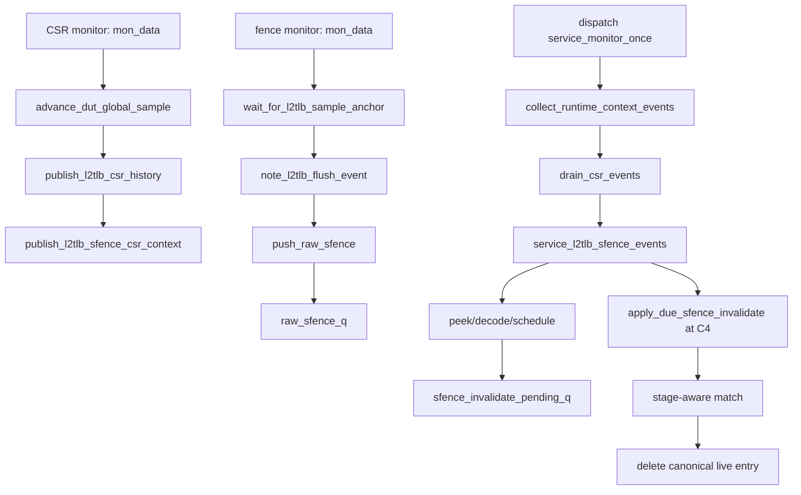

# V2 SFENCE/HFENCE Live Entry 失效 Flow

本文描述当前 V2 `mem_ut` 中 `SFENCE.VMA`、`HFENCE.VVMA` 与 `HFENCE.GVMA` 从 DUT interface 被采样，到 C4 删除
`tlb_entry_by_key` 中 logical live entry 的真实测试框架流程。`L2TLB_agent` 仍是 DTLB 的上游 responder；本 flow
不建模 L2Cache、PTW 或 memory 下游访问，也不取消 responder token、UID waiting record 或已冻结 response snapshot。

该 live entry 是测试框架的 completed-translation logical model，不是 V2 `TLBStorage` 或 `PageTableCache` 的
source-equivalent cache entry。因此默认使用 architecture matcher；V2 本地 cache 的 over-fence 不属于本 flow。

## 术语与抽象功能说明

| 英文术语 | 当前 flow 中的中文含义 | 代码对象/状态落点 | 示例 |
|---|---|---|---|
| `raw fence` | monitor 在一个 DUT sample 观察到的 fence 原始事实，尚未解释 stage。 | `dispatch_raw_sfence_t`、`raw_sfence_q` | C0 的有效 `HFENCE.GVMA` 形成一条 FIFO item。 |
| `CSR context` | 与 raw fence 同 sample 冻结的虚拟化、VMID 和 translation mode。 | `memblock_l2tlb_sfence_csr_context_t` | fence monitor 先到时，CSR monitor 随后绑定同 sample context。 |
| `logical live entry` | 测试框架保存的 canonical L2TLB response payload。 | `common_data_transaction::tlb_entry_by_key` | fence 删除后同 key 的新 request 会重新 build 新 generation。 |
| `C0/C4` | C0 是 fence 被 monitor 采样的 global sample；C4 是 V2 filter flush 的第一个破坏性删除边界。 | `anchor_sample_seq`、`due_sample_seq` | C0 只登记，C4 才删除 entry。 |
| `pending invalidate` | 已登记但尚未到 C4 的 live-entry 删除工作。 | `sfence_invalidate_pending_q` | adapter service 在 C0 push，C4 pop 并扫描 live table。 |
| `adapter owner` | dispatch-active 下唯一可 destructive peek/pop raw fence、schedule 和 apply due 的组件。 | `dispatch_monitor_event_adapter` | responder sequence 不读取 `raw_sfence_q`。 |
| `frozen provenance` | entry build 时保存的 stage-active、mode、level、generation。 | `memblock_tlb_entry::*_at_build` | 当前 CSR 切换后，旧 entry 仍按自身 Sv39/Sv48 mode 匹配。 |
| `architecture matcher` | 只按目标 stage、自身范围与 ASID/VMID 进行精确失效的 logical model。 | `sfence_match_entry()` | allStage 的 S1 fence 与 G-stage fence 分别读不同字段。 |
| `no-dispatch` | testcase 不运行 dispatch service 的固定拓扑。 | `dispatch_l2tlb_lookup_active=0` | raw fence 不进入 FIFO，live entry 表必须为空。 |

| 函数/task | 抽象功能描述 |
|---|---|
| `publish_l2tlb_sfence_csr_context()` | CSR monitor 发布本 sample 的 immutable context，并只绑定当前 sample 的 raw FIFO 队尾；不消费 FIFO。 |
| `fence_agent_agent_monitor::mon_data()` | 采样有效 fence、建立 raw provenance 并发布 lifecycle event；不决定匹配 stage 或删除 entry。 |
| `push_raw_sfence()` | 以固定 topology 判断 raw 是入 FIFO、丢弃还是 fatal；不解释 payload。 |
| `service_l2tlb_sfence_events()` | 每个 dispatch sample 的唯一 raw-fence service，先登记 C4 work，再应用到期 work。 |
| `drain_l2tlb_sfence_events()` | 按 FIFO 进行 `peek -> 校验 -> decode -> schedule -> pop`；context 未就绪时不破坏队首。 |
| `decode_raw_sfence()` | 将已绑定 context 的 raw 转为唯一 S1 或 S2 target payload；不扫描 live table。 |
| `sfence_match_entry()` | 判断一个 canonical entry 是否在已解码 fence 的架构作用域；不删除 entry。 |
| `apply_due_sfence_invalidate()` | 在 C4 扫描 bounded live map，收集命中 key 后统一删除；不修改 token/UID。 |

## 总体调用 Flow



整体文字伪代码：

```text
1. CSR monitor 在每个 post-reset sample 建立唯一 global sample，发布 history 和同拍 fence context。
2. fence monitor 取得同一个 sample，只有 sfence.valid 明确为 1 时才建立 raw fence；它保留 rs1/rs2/addr/id/hv/hg，
   并记录 sample/reset/event provenance。
3. dispatch-active 时 raw 进入 FIFO；no-dispatch 时 raw 直接丢弃且不得拥有 response event sequence。
4. dispatch service 在一个 sample 仅调用一次 adapter service。adapter 先从 FIFO 队首读取，不提前 pop。
5. adapter 校验 epoch、event 和 context 后，解码 target stage，把 C0 work 写到公共 pending invalidate queue，随后才 pop 同一 raw。
6. C0 到 C3 不删除 logical live entry；C4 到期后只扫描 live table，按分阶段 matcher 收集命中 key，再统一删除。
7. responder token/UID 的 C0/C4 barrier 由 L2TLB lifecycle flow 独立处理；两侧共享 due sample，但不互相改队列。
```

## Raw Fence 与 Context

### CSR monitor 发布

源码位置：`mem_ut/ver/ut/memblock/agent/csr_ctrl_agent_agent/src/csr_ctrl_agent_agent_monitor.sv`，task：`mon_data()`。

抽象功能描述：CSR monitor 是 global sample 与 fence context 的唯一发布者。它提供 raw fence 的解释上下文，但不处理
raw FIFO 的消费或 live-entry 删除。

```systemverilog
current_sample_seq = memblock_sync_pkg::advance_dut_global_sample($time);
memblock_sync_pkg::publish_l2tlb_csr_history(raw_csr, current_sample_seq);
memblock_sync_pkg::publish_l2tlb_sfence_csr_context(
    raw_csr,
    current_sample_seq,
    memblock_sync_pkg::get_l2tlb_current_reset_epoch(),
    $time);
```

中文伪代码：先建立本拍唯一 sample，再保存用于 responder C-2 查询的 CSR history。随后把当前的
`priv_virt`、`hgatp_vmid` 和三套 mode 冻结成 fence context。若 fence monitor 已先把同拍 raw 放入 FIFO，context helper
只绑定该队尾 item；不会把下一拍的 CSR 覆盖给旧 raw。

### Fence monitor 发布

源码位置：`mem_ut/ver/ut/memblock/agent/fence_agent_agent/src/fence_agent_agent_monitor.sv`，task：`mon_data()`。

抽象功能描述：fence monitor 只将 interface 事实转成 raw event，并向 responder lifecycle 发布同拍 FENCE reason。
它不读取 mutable runtime CSR 来决定 HS/VS/G-stage。

```systemverilog
memblock_sync_pkg::wait_for_l2tlb_sample_anchor($time, sample_seq);
raw_sfence = memblock_sync_pkg::make_empty_raw_sfence();
raw_sfence.sample_seq = sample_seq;
raw_sfence.sample_time = $time;
raw_sfence.reset_epoch = memblock_sync_pkg::get_l2tlb_current_reset_epoch();
if (io_ooo_to_mem_sfence_valid === 1'b1) begin
    if (memblock_sync_pkg::dispatch_l2tlb_lookup_active &&
        memblock_sync_pkg::l2tlb_raw_fence_intake_closed) begin
        `uvm_fatal(get_type_name(), "SFENCE/HFENCE arrived after raw intake close")
    end
    raw_sfence.lifecycle_event_seq = memblock_sync_pkg::note_l2tlb_flush_event(
        $time, memblock_sync_pkg::MEMBLOCK_L2TLB_REASON_FENCE);
    raw_sfence.valid = 1'b1;
    raw_sfence.rs1 = io_ooo_to_mem_sfence_bits_rs1;
    raw_sfence.rs2 = io_ooo_to_mem_sfence_bits_rs2;
    raw_sfence.addr = io_ooo_to_mem_sfence_bits_addr;
    raw_sfence.id = io_ooo_to_mem_sfence_bits_id;
    raw_sfence.hv = io_ooo_to_mem_sfence_bits_hv;
    raw_sfence.hg = io_ooo_to_mem_sfence_bits_hg;
    memblock_sync_pkg::push_raw_sfence(raw_sfence);
end
memblock_sync_pkg::mark_l2tlb_sample_producer_done(sample_seq, 2'b10);
```

中文伪代码：monitor 先等待 CSR monitor 发布同拍 anchor，避免因为 UVM 调度顺序得到上一拍编号。若 release 已封闭
raw intake，valid fence 立即 fatal，不能先创建一个无人消费的 lifecycle event。正常 valid fence 复制原始字段、sample
和 reset epoch，交给同步包处理 context 绑定和 topology。即使本拍没有 fence，也要报告 FENCE producer done，使 adapter
能确认本 sample 的 sideband 已完整发布。

### FIFO context 绑定与 topology

源码位置：`mem_ut/ver/ut/memblock/common/memblock_common/src/memblock_sync_pkg.sv`，函数：
`publish_l2tlb_sfence_csr_context()`、`push_raw_sfence()`。

抽象功能描述：前者只绑定 FIFO 队尾的同 sample raw；后者只做 epoch/topology/FIFO 维护。两者都不 decode 或删除 entry。

```systemverilog
if (raw_sfence_q.size() != 0 && raw_sfence_q[$].sample_seq == sample_seq) begin
    raw_sfence_q[$] = bind_raw_sfence_context(raw_sfence_q[$], context);
end

if (!dispatch_l2tlb_lookup_active) begin
    if (item.lifecycle_event_seq != MEMBLOCK_L2TLB_EVENT_SEQ_NONE) begin
        `uvm_fatal("MEMBLOCK_L2TLB_TOPOLOGY", "no-dispatch raw has event seq")
    end
    return;
end
raw_sfence_q.push_back(bound_item);
```

中文伪代码：一个 fence interface 每拍最多产生一个 raw，FIFO 也按 sample 顺序推进，因此 context 发布只需查看队尾，
不会每拍扫描历史积压队列。no-dispatch 不允许创建 responder event history，也不允许保留 raw；dispatch-active 才允许
入 FIFO。旧 epoch raw 在 adapter 处记录后丢弃，future epoch raw 是时序破坏并 fatal。

## Adapter C4 调度

### 唯一 service 调度点

源码位置：`mem_ut/ver/ut/memblock/seq/base_seq/memblock_main_dispatch_auto_build_main_table_base_sequence.sv`，
task：`service_monitor_once()`。

抽象功能描述：该 task 是 dispatch service 的单一 runtime 入口。它先同步 CSR，随后每个 ready sample 只调用一次
raw-fence adapter service；不会在 context collector 中重复消费 FIFO。

```systemverilog
memblock_sync_pkg::tick_dispatch_service_cycle();
collect_runtime_context_events();
if (monitor_adapter == null) begin
    monitor_adapter = dispatch_monitor_event_adapter::type_id::create("monitor_adapter");
end
monitor_adapter.service_l2tlb_sfence_events();
if (memblock_sync_pkg::reset_backend_done !== 1'b1 ||
    memblock_sync_pkg::l2tlb_reset_active()) begin
    return;
end
```

中文伪代码：collector 只更新 runtime CSR 与 reset state。主 service 随后调用 adapter；adapter 对同一个 global sample
重复进入会 fatal。reset 未收敛时 adapter 只完成自身 reset clear/ack，不让后续 monitor batch 使用旧 raw 或旧 live entry。

### FIFO drain 与 C4 apply

源码位置：`mem_ut/ver/ut/memblock/seq/base_seq_help/dispatch_monitor_event_adapter.sv`，函数：
`drain_l2tlb_sfence_events()`、`service_l2tlb_sfence_events()`。

抽象功能描述：drain helper 是 raw FIFO 的唯一 destructive consumer。它在 schedule 成功前保持队首不变，C4 apply
则完全委托给 `common_data_transaction` 的公共 pending queue。

```systemverilog
while (memblock_sync_pkg::peek_raw_sfence(raw_sfence)) begin
    if (!raw_sfence.context_valid && raw_sfence.sample_seq == current_sample_seq) begin
        return;
    end
    payload = data.decode_raw_sfence(raw_sfence);
    if (!data.schedule_sfence_invalidate(payload,
                                          raw_sfence.sample_seq,
                                          raw_sfence.reset_epoch,
                                          raw_sfence.lifecycle_event_seq)) begin
        `uvm_fatal("DISP_RAW_SFENCE", "raw fence schedule returned failure")
    end
    if (!memblock_sync_pkg::pop_raw_sfence(consumed_sfence)) begin
        `uvm_fatal("DISP_RAW_SFENCE", "scheduled raw fence pop failed")
    end
end
void'(data.apply_due_sfence_invalidate(current_sample_seq,
    memblock_sync_pkg::get_l2tlb_current_reset_epoch()));
```

中文伪代码：adapter 先检查 CSR history 和 lifecycle producer watermark 均等于当前 sample。对于队首 raw，先处理
stale/future epoch、event sequence 与 context provenance；context 尚未到而仍是当前 sample 时保留队首等待，过了本拍仍未
绑定则 fatal。只有 `decode -> schedule` 成功后才 pop，因此不会因为 context 缺失或 schedule 失败丢事件。C4 pending queue
只保存在 `common_data_transaction`，adapter 不再维护第二份 private due queue。

## 分阶段匹配与删除

### Raw 解码和 stage 选择

源码位置：`mem_ut/ver/ut/memblock/seq/base_seq_help/common_data_transaction.sv`，函数：`decode_raw_sfence()`。

抽象功能描述：该函数将包含冻结 context 的 raw 转为唯一目标 stage payload；它不读取当前 `mmu_csr_state`，也不扫描 table。

| raw 条件 | target stage | entry `s2xlate` | 地址/ID 语义 |
|---|---|---|---|
| `hg=0,hv=0,priv_virt_at_sample=0` | HS S1 | `noS2xlate` | `addr >> 12` 是 VA VPN，ID 是 ASID。 |
| `hg=0,hv=0,priv_virt_at_sample=1` | VS S1 | `onlyStage1/allStage` | `addr >> 12` 是 GVA VPN，冻结 VMID 必须相同。 |
| `hv=1,hg=0` | VS S1 | `onlyStage1/allStage` | `addr >> 12` 是 GVA VPN，ID 是 VS-ASID。 |
| `hg=1,hv=0` | G S2 | `onlyStage2/allStage` | GVPN 从 `{addr, 2'b00} >> 12` 得到，ID 低 14 位是 VMID。 |

`hv && hg` 同时为 1 没有唯一 target stage，立即 `uvm_fatal`。`rs1=1` 表示 source register 为 x0，即 all-address；
`rs2=1` 表示 x0，即 all-ID。它们不是 operand 数值为零。

### Entry matcher

源码位置：`mem_ut/ver/ut/memblock/seq/base_seq_help/common_data_transaction.sv`，函数：
`validate_frozen_stage_level()`、`sfence_s1_addr_match()`、`sfence_s2_addr_match()`、`sfence_match_entry()`。

抽象功能描述：matcher 在 target stage eligible 后无条件验证 entry 的 frozen provenance，再以对应 stage 的 tag、level、
PTE.N、sector valididx 和 ID 规则返回命中或不命中。它不访问 `ppn_low/pteidx` 来决定地址命中，也不删除 entry。

```text
HS S1：只匹配 noS2xlate；地址按 S1 range；指定 ASID 时要求 !s1_pte_g 且 ASID 相等。
VS S1：只匹配 onlyStage1/allStage；地址按 S1 range；始终要求冻结 VMID 相等；指定 ASID 排除 s1_pte_g。
G S2：只匹配 onlyStage2/allStage；地址按 S2 GVPN range；指定 ID 时比较低 14 位 S2 VMID；不读取 S1 PTE.G。
allStage：任一被选 stage 命中后删除完整 logical entry，不只清 S1 或 S2 字段。
```

### C4 删除

源码位置：`mem_ut/ver/ut/memblock/seq/base_seq_help/common_data_transaction.sv`，函数：
`schedule_sfence_invalidate()`、`apply_due_sfence_invalidate()`、`delete_live_tlb_entry_by_anchor_key()`。

抽象功能描述：schedule 只记录 C0 事实和 `due=C0+MEMBLOCK_DUT_L2TLB_FLUSH_HOLD_CYCLES`；apply 在 due 时收集
命中 key 后删除 canonical entry。两者不拥有 response token 或 UID lifecycle。

```text
schedule：验证 payload/sample/reset/event provenance，push 公共 pending invalidate queue。
apply due：丢弃旧 reset epoch；future epoch fatal；扫描 tlb_entry_by_key；先收集命中 key，再统一删除。
delete：只删除 canonical live entry。本 flow 不修改 main table、status、UID history 或 pending response snapshot。
```

## Reset、Release 与边界

- CSR monitor 是 `l2tlb_sfence_csr_context` 的 reset clear 唯一 writer；adapter reset 只清 raw FIFO、live entry、pending
  invalidate 与 adapter proof。
- fence monitor 在 close request 后完成一个完整 raw sample，才写 raw-fence intake close；之后再出现 valid fence 必须 fatal。
- release drain proof 同时要求 raw FIFO 与公共 `sfence_invalidate_pending_q` 为空。队列瞬时为空不能代替 producer close。
- C0-C3 已冻结的 response snapshot 保持可完成；是否 cancel token/UID 由 L2TLB lifecycle plan 决定。adapter 的 C4
  delete 不会回写或重随机该 snapshot。
- `sfence_bits_flushPipe` 是 ROB 写回 sideband，不进入本 flow 的 raw、matcher 或 token cancel。standalone mem_ut 不因它
  暂停 LSQ driver 或伪造 redirect。
- V2 `TLBStorage`/`PageTableCache` 的局部 over-fence 不在本 flow 支持范围；后续若需 source-equivalent 语义，必须按
  具体缓存新建专项，不能放宽本 architecture matcher。

## 验证状态

本次实现已通过：

```text
git diff --check
rg 检查旧 immediate-delete API 无残留
make eda_compile tc=basicTest ts=virtual_base_sequence mode=base_fun
```

`make eda_run tc=basicTest ts=virtual_base_sequence mode=base_fun` 在 VCS KDB/NFS two-step design resolution 阶段
触发工具 `SIGSEGV`，仿真没有启动；该环境错误不构成 runtime smoke 通过。后续应在修复远端 KDB 工作目录后运行
HS/VS/GVMA、VMID delayed-drain、C4 删除与 reset stale-work 的 directed 场景。
