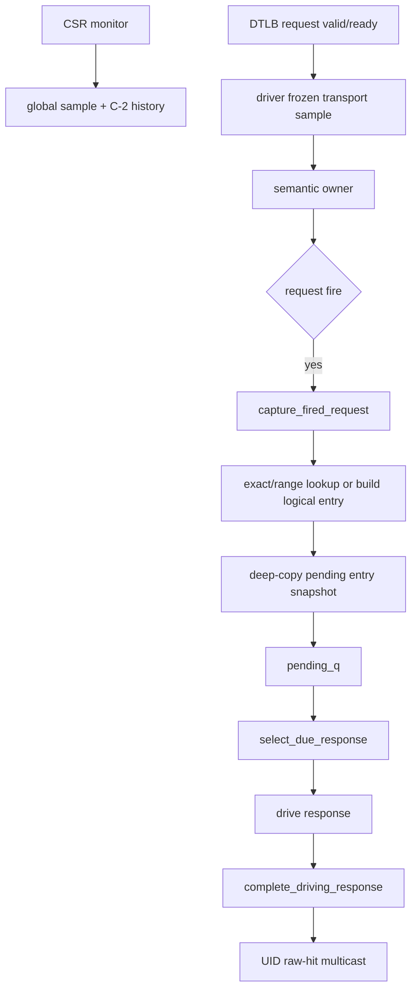

# V2 DTLB-L2TLB Responder Flow

本文描述当前 V2 `mem_ut` 的 `L2TLB_agent` responder。它接收 DTLB 到 L2TLB 的 request，并驱动 L2TLB 到 DTLB
的 response；它不是 L2Cache/PTW/memory 下游模型。接口 request 只有 `vpn/s2xlate`，ASID、VMID 与 translation
mode 从对应 sample 的 CSR history 获得。

## 术语与抽象功能说明

| 英文术语 | 当前 flow 中的中文含义 | 代码对象/状态落点 | 示例 |
|---|---|---|---|
| `request fire` | DTLB request 的 `valid && ready` 在真实 driver sample 成立。 | `sampled_req_fire`、`capture_fired_request()` | 同 key 的两次 fire 必须建立两个 token。 |
| `token` | 一次 request fire 对应的一笔 pending response 生命周期记录。 | `memblock_l2tlb_pending_req`、`pending_q` | 相同 lookup key 的 request 不合并 token。 |
| `frozen transport sample` | driver 在 `drv_cb` 固化的 interface 状态与 item provenance。 | `memblock_l2tlb_drv_sample_t`、mailbox wrapper | sequence 不重读 live VIF。 |
| `global sample` | CSR monitor 在每个 post-reset `mon_cb` 唯一推进的测试框架周期号。 | `dut_sample_seq` | monitor、driver、adapter 都只读同一编号。 |
| `C-2 CSR history` | V2 filter 实际可见的 CSR 历史项。 | `get_l2tlb_request_csr_history()` | request C 时 lookup 使用 CSR C-2。 |
| `issue-time CSR` | UID 建立 WAITING 时冻结的历史 CSR，不代表 request 最终 fire 时 DUT 使用的 CSR。 | `memblock_uid_tlb_record.csr_snapshot` | UID 在 CSR=A 下 issue、稍后在 CSR=B 下真正发 request。 |
| `request-fire CSR` | 本次 DTLB request `valid && ready` 成立时，V2 filter 实际可见的 C-2 CSR。 | `memblock_l2tlb_pending_req.csr_snapshot` | 用它构造本次 token 的 request lookup key。 |
| `UID request-fire marker` | WAITING UID 已被某次真实 request fire 覆盖的首个 global sample；0 表示尚未观察到请求。 | `uid_tlb_first_request_fire_sample_seq` | C4 只取消 marker 已建立且不晚于 C0 的旧等待实例。 |
| `flush barrier` | C0 fence/CSR event 到 C4 filter flush 的 lifecycle 记录。 | `barrier_q` | C0 fire 正常建 token，C4 才取消旧 pending token。 |
| `pre-ready baseline` | owner 首次开放 ready 前对历史 event 和空状态的启动校验。 | `owner_start_baseline_done`、`pre_ready_hold_until_sample` | 旧 event 只推进 cursor/hold，不建立新的 C0/C4 barrier。 |
| `logical live entry` | canonical raw response payload 的缓存对象。 | `tlb_entry_by_key` | adapter 的 C4 delete 后重新 build。 |
| `adapter raw-fence owner` | 唯一可 pop/decode/schedule/apply raw fence 的 dispatch 组件。 | `dispatch_monitor_event_adapter` | responder sequence 不读取 `raw_sfence_q`。 |
| `owner` | 唯一拥有 responder token、ready、response 与 release 的 sequence 实例。 | `l2tlb_lifecycle_owner_*` | legacy default 和显式 vseq 不能并发启动。 |
| `mailbox` | driver 与 owner 之间的单槽 frozen sample 状态机。 | sequencer transport slot | owner ack 后 driver 下一 `drv_cb` recycle。 |
| `release grant` | parent 在所有 owner/adapter/fence proof 收敛后发送的一次释放许可。 | `grant_l2tlb_final_release()` | owner 不能自行 clear claim。 |

| 函数/task | 抽象功能描述 |
|---|---|
| `advance_dut_global_sample()` | CSR monitor 为当前 monitor sample 分配唯一 global sample；其它模块只能读取。 |
| `capture_fired_request()` | 将已 fire 的 request 与 C-2 CSR snapshot 转成独立 token，并冻结 entry snapshot。 |
| `mark_waiting_uid_records_on_request_fire()` | 用本次 token 的 request-fire C-2 CSR 为同 shape 的 WAITING UID 写 marker；不以 UID issue-time CSR 拒绝候选，也不绑定唯一 token。 |
| `select_due_response()` | 从到期 token 中按 ordered/reorder 规则选一笔 response；不创建 token。 |
| `complete_driving_response()` | 在真实 response sample 后完成 token，并以 response-visible CSR 对 waiting UID 做 raw-hit multicast。 |
| `handle_l2tlb_flush_event()` | 为当前 sample event 建 C0/C4 token/UID barrier；不消费 raw fence FIFO。 |
| `apply_due_l2tlb_flush_barriers()` | C4 取消仍 pending 的旧 token 和符合 marker 条件的 UID；不删除 live entry。 |
| `service_l2tlb_sfence_events()` | adapter 的独立 raw-fence service，在 C4 删除 logical live entry；不修改 token/UID。 |
| `release_l2tlb_lifecycle_owner()` | 在 final sample、mailbox recycle、response/adapter/fence drain 与 parent grant 全部成立后释放唯一 owner。 |

## 启动与单 Owner

`basicTest::initialize_l2tlb_testcase_lifecycle()` 在 testcase 启动时固定 responder mode、dispatch topology 与启动方式。
`MEMBLOCK_L2TLB_SEQ_EN=1` 且 connect takeover 无效时是配置错误；no-dispatch 是固定拓扑，不允许后续切换成
dispatch-active。

```text
启动 responder：
  sequence 检查 connect takeover 与 runtime enable。
  try_claim_l2tlb_lifecycle_owner(owner_name) 成功后才可以驱动 ready/response。
  另一个 default sequence 或显式 vseq 再 claim 时立即 fatal。
  首次开放 ready 前检查当前 transport、pending response、barrier 和 WAITING UID 均为空；启动期历史 event 只推进 cursor，
  不调用 active flush handler。

关闭 responder：
  global stop 只停止 routing。
  owner 在真实 drv_cb 结算已驱动 ready 窗口的 request fire，建立 admission close。
  driver 确认 RELEASE_STOP 和 RELEASE_FINAL_INACTIVE，owner/monitor/driver 分别完成 ack/recycle。
  parent 只有 release_grantable() 为真时才发 release grant，owner 再清 claim。
```

## Request 与 Response Flow



整体文字伪代码：

```text
1. CSR monitor 每个 post-reset monitor sample 先推进 global sample，再发布完整 CSR history。
2. driver 在真实 drv_cb 冻结 request valid/vpn/s2xlate、ready、response 和 metadata，写入单槽 mailbox。
3. owner 消费该 mailbox。request fire 时按当前 sample 的 C-2 CSR 创建 request lookup key，并为同
   `{vpn,s2xlate}` 的 WAITING UID 写 request-fire marker；UID issue-time CSR 只保留历史/debug，不能拒绝该 marker。
4. exact hit 复用 canonical logical entry；range lookup 专项完成后 exact miss 可以按 secondary range index 复用 entry；
   两者都要深拷贝 entry 到 token 私有 snapshot。miss 才随机 build 新 entry。
5. token 到 due sample 后按 ordered/reorder 选择 response。response fire 后才完成 token，并使用 response fire 拍 C-2 CSR
   对全部 WAITING UID 做 raw-hit multicast；token 不与唯一 UID 绑定。
6. response snapshot 已冻结，因此 live entry 后续被 SFENCE 删除不会改变已经接受的 response payload。
```

### Request capture

源码位置：`mem_ut/ver/ut/memblock/seq/base_seq/memblock_l2tlb_base_sequence.sv`，函数：`capture_fired_request()`。

抽象功能描述：该函数在唯一 owner 已观察到真实 request fire 后建立 token，冻结 request-time CSR、lookup result 与
response payload；它不处理 future fence raw 或直接驱动 response。

```text
读取 request 的 vpn/s2xlate。
在分配任何 token 或 UID marker 前检查 local/shared admission cutoff；close 后若仍观察到真实 fire 立即 fatal。
从当前 global sample 查询 C-2 CSR history；warm-up 未完成时 ready 保持 0，已 fire 后缺失 history 则 fatal。
调用 common_data 的 get_or_create lookup API 得到 canonical entry；随后逐字段 copy 到 token entry_snapshot。
调用 mark_waiting_uid_records_on_request_fire：只使用 token 保存的 request-fire C-2 CSR 在 bounded
{vpn,s2xlate} bucket 中确认候选 UID，并写首次 fire sample；不使用 UID issue-time CSR 做第二次 key 比较。
分配 request_token、due_sample 和 latency bucket，push pending_q。
```

### UID request-fire marker

源码位置：`mem_ut/ver/ut/memblock/seq/base_seq_help/common_data_transaction.sv`，函数：
`mark_waiting_uid_records_on_request_fire()`。

抽象功能描述：该 helper 在一笔 request 已实际 fire 后，为可能进入同一 DTLB filter request 生命周期的
WAITING UID 写入首个 fire sample。它只维护 UID cancel provenance，不把 token 归属到单个 UID，也不完成
response 回填或制造 redirect。

```text
request_key = pending.request_lookup_key  // 由 pending 的 request-fire C-2 CSR 构造
shape_key = {pending.vpn, pending.s2xlate}
遍历该 bounded bucket：
  跳过无效或非 WAITING record；
  用 pending.csr_snapshot + record.vpn/s2xlate 重建 request_candidate_key；
  若 request_candidate_key 不等于 request_key：跳过；
  禁止用 record.csr_snapshot 重建第二个 candidate key；
  marker 为 0 时，写入本次真实 request fire 的 sample。
```

最小例子：UID 在 CSR=A 下 issue，CSR 切换后 request 在 C-2 CSR=B 下 fire。此时 B 是 marker 的唯一
上下文；A 仅用于说明 UID 的历史来源。若因 A 与 B 不同而不写 marker，C4 cancel 和后续 UID 生命周期都会失去
已发生 request fire 的证据。

当前文档合同要求上述规则成立；源码中若仍把 `record.csr_snapshot` 作为硬匹配条件，则属于 P1 待修正项，
不能把该情况标记为已完成。

### Response completion

源码位置：`mem_ut/ver/ut/memblock/seq/base_seq/memblock_l2tlb_base_sequence.sv`，函数：
`select_due_response()`、`complete_driving_response()`。

抽象功能描述：前者只选择已到期 token，后者只在 driver sample 确认 response 后完成该 token 并进行 UID 回填。

```text
select：due 之前不选；ordered 模式先阻塞队头，reorder 模式可从所有 due token 选择一笔。
complete：确认 complete sample 不早于 due；读取 response sample 的 C-2 CSR；按 raw hit 更新零个、一个或多个 waiting UID；
          从 driving state 释放 token。没有 UID 命中是合法信息，不等同于 token 失败。
```

## Flush 与 Live Entry 分离

### Token/UID 生命周期

源码位置：`mem_ut/ver/ut/memblock/seq/base_seq/memblock_l2tlb_base_sequence.sv`，函数：
`handle_l2tlb_flush_event()`、`apply_due_l2tlb_flush_barriers()`。

抽象功能描述：owner 从 response event history 建立 C0/C4 barrier，C4 取消仍未完成的旧 token/UID。它不读取或消费
`raw_sfence_q`，也不删除 logical live entry。

```text
C0：记录 barrier，关闭后续 ready；同拍已发生的 request fire 仍建立 token。
C1-C3：旧 token 可以按正常 due 规则返回 response。
C4：禁止本拍新 response fire，取消仍 pending 的旧 token；只取消 first_request_fire_sample <= C0 的 waiting UID。
C5：无后续 barrier 时重新给 ready opportunity。
```

### Raw fence / live entry 生命周期

源码位置：`mem_ut/ver/ut/memblock/seq/base_seq_help/dispatch_monitor_event_adapter.sv`，函数：
`service_l2tlb_sfence_events()`。

抽象功能描述：dispatch adapter 是 raw-fence destructive owner。它将 C0 raw 转为 common-data pending invalidate，
并在 C4 删除 canonical logical live entry；它不创建或取消 token、UID。

```text
adapter 检查本 sample 的 CSR/fence producer watermark。
adapter 按 FIFO 执行 peek -> epoch/context 校验 -> decode -> schedule -> pop。
common_data 在 due=C0+4 时用 stage-aware matcher 删除命中的 canonical entry。
token snapshot 和 UID history 不被 adapter 修改。
```

两条 flow 使用同一个 C4 边界但不互相扫描队列。具体 stage matcher、raw context 与 C4 delete 见
[`sfence_flow.md`](sfence_flow.md)。

## 当前 Dispatch Service 调度

源码位置：`mem_ut/ver/ut/memblock/seq/base_seq/memblock_main_dispatch_auto_build_main_table_base_sequence.sv`，
task：`service_monitor_once()`。

抽象功能描述：此 task 是 dispatch topology 的单一 service tick。它先同步 runtime CSR，再恰好一次运行 raw-fence
adapter service；L2TLB responder 和 LSQ monitor batch 在之后各自消费所属状态。

```systemverilog
memblock_sync_pkg::tick_dispatch_service_cycle();
collect_runtime_context_events();
if (monitor_adapter == null) begin
    monitor_adapter = dispatch_monitor_event_adapter::type_id::create("monitor_adapter");
end
monitor_adapter.service_l2tlb_sfence_events();
if (memblock_sync_pkg::reset_backend_done !== 1'b1 ||
    memblock_sync_pkg::l2tlb_reset_active()) begin
    return;
end
monitor_adapter.drain_lsq_timing_sidebands();
collect_monitor_event_batch();
exception_redirect_replay_task();
monitor_adapter.service_lsq_timing_reconcile();
```

中文伪代码：每个 negedge service tick 先推进软件 cycle 并由 collector 同步 CSR。随后只在这里调用一次 raw-fence
service；collector 不再直接 pop raw FIFO。若 reset 未完成，adapter 只清本职责状态并返回，后续 LSQ batch 不能处理
stale raw。正常路径再处理 LSQ sideband、writeback/feedback batch、redirect/replay 与 cancel reconcile。

## Reset、Stop 与失败边界

- reset coordinator 为当前 epoch 收集 CSR、fence、monitor、response 与 adapter 的直接 writer ack。一个 writer 不能替另一个
  writer 清状态或写 ack。
- `raw_sfence_q` 与 live entry 属于 adapter；CSR context/history 属于 CSR monitor；token/UID/barrier 属于 semantic owner；
  transport mailbox 的 publish/recycle 属于 driver。
- 旧 reset epoch 的 raw/pending invalidate 只记录后丢弃；future epoch、context epoch 混用、sample watermark 逆序和
  迟到 active event 都是 `uvm_fatal`。
- no-dispatch 时 driver 保持 inactive。若 monitor 观察到 DTLB request valid 或 raw FIFO/live entry 非空，立即 fatal，
  不能把 ready=0 导致的“未 fire”误当成支持。
- `flushPipe` 是 fence uop 的 ROB 写回 sideband；standalone responder 不由它暂停 LSQ 或伪造 full-core redirect。

## 验证状态与后续

本次 SFENCE/HFENCE stage-aware 实现已通过静态检查和：

```text
make eda_compile tc=basicTest ts=virtual_base_sequence mode=base_fun
```

基础 `eda_run` 被远端 VCS KDB/NFS `SIGSEGV` 阻断，未进入 runtime。range/NAPOT exact-miss lookup、secondary index
注册/注销和 64 KiB NAPOT validation 已由
`AI_DOC/plan/test_framework/plan/do/mem_ut_v2_l2tlb_range_lookup_napot_plan_20260806.md` 完成；stage-aware C4 delete
通过统一 delete helper 同时删除 canonical map entry 与其 range index。
