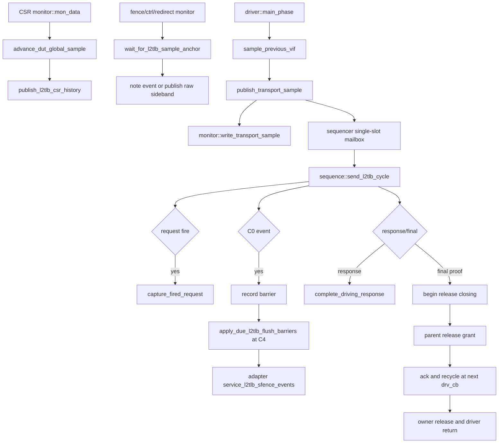
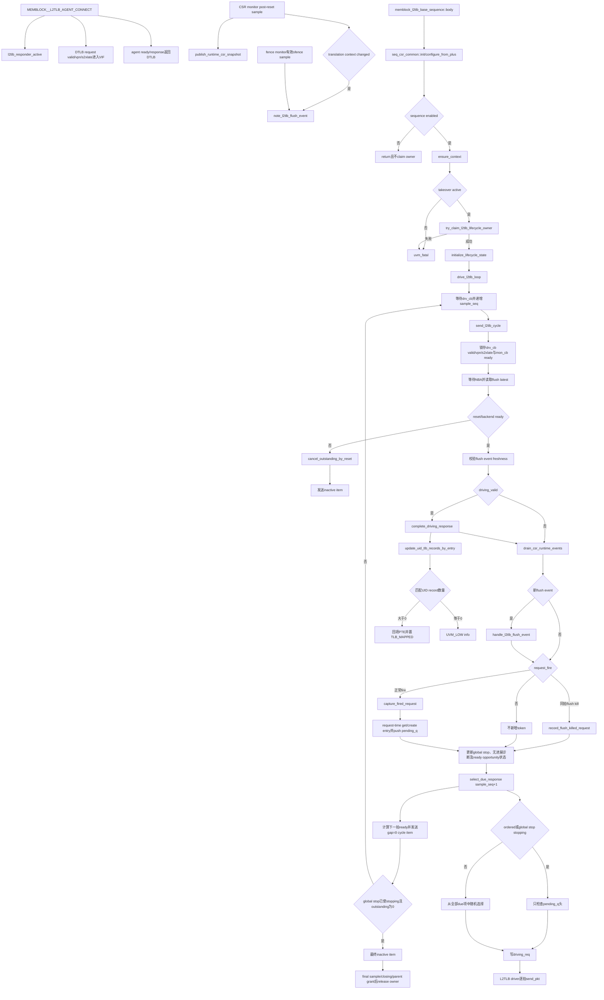

# mem_ut TLB/L2TLB Responder Flow

本文档说明 V2 mem_ut 中 L2TLB responder 的真实函数调用链。当前 `L2TLB_agent` 位于 DTLB 与 L2TLB 的 request/response 连接点：request 方向是 DTLB 到 `L2TLB_agent`，response 方向是 `L2TLB_agent` 到 DTLB。它不建模 L2TLB 到 L2Cache、PTW page walk 或 memory 的下游访问。

**当前生效版本说明：** V2 的 transport sample、C0/C4 flush、reset、stop/final 和 owner release 以本页新增的
“V2 当前生效时序合同”以及
`AI_DOC/plan/test_framework/plan/do/mem_ut_v2_l2tlb_sfence_flush_token_timing_correction_plan_20260805.md`
为准。原有第 1 节及其后章节保留旧 responder 行为，专门用于与修改前逻辑对比；其中的独立 live-VIF 采样、
`record_flush_killed_request()`、sequence 直接消费 latest flush 和 phase kill 退出描述，不得作为 V2 coding 依据。

## 0. V2 当前生效时序合同

### 0.1 术语与抽象功能说明

| 英文术语 | 当前 V2 flow 中的中文含义 | 代码对象/状态落点 | 典型例子 |
|---|---|---|---|
| `frozen transport sample` | driver 在一个真实 `drv_cb` 边界把 request、response、reset 和 item provenance 冻结成的不可变快照 | `memblock_l2tlb_drv_sample_t`、`L2tlb_agent_agent_transport_sample` | C0 同时保存 `valid/ready/fire`，后续不再读取 live VIF |
| `global sample` | CSR monitor 在 post-reset monitor 边界唯一推进的跨组件时基 | `dut_sample_seq`、`advance_dut_global_sample()` | CSR、fence、ctrl、redirect 和 driver 使用同一个 sample N |
| `C0/C4` | flush event 被采样的起点和 V2 filter 完成清理的到期边界 | `anchor_sample_seq`、`barrier_q` | C0 建 barrier，C4 才取消旧 pending token |
| `flush barrier` | 从 C0 到 C4 期间阻止新 request admission 的记录 | `memblock_l2tlb_event_record_t`、`barrier_q` | barrier 未到期时 ready 必须为 0 |
| `semantic owner` | 唯一解释 frozen sample、创建 token、调度 response 和释放 lifecycle 的 sequence | `memblock_l2tlb_base_sequence` | driver 不直接改 token/UID |
| `transport mailbox` | driver 和 semantic owner 之间的单槽 sample 生命周期 | sequencer slot、`PUBLISHED/CONSUMED/DROPPED` | 未 ack 的 sample 不能被下一 sample 覆盖 |
| `response-visible CSR` | DUT 在 response fire 拍对应的 C-2 CSR history，不是 UID 建立时的旧 snapshot | `get_request_csr_snapshot()` | response raw hit 使用 response 拍上下文 |
| `producer barrier` | 当前 global sample 的 CSR/fence producer 都已报告完成检查的同步标志 | `sample_producer_done_mask` | 没有 fence 事件也必须报告 fence producer done |
| `release grant` | parent 在 global stop 后向 owner 发出的单向最终释放许可 | `grant_l2tlb_final_release()` | owner 不能自己伪造 grant 或提前 clear claim |
| `passive sampler` | 无 dispatch owner 时只采样/诊断物理接口、固定 inactive 的 driver 分支 | `L2tlb_agent_agent_driver` | passive 模式看到 DUT request valid 立即 fatal |

### 0.2 关键函数的抽象功能

| 函数/task | 抽象功能描述 |
|---|---|
| `advance_dut_global_sample()` | CSR monitor 为当前 post-reset monitor 边界建立唯一 global sample，并检查上一拍 producer barrier 已闭合；其它组件只读取结果。 |
| `sample_previous_vif()` | driver 在真实 `drv_cb` 边界冻结上一 item 对应的接口值和 provenance；不建 token、不修改主表。 |
| `publish_transport_sample()` | 将 frozen sample 同步送给 monitor，并在 owner 有效且 slot 空闲时发布给 semantic owner；只有成功发布后才置 mailbox non-empty。 |
| `send_l2tlb_cycle()` | sequence 消费一份 sample，完成 response、C0/C4 barrier、request fire、stop/final item 和 sample ack。 |
| `service_l2tlb_sfence_events()` | dispatch adapter 按 raw 自身 C0 sample 调度 live-entry invalidate，并在 C4 删除命中的 entry；不由 responder sequence 重复消费。 |
| `recycle_transport_sample_at_drv_cb()` | 下一真实 driver callback 回收 owner 已 ack 的 slot，并在 final sample 回收后清理 provenance。 |

### 0.3 函数调用 Flow 图



### 0.4 函数调用 Flow 图整体文字伪代码

```text
V2 L2TLB responder 主流程：

1. CSR monitor 在 post-reset monitor 边界调用 advance_dut_global_sample，检查上一 sample 的 producer mask，
   再发布本拍 CSR history；CSR monitor 是 global sample 的唯一推进者。
2. fence、ctrl、redirect monitor 通过 wait_for_l2tlb_sample_anchor 读取同一 sample 序号，只发布各自 raw sideband，
   不创建 response token，也不推进 global sample。
3. driver 在真实 drv_cb 调用 sample_previous_vif，冻结上一 item 的 request/response/reset/provenance；
   调用 publish_transport_sample 时先让 monitor 同步处理同一 wrapper，只有 owner slot 成功占用后才唤醒 sequence。
4. sequence 取得 slot 后调用 send_l2tlb_cycle：
   先处理真实 response fire 和 C0/C4 barrier，再处理本拍 request fire；C0 同拍 fire 必须创建 token，不能立即 kill。
   C4 只取消仍 pending 且早于 barrier 的 token/UID fire marker；adapter 在自己的 due 阶段删除 live entry。
5. sequence 把下一拍 response 或 inactive/stop/final item 放回 driver；每个 sample 必须先 ack 当前 slot，
   driver 在下一真实 drv_cb 回收已完成 slot。
6. global stop 后 parent 发一次 release grant；owner 等 final proof、response/UID/barrier/raw adapter 收敛后释放 claim，
   driver 在 mailbox 和 slot 都为空时自然退出。任何未确认的 token、UID waiting、barrier 或 final sample 都禁止提前终止。
```

### 0.5 关键源码合同

源码位置：`mem_ut/ver/ut/memblock/seq/base_seq/memblock_main_dispatch_auto_build_main_table_base_sequence.sv`，task：`service_monitor_once()`。

抽象功能描述：该 task 为一个 dispatch service tick 建立唯一的 runtime context 入口；它在 reset 未收敛时停止后续 batch，正常时每个 sample 只调用一次 L2TLB adapter service。

```systemverilog
task memblock_main_dispatch_auto_build_main_table_base_sequence::service_monitor_once();
    memblock_sync_pkg::tick_dispatch_service_cycle();
    collect_runtime_context_events();
    if (memblock_sync_pkg::reset_backend_done !== 1'b1 ||
        memblock_sync_pkg::l2tlb_reset_active()) begin
        return;
    end
    if (monitor_adapter == null) begin
        monitor_adapter = dispatch_monitor_event_adapter::type_id::create("monitor_adapter");
    end
    monitor_adapter.drain_lsq_timing_sidebands();
    collect_monitor_event_batch();
    exception_redirect_replay_task();
    monitor_adapter.drain_lsq_timing_sidebands();
    monitor_adapter.service_lsq_timing_reconcile();
endtask
```

中文伪代码：该 task 先推进 service cycle，再调用 `collect_runtime_context_events()`，由它创建/绑定 adapter、同步 CSR 并处理 C0/C4 raw fence；如果 backend 或 runtime reset 未收敛，立即返回，避免后续 batch 消费 stale 状态。正常时确保 adapter 存在，先后处理 LSQ sideband、monitor batch、异常/redirect/replay，再做一次 sideband reconcile；同一 sample 的 L2TLB context service 不重复调用。

源码位置：`mem_ut/ver/ut/memblock/agent/L2tlb_agent_agent/src/L2tlb_agent_agent_driver.sv`，task：`sample_previous_vif()`。

抽象功能描述：该 task 将真实 driver callback 的物理事实冻结为一个不可变 sample，供 monitor 和 semantic owner 共享；它不推导软件语义。

```systemverilog
sample.transport_sample_seq = ++transport_sample_seq;
sample.dut_sample_seq = memblock_sync_pkg::peek_current_dut_global_sample();
sample.sample_valid = memblock_sync_pkg::dut_sample_time_valid &&
                      memblock_sync_pkg::dut_sample_time == $time &&
                      sample.dut_sample_seq != 0;
sample.sampled_req_fire = (sample.sampled_req_valid === 1'b1) &&
                          (sample.sampled_req_ready === 1'b1);
```

中文伪代码：driver 先递增物理 transport 序号，再只读 CSR monitor 已发布的 global sample；时间不匹配时把 sample 标为未就绪，不能自行创建新 sample。读取 request valid/ready 后仅在两者明确为 1 时计算 fire，X/Z 或 reset 状态不会被误当作有效握手；该结果随后由 owner 决定是否建 token。

源码位置：`mem_ut/ver/ut/memblock/agent/L2tlb_agent_agent/src/L2tlb_agent_agent_driver.sv`，函数：`publish_transport_sample()`。

抽象功能描述：该函数把同一个 frozen wrapper 同步交给 monitor 和单槽 mailbox，并保证 mailbox 状态只在真实 publish 成功后变为 non-empty。

```systemverilog
if (publish_semantic_sample) begin
    if (!transport_slot_owner.publish_transport_sample(wrapper)) begin
        `uvm_fatal(get_type_name(), "failed to reserve L2TLB transport sample slot")
    end
end
transport_sample_ap.write(wrapper);
if (publish_semantic_sample) begin
    memblock_sync_pkg::mark_l2tlb_transport_sample_mailbox_nonempty();
    void'(transport_slot_owner.notify_transport_sample_published());
end
```

中文伪代码：如果 owner 已 claim、reset/final gate 允许且 slot 为空，先向 sequencer 预留 wrapper；预留失败立即 fatal。随后同步调用 monitor analysis port，保证 monitor 先处理同一 sample；只有 analysis 返回且 slot 仍为有效发布状态时，才标记 mailbox non-empty 并唤醒 owner。passive/reset-only sample只走 analysis，不进入 semantic mailbox。

源码位置：`mem_ut/ver/ut/memblock/seq/base_seq/memblock_l2tlb_base_sequence.sv`，task：`send_l2tlb_cycle()`。

抽象功能描述：该 task 是唯一 semantic owner 的逐 sample 仲裁入口，负责把 frozen physical fact 转成 token、barrier、response 和 release 状态；driver 和 adapter 不替它修改这些状态。

```systemverilog
if (sample.sampled_final_inactive_proof_valid) begin
    memblock_sync_pkg::begin_l2tlb_release_closing(lifecycle_owner_name);
    ack_l2tlb_transport_sample(sample.transport_sample_seq,
                               memblock_sync_pkg::MEMBLOCK_L2TLB_SAMPLE_CONSUMED);
    return;
end
apply_due_l2tlb_flush_barriers(sample.dut_sample_seq);
if (sample.sampled_req_fire) begin
    capture_fired_request();
end
```

中文伪代码：final proof 分支优先验证并进入 closing，ack 当前 slot 后等待 parent grant；它不能被 NOT_READY 或普通 idle 分支覆盖。普通 sample 先消费当前 due barrier，C4 只清理仍 pending 的旧 token/UID marker；随后若 frozen sample 明确记录 request fire，调用 `capture_fired_request()` 用 request-time C-2 history 建立独立 token。响应完成由 `complete_driving_response()` 使用 response-visible CSR 处理，不能用 live latest 或 UID 建立时 CSR替代。

### 0.6 状态与退出边界

| 状态/对象 | 唯一写者 | 清理/消费时机 | 不能做的事情 |
|---|---|---|---|
| global sample | CSR monitor | runtime reset 由 coordinator 重新建 epoch，但不回退历史 sample | 其它 monitor、driver、sequence 不得 advance |
| frozen sample | driver | owner `CONSUMED/DROPPED` 后下一 drv_cb recycle | monitor/sequence 不得改 payload |
| token/UID waiting | semantic owner sequence | response complete、C4 cancel 或 reset cancel | driver/adapter 不得直接删除 |
| live TLB entry | dispatch adapter | raw event 自身 C4 due | responder 不得重复 pop/apply raw fence |
| final proof/mailbox | driver + sequencer slot | owner ack 后下一 drv_cb recycle | final helper 不得提前伪造 mailbox non-empty |
| lifecycle owner | claim/release helpers | parent grant、final proof、所有账本收敛后 release | phase kill 不是正常退出条件 |


## 1. 术语与抽象功能说明

### 1.1 术语

| 英文术语 | 当前 flow 中的中文含义 | 代码对象或状态落点 | 示例 |
|---|---|---|---|
| `sample` | DUT 在一个 clocking block 边界看到的稳定接口值 | `sample_seq`、`drv_cb`、`mon_cb` | sample N 采到上一周期已驱动的 `ready` |
| `request fire` | 同一 sample 的 request `valid && ready` 为 1，表示 DUT 与 responder 完成一笔请求握手 | `request_fire()`、`sampled_req_*` | 只有 fire 才创建动态 request token |
| `token` | 测试框架给每次 request fire 分配的单调编号，只用于生命周期审计 | `memblock_l2tlb_pending_req::request_token` | 相同 lookup key 的两次 fire 仍有两个 token |
| `pending_q` | 已经 fire、但尚未选到 response 端口的 bounded request 队列 | `memblock_l2tlb_base_sequence::pending_q` | 长延迟 request 在到期前保留在队列中 |
| `driving_req` | 已经放入当前 cycle item，等待下一 sample 确认完成的唯一 response | `driving_req`、`driving_valid` | V2 response 无 ready，下一 sample 即完成 |
| `outstanding` | 已接受但尚未完成或取消的 token 总数 | `pending_q.size() + driving_valid` | 用它产生 request backpressure |
| `due sample` | 一笔 request 最早允许被 DUT 采样 response 的 sample 序号 | `due_sample_seq` | 1C 档的 due 为 accept sample 加 1 |
| `ordered` | 只允许 `pending_q` 队头到期后回复 | `resp_reorder_en=0`，或公共 global stop 已使 `stopping=1` | 队头未到期时，后续已到期项也等待 |
| `reorder` | 从所有已到期 pending token 中随机选择一笔回复 | `resp_reorder_en=1` | 后接受的短延迟请求可先回复 |
| `runtime CSR latest` | CSR monitor 独立发布、可重复读取且不受 dispatch semantic capture gate 控制的最新 MMU CSR 快照 | `runtime_csr_snapshot`、`runtime_csr_snapshot_seq` | responder 首次取得该快照后才开放 request ready |
| `flush event` | CSR translation context changed 或有效 sfence sample 发布的非破坏性生命周期 sideband | `l2tlb_flush_event_seq/sample_time/valid` | responder 读取 latest，不 pop `raw_sfence_q` |
| `hold` | flush 后暂时关闭 request ready 和 response 的安全 sample 窗口 | `accept_hold_until_sample` | V2 使用编译期 `MEMBLOCK_DUT_L2TLB_FLUSH_HOLD_CYCLES` |
| `lifecycle owner` | 唯一拥有 responder queue、token、ready 和 response 调度权的 sequence 实例 | `l2tlb_lifecycle_owner_claimed/name` | agent default sequence 与显式 virtual sequence不能并发拥有 |
| `entry snapshot` | request fire 时从 live TLB entry 显式复制的不可变回复数据 | `memblock_l2tlb_pending_req::entry_snapshot` | 等待期间 live table 被 sfence 删除也不改变已接受 request 的 payload |
| `UID record` | dispatch 主表 uid 对应的 TLB 等待记录；不是每笔 DTLB request 都必须具备 | `uid_tlb_record_by_uid` | prefetch 或无 UID request 的匹配数可以为 0 |
| `ready opportunity` | reset或flush阻塞解除后至少发送一拍可接受ready的机会，不等同于真实request fire | `ready_opportunity_since_lifecycle_block` | hold结束后先发送ready，之后才允许累计无进展诊断 |

> 以下原有第 1 节及后续历史章节从这里开始仅用于“修改前行为”对比。它们保留旧字段和旧函数名，不能覆盖本节 0
> 定义的 V2 当前合同；尤其不能重新引入独立 `mon_cb` transport 采样、C0 同拍立即 kill、sequence 直接消费
> latest flush 或 phase kill 作为正常退出。

### 1.2 Flow 抽象职责

L2TLB responder 的抽象职责是：在每个 sample 精确识别 DTLB request fire，为每次 fire 冻结 request-time CSR、lookup key、TLB entry 和 response payload，然后通过 bounded queue 按 due/order 策略逐拍返回。它同时拥有 reset、flush、stop 与 token 守恒，不拥有主表 pass/fail/terminal，也不消费 dispatch semantic raw queue。

关键时序合同：

```text
进入 sample N 的 service tick：
  valid、vpn、s2xlate取 drv_cb 在该边界的 sample；
  ready取 mon_cb 在同一边界看到的实际接口 sample；
  request_fire = sampled_valid && sampled_ready；
  等待 NBA 后读取同一边界 monitor 发布的 CSR/flush latest；
  生成供下一个 sample 使用的唯一 cycle item。
```

## 2. 函数调用 Flow 图



### 2.1 函数调用 Flow 图整体文字伪代码

```text
L2TLB responder 主流程：

1. 连接和 sideband 发布：
   connect把DTLB request采到agent interface；takeover active时把agent ready/response驱回DTLB连接点；
   CSR monitor在每个post-reset sample构造runtime CSR，并在首份或payload变化时发布latest snapshot；
   CSR translation context changed或有效sfence sample调用note_l2tlb_flush_event；
   runtime CSR latest和flush latest都可重复读取，不消费dispatch raw queue。
   L2TLB sequence在每个mid-test reset窗口的首个blocked sample记录runtime snapshot seq；reset持续期间不覆盖该baseline，只有CSR monitor发布更高seq的post-reset snapshot后才重新开放ready。

2. sequence 启动和 owner：
   body初始化参数；disable时直接返回；
   enable时取得公共data和VIF，确认connect takeover active；
   调用try_claim_l2tlb_lifecycle_owner；已有owner时fatal；
   claim成功后初始化本实例queue、token、counter、sample和stop状态，再进入逐拍循环。

3. 每个 sample 的输入锁存：
   drive_l2tlb_loop等待drv_cb，sample_seq加1；
   send_l2tlb_cycle立即从drv_cb锁存valid/vpn/s2xlate，从mon_cb锁存同边界实际ready；
   之后只使用sampled字段，不再读取live request；
   等待NBA，使同边界CSR/fence monitor完成latest发布，然后读取flush event snapshot。

4. reset和flush优先级：
   reset/backend未就绪时，把pending_q和driving_req全部记为reset canceled并清除；每个reset窗口首次blocked sample关闭CSR-ready、清ready opportunity并记录snapshot序号基线，后续reset sample保持该基线，发送inactive；
   正常状态先校验新flush event的sample_time，ready曾开放后迟到或未来event在任何生命周期变更前fatal；
   校验通过后确认上一拍driving response完成，再应用runtime CSR latest；
   新flush event删除旧event版本的pending token，建立编译期hold窗口并清ready opportunity；
   若同一sample仍由旧ready形成request fire，给它分配token并记为flush canceled，不建entry、不回response。

5. request fire和冻结：
   正常request_fire且未被flush kill时调用capture_fired_request；
   读取request-time MMU CSR副本，构造{vpn,asid,vmid,s2xlate} key；
   立即命中或创建live TLB entry，再用copy_from冻结entry snapshot；
   根据snapshot填好response payload，选择1C/MID/LONG due档；
   创建独立token并push pending_q；相同key不会合并。

6. response调度：
   select_due_response以sample_seq+1为候选完成边界；
   ordered或由global stop置位的stopping只允许队头到期后进入driving；
   reorder从全部due项中随机选择一笔；
   选中项从pending_q移到唯一driving_req，尚未算完成；
   ready由CSR有效、非hold、非stopping和outstanding小于上限共同决定；reset/flush阻塞解除后第一次ready item完成发送时置ready opportunity；
   每拍只发送一个gap=0 cycle item，item可以同时携带ready和一笔response。

7. response完成和UID副作用：
   下一sample到来时，complete_driving_response确认上一cycle response已被固定接收；
   此时才使用冻结的key/entry snapshot回填匹配UID record；
   有匹配则复制PTE并置TLB_MAPPED；零匹配只记UVM_LOW info；
   completed计数加1并清driving slot。

8. stop和退出：
   只有global stop关闭新ready，不丢弃正常pending；idle阈值只能在本次reset/flush阻塞后已提供ready opportunity时累计并输出诊断，不能置stopping；
   global stop置位的stopping强制ordered排空，直到pending_q和driving均空；
   发送最后一个ready=0、resp_valid=0的item；
   检查accepted等于completed、flush/reset canceled和outstanding之和；
   自然release lifecycle owner后退出。
```

## 3. `MEMBLOCK__L2TLB_AGENT_CONNECT`

源码位置：`mem_ut/ver/ut/memblock/tb/L2tlb_agent_connect.sv`

抽象功能描述：该 connect 宏建立 DTLB request 到 agent、agent response 回 DTLB 的方向，并发布 takeover 是否生效。它不创建 request token，也不拥有 responder queue。

真实逻辑摘要：

```systemverilog
U_IF_NAME``_l2tlb_active = (`MEMBLOCK_L2TLB_CONNECT_TAKEOVER_EN != 0);
memblock_sync_pkg::l2tlb_responder_active = U_IF_NAME``_l2tlb_active;
force U_IF_NAME.io_ptw_req_0_valid =
    RTL_PATH._inner_dtlbRepeater_io_ptw_req_0_valid;
force U_IF_NAME.io_ptw_req_0_bits_vpn =
    RTL_PATH._inner_dtlbRepeater_io_ptw_req_0_bits_vpn;
force U_IF_NAME.io_ptw_req_0_bits_s2xlate =
    RTL_PATH._inner_dtlbRepeater_io_ptw_req_0_bits_s2xlate;
```

文字伪代码：

```text
把DTLB repeater request valid/vpn/s2xlate接到VIF；
如果compile takeover active：
  把VIF ready和全部response字段驱回RTL DTLB/L2TLB连接点；
否则：
  agent不拥有response通路，enabled sequence会在body中fatal；
把active状态写入memblock_sync_pkg供sequence和driver检查。
```

## 4. Runtime CSR 与 Flush Sideband

### 4.1 `publish_runtime_csr_snapshot()` / `get_latest_runtime_csr_snapshot()`

源码位置：

- `mem_ut/ver/ut/memblock/agent/csr_ctrl_agent_agent/src/csr_ctrl_agent_agent_monitor.sv`
- `mem_ut/ver/ut/memblock/common/memblock_common/src/memblock_sync_pkg.sv`

抽象功能描述：CSR monitor 维护唯一逐拍 baseline，package 保存可重复读取的 latest snapshot。该视图让 responder 在没有 dispatch real-smoke capture 的场景也能获得真实 MMU CSR。

真实逻辑摘要：

```systemverilog
runtime_payload_changed =
    !has_last_runtime_csr ||
    memblock_sync_pkg::raw_csr_payload_changed(last_runtime_csr, raw_csr);
memblock_sync_pkg::publish_runtime_csr_snapshot(raw_csr,
                                                 runtime_payload_changed);

function void publish_runtime_csr_snapshot(input dispatch_raw_csr_t item,
                                           input bit payload_changed);
    if (item.valid && payload_changed) begin
        runtime_csr_snapshot = item;
        runtime_csr_snapshot_valid = 1'b1;
        runtime_csr_snapshot_seq++;
    end
endfunction
```

文字伪代码：

```text
reset/backend未就绪时，monitor清自己的last baseline；
post-reset每拍构造完整raw_csr；
首份snapshot或payload变化时，publish覆盖package latest并递增统一seq；
get_latest只复制latest和seq，不清valid、不消费队列；
clear_raw_monitor_queues只清semantic raw视图，不清runtime latest；
L2TLB和dispatch可用同一seq调用apply_raw_csr_runtime，后到者按seq幂等返回。
```

### 4.2 `note_l2tlb_flush_event()` / `get_latest_l2tlb_flush_event()`

源码位置：

- `mem_ut/ver/ut/memblock/agent/csr_ctrl_agent_agent/src/csr_ctrl_agent_agent_monitor.sv`
- `mem_ut/ver/ut/memblock/agent/fence_agent_agent/src/fence_agent_agent_monitor.sv`
- `mem_ut/ver/ut/memblock/common/memblock_common/src/memblock_sync_pkg.sv`

抽象功能描述：monitor 把会使 DTLB filter 失效的 CSR changed 或 sfence sample发布为非破坏性 latest event，responder用本地 `last_seen_flush_event_seq` 独立去重。

真实逻辑摘要：

```systemverilog
function void note_l2tlb_flush_event(input time sample_time);
    l2tlb_flush_event_seq++;
    l2tlb_flush_sample_time = sample_time;
    l2tlb_flush_event_valid = 1'b1;
endfunction

function void get_latest_l2tlb_flush_event(output longint unsigned event_seq,
                                           output time sample_time,
                                           output bit valid);
    event_seq = l2tlb_flush_event_seq;
    sample_time = l2tlb_flush_sample_time;
    valid = l2tlb_flush_event_valid;
endfunction
```

文字伪代码：

```text
CSR monitor把satp/vsatp/hgatp/priv_virt changed位OR后，每个有效sample最多发布一次event；
fence monitor对每个post-reset有效sfence sample发布一次event；
note递增event_seq并保存monitor的$time；
get只返回当前latest，不pop raw_sfence_q；
sequence等待NBA后读取，active阶段要求新event的sample_time等于当前$time。
```

### 4.3 `try_claim_l2tlb_lifecycle_owner()` / `try_release_l2tlb_lifecycle_owner()`

源码位置：`mem_ut/ver/ut/memblock/common/memblock_common/src/memblock_sync_pkg.sv`

抽象功能描述：这两个 package helper 保证同一时刻只有一个 sequence 实例拥有 request ready、queue 和 response 调度。helper 只返回成功状态，报告由 sequence 负责。

文字伪代码：

```text
try_claim：
  如果claimed已经为1，返回0并输出当前owner；
  否则保存owner_name、置claimed并返回1；
try_release：
  只有claimed为1且调用者名称完全匹配时才清owner并返回1；
  其它情况返回0且不修改owner；
DUT reset不释放owner；只有最终inactive item完成后的自然退出才release。
```

## 5. `body()` 与启动状态

源码位置：`mem_ut/ver/ut/memblock/seq/base_seq/memblock_l2tlb_base_sequence.sv`

抽象功能描述：`body()` 是 responder 生命周期入口，负责读取已校验参数、确认 takeover、取得唯一 owner，并在循环自然结束后验证排空和释放 owner。

真实逻辑摘要：

```systemverilog
seq_csr_common::init();
configure_from_plus();
if (!enable) return;
ensure_context();
if (!memblock_sync_pkg::l2tlb_responder_active) `uvm_fatal(...)
if (!memblock_sync_pkg::try_claim_l2tlb_lifecycle_owner(
        lifecycle_owner_name, current_owner)) `uvm_fatal(...)
initialize_lifecycle_state();
drive_l2tlb_loop();
check_l2tlb_lifecycle_accounting("owner_release");
if (outstanding_count() != 0) `uvm_fatal(...)
if (!memblock_sync_pkg::try_release_l2tlb_lifecycle_owner(
        lifecycle_owner_name, current_owner)) `uvm_fatal(...)
```

文字伪代码：

```text
初始化和校验参数；
sequence关闭时直接返回，不claim owner；
获取common_data_transaction和L2TLB VIF；
takeover未启用时fatal；
以get_full_name为owner名称尝试claim，冲突时报告两者名称并fatal；
初始化本实例lifecycle状态并进入逐拍循环；
循环退出后要求token等式闭合且outstanding为0；
名称匹配地release owner，失败时fatal。
```

### 5.1 `configure_from_plus()`

抽象功能描述：该函数只读取 `seq_csr_common` 已完成合法性检查和物理资源收敛的参数快照，不直接读取 plusarg。

```systemverilog
enable = seq_csr_common::get_l2tlb_seq_en();
max_outstanding = seq_csr_common::get_l2tlb_max_outstanding();
resp_reorder_en = seq_csr_common::get_l2tlb_resp_reorder_en();
resp_mid_latency = seq_csr_common::get_l2tlb_resp_mid_latency();
resp_long_latency = seq_csr_common::get_l2tlb_resp_long_latency();
resp_1c_wt = seq_csr_common::get_l2tlb_resp_1c_wt();
resp_mid_wt = seq_csr_common::get_l2tlb_resp_mid_wt();
resp_long_wt = seq_csr_common::get_l2tlb_resp_long_wt();
idle_stop_cycle = seq_csr_common::get_l2tlb_idle_stop_cycle();
```

参数语义：

| 参数 | 作用 |
|---|---|
| `MEMBLOCK_L2TLB_MAX_OUTSTANDING` | 行为层 outstanding 上限，最终不超过 V2 DTLB filter 编译期容量 |
| `MEMBLOCK_L2TLB_RESP_REORDER_EN` | 0 为顺序回复，1 为已到期项随机回复 |
| `MEMBLOCK_L2TLB_RESP_MID_LATENCY` | 中延迟档最早 due 间隔，必须大于 1 |
| `MEMBLOCK_L2TLB_RESP_LONG_LATENCY` | 长延迟档最早 due 间隔，必须大于中档 |
| `MEMBLOCK_L2TLB_RESP_1C_WT` | 1 拍档权重 |
| `MEMBLOCK_L2TLB_RESP_MID_WT` | 中延迟档权重 |
| `MEMBLOCK_L2TLB_RESP_LONG_WT` | 长延迟档权重；三个权重不能同时为 0 |
| `MEMBLOCK_L2TLB_IDLE_STOP_CYCLE` | 无 lifecycle block、无 outstanding、无 progress 时的连续空闲退出阈值 |

### 5.2 `ensure_context()` / `initialize_lifecycle_state()`

抽象功能描述：`ensure_context()` 取得公共状态 owner 和 virtual interface；`initialize_lifecycle_state()` 只初始化当前 sequence 实例的 queue、counter 和本地 sample 状态。

文字伪代码：

```text
ensure_context：
  获取common_data_transaction singleton；
  从当前sequence路径或agent通配路径获取VIF；
  任一失败都fatal；
initialize_lifecycle_state：
  清pending_q和driving slot；
  清accepted/completed/flush/reset canceled计数并把next token置0；
  清sample、flush baseline、hold、CSR valid、stop、idle和sampled request字段；
  不修改package runtime CSR latest、flush latest或owner claim状态。
```

## 6. 逐拍 Service Loop

### 6.1 `drive_l2tlb_loop()`

抽象功能描述：该 task 只建立稳定的每拍调用边界。所有 queue、flush、stop 和 response 决策都委托给 `send_l2tlb_cycle()`。

真实逻辑摘要：

```systemverilog
forever begin
    @(l2tlb_vif.drv_cb);
    sample_seq++;
    send_l2tlb_cycle(has_progress, should_exit);
    if (should_exit) break;
end
```

文字伪代码：

```text
等待下一drv_cb边界；
递增本地sample_seq；
调用send_l2tlb_cycle推进一次完整lifecycle service；
只有helper已发送最终inactive item并返回should_exit时退出。
```

### 6.2 `send_l2tlb_cycle()`

抽象功能描述：该 task 是 responder 唯一的逐拍 lifecycle owner。输入是当前 sample 的 VIF 与公共 latest sideband，输出是供下一 sample 使用的唯一 cycle item，同时维护 request、response、flush、reset、global stop 和无进展诊断状态。

真实逻辑摘要：

```systemverilog
sampled_req_valid = (l2tlb_vif.drv_cb.io_ptw_req_0_valid === 1'b1);
sampled_req_ready = (l2tlb_vif.mon_cb.io_ptw_req_0_ready === 1'b1);
sampled_req_vpn = l2tlb_vif.drv_cb.io_ptw_req_0_bits_vpn;
sampled_req_s2xlate = l2tlb_vif.drv_cb.io_ptw_req_0_bits_s2xlate;
uvm_wait_for_nba_region();
memblock_sync_pkg::get_latest_l2tlb_flush_event(...);
...
if (driving_valid) complete_driving_response();
drain_csr_runtime_events();
if (new_flush_event) handle_l2tlb_flush_event(...);
if (request_fire() && !request_killed) capture_fired_request();
...
if (has_progress || lifecycle_blocked || stopping || outstanding_count() != 0 ||
    !acceptance_opened_since_reset || !ready_opportunity_since_lifecycle_block)
    idle_count = 0;
else
    idle_count++;
response_selected = select_due_response(sample_seq + 1, cycle_tr);
next_ready = !stopping && csr_snapshot_valid && !hold_active &&
             outstanding_count() < max_outstanding;
cycle_tr.io_ptw_req_0_ready = next_ready;
if (next_ready) begin
    acceptance_opened_since_reset = 1'b1;
end
send_l2tlb_item(cycle_tr);
if (next_ready)
    ready_opportunity_since_lifecycle_block = 1'b1;
```

内部控制流文字伪代码：

```text
1. 锁存同一边界的request数据和实际ready；
2. 等待NBA并非破坏性读取flush latest；
3. reset/backend未就绪时执行reset cancel、吸收flush baseline、发送inactive并返回；
4. 拒绝event_seq倒退；ready曾开放后，新event时间不是当前$time则在状态变更前fatal；
5. 若driving_valid，确认上一cycle response完成；
6. 获取并幂等应用runtime CSR latest；
7. 若flush event前进，取消旧pending并建立hold；
8. 若锁存的valid&&ready为1且没有被同拍flush kill，冻结并入队新request；
9. 读取global stop；根据progress、CSR/hold block、是否已开放过ready、本次阻塞后是否已提供ready opportunity、outstanding和global stop维护无进展计数；达到阈值只输出一次诊断；
10. CSR有效且不在hold时，最多选择一笔对sample_seq+1已到期的response；
11. 若未选response，构造全清零cycle item；
12. 根据stop、CSR、hold、容量计算下一拍ready；所有gap字段保持0；
13. 发送唯一cycle item；ready item完成发送后记录本次阻塞后已提供机会；只有global stop置位的stopping且outstanding为0时才要求该item完全inactive，并返回should_exit。
```

## 7. Request Fire 与 Outstanding 账本

### 7.1 `request_fire()` / `outstanding_count()`

抽象功能描述：`request_fire()` 把同一 sample 的真实握手定义为动态实例边界；`outstanding_count()` 给 ready 容量和生命周期审计提供统一计数。

```systemverilog
function bit request_fire();
    return sampled_req_valid && sampled_req_ready;
endfunction

function int unsigned outstanding_count();
    return pending_q.size() + (driving_valid ? 1 : 0);
endfunction
```

约束：

- queue-full 时 ready 会在前一 cycle item 中关闭，因此保持 valid 不会重复创建 token。
- `driving_req` 仍占 outstanding，直到下一 sample 的 `complete_driving_response()`。
- 相同 `{vpn,asid,vmid,s2xlate}` 的不同 fire 不合并。

### 7.2 `capture_fired_request()`

抽象功能描述：该函数把一笔真实 fire 转换成不可变 pending record。它在接受时冻结查表上下文和 response，但不提前更新 UID record。

真实逻辑摘要：

```systemverilog
pending.request_token = next_request_token++;
pending.vpn = sampled_req_vpn;
pending.s2xlate = sampled_req_s2xlate;
data.get_mmu_csr_snapshot(pending.csr_snapshot);
pending.lookup_key = pending.csr_snapshot.make_lookup_key(
    {26'b0, pending.vpn}, pending.s2xlate);
data.get_or_create_tlb_entry_by_req(..., returned_key, live_entry, created);
pending.entry_snapshot.copy_from(live_entry);
fill_dtlb_resp_from_entry(pending.entry_snapshot, pending.resp_tr);
pending.min_latency = choose_latency(pending.latency_bucket);
pending.accept_sample_seq = sample_seq;
pending.due_sample_seq = sample_seq + pending.min_latency;
pending.accept_flush_event_seq = last_seen_flush_event_seq;
pending_q.push_back(pending);
accepted_count++;
```

文字伪代码：

```text
如果outstanding已到max仍观察到fire，fatal；
创建pending对象并分配单调token；
复制sampled vpn/s2xlate；
取得request-time MMU CSR对象副本，并用它构造lookup key；
按同一request和当前公共CSR命中或创建live entry；
returned key与snapshot key不一致时fatal；
创建entry_snapshot并显式copy_from live entry；
创建全清零response xaction，再从entry_snapshot填充payload；
按三档权重选择min latency，计算accept/due sample；
保存当前flush event版本，push pending_q并递增accepted；
立即检查token守恒；不调用UID record回填。
```

### 7.3 `check_l2tlb_lifecycle_accounting()`

抽象功能描述：该函数集中验证每个已接受 token 必须属于 completed、flush canceled、reset canceled 或当前 outstanding 中的一类。

```systemverilog
accounted_count = completed_count + flush_canceled_count +
                  reset_canceled_count + outstanding_count();
if (accepted_count != accounted_count) `uvm_fatal(...)
```

该账本只检查 responder 自身生命周期，不影响主表 pass/fail/terminal。

## 8. Due Latency 与 Response 调度

### 8.1 `choose_latency()`

抽象功能描述：该函数为每个 token 从 1C、中、长三档中选择最早 due 间隔。它不等待时钟，也不修改 driver gap。

真实逻辑摘要：

```systemverilog
std::randomize(bucket) with {
    bucket dist {
        L2TLB_LATENCY_1C   := resp_1c_wt,
        L2TLB_LATENCY_MID  := resp_mid_wt,
        L2TLB_LATENCY_LONG := resp_long_wt
    };
};
```

文字伪代码：

```text
按三个已校验权重随机bucket；
1C返回1；MID返回resp_mid_latency；LONG返回resp_long_latency；
随机失败或非法bucket时fatal；
返回值只决定due_sample_seq，端口竞争可使真实complete更晚。
```

### 8.2 `select_due_response()`

抽象功能描述：该函数从 pending queue 选择最多一笔可在 `next_sample_seq` 完成的 token，并将其移动到唯一 driving slot。

真实逻辑摘要：

```systemverilog
if (stopping || !resp_reorder_en) begin
    if (pending_q[0].due_sample_seq > next_sample_seq) return 1'b0;
    selected_index = 0;
end else begin
    foreach (pending_q[idx])
        if (pending_q[idx].due_sample_seq <= next_sample_seq)
            eligible_indices.push_back(idx);
    std::randomize(choice) with { choice < eligible_count; };
    selected_index = eligible_indices[choice];
end
driving_req = pending_q[selected_index];
pending_q.delete(selected_index);
driving_valid = 1'b1;
cycle_tr = driving_req.resp_tr;
```

文字伪代码：

```text
pending为空时返回未选中；
ordered或由global stop置位的stopping：只检查队头，未到期则本拍不回复；
reorder：单次扫描全部pending，把due项索引收集到临时队列，再均匀随机一个；
选择前要求token的accept flush版本等于当前last_seen版本，否则fatal；
把token从pending移动到driving，并把冻结response作为本拍cycle item；
移动后token仍属于outstanding，不增加completed。
```

### 8.3 `complete_driving_response()`

抽象功能描述：该函数在下一 sample 确认上一 cycle response 已被 V2 固定接收，并在这个真实完成点执行 UID record 回填。

真实逻辑摘要：

```systemverilog
if (complete_sample_seq < driving_req.due_sample_seq) `uvm_fatal(...)
record_update_count = data.update_uid_tlb_records_by_entry(
    driving_req.lookup_key, driving_req.entry_snapshot);
driving_req = null;
driving_valid = 1'b0;
completed_count++;
check_l2tlb_lifecycle_accounting("response_complete");
```

文字伪代码：

```text
要求driving slot有效；
当前sample小于due时fatal；
使用request-time key和entry snapshot更新所有匹配UID record；
输出token、due、complete、额外等待和匹配数量日志；
清driving并递增completed；
重新验证token守恒。
```

## 9. Flush、Reset 与 Stop

### 9.1 `handle_l2tlb_flush_event()` / `record_flush_killed_request()`

抽象功能描述：flush helper 取消新 event 之前接受但尚未驱动的 pending token，记录同边界由旧 ready 形成的 fire，并建立 DTLB filter 清空 hold。它不回滚本边界已经完成的上一 response。

真实逻辑摘要：

```systemverilog
for (int idx = int'(pending_q.size()) - 1; idx >= 0; idx--) begin
    if (pending_q[idx].accept_flush_event_seq < event_seq) begin
        pending_q.delete(idx);
        drop_count++;
    end
end
flush_canceled_count += drop_count;
last_seen_flush_event_seq = event_seq;
accept_hold_until_sample =
    sample_seq + MEMBLOCK_DUT_L2TLB_FLUSH_HOLD_CYCLES;
ready_opportunity_since_lifecycle_block = 1'b0;
if (acceptance_opened_since_reset && event_sample_time == $time &&
    request_fire()) begin
    record_flush_killed_request(event_seq, event_sample_time);
    request_killed = 1'b1;
end
```

文字伪代码：

```text
从队尾向前删除accept event版本早于新event的pending，避免删除时索引漂移；
把删除数量计入flush canceled；
更新last_seen event并从当前sample建立compile-time hold，同时清除本次阻塞后的ready opportunity；
如果ready曾开放、event来自当前sample且本拍request fire：
  分配一个正常单调token；
  accepted和flush canceled各加1；
  不读CSR、不建entry、不push pending、不返回response；
startup旧baseline没有真实ready授权，因此只建立保守hold，不创建killed token；
最后检查token守恒。
```

### 9.2 `cancel_outstanding_by_reset()`

抽象功能描述：reset helper 把当前 pending 和 driving token 全部归类为 reset canceled并清空容器。它不回填 UID record，也不回退 token 编号和累计计数。

文字伪代码：

```text
canceled_count = pending_q.size + driving_valid；
reset_canceled_count加canceled_count；
清pending_q、driving_req和driving_valid；
有取消时输出info；
检查accepted生命周期等式；
调用方随后清本地CSR valid、ready开放状态、ready opportunity和hold，并把flush baseline对齐latest。
```

### 9.3 Global Stop 与无进展诊断

抽象功能描述：global stop 是唯一能停止接受新 request 并启动 owner release 的公共控制；无进展计数只在安全空闲窗口提供调试告警，不能拥有 stop、admission 或 release 语义。

文字伪代码：

```text
观察global stop后置stopping；
stopping使next_ready=0，并让response选择强制ordered；
pending或driving存在时继续逐拍回复；
无进展计数在CSR未就绪、flush hold、尚未开放过ready、本次reset/flush阻塞后尚未提供ready opportunity、global stop、outstanding非空或有progress时清0；
hold解除后的首个可接受sample先发送ready并置ready opportunity，下一sample才允许累计无进展；
达到idle阈值时只打印一次warning并保持计数饱和，不置stopping；
只有global stop置位的stopping且outstanding为0时发送最终inactive item，然后退出并release owner。
```

## 10. Response Payload 与 G/U 字段链

### 10.1 `clear_l2tlb_xaction()` / `fill_dtlb_resp_from_entry()`

抽象功能描述：`clear_l2tlb_xaction()` 为每个 cycle item建立确定的 inactive 默认值；`fill_dtlb_resp_from_entry()` 把 request-time entry snapshot转换为完整 DTLB response payload。

真实逻辑摘要：

```systemverilog
resp.io_ptw_resp_bits_s1_entry_perm_g = entry.s1_pte_g;
resp.io_ptw_resp_bits_s1_entry_perm_u = entry.s1_pte_u;
...
resp.io_ptw_resp_bits_s2_entry_perm_g = entry.s2_pte_g;
resp.io_ptw_resp_bits_s2_entry_perm_u = entry.s2_pte_u;
```

G/U 完整链路：

```text
memblock_tlb_entry entry_snapshot.s1_pte_g/s1_pte_u
  -> L2tlb_agent_agent_xaction
     io_ptw_resp_bits_s1_entry_perm_g/u
memblock_tlb_entry entry_snapshot.s2_pte_g/s2_pte_u
  -> L2tlb_agent_agent_xaction
     io_ptw_resp_bits_s2_entry_perm_g/u
  -> L2tlb_agent_agent_driver::send_pkt()
  -> L2tlb_agent_agent_interface drv_cb
  -> L2tlb_agent_connect takeover force
  -> RTL _inner_ptw_io_tlb_1_resp_bits_s1/s2_entry_perm_g/u
```

response monitor 在 mon_cb 侧独立采样同一组 S1/S2 perm_g/perm_u 并执行 X/Z 检查；当前实现只保留采样值和 X/Z 诊断，`mon_tr` 填充及 `mon_item_port.write()` 仍未启用，因此本专项不把它描述为已完成的 analysis transaction publisher，也不反向修改 pending record 或主表状态。

当前建模边界：S1 与 S2 permission 都由各自冻结字段驱动，且只在 lookup miss 时分别随机一次。pending snapshot、UID 回填与 driver 重驱只复制 `s1_pte_*` / `s2_pte_*`，不得读取当前 plus 或把一侧权限镜像到另一侧。S2 没有 `V` 字段；S1 sector `pteidx[8]` 是 one-hot Bool，`ppn_low[8]` 是 canonical PPN 的 split 低位，均不再使用旧共享 PTE/PPN 表示。

### 10.2 `update_uid_tlb_records_by_entry()`

源码位置：`mem_ut/ver/ut/memblock/seq/base_seq_help/common_data_transaction.sv`

抽象功能描述：该函数在 response 真正完成后，把 entry snapshot回填给所有等待同一 key 的 UID record。它不是“每个 response 必须属于一个 UID”的 checker。

文字伪代码：

```text
遍历uid_tlb_record_by_uid；
跳过null、record_valid=0或pte_valid=1的record；
对vpn/s2xlate/asid/vmid全部匹配者复制entry字段并置TLB_MAPPED；
match_count为0时输出UVM_LOW info，允许prefetch或无UID request；
返回匹配数量供token completion日志使用；
不修改主表pass/fail/terminal。
```

## 11. Driver 逐拍搬运

### 11.1 `send_l2tlb_item()`

抽象功能描述：该 task 使用标准 UVM item handshake把一拍 cycle transaction交给 driver，并强制所有时间调度已由 sequence完成。

```systemverilog
if (tr == null) `uvm_fatal(...)
if (tr.pre_pkt_gap != 0 || tr.post_pkt_gap != 0) `uvm_fatal(...)
start_item(tr);
finish_item(tr);
```

### 11.2 `L2tlb_agent_agent_driver::main_phase()`

源码位置：`mem_ut/ver/ut/memblock/agent/L2tlb_agent_agent/src/L2tlb_agent_agent_driver.sv`

抽象功能描述：driver 每个 `drv_cb` 边界先读取 lifecycle owner 状态。没有 owner 时显式驱动
inactive；owner 已声明时阻塞等待该 owner 在当前边界必须提供的唯一 cycle item，然后只做字段搬运。
它不维护 latency、pending queue 或 stop；owner bit 只作为 sequence/driver 的 item 存在合同。

真实逻辑摘要：

```systemverilog
while (1) begin
    @this.vif.drv_mp.drv_cb;
    if (!memblock_sync_pkg::l2tlb_lifecycle_owner_claimed) begin
        this.drive_idle(this.cfg.drv_mode);
    end
    else begin
        req = null;
        seq_item_port.get_next_item(req);
        if (req == null) `uvm_fatal(...)
        if (req.pre_pkt_gap != 0 || req.post_pkt_gap != 0) `uvm_fatal(...)
        this.send_pkt(req);
        seq_item_port.item_done();
    end
end
```

文字伪代码：

```text
每拍等待driver clocking边界；
若lifecycle owner未声明，调用drive_idle，使ready、resp_valid和payload保持inactive；
若owner已声明，清req句柄并调用get_owned_item_or_abort；正常分支阻塞get_next_item，等待sequence在该边界交付必有item；
若owner被do_kill/phase终止清除，或phase进入READY_TO_END及以后，取item分支被取消并驱动一拍idle后返回；
正常分支的空item或非0 gap立即fatal；合法item调用send_pkt一次性驱动ready、resp_valid和全部payload并item_done；
driver不额外等待、不选择latency、不维护queue或生命周期状态。
```

### 11.3 `send_pkt()` / `drive_idle()`

抽象功能描述：`send_pkt()` 把 xaction逐字段驱动到 VIF；`drive_idle(DRV_0)` 在 reset、sequence disabled、
sequence退出或 lifecycle owner 未声明时关闭 ready/response，避免无人记录的 request fire。

文字伪代码：

```text
send_pkt：
  驱动request ready；
  驱动response valid、S1/S2 tag、ASID/VMID、PPN、permission、PBMT和fault字段；
drive_idle(DRV_0)：
  ready=0；resp_valid=0；全部payload清0；
active responder要求DRV_0，generic全1/随机模式在reset phase被拒绝。
```

### 11.4 强制停序与 phase 结束

```text
sequence.kill()/stop_sequences() 调用 `memblock_l2tlb_base_sequence::do_kill()`；
若 owner 仍被 claim，`do_kill()` 立即 `uvm_fatal` 并保留 claim，不能通过 package helper 伪造 release；
driver 的 `phase_ended()` 只报告 owner 仍被 claim 的 `uvm_error`，同样不清 owner；
正常 release 必须等待 final inactive sample、closing、mailbox recycle、adapter/fence drain 和 parent grant，随后仅由匹配 owner 的 sequence 调用 `try_release_l2tlb_lifecycle_owner()`；
强制 kill/stop_sequences 后在同一 phase 重新 handoff owner不属于当前支持范围；
这些诊断路径不创建或完成任何新token，也不改写主表pass/fail/terminal。
```

## 12. 队列、状态与优先级

### 12.1 队列和状态表

| 对象 | 写者 | 读者 | 删除或更新点 |
|---|---|---|---|
| `pending_q` | `capture_fired_request()` | `select_due_response()`、flush/reset | 选择后移到driving；flush/reset时取消 |
| `driving_req` | `select_due_response()` | 下一 sample 的 `complete_driving_response()` | 完成或reset时清除 |
| `accepted/completed/canceled` | request、complete、flush、reset helper | lifecycle accounting | sequence生命周期内单调，不随DUT reset回退 |
| `runtime_csr_snapshot` | CSR monitor/package publisher | L2TLB responder、dispatch CSR consumer | latest覆盖；semantic raw clear不删除 |
| `l2tlb_flush_event` | CSR/fence monitor | responder | latest只读；本地event seq去重 |
| `tlb_entry_by_key` | get/create/build flow | request capture、sfence semantic flow | sfence可删除live entry；已冻结snapshot不受影响 |
| `uid_tlb_record_by_uid` | dispatch issue上下文登记；response完成时回填 | PTW-back replay等消费者 | response complete时有匹配才置PTE valid |
| `l2tlb_lifecycle_owner_*` | package claim/release；正常 sequence final grant consumer | sequence启动/正常退出；`do_kill`/`phase_ended` 仅诊断 | reset、强制 kill 和 phase 结束都不清；仅完整自然 release 时清 |
| `ready_opportunity_since_lifecycle_block` | reset分支、flush helper、next_ready分支 | 无进展诊断计数 gate | reset/flush清0；首次重新生成ready=1时置1 |

### 12.2 单拍优先级

```text
1. 锁存request sample并等待NBA；
2. reset/backend判断；
3. flush event单调性和freshness检查；
4. 确认上一driving response；
5. 应用runtime CSR latest；
6. 处理新flush event和同拍killed fire；
7. 接受正常request fire；
8. 处理global stop和无进展诊断；
9. 选择下一response；
10. 计算下一ready并发送唯一cycle item；
11. 满足排空条件时退出。
```

## 13. 最小时序示例

```text
假设CSR已有效、无flush、max_outstanding大于1：

sample N：
  drv_cb.valid=1，mon_cb.ready=1，因此request A fire；
  capture A，抽到1C，A.due=N+1；
  select_due_response(next=N+1)把A移入driving；
  driver把A response和下一拍ready一起驱动。

sample N+1：
  complete_driving_response确认A完成并回填匹配UID；
  如果此时request B也满足valid&&ready，B创建独立token；
  A和B即使key相同也不会合并。

若A抽到LONG且后续B抽到1C：
  ordered模式等待A到期后再处理B；
  reorder模式可在B到期时先选择B；
  两种模式都保持accepted token逐笔闭合。
```

## 14. 语义边界

- request 的唯一接受条件是同一 sample 的 `drv_cb.valid` 与 `mon_cb.ready` 同时为 1。
- request 的 `vpn/s2xlate` 始终来自该 `drv_cb` sample，不从 response 等待期 live VIF重新读取。
- `token` 不写入 DUT payload，DUT 仍依靠 response 内容匹配 outstanding request。
- runtime CSR latest 是 snapshot，不是 FIFO；flush event latest 是 lifecycle sideband，不替代 semantic sfence queue。
- response 端口没有 backpressure，因此 driving item在下一 sample完成；仍必须保留 driving slot到该边界。
- S1/S2 `G/U` 接口字段分别来自冻结的 `s1_pte_g/u` 与 `s2_pte_g/u`；S2 不存在 `V` 字段，S1 sector
  `pteidx` 是 one-hot Bool。两阶段 payload 的随机、snapshot 和 response drive 已独立，但本 flow 仍不承担
  完整页表 walk 或 RM/checker 语义。
- 合法 DTLB request 可以没有测试框架 UID；零匹配只记 info，不影响 token completion。
- responder不修改主表 pass/fail/terminal，不分配 LSQ，不推进 ROB commit或LQ/SQ deq。
- reset、flush canceled token不返回 response；只有global stop排空正常 outstanding后退出；idle阈值只输出诊断并保持owner运行。
- 强制 `kill()`、`stop_sequences()` 后在同一次仿真重新 handoff owner不属于当前支持范围。
