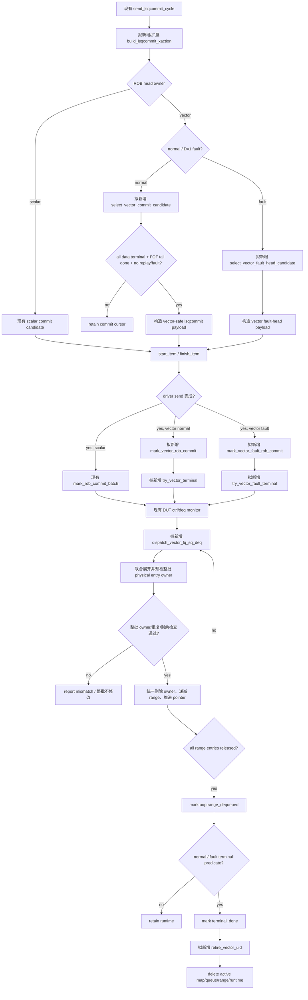

# V2 向量 ROB 提交、LSQ 出队与回收 Flow

本文定义向量 data-uop 或 FOF tail 完成后，如何参与公共 ROB 提交、如何按实际 LQ/SQ dequeue 释放每个
物理 entry，以及何时将 vector macro 标记为 `terminal_done` 并回收状态。本文是后续 vector 支持的设计/plan；
现有 `lsq_commit_handler` 仍按 scalar 单 entry/target 语义工作，不能直接接收 vector UID。文中的规划 helper 可以
按普通函数调用表示，不要求当前源码已存在。

**文档定位：** 本文是 `flow 逻辑文档`，用于后续 coding 和实现级 review。它定义 Commit、dequeue、terminal 和
recycle 阶段的真实入口、状态变更、物理 key 预检、helper 边界和异常收尾；不能由生命周期摘要推导或替换这些细节。
供人工阅读全链路的独立 `flow 描述文档` 见
[V2 向量测试框架生命周期 Flow 描述文档](vector_lifecycle_flow_description.md)。

关联文档：

- [向量测试框架需求文档](../analysis/framework_design/向量测试框架需求文档.md) 第 5.5、5.6 节。
- [向量测试框架生命周期决策记录](../analysis/framework_design/向量测试框架生命周期决策记录_20260826.md)。
- [LSQ Admission Flow](lsq_admission_flow.md)。
- [ROB Commit/LQ/SQ Deq Flow](rob_commit_lq_sq_deq_flow.md)。

## 1. 术语与抽象功能说明

| 英文术语 | 当前 flow 中的中文含义 | 代码对象/状态落点 | 示例 |
| --- | --- | --- | --- |
| `ROB cursor` | 公共提交器当前等待的最老 UID/ROB 位置 | 现有 `lsq_commit_handler.commit_cursor_uid` | 标量和向量共用一个顺序。 |
| `active map` | 记录当前 ROB/LQ/SQ key 的活动 UID 或向量 uop owner | `uid_by_active_rob`、vector range map | commit/deq 预检先查 owner。 |
| `owner` | 一个物理 entry 当前归属的 UID/uop | scalar/vector owner map | owner 不匹配时整批回滚。 |
| `batch` | 一次 commit 或 LQ/SQ dequeue sample 中共同预检和提交的 token 集合 | commit/deq 临时列表 | 联合预检通过后才修改状态。 |
| `epoch` | redirect 前后同一 UID 动态实例的版本 | `dynamic_epoch`、tombstone | 旧 epoch 不能参与 commit。 |
| `commit candidate` | 满足该类别提交前置条件、且正好位于 ROB head 的 macro | scalar/vector commit selector | 向量所有 data-uop 完成后才可成为 candidate。 |
| `LSQ dequeue` | DUT 通过 `lqDeq/sqDeq` 或 control raw 表示已消费的物理 entry | vector-aware preflight/commit helper | V2 的 SQ raw 只有 count，起点由软件 SQ head 提供。 |
| `entry owner` | 某个物理 LQ/SQ entry 对应的 `{uid,vuopIdx}` | vector range map | 只有 owner range 清零才标记该 uop dequeue。 |
| `remaining` | 某个 range 或 macro 尚未被 DUT dequeue 的 entry 数 | vector runtime | 首个 entry 出队不等于整个 uop 结束。 |
| `terminal_done` | macro 所有可观察工作、ROB commit、LSQ 资源生命周期均已收尾的终态 | `status_by_uid` 公共字段 + vector runtime | 可推进 terminal prefix。 |
| `recycle` | 删除 active map、queue item、range owner 和 runtime 的一次性回收 | `retire_active_uid` 扩展路径 | 回收后迟到 event 不得命中新实例。 |
| `fault head` | 已到 ROB head、需要异常收尾的 macro | 公共 `fault_head_waiting` 加 `fault_head_kind=NONE/SCALAR/VECTOR` | 不可被普通 commit batch 越过；redirect 是另一条 cancel/re-admission 路径。 |
| `keyed fault-head cancel` | redirect 时按类别、UID 和旧 epoch 清理向量异常等待 token | `cancel_vector_fault_head()` | 只清匹配的 vector token，不影响 scalar 或其它 epoch。 |
| `tagged fault-head sync` | 根据 fault-head 类别收敛等待 token、终态和 ROB cursor 的同步 helper | 扩展 `sync_modeled_head_after_fault_terminal()` 或 vector 专用包装 | VECTOR direct-fault 的 `issue_killed=1` 只停止 issue，不等于 redirect 取消。 |
| `tombstone` | redirect 后暂存旧动态实例的 ROB/SQ key 及失效边界 | `vec_tombstone_by_rob/sq` | 保护无 ROB feedback 和迟到 writeback。 |
| `launch token` | admission launch 到 sample/promotion 之间的临时 range reservation | vector uop runtime | `visible=0` token 不产生 LSQ cancel。 |
| `provisional reservation` | token 为避免重复 key 而暂时推进的 enqueue pointer 边界和自身 reservation delta | vector admission runtime | redirect 前只撤销自身占用，不能当作已消费 entry。 |
| `promotion` | sample 确认后把 token 写入正式 owner map 的动作 | vector admission helper | promotion 后才有可取消的正式 range。 |
| `redirect LSQ transition` | 一个 redirect 对共享 LQ/SQ mirror 的唯一串行资源事务 | `run_redirect_lsq_transition()` | gate 内汇总所有被覆盖 UID 的取消量，再统一回退。 |
| `writer gate` | redirect transition 对指定 LQ/SQ domain 的临时写权限 | `{redirect_epoch,domain_mask}` | raw dequeue 触及被保护 domain 时整批延期。 |
| `resource drain fence` | redirect cancel 开始前必须先提交的已采样 deq 边界 | `redirect_lsq_sample_seq` 与 raw batch `sample_seq` | 先消耗已观察到的 entry，再统计 cancel 的 remaining。 |
| `deq sample_seq` | raw ctrl 在 monitor capture 时保存的不可变 DUT sample 序号 | `dispatch_raw_ctrl_t.sample_seq` 或等价 envelope | deferred queue 重试也不能把它更新成当前 sample。 |
| `dequeue provenance` | raw dequeue 在被缓存、延期或重放时仍保持的采样身份和物理 key 快照 | `sample_seq`、冻结的 `lq_keys[]/sq_keys[]`、V2 `sq_deq_ptr_at_capture` | 重放时按 capture key 判断 live/stale，不重新读取当前 SQ head。 |
| `STALE_DROP` | raw batch 某一 domain 的全部 key 都属于当前 redirect 覆盖的旧实例，且逐 key 命中匹配 tombstone | provenance classifier、effective batch | 可跨多个被覆盖 UID；不推进 deq pointer/free count，不删除 owner，不触发 terminal。 |
| `effective dequeue batch` | provenance 分类后剔除 `STALE_DROP` domain、仅保留 live domain 的待提交 batch | `dispatch_vector_lq_sq_deq()` 临时列表 | LQ stale、SQ live 时只对 SQ 做后续联合预检。 |
| `covered UID set` | 当前 redirect 覆盖、在资源 drain 时只允许资源更新的 UID 集合 | `redirect_transition_plan.covered_uid_set` | 不依赖尚未写入的 `flushed` 位抑制 terminal/recycle。 |
| `aggregate cancel record` | 当前 redirect 的 scalar/vector 正式 range 取消总账 | `active_redirect_record_ref` | 所有 UID 计数 finalized 后只允许一次 apply。 |
| `dequeue token` | 一条待提交的物理出队事实，携带所属域、物理 key、UID 和 `vuopIdx` | vector-aware batch 临时列表 | `{VECTOR,SQ key,uid,vuopIdx}` 与 `{SCALAR,SQ key,uid}` 走不同的 owner 更新路径。 |

## 2. 公共和向量专用状态

公共 `status_by_uid[uid]` 对向量只保存：

```text
active、enq、issue_ready、rob_commit、lsq_deq、success、terminal_done、issue_killed
完整 `rob_key={flag,value}`、dynamic/redirect 状态、fault/exception 标记
```

向量 runtime 保存：

```text
vec_runtime_table[uid].uop[vuopIdx].range_remaining_entries
vec_runtime_table[uid].uop[vuopIdx].range_dequeued
vec_runtime_table[uid].uop[vuopIdx].terminal
vec_runtime_table[uid].uop[vuopIdx].suppressed          // 仅预留/调试，不作为当前 terminal 依据
vec_runtime_table[uid].uop[vuopIdx].canceled                // redirect 瞬态，不等价 terminal
vec_runtime_table[uid].fof_tail_pending
vec_runtime_table[uid].fof_tail_issued
vec_runtime_table[uid].fof_tail_written_back
vec_runtime_table[uid].fof_tail_canceled
vec_runtime_table[uid].issue_killed
vec_runtime_table[uid].rob_committed
vec_runtime_table[uid].lsq_dequeued
vec_runtime_table[uid].fault_pending
vec_runtime_table[uid].fault_vuopIdx
```

公共 commit handler 还需要把现有 fault token 扩展为带类别的共享状态：

```text
fault_head_waiting
fault_head_kind = NONE / SCALAR / VECTOR   // waiting=0 时固定 NONE
fault_head_uid
fault_head_dynamic_epoch
latched_is_store_exception
```

只有 scalar fault helper 写 `kind=SCALAR`，只有 `mark_vector_fault_rob_commit()` 写 `kind=VECTOR`。所有清除、
terminal sync 和 redirect cancel 都必须同时核对 kind、UID 和 epoch；不能仅凭 `fault_head_waiting` 或 UID 清除。

每个物理 entry 的 owner 由：

```text
vec_range_owner_by_lq[lqKey] = {uid, vuopIdx}
vec_range_owner_by_sq[sqKey] = {uid, vuopIdx}
```

维护。该 map 允许一个 vector UID 在同一 deq batch 出现多次；标量的重复 UID 防护只对 scalar 路径生效。
出队 batch 不能只保存 `uid` 数组：展开时必须为每个物理 key 生成
`{domain, key, uid, vuopIdx}` token。这样同一 UID 的多个 vector range 可以在同一批中分别递减，
同时仍能对 scalar token 保持既有的“同 UID 重复即错误”规则。

## 3. 函数调用 Flow 图



### 3.1 函数调用 Flow 图整体文字伪代码

```text
1. ROB head 选择与 transaction 构造：
   现有 `send_lsqcommit_cycle()` 调用扩展后的 `build_lsqcommit_xaction()`；公共 commit service 先查看 head UID
   的 op_class。scalar head 完全走现有 scalar commit candidate/batch；vector head 进入 vector 专用检查。
   normal vector 未满足所有 data-uop、FOF tail 和 replay/fault 条件时，cursor 保持不动，不能越过该 UID 提交更年轻项；
   D=1、非 FOF 的 direct-fault macro 则由 vector fault-head selector 单独选择，不能让 normal selector 把 fault
   当成“尚未完成的普通 uop”；
   redirect 覆盖的旧实例不进入 commit candidate，而是走 flushed/re-admission。

2. 向量 transaction 发送与提交标记：
   向量候选通过后先构造不携带 scalar store scommit 语义的 commit item，并按现有 driver 时序执行 `start_item/finish_item`；
   只有 transaction 发送完成后，vector commit handler 才记录公共 status.rob_commit=1，并调用幂等 terminal helper。
   vector store 的 `io_ooo_to_mem_lsqio_scommit` 保持 0；它不能因为有 SQ range 就伪造 scalar scommit。
   vector fault-head 也使用同一条 commit driver transaction，但将 `isStoreException` 直接派生为
   `op_class==V_STORE`，并在公共 handler 中登记 `fault_head_kind=VECTOR`；它绝不调用 scalar
   `mark_fault_rob_commit_uid()` 或 `try_retire_committed_uid()`，避免尚有 vector range 时提前 retire。

3. 物理 LSQ 出队：
   monitor 采到 lqDeq/sqDeq 后，先展开完整 batch：LQ 按现有 `lq_deq_start_key(raw_lq_ptr,count,ptr_is_next=1)`
   从 DUT 的 next-pointer 语义派生起点；V2 SQ 使用软件 sq_deq_ptr 加 count。
   每个物理 key 生成带 domain/uid/vuopIdx 的 dequeue token；预检同时查询 scalar map 或 vector per-entry
   range map，并检查重复物理 key、owner active 和 range remaining；
   任一项失败时整批不修改任何 map、pointer 或 free count。
   预检全部通过后，才逐 entry 删除 owner、递减 range remaining 并推进软件 pointer；同一 UID 在一个 batch 重复出现
   是合法的，只要每个 key 不同且属于真实 vector range。

4. 宏观收尾：
   所有 data-uop range 清零后置 macro.lsq_dequeued；FOF 还要求 tail writeback。
   在公共 ROB commit、所有 data 正常终态、无 replay/fault/redirect pending 且 LSQ range 已释放后，置
   status.success=1、status.terminal_done=1。
   D=1 direct-fault 则在 fault-head 已 commit、唯一 range 已真实 deq 后，置 status.success=0、
   status.terminal_done=1，并由 tagged fault-head sync 解除 cursor 阻塞；不需要也不允许把它改成 normal terminal。
   terminal prefix 推进后一次性删除 active ROB map、vector range map、vector issue item 和 runtime；SQ owner 删除前
   记录短期 success tombstone，以吸收延迟的 hit=1 feedback。
```

## 4. 现有入口：`lsq_commit_handler::build_lsqcommit_xaction()`

源码位置：`mem_ut/ver/ut/memblock/seq/base_seq_help/lsq_commit_handler.sv`。

抽象功能描述：该函数在现有框架中按 ROB cursor 选择 scalar commit/fault head，并生成 `lsqcommit` transaction。
它通过 `derive_op_behavior()` 和 scalar status target 判断提交条件，当前不能直接用于 vector macro。

真实逻辑摘要：

```systemverilog
select_rob_commit_batch(commit_uids);
has_commit = commit_uids.size() != 0;
if (!has_commit) begin
    has_fault_head = select_fault_head_candidate(fault_uid);
end
...
foreach (commit_uids[idx]) begin
    behavior = lsq_ctrl_model::derive_op_behavior(data.get_main_transaction(commit_uids[idx]));
    if (memblock_op_behavior_util::is_scalar_rob_store_commit(behavior)) begin
        tr.io_ooo_to_mem_lsqio_scommit++;
    end
end
```

文字伪代码：

```text
现有实现先选择连续 scalar UID，再按 scalar behavior 决定 scommit 数量；因此 vector UID 必须在 selector
入口分支出去，不能让 `derive_op_behavior()` 把 F 或 vector store 错解释为 scalar store。
向量扩展应复用它的 cursor、pendingPtr 和 driver transaction 时序，但由 vector handler 单独判断宏观完成。
```

## 5. 拟新增 `select_vector_commit_candidate()`

抽象功能描述：该 helper 只判断 ROB head 的 vector macro 是否满足提交前置条件，不修改任何状态。它是公共 cursor
与向量 runtime 之间的只读边界。

合法条件：

```text
status.active && status.enq
当前 UID 等于公共 commit_cursor_uid 且 ROB key 等于 modeled head
每个 data-uop phase 为 TERMINAL（redirect cancel 的旧实例不进入此 helper）
无 issue outstanding、replay_pending、redirect_pending、exception_pending、fault_pending
若 v_form=fof：fof_tail_written_back=1
```

文字伪代码：

```text
读取公共 status 和 vector runtime；
若 UID 不是公共 ROB head，返回 false，不扫描更年轻 UID；
逐个读取 D 个 uop runtime 的正常终态计数；
若任意 uop 仍 pending/replay/outstanding，返回 false；
若 FOF tail 尚未写回，返回 false；
若 macro 已 flushed/redirect_pending/fault_pending，返回 false；
否则返回 true，交给 mark_vector_rob_commit。
```

## 6. 拟新增 `mark_vector_rob_commit()`

抽象功能描述：该 helper 在 vector macro 的 commit transaction 已由 driver 发送完成、且仍位于 ROB head 时，记录
公共 commit 状态并推进同一个 commit cursor。它不构造 transaction，也不直接释放 LQ/SQ entry；实际 dequeue 仍由
DUT sideband 驱动。

文字伪代码：

```text
再次确认 vector UID 与公共 cursor/head 一致；
置 status.rob_commit=1、runtime.rob_committed=1；
确认已发送的 vector-safe lsqcommit transaction 保持 pendingPtr 和 redirect 相关公共字段；
确认 io_ooo_to_mem_lsqio_scommit=0，即使该 vector macro 是 store；
若所有 range 已经清零，则置 status.lsq_deq=1，否则等待后续 sideband；
调用 `try_vector_terminal(uid)`：它会重新检查 data-uop、FOF tail、replay、ROB commit 和 range 条件；
如果 deq 已先于本次 commit 完成，这次调用负责立即补上 terminal 判定，避免没有后续事件时永久停留；
不要调用 scalar mark_rob_commit_uid()，因为它会读取 scalar target status；
当公共 cursor 允许前进时，只推进到下一个真实 UID，不跳过未完成 vector head。
```

### 6.1 拟新增 `select_vector_fault_head_candidate()` 与 `mark_vector_fault_rob_commit()`

抽象功能描述：这两个 helper 是 normal vector commit 的异常分支。前者只选择当前 ROB head 的已观测
direct-fault macro；后者在 driver 完成该拍异常 commit 后登记一个带类别的公共 fault-head 等待状态。它们不调用
scalar fault helper，不自行取消 range，也不把 fault 转成 redirect。

初版选择条件：

```text
op_class 为 V_LOAD 或 V_STORE
layout.D == 1，v_form != fof，vtypeIllegal == 0
macro.fault_pending=1，fault_vuopIdx=0
status.active=1，status.rob_commit=0，status.redirect_pending=0，status.flushed=0
status.issue_killed 可为 0；若为 1，必须是该 D=1 VECTOR fault handler 已建立的停止-issue 状态
UID 等于公共 commit_cursor_uid，ROB key 等于 modeled head
当前没有任何 scalar/vector fault_head_waiting
```

文字伪代码：

```text
select_vector_fault_head_candidate 只检查公共 cursor 指向的一个 UID；不是该 D=1 fault 模板就返回 false，
不扫描更年轻 UID，也不让 normal selector 误把 fault 当成可成功提交项。

该候选允许 `status.issue_killed=1`，但只允许在当前 UID/epoch 已有 `fault_pending=1` 且 fault 类型为 VECTOR
的情况下出现。`vector_fault_handler()` 会先调用 issue-kill 清除残留 queue/pending，再登记 fault-head；这里的
`issue_killed` 表示发射资源已停止，不是 fault-head 的拒绝条件。若 `issue_killed=1` 而没有匹配的
`fault_pending`，或 epoch/owner 不匹配，则必须返回 false 并报告状态错误。

build_lsqcommit_xaction 为该 candidate 生成正常的 pendingPtr，并保持 scommit=0；
isStoreException 直接按 op_class==V_STORE 赋值，绝不调用 derive_op_behavior。

driver 送出异常 commit 后，mark_vector_fault_rob_commit 置 status.rob_commit=1、runtime.rob_committed=1，
并把公共 fault-head 状态登记为 {kind=VECTOR, uid, dynamic_epoch}；随后调用
`try_vector_fault_terminal(uid)` 重新检查唯一 range 是否已经真实 deq；如果 deq 先发生，该调用立即完成
`success=0/terminal_done=1`，否则保留 fault-head 等待后续 deq。不调用 scalar mark_fault_rob_commit_uid 或
try_retire_committed_uid，cursor 在 fault-head 未完成时保持不动。

`mark_vector_fault_rob_commit()` 和 `try_vector_fault_terminal()` 只能调用按 `fault_head_kind` 分支的
tagged fault-head sync，不能直接复用当前 scalar `sync_modeled_head_after_fault_terminal()` 的
`status.issue_killed` 取消条件。对 `kind=VECTOR`，`issue_killed=1` 是 fault handler 已停止旧 issue 的预期状态；
只有 epoch 不匹配、`flushed=1`、`redirect_pending=1`，或显式
`cancel_vector_fault_head()` 已取消 token 时，才把该 fault-head 当作 redirect 旧实例清除。对 `kind=SCALAR`，
保留现有 scalar 的 `issue_killed` 语义，不改变标量路径。
```

## 7. 现有 dequeue 预检的向量扩展边界

现有 `lsq_commit_handler::preflight_dut_lq_deq()` 和 `preflight_dut_sq_deq_from_start()` 会按物理 key 查询
`uid_by_lq/uid_by_sq`，并把同一 UID 在一个 batch 中重复出现判为错误。该规则对 scalar 仍然正确，对 vector
必须分支为 vector range map：

```text
展开每个 raw key 为 dequeue token = {domain, key, uid, vuopIdx}：
scalar key -> uid_by_lq/sq -> 同 UID 重复是错误；token 只保留 uid，不填 vuopIdx
vector key -> vec_range_owner_by_lq/sq -> 同 UID、不同物理 key 重复是合法；token 必须保留 vuopIdx
若 key 同时命中 scalar owner 与 vector owner，或命中两个不同 owner，整批预检失败并报告模型错误
```

预检必须同时检查两类 owner map，而不是“先查 vector，未命中再查 scalar”后静默选择一方。这样可以发现
跨类别 pointer 漂移或错误复用；预检失败时不删除任何 owner，也不推进任一侧软件 pointer。gate 后 deferred raw 必须
先经过 `classify_deferred_deq_provenance()`：普通预检只接收 `LIVE_COMMIT` 的 effective batch；若仍看到 matching
redirect tombstone 或空 owner，说明 provenance 分类漏项/身份不一致，必须 fatal，不能让旧 scalar helper 自行吞掉。

## 8. 拟新增 `dispatch_vector_lq_sq_deq()`

抽象功能描述：该 helper 消费 DUT 的实际 LQ/SQ dequeue sideband，逐 entry 释放 vector range owner，并在一个
range 完整释放后更新 uop 和 macro runtime。它不根据 writeback 时间猜测 dequeue，也不按静态 D*F 一次性释放。

文字伪代码：

```text
先读取本拍 `lqDeq` 的起点/数量、`sqDeq` 的 count 以及该 raw batch 在 monitor capture 时固定的 `sample_seq`；
`sample_seq` 必须随 `deferred_raw_ctrl_q` 保持不变，不能使用 `cycle=$time` 或消费时刻的 sample 代替。raw 第一次进入
持久 deferred FIFO 时，必须冻结一个不可变的 dequeue provenance envelope：
`{capture_order, sample_seq, lq_keys[], sq_keys[], sq_deq_ptr_at_capture}`。
后续重试、gate 延期或重放只读取 envelope，不能重新从当前 `lsq_ctrl` 推导物理 key。LQ key 在 capture 时按现有
`lq_deq_start_key(raw_lq_ptr,count,ptr_is_next=1)` 先把 DUT next-pointer 还原为起点、再按 count 展开；V2 `sqDeq`
不携带可靠起点，因此在 capture 时以 shadow `sq_deq_ptr_at_capture` 按环形顺序展开 `sq_keys[]`。
该 shadow cursor 只为后续 raw 生成 key，不推进真实 `sq_deq_ptr/free_count`；deferred FIFO 排空后必须与真实 SQ dequeue
pointer 重新 rebase。若某个 V2 SQ envelope 的 domain 将 `LIVE_COMMIT`，它的第一个冻结 key 必须仍等于真实
`lsq_ctrl.sq_deq_ptr`，随后 live commit 才可推进真实 pointer；若前一个 `STALE_DROP` 使 speculative shadow 与真实
pointer 分离，而 FIFO 中仍有一个后续 SQ envelope 需要 live commit，则初版没有可靠 resync 依据，必须 fatal，不能用 shadow
覆盖真实 pointer。若实现直接扩展 `dispatch_raw_ctrl_t`，这些字段可以放在 struct；否则必须由不丢失 raw 身份的
外层 envelope 保存。
在读取/改写任何 owner 或 `lsq_ctrl` 前，先检查资源排空栅栏。若 active redirect 尚未开始 writer gate，且
`sample_seq <= active_redirect_record.redirect_lsq_sample_seq`，这个 batch 必须先作为 `resource-drain-only` batch
按既有联合预检/提交完成：它可以删除 entry owner、递减 remaining 并推进 pointer/free count，但对 redirect 覆盖的
UID 禁止调用 `try_vector_terminal()`、`try_vector_fault_terminal()`、scalar `try_retire_committed_uid()`、任何 terminal
prefix/recycle。`sync_modeled_head_after_fault_terminal()` 是全局 helper，在任一 resource-drain-only batch 中都不得调用，
必须等 coordinator 提交 redirect public state 后统一重检。该判断必须查询 redirect plan 预先建立的
`covered_uid_set`，不能看此刻仍为 0 的 `status.flushed/redirect_pending`。非覆盖 UID 仍按既有规则处理；batch 完成后 coordinator 重新收集
remaining/domain，再尝试取得 gate；这样 cancel 只统计真正尚未 deq 的 entry。

若 raw batch 触及已取得的 `redirect_lsq_transition` domain writer gate，保留完整 provenance envelope 并返回：不推进
dequeue pointer、不增加 free count、不删除 scalar/vector owner，也不把一侧先提交。联合 LQ/SQ raw 必须整体进入 FIFO，
不能因其中一侧未受 gate 覆盖而绕过另一侧。该 gate 仅短暂覆盖 redirect 的资源回退；释放后必须按原 `capture_order` 重放。

gate 释放后的每个 deferred envelope 先调用 `classify_deferred_deq_provenance(envelope, redirect_epoch, cut_line)`，
不能直接进入普通 owner 预检：
  - 断言 `envelope.sample_seq > cut_line`；若不满足，说明 gate 前没有排空本应 resource-drain 的事实，报告 fatal，不能
    把它重新解释为 stale；
  - LQ、SQ 分别做 domain 分类。某 domain 的所有冻结 key 都命中唯一 live scalar/vector owner 时为 `LIVE_COMMIT`；某
    domain 的所有 key 都没有 live owner，且每个 key 都命中**当前** redirect 的 matching tombstone：
    `redirect_epoch/cut_line/domain` 与当前 transition 一致，tombstone 中的 `old_uid` 属于 `covered_uid_set`，
    `old_dynamic_epoch` 与该 key 自身旧 owner 快照一致时为 `STALE_DROP`。同一 domain 可跨多个 covered UID，
    不要求所有 key 的 UID/epoch 相同；
  - 同一 domain 混合 live owner 与 matching tombstone，或出现空 owner、其它 redirect epoch/cut line、owner identity 不匹配、
    success tombstone，均为模型/时序 mismatch，报告 fatal。不能只丢弃同一 domain 的部分 key；
  - `STALE_DROP` 只消费该 raw sideband 事实，不推进该侧 dequeue pointer/free count、不删除 owner、不递减 range，也不触发
    terminal、fault-head、terminal prefix 或 recycle。matching redirect tombstone 必须保留到该 envelope 完成分类并从 FIFO
    消费；gate 释放后的所有 scalar/vector allocation preflight 也必须把它当作 physical-key quarantine，命中时不分配，
    不能因 cancel 已加回 free count 而覆盖旧 key；
  - 分类完成后从 raw 中剔除完整的 `STALE_DROP` domain，剩余 `LIVE_COMMIT` domain 组成 `effective dequeue batch`。两侧均 stale
    时只消费 envelope；一侧 stale、另一侧 live 时只提交 live 侧。这是 provenance 分类后的 domain 过滤，不是普通联合事务的
    部分提交；两侧均 live 时仍保持原有联合预检/提交边界。
  - provenance 分类只替换 LQ/SQ deq 的资源部分。同一 raw 已采样的 MMIO tag、`sbIsEmpty` 等非-deq sideband 仍必须沿
    既有顺序精确处理一次；即使两侧都 `STALE_DROP` 也不能直接丢弃完整 raw。`effective dequeue batch` 必须通过显式冻结 key/
    token 的新 helper 提交，不能简单修改原 raw count 后再调用会从当前 SQ head 重算 key 的旧 helper。

把 effective batch 中 LQ/SQ 两侧的全部 live key 组成一个待提交 batch，并为每个 key 保存
`{domain, key, uid, vuopIdx}` dequeue token，先联合预检：
  检查每个 key 是否恰好属于 scalar owner 或 vector range owner；两类 owner 同时命中、owner UID 与 token
  不符、或 live key 同时命中任何 tombstone 时均失败；provenance 阶段未被剔除的 tombstone 表示模型错误；
  检查同一 batch 内没有重复物理 key，vector `range_remaining_entries` 足够，且 SQ count 不超过容量；
  任一检查失败时报告 mismatch，本 batch 两侧均不修改；
预检全部通过后，再按 token 的 domain 分派：
  scalar token 调用既有 scalar `commit_dut_lq_deq/commit_dut_sq_deq` 等价更新；
  vector token 由拟新增 `commit_vector_deq_token()` 删除对应 vector owner map、递减该 `{uid,vuopIdx}` 的
  `range_remaining_entries`，并在整批提交后推进软件 LQ/SQ dequeue pointer 和 free count；
  若该 uop range 清零，置 `range_dequeued=1`；
若某 macro 的所有 data-uop range 都清零：
  置 runtime.lsq_dequeued=1、公共 status.lsq_deq=1；
若本 batch 不是 `resource-drain-only`：
  macro.fault_pending=0 时调用 try_vector_terminal(uid) 检查正常 terminal；
  macro.fault_pending=1 时调用 try_vector_fault_terminal(uid) 检查 D=1 fault terminal。
若本 batch 是 `resource-drain-only`：对 `covered_uid_set` 中的 UID 不触发 terminal/fault-head sync/terminal prefix/recycle
helper；redirect coordinator 是这些 UID 唯一的 lifecycle owner。非覆盖 UID 保持其局部 terminal/recycle helper 语义，
不能因为同批 redirect drain 被错误延后或被当成覆盖项；但全局 `sync_modeled_head_after_fault_terminal()` 对整个 batch 延后，
由 coordinator 在 redirect 状态提交后执行一次。
```

`commit_vector_deq_token()` 是向量专用的新 helper，输入必须包含 `vuopIdx`；不能把 vector token 压缩成只含
UID 的数组后再调用现有 scalar commit helper。LQ/SQ 两侧采用同一“先预检、后提交”的事务边界：即使 LQ 侧
预检通过而 SQ 侧失败，也不得先释放 LQ owner。

`freeze_dequeue_provenance()` 负责 raw 第一次进入 deferred FIFO 时记录 `capture_order`、不可变 `sample_seq`、
LQ/SQ 物理 key 列表以及 V2 `sq_deq_ptr_at_capture`；它不推进真实 dequeue pointer/free count。`classify_deferred_deq_provenance()`
只读取该 envelope 和当前 redirect tombstone，按完整 domain 返回 `LIVE_COMMIT`、`STALE_DROP` 或 fatal；它不直接写 owner、
range、pointer 或 free count。只有分类得到的 effective batch 才能进入上述联合预检/提交 helper。

`try_vector_terminal()` 是拟新增的纯状态推进 helper：它只在所有外部条件满足时置终态，不主动删除尚未消费
的 owner map。

抽象功能描述：`try_vector_terminal()` 在一次 commit、dequeue 或 tail writeback 状态变化后被调用，集中判断
vector macro 是否已经具备正常 terminal 条件；它拥有公共 `success/terminal_done` 两个字段的最终写入，但不
拥有 range 删除或 redirect cancel。

文字伪代码：

```text
读取 macro runtime 和公共 status；
若 macro 已 flushed、redirect_pending、fault_pending 或仍有 replay/outstanding：直接返回；
若任一 data-uop 未 terminal，或 FOF tail（如适用）未 writeback，直接返回；
若 rob_commit=0 或 lsq_dequeued=0，直接返回；
确认所有 vector range owner 已清空；
写 status.success=1、status.terminal_done=1；
通知公共 terminal prefix/retire service，随后由 retire_vector_uid() 做一次性回收。
```

`try_vector_fault_terminal()` 是与 normal helper 并列的异常终态推进 helper。它只服务已经登记的 D=1
`fault_head_kind=VECTOR`，将真实 deq 完成后的异常 macro 置为 `success=0、terminal_done=1`；它不要求
data-uop normal terminal，也不调用 scalar `consume_fault_retire()`。

抽象功能描述：该 helper 在 vector fault-head 已 commit 或唯一 range 已 deq 后检查异常回收条件，并在满足时
完成 vector-specific terminal/retire 与 fault-head cursor 解锁。它不拥有 range 删除，仍由 deq handler 完成。

文字伪代码：

```text
确认 fault_head_kind=VECTOR 的 uid/epoch 与当前 macro 一致；不一致说明 redirect 已杀掉旧实例，交给 redirect
恢复清理，不在这里写 terminal。
确认 status.rob_commit=1、runtime.lsq_dequeued=1、所有 vector range owner 已清空；
确认 macro.fault_pending=1、layout.D=1、v_form!=fof，且该唯一 uop 不再 issue_accepted/replay_pending；
在写终态前清 `status.exception_pending=0`，保留 `status.fault=1` 和异常快照作为最终诊断；再写
`status.success=0、status.terminal_done=1`；
调用 retire_vector_uid(uid)，保留 success=0；
调用 tagged fault-head sync：确认当前 token 仍为同一 `{kind=VECTOR,uid,dynamic_epoch}` 后清空 VECTOR
fault wait、将 `fault_head_kind` 回填 NONE，并推进公共 commit cursor 到下一个真实 UID；此分支不能因该 direct-fault 的 `issue_killed=1`
误把已完成条件之外的 token 当作 redirect 取消。
```

### 8.1 拟扩展 `sync_modeled_head_after_fault_terminal()`

源码位置：`mem_ut/ver/ut/memblock/seq/base_seq_help/lsq_commit_handler.sv`。

抽象功能描述：该公共 helper 负责在 fault-head 建立、真实 dequeue、terminal 或 redirect 之后同步共享
`fault_head_waiting` 与 ROB cursor。扩展后它以 `fault_head_kind` 分离 scalar 和 vector 的 stale/terminal
判定；它不创建 fault token，也不释放 vector range。

文字伪代码：

```text
若没有 `fault_head_waiting`：
  保持现有行为；仅当当前 commit cursor 指向 terminal_done UID 时，重新计算 modeled head；

读取 `{kind, uid, token_epoch}` 和当前公共 status；
若 epoch 不匹配、status.flushed=1 或 status.redirect_pending=1（或本次 redirect 已明确调用 keyed cancel）：
  这是 redirect/re-admission 前的旧实例；只清当前匹配 token，保持 cursor 在同一 UID，随后按现有规则 rebase；
若 kind=VECTOR 且 status.rob_commit=0，但没有上述 redirect/epoch 失效条件：
  这是 direct-fault 正常等待 fault-head commit 的状态，保留 token 和 cursor，不能因为尚未 commit 就清除；

若 active ROB owner 已失效但 status.terminal_done=0：
  报告 owner/terminal 不一致；不能把该状态猜成正常 terminal，也不能推进 cursor；

若 kind=SCALAR：
  保持现有标量规则；`status.issue_killed=1` 仍可作为旧 scalar fault 实例取消条件；
  只有既有 scalar fault terminal tuple 成立时，清 token 并推进 cursor；

若 kind=VECTOR：
  `status.issue_killed=1` 不能单独取消 token，因为 D=1 direct-fault 会在登记 token 前用它停止旧 issue；
  只有 `try_vector_fault_terminal()` 已确认 `terminal_done=1、lsq_deq=1、success=0、fault=1`，
  且 token 的 UID/epoch 仍匹配时，才清 VECTOR token 并推进 cursor；
  若 token 已由 `cancel_vector_fault_head(uid,old_epoch)` 清除，则不再处理旧实例，等待 redirect 后同 UID re-admission；

其它 kind 或状态组合：
  保持 token 和 cursor，报告类型/状态不一致，不能按猜测推进 cursor；
```

这样直接复用现有 helper 的公共 cursor/rebase 责任，但将 vector 的 `issue_killed` 解释限定为“停止 issue”，避免改动
标量 fault 的既有 cancel 语义。`mark_vector_fault_rob_commit()`、`try_vector_fault_terminal()` 和 redirect cancel
均应只通过这个扩展后的同步边界处理共享 fault-head。

## 9. 拟新增 `retire_vector_uid()`

抽象功能描述：该 helper 是 vector UID 的一次性回收边界。它只允许在 `terminal_done` 后调用，并清理所有 vector
专用索引；公共 active map 的删除继续通过统一 UID retire API 完成。

文字伪代码：

```text
确认 status.terminal_done=1、status.rob_commit=1、status.lsq_deq=1；success 可为 1（正常）或 0（fault）；
确认 vector issue queue 中不存在 uid item；
确认 vector range map 中不存在 uid owner；
调用公共 active retire 逻辑删除 `uid_by_active_rob[rob_order_util::rob_to_map_key(rob_key)]`；删除前确认该完整
`rob_key={flag,value}` 仍由当前 UID 所有；
清除 vector runtime、replay snapshot 和 uid 级 debug 索引；若仍存在匹配的
`active_fof_owner`，只能调用带 `{uid,dynamic_epoch}` 校验的 `release_active_fof_owner()`，不能无条件清除其它宏的 FOF lock；
推进 terminal_done prefix；
若任一前置检查失败，不删除部分状态，保留现场供 end_test_check 报告。
```

## 10. redirect、fault 与回收顺序

redirect 覆盖的 vector macro 不进入普通 commit batch，也不创建 `canceled_terminal`。恢复顺序为：

```text
先只读分类：
  vector_involved = 当前 redirect 覆盖 active V_LOAD/V_STORE macro
                    || 覆盖旧实例的 valid visible=0 vector launch token。
  vector_involved=0：完全保留既有 scalar-only fast path
    apply_redirect_flush_range -> scalar prepare_uid_for_redirect_reissue -> apply_pending_lsq_cancels；
    不创建 vector transition plan，不取 writer gate，不执行 vector provenance/token 预检。
  vector_involved=1：才进入以下 mixed/vector redirect transaction。

redirect-first
-> 先按 `redirect_lsq_sample_seq` 排空完整 raw LQ/SQ deq batch：cut line 及更早的 batch 做 resource-drain-only
   联合提交，更新 remaining/pointer/free count，但不让被覆盖 UID terminal/recycle；未排空时只保留 redirect freeze 后重试。
-> 公共 `run_redirect_lsq_transition(redirect_epoch)` 收集本 redirect 覆盖的所有 vector token，及全部 scalar/vector
   正式 owner 将计入 aggregate record 的 domain，并尝试取得 redirect_epoch writer gate。domain_mask 不得只由 token
   推导。gate 暂时不可取得或有更早 foreign pending-cancel record 时返回 DEFER：保留 active redirect/freeze
   和 raw event，不修改任何 vector/scalar owner、pointer/free count 或 lifecycle；先按既有 FIFO 完成更早 record 后重试。
-> gate 取得后，在 gate 内整体预检初版唯一的全局 `visible=0` vector token；after/before 链、当前 pointer 或 owner
   不一致才 fatal。初版复用全局单深度 pending-sample，因此该 token 必在 domain 尾部；未来 multi-slot 未实现统一
   allocation ledger 前不得开启。
-> 成功预检后取消 provisional token：先复核 pointer==after，成功才回退 before、对当前 free count 加回 reserved_entries、
   删除 token；不回写历史 free-count 快照，不写 cancel record。
-> 在同一 gate 内扫描全部被覆盖 UID：标量沿用原 redirect 计数；每个 vector UID 在递增 dynamic_epoch 前按旧 UID+epoch
   清 driver pending/FOF owner/fault-head、写 data/tail tombstone；对每个仍未释放 scalar/vector LQ/SQ owner 都先写
   `{redirect_epoch,cut_line,domain,key,uid,old_dynamic_epoch}` redirect-deq tombstone，再删除 owner，并只把实际
   remaining entry 数累加到本 redirect 的**同一个** aggregate cancel record。
-> 所有 UID 都完成计数并将 aggregate record 标记 software_count_finalized 后，仍由 gate owner 调用
   `apply_guarded_lsq_cancel_record(active_redirect_record_ref,redirect_epoch)` 一次性回退完整 record，置 software_applied。
   它不得遍历/应用其它 record；同时触及 LQ/SQ 的 record 任一侧失败时两侧均不提交并 fatal。
-> 仅在该 software rollback 成功（或 aggregate count 均为 0）后，依次提交 vector 的 retire_active_uid、
   clear_uid_dispatch_result 和 mark_vector_redirect_reissue_pending；后者只递增公共 dynamic_epoch 一次。
-> `end_redirect_lsq_transition()` 释放 gate，随后公共 redirect service 才可清 active_redirect/flush；等 redirect/monitor
   drain、gate-owned deferred deq provenance 已全部分类/消费且 tombstone 到期后，同一 UID 重新 activation/admission。
```

不能使用静态 `D*F` 作为取消数，因为部分 range 可能已由 DUT dequeue。也不能先删除 range map 再尝试根据 map
统计取消数。这里的 vector handler 不得直接调用 scalar `note_lsq_cancel_for_uid()` 或
`prepare_uid_for_redirect_reissue()`；前者要求 `main_tr.numLsElem==1`，后者会按 scalar 单 key map 回退，
都会漏算或重复计算一个 vector UID 的多个 range。尤其不能让每个 vector UID 各自调用
`apply_pending_lsq_cancels()`：现有 cancel record 是一个 redirect 的 scalar/vector 聚合账本，必须先由全局 coordinator
完成所有计数，再由持 gate 的指定 apply 一次回退。`mark_vector_redirect_reissue_pending()` 只在 aggregate software rollback
成功后提交公共状态字段，不能充当资源回退接口。

### 10.1 拟新增 `cancel_vector_fault_head()`

建议位置：`mem_ut/ver/ut/memblock/seq/base_seq_help/lsq_commit_handler.sv`，由向量 redirect handler 调用。

抽象功能描述：该 helper 在 vector redirect 覆盖一个已经记录 fault 的旧动态实例时，先删除该实例尚未提交的
vector fault-pending 记录，再按需解除对应的共享 fault-head 等待状态，避免旧异常在 re-admission 后继续被选择或
阻塞公共 ROB cursor。它只处理精确匹配的向量 UID/epoch，不改变 scalar fault-head，也不推进 commit cursor。

本文用 `vector_fault_pending_q` 表示该 pending 记录；实现也可以用等价的 per-macro runtime 标志，但必须保留
相同的 UID/epoch 删除语义。

文字伪代码：

```text
先按 `{uid,old_dynamic_epoch}` 删除 `vector_fault_pending_q` 中的旧实例记录；该步骤不依赖
`fault_head_waiting`，因为 redirect 可能发生在 fault 被记录、但尚未到 ROB head 建立 token 的阶段；
读取共享 fault-head 状态；若 `fault_head_waiting=0`，返回“仅删除 pending 记录”或“无匹配”，不修改 shared token；
若 `fault_head_kind==VECTOR`、`fault_head_uid==uid` 且 `fault_head_dynamic_epoch==old_dynamic_epoch`：
  清除 `fault_head_waiting`、fault_head_uid、fault_head_dynamic_epoch，并将 `fault_head_kind` 写为 NONE，
  对应的 `latched_is_store_exception`；
  保持 `commit_cursor_uid==uid`，不把 redirect 旧实例当作已完成 UID；
  使 modeled head 在本次 redirect 状态切换后重新从 commit cursor 计算；
  返回“已取消”；
否则：
  返回“无匹配 token”，不清除 scalar 或其它 UID/epoch 的 fault-head；
```

redirect handler 必须在递增公共 `status_by_uid[uid].dynamic_epoch` 前调用该 helper，并在状态切换完成后让
commit service 重新同步 modeled head。若共享 token 是 scalar 或属于其它向量 epoch，向量 redirect 仍可继续
自己的 keyed pending-record 删除，但不得改写该 token；若同一 UID/epoch 的 VECTOR token 已经被其它路径清除，helper 视为幂等
无操作，不报告重复 fault。

向量 fault 的公共 commit 顺序仍受 ROB head 限制；未发射 data-uop 不能被简单当成成功 terminal。初版仅允许
`D=1、非 FOF` direct-fault macro 使用 tagged `fault_head_kind=VECTOR`：exceptionVec 后等待 fault-head commit 与
真实 deq，再以 `success=0` 完成 terminal。FOF 非首元素异常可能只在 DUT 内部缩短 VL，测试框架不能据普通
data-uop WB 推导 suppressed；只有全部 D 个 data-uop 正常 writeback 后才等待并发送 tail。FOF 顶层 exceptionVec
按 keyed kill、tail canceled 后 fatal 停止 testcase；multi-uop 非 FOF 顶层 exceptionVec 不自动 redirect/re-admission，
先保留 fault，只有独立真实 redirect 才取消旧 range 并重入队。

## 11. plus 控制与边界

| 参数 | 用法 |
| --- | --- |
| `MEMBLOCK_LSQCOMMIT_SEQ_EN` | 复用公共 commit/deq sequence 开关；关闭时 vector 不单独伪造 commit。 |
| `MEMBLOCK_REDIRECT_SEQ_EN` | 复用 redirect freeze/cancel 时序；不增加 vector 专用 redirect 开关。 |
| `MEMBLOCK_MAIN_PERMISSION_DEBUG_CHECK_EN` | 控制重复 owner、终态仍有 range、WB/deq 不一致等二次防御检查。 |
| `MEMBLOCK_ENQ_PER_CYCLE` | 只影响 admission，不能改变 vector commit 或 range release 数。 |

不提供 vector `scommit` 数量、提前 terminal、按 VL 释放 entry 或“忽略 deq mismatch”的 plus 参数。

## 12. 端到端行为总结

```text
正常 vector load/store：
  data-uop writeback 全部完成
  -> （FOF 额外等待 tail WB）
  -> ROB head candidate
  -> mark_vector_rob_commit
  -> DUT lqDeq/sqDeq
  -> 逐 entry 删除 vector range owner
  -> 所有 range 清零
  -> terminal_done
  -> retire_vector_uid

D=1 direct fault：
  exceptionVec
  -> macro.fault_pending
  -> ROB head 的 vector fault commit（scommit=0）
  -> 实际 lqDeq/sqDeq 清空唯一 range
  -> success=0、terminal_done=1
  -> retire_vector_uid + 解除 tagged fault-head

同一 vector uop F=2：
  deq entry 0 -> remaining=1，不能 terminal
  deq entry 1 -> remaining=0，uop range_dequeued=1

redirect：
  scalar-only redirect -> 保持既有 scalar fast path，不创建 vector gate/plan
  mixed/vector redirect
  -> 先冻结 gate 后 raw deq 的 `{sample_seq,lq_keys[],sq_keys[]}` provenance
  -> cut line 及更早 deq 先 resource-drain-only 提交
  -> redirect_epoch writer gate（不可取得/更早 record 时 DEFER，保留 freeze/raw batch）
  -> 在 gate 内取消初版唯一的尾部 provisional token，再写 tombstone 并取消 queue/range owner
  -> keyed cancel_vector_fault_head（若旧实例持有 VECTOR fault-head）
  -> 所有 scalar/vector 覆盖 UID 的未释放数量汇入一个 aggregate cancel record
  -> finalized 后由 gate owner 一次回退完整 record，置 software_applied
  -> flushed/redirect_pending，保留同一 UID，释放 gate
  -> 重放 deferred deq：整侧 matching redirect tombstone -> STALE_DROP；live 侧继续提交；混合/不匹配 -> fatal
  -> redirect 完成后重新 admission
```

端到端文字伪代码：

```text
向量写回只证明 data-uop 的工作结束，不能证明 LSQ entry 已被消费；commit 只证明 ROB 顺序允许提交，也不能
替代实际 dequeue。只有正常 data-uop、ROB commit、实际 LSQ dequeue 以及 FOF tail（如有）全部满足，框架才通过
vector 专用 helper 写入 `success=1/terminal_done=1`。

异常模板使用独立的 fault terminal helper：它不要求 normal data-uop terminal，也不会调用标量 fault retire；
只有 D=1 的唯一 range 被实际 deq 后才写入 `success=0/terminal_done=1` 并解除 fault-head。这样 fault 不会错误地
re-admission，也不会在 range 尚未释放时过早回收。

vector range map 以物理 entry 为粒度，所以同一个 UID 在一批 deq 中出现多次是正常现象；每次只释放一个真实
entry，避免首个 deq 就把仍在 DUT 中的 reservation 删除。

redirect 取消不是终态回收：旧实例必须先保留 UID 的静态表和 `redirect_pending` 状态，等待同 UID re-admission。
正常 terminal 回收才是最后一步；回收前仍保留 owner/runtime，便于识别迟到 feedback，且必须确认 tombstone/旧
queue 已排空。回收后任何旧事件都不能重新激活 UID 或占用新实例。
```
