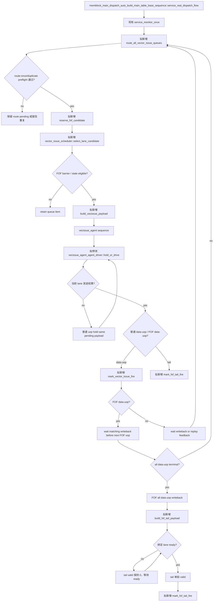

# V2 向量 Issue 发射 Flow

本文定义已完成 LSQ admission 的向量 data-uop 如何从 `vector_issue_q[0/1]` 选择、构造
`issueVldu_0/1` transaction、等待 `valid && ready`，以及如何为 replay 和 FOF 保持身份与顺序。
本文是规划期设计/plan；当前 `vecissue_agent_agent_driver::send_pkt()` 会在 vector valid 时 `uvm_fatal`，因此
下文的 `vector_issue_*` 均是拟新增逻辑。它们可以在调用图和伪代码中按普通函数调用表示，不要求当前源码已存在。

**文档定位：** 本文是 `flow 逻辑文档`，用于后续 coding 和实现级 review。它定义 Issue 阶段的队列身份、
payload 构造、valid/ready 时序、FOF barrier、replay 和 recovery helper；不能由生命周期摘要推导或替换这些细节。
供人工阅读全链路的独立 `flow 描述文档` 见
[V2 向量测试框架生命周期 Flow 描述文档](vector_lifecycle_flow_description.md)。

关联文档：

- [向量测试框架需求文档](../analysis/framework_design/向量测试框架需求文档.md) 第 5.3、5.4、5.6 节。
- [向量测试框架生命周期决策记录](../analysis/framework_design/向量测试框架生命周期决策记录_20260826.md)。
- [V2 Vector Issue Agent 接口知识](../analysis/interface/v2/agents/vecissue_agent.md)。

## 1. 术语与抽象功能说明

| 英文术语 | 当前 flow 中的中文含义 | 代码对象/状态落点 | 示例 |
| --- | --- | --- | --- |
| `vector_issue_q[n]` | 绑定 `issueVldu_n` 的待发 data-uop 队列 | vector scheduler runtime | item 保存 UID、`dynamic_epoch`、vuopIdx、queue、priority、replay 序号和 `kind`。 |
| `macro` | 共享静态配置、ROB/UID 和多个 data-uop 的向量宏指令 | `vec_table`、`vec_runtime_table[uid]` | 一个 macro 固定一个 issue lane。 |
| `active map` | 从 ROB 或 range key 反查当前 UID/uop owner 的索引 | `uid_by_active_rob`、vector range map | issue 只接受 active UID。 |
| `owner` | queue item 或 live outstanding 当前所属的 `{uid,dynamic_epoch,vuopIdx}` | issue queue/runtime | 同一动态实例 owner 不能同时有两个 item。 |
| `epoch` | 绑定 queue item 的动态实例版本；唯一可变真源是公共 `status_by_uid[uid].dynamic_epoch` | 公共 status；runtime 同名字段仅为镜像，item/token/tombstone 保存不可变快照 | 旧 epoch item 被 redirect 丢弃。 |
| `cursor` | 同一 macro 当前允许选择的 vuopIdx 或 FOF 顺序位置 | `fof_next_vuopIdx`、scheduler state | FOF 只能向前推进。 |
| `batch` | 一个 scheduler sample 中参与仲裁的 lane 候选集合 | lane-local/global candidate list | 先全局选一个 FOF reservation。 |
| `lane binding` | 一条 macro 固定使用一个 issue lane 的选择结果 | 静态 macro metadata | 普通/FOF macro 均固定 0 或 1；不因 writeback lane 改变。 |
| `pending payload` | 普通 uop 在 `ready=0` 时必须保持稳定的一份完整 transaction | vecissue driver 每 lane 寄存状态 | 连续多拍保持相同 `src_0~src_4` 与 replay 字段；FOF 不使用此语义。 |
| `driver pending payload` | 某个 issue lane 已锁存但尚未 fire 的普通 vector transaction | `vector_issue_driver_state.pending_payload[lane]` | redirect/fault 必须按 UID+epoch 清除。 |
| `issue kill` | 使旧 UID/动态 epoch 的 queue item、pending payload 和 FOF 调度所有权同时失效 | `kill_vector_driver_pending()`、runtime `issue_killed` | 防止 redirect 后旧 valid 继续 fire。 |
| `fire` | 某 lane 的 `valid && ready` 同时为 1 | driver 到 scheduler 的握手事件 | 只有 fire 后 uop 才从 queue 出队。 |
| `outstanding` | 已 fire、尚未最终 writeback 或 replay feedback 的 data-uop | `uop.issue_accepted` | 是 `issue_accepted` 的同义描述，不单独存 bit；同一 `{uid,dynamic_epoch,vuopIdx}` 最多一个。 |
| `replay item` | 接收 full/partial replay feedback 后重新进入队列的同一 uop | `replay_pending` 与 feedback snapshot | 不重新 `enqLsq`。 |
| `FOF barrier` | 强制 FOF data-uop 与 tail 串行的运行期门控 | `active_fof_owner`、FOF uop runtime | 前一个 writeback 前不发后一个。 |
| `FOF send reservation` | 当前调度拍唯一获准驱动 FOF valid 的瞬态仲裁结果 | `fof_send_reservation={uid,dynamic_epoch,kind,lane,vuopIdx}` | `kind=TAIL` 时 `vuopIdx=0` 仅为占位，不参与身份比较。 |
| `FOF scheduler owner` | 当前占用全局 FOF barrier 的 `{uid,dynamic_epoch}` | `active_fof_owner` | fault/redirect 时只释放匹配的旧 owner。 |
| `tail` | FOF fix-VL 收尾 uop，不在 `uop[]` 内 | macro runtime `fof_tail_*` | `flowNum=0, vlWen=1`。 |
| `route-once guard` | 保证一次 admission 完成只产生一组初始 queue item，且一次 replay 只产生一个重发 item | `initial_issue_route_pending/routed`、queue membership、`replay_seq` | service loop 重复调用时只消费一次，重复 key 报协议错误。 |

`issueVldu_0` 和 `issueVldu_1` 的 payload 并不完全对称：V2 生成 RTL 的 lane 0 有
`uop_fuType`，lane 1 没有该字段。lane 1 的 builder 只能填写其实际存在的 `fuOpType` 和其它字段，不能
凭空向 lane 1 transaction 添加或驱动 `fuType`。两个 lane 都有 `fuOpType`，因此 load/store 方向在 lane 1
仍由该字段和已绑定的宏类别确定。

## 2. Flow 边界

Issue flow 的输入前提是：该 macro 的 `enq_done=1`，全部 D 个普通 data-uop 都已有真实 LQ/SQ range，且由
`vector_route_ready_q` 的唯一 ready item 完成初始 route。它不负责分配 LSQ entry，也不根据 flowMask、TLB 或
DCache 内部事件决定完成。

redirect 的同方向 shared pointer/free-count 串行段不由 Issue 持有，也不会在本 flow 中被修改；Issue 只通过
`redirect_pending/flushed/issue_killed` 和旧 epoch item 清理停止选择。这样 redirect 期间的 queue 清理不会绕开
Admission/Dequeue/Cancel 的资源互斥边界。

本 flow 中 `dynamic_epoch` 的唯一可变来源是 `status_by_uid[uid].dynamic_epoch`；vector runtime 中的同名字段
只作同步镜像。queue item、pending payload 和 reservation 携带创建时的不可变 epoch 快照，发现镜像不一致时
必须报告模型错误。文中 `robIdx` 若用于 owner 查询，均指完整 `rob_key={flag,value}`，先经过
`rob_order_util::rob_to_map_key()`。

每个 queue item 只保存索引：

```text
vec_issue_item_t {
  uid;
  dynamic_epoch;    // 该 queue item 所属的动态实例
  vuopIdx;          // tail 不放入此队列的普通 data-uop 数组
  queue_id;
  uop_send_pri;
  replay_seq;
  kind;              // DATA；FOF tail 不进入此队列
}
```

完整 DUT payload 在被 driver 选中时从下列真源构造：

```text
main_table_by_uid[uid].vec_table.static_cfg
main_table_by_uid[uid].vec_table.uop[vuopIdx]
vec_runtime_table[uid].uop[vuopIdx] 的 range 与 replay snapshot
```

Issue scheduler 另维护不属于主表的瞬态状态：

```text
vector_issue_driver_state {
  pending_payload[2] { valid, uid, dynamic_epoch, kind, payload };
  fof_send_reservation { valid, uid, dynamic_epoch, kind, lane, vuopIdx };
  active_fof_owner { valid, uid, dynamic_epoch };
}
```

`pending_payload` 只允许普通 data-uop 使用；FOF data-uop 和 tail 仍采用 ready=1 单拍 valid。所有 kill/recovery
操作都按 `{uid,dynamic_epoch}` 匹配，不能清除已经重新 admission 后的新 epoch owner。

## 3. 函数调用 Flow 图



### 3.1 函数调用 Flow 图整体文字伪代码

```text
1. route：
   service_real_dispatch_flow 保持现有监控、recovery 与 scalar route 顺序；
   新增 route_all_vector_issue_queues 只消费 vector_route_ready_q 中 `{uid,dynamic_epoch}` ready item，不扫描主表
   历史项；每个有效 macro 仅在 initial_issue_routed=0 时一次性建立 D 个初始 item。

2. 选择：
   先调用 reserve_fof_candidate，从两个 lane 的全部 FOF 候选中全局选至多一个 fof_send_reservation；active owner
   有效时只收集该 owner 的下一 data-uop 或满足条件的 tail，owner 无效时收集所有合法 FOF 候选。候选只有在其绑定
   lane 已观察到 ready=1 时才可建立 reservation；ready=0 时 reservation=0、valid=0。因此即使此拍尚无 active_fof_owner，
   两个 lane 也不可能各发送一个 isVleff=1。每个 lane 随后只从自己的 queue 选择一个 eligible item；普通
   data-uop 要求 enq_done、未 canceled、不在 outstanding、无 replay 冲突。优先级较高者先发，平局按同一
   macro 的较小 vuopIdx、再按较老 UID。

3. 驱动：
   build_vecissue_payload 从静态表和运行表拼出完整 transaction。首次 issue 的 replay 字段为 0；
   replay issue 才从 runtime feedback snapshot 复制三字段。普通 data-uop 在 ready=0 时锁存并重复该 payload。
   FOF data-uop/tail 是例外：因为 `VfofBuffer` 直接观察原始 `issueVldu.valid`，不能对 FOF 采用 valid 保持；
   scheduler 只有在其绑定 lane 已观察到 ready=1 时才创建本拍 `fof_send_reservation` 并发一个单拍 valid，
   ready=0 时不创建 reservation、valid 必须为 0，并保留原 data-uop/tail pending。若已创建 reservation 后出现
   valid=1 && ready=0，报告协议错误，不把该脉冲转成普通 pending。

4. fire：
   普通 data-uop 只有 valid && ready 后 `mark_vector_issue_fire()` 才把 item 从 queue 删除，清 issue_pending、置
   issue_accepted（即 outstanding），并记录当前 replay_seq。tail 不走这个 helper；tail fire 单独调用
   `mark_fof_tail_fire()`，只更新 macro tail 状态，不访问 `uop[payloadVuopIdx]`。一个 uop 不会在未收到 writeback
   或 replay feedback 前再次被 scheduler 选中。

5. FOF：
   reserve_fof_candidate 统一处理 active owner 有效/无效两种情况；每个 FOF data-uop 或 tail 都必须命中当前拍
   reservation，且 reservation 的绑定 lane ready=1。active_fof_owner 存在时，只允许该 FOF 的当前下一 data-uop
   或已满足条件的 tail 被候选；尚未 active 的 FOF 也必须先取得 reservation，其他 lane 排除所有未命中的 FOF 候选；
   每个 FOF data-uop 必须等前一个普通 writeback。若 data-uop writeback 带非零 exceptionVec，先调用向量 issue
   kill helper 清除旧 pending payload、reservation 和 FOF owner，再记录异常；初版 FOF fault 不支持继续运行，
   应报告 fatal 并停止该 testcase，不能留下悬挂的 active FOF；不等待 redirect 或 re-admission，不能把该异常当作
   suppressed terminal。只有全部 D 个 data-uop 正常 writeback 后，才动态构造 tail；
   tail fire 后等待 tail writeback 才解除 active FOF owner。若 FOF fault 分支被触发，kill helper 会先解除旧
   FOF owner，再由 unsupported-fault policy 终止 testcase。
```

## 4. 现有接入点：`vecissue_agent_agent_driver::send_pkt()`

源码位置：`mem_ut/ver/ut/memblock/agent/vecissue_agent_agent/src/vecissue_agent_agent_driver.sv`。

抽象功能描述：当前 driver 只提供 vector interface 的 idle 驱动；其存在说明 driver 是正确的发射接入点，但它尚未
拥有 transaction 保持或 handshake 完成语义。

真实逻辑摘要：

```systemverilog
if (tr.io_ooo_to_mem_issueVldu_0_valid !== 1'b0 ||
    tr.io_ooo_to_mem_issueVldu_1_valid !== 1'b0) begin
    `uvm_fatal(get_type_name(), "vector issue is outside current scalar scope")
end
drive_idle(tcnt_dec_base::DRV_0);
```

文字伪代码：

```text
当前代码拒绝所有 vector valid，所以不能复用“取到 sequence item 就 item_done”的 scalar 简化行为。
后续改造必须让 driver 对每个 lane 维护 pending payload：ready 为 0 时不取新 item、不改变字段；
ready 为 1 且 valid 为 1 时报告 fire，再由 scheduler 删除 queue item。

这里有两种明确的 valid 语义：

普通 data-uop：valid/ready 按普通 Decoupled 规则工作；ready=0 时保持同一 payload，直到 fire。若 redirect/fault
kill 匹配该 payload 的 UID+epoch，必须清除 pending 并把 valid 拉低，即使 ready 仍为 0。

FOF data-uop 和 fix-VL tail：VfofBuffer 直接采样原始 valid，不能保持 valid 等 ready；只有观察到绑定 lane
ready=1 的拍才发送一个单拍 valid，ready=0 时 valid 必须为 0。该拍若出现 valid=1 且 ready=0，报告协议错误。
```

## 5. 拟新增 `route_all_vector_issue_queues()`

建议位置：`memblock_dispatch_base_sequence::route_all_issue_queues()` 的并列分派调用处。

抽象功能描述：该 helper 消费 admission 产生的 `vector_route_ready_q`，一次性为一个已完整 enq 的 vector macro
建立初始 issue item。它不触碰 `load_issue_q/sta_issue_q/std_issue_q`，也不改写标量 scheduler 的候选顺序。

文字伪代码：

```text
从 vector_route_ready_q 取出一个 `{uid,dynamic_epoch}`；该队列只在 enq_done 的 0->1 上升沿写入，
不得每拍扫描全部主表或全部 active vector UID。
先读取公共 `status_by_uid[uid].dynamic_epoch`；若它与 item 快照不同、status 已 inactive/flushed/
redirect_pending/issue_killed，或 macro 已 canceled：丢弃该 ready item，交给 recovery 清理。runtime epoch
只能与公共值做镜像一致性断言，不能用 runtime 的值覆盖 item 或把旧 item 当成新实例。
若 redirect freeze 有效：保留该 ready item 在队首/原位置，本拍不 route；freeze 解除后继续检查。不能因为全局
freeze 丢弃一个未被 redirect 覆盖的较老 macro 的唯一 route 机会。
若 macro.enq_done=1、initial_issue_route_pending=1、initial_issue_routed=0：
  读取其固定 queue_id，并在局部列表中构造 D 个 candidate；
  对 i=0..D-1：要求 data-uop 尚未 terminal、issue_pending=0、issue_accepted=0，且两个 issue queue 中
   不存在相同 `{uid,dynamic_epoch,vuopIdx,replay_seq=0}`；任一检查失败时不写入任何 queue item，并报告重复/状态不一致。
全部 candidate 预检通过后一次性追加 D 个轻量 vec_issue_item，再逐项置 issue_pending=1。
  只有“追加全部成功”之后才清 initial_issue_route_pending，置 initial_issue_routed=1 和公共 issue_ready=1；
  因而 service loop 在 route 状态更新前重复进入也不会产生部分或重复入队。
FOF macro 也只写普通 data-uop item；tail 不在此时预入队。
store replay 不经过本 helper，而由 feedback handler 直接为同一个 uop 写回一个 replay item。
```

queue membership 是一次 issue 尝试的唯一轻量索引；`issue_pending=1` 必须与 queue item 同步建立，
`mark_vector_issue_fire()` 成功后才清零。若发现同一 `{uid,dynamic_epoch,vuopIdx,replay_seq}` 已在 queue、driver pending
payload 或 `issue_accepted=1` 中，不能再次追加；首次 route 的重复项报告 fatal。顶层 feedback 无 replay 序号，不能仅
凭本地序号把一个没有 live outstanding 的 hit=0 判断为“重复迟到”；这类事件只有命中 redirect tombstone 时才丢弃，
否则报告协议错误且不改状态。这个检查不改变 scalar issue queue 或 scalar UID 的调度规则。

## 6. 拟新增 `vector_issue_scheduler::select_lane_candidate()`

抽象功能描述：该 helper 为单个 `issueVldu` lane 从本 lane queue 选择一个可发 item，并保持选择结果可重复。
它不产生 DUT payload，也不做 writeback 状态更新。

选择合法性（`kind=DATA` 的 queue candidate）：

```text
macro.active && macro.enq_done
!status_by_uid[uid].issue_killed && !macro.issue_killed // 公共 status 为真源，runtime 仅作镜像
uop.enq_accepted
!macro.fault_pending && !uop.canceled && !uop.terminal
uop.issue_pending && !uop.issue_accepted // 无 outstanding
replay_pending 或首次 issue 均可；但 replay snapshot 必须完整
无 global redirect freeze
```

对 FOF data-uop 还必须满足 `uop.vuopIdx == macro.fof_next_vuopIdx`；不满足时即使 priority 更高也不得选择。

若候选 `kind=FOF_TAIL`（tail 是宏级动态候选，不在 `vector_issue_q` 中），不读取任何 `uop[]` 字段，资格只检查宏级状态：

```text
macro.active && macro.v_form == fof
!status_by_uid[uid].issue_killed && !macro.issue_killed // 公共 status 为真源
fof_tail_pending && !fof_tail_issued && !fof_tail_written_back && !fof_tail_canceled
所有 data-uop terminal，且 `macro.fof_next_vuopIdx == macro.data_uop_num`
且不存在 data-uop replay_pending/issue_accepted
无 global redirect freeze
```

若候选 `kind=DATA`，才使用上面的 uop 级条件和 `uop[vuopIdx]`。tail 不进入 `vector_issue_q`，也不能复用
data-uop 的 queue membership 或 `vuopIdx` 数组索引。

当 `fof_send_reservation.valid=1` 时，绑定 lane 的选择结果被 reservation **强制锁定**为该 reservation 对应的
FOF 候选，不能因为普通 uop 的 `uop_send_pri` 更高而改选普通项；只有另一 lane 可以继续选择普通候选。若绑定
候选在 fire 前因 keyed kill/epoch 失效，才允许清除 reservation 而不 fire；否则本拍必须由该 lane 消费它。

选择顺序：

```text
1. FOF barrier：所有 FOF 候选先经过 `reserve_fof_candidate()` 的全局仲裁。若 active_fof_owner 有效，候选集合
   只包含该 owner 当前允许的一个 data-uop 或 tail；若 owner 无效，候选集合包含所有合法 FOF macro，但仍只允许
   绑定 lane `ready=1` 的一个候选建立 reservation。随后 `select_lane_candidate()` 对 owner 有效/无效两种情况都
   要求候选完整命中本拍 `fof_send_reservation={uid,dynamic_epoch,kind,lane,vuopIdx}`；ready=0 时 reservation=0、
   valid=0，不能直接发出 FOF valid。
2. 较大的 uop_send_pri 优先；MEMBLOCK_VEC_UOP_SEND_PRI_EN=0 时所有值为 0。
3. 同一 macro priority 相等时，较小 vuopIdx 优先。
4. priority 和 vuopIdx 都相等时，较老 UID/ROB 优先。
```

`indexed_unordered` 不要求测试框架保证“乱序”；priority 只决定 macro 内 data-uop 的外部送入时机，DUT 内部
element/flow 执行仍由 RTL 决定。`indexed_ordered` 的所有 `uop_send_pri=0`，因此同一 macro 始终按上述
`vuopIdx` tie-break 顺序选择，不需要新增额外排序状态。

### 6.1 拟新增 `reserve_fof_candidate()`

抽象功能描述：该 helper 是每个 issue 调度拍的全局 FOF reservation 仲裁边界。它把两个 issue lane 上可能产生的
FOF data-uop/tail 候选合并成最多一个 reservation，并把 lane 的 ready 观察纳入资格判断；它不发送 transaction，
也不修改 data-uop 的完成状态。这样 active FOF owner 已存在和尚未存在时都使用同一套 ready/单拍门控。

文字伪代码：

```text
清除上一拍未消费的 fof_send_reservation；上一拍 reservation 未 fire 时报告协议错误并停止该尝试。
收集两个 lane 的 FOF 候选：
  若 active_fof_owner 有效，只保留同一 `{uid,dynamic_epoch}` 的当前 `fof_next_vuopIdx` data-uop，
    或在 `fof_next_vuopIdx==D` 时保留该宏的 tail；
  若 active_fof_owner 无效，收集所有满足宏级 FOF 条件的下一 data-uop/tail。
对候选做宏级 pending/canceled/replay/outstanding 检查；tail 还需满足全部 data-uop terminal 和 tail pending 门控。
删除绑定 lane 尚未观察到 ready=1 的候选；若没有候选，保持 reservation.valid=0，本拍所有 FOF valid=0。
在剩余候选中按 `uop_send_pri`、ROB/UID 年龄和 data-uop 的 vuopIdx 选择唯一候选；tail 的 vuopIdx=0 只作占位。
写入 `{uid,dynamic_epoch,kind,lane,vuopIdx}` reservation；只有绑定 lane 可以在本拍驱动一个单拍 FOF valid，且
`select_lane_candidate()` 必须强制返回该 reservation 对应项，不能被同 lane 的普通 priority 候选抢占。
```

调用者在 `select_lane_candidate()` 中必须再次检查 reservation identity；该二次检查只防止 lane 间状态变化，不能
绕过本 helper 的 ready 门控。FOF data-uop fire 后 reservation 清除并建立/保持 active owner；FOF tail fire 后
reservation 清除但 owner 保持到 tail writeback。ready=0 不创建 reservation，也不把 FOF payload 放入普通 pending
payload。

## 7. 拟新增 `build_vecissue_payload()`

抽象功能描述：该 helper 把静态向量表和一次 runtime snapshot 拼接为一个完整 lane transaction。它不随机字段，
不修改 range，也不在 ready=0 时重新调用。

关键赋值规则：

```text
uop.robIdx / lqIdx / sqIdx  <- macro 静态 ROB + runtime range 起点
flowNum                     <- 静态 F
src_0~src_4                <- vec_static / vec_uop 静态真源
uop.fuOpType               <- op_class + v_mode + v_form 的确定派生
lane0 的 uop.fuType         <- 向量 load/store 的 lane0 合法类型；lane1 没有该字段
ftqPtr_flag/value/offset   <- 0

首次 issue：
  isVecPartReplay = 0
  vecReplayMask   = 0
  vecReplayMbIdx  = 0

partial replay：
  isVecPartReplay = 1
  vecReplayMask   <- runtime 中保存的 feedback mask
  vecReplayMbIdx  <- runtime 中保存的 feedback index

full replay：
  isVecPartReplay = 0
  vecReplayMask   = 0
  vecReplayMbIdx  = 0
```

`uop.vpu.vmask` 在当前 V2 输入接口上固定为 canonical `0`，不能从静态表读取或重新随机；`src_3` 才是普通
VSplit 活动 mask 的来源，并从 `static_cfg.src_mask` 复制。`src_4[7:0]` 携带 VL，`src_4[127:8]` 固定为 `0`；
VTYPE、SEW、LMUL、VMA/VTA、EEW、VM 和 VSTART 等字段只从 `uop.vpu` 赋值，不从 `src_4` 高位派生。
所有普通 uop 字段在同一 lane 的 valid 等待期间必须稳定。

## 8. 拟新增 `mark_vector_issue_fire()`

抽象功能描述：该 helper 接收 driver 报告的真实 fire，为该 uop 建立唯一 outstanding 尝试，并消费对应 queue item。
它不等待 writeback，也不提前释放 LSQ range。

文字伪代码：

```text
再次检查 item 的 uid、dynamic_epoch、vuopIdx、replay_seq 与 runtime 一致，并以公共
`status_by_uid[item.uid].dynamic_epoch` 判断该 item 是否仍属于当前动态实例；runtime epoch 只作镜像断言。
不一致说明旧 queue 残留，丢弃或在 debug 模式报错。
检查公共 `status_by_uid[uid].issue_killed` 和 runtime 镜像 `macro.issue_killed` 均为 0；任一为 1 时拒绝 fire，
调用 keyed kill/删除该旧 item，不建立 outstanding，也不修改 uop 的正常完成状态。
确认 item.kind=DATA；若 item.kind=FOF_TAIL，说明调用方路由错误，必须转由 `mark_fof_tail_fire()` 处理，本 helper
不接受 tail，也不访问 tail 的 `payloadVuopIdx`。
从 vector_issue_q 删除该 item；
清 uop.issue_pending、置 uop.issue_accepted=1；后者就是该 uop 唯一的 outstanding 标志，
不能再额外维护 uop.outstanding；
若本次是 replay：清 replay_pending，但保留保存的 replay feedback 直到终态，便于失败诊断；`replay_seq` 只用于
框架内部 queue item 去重和诊断，不用于声称能识别 DUT 未携带序号的迟到 feedback；后续 hit=0 仍必须重新满足
`issue_accepted=1 && !replay_pending && !terminal` 才能被接受；
若是 FOF data-uop：确认 item 命中本拍 fof_send_reservation；fire 后清 reservation，
  并在首次 FOF data-uop fire 时建立 active FOF owner `{uid,dynamic_epoch}`；
若是 FOF data-uop：确认 `vuopIdx == macro.fof_next_vuopIdx`；不在 fire 时推进游标，游标只由该 uop 的
正常 writeback handler 推进；
```

## 8.1 拟新增 `mark_fof_tail_fire()`

抽象功能描述：该 helper 只接收已经在绑定 lane 观察到 ready 的 FOF tail 单拍 fire，更新宏级 tail 状态和
FOF scheduler ownership。它不读取或索引 `vec_table.uop[]`，也不创建 LSQ entry。

文字伪代码：

```text
确认本拍 reservation 的 `{uid,dynamic_epoch,kind=TAIL,lane}` 与 tail macro 相同；必须确认当前
`active_fof_owner.valid=1` 且其 `{uid,dynamic_epoch}` 与 reservation 完全相同；否则报告协议错误并丢弃脉冲，
不能把不存在的 owner 静默创建成 tail owner；
确认 `fof_tail_pending=1`、`fof_tail_issued=0`、`fof_tail_written_back=0`、`fof_tail_canceled=0`；任一不满足
都说明重复/迟到 tail，报告 fatal，不重复驱动 DUT；
清除本拍 fof_send_reservation；置 `fof_tail_issued=1`；保持 `fof_tail_pending=1` 直到 tail writeback；
保持 active FOF owner `{uid,dynamic_epoch}`，直到 tail writeback 通过
`release_active_fof_owner(uid,dynamic_epoch)` 或匹配的 kill helper 清除；
不设置任何 data-uop 的 issue_pending/issue_accepted，也不分配或修改 LQ/SQ range。
```

### 8.1.1 拟新增 `release_active_fof_owner()`

抽象功能描述：该 helper 是全局 FOF barrier 的唯一正常释放入口。它只在调用者提供的 UID 和
`dynamic_epoch` 与当前 `active_fof_owner` 完全匹配时清除 owner，避免旧 tail、普通 UID 回收或新实例激活误释放
其它宏指令的 FOF 所有权。

文字伪代码：

```text
读取当前 active_fof_owner；若 valid=0，返回“没有可释放 owner”（这是失败，不是成功）；
若 owner.uid != uid 或 owner.dynamic_epoch != dynamic_epoch，报告 owner mismatch，不修改全局 owner并返回失败；
若匹配，原子清除 owner.valid；返回释放成功。
```

tail writeback、FOF redirect/fault kill 和最终回收都必须调用该 keyed helper；禁止直接写
`active_fof_owner.valid=0`。tail 正常 writeback 若 helper 返回失败，必须保持
`fof_tail_pending=1`/未完成状态，并报告 fatal 或将 testcase 标记为不可继续；不得使用普通 warning 后让 service loop
无限重试，也不得释放其它宏的 owner。

## 8.2 拟新增 `kill_vector_driver_pending()`

抽象功能描述：该 helper 是 vector fault/redirect 的统一 issue 清理边界。它按旧动态实例的 UID/epoch 使 queue
外的普通 pending payload、FOF reservation 和 active FOF owner 同时失效，避免旧 valid 在 recovery 后继续 fire。

文字伪代码：

```text
输入 `{uid,dynamic_epoch}`；删除两个 lane `pending_payload` 中匹配 UID+epoch 的普通 payload，并将 valid 清零；
若 fof_send_reservation 匹配该 UID+epoch，清除 reservation；
若 active FOF owner 匹配该 UID+epoch，调用 `release_active_fof_owner(uid,dynamic_epoch)` 清除 owner；不得清除新 dynamic_epoch 的 owner；
从两个 vector issue queue 删除匹配 `{uid,dynamic_epoch}` 的旧 item，并清除对应旧 runtime 的 issue_pending；
置公共 `status_by_uid[uid].issue_killed=1`，并同步 runtime 镜像 `macro.issue_killed=1`，清除未发送 tail 的选择资格；
该 helper 不回退 LSQ range，不写 cancel record，资源回退由 admission/redirect handler 的专用逻辑完成。
```

## 9. FOF 专用 tail 流程

FOF data-uop 不使用一般的队列重排。其唯一正常路径为：

```text
data-uop 0 fire -> data-uop 0 writeback
-> data-uop 1 fire -> ... -> data-uop D-1 writeback
-> acquire fof_send_reservation -> build_fof_tail_payload -> tail fire -> tail writeback
```

若任一 data-uop writeback 的 `exceptionVec` 非零：

```text
停止选择该 FOF 后续 data-uop
-> 调用 `kill_vector_driver_pending(uid,dynamic_epoch)`，清除旧 pending payload、FOF reservation 和 active FOF owner
-> 置 `fof_tail_canceled=1`，取消尚未发送的 data-uop 和 tail
-> 记录 vector fault；初版 FOF fault 不支持继续运行，报告 fatal 并停止 testcase，不等待 redirect 或伪造 terminal
```

普通 data-uop writeback 不携带“后续 uop 已被 DUT 抑制”的独立标志；因此当前版本不根据 `vl` 或普通 WB
推导 `suppressed`，也不允许在 D 个 data-uop 尚未正常完成时提前发 tail。`suppressed` 仅保留为未来明确
可观测 RTL 事件的预留状态。

`build_fof_tail_payload()` 只有在下列条件全部满足后可用：

```text
v_form == fof
所有 data-uop 已 terminal
`fof_next_vuopIdx == data_uop_num`
没有 data-uop replay_pending/outstanding
当前 macro 未 canceled，未被 redirect 覆盖
`fof_tail_pending=1 && fof_tail_issued=0 && fof_tail_written_back=0 && fof_tail_canceled=0`
当前拍已为这个 tail 获得 fof_send_reservation
```

tail 的关键字段为：

```text
isVleff = 1
lastUop = 1
flowNum = 0
lqIdx   = 0  // tail 绕过普通 VLSplit，不能复用任一 data-uop 的 range 起点
sqIdx   = 0
vecWen  = 0
v0Wen   = 0
vlWen   = 1
src_0   = {64'b0, baseAddr}
src_1   = 0
src_2   = 0
src_3   = 0
src_4   = {120'b0, 初始 VL}
issue lane = macro.queue_id（lane 0 或 lane 1）；writeback lane 不由此字段决定
```

tail reservation 中的 `vuopIdx` 固定填 `0`，但该值只是结构占位，不能被 runtime 当作 `uop[]` 下标；
tail 的 `payloadVuopIdx` 也只是接口占位，不能作为 tail 身份。tail 的身份由
`fof_tail_issued` 和后续 `vlWen` writeback 的匹配规则确定。tail `pdest` 每次由
`derive_fof_tail_pdest(uid, data_uop_num)` 按需求文档 5.1.1 的固定公式派生，首次构造、ready 等待和 monitor
匹配必须使用同一结果，不新增单独的预期值副本。

## 10. plus 控制与边界

| 参数 | 用途 | 本 flow 的规则 |
| --- | --- | --- |
| `MEMBLOCK_VEC_UOP_SEND_PRI_EN` | 是否随机 data-uop priority | 关闭时全为 0，仍按 `vuopIdx` 决定同 macro 顺序。 |
| `MEMBLOCK_VEC_ISSUE_VLDU0_WT` | 普通/FOF macro 绑定 lane 0 的权重 | 新增建议参数；仅当存在可选 non-segment macro 时与 lane 1 权重共同要求至少一项大于 0。 |
| `MEMBLOCK_VEC_ISSUE_VLDU1_WT` | 普通/FOF macro 绑定 lane 1 的权重 | 新增建议参数；FOF 可按同一权重选择 lane，writeback 仍固定在 lane 1。 |
| `MEMBLOCK_SEND_PRI_MODE_EN` | 既有全局 scalar priority 控制 | 不改变 vector 的专用 `uop_send_pri` 规则，避免把 scalar main priority 混入 vector uop priority。 |
| `MEMBLOCK_REDIRECT_SEQ_EN` | 既有 redirect 驱动开关 | redirect freeze 时两个 vector lane 都不选择新 item。 |

不提供 FOF 乱序开关、tail 提前发送开关或 replay mask 随机开关，因为它们会生成非法 DUT 激励。
`fof_send_reservation` 是协议必需的瞬态仲裁状态，不提供 plus 开关；关闭它会允许两个 lane 同拍送入
`VfofBuffer`，其中一个 FOF payload 会被优先选择逻辑丢失。

## 11. 端到端行为总结

```text
普通首次 issue：
  macro.enq_done
  -> vector_issue_q[lane]
  -> priority/tie-break selection
  -> build static payload with replay=0
  -> hold valid until ready
  -> fire
  -> uop outstanding

partial replay：
  vstu feedback with isVecPartReplay=1
  -> runtime replay snapshot
  -> same queue item with next replay_seq
  -> payload uses feedback replay fields
  -> fire without enqLsq

FOF：
  data-uop i writeback
  -> unlock data-uop i+1
  -> exceptionVec != 0：keyed kill、置 fof_tail_canceled、停止后续 uop；报告 fatal 停止 testcase，不发送 tail
  -> exceptionVec == 0：等待所有 data-uop writeback
  -> all data terminal
  -> dynamic tail
  -> tail writeback
```

端到端文字伪代码：

```text
普通向量 uop 的发射仅依赖已经完成的 admission 和稳定的主表/运行表快照。backpressure 不是重试随机化：
driver 保持同一 payload，直到 DUT 接收。

full/partial replay 不是新 uop，只是旧 uop 的全部或部分 flow 再次进入 VLSU，因此它复用 UID、ROB、指针、source、
flowNum 和 lane binding。唯一变化是 feedback 给出的三项 replay 字段。

FOF 的正确性来自等待可观测 writeback，而非假设 issue handshake 就代表访问完成；tail 只有在全部 data-uop
正常 writeback 后才允许到达 VfofBuffer。由于 VfofBuffer 不以顶层 ready 作为入队门控，FOF 的 `valid && !ready` 是非法
测试框架状态：应保持 valid=0 并等待 ready，而不是保持 valid 或自动重试同一 valid 脉冲。

V2 `VMergeBuffer` 对非首元素异常只在内部收缩 `vl`，没有可供测试框架据此确认后续 uop 已抑制的顶层事件；
因此不能把普通 WB 的 `vl` 变化解释为 `suppressed`，也不能借此跳过 data-uop 或提前发送 tail。首元素等真实
异常由 `exceptionVec` 显式报告：FOF 走 keyed kill 后 fatal；multi-uop 非 FOF 才保留 fault 等待独立真实
redirect 的 cancel/re-admission。

FOF 可以绑定 lane 0 或 lane 1；`VfofBuffer` 从两个 issue 输入择一接收，fix-VL writeback 在 V2 顶层固定由
`writebackVldu_1` 输出。因而 writeback lane 不能反向决定 issue lane，tail 的 owner 仍必须由
`robIdx + tail runtime + vlWen/pdest` 识别。
```
