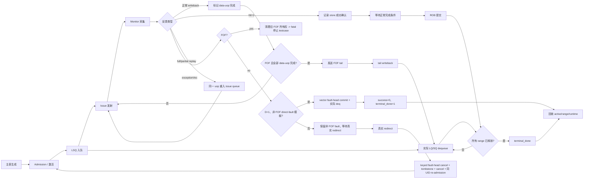

# V2 向量测试框架生命周期 Flow 描述文档

本文把向量测试框架从建表到回收的生命周期压缩成一份便于人工 review 的自然语言说明。

**规划期定位：** 本文是独立的 `flow 描述文档`，是同一设计/plan 的人工 review 摘要，不是 coding 完成后的
现状总结，也不是后续 coding 的 `flow 逻辑文档`。它以自然语言抽象
Admission、LSQ 入队、Issue、Monitor/Recovery、Commit/Dequeue/Recycle 的端到端关系，帮助 review 者先判断
生命周期和决策是否闭合；它不重新定义 helper、接口逐字段赋值、队列实现、时钟边界或源码调用顺序。

对应的四份 `flow 逻辑文档` 才是后续 coding 和实现级 review 的详细依据：

- [Admission 与 LSQ 入队 Flow 逻辑文档](vector_admission_lsq_enqueue_flow.md)
- [Issue 发射 Flow 逻辑文档](vector_issue_flow.md)
- [Monitor、Writeback、Replay 与 Redirect Flow 逻辑文档](vector_monitor_recovery_flow.md)
- [ROB 提交、LSQ 出队与回收 Flow 逻辑文档](vector_commit_dequeue_recycle_flow.md)

本文不替代上述四份逻辑文档，也不新增实现级约束。规划 helper 可以在详细逻辑文档中以函数调用
形式出现，即使当前尚未实现；本文不负责把它们改写为已有源码调用。若本文与需求文档、生命周期决策记录或逻辑文档有差异，必须先
修正逻辑文档，再把相同结论回写到本文；不得以本文的简化表述直接指导 coding。

## 1. 术语与抽象功能说明

| 英文术语 | 当前 flow 中的中文含义 | 状态落点 | 典型场景 |
| --- | --- | --- | --- |
| `macro` | 一条主表中的向量宏指令，拥有一个统一 UID/ROB 项 | `main_table_by_uid[uid]`、`vec_table` | 一条 `vle` 被拆成多个 data-uop。 |
| `data-uop` | 真正进入普通 VLSU/LSQ 的向量子操作 | `vec_table.uop[i]`、`vec_runtime_table[uid].uop[i]` | `vuopIdx=0..D-1`。 |
| `active map` | 记录当前 ROB/LQ/SQ key 所属活动 UID 或向量 uop；ROB key 使用完整 `{flag,value}` 并先规范化 | `uid_by_active_rob`、vector range map | 所有事件先通过 map 定位，不能只用裸 ROB value。 |
| `owner` | 一个物理 key 当前归属的 UID/uop | active/range map | 归属冲突时不分配新 range。 |
| `batch` | 一个 service sample 内共同处理的 admission、event 或 dequeue 集合 | 各 flow 临时队列 | redirect-first 先处理 batch 中更老事件。 |
| `cursor` | 各阶段用于保持顺序的 UID/vuopIdx 位置 | `next_enq_vuopIdx`、`fof_next_vuopIdx`、ROB cursor | 资源不足或 FOF 前序未完成时不跳过 cursor。 |
| `FOF tail` | fault-only-first 指令最后仅写回 VL 的收尾 uop | `fof_tail_pending/issued/written_back/canceled` | 不进入普通 LSQ。 |
| `FOF scheduler owner` | 当前占用全局 FOF 串行屏障的 UID/动态 epoch | `active_fof_owner` | fault/redirect 时只释放匹配的旧实例。 |
| `activation` | 将 UID 从静态主表变成当前 ROB 中可运行实例 | `uid_by_active_rob`、`status.active` | 建立公共 owner。 |
| `reservation` | 向量 admission 为一个 range 保留物理 entry 的占用；分为 sample 前的 provisional reservation 和 sample 后的正式 owner | launch token、`vec_range_owner_by_lq/sq` | redirect 先撤销 provisional，再处理正式 range。 |
| `launch token` | launch 到 sample/promotion 之间保存预测 key、epoch、enqueue pointer 边界和自身 reservation delta 的暂存记录 | `vec_runtime_table[uid].uop[i].launch_token` | `visible=0` 取消先校验 pointer；失败保持 token/pointer/free count 不变，成功才撤销自身 delta。 |
| `promotion` | DUT sample 确认后把 launch token 原子提升为正式 range owner | vector admission helper | promotion 后才按 remaining entry 计 cancel。 |
| `cancel record` | redirect 后记录正式 range 尚未释放的 LQ/SQ 数量，并等待软件 pointer/free-count 回退完成 | `redirect_cancel_record_ref`、`cancel_record_q` | 非零记录必须 `software_applied=1` 后才能 re-admission。 |
| `redirect LSQ transition` | 一个 redirect 对共享 LQ/SQ pointer、free count 与 aggregate cancel record 的唯一串行段 | `redirect_epoch` writer gate | 其它 admission/dequeue/cancel batch 暂存，不能与本 redirect 交叉写 LSQ mirror。 |
| `resource drain fence` | redirect 取消前的已采样 deq 资源边界 | `redirect_lsq_sample_seq` 与 deq batch `sample_seq` | 边界以前先减 remaining，随后 cancel 只回退剩余 entry。 |
| `deq sample_seq` | ctrl monitor 捕获 deq 时固化的 DUT sample 序号 | raw ctrl/deferred queue envelope | 不能用 `$time` 的 `cycle` 或消费时刻重新推导。 |
| `dequeue provenance` | deferred raw deq 的采样身份和冻结物理 key | `{capture_order,sample_seq,lq_keys[],sq_keys[]}` | V2 SQ 重放时不从当前 `sq_deq_ptr` 重新展开。 |
| `STALE_DROP` | gate 后 raw deq 某一完整 LQ/SQ domain 逐 key 命中本 redirect 覆盖旧 owner 的 matching tombstone | provenance classifier | 可跨多个 covered UID；消费 raw 但不再释放资源或触发终态。 |
| `covered UID set` | 当前 redirect 覆盖、资源排空时禁止进入 terminal/recycle 的 UID 集合 | `redirect_transition_plan.covered_uid_set` | 不等 `flushed` 置位才识别旧实例。 |
| `issue queue` | 等待发送到两个 `issueVldu` lane 的轻量候选队列 | `vector_issue_q[0/1]` | item 保存 UID、`dynamic_epoch`、vuopIdx、队列、优先级、replay 序号和 `kind`。 |
| `outstanding` | 某个 data-uop 已经被 DUT 接受、等待 writeback/feedback 的状态 | `issue_accepted` | 一次 uop 同时最多一个 outstanding。 |
| `feedback` | DUT 对 store merge 的成功或 replay 请求 | `vstuIqFeedback.feedbackSlow` | `hit=0` 触发 full/partial replay。 |
| `writeback event` | 当前 standalone 交接中 `writebackVldu.valid=1` 的采样事件 | `writebackVldu.valid/bits` | 当前接口没有独立 ready；未来新增 ready 后再定义 fire。 |
| `epoch` | 动态实例版本号，用于区分 redirect 前后的同一 UID；可变真源是公共 `status_by_uid[uid].dynamic_epoch` | 公共 status；runtime 仅镜像，队列/tombstone 保存快照 | 同 UID re-admission 时只递增一次。 |
| `fault head` | 已发出异常 commit、等待真实 range deq 和异常终态的当前 ROB head | `fault_head_waiting/kind/uid/epoch` | D=1 vector direct-fault 暂时阻塞更年轻 commit。 |
| `tagged fault-head sync` | 按 `SCALAR/VECTOR` 类别收敛 fault token 和 ROB cursor 的公共同步 | 扩展 `sync_modeled_head_after_fault_terminal()` | VECTOR 的 `issue_killed=1` 不单独解除 token。 |
| `tombstone` | 旧实例 owner 删除后短期保留的失效索引 | `vec_tombstone_by_rob/sq` | 吸收 redirect 或延迟 feedback。 |
| `terminal_done` | 一个宏指令已完成 ROB、LSQ 和可观察向量工作，可回收 | `status_by_uid[uid]` | 推进 terminal prefix。 |
| `canAccept guard` | admission 发送前对两侧 LSQ 计数和 width 保留量的预检 | `lsq_ctrl_model` + pending token | 不是简单的 `free_count >= F`。 |
| `dequeue token` | 一个实际物理 LQ/SQ entry 的出队事实 | batch 临时列表 | 携带 domain、key、uid、vuopIdx。 |
| `domain split` | raw monitor event 在 scalar normalization 前的标量/向量/redirect 分流 | monitor batch 临时列表 | vector event 不进入 scalar normalizer。 |

本文后续把“同一宏指令”简称为 macro，把真正送入 `issueVldu` 的普通子操作称为 data-uop。`D` 表示 data-uop 数量，`F` 表示每个 data-uop 预留的最大 LSQ/flow 数；FOF tail 不属于 `D` 或普通 `uop[]`。

## 2. 总体生命周期图



### 2.1 总体生命周期文字说明

```text
1. 主表生成：
   先生成统一 UID 和向量静态表；根据 v_mode、v_form、SEW、EEW、LMUL 派生 D/F；建立 D 个连续 vuopIdx。
   src_0~src_4、uop.vpu 和每个 uop 的专有字段在此固定，后续 replay 不重新随机。

2. Admission / 激活：
   激活阶段先建立统一 ROB owner；向量 admission 按 vuopIdx 顺序、每拍最多一个 data-uop 发送 enqLsq，并复用全局
   单深度 `pending_sample_valid`：任何 vector `visible=0` token 存在时，所有 scalar/vector allocation 都等待。
   launch 先建立 `visible=0` provisional token；下一 sample 确认 DUT 已采样后，才 promotion 并提交真实 LQ/SQ 起点和
   每个物理 entry 的 owner；发送前还必须通过 V2
   `canAccept` guard（本拍需求加 `LSQLdEnqWidth/LSQStEnqWidth` 保留量），并联合检查 scalar/vector owner
   和未过期 tombstone。
   若 redirect 在 sample 前取消 provisional token，公共 coordinator 先按 `redirect_lsq_sample_seq` 排空完整 raw deq
   batch：边界以前的 deq 只结算实际资源，不允许覆盖 UID 进入 terminal/recycle。资源排空后再取得按 redirect_epoch
   标记的 LSQ writer gate，在 gate 内校验 enqueue pointer 是否仍等于 token.after；校验失败时保持 token、pointer 和
   free count 原样并 fatal。
   每个 raw deq 在 monitor capture 时必须携带不可变 `sample_seq` 和冻结的 LQ/SQ physical key；当前 `cycle=$time` 仅供
   日志，不能作为该栅栏的比较依据。V2 count-only SQ 用 deferred FIFO 的 shadow head 在 capture 时展开 key，重试时不使用
   当前 `sq_deq_ptr`。deferred queue 重试仍使用原 `sample_seq`/key，不能重新打标或重算。
   gate 暂时不可取得或有更早 pending cancel record 时，只保留 redirect freeze 和 raw batch，等待后重试；不把这类合法
   竞争误报为错误。gate 覆盖 provisional token 取消、全部 UID 的正式 owner 计数、完整 aggregate cancel record 的软件
   回退和 redirect 状态提交；期间其它 admission、dequeue 或 cancel batch 均暂存。gate 释放后，缓存 deq 先按冻结 key
   做 provenance 分类：整侧 domain 全部命中 live owner 才正常提交；整侧逐 key 全部命中当前 redirect、且每项旧 UID 均在
   covered set 的 matching tombstone 则 `STALE_DROP`（可跨多个被覆盖 UID），只消费 raw 而不释放资源；live/tombstone
   混合、空 owner 或 epoch/cut line 不匹配均 fatal。两侧都 live
   仍联合提交；一侧 stale、一侧 live 仅提交 live 侧。tombstone 必须保留到该 gate-owned deferred FIFO 段消费完毕，之后才
   能复用 key；此期间所有 scalar/vector admission 都把它当作物理 key quarantine，命中则暂不分配。`STALE_DROP` 不推进真实 SQ head；后续 SQ live envelope 的冻结起点必须仍匹配真实 head，否则初版 fatal，
   不用 shadow cursor 覆盖真实状态。成功后才回退 pointer、加回自身 reservation、删除 token，并在 aggregate record
   software_applied 后释放 gate。
   D 个 data-uop 全部入队后，才把 macro 放入 vector issue queue；FOF tail 不在此阶段入队。

3. Issue 发射：
   scheduler 从固定的两个 vector issue queue 选择候选，先检查 active、enq、replay 和 FOF barrier，再按 priority
   选择。普通 uop 遵守 valid/ready 保持；FOF data-uop 和 tail 只在 ready=1 时发出单拍 valid。
   DATA candidate 和 fire 前都必须确认公共 `status_by_uid[uid].issue_killed=0`；被 fault/redirect kill 的旧 item
   即使残留在 queue 也不能再次 fire。
   每拍还先全局仲裁至多一个 FOF 发送保留位，防止两个 lane 在尚未建立 active FOF 的首拍同时发送 isVleff。
   fire 后建立该 uop 的唯一 outstanding，等待 monitor 结果。
   `VL=0`、全 mask-off 或末尾 uop 无活动 flow 时也必须正常发射：内部活动数可为 0，但仍等待一次宏观 writeback，
   不把该 uop 提前标成 terminal，也不缩小 F 或释放 LSQ range。

4. Monitor 与恢复：
   monitor 只采集 raw vector output；统一 service 先做 domain split 和 redirect-first 仲裁，再把 vector 事件归一化为
   UID/vuopIdx，scalar 事件继续走原有 normalizer。
   当前 standalone writeback 只有 `valid/bits`，因此 `valid=1` 先形成一个 writeback event；随后根据
   `vlWen/vecWen/v0Wen`、FOF tail 状态和 `vuopIdx` 区分 data-uop 与 FOF tail。data-uop event 才结束一个
   data-uop；tail event 只更新宏级 tail 状态。若未来新增 ready，再把未 fire 的 payload 保持为 pending，不重复发布事件。
   store feedback 的 hit=1 只记录成功确认，hit=0 则把同一 uop 重新排队；但 macro 已处于 `fault_pending=1` 或
   公共 `status.issue_killed=1` 时，feedback 只能按 redirect tombstone 丢弃，不能新建 replay；迟到的正常 WB 也不得
   标 terminal 或推进 FOF cursor，命中 redirect tombstone 时按旧事件丢弃。
   replay 不新建 UID、ROB 或 LSQ range；`exceptionVec` 对 D=1、非 FOF 专用模板进入 vector fault-head 并以
   `success=0` 收尾；不在该模板内的 multi-uop 非 FOF fault 保留 fault 并等待真实 redirect，FOF fault 则先 kill 旧 issue
   所有权、置 `fof_tail_canceled=1` 后报告 fatal，不继续等待或重发。redirect 覆盖已记录的 vector fault 时，先删除
   匹配 `{uid,old_dynamic_epoch}` 的 pending-fault record；若 shared fault-head 也匹配
   `{kind=VECTOR,uid,old_dynamic_epoch}` 再清 token，随后递增公共 epoch；re-admission 前仍需确认该旧 token 已不存在；
   scalar fault-head 不受影响。
   D=1 vector fault 为停止旧 issue 可以使 `issue_killed=1`；这不等价 redirect，tagged fault-head sync 仍必须等待
   真实 range deq 和 `success=0` terminal。只有 epoch stale、flush/redirect 或 keyed cancel 才能提前解除该 VECTOR token。

5. FOF 收尾：
   FOF data-uop 必须按 `fof_next_vuopIdx` 串行执行，前一个 data-uop 正常 writeback 后才递增并开放下一个。
   全部 data-uop 正常完成后动态构造唯一 tail；tail 不占普通 LSQ，tail writeback 只更新宏级收尾状态。
   tail 只有在 `fof_next_vuopIdx == D` 且 `pending && !issued && !written_back && !canceled` 时可选；tail fire 使用独立宏级 helper，不能
   索引 `uop[0]`。若 FOF data-uop 出现 `exceptionVec`，先清理旧 issue/FOF owner，随后按初版 unsupported-fault
   policy 报告 fatal 并停止 testcase，不留下悬挂的 FOF barrier。

6. ROB 提交与 LSQ 出队：
   公共 ROB cursor 只能提交当前最老且满足条件的 macro；向量不调用 scalar target 完成判断，也不伪造 scalar scommit。
   采到实际 lqDeq/sqDeq 后，为每个物理 key 保存 `{domain,key,uid,vuopIdx}` dequeue token，先联合预检整批物理
   key，再一次性按域删除 owner、递减 remaining 和推进软件指针。

7. terminal_done / 回收：
   只有 ROB 已提交、所有 data-uop（以及 FOF tail）完成、无 replay/fault/redirect pending 且所有 LQ/SQ range 清零时，
   vector terminal helper 才写 success=1、terminal_done=1。随后删除 active map、queue、range map 和 runtime；回收前为
   已完成 SQ range 保留短期 success tombstone。
```

## 3. 各阶段的抽象职责

### 3.1 Admission / 激活

Admission 负责把静态向量表转成 DUT 可以采样的入队请求。它与标量共享 UID、ROB cursor 和公共状态，但向量使用自己的 `vec_range_owner_by_lq/sq`，不把多个 data-uop 压成一个 scalar entry。

核心不变量：

- activation 时以完整 `rob_key={flag,value}` 建立 `uid_by_active_rob[rob_order_util::rob_to_map_key(rob_key)]`，并且一个 ROB 只对应一个 UID。
- `vuopIdx` 连续为 `0..D-1`；FOF tail 不占数组槽位。
- `numLsElem == flowNum == F` 是每个 data-uop 的保守预留数量，不能按最后一个 uop 的实际 VL 缩小。
- `enqLsq` launch 后要等下一 sample 确认并 promotion，才记录真实 range；资源不足时保持 admission cursor，不随机改写源字段。

详细实现见 [vector_admission_lsq_enqueue_flow.md](vector_admission_lsq_enqueue_flow.md)。

### 3.2 Issue 发射

Issue queue 只保存轻量索引，完整 payload 在发射时从主表和 runtime 组装。普通 data-uop 的 valid/ready 采用稳定 payload 语义；FOF 由于 tail/barrier 约束采用 ready 门控的单拍 valid。

同一 macro 内 priority 相同或 priority 功能关闭时，使用较小 `vuopIdx` 作为 tie-break。`indexed_unordered` 与 `indexed_ordered` 的语义差异由 DUT 解释，测试框架不强行模拟元素内部排序。

详细实现见 [vector_issue_flow.md](vector_issue_flow.md)。

### 3.3 Monitor 采集、正常完成、异常和 replay

Monitor 不直接修改生命周期表。它先发布 raw event，由统一 service 在 redirect-first 仲裁后完成 owner 定位和状态更新。

定位规则：

- writeback 使用 DUT 的 `robIdx` 字段（在框架中解释为完整 `rob_key={flag,value}`）加 `vuopIdx`；FOF tail 通过
  `vlWen/pdest/rob_key` 和已发 tail 状态识别。
- store feedback 只使用 `sqIdx`，不能用可能为零的 `lqIdx` 作为 fallback。
- full replay 和 partial replay 都重用原 UID、uop、range 和源数据；partial replay 只保存真实 mask/merge-buffer index。
- `hit=1` 不是 writeback 替代品，迟到时只记录成功确认。

详细实现见 [vector_monitor_recovery_flow.md](vector_monitor_recovery_flow.md)。

### 3.4 ROB 提交、LSQ 出队和回收

ROB 提交只决定顺序，不代替 LSQ 消费。向量 macro 必须到达公共 ROB head，且所有可观察工作完成后才可以提交；实际 LQ/SQ dequeue 仍以 DUT sideband 为准。

向量出队采用“两阶段”规则：先把本拍 LQ/SQ 事件展开成完整 key 集合并联合预检，全部通过后再修改任何 map、pointer 或 free count。这样可以避免一侧成功、一侧失败造成软件模型半释放。

详细实现见 [vector_commit_dequeue_recycle_flow.md](vector_commit_dequeue_recycle_flow.md)。

## 4. 关键场景摘要

| 场景 | 允许的状态路径 | 不允许的简化 |
| --- | --- | --- |
| 普通 load/store | admission -> issue -> writeback valid -> ROB commit -> deq -> terminal | writeback 后立即释放 LSQ。 |
| `VL=0` 或全 mask-off | 仍按 F 保留 range，issue 后等待正常 merge-buffer/writeback，再按普通路径收尾 | 以活动元素数为 0 为由提前释放 range 或跳过 uop。 |
| 资源不足 | 保持 admission/issue cursor，等待 free count 或 ready | 为了推进而缩小 `F` 或丢弃 uop。 |
| store `hit=0` full replay | 原 uop 清 outstanding，重入原 issue queue | 新建 UID、重新 enqLsq 或重新随机 source。 |
| store `hit=0` partial replay | 保存 mask/MB index，原 uop 重发 | 把 partial mask 当新的 flowNum。 |
| store `hit=1` | 记录确认，可晚于 writeback | 把它当第二次完成或重复 error。 |
| FOF | data-uop 串行 WB -> tail -> tail WB -> commit/deq | 只凭 issue handshake 发 tail、重复发送已 issued tail，或按 VL 猜 suppressed。 |
| 单 uop真实 fault | exceptionVec -> vector fault-head commit -> 实际 deq -> `success=0` terminal/recycle | 自动伪造 redirect/replay。 |
| 不支持的 multi-uop fault | 保留 fault，等待真实 redirect -> tombstone/cancel/re-admission | 将未完成 uop 伪造成 terminal。 |
| FOF fault | kill 旧 issue/FOF owner -> 报告 fatal 并停止 testcase | 保留 active FOF lock 等待不会到来的 tail/redirect。 |
| 真实 redirect | keyed kill -> 删除旧 pending-fault record + keyed cancel vector fault-head -> tail/ROB/range tombstone -> 删除旧 active owner -> cancel 未释放 range -> 保留 UID -> 同 UID re-admission | 标成 terminal、保留旧 active map 或分配新 UID。 |
| 迟到 feedback | tombstone 命中则 drop；success tombstone 的 `hit=1` 只记录 | 让旧 event 命中新动态实例。 |

## 5. 五项设计准则的落地检查

1. **简单且兼容标量：** 向量只在统一 UID、admission 分派、monitor 分派和 commit/deq 分派处增加专用分支；标量 queue、target 和 replay 规则保持原样。
2. **以需求文档为准：** `vec_static` 保存共享字段，`vec_uop[]` 保存专有字段，`src_4[7:0]=VL` 且 `[127:8]=0`；当前普通 profile 筛除不可由顶层接口驱动的非法 VTYPE。
3. **控制参数适度：** 复用标量 redirect/commit/debug 开关；仅为向量 priority、lane 权重和已有地址/VTYPE 权重提供必要控制，不提供会制造非法握手的开关。
4. **面向 MemBlock 可见行为：** 不模拟每个 flow 的 TLB、DCache 或内部 retry，只验证 uop、LSQ range、地址/源字段、writeback、feedback、replay 和回收边界。
5. **决策可追溯：** 统一 UID、FOF 顺序、tombstone、count-only SQ、两阶段 dequeue、fault/redirect 分离等取舍记录在 [生命周期决策记录](../analysis/framework_design/向量测试框架生命周期决策记录_20260826.md)。

## 6. 最小验收清单

```text
[ ] 一个 vector UID 能在统一 active ROB map 中唯一定位，并且不影响 scalar UID。
[ ] D 个 data-uop 按连续 vuopIdx 入队，FOF tail 不分配普通 LSQ。
[ ] `enqLsq` sample/promotion 前不写入假的 lq/sq owner；资源不足时 cursor 停留。
[ ] `visible=0` vector token 期间全局不再 launch scalar/vector allocation；redirect 回退只在 redirect_epoch writer gate 内执行。
[ ] 普通 issue 在 ready=0 时保持 payload；FOF data/tail 只在 ready=1 发送单拍 valid。
[ ] writeback、store feedback、replay、redirect 均不会生成新的 UID/range。
[ ] `hit=1` 迟到反馈可被 success tombstone 吸收；旧 redirect event 不会命中新实例。
[ ] ROB commit 与 LSQ dequeue 分离；联合预检失败时不发生部分释放。
[ ] redirect 在统计 cancel 前已排空 `redirect_lsq_sample_seq` 及更早的完整 raw deq batch；该 drain 不会使覆盖 UID terminal/recycle。
[ ] redirect aggregate cancel record 在全部 scalar/vector 覆盖 UID 计数 finalized 后只应用一次；gate 期间 raw dequeue/cancel batch 被保留而非丢弃。
[ ] deferred raw deq 在 capture 时冻结 `sample_seq` 与物理 key；gate 后整侧 matching redirect tombstone 只能 `STALE_DROP`，不推进 pointer/free count；混合/不匹配 provenance 必须 fatal。
[ ] terminal_done 只由 vector helper 在全部条件满足时显式写入，回收后旧 event 不复活 UID。
```

## 7. 对应 Flow 逻辑文档索引

- [Admission 与 LSQ 入队 Flow 逻辑文档](vector_admission_lsq_enqueue_flow.md)
- [Issue 发射 Flow 逻辑文档](vector_issue_flow.md)
- [Monitor、Writeback、Replay 与 Redirect Flow 逻辑文档](vector_monitor_recovery_flow.md)
- [ROB 提交、LSQ 出队与回收 Flow 逻辑文档](vector_commit_dequeue_recycle_flow.md)
- [生命周期决策记录](../analysis/framework_design/向量测试框架生命周期决策记录_20260826.md)
